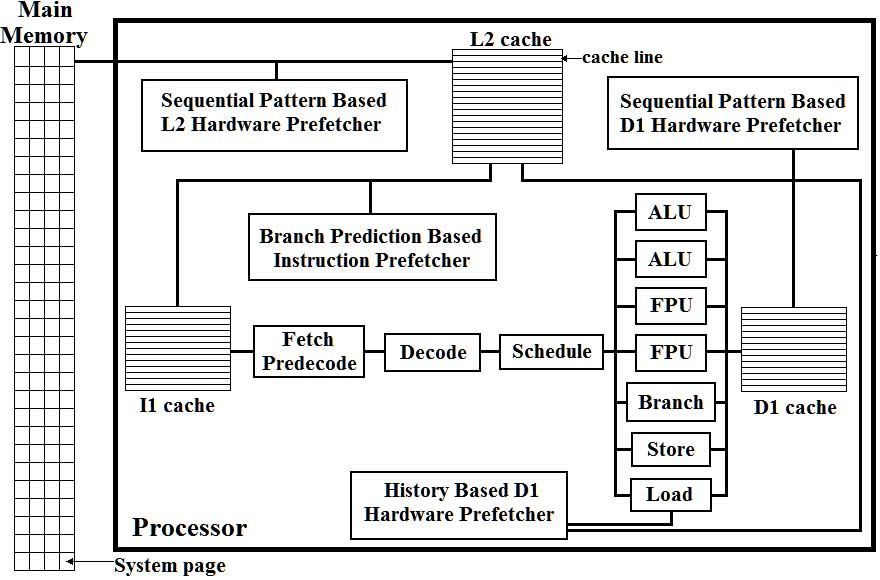
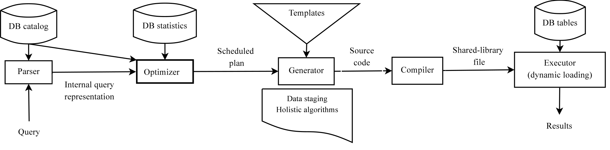
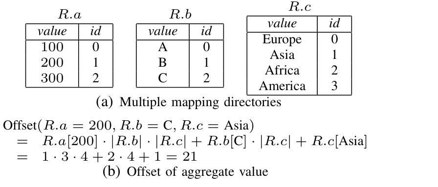
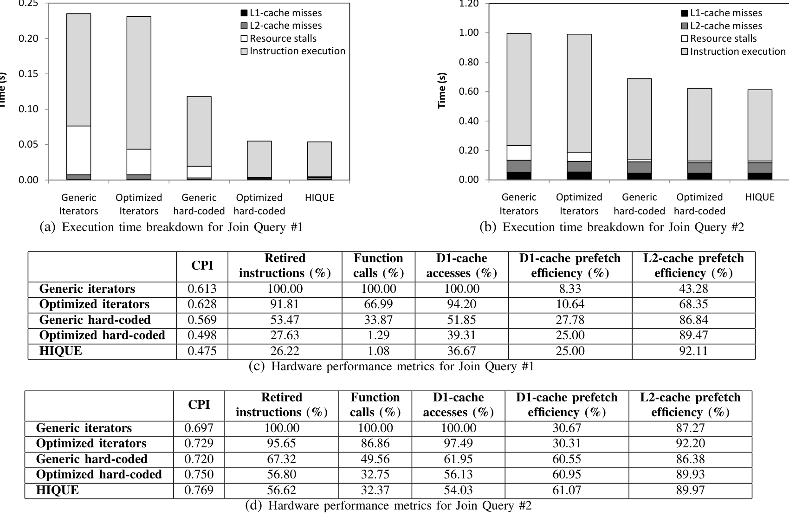
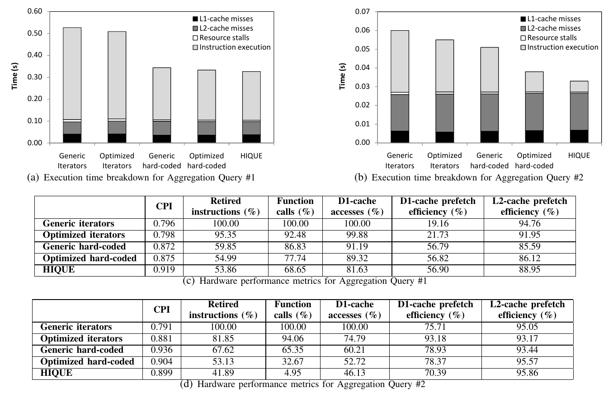
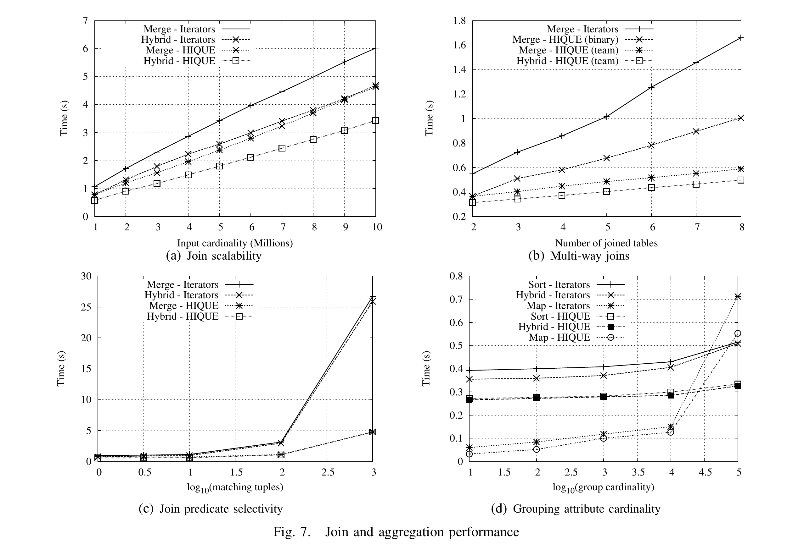
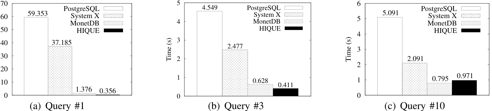

# Generating code for holistic query evaluation（中文译文）

## 译者说明

本文依据同目录的 `source.pdf` 翻译。章节、图表、公式、算法、代码与参考文献按原文结构保留。

## 摘要

本文介绍定制化代码生成在数据库查询求值中的应用。核心思想是使用一组高效代码模板，并在运行时实例化这些模板，生成面向查询和硬件的源代码。生成的源代码被编译并动态链接到数据库服务器中执行。代码生成消除了当前通用解释式 SQL 查询引擎中实现高层抽象所带来的膨胀，同时生成代码还能针对运行硬件进行定制。我们称这种方法为整体查询求值（holistic query evaluation）。论文提出原型系统 HIQUE，即 Holistic Integrated Query Engine，并对系统性能进行详细实验。结果表明，HIQUE 达到了设计目标，效率超过了成熟和新兴的查询处理技术。

## I. 引言

本文把定制代码生成用于高效数据库查询处理。方法源自 template-based programming：系统为各种查询处理算法准备代码模板，在运行时根据查询计划、数据类型和硬件特征实例化模板，并把它们组合成一段执行完整查询的源代码。

动态模板实例化可以消除通用查询执行器中大量抽象开销。传统引擎为了支持任意查询、任意类型和任意算子组合，需要使用函数指针、虚调用、解释器状态和通用数据结构。对一个具体查询而言，这些灵活性大多已经不需要。生成专用代码可以把运行时已知的信息变成编译时常量。

我们称其为 holistic query evaluation，是因为系统同时考虑完整查询和目标硬件，而不是逐个算子局部优化。查询中的多个算子可以被整体组织，减少中间结果、函数调用和分支。主存执行上的优势可非常大：TPC-H Q1 相对成熟数据库技术达到 167 倍。我们的核心主张是，模板代码生成可以泛化到任意查询类型，而不改变存储、并发控制等正交模块。

传统查询算法优先减少磁盘 I/O；当现代服务器能把大部分甚至整个数据库放入内存，寄存器与主存的延迟差成为瓶颈。已有研究把问题归因于数据布局，但重做 storage layer 会连带影响并发控制等系统部分。本文把更根本的问题定位为“SQL 编译为算子计划”及其通用 iterator 接口：抽象和频繁函数调用膨胀指令、内存访问，通用代码也不能按查询和硬件专用化。

整体求值在传统流程中插入源代码生成：从整个查询出发，生成查询/硬件专用 C，编译后执行。收益包括最少函数调用、更强数据局部性、让编译器在传统查询优化之上执行每查询的额外优化、接近手写计划，同时仍保持存储和并发控制模块独立。

我们据此实现了整体查询引擎 HIQUE，并把它与 iterator 方案及既有数据库系统比较。实验一方面量化每查询代码生成相对通用查询算子的优势，另一方面表明整体方法在一组 TPC-H 查询上优于 iterator 和硬件感知系统，因而可以作为另一种查询引擎设计。论文余下部分依次介绍处理器、编译器与传统执行模型背景，回顾相关工作，说明 HIQUE 的设计与代码生成算法，给出实验结果，最后总结并讨论后续方向。

## II. 背景

### A. 硬件概览

现代 CPU 通过流水线、超标量和乱序执行并行处理多条指令。乱序执行可让等待数据的指令暂时让位，但数据库常有连续内存请求与长数据/控制依赖链，能隐藏的 stall 有限。多级 cache 用固定长度 cache line 缓解主存延迟：L1 最小最快并分 I1/D1，L2 更大较慢，部分处理器还有 L3；它们利用时间和空间局部性。Non-blocking cache 可维持多个未完成请求，但 data-intensive workload 很快令控制器饱和，剩余 cache miss 成为瓶颈。

硬件 prefetcher 监控访问地址，识别顺序流和 stride。我们在 1.86 GHz Core 2 Duo 6300 上测得：D1 顺序/随机访问均为 3 cycles；L2 顺序 9、随机 14 cycles；主存顺序 28、随机至少 77 cycles。因而随机访问应尽量限制在 D1，跨更低层级时顺序性至关重要。



图 1：现代 CPU 的取指、调度、执行单元、cache 层次与多个硬件预取器。

### B. Iterator 的缺点

大多数引擎用 `open()` 初始化、`get_next()` 逐 tuple 传播、`close()` 清理，形成 pipeline operator tree。每条 tuple 至少触发 caller 请求和 callee 返回两次调用；为动态绑定类型，字段访问和比较也可能是 virtual call。调用要更新 stack pointer、保存/恢复数十个寄存器，还会跳转到新 instruction stream，限制 superscalar execution。

每个 iterator 还维护内部状态，反复读写可能引发 cache miss，并打断本应顺序的数据流，削弱 prefetcher。不同算子独立控制访问，pipeline 中多个 working set 可能互相驱逐，导致 cache thrashing。

### C. 编译器优化

编译器可通过调度独立指令、寄存器重用、聚合同一数据的访问来减少 stall。但 iterator 的跨函数控制流阻止它看见完整循环；跨过程分析弱于过程内分析，函数调用中的条件和 jump 又缩小可联合优化的范围。谓词类型、tuple offset 等直到运行时才知道，也使常量传播、内联和地址计算专用化无法充分应用。

## III. 相关工作

早期硬件计数器研究已表明处理器并不适合数据库访问模式，并提出 cache-conscious join。NSM 在只访问少数字段时浪费带宽，DSM 以垂直分区改善数组计算，却要求重写算子并影响并发控制；PAX 在页内垂直分区，折中保留 tuple-level 接口。

在 iterator 范式内，buffer operator 把算子间粒度提升为 tuple block，减少 pipeline 调用，却没有减少算子内部求值函数；block-oriented aggregation 可共享表达式并用 array computation。MonetDB 用 DSM 和完整数组物化，仍是 operator-based 且失去跨算子 cache reuse；MonetDB/X100 结合列存与 compound vectorized primitive，达到接近手写实现的性能。

软件 prefetch 可改善 hash join，但合适距离依赖频率、cache 延迟和运行负载；太近来不及，太远污染 cache，且控制器可忽略 hint。HIQUE 因此不采用它。System R 已使用原始代码生成；Daytona 动态生成查询代码，却把 buffer/concurrency 等交给 OS；JVM 查询编译原型仍用 iterator 通信，仅消除 iterator 内 virtual function，join 也依赖预建索引。

## IV. 系统概览

HIQUE（Holistic Integrated Query Engine）用 C/C++ 实现，在 GNU/Linux 上由 GCC 编译，采用多客户端的传统 client-server 模型。

#### 存储层

原型使用 NSM，tuple 连续存入 4096-byte page，每表一文件；storage manager 保存 table/file 和 schema，LRU buffer manager 负责 page buffer 与 concurrency control。索引使用 fractal B+-tree，每个物理页切成四个 1024-byte node。整体求值不绑定 NSM，DSM/PAX 也可替换。

#### 查询处理

- 生成针对具体查询的高效代码。
- 利用编译器优化，把类型、谓词、投影和连接逻辑专用化。
- 支持硬件相关优化，例如 cache、寄存器和编译器优化级别。
- 保持数据库系统所需的 SQL 表达能力和运行时集成。

与传统 iterator 模型相比，HIQUE 不是把查询计划解释执行，而是把计划转成代码模板的组合。与手写查询程序相比，HIQUE 保留了 SQL 和优化器入口。

SQL grammar 支持带 equi-join 的合取查询、任意 grouping/sort，不支持统计 aggregate 和 nested query；我们认为两者是直接扩展。Parser 结合 catalog 验证后输出内部表示；greedy optimizer 以最小化中间结果为目标，选择每算子算法并设置模板参数。

优化器输出拓扑有序 descriptor 列表 `O`。每个 `o_i` 的输入为 base table 或 `o_j (j<i)` 输出，记录算法、输入、schema 和模板参数。顺序先放 join，再放最多一个 aggregation 和 sorting；optimizer 跟踪 interesting order 与 join team，避免重复排序。

每算子分两步生成。Data staging 扫描输入、应用 selection、丢弃不用字段，并把 sorting/partitioning 等预处理交织进 scan，再把结果物化到内存。Holistic algorithm instantiation 随后生成算子主体。Generator 根据数据依赖组合所有函数为最终 query function，写入 C 文件；compiler 生成 shared library，executor 动态链接、调用并把结果送回 client。

生成的代码被交给 C/C++ 编译器。编译产物以动态库形式加载到数据库进程中，然后由执行器调用。因为生成的是普通源代码，HIQUE 可以利用成熟编译器的优化能力，包括内联、常量传播、循环优化和寄存器分配。



图 2 展示 HIQUE 的端到端路径：Parser 结合 DB catalog 产生内部查询表示，Optimizer 结合 DB statistics 输出 scheduled plan，Generator 根据 templates、data staging 和 holistic algorithms 生成 source code，再由 compiler 生成 shared-library file，Executor 动态加载并在 DB tables 上执行。

#### 模板组合

每个模板对应一个查询处理片段，但最终代码不是简单把算子函数串起来。系统会把相邻算子合并到同一控制流中，避免每个元组跨越多个通用接口。模板中保留可替换的洞，例如类型、列偏移、比较操作和聚合函数；实例化后这些洞变成静态代码。

#### 查询与硬件专用化

因为代码在目标机器上生成，系统可以选择编译器优化参数，并让编译器针对实际 CPU 生成代码。

论文强调，在内存执行中，硬件细节会显著影响性能：cache 层次、分支预测和寄存器压力都可能决定查询速度。

专用化不只替换常量。Generator 还根据 tuple 宽度、输入 cardinality、distinct value 数量和 cache 容量选择 partition 大小、排序方式与聚合目录。相同关系算子在不同数据特征下可以实例化为 merge、fine-partition、hybrid hash-sort 或 map 版本。硬件参数因此进入物理算法选择，而不只是交给编译器做最后的指令调度。

## V. 代码生成

### A. 实现

生成代码把 SQL 语义映射到低层循环和数据结构操作。选择谓词被编译为直接条件判断，投影被编译为表达式计算，连接使用专门哈希表或嵌套循环模板，聚合使用专门状态结构。

对于 TPC-H 这样的分析查询，很多运行时决策都可静态化：列类型已知，谓词常量已知，输出列已知，聚合函数已知。HIQUE 借此减少解释成本。

图 3 给出代码生成算法。输入是按拓扑顺序排列的 operator 列表 `O`；输出是包含 query-specific C source 的文件。算法先为 join、aggregation、sort 等 staging 操作生成输入代码，再为每个 join、aggregation 和 sort 实例化相应模板，最后把所有函数输出到新的 source file。

**图 3：代码生成算法。**

```text
Input:
  1. Topologically sorted list of operators O.
  2. Code templates for data staging (TS),
     join evaluation (TJ), and aggregation (TA).

Output:
  Query-specific C source file.

1.  for each join operator j_m in O
2.    retrieve code template ts_m in TS to stage j_m's inputs
3.    for each input i_n of j_m
4.      instantiate ts_m for i_n
5.      generate C function c_ts,m,n for staging i_n
6.    retrieve code template t_jm in TJ for j_m's algorithm
7.    instantiate t_jm for j_m
8.    generate C function c_jm to evaluate join
9.  if aggregate operator a in O
10.   retrieve code template ts_a in TS to stage a's input
11.   instantiate ts_a for a
12.   generate C function c_ts,a for staging a
13.   retrieve code template t_a in TA for a's algorithm
14.   instantiate t_a for a
15.   generate C function c_a to compute aggregate values
16. if ordering operator s in O
17.   retrieve code template ts_s in TS for sorting
18.   instantiate ts_s and generate C function c_s
19. traverse O to compose the function cm calling all functions
20. for all generated functions c, write source file F
21. return F
```

Descriptor 同时带有 predicate 类型、base/intermediate input 和 output schema。生成器先处理 join（第 1-8 行），再处理 aggregation（9-15）与 ordering（16-18）；每个算子分别生成各输入的 staging function 与算法 function。最后 composing function 按 `O` 连接调用、分配/释放资源并输出结果。

### B. 算法与代码模板

查询级已知的类型让字段访问与谓词从函数调用退化为 pointer cast 和 primitive comparison；定长 tuple 可在页内用 pointer arithmetic 当作数组。模板按 D1/L2 大小分块，尽量对 cache-resident data 做多项操作，并让随机访问只出现在 D1。

原文 Listing 1 给出优化后的 scan-select 模板：

**代码清单 1：优化后的 table scan-select。**

```c
// loop over pages
for (int p = start_page; p <= end_page; p++) {
  page_str *page = read_page(p, table);
  // loop over tuples
  for (int t = 0; t < page->num_tuples; t++) {
    void *tuple = page->data + t * tuple_size;
    int *value = tuple + predicate_offset;
    if (*value != predicate_value) continue;
    add_to_result(tuple); // inlined
  }
}
```

Listing 1 只保留不可避免的 page load 与结果输出调用；inner loop 直接求地址、读取整数、比较并内联输出。数组形式既减少指令，也让 superscalar CPU 暴露更多独立操作，且编译器可跨循环分配寄存器。

原文 Listing 2 给出 join evaluation 的 nested-loops 模板：

**代码清单 2：用于 join evaluation 的 nested-loops 模板。**

```c
/* Inlined code to hash-partition or sort inputs */

hash join:
for (k = 0; k < M; k++) {
  // update page bounds for both k-th partitions

hybrid hash-sort-merge join:
  // sort partitions

  for (p_1 = start_page_1; p_1 <= end_page_1; p_1++) {
    page_str *page_1 = read_page(p_1, partition_1[k]);
    for (p_2 = start_page_2; p_2 <= end_page_2; p_2++) {
      page_str *page_2 = read_page(p_2, partition_2[k]);
      for (t_1 = 0; t_1 < page_1->num_tuples; t_1++) {
        void *tuple_1 = page_1->data + t_1 * tuple_size_1;
        for (t_2 = 0; t_2 < page_2->num_tuples; t_2++) {
          void *tuple_2 = page_2->data + t_2 * tuple_size_2;
          int *value_1 = tuple_1 + offset_1;
          int *value_2 = tuple_2 + offset_2;
          if (*value_1 != *value_2) {
            // merge join: update bounds for all loops
            continue;
          }
          add_to_result(tuple_1, tuple_2); // inlined
        }
      }
    }
  }
}
```

#### 输入 staging

排序先对适合 L2 的 partition 做优化 quicksort 再 merge。Fine partition 用有序 value directory 和 binary search 映射到分区，适合 distinct value 少、目录能驻 cache；目录太大时改用 hash/modulo 的 coarse partition。粗分区包含多个 value，可再排序形成 hybrid hash-sort；若最大 partition 能放入 L2，后续处理复用效果好。

Staging 在扫描输入的同一遍中完成 selection、丢弃后续不需要的属性，并把剩余 tuple 写入目标分区或排序缓冲，避免先生成完整中间关系再二次整理。分区粒度由 cache 决定：fine partition 让同分区 tuple 直接满足 join 条件，但 value directory 必须足够小；coarse partition 降低目录成本，却需要在分区内部继续比较或排序。优化器在两种开销之间选择。

#### Join

所有 join 共用 Listing 2 的 nested-loop 骨架，区别主要由 staging 决定。Merge join 预排序后线性扫描，condition state 控制无匹配、继续当前 inner match group、推进 outer 并回溯匹配组。小匹配组通常仍驻 D1/L2。

Partition join 先细/粗分为 `M` 对应 partition。Fine partition 的对应 tuple 全匹配；coarse partition 不建随机访问 hash table，而是临时排序对应分区，再 merge，形成 hybrid hash-sort-merge。若每对分区小于 L2 一半，在 join 前才排序可确保两侧同时驻 L2。

传统 hash join 在 probe 时随机访问 bucket 和 collision chain；HIQUE 的 hybrid 方案刻意把随机访问限制在较小目录，把实际 tuple 处理转成 cache-resident partition 内的顺序排序和 merge。排序被推迟到某对 partition 即将 join 时，使刚排好的两侧仍留在 L2。这个安排解释了为何它在主存数据库中愿意付出局部排序成本。

Nested-loop 模板还能为 join team 增加 loop nesting，在多表公共 key 或 star schema 中不物化中间结果。各表先正确排序/分区，再按表顺序先生成 page loop、后生成 tuple loop，布局类似 loop blocking。

#### Aggregation

Sort aggregation 在线性扫描已排序输入时识别 group；hybrid aggregation 先按首个 group attribute hash partition，再按全部 group attribute 排序各分区。若所有 group directory 能驻 cache，map aggregation 无需 staging，只扫描一次。

Aggregation 使用 group directory 把多维 grouping key 映射为一维 aggregate array offset。图 4 的例子中，`R.a = 200`、`R.b = C`、`R.c = Asia` 对应 offset 为 `1 * 3 * 4 + 2 * 4 + 1 = 21`。



一般地，若 `M_i[v]` 是第 `i` 个属性值 `v` 的 id，group `(v_1,...,v_n)` 映射为：

$$
\mathrm{offset}(v_1,\ldots,v_n)=\sum _ {i=1}^{n}\left(M_i[v_i]\prod _ {j=i+1}^{n}|M_j|\right).
$$

每个 aggregate function 维护长度为 $\prod_i |M_i|$ 的数组。每条 tuple 查目录得到 offset，再更新对应 aggregate slot。Group 识别和 aggregate expression 都内联，编译器可复用寄存器、消除公共算术并避免 stack interaction。

Map aggregation 的代价是目录和稠密 aggregate array 可能随 distinct 值笛卡尔积迅速膨胀；只有当目录与数组能有效驻留 cache 时才适合。基数较高时，优化器改用 sort 或 hybrid aggregation，把工作限制在较小 partition。因而论文不是主张单一生成算法，而是让模板生成器按统计信息选择具有合适 cache 行为的整体算法。

### C. 开发经验

工程难点是抽取跨算法模板、在没有统一 runtime 接口时连接算子、验证所有生成组合。实践中 scan/staging 共用 Listing 1，join 共用 Listing 2，通过是否包含 partition/sort/bound update 片段切换算法；aggregation 则向 scan 模板注入 group tracking 和 aggregate。算子间仍可在 buffer pool 中把临时表流向后继。

加入新算法时，开发者先写模型实现并与模板比对，通常只有少数行不同，再扩展 generator。实际扩展 parser/optimizer 比 generator 更费力。输出普通 C 也让编译器成为生成代码的类型/语法检查器，加快定位错误。

这种工程方式也有代价：模板之间没有统一 iterator 接口，组合是否合法必须由 generator 保证；算法的每个结构变体都需要测试生成后的控制流。我们通过共享 scan 和 nested-loop 骨架，把差异限制为少量 partition、sort、边界更新和 aggregate 片段，避免为每个查询计划复制完整手写实现。

## VI. 实验研究

实验机器即表 I 的 Core 2 Duo 6300、2 GB DDR2；HIQUE 和各变体使用 GCC，硬件事件通过 OProfile 采集。研究分四部分：iterator 与 holistic code、算法随数据特征的变化、TPC-H、代码生成成本。

所有比较尽量复用相同 storage manager、buffer pool、tuple layout 和底层算法，避免把存储布局差异误归因于 code generation。微基准把运行时间进一步分成 staging 与核心求值，并同时观察 retired instructions、函数调用、cache access、CPI 和 prefetch efficiency；因此性能结论不仅来自 wall-clock 时间，也能定位抽象消除究竟改变了什么。

原文给出 Intel Core 2 Duo 6300 的硬件规格，并比较不同编译器优化级别、查询准备成本和执行时间。实验使用 TPC-H 查询及其他微基准，比较 HIQUE 与传统数据库和当时的新兴查询处理技术。

表 I 描述硬件配置。表 II 展示编译器优化级别对响应时间的影响：更高优化级别可能提升执行速度，但也增加准备时间。表 III 给出查询准备成本，说明生成代码路径必须在编译开销和执行收益之间平衡。

表 I 是实验机器的 Intel Core 2 Duo 6300 配置：

| 指标 | 数值 |
| --- | --- |
| Number of cores | 2 |
| Frequency | 1.86GHz |
| Cache line size | 64B |
| I1-cache | 32KB per core |
| D1-cache | 32KB per core |
| L2-cache | 2MB shared |
| L1-cache miss latency, sequential | 9 cycles |
| L1-cache miss latency, random | 14 cycles |
| L2-cache miss latency, sequential | 28 cycles |
| L2-cache miss latency, random | 77 cycles |
| RAM type | 2x1GB DDR2 667MHz |

### A. Iterator 与整体代码

为了隔离抽象开销，我们比较五种每查询单独编译的实现：generic iterator、把静态参数专用化的 optimized iterator、通用 hard-coded、内联 predicate 的 optimized hard-coded、HIQUE。Join Q1 用两个各 10,000 条、72-byte tuple 的表做 merge join，每 outer 匹配 1,000 inner；Join Q2 用两个各 1,000,000 条表做 hybrid join，每 outer 匹配 10 inner。Aggregation 均用 1,000,000 条、72-byte tuple 和两个 sum；100,000 group 用 hybrid，10 group 用 map。

HIQUE 显著快于传统系统的主要原因包括：

- 消除 iterator 和解释器开销。
- 让编译器跨算子内联并优化。
- 减少临时元组和中间结果。
- 为具体类型和谓词生成专用代码。
- 根据硬件优化生成的循环和内存访问。

表 II 给出不同实现和编译优化级别下的响应时间，单位为秒：

| Implementation | Join Q1 -O0 | Join Q1 -O2 | Join Q2 -O0 | Join Q2 -O2 | Agg Q1 -O0 | Agg Q1 -O2 | Agg Q2 -O0 | Agg Q2 -O2 |
| --- | ---: | ---: | ---: | ---: | ---: | ---: | ---: | ---: |
| Generic iterators | 0.802 | 0.235 | 1.953 | 0.995 | 1.225 | 0.527 | 0.136 | 0.060 |
| Optimized iterators | 0.618 | 0.231 | 1.850 | 0.990 | 1.199 | 0.509 | 0.113 | 0.055 |
| Generic hard-coded | 0.430 | 0.118 | 1.421 | 0.688 | 0.586 | 0.344 | 0.095 | 0.051 |
| Optimized hard-coded | 0.267 | 0.055 | 1.225 | 0.622 | 0.554 | 0.333 | 0.080 | 0.038 |
| HIQUE | 0.178 | 0.054 | 1.138 | 0.613 | 0.543 | 0.326 | 0.070 | 0.033 |



图 5 对两类 join 查询分解 execution time，并给出 CPI、retired instructions、function calls、D1-cache accesses 和 prefetch efficiency 等硬件指标。HIQUE 在 Join Query #1 上通过减少函数调用和指令数获得明显优势；Join Query #2 中 staging 成本占比更高，收益相对缩小。

Join Q1 输出 1,000 万条，memory stall 极少，HIQUE 比 iterator 快近 5 倍；相对 generic iterator，它只需 26.22% 指令、36.67% data access、1.08% function call，CPI 改善 22.5% 并接近理想 0.25，D1/L2 prefetch 效率翻倍。Join Q2 大部分时间用于 hash partition/sort，所有实现的 staging 与 quicksort 相同，因此 HIQUE 仍约快 2 倍但差距缩小；D1 prefetch 约翻倍，L2 均约 90%。



图 6 对 aggregation 查询做同样 profiling。Aggregation Query #1 中 HIQUE 仍保持优势；Aggregation Query #2 的 map-based aggregation 减少中间 staging，HIQUE 的 function calls 显著下降。

Hybrid aggregation 的 staging 主导，HIQUE 仍比 iterator 快 1.61 倍，差异来自更少指令、访问和调用，D1 prefetch 提高约 3 倍、L2 接近 90%。Map aggregation 单趟扫描、无需 staging，可把 group tracking 与计算全内联，比 generic iterator 快近 2 倍；HIQUE function call 降至 4.95%，D1 prefetch 超过 70%、L2 接近 95%。

关闭编译优化后各实现差异更明显，因为 O2 会内联 iterator predicate 等、部分复制 codegen 优化。Join Q1 的 compiler speedup 为 2.67-4.85 倍，其他查询接近 2 倍；hard-coded 已含 loop blocking/inlining，编译器空间较少，但简洁控制流仍得到显著提升。

### B. 整体算法的性能



图 7 展示 join scalability、multi-way joins、join predicate selectivity 和 grouping attribute cardinality 下的性能变化。HIQUE 的 merge/hybrid 算法通常低于 iterator 版本，在高 selectivity 或高 cardinality 场景中差异更明显。

Join scalability 固定 outer 100 万条、inner 从 100 万增至 1,000 万，每 outer 匹配 10 条；所有算法线性扩展，HIQUE hybrid hash-sort-merge 明显最快。Multi-way 实验把 100 万条主表与 2-8 张各 10 万条表连接，输出恒为 100 万；8 表时 join team 避免中间物化，相对 iterator 达 3.32 倍。

选择性实验连接两张各 100 万条表，每 outer match 从 1 增至 1,000；随着 iterator call 数量上升、join 计算超过共同 staging，差距迅速扩大至 5 倍。Aggregation 把 group 从 10 增至 100,000；目录小时 map 最快，目录跨出 L2 后 sort/hybrid 更稳定，到 100,000 group 比 map 快近 2 倍。

### C. TPC-H benchmark



图 8 比较 TPC-H Q1、Q3、Q10 上 PostgreSQL、System X、MonetDB 与 HIQUE 的时间。Q1 中 HIQUE 显著快于其他系统；Q3/Q10 的结果显示 holistic code generation 在真实查询中仍有竞争力，但不同数据布局和查询结构会影响优势大小。

对照为 PostgreSQL 8.2.7（NSM iterator）、匿名 System X（NSM iterator + software prefetch）、MonetDB 5.8.2（DSM column-wise）。TPC-H SF=1 原始数据约 1.3 GB，未预排序；各系统建索引、收集最高精度统计并配置为内存执行。

Q1 扫描约 590 万条 `lineitem`，输出 4 group；两个 grouping attribute 的 distinct 笛卡尔积仅 6，故选择 map aggregation。HIQUE 用 0.356 s，MonetDB 1.376 s、System X 37.185 s、PostgreSQL 59.353 s；即比 MonetDB 快约 4 倍、比 PostgreSQL 快 167 倍。662.16 million CPU cycles 与 MonetDB/X100 DSM 方案相当，并比其 NSM 方案快 30%。

Q3/Q10 包含 join、aggregation、sort；HIQUE 的 staging 对宽 TPC-H tuple 较贵，而 DSM 只读取所需列。HIQUE 对 MonetDB 分别快 34.5% 和慢 18.1%，但对两套 NSM 系统仍快 2.2-11.1 倍。

### D. 代码生成成本

表 III 给出 TPC-H 查询准备成本：

| TPC-H Query | Parse ms | Optimize ms | Generate ms | Compile -O0 ms | Compile -O2 ms | Source bytes | Shared library bytes |
| --- | ---: | ---: | ---: | ---: | ---: | ---: | ---: |
| #1 | 21 | 1 | 1 | 121 | 274 | 17,733 | 16,858 |
| #3 | 11 | 1 | 2 | 160 | 403 | 33,795 | 24,941 |
| #10 | 15 | 1 | 4 | 213 | 619 | 50,718 | 33,510 |

Parse/optimize/generate 合计低于 25 ms；C 编译 O0 为 121-213 ms，O2 为 274-619 ms，source/shared library 均小于约 50 KB。短查询应避免收益无法摊销的高优化；频繁或近期查询可缓存小型 binary。论文的多数长查询中，执行收益仍高于准备成本。

## VII. 结论与未来工作

本文论证了整体查询求值。该方法生成查询专用代码，把多个查询操作集成到简洁、连续的代码结构中；生成过程使用每个查询算子的代码模板，构造以三项目标为导向的查询专用代码：尽量减少函数调用、减少指令和内存访问、增强 cache locality。该模型在基于 NSM 的存储层之上取得显著性能优势，同时不影响并发控制与恢复等 DBMS 正交模块。为验证这些优势，我们实现了整体集成查询引擎 HIQUE；在多种数据集和查询负载上的广泛实验表明，每查询代码生成在主存执行中具有明显潜力和很高效率。

下一步是把该方法扩展到多线程处理。现代处理器集成多个核心并共享最低层片上 cache；这种设计扩大了并行机会，也带来资源争用。代码生成尤其适合这种架构，因为生成器可以精确指定哪些代码段并行执行，从而降低同步开销和内存带宽需求。

## 参考文献

- [1] Anastassia Ailamaki et al. DBMSs on a Modern Processor: Where Does Time Go? In The VLDB Journal, 1999.
- [2] Anastassia Ailamaki et al. Weaving Relations for Cache Performance. In The VLDB Journal, 2001.
- [3] P. A. Boncz. Monet: A Next-Generation DBMS Kernel For Query- Intensive Applications. PhD thesis, Universiteit van Amsterdam, 2002.
- [4] P. A. Boncz, M. Zukowski, and N. Nes. MonetDB/X100: Hyper- Pipelining Query Execution. In CIDR, 2005.
- [5] Donald D. Chamberlin et al. A history and evaluation of System R. Commun. ACM, 24(10), 1981.
- [6] Shimin Chen et al. Fractal prefetching B+-Trees: optimizing both cache and disk performance. In SIGMOD, 2002.
- [7] Shimin Chen et al. Improving hash join performance through prefetch- ing. In ICDE, 2004.
- [8] Shimin Chen et al. Inspector Joins. In VLDB, 2005.
- [9] George P. Copeland and Setrag Khoshafian. A Decomposition Storage Model. In SIGMOD, 1985.
- [10] Jack Doweck. Inside Intel Core Microarchitecture and Smart Memory Access, 2005. White paper.
- [11] Goetz Graefe. Query Evaluation Techniques for Large Databases. ACM Comput. Surv., 25(2), 1993.
- [12] Goetz Graefe et al. Hash Joins and Hash Teams in Microsoft SQL Server. In VLDB, 1998.
- [13] Rick Greer. Daytona And The Fourth-Generation Language Cymbal. In SIGMOD, 1999.
- [14] John Hennessy and David Patterson. Computer architecture: a quanti- tative approach. Morgan Kaufmann, 2006.
- [15] Intel Corporation. Intel 64 and IA-32 Architectures Software Devel- oper’s Manual, 2008.
- [16] Ken Kennedy and John R. Allen. Optimizing compilers for modern architectures: a dependence-based approach. Morgan Kaufmann Pub- lishers Inc., 2002.
- [17] Masaru Kitsuregawa et al. Application of Hash to Data Base Machine and Its Architecture. New Generation Comput., 1(1), 1983.
- [18] S. Manegold et al. What happens during a Join? - Dissecting CPU and Memory Optimization Effects. In VLDB, 2000.
- [19] OProfile. A System Profiler for Linux, 2008. http://oprofile. sourceforge.net/.
- [20] Sriram Padmanabhan et al. Block Oriented Processing of Relational Database Operations in Modern Computer Architectures. In ICDE, 2001.
- [21] Jun Rao et al. Compiled Query Execution Engine using JVM. In ICDE, 2006.
- [22] RightMark. RightMark Memory Analyser, 2008. http://cpu. rightmark.org/products/rmma.shtml.
- [23] Ambuj Shatdal et al. Cache Conscious Algorithms for Relational Query Processing. In VLDB, 1994.
- [24] Transaction Processing Performance Council. The TPC-H benchmark, 2009. http://www.tpc.org/tpch/.
- [25] Jingren Zhou and Kenneth A. Ross. Buffering database operations for enhanced instruction cache performance. In SIGMOD, 2004.
- [26] Marcin Zukowski et al. DSM vs. NSM: CPU performance tradeoffs in block-oriented query processing. In DaMoN, 2008.
