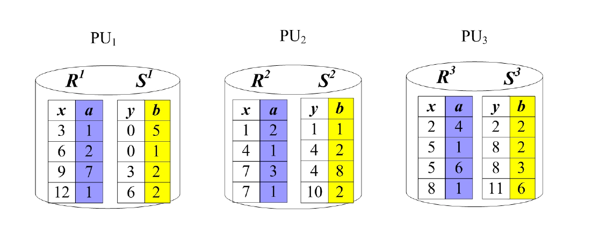
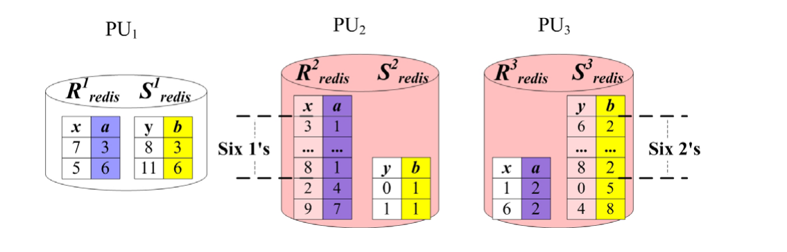
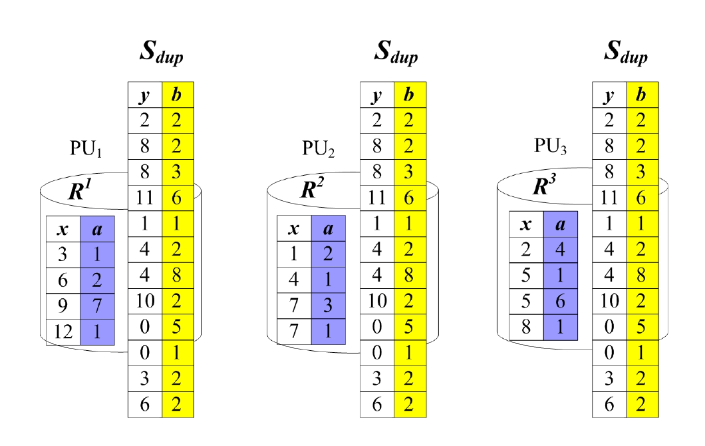
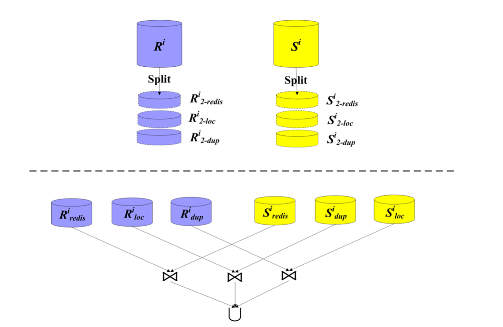
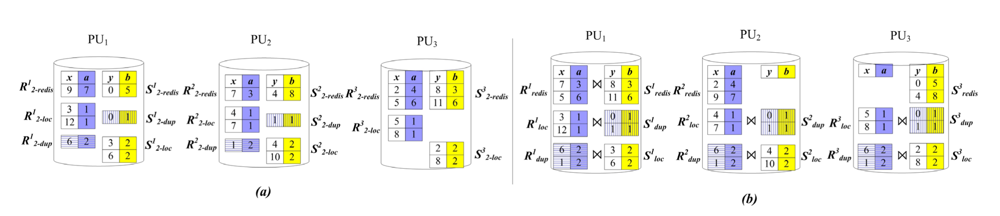
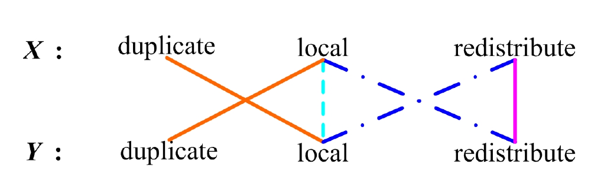
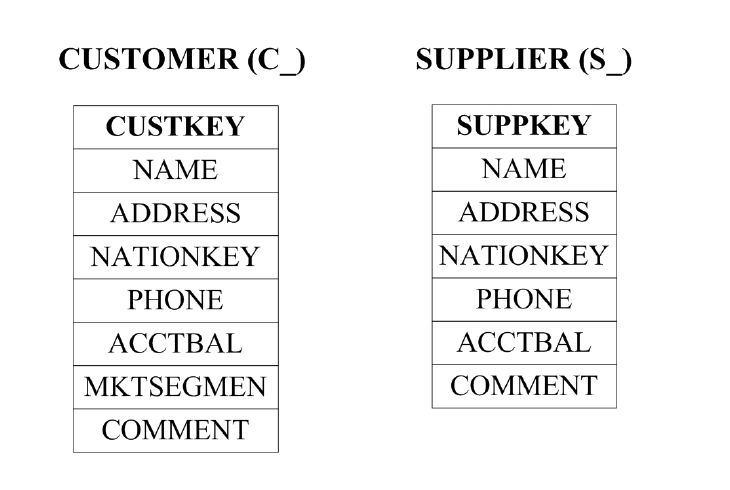
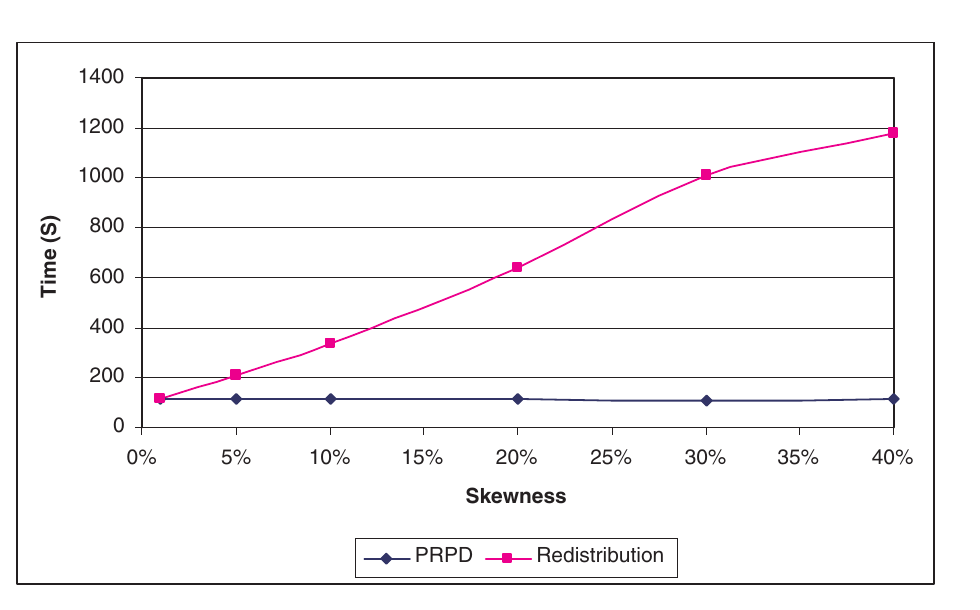
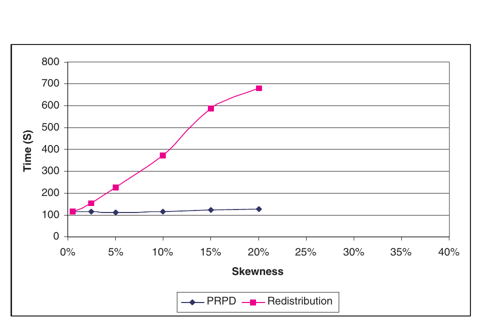
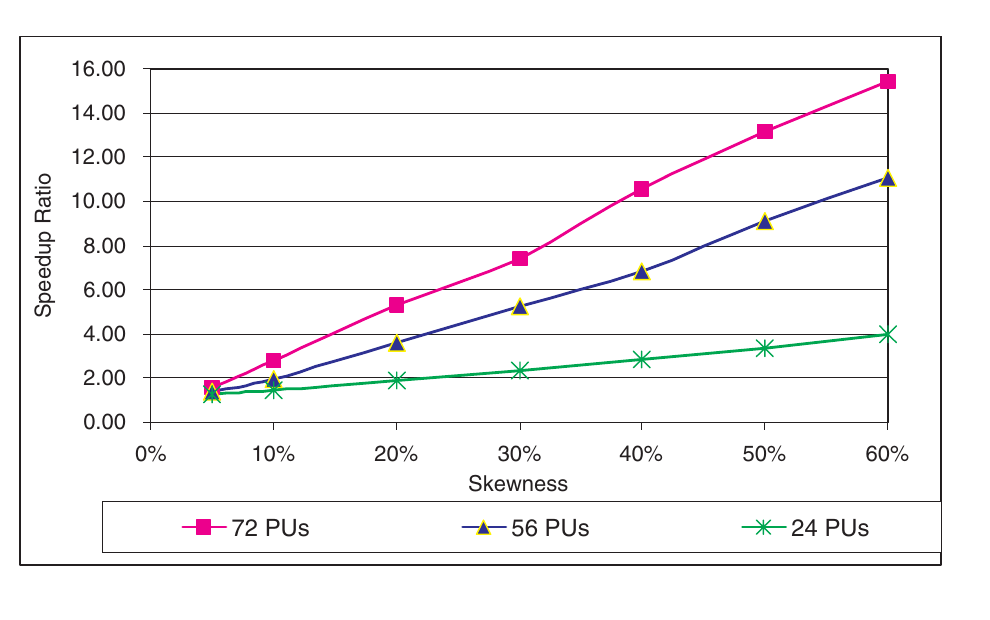

# Handling Data Skew in Parallel Joins in Shared-Nothing Systems（中文译文）

## 译者说明

本文依据同目录的 `source.pdf` 翻译。章节、图表、公式、算法、代码与参考文献按原文结构保留。

## 作者与机构

- Yu Xu，Teradata，美国加利福尼亚州圣迭戈，`yu.xu@teradata.com`
- Pekka Kostamaa，Teradata，美国加利福尼亚州埃尔塞贡多，`pekka.kostamaa@teradata.com`
- Xin Zhou，Teradata，美国加利福尼亚州埃尔塞贡多，`xin.zhou@teradata.com`
- Liang Chen，加利福尼亚大学圣迭戈分校，美国加利福尼亚州圣迭戈，`jeffchen@cs.ucsd.edu`

SIGMOD'08，2008 年 6 月 9-12 日，加拿大不列颠哥伦比亚省温哥华。

## 摘要

并行处理对于大型数据仓库仍然十分重要。处理需求持续在多个维度上增长，包括更大的数据量、越来越多的并发用户、更复杂的查询，以及更多定义复杂逻辑、语义和物理数据模型的应用。无共享（shared-nothing）并行数据库管理系统 [16] 可以通过增加节点进行“横向”扩展。然而，大多数并行算法没有考虑数据倾斜。数据倾斜在许多应用中自然存在。处理倾斜数据的查询不仅响应更慢，还会产生热点节点；热点节点会成为限制整个系统性能的瓶颈。受真实业务问题启发，我们提出一种新的连接布局，称为 PRPD（Partial Redistribution & Partial Duplication，部分重分布与部分复制），用于在无共享系统中存在数据倾斜时提高并行连接的性能和可扩展性。我们的实验结果表明，存在数据倾斜时，PRPD 能显著缩短查询执行时间。我们的经验表明，消除数据倾斜造成的系统瓶颈可以提高整个系统的吞吐量；这一点对于经常运行高并发工作负载的并行数据仓库非常重要。

### 分类与主题描述符

H.2.4 [信息系统]：数据库管理（系统）

### 通用术语

算法

### 关键词

数据倾斜、并行连接、无共享

## 1. 引言

并行处理对于大型数据仓库仍然十分重要。处理需求持续在多个维度上增长，包括更大的数据量、越来越多的并发用户、更复杂的查询，以及更多定义复杂逻辑、语义和物理数据模型的应用。

在无共享架构中，多个节点通过高速互连网络通信，每个节点都有自己的私有内存和磁盘。当前系统通常在每个节点上运行多个虚拟处理器（由若干软件进程组成），以利用节点上的多个 CPU 和磁盘获得更高的并行度。这些虚拟处理器负责扫描、连接、加锁、事务管理及其他数据管理工作，我们称之为并行单元（Parallel Unit，PU）。

关系通常横向分区到所有 PU 上，从而可以并行读写多个磁盘并利用其 I/O 带宽。系统普遍使用哈希分区把关系分布到各个 PU。对于关系中的每个元组，系统对其分区列（Partitioning Column）应用哈希函数，将其分配给某个 PU。分区列是关系中的一个或多个属性，可以由用户指定，也可以由系统自动选择。

例如，图 1 展示了在一个包含三个 PU 的系统上对两个关系 $R(x,a)$ 和 $S(y,b)$ 的分区。假设分区列分别为 $R.x$ 和 $S.y$，哈希函数为 $h(i)=i\bmod 3+1$。哈希函数 $h$ 把分区列取值为 $i$ 的元组放到第 $h(i)$ 个 PU 上。例如， $R$ 中的元组 $(x=3,a=1)$ 被放到第一个 PU，因为 $h(3)=1$。 $R$（或 $S$）在第 $i$ 个 PU 上的分片记为 $R^i$（或 $S^i$）。



**图 1：** 三个并行单元上的两个关系 $R$ 和 $S$。分区列分别为 $R.x$ 和 $S.y$。哈希函数 $h(i)=i\bmod 3+1$ 把分区列取值为 $i$ 的元组放到第 $h(i)$ 个 PU 上。

传统无共享并行系统有两种用于计算 $R\bowtie _ {R.a=S.b}S$ 的连接布局。第一种称为重分布方案（redistribution plan），第二种称为复制方案（duplication plan）。两种方案都分为两个阶段。

在重分布方案的第一阶段，如果 $R.a$ 和 $S.b$ 都不是分区列，就按照连接属性的哈希值重分布 $R$ 和 $S$，使相互匹配的行被发送到同一个 PU[^1]。重分布方案第一阶段的这种重分布称为哈希重分布（hash redistribution）。例如，图 2 展示了分别按 $R.a$ 和 $S.b$ 对 $R$ 和 $S$ 做哈希重分布之后第一阶段的结果。 $R^i _ {\mathrm{redis}}$（或 $S^i _ {\mathrm{redis}}$）表示第 $i$ 个 PU 上的假脱机文件，其中包含从所有 PU 哈希重分布到第 $i$ 个 PU 的 $R$（或 $S$）的全部行，也包括来自 $R^i$（或 $S^i$）本身的行。显然，如果某个关系的连接属性就是其分区列，就不必对该关系做哈希重分布；如果两个关系的连接属性都是各自的分区列，整个重分布第一阶段都不需要执行。



**图 2：** $R\bowtie _ {a=b}S$ 的重分布方案第一阶段：根据哈希函数 $h(i)=i\bmod 3+1$，按连接属性 $R.a$ 和 $S.b$ 对 $R$、 $S$ 做哈希重分布之后的数据放置。 $R^i _ {\mathrm{redis}}$（或 $S^i _ {\mathrm{redis}}$）表示第 $i$ 个 PU 上的假脱机文件，其中包含从所有 PU 哈希重分布到该 PU 的 $R$（或 $S$）的全部行。

在复制方案的第一阶段，每个 PU 上较小关系的元组都被复制（广播）到所有 PU，使每个 PU 都拥有较小关系的完整副本。例如，图 3 展示了把图 1 中的 $S$ 复制到每个 PU 之后的结果。



**图 3：** $R\bowtie _ {a=b}S$ 的复制方案第一阶段：把 $S$ 复制到每个 PU 之后的数据放置。每个 PU 上的假脱机文件 $S _ {\mathrm{dup}}$ 都包含 $S$ 的完整副本。

两种方案的第二阶段都在每个 PU 上并行执行连接。第一阶段已经把来自两个连接关系的所有匹配行放到相同的 PU 上，因此可以这样执行。

已有研究表明，在负载均匀的条件下，重分布方案在无共享系统上能够获得接近线性的加速 [6]。然而，如果我们用重分布方案计算 $R\bowtie _ {R.a=S.b}S$，而其中一个关系 $R$ 的连接属性 $R.a$ 中有大量行取相同值 $v$，那么一个 PU 会收到所有这些行。该 PU 会成为热点，并可能成为整个系统的性能瓶颈。值 $v$ 称为 $R.a$ 中 $R$ 的倾斜值； $R$ 中包含倾斜值 $v$ 的任何一行称为倾斜行。图 2 中第二个 PU 收到的 $R$ 行数是其他任一 PU 的 4 倍。显然，数据越倾斜，热点 PU 就会越热。

向系统中增加节点不能解决倾斜问题，因为所有倾斜行仍会被发送到同一个 PU。这样做只会降低并行效率：新节点让每个非热点 PU 变得更“冷”（行数更少），同时让热点 PU 相对更热。图 2 所示的数据倾斜在文献 [17] 中被归类为重分布倾斜（redistribution skew），也是我们在本文中研究的对象。

重分布倾斜可能源于设计不良的哈希函数。不过，哈希理论研究给出了一类具有高概率良好性能的通用哈希函数 [4]。更根本的问题来自连接属性中自然出现的倾斜值。

我们在许多类型的工业应用中都观察到重分布倾斜。例如，在旅行预订行业，大客户经常代表其全部终端用户发起大量预订；在在线电子商务中，少数专业客户每年完成数百万笔交易，而绝大多数其他客户一年只有寥寥数笔；在电信业，用于电话营销的一些电话号码会发起大量呼叫，而大多数客户每天只打少量电话；在零售业，某些商品的销量远高于其他商品。这些应用中的关系通常按唯一事务 ID 均匀分区。然而，当连接属性是非分区列属性（如客户 ID、电话号码或商品 ID）时，就会出现严重的重分布倾斜，并可能对系统性能造成灾难性影响。

严重的重分布倾斜还可能导致假脱机空间耗尽，使查询中止；在大型数据仓库中，这种中止往往发生在已经运行数小时之后。原因在于，尽管磁盘容量持续增大且价格持续下降，并行 DBMS 为了工作负载管理和并发控制，仍然会在每个 PU 上为用户设置假脱机空间配额。有时系统可以选择复制方案代替重分布方案来缓解倾斜，但它只适用于其中一个连接关系相当小的少数情况。研究界虽然提出了许多算法，但据我们所知，主要并行 DBMS 厂商尚未实现有效的倾斜处理机制，原因可能是这些机制实现复杂度或通信成本过高，或者需要对现有系统作出重大改动。

我们在本文中作出如下贡献：

- 受真实业务问题启发，我们提出实用且高效的连接布局 PRPD（部分重分布与部分复制），用于处理并行连接中的数据倾斜。
- PRPD 连接布局不需要对现有无共享架构的实现作重大改动。
- 我们的实验展示了所提出 PRPD 连接布局的效率。

本文余下内容安排如下：我们在第 2 节介绍 PRPD 连接布局；第 3 节讨论如何把 PRPD 应用于多重连接；第 4 节给出实验结果；第 5 节讨论相关工作；第 6 节总结全文并讨论未来工作。

[^1]: 基表不会发生改变；系统只为计算当前查询而重分布投影后行的副本。

## 2. 部分重分布与部分复制（PRPD）

本节中，我们从 PRPD 方法背后的观察和直觉出发，介绍 PRPD 连接布局。我们注意到，并行系统 DBA 和应用开发者通常通过必需的认证或培训，充分了解选择良好分区列、均匀分布数据对于高效并行处理的重要性。并行 DBMS 会提供工具展示数据的分区方式，并在必要时帮助用户更改分区列。没有其他合适选择时，可以把自动生成唯一值的标识列定义为分区列。因此在实践中，大型关系很可能是均匀分区的。

考虑连接 $R\bowtie _ {R.a=S.b}S$。假设 $R$ 均匀分区， $R.a$ 不是 $R$ 的分区列，且 $R.a$ 中有大量倾斜行。关键观察是， $R$ 的倾斜行往往均匀分布在各个 PU 上。PRPD 连接布局背后的直觉，是对 $R$ 的倾斜行和非倾斜行采取不同处理方式。PRPD 将 $R$ 的倾斜行保留在每个 PU 本地，而不是把它们全部哈希重分布到一个 PU；同时把 $S$ 中与这些倾斜行匹配的行复制到所有 PU。对于 $R$ 和 $S$ 的其他行，PRPD 使用重分布方案。我们在第 2.1 节讨论 PRPD 连接布局，第 2.2 节比较 PRPD、重分布方案和复制方案，第 2.3 节讨论 PRPD 如何处理倾斜行没有均匀分布在所有 PU 上的异常情况。



**图 4：** $R\bowtie _ {a=b}S$ 的 PRPD 方案。 $R^i _ {2-\mathrm{redis}}$ 和 $S^i _ {2-\mathrm{redis}}$ 分别按 $R.a$ 和 $S.b$ 做哈希重分布； $R^i _ {2-\mathrm{dup}}$ 和 $S^i _ {2-\mathrm{dup}}$ 被复制； $R^i _ {2-\mathrm{loc}}$ 和 $S^i _ {2-\mathrm{loc}}$ 保留在本地。

### 2.1 PRPD 描述

假设优化器选择 PRPD 连接布局来连接 $R\bowtie _ {R.a=S.b}S$。为简便起见，我们交替使用“PRPD 连接布局”和“PRPD 方案”两个说法。我们首先假设系统知道 $R.a$ 中倾斜值的集合 $L _ 1$ 和 $S.b$ 中倾斜值的集合 $L _ 2$，且 $R.a$、 $S.b$ 都不是分区列。我们稍后会说明只有一个关系倾斜时，以及某个关系的分区列就是连接属性时，PRPD 如何工作。

PRPD 方案分为三个步骤。假设系统中有 $n$ 个 PU。

**步骤 1：扫描并拆分两个输入关系。**

**1)** 在每个 $PU _ i$ 上扫描一次 $R^i$，把行拆成三个集合。

- 第一个集合 $R^i _ {2-\mathrm{loc}}$ 包含 $R^i$ 中取 $L _ 1$ 内任意值的全部倾斜行，并保留在本地。
- 第二个集合 $R^i _ {2-\mathrm{dup}}$ 包含 $R^i$ 中 $R.a$ 值与 $L _ 2$ 中任意值匹配的全部行，并被复制到所有 PU。
- 第三个集合 $R^i _ {2-\mathrm{redis}}$ 包含 $R^i$ 中的其他全部行，并按 $R.a$ 做哈希重分布。

$R^i _ {2-\mathrm{loc}}$、 $R^i _ {2-\mathrm{dup}}$ 和 $R^i _ {2-\mathrm{redis}}$ 在每个 PU 上不相交地划分 $R^i$。

在每个 $PU _ i$ 上创建三个接收假脱机文件 $R^i _ {\mathrm{redis}}$、 $R^i _ {\mathrm{dup}}$ 和 $R^i _ {\mathrm{loc}}$。第一个假脱机文件 $R^i _ {\mathrm{redis}}$ 接收从任意 PU（包括 $PU _ i$ 自身）重分布到第 $i$ 个 PU 的全部 $R$ 行。也就是说， $R^i _ {\mathrm{redis}}$ 包含任意 $R^j _ {2-\mathrm{redis}}$（ $1\le j\le n$）中由系统哈希函数 $h$ 重分布到第 $i$ 个 PU 的行：

$$
R^i _ {\mathrm{redis}}=\left\lbrace\tau\mid h(\tau.a)=i\land \tau\in\bigcup _ {1\le j\le n}R^j _ {2-\mathrm{redis}}\right\rbrace.
$$

第二个假脱机文件 $R^i _ {\mathrm{dup}}$ 接收从任意 PU（包括 $PU _ i$ 自身）复制到第 $i$ 个 PU 的所有 $R$ 行：

$$
R^i _ {\mathrm{dup}}=\bigcup _ {1\le j\le n}R^j _ {2-\mathrm{dup}}.
$$

对任意 $i$、 $j$，都有 $R^i _ {\mathrm{dup}}=R^j _ {\mathrm{dup}}=\bigcup _ {1\le p\le n}R^p _ {2-\mathrm{dup}}$。第三个假脱机文件 $R^i _ {\mathrm{loc}}$ 接收 $R^i _ {2-\mathrm{loc}}$ 的全部行，即：

$$
R^i _ {\mathrm{loc}}=R^i _ {2-\mathrm{loc}}.
$$

**2)** 类似地，在每个 $PU _ i$ 上扫描一次 $S^i$，把行拆成三个集合。

- 第一个集合 $S^i _ {2-\mathrm{loc}}$ 包含 $S^i$ 中取 $L _ 2$ 内任意值的全部倾斜行，并保留在本地。
- 第二个集合 $S^i _ {2-\mathrm{dup}}$ 包含 $S^i$ 中 $S.b$ 值与 $L _ 1$ 中任意值匹配的全部行，并被复制到所有 PU。
- 第三个集合 $S^i _ {2-\mathrm{redis}}$ 包含 $S^i$ 中的其他全部行，并按 $S.b$ 做哈希重分布。

$S^i _ {2-\mathrm{loc}}$、 $S^i _ {2-\mathrm{dup}}$ 和 $S^i _ {2-\mathrm{redis}}$ 在每个 PU 上不相交地划分 $S^i$。每个 $PU _ i$ 还会创建三个接收假脱机文件 $S^i _ {\mathrm{redis}}$、 $S^i _ {\mathrm{dup}}$ 和 $S^i _ {\mathrm{loc}}$，其定义与 $R^i _ {\mathrm{redis}}$、 $R^i _ {\mathrm{dup}}$ 和 $R^i _ {\mathrm{loc}}$ 类似：

$$
S^i _ {\mathrm{redis}}=\left\lbrace\tau\mid h(\tau.b)=i\land \tau\in\bigcup _ {1\le j\le n}S^j _ {2-\mathrm{redis}}\right\rbrace,
$$

$$
S^i _ {\mathrm{dup}}=\bigcup _ {1\le j\le n}S^j _ {2-\mathrm{dup}},
$$

$$
S^i _ {\mathrm{loc}}=S^i _ {2-\mathrm{loc}}.
$$

在实际实现中，系统读取 $R$ 或 $S$ 的一行时，会立即根据该行连接属性的值决定将其保留在本地、重分布还是复制。六个集合 $R^i _ {2-\mathrm{redis}}$、 $R^i _ {2-\mathrm{dup}}$、 $R^i _ {2-\mathrm{loc}}$、 $S^i _ {2-\mathrm{redis}}$、 $S^i _ {2-\mathrm{dup}}$、 $S^i _ {2-\mathrm{loc}}$ 不会物化，仅用于说明。真正物化并参与下一步连接操作的，只有六个接收假脱机文件 $R^i _ {\mathrm{redis}}$、 $R^i _ {\mathrm{dup}}$、 $R^i _ {\mathrm{loc}}$、 $S^i _ {\mathrm{redis}}$、 $S^i _ {\mathrm{dup}}$ 和 $S^i _ {\mathrm{loc}}$。

**步骤 2：在每个 $PU _ i$ 上执行以下三个连接。**

1. $R^i _ {\mathrm{redis}}\bowtie _ {a=b}S^i _ {\mathrm{redis}}$。
2. $R^i _ {\mathrm{loc}}\bowtie _ {a=b}S^i _ {\mathrm{dup}}$。
3. $R^i _ {\mathrm{dup}}\bowtie _ {a=b}S^i _ {\mathrm{loc}}$。

**步骤 3：** 最终结果是所有 PU 上步骤 2 的三个连接结果的并集。

每个步骤的所有子步骤都可以并行执行，而且通常确实如此。例如，第一步中的子步骤 1.1 与 1.2 可以并行，第二步中的三个连接也可以并行。

步骤 1 中， $R.a$ 和 $S.b$ 的倾斜值共同决定如何把 $R$ 和 $S$ 拆分到不同假脱机文件。当某个值 $v$ 同时出现在 $R.a$ 和 $S.b$ 的倾斜值中时，我们不能同时在两个关系中复制它。我们采用如下方法处理重叠倾斜值。

系统调用 PRPD 方案时，总是使用两个互不重叠的集合 $L _ 1$（ $R$ 的倾斜值）和 $L _ 2$（ $S$ 的倾斜值）。对于两个关系中都倾斜的值 $v$，系统只把它放进 $L _ 1$、 $L _ 2$ 中的一个，而不是同时放入两者。这样可以保证 $R^i _ {2-\mathrm{loc}}$、 $R^i _ {2-\mathrm{dup}}$、 $R^i _ {2-\mathrm{redis}}$ 在每个 PU 上不相交地划分 $R^i$，并保证 $S^i _ {2-\mathrm{loc}}$、 $S^i _ {2-\mathrm{dup}}$、 $S^i _ {2-\mathrm{redis}}$ 不相交地划分 $S^i$。问题在于应由哪个集合（ $L _ 1$ 或 $L _ 2$）包含 $v$。假设 $R$ 中 $R.a=v$ 的倾斜行数乘以 $R$ 的投影行大小，大于 $S$ 中 $S.b=v$ 的倾斜行数乘以 $S$ 的投影行大小，系统就选择把 $v$ 放入 $L _ 1$，使 $R$ 的这些倾斜行保留在 $R^i _ {\mathrm{loc}}$ 中，并把 $S$ 中连接属性值为 $v$ 的行复制到 $S^i _ {\mathrm{dup}}$。

只有一个关系倾斜时，第一步为每个关系生成两个而不是三个接收假脱机文件。假设只有 $R$ 倾斜，则第一步只为 $R$ 生成 $R^i _ {\mathrm{loc}}$ 和 $R^i _ {\mathrm{redis}}$，为 $S$ 生成 $S^i _ {\mathrm{dup}}$ 和 $S^i _ {\mathrm{redis}}$。由于 $S$ 中没有倾斜值，不会创建 $R^i _ {\mathrm{dup}}$ 和 $S^i _ {\mathrm{loc}}$，因此第二步只需执行前两个连接。在步骤 2 中，我们允许优化器为三个连接分别选择最佳物理连接方法；三个连接可能采用不同的连接方法。

如果某个关系（假设为 $S$）的连接属性也是其分区列，PRPD 的逻辑工作方式相同。唯一差别在于： $S.b$ 是分区列，因此每个 PU 会在本地保留 $S$ 中那些连接属性值在 $R$ 中不倾斜的行，而不是把它们重分布到其他 PU。重分布方案虽然不必重分布 $S$，却仍会把 $R$ 的倾斜行发送到一个 PU，形成系统瓶颈。此时 PRPD 仍能像两个关系的连接属性都不是分区列时一样优于重分布方案。

总体而言，当 $R$ 倾斜时， $R$ 的倾斜行保留在本地， $S$ 中与这些倾斜行匹配的行被复制到所有 PU，两个关系中的其他全部行都被重分布。 $S$ 的一部分被重分布，另一部分被复制；如果 $S$ 也倾斜，则执行对称操作。因此我们把该方法命名为 PRPD，即部分重分布与部分复制。

图 4 展示了 PRPD 方案的基本思想。新算子 Split 读取每一行，并根据其连接属性值以及 $R$、 $S$ 中倾斜值的集合，决定将其保留在本地、重分布还是复制。以图 1 的示例数据为例，图 5(a) 展示 PRPD 方案将如何放置各个 PU 上的 $R$、 $S$ 行；图 5(b) 展示应用 PRPD 之后的数据放置。把图 5(b) 与图 2 比较，我们可以直观看出 PRPD 方案中各 PU 的处理量均衡，不存在热点 PU。



**图 5：** $R\bowtie _ {a=b}S$ 的 PRPD 连接布局。假设哈希函数为 $h(i)=i\bmod 3+1$， $R$ 中的倾斜值为 1， $S$ 中的倾斜值为 2。(a) 各元组未来放置位置的示意图： $R^i _ {2-\mathrm{redis}}$ 与 $S^i _ {2-\mathrm{redis}}$ 分别按 $R.a$、 $S.b$ 做哈希重分布， $R^i _ {2-\mathrm{dup}}$ 与 $S^i _ {2-\mathrm{dup}}$ 被复制， $R^i _ {2-\mathrm{loc}}$ 与 $S^i _ {2-\mathrm{loc}}$ 保留在本地。(b) 应用 PRPD 后各元组放置位置的示意图。

附录 A 给出 PRPD 方案的正确性证明。

### 2.2 PRPD、重分布方案与复制方案的比较

PRPD 方案中的部分复制不存在于重分布方案，因此 PRPD 使用的总假脱机空间会多于重分布方案。另一方面，PRPD 的部分重分布把倾斜行保留在本地，网络通信成本低于重分布方案。两者更重要的差别是：PRPD 不会把全部倾斜行发送到同一个 PU，因而不会造成系统瓶颈。

PRPD 的部分复制可能使其总假脱机空间少于复制方案，因为并非关系中的每一行都会被复制。另一方面，当数据倾斜不明显且 PRPD 需要重分布一个大关系时，其部分重分布可能使网络通信成本高于复制方案。另一个差别在于，复制方案总是在每个 PU 上把被复制关系的完整副本与另一个关系的分片连接，而 PRPD 会缩小每个 PU 上参与连接的假脱机文件。

PRPD 连接方案是重分布方案与复制方案的混合。考虑连接 $R\bowtie _ {R.a=S.b}S$。如果优化器调用 PRPD 时， $R.a$ 的倾斜值集合 $L _ 1$ 与 $S.b$ 的倾斜值集合 $L _ 2$ 都为空，那么没有行会被保留在本地或复制，PRPD 的行为与重分布方案完全相同。如果 $L _ 1=\mathrm{Uniq}(R.a)$，即 $L _ 1$ 等于 $R.a$ 中唯一值的集合，且 $L _ 1$ 是 $\mathrm{Uniq}(S.b)$ 的超集，那么每个 $R$ 行都会留在本地（因为 $R.a$ 的每个值都是倾斜值），每个 $S$ 行都会被复制，PRPD 的行为与复制方案完全相同。

如果 $L _ 1=\mathrm{Uniq}(R.a)$，但不是 $\mathrm{Uniq}(S.b)$ 的超集，PRPD 会把每个 $R$ 行留在本地，复制 $S$ 的一部分行，并对 $S$ 的另一部分行做哈希重分布；这些被哈希重分布的 $S$ 行不会匹配任何 $R$ 行。如果 $L _ 1$ 是 $\mathrm{Uniq}(S.b)$ 的超集，同时又是 $\mathrm{Uniq}(R.a)$ 的子集，PRPD 会复制每个 $S$ 行，把 $R$ 的一部分行留在本地，并对 $R$ 的另一部分行做哈希重分布；这些被哈希重分布的 $R$ 行不会匹配任何 $S$ 行。后两种情况中的哈希重分布都没有必要，但除非优化器预先知道 $L _ 1$、 $\mathrm{Uniq}(R.a)$ 和 $\mathrm{Uniq}(S.b)$ 之间的关系，系统无法消除这些重分布。

假设系统中有 $n$ 个 PU， $x$ 是关系 $R$ 中倾斜行的百分比（倾斜度）。采用重分布方案后，热点 PU 上 $R$ 的行数约为

$$
x\lvert R\rvert+\frac{(1-x)\lvert R\rvert}{n},
$$

而非热点 PU 上 $R$ 的行数约为

$$
\frac{(1-x)\lvert R\rvert}{n}.
$$

因此，热点 PU 上 $R$ 的行数与非热点 PU 上 $R$ 的行数之比约为

$$
1+\frac{nx}{1-x}.
$$

在 PRPD 方案中，第一阶段之后每个 PU 上 $R$ 的行数约为

$$
\frac{x\lvert R\rvert}{n}+\frac{(1-x)\lvert R\rvert}{n}=\frac{\lvert R\rvert}{n}.
$$

所以，重分布方案热点 PU 上 $R$ 的行数，与 PRPD 第一阶段之后任一 PU 上 $R$ 的行数之比约为 $1+(n-1)x$。该比率依赖 $R$ 的倾斜度和系统规模（PU 数量），但与关系 $R$ 本身的大小无关；它相对于系统规模和 $R$ 的倾斜度都近似线性，也是决定 PRPD 相比重分布方案能够取得多大加速的重要因素。

例如，在 $n=100$ 的小型系统中（4 个节点，每个节点运行 25 个 PU）， $x=1\verb0%0$ 时比率为 2， $x=2\verb0%0$ 时比率为 3；在 $n=500$ 的中型系统中（20 个节点，每个节点运行 25 个 PU），对应比率分别为 6 和 11；在 $n=5000$ 的大型系统中（200 个节点，每个节点运行 25 个 PU），对应比率分别为 51 和 103。我们在第 4 节的实验中研究系统规模和数据倾斜度对 PRPD 相比重分布方案的加速比有何影响。

一个重要问题是优化器如何在 PRPD 和其他方案之间选择。与通常情况一样，基于代价的优化器只会在判断应用 PRPD 的代价更小时选择 PRPD。优化器如何计算并比较 PRPD、重分布方案和复制方案的代价超出了本文范围，我们不作讨论。

除了使用统计信息，优化器还可以通过采样寻找倾斜值。文献 [7, 8] 表明，无论数据是否倾斜，采样在查询响应时间中的成本都可以忽略。

### 2.3 在 PRPD 中处理分区不均匀的倾斜行

目前介绍的 PRPD 连接方案假设倾斜行大致均匀分布在所有 PU 上。本节讨论倾斜行只位于一个或少数几个 PU 上的异常情况。

考虑连接 $R\bowtie _ {R.a=S.b}S$，且 $R$ 的连接属性存在倾斜。假设 $R$ 的全部倾斜行只位于少量 PU 上，本节称这些 PU 为倾斜 PU。PRPD 本身不会造成重分布倾斜，因为全部倾斜行都保留在本地；但这些倾斜 PU 会成为热点 PU，因为除了已有的倾斜行，它们还会接收其他 PU 重分布而来的行。考虑在所有 PU 中包含倾斜行最多的倾斜 PU $P$。假设 $R$ 均匀分区，PU 数量为 $n$， $R$ 的倾斜度为 $x$。采用 PRPD 时， $P$ 会保留全部本地倾斜行，并接收其他 PU 发来的一些非倾斜行。执行 PRPD 第一步后， $P$ 上的行数约为

$$
\min\left(\frac{\lvert R\rvert}{n},x\lvert R\rvert\right)+\frac{\lvert R\rvert(1-x)}{n},
$$

其中函数 $\min(a,b)$ 返回 $a$、 $b$ 中较小的值。

为处理倾斜 PU，需要对 PRPD 方案稍作修改：我们不再把 $R$ 的倾斜行留在每个 PU 本地，而是把它们随机重分布到所有 PU，使倾斜行均匀分布。对 $S$ 的处理不变， $S$ 中包含 $R$ 倾斜值的行仍被复制到每个 PU。修改后，执行第一步之后，倾斜 PU $P$ 上会有 $\lvert R\rvert/n$ 行 $R$。同一个 PU $P$ 在原始 PRPD 与修改后 PRPD 下的行数之比为

$$
\frac{\min\left(\lvert R\rvert/n,x\lvert R\rvert\right)+\lvert R\rvert(1-x)/n}{\lvert R\rvert/n}
=\min(1,nx)+(1-x).
$$

$x=0$ 或 $x=1$ 时，该比率为 1；当 $nx\ge 1$ 时，该比率为 $2-x$。注意，

$$
\left\lceil nx\right\rceil
=\left\lceil\frac{x\lvert R\rvert}{\lvert R\rvert/n}\right\rceil
$$

是在假设 $R$ 均匀分区的情况下，容纳 $R$ 中全部倾斜行所需的最少 PU 数。上述比率说明，当倾斜行只位于一个或少数几个 PU 上时，在第二阶段连接之前把倾斜行重分布到所有 PU，比把全部倾斜行留在本地更能均衡倾斜关系的分区。

## 3. 在多重连接中应用 PRPD

本节中，我们讨论如何把 PRPD 连接布局应用于多重连接。从直觉上看，应用 PRPD 后的连接结果并非所有行都按连接属性分区，这一点可能在多重连接中造成问题。

本节中，我们说明如何在多表连接查询中混合使用 PRPD 与其他传统方案。引入 PRPD 后如何决定连接顺序和制定计划超出了本文范围，我们不作讨论；我们关注的是，应用 PRPD 后的连接结果如何使用不同连接布局与其他关系继续连接。

考虑一个连接三个关系 $R$、 $S$ 和 $Y$ 的查询，其中 $R$ 与 $S$ 的连接条件为 $R.a=S.b$。假设优化器选择先连接 $R$ 和 $S$，并令 $X$ 表示二者的连接结果。在引入 PRPD 之前，连接 $X$ 和 $Y$ 可以采用 6 种连接布局。对于 $X$ 和 $Y$ 中的每一个关系，我们都可以选择保留在本地、重分布或复制，因此共有 9 种组合；但当一个关系被复制时，另一个关系无需复制或重分布，最终剩下图 6 所示的 6 种组合，其中每条连线表示下面的一种情况。



**图 6：** $X\bowtie Y$ 的连接布局。

1. 复制 $X$，把 $Y$ 保留在本地。
2. 把 $X$ 保留在本地，复制 $Y$。
3. 按 $X$ 中既不是 $R.a$ 也不是 $S.b$ 的连接属性重分布 $X$，并重分布 $Y$。
4. 按 $X$ 中既不是 $R.a$ 也不是 $S.b$ 的连接属性重分布 $X$；若 $Y$ 是基表且 $Y$ 的连接属性是其分区列，或者 $Y$ 是已经按连接属性重分布的中间结果，则把 $Y$ 保留在本地。
5. 重分布 $Y$；当 $X$ 的连接属性是 $R.a$ 或 $S.b$ 时，把 $X$ 保留在本地。
6. 当 $Y$ 是基表且 $Y$ 的连接属性是其分区列，或者 $Y$ 是已经按连接属性重分布的中间结果，并且 $X$ 的连接属性是 $R.a$ 或 $S.b$ 时，把 $X$ 和 $Y$ 都保留在本地。

现在让我们考虑在多表连接环境中使用 PRPD 连接 $R$ 与 $S$ 的影响。假设优化器已经选择 PRPD 连接 $R$ 和 $S$。PRPD 的倾斜处理不会影响前四种情况，也就是说，系统仍可像平常一样执行每种情况指定的连接布局。但在情况 5 和 6 中，应用 PRPD 后我们不能再简单地把 $X$ 保留在本地。我们当然可以再次按 $R.a$ 或 $S.b$ 重分布 $X$，然后连接 $X$ 与 $Y$；不过我们不必重分布 $X$ 中的每一行，因为一部分行已经在 PRPD 中被重分布到正确的 PU。我们只需重分布由 PRPD 中保留在本地的那些行产生的连接结果。

PRPD 按如下方式修改后即可用于多表连接。当优化器识别出 $X$ 与 $Y$ 的连接布局属于情况 5 或 6 时，采用下面修改过的 PRPD 步骤 2（原文加粗处为变化）：

1. 连接 $R^i _ {\mathrm{redis}}$ 与 $S^i _ {\mathrm{redis}}$。
2. 连接 $R^i _ {\mathrm{loc}}$ 与 $S^i _ {\mathrm{dup}}$，**并按 $R.a$ 对结果做哈希重分布**。
3. 连接 $R^i _ {\mathrm{dup}}$ 与 $S^i _ {\mathrm{loc}}$，**并按 $R.a$ 对结果做哈希重分布**。

优化器评估 PRPD 对多重连接的影响时，会把情况 5 和 6 所需的上述额外重分布步骤的代价计算在内。

上述六种情况都基于传统连接布局。PRPD 又为优化器在多表连接中连接 $X$ 和 $Y$ 增加了一种选择：再次使用 PRPD 连接 $X$ 和 $Y$。事实上，对于情况 5 和 6，优化器很可能作出这一选择。

考虑 $R.a$ 存在倾斜值而 $S$ 不倾斜的情况（文献 [14] 称为“单边倾斜”，也是以往大多数工作关注的情况）。如果 $R$ 中取倾斜值 $v _ 1$ 的元组与 $S$ 中的一些元组匹配，且第二次连接的连接属性是 $R.a$ 或 $S.b$（如情况 5 或 6），那么如下所示， $v _ 1$ 往往也会成为 $X$ 中的倾斜值。假设同时出现在 $R.a$ 和 $S.b$ 中的唯一值集合为 $\lbrace v _ 1,\ldots,v _ k\rbrace$， $m _ i$ 和 $n _ i$ 分别表示 $R$ 中 $R.a$ 取 $v _ i$ 的元组数，以及 $S$ 中 $S.b$ 取 $v _ i$ 的元组数（ $1\le i\le k$）。假设 $v _ 1$ 是 $R.a$ 的倾斜值，那么连接 $R$、 $S$ 的结果中连接属性值为 $v _ 1$ 的元组数为 $m _ 1n _ 1$，连接结果中的元组总数为 $\sum _ {i=1}^{k}m _ in _ i$。因此，连接结果中连接属性值为 $v _ 1$ 的元组比例为

$$
\delta _ 2=\frac{m _ 1n _ 1}{\sum _ {i=1}^{k}m _ in _ i}.
$$

令 $\delta _ 1$ 表示 $v _ 1$ 在 $R$ 中的倾斜度，即 $R$ 中 $R.a=v _ 1$ 的行所占百分比；令 $n _ {\max}$ 表示 $\lbrace n _ 1,\ldots,n _ k\rbrace$ 中的最大值。我们有

$$
\begin{aligned}
\delta _ 2
&=\frac{m _ 1n _ 1}{\sum _ {i=1}^{k}m _ in _ i}\\
&\ge\frac{m _ 1n _ 1}{\sum _ {i=1}^{k}m _ in _ {\max}}\\
&=\frac{n _ 1}{n _ {\max}}\frac{m _ 1}{\sum _ {i=1}^{k}m _ i}\\
&\ge\frac{n _ 1}{n _ {\max}}\frac{m _ 1}{\lvert R\rvert}\\
&=\frac{n _ 1}{n _ {\max}}\delta _ 1.
\end{aligned}
$$

该式表明，当 $v _ 1$ 是 $R$ 中的倾斜值时，它往往也是连接结果中的倾斜值；当 $S$ 不倾斜且 $n _ 1$ 接近 $n _ {\max}$ 时尤其如此。

## 4. 实验评估

本节中，我们主要比较 PRPD 方案与重分布方案的性能，因为在大型数据仓库系统中，重分布方案比复制方案应用得更广。向所有 PU 复制行会产生高昂的 I/O、CPU 和网络带宽成本；系统中的 PU 越多、连接关系越大，复制方案就越不可能优于重分布方案或 PRPD。不过，当一个连接关系相当小时，复制方案可能优于另外两种方案；在我们的实验中，我们也观察到了这种情况。本节中，我们只报告 PRPD 与重分布方案的对比实验。

在我们的实验中，我们使用 TPC-H [1] 和下面的查询。

**查询 Q1：**

```sql
select *
from CUSTOMER, SUPPLIER
where C_NATIONKEY = S_NATIONKEY
```

Customer 与 Supplier 关系的模式如图 7 所示。



**图 7：** TPC-H 中的两个关系 `CUSTOMER` 和 `SUPPLIER`，分区列分别为 `C_CUSTKEY` 和 `S_SUPPKEY`。

TPC-H 数据库原本只有 25 个不同的国家。我们把不同国家的数量增加到 1000，以便开展我们的倾斜实验。为了控制 Customer 关系连接属性 `C_NATIONKEY` 中的数据倾斜度，我们随机选择一部分数据，把其 `C_NATIONKEY` 值改成同一个值。例如，在我们的实验中，Customer 关系连接属性的倾斜度为 5%，意味着我们使用下面的 SQL 语句，把 Customer 关系 5% 的行的连接属性改成相同值 24。

**查询 Q2：**

```sql
update CUSTOMER
set C_NATIONKEY = 24
where random(1,100) ≤ 5
```

### 4.1 查询执行时间

我们用于实验的系统有 10 个节点、80 个 PU。每个节点配备 4 个 3.6 GHz Pentium IV CPU、4 GB 内存和 8 个 PU。我们为 Supplier 关系和 Customer 关系各生成 100 万行。我们还改变 Customer 关系中的数据倾斜度。查询结果约有 10 亿行。

图 8 展示使用 PRPD 方案和重分布方案时的执行时间。随着倾斜度增加，重分布方案的执行时间几乎线性增长，因为所有倾斜值都被重分布到一个 PU，使该 PU 成为系统瓶颈；PRPD 方案的执行时间则基本保持不变。



**图 8：** Customer 关系中有一个倾斜值时的查询执行时间。

我们还考虑存在两个倾斜值，并在重分布方案中形成两个热点 PU 的情况：连接属性中取不同倾斜值的行被哈希重分布到两个不同 PU。我们在图 9 中报告结果，其中两个倾斜值具有相同倾斜度，横轴显示该倾斜度。图 9 中两种方案的性能关系与图 8 相同。我们也考虑了两个关系都存在倾斜值的情况，结果与图 8、图 9 类似。



**图 9：** Customer 关系中有两个倾斜值，且二者具有横轴所示的相同倾斜度，从而在重分布方案中形成两个热点 PU 时的查询执行时间。

### 4.2 不同 PU 数量下的加速比

在本实验中，我们分别在 24、56 和 72 个 PU 的三个系统上计算 PRPD 相对于重分布方案的加速比，结果见图 10。由图 10 可见，随着倾斜度增加，PRPD 相对重分布方案的加速比也增加；系统越大，加速比也越大。



**图 10：** PRPD 方案相对于重分布方案的加速比。

我们还针对一个关系的分区列就是连接属性的情况做了两个关系的连接实验，我们观察到与图 8、图 9 和图 10 相似的性能关系。我们还要指出，我们关于在多表连接中使用 PRPD 的实验结果同样显示出显著的查询性能提升。

## 5. 相关工作

并行 DBMS 中的数据倾斜处理已经得到广泛研究。文献 [17] 描述了四类倾斜：元组放置倾斜（tuple placement skew，TPS）、选择率倾斜（selectivity skew，SS）、重分布倾斜（redistribution skew，RS）和连接结果倾斜（join product skew，JPS）。良好的哈希函数可以避免 TPS。理论研究已经广泛考察哈希函数，并提出若干构造高性能哈希函数的技术 [4]。此外，DBA 在实践中会仔细选择分区列，使大型关系的元组尽可能均匀分布在所有 PU 上。因此 TPS 出现的可能性极低，几乎没有工作专门关注 TPS。SS 由选择谓词在不同位置具有不同选择率引起，并且依赖具体查询。只有当 SS 引发 RS 或 JPS 时，它才成为问题；以往大多数工作也不考虑 SS。

如第 1 节所述，RS 发生在为实际连接做准备的重分布期间，各个 PU 收到不同数量的元组时。JPS 发生在各节点的连接选择率不同，导致各 PU 产生的元组数不均衡时。RS 和 JPS 密切相关，已有大量研究。以往算法大致分为以下三类。

第一类算法把倾斜建模为传统任务调度问题。对于并行连接，一个或两个连接关系会被划分成较小单元（范围 [7] 或哈希桶 [13, 11, 2, 19, 18, 20, 5]），再分配给所有 PU，由各 PU 在本地并行计算连接。由于任务调度是 NP 完全问题，这类算法会使用 LPT [9]、MULTIFIT [12] 等著名启发式方法 [7, 13, 11, 2, 19, 18, 20]。基于不同代价模型，第一类中又提出了不同算法。

第一种模型用每个 PU 上的元组数估计连接代价，目标是使每个 PU 从两个连接关系收到相近数量的元组，从而避免 RS。文献 [7] 中若干基于范围分区的算法用于处理 RS。这些算法先通过对两个关系采样找出倾斜关系，再计算拆分向量（不同算法采用不同策略），把倾斜关系的连接属性值划分为若干范围，范围数等于系统中的 PU 数。连接属性值落入同一范围的元组都被映射（重分布）到同一个 PU。拆分向量的目标是让每个 PU 收到相近数量的元组。如果一个值跨越多个范围，也就是该值发生倾斜，文献 [7] 的子集复制（subset-replication）算法会把另一个连接关系中具有该连接属性值的元组，复制到该值所映射到的所有 PU。需要注意，子集复制算法通常按照拆分向量把倾斜行重分布到少数几个 PU，而不是所有 PU。

第二种模型使用更复杂的代价模型 [7, 2, 19, 18, 20, 5]。文献 [7] 的虚拟处理器调度（Virtual Processor Scheduling，VPS）算法用于处理 JPS，它用 $\lvert R\rvert+\lvert S\rvert+\lvert R\bowtie S\rvert$ 估计每个 PU 上的连接代价，其中 $R$ 和 $S$ 是两个连接关系。文献 [2] 使用输出函数（output function）和工作函数（work function）估计连接代价。文献 [5] 还考虑了各 PU 配置可能不同的并行系统。

第一类算法试图在实际连接计算前估计执行时间，与之不同，第二类算法的核心思想是动态处理倾斜。系统在运行时监控每个 PU 的工作负载；如果某个 PU 的工作量远大于其他 PU，就把该热点 PU 的一部分工作负载迁移到其他 PU。文献 [15] 使用共享虚拟内存，把负载从热点 PU 迁移到空闲 PU。文献 [10] 检测各 PU 处理连接关系的速率；如果某个 PU 的处理速率较慢，就把它视为热点，并提出结果重分布（result redistribution）和处理任务迁移（processing task migration）两种算法。在结果重分布中，热点 PU 产生的结果不在本地存储，而是发送到其他 PU 的磁盘；在处理任务迁移中，热点 PU 上一部分尚未处理的关系被迁移到其他空闲 PU。文献 [21] 提出单阶段和两阶段调度算法。单阶段算法与文献 [7, 13, 11] 类似；两阶段调度算法使用中央协调器维护任务池，PU 空闲时从中央任务池领取一个任务。

第三类算法使用半连接，更准确地估计连接大小并降低网络通信成本。文献 [3] 提出两种方法。第一种方法分为两个阶段：第一阶段计算一个连接关系 $R$ 的直方图，并据此制定重分布方案，使每个 PU 收到相近数量的 $R$ 元组；该阶段会把具有倾斜值的行随机发送到其他 PU。第二阶段让另一个关系 $S$ 与 $R$ 的直方图做半连接，把半连接结果复制到所有 PU 后再与 $R$ 连接。文献 [3] 的第二种方法是一种混合方法：只对倾斜值使用第一种方法，对非倾斜值使用其他传统算法。

与以往算法相比，PRPD 有以下特点。倾斜值保留在本地，而不是重分布到全部（或部分）PU，从而节省重分布成本并缩短执行时间。与以往大多数工作不同，PRPD 不仅处理单个关系倾斜的情况，也处理两个关系都倾斜的情况。PRPD 还能解决由重分布倾斜引发的 JPS 问题，不过它主要针对第 1 节所述、我们在多种工业应用中观察到的重分布倾斜。PRPD 的一个重要优势是无需对无共享架构的实现作重大改动，因为它不需要任何新型中央协调，也不需要 PU 之间采用新的通信方式。

## 6. 结论与未来工作

并行 DBMS 面临的一项重要挑战，是有效处理连接中的数据倾斜。根据我们对多个行业实际数据仓库的观察，我们注意到倾斜行往往均匀分布在所有并行单元上。受多个行业业务应用中自然出现的重分布倾斜问题启发，我们提出 PRPD（部分重分布与部分复制）。PRPD 使用已收集或采样得到的统计信息识别倾斜值。它不按处理非倾斜行的方式重分布这些倾斜行，而是把它们保留在本地；连接表中具有匹配倾斜值的行会被复制到每个并行单元，以完成连接。对于倾斜行只聚集在一个或少数几个并行单元的极端情况，PRPD 也可以把倾斜行重分布到所有并行单元来处理。

消除处理倾斜，就消除了传统算法造成的系统瓶颈。我们的实验结果证明，PRPD 算法可以有效改善查询执行时间。我们还说明了 PRPD 可用于多重连接。此外，我们正在研究动态处理倾斜，以摆脱对已收集或采样统计信息的依赖。

## 7. 参考文献

[1] TPC Benchmark H (decision support) standard specification. http://www.tpc.org.
[2] K. Alsabti and S. Ranka. Skew-insensitive parallel algorithms for relational join. In *HIPC*, page 367, 1998.
[3] M. Bamha and G. Hains. Frequency-adaptive join for shared nothing machines. *Progress in Computer Research*, pages 227-241, 2001.
[4] J. L. Carter and M. N. Wegman. Universal classes of hash functions. *Journal of Computer and System Sciences*, 18:143-154, 1979.
[5] H. M. Dewan, M. A. Hernández, K. W. Mok, and S. J. Stolfo. Predictive dynamic load balancing of parallel hash-joins over heterogeneous processors in the presence of data skew. In *PDIS*, pages 40-49, 1994.
[6] D. DeWitt and J. Gray. Parallel database systems: the future of high performance database systems. *Commun. ACM*, 35(6):85-98, 1992.
[7] D. J. DeWitt, J. F. Naughton, D. A. Schneider, and S. Seshadri. Practical skew handling in parallel joins. In *VLDB*, 1992.
[8] Frank Olken and Doron Rotem. Random sampling from databases: a survey. *Statistics and Computing*, 5(1):25-42, 1995.
[9] R. L. Graham. Bounds on multiprocessing timing anomalies. *SIAM Journal on Applied Mathematics*, 17(2):416-429, 1969.
[10] L. Harada and M. Kitsuregawa. Dynamic join product skew handling for hash-joins in shared-nothing database systems. In *DASFAA*, pages 246-255, 1995.
[11] K. A. Hua and C. Lee. Handling data skew in multiprocessor database computers using partition tuning. In *VLDB*, pages 525-535, 1991.
[12] E. G. C. Jr., M. R. Garey, and D. S. Johnson. An application of bin-packing to multiprocessor scheduling. *SIAM J. Comput.*, 7(1):1-17, 1978.
[13] M. Kitsuregawa and Y. Ogawa. Bucket spreading parallel hash: A new, robust, parallel hash join method for data skew in the super database computer (sdc). In *VLDB*, pages 210-221, 1990.
[14] M. S. Lakshmi and P. S. Yu. Effectiveness of parallel joins. *IEEE Transactions on Knowledge and Data Engineering*, 2(4):410-424, 1990.
[15] A. Shatdal and J. F. Naughton. Using shared virtual memory for parallel join processing. In *SIGMOD Conference*, pages 119-128, 1993.
[16] M. Stonebraker. The case for shared nothing. *IEEE Database Eng. Bull.*, 9(1):4-9, 1986.
[17] C. B. Walton, A. G. Dale, and R. M. Jenevein. A taxonomy and performance model of data skew effects in parallel joins. In *VLDB*, pages 537-548, 1991.
[18] J. L. Wolf, D. M. Dias, and P. S. Yu. A parallel sort merge join algorithm for managing data skew. *IEEE Trans. Parallel Distrib. Syst.*, 4(1):70-86, 1993.
[19] J. L. Wolf, D. M. Dias, P. S. Yu, and J. Turek. An effective algorithm for parallelizing hash joins in the presence of data skew. In *ICDE*, pages 200-209, 1991.
[20] J. L. Wolf, D. M. Dias, P. S. Yu, and J. Turek. New algorithms for parallelizing relational database joins in the presence of data skew. *IEEE Trans. Knowl. Data Eng.*, 6(6):990-997, 1994.
[21] X. Zhou and M. E. Orlowska. Handling data skew in parallel hash join computation using two-phase scheduling. In *IEEE 1st International Conference on Algorithm and Architecture for Parallel Processing*, pages 527-536, vol. 2, 1995.

## 附录 A：PRPD 正确性证明

本节证明 PRPD 方案的正确性。令

$$
\begin{aligned}
R _ {\mathrm{redis}}&=\bigcup _ {i=1}^{n}R^i _ {\mathrm{redis}}, &
S _ {\mathrm{redis}}&=\bigcup _ {i=1}^{n}S^i _ {\mathrm{redis}},\\
R _ {\mathrm{loc}}&=\bigcup _ {i=1}^{n}R^i _ {\mathrm{loc}}, &
S _ {\mathrm{loc}}&=\bigcup _ {i=1}^{n}S^i _ {\mathrm{loc}},\\
R _ {\mathrm{dup}}&=R^i _ {\mathrm{dup}}\quad\forall 1\le i\le n, &
S _ {\mathrm{dup}}&=S^i _ {\mathrm{dup}}\quad\forall 1\le i\le n.
\end{aligned}
$$

我们有

$$
\begin{aligned}
R\bowtie S
&=(R _ {\mathrm{redis}}\cup R _ {\mathrm{loc}}\cup R _ {\mathrm{dup}})
  \bowtie(S _ {\mathrm{redis}}\cup S _ {\mathrm{loc}}\cup S _ {\mathrm{dup}})\\
&=(R _ {\mathrm{redis}}\bowtie S _ {\mathrm{redis}})
  \cup(R _ {\mathrm{redis}}\bowtie S _ {\mathrm{loc}})
  \cup(R _ {\mathrm{redis}}\bowtie S _ {\mathrm{dup}})
  \cup(R _ {\mathrm{loc}}\bowtie S _ {\mathrm{redis}})\\
&\quad\cup(R _ {\mathrm{loc}}\bowtie S _ {\mathrm{loc}})
  \cup(R _ {\mathrm{loc}}\bowtie S _ {\mathrm{dup}})
  \cup(R _ {\mathrm{dup}}\bowtie S _ {\mathrm{redis}})
  \cup(R _ {\mathrm{dup}}\bowtie S _ {\mathrm{loc}})
  \cup(R _ {\mathrm{dup}}\bowtie S _ {\mathrm{dup}})\\
&=(R _ {\mathrm{redis}}\bowtie S _ {\mathrm{redis}})
  \cup(R _ {\mathrm{loc}}\bowtie S _ {\mathrm{dup}})
  \cup(R _ {\mathrm{dup}}\bowtie S _ {\mathrm{loc}})\\
&=\bigcup _ {i=1}^{n}\bigcup _ {j=1}^{n}
  (R^i _ {\mathrm{redis}}\bowtie S^j _ {\mathrm{redis}})
  \cup\bigcup _ {1\le i\le n}(R^i _ {\mathrm{loc}}\bowtie S _ {\mathrm{dup}})
  \cup\bigcup _ {1\le i\le n}(R _ {\mathrm{dup}}\bowtie S^i _ {\mathrm{loc}})\\
&=\bigcup _ {i=1}^{n}\left(
  (R^i _ {\mathrm{redis}}\bowtie S^i _ {\mathrm{redis}})
  \cup(R^i _ {\mathrm{loc}}\bowtie S^i _ {\mathrm{dup}})
  \cup(R^i _ {\mathrm{dup}}\bowtie S^i _ {\mathrm{loc}})
  \right).\qquad \text{(1)}
\end{aligned}
$$

这是因为 $R$ 和 $S$ 都被拆成三个互不相交的集合，从而有

$$
R _ {\mathrm{redis}}\cup R _ {\mathrm{loc}}\cup R _ {\mathrm{dup}}=R,
\qquad
S _ {\mathrm{redis}}\cup S _ {\mathrm{loc}}\cup S _ {\mathrm{dup}}=S,
$$

$$
\begin{aligned}
R _ {\mathrm{redis}}\cap R _ {\mathrm{loc}}&=\varnothing, &
R _ {\mathrm{redis}}\cap R _ {\mathrm{dup}}&=\varnothing, &
R _ {\mathrm{loc}}\cap R _ {\mathrm{dup}}&=\varnothing,\\
S _ {\mathrm{redis}}\cap S _ {\mathrm{loc}}&=\varnothing, &
S _ {\mathrm{redis}}\cap S _ {\mathrm{dup}}&=\varnothing, &
S _ {\mathrm{loc}}\cap S _ {\mathrm{dup}}&=\varnothing.
\end{aligned}
$$

由于这些 $R$、 $S$ 集合是按连接列拆分的，下列连接都产生空集：

$$
\begin{aligned}
R _ {\mathrm{redis}}\bowtie S _ {\mathrm{loc}}&=\varnothing, &
R _ {\mathrm{redis}}\bowtie S _ {\mathrm{dup}}&=\varnothing,\\
R _ {\mathrm{loc}}\bowtie S _ {\mathrm{redis}}&=\varnothing, &
R _ {\mathrm{loc}}\bowtie S _ {\mathrm{loc}}&=\varnothing,\\
R _ {\mathrm{dup}}\bowtie S _ {\mathrm{redis}}&=\varnothing, &
R _ {\mathrm{dup}}\bowtie S _ {\mathrm{dup}}&=\varnothing.
\end{aligned}
$$

另外，

$$
\bigcup _ {i=1}^{n}\bigcup _ {j=1}^{n}
(R^i _ {\mathrm{redis}}\bowtie S^j _ {\mathrm{redis}})
=\bigcup _ {i=1}^{n}(R^i _ {\mathrm{redis}}\bowtie S^i _ {\mathrm{redis}}),
$$

因为对任意 $i\ne j$，都有 $R^i _ {\mathrm{redis}}\bowtie S^j _ {\mathrm{redis}}=\varnothing$：按连接属性哈希分区到不同 PU 的任意两行不可能匹配。

公式 (1) 表明，尽管每个 PU 上可能分别有三个 $R$ 假脱机文件和三个 $S$ 假脱机文件，但我们只需在每个 PU 上执行三个连接。
