# How Good are Learned Cost Models, Really? Insights from Query Optimization Tasks（中文译文）

## 译者说明

本文依据同目录的 `source.pdf` 翻译。章节、图表、公式、算法、代码与参考文献按原文结构保留。

Roman Heinrich，德国达姆施塔特工业大学与 DFKI Darmstadt；Manisha Luthra，德国达姆施塔特工业大学与 DFKI Darmstadt；Johannes Wehrstein，德国达姆施塔特工业大学；Harald Kornmayer，德国曼海姆巴登-符腾堡州立合作大学（DHBW）；Carsten Binnig，德国达姆施塔特工业大学与 DFKI Darmstadt。

**原文版本：** arXiv:2502.01229v1 [cs.DB]，2025 年 2 月 3 日。

## 摘要

传统查询优化器依赖代价模型从多个候选计划中选择最佳执行计划，因此，精确的代价估计对高效执行查询至关重要。近年来，研究者提出了基于机器学习的代价模型，以克服传统代价模型的弱点。虽然已有结果表明这些模型能提供更高的预测准确率，但人们很少深入研究学习型代价模型（Learned Cost Model，LCM）在查询优化中的实际表现，以及它们如何影响查询的整体性能。我们通过一项系统研究弥补这一空白：在连接排序、访问路径选择和物理算子选择这三项核心查询优化任务上评估 LCM。我们将七种先进 LCM 与传统代价模型比较，却意外发现后者在这些任务中仍经常胜出。最后，我们总结主要经验并提出建议，希望引导未来研究，使 LCM 对查询优化真正有效。

**CCS 概念：** 信息系统 → 查询优化；计算方法 → 机器学习。

**附加关键词：** 代价估计，学习型代价模型。

**ACM 引用格式：** Roman Heinrich, Manisha Luthra, Johannes Wehrstein, Harald Kornmayer, and Carsten Binnig. 2025. *How Good are Learned Cost Models, Really? Insights from Query Optimization Tasks*. Proc. ACM Manag. Data X, X, Article XX (February 2025), 27 pages. <https://doi.org/XXXXXXX.XXXXXXX>。

## 1 引言

**代价估计对数据库至关重要。** 要优化数据库中的查询性能，就必须准确预测查询计划的代价。在查询优化期间，优化器依据各候选计划的估计代价选择要执行的计划 [21]，因此准确的代价估计处于核心地位。最坏情况下，错误估计会选中极差的计划，其运行时间可能是最优计划的数倍。然而，准确估计代价众所周知很困难；不准确的估计会显著影响寻找最优计划的结果 [12, 19]。

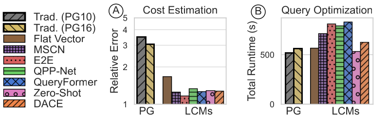

图 1：（A）在未见过的 IMDB 数据集上，LCM 的代价估计优于传统方法；（B）但在 JOB-Light 工作负载上优化连接顺序时，传统 PostgreSQL（PG）模型仍表现最佳。

**需要准确的代价模型。** 数十年来，基于规则或启发式的经典代价估计一直是商业 DBMS 查询优化的支柱。但传统方法依赖启发式和简单的解析模型，准确率不高，估计值常与实际执行代价相差几个数量级 [21]，从而产生次优执行计划和更长运行时间。因此，大量研究致力于提高代价模型的精度和整体性能 [11, 15]。

**学习型代价模型的兴起。** 借助机器学习（ML）的潜力，近年出现了许多学习型代价模型 [1, 2, 5, 8, 10, 12, 13, 18, 22, 23, 25, 27, 39, 40, 44, 46]。这些模型通常利用训练查询的实际执行代价学习模式，再预测新查询的执行代价。LCM 的主要承诺是更好地捕捉复杂数据分布及其与工作负载之间的依赖关系，从而提高查询处理效率并缩短运行时间。许多近期论文 [13, 23, 31] 因而表明，在代价预测上，LCM 可显著优于 PostgreSQL 等传统数据库系统采用的经典代价模型。

**LCM 真的有助于查询优化吗？** 尽管 LCM 提高了预测准确率，核心问题仍是：它们是否以及在多大程度上改善了查询优化。令人意外的是，多数现有评测主要关注代价估计准确率，基本忽略代价模型究竟如何改善查询优化 [2, 10, 13, 18, 23, 25, 27, 31, 40, 44, 46]。我们认为，单看准确率没有意义，因为它不能反映计划排序和选择等重要优化任务。因此，我们开展系统研究，考察学习型代价模型对查询优化究竟有多好。遗憾的是，我们的研究结果相当严峻；图 1 展示了我们研究中的一些发现。在图 1A 中，我们比较了广泛的近期 LCM：在 IMDB 上，以预测误差衡量时，所有 LCM（彩色柱）都优于传统 PostgreSQL 方法（PG，黑柱）。[^q-error] 然而，把代价模型用于 JOB-Light [18] 的最优连接顺序搜索时，情况完全不同。图 1B 表明，LCM 没有降低总查询运行时间：没有一种 LCM 比 PostgreSQL 选得更好，所选计划在 JOB-Light 上的总运行时间最高达 832 秒，而 PostgreSQL 为 510 秒。

**一项新的评估研究。** 上述结果说明，只看代价估计准确率远远不够。因此，我们提供一项系统研究，阐明 LCM 为何未能支持更好的优化器决策。我们选择连接排序、访问路径选择和物理算子选择这三项最重要的查询优化任务，分析 LCM 能否改善计划选择。作为主要贡献，我们评估一组覆盖文献中广泛方法的近期 LCM，并与 PostgreSQL 传统代价模型比较其查询优化影响；我们还针对每个下游任务提出细粒度的专用评估策略，超越预测准确率，直接考察 LCM 如何影响查询优化。

**我们研究的关键发现。** 我们的评估揭示了三个关键发现，总结如下：

1. **代价预测准确率高并不充分。** 我们观察到，在所有任务中，只关注计划代价预测准确率都不够。LCM 还必须可靠地排序和选择计划。现有 LCM 大多只优化预测误差中位数，尾部误差却很大，造成严重高估和低估，更容易选择非最优计划。
2. **训练数据很重要。** LCM 通常以传统优化器预先优化过的查询训练，所以训练集偏向近最优计划；查询优化时却必须同时估计最优与非最优计划。训练数据收集中的超时还会引入其他偏差，扭曲 LCM 对“坏”计划的理解。例如，含嵌套循环连接的计划常在完成前超时，于是训练集只保留嵌套循环有利的情况。
3. **不要丢掉已有知识。** 传统代价模型的估计虽常明显偏离实际代价，却包含多年经验积累的专家知识。我们发现，把传统模型的估计作为 LCM 输入非常有益，能显著改善面向查询优化任务的代价估计。

**对 LCM 的启示。** 我们相信，这些结果能引导未来研发走向更可靠、能为查询优化作出明智决策的机器学习代价估计。我们根据本文证据讨论若干方向，以构造真正有益于查询优化的 LCM。为便于研究社区复现和扩展我们的结果，我们公开了源代码、模型和全部评估数据。[^artifacts]

**文章结构。** 我们首先在第 2 节介绍代价估计背景；接着在第 3 节给出评估方法和近期 LCM 分类；随后在第 4、5、6 节分别评估连接排序、访问路径选择和物理算子选择；我们在第 7 节提出建议，并在第 9 节总结全文。

[^q-error]: 我们报告代价模型的标准指标——中位数 Q-error，表示预测代价相对实际代价的偏差。完美预测的 Q-error 为 1，实验设置详见第 3.3 节。
[^artifacts]: 源代码：<https://github.com/DataManagementLab/lcm-eval>；实验数据和训练模型：<https://osf.io/rb5tn/>。

## 2 代价估计背景

本节先概述经典代价估计和学习型代价估计，随后我们说明 LCM 的学习过程，并给出一个分类法，以指导我们在第 3 节选择近期模型。

### 2.1 传统与学习型代价估计

**传统代价估计。** 查询优化器要从庞大搜索空间中选出最优计划，就必须精确估计不同候选计划的代价。因此，自数据库发展之初，人们便投入大量工程工作估算查询计划执行代价。MySQL [37]、Oracle、PostgreSQL 和 System R [3] 等大多数系统使用手工构造的代价模型。这类模型通常为计划中的每种物理算子提供一个代价函数，依据 CPU 使用、I/O 操作、内存消耗、预期 tuple 数量以及随机或顺序页面访问来估计运行代价。然而，数据、查询和数据布局变化多样，传统模型不得不作属性独立等简化假设，常导致错误执行代价预测，使优化器作出次优决策并增加运行时间 [21]。

**学习型代价估计。** 提高预测准确率的需求和机器学习的兴起催生了 LCM，其基本思想是用学习模型逼近复杂代价函数。典型模型从以往查询执行中学习，再预测运行时间等执行代价。与基于简化假设的传统模型相比，LCM 有望学习任意复杂函数，取得更高准确率，并最终选出性能更好的查询计划。

### 2.2 LCM 的学习过程

我们的研究也考察由 LCM 学习过程引发的影响，因此先结合图 2 回顾典型流程。

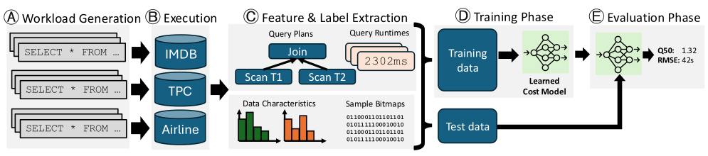

图 2：LCM 的学习过程。（A）生成合成训练查询；（B）在训练数据库上执行查询；（C）抽取特征（查询计划、数据特征和样本 bitmap）与标签（查询运行时间），形成训练和测试数据集；（D）以监督学习训练 LCM；（E）在未见测试数据上评估 LCM。

首先，工作负载生成器产生大量随机合成 SQL 字符串，覆盖过滤谓词、连接、聚合类型等代表性查询属性（A）。随后在航空、电影等数据库上执行查询，收集实际代价（B）。许多 LCM 的训练流程会因执行超时和预优化查询而产生数据偏差，后文将详细讨论。接着，从执行中抽取各种信息（C）：最重要的是作为模型输入的物理查询计划，此外还有直方图、样本 bitmap 等数据特征。最后，把工作负载（计划和运行时间）划分为训练与测试部分，训练并评估 LCM（D、E）。

### 2.3 LCM 分类

近年 LCM 在多个维度上差异显著。我们在本节给出分类，以组织不同方法；这套分类将指导我们选择研究所用的 LCM，并确保我们覆盖各种方法学，进而分析这些差异如何影响查询优化能力。

**输入特征。** 输入特征从执行后的工作负载中抽取（图 2C）。模型必须表示查询计划和底层数据分布，才能合理预测执行代价；这种预测继而影响查询优化，正如我们将展示的那样，但不同 LCM 使用的信息不同。

1. **SQL 字符串与查询计划。** 早期模型有些依赖 SQL 字符串，其中包含表、谓词和连接信息，却没有物理算子或连接顺序等执行计划细节。因此，多数 LCM 使用物理查询计划，包含扫描、连接等算子及嵌套循环、哈希连接等物理类型。正如我们稍后将看到，这对查询优化至关重要。
2. **基数。** 中间基数表示算子要处理的 tuple 数，是计划总代价的重要信号 [21]。许多 LCM 把数据库基数估计器标注的中间基数作为输入，也有方法另用相关工作的学习型估计器 [14, 18, 42]。尽管有些 LCM 忽略基数，我们的研究表明，它能提升 LCM 代价估计对多项优化任务的实用性。
3. **数据分布。** 尤其在不用基数时，理解基表数据分布也有助于估计代价。例如，列中 distinct value 数会影响哈希连接等物理算子的效率。有些 LCM 因而使用数据库统计信息、直方图或基表样本 bitmap（我们稍后会解释）；但正如我们将在研究中展示，它们对查询优化任务的作用仍不明确。
4. **代价估计。** 某些最新 LCM 甚至把经典代价估计器的结果作为强输入信号。这使模型成为结合传统代价模型与学习方法的混合模型；这项研究表明，这会带来显著收益。

**查询表示。** 许多 LCM 用基于图的表示编码查询计划，显式利用算子的父子顺序；另一些 LCM [2, 18] 把查询计划或 SQL 字符串表示为固定长度的扁平向量，不建模算子依赖，我们在本文中称之为“扁平表示”。[^graph-representation] 直觉上，保留结构应优于扁平表示，但在我们的研究中，图结构的收益并不明确。

**数据库依赖。** 另一个重要维度是模型能否泛化到未见数据库。数据库无关 LCM [13, 23] 可直接预测训练集之外的新数据库，无需为其收集专用训练数据；数据库特定模型 [27, 31, 44] 则不能泛化。前者泛化更强，后者可更贴合单个数据库，哪一类更适合查询优化值得研究。

**模型架构。** 各 LCM 还采用决策树、树结构神经网络、神经单元、图神经网络和 Transformer 等不同架构。它们在代价估计任务上各有表现，但哪种最适合查询优化仍无定论。

[^graph-representation]: 此处“基于图的查询表示”指模型是否利用查询图结构，而不是模型自身的学习架构是否为图结构。

## 3 评估方法

本节我们先讨论研究所选 LCM，再说明评估策略；随后我们解释研究纳入哪些下游任务以及为何选择这些任务，最后说明实验设置。

### 3.1 LCM 选择

现有 LCM 在多个维度上不同，而这些差异可能影响查询优化。我们选择表 1 所示、覆盖多种方法的代表性先进 LCM，并优先采用提供制品、可复现结果的模型。下面我们简要讨论模型选择。

| 模型 | SQL 字符串 | 物理计划 | 基数 | DB 代价估计 | DB 统计 | 样本 bitmap | 查询表示 | 数据库依赖 | 模型架构 |
| --- | :---: | :---: | :---: | :---: | :---: | :---: | --- | --- | --- |
| Flat Vector [10] |  | ✓ | ✓ |  |  |  | 扁平 | 数据库无关 | 回归树 |
| MSCN [18] | ✓ |  |  |  |  | ✓ | 扁平 | 数据库特定 | Deep Sets |
| End-To-End [31] |  | ✓ |  |  | ✓ | ✓ | 图 | 数据库特定 | 树结构神经网络 |
| QPP-Net [27] |  | ✓ | ✓ | ✓ |  | ✓ | 图 | 数据库特定 | 神经单元 |
| QueryFormer [44] |  | ✓ |  |  | ✓ | ✓ | 图 | 数据库特定 | Transformer |
| Zero-Shot [13] |  | ✓ | ✓ |  | ✓ |  | 图 | 数据库无关 | 图神经网络 |
| DACE [23] |  | ✓ | ✓ | ✓ |  |  | 图 | 数据库无关 | Transformer |

表 1：我们研究所选 LCM 及其主要维度。

1. **Flat Vector [10]。** 这是十五年多以前发表的早期方法，是近期复杂模型的简单基线。它把物理查询计划表示成固定长度向量，每种算子类型（如哈希连接、嵌套循环连接、基于排序的聚合、哈希聚合）对应一项，其中存放该类型算子的中间基数之和；再以该向量训练先进回归模型 LightGBM [16]，预测计划运行时间。
2. **MSCN [18]。** 作为第二种模型，我们选择较新一代早期模型 MSCN。它最初为基数预测设计，也已用于代价估计 [13, 31, 40]。我们纳入它，是因为它是本文唯一以 SQL 字符串而非物理计划为输入的模型：它用 one-hot 编码的扁平特征向量描述表、连接条件和谓词，还用样本 bitmap 表示给定查询的过滤条件在基表上选中哪些行，以学习数据分布。
3. **End-To-End [31]。** 作为第三种方法，我们选择首个显式建模计划结构的 LCM End-To-End。它采用树结构神经网络，把多个多层感知机（MLP）结合起来编码输入特征，并沿查询图聚合。
4. **QPP-Net [27]。** 它同样感知计划结构，但采用模块化“神经单元”：为哈希连接、嵌套循环连接等每种算子训练一个 MLP。每个单元接收算子相关特征，预测单算子运行时间和隐藏状态，再沿查询图把后者传给下一个 MLP；此外还学习估计基数和算子代价。
5. **QueryFormer [44]。** 与基于简单 MLP 的 QPP-Net 和 End-To-End 不同，它用 Transformer 估计查询代价，并引入树形自注意机制，面向含很多算子的长计划学习。它还纳入样本 bitmap 和基表直方图等更丰富特征。
6. **Zero-Shot [13]。** 这是首个可跨数据库泛化的数据库无关模型。它学习表大小等可迁移特征，不像早期模型那样编码属性名、表名等数据库特定特征；其架构采用图神经网络的变体。
7. **DACE [23]。** DACE 是较新模型，把 Transformer 与数据库无关方法结合，使用自注意 [35] 和树结构注意机制。它的特征更精简，主要学习算子树和传统模型给出的代价估计（即 PostgreSQL 代价）。

### 3.2 查询优化任务

在本研究中，我们评估三项都依赖精确代价、却分别考验不同计划选择能力的任务。

**连接排序。** 连接顺序决定查询计划中基表连接的先后。连接通常是计划里最昂贵的操作；次优顺序会令中间基数爆炸并显著增加运行时间。优化时，LCM 与动态规划等计划枚举技术结合，选择估计代价最低的计划。

**访问路径选择。** 除连接顺序外，在索引与表扫描之间正确选择也决定最终计划的运行时间 [29]。B-tree 等索引若选择得当可大幅加速访问，但索引访问相对扫描访问的代价取决于选择率、数据分布等因素，LCM 必须真正理解这些因素。

**物理算子选择。** 查询优化还必须选择算子的物理实现。例如多数数据库支持哈希连接、排序归并连接和嵌套循环连接。最佳实现取决于中间结果大小、数据是否有序等多个因素，而许多 LCM 并未显式纳入全部因素。

### 3.3 实验设置

**训练与评估数据。** 我们采用文献 [13] 的基准，其中包含 20 个真实数据库及一个工作负载生成器，可生成所有所选 LCM 都支持的 SPJA 查询，并反映近期 LCM 的先进训练查询生成方法。我们为每个数据库生成并执行 10,000 条查询，以覆盖广泛模式，并把超时设为 30 秒；这足以显现好坏计划选择的差异，也符合云服务商的现实场景 [33, 34]。我们为所有模型使用相同数据集和工作负载。我们在 CloudLab 的裸金属 c8220 实例 [9] 上以 PostgreSQL 10.23 执行查询，生成训练与评估数据。我们把每条查询执行三次，并取平均运行时间作为稳定真值；部分实验中，我们用 `pg_hint_plan` 强制计划选择。我们公开了所有模型、评估结果和训练数据。[^artifacts]

**模型训练。** 对数据库特定模型，我们在单个数据库上运行 10,000 条查询，并按 80%、10%、10% 划分训练、验证和测试集。我们向每个模型提供 10,000 条训练查询，并确认继续增加数据不再改善预测质量。数据库无关模型跨多个数据库训练，通常需要更多数据，却能开箱泛化到未见数据集；按照 [13, 23] 的策略，我们在 19 个训练数据库上各用 5,000 条查询训练，再在一个未见目标数据库上评估，继续增加训练数据同样未显著提高准确率。我们以不同的权重初始化和训练/测试划分随机种子把每种 LCM 训练三次，并在所有评估结果中取三次预测的平均值。

**传统基线。** 我们在本研究中采用 PostgreSQL 的代价模型，并纳入 10.23 和 16.4 两个版本，以扩大比较并观察传统模型演进。[^commercial-models] PostgreSQL 的算子代价是磁盘页面访问数与内存处理数据量的加权和。其估计不代表真实执行时间，但确实表征执行代价，可用于三项任务。为与 LCM 预测可比，我们用线性回归把逻辑代价缩放到实际运行时间，称为 Scaled PG10 和 Scaled PG16；其他论文也采用这一做法 [13, 23, 40, 44]。

**LCM 实现。** 对所有 LCM，我们都依托公开源码，并在我们的仓库中列出这些源码（见脚注 [^artifacts]）。为让它们使用相同训练数据，我们重新实现了少量细节。例如 QueryFormer 原先硬编码为仅支持 IMDB，假定固定的表和过滤条件。我们先统一物理计划、数据库统计、样本 bitmap 等输入，再为每个数据集维护特征统计，用于归一化及模型所需的表名、列名 one-hot 编码。我们还统一了训练与评估管线，以收集一致指标；我们所作的所有修改均不改变这些模型的内部行为。

[^commercial-models]: 商业 DBMS（如 Microsoft SQL Server）还有更精细的传统模型，但我们已经从本研究结果看到，LCM 尚不能超越 PostgreSQL。

### 3.4 为什么需要新指标

既有工作通常在未见测试集上报告中位数及各分位点 Q-error，以评估 LCM 预测执行代价的准确率。

**定义 1（Q-error， $Q _ {50}$）。** 对观测标签 $y$ 和预测 $\hat{y}$，Q-error 是二者比值中的较大者：

$$
Q=\max\left(\frac{\hat{y}}{y},\frac{y}{\hat{y}}\right).
$$

$Q=1$ 表示完美预测。但我们认为，这一策略不足以评估 LCM 在查询优化中的适用性，原因有二。

1. **只关注单个候选计划。** 传统评估通常对工作负载中的每条查询只考察一个计划；优化器实际要从多个候选中选一个。对一项希望理解计划选择质量的研究，评估方法必须为同一查询枚举多个计划，并报告能向我们表明模型选取最佳计划能力的指标。
2. **只以准确率为指标。** 传统策略主要关注运行时间预测准确率，而正确选择计划、正确排列候选计划的能力更关键。因此，我们在后续各节为相应任务引入新指标，直接评价 LCM 的排序和选择特性。

## 4 任务一：连接排序

连接排序是查询优化中的关键任务，尤其对涉及多表连接的复杂查询影响显著。下面我们先说明详细实验设置和新增指标，再给出多组实验结果，分析当前 LCM 能否可靠判断连接顺序。

### 4.1 评估设置

**实验设置。** 既有策略只评估单个候选计划的预测准确率，而我们比较 LCM 能否选出好的连接顺序。对给定工作负载，我们穷举所有连接排列，并让每种 LCM 像传统优化器一样预测其执行代价。我们选择穷举是为了隔离变量，避免枚举策略本身（例如只枚举左深计划）导致坏计划入选。这样，我们测量的是 LCM 所提供的代价或运行时间是否足以支持优化器选择好顺序，而非枚举策略是否有效。在本研究中，我们采用专门评估连接排序的 JOB-Light [18, 21]：它在 IMDB 数据集上包含 70 条 SPJA 查询；与 TPC-H 等数据集相比，其相关性和非均匀分布更多，任务更难。

**实验指标。** 除 Q-error 外，我们定义以下指标。

**定义 2（所选运行时间， $r$）。** 给定一组候选计划， $r$ 是 LCM 所选计划的实际运行时间 $y$，即预测 $\hat y$ 最小的候选：

$$
r=y _ {\arg\min _ i\hat{y}}.
$$

**定义 3（超越计划比例， $sp$）。** 对实际运行时间为 $y$ 的所选计划， $sp$ 表示实际运行时间比它更长的计划占比。 $sp=100\verb0%0$ 表示选中最优计划， $sp=0\verb0%0$ 表示选中最差计划。对总共 $n$ 个计划：

$$
sp=100\verb0%0\cdot\frac{1}{n}\sum _ {i=1}^{n}\mathrm{bool}(y _ i\gt{}r),
\qquad sp\in[0\verb0%0,100\verb0%0].
$$

**定义 4（秩相关， $\rho$）。** 优化器需要按代价排列计划，因此我们以 Spearman 相关衡量模型对计划的排序能力 [30]：

$$
\rho=1-\frac{6\sum _ {i=1}^{n}d _ i^2}{n(n^2-1)},
\qquad \rho\in[0\verb0%0,100\verb0%0],
$$

其中 $d_i$ 是对应运行时间的秩之差， $n$ 是计划数。[^source-anomalies-metrics]

[^source-anomalies-metrics]: 此处按原文照录三处不一致：定义 2 的公式没有给 `ŷ` 添加下标 `i`；定义 3 的文字使用实际运行时间 `y`，公式则使用 `r`；定义 4 把 `ρ` 的范围写成 `[0%, 100%]`，但原文后文又报告 `ρ=-0.23`。

**定义 5（最大相对低估/高估， $m _ u,m _ o$）。** 这两个指标表示候选计划在最坏情况下被低估或高估的倍数。对预测 $\hat y$ 和标签 $y$：

$$
m _ u=\min _ i\left(\frac{y _ i}{\hat y _ i}\right),
\qquad
m _ o=\max _ i\left(\frac{\hat y _ i}{y _ i}\right).
$$

**指标讨论。** 正如我们在所有实验中所示，只关注准确率不能评价查询优化中的代价模型，所以我们提出并采用多种指标。但每项指标都有局限，必须结合起来解释行为。例如，相关性可判断模型是否正确排序计划，却不能说明排序错误的严重后果；一次错误可能选中极差计划。因此，我们还必须考察超越计划比例和所选总运行时间。

### 4.2 示例查询与指标

我们首先在图 3 中报告 JOB-Light 查询 33 的结果，用它说明上文引入的指标；该查询的结果也能代表我们在第 4.3 节开展的完整实验。该查询含四张表，共有 120 种连接排列。下文我们逐一讨论各子图（A～G）。

```sql
SELECT COUNT(*)
FROM title t
JOIN movie_info mi ON t.id = mi.movie_id
JOIN movie_info_idx mii ON t.id = mii.movie_id
JOIN movie_companies mc ON t.id = mc.movie_id
WHERE mii.info_type_id = 101
  AND mi.info_type_id = 3
  AND t.production_year > 2005
  AND t.production_year < 2008
  AND mc.company_type_id = 2;
```

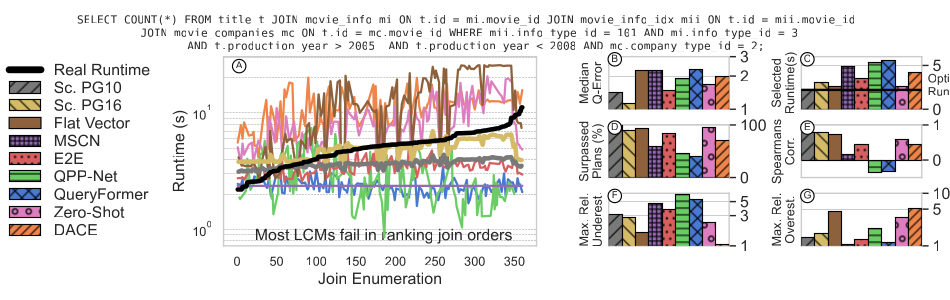

图 3：JOB-Light 查询 33 的连接排序示例。我们报告（A）模型预测、（B）总体准确率、（C）查询优化结果、（D）模型最优性、（E）排序能力，以及（E、F）低估和高估。对该查询，Scaled PG10 选中最优计划，并在多数指标上优于所有 LCM。[^source-anomaly-figure3]

[^source-anomaly-figure3]: 原文 Figure 3 的图内小标题和后续正文使用 F、G，但图注把低估与高估写成 E、F；此处按原文图注照录。

**A：模型预测。** 我们按实际运行时间排列不同连接排列的计划，黑线表示真值。最左计划最优，运行 2.20 秒；最差计划耗时 11.17 秒。我们还在同一图中展示所有 LCM 的预测，以定性观察其行为。多数 LCM 的预测代价没有随实际代价规律增长，容易产生错误的局部最小值并选中不利计划；Scaled PG10（灰线）和 Scaled PG16（金线）则随实际代价增长。

**B：中位数 Q-error。** 为评价整体预测准确率，我们报告所有连接排列预测的 Q-error。本例中 Scaled PG16 最好， $Q _ {50}=1.23$；Scaled PG10 次之， $Q _ {50}=1.42$。MSCN 的 $Q _ {50}=2.23$ 看似不差，却对所有计划预测完全相同的运行时间。其特征只来自 SQL，无法区分查询计划的连接顺序和算子，所以不能用于连接排序或物理计划选择；我们仍纳入了这个常用的朴素代价预测基线 [13, 24, 44]。

**C：所选运行时间。** 为评价 LCM 对查询优化结果的影响，我们报告所选运行时间。Scaled PG10 选择的计划运行 $r=2.20$ 秒，表现最好；QueryFormer 最差，所选计划运行 $r=5.56$ 秒，超过最优计划的两倍。其他 LCM 都介于二者之间，没有一个比 Scaled PG10 选择得更好。Scaled PG16 选中的计划略逊于 PG10，但仍接近最优。

**D：超越计划比例。** 接着，我们评价超越计划比例，它表示所选计划超过了多少比例的候选计划，也就是所选计划的相对排名。例如，模型若在 10 个计划中选中排名第 5 的计划，就超越了 $5/10=50\verb0%0$ 的计划。Scaled PostgreSQL 在本例选中最优计划， $sp=100\verb0%0$；最差的 QueryFormer 仅超越 $sp=39\verb0%0$ 的候选计划。

**E：秩相关。** 我们报告实际与预测运行时间之间的秩相关，以评价模型的排序能力。Scaled PG10 和 PG16 的相关性最高，分别为 $\rho=0.79$ 和 $\rho=0.72$。所有 LCM 都更差，QueryFormer 甚至为 $\rho=-0.23$。负值意味着实际运行时间增加时预测值反而倾向下降，排序任务失败；这向我们表明，传统模型的预测在本例能更好地排列计划。[^ranking-models]

**F、G：低估与高估。** 我们现在报告 LCM 的低估与高估。显著低估运行时间会使优化器选中实际很慢的计划。观察 F、G 时，我们得到两个现象：LCM 的低估和高估通常都比 Scaled PG10/PG16 更严重；PostgreSQL 倾向系统性低估执行代价，这与 [21] 一致，常见原因是过滤属性独立假设。LCM 则同时容易低估和高估，更宽的误差范围提高了选中非最优计划的可能性。

[^ranking-models]: 这一观察也促成了基于排序的代价模型这一有趣替代方向 [4, 6, 47]。

### 4.3 连接排序完整结果

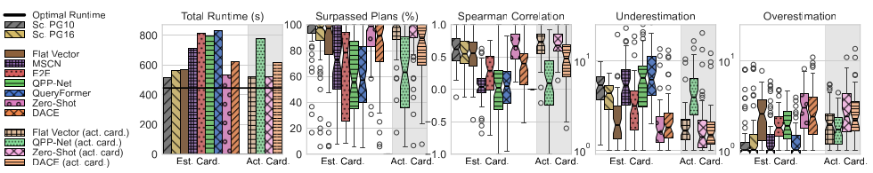

图 4：JOB-Light 的完整连接排序结果。传统模型在各项连接排序指标上仍经常优于 LCM；使用实际基数可显著改善 LCM。

我们把上述指标汇总到完整 JOB-Light。查看所选计划的总运行时间时，我们看到 Scaled PG10 最短，为 $r=518$ 秒；Zero-Shot 以 $r=530$ 秒居后。若每条查询都完美选中计划，最优总时间为 $446$ 秒；最差的 QueryFormer 为 $r=830$ 秒。我们还看到，Scaled PG10/PG16 的超越计划比例同样优于 LCM。

在秩相关方面，我们可以看到 Zero-Shot 反而是最好模型，超过传统方法；但其所选计划总运行时间仍不及传统模型。结合高低估，我们可以看到 Zero-Shot 同时发生低估和高估，最终选择较差。另一个值得注意的结果是：表现最好的三种 LCM 都是数据库无关模型；结构极其简单的 Flat Vector 也常居第三。

### 4.4 改进基数的影响

中间基数显著影响最优连接顺序和查询代价。许多 LCM 使用 PostgreSQL 的估计基数作为计划代价输入，但 PostgreSQL 的基数估计常不准确，有时相差多个数量级；已有研究表明，改善基数会大幅提高代价估计 [21]。为隔离代价估计与基数估计的影响，我们用实际观测基数替代估计基数，重新训练和评估所有把基数作为输入的模型，即 Flat Vector、QPP-Net、Zero-Shot 和 DACE（见表 1），并重复第 4.3 节实验。

图 4 中浅色柱为新变体。完美基数确实改善总体结果，例如 QPP-Net 总运行时间从 $r=765$ 秒降至 $r=644$ 秒。尽管如此，此时最好的 LCM——Flat Vector——仍不及继续使用估计基数的 Scaled PG10。作为一个积极结果，我们想强调，完美基数显著改善了所有 LCM 的秩相关和低估情况。

### 4.5 向 PostgreSQL 提供准确基数

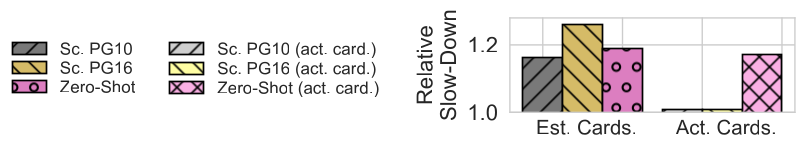

图 5：相对最优执行的运行时间减速。PostgreSQL 模型比 LCM 更接近最优，使用完美基数时尤其如此。

最后，我们把准确基数也提供给经典模型，比较 Scaled PG10、Scaled PG16 和前一实验表现最好的 LCM Zero-Shot，相对于 JOB-Light 最优总运行时间的减速。Zero-Shot 比最优慢 18.9%，Scaled PG10 慢 16.23%，Scaled PG16 慢 24.9%。向 PostgreSQL 模型提供实际基数后，其性能大幅改善，分别只比最优慢 1.0% 和 0.8%，接近完美计划选择。Zero-Shot 却只略有改善，说明它尚不能充分利用基数信息；对个别计划仍同时高估和低估，因而选中非最优计划。

### 4.6 总结与启示

连接排序分析显示，传统 Scaled PostgreSQL 仍比 LCM 更能选出低运行时间计划。只有计划排序能力这一项，Zero-Shot 超过传统模型，证明 LCM 确实存在改善查询优化的潜力；传统模型也并非完美，某些情况下仍找不到更快计划。

本任务表现最好的三种 LCM 都是数据库无关模型，简单的 Flat Vector 也相当不错。LCM 对接近最优的计划往往预测更准，对实际运行时间更长的次优计划则有更严重的高低估。原因之一是训练集中的最优计划通常多于次优计划，这源自我们在第 7 节讨论的有偏训练策略。因此，我们建议未来在训练中系统纳入这些次优计划的信号，减轻高低估；另一个方向是让 LCM 不只预测运行时间，也预测置信度。

## 5 任务二：访问路径选择

作为我们研究的第二项任务，我们考察访问路径选择，即数据库引擎如何取得所需数据，常见方法有顺序扫描和索引访问。索引并非总是更快：表很小或查询返回表中很大比例的数据时，访问索引的开销可能超过收益，顺序扫描反而更高效。因此，访问路径选择会直接影响数据库性能，是查询优化的关键任务 [29]。优化器通常估计各路径代价并选择最低者。下面我们仍从个例开始，再扩展到更广泛的工作负载。

### 5.1 评估设置

**实验设置。** 我们考察 LCM 在 PostgreSQL 支持的顺序扫描和 B+-tree 索引扫描之间作选择的能力，内部对应 `SeqScan` 与 `IndexScan`/`IndexOnlyScan`。bitmap 索引扫描、哈希扫描等其他方式不在我们的研究范围内；我们将表明，仅在这两种路径之间选择，对所有模型而言都已很困难。训练数据为所有表的主键建立索引，这是常见数据库配置。

**定义 6（平衡准确率， $B$）。** 正如我们将在评估中看到的，访问路径选择经常存在类别不平衡，所以除前述指标外，我们引入平衡准确率，使正负两类得到同等考虑。它是真阳性率（TPR）与真阴性率（TNR）的算术平均：

$$
B=\frac{1}{2}(\mathrm{TPR}+\mathrm{TNR}),
\qquad
\mathrm{TPR}=\frac{TP}{TP+FN},
\qquad
\mathrm{TNR}=\frac{TN}{TN+FP},
\qquad B\in[0,1].
$$

### 5.2 示例查询与指标

为展示我们的方法和新指标，我们先给出高、低选择率下的执行代价预测示例，随后再扩展到多个列的更广泛研究。我们选择一个查询，过滤 IMDB `title` 表的 `production_year` 列；该列从 1880 到 2019，且年份分布偏斜。我们对同一谓词分别执行 `IndexScan` 和 `SeqScan`。为得到原文所谓“低选择率”，我们使用 `production_year >= 1880`（它基本选中全表）；为得到原文所谓“高选择率”，我们使用 `production_year >= 2011`（约选中 20% 的记录）。但 Figure 6 的标签和后续部分文字又反过来把 A 称为“高选择率”、B 称为“低选择率”。这里及下文分别照录原文中的矛盾称谓。我们在图 6 中以 ✓ 和 X 标记依据模型预测作出的正确、错误选择，并同时给出实际运行时间和预测值。[^source-anomaly-selectivity]

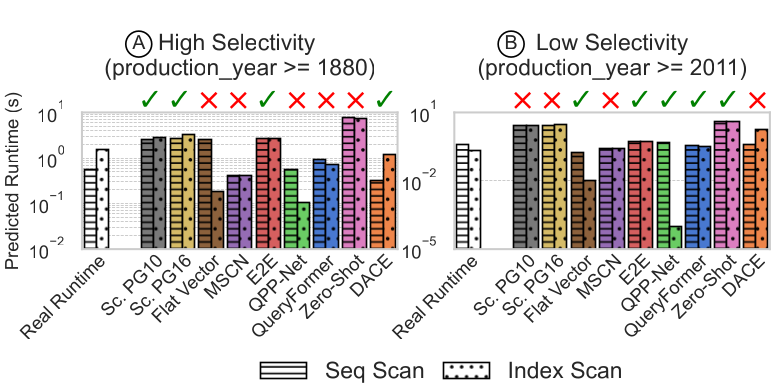

图 6：对 `movie.production_year` 表扫描的预测。我们将白柱表示的实际运行时间与 LCM 预测并列，并标出高选择率（A）与低选择率（B）场景下正确（✓）和错误（X）的访问路径选择。

在原文对图 6A 的讨论中，我们先把它称为“低选择率”查询，并看到顺序扫描实际为 0.71 秒，快于索引扫描的 1.78 秒；但随后我们又把同一个 A 称为“高选择率”，并看到九种模型中有五种——Flat Vector、MSCN、Zero-Shot、QueryFormer、QPP-Net——选中慢 2.5 倍的索引扫描。对图 6B，我们先把它称为“高选择率”、随后又称为“低选择率”；其情况相反：我们看到顺序扫描为 0.35 秒，比 0.07 秒的索引扫描慢 5 倍，只有 MSCN 和 DACE 选错。如果我们查看两种扫描的预测代价，还会看到许多 LCM 给出的时间极其接近，说明本例的选择很不稳定。总体上，我们看到 LCM 难以正确选择访问路径，准确率会随选择率变化。

[^source-anomaly-selectivity]: 源 PDF 第 14～15 页对 A、B 的“高/低选择率”称谓在正文内部以及正文与 Figure 6 标签之间互相矛盾；译文没有按数学惯例代为统一。

### 5.3 跨选择率的访问路径选择

我们继续对同一查询的 `production_year >= ...` 生成不同过滤常量，使选择率在定义域内等步变化。每条查询按 LCM 估计代价选择路径，再测量运行时间。图 7 最左侧给出顺序扫描和索引扫描的实际运行时间，绿色表示模型选择最优路径时的运行时间。小选择率下索引扫描（虚线）更有利；选择率超过 0.3 后，顺序扫描（实线）更好。后续子图依次展示 PostgreSQL 和各 LCM 的选择，每个叉代表一条执行过的查询。

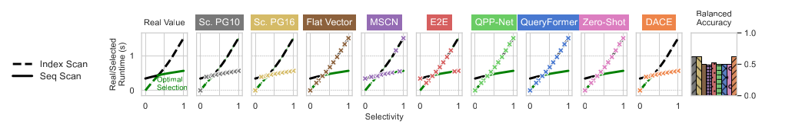

图 7：在 IMDB 的 `title.production_year` 上，以顺序扫描或索引扫描执行不同选择率查询时的实际代价和所选运行时间。许多 LCM 不论选择率为何都选择索引扫描。

我们看到，没有任何模型始终选对。Flat Vector、Zero-Shot、QPP-Net 和 QueryFormer 无论选择率为何都选索引扫描；MSCN 和 End-To-End 尤其在较高选择率下极不稳定，会随机切换路径。Scaled PG10/PG16 大体呈现预期趋势，但也在部分较低选择率查询上选错；学习 PostgreSQL 代价的 DACE 表现与之相近。我们汇总的平衡准确率中，两种 PostgreSQL 模型和 DACE 最高，均为 $B=0.62$，但即使经典模型也仍难以选出最佳访问方式，结果并不令人满意。

| 数据集 | 表数量 | 平均 NaN 比例 | 每表列数（最小～最大） | 表长度（最小～最大） | 列 distinct value 数（最小～最大） |
| --- | ---: | ---: | ---: | ---: | ---: |
| Baseball | 25 | 9.70% | 25～48 | $520\sim1.38\times10^6$ | $2\sim1.64\times10^4$ |
| IMDB | 15 | 20.91% | 4～49 | $4\sim1.48\times10^7$ | $2\sim3.62\times10^7$ |
| TPC-H | 8 | 0.00% | 2～12 | $5\sim1.50\times10^6$ | $2\sim1.50\times10^6$ |

表 2：用于评估 LCM 访问路径选择能力的 Baseball、IMDB 和 TPC-H 数据集统计。

### 5.4 跨查询的访问路径选择

在更广泛的研究中，我们采用文献 [13] 中特征不同的 Baseball、IMDB 和 TPC-H（表 2），验证不同大小与数据特征的表和列上也存在相似问题。我们关注训练数据中没有索引的列（原文括注为“即 PK 列”），并询问假设索引存在时各路径的代价；我们排除缺失值超过 70% 的列，以隔离其带来的巨大基数误差；最后，我们只保留数值类型，以便用可靠分位点精确改变范围谓词选择率。[^source-anomaly-pk]

[^source-anomaly-pk]: 原文称这些列没有索引，却又括注“即 PK 列”；这与前文“所有表的主键均建立索引”相冲突，此处照录。

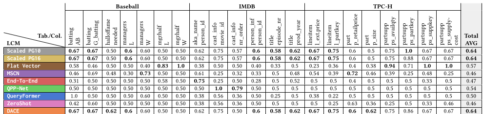

表 3：LCM 在不同工作负载、表和列上选择访问路径的平衡准确率 $B$。

我们在表 3 最后一列报告所有列的平均准确率。Scaled PG10、Scaled PG16 和 DACE 再次最好，跨所有列和表约为 $B=0.64$；简单的 Flat Vector 居次。QPP-Net 等模型虽专门学习统计信息和直方图，却没有更好表现，LCM 能否从这些制品中提取有意义信息值得怀疑。不同列上的准确率从很低到很高不等，表中以粗体标出了跨列的最低值和最高值；QueryFormer 和 QPP-Net 等模型甚至不优于准确率为 0.5 的随机选择，远不足以稳健解决访问路径选择。

### 5.5 访问路径偏好

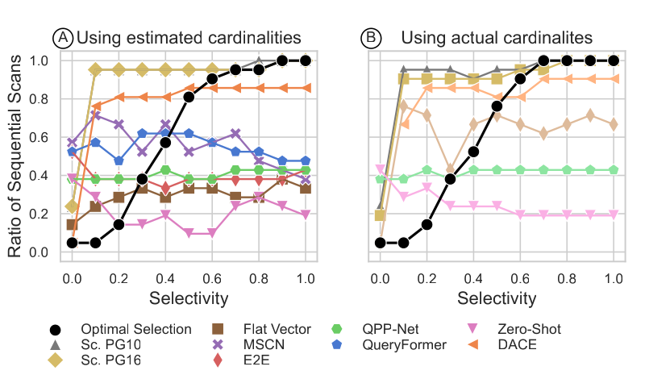

图 8：使用（A）估计基数或（B）实际基数时，LCM 随选择率变化的扫描偏好。

为分析许多 LCM 为何经常选错访问路径，我们考察它们在所有查询上的选择偏好。我们在图 8A 中汇总前一实验全部查询，按选择率给出所选表扫描的平均比例；索引扫描比例为 $1-$ 表扫描比例。我们用黑线表示最优选择。Scaled PG10、Scaled PG16 和 DACE 最接近最优趋势：低选择率多选索引扫描，高选择率多选表扫描，但它们过早在过小选择率下切换到顺序扫描。其他 LCM 几乎完全不理解选择率影响，表扫描比例近乎恒定，且多数模型静态偏好索引扫描。

为解释这种偏差，我们检查了训练数据：约 90% 是顺序扫描，索引扫描仅约 10%；更关键的是，只有索引真正有利时才会被使用，训练集中没有反例。因此，LCM 学到“索引扫描总是很有希望”，却没理解它在高选择率下的缺点。

### 5.6 改进基数的效果

我们用完美基数重复实验。图 8B 显示，Flat Vector 等部分 LCM 略有改善，更接近最优趋势；其他模型仍未捕捉到趋势。我们进一步分析这一行为并发现，这些简单扫描查询的基数估计已经很准确， $Q _ {50}\leq1.05$，所以继续改善基数对本任务帮助很小。

### 5.7 总结与启示

没有一种 LCM 在访问路径选择上给出令人信服的结果。与连接排序不同，主要问题是模型并未真正理解不同访问路径的代价；纳入数据库统计和样本 bitmap 也没有收益。LCM 在整个选择率范围内偏向索引扫描，表明训练数据偏差让它们学成了“索引总有利”。要缓解偏差，模型必须跨选择率学习两种访问路径的执行代价；我们将在第 7 节给出策略和初步结果。

## 6 任务三：物理算子选择

物理算子选择是为给定查询算子选择最高效执行算法的过程，直接影响查询性能和资源利用。其难点在于理解算法复杂度、数据分布、可用索引、硬件能力和工作负载特征的综合影响。本节以连接算法选择为重要实例，我们报告近期 LCM 选择物理算子的能力。

### 6.1 评估设置

**实验设置。** 我们生成通过外键关系连接两张表的查询，因为这种连接最常见，例如：

```sql
SELECT COUNT(*)
FROM title, movie_info_idx
WHERE title.id = movie_info_idx.movie_id
  AND title.production_year = 2009;
```

我们让查询使用 `COUNT` 表达式，以免与同样常用它的训练数据偏离过多。我们把每条查询分别以 PostgreSQL 支持的哈希连接（HJ）、排序归并连接（SMJ）和索引嵌套循环连接（INLJ）执行三次，取得真实运行时间；同时，我们取得所有 LCM 的预测。[^inlj-only]

**定义 7（命中率， $p$）。** 在本研究中，我们引入一项新指标，判断 LCM 选中具有最优物理算法的计划的频率。命中率表示在 $n$ 条查询中，代价模型有多少比例选择了最优物理算法，即预测最小的计划同时具有最低实际运行时间。

[^inlj-only]: 我们只使用 INLJ，因为该设置下主键总有索引。

### 6.2 示例查询与指标

我们在图 9 中以 IMDB 的代表性查询说明三种物理算子的真实运行时间和模型预测。

```sql
SELECT COUNT(*)
FROM title, movie_info
WHERE title.id = movie_info.movie_id
  AND movie_info.info_type_id < 8;
```

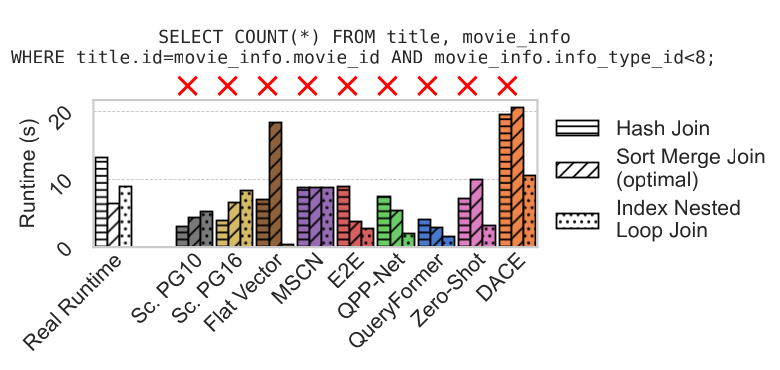

图 9：IMDB 两表连接的物理算子预测。我们把真实运行时间与 LCM 预测并列，标记正确（✓）和错误（X）的选择。没有一种 LCM 选择最快的 SMJ。

我们看到，该查询的最优算法是 SMJ，运行约 6.47 秒；INLJ 和 HJ 最长达 13.19 秒。然而两种 PostgreSQL 模型和所有 LCM 都没有选中最优算法。多数模型偏好运行 8.94 秒的 INLJ；Scaled PG10/PG16 则选择最差的 HJ，运行 13.19 秒。

### 6.3 物理算子选择完整结果

我们把实验扩展到 IMDB、Baseball、TPC-H 三个数据集（表 2），每个数据集 100 条查询。

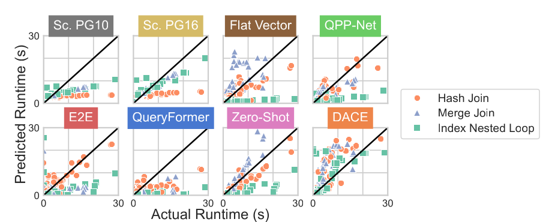

图 10：300 条查询（来自 IMDB、TPC-H 和 Baseball）上，不同连接类型的预测运行时间与实际运行时间。

**全部预测。** 我们在图 10 中把预测与实际运行时间可视化。300 条查询各有三个连接候选，所以每个子图包含 900 个预测。我们观察到，许多 LCM 的预测代价随算子类型发生巨大差异。例如 Zero-Shot 在各类型内部的预测与实际运行时间总体相关良好，但它准确估计 HJ，系统性低估 INLJ，并以近乎固定倍数高估 SMJ。Scaled PG10/PG16 的预测与实际时间呈线性趋势，却整体偏低。End-To-End、DACE 等模型则呈噪声行为，看不出算子类型内的线性关系。两类行为都会产生次优选择。我们还观察到，有些 LCM 在单个算子类型内排序一致（如 Flat Vector 对 INLJ），跨类型却不一致，尤其难以选出全局最优算子。

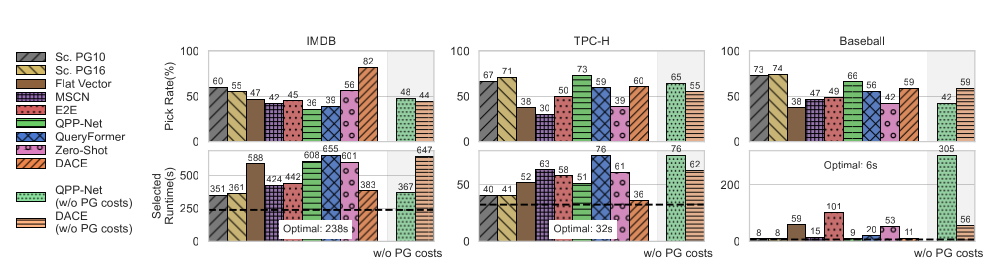

图 11：IMDB、TPC-H、Baseball 各 100 条查询上的物理算子命中率和所选运行时间。LCM 的表现可超过 Scaled PostgreSQL；但从 DACE、QPP-Net 输入中移除 PostgreSQL 估计代价后，性能恶化。

**汇总结果。** 我们在图 11 上排报告各工作负载的命中率 $p$，在下排报告所选总运行时间 $r$，并与选择最优算子的运行时间比较。在 IMDB 上，LCM 与 Scaled PG10/PG16 相当，有些模型在 IMDB 和 TPC-H 上超过它们。例如数据库无关的 DACE 在 IMDB 达到 $p=82\verb0%0$，Scaled PG10 只有 $p=60\verb0%0$；TPC-H 也有相似趋势。Baseball 上 Scaled PG16 以 $r=74\verb0%0$ 最好。[^source-anomaly-pick-rate] 若看所选总运行时间，IMDB 和 Baseball 上 Scaled PG10/PG16 最低，DACE 紧随其后；TPC-H 上 DACE 略胜。我们的结果表明，LCM 已有能力在此任务上与传统模型竞争，却仍没有显著收益。

[^source-anomaly-pick-rate]: 原文在讨论命中率时把 Baseball 的 74% 写成 `r=74%`，而该指标前文定义的符号是 `p`；此处照录。

### 6.4 从 PostgreSQL 代价中学习

DACE 和 QPP-Net 把 PostgreSQL 估计代价作为输入（表 1），属于利用传统模型专家知识的混合方法。为衡量这一信号的贡献，我们移除 PostgreSQL 代价特征，重新训练两种模型。图 11 每个子图右侧浅色柱给出消融结果。DACE 在 IMDB 的命中率从 $p=82\verb0%0$ 降至 $p=44\verb0%0$，所选运行时间从 $r=383$ 秒增至 $r=647$ 秒；其他数据集以及 QPP-Net 通常也如此，只有 QPP-Net 在 IMDB 的一个情形中意外改善。因此，我们清楚看到，PostgreSQL 代价通常是重要信号；正如我们将讨论的，未来 LCM 应保留它。

### 6.5 算子分布与偏好

在本实验中，我们希望了解 LCM 选择物理算子时会在哪里犯错。为此，我们把 IMDB 数据集中 100 条查询上各模型所选算子类型的分布，与最优算子分布进行比较。

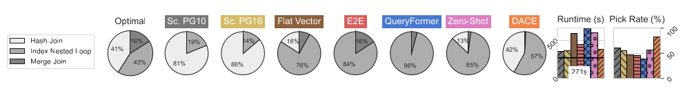

图 12：IMDB 测试查询上，物理算子选择的算子分布。

我们从最优分布看到，对 IMDB 的 100 条查询，INLJ 占 43%、HJ 占 41%、SMJ 占 16%。代价模型的选择却截然不同：Scaled PG10/PG16 强烈过度选择 HJ，多数 LCM 则过度偏好 INLJ；QueryFormer 在 95% 的查询中选 INLJ，Zero-Shot 为 85%。我们认为，这可能与访问路径实验的效应相同——训练集中 INLJ 被表示为有利。我们还在图 12 中报告命中率和所选运行时间，它们呈现相似现象。

### 6.6 在过滤列上增加索引

此前只在主键上使用索引。现在我们也给过滤列添加索引，使 INLJ 能更快查找非主键列，进而改变最优物理算子分布。然后，我们重复前一实验，并在图 13 中展示过滤列新增索引后的算子分布。[^qpp-net-indexes]

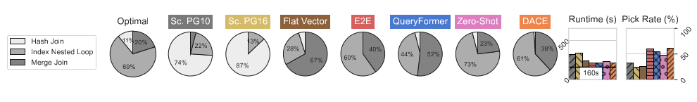

图 13：IMDB 测试查询在过滤列增加索引后的算子分布。

我们看到，最优选择中 INLJ 占比升至 69%。Scaled PG10/PG16 仍分别在 74% 和 87% 的查询中偏好 HJ，性能显著下降，运行时间和命中率都被多数 LCM 超过。这表明 PostgreSQL 代价模型校准不足，仍偏好哈希操作。另一方面，LCM 的收益可能只是源于它们过度偏好 INLJ，而 INLJ 在本实验中恰好经常更好。

[^qpp-net-indexes]: QPP-Net 使用固定 one-hot 编码特征，无法预测新增索引的代价，因此我们在本实验中排除 QPP-Net。

### 6.7 总结与启示

选择物理算子时，没有任何代价模型达到接近最优的运行时间。经典模型总体最好，按所选运行时间衡量，数据库无关模型 DACE 与之接近；但正如我们提到的，我们的消融实验表明，DACE 从 PostgreSQL 代价中受益很大。多数 LCM 强烈过度偏好 INLJ，这印证了访问路径研究中的发现：训练数据偏差是必须解决的问题。

解决偏差并不简单。INLJ 可能运行很久，在训练数据收集时常因需要数小时甚至数天而超时。一个值得研究的方向是：无需实际执行这些昂贵反例，也能把负面信号纳入模型训练。

## 7 对代价模型的建议

我们全面比较了查询优化中的 LCM 和传统模型。下面，我们总结结果与建议。主要结果是：尽管 LCM 在查询工作负载上的预测准确率更高，但在我们分析的所有任务中都无法显著胜过传统代价模型，LCM 所选计划的总执行时间往往反而更长。我们仍相信 LCM 潜力很大；正是长期只关注准确率，才造成我们今天所处的局面。下面，我们从主要发现中提炼建议，为充分释放 LCM 潜力提供未来方向。

**R1：考虑模型架构和特征。**

如第 2.3 节的模型分类所示，LCM 在输入特征、查询表示和模型架构上差异很大。

我们把最关键的经验总结如下：

1. 必须从查询计划学习，只以 SQL 字符串为输入不适合查询优化。
2. Flat Vector 等简单架构常有相对不错的表现，复杂架构是否必要值得质疑。
3. 数据库无关 LCM 常优于数据库特定模型，因为前者在更多样的查询工作负载和数据分布上训练。
4. 精确基数有助于下游任务，但统计信息和样本 bitmap 的帮助程度仍不明确。

**R2：使用适当指标。** 本文的另一个关键发现是，传统评估策略不足以衡量 LCM 对查询优化究竟有多好。因此，我们建议采用本文指标，评价模型如何从多个候选中选择计划、如何排列计划，以及在具体优化任务上带来多大加速；理想情况下，这些指标还应反过来影响模型设计和学习方法。例如，可把近期用于端到端学习型优化器的排序方法 [4, 6, 47] 应用于代价模型。

**R3：使训练数据多样化。** 我们研究的第三个关键发现是，传统训练策略因数据收集方式产生根本偏差。LCM 通常在预先优化过的查询上训练，因为数据库已执行这些查询以生成标签（图 2B）。为在合理时间内收集数据，训练查询必须设置超时；含嵌套循环等昂贵算子的计划更可能在完成前超时，于是训练集只保留这些算子有利的情况，访问路径选择也因此产生模型偏差（第 5 节）。文献 [28] 在学习型基数估计中观察到类似偏差。

总体而言，这类训练策略尤其不适合查询优化，因为训练分布与优化时出现的未优化查询严重偏离。要纠正偏差，训练数据必须同时覆盖好计划和坏计划。我们用一项小实验展示多样化对访问路径选择的帮助：额外生成 500 条不同选择率的随机扫描查询，每条都强制执行一次 `IndexScan` 和一次 `SeqScan`，且不设超时，再用它们微调 LCM。

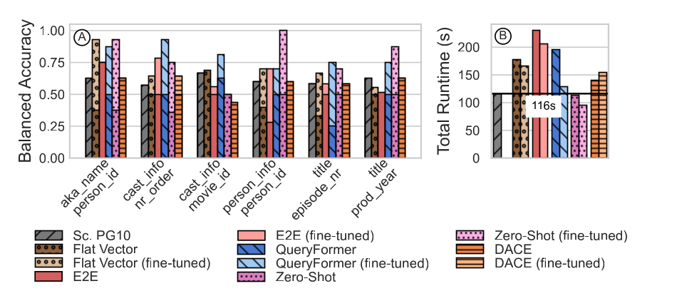

图 14：在 IMDB 各列上微调访问路径选择。（A）微调后，多数列的平衡准确率提高；（B）总运行时间同样改善，Zero-Shot 超过 Scaled PostgreSQL。

我们在图 14A 中报告表 3 所列 IMDB 各列在微调前后的平衡准确率 $B$。我们可以看到，多数模型都有明显改善。更重要的是，所有 LCM 的总运行时间最多改善 45%（图 14B）。Zero-Shot 是唯一超过 Scaled PG10 的模型，分别为 95 秒和 116 秒，向我们表明 LCM 确实能在下游任务中超过传统方法，也表明训练数据至关重要。DACE 通常不改善，因为如第 5.3 节所述，它似乎主要把 PostgreSQL 代价当作信号。

然而，训练数据多样化虽已用于学习型查询优化——如基数注入 [7, 47] 或探索 [41]——应用到 LCM 并不容易。每个查询计划会产生大量候选（如连接顺序排列），需要复杂策略选择信息量大的训练查询，同时控制数据执行成本。数据高效训练 [1]、伪标签生成 [24]、几何学习 [28] 和模拟 [41] 都是有希望的思路。另一个难题是运行数天、无法实际执行的计划；简单地给超时查询赋一个很大的常数也无济于事，因为 LCM 无法从中学到有意义的代价。

**R4：不要抛弃专家知识。** 我们观察到，使用 PostgreSQL 估计对 LCM 很有帮助，DACE 和 QPP-Net 的较好结果证明了这一点。混合方法同时利用传统模型的专家知识和机器学习拟合任意复杂函数的能力。DACE、QPP-Net 天然以传统估计为训练特征，近期工作还显式把传统代价函数与学习得到的查询特定系数组合 [40]。当 LCM 在字符串匹配操作、用户定义函数等场景仍面临重大困难，而传统模型更可靠时，这种方法尤其有前景。

## 8 相关工作

下文我们组织并讨论相关工作。

**学习型代价模型（LCM）。** 如第 1 节所述，现有 LCM 工作没有面向查询优化任务评估。少数已有评测与我们的评估相比，要么没有覆盖多样的优化任务，要么只分析少量学习方法。例如，早期分析 [38] 比较过传统和机器学习代价模型，却只考察简单 ML 方法；文献 [21] 分析传统优化器的基数估计和代价模型质量，没有评估学习方法。另一些工作只考察单一方面，例如查询计划表示方法和特征化对代价估计的影响 [5, 45]。

**学习型基数估计（LCE）。** 学习基数的想法已被广泛研究和评估 [14, 18, 42, 43]。文献 [36] 表明，LCE 常比传统方法准确，但训练和推理开销很高；文献 [32] 重新审视这一领域并提出统一设计空间，但两者都没有评估查询优化效果。文献 [17] 则表明，LCE 在许多情况下可相对 PostgreSQL 显著降低总运行时间。近期工作 [28] 发现了与我们在 LCM 工作中所示相似的偏差：LCE 通常依赖 PostgreSQL 优化器提供的近最优训练样本。它提出所需样本更少的几何 LCE 方法来处理偏差，但不能轻易迁移到 LCM。

**学习型查询优化（LQO）。** LQO 不使用代价模型，而是从 SQL 直接预测最优执行计划或执行 hint [6, 26, 41, 47]。这些方法虽然改善总体查询性能，结果的普适性却有限 [20]；后者发现，尤其把推理和计划选择纳入端到端时间后，PostgreSQL 在许多情况下仍超过近期 LQO。与我们的工作相似，它指出学习型数据库组件常不按预期工作，评估策略也存在偏差；但它关注强化学习方法，以及不同采样策略对训练/测试划分的影响。

## 9 结论

我们分析了近期 LCM 对查询优化任务究竟有多好，并在连接排序、访问路径选择和物理计划选择上实验评估七种近期模型。LCM 原则上能学习复杂代价函数，却在候选执行计划选择上常不如传统方法。要让未来 LCM 更好地服务查询优化，我们建议使用适当指标、使训练数据多样化，并采用纳入传统代价模型估计的混合模型。

## 致谢

本研究得到 LOEWE 计划（Reference III 5 - 519/05.00.003-(0005)）、达姆施塔特工业大学 hessian.AI、DHBW Mannheim 的 IPF 计划以及 DFKI Darmstadt 支持。

## 参考文献

[1] Pratyush Agnihotri, Boris Koldehofe, Paul Stiegele, Roman Heinrich, Carsten Binnig, and Manisha Luthra. 2024. ZEROTUNE: Learned Zero-Shot Cost Models for Parallelism Tuning in Stream Processing. In *IEEE 40th International Conference on Data Engineering (ICDE 2024)*, Utrecht, The Netherlands, May 13–16, 2024. IEEE, 2040–2053. <https://doi.org/10.1109/ICDE60146.2024.00163>

[2] Mert Akdere, Ugur Çetintemel, Matteo Riondato, Eli Upfal, and Stanley B. Zdonik. 2012. Learning-based Query Performance Modeling and Prediction. In *IEEE 28th International Conference on Data Engineering (ICDE 2012)*, Washington, DC, USA (Arlington, Virginia), April 1–5, 2012, Anastasios Kementsietsidis and Marcos Antonio Vaz Salles (Eds.). IEEE Computer Society, 390–401. <https://doi.org/10.1109/ICDE.2012.64>

[3] Morton M. Astrahan, Mike W. Blasgen, Donald D. Chamberlin, Kapali P. Eswaran, Jim Gray, Patricia P. Griffiths, W. Frank King III, Raymond A. Lorie, Paul R. McJones, James W. Mehl, Gianfranco R. Putzolu, Irving L. Traiger, Bradford W. Wade, and Vera Watson. 1976. System R: Relational Approach to Database Management. *ACM Transactions on Database Systems* 1, 2 (1976), 97–137. <https://doi.org/10.1145/320455.320457>

[4] Henriette Behr, Volker Markl, and Zoi Kaoudi. 2023. Learn What Really Matters: A Learning-to-Rank Approach for ML-based Query Optimization. In *Datenbanksysteme für Business, Technologie und Web (BTW 2023), 20. Fachtagung des GI-Fachbereichs „Datenbanken und Informationssysteme" (DBIS), 06.-10, März 2023, Dresden, Germany, Proceedings* (LNI, Vol. P-331), Birgitta König-Ries, Stefanie Scherzinger, Wolfgang Lehner, and Gottfried Vossen (Eds.). Gesellschaft für Informatik e.V., 535–554. <https://doi.org/10.18420/BTW2023-25>

[5] Baoming Chang, Amin Kamali, and Verena Kantere. 2024. A Novel Technique for Query Plan Representation Based on Graph Neural Nets. In *Big Data Analytics and Knowledge Discovery — 26th International Conference, DaWaK 2024, Naples, Italy, August 26–28, 2024, Proceedings* (Lecture Notes in Computer Science, Vol. 14912), Robert Wrembel, Silvia Chiusano, Gabriele Kotsis, A Min Tjoa, and Ismail Khalil (Eds.). Springer, 299–314. <https://doi.org/10.1007/978-3-031-68323-7_25>

[6] Xu Chen, Haitian Chen, Zibo Liang, Shuncheng Liu, Jinghong Wang, Kai Zeng, Han Su, and Kai Zheng. 2023. LEON: A New Framework for ML-Aided Query Optimization. *Proceedings of the VLDB Endowment* 16, 9 (2023), 2261–2273. <https://doi.org/10.14778/3598581.3598597>

[7] Lyric Doshi, Vincent Zhuang, Gaurav Jain, Ryan Marcus, Haoyu Huang, Deniz Altinbüken, Eugene Brevdo, and Campbell Fraser. 2023. Kepler: Robust Learning for Parametric Query Optimization. *Proceedings of the ACM on Management of Data* 1, 1 (2023), 109:1–109:25. <https://doi.org/10.1145/3588963>

[8] Jennie Duggan, Ugur Çetintemel, Olga Papaemmanouil, and Eli Upfal. 2011. Performance prediction for concurrent database workloads. In *Proceedings of the ACM SIGMOD International Conference on Management of Data, SIGMOD 2011*, Athens, Greece, June 12–16, 2011, Timos K. Sellis, Renée J. Miller, Anastasios Kementsietsidis, and Yannis Velegrakis (Eds.). ACM, 337–348. <https://doi.org/10.1145/1989323.1989359>

[9] Dmitry Duplyakin, Robert Ricci, Aleksander Maricq, Gary Wong, Jonathon Duerig, Eric Eide, Leigh Stoller, Mike Hibler, David Johnson, Kirk Webb, Aditya Akella, Kuang-Ching Wang, Glenn Ricart, Larry Landweber, Chip Elliott, Michael Zink, Emmanuel Cecchet, Snigdhaswin Kar, and Prabodh Mishra. 2019. The Design and Operation of CloudLab. In *Proceedings of the 2019 USENIX Annual Technical Conference, USENIX ATC 2019*, Renton, WA, USA, July 10–12, 2019, Dahlia Malkhi and Dan Tsafrir (Eds.). USENIX Association, 1–14. <https://www.usenix.org/conference/atc19/presentation/duplyakin>

[10] Archana Ganapathi, Harumi A. Kuno, Umeshwar Dayal, Janet L. Wiener, Armando Fox, Michael I. Jordan, and David A. Patterson. 2009. Predicting Multiple Metrics for Queries: Better Decisions Enabled by Machine Learning. In *Proceedings of the 25th International Conference on Data Engineering (ICDE 2009), March 29 2009 – April 2 2009, Shanghai, China*, Yannis E. Ioannidis, Dik Lun Lee, and Raymond T. Ng (Eds.). IEEE Computer Society, 592–603. <https://doi.org/10.1109/ICDE.2009.130>

[11] Zhen He, Byung Suk Lee, and Robert R. Snapp. 2005. Self-tuning cost modeling of user-defined functions in an object-relational DBMS. *ACM Transactions on Database Systems* 30, 3 (2005), 812–853. <https://doi.org/10.1145/1093382.1093387>

[12] Roman Heinrich, Carsten Binnig, Harald Kornmayer, and Manisha Luthra. 2024. Costream: Learned Cost Models for Operator Placement in Edge-Cloud Environments. In *40th IEEE International Conference on Data Engineering (ICDE 2024)*, Utrecht, The Netherlands, May 13–16, 2024. IEEE, 96–109. <https://doi.org/10.1109/ICDE60146.2024.00015>

[13] Benjamin Hilprecht and Carsten Binnig. 2022. Zero-Shot Cost Models for Out-of-the-box Learned Cost Prediction. *Proceedings of the VLDB Endowment* 15, 11 (2022), 2361–2374. <https://doi.org/10.14778/3551793.3551799>

[14] Benjamin Hilprecht, Andreas Schmidt, Moritz Kulessa, Alejandro Molina, Kristian Kersting, and Carsten Binnig. 2020. DeepDB: Learn from Data, not from Queries! *Proceedings of the VLDB Endowment* 13, 7 (2020), 992–1005. <https://doi.org/10.14778/3384345.3384349>

[15] Zisis Karampaglis, Anastasios Gounaris, and Yannis Manolopoulos. 2014. A bi-objective cost model for database queries in a multi-cloud environment. In *Proceedings of the 6th International Conference on Management of Emergent Digital EcoSystems*. 109–116.

[16] Guolin Ke, Qi Meng, Thomas Finley, Taifeng Wang, Wei Chen, Weidong Ma, Qiwei Ye, and Tie-Yan Liu. 2017. LightGBM: A Highly Efficient Gradient Boosting Decision Tree. In *Advances in Neural Information Processing Systems 30: Annual Conference on Neural Information Processing Systems 2017, December 4–9, 2017, Long Beach, CA, USA*, Isabelle Guyon, Ulrike von Luxburg, Samy Bengio, Hanna M. Wallach, Rob Fergus, S. V. N. Vishwanathan, and Roman Garnett (Eds.). 3146–3154. <https://proceedings.neurips.cc/paper/2017/hash/6449f44a102fde848669bdd9eb6b76fa-Abstract.html>

[17] Kyoungmin Kim, Jisung Jung, In Seo, Wook-Shin Han, Kangwoo Choi, and Jaehyok Chong. [n. d.]. Learned Cardinality Estimation: An In-depth Study. In *Proceedings of the 2022 International Conference on Management of Data* (New York, NY, USA, 2022-06-11) (SIGMOD ’22). Association for Computing Machinery, 1214–1227. <https://doi.org/10.1145/3514221.3526154>

[18] Andreas Kipf, Thomas Kipf, Bernhard Radke, Viktor Leis, Peter A. Boncz, and Alfons Kemper. 2019. Learned Cardinalities: Estimating Correlated Joins with Deep Learning. In *9th Biennial Conference on Innovative Data Systems Research, CIDR 2019, Asilomar, CA, USA, January 13–16, 2019, Online Proceedings*. www.cidrdb.org. <http://cidrdb.org/cidr2019/papers/p101-kipf-cidr19.pdf>

[19] Hai Lan, Zhifeng Bao, and Yuwei Peng. 2021. A survey on advancing the DBMS query optimizer: Cardinality estimation, cost model, and plan enumeration. *Data Science and Engineering* 6 (2021), 86–101.

[20] Claude Lehmann, Pavel Sulimov, and Kurt Stockinger. 2024. Is Your Learned Query Optimizer Behaving As You Expect? A Machine Learning Perspective. *Proceedings of the VLDB Endowment* 17, 7 (2024), 1565–1577. <https://doi.org/10.14778/3654621.3654625>

[21] Viktor Leis, Andrey Gubichev, Atanas Mirchev, Peter A. Boncz, Alfons Kemper, and Thomas Neumann. 2015. How Good Are Query Optimizers, Really? *Proceedings of the VLDB Endowment* 9, 3 (2015), 204–215. <https://doi.org/10.14778/2850583.2850594>

[22] Yan Li, Liwei Wang, Sheng Wang, Yuan Sun, Bolong Zheng, and Zhiyong Peng. [n. d.]. A learned cost model for big data query processing. 670 ([n. d.]), 120650. <https://doi.org/10.1016/j.ins.2024.120650>

[23] Zibo Liang, Xu Chen, Yuyang Xia, Runfan Ye, Haitian Chen, Jiandong Xie, and Kai Zheng. 2024. DACE: A Database-Agnostic Cost Estimator. In *40th IEEE International Conference on Data Engineering (ICDE 2024)*, Utrecht, The Netherlands, May 13–16, 2024. IEEE, 4925–4937. <https://doi.org/10.1109/ICDE60146.2024.00374>

[24] Shuncheng Liu, Xu Chen, Yan Zhao, Jin Chen, Rui Zhou, and Kai Zheng. 2022. Efficient Learning with Pseudo Labels for Query Cost Estimation. In *Proceedings of the 31st ACM International Conference on Information & Knowledge Management*, Atlanta, GA, USA, October 17–21, 2022, Mohammad Al Hasan and Li Xiong (Eds.). ACM, 1309–1318. <https://doi.org/10.1145/3511808.3557305>

[25] Yao Lu, Srikanth Kandula, Arnd Christian König, and Surajit Chaudhuri. 2021. Pre-training Summarization Models of Structured Datasets for Cardinality Estimation. *Proceedings of the VLDB Endowment* 15, 3 (2021), 414–426. <https://doi.org/10.14778/3494124.3494127>

[26] Ryan Marcus, Parimarjan Negi, Hongzi Mao, Nesime Tatbul, Mohammad Alizadeh, and Tim Kraska. 2022. Bao: Making Learned Query Optimization Practical. *SIGMOD Record* 51, 1 (2022), 6–13. <https://doi.org/10.1145/3542700.3542703>

[27] Ryan Marcus and Olga Papaemmanouil. 2019. Plan-Structured Deep Neural Network Models for Query Performance Prediction. *Proceedings of the VLDB Endowment* 12, 11 (2019), 1733–1746. <https://doi.org/10.14778/3342263.3342646>

[28] Silvan Reiner and Michael Grossniklaus. 2023. Sample-Efficient Cardinality Estimation Using Geometric Deep Learning. *Proceedings of the VLDB Endowment* 17, 4 (2023), 740–752. <https://doi.org/10.14778/3636218.3636229>

[29] Patricia G. Selinger, Morton M. Astrahan, Donald D. Chamberlin, Raymond A. Lorie, and Thomas G. Price. 1979. Access Path Selection in a Relational Database Management System. In *Proceedings of the 1979 ACM SIGMOD International Conference on Management of Data*, Boston, Massachusetts, USA, May 30 – June 1, Philip A. Bernstein (Ed.). ACM, 23–34. <https://doi.org/10.1145/582095.582099>

[30] C. Spearman. 1904. The Proof and Measurement of Association between Two Things. *The American Journal of Psychology* 15, 1 (1904), 72–101. <http://www.jstor.org/stable/1412159>

[31] Ji Sun and Guoliang Li. 2019. An End-to-End Learning-based Cost Estimator. *Proceedings of the VLDB Endowment* 13, 3 (2019), 307–319. <https://doi.org/10.14778/3368289.3368296>

[32] Ji Sun, Jintao Zhang, Zhaoyan Sun, Guoliang Li, and Nan Tang. 2021. Learned Cardinality Estimation: A Design Space Exploration and A Comparative Evaluation. *Proceedings of the VLDB Endowment* 15, 1 (2021), 85–97. <https://doi.org/10.14778/3485450.3485459>

[33] Alexander van Renen, Dominik Horn, Pascal Pfeil, Kapil Vaidya, Wenjian Dong, Murali Narayanaswamy, Zhengchun Liu, Gaurav Saxena, Andreas Kipf, and Tim Kraska. 2024. Why TPC Is Not Enough: An Analysis of the Amazon Redshift Fleet. *Proceedings of the VLDB Endowment* 17, 11 (2024), 3694–3706. <https://doi.org/10.14778/3681954.3682031>

[34] Alexander van Renen and Viktor Leis. 2023. Cloud Analytics Benchmark. 16, 6 (2023), 1413–1425. <https://doi.org/10.14778/3583140.3583156>

[35] Ashish Vaswani, Noam Shazeer, Niki Parmar, Jakob Uszkoreit, Llion Jones, Aidan N. Gomez, Lukasz Kaiser, and Illia Polosukhin. 2017. Attention is All you Need. In *Advances in Neural Information Processing Systems 30: Annual Conference on Neural Information Processing Systems 2017, December 4–9, 2017, Long Beach, CA, USA*, Isabelle Guyon, Ulrike von Luxburg, Samy Bengio, Hanna M. Wallach, Rob Fergus, S. V. N. Vishwanathan, and Roman Garnett (Eds.). 5998–6008. <https://proceedings.neurips.cc/paper/2017/hash/3f5ee243547dee91fbd053c1c4a845aa-Abstract.html>

[36] Xiaoying Wang, Changbo Qu, Weiyuan Wu, Jiannan Wang, and Qingqing Zhou. 2021. Are We Ready For Learned Cardinality Estimation? *Proceedings of the VLDB Endowment* 14, 9 (2021), 1640–1654. <https://doi.org/10.14778/3461535.3461552>

[37] Michael Widenius, Davis Axmark, and Paul DuBois. 2002. *MySQL Reference Manual*, 1st ed. O’Reilly & Associates, Inc., USA.

[38] Wentao Wu, Yun Chi, Shenghuo Zhu, Jun’ichi Tatemura, Hakan Hacigümüs, and Jeffrey F. Naughton. 2013. Predicting query execution time: Are optimizer cost models really unusable? In *29th IEEE International Conference on Data Engineering (ICDE 2013)*, Brisbane, Australia, April 8–12, 2013, Christian S. Jensen, Christopher M. Jermaine, and Xiaofang Zhou (Eds.). IEEE Computer Society, 1081–1092. <https://doi.org/10.1109/ICDE.2013.6544899>

[39] Ziniu Wu, Pei Yu, Peilun Yang, Rong Zhu, Yuxing Han, Yaliang Li, Defu Lian, Kai Zeng, and Jingren Zhou. 2022. A Unified Transferable Model for ML-Enhanced DBMS. In *12th Conference on Innovative Data Systems Research, CIDR 2022, Chaminade, CA, USA, January 9–12, 2022*. www.cidrdb.org. <https://www.cidrdb.org/cidr2022/papers/p6-wu.pdf>

[40] Jiani Yang, Sai Wu, Dongxiang Zhang, Jian Dai, Feifei Li, and Gang Chen. 2023. Rethinking Learned Cost Models: Why Start from Scratch? *Proceedings of the ACM on Management of Data* 1, 4 (2023), 255:1–255:27. <https://doi.org/10.1145/3626769>

[41] Zongheng Yang, Wei-Lin Chiang, Sifei Luan, Gautam Mittal, Michael Luo, and Ion Stoica. [n. d.]. Balsa: Learning a Query Optimizer Without Expert Demonstrations. In *Proceedings of the 2022 International Conference on Management of Data* (Philadelphia PA USA, 2022-06-10) (SIGMOD ’22). ACM, 931–944. <https://doi.org/10.1145/3514221.3517885>

[42] Zongheng Yang, Amog Kamsetty, Sifei Luan, Eric Liang, Yan Duan, Xi Chen, and Ion Stoica. 2020. NeuroCard: One Cardinality Estimator for All Tables. *Proceedings of the VLDB Endowment* 14, 1 (2020), 61–73. <https://doi.org/10.14778/3421424.3421432>

[43] Zongheng Yang, Eric Liang, Amog Kamsetty, Chenggang Wu, Yan Duan, Xi Chen, Pieter Abbeel, Joseph M. Hellerstein, Sanjay Krishnan, and Ion Stoica. 2019. Deep Unsupervised Cardinality Estimation. *Proceedings of the VLDB Endowment* 13, 3 (2019), 279–292. <https://doi.org/10.14778/3368289.3368294>

[44] Yue Zhao, Gao Cong, Jiachen Shi, and Chunyan Miao. 2022. QueryFormer: A Tree Transformer Model for Query Plan Representation. *Proceedings of the VLDB Endowment* 15, 8 (2022), 1658–1670. <https://doi.org/10.14778/3529337.3529349>

[45] Yue Zhao, Zhaodonghui Li, and Gao Cong. 2023. A Comparative Study and Component Analysis of Query Plan Representation Techniques in ML4DB Studies. *Proceedings of the VLDB Endowment* 17, 4 (2023), 823–835. <https://doi.org/10.14778/3636218.3636235>

[46] Xuanhe Zhou, Ji Sun, Guoliang Li, and Jianhua Feng. 2020. Query Performance Prediction for Concurrent Queries using Graph Embedding. *Proceedings of the VLDB Endowment* 13, 9 (2020), 1416–1428. <https://doi.org/10.14778/3397230.3397238>

[47] Rong Zhu, Wei Chen, Bolin Ding, Xingguang Chen, Andreas Pfadler, Ziniu Wu, and Jingren Zhou. 2023. Lero: A Learning-to-Rank Query Optimizer. *Proceedings of the VLDB Endowment* 16, 6 (2023), 1466–1479. <https://doi.org/10.14778/3583140.3583160>
