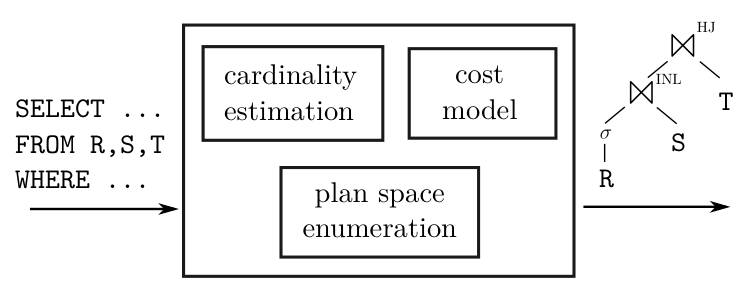
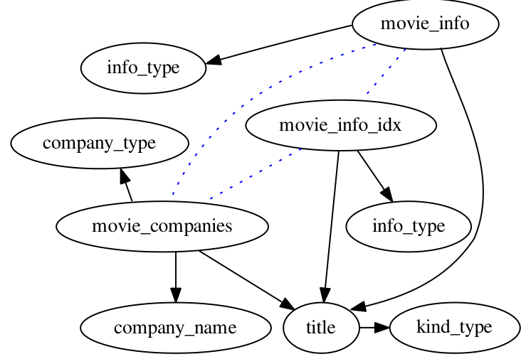
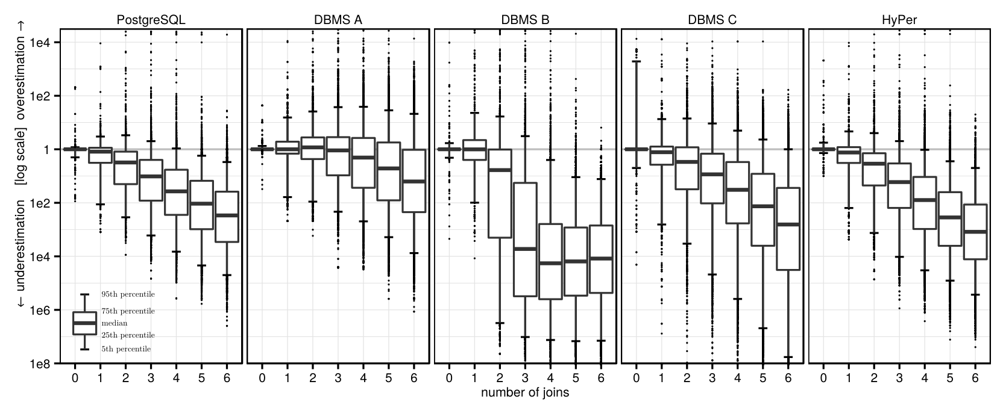
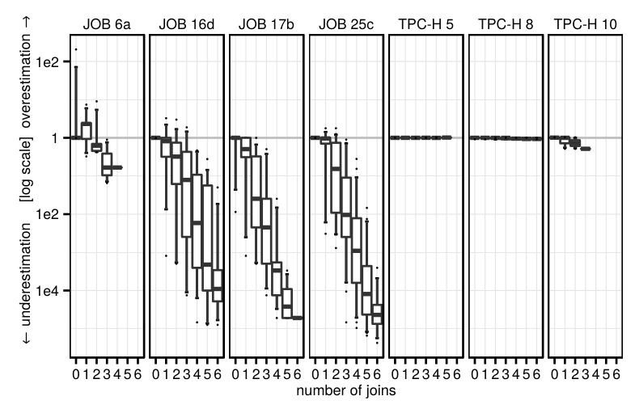
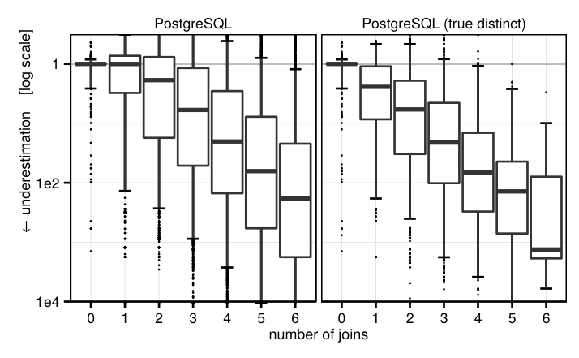
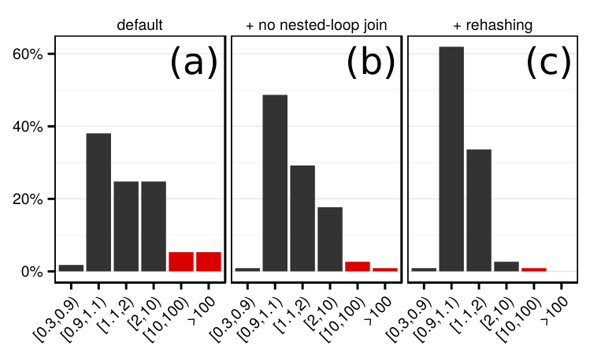
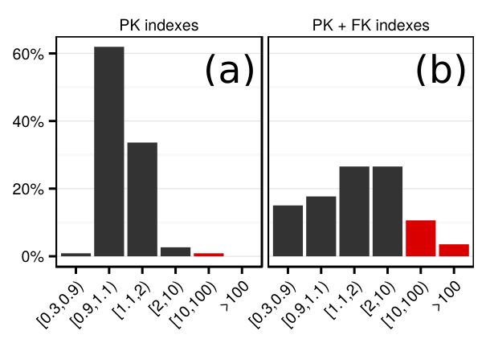
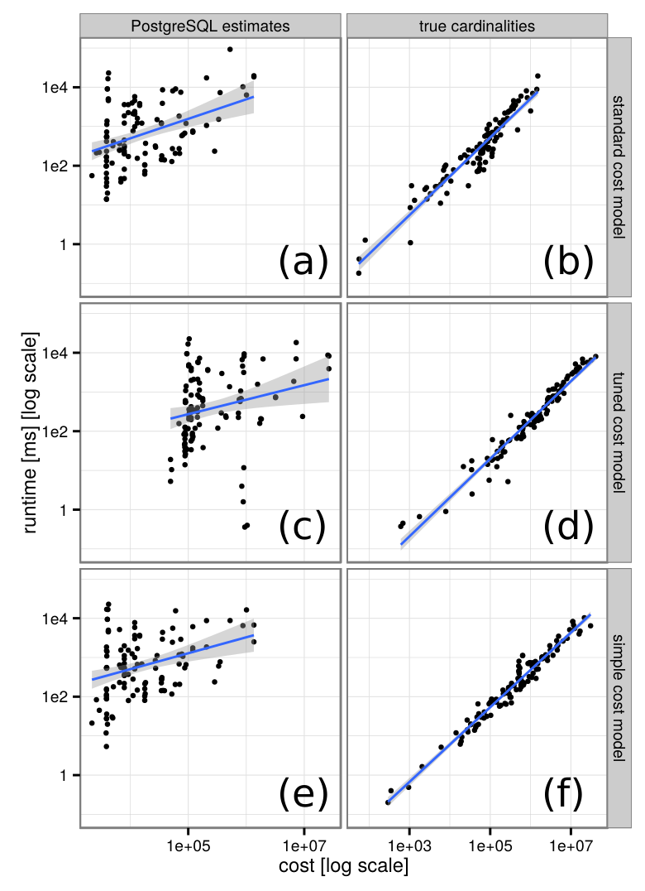
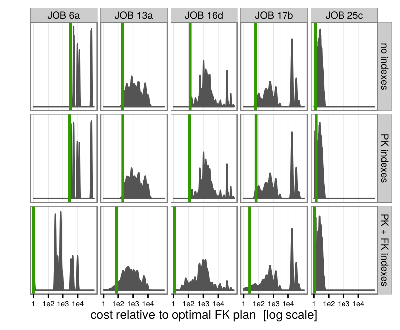

# How Good Are Query Optimizers, Really?（中文译文）

## 译者说明

本文依据同目录的 `source.pdf` 翻译。章节、图表、公式、算法、代码与参考文献按原文结构保留。

Viktor Leis（TUM，leis@in.tum.de），Andrey Gubichev（TUM，gubichev@in.tum.de），Atanas Mirchev（TUM，mirchev@in.tum.de）

Peter Boncz（CWI，p.boncz@cwi.nl），Alfons Kemper（TUM，kemper@in.tum.de），Thomas Neumann（TUM，neumann@in.tum.de）

**原文许可与出版信息：** 本作品采用 Creative Commons Attribution-NonCommercial-NoDerivatives 4.0 International License 许可；许可证见 http://creativecommons.org/licenses/by-nc-nd/4.0/。超出该许可证范围的使用请联系 info@vldb.org。载于 *Proceedings of the VLDB Endowment*，第 9 卷第 3 期；Copyright 2015 VLDB Endowment，2150-8097/15/11。

## 摘要

找到好的连接顺序对查询性能至关重要。本文提出 Join Order Benchmark（JOB，连接顺序基准），并使用复杂的真实世界数据集和现实的多连接查询，重新实验性地考察经典查询优化器架构中的主要组件。我们研究工业级基数估计器的质量，发现所有估计器都会经常产生很大的误差。我们进一步表明，虽然估计值对找到好的连接顺序是必要的，但如果查询引擎过度依赖这些估计，查询性能会令人不满意。通过另一组测量代价模型影响的实验，我们发现代价模型对查询性能的影响远小于基数估计。最后，我们考察计划枚举技术，将穷尽式动态规划与启发式算法比较，发现即使存在次优基数估计，穷尽枚举仍能改善性能。

## 1. 引言

寻找好的连接顺序是数据库领域研究最充分的问题之一。经典的基于代价的方法可以追溯到 System R [36]：查询优化器枚举一部分合法的连接顺序，例如用动态规划枚举；代价模型以基数估计作为主要输入，在语义等价的计划候选中选择代价最低者。

理论上，只要基数估计和代价模型准确，这种架构就能得到最优查询计划。现实中，基数估计通常基于均匀性（uniformity）和独立性（independence）等简化假设。在真实数据集中，这些假设经常不成立，从而导致次优甚至灾难性的计划。

**图 1：传统查询优化器架构。** SQL 查询进入优化器后，基数估计和代价模型共同指导计划空间枚举，输出物理计划，例如索引嵌套循环（INL）或哈希连接（HJ）。



本文围绕经典查询优化器的三个主要组件回答以下问题：

- 基数估计器到底有多好？差的估计值什么时候会导致慢查询？
- 准确的代价模型对整体查询优化过程有多重要？
- 被枚举的计划空间需要有多大？

为回答这些问题，本文使用一种能隔离各个优化器组件对查询性能影响的方法。实验基于真实世界数据集和 113 个多连接查询，这些查询形成了有挑战性、多样且现实的工作负载。本文还关注越来越常见的主内存场景，即所有数据都放得进 RAM。

本文的主要贡献如下：

- 设计了基于 IMDB 数据集的 Join Order Benchmark（JOB）。该基准公开可用，便于后续研究。
- 据我们所知，这是第一篇使用真实世界数据集和现实查询对连接排序问题进行端到端研究的论文。
- 通过量化基数估计、代价模型和计划枚举算法对查询性能的贡献，本文给出完整查询优化器设计的指导，并展示许多灾难性计划其实可以很容易避免。

论文结构如下：第 2 节介绍背景和新基准；第 3 节展示主流关系数据库系统的基数估计器在许多现实查询，尤其是多连接查询上会产生较差估计；第 4 节分析这些较差估计在什么条件下会引发慢性能；第 5 节说明在当前基数估计技术下，代价模型误差的影响被基数估计误差淹没，即便简单代价模型也似乎足够；第 6 节研究计划枚举算法，说明穷尽连接顺序枚举会改善性能，而启发式算法会留下性能空间；最后第 7 节讨论相关工作，第 8 节总结并展望未来工作。

## 2. 背景与方法

许多查询优化论文忽略基数估计，只研究用随机生成的合成查询进行连接排序搜索空间探索 [32, 13]。另一些论文只从理论 [21] 或经验 [43] 角度孤立研究基数估计。两类工作对理解优化器都很重要，但不一定反映真实用户体验。

本文目标是在现实设置中研究所有相关查询优化器组件对端到端查询性能的贡献。因此实验使用基于真实世界数据集的工作负载和广泛使用的 PostgreSQL。PostgreSQL 的架构相当传统，适合作为实验对象；同时它是开源系统，便于检查和修改内部实现。

### 2.1 IMDB 数据集

查询处理和优化研究常用 TPC-H、TPC-DS 或 Star Schema Benchmark（SSB）等标准基准。这些基准对评估查询引擎有价值，但我们认为它们不是评估优化器基数估计组件的好基准。原因是，为了便于扩展数据规模，这些数据生成器使用的正是查询优化器也会做的简化假设：均匀性、独立性和包含原则（principle of inclusion）。真实数据集充满相关性和非均匀分布，使基数估计困难得多。第 3.3 节会显示 PostgreSQL 的简单基数估计器在 TPC-H 上表现得不现实地好。

因此，本文选择 Internet Movie Data Base（IMDB）。该数据集包含电影、演员、导演、制作公司等大量事实，可免费用于非商业用途。我们使用 imdbpy 将文本文件转换为包含 21 张表的关系数据库。该数据集能回答类似“哪些演员出演了 2000 到 2005 年间上映且评分高于 8 的电影？”的问题。像大多数真实世界数据集一样，IMDB 包含大量相关性和非均匀分布，比多数合成数据集更有挑战性。本文使用 2013 年 5 月的快照，导出为 CSV 后占 3.6 GB。最大两张表 `cast_info` 和 `movie_info` 分别有 3600 万行和 1500 万行。

**原文脚注 1：** `http://www.imdb.com/`

**原文脚注 2：** `ftp://ftp.fu-berlin.de/pub/misc/movies/database/`

**原文脚注 3：** `https://bitbucket.org/alberanid/imdbpy/get/5.0.zip`

### 2.2 JOB 查询

基于 IMDB 数据库，我们构造了分析型 SQL 查询。由于本文聚焦连接排序，而连接排序可说是最重要的查询优化问题，查询被设计为包含 3 到 16 个连接，平均每个查询有 8 个连接。查询 13d 查找美国公司制作的所有电影的评分和发行日期，是一个典型例子：

```sql
SELECT cn.name, mi.info, miidx.info
FROM company_name cn, company_type ct,
     info_type it, info_type it2, title t,
     kind_type kt, movie_companies mc,
     movie_info mi, movie_info_idx miidx
WHERE cn.country_code ='[us]'
  AND ct.kind = 'production companies'
  AND it.info = 'rating'
  AND it2.info = 'release dates'
  AND kt.kind = 'movie'
  AND ... -- 11 个连接谓词
```

**图 2：工作负载中的典型查询图。** 实线表示主键/外键边（1:n），箭头指向主键侧；虚线表示外键/外键连接（n:m），这类边由传递连接谓词产生。



每个查询由一个选择-投影-连接（select-project-join, SPJ）块组成。查询集包含 33 种查询结构，每种结构有 2 到 6 个只在选择条件上不同的变体，总计 113 个查询。注意，由于基表谓词选择率不同，同一查询结构的不同变体也会有不同的最优计划，运行时间可能相差若干数量级。有些查询的选择谓词比示例更复杂，例如析取条件或 `LIKE` 子串搜索。

这些查询在“现实”和“即席（ad hoc）”意义上成立：它们回答电影爱好者可能提出的问题。尽管结构只是 SPJ，我们认为它们抓住了连接排序问题的核心困难。对基数估计器而言，挑战来自较多连接以及数据集中的相关性。我们没有刻意“欺骗”优化器，例如挑选极端相关的属性；也故意没有包含不等式或非代理键连接等更复杂连接谓词，因为该工作负载对基数估计已经足够困难。

**原文脚注 4：** 由于本文不建模或研究聚合，我们从查询中省略了 `GROUP BY`。为避免大结果集查询的通信成为性能瓶颈，执行时（但非估计时）会用 `MIN(...)` 表达式包裹投影子句中的所有属性。这一变化不影响 PostgreSQL 的连接顺序选择，因为其优化器不会下推聚合。

我们建议后续研究使用 JOB 研究基数估计和查询优化。查询集发布在：

```text
http://www-db.in.tum.de/~leis/qo/job.tgz
```

### 2.3 PostgreSQL

PostgreSQL 的优化器遵循传统教材架构。它用动态规划枚举连接顺序，包括 bushy 树，但排除含笛卡尔积的树。代价模型用于决定哪个计划候选更便宜。基表基数使用直方图（分位数统计）、最常见值及其频率、域基数（distinct value count）估计。这些按属性统计由 `analyze` 命令通过关系样本计算。对不能使用直方图的复杂谓词，系统退回到没有理论基础的临时方法（“magic constants”）。对同一张表上的合取谓词，PostgreSQL 简单假设独立，并将各谓词选择率相乘。

连接结果大小使用以下公式估计：

$$
|T_1 \bowtie _ {x=y} T_2| =
\frac{|T_1||T_2|}{\max(dom(x), dom(y))}
$$

其中 $T _ 1$ 和 $T _ 2$ 是任意表达式， $\mathrm{dom}(x)$ 是属性 $x$ 的域基数，即 $x$ 的不同值数量。这是连接基数估计的主要输入。总结起来，PostgreSQL 的基数估计器基于以下假设：

- **均匀性**：除最常见值外，所有值都被假设拥有相同数量的元组。
- **独立性**：属性上的谓词，无论来自同一张表还是已连接的表，都互相独立。
- **包含原则**：连接键的域重叠，较小域中的键在较大域中都有匹配。

PostgreSQL 查询引擎接受物理算子计划，并用 Volcano 风格解释执行。重要访问路径包括全表扫描和未聚簇 B+Tree 索引查找。连接可通过嵌套循环、索引或非索引嵌套循环、内存哈希连接或排序归并连接执行，其中排序必要时可溢写到磁盘。使用哪种连接算法由优化器决定，运行时不能改变。

### 2.4 基数抽取与注入

我们将 IMDB 数据集加载到 5 个关系数据库系统：PostgreSQL、HyPer 和 3 个商业系统。接着使用各系统默认统计收集命令生成相应统计信息。然后通过系统特定命令（如 PostgreSQL 的 `EXPLAIN`）获取测试查询所有中间结果的基数估计。之后，这些不同系统的估计会被用来得到相对于各系统估计的最优查询计划，并在 PostgreSQL 中运行这些计划。

例如链式查询：

$$
\sigma _ {x=5}(A) \bowtie _ {A.bid=B.id} B \bowtie _ {B.cid=C.id} C
$$

其中间结果包括：

$$
\sigma _ {x=5}(A),
\sigma _ {x=5}(A) \bowtie B,
B \bowtie C,
\sigma _ {x=5}(A) \bowtie B \bowtie C
$$

外键索引和索引嵌套循环连接还会引入额外中间结果大小。例如，如果 `A.bid` 上有非唯一索引，还需要估计 `A \bowtie B` 和 `A \bowtie B \bowtie C`，因为选择条件 `A.x = 5` 只能在从 `A.bid` 索引取回所有匹配元组之后应用。

除不同系统的基数估计外，我们还通过执行 `SELECT COUNT(*)` 查询获取每个中间结果的真实基数。我们进一步修改 PostgreSQL，使其能对任意连接表达式注入基数，从而让 PostgreSQL 优化器使用其他系统的估计或真实基数，而不是自己的估计。这能直接测量不同基数估计对查询性能的影响。

**原文脚注 5：** 对本文工作负载，直接执行这些查询仍然可行；对更大的数据集，可能需要采用 Chaudhuri 等人的方法 [7]。

### 2.5 实验设置

商业系统的基数在一台 Windows 7 笔记本上获取。所有性能实验在一台运行 Linux 的服务器上完成，服务器有两颗 Intel Xeon X5570 CPU（2.9 GHz）、共 8 核，运行 PostgreSQL 9.4。PostgreSQL 不并行化查询，因此查询处理只使用单核。系统有 64 GB RAM，整个 IMDB 数据库完全缓存在内存中。中间查询处理结果（例如哈希表）也很容易放入 RAM，除非选择了会产生极大中间结果的糟糕计划。

我们将每个算子的内存限制 `work_mem` 设为 2 GB，使系统更常使用内存哈希连接，而不是外部排序归并连接；将缓冲池 `shared_buffers` 设为 4 GB；将 PostgreSQL 使用的操作系统缓冲缓存估计值 `effective_cache_size` 设为 32 GB。由于通常建议 PostgreSQL 同时使用操作系统缓冲和自身缓冲池，且这些默认值很低，增大它们通常是推荐做法。最后，我们将 `geqo_threshold` 提高到 18，强制 PostgreSQL 对超过 12 个连接的查询也使用动态规划，而不是退回启发式算法。

## 3. 基数估计

基数估计是寻找好查询计划最重要的输入。即使有穷尽连接顺序枚举和完全准确的代价模型，如果基数估计不大致正确，也没有价值。众所周知，基数估计有时会错若干数量级，而这类错误通常是慢查询的原因。本节通过将估计与真实基数比较，实验性考察关系数据库系统中基数估计的质量。

### 3.1 基表估计

为了测量基表基数估计质量，本文使用 q-error，即估计值与真实基数相差的倍数。例如，如果表达式真实基数为 100，那么估计为 10 或 1000 的 q-error 都是 10。使用比值而非绝对差或平方差，符合查询计划决策中相对差异更重要的直觉。q-error 还为当查询 q-error 有界时的计划质量提供理论上界 [30]。

**表 1：基表选择谓词的 q-error**

| 系统 | 中位数 | 90 分位 | 95 分位 | 最大值 |
| --- | ---: | ---: | ---: | ---: |
| PostgreSQL | 1.00 | 2.08 | 6.10 | 207 |
| DBMS A | 1.01 | 1.33 | 1.98 | 43.4 |
| DBMS B | 1.00 | 6.03 | 30.2 | 104000 |
| DBMS C | 1.06 | 1677 | 5367 | 20471 |
| HyPer | 1.02 | 4.47 | 8.00 | 2084 |

该表显示工作负载中 629 个基表选择的 q-error 的 50、90、95 和 100 分位。所有系统的中位数接近最优值 1，说明大多数选择能被正确估计。然而，所有系统在某些查询上都会误估，不同系统估计质量差异很大。

我们观察单个选择后发现，DBMS A 和 HyPer 通常能很好预测复杂谓词，例如使用 `LIKE` 的子串搜索。HyPer 对每张表使用 1000 行随机样本，并在样本上应用谓词来估计基表选择率。只要选择率不太低，这就能对任意基表谓词给出准确估计。DBMS A 和 HyPer 的误差超过 2 的选择大多有极低真实选择率，例如 $10^{-5}$ 或 $10^{-6}$；这通常发生在样本中没有命中元组，系统退回临时估计方法时。因此 DBMS A 很可能也使用采样方法。

其他系统估计较差，似乎基于按属性直方图；这种方法对许多谓词效果不好，也无法检测属性间相关或反相关。注意，所有估计都是在默认设置下运行各自统计收集工具后获得的。有些商业系统支持基表估计采样、多属性直方图（“column group statistics”）或从先前查询运行反馈 [38]，但这些功能默认未启用，或并非完全自动。

### 3.2 连接估计

连接中间结果估计更具挑战性，因为采样或直方图并不能很好处理连接。**图 3** 在一张图中总结了超过 100000 个基数估计。对查询集中的每个中间结果，我们计算估计值与真实基数相差的倍数，并区分高估与低估。图中为每个中间结果大小绘制箱线图，展示随着连接数量增加，误差如何变化。纵轴使用对数尺度，涵盖 $10^8$ 倍低估和 $10^4$ 倍高估。

**图 3：多连接查询的基数估计质量与真实基数的比较。** 每个箱线图汇总工作负载中所有查询在特定中间结果规模下的子表达式误差分布。



尽管 DBMS A 的基表估计更好，除 DBMS B 外，各系统连接估计误差的整体方差相似。所有系统都会经常出现 1000 倍或更大的误估。并且随着连接数量增加，误差呈指数增长 [21]。对 PostgreSQL，1 个连接的估计中有 16% 错 10 倍以上；2 个连接时比例升到 32%；3 个连接时升到 52%。DBMS A 是比较中估计器最好的系统，但对应比例也只是略好，为 15%、25% 和 36%。

另一个显著现象是，所有测试系统都倾向于系统性低估多连接查询的结果大小，DBMS A 程度较轻。我们推测 DBMS A 使用了依赖连接大小的阻尼因子（damping factor），类似许多优化器组合多个选择率的方式。许多估计器并不完全假设多个谓词独立，而是用阻尼因子将选择率向上调整；动机是谓词越多，就越不应确信它们彼此独立。

鉴于 PostgreSQL 的连接估计公式很简单，而其估计仍能与商业系统竞争，我们推断当前连接大小估计器基本仍基于独立性假设。没有一个被测系统能检测跨连接相关性（join-crossing correlations）。基数估计还非常脆弱。例如，PostgreSQL 对同一个简单 2 连接查询，会因为 `FROM` 中关系顺序或 `WHERE` 中连接谓词顺序不同，给出 3、9、128 或 310 行等不同估计，而真实基数是 2600。

**原文脚注 6：** 这一令人意外的行为源于两个实现细节。第一，小于 1 的估计会向上取整为 1，使子表达式估计对通常任意的连接枚举顺序敏感，而该顺序又受 `FROM` 子句影响。第二，多谓词连接中谓词属性的域大小不正确，造成了一致性问题。

本节并不是对不同系统查询优化器的基准测试。尤其不能因为 DBMS B 的估计误差更大，就断言其优化器或最终查询性能更差。运行时间强烈依赖系统优化器如何使用估计，以及它对这些数字有多信任。复杂引擎可能使用自适应算子 [4, 8] 来缓解误估影响。实验结果说明的是：基数估计的现有技术水平远不完美。

### 3.3 TPC-H 估计

我们此前指出，TPC-H 中的基数估计相当简单。**图 4** 通过展示 PostgreSQL 对 3 个较大 TPC-H 查询和 4 个 JOB 查询的估计误差分布来支持这一点。图中报告的是单个查询的估计误差，而不是像图 3 一样汇总所有查询。很明显，TPC-H 查询工作负载对基数估计器没有太多困难挑战。相反，JOB 工作负载中的查询经常导致严重高估和低估，因此可被视为有挑战性的基数估计基准。

**图 4：PostgreSQL 对 4 个 JOB 查询和 3 个 TPC-H 查询的基数估计。**



### 3.4 PostgreSQL 的更好统计信息

如第 2.3 节所述，PostgreSQL 连接估计最重要的统计信息是不同值数量。这些统计由固定大小样本估计，我们观察到大表上存在严重低估。为判断不同值数量误估是否是基数估计根本问题，我们精确计算了这些值，并用真实值替换估计值。

**图 5** 显示真实不同值数量略微改善了误差方差。但令人意外的是，低估基数的趋势更加明显。原因是原先低估的 distinct count 会产生更高的估计，而这偶然更接近真实值。这是所谓“两个错误凑成一个正确”的例子，即两个错误部分抵消。此类行为让分析和修复查询优化器问题非常令人沮丧，因为修复一个查询可能破坏另一个查询。

**图 5：PostgreSQL 分别使用默认 distinct count 估计和真实 distinct count 时的基数估计。**



## 4. 差基数估计什么时候导致慢查询？

上一节展示的大误差令人警醒，但大误差不一定导致慢计划。例如，被误估的表达式可能相对查询其他部分很便宜，或相关计划候选也被类似倍数误估，从而“抵消”原误差。本节研究差基数在什么条件下更可能导致慢查询。

访问路径和物理数据库设计会影响系统对基数误估的敏感程度。因此本节先使用相对稳健的物理设计，只包含主键索引，展示这种配置下基数误估影响在很大程度上可被缓解；之后再展示更复杂的多索引配置中，基数误估会更容易使优化器远离最优计划。

### 4.1 依赖估计的风险

为了测量基数误估对查询性能的影响，我们将不同系统的估计注入 PostgreSQL，并执行得到的计划。使用同一个查询引擎可以隔离比较基数估计组件，基本抽象掉不同执行引擎差异。此外，我们注入真实基数，以计算相对于代价模型的最优计划。运行时间按相对最优计划的 slowdown 分组：

| 系统 | $\lt 0.9$ | $[0.9,1.1)$ | $[1.1,2)$ | $[2,10)$ | $[10,100)$ | $\gt 100$ |
| --- | ---: | ---: | ---: | ---: | ---: | ---: |
| PostgreSQL | 1.8% | 38% | 25% | 25% | 5.3% | 5.3% |
| DBMS A | 2.7% | 54% | 21% | 14% | 0.9% | 7.1% |
| DBMS B | 0.9% | 35% | 18% | 15% | 7.1% | 25% |
| DBMS C | 1.8% | 38% | 35% | 13% | 7.1% | 5.3% |
| HyPer | 2.7% | 37% | 27% | 19% | 8.0% | 6.2% |

少数查询在使用真实基数时反而比使用错误基数稍慢，这是代价模型误差造成的，第 5 节会讨论。但符合预期的是，大多数查询在使用估计值时更慢。使用 DBMS A 的估计时，78% 查询相对真实基数计划慢不到 2 倍；DBMS B 则只有 53%。这印证了上一节关于基数估计相对质量的发现。遗憾的是，所有估计器偶尔都会导出不合理的慢计划并超时。不过许多慢情况其实很容易避免。

我们发现，未能在合理时间完成的查询大多有共同点：由于很低的基数估计，PostgreSQL 优化器引入了非索引嵌套循环连接，而真实基数很大。上一节已经看到系统性低估很常见，这会偶尔导致嵌套循环连接。

PostgreSQL 选择嵌套循环的根本原因是它纯粹基于代价选择连接算法。例如，如果嵌套循环代价估计为 1000000，哈希连接为 1000001，PostgreSQL 就总是偏好嵌套循环，即使有等值连接谓词可使用哈希。考虑到嵌套循环是 $O(n^2)$，哈希连接是 $O(n)$，且低估很常见，这个决策极其危险。即便估计碰巧正确，嵌套循环相对哈希连接的潜在性能优势也很小，因此高风险只换来很小收益。

因此我们在后续实验中禁用非索引嵌套循环连接（保留索引嵌套循环）。**图 6b** 显示，在禁用这些危险嵌套循环后重新运行所有查询，即使用 PostgreSQL 自身估计，也不再出现超时。并且没有查询因此变慢，确认了非索引嵌套循环很少有上行收益。不过问题并未完全解决，仍有一些查询比真实基数计划慢 10 倍以上。

**图 6：使用 PostgreSQL 估计基数的查询相对使用真实基数的查询的 slowdown（仅有主键索引）。**



继续调查后，我们发现剩余慢查询大多包含一个哈希连接，其中 build 输入大小被低估。PostgreSQL 9.4 及之前版本根据基数估计选择内存哈希表大小。低估可能导致哈希表过小、碰撞链过长，从而性能差。即将发布的 PostgreSQL 9.5 会在运行时根据实际存入哈希表的行数调整大小。我们将该补丁回移植到基于 9.4 的代码中，并用于剩余实验。**图 6c** 显示，在禁用非索引嵌套循环并启用 rehashing 后，只有不到 4% 查询相对真实基数慢超过 2 倍。

总结来说，“纯粹基于代价”而不考虑基数估计固有不确定性和算法渐近复杂度，会导致很差的查询计划。很少相对稳健算法提供大收益的算法不应被选择。此外，查询处理算法应尽可能在运行时自动决定参数，而不是依赖基数估计。

### 4.2 差基数下仍得到好计划

不同连接顺序的运行时间常相差多个数量级。但在数据库只有主键索引、禁用嵌套循环并启用 rehashing 后，大多数查询性能接近使用真实基数的计划。考虑到基数估计质量很差，这是一个出人意料的积极结果。

主要原因是没有外键索引时，多数大型“事实”表必须全表扫描，这削弱了不同连接顺序的影响。连接顺序仍重要，但估计值通常足以排除灾难性连接顺序，例如用非选择性连接谓词连接两个大表。另一个重要原因是，在主内存中错误选择索引嵌套循环而非哈希连接通常不会灾难性恶化。所有数据和索引完全缓存时，我们测得 PostgreSQL 中哈希连接相对索引嵌套循环最多快 5 倍，HyPer 中最多快 2 倍。显然，如果索引必须从磁盘读，随机 I/O 会造成更大差距。因此主内存场景更加宽容。

### 4.3 复杂访问路径

此前所有查询都在仅有主键索引的数据库上执行。为了观察索引更多时查询优化是否更难，我们又为所有外键属性建立索引。**图 7b** 展示了额外外键索引的影响：40% 查询慢于真实基数计划 2 倍以上。注意，这不意味着添加索引会降低整体性能；事实上整体性能通常显著提升。但可用索引越多，查询优化器的工作越难。

**图 7：使用 PostgreSQL 估计基数的查询相对使用真实基数的查询的 slowdown（不同索引配置）。**



### 4.4 跨连接相关性

社区普遍认为，在相关查询谓词存在时估计中间结果基数，是查询优化研究前沿。JOB 工作负载由真实数据组成，查询包含大量相关谓词。本文针对单表子查询基数估计质量的实验显示，维护表样本的系统（HyPer 以及可能的 DBMS A）即使面对同一表内相关谓词，也能得到近乎完美的估计。因此基数估计的研究挑战似乎在于谓词涉及不同表列并由连接相连的查询，我们称之为“跨连接相关性”（join-crossing correlations）。IMDB 数据集中频繁出现这类相关性，例如出生于巴黎的演员更可能出演法国电影。

在存在跨连接相关性时，人们可能会问是否存在复杂访问路径可以利用这些相关性。ROX [22] 在 XQuery 处理中研究过运行时连接顺序优化，例如 DBLP 合著查询要统计在三个给定会议或期刊发表过论文的作者数量。这些查询明显存在跨连接相关性：在 VLDB 发表过论文的作者通常是数据库研究者，也很可能在 SIGMOD 发表，却不太可能在 Nature 发表。

在 DBLP 中，`Authorship` 是连接 `Authors` 与 `Papers` 的 n:m 关系。[22] 中的最优计划使用索引嵌套循环：先把每名论文署名人查入有索引的主键 `Authorship.author`，再通过另一次连接查找 `Paper.venue` 并执行过滤。通常，这个 venue 过滤必须等两个连接完成后才能计算；但 [22] 的物理设计按 `Paper.venue` 对 `Authorship` 分区。访问正确分区即可在连接发生前隐式且无额外代价地执行过滤。

**原文脚注 7：** 严格说，这里并非关系表分区，而是每个 venue 使用一个独立 XML 文档，例如 SIGMOD、VLDB、Nature，以及另外几千个 venue。存储在独立 XML 文档中，对访问路径产生的效果大致等同于分区表。

这种分区使最优计划可以先把较小的 SIGMOD 署名集合与较大的 Nature 署名集合连接，产生几乎为空的结果，再对 VLDB 执行后续的嵌套循环索引查找，因而代价很低。如果表没有分区，从 SIGMOD 的全部署名人出发对 `Authorship` 做索引查找，首先会取回他们合著的全部论文；其中绝大多数是与 Nature 无关的数据库研究论文。此时无法避免这个巨大的中间结果，也没有任何查询计划能在效率上接近分区方案；即使基数估计能够准确预测跨连接相关性，也没有物理手段利用这些知识。

这个例子说明，查询优化的效果总受可用访问路径限制。像 [22] 那样在跨连接谓词上建立分区索引，是一种并不显然的物理设计选择：它甚至把跨连接列 `Paper.venue` 引入 `Authorship` 的模式，作为分区键。这个分区化 DBLP 设置只展示了处理某一种特定跨连接相关性的特殊设计，并不是通用解。跨连接相关性仍是数据库研究的开放前沿，涉及物理设计、查询执行与查询优化的相互作用。本文 JOB 实验不试图探索这一大部分仍未知的空间，而是限制在标准主键和外键索引下，刻画跨连接相关性对当前查询处理技术的影响。

## 5. 代价模型

代价模型指导优化器从搜索空间中选择计划。现代系统的代价模型是多年研究和开发形成的复杂软件工件，尤其面向传统磁盘系统。例如 PostgreSQL 的代价模型超过 4000 行 C 代码，考虑了部分相关索引访问、interesting orders、元组大小等微妙因素。因此，评估复杂代价模型到底对整体查询性能贡献多大很有意义。

我们首先实验性地建立 PostgreSQL 代价模型与查询运行时间之间的相关性。随后比较 PostgreSQL 模型与另外两个代价函数：第一个是为所有数据放入 RAM 的主内存场景调优后的 PostgreSQL 模型；第二个是极其简单、只考虑查询求值过程中产生的元组数的函数。实验使用带外键索引的数据库实例。

### 5.1 PostgreSQL 代价模型

PostgreSQL 面向磁盘的代价模型将 CPU 和 I/O 成本按权重组合。具体而言，一个算子的代价定义为访问磁盘页数量（顺序和随机）以及内存中处理数据量的加权和。查询计划代价是所有算子代价之和。权重参数由优化器设计者设置，意在反映随机访问、顺序访问和 CPU 成本的相对差异。

PostgreSQL 文档指出，确定理想代价变量没有明确方法，最好把它们视为特定安装整体查询混合上的平均值；只基于少数实验修改它们很危险。对必须设置这些参数的 DBA 来说，这并不太有帮助；多数人很可能不会改。这也不是 PostgreSQL 特有问题，其他系统也有类似复杂代价模型；已有论文也研究了代价模型的调优与校准 [42, 25]。因此，有必要研究代价模型对整体查询引擎性能的影响，从而间接展示代价模型误差对查询性能的贡献。

### 5.2 代价与运行时间

代价函数的主要价值，是在给定基数估计时预测哪个候选计划最快；换言之，关键是它与查询运行时间的相关性。**图 8a** 展示 PostgreSQL 中查询代价与运行时间的相关性。我们还考虑注入真实基数的情况，并在 **图 8b** 中绘制对应数据点。两图都拟合线性回归模型并展示标准误差。两种场景中，预测代价都与运行时间相关。但差的基数估计导致大量离群点，使图 8a 的标准误差区域非常宽。只有使用真实基数后，PostgreSQL 代价模型才成为可靠的运行时间预测器；这一观察此前已有报道 [42]。

**图 8：不同代价模型的预测代价与运行时间。**



直觉上，图 8 中的直线对应理想代价模型：更昂贵查询总被赋予更高代价。我们将偏离这条线解释为代价模型预测误差。对查询 $Q$，使用绝对百分比误差：

$$
\epsilon(Q)=\frac{|T _ {real}(Q)-T _ {pred}(Q)|}{T _ {real}(Q)}
$$

其中 $T _ {\mathrm{real}}$ 是观测运行时间， $T _ {\mathrm{pred}}$ 是线性模型预测运行时间。使用 PostgreSQL 默认代价模型和真实基数时，代价模型中位误差为 38%。

### 5.3 为主内存调优代价模型

代价模型通常包含可由 DBA 调优的参数。在 PostgreSQL 这样的磁盘系统中，这些参数可分为 CPU 代价和 I/O 代价，默认值反映假想工作负载中两类成本的预期比例。

很多场景下默认值并非最优。例如，PostgreSQL 默认参数暗示处理一个元组比从页中读取便宜 400 倍。但现代服务器通常有很大内存，许多工作负载的数据集完全放入内存。页访问成本并不会完全消失，因为仍有缓冲管理器开销，但 I/O 和 CPU 处理成本之间的差距显著缩小。

对主内存工作负载而言，代价模型最重要的修改可能是降低 I/O 与 CPU 两组参数之间的比例。我们将 CPU 代价参数乘以 50。图 8 中间两幅展示了改进参数后的结果。比较图 8b 和 8d 可见，调优确实改善了代价与运行时间的相关性。但比较图 8c 和 8d 又可见，参数调优的改进仍被估计基数与真实基数之间的差异淹没。此外，图 8c 中出现一组离群点：优化器偶然发现了非常好的计划（运行约 1 ms），但它自己并未意识到（代价很高）。这是基数误估造成查询规划“振荡”的另一个迹象。

调优将代价模型中位预测误差从 38% 降至 30%。

### 5.4 复杂代价模型是否必要？

PostgreSQL 代价模型相当复杂。这种复杂性应当反映影响查询执行的各类因素，例如磁盘 seek/read 速度和 CPU 处理成本。为判断这种复杂性在主内存场景下是否真的必要，我们将其与一个非常简单的代价函数 $C _ {\mathrm{mm}}$ 比较。该函数面向主内存场景，不建模 I/O 成本，只统计查询执行过程中通过每个算子的元组数：

$$
C _ {mm}(T)=
\begin{cases}
\tau \cdot |R| & \text{if } T=R \lor T=\sigma(R) \\
|T| + C _ {mm}(T_1)+C _ {mm}(T_2) & \text{if } T=T_1 \bowtie _ {HJ} T_2 \\
C _ {mm}(T_1)+\lambda\cdot|T_1|\cdot \max(\frac{|T_1 \bowtie R|}{|T_1|},1) & \text{if } T=T_1 \bowtie _ {INL} T_2,\ T_2=R \lor T_2=\sigma(R)
\end{cases}
$$

其中 $R$ 是基关系， $\tau \le 1$ 是相对连接折扣表扫描成本的参数。该代价函数区分哈希连接（HJ）和索引嵌套循环连接（INL）：后者扫描 $T _ 1$，并在 $R$ 上索引查找，避免全表扫描 $R$。当索引嵌套循环右侧有选择条件时，函数考虑基表索引中的元组查找数量，并基本从代价计算中丢弃选择条件。对索引嵌套循环，我们用常数 $\lambda \ge 1$ 近似索引查找比哈希表查找贵多少，具体设置为 $\lambda = 2$、 $\tau = 0.2$。和前文实验一样，当内关系不是索引查找时禁用嵌套循环连接。

图 8e 和 8f 显示，即使这个简单代价模型在使用真实基数时也能相当准确预测查询运行时间。按所有查询的几何平均值计算，调优后的代价模型相对标准 PostgreSQL 模型使运行时间快 41%，简单 $C _ {\mathrm{mm}}$ 也能快 34%。这一改进不小，但与用真实基数替换估计基数带来的运行时间改进相比，仍显得很小。这再次强调了本文核心观点：基数估计比代价模型重要得多。

## 6. 计划空间

除基数估计和代价模型外，最后一个重要查询优化组件是计划枚举算法，它探索语义等价连接顺序空间。已有许多穷尽式算法 [29, 12] 和启发式算法 [37, 32]。不同算法在选择最佳计划时考虑的候选数量不同。本节研究为了找到好计划，搜索空间需要多大。

本节实验使用一个独立查询优化器，支持动态规划（DP）和多个启发式连接枚举算法，并允许注入任意基数估计。为了完全探索搜索空间，本节不实际执行优化器生成的查询计划，因为查询连接数量较多，执行所有计划不可行。相反，我们先用估计值作为输入运行优化器，然后用真实基数重新计算得到计划的代价，从而很好地近似该计划实际运行时间。代价模型使用第 5.4 节的内存代价模型，并假设它完美预测查询运行时间；相对基数误差而言，代价模型误差可忽略，这对本文目的合理。

### 6.1 连接顺序有多重要？

我们使用 Quickpick 算法 [40] 可视化不同连接顺序的代价。Quickpick 是简单随机算法，随机挑选连接边，直到所有参与连接的关系连通。每次运行生成一个正确但通常较慢的查询计划。对每个查询运行 10000 次并计算计划代价，就能得到随机计划代价的近似分布。

**图 9** 展示 5 个代表性查询和三种物理数据库设计的密度图：无索引、仅主键索引、主键加外键索引。代价按外键索引配置下的最优计划归一化，最优计划由动态规划和真实基数得到。



图中水平代价轴使用对数尺度，清楚说明连接排序问题的重要性：最慢甚至中位计划通常比最便宜计划贵多个数量级。不同查询分布形状很多样：有些查询有许多好计划，有些很少；有些分布很宽，有些很窄。无索引和仅主键索引配置的图很相似，说明在该工作负载下，由于没有主键列上的选择，主键索引本身对性能帮助不大。很多情况下，主键加外键索引配置在图左侧有额外小峰，表示该配置下最优计划明显快于其他配置。

全工作负载统计也确认了这些观察：代价至多比最优计划贵 1.5 倍的计划比例，无索引为 44%，主键索引为 39%，外键索引仅为 4%。最差计划与最佳计划平均比值，即分布宽度，无索引为 101 倍，主键索引为 115 倍，外键索引为 48120 倍。这些统计凸显三种索引配置搜索空间的巨大差异。

### 6.2 bushy 树是否必要？

多数连接排序算法不枚举所有树形。几乎所有优化器都会忽略含笛卡尔积的连接顺序，这显著减少优化时间，对查询性能影响很小。Oracle 甚至不考虑 bushy 连接树 [1]。为量化限制搜索空间对性能的影响，我们修改 DP 算法，使其只枚举 left-deep、right-deep 或 zig-zag 树。

除明显的树形限制外，各类树还意味着连接方法选择受限。按 Garcia-Molina 等教材定义，使用哈希连接时，right-deep 树会先为除一个关系外的每个关系建哈希表，然后流水线式探测这些哈希表；left-deep 树则从每个连接结果构建新哈希表。zig-zag 树是 left-deep 与 right-deep 的超集，每个连接算子必须至少有一个基关系作为输入。对索引嵌套循环连接，我们约定连接左孩子是被拿来在右孩子索引上查找的元组来源，右孩子必须是基表。

使用真实基数，我们计算三种受限树形中每种的最优计划代价，再除以不受形状限制的最优计划代价。

**表 2：受限树形相对最优计划的 slowdown（真实基数）**

| 树形 | PK 索引中位数 | PK 索引 95% | PK 索引最大值 | PK+FK 索引中位数 | PK+FK 索引 95% | PK+FK 索引最大值 |
| --- | ---: | ---: | ---: | ---: | ---: | ---: |
| zig-zag | 1.00 | 1.06 | 1.33 | 1.00 | 1.60 | 2.54 |
| left-deep | 1.00 | 1.14 | 1.63 | 1.06 | 2.49 | 4.50 |
| right-deep | 1.87 | 4.97 | 6.80 | 47.2 | 30931 | 738349 |

zig-zag 树在多数情况下表现不错，最坏也只比最佳 bushy 计划贵 2.54 倍。left-deep 树比 zig-zag 差，但仍有合理性能。right-deep 树远差于其他形状，不应单独使用。right-deep 差的原因是必须为每个基关系构建大的中间哈希表，且只有最底层连接能通过索引查找完成。

### 6.3 启发式算法是否足够好？

本文此前使用动态规划计算最优连接顺序。但鉴于基数估计质量很差，人们可能会问穷尽算法是否还有必要。我们比较动态规划、随机启发式和贪心启发式。

“Quickpick-1000” 是随机算法，基于估计基数选择 1000 个随机计划中最便宜者。在贪心启发式中，我们选择 Greedy Operator Ordering（GOO），因为它被证明优于其他确定性近似算法 [11]。GOO 维护一组连接树，初始时每棵树只有一个基关系；之后反复组合代价最低的一对连接树。Quickpick-1000 和 GOO 都能生成 bushy 计划，但显然只探索搜索空间的一部分。实验中，所有算法内部使用 PostgreSQL 基数估计生成查询计划，再用真实基数计算“真实”代价。

**表 3：穷尽动态规划、Quickpick-1000 和 GOO 的比较。所有代价按对应索引配置下最优计划归一化。**

| 算法 | PK+估计 中位数 | PK+估计 95% | PK+估计 最大值 | PK+真实 中位数 | PK+真实 95% | PK+真实 最大值 | PK+FK+估计 中位数 | PK+FK+估计 95% | PK+FK+估计 最大值 | PK+FK+真实 中位数 | PK+FK+真实 95% | PK+FK+真实 最大值 |
| --- | ---: | ---: | ---: | ---: | ---: | ---: | ---: | ---: | ---: | ---: | ---: | ---: |
| Dynamic Programming | 1.03 | 1.85 | 4.79 | 1.00 | 1.00 | 1.00 | 1.66 | 169 | 186367 | 1.00 | 1.00 | 1.00 |
| Quickpick-1000 | 1.05 | 2.19 | 7.29 | 1.00 | 1.07 | 1.14 | 2.52 | 365 | 186367 | 1.02 | 4.72 | 32.3 |
| Greedy Operator Ordering | 1.19 | 2.29 | 2.36 | 1.19 | 1.64 | 1.97 | 2.35 | 169 | 186367 | 1.20 | 5.77 | 21.0 |

结果显示，即使存在基数误估，完整检查搜索空间仍然值得。不过，由估计误差引入的损失大于启发式算法引入的损失。GOO 和 Quickpick-1000 不像某些启发式算法 [5] 那样真正理解索引，因此它们在索引较少时效果更好；索引较少时好计划也更多。

总结来看，实验表明，穷尽枚举所有 bushy 树相对只枚举搜索空间子集的算法，有中等但不可忽略的性能收益。良好基数估计的性能潜力当然更大。但既然存在可以很快为几十个关系查询找到最优解的穷尽枚举算法 [29, 12]，就很少有必要退回启发式算法或禁用 bushy 树。

## 7. 相关工作

本文基数估计实验显示，使用表样本进行基数估计的系统，在预测单表结果大小方面明显优于使用独立性假设和单列直方图的系统 [20]。我们认为系统应采用表样本作为简单而稳健的技术，而不是依赖先显式检测相关性 [19]、再创建多列直方图 [34] 的早期建议。

不过，许多 JOB 查询包含跨连接相关性，单表样本无法捕获，现有系统仍对这类情况使用独立性假设。已有研究尝试更好估计包含跨连接相关性的查询结果大小，主要基于连接样本 [17]，或增强处理偏斜，采用尾部偏置采样 [10]、相关采样 [43]、sketch [35] 或图模型 [39]。相关工作确认，如果不处理跨连接相关性，基数估计会随着连接数增加而快速恶化 [21]，导致高估和低估，尤其是低估。因此我们希望这些技术能被系统采用。

另一条学习跨连接相关性的方式是使用查询反馈，如 LEO 项目 [38]。但基于精确知识与未知信息混合推导基数估计，需要坚实数学基础，例如最大熵（MaxEnt）[28, 23]。目前最大熵应用成本较高，阻止了它在系统中的使用。

本文还发现，基数误估的不利影响强烈依赖物理数据库设计；在最丰富的设计中影响最大。第 4.4 节 ROX [22] 讨论提示，要真正释放跨连接相关性正确预测的潜力，可能还需要新的物理设计和访问路径。

另一个发现是，如果系统能“对赌注做对冲”，不只选择期望代价最低的计划，而是考虑估计值的概率分布，避免选择只比其他计划略快却有高低估风险的计划，就能显著降低基数误估的不良影响。已有工作既研究只针对基数估计的这类方法 [30]，也研究与代价模型结合的代价分布 [2]。

PostgreSQL 固定哈希表大小问题说明，使查询引擎运行时行为更加性能稳健，常能缓解代价误估。这与许多使系统适应估计错误的工作相关，例如动态切换连接输入侧以及在哈希和排序间切换（GJoin）[15]、在顺序扫描和索引查找间切换（smooth scan）[4]、执行期间自适应重排连接流水线 [24]，或根据真实 group-by 值数量 [31] 或 partition-by 值数量 [3] 在运行时改变聚合策略。

更激进的方法是将查询优化移动到运行时，此时实际值分布可见 [33, 9]。但运行时技术通常会限制计划搜索空间以降低运行时探索成本，并可能有功能限制，例如只考虑已有索引访问路径支持的算子（如 ROX [22]）。

对第二个优化器组件代价模型的实验显示，调优代价模型收益小于改进基数估计；在主内存场景下，即使极其简单的代价模型也能得到令人满意的结果。该结论与一些旨在改进代价模型但实际主要通过附加采样改善基数估计而取得大收益的工作相呼应 [42]。

测试计划枚举时，我们借用了随机查询优化中的 Quickpick 方法 [40] 来刻画和可视化搜索空间。另一个知名搜索空间可视化方法是 Picasso [18]。Quickpick 相关工作 [40] 曾声称好计划容易找到，但本文实验表明，物理设计和访问路径选择越丰富，好计划越稀少。

查询优化是数据库研究核心主题，相关工作极多，无法完整覆盖。经历数十年研究后，该问题仍远未解决 [26]；有些研究者甚至质疑传统优化器与应用之间的契约，并主张需要优化器应用提示 [6]。本文引入基于高度相关真实 IMDB 数据集的 Join Order Benchmark，以及测量基数估计准确性的方法。我们希望将其集成到测试和评估查询优化器质量的系统中 [41, 16, 14, 27]，从而推动这一重要主题继续创新。

## 8. 结论与未来工作

本文为三十年查询优化器实践经验积累下来的常识提供了定量证据。我们显示，查询优化对高效查询处理是必要的，穷尽枚举算法比启发式算法能找到更好的计划。我们还显示，关系数据库系统会产生很大的估计误差，并且这些误差会随着连接数量增加而快速增大；这些误差通常是差计划的原因。相比基数估计，代价模型对整体查询性能的贡献有限。

面向未来，我们看到两条在重索引设置中改善计划质量的主要路线。第一，数据库系统可以引入文献中提出的更高级估计算法。第二，增强运行时与查询优化器之间的交互。两条路线的评估留给未来工作。

我们鼓励社区使用 Join Order Benchmark 作为进一步实验的测试床，例如研究复杂访问路径的风险/收益权衡。进一步研究磁盘驻留数据库和分布式数据库也很有意义，因为它们会带来不同于主内存场景的挑战。

## 致谢

我们感谢 Guy Lohman 和匿名审稿人的宝贵反馈，也感谢 Moritz Wilfer 在项目早期阶段提供的意见。

## 参考文献

1. R. Ahmed, R. Sen, M. Poess, and S. Chakkappen. Of snowstorms and bushy trees. PVLDB, 7(13):1452-1461, 2014.
2. B. Babcock and S. Chaudhuri. Towards a robust query optimizer: A principled and practical approach. In SIGMOD, pages 119-130, 2005.
3. S. Bellamkonda, H.-G. Li, U. Jagtap, Y. Zhu, V. Liang, and T. Cruanes. Adaptive and big data scale parallel execution in Oracle. PVLDB, 6(11):1102-1113, 2013.
4. R. Borovica-Gajic, S. Idreos, A. Ailamaki, M. Zukowski, and C. Fraser. Smooth scan: Statistics-oblivious access paths. In ICDE, pages 315-326, 2015.
5. N. Bruno, C. A. Galindo-Legaria, and M. Joshi. Polynomial heuristics for query optimization. In ICDE, pages 589-600, 2010.
6. S. Chaudhuri. Query optimizers: time to rethink the contract? In SIGMOD, pages 961-968, 2009.
7. S. Chaudhuri, V. R. Narasayya, and R. Ramamurthy. Exact cardinality query optimization for optimizer testing. PVLDB, 2(1):994-1005, 2009.
8. M. Colgan. Oracle adaptive joins. https://blogs.oracle.com/optimizer/entry/what_s_new_in_12c, 2013.
9. A. Dutt and J. R. Haritsa. Plan bouquets: query processing without selectivity estimation. In SIGMOD, pages 1039-1050, 2014.
10. C. Estan and J. F. Naughton. End-biased samples for join cardinality estimation. In ICDE, page 20, 2006.
11. L. Fegaras. A new heuristic for optimizing large queries. In DEXA, pages 726-735, 1998.
12. P. Fender and G. Moerkotte. Counter strike: Generic top-down join enumeration for hypergraphs. PVLDB, 6(14):1822-1833, 2013.
13. P. Fender, G. Moerkotte, T. Neumann, and V. Leis. Effective and robust pruning for top-down join enumeration algorithms. In ICDE, pages 414-425, 2012.
14. C. Fraser, L. Giakoumakis, V. Hamine, and K. F. Moore-Smith. Testing cardinality estimation models in SQL Server. In DBtest, 2012.
15. G. Graefe. A generalized join algorithm. In BTW, pages 267-286, 2011.
16. Z. Gu, M. A. Soliman, and F. M. Waas. Testing the accuracy of query optimizers. In DBTest, 2012.
17. P. J. Haas, J. F. Naughton, S. Seshadri, and A. N. Swami. Selectivity and cost estimation for joins based on random sampling. J Computer System Science, 52(3):550-569, 1996.
18. J. R. Haritsa. The Picasso database query optimizer visualizer. PVLDB, 3(2):1517-1520, 2010.
19. I. F. Ilyas, V. Markl, P. J. Haas, P. Brown, and A. Aboulnaga. CORDS: automatic discovery of correlations and soft functional dependencies. In SIGMOD, pages 647-658, 2004.
20. Y. E. Ioannidis. The history of histograms (abridged). In VLDB, pages 19-30, 2003.
21. Y. E. Ioannidis and S. Christodoulakis. On the propagation of errors in the size of join results. In SIGMOD, 1991.
22. R. A. Kader, P. A. Boncz, S. Manegold, and M. van Keulen. ROX: run-time optimization of XQueries. In SIGMOD, pages 615-626, 2009.
23. R. Kaushik, C. Re, and D. Suciu. General database statistics using entropy maximization. In DBPL, pages 84-99, 2009.
24. Q. Li, M. Shao, V. Markl, K. S. Beyer, L. S. Colby, and G. M. Lohman. Adaptively reordering joins during query execution. In ICDE, pages 26-35, 2007.
25. F. Liu and S. Blanas. Forecasting the cost of processing multi-join queries via hashing for main-memory databases. In SoCC, pages 153-166, 2015.
26. G. Lohman. Is query optimization a solved problem? http://wp.sigmod.org/?p=1075, 2014.
27. L. F. Mackert and G. M. Lohman. R* optimizer validation and performance evaluation for local queries. In SIGMOD, pages 84-95, 1986.
28. V. Markl, N. Megiddo, M. Kutsch, T. M. Tran, P. J. Haas, and U. Srivastava. Consistently estimating the selectivity of conjuncts of predicates. In VLDB, pages 373-384, 2005.
29. G. Moerkotte and T. Neumann. Dynamic programming strikes back. In SIGMOD, pages 539-552, 2008.
30. G. Moerkotte, T. Neumann, and G. Steidl. Preventing bad plans by bounding the impact of cardinality estimation errors. PVLDB, 2(1):982-993, 2009.
31. I. Muller, P. Sanders, A. Lacurie, W. Lehner, and F. Farber. Cache-efficient aggregation: Hashing is sorting. In SIGMOD, pages 1123-1136, 2015.
32. T. Neumann. Query simplification: graceful degradation for join-order optimization. In SIGMOD, pages 403-414, 2009.
33. T. Neumann and C. A. Galindo-Legaria. Taking the edge off cardinality estimation errors using incremental execution. In BTW, pages 73-92, 2013.
34. V. Poosala and Y. E. Ioannidis. Selectivity estimation without the attribute value independence assumption. In VLDB, pages 486-495, 1997.
35. F. Rusu and A. Dobra. Sketches for size of join estimation. TODS, 33(3), 2008.
36. P. G. Selinger, M. M. Astrahan, D. D. Chamberlin, R. A. Lorie, and T. G. Price. Access path selection in a relational database management system. In SIGMOD, pages 23-34, 1979.
37. M. Steinbrunn, G. Moerkotte, and A. Kemper. Heuristic and randomized optimization for the join ordering problem. VLDB J., 6(3):191-208, 1997.
38. M. Stillger, G. M. Lohman, V. Markl, and M. Kandil. LEO - DB2's learning optimizer. In VLDB, pages 19-28, 2001.
39. K. Tzoumas, A. Deshpande, and C. S. Jensen. Lightweight graphical models for selectivity estimation without independence assumptions. PVLDB, 4(11):852-863, 2011.
40. F. Waas and A. Pellenkoft. Join order selection - good enough is easy. In BNCOD, pages 51-67, 2000.
41. F. M. Waas, L. Giakoumakis, and S. Zhang. Plan space analysis: an early warning system to detect plan regressions in cost-based optimizers. In DBTest, 2011.
42. W. Wu, Y. Chi, S. Zhu, J. Tatemura, H. Hacigumus, and J. F. Naughton. Predicting query execution time: Are optimizer cost models really unusable? In ICDE, pages 1081-1092, 2013.
43. F. Yu, W. Hou, C. Luo, D. Che, and M. Zhu. CS2: a new database synopsis for query estimation. In SIGMOD, pages 469-480, 2013.
