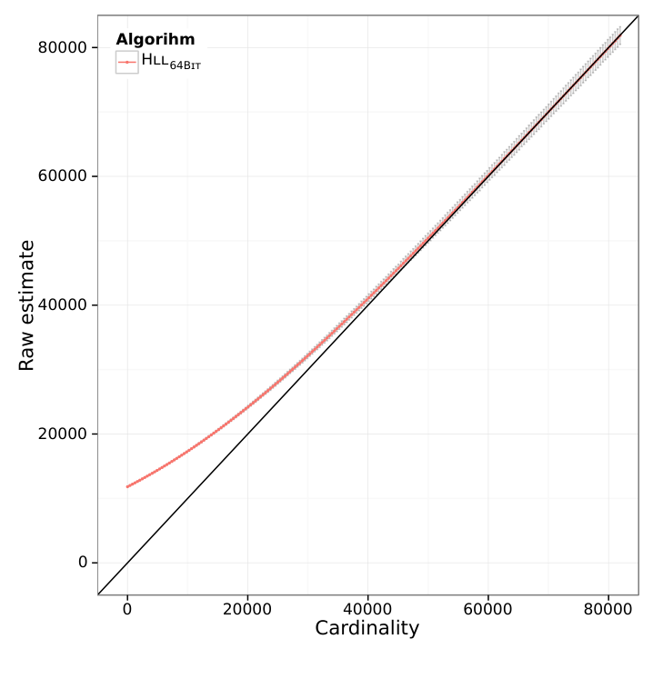
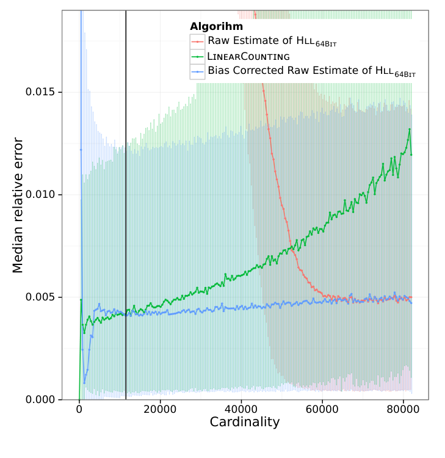
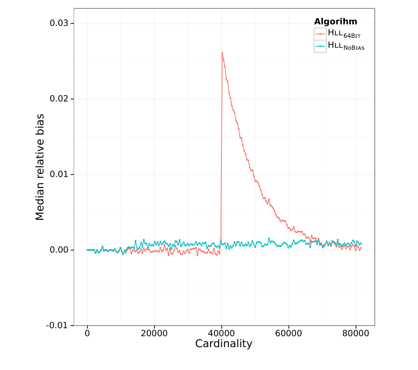
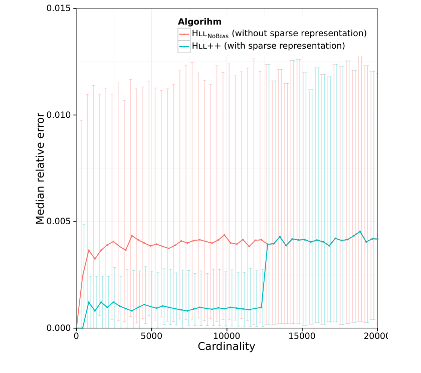
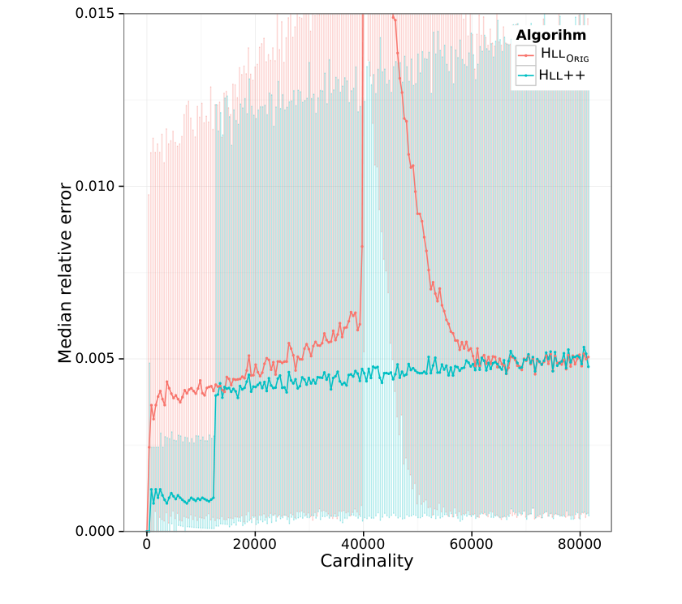

# HyperLogLog in Practice: Algorithmic Engineering of a State of The Art Cardinality Estimation Algorithm（中文译文）

## 译者说明

本文依据同目录的 `source.pdf` 翻译。章节、图表、公式、算法、代码与参考文献按原文结构保留。

Stefan Heule（苏黎世联邦理工学院及 Google, Inc.；stheule@ethz.ch）、Marc Nunkesser（Google, Inc.；marcnunkesser@google.com）、Alexander Hall（Google, Inc.；alexhall@google.com）

EDBT/ICDT ’13，2013 年 3 月 18—22 日，意大利热那亚。

## 摘要

基数估计有广泛的应用，在数据库系统中尤其重要。过去已有多种算法提出，HyperLogLog 是其中之一。本文提出对这一算法的一系列改进，以降低其内存需求，并显著提高其在一个重要基数范围内的精度。我们已在 Google 的一个系统中实现所提出的算法，并通过实验与原始 HyperLogLog 算法比较。与 HyperLogLog 一样，我们改进的算法可以完全并行化，并能单遍计算基数估计。

## 1. 引言

基数估计是确定数据流中不同元素数量的任务。虽然可以用与基数成线性关系的空间轻易算出基数，但对于许多应用，这完全不切实际，内存需求过高。因此，人们开发了许多以更少资源近似估计基数的算法。这些算法在网络监控系统、数据挖掘应用以及数据库系统中都发挥着重要作用。

在 Google，Sawzall [15]、Dremel [13] 和 PowerDrill [9] 等数据分析系统每天都估计超大型数据集的基数，例如确定某段时间内 google.com 上不同搜索查询的数量。这类查询在计算资源，尤其是内存方面构成严峻挑战：过去，PowerDrill 中相当一部分查询因超出可用内存而无法计算。

本文提出对 Flajolet 等人提出的高效基数估计算法 HyperLogLog [7] 的一系列改进。这些改进降低了内存用量，也显著提高了算法在若干重要基数范围内的估计精度。我们通过实验评估所有改进，并与 [7] 中的 HyperLogLog 算法比较。算法改动具有普遍适用性，并非针对我们的系统。与 HyperLogLog 一样，我们提出的改进算法可以完全并行化，并能单遍计算基数估计。

**文章安排。** 第 2 节说明算法选型依据并概述相关工作。第 3 节介绍我们在 Google 的实际用例，并列出该场景对基数估计算法的要求。第 4 节介绍作为改进基础的 HyperLogLog 算法 [7]。第 5 节描述所做的改进，并逐项进行实验评估。第 6 节解释 HyperLogLog 对列式存储中字典编码的益处。第 7 节总结全文。

## 2. 相关工作与算法选型

自 Flajolet 和 Martin 的工作 [6] 以来，基数估计问题已经得到大量研究。[3, 14] 概述并分类了已有算法。描述和分析基数估计算法有两种常用模型。第一种是数据流 $(\epsilon,\delta)$ 模型 [10, 11]：分析为了在 $\lbrace 1,\ldots,n\rbrace$ 的基数范围内，以固定成功概率 $\delta$（例如 $\delta=2/3$）得到 $(1\pm\epsilon)$ 近似所需的空间。第二种分析估计器的相对精度，即其标准误差 [3]。

Google 此前在 [13, 15, 9] 所述系统中实现的是 MinCount，即 [2] 的算法 1。其精度为 $1.0/\sqrt m$，其中 $m$ 是维护的哈希值最大数量，因而与所需内存成线性关系。在 $(\epsilon,\delta)$ 模型下，该算法需要 $O(\epsilon^{-2}\log n)$ 空间；对于不超过 $m$ 的基数，它近乎精确（哈希冲突除外）。[8] 给出了统计分析以及提高算法计算效率的建议。

Kane 等人的算法 [11] 达到了 $(\epsilon,\delta)$ 模型中空间复杂度的下界 $\Omega(e^{-2}+\log n)$ [10]，因此在这个意义上是最优的。然而，该算法很复杂，在实际系统中实现和维护它似乎并不现实。

**译注：** 原文下界中的字母印作 $e$；同页上下文的误差参数写作 $\epsilon$，按上下文此处应指 $\epsilon$。

[1] 比较了六种基数估计算法，包括 MinCount，以及针对小基数结合了 LinearCounting [16] 的 LogLog [4]；后一种算法在该比较中胜出。[14] 从理论上比较了 12 种算法，并在一个含 $1.9\cdot10^6$ 个不同元素的数据集上实验比较了其中最有希望的 8 种，包括 LogLog、LinearCounting 和 MultiresolutionBitmap [5]；最后一种是 LinearCounting 的多尺度版本。针对所测试的基数，研究推荐选择 LinearCounting。在其输入数据上，LogLog 的精度优于除 LinearCounting 和 MultiresolutionBitmap 之外的所有算法。我们关心的是对基数远大于 $10^9$ 的多重集进行良好估计；对于这类基数，LinearCounting 若要保持精度，就需要过多内存，因而不再有吸引力。MultiresolutionBitmap 有类似问题，在 $(\epsilon,\delta)$ 模型中需要 $O(\epsilon^{-2}\log n)$ 空间，增长快于 LogLog 的内存用量。该研究的作者也遇到过无法以给定固定内存运行 MultiresolutionBitmap 的问题。

HyperLogLog 由 Flajolet 等人提出 [7]，是对 LogLog 的改进，发表于上述研究之后。它的相对误差为 $1.04/\sqrt m$，在 $(\epsilon,\delta)$ 模型中需要 $O(\epsilon^{-2}\log\log n+\log n)$ 空间；这里 $m$ 是计数器的数量，每个计数器通常不到一个字节。在基于次序统计量的算法中，HyperLogLog 被证明接近最优。其理论性质表明，在给定固定内存下，它比 MinCount 以及许多其他实用算法具有更高精度。先前的实验研究中，作为 HyperLogLog 改进基础的 LogLog（小基数时结合 LinearCounting）表现如此出色，也印证了我们的选择。

Lumbroso [12] 分析了一种与 HyperLogLog 类似的算法，其求值函数使用算术平均数的倒数，而非调和平均数。与我们在第 5.2 节描述的经验性偏差校正类似，他基于对估计器“中间区域”的完整数学偏差分析，进行了偏差校正。

## 3. 基数估计的实际要求

本节介绍 PowerDrill [9] 对基数估计算法的要求。虽然我们的特殊需求推动了这项工作，但其中许多要求更普遍，同样适用于其他应用。

PowerDrill 既是面向列的数据存储系统，也是一个交互式图形用户界面，后者向后端发送类 SQL 查询。列式存储使用高度优化内存的数据结构，使针对数千亿行数据集的查询仍能获得低延迟。系统高度依赖内存缓存，在较小程度上也依赖前端产生的查询类型。典型查询按一个或多个数据字段分组，并按各种条件过滤。

和多数数据库系统一样，用户可以发出 `count distinct` 查询，计算数据集中不同元素的数量。这类查询常按某字段分组（例如国家或一天中的分钟），再对另一字段（例如 Google 搜索的查询文本）的不同元素计数。因此，一条查询可能导致许多个 `count distinct` 计算并行执行。

平均每天，PowerDrill 执行约 500 万次这样的 `count distinct` 计算。其中多达 99% 的计算结果不超过 100。这部分是因为按组查询中的一些组只有少量值，必然对应较小基数。另一个极端是，每天约有 100 次计算得到超过 10 亿的结果。

就精度而言，虽然多数用户会满意于一个良好估计，但某些关键用例要求极高精度。尤其是，我们的用户看重此前实现的 MinCount 算法 [2] 的一个性质：基数低于某个阈值时可提供近乎精确的结果，超过阈值后转为近似估计。

因此，基数估计算法的关键要求可归纳为：

- **精度。** 在固定内存量下，算法应给出尽可能准确的估计。特别是对小基数，结果应近乎精确。
- **内存效率。** 算法应高效使用可用内存，并让内存用量适应基数。也就是说，如果待估计基数很小，算法用量应低于用户指定的内存上限。
- **估计大基数。** 基数远超 10 亿的多重集每天都会出现，能够以合理精度估计这类大基数很重要。
- **实用性。** 算法应便于实现和维护。

## 4. HyperLogLog 算法

HyperLogLog 使用随机化来近似估计多重集的基数。随机化通过哈希函数 $h$ 实现：对每个待计数元素应用该函数。算法观察所有哈希值开头出现过的零位数最大值。直观上，前导零越多的哈希值越不可能出现，因此表明基数越大。若在某个哈希值开头观察到位模式 $0^{\rho-1}1$，则对多重集大小的一个良好估计是 $2^\rho$（假定哈希函数生成均匀的哈希值）。

为降低单次测量的巨大波动，算法使用称为随机平均（stochastic averaging）的技术 [6]。利用哈希值的前 $p$ 位，将输入元素流 $S$ 分成 $m$ 个规模大致相等的子流 $S _ i$，其中 $m=2^p$。每个子流独立测量前导零的最大数量（不计用于确定子流的前 $p$ 位）。这些数保存在寄存器数组 $M$ 中，其中 $M[i]$ 存储索引为 $i$ 的子流中前导零最大数量加一，即

$$
M[i]=\max _ {x\in S _ i}\rho(x).
$$

这里 $\rho(x)$ 表示 $x$ 的二进制表示中前导零的数量加一。注意，按约定， $\max _ {x\in\varnothing}\rho(x)=-\infty$。给定这些寄存器，算法对各子流的估计求经归一化和偏差校正的调和平均数，得到基数估计：

$$
E:=\alpha _ m m^2\left(\sum _ {j=1}^{m}2^{-M[j]}\right),
$$

其中

$$
\alpha _ m:=\left(m∫ _ 0^{\infty}\left(\log _ 2\frac{2+u}{1+u}\right)^m du\right)^{-1}.
$$

算法的完整细节及性质分析见 [7]。然而在实际环境下，这一算法有一系列问题；Flajolet 等人通过提出一个实用变体来解决这些问题。该变体使用 32 位哈希值，精度参数 $p$ 在 $[4..16]$ 范围内，并做出以下修改。完整解释见 [7]。

**译注：** 上面原文的估计式将求和范围写为 $j=1$ 至 $m$，且未在求和括号后标倒数；同页图 1 第 10 行则写为 $j=0$ 至 $m-1$，并带 $-1$ 次方。此处分别保留原文两处写法。

1. **寄存器初始化。** 将寄存器初始化为 $0$ 而非 $-\infty$，以免数据流基数 $n\ll m\log m$ 时得到结果 $0$。
2. **小范围校正。** Flajolet 等人的模拟表明， $n\lt\frac52m$ 时会出现需要校正的非线性畸变；因此在该范围使用 LinearCounting [16]。
3. **大范围校正。** 当 $n$ 开始接近 $2^{32}\approx4\cdot10^9$ 时，由于使用 32 位哈希函数，哈希冲突越来越可能出现。为此算法进行一项校正。

完整的实用算法见图 1。下文将其称为 HllOrig。

```text
要求：h: D → {0,1}^32 将域 D 中的数据映射成哈希值；m=2^p，p∈[4..16]。
阶段 0：初始化
 1  定义 α₁₆=0.673，α₃₂=0.697，α₆₄=0.709；
 2       对 m≥128，αₘ=0.7213/(1+1.079/m)。
 3  将 m 个寄存器 M[0] 至 M[m−1] 初始化为 0。
阶段 1：聚合
 4  对 S 中每个 v：
 5      x := h(v)
 6      idx := ⟨x₃₁,…,x₃₂₋ₚ⟩₂       {x 的前 p 位}
 7      w := ⟨x₃₁₋ₚ,…,x₀⟩₂
 8      M[idx] := max{M[idx],ρ(w)}
 9  结束循环
阶段 2：结果计算
10  E := αₘ m²(Σⱼ₌₀ᵐ⁻¹ 2^(−M[j]))^(−1)  {“原始”估计}
11  若 E≤(5/2)m：
12      令 V 为值为 0 的寄存器数量。
13      若 V≠0：
14          E* := LinearCounting(m,V)
15      否则：
16          E* := E
17      结束条件
18  否则若 E≤(1/30)2^32：
19      E* := E
20  否则：
21      E* := −2^32 log(1−E/2^32)
22  结束条件
23  返回 E*
定义 LinearCounting(m,V)：返回 LinearCounting 基数估计。
24  返回 m log(m/V)
```

**图 1：** [7] 给出的 HyperLogLog 算法实用变体。位编号以最低有效位（LSB）为 0。

## 5. 对 HyperLogLog 的改进

本节提出对 HyperLogLog 的多项改进。改进作为一系列独立变更依次介绍，每一步都假设先前提出的改进得以保留。我们把最终算法称为 HyperLogLog++，其伪代码见图 6。

### 5.1 使用 64 位哈希函数

只使用输入值哈希码的算法，其准确估计大基数的能力受哈希码位数限制。具体而言， $L$ 位哈希函数最多只能区分 $2^L$ 个不同值；当基数 $n$ 接近 $2^L$ 时，哈希冲突越来越可能发生，也就无法准确估计。

HyperLogLog 的一个有用性质是，其内存需求并不随 $L$ 线性增长，这一点不同于 MinCount 或 LinearCounting 等算法。其内存需求取决于寄存器数量和存储在寄存器中的 $\rho(w)$ 最大值。对于 $L$ 位哈希函数及精度 $p$，该最大值为 $L+1-p$。因此寄存器需要的内存为 $\lceil\log_2(L+1-p)\rceil\cdot2^p$ 位。HllOrig 使用 32 位哈希码，需要 $5\cdot2^p$ 位。

为了满足估计基数超过 10 亿的多重集这一要求，我们使用 64 位哈希函数。单个寄存器的大小仅增加一位，总内存需求变为 $6\cdot2^p$ 位。只有当基数接近 $2^{64}\approx1.8\cdot10^{19}$ 时，哈希冲突才会成为问题；迄今我们无需估计接近该值的输入规模。

改用 64 位哈希后，HllOrig 针对接近 $2^{32}$ 的基数所用的大范围校正不再需要。如果基数接近 $2^{64}$，也可以引入类似校正，但实践中似乎不太可能遇到这样的基数。即使真的遇到，考虑到额外内存成本很低，进一步增加哈希函数的位数或许更合理。

### 5.2 小基数估计

HllOrig 的原始估计（见图 1 第 10 行）对小基数有很大误差。例如 $n=0$ 时，算法总会返回约 $0.7m$ [7]。为了更好地估计小基数，HllOrig 在低于 $\frac52m$ 的阈值时使用 LinearCounting [16]，高于阈值时使用原始估计。

在模拟中，我们注意到原始估计的大部分误差来自偏差：算法高估了小集合的实际基数。 $n$ 越小，偏差越大；例如前文提到， $n=0$ 时偏差约为 $0.7m$。然而，与偏差相比，估计值的统计波动较小。因此，如果能校正偏差，我们就有希望获得更好的估计，尤其是对小基数。

**实验设置。** 为测量偏差，我们运行一个不使用 LinearCounting 的 Hll64Bit 版本，测量一系列不同基数下的估计值。HyperLogLog 使用哈希函数对输入数据随机化，因此对于固定的哈希函数和输入，它会返回同样的结果。为取得可靠数据，对于每个固定基数及精度，我们在该基数下随机生成的 5000 个不同数据集上运行实验。直观上，只要哈希函数保证适当随机化，输入集合的分布就应当无关紧要。我们采用不同的数据生成策略，得到具有不同分布的数据，并确认结果可比，以此验证了这一判断。本文的全部实验都采用在给定基数的随机生成数据集上计算结果的方法。

注意，实验必须针对每一种可能的精度重复进行。为简洁起见，也由于结果在定性上相似，此处及本文后续仅以精度 14 展示算法行为。

所有实验均使用同一个专有的 64 位哈希函数。我们还测试了 MD5、Sha1、Sha256、Murmur3 等多种哈希函数，以及另外几种专有哈希函数；但在实验中，我们没有发现任何证据表明其中某种函数的表现显著优于其他函数。

**经验性偏差校正。** 对给定基数，我们用其所有原始估计的均值减去该基数，计算偏差。图 2 展示平均原始估计及其 1% 和 99% 分位数。图中也画出了 $x=y$ 直线，即无偏估计器的期望值。注意，只有当偏差占总体误差的显著部分时，校正偏差才有望降低误差。我们的实验表明，至迟在 $n\gt5m$ 时，校正已无法显著降低误差。



**图 2：** 精度 $p=14$ 时，Hll64Bit 算法的平均原始估计，展示该估计器的偏差；图中还给出每个基数对应 5000 个随机生成数据集上的 1% 和 99% 分位数。注意，小基数时两个分位数与中位数几乎重合；在这一范围内，偏差显然主导了波动。

凭借这些数据，对任何给定基数，我们都可以计算观察到的偏差，用于校正原始估计。算法并不知道真实基数，所以我们对每个基数同时记录原始估计与偏差，使算法能够根据原始估计查找对应的偏差校正量。为使这一方法可行，我们选择 200 个基数作为插值点，记录其平均原始估计和偏差。对给定原始估计，我们采用 $k$ 近邻插值来获得偏差，其中 $k=6$[^k-six]。图 6 的伪代码使用 `EstimateBias` 过程执行 $k$ 近邻插值。

[^k-six]: 选取 k = 6 相当随意。可以通过实验确定最优的 k，但我们发现不同选择的影响极小。

**决定使用哪种算法。** 上述过程产生了一种新的基数估计器，即经过偏差校正的原始估计。它使用经验数据对小于 $5m$ 的基数校正偏差，对其余基数使用未经修改的原始估计。为评估偏差校正效果，并判断是否应优先采用它而非 LinearCounting，我们用经过偏差校正的原始估计、未经校正的原始估计和 LinearCounting 进行另一组实验。在不同基数下运行这三种算法，比较其误差分布。注意，第二组实验使用另一个数据集，以避免过拟合。

如图 3 所示，基数不超过约 61000 时，经过偏差校正的原始估计比未经校正的原始估计误差更小。对更大的基数，两种估计器的误差趋于相同水平（因为该范围内偏差更小），直至基数高于 $5m$ 后两种误差分布重合。



**图 3：** 精度 $p=14$ 时，未经校正的原始估计、经偏差校正的原始估计以及 LinearCounting 的中位误差。图中还给出误差的 5% 和 95% 分位数；每个基数的测量基于 5000 个数据点。

对小基数，LinearCounting 仍优于经偏差校正的原始估计[^small-exception]。因此，我们将两者误差曲线在精度 14 下的交点确定为 11500：在该阈值左侧使用 LinearCounting，在右侧使用经偏差校正的原始估计。

[^small-exception]: 这并非完全准确。对于非常小的基数，经偏差校正的原始估计似乎再次具有更低的误差，但波动更大。由于 LinearCounting 的误差也很低，而且对经验数据的依赖更少，我们决定对低于阈值的全部基数使用它。

与偏差校正时一样，算法无法访问真实基数来判断该使用哪一种算法。不过，我们也可以利用一个估计值来作出决定。阈值位于 LinearCounting 误差相当小的范围，所以我们采用它的估计值与阈值比较。由此得到结合 LinearCounting 和经偏差校正的原始估计的算法，称为 HllNoBias。

**偏差校正的优点。** 将经偏差校正的原始估计与 LinearCounting 结合，相对于将未经校正的原始估计与 LinearCounting 结合，有以下优点：

- 在一个重要的基数范围内，误差比 Hll64Bit 更小。精度 14 时，该范围大约为 18000 至 61000（见图 3）。
- 所得算法没有显著偏差。Hll64Bit（或 HllOrig）则不同，它对高于 $\frac52m$ 阈值的基数使用未经校正的原始估计；但如图 4 所示，在这一点上，原始估计仍有显著偏差。
- 两种算法均使用经验确定的阈值来选择两个子算法。然而，与 Hll64Bit 相比，HllNoBias 的两条相关误差曲线在阈值附近较为平缓（见图 3）。这样一来，阈值的小幅误差对最终算法精度的影响也较小。



**图 4：** HllOrig 与 HllNoBias 的中位偏差。同样，每个基数的测量基于 5000 个数据点。

**译注：** 图 4 原文图注写 HllOrig，图内图例写 Hll64Bit；两处名称按原样保留。

### 5.3 稀疏表示

无论 $n$ 如何，HllNoBias 在整个执行期间都需要固定的 $6m$ 位内存，因而不满足我们的内存效率要求。如果 $n\ll m$，那么大部分寄存器从未使用，也就不必在内存中表示。我们可以改用稀疏表示，存储 $(idx,\rho(w))$ 对。如果这些对构成的列表需要超过稠密寄存器表示（即 $6m$ 位）的内存，就将其转换为稠密表示。

注意，同一索引的多个对可以合并，只保留 $\rho(w)$ 最大的一个。可以采用多种策略，使向稀疏表示插入新对及合并相同索引的元素都更高效。在我们的实现中，把 $idx$ 和 $\rho(w)$ 的位模式拼接成一个整数，以其高位存放 $idx$，从而表示一个 $(idx,\rho(w))$ 对。

实现中随后维护一个排序后的整数列表。此外，为了能够快速插入，我们另用一个集合，新元素可以迅速加入其中，而不必保持排序。这个临时集合会定期排序并与列表合并，例如当集合达到稀疏表示最大大小的 25% 时；合并会删除那些具有相同索引但 $\rho(w)$ 较低的对。

由于索引存储在整数的高位，排序可保证相同索引的对在有序序列中相邻，从而只需对有序集合和列表进行一次线性扫描，就能完成合并。图 6 的伪代码在 `Merge` 子过程中执行此操作。

在算法的结果计算阶段，若使用稀疏表示，可以先将临时集合并入列表，然后遍历所有列表项，并假定列表中不存在的索引对应的寄存器值为 $0$，由此算出最终结果。但如下一节所述，我们的最终算法无需这样做，所以图 6 的伪代码也不包含该步骤。

稀疏表示降低了小基数情况下的内存消耗；通过临时集合摊销查找与合并成本，只增加少量运行时开销。

#### 5.3.1 为稀疏表示使用更高精度

稀疏表示中的每个条目需要 $p+6$ 位，分别存放索引（ $p$ 位）和相应寄存器的值（ $6$ 位）。在稀疏表示中，我们可以选择以另一个精度参数 $p'\gt p$ 执行所有操作。这样，在始终使用稀疏表示、无需转为普通表示的情况下，精度便可提高。如果稀疏表示变得太大，达到用户指定的 $6m$ 位内存阈值，则可以退回精度 $p$，并转为稠密表示。从 $p'$ 退回较低精度 $p$ 始终可行：给定以精度 $p'$ 确定的一个 $(idx',\rho(w'))$ 对，可以如下确定对应的较低精度 $p$ 的 $(idx,\rho(w))$ 对。令 $h(v)$ 为底层数据元素 $v$ 的哈希值。

1. $idx'$ 由 $h(v)$ 的最高 $p'$ 位构成。由于 $p\lt p'$，取 $idx'$ 的最高 $p$ 位即可确定 $idx$。
2. 对于 $\rho(w)$，我们需要知道 $h(v)$ 中索引位之后的前导零数量，即第 $63-p$ 位至第 $0$ 位。其中第 $63-p$ 位至第 $64-p'$ 位可以由 $idx'$ 得知。如果这些位中至少有一个为 $1$，仅用这些位就能计算 $\rho(w)$。否则，这些位全为 $0$，而 $\rho(w')$ 告诉我们剩余各位的前导零数量。这时 $\rho(w)=\rho(w')+(p'-p)$。

图 6 中的 `DecodeHash` 执行这一计算。稀疏表示可以采用不同的、可能高得多的精度 $p'$，而不超过用户通过精度参数 $p$ 指定的内存上限。注意，选择合适的 $p'$ 是一项权衡。 $p'$ 越高，仅使用稀疏表示的情况误差越小；但同时每个对需要更多内存，稀疏表示便会更早达到用户指定的内存阈值，算法也须更早切换到稠密表示。

**译注：** 原文此处指图 6；`DecodeHash` 的定义实际列在图 7。

还需注意， $p'$ 最多可增加到 $64$，此时保存了完整哈希码。

我们用 HllSparse1 指称这一算法。为说明精度提高的效果，图 5 展示采用和不采用稀疏表示时的误差分布。



**图 5：** 比较 HllNoBias 与 Hll++，展示稀疏表示提高的精度，此处 $p'=25$，并给出 5% 和 95% 分位数。每个基数的测量基于 5000 个数据点。

#### 5.3.2 压缩稀疏表示

到目前为止，我们介绍的稀疏表示使用一个临时集合和一个保持有序的列表。临时集合用于快速加入新元素，在变大之前便会合并到列表，因此，即使每个条目浪费了几位，直接用某种内置整数类型实现也足够好（内置整数类型可能过宽）。但对于列表，可以利用两个事实来更紧凑地存储元素。首先，每个整数使用的位数有上限，即 $p'+6$；采用固定宽度整数（例如许多编程语言提供的 `int` 或 `long`）可能浪费空间。此外，列表保证有序，这也可以利用。

我们采用变长整数编码，使整数的字节数随其绝对值变化。另外，还使用差分编码，存储列表中连续元素之差。也就是说，对于有序列表 $a_1,a_2,a_3,\ldots$，我们存储 $a_1,a_2-a_1,a_3-a_2,\ldots$。这样的差值列表中，数值绝对值较小，变长编码也因此更高效。注意，按顺序遍历列表时，很容易恢复原始元素。

若只采用变长编码，我们将该算法称为 HllSparse2；若进一步采用差分编码，则称为 HllSparse3。

引入这两项压缩措施能够保持高效，因为编码哈希值的有序列表只会在批量合并临时集合中的条目时更新。向压缩列表加入单个新值会很昂贵，因为仅仅为了找到正确插入点，就可能不得不读完整个列表（这是差分编码所致）。但临时集合与列表合并时，无论如何都要顺序遍历该列表。图 7 的伪代码使用未作进一步规定的 `DecodeSparse` 子过程，以直接的方式解压变长编码和差分编码。

#### 5.3.3 编码哈希值

还可借助以下观察进一步提高存储效率。如果聚合阶段全程使用稀疏表示，那么在结果计算阶段，HllNoBias 一定会使用 LinearCounting。这是因为，相对于从 LinearCounting 切换到经偏差校正的原始估计的基数阈值，稀疏表示所能存储的哈希值最大数量较小。LinearCounting 只需要不同索引的数量（以及 $m$），因此不需要数对中的 $\rho(w')$。只有从稀疏表示切换到普通表示时，才需要 $\rho(w')$ 的值；而即使在这种情况下，也只有位 $\langle x _ {63-p},\ldots,x _ {64-p'}\rangle$ 全为 $0$ 时才需要。对于生成均匀哈希值的良好哈希函数，需要存储 $\rho(w')$ 的概率仅为 $2^{p-p'}$。

**译注：** 原文此处写 $m$；图 6 的稀疏分支调用 `LinearCounting` 时使用 $m'$。

这一思路可通过仅在必要时存储 $\rho(w')$，并用一位（例如最低有效位）表示其是否存在来实现。我们采用以下编码：若位 $\langle x _ {63-p},\ldots,x _ {64-p'}\rangle$ 全为 $0$，所得整数为

$$
\langle x _ {63},\ldots,x _ {64-p'}\rangle \Vert \langle\rho(w')\rangle \Vert \langle1\rangle,
$$

其中 $\Vert$ 表示位拼接。否则，该数对编码为

$$
\langle x _ {63},\ldots,x _ {64-p'}\rangle \Vert \langle0\rangle.
$$

最低有效位使整数能够被轻松解码。图 7 的 `EncodeHash` 与 `DecodeHash` 过程实现了这一编码。

我们的实现[^column-p-prime]固定 $p'=25$，因为对使用稀疏表示的基数范围，这能提供很高的精度。此外，索引占 25 位， $\rho(w')$ 占 6 位，标识位占 1 位，恰好装入一个 32 位整数，在实践中很有用。

[^column-p-prime]: 这适用于除我们自己的列式存储之外的所有后端；在该列式存储中，我们同时使用精度 p′ = 20 和 p′ = 25。另见第 6 节。

我们把包含本文全部改进的这一算法称为 HyperLogLog++（简称 Hll++），见图 6。

#### 5.3.4 空间效率

表 1 展示对于若干精度参数 $p$，不同编码策略对稀疏编码空间效率的影响。每个数对平均所需内存越少，算法就能越久地使用稀疏表示，而无需切换到稠密表示。这直接意味着更大的基数范围能够受益于高精度。

| $p$ | $m$ | HllSparse1 | HllSparse2 | HllSparse3 | Hll++ |
| ---: | ---: | ---: | ---: | ---: | ---: |
| 10 | 1024 | 192.00 | 316.45 | 420.73 | 534.27 |
| 12 | 4096 | 768.00 | 1261.82 | 1962.18 | 2407.73 |
| 14 | 16384 | 3072.00 | 5043.91 | 8366.45 | 12107.00 |
| 16 | 65536 | 12288.00 | 20174.64 | 35616.73 | 51452.64 |

**表 1：** 在表示大小达到稠密表示，即 $6m$ 位之前，所能存储的不同索引数对的最大数量。所有测量均针对不同输入重复进行，且 $p'=25$。

例如，精度为 14 时，如果把稀疏表示中的每个元素存为一个整数，就需要 32 位。变长编码使每个元素平均只需 19.49 位。进一步采用差分编码后，平均需要 11.75 位；改进哈希值编码后，该值继续降至平均 8.12 位。

下面按原文的图号保留完整算法和辅助过程。图中标识符、流程和数值沿用原文，说明文字译为中文。

```text
输入：数据集 S、精度 p，以及稀疏表示采用的精度 p'；
      p∈[4..p'] 且 p'≤64；h: D → {0,1}^64 将域 D 中的数据映射为 64 位值。
阶段 0：初始化
 1  m := 2^p；m' := 2^p'
 2  α₁₆ := 0.673；α₃₂ := 0.697；α₆₄ := 0.709
 3  对 m≥128，αₘ := 0.7213/(1+1.079/m)
 4  format := sparse
 5  tmp_set := ∅
 6  sparse_list := []
阶段 1：聚合
 7  对 S 中每个 v：
 8      x := h(v)
 9      按 format 分支：
10          normal：
11              idx := ⟨x₆₃,…,x₆₄₋ₚ⟩₂
12              w := ⟨x₆₃₋ₚ,…,x₀⟩₂
13              M[idx] := max{M[idx],ρ(w)}
14          结束分支
15          sparse：
16              k := EncodeHash(x,p,p')
17              tmp_set := tmp_set ∪ {k}
18              若 tmp_set 过大：
19                  sparse_list :=
20                      Merge(sparse_list,Sort(tmp_set))
21                  tmp_set := ∅
22                  若 |sparse_list| > m·6 位：
23                      format := normal
24                      M := ToNormal(sparse_list)
25                  结束条件
26              结束条件
27          结束分支
28      结束分支选择
29  结束循环
阶段 2：结果计算
30  按 format 分支：
31      sparse：
32          sparse_list := Merge(sparse_list,Sort(tmp_set))
33          返回 LinearCounting(m',m'−|sparse_list|)
34      结束分支
35      normal：
36          E := αₘm²(Σⱼ₌₀ᵐ⁻¹ 2^(−M[j]))^(−1)
37          E' := (E≤5m) ? (E−EstimateBias(E,p)) : E
38          令 V 为值为 0 的寄存器数量。
39          若 V≠0：
40              H := LinearCounting(m,V)
41          否则：
42              H := E'
43          结束条件
44          若 H≤Threshold(p)：
45              返回 H
46          否则：
47              返回 E'
48          结束条件
49      结束分支
50  结束分支选择
```

**图 6：** 包含本文全部改进的 Hll++ 算法。部分辅助过程见图 7。

```text
定义 LinearCounting(m,V)：返回 LinearCounting 基数估计。
 1  返回 m log(m/V)

定义 Threshold(p)：返回经验确定的阈值；实现中的数值见
     http://goo.gl/iU8Ig。

定义 EstimateBias(E,p)：根据经验确定的数值进行插值，
     返回估计的偏差。

定义 EncodeHash(x,p,p')：将哈希码 x 编码成一个整数。
 2  若 ⟨x₆₃₋ₚ,…,x₆₄₋ₚ′⟩ = 0：
 3      返回 ⟨x₆₃,…,x₆₄₋ₚ′⟩ || ⟨ρ(⟨x₆₃₋ₚ′,…,x₀⟩)⟩ || ⟨1⟩
 4  否则：
 5      返回 ⟨x₆₃,…,x₆₄₋ₚ′⟩ || ⟨0⟩
 6  结束条件

定义 GetIndex(k,p)：返回存于 k 中的精度为 p 的索引。
 7  若 ⟨k₀⟩ = 1：
 8      返回 ⟨kₚ₊₆,…,k₆⟩
 9  否则：
10      返回 ⟨kₚ₊₁,…,k₁⟩
11  结束条件

定义 DecodeHash(k,p,p')：返回存于 k 中的精度为 p 的索引和 ρ(w)。
12  若 ⟨k₀⟩ = 1：
13      r := ⟨k₆,…,k₁⟩ + (p'−p)
14  否则：
15      r := ρ(⟨kₚ′₋ₚ₋₁,…,k₁⟩)
16  结束条件
17  返回 (GetIndex(k,p),r)

定义 ToNormal(sparse_list,p,p')：把稀疏表示转为普通表示。
18  M := NewArray(m)
19  对 DecodeSparse(sparse_list) 中每个 k：
20      (idx,r) := DecodeHash(k,p,p')
21      M[idx] := max{M[idx],ρ(w)}
22  结束循环
23  返回 M

定义 Merge(a,b)：要求两个已排序列表 a 和 b，其中 a 使用变长及差分编码压缩。
     返回一个同样排序和压缩的列表，包含 a 和 b 的全部元素，
     但删除同索引且 ρ(w) 值低于另一元素的条目。
     可以对两个列表做一次线性扫描来实现。

定义 DecodeSparse(a)：要求已排序列表 a 采用变长及差分编码压缩。
     返回解压后的列表元素。
```

**图 7：** Hll++ 算法的辅助过程。

**译注：** 图 7 的 `ToNormal` 第 20 行将解码值赋给 `r`，第 21 行却使用 `ρ(w)`；图 6 第 24 行调用 `ToNormal` 时也未列出该过程定义中的 `p,p'` 参数。伪代码按原文保留。

### 5.4 全部改进的评估

为了评估全部改进的效果，我们运行 [7] 所述的 HllOrig 与 Hll++。误差分布清楚地展示了改动对估计精度的积极作用。这次实验同样使用了新的数据集；精度 14 下的比较结果见图 8。



**图 8：** HllOrig 与 Hll++ 的比较。图中给出平均相对误差及 5% 和 95% 分位数。每个基数的测量基于 5000 个数据点。

**译注：** 图 8 原文图注称“平均相对误差”，纵轴标签则称“中位相对误差”；两处按原样保留。

首先，HllOrig 的误差几乎恰好在 $n=\frac52m=40960$ 处出现尖峰。原因是 HllOrig 从 LinearCounting 切换到未经校正的原始估计的理想阈值并不恰好是 $\frac52m$。如第 5.2 节所述，由于原始估计的误差曲线在此处相当陡峭，阈值中相对较小的误差就会导致总体误差较大。而且，即使为 HllOrig 更准确地确定阈值，它在这一基数范围内的误差仍会高于 Hll++。我们的 HyperLogLog++ 算法不会表现出这样的现象。

稀疏表示的优势也清晰可见：当基数小于约 12000 时，与不采用稀疏表示的 HllOrig 相比，最终算法 Hll++ 的误差显著更小。

## 6. 对列式存储字典编码的影响

本节关注 HyperLogLog（尤其是 Hll++）的一项性质；我们在 [9] 所述列式存储的实现中利用了它。

鉴于该列式存储的表达式物化策略，任何计算表达式哈希值的基数估计算法都必须向存储系统添加一个由这些值构成的数据列。这一方法的优点在于，任一表达式的哈希值只需计算一次，之后的计算都可以使用预计算的数据列。

如 [9] 所述，多数列式存储使用字典编码，把数据列中的值映射到标识符。如果不同元素数量很大，对于一条 `count distinct` 查询，字典的大小很容易超过其他部分所需的内存。

HyperLogLog 有一个有用性质：计算时无需完整哈希码，只需要知道其前 $p$ 位（若采用第 5.3 节中更高精度的稀疏表示，则为前 $p'$ 位），以及剩余位的前导零数量。

这使数据列可能出现的不同值最大数量变小。若存储完整哈希值，会有 $2^{64}$ 种可能的不同哈希值；而第 5.3.3 节的整数编码只能取以下数量的不同值[^dictionary-count]：

$$
2^p(64-p'-1)+2^p(2^{p'-p}-1).
$$

因此，当 $p'\ll64$ 时，字典可能达到的最大大小会大幅下降。

[^dictionary-count]: 原文说明：公式第一项对应存储 ρ(w′) 的编码值数量，第二项对应不存储它的编码值数量。

例如，我们的列式存储已将字典大小限制为 1000 万（所以绝不会有 $2^{64}$ 个不同哈希值）。即便如此，使用默认参数 $p'=20$、 $p=14$ 时，编码仍最多只有 174 万种可能值。如果所有输入值都不同，这直接意味着字典内存节省超过 82%。

## 7. 结论

本文提出了对 HyperLogLog 算法的一系列改进。其中大多数改进相互正交，因此可以独立应用，以适应特定应用的需要。

最终算法 HyperLogLog++ 满足第 3 节列出的要求。与 [7] 中 HyperLogLog 的实用变体相比，它在很大一段基数范围内的精度显著更高，在其余范围内的精度与之相当。当精度为 14（且 $p'=25$）时，稀疏表示使基数不超过约 12000 时的平均误差缩小到原来的四分之一。对 12000 至 61000 的基数，偏差校正降低了误差，并且由于误差曲线较平缓，避免了子算法切换时出现误差尖峰。稀疏表示还让内存使用更具自适应性：如果基数 $n$ 远小于 $m$，HyperLogLog++ 所需内存显著减少。对于 PowerDrill，这一点尤其重要，因为一条 `count distinct` 查询通常会并行执行许多次 `count distinct` 计算。最后，使用 64 位哈希码使算法能够估计远超 10 亿的基数。

所有改进均可直接实现；我们已在 PowerDrill 系统中实现它们。为便于复现结果，我们在 http://goo.gl/iU8Ig 提供了完整的经验参数列表。

## 8. 参考文献

[1] K. Aouiche and D. Lemire. A comparison of five probabilistic view-size estimation techniques in OLAP. In *Workshop on Data Warehousing and OLAP (DOLAP)*, pages 17–24, 2007.

[2] Z. Bar-Yossef, T. S. Jayram, R. Kumar, D. Sivakumar, and L. Trevisan. Counting distinct elements in a data stream. In *Workshop on Randomization and Approximation Techniques (RANDOM)*, pages 1–10, London, UK, UK, 2002. Springer-Verlag.

[3] P. Clifford and I. A. Cosma. A statistical analysis of probabilistic counting algorithms. *Scandinavian Journal of Statistics*, pages 1–14, 2011.

[4] M. Durand and P. Flajolet. Loglog counting of large cardinalities. In G. D. Battista and U. Zwick, editors, *European Symposium on Algorithms (ESA)*, volume 2832, pages 605–617, 2003.

[5] C. Estan, G. Varghese, and M. Fisk. Bitmap algorithms for counting active flows on high-speed links. *IEEE/ACM Transactions on Networking*, pages 925–937, 2006.

[6] P. Flajolet and G. N. Martin. Probabilistic counting algorithms for data base applications. *Journal of Computer and System Sciences*, 31(2):182–209, 1985.

[7] P. Flajolet, Éric Fusy, O. Gandouet, and F. Meunier. Hyperloglog: The analysis of a near-optimal cardinality estimation algorithm. In *Analysis of Algorithms (AOFA)*, pages 127–146, 2007.

[8] F. Giroire. Order statistics and estimating cardinalities of massive data sets. *Discrete Applied Mathematics*, 157(2):406–427, 2009.

[9] A. Hall, O. Bachmann, R. Büssow, S. Gănceanu, and M. Nunkesser. Processing a trillion cells per mouse click. In *Very Large Databases (VLDB)*, 2012.

[10] P. Indyk. Tight lower bounds for the distinct elements problem. In *Foundations of Computer Science (FOCS)*, pages 283–288, 2003.

[11] D. M. Kane, J. Nelson, and D. P. Woodruff. An optimal algorithm for the distinct elements problem. In *Principles of database systems (PODS)*, pages 41–52. ACM, 2010.

[12] J. Lumbroso. An optimal cardinality estimation algorithm based on order statistics and its full analysis. In *Analysis of Algorithms (AOFA)*, pages 489–504, 2010.

[13] S. Melnik, A. Gubarev, J. J. Long, G. Romer, S. Shivakumar, M. Tolton, T. Vassilakis, and G. Inc. Dremel: Interactive analysis of web-scale datasets. In *Very Large Databases (VLDB)*, pages 330–339, 2010.

[14] A. Metwally, D. Agrawal, and A. E. Abbadi. Why go logarithmic if we can go linear? Towards effective distinct counting of search traffic. In *Extending database technology (EDBT)*, pages 618–629, 2008.

[15] R. Pike, S. Dorward, R. Griesemer, and S. Quinlan. Interpreting the data, parallel analysis with Sawzall. *Journal on Scientific Programming*, pages 277–298, 2005.

[16] K.-Y. Whang, B. T. Vander-Zanden, and H. M. Taylor. A linear-time probabilistic counting algorithm for database applications. *ACM Transactions on Database Systems*, 15:208–229, 1990.
