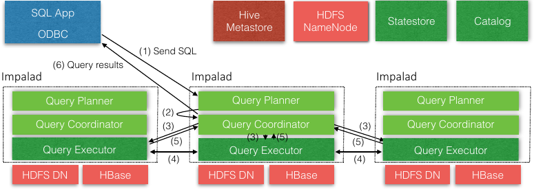
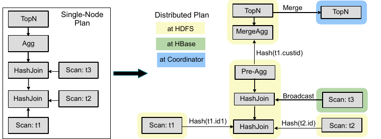
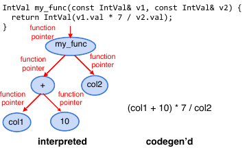
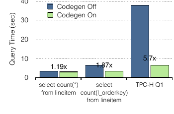
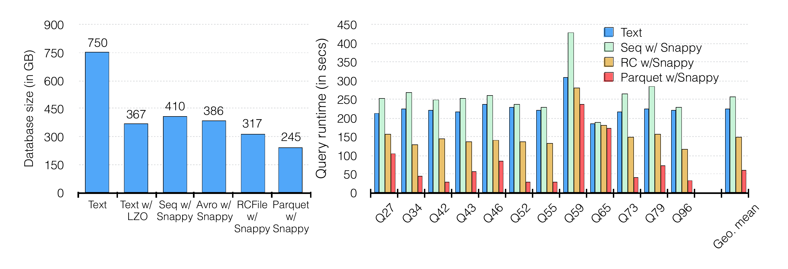
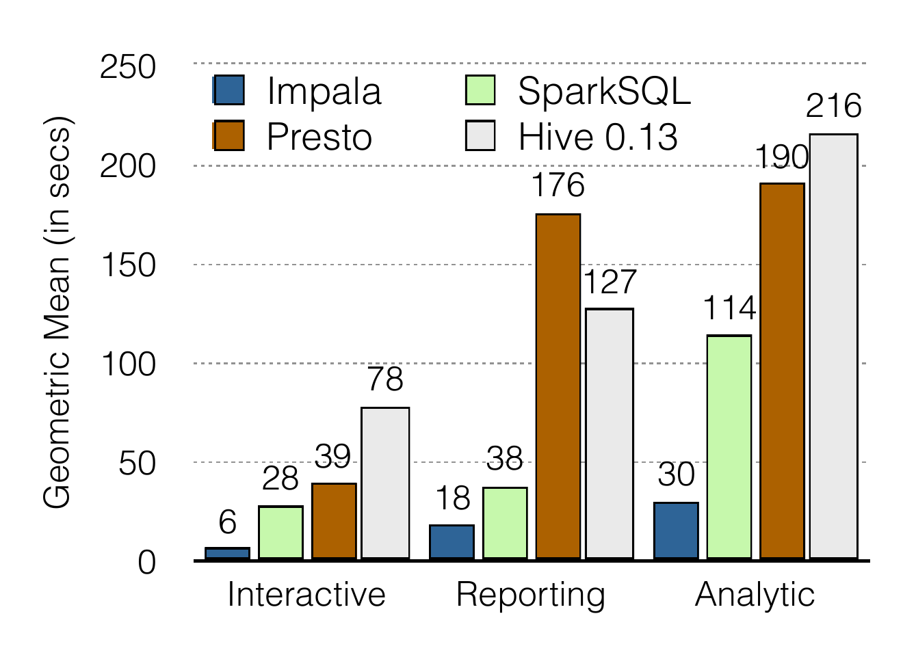
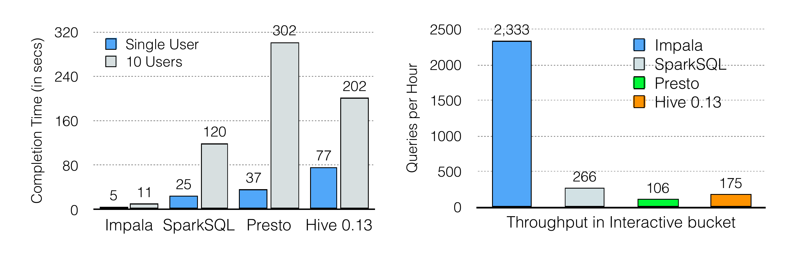
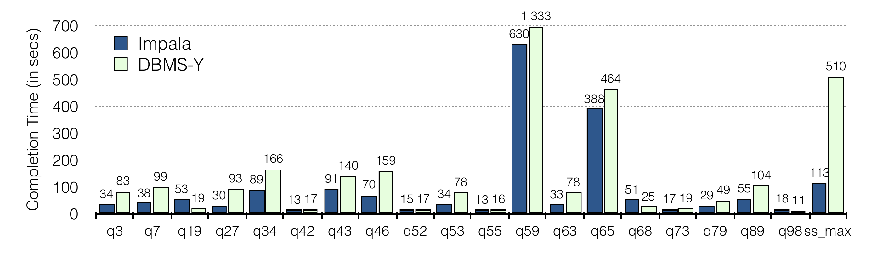

# Impala: A Modern, Open-Source SQL Engine for Hadoop（中文译文）

## 译者说明

本文依据同目录的 `source.pdf` 翻译。章节、图表、公式、算法、代码与参考文献按原文结构保留。

## 论文信息

**作者：** Marcel Kornacker、Alexander Behm、Victor Bittorf、Taras Bobrovytsky、Casey Ching、Alan Choi、Justin Erickson、Martin Grund、Daniel Hecht、Matthew Jacobs、Ishaan Joshi、Lenni Kuff、Dileep Kumar、Alex Leblang、Nong Li、Ippokratis Pandis、Henry Robinson、David Rorke、Silvius Rus、John Russell、Dimitris Tsirogiannis、Skye Wanderman-Milne、Michael Yoder

**机构：** Cloudera

**项目网站：** <http://impala.io/>

**会议：** 第 7 届两年一度的创新数据系统研究会议（CIDR 2015），2015 年 1 月 4–7 日，美国加利福尼亚州阿西洛马

**许可：** 本文依据 [Creative Commons Attribution 3.0](http://creativecommons.org/licenses/by/3.0/) 许可发布；在注明原作者和 CIDR 2015 的前提下，允许以任何媒介分发、复制及创作衍生作品。

## 摘要

Cloudera Impala 是一个现代开源 MPP SQL 引擎，从一开始就针对 Hadoop 数据处理环境设计。Impala 在 Hadoop 上为 BI 和分析型 read-mostly 查询提供低延迟和高并发，而 Apache Hive 等批处理框架无法提供这一点。本文从用户视角介绍 Impala，概述其架构和主要组件，并简要展示它相对于其他流行 SQL-on-Hadoop 系统的性能优势。

## 1. 引言

Impala 是一个开源[^1]、完全集成、现代 MPP SQL 查询引擎，专门设计为利用 Hadoop 的灵活性和可扩展性。Impala 的目标是把传统分析数据库熟悉的 SQL 支持和多用户性能，与 Apache Hadoop 的可扩展性、灵活性，以及 Cloudera Enterprise 的生产级安全和管理扩展结合起来。Impala beta 版发布于 2012 年 10 月，2013 年 5 月 GA。撰写本文时的最新版本 Impala 2.0 发布于 2014 年 10 月。自 GA 以来，Impala 下载量接近一百万次，生态势头持续增强。

与其他系统不同，Impala 不是 Postgres fork，而是一个全新的引擎，用 C++ 和 Java 从头编写。它通过使用标准组件 HDFS、HBase、Metastore、YARN、Sentry 保持 Hadoop 的灵活性，并且能够读取大多数常用文件格式，例如 Parquet、Avro、RCFile。为了降低延迟，例如避免使用 MapReduce 带来的延迟或远程读取数据的延迟，Impala 实现了基于 daemon process 的分布式架构。这些 daemon 负责查询执行的各个方面，并运行在 Hadoop 基础设施所在的相同机器上。结果是，在特定工作负载下，Impala 性能可以媲美甚至超过商业 MPP 分析 DBMS。

本文首先讨论 Impala 提供给用户的服务，然后概述其架构和主要组件。当前可实现的最高性能要求底层使用 HDFS 作为存储管理器，因此本文重点讨论 HDFS；当某些技术方面在结合 HBase 时处理方式存在显著差异，我们会在正文中指出，但不深入展开。

Impala 是性能最高的 SQL-on-Hadoop 系统，尤其是在多用户工作负载下。如第 7 节所示，对单用户查询，Impala 最多比替代方案快 13 倍，平均快 6.7 倍。对多用户查询，差距进一步扩大：Impala 最多比替代方案快 27.4 倍，平均快 18 倍；换言之，多用户查询上的平均优势几乎是单用户查询优势的 3 倍。

本文其余结构如下。第 2 节从用户视角概述 Impala，并指出它与传统 RDBMS 的差异。第 3 节介绍系统整体架构。第 4 节介绍 frontend 组件，包括基于代价的分布式查询优化器。第 5 节介绍 backend 组件，该组件负责查询执行并使用 runtime code generation。第 6 节介绍 resource/workload management 组件。第 7 节简要评估 Impala 性能。第 8 节讨论后续路线图，第 9 节总结。

## 2. Impala 的用户视图

Impala 是集成到 Hadoop 环境中的查询引擎，使用多个标准 Hadoop 组件，包括 Metastore、HDFS、HBase、YARN 和 Sentry，以提供类似 RDBMS 的体验。不过，它也有一些重要差异，本节后续会说明。

Impala 专门面向标准商业智能环境集成，因此支持大多数相关行业标准：客户端可通过 ODBC 或 JDBC 连接；认证通过 Kerberos 或 LDAP 完成；授权遵循标准 SQL role 和 privilege[^2]。为了查询驻留在 HDFS 中的数据，用户通过熟悉的 `CREATE TABLE` 语句创建表。该语句不仅提供数据的逻辑 schema，也说明物理布局，例如文件格式和在 HDFS 目录结构中的位置。随后可以用标准 SQL 语法查询这些表。

### 2.1 物理 Schema 设计

创建表时，用户还可以指定 partition column 列表：

```sql
CREATE TABLE T (...)
PARTITIONED BY (day int, month int)
LOCATION '<hdfs-path>'
STORED AS PARQUET;
```

对未分区表，数据文件默认直接存储在 root directory 中[^3]。对分区表，数据文件放在路径反映 partition column 值的子目录中。例如，表 `T` 中 `day = 17`、`month = 2` 的所有数据文件都会位于 `<root>/day=17/month=2/`。注意，这种 partitioning 并不意味着单个 partition 的数据 colocated：一个 partition 的数据文件块会随机分布在 HDFS data node 上。

Impala 在文件格式选择上也给用户很大灵活性。它当前支持压缩和未压缩文本文件、sequence file，一种可切分文本文件形式，RCFile，一种旧式列式格式，Avro，一种二进制行格式，以及 Parquet，即最高性能存储选项。用户在 `CREATE TABLE` 或 `ALTER TABLE` 语句中指定存储格式。也可以为每个 partition 单独选择不同格式。例如，可以把某个特定 partition 的文件格式设置为 Parquet：

```sql
ALTER TABLE PARTITION(day=17, month=2)
SET FILEFORMAT PARQUET;
```

这种能力有明确用处。例如，对按时间记录的数据表，如点击日志，当前日期的数据可能以 CSV 文件进入系统，并在每天结束时批量转换为 Parquet。

### 2.2 SQL 支持

Impala 支持 SQL-92 `SELECT` 语句的大多数语法，加上 SQL-2003 analytic function，以及大多数标准 scalar 数据类型：integer 和 floating point 类型、`STRING`、`CHAR`、`VARCHAR`、`TIMESTAMP`，以及最高 38 位精度的 `DECIMAL`。自定义应用逻辑可通过 Java 和 C++ user-defined function (UDF)，以及当前仅支持 C++ 的 user-defined aggregate function (UDA) 加入。

受 HDFS 作为存储管理器的限制，Impala 不支持 `UPDATE` 或 `DELETE`，本质上只支持批量插入，例如 `INSERT INTO ... SELECT ...`[^4]。与传统 RDBMS 不同，用户可以通过 HDFS API 简单地把数据文件复制或移动到表目录位置，从而向表添加数据。也可以用 `LOAD DATA` 语句完成相同操作。

类似批量插入，Impala 通过删除表 partition 来支持批量数据删除：

```sql
ALTER TABLE DROP PARTITION
```

由于不能原地更新 HDFS 文件，Impala 不支持 `UPDATE` 语句。相反，用户通常重新计算数据集的一部分以纳入更新，然后替换相应数据文件，常见方式是 drop 再 re-add partition。

在初始数据加载之后，或当表中相当一部分数据变化时，用户应运行：

```sql
COMPUTE STATS <table>
```

该语句指示 Impala 收集表统计信息。这些统计信息随后用于查询优化。

## 3. 架构

Impala 是一个大规模并行查询执行引擎，运行在现有 Hadoop 集群的数百台机器上。它与底层存储引擎解耦，不同于传统关系数据库管理系统，后者的查询处理和底层存储引擎通常是一个紧耦合系统的组件。Impala 高层架构如图 1 所示。

一个 Impala 部署由三个服务组成。Impala daemon (impalad) 服务承担双重职责：一方面从客户端进程接受查询并协调其在集群上的执行；另一方面代表其他 Impala daemon 执行单个 query fragment。当一个 Impala daemon 以第一种角色管理查询执行时，它被称为该查询的 coordinator。不过，所有 Impala daemon 都是对称的，可以扮演所有角色。这一属性有助于容错和负载均衡。

每台运行 datanode 进程的集群机器上都会部署一个 Impala daemon。Datanode 是底层 HDFS 部署的块服务器，因此通常每台机器都有一个 Impala daemon。这使 Impala 能利用数据局部性，并且从文件系统读取块时无需使用网络。

Statestore daemon (statestored) 是 Impala 的元数据 publish-subscribe 服务，负责把集群级元数据分发给所有 Impala 进程。系统中有一个 statestored 实例，第 3.1 节会更详细描述。

最后，Catalog daemon (catalogd) 是 Impala 的 catalog repository 和元数据访问网关。通过 catalogd，Impala daemon 可以执行 DDL 命令，并将其反映到 Hive Metastore 等外部 catalog store。系统 catalog 的变化通过 statestore 广播。

这些 Impala 服务以及若干配置选项，例如 resource pool 大小、可用内存等，也暴露给 Cloudera Manager[^5]。Cloudera Manager 是一个复杂的集群管理应用，可以管理 Impala，也可以管理 Hadoop 部署中的几乎所有服务。



### 3.1 State Distribution

设计一个运行在数百节点上的 MPP 数据库时，一个主要挑战是协调和同步集群级元数据。Impala 的 symmetric-node 架构要求所有节点都能接受和执行查询。因此，所有节点都必须拥有例如系统 catalog 的最新版本，以及 Impala 集群 membership 的近期视图，以便正确调度查询。

我们可以通过部署单独的 cluster-management service 来处理这个问题，由它保存所有集群级元数据的 ground-truth 版本。Impala daemon 随后可以惰性查询该存储，也就是只在需要时查询，从而确保所有查询获得最新响应。不过，Impala 设计的一项基本原则是尽可能避免在任何查询关键路径上使用同步 RPC。我们发现，如果不仔细控制这些成本，查询延迟常常会被建立 TCP 连接的时间或远端服务负载破坏。为此，我们把 Impala 设计为向所有相关方推送更新，并设计了一个简单的 publish-subscribe 服务 statestore 来把元数据变化分发给一组 subscriber。

Statestore 维护一组 topic。Topic 是由 `(key, value, version)` triplet 组成的数组，称为 entry；其中 `key` 和 `value` 是 byte array，`version` 是 64-bit integer。Topic 由应用定义，因此 statestore 不理解任何 topic entry 的内容。Topic 在 statestore 生命周期内持久存在，但服务重启后不会持久保存。希望接收任意 topic 更新的进程称为 subscriber，它们在启动时向 statestore 注册并提供 topic 列表。Statestore 对注册的响应是向 subscriber 发送每个注册 topic 的初始 topic update，其中包含该 topic 当前所有 entry。

注册之后，statestore 周期性地向每个 subscriber 发送两类消息。第一类是 topic update，包含自上次成功发送给 subscriber 以来某个 topic 的所有变化，包括新增、修改和删除 entry。每个 subscriber 维护每个 topic 的 most-recent-version identifier，使 statestore 只需发送更新之间的 delta。作为对 topic update 的响应，每个 subscriber 会发送一个它希望对已订阅 topic 做出的变更列表。Statestore 保证这些变更在下一次 update 收到前已经被应用。

第二类 statestore 消息是 keepalive。Statestore 使用 keepalive 消息维持与每个 subscriber 的连接，否则 subscriber 会让 subscription 超时并尝试重新注册。先前版本的 statestore 使用 topic update 消息同时承担这两个目的，但随着 topic update 变大，很难确保及时向每个 subscriber 交付更新，导致 subscriber failure detection 过程出现 false positive。

如果 statestore 检测到 subscriber 失败，例如反复无法交付 keepalive，它会停止发送更新。某些 topic entry 可以标记为 transient，意味着如果其 owning subscriber 失败，它们会被移除。这是维护集群 liveness information 和 per-node load statistics 等专用 topic 的自然原语。

Statestore 提供非常弱的语义：subscriber 可能以不同速率更新，因而对 topic 内容有非常不同的视图。不过，Impala 只使用 topic metadata 在本地做决策，不在集群范围内协调。例如，query planning 在单个节点上基于 catalog metadata topic 执行；一旦完整计划计算完成，执行该计划所需的所有信息会直接分发给执行节点。执行节点不需要知道同一个 catalog metadata topic 的相同版本。

虽然现有 Impala 部署中只有一个 statestore 进程，但我们发现它可以很好地扩展到中等规模集群，并通过一些配置服务我们的最大规模部署。Statestore 不把任何元数据持久化到磁盘：所有当前元数据都由 live subscriber 推送到 statestore。因此，如果 statestore 重启，其状态可以在初始 subscriber 注册阶段恢复。如果运行 statestore 的机器失败，也可以在其他地方启动新的 statestore 进程，并让 subscriber fail over 到它。Impala 没有内建 failover 机制；部署通常使用可重定向 DNS entry，强制 subscriber 自动迁移到新进程实例。

### 3.2 Catalog Service

Impala 的 catalog service 通过 statestore 广播机制向 Impala daemon 提供 catalog metadata，并代表 Impala daemon 执行 DDL 操作。Catalog service 从第三方 metadata store 拉取信息，例如 Hive Metastore 或 HDFS NameNode，并把这些信息聚合成 Impala 兼容的 catalog 结构。这一架构允许 Impala 对其依赖的存储引擎 metadata store 保持相对无关，从而使我们可以较快地向 Impala 添加新的 metadata store，例如 HBase 支持。系统 catalog 的任何变化，例如加载新表时，都会通过 statestore 分发。

Catalog service 还允许我们用 Impala 特有信息增强系统 catalog。例如，我们只把 user-defined function 注册到 catalog service，而不复制到 Hive Metastore，因为它们是 Impala 特有的。

由于 catalog 往往很大，并且表访问很少均匀，catalog service 启动时只为发现的每张表加载 skeleton entry。更详细的表元数据可以在后台从第三方 store 惰性加载。如果某张表在完全加载前就被需要，Impala daemon 会检测到这一点，并向 catalog service 发出 prioritization request。该请求会阻塞，直到表完全加载。

## 4. Frontend

Impala frontend 负责把 SQL 文本编译成 Impala backend 可执行的查询计划。它用 Java 编写，由从头实现的完整 SQL parser 和基于代价的查询优化器组成。除基本 SQL 特性，如 select、project、join、group by、order by、limit 外，Impala 支持 inline view、uncorrelated 和 correlated subquery，后者会重写为 join、所有 outer join 变体，以及显式 left/right semi-join 和 anti-join、analytic window function。

查询编译过程遵循传统分工：query parsing、semantic analysis 和 query planning/optimization。我们将重点关注最后也是最具挑战性的部分。Impala 查询规划器的输入是 parse tree 和 semantic analysis 阶段组装的 query-global 信息，例如 table/column identifier、equivalence class 等。可执行查询计划分两阶段构造：(1) single-node planning，(2) plan parallelization and fragmentation。

第一阶段把 parse tree 翻译成不可执行的 single-node plan tree，包含以下 plan node：HDFS/HBase scan、hash join、cross join、union、hash aggregation、sort、top-n 和 analytic evaluation。该步骤负责把 predicate 分配到尽可能低的 plan node，基于 equivalence class 推断 predicate，裁剪 table partition，设置 limit/offset，应用 column projection，并执行一些基于代价的 plan optimization，例如排序和合并 analytic window function，以及 join reordering，以最小化总评估成本。代价估计基于 table/partition cardinality 和每列 distinct value count[^6]；当前统计信息中没有 histogram。Impala 使用简单启发式，在常见情况下避免穷尽枚举和计价整个 join-order 空间。

第二个规划阶段以 single-node plan 为输入，生成分布式执行计划。总体目标是最小化数据移动并最大化 scan locality：在 HDFS 中，远程读取比本地读取慢得多。系统通过在必要时在 plan node 之间加入 exchange node，并通过增加额外非 exchange plan node 来最小化跨网络数据移动，例如 local aggregation node，从而使计划分布式化。在第二阶段，我们为每个 join node 决定 join strategy，此时 join order 已固定。支持的 join strategy 是 broadcast 和 partitioned。前者把 join 的整个 build side 复制到所有执行 probe 的集群机器，后者按 join expression 对 build 和 probe side 做 hash-redistribution。Impala 选择估计会最小化网络交换数据量的策略，同时利用 join 输入已有的数据 partitioning。

所有 aggregation 当前都作为 local pre-aggregation 后接 merge aggregation 执行。对 grouping aggregation，pre-aggregation 输出按 grouping expression partition，merge aggregation 在所有参与节点上并行执行。对非 grouping aggregation，merge aggregation 在单个节点上执行。Sort 和 top-n 也以类似方式并行化：分布式 local sort/top-n 后接单节点 merge operation。Analytic expression evaluation 基于 partition-by expression 并行化，并依赖输入已按 partition-by/order-by expression 排序。最后，分布式 plan tree 在 exchange 边界处切分。计划的每个部分都放入一个 plan fragment 中，plan fragment 是 Impala backend 执行单元。一个 plan fragment 封装了在单台机器的相同 data partition 上操作的一部分 plan tree。

图 2 通过例子说明查询规划的两个阶段。左侧展示一个查询的 single-node plan：它连接两个 HDFS 表 `t1`、`t2` 和一个 HBase 表 `t3`，随后执行 aggregation 和带 limit 的 order by，即 top-n。右侧展示分布式、fragmented plan。圆角矩形表示 fragment 边界，箭头表示数据 exchange。表 `t1` 和 `t2` 通过 partitioned 策略 join。由于扫描结果立即 exchange 给 consumer，即 join node，而该 join node 在基于 hash 的 data partition 上运行，因此 scan 位于自己的 fragment 中。后续与 `t3` 的 join 是 broadcast join，并放在与 `t1`、`t2` join 相同的 fragment 中，因为 broadcast join 保留已有 data partition。Join 之后，我们执行两阶段分布式 aggregation，其中 pre-aggregation 与最后一个 join 位于同一 fragment。Pre-aggregation 结果根据 grouping key 做 hash-exchange，然后再次聚合以计算最终聚合结果。Top-n 采用同样两阶段方法，最终 top-n 步骤在 coordinator 上执行，由 coordinator 返回结果给用户。



## 5. Backend

Impala backend 从 frontend 接收 query fragment，并负责快速执行这些 fragment。它被设计为利用现代硬件。Backend 用 C++ 编写，并在运行时使用 code generation 产生高效 code path，即减少指令数，并保持较小内存开销，尤其是相对于用 Java 实现的其他引擎。Impala 利用了几十年来并行数据库研究成果。执行模型是传统的带 Exchange operator 的 Volcano-style [7]。处理以 batch-at-a-time 方式执行：每个 `GetNext()` 调用都在一批行上操作，类似 [10]。除 sorting 等 stop-and-go 算子外，执行完全可以流水线化，从而最小化存储中间结果的内存消耗。在内存中处理时，tuple 使用规范的行式内存格式。

可能消耗大量内存的算子被设计为必要时可以把工作集的部分内容 spill 到磁盘。可 spill 的算子包括 hash join、hash-based aggregation、sorting 和 analytic function evaluation。

Impala 对 hash join 和 aggregation 算子采用 partitioning 方法。也就是说，每个 tuple 的 hash value 的一部分 bit 决定目标 partition，其余 bit 用于 hash table probe。正常操作中，当所有 hash table 都能放入内存时，partitioning 步骤开销很小，相比不可 spill、非 partitioning 实现，性能差距在 10% 以内。当出现内存压力时，可以把某个 victim partition spill 到磁盘，从而为其他 partition 完成处理释放内存。在为 hash join 构建 hash table 且 build-side relation 基数减少时，我们构建 Bloom filter，并传递给 probe side scanner，实现一个简单版本的 semi-join。

### 5.1 Runtime Code Generation

Impala backend 广泛使用基于 LLVM [8] 的 runtime code generation 来改善执行时间。对代表性工作负载，5 倍或更高性能提升很常见。

LLVM 是一个编译器库和相关工具集合。与作为独立应用实现的传统编译器不同，LLVM 被设计为模块化和可复用。它允许 Impala 这类应用在运行中的进程内执行 just-in-time (JIT) compilation，享受现代优化器的完整收益，并能通过为编译流程各步骤暴露独立 API，为多种架构生成机器码。

Impala 使用 runtime code generation 生成查询特定版本的关键性能函数。特别是，code generation 应用于 inner loop function，也就是在给定查询中执行多次、对每个 tuple 执行、因此构成查询总执行时间很大一部分的函数。例如，把数据文件中的记录解析为 Impala 内存 tuple 格式的函数必须对扫描到的每个数据文件中的每条记录调用。对于扫描大表的查询，这可能是数十亿条记录甚至更多。为了良好查询性能，该函数必须极其高效；即使从函数执行中删除几条指令，也可能带来较大查询加速。

没有 code generation 时，为了处理程序编译时未知的运行时信息，函数执行中的低效几乎总是必要的。例如，一个只处理整数类型的 record-parsing function，在解析只包含整数的文件时，会比同时处理字符串和浮点数等其他数据类型的函数更快。不过，要扫描文件的 schema 在编译时未知，因此必须使用通用函数，即便运行时已知更受限的功能已经足够。

大型运行时开销的一个来源是 virtual function。Virtual function call 具有很大性能惩罚，特别是被调用函数非常简单时，因为调用无法 inline。如果对象实例类型在运行时已知，我们可以用 code generation 把 virtual function call 替换为直接调用正确函数，随后该调用可以 inline。这在 expression tree 求值时特别有价值。Impala 中和许多系统中一样，expression 由各个 operator 和 function 组成的树构成，如图 3 左侧所示。树中每种 expression 类型都通过覆盖 expression base class 中的 virtual function 实现，该 virtual function 递归调用子 expression。许多 expression function 非常简单，例如两个数字相加。因此，调用 virtual function 的成本常常远超过实际计算该函数的成本。如图 3 所示，通过用 code generation 解析 virtual function call 并 inline 生成的函数调用，expression tree 可以直接求值，没有 function call overhead。此外，inline function 增加 instruction-level parallelism，并允许编译器执行更多优化，例如跨 expression 的 subexpression elimination。



总体而言，JIT compilation 的效果类似为查询手写定制代码。例如，它会消除分支、展开循环、传播常量、offset 和 pointer，并 inline 函数。Code generation 对性能有显著影响，如图 4 所示。我们在一个 10 节点集群上测量 codegen 的影响，每节点有 8 core、48 GB RAM 和 12 块磁盘；我们使用 scale factor 100 的 Avro TPC-H 数据库，并运行简单聚合查询。Code generation 最多使执行加速 5.7 倍，且加速随查询复杂度增加而增加。



### 5.2 I/O Management

对所有 SQL-on-Hadoop 系统来说，从 HDFS 高效取回数据都是挑战。为了以接近硬件速度从磁盘和内存执行数据扫描，Impala 使用 HDFS 的 short-circuit local reads [3] 特性，在读取本地磁盘时绕过 DataNode protocol。Impala 可以接近磁盘带宽读取，大约每块磁盘 100 MB/s，并且通常能够饱和所有可用磁盘。我们测量到，在 12 块磁盘下，Impala 能维持 1.2 GB/s 的 I/O。此外，HDFS caching [2] 允许 Impala 以内存总线速度访问 memory-resident data，并节省 CPU 周期，因为不需要复制数据块或校验数据块。

从存储设备读取或向存储设备写入数据，是 I/O manager 组件的职责。I/O manager 为每个物理磁盘分配固定数量的 worker thread，旋转磁盘每块一个线程，SSD 每块 8 个线程，并向客户端，例如 scanner thread，提供异步接口。[6] 最近验证了 Impala I/O manager 的有效性，该研究显示 Impala 读取吞吐比其他被测系统高 4 到 8 倍。

### 5.3 Storage Formats

Impala 支持多数流行文件格式：Avro、RC、Sequence、plain text 和 Parquet。这些格式可与 snappy、gzip、bz2 等不同压缩算法组合。

在多数用例中，我们推荐使用 Apache Parquet。Parquet 是现代开源列式文件格式，提供高压缩和高扫描效率。它由 Twitter 和 Cloudera 共同开发，并有 Criteo、Stripe、Berkeley AMPlab、LinkedIn 等贡献。除 Impala 外，Hive、Pig、MapReduce 和 Cascading 等多数 Hadoop 处理框架也能处理 Parquet。

简单来说，Parquet 是一种可定制的 PAX-like [1] 格式，针对大型数据块优化，数据块可达数十、数百、数千 MB，并内建支持嵌套数据。受 Dremel 的 ColumnIO 格式 [9] 启发，Parquet 以列式方式存储嵌套字段，并用少量信息增强这些列，以便扫描时从列数据重组嵌套结构。Parquet 有一组可扩展列编码。1.2 版支持 run-length 和 dictionary encoding，2.0 版增加 delta encoding 和优化字符串编码。最新版本 Parquet 2.0 还实现 embedded statistics，即 inline column statistics，用于进一步优化扫描效率，例如 min/max index。

如前所述，Parquet 同时提供高压缩和扫描效率。图 5 左侧比较 TPC-H scale factor 1000 的 Lineitem 表在一些常见文件格式和压缩算法组合下的磁盘大小。带 snappy 压缩的 Parquet 在这些组合中压缩效果最好。图 5 右侧展示当数据库以 plain text、Sequence、RC 和 Parquet 格式存储时，Impala 执行 TPC-DS benchmark 中多个查询的时间。Parquet 持续优于其他所有格式，最高可达 5 倍。



## 6. Resource/Workload Management

任何集群框架面临的主要挑战之一，是仔细控制资源消耗。Impala 常常运行在繁忙集群中，MapReduce 任务、ingest job 和定制框架会竞争有限的 CPU、内存和网络资源。难点是在查询之间，甚至框架之间协调资源调度，同时不损害查询延迟或吞吐。

Apache YARN [12] 是 Hadoop 集群上当前的资源调解标准，使框架可以共享 CPU 和内存等资源，而不必分割集群。YARN 采用集中式架构，框架请求 CPU 和内存资源，中央 Resource Manager 服务仲裁这些请求。这种架构的优点是可以基于完整集群状态做决策，但也给资源获取带来显著延迟。由于 Impala 面向每秒数千查询的工作负载，我们发现资源请求和响应周期过长，无法接受。

我们对该问题采取两方面方法。第一，我们实现了一个互补但独立的 admission control 机制，使用户无需代价高昂的集中决策即可控制工作负载。第二，我们设计了一个位于 Impala 和 YARN 之间的中间服务，以修正某些 impedance mismatch。该服务称为 Llama，即 Low-Latency Application MAster，实现 resource caching、gang scheduling 和 incremental allocation change，同时仍将未命中 Llama cache 的资源请求的实际调度决策交给 YARN。

本节其余部分描述 Impala 的两种资源管理方法。我们的长期目标是通过单一机制支持 mixed-workload resource management，同时支持 admission control 的低延迟决策和 YARN 的 cross-framework 支持。

### 6.1 Llama and YARN

Llama 是一个独立 daemon，所有 Impala daemon 都向它发送 per-query resource request。每个 resource request 关联一个 resource pool，该 pool 定义查询可以使用的集群可用资源 fair share。

如果 resource pool 所需资源在 Llama resource cache 中可用，Llama 会立即把资源返回给查询。该 fast path 允许 Llama 在资源争用较低时绕过 YARN 资源分配算法。否则，Llama 把请求转发给 YARN Resource Manager，并等待所有资源返回。这与 YARN 的 drip-feed allocation model 不同，在后者中资源一旦分配就返回。Impala 的流水线执行模型要求所有资源同时可用，使所有 query fragment 能并行推进。

由于查询计划的资源估计，特别是超大数据集上的估计，常常不准确，我们允许 Impala 查询在执行期间调整资源消耗估计。YARN 不支持这种模式，因此我们让 Llama 向 YARN 发出新的资源请求，例如每节点再请求 1 GB 内存，然后从 Impala 视角把它们聚合为单个资源分配。该 adapter 架构使 Impala 能完全集成 YARN，而 Impala 本身无需吸收处理不适合编程接口的复杂性。

### 6.2 Admission Control

除集成 YARN 进行集群级资源管理外，Impala 还有内建 admission control 机制，用于 throttle 进入请求。请求被分配到 resource pool，并根据策略被 admit、queue 或 reject；策略定义每个 pool 的最大并发请求数和最大请求内存用量。Admission controller 被设计为快速、去中心化，使进入任意 Impala daemon 的请求都能在不向中心服务器发出同步请求的情况下被 admit。做 admission decision 所需状态通过 statestore 在 Impala daemon 之间分发，因此每个 Impala daemon 都能基于自己对全局状态的聚合视图做 admission decision，而请求执行路径上不需要额外同步通信。不过，因为共享状态异步接收，Impala daemon 可能在本地做出导致超过策略限制的决策。实践中这不是问题，因为状态通常比非平凡查询更新得更快。此外，admission control 机制主要被设计为简单 throttling mechanism，而不是 YARN 这样的资源管理方案。

Resource pool 以层次方式定义。进入请求根据 placement policy 分配到 resource pool，pool 访问可以用 ACL 控制。配置通过 YARN fair scheduler allocation file 和 Llama configuration 指定，Cloudera Manager 提供简单 UI 配置 resource pool，并且修改配置不需要重启任何运行中服务。

## 7. Evaluation

本节目的不是穷尽评估 Impala 性能，而主要给出一些指示。已有独立学术研究得出类似结论，例如 [6]。

### 7.1 Experimental Setup

所有实验都在同一个 21 节点集群上运行。集群中每个节点是 2-socket 机器，CPU 为 6-core Intel Xeon E5-2630L 2.00 GHz。每个节点有 64 GB RAM 和 12 块 932 GB 磁盘，其中一块用于 OS，其余用于 HDFS。

我们运行一个 decision-support 风格 benchmark，其中包含 TPC-DS 查询子集，数据集 scale factor 为 15 TB。下面结果中，我们按查询访问数据量把查询分为 interactive、reporting 和 deep analytic。Interactive bucket 包含 q19、q42、q52、q55、q63、q68、q73 和 q98；reporting bucket 包含 q27、q3、q43、q53、q7 和 q89；deep analytic bucket 包含 q34、q46、q59、q79 和 ss_max。我们用于这些测量的 kit 是公开可用的[^7]。

在比较中，我们采用了那些我们能够展示结果的最流行 SQL-on-Hadoop 系统[^8]：Impala、Presto、Shark、SparkSQL 和 Hive 0.13。由于除 Impala 外所有测试引擎都缺少 cost-based optimizer，我们用转换为 SQL-92 style join 的查询测试所有引擎。为保持一致，我们对 Impala 也运行相同查询，尽管 Impala 在没有这些修改时会产生相同结果。

每个引擎都使用其表现最佳的文件格式，并一致使用 Snappy 压缩以确保公平比较：Impala 使用 Apache Parquet，Hive 0.13 使用 ORC，Presto 使用 RCFile，SparkSQL 使用 Parquet。

### 7.2 Single User Performance

图 6 比较四个系统在 single-user run 下的性能，其中单个用户以零 think time 反复提交查询。Impala 在运行的所有查询上都优于其他替代系统。Impala 的性能优势范围为 2.1 倍到 13.0 倍，平均快 6.7 倍。事实上，相比早期 Impala 版本[^9]，它相对 Hive 0.13 的平均优势从 4.9 倍扩大到 9 倍，相对 Presto 的平均优势从 5.3 倍扩大到 7.5 倍。



### 7.3 Multi-User Performance

Impala 的性能优势在多用户工作负载中更加明显，而这类负载在真实应用中非常普遍。图 7 左侧展示 10 个并发用户提交 interactive category 查询时四个系统的响应时间。在该场景中，从单用户到并发用户工作负载，Impala 相比其他系统快 6.7 倍到 18.7 倍。根据比较对象不同，speedup 从 10.6 倍到 27.4 倍不等。注意，Impala 在 10 用户负载下的速度接近单用户负载的一半，而其他替代系统平均仅为单用户负载下的五分之一。

类似地，图 7 右侧比较四个系统的吞吐。当 10 个用户提交 interactive bucket 中的查询时，Impala 吞吐比其他系统高 8.7 倍到 22 倍。



### 7.4 Comparing Against a Commercial RDBMS

从上述比较可以看出，Impala 在 SQL-on-Hadoop 系统的性能方面处于前沿。但 Impala 也适合部署在传统数据仓库环境中。图 8 中，我们比较 Impala 与一个流行商业列式分析 DBMS 的性能。由于限制性专有许可协议，后者在文中称为 “DBMS-Y”。我们使用 scale factor 30,000 的 TPC-DS 数据集，即 30 TB 原始数据，并运行前文工作负载中的查询。我们可以看到，Impala 最多比 DBMS-Y 快 4.5 倍，平均快 2 倍，只有 3 个查询更慢。



## 8. Roadmap

本文中，我们概述了 Cloudera Impala。虽然 Impala 已经影响现代数据管理，并且是 SQL-on-Hadoop 系统中的性能领导者，但仍有许多工作要做。我们的路线图项目大致分为两类：添加更多传统并行 DBMS 技术，以覆盖越来越多既有数据仓库工作负载；以及解决某些 Hadoop 环境中特有的问题。

### 8.1 Additional SQL Support

截至 2.0 版，Impala 的 SQL 支持已经相当完整，但仍缺少一些标准语言特性：set `MINUS` 和 `INTERSECT`，`ROLLUP` 和 `GROUPING SET`，dynamic partition pruning，`DATE`、`TIME`、`DATETIME` 数据类型。我们计划在接下来几个版本中加入这些特性。

Impala 当前限制为 flat relational schema。虽然这对既有数据仓库工作负载通常足够，但我们看到新文件格式使用增多，这些格式通过 complex column type，如 struct、array、map，允许本质上嵌套的关系 schema。Impala 将扩展以处理这类 schema，并且不限制单个查询中可寻址的嵌套层级或嵌套元素数量。

### 8.2 Additional Performance Enhancements

计划中的性能增强包括 join、aggregation 和 sort 的节点内并行化，以及更广泛地使用 runtime code generation，例如用于网络传输的数据准备、查询输出 materialization 等任务。我们也在考虑对查询处理中需要 materialize 的数据切换到列式规范内存格式，以利用 SIMD 指令 [11, 13]。

另一个计划改进领域是 Impala 查询优化器。当前它探索的 plan space 有意受限，以获得鲁棒性和可预测性；部分原因是缺少更复杂的数据统计，例如 histogram，以及额外 schema 信息，例如 primary/foreign key constraint、列 nullability，这些信息能让 plan alternative 的计价更准确。我们计划在近期到中期把 histogram 加入 table/partition metadata，以纠正这些问题。如何利用这类额外元数据并以鲁棒方式纳入复杂 plan rewrite，是正在进行的挑战性工作。

### 8.3 Metadata and Statistics Collection

在 Hadoop 环境中收集 metadata 和 table statistics 很复杂，因为与 RDBMS 不同，新数据可以仅通过把数据文件移动到表 root directory 而出现。当前，用户必须发出命令重新计算统计信息并更新物理元数据以纳入新数据文件，但这被证明有问题：用户常常忘记发出该命令，或困惑于究竟何时需要发出该命令。

该问题的解决方案是通过后台进程自动检测新数据文件。该后台进程还会更新 metadata，并调度计算增量 table statistics 的查询。

### 8.4 Automated Data Conversion

允许多种数据格式并存的一个更具挑战性的方面，是从一种格式转换为另一种格式。数据通常以结构化行式格式加入系统，例如 JSON、Avro 或 XML，或以文本形式加入。另一方面，从性能角度看，Parquet 等列式格式是理想选择。让用户管理从一种格式到另一种格式的转换，在生产环境中常常不是简单任务：这本质上要求建立可靠的数据流水线，包括识别新数据文件、在转换过程中合并这些文件等，而这本身需要大量数据工程。

我们计划添加转换过程自动化，使用户可以把表标记为 auto-conversion。转换过程本身会 piggy-backed 到后台 metadata 和 statistics gathering 进程上；该进程还会调度对新数据文件运行的 conversion query。

### 8.5 Resource Management

在开放多租户环境中进行资源管理仍是未解决问题。在这种环境中，Impala 与 MapReduce、Spark 等其他处理框架共享集群资源。当前与 YARN 的集成并不覆盖所有用例，而 YARN 关注带同步资源预留的单一 reservation registry，使其难以适应低延迟、高吞吐工作负载。我们正在积极研究新的解决方案。

### 8.6 Support for Remote Data Storage

Impala 当前依赖存储和计算 colocated 以实现高性能。不过，Amazon S3 等云数据存储越来越流行。基于 SAN 的遗留存储基础设施也需要计算和存储分离。我们正在积极扩展 Impala 以访问 Amazon S3，计划在 2.2 版提供，以及基于 SAN 的系统。除了简单地用远程存储替换本地存储外，我们还计划研究自动缓存策略，使本地处理成为可能，同时不增加额外运维负担。

## 9. 结论

本文中，我们介绍了 Cloudera Impala。Impala 是一个开源 SQL 引擎，设计目标是把并行 DBMS 技术带到 Hadoop 环境中。我们的性能结果显示，尽管 Hadoop 起源于批处理环境，仍然可以在其上构建一个分析 DBMS，使其性能与当前商业方案一样好甚至更好，同时保留 Hadoop 的灵活性和成本效率。

在当前状态下，Impala 已经可以在许多工作负载上替代传统单体分析 RDBMS。我们预测，随着时间推移，它与这些系统在 SQL 功能方面的差距会消失，Impala 将能承担越来越多既有数据仓库工作负载。不过，我们相信 Hadoop 环境的模块化性质给 Impala 带来了传统单体 RDBMS 无法复制的一些优势。在这种环境中，Impala 使用一组跨平台共享的标准组件。特别是，混用文件格式和处理框架的能力意味着，单个系统可以处理更广泛的计算任务，而无需数据移动；数据移动本身通常是组织用数据做有用事情的最大障碍之一。

Hadoop 生态中的数据管理仍缺少过去几十年商业 RDBMS 已发展出的某些功能。尽管如此，我们预计这一差距会快速缩小，开放模块化环境的优势将使其在不太遥远的未来成为主导数据管理架构。

[^1]: Impala 源代码：<https://github.com/cloudera/impala>。

[^2]: 这一能力由另一个标准 Hadoop 组件 Sentry [4] 提供；Sentry 也向 Hive 和其他组件提供基于角色的授权。

[^3]: 不过，root 下任意目录中的所有数据文件都属于该表的数据集。Apache Hive 也采用这种常见方式处理未分区表。

[^4]: 还应指出，Impala 支持 `VALUES` 子句。不过，对 HDFS-backed 表，这会为每条 `INSERT` 语句生成一个文件，导致多数应用的性能很差；对 HBase-backed 表，`VALUES` 变体通过 HBase API 执行单行插入。

[^5]: Cloudera Manager：<http://www.cloudera.com/content/cloudera/en/products-and-services/cloudera-enterprise/cloudera-manager.html>。

[^6]: 我们使用 HyperLogLog 算法 [5] 估计 distinct value 数量。

[^7]: <https://github.com/cloudera/impala-tpcds-kit>。

[^8]: Hadoop 还有其他几个 SQL 引擎，例如 Pivotal HAWQ 和 IBM BigInsights。遗憾的是，据我们所知，这些系统利用了 DeWitt clause，法律限制使我们不能展示与它们的比较结果。

[^9]: <http://blog.cloudera.com/blog/2014/05/new-sql-choices-in-the-apache-hadoop-ecosystem-why-impala-continues-to-lead/>。

## 参考文献

- [1] A. Ailamaki, D. J. DeWitt, M. D. Hill, and M. Skounakis. Weaving relations for cache performance. In VLDB, 2001.
- [2] Apache. Centralized cache management in HDFS. Available at https://hadoop.apache.org/docs/r2.3.0/hadoop-project-dist/hadoop-hdfs/CentralizedCacheManagement.html.
- [3] Apache. HDFS short-circuit local reads. Available at http://hadoop.apache.org/docs/r2.5.1/hadoop-project-dist/hadoop-hdfs/ShortCircuitLocalReads.html.
- [4] Apache. Sentry. Available at http://sentry.incubator.apache.org/.
- [5] P. Flajolet, E. Fusy, O. Gandouet, and F. Meunier. HyperLogLog: The analysis of a near-optimal cardinality estimation algorithm. In AOFA, 2007.
- [6] A. Floratou, U. F. Minhas, and F. Ozcan. SQL-on-Hadoop: Full circle back to shared-nothing database architectures. PVLDB, 2014.
- [7] G. Graefe. Encapsulation of parallelism in the Volcano query processing system. In SIGMOD, 1990.
- [8] C. Lattner and V. Adve. LLVM: A compilation framework for lifelong program analysis & transformation. In CGO, 2004.
- [9] S. Melnik, A. Gubarev, J. J. Long, G. Romer, S. Shivakumar, M. Tolton, and T. Vassilakis. Dremel: Interactive analysis of web-scale datasets. PVLDB, 2010.
- [10] S. Padmanabhan, T. Malkemus, R. C. Agarwal, and A. Jhingran. Block oriented processing of relational database operations in modern computer architectures. In ICDE, 2001.
- [11] V. Raman, G. Attaluri, R. Barber, N. Chainani, D. Kalmuk, V. KulandaiSamy, J. Leenstra, S. Lightstone, S. Liu, G. M. Lohman, T. Malkemus, R. Mueller, I. Pandis, B. Schiefer, D. Sharpe, R. Sidle, A. Storm, and L. Zhang. DB2 with BLU Acceleration: So much more than just a column store. PVLDB, 6, 2013.
- [12] V. K. Vavilapalli, A. C. Murthy, C. Douglas, S. Agarwal, M. Konar, R. Evans, T. Graves, J. Lowe, H. Shah, S. Seth, B. Saha, C. Curino, O. O'Malley, S. Radia, B. Reed, and E. Baldeschwieler. Apache Hadoop YARN: Yet another resource negotiator. In SOCC, 2013.
- [13] T. Willhalm, N. Popovici, Y. Boshmaf, H. Plattner, A. Zeier, and J. Schaffner. SIMD-scan: ultra fast in-memory table scan using on-chip vector processing units. PVLDB, 2, 2009.
