# Improving Hash Join Performance through Prefetching（中文译文）

## 译者说明

本文依据同目录的 `source.pdf` 翻译。章节、图表、公式、算法、代码与参考文献按原文结构保留。

本文是已被 ACM Transactions on Database Systems 接收论文的预发布版本。ACM 当时正在制作最终版本；最终版本发布后将取代本版本。

**署名与机构**

- Shimin Chen，Intel Research Pittsburgh
- Anastassia Ailamaki，Carnegie Mellon University
- Phillip B. Gibbons，Intel Research Pittsburgh
- Todd C. Mowry，Carnegie Mellon University 与 Intel Research Pittsburgh

## 摘要

哈希连接算法会遭遇大量 CPU 缓存停顿。本文说明，面向磁盘数据库的标准哈希连接算法（即 GRACE）有超过 80% 的用户态时间因 CPU 缓存未命中而停顿，并探索使用 CPU 缓存预取改善其缓存性能。把预取应用于哈希连接并不简单，因为其中存在数据依赖、多个代码路径以及哈希固有的随机性。我们提出两种克服这些困难的技术：组预取（group prefetching）和软件流水线预取（software-pipelined prefetching）。相对于 GRACE 和简单预取方法，这些方案使连接阶段加速 1.29–4.04 倍，使分区阶段加速 1.37–3.49 倍。此外，与以往的缓存感知方法（即缓存分区）相比，这些方案在大型关系上至少快 36%，而且无须独占 CPU 缓存即可发挥作用。最后，在计入磁盘 I/O 时比较真实经过时间，我们的缓存预取方案相对于 GRACE 哈希连接算法使连接阶段加速 1.12–1.84 倍，使分区阶段加速 1.06–1.60 倍。

**类别与主题描述符：** H.2.4 [数据库管理]：系统——查询处理；D.1.m [编程技术]：其他。

**一般术语：** 算法、设计、性能。

**附加关键词与短语：** 哈希连接、CPU 缓存性能、CPU 缓存预取、组预取、软件流水线预取。

本文较早的版本 [Chen et al. 2004] 发表于第 20 届数据工程国际会议（ICDE 2004）。本文主要在以下方面扩展了会议版本：（i）新增第 8.3 节和第 8.4 节，报告 Itanium 2 机器上的用户态性能以及包含磁盘 I/O 的经过时间，而早期版本只给出用户态模拟结果；（ii）新增第 4.3 节和第 5.2 节，以关键路径分析证明条件（1）和（2）；（iii）使用更新的模拟参数更新第 8.2 节的模拟结果；（iv）使用 Itanium 2 机器所得结果彻底重写第 8.1 节；（v）新增第 9 节，讨论在 DBMS 中实现预取技术时的实际问题。

出版信息：*ACM Transactions on Database Systems*，第 32 卷第 3 期，2007 年 9 月，第 1–32 页。

## 1. 引言

过去二十年中，哈希连接 [Kitsuregawa et al. 1983; Shapiro 1986; Nakayama et al. 1988; Zeller and Gray 1990] 得到了广泛研究，并普遍用于当今商业数据库系统，以高效实现等值连接。最简单的算法先在较小的关系（构建关系）上构造哈希表，再用较大关系（探测关系）的元组探测哈希表以寻找匹配项。然而，哈希操作固有的随机访问模式几乎没有空间或时间局部性。当可供哈希连接使用的主存不足以容纳构建关系及哈希表时，这种简单算法会产生大量随机磁盘访问。为避免这一问题，GRACE 哈希连接算法 [Kitsuregawa et al. 1983] 首先对两个连接关系进行分区，使每个构建分区及其哈希表能够放入内存；之后像简单算法那样，分别连接每一对构建分区和探测分区。这种 I/O 分区技术把随机访问限制在能够放入主存的对象上，并使每个源关系和中间分区都具有良好且可预测的 I/O。由于很容易预测单个关系或分区的下一个磁盘地址，可以有效利用 I/O 预取隐藏 I/O 延迟，I/O 代价因此不再占主导。例如，我们的 Itanium 2 机器实验表明：对于两个数 GB 关系的哈希连接，输出元组是在内存中被消费还是写入磁盘，会使其分别在使用五块或七块磁盘时转为 CPU 受限；每增加一块磁盘，CPU 限制都会更加明显，详见第 8.1 节。

### 1.1 哈希连接遭受 CPU 缓存停顿

那么，哈希连接的大部分时间究竟花在哪里？以往研究表明，哈希连接可能遭受大量 CPU 缓存停顿 [Shatdal et al. 1994; Boncz et al. 1999; Manegold et al. 2000]。缺少空间和时间局部性意味着 GRACE 哈希连接算法无法利用现代处理器的多级 CPU 缓存；在构建和探测过程中，它会反复承受访问主存的完整延迟。图 1 给出了我们的模拟平台上的用户态模拟性能分解（平台细节见第 7 节和第 8.2 节）。“partition”实验把一个 200 MB 构建关系和一个 400 MB 探测关系划分为 800 个分区；“join”实验则连接一个 50 MB 构建分区和一个 100 MB 探测分区。每根柱分为四部分：忙碌时间、数据缓存停顿、数据 TLB 未命中停顿和其他停顿。正如我们从图 1 所见，分区阶段和连接阶段分别有 80% 和 81% 的时间因数据缓存未命中而停顿。

图 1：哈希连接用户态执行时间分解。

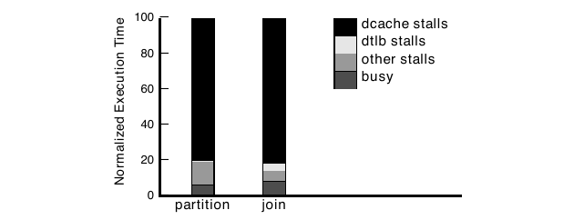

I/O 分区成功避免了随机磁盘访问，因此自然会产生一个问题：能否用类似技术避免随机内存访问？缓存分区把连接关系划分成若干部分，使每个构建分区及其哈希表能够放入（最大一级）CPU 缓存；已有研究证明它能够改善内存驻留数据库和主存数据库的性能 [Shatdal et al. 1994; Boncz et al. 1999; Manegold et al. 2000]。不过，缓存分区有两个重要的实际限制。第一，对于传统的面向磁盘数据库，在扫描磁盘的同时生成缓存大小的分区，需要同时维持大量活动分区。IBM DB2 的实践表明，存储管理器对每次连接只能处理数百个活动分区 [Lindsay 2002]。假定 CPU 缓存为 2 MB，并乐观地允许 1000 个分区，能够处理的最大关系也只有 2 GB。超过这一硬上限后，缓存分区必须增加数据处理遍数；第 8 节将说明，与我们提出的技术相比，这会使性能最多下降 89%。第二，缓存分区假设能够独占缓存，但在存在多项并发活动的环境中，这一假设很可能不成立。一旦缓存忙于处理其他请求、无法有效保留当前分区，性能可能大幅下降（第 8.2 节的实验中最多下降 78%）。因此，我们探索一种没有这些限制的替代技术。

### 1.2 我们的方法：缓存预取

我们不再尝试通过构造微小的、缓存大小的哈希表来避免 CPU 缓存未命中，而是提出利用缓存预取隐藏访问常规内存大小哈希表时的缓存未命中延迟，使这些未命中与计算重叠。现代处理器允许多个缓存未命中同时在内存层次结构中执行。例如，Itanium 2 的系统总线控制逻辑包含一个 18 项乱序队列，使单个 Itanium 2 处理器最多可以有 19 个未完成的内存请求 [Intel Corporation 2004]；发展趋势也一直是支持越来越多的并发未命中。为了让软件充分利用这种并行性，现代处理器还提供显式预取指令，在数据被使用之前把它移入缓存。过去，软件预取已成功用于基于数组的程序 [Mowry et al. 1992] 和基于指针的程序 [Luk and Mowry 1996]，但尚未应用于哈希连接。

**把预取应用于哈希连接的挑战。** 一种朴素做法可能会尝试在处理单个元组的过程中隐藏延迟。例如，为了改善哈希表探测性能，可以尝试预取哈希桶头、哈希桶和构建元组等。不幸的是，这种方法收益很小，因为后续内存引用通常通过指针解引用依赖于先前引用。已有的指针追逐处理技术 [Luk and Mowry 1996] 也无法奏效，因为哈希的随机性使待预取内存位置无法预测。

有利之处在于：虽然处理单个元组时存在许多依赖，但由于哈希的随机性，相邻元组之间较少存在依赖。因此，我们的方法是利用元组间并行性，使一个元组的缓存未命中与其他元组的计算和缓存未命中重叠。自然会有人问：硬件或编译器能否自动完成这种元组间缓存预取？如果可以，我们就不必修改哈希连接软件。遗憾的是，答案是否定的。硬件预取技术 [Baer and Chen 1991] 依赖于识别数据地址流中规则且可预测的模式（例如跨步访问），但不同元组对哈希表的探测并不呈现这种模式。许多现代处理器还会沿指令流向前推测执行，以重叠缓存未命中。虽然该方法有助于隐藏一级数据缓存未命中但命中二级缓存的延迟，指令窗口通常只有 64–128 项，比主存缓存未命中所浪费的指令数小一个数量级（例如 200–300 个周期乘以每周期 4–6 个指令发射槽），相对于处理单个元组所需的工作量则更小。我们的下述预取方法受到编译器调度技术启发，但已有的预取编译调度技术 [Luk and Mowry 1996; Mowry et al. 1992] 无法处理哈希连接代码中不确定的数据依赖，详见第 4.4 节和第 5.3 节。

**克服这些挑战。** 为了有效隐藏哈希连接中的缓存未命中延迟，我们提出并评估两种新预取技术：组预取和软件流水线预取。对组预取，我们应用条带挖掘（strip mining）与循环分布（loop distribution）这两种编译器变换的修改形式（第 4 节将给出示例），重构代码，使连续 $G$ 个探测元组所产生的哈希探测访问能够形成流水线。[^1] 组预取的潜在缺点是组与组切换时仍可能发生缓存未命中停顿。因此，我们的第二种预取方案借鉴称为软件流水线 [Lam 1987] 的编译器调度技术，消除这些间歇停顿。

这两种方法都要求我们扩展已有的编译器技术。关键挑战在于：我们虽然预期元组间依赖很少见，但依赖仍可能发生，我们必须纳入考虑以保证正确性。如果我们像编译器那样保守处理，就会严重限制我们的潜在性能收益。因此，我们在调度代码时乐观地假设元组间没有依赖，但我们在运行时增加少量簿记工作以检查依赖是否确实发生；一旦发生，我们就暂时停顿依赖的消费者，直至能够安全解析依赖。哈希表探测中的多级间接访问和多个代码路径还带来了其他挑战。

我们的研究有一个出人意料的结果：编译器优化领域通常认为软件流水线优于条带挖掘，但对哈希连接而言，组预取似乎比软件流水线预取更有吸引力。关键原因之一是，哈希连接循环中的代码远比数值应用中典型的循环体复杂，而软件流水线更常用于后一类循环 [Lam 1987]。

### 1.3 本文贡献

本文有以下贡献。第一，根据我们的了解，这是首项研究如何利用元组间并行性，通过预取同时加速哈希连接的连接阶段和分区阶段的工作。第二，我们提出组预取和软件流水线预取，并说明如何用它们显著改善哈希连接性能。就用户态性能而言，这些技术相对于 GRACE 和简单预取方法使连接阶段加速 1.29–4.04 倍，使分区阶段加速 1.37–3.49 倍；在大型关系上至少比缓存分区快 36%，而且无须独占缓存即可发挥作用。我们还对组预取与软件流水线预取进行了广泛比较，表明组预取最多快 30%。最后，我们给出包含磁盘 I/O 的真实经过时间实验，证明我们的缓存预取方案对面向磁盘的哈希连接有效：我们的方案相对于 GRACE 哈希连接使连接阶段加速 1.12–1.84 倍，使分区阶段加速 1.06–1.60 倍。

本文其余部分安排如下。第 2 节详细讨论相关工作。第 3 节分析两个阶段中更复杂的连接阶段所存在的依赖，第 4 节和第 5 节分别提出使用组预取和软件流水线预取改善连接阶段性能。第 6 节讨论分区阶段的预取。第 7 节介绍实验设置与方法，第 8 节给出实验结果，第 9 节讨论在 DBMS 中实现这些预取技术的实际问题，最后第 10 节总结全文。

[^1]: 在我们的第 8 节实验设置中，哈希表探测的最优组大小 G 为 25。

## 2. 相关工作

自 GRACE 哈希连接算法首次提出以来 [Kitsuregawa et al. 1983]，人们为了通过尽量把中间分区保留在内存中来避免 I/O，又提出了许多改进 [Shapiro 1986; Nakayama et al. 1988; Zeller and Gray 1990; Graefe 1993]。不过，所有这些哈希连接算法都有两个共同构件：（i）分区；（ii）使用内存哈希表进行连接。为了清楚地区分两个阶段，我们在全文中使用 GRACE 作为我们的基线算法。不过，我们指出，我们的技术应能直接应用于其他哈希连接算法。

多篇论文提出了改善哈希连接缓存性能的技术 [Shatdal et al. 1994; Boncz et al. 1999; Manegold et al. 2000]。Shatdal 等人证明，在连接元组为 100 B 的内存驻留关系时，缓存分区可带来 6%–10% 的改善 [Shatdal et al. 1994]。Boncz、Manegold 和 Kersten 提出在缓存分区中使用多遍处理，以避免缓存和 TLB 抖动 [Boncz et al. 1999; Manegold et al. 2000]。在能够独占 CPU 缓存的条件下，他们对 Monet 主存数据库中的垂直分区关系进行连接，并在真实机器上获得大幅性能提升。但他们没有考虑面向磁盘的数据库、更加传统的物理布局、多个活动导致的缓存冲刷，也没有考虑预取。他们还提出多种降低 CPU 时间的代码优化（例如基于移位的哈希计算）；这些优化同样可能有益于我们的技术。

如前所述，软件预取已成功用于其他场景 [Mowry et al. 1992; Luk and Mowry 1996; Chen et al. 2001; Chen et al. 2002]。软件流水线曾用于调度基于数组程序中的预取 [Mowry et al. 1992]，而我们扩展了这一方法，使之能够处理哈希连接中更复杂的数据结构、多个代码路径以及读写冲突。

以往工作指出，TLB 未命中可能降低性能 [Boncz et al. 1999; Manegold et al. 2000]，尤其是在由软件处理 TLB 未命中时。不过，大多数现代处理器，例如 x86 [Intel Corporation 2006] 和 Itanium 2 [Intel Corporation 2004]，都在硬件中处理 TLB 未命中。此外，可以把预取引起的 TLB 未命中当作普通 TLB 未命中来支持 TLB 预取 [Saulsbury et al. 2000]。例如，Itanium 2 上的故障型预取指令 `lfetch.fault` [Intel Corporation 2004] 可以触发 TLB 未命中并自动装入 TLB 项。因此，使用我们的预取技术，我们可以让 TLB 未命中与计算重叠，从而尽量减少 TLB 停顿时间。第 9 节将更详细地讨论 TLB 未命中及其他实际问题。

在本文会议版本 [Chen et al. 2004] 发表后，一些近期研究采用了我们的元组间并行方案来改善哈希连接性能。Gold 等人 [Gold et al. 2005] 在 Intel IXP2400 网络处理器上实现哈希连接探测，并证明利用多个硬件线程和核心开发元组间并行性，相对于单线程最多可加速 5 倍，相对于 Pentium 4 上的基线实现可加速 2.5 倍。Zhou 等人 [Zhou et al. 2005] 提出并评估一种利用辅助硬件线程执行故障型预取、改善数据库性能的方案；其哈希连接实现以我们的元组间并行方案为基础。Chen 等人 [Chen et al. 2005] 提出 inspector join 算法，以近乎为零的重新分区开销获得缓存分区的收益；他们在分区阶段使用我们的预取方案，并在连接阶段用这些方案避免冲突未命中。

## 3. 连接阶段的依赖

本节中，我们分析连接阶段中一次哈希表访问的依赖。我们的目的是说明朴素预取算法为什么会失败。我们研究图 2 所示的一种具体内存哈希表实现。哈希表由哈希桶数组构成，每个桶包含一个桶头，以及一个可能存在且由桶头指向的哈希单元数组。一个哈希单元代表散列到该桶的一个构建元组，其中保存元组指针，以及根据连接键计算得到的定长哈希码（例如 4 字节）；哈希码可在真正比较键之前用作过滤器。当一个哈希桶只有一项时，唯一的哈希单元直接存放在桶头中；当两个或更多元组散列到同一个桶时，分配哈希单元数组；若数组已满且又有新元组散列到该桶，则分配容量翻倍的新数组，并把已有单元复制到新数组。

图 2：一种内存哈希表结构。

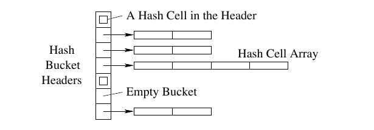

朴素预取算法会尝试在单次哈希表访问中，预取可能发生缓存未命中的哈希桶头、哈希单元数组和构建元组，从而隐藏未命中延迟。然而，一次哈希表访问中存在大量依赖，这种方法会失败。例如，桶头的内存地址由哈希计算决定；哈希单元数组的地址存放在桶头中；探测时，对构建元组的内存引用又依赖于相应哈希单元。这些依赖实质上构成一条关键路径：前一次计算或内存引用生成下一次引用的内存地址，而且必须先完成，下一次引用才能开始。因此，地址生成得太迟，预取无法隐藏未命中延迟。由于哈希具有随机性，要预测哈希表访问的内存地址也几乎不可能。上述论证适用于所有基于哈希的结构。[^2] 因而，把预取应用于连接阶段算法不是一项直接的工作。

[^2]: 图 2 的结构改进了链式桶哈希；后者在桶中使用哈希单元链表。在这里，我们避免了链表的指针追逐问题 [Luk and Mowry 1999; Chen et al. 2001]。

## 4. 组预取

虽然一次哈希表访问内部的依赖会妨碍有效预取，连接阶段算法却要处理大量元组；由于哈希的随机性，相邻元组之间较少存在依赖。因此，我们的方法是利用元组间并行性，使一个元组的缓存未命中延迟与其他元组的计算及未命中延迟重叠。为了保证正确性，我们必须系统地交织多次哈希表访问，重排其内存引用，并足够早地发出预取。本节中，我们提出实现这些目标的组预取。

### 4.1 用于简化探测算法的组预取

我们用一个简化的探测算法说明组预取思想。如图 3(a) 所示，该算法假定所有哈希桶都有哈希单元数组，而且每个探测元组恰好匹配一个构建元组；每次循环迭代执行一次探测。

如图 3(b) 所示，组预取算法把原循环的多次迭代合并到一个循环体中，并把探测操作重排为多个阶段。[^3] 每个阶段为组内全部元组执行关键路径上的一次计算或内存引用，随后为下一阶段的内存引用发出预取指令。例如，第一阶段计算每个元组的哈希桶号，并预取第二阶段将访问的哈希桶头。这样，一次探测读取哈希桶头时的缓存未命中，就能与其他探测的哈希计算和缓存未命中重叠。除最后阶段外，其他阶段也以类似方式使用预取。同一次探测中相互依赖的内存操作仍然像原来那样依次执行，但不同探测的内存操作现在可以互相重叠。

图 3：组预取。

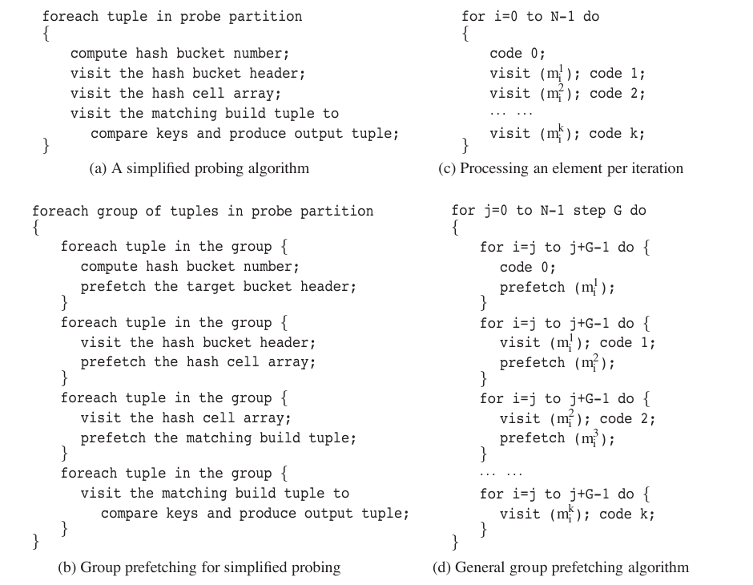

图 3 中伪代码的完整转写如下：

```text
(a) 简化的探测算法
for probe partition 中的每个 tuple
{
    计算哈希桶号；
    访问哈希桶头；
    访问哈希单元数组；
    访问匹配的构建元组，比较键并生成输出元组；
}

(b) 简化探测的组预取
for probe partition 中的每一组 tuples
{
    for 组中的每个 tuple {
        计算哈希桶号；
        预取目标桶头；
    }
    for 组中的每个 tuple {
        访问哈希桶头；
        预取哈希单元数组；
    }
    for 组中的每个 tuple {
        访问哈希单元数组；
        预取匹配的构建元组；
    }
    for 组中的每个 tuple {
        访问匹配的构建元组，比较键并生成输出元组；
    }
}

(c) 每次迭代处理一个元素
for i = 0 to N - 1 do
{
    code 0;
    visit(m1[i]); code 1;
    visit(m2[i]); code 2;
    ...
    visit(mk[i]); code k;
}

(d) 通用组预取算法
for j = 0 to N - 1 step G do
{
    for i = j to j + G - 1 do {
        code 0;
        prefetch(m1[i]);
    }
    for i = j to j + G - 1 do {
        visit(m1[i]); code 1;
        prefetch(m2[i]);
    }
    for i = j to j + G - 1 do {
        visit(m2[i]); code 2;
        prefetch(m3[i]);
    }
    ...
    for i = j to j + G - 1 do {
        visit(mk[i]); code k;
    }
}
```

[^3]: 从技术上说，我们采用的是条带挖掘和循环分布 [Kennedy and McKinley 1990] 这两种编译器变换的修改形式。

### 4.2 理解组预取

为了更好地理解组预取，我们在图 3(c) 和图 3(d) 中对图 3(a) 和图 3(b) 的算法进行了泛化。假定我们需要处理 $N$ 个相互独立的元素。对每个元素 $i$，我们需要执行 $k$ 次相互依赖的内存引用 $m_i^1,m_i^2,\ldots,m_i^k$。如图 3(c) 所示，直接算法每次循环迭代处理一个元素。 $k$ 次内存引用自然地把循环体分成 $k+1$ 个阶段。`code 0`（若存在）计算第一个内存地址 $m_i^1$；`code 1` 使用 $m_i^1$ 中的内容计算第二个内存地址 $m_i^2$；一般而言，`code l` 使用 $m_i^l$ 中的内容计算 $m_i^{l+1}$，其中 $l=1,\ldots,k-1$；最后，`code k` 使用 $m_i^k$ 中的内容执行处理。如果每次内存引用 $m_i^l$ 都发生缓存未命中，该算法将承受 $kN$ 次昂贵且完全暴露的缓存未命中。

由于各元素彼此独立，我们可以用图 3(d) 的组预取跨多个元素重叠缓存未命中延迟。组预取算法把 $G$ 个元素的处理合并到一个循环体中：先对组内全部元素执行 `code l`，再进入 `code l+1`。地址一经计算，算法就预取相应内存位置，使该引用与其他元素的处理重叠。

现在我们确定完全隐藏全部缓存未命中延迟的条件。设 `code l` 的执行时间为 $C_l$，从主存取回一条缓存线的完整延迟为 $T_1$，并行取回下一条缓存线的附加延迟为 $T _ {\text{next}}$； $T _ {\text{next}}$ 是内存带宽的倒数。表 I 给出全文所用术语。假定每个 $m_i^l$ 都发生缓存未命中，并且不存在缓存冲突。请注意，我们使用这些假设只是为了简化条件推导；我们的实验评估包含哈希连接中局部性和冲突的一切可能影响。于是，完全隐藏所有缓存未命中延迟的充分条件为：

$$
\begin{cases}
(G-1)C_0 \ge T_1,\\
(G-1)\max\lbrace{}C_l,T _ {\text{next}}\rbrace{} \ge T_1,\quad l=1,2,\ldots,k.
\end{cases}
\qquad \text{(1)}
$$

**表 I：全文使用的术语。**

| 名称 | 定义 |
| --- | --- |
| $k$ | 处理一个元素时相互依赖的内存引用数量 |
| $G$ | 组预取中的组大小 |
| $D$ | 软件流水线预取中的预取距离 |
| $T_1$ | 一次缓存未命中的完整延迟 |
| $T _ {\text{next}}$ | 一次额外流水线化缓存未命中的延迟 |
| $C_l$ | `code l` 的执行时间， $l=0,1,\ldots,k$ |

下一小节将证明这一条件。直观地看，让我们先关注组中第一个元素 $j$。对 $m_j^1$ 的预取与代码阶段 0 中其余 $G-1$ 个元素的处理重叠。第一条不等式保证，处理其余 $G-1$ 个元素的时间长于一次内存引用，因此在代码阶段 1 对 $m_j^1$ 执行访问操作前，预取内存引用已经完成。类似地，对 $m_j^{l+1}$ 的预取与代码阶段 $l$ 中其余 $G-1$ 个元素的处理重叠；第二条不等式保证完整隐藏内存引用延迟。 $T _ {\text{next}}$ 对应其余 $G-1$ 个元素访问操作消耗的内存带宽。在证明中，我们还将说明，其他元素的内存访问延迟也能用这些不等式的简单组合完全隐藏。

因为 $T _ {\text{next}}$ 总大于 0，我们总能选择足够大的 $G$ 满足第二条不等式。但是，若 `code 0` 为空，就无法完全隐藏 $m_j^1$。幸运的是，在前述简化探测算法中，`code 0` 负责计算哈希桶号，并非空代码，因此我们可以选择一个 $G$ 隐藏全部缓存未命中代价。

以上分析为了简化而忽略缓存冲突未命中。不过，我们将在第 8 节说明， $G$ 过大时冲突未命中会成为问题。因此，在所有满足这些不等式的候选 $G$ 中，我们应选择最小者，以尽量减少并发预取数量及冲突未命中代价。

### 4.3 组预取的关键路径分析

下面我们使用关键路径分析研究一个组的处理，即图 3(d) 外层循环的一次迭代。为简化分析，我们假定每个 $m_i^l$ 都发生缓存未命中，而且组内内存引用之间没有缓存冲突。图 4 是关键路径分析图。一个顶点代表一个事件；从顶点 A 指向 B 的边表示事件 B 依赖事件 A，边权表示最小延迟（图中省略权重为零的边）。一次循环迭代的运行时间对应图中关键路径的长度，也就是从开始到结束的最长加权路径。

图 4：图 3(d) 外层循环体一次迭代的关键路径分析。

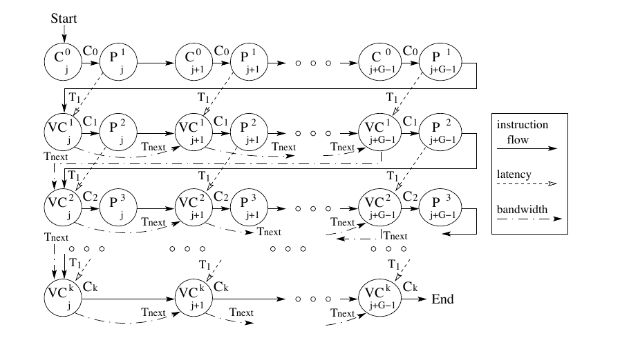

图按如下方式构造。我们使用三类顶点：

- **P 顶点：** 执行预取指令。
- **C 顶点：** `code 0` 的开始。
- **VC 顶点：** 一次访问及 `code l` 的开始，其中 $l=1,2,\ldots,k$。

顶点下标表示正在处理的元素。P 顶点的上标对应程序中的内存地址；C 和 VC 顶点的上标表示代码阶段。图 4 中，每一行顶点对应一个内层循环，该循环对组内所有元素执行一个代码阶段。我们使用三类边：

- **指令流边：** 每一行中从左向右，跨行则从上向下。例如，从顶点 $C_j^0$（元素 $j$ 的 `code 0`）到顶点 $P_j^1$（对 $m_j^1$ 的预取）的边权为 $C_0$；从 $P_j^1$ 到 $C _ {j+1}^0$ 的边表示对 $m_j^1$ 的预取先于元素 $j+1$ 的 `code 0` 执行；第二个内层循环（第二行）在第一个内层循环结束后才开始。我们假定 `code l` 执行固定时间 $C_l$，图中将其表示为 C 和 VC 顶点出边的权重；其中还包括访问操作及随后预取指令的指令开销，因此其他指令流边权为零。
- **延迟边：** 从 P 顶点到相应 VC 顶点的边代表被预取的内存引用，边权为完整延迟 $T_1$。
- **带宽边：** VC 顶点之间的边代表内存带宽。通常，一个额外且独立的缓存未命中无法与前一次未命中完全重叠，还需要 $T _ {\text{next}}$ 时间才能完成；该值是内存带宽的倒数。

现在我们考虑图的关键路径。如果我们暂时忽略所有延迟边，图会变得清楚而简单：所有路径都在一行中从左向右，并从开始到结束跨行向下；替代路径都局限于指令流边和带宽边之间。关键路径是最长路径，因此若连接相同顶点还存在一条更长路径，我们就可以忽略一条边。直观地说，我们可以选择较大的 $G$，使延迟边短于沿行路径，因而可以忽略；此时关键路径就是沿各行的最长路径。

我们希望推导完全隐藏全部缓存未命中延迟的条件。若所有缓存未命中延迟都被隐藏，所有延迟边都不在关键路径上；反之亦然。因此，问题等价于推导保证所有延迟边短于沿行路径的条件。我们得到下述定理。

**定理 1。** 下述条件足以在通用组预取算法中完全隐藏全部缓存未命中延迟：

$$
\begin{cases}
(G-1)C_0 \ge T,\\
(G-1)\max\lbrace{}C_l,T _ {\text{next}}\rbrace{} \ge T,\quad l=1,2,\ldots,k.
\end{cases}
$$

**证明。** 第一条不等式保证，从第 0 行出发的第一条延迟边，即图中从顶点 $P_j^1$ 到顶点 $VC_j^1$ 的边，短于沿第 0 行的路径。第二条不等式保证，从第 $l$ 行出发的第一条延迟边，即从顶点 $P_j^{l+1}$ 到顶点 $VC_j^{l+1}$ 的边，短于沿第 $l$ 行的相应路径，其中 $l=1,2,\ldots,k-1$。注意， $l=k$ 时的不等式只用于下面的证明。

对其他延迟边，我们可以通过简单组合两条不等式证明它们短于沿行路径。对从第 0 行出发的第 $x$ 条延迟边，即从顶点 $P _ {j+x-1}^1$ 到顶点 $VC _ {j+x-1}^1$ 的边，沿该行路径长度为：

$$
\begin{aligned}
\mathrm{len}
&=(G-x)C_0+(x-1)\max\lbrace{}C_1,T _ {\text{next}}\rbrace{}\\
&=\frac{(G-x)(G-1)C_0+(x-1)(G-1)\max\lbrace{}C_1,T _ {\text{next}}\rbrace{}}{G-1}\\
&\ge \frac{(G-x)T+(x-1)T}{G-1}=T.
\end{aligned}
$$

对从第 $l$ 行出发的第 $x$ 条延迟边，即从顶点 $P _ {j+x-1}^{l+1}$ 到顶点 $VC _ {j+x-1}^{l+1}$ 的边，其中 $l=1,2,\ldots,k-1$，沿该行路径长度为：

$$
\begin{aligned}
\mathrm{len}
&=(G-x)\max\lbrace{}C_l,T _ {\text{next}}\rbrace{}+(x-1)\max\lbrace{}C _ {l+1},T _ {\text{next}}\rbrace{}\\
&=\frac{(G-x)(G-1)\max\lbrace{}C_l,T _ {\text{next}}\rbrace{}+(x-1)(G-1)\max\lbrace{}C _ {l+1},T _ {\text{next}}\rbrace{}}{G-1}\\
&\ge \frac{(G-x)T+(x-1)T}{G-1}=T.
\end{aligned}
$$

因此，当两条不等式成立时，所有延迟边都短于相应的沿行路径，全部缓存未命中延迟都被完全隐藏。证毕。

### 4.4 处理复杂情况

以往研究说明了如何为基于数组的代码预取两次相互依赖的内存引用 [Mowry 1994]。我们的组预取算法解决了为任意固定数量 $k$ 的相互依赖内存引用进行预取的问题。

我们已经为哈希表构建和探测都实现了组预取。与简化探测算法不同，实际探测算法包含多个代码路径：匹配数可能为零或多个；哈希桶可能为空；桶中也可能不存在哈希单元数组。为处理这种复杂性，我们为一组中的 $G$ 个元组保存状态信息。我们以相互依赖内存引用的边界为界，把每条可能代码路径划分成代码片段；然后，我们通过对元组状态进行条件测试，把不同代码路径上处于同一位置的代码片段合并为一个阶段。图 5 展示了这一过程。图 5(a) 中的边表示控制流和数据依赖，图 5(b) 给出组预取的代码阶段。

图 5：处理多个代码路径。

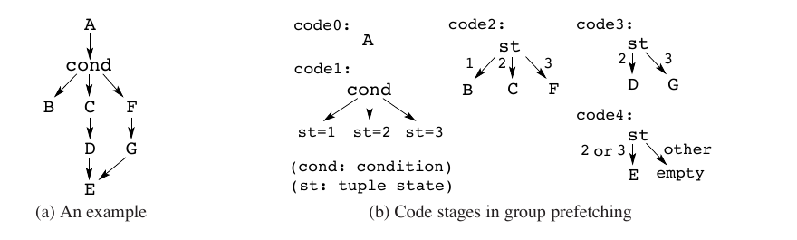

全部代码路径的共同起点位于 `code 0`。`code 1` 执行条件测试，例如检查哈希桶为空、桶头中包含一个单独项，还是包含哈希单元数组，并把结果记录到元组状态中。随后各代码阶段检查元组状态，并执行相应代码路径上的代码片段。此外，`code l` 还检查元组状态，以确定 `code l+1` 所属代码路径，并发出相应预取指令。总阶段数 $k+1$ 等于任一原始代码路径中的最大代码片段数；该数量由相互依赖内存访问的数量决定。

当一个阶段要访问多条相互独立的缓存线，例如访问多个构建元组时，我们的算法会在前一阶段发出多条相互独立的预取。

组预取算法还必须处理读写冲突。尽管概率很低，同一组中的两个构建元组仍可能如图 6 所示散列到同一个桶。不过，在我们的算法中，哈希表访问相互交织，不再具有原子性。因此可能发生竞态：第二个元组可能看到第一个元组正在修改的不一致哈希桶。这里的复杂性来自哈希表构建的读写性质。为解决这一问题，我们在插入元组前设置哈希桶头中的忙标志。若某个元组将插入忙碌桶，我们就把其处理推迟到组预取循环体末尾。在这一自然组边界上，之前对忙碌桶的访问必定已经完成。有趣的是，之前的访问也已为该桶预热缓存，因此我们插入被推迟的元组时无须预取。该算法能够处理任意数量的被推迟元组，从而容忍键分布倾斜。

图 6：一次读写冲突。

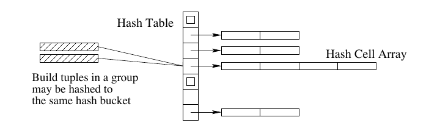

## 5. 软件流水线预取

本节中，我们介绍我们的技术如何利用软件流水线为哈希连接调度预取。随后，我们比较我们的两种预取方案。

图 7 直观展示了组预取和软件流水线预取之间的区别。组预取在一组元素内部隐藏缓存未命中延迟，不同组之间的内存操作不发生重叠。相比之下，软件流水线预取把不同元素的不同代码阶段合并到一次迭代中，跨迭代隐藏延迟。它能无间隙地持续运行，因此可能获得更好的性能。

图 7：两种预取方案的直观示意图。

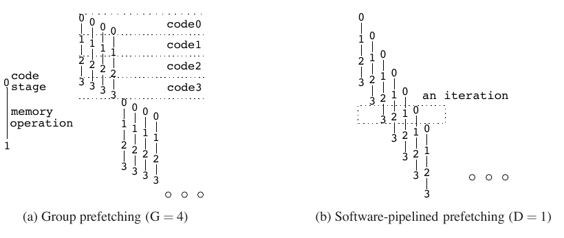

### 5.1 理解软件流水线预取

图 8(a) 给出了简化探测算法的软件流水线预取。对于某个特定元组，后续阶段在相隔 $D$ 次迭代的位置处理，其中 $D$ 称为预取距离 [Mowry 1994]。图 7(b) 描绘了 $D=1$ 时的直观情形。假设虚线框中最左侧一列对应元组 $j$，那么一次迭代会组合处理元组 $j+3D$ 的阶段 0、元组 $j+2D$ 的阶段 1、元组 $j+D$ 的阶段 2，以及元组 $j$ 的阶段 3。

```text
序言；
for j = 0 to N - 3D - 1 do
{
    元组 j + 3D：
        计算哈希桶编号；
        预取目标桶头；

    元组 j + 2D：
        访问哈希桶头；
        预取哈希单元数组；

    元组 j + D：
        访问哈希单元数组；
        预取匹配的构建元组；

    元组 j：
        访问匹配的构建元组，比较键并生成输出元组；
}
尾声；
```

图 8(b) 给出了通用的软件流水线预取算法。在稳态中，流水线有 $k+1$ 个阶段，循环体的每个阶段处理不同元素；一个特定元素的相邻阶段在相隔 $D$ 次迭代的位置处理。直观而言，如果我们让同一元素的各代码阶段之间相隔足够远，我们就能隐藏缓存未命中延迟。在与第 4.2 节相同的假设下，稳态中隐藏全部缓存未命中延迟的充分条件如下；我们将在下一小节推导该条件。

```text
序言；
for j = 0 to N - kD - 1 do
{
    i = j + kD；
    对元素 i 执行 code 0；
    预取 m_i^1；

    i = j + (k - 1)D；
    访问 m_i^1；对元素 i 执行 code 1；
    预取 m_i^2；

    i = j + (k - 2)D；
    访问 m_i^2；对元素 i 执行 code 2；
    预取 m_i^3；

    ……

    i = j；
    访问 m_i^k；对元素 i 执行 code k；
}
尾声；
```

图 8：软件流水线预取；(a) 简化探测算法；(b) 通用算法。

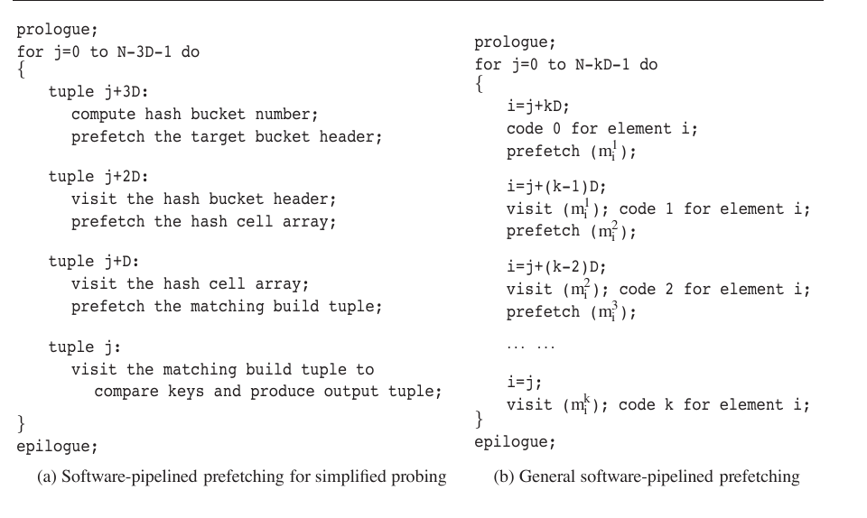

$$
D\left(\max\lbrace{}C_0+C_k,T _ {\text{next}}\rbrace{}+\sum _ {l=1}^{k-1}\max\lbrace{}C_l,T _ {\text{next}}\rbrace{}\right)\ge T. \qquad \text{(2)}
$$

我们总能选择足够大的 $D$ 满足该条件。在我们的第 8 节实验中，我们将说明， $D$ 过大时冲突未命中会成为问题。因此，与组预取相同，我们应选择最小的 $D$，以尽量减少并发预取数量。

### 5.2 软件流水线预取的关键路径分析

我们使用图 9 进行关键路径分析。该图的构造方式与图 4 相同，不过这里每一行对应通用软件流水线预取算法的一次循环迭代。指令流边仍然在行内从左向右、跨行则从上向下。沿延迟边观察，我们可以看到一个元素各后续阶段的处理过程：同一元素的两个相邻阶段分别在相隔 $D$ 次迭代的两行中处理。

图 9：软件流水线预取（稳态）的关键路径分析。

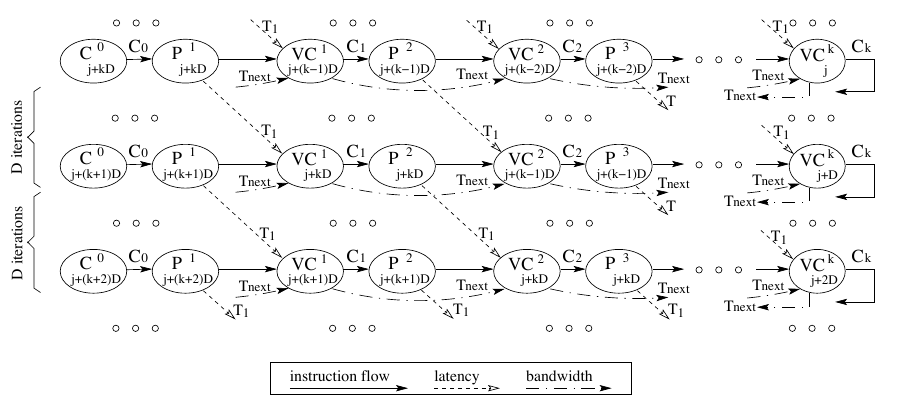

若沿行路径更长，就能在关键路径分析中忽略延迟边；此时延迟边不在关键路径上，缓存未命中延迟被完全隐藏。下述定理给出了隐藏全部缓存未命中延迟的充分条件。

**定理 2。** 下述条件足以在通用软件流水线预取算法中完全隐藏全部缓存未命中延迟：

$$
D\left(\max\lbrace{}C_0+C_k,T _ {\text{next}}\rbrace{}+\sum _ {l=1}^{k-1}\max\lbrace{}C_l,T _ {\text{next}}\rbrace{}\right)\ge T.
$$

**证明。** 不等式左侧就是图 9 中 $D$ 行的总路径长度。显然，当该长度大于或等于一条延迟边的权重时，就能在关键路径分析中忽略延迟边，全部缓存未命中延迟因而被完全隐藏。证毕。

### 5.3 处理复杂情况

我们通过修改我们的组预取算法实现了软件流水线预取，代码阶段基本保持不变。为了应用图 8(b) 的通用模型，我们用循环数组保存状态信息，并把通用模型中的下标 $j$ 实现为数组下标。我们选择让数组大小取为 2 的幂，模运算下标计算则使用位掩码，以降低开销。此外，由于同一元素的 `code 0` 和 `code k` 相隔 $kD$ 次迭代处理，我们确保数组大小至少为 $kD+1$。

哈希表构建中的读写冲突需要用更复杂的方式解决。软件流水线中没有一个像组预取组尾那样便于集中处理所有冲突的位置，因此我们必须在流水线各阶段中处理冲突。我们为每个忙碌的哈希桶建立一个等待队列。哈希桶头保存当前正在更新该桶的元组之数组下标；元组状态信息则包含一个指针，指向等待同一桶的下一个元组。若一个元组将插入忙碌桶，就把它追加到等待队列。当我们完成一个元组的哈希处理时，我们检查其等待队列。若队列非空，我们就把第一个等待元组的数组下标记录到桶头中，并为该元组执行此前的代码阶段。当该元组到达最后阶段时，如队列中仍有下一个元组，就继续处理它。

### 5.4 组预取与软件流水线预取的比较

两种方案都试图增大预取与相应访问之间的间隔，以隐藏缓存未命中延迟。根据充分条件，软件流水线预取总能隐藏全部未命中延迟；组预取则只有在 `code 0` 非空时才能做到，而连接阶段恰好属于这种情况。若 `code 0` 为空，第一个缓存未命中无法隐藏；不过，当元素组足够大时，其摊销性能影响可能很小。

在实践中，组预取更易实现。自然的组边界提供了执行必要“清理”处理的位置，例如解决读写冲突。此外，连接阶段可以在组边界暂停并把输出发送给父算子，从而支持流水线查询处理。软件流水线虽然也可以暂停，但重启代价会削弱其性能优势。再者，软件流水线预取的簿记开销更大，因为它使用模运算下标操作，还要维护更多状态信息，例如用于处理读写冲突的等待队列。

## 6. 分区阶段的预取

在研究如何为哈希连接的连接阶段预取之后，本节中我们讨论分区阶段。分区阶段依据连接键进行哈希，把一个输入关系划分成多个输出分区。典型算法在主存中保留输入关系的一个输入页，以及每个中间分区的一个输出页。算法处理每个输入页，并检查页内每个输入元组；根据元组连接键计算分区编号，再抽取（投影）与当前哈希连接查询有关的输入元组列，把它们复制到目标输出缓冲页。输出缓冲页写满后，算法将其写入相应分区。

与连接阶段一样，I/O 分区阶段也使用哈希：根据元组连接键计算其分区编号。哈希的随机性使所得内存地址难以预测；而且，处理一个元组也需要执行若干相互依赖的内存引用，相邻元组的处理则因哈希随机性而大多彼此独立。因此，我们把组预取和软件流水线预取也用于 I/O 分区阶段。

访问输出缓冲区时可能发生读写冲突。假设输入关系中位置相近的两个元组恰好散列到同一个输出缓冲区。处理第二个元组时，算法可能发现输出缓冲区已无空间，需要将其写出；但由于我们已经重组处理顺序，此时第一个元组的数据可能尚未复制到输出缓冲区。对组预取，我们把第二个元组的处理推迟到循环体末尾，在那里我们写出缓冲区并处理被推迟的元组；对软件流水线预取，我们使用与连接阶段构建哈希表时类似的等待队列。

## 7. 实验设置

### 7.1 测量方法

我们通过周期精确模拟和 Itanium 2 真机实验评估我们的预取方案。我们通过模拟研究建立更广泛的现代处理器模型；此外，模拟使我们能够灵活检测处理器流水线和缓存层次结构，从而更深入地理解结果。通过改变模拟参数，我们还可以建立未来机器配置的模型。我们在 Itanium 2 机器上用用户态性能结果验证模拟研究中观察到的趋势。最后，我们在 Itanium 2 机器上测量包含磁盘 I/O 的总经过时间，以说明我们的方案对面向磁盘哈希连接的收益。

**真机实验的 Itanium 2 配置。** 表 II 列出了 Itanium 2 机器的配置参数。该机器配备两颗 900 MHz Itanium 2 McKinley 处理器，每颗都有三级缓存和两级 TLB，并共享 8 GB 主存；不过，在我们的实验中，我们只使用低地址的 1 GB 内存，详见第 8.1 节。缓存层次结构的大部分参数来自 Itanium 2 手册 [Intel Corporation 2004]。我们通过实验测得 DTLB 未命中延迟、主存延迟 $T_1$ 和主存带宽参数 $T _ {\text{next}}$ [Chen 2005]。测得的 TLB 未命中延迟与 Itanium 2 手册所列惩罚一致，即发生 TLB 未命中但能在 L3 缓存中找到页表项的情形 [Intel Corporation 2004]。

表 II：Itanium 2 机器配置。

| 项目 | 配置 |
| --- | --- |
| CPU | 双处理器 900 MHz Itanium 2（McKinley，B3） |
| L1 数据缓存 | 16 KB，64 B 缓存线，4 路组相联，加载延迟 1 周期 |
| L1 指令缓存 | 16 KB，64 B 缓存线，4 路组相联，加载延迟 1 周期 |
| L2 统一缓存 | 256 KB，128 B 缓存线，8 路组相联，加载延迟 5 周期 |
| L3 统一缓存 | 1.5 MB，128 B 缓存线，6 路组相联，加载延迟 12 周期 |
| TLB | DTLB 1：32 项、全相联；ITLB 1：32 项、全相联；DTLB 2：128 项、全相联；ITLB 2：128 项、全相联；DTLB 2 未命中延迟：32 周期 |
| 主存 | 8 GB（只使用低地址 1 GB）；延迟 $T_1=189$ 周期；带宽 $1/T _ {\text{next}}$：每 24 周期 1 次访问 |
| 磁盘 | 8 块 SCSI Seagate Cheetah 15K ST336754LW；15,000 rpm；平均寻道时间 3.6 ms；平均旋转延迟 2 ms |
| 操作系统 | Linux 2.4.18（Red Hat Linux Advanced Workstation release 2.1AW） |
| 页大小 | 16 KB |
| 编译器 | Intel C++ Itanium Compiler 8.1，`icc -O3` |
| 测量 | 用户态性能：kernel perfmon 1.0、pfmon 2.0；包含 I/O 的总经过时间：`gettimeofday()` |

Itanium 2 同时支持故障型和非故障型预取。若预取引起 TLB 未命中等异常，非故障型预取会被丢弃；故障型预取则类似于没有目标寄存器的加载指令，发生 TLB 未命中时会把页表项装入 TLB 并继续执行。哈希表访问很可能引起 TLB 未命中，因此在我们的实验中，我们选择故障型预取。机器上的 gcc 和 icc 两种编译器均可实现预取：gcc 支持以内联汇编插入预取指令，icc 则提供一种类似特殊函数调用的预取接口。我们在第 8.3 节比较不同编译器和优化级别下的哈希连接性能，最终决定所有 Itanium 2 实验都使用 `icc -O3`。

该机器运行 Linux 2.4.18 内核，虚拟页大小为 16 KB。我们使用 perfmon 库 [Perfmon Project] 访问 Itanium 2 性能计数器，以测量用户态性能；我们使用 `gettimeofday` 系统调用测量包含磁盘 I/O 的总经过时间。我们对每项实验运行 30 次并报告平均值。所有用户态缓存性能测量的标准差都在平均值的 1% 以内；总经过真实时间测量的标准差都在平均值的 5% 以内。

**模拟研究的机器模型。** 表 III 列出了模拟研究参数。模拟器建立一种通用乱序超标量处理器模型，它代表除 Itanium 2 之外的大多数现代处理器，例如 Intel Pentium 4 [Intel Corporation 2004]、IBM Power 5 [Kalla et al. 2004] 和 Sun UltraSPARC IV [Sun Microsystems]。模拟器逐周期运行，细致模拟流水线、寄存器重命名、分支预测和分支惩罚等处理器行为。它支持 MIPS 指令集，执行 gcc 生成的可执行文件。模拟器只模拟用户态执行；`read` 和 `write` 等系统调用直接交给底层操作系统。

表 III：模拟研究参数。

| 类别 | 参数 | 配置 |
| --- | --- | --- |
| 流水线 | 时钟频率 | 1.5 GHz |
| 流水线 | 发射宽度 | 每周期 4 条指令 |
| 流水线 | 重排序缓冲区 | 128 条指令 |
| 流水线 | 分支预测 | gshare [McFarling 1993] |
| 流水线 | 功能单元 | 2 个整数、1 个整数除法、2 个内存、1 个分支、2 个浮点单元 |
| 流水线 | 整数乘法 | 4 周期 |
| 流水线 | 整数除法 | 50 周期 |
| 流水线 | 其他整数操作 | 1 周期 |
| 内存 | L1 指令缓存 | 16 KB，4 路组相联 |
| 内存 | L1 数据缓存 | 16 KB，4 路组相联 |
| 内存 | 未命中处理项 | 数据 32 项，指令 2 项 |
| 内存 | DTLB | 128 项，全相联 |
| 内存 | L2 统一缓存 | 256 KB，8 路组相联 |
| 内存 | L3 统一缓存 | 2 MB，8 路组相联 |
| 内存 | L1 至主存延迟 | 250 周期，另加竞争导致的延迟（ $T_1=250$） |
| 内存 | 主存带宽 | 每 15 周期 1 次访问（ $T _ {\text{next}}=15$） |
| 内存 | 缓存线大小 | 64 B |
| 内存 | 页大小 | 16 KB |
| 内存 | L1 缓存访问延迟 | 1 周期 |
| 内存 | L2 缓存访问延迟 | 5 周期 |
| 内存 | L3 缓存访问延迟 | 12 周期 |
| 内存 | DTLB 未命中延迟 | 30 周期 |

CPU 缓存性能是哈希连接用户态性能的主要因素，而 Itanium 2 的内存层次结构也具有现代服务器处理器的代表性，因此我们在模拟器中建模了 Itanium 2 机器的内存层次结构。大部分内存参数，如缓存大小、相联度和访问延迟，都遵循表 II 的 Itanium 2 配置；模拟器也支持故障型预取。不过，与 Itanium 2 不同，模拟器只支持各级缓存统一使用相同的缓存线大小。我们选择 64 B 缓存线，并相应调整主存延迟 $T_1$ 与主存带宽参数 $T _ {\text{next}}$。

### 7.2 实现细节

我们实现了我们的自有哈希连接引擎。在真机 I/O 实验中，我们实现了一个缓冲区管理器：它把页条带化分布到多块磁盘上，并由后台工作线程执行 I/O 预取。为研究 CPU 缓存性能，出于简化考虑，我们把关系和中间分区保存为磁盘文件。我们采用槽式页结构，并支持元组中的定长与变长属性。为简化实现，模式和统计信息保存在单独的描述文件中；统计信息用于计算哈希表大小和分区数量。

**GRACE 哈希连接。** 我们的基线算法是 GRACE 哈希连接 [Kitsuregawa et al. 1983]，内存哈希表采用第 3 节图 2 所述结构。一个基于异或和移位的简单哈希函数把任意长度的连接键转换为 4 字节哈希码。通常，分区阶段和连接阶段使用同一哈希码：分区编号为哈希码对总分区数取模，连接阶段的哈希桶编号为哈希码对哈希表大小取模。[^4] 我们的算法选择与分区数互质、且大于待散列构建元组数量的哈希表大小。这样，一个哈希桶通常只有一两个构建元组项，桶内搜索代价很小。由于两个阶段使用相同哈希码，我们把哈希码存入中间分区页的槽区域，并在连接阶段复用，从而避免再次读取连接键和计算哈希的内存访问与计算开销。中间分区只供哈希连接使用，因此改变其页结构相对容易。我们实现的所有方案都采用这一优化。

**预取方案。** 我们为分区阶段和连接阶段都实现了三种预取方案：简单预取、组预取和软件流水线预取。顾名思义，简单预取使用直接的预取技术，例如从磁盘读入一页后预取整个输入页。我们把简单预取实现为一种增强基线，用于展示我们的更复杂预取方案所带来的额外收益。在 Itanium 2 机器上，`icc -O3` 会通过自动且激进地插入预取来增强程序。我们发现，icc 生成的基线实际上略快于简单预取。因此，我们只在模拟研究中展示简单预取曲线，而在 Itanium 2 结果中省略该曲线。

**缓存分区。** 缓存分区生成缓存大小的构建分区，使每个构建分区及其哈希表都能放入缓存，从而大幅减少连接阶段的缓存未命中。已有研究证明，它对主存数据库和内存驻留数据库有效 [Shatdal et al. 1994; Boncz et al. 1999]。我们为面向磁盘的数据库环境实现了缓存分区算法。该算法执行两次分区：I/O 分区阶段先生成内存大小的分区，随后在连接阶段开始前，以相同哈希码在内存中再次分区，作为连接阶段的预处理步骤。

**用于磁盘 I/O 实验的缓冲区管理器。** 我们使用 POSIX 线程库 pthread 实现缓冲池管理器。给定一组磁盘，缓冲池管理器以 256 KB 条带单元把所有关系条带化分布到全部磁盘；[^5] 它还在每块磁盘上分配一个大文件，并管理 pageID 到文件偏移的映射，以模拟裸磁盘分区。管理器为每块磁盘维护一个请求队列并运行专用工作线程。要对页 pageID 执行 I/O，主线程根据 pageID 计算目标磁盘编号 $i$ 和磁盘文件偏移，然后把请求追加到第 $i$ 个请求队列。若 I/O 是同步的，主线程会阻塞到收到工作线程 $i$ 的完成通知。

对于预取请求，例如读取哈希连接输入关系中的后续页，主线程不等待请求完成便继续执行；后台工作线程则代替主线程执行同步 I/O 读取并阻塞。稍后主线程要访问已预取页时，会检查目标缓冲区的有效标志是否已由工作线程设置；若尚未设置，说明 I/O 预取尚未完成，主线程将阻塞到收到 I/O 完成通知。对于异步 I/O 写入，工作线程代替主线程在后台执行写入。此外，工作线程会定期调用 `fdatasync`，把文件系统缓存中的页面刷出；在我们的实验中，每 128 次写操作调用一次。

### 7.3 实验设计

在我们的实验中，我们假定连接阶段为一对构建分区和探测分区的连接分配固定 50 MB 内存，并让分区阶段生成恰好能紧密放入这块内存的分区。[^6] 也就是说，在基线和我们的各预取方案中，一个构建分区及其哈希表恰好装入可用内存。缓存分区方案的分区大小也按照算法约束计算，并尽可能充分利用可用内存。

构建关系和探测关系采用相同模式：每个元组包含 4 字节连接键和定长负载。我们认为选择与投影和我们的研究正交，因此我们在我们的实验中不执行这些操作。输出元组包含匹配构建元组与探测元组的全部字段。连接键随机生成；一个构建元组可以匹配零个或多个探测元组，一个探测元组可以匹配零个或一个构建元组。我们在 Itanium 2 实验中连接 2 GB 构建关系与 4 GB 探测关系；受模拟时间限制，我们在模拟研究中连接 200 MB 构建关系与 400 MB 探测关系。在我们的实验中，我们改变元组大小、每个构建元组所匹配的探测元组数量，以及存在匹配的元组比例，以展示我们的方案在不同情况下的收益。

[^4]: 我们不对连接键分布作任何假设，因此采用更通用的取模除法，而不是把哈希表大小设为 2 的幂并使用位掩码 [Manegold et al. 2000]。我们认为，后一技术可能要求特定键分布（例如均匀分布）才能维持哈希质量。一般而言，降低某代码阶段的代价 C 可能缩短图 4（或图 9）中的关键路径，因而要求更大的 G（或 D），并可能使我们的预取算法更快。

[^5]: 这模拟了商业数据库系统中的典型数据布局。例如，IBM DB2 中的条带单元（也称 extent）大小介于 8 KB 和 8 MB 之间 [IBM Corporation 2004]。默认 extent 包含 32 页；根据页大小不同，默认 extent 可以是 128 KB、256 KB、512 KB 或 1 MB。

[^6]: 模拟研究中的内存与缓存大小之比为 50:2，Itanium 2 机器上为 50:1.5。该比例对应包含构建元组的哈希表大小与缓存大小之比，足以反映典型的哈希连接缓存行为。

## 8. 性能评估

本节中，我们给出实验结果，以量化我们的缓存预取技术的收益。我们首先说明，在具备合理 I/O 带宽时，哈希连接受 CPU 而非 I/O 限制；接下来，我们通过模拟和 Itanium 2 实验研究哈希连接的用户态 CPU 缓存性能；最后，我们评估我们的缓存预取技术对包含磁盘 I/O 的哈希连接真实经过时间的影响。

### 8.1 哈希连接受 I/O 限制还是受 CPU 限制？

我们的第一组实验研究哈希连接究竟受 I/O 还是 CPU 限制。我们在 Itanium 2 机器上使用最多 8 块 SCSI 磁盘，测量 GRACE 哈希连接的性能。我们使用第 7.2 节所述多线程缓冲区管理器。

为保守起见，我们希望关注最坏情况：主存不缓存任何中间分区，从而让哈希连接产生最大 I/O 需求。因此，我们在不同的运行中分别测量分区阶段和连接阶段；我们还在每次运行前确保文件系统缓存和磁盘缓存处于冷态，具体执行以下三项操作：（i）我们设置启动标志，把 Linux 操作系统限制为只使用低地址的 1 GB 主存；（ii）我们分配一个 1 GB 内存缓冲区并先写后读；（iii）我们从八块磁盘分别读取独立的 128 MB 虚拟文件。

图 10 展示了连接 2 GB 构建关系与 4 GB 探测关系时，分区阶段和连接阶段随磁盘数变化的性能。根据查询不同，连接输出可能写入磁盘，也可能由父算子在主存中消费；我们通过实验评估了两种情形。元组大小为 100 B。算法生成 57 个中间分区，使一个构建分区及其哈希表在连接阶段最多消耗 50 MB 内存。

为了更好理解经过时间，我们在每幅子图中都给出四条曲线。`main total time` 是一个算法阶段的真实经过时间，可分解为 `main busy time` 和 `main io stall time`。后者是主线程用于以下两类等待的时间：（i）等待工作线程发出 I/O 完成通知；（ii）等待请求队列出现空槽，以便将 I/O 请求入队。`main busy time` 由 `main total time` 减去 `main io stall time` 得到，近似表示在内存中完成哈希连接工作的时间。`worker io stall time` 是各个工作线程 I/O 停顿时间中的最大值。

图 10：在具备合理 I/O 带宽时，哈希连接受 CPU 限制；(a) 分区阶段；(b) 输出在内存中消费的连接阶段；(c) 输出写入磁盘的连接阶段。

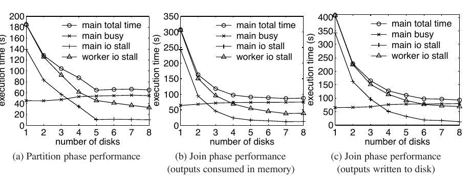

如图 10 所示，随着磁盘数增加、每块磁盘承担的 I/O 操作减少，`worker io stall time` 显著下降；`main busy time` 则在所有实验中大体不变，因为哈希连接的内存与计算操作不依赖磁盘数量。结合两种趋势，我们看到哈希连接只在磁盘数较少时（例如不超过 4 块）受 I/O 限制；随着磁盘增加，它逐渐转为受 CPU 限制。

图 10(a) 和图 10(b) 表明，分区阶段以及输出在内存中消费的连接阶段在使用至少 5 块磁盘时受 CPU 限制：`main busy time` 显著大于 `worker io stall time`，`main total time` 也趋于平坦。图 10(c) 表明，输出写入磁盘的连接阶段在使用 7 块磁盘时转为 CPU 受限。[^7] 在 Itanium 2 机器上使用 5 块或 7 块磁盘是合理的，因为均衡数据库服务器通常每颗处理器配备 10 块磁盘 [TPC Benchmarks]。因此，我们得出结论：在具备合理 I/O 带宽时，Itanium 2 机器上的哈希连接受 CPU 限制。`main busy time` 和 `worker io stall time` 之间的差距，揭示了通过改善哈希连接 CPU 性能来缩短总时间的机会。第 8.4 节将说明，计入磁盘 I/O 后，我们的预取方案能够同时缩短分区阶段和连接阶段的总经过时间。

[^7]: 尽管曲线标记看起来相互重叠，第 8.4 节的实验结果支持这一结论；其中缓存预取确实改善了这种情况下的性能。

### 8.2 通过模拟研究用户态 CPU 缓存性能

**连接阶段性能。** 我们在图 11 中通过模拟比较了基线算法和三种预取方案的连接阶段性能。这些实验模拟连接阶段对一对分区的处理；所有实验中，构建分区都恰好放入 50 MB 内存。默认情况下，元组为 100 B，每个构建元组匹配两个探测元组。如图 11 所示，在改变元组大小、探测关系与构建关系的大小比，以及存在匹配的元组比例时，组预取和软件流水线预取相对于 GRACE 哈希连接均获得 3.02–4.04 倍加速。简单预取相对于基线只获得 1.06–1.24 倍加速，因为它没有改善连接阶段的核心——哈希表访问。相比简单预取，组预取和软件流水线预取还可额外加速 2.65–3.40 倍。

各子图的曲线趋势符合预期。在图 11(a) 中，元组大小从 20 B 增至 140 B 时，固定大小分区中的元组数减少，曲线因而下降。在图 11(b) 和图 11(c) 中，随着每个构建元组的匹配数增加，或存在匹配的元组比例上升，总匹配数随之增加，因而曲线上升。图 11(b) 的探测分区大小也在增加，所以其曲线比图 11(c) 陡得多。

图 11：通过模拟得到的连接阶段用户态性能（连接一对构建分区和探测分区）；(a) 改变元组大小；(b) 改变匹配数；(c) 改变连接选择率。

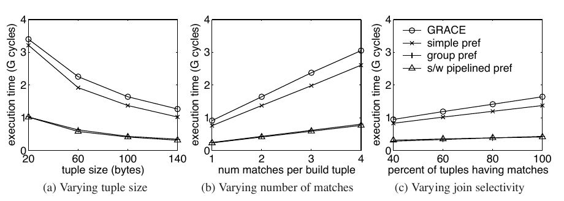

**连接阶段执行时间分解。** 我们在图 12 中给出了执行时间分解。模拟器中，每根柱被分为四类，说明所有潜在退休槽（graduation slot）中发生了什么。退休槽总数等于发射宽度（我们的模拟架构中为 4）乘以周期数。我们观察退休槽而不是发射槽，以免把最终被丢弃的推测执行操作计入其中。

每根柱最下方的 `busy` 部分表示实际有指令退休的槽数；另外三部分表示没有指令退休的槽数，依次分为数据缓存停顿、数据 TLB 停顿和其他停顿。最上方的 `dcache stalls` 是直接由最老停顿指令发生数据缓存未命中而造成的槽数；第二部分 `dtlb stalls` 是最老停顿指令等待数据 TLB 未命中所造成的槽数；第三部分 `other stalls` 是其他所有没有指令退休的槽。L2 和 L3 缓存未命中的影响都包含在 `dcache stalls` 中。该部分只是数据缓存未命中所致性能损失的一阶近似：这些延迟还会加重后续数据依赖停顿，从而增加 `other stalls`。

缓存性能分解来自我们的模拟结果，因为模拟器能够以细粒度检测，把每个空闲退休槽归入一种停顿类型。在真机上通常很难生成如此精确的缓存性能分解，原因有二：（i）处理器不提供退休槽的详细信息；（ii）根据缓存未命中数和其他事件计数估算分解，无法考虑这些事件之间的重叠效应。

图 12 对应图 11(a) 中 100 B 元组的数据点，其中 GRACE 柱就是此前图 1 中的 `join` 柱。我们看到，组预取和软件流水线预取确实成功隐藏了绝大部分数据缓存未命中延迟。模拟器输出证实，剩余的数据缓存未命中大多是 L1 未命中但 L2 命中，或者 L1、L2 均未命中但 L3 命中。技术中的代码变换、簿记和预取开销使 `busy` 所占比例增加；软件流水线预取实现更复杂，因此其 `busy` 部分大于组预取。值得注意的是，其他停顿也有所增加；一种可能的原因是，数据缓存停顿减少后，某些次要停顿原因显现出来。

图 12：连接阶段执行时间分解（图 11(a) 中的 100 B 元组）。

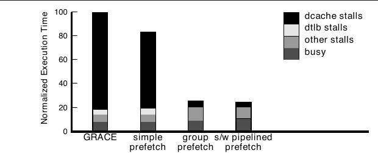

**改变内存延迟时的连接性能。** 图 13 展示了模拟器中主存延迟 $T_1$ 分别设为默认的 250 周期和 1000 周期时的连接阶段性能。我们看到，随着内存延迟增加，GRACE 哈希连接的执行时间大幅上升；相比之下，组预取和软件流水线预取的执行时间只略有增加，因而相对于 GRACE 获得 8.3–9.6 倍加速。我们得出结论：即使处理器与内存的速度差距显著扩大，例如扩大 4 倍，预取算法仍然有效。

图 13：改变内存延迟时的连接阶段用户态性能；250 周期结果与图 11(a) 中 20 B 元组结果相同。

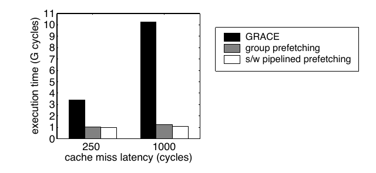

**分区阶段性能。** 图 14 展示了通过模拟把 200 MB 构建关系和 400 MB 探测关系分区时的性能。我们把分区数从 25 增至 800，元组大小固定为 100 B；与其他实验不同，生成的分区可能远小于 50 MB。如图所示，我们看到，分区数增加时，预取所有输入页和输出页、并假定它们驻留 CPU 缓存的简单方法越来越无效；我们的两种预取方案则保持相同的性能水平。相比 GRACE，我们的预取方案获得 1.96–2.71 倍加速。

图 14：通过模拟得到的分区阶段用户态性能。

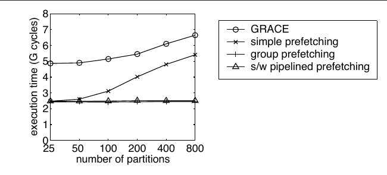

图 15 给出了图 14 中生成 800 个分区时的执行时间分解。组预取和软件流水线预取成功隐藏了绝大部分数据缓存未命中延迟。与图 12 类似，组预取的 `busy` 部分大于 GRACE，而软件流水线预取的 `busy` 部分又更大，体现了两种预取方案的指令开销。

图 15：图 14 中生成 800 个分区时的执行时间分解。

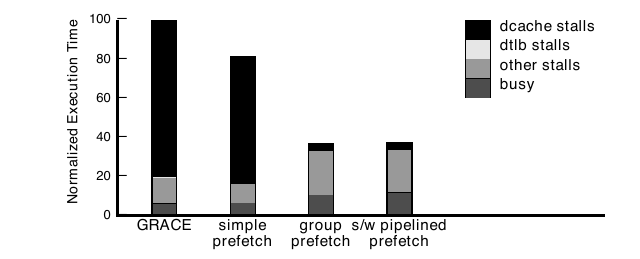

**与缓存分区比较：健壮性。** 缓存分区假定独占缓存，而在同时存在多项活动的动态环境中，这一假设很可能不成立。即使使用更小的“有效”缓存大小，缓存冲突仍可能成为严重问题并导致性能不佳。我们在图 16 中展示了周期性清空缓存时所有方案的性能下降，用以模拟最坏情况的干扰。我们把缓存清空周期从 2 ms 改变到 10 ms，并报告相对于算法在不清空缓存时性能的归一化执行时间。缓存分区的性能下降了 11%–78%。尽管图中展示的是最坏情况缓存干扰，但它确实反映了缓存分区的健壮性问题。相比之下，我们的预取方案不假定哈希表和构建分区持续驻留缓存；如图所示，即使面对频繁的缓存清空，它们仍然非常健壮。

图 16：清空缓存对不同技术的影响。

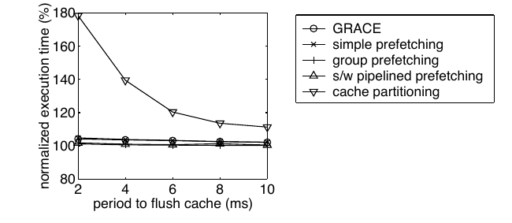

**与缓存分区比较：重新分区代价。** I/O 分区数量受分区阶段可用内存和存储管理器能力的共同限制。IBM DB2 的实践表明，每次哈希连接中，存储管理器最多可以处理数百个活动分区 [Lindsay 2002]。假设 CPU 缓存为 2 MB，并乐观地允许 1000 个分区，那么仅通过一遍分区生成缓存大小分区时，能够处理的最大关系为 2 GB。超过这一限制后，必须增加一遍分区，才能生成缓存大小的分区。我们用图 17(a)–(c) 所示的多组实验研究了这种重新分区代价。重新分区步骤通常紧接在连接阶段前、于主存中执行，因此我们可以把它视为连接阶段的预处理步骤；此外，只要可行，我们就在连接阶段采用简单预取来增强缓存分区方案。

图 17(a) 展示了通过模拟连接 200 MB 构建关系与 400 MB 探测关系时的连接阶段执行时间。每个构建元组匹配两个探测元组。我们把元组大小从 20 B 增至 140 B，关系中的元组数因而减少，曲线呈下降趋势。图 17(b) 对图 17(a) 的 100 B 元组实验，把每个构建元组的匹配数从 1 改变到 4。图 17(c) 则把存在匹配的构建元组和探测元组比例从 100% 降至 40%；其中 100% 数据点对应图 17(a) 的 100 B 数据点。结果表明，重新分区开销使缓存分区比两种预取方案慢 36%–77%。因此，我们得出结论：重新分区步骤相对于组预取和软件流水线预取显著拖慢了缓存分区。

图 17：缓存分区的重新分区代价；默认参数为 200 MB 构建关系、400 MB 探测关系、100 B 元组、每个构建元组匹配两个探测元组；(a) 改变元组大小；(b) 改变匹配数；(c) 改变连接选择率。

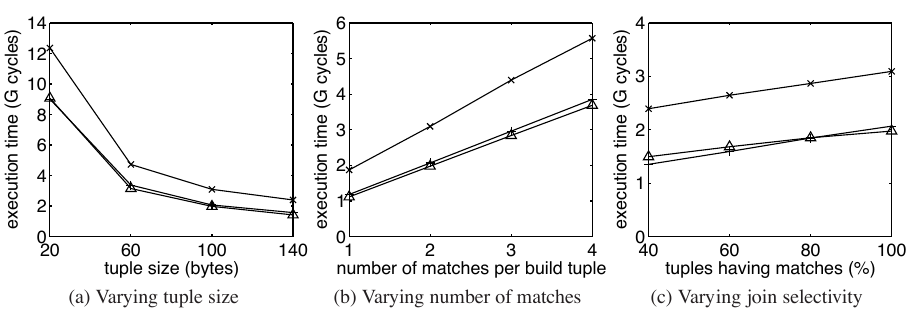

### 8.3 Itanium 2 机器上的用户态 CPU 缓存性能

**选择编译器和优化级别。** 本小节中，我们给出我们的哈希连接用户态性能实验结果，这些结果在 Itanium 2 机器上测得。我们首先确定我们的实验使用的编译器和优化级别。图 18 展示了所有方案在内存中连接一个 50 MB 构建分区和一个 100 MB 探测分区时，以不同编译器和优化选项生成程序的执行时间。[^8] 元组大小为 100 B，每个构建元组匹配两个探测元组。我们看到，icc 生成的可执行文件显著快于 gcc 生成的文件；icc 的两个优化级别性能相近。由于所有方案的最佳性能均由 `icc -O3` 获得，我们选择用 `icc -O3` 编译我们的代码，并将它用于 Itanium 2 机器实验。

图 18：为 Itanium 2 机器上的哈希连接研究选择编译器和优化级别。

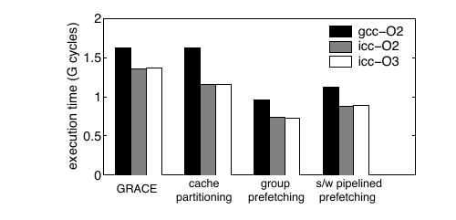

`icc -O3` 会自动向生成的可执行文件插入软件预取指令以改善性能。因此，编译器增强的 GRACE 连接已涵盖简单预取，我们不再单独报告 Itanium 2 上的简单预取结果。缓存分区方案同样由编译器插入的预取增强，因而成为更强的比较对象。

[^8]: 组预取或软件流水线预取的柱状数据，是针对该配置调优后所得的最优结果。

**连接阶段性能。** 图 19 展示了在改变元组大小、探测关系与构建关系的大小比，以及存在匹配的元组比例时，各方案的连接阶段性能。这些实验对应图 11 中的模拟研究。对于缓存分区，我们放宽 50 MB 可用内存的限制，分配更多内存，使探测分区和构建分区都驻留内存。即使给予缓存分区这种有利条件，我们的预取方案仍然显著更好。与 GRACE 哈希连接相比，组预取获得 1.65–2.18 倍加速，软件流水线预取获得 1.29–1.69 倍加速；与缓存分区相比，两者分别获得 1.52–1.89 倍和 1.18–1.47 倍加速。

图 19：Itanium 2 上连接阶段的用户态性能（连接一对构建分区和探测分区）；(a) 改变元组大小；(b) 改变匹配数；(c) 改变连接选择率。

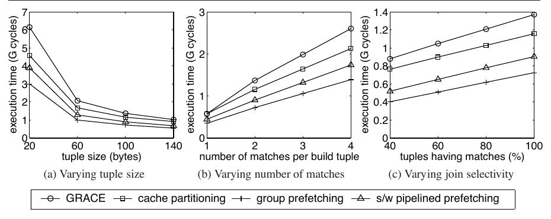

比较图 19 与图 11 的模拟研究，我们看到一个主要差异：软件流水线预取显著不如组预取；在图 19 中，组预取比软件流水线预取快 23%–30%。我们在图 20 中考察各方案的退休指令数，以帮助解释这一结果。显然，组预取和软件流水线预取都因代码变换和预取而执行了比 GRACE 更多的指令。软件流水线预取的指令开销更高，比组预取多执行 12%–15% 的指令。缓存分区因为额外的分区步骤，也比 GRACE 多执行 43%–53% 的指令。

图 20：图 19(a) 中退休的 IA-64 指令数。

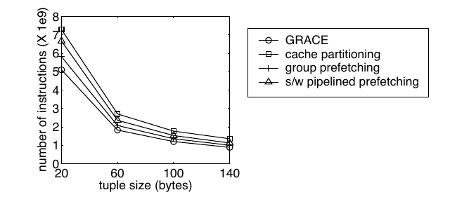

**算法参数调优。** 图 21(a) 和图 21(b) 展示了缓存性能与我们的两种预取算法参数之间的关系。我们执行与图 19(a) 中元组为 100 B 时相同的实验。这里，我们仅关注哈希表探测循环的性能变化；哈希表构建循环的曲线形状类似。探测的最优参数是组大小 $G=14$ 和预取距离 $D=1$，图 19 的所有实验均采用这些值。从图中我们看到，两条曲线都有很长的平坦区间，许多参数选择都能获得接近最优的性能。换言之，我们的预取算法对参数选择十分健壮，因此可以针对一组机器配置预先设定算法参数。

图 21：Itanium 2 机器上连接阶段哈希表探测时，组预取和软件流水线预取的调优参数；(a) 组预取；(b) 软件流水线预取。

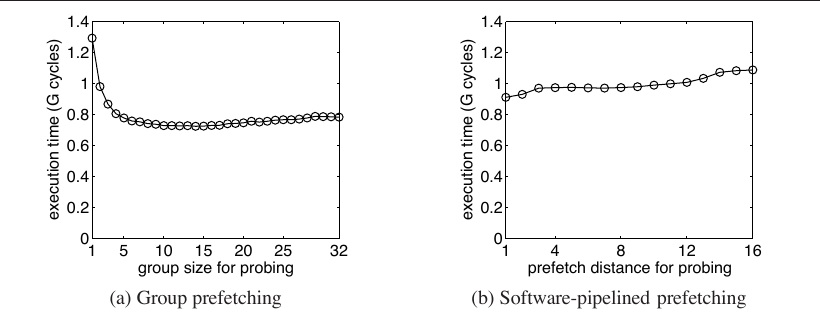

**分区阶段性能。** 图 22(a) 展示了把 2 GB 构建关系和 4 GB 探测关系划分为 57、100、150、200 和 250 个分区时的用户态执行时间。[^9] 元组大小为 100 B。我们看到，随着分区数增加，GRACE 哈希连接性能显著下降。处理一个元组所需的内存引用和指令数没有改变，但图 22(b) 表明 GRACE 的 L3 缓存未命中数大幅增加，原因是输出缓冲区越多，一次内存引用未命中 CPU 缓存的概率越大。即使 `icc -O3` 已增强 GRACE，编译器自动插入的预取也没有解决这一问题。

相比之下，我们的预取算法利用元组间并行性，让多个元组处理中的缓存未命中彼此重叠。我们的方案性能几乎保持不变。相对于 GRACE，组预取获得 1.37–1.62 倍加速，软件流水线预取获得 1.43–1.46 倍加速。

图 22：Itanium 2 机器上分区阶段的用户态性能；(a) 改变分区数；(b) L3 缓存未命中。

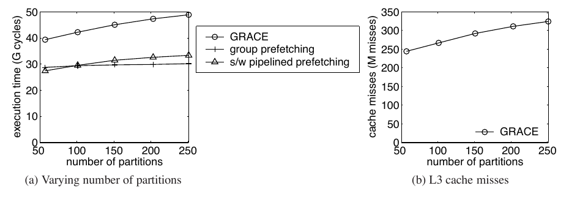

[^9]: 选择 57 个分区是为了确保分区能够装入主存；其他分区数则任意选取，用于理解更多分区所产生的影响。

### 8.4 Itanium 2 机器上包含磁盘 I/O 的执行时间

本小节中，我们研究我们的缓存预取技术对包含磁盘 I/O 的哈希连接真实经过时间的影响。我们执行与第 8.1 节相同的一组实验，即连接 2 GB 构建关系与 4 GB 探测关系，同时改变元组大小和中间分区数量。我们在这些实验中使用 7 块磁盘。[^10] 图 23–25 比较了我们的两种缓存预取方案与 GRACE 哈希连接。GRACE 在 100 B 元组上的结果对应图 10 中先前展示的 7 磁盘数据点。图 25 中的 57 和 113 个分区由哈希连接算法自动选择，使一个构建分区及其哈希表在连接阶段最多消耗 50 MB 主存；为更好理解结果，我们还测量了生成 250 个分区时的性能。

图 23 展示输出元组由主存中的父算子消费时的连接阶段性能。对于 100 B 元组，组预取和软件流水线预取分别获得 1.33 倍和 1.22 倍加速；对于 20 B 元组，两者分别获得 1.84 倍和 1.45 倍加速。

图 23：输出元组在主存中消费时，包含 I/O 的连接阶段性能；(a) 100 B 元组；(b) 20 B 元组。

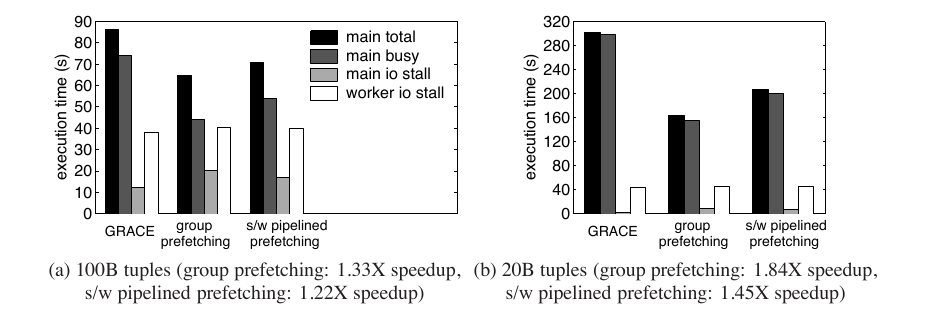

图 24 展示输出元组写入磁盘时的连接阶段性能。对于 100 B 元组，组预取和软件流水线预取均获得 1.12 倍加速；对于 20 B 元组，两者分别获得 1.79 倍和 1.44 倍加速。

图 24：输出元组写入磁盘时，包含 I/O 的连接阶段性能；(a) 100 B 元组；(b) 20 B 元组。

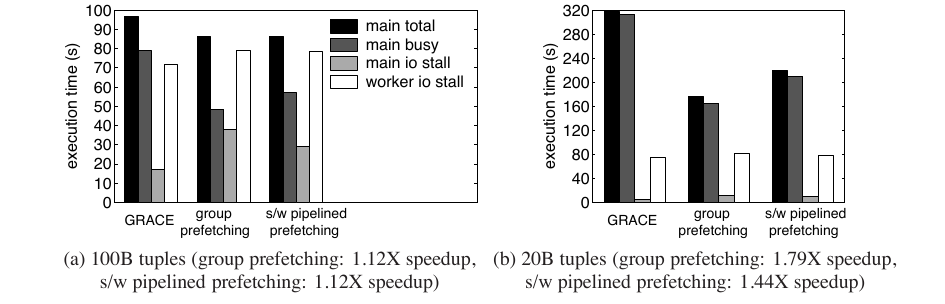

图 25 展示包含 I/O 的分区阶段性能。对于 100 B 元组和 57 个分区，组预取、软件流水线预取均获得 1.06 倍加速；对于 100 B 元组和 250 个分区，两者分别获得 1.16 倍和 1.14 倍加速；对于 20 B 元组和 113 个分区，两者分别获得 1.60 倍和 1.51 倍加速。

图 25：包含 I/O 的分区阶段性能；(a) 100 B 元组、57 个分区；(b) 100 B 元组、250 个分区；(c) 20 B 元组、113 个分区。

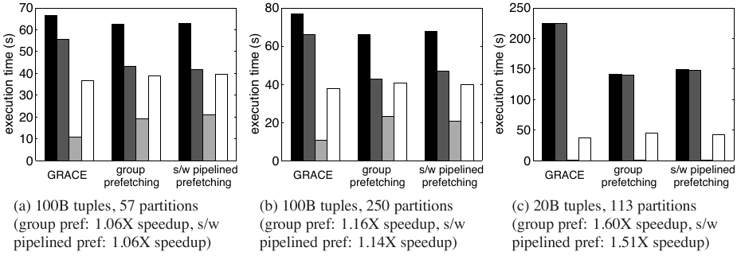

总体而言，图 23–25 表明：相对于 GRACE，我们的组预取使连接阶段加速 1.12–1.84 倍、分区阶段加速 1.06–1.60 倍；我们的软件流水线预取使连接阶段加速 1.12–1.45 倍、分区阶段加速 1.06–1.51 倍。

每项实验都给出一组四根柱，分别对应第 8.1 节所述四条曲线。我们看到，`worker io stall time` 如预期大体不变，而我们的缓存预取技术成功缩短 `main busy time`，进而缩短真实经过时间。我们的缓冲池管理器实现较为直接，并未经过广泛性能调优，因此有些实验中的 `main io stall time` 不降反升，抵消了部分 `main busy time` 降低所带来的收益。即便使用这种相对简单的缓冲区管理器，我们的缓存预取技术仍获得了不可忽视的性能提升。

比较不同元组大小和分区数量下的整体加速比，我们看到，使用 20 B 元组或产生更多分区的连接操作加速更大，因为这些情况下哈希连接更消耗 CPU。与 100 B 元组相比，每个磁盘页大约要处理 5 倍数量的 20 B 元组。分区数增加则会让 I/O 分区阶段需要更多输出缓冲区空间，从而引起更多缓存未命中。因此，如图 23–25 所示，`main busy time` 与 `worker io stall time` 之间的差距更大，CPU 缓存优化的潜在收益也更大。

总之，我们观察到我们的缓存预取技术成功缩短了 Itanium 2 机器上包含磁盘 I/O 的哈希连接真实经过时间。

[^10]: 第八块磁盘包含根分区和交换分区。我们发现，使用 7 块而不是 8 块磁盘能够降低测量方差。

## 9. 讨论

在面向多种体系结构、以二进制形式发布的生产级 DBMS 中实现我们的预取技术时，可能遇到若干实际问题。

第一，不同体系结构和编译器的预取指令语法通常不同。我们可以为每种体系结构与编译器组合定义一组宏，隐藏这些差异，再使用宏编写代码；我们的实现采用了这一做法。

第二，某些体系结构，例如当时的 x86 处理器，不支持即使遇到 TLB 未命中也能成功执行的故障型预取。可以采用两种技术解决：（i）用虚拟加载指令充当故障型预取；由于我们的算法中所有被预取的内存引用最终都会真实发生，因此这种做法是正确的；（ii）使用较大的虚拟页来减少 TLB 未命中，多种体系结构都广泛支持这一能力，例如 x86 [Intel Corporation 2006]、SPARC [McDougall 2004] 和 POWER 5 [Hepkin 2006]。POWER 5 支持 16 GB 虚拟页，足以容纳大多数哈希连接的内存数据；不同的 x86 和 SPARC 处理器支持 2 MB–256 MB 虚拟页。假设页大小为 4 MB、TLB 有 32 项，当哈希表结构能够放入 128 MB 时，我们可以对哈希桶头和哈希单元数组发出非故障型预取，而用虚拟加载来预取实际元组。

第三，某些体系结构要求软件显式管理缓存，例如 Cell Broadband Engine [Kahle et al. 2005] 和网络处理器 [Gold et al. 2005]。Gold 等人的研究 [Gold et al. 2005] 已表明，我们的预取技术很容易调整为把数据预加载到显式管理的缓存中。

第四，在配置差异很大的机器上，例如内存速度显著不同的机器，预先设定的组大小和预取距离可能并非最优。解决办法是在安装 DBMS 时执行校准测试，以确定最佳参数。

最后，如果上述方案都不能奏效，DBMS 仍可作为最终保底方案，针对特定体系结构在编译时回退到原始哈希连接算法，或根据校准结果在安装时回退。

## 10. 结论

预取是改善 CPU 缓存性能的一项很有前景的技术，但由于单个元组处理内部存在依赖，而且哈希具有随机性，把它应用于哈希连接并不直接。本文中，我们探索了利用元组间并行性有效调度预取的潜力。我们的组预取和软件流水线预取技术系统地重排哈希连接的内存引用并调度预取，使处理一个元组时的缓存未命中延迟能够与其他元组的计算及未命中延迟重叠。我们建立了通用模型来深入理解这些技术，并成功克服哈希连接算法中的复杂问题。

我们通过模拟和 Itanium 2 真机开展了细致的实验研究，同时关注用户态 CPU 缓存性能和包含磁盘 I/O 的真实经过时间。我们的实验结果证明，我们的组预取和软件流水线预取技术能够显著改善哈希连接性能。即使处理器与内存的速度差距显著扩大，例如扩大 4 倍，这些技术仍然有效。我们相信，我们的技术还可以改善基于哈希的 group-by、聚合算法，以及其他具有元素间并行性的算法。

## 致谢

本研究得到美国国家科学基金会（NSF）的一项资助。我们感谢 D. J. DeWitt 提出的深刻意见。第三作者感谢 P. Bohannon、S. Ganguly、H. F. Korth 和 P. P. S. Narayan 的有益讨论。我们感谢匿名审稿人的评论与建议。

## 参考文献

- Baer, J.-L. and Chen, T.-F. 1991. An Effective On-Chip Preloading Scheme to Reduce Data Access Penalty. In *Proceedings of Supercomputing '91*. Albuquerque, NM, USA, 176–186.
- Boncz, P. A., Manegold, S., and Kersten, M. L. 1999. Database Architecture Optimized for the New Bottleneck: Memory Access. In *Proceedings of the 25th International Conference on Very Large Data Bases*. Edinburgh, Scotland, UK, 54–65.
- Chen, S. 2005. *Redesigning Database Systems in Light of CPU Cache Prefetching*. Ph.D. thesis, Carnegie Mellon University.
- Chen, S., Ailamaki, A., Gibbons, P. B., and Mowry, T. C. 2004. Improving Hash Join Performance through Prefetching. In *Proceedings of the 20th International Conference on Data Engineering*. Boston, MA, USA, 116–127.
- Chen, S., Ailamaki, A., Gibbons, P. B., and Mowry, T. C. 2005. Inspector Joins. In *Proceedings of the 31st International Conference on Very Large Data Bases*. Trondheim, Norway, 817–828.
- Chen, S., Gibbons, P. B., and Mowry, T. C. 2001. Improving Index Performance through Prefetching. In *Proceedings of the 2001 ACM SIGMOD International Conference on Management of Data*. Santa Barbara, CA, USA, 235–246.
- Chen, S., Gibbons, P. B., Mowry, T. C., and Valentin, G. 2002. Fractal Prefetching B+-Trees: Optimizing Both Cache and Disk Performance. In *Proceedings of the 2002 ACM SIGMOD International Conference on Management of Data*. Madison, WI, USA, 157–168.
- Gold, B. T., Ailamaki, A., Huston, L., and Falsafi, B. 2005. Accelerating Database Operations Using a Network Processor. In *Proceedings of the First International Workshop on Data Management on New Hardware (DaMoN 2005)*. Baltimore, MD, USA.
- Graefe, G. 1993. Query Evaluation Techniques for Large Databases. *ACM Computing Surveys* 25, 2, 73–170.
- Hepkin, D. 2006. *Guide to Multiple Page Size Support on AIX 5L Version 5.3*. http://www03.ibm.com/servers/aix/whitepapers/multiple_page.pdf.
- IBM Corporation. 2004. *IBM DB2 Universal Database Administration Guide Version 8.2*.
- Intel Corporation. 2004. *Intel Itanium 2 Processor Reference Manual for Software Development and Optimization*. Order Number 251110-003.
- Intel Corporation. 2006. *IA-32 Intel Architecture Software Developer's Manual (Volumes 3A and 3B): System Programming Guide*.
- Kahle, J. A., Day, M. N., Hofstee, H. P., Johns, C. R., Maeurer, T. R., and Shippy, D. 2005. Introduction to the Cell Multiprocessor. *IBM Journal of Research and Development* 49, 4/5 (July/Sept.), 589–604.
- Kalla, R. N., Sinharoy, B., and Tendler, J. M. 2004. IBM Power5 Chip: A Dual-Core Multithreaded Processor. *IEEE Micro* 24, 2 (Mar./Apr.), 40–47.
- Kennedy, K. and McKinley, K. S. 1990. Loop Distribution with Arbitrary Control Flow. In *Proceedings of Supercomputing '90*. New York, NY, USA, 407–416.
- Kitsuregawa, M., Tanaka, H., and Moto-Oka, T. 1983. Application of Hash to Data Base Machine and Its Architecture. *New Generation Computing* 1, 1, 63–74.
- Lam, M. S. 1987. *A Systolic Array Optimizing Compiler*. Ph.D. thesis, Carnegie Mellon University.
- Lindsay, B. 2002. Hash Joins in DB2 UDB: The Inside Story. Carnegie Mellon DB Seminar.
- Luk, C.-K. and Mowry, T. C. 1996. Compiler-Based Prefetching for Recursive Data Structures. In *Proceedings of the 7th International Conference on Architectural Support for Programming Languages and Operating Systems*. Cambridge, MA, USA, 222–233.
- Luk, C.-K. and Mowry, T. C. 1999. Automatic Compiler-Inserted Prefetching for Pointer-Based Applications. *IEEE Transactions on Computers* 48, 2 (Feb.), 134–141.
- Manegold, S., Boncz, P. A., and Kersten, M. L. 2000. What Happens During a Join? Dissecting CPU and Memory Optimization Effects. In *Proceedings of the 26th International Conference on Very Large Data Bases*. Cairo, Egypt, 339–350.
- McDougall, R. 2004. *Supporting Multiple Page Sizes in the Solaris Operating System*. http://www.sun.com/blueprints/0304/817-5917.pdf.
- McFarling, S. 1993. Combining Branch Predictors. Tech. Rep. WRL Technical Note TN-36, Digital Equipment Corporation, June.
- Mowry, T. C. 1994. *Tolerating Latency through Software-Controlled Data Prefetching*. Ph.D. thesis, Stanford University.
- Mowry, T. C., Lam, M. S., and Gupta, A. 1992. Design and Evaluation of a Compiler Algorithm for Prefetching. In *Proceedings of the 5th International Conference on Architectural Support for Programming Languages and Operating Systems*. Boston, MA, USA, 62–73.
- Nakayama, M., Kitsuregawa, M., and Takagi, M. 1988. Hash-Partitioned Join Method Using Dynamic Destaging Strategy. In *Proceedings of the 14th International Conference on Very Large Data Bases*. Los Angeles, CA, USA, 468–478.
- Perfmon Project. http://www.hpl.hp.com/research/linux/perfmon/index.php4.
- Saulsbury, A., Dahlgren, F., and Stenström, P. 2000. Recency-Based TLB Preloading. In *Proceedings of the 27th International Symposium on Computer Architecture*. Vancouver, BC, Canada, 117–127.
- Shapiro, L. D. 1986. Join Processing in Database Systems with Large Main Memories. *ACM Transactions on Database Systems* 11, 3, 239–264.
- Shatdal, A., Kant, C., and Naughton, J. F. 1994. Cache Conscious Algorithms for Relational Query Processing. In *Proceedings of the 20th International Conference on Very Large Data Bases*. Santiago de Chile, Chile, 510–521.
- Sun Microsystems. 2004. *UltraSPARC IV Processor Architecture Overview*. Technical Whitepaper, Version 1.0, Feb.
- TPC Benchmarks. http://www.tpc.org/.
- Zeller, H. and Gray, J. 1990. An Adaptive Hash Join Algorithm for Multiuser Environments. In *Proceedings of the 16th International Conference on Very Large Data Bases*. Brisbane, Queensland, Australia, 186–197.
- Zhou, J., Cieslewicz, J., Ross, K. A., and Shah, M. 2005. Improving Database Performance on Simultaneous Multithreading Processors. In *Proceedings of the 31st International Conference on Very Large Data Bases*. Trondheim, Norway, 49–60.
