# Improving Unnesting of Complex Queries（中文译文）

## 译者说明

本文依据同目录的 `source.pdf` 翻译。章节、图表、公式、算法、代码与参考文献按原文结构保留。

作者：Thomas Neumann<br>
单位：慕尼黑工业大学信息学系，德国加兴 Boltzmannstr. 3，85748<br>
邮箱：neumann@in.tum.de<br>
ORCID：0000-0001-5787-142X

## 摘要

SQL 允许非常灵活地嵌套查询，包括访问查询外层属性的子查询。这些相关子查询简化了查询表达，但执行效率很低，会导致 $O(n^2)$ 的运行时复杂度；对于大型数据库，这一代价可能高得无法接受。

因此，查询优化器会尝试对依赖查询去嵌套（即去相关）。然而，现有去相关技术要么适用范围有限，要么会在相关查询反复嵌套时产生次优执行计划。本文提出一种广义去嵌套方法，它能处理深层嵌套的相关子查询，并扩展到包括递归 SQL 在内的复杂查询构造。这种广义去嵌套改善了渐近复杂度，因而能够给相关查询带来显著的性能提升。

**关键词：** 查询优化；查询去嵌套

## 1. 引言

SQL 的一个关键性质是它是一种声明式查询语言：用户只说明查询意图，数据库系统再为该查询寻找最佳执行策略。至少，声明式语言作出了这样的承诺。现实中，在表达复杂查询、特别是包含复杂子查询时，这种声明性有时会失效。

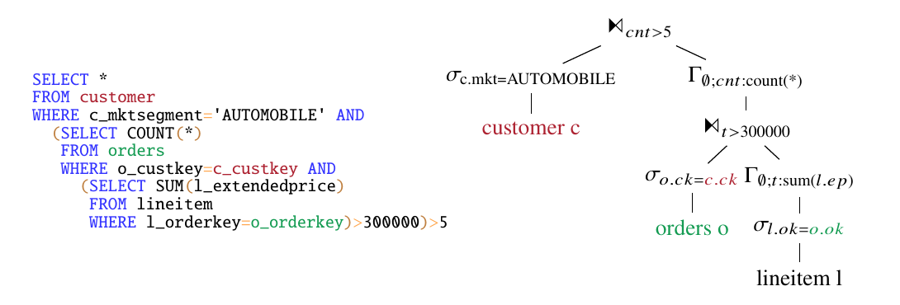

**图 1：带嵌套相关子查询的示例查询；颜色标出了相关关系。**

考虑图 1 的示例查询。它的概念很简单：找出汽车市场细分中，收入超过 300K 的订单数量大于 5 的客户；但多数数据库系统都很难高效处理它。右侧给出的规范关系代数翻译使用依赖连接，其中连接右侧要为左侧的每个元组求值。之所以必须使用这种嵌套循环求值，是因为右侧访问了左侧提供的值；如果改用普通哈希连接，这些值将不可见。

但从算法角度看，依赖连接非常糟糕：连接 $L \mathbin{\Join} R$ 的运行时复杂度为 $\Theta(|L||R|)$，会随输入规模二次增长。数据库引擎中的 $n$ 往往达到数百万量级，因此 $O(n^2)$ 的执行时间常常不可接受。在 TPC-H scale factor 1 上，该查询虽然只处理 1 GB 数据，在 PostgreSQL 16 中却需要超过 25 分钟。可以把查询改写为解耦子查询的形式，使 PostgreSQL 几乎立即作答，但查询会更长、更难编写。既然 SQL 追求声明式表达，这种转换就应由 DBMS 自动完成。

历史上，数据库系统通过识别常见 SQL 模式并重写查询来消除相关关系 [Ki82, JK84, Ki85]。这种方法能高效执行某些相关子查询模式，但并不令人满意：SQL 文本的微小变化就可能破坏模式匹配，再次造成灾难性的执行时间。

我们十年前的工作 [NK15] 提出了完全不同的方法。它工作在代数层，因此能抵抗 SQL 表达形式的变化，并基于两个观察：

1. 总能把一个依赖连接重写为另一个依赖连接，使其右侧与左侧中无重复的相关值连接；
2. 当依赖连接左侧无重复时，可以沿代数树向下推动它，直到右侧不再依赖左侧。

第 2 节会详细讨论该方法。

从概念上说，该算法可以消除任意查询中的相关关系，显著改善性能，使这些查询即使面对大型输入也能执行。它的改进如此显著，以至于多个数据库系统现在都用它来做查询去嵌套：Hyper 和 DuckDB 的商业产品使用它，我们的研究系统 Umbra 也使用它，此外还有若干我们所知的原型实现。

更广泛的应用暴露出原论文 [NK15] 的一些局限。第一，算法没有覆盖某些高级 SQL 构造，尤其是递归 SQL 以及复杂的 `ORDER BY` 和 `GROUP BY` 构造。第二，当依赖查询彼此嵌套时，算法有时会出现病态行为，图 1 就是一个例子：去嵌套算法必须执行两次，每个依赖连接一次。原算法采用自底向上的顺序；由于两个依赖连接彼此堆叠，第二次去嵌套会放大第一次连接的代价，而且嵌套越深，性能退化越严重。第 2.3 节会给出详细示例。

本文解决这两个缺陷。第一，我们把算法改为自顶向下的策略，在处理当前依赖连接时考虑后续依赖连接，从而在深层嵌套时显著改善性能。第二，我们覆盖剩余的 SQL 构造，特别是递归 SQL 和 `ORDER BY LIMIT`。

本文余下部分组织如下：第 2 节概述问题并回顾 [NK15] 的原算法；第 3 节提出改进算法；第 4 节处理复杂 SQL 构造；第 5 节进行评估；第 6 节讨论相关工作；第 7 节总结全文。

## 2. 背景

本节先讨论问题定义和相关子查询的代数表示，再简要回顾 [NK15] 的去嵌套算法并说明其局限。

### 2.1 问题定义

多数数据库系统在内部使用关系代数表示查询，因此需要为相关子查询提供代数表示。为此，我们使用依赖连接——普通连接的一种变体。二者定义如下：

$$
L \Join_p R := \lbrace{}l \circ r \mid l \in L \land r \in R \land p(l \circ r)\rbrace{}
$$

$$
L \mathbin{\Join^{\mathrm{dep}}\relax_p} R := \lbrace{}l \circ r \mid l \in L \land r \in R(l) \land p(l \circ r)\rbrace{}.
$$

依赖连接使连接左侧在右侧可见。存在相关关系时，使用依赖连接不是可选项。例如，若写成 $L \Join (\sigma_{L.x\lt{}R.y}(R))$，表达式 $\sigma_{L.x\lt{}R.y}(R)$ 中的 $L.x$ 未定义，会产生类型错误；改用依赖连接后， $L.x$ 得到绑定并可在右侧使用。所有连接变体都有对应的依赖版本，例如依赖左半连接和依赖左外连接；在每一种依赖版本中，右侧都要为左侧每个元组求值。

为简化对可用属性和所需属性的推理，引入如下记号。若 $T$ 是关系代数表达式， $A(T)$ 表示该表达式产生的属性集合；例如， $A(R)$ 包含 $R.y$。如果某个属性被使用，却不是由其输入（或更高层的依赖连接）提供，它就是自由变量，用 $F(T)$ 表示。在本例中， $F(R)=\varnothing$，而

$$
F(\sigma_{L.x\lt{}R.y}(R))=\lbrace{}L.x\rbrace{}.
$$

当 $F(T)$ 非空时，代数表达式不能直接求值，必须先绑定所有值。可以在表达式上方放置一个提供这些属性的依赖连接，也可以改写表达式以消除自由变量。

在 SQL 到关系代数的规范翻译中，每个子查询都通过依赖连接加入外层查询；标量子查询则使用依赖单连接 [NLK17]。这样内层查询就能访问外层属性，但代价是依赖连接的二次运行时间。因此，查询去嵌套问题可以表述为：

> **问题定义：** 给定一个包含依赖连接的关系代数查询，把它重写为不含依赖连接的等价代数表达式。

如果右侧不依赖左侧，依赖连接可以直接替换为普通连接：

$$
L \mathbin{\Join^{\mathrm{dep}}} R \equiv L \Join R
\quad\text{if}\quad A(L)\cap F(R)=\varnothing.
$$

通常假定所有依赖连接都是非平凡的。下面讨论一种消除其余依赖连接的自底向上策略。

### 2.2 自底向上的去嵌套

[NK15] 的算法自底向上遍历代数树，消除遇到的依赖连接。它使用两种策略。第一种处理仅因 SQL 语法约束而存在的依赖连接。例如：

```sql
SELECT *
FROM R
WHERE EXISTS (
  SELECT *
  FROM S
  WHERE R.x = S.y
);
```

该查询会被翻译为依赖半连接，但显然可以把过滤条件上拉到半连接中，得到普通半连接 $R \ltimes_{R.x=S.y} S$，从而消除依赖。[NK15] 把这种处理称为简单去嵌套，并总是优先尝试它。

如果简单去嵌套不足以消除依赖连接，算法会使用第二种更复杂但能处理任意查询的策略。其第一个观察是：对于相关子查询，无须为外层查询的每个元组求值内层查询，只须为自由变量的每种可能绑定求值一次。可以计算自由变量的绑定域 $D$，并用它驱动依赖连接：

$$
L \mathbin{\Join^{\mathrm{dep}}} R
\equiv
L \Join_{\mathrm{natural}\ D}
\left(D \mathbin{\Join^{\mathrm{dep}}} R\right),
\qquad
D:=\Pi_{A(L)\cap F(R)}(L).
$$

这里的 $\Join_{\mathrm{natural}\ D}$ 表示在 $D$ 中同时出现在连接两侧的属性上做自然连接，并使用 `IS` 语义：`NULL` 被视为一个独立值，两个 `NULL` 相等。

把原依赖连接重写为一个普通连接和一个以绑定域 $D$ 为左侧的依赖连接有两个优点。首先， $|D|\leq|L|$，内层查询的执行次数可能减少。更重要的是， $D$ 无重复，因此可以应用对一般关系不成立的下推规则。最重要的规则包括：

$$
\begin{aligned}
D\Join^{\mathrm{dep}}(\sigma_p(T)) &\rightarrow \sigma_p(D\Join^{\mathrm{dep}}T),\\
D\Join^{\mathrm{dep}}(T_1\Join_pT_2) &\rightarrow (D\Join^{\mathrm{dep}}T_1)\Join_pT_2
&&\text{if }F(T_2)\cap A(D)=\varnothing,\\
D\Join^{\mathrm{dep}}(T_1\Join_pT_2) &\rightarrow T_1\Join_p(D\Join^{\mathrm{dep}}T_2)
&&\text{otherwise if }F(T_1)\cap A(D)=\varnothing,\\
D\Join^{\mathrm{dep}}(T_1\Join_pT_2) &\rightarrow
(D\Join^{\mathrm{dep}}T_1)\Join_{p\land\mathrm{natural}D}(D\Join^{\mathrm{dep}}T_2)
&&\text{otherwise},\\
D\Join^{\mathrm{dep}}(T_1\mathbin{\Join^{\mathrm{outer}}\relax_p}T_2) &\rightarrow
(D\Join^{\mathrm{dep}}T_1)\mathbin{\Join^{\mathrm{outer}}\relax_{p\land\mathrm{natural}D}}(D\Join^{\mathrm{dep}}T_2),\\
D\Join^{\mathrm{dep}}(\Gamma_{A;agg}(T)) &\rightarrow
\Gamma_{A\cup A(D);agg}(D\Join^{\mathrm{dep}}T).
\end{aligned}
$$

反复应用这些规则，直到依赖连接变为平凡连接并可替换为普通连接。该过程必然终止，因为每次变换都会把依赖连接向代数树更深处推动，而叶节点没有自由变量。

最后，优化器可以决定是否移除与 $D$ 的连接。如果 $D$ 的所有属性都已由等值条件绑定，例如 $D$ 只有列 $x$ 且查询含有 $x=y$，就可以移除与 $D$ 的连接，并用映射 $\chi_{x:y}$ 以 $y$ 计算 $x$。之所以成立，是因为 $D$ 无重复，所以依赖连接至多找到一个连接伙伴；同时，原依赖连接已被转换为在 $D$ 上的自然连接，连接条件会在计划中的该位置得到保证。

从计划形式看，完全去掉 $D$ 最为优雅，结果看起来与普通查询无异；但从性能看不一定最好。如果与 $D$ 的连接具有选择性，保留它可以更早消除元组。无论优化器是否执行最后的替换，最终计划都已完全去嵌套，不再含有依赖连接。下一节讨论这种方法的局限。

### 2.3 自底向上方法的局限

自底向上方法能很好地处理多数查询，但在某些边界情形下会退化。Sam Arch 在把复杂 UDF 翻译为纯 SQL 时向我们报告了该问题 [Fr24]。与图 1 类似，依赖子查询可能彼此嵌套。下面的示例是图 1 的一个变体；为在小例子中触发问题，我们额外加入了相关条件 $T_3.a=T_1.a$。

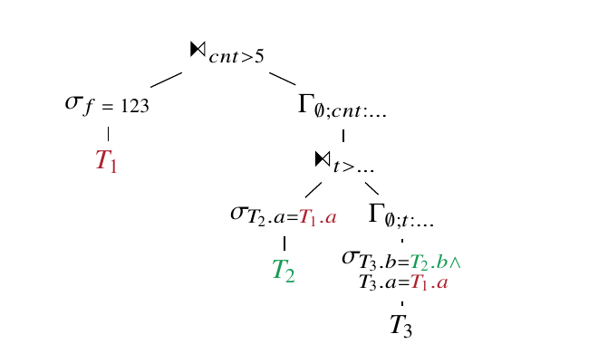

其初始计划中，上层聚合依赖 $T_1.a$，下层聚合同时依赖 $T_2.b$ 和 $T_1.a$。算法先对下层依赖连接去嵌套，得到一个按 $T_2.b$ 分组并通过 $T_2.a=T_1.a$ 过滤的计划：

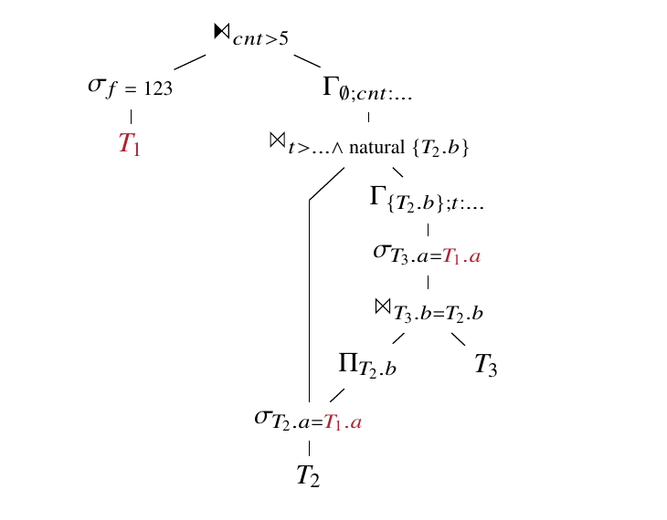

优化器很可能保留 $\Pi_{T_2.b}(\sigma_{T_2.a=T_1.a}(T_2))$ 的计算，而不做替换，因为该过滤条件具有选择性。

但再次运行算法以消除最上层依赖连接时，下层连接的右侧会在概念上为 $T_1.a$ 域与 $T_2.b$ 域的完整笛卡尔积求值，而不是为两个表连接结果的域求值：

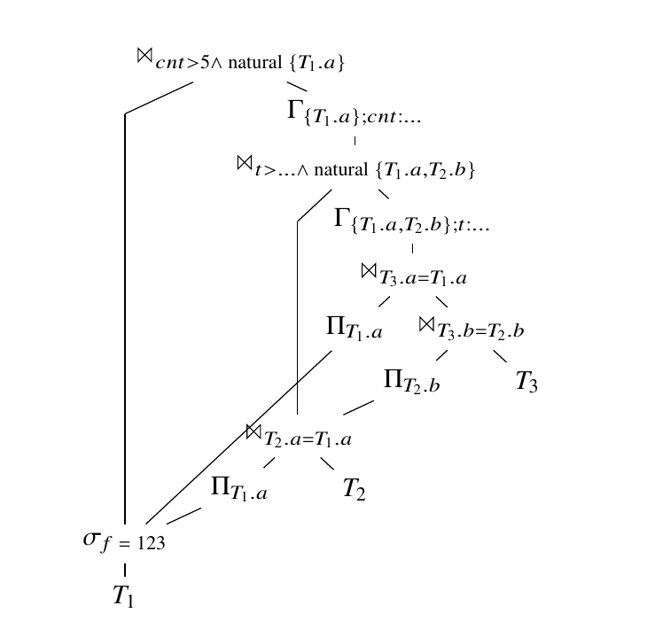

结果仍然正确，因为后续连接条件会消除不满足 $T_2.a=T_1.a$ 的 $T_1.a$ 值，但 group by 算子处理了过多数据。

嵌套越深，问题越严重。Sam Arch 提供的一个查询很形象地命名为 `crash.sql`，其中包含六层嵌套连接。去嵌套策略生成了巨大的中间笛卡尔积；这些元组最终虽会被后续算子过滤掉，却仍然消耗内存和 CPU。这促使我们开发一种同时考虑全部依赖连接的整体去嵌套策略，以避免不必要的笛卡尔积。

## 3. 整体查询去嵌套

本节提出一种在一次处理中联合处理嵌套依赖连接的整体去嵌套算法。它可以看作 [NK15] 的自顶向下变体，仍采用向下传递自由变量绑定域 $D$ 的思想，但表达方式不同：算法不显式地把 $D$ 沿树下推，而是记住本应加入哪些 $D$，并在一次自顶向下遍历中重写所有算子，直到不再需要 $D$ 或能够安全加入 $D$。

算法分成三部分：

1. 预处理阶段，识别所有非平凡依赖连接，并为其附加主算法需要的信息；
2. 按自顶向下顺序为所有非平凡依赖连接调用消除逻辑，这是主算法；
3. 针对各类算子的去嵌套规则。

受篇幅限制，本文不形式化该方法；形式化定义和正确性证明见技术报告 [Ne24]。

### 3.1 识别非平凡依赖连接

首先识别所有非平凡依赖连接，即右侧访问左侧所提供属性的依赖连接。最简单的方法是使用索引代数 [FMN23]，借此查询代数表达式的结构。若系统具备该能力，就考察每个列访问，计算访问该列的算子 $o_1$ 与提供该列的算子 $o_2$ 的最低公共祖先（LCA）。如果 LCA 不是 $o_1$，它必定是一个依赖连接 $o_3$；于是把 $o_1$ 标记为访问了 $o_3$ 的左侧。示例查询的标注见图 2。没有访问算子的依赖连接是平凡连接，可以直接改为普通连接。

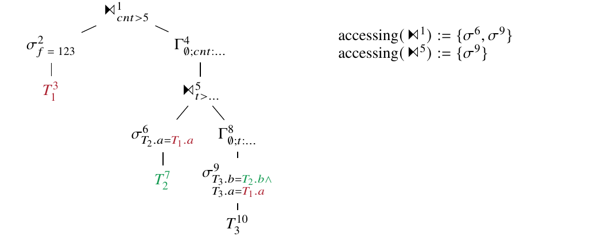

**图 2：示例查询的标注。**

索引代数非常适合这一阶段，因为每次 LCA 计算都能在 $O(\log n)$ 内完成，且无须额外数据结构。如果 DBMS 不支持该能力，也可通过跟踪树中各部分可用的列集合得到同样的信息，但渐近复杂度更差。

### 3.2 消除依赖连接

识别出所有非平凡依赖连接后，按自顶向下顺序逐个消除。若一个依赖连接嵌套在另一个依赖连接中，通常会在消除祖先连接时一并消除；但祖先连接的消除有时会在到达后代连接之前停止。关键是，我们绝不让不同的 $D$ 集合跨过依赖连接，从而避免第 2.3 节的问题。

```text
1  fun simpleDJoinElimination(join):
2     for op in accessing(join):
3        if path from op to join is linear:
4           if op is a selection and can merge op into join:
5              merge op into join
6              remove op from accessing(join)
7           else if op is a map and can move op above join:
8              move op above join
9              remove op from accessing(join)
10    if accessing(join) is empty:
11       convert join into regular join
12    return whether or not we converted the join
```

**图 3：简单依赖连接消除。**

对运行示例，算法从最上层依赖连接开始，先尝试图 3 所示的简单消除。它检查所有访问连接左侧的算子 `op`，判断从 `op` 到连接的路径是否只包含线性算子，即允许对输入分区的算子 [G.20]。借助索引代数可在 $O(\log n)$ 内检查；否则需要从 `op` 到连接做线性遍历。

如果路径满足条件，可以把 `op` 向上移动到连接处。若 `op` 是选择，只要语义允许，就把选择并入连接，消除该访问算子。若 `op` 是 map（有时也称投影），不能简单删除，但可以检查是否能把它移动到连接上方；若可以，就移动并从访问列表中删除。若访问列表最终为空，依赖连接即可转换为普通连接。这足以处理第 2.2 节的 `EXISTS` 查询，但运行示例中的依赖连接都不能如此消除。

```text
1  struct UnnestingInfo:
2     join      : join operator of the form L ⋈dep R
3     outerRefs : A(L) ∩ F(R)
4     D         : domain computation, Π_outerRefs(L)
5     parent    : parent Unnesting struct (if any)
6  struct Unnesting:
7     info      : the UnnestingInfo shared between Unnesting states
8     cclasses  : union-find data structure of equivalent columns
9     repr      : mapping from outerRefs columns to new colunns (if any)
```

**图 4：去嵌套期间维护的状态。**

如果简单去嵌套不足，就启动完整算法。它必须重写依赖连接右侧，使其中不再出现来自外侧的引用。为此，算法维护图 4 所示的状态。状态分为始终不变的全局部分 `UnnestingInfo`，以及在不同查询片段中变化的局部部分 `Unnesting`。

全局部分保存连接本身、外部引用集合（右侧访问的左侧列）及相应的域计算 $D$；`parent` 用于识别算法执行过程中遇到的嵌套依赖连接。局部部分使用并查集 `cclasses` 跟踪等价列并进行传递推理。例如，若谓词包含 $a=b$ 和 $b=c$，而 $c$ 是外部引用，只要 $a$ 可用，就可用 $a$ 替换 $c$。若某个外部引用已被其他列替换，则在 `repr` 中记录映射，以便查找新列名。

算法会用其他列替换外部引用，因此需要一个辅助函数，在找到合适替换后重写算子中的全部列引用：

```text
1  fun rewriteColumns(op, unnesting):
2     for each column reference c in op:
3        if unnesting.repr contains c:
4           replace c with unnesting.repr[c]
```

**图 5：重写外部列引用的辅助函数。**

有了这些基础结构，就可以描述真正的消除算法。算法按从根到叶的顺序为每个依赖连接调用，并且在去嵌套过程中再次遇到依赖连接时，可以传入父 `Unnesting` 结构。算法先尝试简单去嵌套；若成功就停止。否则，在嵌套情形下先对左侧去嵌套，然后创建新的 `Unnesting`，必要时与父状态合并，再对右侧去嵌套。

```text
1  fun dJoinElimination(join, parentUnnesting, parentAccessing):
2     // Check if simple unnesting is sufficient
3     if simpleDJoinElimination(join):
4        // Handle the outer unnesting if needed
5        if parentUnnesting is set:
6           for each map m moved by simpleDJoinElimination:
7              rewriteColumns(m, parentUnnesting)
8           unnest(join, parentUnnesting, parentAccessing)
9        return

11    // In the nested case we have to unnest the left-hand side first
12    if parentUnnesting is set:
13       accLeft = ∅
14       for a in parentAccessing:
15          if a is contained in join.left:
16             insert a into accLeft
17       unnest(join.left, parentUnnesting, accLeft)
18       // Update our condition as needed
19       rewriteColumns(join.condition.parentUnnestring)
20       for each map m moved by simpleDJoinElimination:
21          rewriteColumns(m, parentUnnesting)

23    // Create a new unnesting struct
24    info = new UnnestingInfo for join, set parent=parentUnnesting
25    unnest = new Unnesting for info

27    // Merge with parent unnesting if needed
28    acc = accessing(join)
29    if parentUnnesting is set:
30       for each a in parentAccessing:
31          if a is contained in join.right:
32             insert a into acc

34    // Unnest right-hand side
35    add equivalences from join.condition to unnest.cclasses
36    unnest(join.right, info, acc)
38    for each c in info.outerRefs:
39       add "{c} is not distinct from {info.repr[c]}" to join.condition
```

**图 6：依赖连接消除的一般情形。**

下面用一次完整运行说明算法。运行示例从最上层依赖连接开始，初始化 `outerRefs={T1.a}`、空的 `cclasses` 和 `repr`，随后对第一个 group by 的输入递归去嵌套：

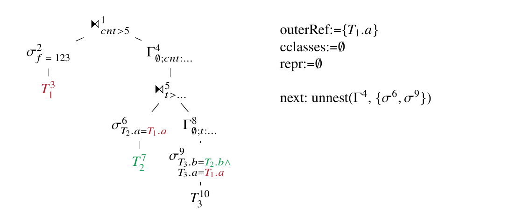

对 group by 去嵌套时，先递归处理输入，稍后再把外部列引用加入分组列。完成这一步后，group by 被压入栈中：

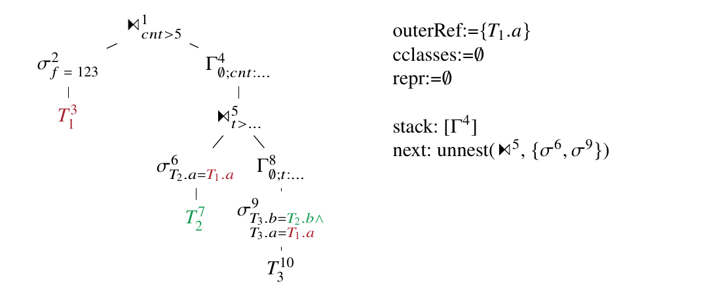

接着遇到另一个不能简单消除的依赖连接。它的状态稍后会与外层连接合并；当前先对其左输入去嵌套，并由选择谓词得到等价类 $\lbrace{}T_1.a,T_2.a\rbrace{}$：

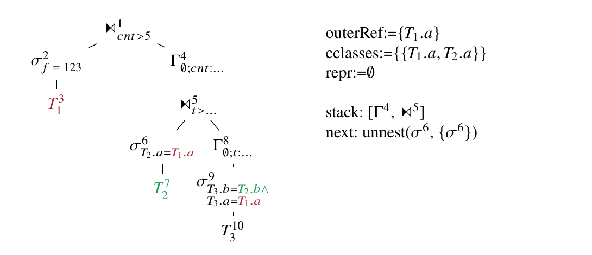

处理选择时，把选择隐含的等价条件加入 `cclasses`，从访问列表中移除选择，并递归到输入：

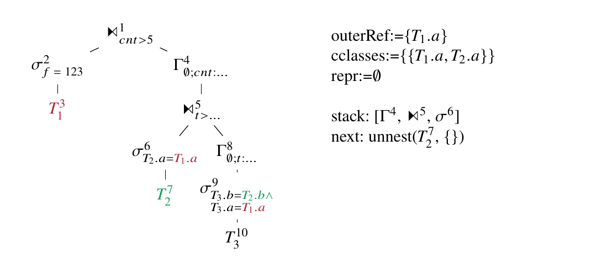

访问列表为空后有两种选择：引入

$$
D:=\Pi_{a:=T_1.a}(\sigma_{f=123}(T_1))
$$

并用它替换 $T_1.a$；或者利用所有外部列引用已在 `cclasses` 中绑定的事实，直接以等价的 $T_2.a$ 替换 $T_1.a$。最佳选择取决于 $\sigma^2$ 的选择性。这里假设该选择具有选择性，因此引入连接；随后弹栈至内层依赖连接，并沿途重写列。

另一侧以同样方式处理：递归越过 group by 和选择，从访问列表移除相应选择，并把约束加入等价类。这里再次需要在增加连接和使用替换之间选择。为展示另一种情形，假定优化器选择替换，于是在 `repr` 中加入 $T_1.a\rightarrow T_3.a$ 与 $T_2.b\rightarrow T_3.b$，并沿回溯路径重写列：

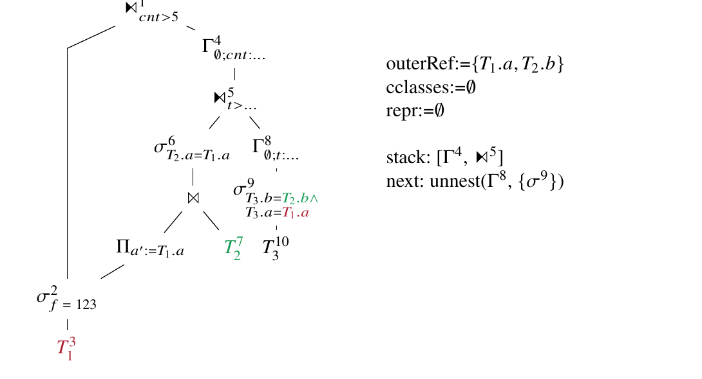

最终得到如下不含依赖连接的计划：

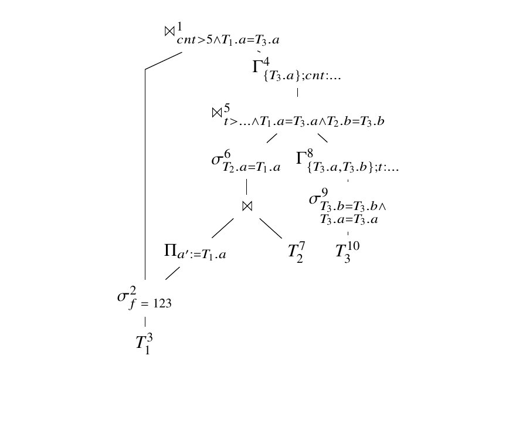

### 3.3 去嵌套规则

下面简述各算子的去嵌套规则。它们与 [NK15] 的下推规则类似，受篇幅限制只列出最重要部分。所有算子共享两条逻辑：

1. 调用 `unnest(op, info, accessing)` 时，如果 `accessing` 为空，就停止去嵌套，并以 `info.D ⋈ op` 替换 `op`，或者用 `info.cclasses` 中的等价列替换全部外部引用；
2. 递归到算子输入时，如有必要，从 `accessing` 中移除该算子。

这些公共代码不再逐处列出。

选择算子登记过滤条件，并在回溯时重写全部列：

```text
1  fun unnest(select, info, accessing):
2     add equivalences from select.predicate to info.cclasses
3     unnest(select.input, info, accessing)
4     rewriteColumns(select.condition, info)
```

map 算子只需在对输入去嵌套后重命名列：

```text
1  fun unnest(map, info, accessing):
2     unnest(map.input, info, accessing)
3     rewriteColumns(map.computations, info)
```

group by 算子先对输入去嵌套，再把外部引用加入分组属性。静态 group by 是特殊情形，即 `SELECT` 含聚合函数但没有 `GROUP BY`；此时空输入也必须产生非空输出，因此使用外连接（若系统支持，也可使用 group join [MN11]）：

```text
1  fun unnest(groupby, info, accessing):
2     static = groupby.groups is empty or groups.groupingsets contains ∅
3     unnest(groupby.input, info, accessing)
4     rewriteColumns(groupby, info)
5     for c in info.outerRefs:
6        add info.repr[c] to groupby.groups
7     if static:
8        replace groupby with info.D ⋈ groupy,
         joining on mapped info.outerRefs
```

窗口算子的处理在概念上与 group by 类似。必须把外部引用加入 `PARTITION BY`，从而为每种绑定分别计算窗口函数：

```text
1  fun unnest(window, info, accessing):
2     unnest(window.input, info, accessing)
3     rewriteColumns(window, info)
4     for c in info.outerRefs:
5        add info.repr[c] to window.partitionby
```

对连接算子，先检查是否遇到了另一个依赖连接，必要时合并两次消除。否则检查依赖访问是否只发生在一侧；若是，并且该连接类型无须跟踪连接伙伴数量，就像处理选择一样只递归到该侧。否则需要对两侧都去嵌套，并更新连接条件：

```text
1  fun unnest(join, info, accessing):
2     split accessing into accessingLeft and accessingRight for input of join

4     // Check if we have encounter another dependent join
5     if accessing(join) is not empty:
6        dJoinElimination(join, info, accessing)
7        return

9     // Check if only one side accesses outer columns
10    if accessingRight is empty and info.join cannot output unmatched from the right:
11       unnest(join.left, info, accessingLeft)
12       rewriteColumns(join.condition, info)
13       return
14    if accessingLeft is empty and info.join cannot output unmatched from the left:
15       unnest(join.right, info, accessingRight)
16       rewriteColumns(join.condition, info)
17       return

19    // Unnest both sides
20    unnestingLeft = new Unnesting(info.info)
21    unnestingRight = new Unnesting(info.info)
22    unnest(join.left, unnestLeft, accessingLeft)
23    unnest(join.right, unnestRight, accessingRight)
24    rewriteColumnsForJoin(join.condition, unnestingLeft, unnestingRight)
25    for c in info.outerRefs:
26       add "{unnestLeft.repr[c]} is not distinct from
         {unnestRight.repr[c]}" to join.condition
27    merge cclasses and repr from unnestLeft and unnestRight into info
```

连接需要不同的列重写逻辑，因为必须根据连接类型决定使用哪一侧的替换。左外连接会输出左侧未匹配行，因此使用左侧替换；右外连接使用右侧。全外连接必须逐行确定来源侧，可用如下表达式替换列：

```sql
COALESCE(unnestLeft.repr[c], unnestRight.repr[c])
```

## 4. 处理复杂 SQL 构造

[NK15] 和第 3.3 节的下推规则足以处理多数查询，但某些复杂 SQL 构造的去嵌套方式并不明显，尤其是全连接条件中的相关子查询、`WITH RECURSIVE`、公共表表达式（CTE）和 `ORDER BY ... LIMIT`。多数系统无法对这些构造去嵌套，而且关于递归去嵌套的研究也很少 [FGL24]。

### 4.1 对全连接条件中的相关子查询去嵌套

SQL 标准允许连接条件访问连接两侧的列，也允许任意表达式包含子查询。因此，连接条件可以包含一个同时引用连接左右两侧属性的子查询。

对于内连接或左外连接，可以把该子查询跨应用到连接的右输入，然后正常去嵌套；右外连接可通过交换两侧处理。全外连接更复杂：动态输入下“未匹配元组”的定义并不清晰，相关全外连接的语义也没有良好定义。因此，不能简单生成 `CROSS APPLY` 再照常去嵌套，而使用如下等价关系：

$$
R\mathbin{\Join^{\mathrm{full}}\relax_{p(T)}}S
\equiv
R\mathbin{\Join^{\mathrm{full}}\relax_{m\land(R.x\ \mathrm{IS}\ D_R.x)}}
\left(
S\mathbin{\Join^{\mathrm{left}}\relax_{m\land(S.y\ \mathrm{IS}\ D_S.y)}}
\chi_{m:p'}\left((D_R\times D_S)\mathbin{\Join^{\mathrm{dep}}}T\right)
\right).
$$

其中， $T$ 是连接条件中的单值子查询， $p$ 是引用子查询结果的连接条件； $D_R$ 与 $D_S$ 分别是 $R$、 $S$ 投影到 $p$ 与 $T$ 的自由变量（记为 $x$、 $y$）后得到的域； $p'$ 则把 $p$ 重映射为使用 $D_R$、 $D_S$ 中的列。

从内到外解释该等价树：

1. $\chi_{m:p'}((D_R\times D_S)\Join^{\mathrm{dep}}T)$ 为外部引用的每种可能绑定计算谓词；
2. $S$ 与谓词结果按 $m$ 做左外连接，保证来自 $S$ 的未匹配元组总共只产生一次，而匹配元组为来自 $R$ 的每种外部绑定产生一次；
3. 最外层与 $R$ 的全外连接按谓词结果 $m$ 产生最终结果。

内部子查询 $(D_R\times D_S)\Join^{\mathrm{dep}}T$ 仍需继续去嵌套。实现中不必先生成它再从头处理，而是直接对 $T$ 调用 `unnest`。此时使用稍作修改的 `UnnestingInfo`，保证域 $D$ 表示 $D_R$ 与 $D_S$ 的笛卡尔积，并在两个连接条件中加入相应的 `IS NOT DISTINCT FROM` 谓词。

### 4.2 对 `WITH RECURSIVE` 去嵌套

假定 `WITH RECURSIVE` 被翻译为 `iterate` 算子 [Pa17] 和对应的 `iteratescan`。DuckDB 将二者称为 `recursive_cte` 和 `recursive_cte_scan`。`iterate` 左侧计算基表，右侧反复求值直至为空，并通过 `iteratescan` 读取上一轮迭代：

```sql
WITH RECURSIVE REC(x) AS (
  SELECT x FROM R
  UNION ALL
  SELECT x + 1 FROM REC WHERE x < 5
)
SELECT x FROM REC;
```

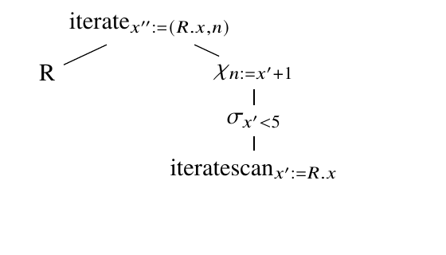

对该构造去嵌套时，概念上要为外部引用的每种可能绑定执行迭代。做法是把外部引用加入递归 CTE 的列，但还必须保证重复执行部分也按外部引用分区。因此，把当前迭代的所有 `iterationscan` 算子加入访问列表。这样去嵌套阶段会到达这些算子，把外部引用加入扫描，并沿途重写全部中间算子：

```text
1  fun unnest(iteration, info, accessing):
2     // Mark iteration scans as accessing
3     split accessing into accessingLeft and accessingRight for inputs of iteration
4     for s in iterationscans of iteration:
5        add s to accessingRight

7     // Unnest the seed side first to make the new columns available
8     unnestingLeft = new Unnesting(info.info)
9     unnest(iteration.left, unnestLeft, accessingLeft)
10    rewriteColumns(iteration.leftColumns, unnestingLeft)
11    for c in info.outerRefs:
12       add unnestLeft.repr[c] to iteration.leftColumns
13       info.repr[c]=unnestLeft.repr[c]

15    // Unnest the iteration side and add corresponding columns
16    unnestingRight = new Unnesting(info.info)
17    unnest(iteration.right, unnestRight, accessingRight)
18    for c in info.outerRefs:
19       add unnestRight.repr[c] to iteration.rightColumns

21 fun unnest(iterationscan, info, accessing):
22    // Add the new columns to the scan
23    i = iteration operator for iterationscan
24    for c in info.outerRefs:
25       cb = corresponding column for c in i.leftInput
26       add cn:=cb as produced column to iterationscan
27       info.repr[c]=cn
```

### 4.3 对 CTE 去嵌套

如果代数表达式不是树而是 DAG，就会出现另一类困难，CTE 正是如此。考虑：

```sql
SELECT *
FROM S
WHERE (
  WITH CTE AS (
    SELECT * FROM T
    WHERE T.y < S.x
  )
  SELECT COUNT(*)
  FROM CTE c1 JOIN CTE c2 ON c1.y = c2.y
) = 1;
```

初始 DAG 计划如下：

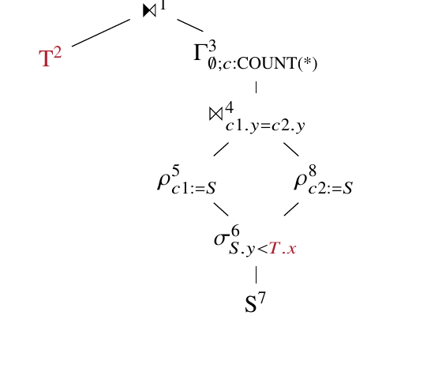

本例可忽略最上层单连接需要检查重复的事实，因为聚合结果无重复。执行第 3.1 节算法时，访问外部列的选择算子被加入最上层连接的访问列表。但处理下方连接时，无法再把访问列表拆分为左右两侧，因为共享选择可由两条路径到达。算法还会尝试两次去嵌套共享部分，重复加入域扫描。

更好的策略是把 DAG 切成一组树，使共享算子形成独立子树。在本例中，共享选择成为一棵新树的根，两个 CTE 读算子成为叶。收集访问算子时，检查它们是否位于同一棵树：若是，照常加入；否则，把所有共享读视为访问算子并重复该过程。另选一个共享读（例如 id 最小者），在去嵌套到达它时触发共享算子的去嵌套。

最终计划如下：

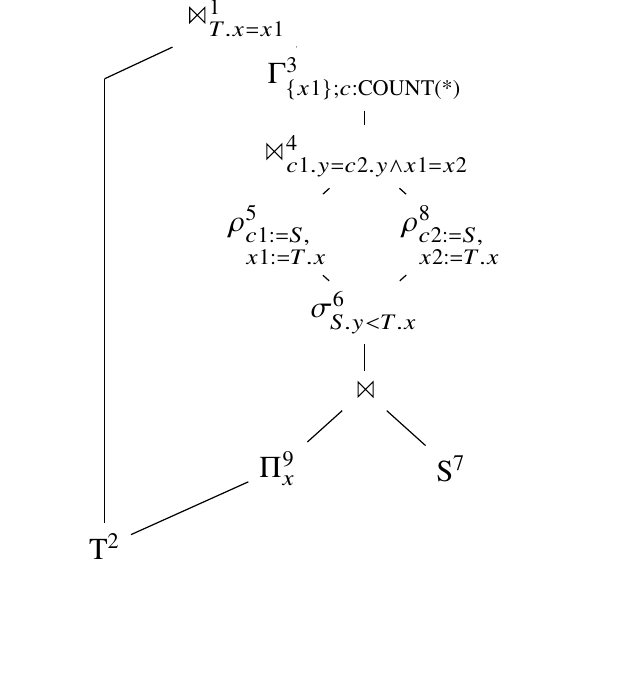

### 4.4 对 `ORDER BY LIMIT` 去嵌套

对含 `ORDER BY` 和 `LIMIT` 或 `OFFSET` 的子查询去嵌套时必须改写查询，因为限制现在要对外部绑定的每个值分别执行，而不是全局执行。Umbra 的排序算子原生支持该功能，因此处理很简单；其他系统可以把下面的子查询：

```sql
SELECT *
FROM S
ORDER BY x
LIMIT l OFFSET o;
```

改写为等价的窗口查询：

```sql
SELECT *
FROM (
  SELECT *, ROW_NUMBER() OVER (ORDER BY x) AS RN
  FROM S
) S
WHERE RN BETWEEN o + 1 AND l + o;
```

之后去嵌套就很直接：只需把外部引用作为 `PARTITION BY` 项加入 `OVER` 子句。

## 5. 评估

查询去嵌套通过消除依赖连接的二次运行时开销，改善了查询执行的渐近复杂度。因此，只须增大数据集就能展示任意大的性能收益，这使常规性能实验意义有限。为说明这一点，考虑图 1 的查询：在配备 Ryzen 9 7950X3D 和 128 GB RAM 的机器上，PostgreSQL 16 执行 TPC-H SF1 版本需要超过 26 分钟；应用本文算法后，PostgreSQL 在 1.3 秒内完成，提速超过 1000 倍。

比较 [NK15] 的原算法与新的自顶向下版本，也能观察到类似效果。实验在图 1 查询最后一个 `WHERE` 子句中加入 `c_comment = l_comment`，使其形状接近第 2.3 节的问题案例。在 Umbra 中，旧去嵌套逻辑会耗尽 120 GB 主存后终止；新的自顶向下版本在同一台机器上只需 33 毫秒。即使只与旧计划被取消前的时间相比，也至少快了几个数量级。

最后考察最初促成本文工作的 Sam Arch 查询，即 procbench 的 UDF Query 18 [GR21] 经 Apfel 转换后的结果 [FHG22]。[NK15] 的策略会耗尽内存，而新的自顶向下去嵌套使 Umbra 在 TPC-DS SF1 上以 251 毫秒完成查询。

## 6. 相关工作

最早的去嵌套规则是在 SQL 表示层进行的变换 [Ki82, JK84]。它们易于理解，也被多个商业数据库系统采用。Kim 最初的规则包含著名的计数错误，会在空输入时产生错误结果，后来由 Kiessling 修正 [Ki85]。根本问题在于，这些规则只能处理特定查询模式，无法覆盖全部情况。后续工作添加了更多规则，但仍不完整。

IBM 基于魔集的方法 [Se96] 通过引入与外部绑定域的半连接，能够缓解依赖连接的运行时问题，在概念上类似本文与 $D$ 的连接；但它没有提供完全消除依赖连接的机制。后来的推广在子查询含聚合函数时能够消除依赖连接 [Zu03]。

[NK15] 首次给出了完整方案，也是本文的基础。但它虽然在概念上完整，却没有描述所有 SQL 构造，并且会在依赖连接嵌套时遇到问题。本文解决了这两个局限。

近年来，机器生成的查询越来越多，其中一些生成器会产生相关子查询，因此自动去嵌套的重要性继续上升。一个近期例子是 Apfel 转译器 [FHG22]，它能把存储过程从 PSQL 转换为纯 SQL。这样既不必提供专门的 PSQL 实现，生成查询还比原 PSQL 代码更快；但前提是数据库系统能高效地对相关子查询去嵌套。

## 7. 结论

对相关子查询去嵌套是高效处理子查询的必要条件。消除相关关系会改善渐近复杂度，并很容易带来几个数量级的加速。本文扩展了我们之前的自底向上去相关方法，使其能正确处理嵌套依赖连接，并支持更广泛的 SQL 构造。新方法已经集成进 Umbra；我们希望 DuckDB、Postgres 等其他系统也会采用它。

## 致谢

感谢 Altan Birler 提供对含相关谓词的全外连接进行去嵌套的策略。

## 参考文献

- [FGL24] Fejza, Amela; Genevès, Pierre; Layaïda, Nabil. “Efficient Enumeration of Recursive Plans in Transformation-based Query Optimizers.” *Proceedings of the VLDB Endowment*, 17(11):3095–3108, 2024.
- [FHG22] Fischer, Tim; Hirn, Denis; Grust, Torsten. “Snakes on a Plan: Compiling Python Functions into Plain SQL Queries.” In *SIGMOD ’22: International Conference on Management of Data*, Philadelphia, PA, USA, June 12–17, 2022. ACM, pp. 2389–2392, 2022.
- [FMN23] Fent, Philipp; Moerkotte, Guido; Neumann, Thomas. “Asymptotically Better Query Optimization Using Indexed Algebra.” *Proceedings of the VLDB Endowment*, 16(11):3018–3030, 2023.
- [Fr24] Franz, Kai; Arch, Samuel; Hirn, Denis; Grust, Torsten; Mowry, Todd C.; Pavlo, Andrew. “Dear User-Defined Functions, Inlining isn’t working out so great for us. Let’s try batching to make our relationship work. Sincerely, SQL.” In *CIDR 2024*, Chaminade, HI, USA, January 14–17, 2024, 2024.
- [G.20] Moerkotte, Guido. *Building Query Compilers*. http://pi3.informatik.uni-mannheim.de/~moer/querycompiler.pdf, 2020.
- [GR21] Gupta, Surabhi; Ramachandra, Karthik. “Procedural Extensions of SQL: Understanding their usage in the wild.” *Proceedings of the VLDB Endowment*, 14(8):1378–1391, 2021.
- [JK84] Jarke, Matthias; Koch, Jürgen. “Query Optimization in Database Systems.” *ACM Computing Surveys*, 16(2):111–152, 1984.
- [Ki82] Kim, Won. “On Optimizing an SQL-like Nested Query.” *ACM Transactions on Database Systems*, 7(3):443–469, 1982.
- [Ki85] Kießling, Werner. “On Semantic Reefs and Efficient Processing of Correlation Queries with Aggregates.” In *VLDB’85*, Stockholm, Sweden, pp. 241–250, 1985.
- [MN11] Moerkotte, Guido; Neumann, Thomas. “Accelerating Queries with Group-By and Join by Groupjoin.” *Proceedings of the VLDB Endowment*, 4(11):843–851, 2011.
- [Ne24] Neumann, Thomas. “A Formalization of Top-Down Unnesting.” 2024. https://arxiv.org/abs/2412.04294.
- [NK15] Neumann, Thomas; Kemper, Alfons. “Unnesting Arbitrary Queries.” In *Datenbanksysteme für Business, Technologie und Web (BTW 2015)*, volume P-241 of LNI. GI, pp. 383–402, 2015.
- [NLK17] Neumann, Thomas; Leis, Viktor; Kemper, Alfons. “The Complete Story of Joins (in HyPer).” In *Datenbanksysteme für Business, Technologie und Web (BTW 2017)*, volume P-265 of LNI. GI, pp. 31–50, 2017.
- [Pa17] Passing, Linnea; Then, Manuel; Hubig, Nina C.; Lang, Harald; Schreier, Michael; Günnemann, Stephan; Kemper, Alfons; Neumann, Thomas. “SQL- and Operator-centric Data Analytics in Relational Main-Memory Databases.” In *EDBT 2017*, Venice, Italy, pp. 84–95, 2017.
- [Se96] Seshadri, Praveen; Hellerstein, Joseph M.; Pirahesh, Hamid; Leung, T. Y. Cliff; Ramakrishnan, Raghu; Srivastava, Divesh; Stuckey, Peter J.; Sudarshan, S. “Cost-Based Optimization for Magic: Algebra and Implementation.” In *SIGMOD 1996*, Montreal, Quebec, Canada, pp. 435–446, 1996.
- [Zu03] Zuzarte, Calisto; Pirahesh, Hamid; Ma, Wenbin; Cheng, Qi; Liu, Linqi; Wong, Kwai. “WinMagic: Subquery Elimination Using Window Aggregation.” In *SIGMOD 2003*, San Diego, California, USA, pp. 652–656, 2003.
