# Interleaved Multi-Vectorizing（中文译文）

## 译者说明

本文依据同目录的 `source.pdf` 翻译。章节、图表、公式、算法、代码与参考文献按原文结构保留。

## 作者

Zhuhe Fang、Beilei Zheng、Chuliang Weng

华东师范大学数据科学与工程学院，中国

联系邮箱：`{zhfang, zhengbeilei}@stu.ecnu.edu.cn`，`clweng@dase.ecnu.edu.cn`。Chuliang Weng 为通讯作者。

PVLDB 引用信息：Zhuhe Fang、Beilei Zheng、Chuliang Weng，*Interleaved Multi-Vectorizing*，PVLDB 13(3)：226-238，2019。DOI：[10.14778/3368289.3368290](https://doi.org/10.14778/3368289.3368290)。

## 摘要

SIMD 是主流处理器中的指令集，可提供数据级并行性以加速应用。然而，当应用遭遇大量缓存未命中时，SIMD 优势会削弱。为消除 SIMD 向量化中的缓存未命中，本文提出交错多向量化（interleaved multi-vectorizing，IMV）。IMV 交错执行多个向量化代码实例，用更多计算隐藏内存访问延迟。我们还提出 residual vectorized states，用于解决向量化中的控制流分歧。

IMV 可以同时充分利用 SIMD 的数据并行性，以及通过预取获得的内存级并行性。它减少缓存未命中、分支未命中和计算开销，从而显著加速 pointer-chasing 应用，并可应用于整个查询流水线执行。实验表明，相比纯标量实现和纯 SIMD 向量化，IMV 最高分别提升 4.23 倍和 3.17 倍。

## 1. 引言

SIMD（Single Instruction Multiple Data）是现代处理器上的指令集。通过 SIMD，一条指令可以并行作用于多个数据点，而不是执行多条指令。随着向量宽度增加，SIMD 提供更高数据并行性；最新 AVX-512 可达 512 位。数据库、图和其他领域已经广泛研究用 SIMD 加速 join、partitioning、sorting、Bloom filter、selection 和 compression 等操作 [28, 9, 29, 13, 14]。这些操作通过 SIMD 向量化降低计算开销和分支未命中。

但当操作频繁访问内存数据时，例如探测哈希表、探测 Bloom filter 和搜索树 [28, 17]，SIMD 收益会下降。原因是这些操作在大数据集超过处理器缓存时受内存访问延迟主导。虽然 SIMD 可在一个向量中发出更多内存访问，但由于 SIMD lockstep 执行，即使向量中某些元素命中缓存，它们也必须等待其他元素的缓存未命中完成。CPU 与内存速度差距扩大也会使这个瓶颈更严重；SIMD 加速的是 CPU 处理而非数据访问本身。

我们用链式哈希表上的 hash join probe 展示内存访问的影响，硬件和工作负载设置留到第 5.1 节说明。哈希表大小从 0.5 MB 到 2 GB，probe 表包含 800 MB 数据，两张表均按 Zipf 因子 1 生成。我们采用当时最先进的完全向量化方法向量化链式哈希表 probe，并与其标量版本比较；实验只使用单线程，以排除多线程影响。

如图 1 所示，随着哈希表增大，SIMD probe 的吞吐与朴素标量 probe 相近。二者吞吐先显著下降，直到哈希表大小接近缓存容量（约 12 MB）；超过该点后，随着数据继续增大，吞吐因大量缓存未命中而缓慢下降。在标量代码中，软件预取可有效减少这类未命中，即手工插入预取指令，提前把数据载入缓存。GP 和 SPP [6] 可以通过预取改善 hash join，但不能很好处理不规则数据访问，因此出现了 AMAC [20]。不规则访问在哈希表 probe、树或图遍历等 pointer-chasing 应用中十分常见。本文也用 AMAC 加速链式哈希表 probe；图 1 表明，在大型哈希表上，AMAC 可以把 probe 吞吐提高一倍。

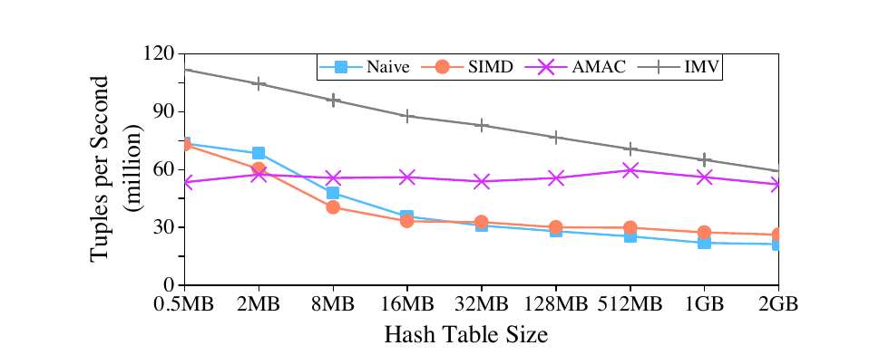

此前工作没有研究缓存未命中对 SIMD 操作的影响。一部分工作重新安排数据布局，以提高数据局部性并利用硬件预取 [14, 32, 18]。另一些工作只初步采用软件预取：例如 SPP 在树遍历时预取数据，但这些路径深度一致 [18]，无法处理不规则访问；还有工作把软件预取用于顺序访问 [7, 15]，只能略微减少缓存未命中。ROF [26] 在完整查询计划中连接 SIMD 优化代码和预取优化代码，而不是在一个算子内部充分结合二者，因此只能在一定程度上改善性能，不能让算子同时获得 SIMD 与预取的收益。

把 GP、SPP、AMAC 与 SIMD 直接结合看似自然，但会遇到控制流分歧带来的向量 bubble。例如，一个向量中的多个元组并行探测不同哈希桶，其中部分元组可能因桶链较短提前结束，后续处理时相应 lane 空闲。完全向量化 [28] 可以填满空闲 lane，但老元组和新元组为了保持同步可能重复某些步骤，仍浪费 lane；更严重的是，它难以处理一般 `if` 和循环语句中的多个有效分支。

因此，直接或完全地把 SIMD 与预取优化技术结合，既不能充分利用向量，也不能适用于一般情形。本文提出 IMV：以交错方式运行多个向量化代码实例。某个实例遇到即时内存访问时，发起数据预取并切换到其他运行实例，尝试用其他实例的计算覆盖内存访问。我们还引入 residual vectorized states：当某个状态中的向量不满时，它与该点的 residual state 合并，使向量变满后继续，或者变空后重启。这样分歧状态不会影响后续执行，所有实例可充分利用向量 lane。

本文贡献如下：

1. 我们首次全面研究如何减少 SIMD 向量化中的缓存未命中。把预取引入 SIMD 向量化，可以同时利用数据级与内存级并行性，而且不只适用于单个算子，也适用于查询流水线。
2. 我们直接或完全地用 SIMD 向量化加速已有预取优化技术，并发现这两种方法既不能很好解决控制流分歧，也不能普遍应用于 `if` 和循环语句。
3. 我们提出交错多向量化 IMV，把 SIMD 向量化与预取结合起来。
4. 我们提出 residual vectorized state，在 IMV 中解决控制流分歧，并使其可以处理一般的 `if` 和循环语句。
5. 我们在 CPU 处理器与 Phi 协处理器上进行了全面实验。结果表明，相比纯标量实现和纯向量化，IMV 最高分别快 4.23 倍和 3.17 倍。

后文第 2 节介绍 SIMD 向量化与预取背景；第 3 节分析如何把 SIMD 与既有预取优化技术结合；第 4 节给出 IMV 和用于处理控制流分歧的 residual vectorized state；第 5 节进行实验评测；第 6 节讨论复杂查询中的 IMV 与自动化；第 7 节介绍相关工作；第 8 节总结。

## 2. 背景

### 2.1 SIMD 向量化

现代处理器提供 SIMD 指令，让一条指令处理多个数据元素。AVX-512 中一个向量可有 8 个 64 位整数 lane。SIMD 不仅减少计算开销，还可在某些场景中把控制流转成数据流以避免分支 [13]。例如，对简单 `if`，SIMD 可以执行所有分支再按条件合并结果。

原文所用 AVX-512 指令可查阅 [Intel Intrinsics Guide](https://software.intel.com/sites/landingpage/IntrinsicsGuide/)。

SIMD 还提供便于内存访问和数据重排的指令。`gather` 从非连续地址选择性读取数据到向量，`scatter` 执行反向操作。AVX512PF 支持 gather/scatter 的预取。`compress` 按 mask 把活跃元素连续打包到目标向量；`expand` 把连续元素存入另一个向量的指定位置。

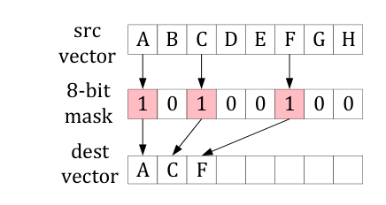

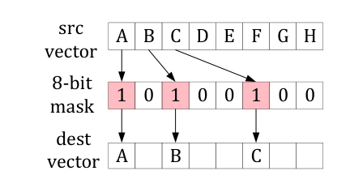

已有工作 [28] 给出完全向量化主存数据库操作的原则：只有当向量化版本执行 $O(f(n)/W)$ 条向量指令，而不是 $O(f(n))$ 条标量指令时，算法才算完全向量化，其中 $W$ 是向量长度。这个定义排除了随机内存访问，因为每周期执行 $W$ 个缓存访问是不现实的硬件设计。因此，对内存密集型操作实现完全向量化很困难。

### 2.2 预取

处理器速度与内存速度差距不断扩大，形成 memory wall [25][34]。缓存可缓解该问题，但缓存未命中成本高，通常约 80ns 到 200ns。Miss Status Holding Register（MSHR）或 Line Fill Buffer（LFB）等硬件结构 [20, 19] 用于跟踪未完成缓存未命中；一般每核有 6-10 个 L1 MSHR，允许 6-10 个 in-flight 内存请求，形成内存级并行性（MLP）。具体而言，Intel Skylake 有 10 个 L1 MSHR 和 16 个 L2 MSHR。但由于指令依赖，当前软件通常不能充分使用这些结构。

在某些情况下，硬件预取和分支预测后的推测执行可以缓解指令依赖。硬件预取能检测并预取规则步长访问模式，但无法处理更复杂的访问，尤其是随机访问；推测执行可以提前发出更多但数量有限的指令，其中可能包含内存访问，但预测错误会浪费内存带宽。总体而言，这两种技术在大多数情形下仍不能充分使用可用 MSHR。

软件预取是充分利用 MLP 的实用方法：程序在数据需要前主动发出内存请求，把数据从内存搬到缓存。预取请求应领先多远由程序控制，称为预取距离。若距离太短，所请求数据还没进入缓存；若距离太长，数据可能已经被逐出；两种情况都会降低软件预取效果。当数据地址可提前知道时，例如顺序访问或根据已知索引查找，合适的预取距离可以消除缓存未命中。

对 pointer-chasing 应用，如跳表、哈希表查找和树搜索，下一节点地址在当前节点处理前未知。知道地址到真正需要数据之间的时间远短于理想预取距离。本文把这种访问称为 immediate memory access。它只能通过任务间并行 [21] 受益于软件预取：任务发出预取后不继续等待，而切换到其他任务，稍后再回来处理预取结果。

GP、SPP 和 AMAC [6, 20] 都基于这一思想。它们共同启动 $G$ 个处理不同输入的相同任务，并把每个包含 $N$ 次依赖内存访问的任务切成 $N+1$ 个代码阶段；每个阶段消费上一阶段预取的数据，再为下一阶段发起新预取。三者的区别是如何交错这些阶段：group prefetching（GP）[6] 反复按阶段成组执行来自 $G$ 个任务的同类阶段；software-pipelined prefetching（SPP）[6] 把 $G$ 个任务放入软件流水线；asynchronous memory access chaining（AMAC）[20] 则把 $N+1$ 个阶段编码成有限状态机（FSM），由 $G$ 个 FSM 实例独立、循环交错推进。GP/SPP 把阶段耦合到 group 或 pipeline，面对不规则访问不够灵活；AMAC 更适合 pointer chasing 的 immediate memory access。

## 3. 结合预取与 SIMD

此前研究通常用 SIMD 或预取优化单个算子，而不是完全结合两者。在一个算子中结合 SIMD 与预取，理论上可同时降低分支误预测、计算开销和缓存未命中。直接方案是把 SIMD 应用于现有预取优化技术。预取技术包括 GP、SPP 和 AMAC；SIMD 可直接使用或完全使用，因此共有六种组合。论文重点以 AMAC 为例分析。

分析对象是 hash join probe，一个典型 pointer-chasing 应用。它与提出 AMAC 的论文 [20] 所用 probe 相似：probe 使用链式哈希表，每个桶可能因冲突包含多个节点，每个节点由元组和 next 指针组成。probe 过程有两步：计算外侧元组 join key 的哈希，找到对应桶；然后迭代比较桶链中节点的 join key。对桶链的多次匹配导致随机访问，是性能瓶颈。

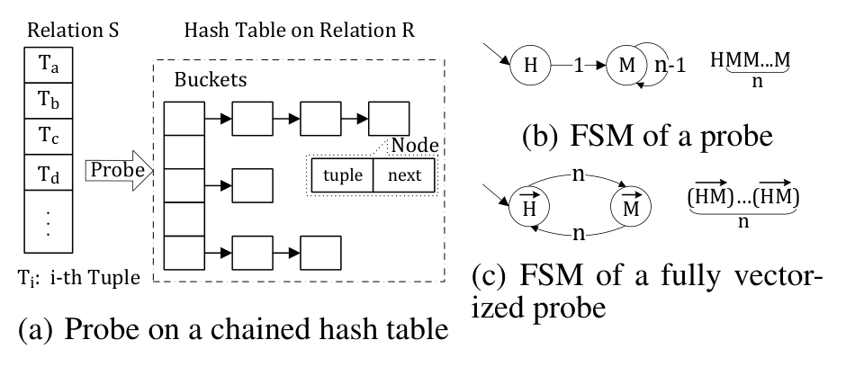

### 3.1 预取中的直接向量化

AMAC 把过程逻辑映射为 FSM，状态由 immediate memory access 分隔，然后交错多个 FSM 实例。直接向量化 AMAC（DVA）把每个 FSM 状态向量化。SIMD 处理的是一个元组 batch，batch 大小等于向量 lane 数 $W$。一个向量化状态只有在该状态中 batch 的所有元组都处理完时才结束；即使只剩一个元组未完成，该状态仍然活跃。

原文清单 1 的 DVA probe 结构如下（ $G$ 为交错实例数， $W$ 为向量宽度）：

**代码清单 1：直接向量化的 AMAC probe。**

```c
struct fsm_t {v_key, v_payload, v_ptr /* ptr of bucket nodes*/, state};
void dva_probe(tuple_t* tuple, hashtable_t* ht, table_t* out){
    fsm_t fsm[G]; all_done = 0;
    while(all_done < G) {
        k = (k == G) ? 0 : k;
        switch (fsm[k].state) {
        case H:{ // hash the input key, prefetch buckets
            if(i < tuple_num) {
                fsm[k].v_key = load(tuple[i].key);
                v_hashed = HASH(fsm[k].v_key);
                fsm[k].v_ptr = ht->buckets + v_hashed;
                v_prefetch(fsm[k].v_ptr);
                fsm[k].state = M;
                i += W; // suppose tuple_num % W = 0
            } else {
                fsm[k].state = D; // the fsm is done
                ++all_done;
            }
        }break;
        case M:{ // match join keys, prefetch next bucket nodes
            m_match = fsm[k].v_ptr->v_key == fsm[k].v_key;
            out[num] = store(fsm[k].v_ptr->v_payload, m_match);
            num += |m_match|;
            m_valid = fsm[k].v_ptr->next == v_null;
            if(m_valid) {
                v_prefetch(fsm[k].v_ptr->next, m_valid);
                fsm[k].v_ptr = (fsm[k].v_ptr->next, m_valid);
            } else {
                fsm[k].state = H; // initiate new probe in H
            }
        }break;
        }
        ++k;
    }
}
```

清单 1 中，每个向量变量带有 `v_` 前缀。DVA 在各状态中以 lockstep 方式处理一个元组 batch。哈希状态先装入 $W$ 个元组、计算哈希值、预取所需 hash bucket 节点，然后转入匹配状态；匹配状态迭代比较 join key，并预取下一批 bucket 节点。当前 $W$ 个元组的全部匹配结束后，它才能返回哈希状态。

这种 lockstep 处理在哈希桶长度不同时产生 inactive lanes。某些元组提前完成匹配，其 lane 在后续匹配状态中空闲，形成 bubble。DVA 可以交错多个向量实例以覆盖部分内存访问，但仍浪费大量 lane。

图 5(a) 给出具体过程：group size 为 2、每个向量 4 个 lane，元组 $T _ a$ 至 $T _ h$ 对应桶链长度依次为 1、2、1、3、1、1、2、1。到 $M _ 6$ 时， $T _ a$、 $T _ b$、 $T _ c$ 已完成，左侧向量只有 $T _ d$ 的 lane 仍活跃，另外三个 lane 成为 bubble。最坏情况下一个向量只剩一个活跃 lane，向量执行退化为标量，同时 inactive lane 也不再发出有用内存访问，DLP 与 MLP 都受损。直接向量化 GP/SPP 更严重：若某个实例提前结束，对应整个向量不能立即装入新元组；例如图中 GP 必须把 $H _ 7$ 推迟到下一轮，并让一个空向量继续 matching。

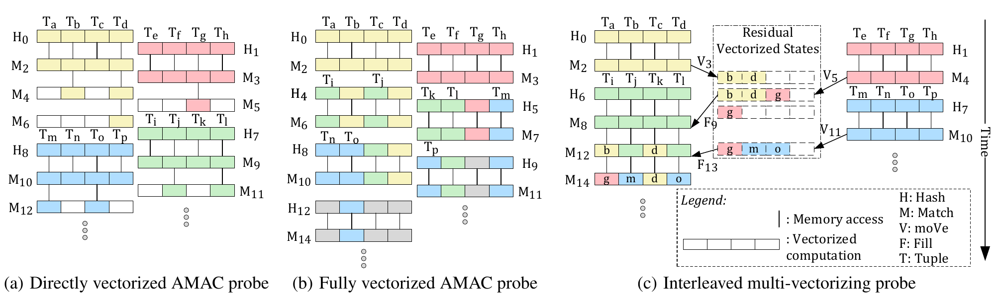

GP 和 SPP 的直接向量化更糟，因为它们把多个阶段耦合成组或流水线。若某个运行实例提前结束，相应整个向量可能空闲，无法立即装载新元组继续。

### 3.2 预取中的完全向量化

完全向量化 [28, 29] 尝试通过把空闲 lane 填入新元组来避免 bubble。对 hash join probe，可把 FSM 从 $H M M \ldots M$ 改写为重复的 $H M$ 结构，使所有状态定期出现，并在 lane 空闲时引入新元组。这能保持向量占满。

完全向量化 AMAC（FVA）在每次 $M$ 后总回到 $H$，由 $H$ 只向无效 lane 装入新 key：

**代码清单 2：完全向量化的 AMAC probe。**

```c
struct fsm_t {v_key, v_payload, v_ptr, state, m_valid};
void fva_probe(tuple_t* tuple, hashtable_t* ht, table_t* out){
    fsm_t fsm[G]; all_done = 0;
    while(all_done < G) {
        k = (k == G) ? 0 : k;
        switch (fsm[k].state) {
        case H:{ // hash the input key, prefetch buckets
            if(i < tuple_num) {
                fsm[k].v_key = load(tuple[i].key, !fsm[k].m_valid);
                v_hashed = HASH(fsm[k].v_key);
                v_ptr = ht->buckets + v_hashed;
                fsm[k].v_ptr = (v_ptr, !fsm[k].m_valid);
                v_prefetch(fsm[k].v_ptr);
                fsm[k].state = M;
                i += |!fsm[k].m_valid|;
                fsm[k].m_valid = !fsm[k].m_valid || fsm[k].m_valid;
            } else {
                fsm[k].state = D; // the fsm is done
                ++all_done;
            }
        }break;
        case M:{ // match join keys, prefetch next bucket nodes
            m_match = fsm[k].v_ptr->v_key == fsm[k].v_key;
            out[num] = store(fsm[k].v_ptr->v_payload, m_match);
            num += |m_match|;
            fsm[k].m_valid = fsm[k].v_ptr->v_next == v_null;
            fsm[k].v_ptr = (fsm[k].v_ptr->v_next, fsm[k].m_valid);
            fsm[k].state = H; // add new probe in H
        }break;
        }
        ++k;
    }
}
```

但完全向量化仍有两个问题。第一，新老元组可能处于不同逻辑阶段，为了同步，新元组或旧元组需要重复某些步骤，浪费计算。第二，它难以处理一般控制流，特别是存在多个有效分支的 `if` 和循环。完整填充 lane 并不等于充分使用 lane。

图 5(b) 中， $T _ a$、 $T _ c$ 在 $M _ 2$ 后结束，空出的 lane 被 $T _ i$、 $T _ j$ 填入，因此表面上没有 bubble；代价是每轮 match 后都重新执行 hash。元组 $T _ d$ 只有三次匹配，却执行三次 hash，后两次完全冗余。对更复杂的 FSM，问题还会递归放大：若串行状态 $A B C D E F$ 在 $C$、 $E$ 都分歧，从 $E$ 回到 $A$ 填 lane 后再次到 $C$ 又可能分歧，来自不同阶段的有效 lane 必须分别保护并重复步骤。一般多分支 `if` 也不能把进入其他合法分支的 lane 当作无效 lane 覆盖，因此无法真正填满单一分支。GP/SPP 的完全向量化同样能消除空 lane，却会引入相同冗余 hash，复杂 FSM 下的成组或流水线约束还更难处理。

## 4. 交错多向量化

IMV 的核心思想是把向量化程序划分为多个状态。状态边界出现在 immediate memory access 或控制流分歧处。多个运行实例交错执行这些状态：当某个实例即将等待内存时，它发出预取，然后 CPU 切换到其他实例继续执行。这样，某个实例的内存访问延迟可被其他实例的计算覆盖。

与 AMAC 相比，IMV 的状态内部是 SIMD 向量化的；与普通 SIMD 相比，IMV 利用预取和交错执行增加 MLP；与完全向量化相比，IMV 使用 residual vectorized state 处理分歧，避免重复步骤和 bubble。

### 4.1 交错执行

现代处理器用同时多线程（SMT/HT）在一个物理核上运行多个逻辑线程：一个线程因内存访问停顿时，另一个线程可以使用执行单元。然而主流 CPU 通常每核只有两个逻辑线程，对内存密集型应用不足以完全隐藏延迟；向量化线程虽然一次发出更多访问，也没有消除这个缺口。因此，IMV 在软件层再交错更多指令流。

交错执行要求能高效暂停和恢复指令流。一种选择是协程 [19, 16, 31]，但论文写作时协程尚未进入 C++ 标准，正审议作为 C++20 的一部分；已有实验实现 [16, 31] 对 pointer-chasing 也没有超过 GP 或 AMAC。IMV 采用另一种方式，即交错 FSM [20]：手工实现暂停与恢复。程序在 immediate memory access 处分成状态；一个状态发出软件预取后，把上下文保存到循环数组并暂停，再从数组恢复另一个 FSM 实例的上下文。状态切换的成本低于一次内存停顿，因此不同实例的计算可覆盖未完成访问。

### 4.2 划分向量化程序的状态

按照交错 FSM 原则，每个向量化程序被拆成一系列状态，形成 vectorized FSM。一个状态以预取请求结束后，不立即运行自己的下一状态，而是切换到同组另一个实例。每个实例独立保存上下文。组规模必须足够大，使交错计算能覆盖内存延迟；其最佳值在第 5 节实验确定。

仅在内存访问处分割仍无法解决第 3 节的控制流分歧：不满的向量无论向前继续还是回退补充，都会降低 DLP 与 MLP。问题本质是当前不满向量污染后续处理。因此 IMV 还在每个分歧点把状态继续切小，并在状态内部用 residual vectorized state 消化分歧。这样任何分歧状态传给下一状态的向量都只会是满或空。

### 4.3 残余向量化状态（Residual Vectorized State）

控制流分歧会让向量中只有部分 lane 继续执行某个分支。IMV 为每个可能产生分歧的状态维护一个 residual vectorized state。当前运行实例进入分歧状态后，如果活跃 lane 不满，就把它们与该状态残留的 lane 合并。合并后若向量满，则继续执行该状态后续逻辑；若不满，则把当前 lane 保存在 residual state 中，等待其他实例后续填充。

原文算法可写为：

**代码清单 3：DVS 与 RVS 的整合。**

```text
if(DVS_active_lane_cnt + RVS_active_lane_cnt < vector_size) {
    DVS = compress(DVS); // left packing valid lanes in DVS
    RVS = expand(RVS, DVS); // filling RVS
    // return to a previous state to restart new execution
} else {
    DVS = expand(DVS, RVS); // filling DVS
    RVS = compress(RVS); // left packing valid lanes in RVS
    // go to its original next state
}
```

这种机制把分歧局部化。一个状态的分歧不会传播到后续状态；后续状态看到的仍是满向量或空向量。Residual state 在同一组运行实例之间共享，因此不需要为每个实例维护大量独立向量。

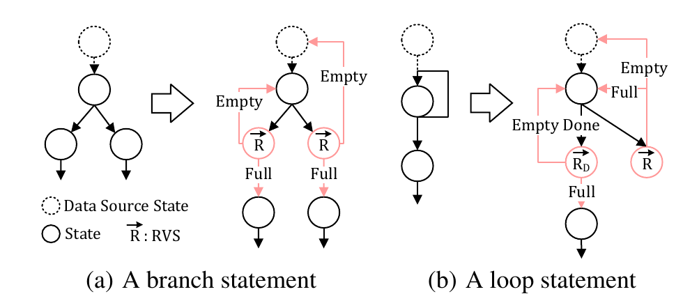


对于一般 `if`，条件求值后可能有多个分支需要执行；进入每个分支前用 RVS 更新分歧状态。满向量继续，空向量返回最近的数据源状态。若分支内部又有复杂 `if` 或循环，可把填满的状态放入任务队列，交给空闲实例执行。对于一般循环，每次迭代后产生的分歧状态也以同样方式和 RVS 合并。RVS 的时空开销很小：每个分歧状态只有一个 RVS，由一组 FSM 实例共享；所有权随当前运行实例切换，读写仍是串行的，不会冲突，且合并只涉及寄存器向量操作。

### 4.4 示例分析

IMV 的关键思想是交错执行一个 FSM 的多个运行实例中的向量化状态，每个实例独立处理一批数据，因此 IMV 可用于数据库的 once-a-batch 执行模型。它尤其可以加速跳表遍历、树搜索和哈希表查找等 pointer-chasing 应用；也可以直接加速查询流水线中的一系列算子，形成完全 SIMD 向量化的执行模型。下面分别以 hash join probe 和查询流水线说明其工作方式。

在链式哈希表 probe 中，IMV 把计算哈希、访问桶、匹配节点、访问 next 节点等步骤划分为状态。访问桶或 next 节点前发出预取，然后切换实例。匹配状态可能因不同桶链在不同时间结束而产生分歧；residual state 负责把仍需继续探测的 lane 打包成满向量。

IMV probe 的 FSM 包含 hashing 状态 $H$、matching 状态 $M$ 和匹配状态的 RVS。 $H$ 装入一个向量的输入 key，计算哈希，得到 bucket 指针并预取； $M$ 比较 key、输出匹配 payload，并读取 next 指针。匹配后在可能分歧的位置合并 RVS：若向量仍满，则预取下一批节点并继续 $M$；若变空，则直接切换回 $H$ 装入新元组。若哈希表存在大量空 bucket，还应在 $H$ 后增设检查有效 bucket 的状态，论文伪代码为简洁而省略。

清单 4 相比 DVA 只增加共享的 `RVS` 和 matching 后的 `integration`：

**代码清单 4：交错多向量化 probe。**

```c
struct fsm_t {v_key, v_payload, v_ptr, state, m_valid};
void imv_probe(tuple_t* tuple, hashtable_t* ht, table_t* out){
    fsm_t fsm[G], RVS; all_done = 0;
    while(all_done < G) {
        k = (k == G) ? 0 : k;
        switch (fsm[k].state) {
        case H:{ // hash the input key, prefetch buckets
            if(i < tuple_num) {
                fsm[k].v_key = load(tuple[i].key);
                v_hashed = HASH(fsm[k].v_key);
                fsm[k].v_ptr = ht->buckets + v_hashed;
                v_prefetch(fsm[k].v_ptr);
                fsm[k].state = M;
                fsm[k].m_valid = 0xFF;
                i += W; // suppose tuple_num % W = 0
            } else {
                fsm[k].state = D; // the fsm is done
                ++all_done;
            }
        }break;
        case M:{ // match join keys, prefetch next bucket nodes
            m_match = fsm[k].v_ptr->v_key == fsm[k].v_key;
            out[num] = store(fsm[k].v_ptr->v_payload, m_match);
            num += |m_match|;
            fsm[k].m_valid = fsm[k].v_ptr->next == v_null;
            integration(fsm[k], RVS);
            if(fsm[k].state==M) {
                v_prefetch(fsm[k].v_ptr->next, fsm[k].m_valid);
            } else {
                k = k-1; // directly shift to H
            }
        }break;
        }
        ++k;
    }
}
```

图 5(c) 展示了执行过程，其数据分布与图 5(a) 相同，主要差别在 integration。 $M _ 2$ 后， $T _ a$ 和 $T _ c$ 结束，对应的两个向量 lane 中只剩 $T _ b$ 和 $T _ d$ 活跃；此时它们被移入 matching 状态的 RVS，完全空出的向量立即装入后续元组 $T _ i$ 至 $T _ l$。 $M _ 4$、 $M _ {10}$ 后发生类似情况。 $M _ 8$ 后， $T _ j$ 和 $T _ l$ 的两个活跃 lane 加上 RVS 中三个活跃 lane，足以填满一个向量，因此 $T _ b$ 和 $T _ d$ 被重新装入向量；随后发出预取，再执行 $M _ {12}$。 $M _ {14}$ 也发生类似情况。相较图 5(a) 的 DVA 和图 5(b) 的 FVA，图 5(c) 表明 IMV 充分利用了 DLP 与 MLP。

IMV 也能覆盖整个查询流水线。图 8 的示例是 $\mathrm{Scan} \to \mathrm{Filter} \to \mathrm{Probe} \to \mathrm{Count}$：过滤后的向量因选择率产生分歧，因此附加一个 RVS；哈希后的 matching 循环既访问内存又在每轮分歧，因此在匹配前放置预取状态、匹配后放置另一 RVS。只有预取状态触发跨 FSM 实例的交错切换，两个 RVS 则在当前实例内部转移状态。

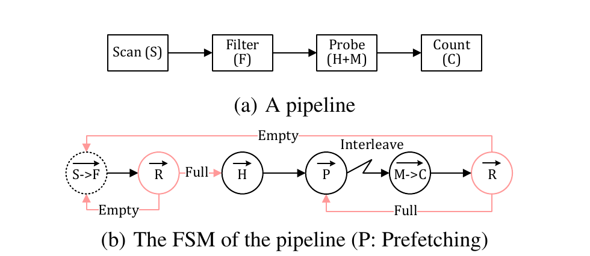

## 5. 实验评测

实验先在四个独立算子上比较 Naive 标量、纯 SIMD、AMAC、DVA、FVA 和 IMV，再在 Xeon Phi 上评测，最后把 IMV 用于完整查询并同三种查询执行模型比较。

### 5.1 实验设置

平台一是两颗 Skylake 架构 Intel Xeon Silver 4110（SKX），平台二是 Intel Knights Landing 7210（KNL）。代码由 GCC 6.4.0 以 `-O3` 编译，线程绑核以排除调度开销；软件预取使用 `_mm_prefetch(..., _MM_HINT_T0)`。实验代码公开在参考文献 [1]。

表 1：硬件配置细节（原文 Table 1）

| 项目 | SKX | KNL |
|---|---|---|
| 核心数 | 8 | 64 |
| 线程 | 2 threads/core | 4 threads/core |
| 频率 | 2.10 GHz | 1.05 GHz |
| L1d/L1i cache | 32 KB / 32 KB | 32 KB / 32 KB |
| L2 cache size | 1 MB | 1 MB |
| L3 cache size | 11 MB | NA |
| 内存容量 | 150 GB | 96 GB |
| 2 MB huge pages 的 L1 TLB entries | 32 | 128 |
| SIMD | 512 bits | 512 bits |

独立算子使用按文献 [4] 方法生成的两个合成关系 $R$ 和 $S$。每个元组含 8 字节整数 key 与 8 字节整数 payload；通过 Zipf 因子控制均匀或倾斜分布，两个关系的 Zipf 因子记为 $[Z _ R, Z _ S]$，且 $\mathrm{Zipf} \in [0,1]$，其中 $[0,0]$ 表示均匀分布。 $S$ 的 key 落在 $R$ 的范围内，保证两个关系中存在相等的 key。除第 5.5 节使用文献 [17] 中的 MurmurHash3 外，默认使用取模哈希；默认启用 2 MB huge pages， $R$ 为 1M（ $1M=2^{20}$ ）元组、 $S$ 为 50M 元组。IMV/FVA/DVA 的最佳 group size 设为 5，AMAC 为 20；性能以每秒百万元组（Mtps）衡量。

对所有技术和算法，我们都仔细调优其代码与部署，在每项实验中使用表现最好的参数。

### 5.2 Hash join probe 与二叉树搜索

Hash join probe（HJP）使用此前工作 [4] 优化过的链式哈希表。每个 bucket 可能因哈希冲突包含多个节点；每个节点包含 1 字节同步 latch、16 字节元组和 8 字节 next 指针。probe 把匹配元组的 payload 写入缓冲，与 once-a-batch 执行模型一致。

二叉树搜索（BTS）使用由关系 $S$ 构造、key 无重复的普通二叉搜索树；每个节点含 16 字节元组和两个 8 字节子指针。节点 key 大于其左孩子的 key、小于其右孩子的 key。关系 $R$ 的元组在树中查找相等 key；匹配时，把查询元组与树节点的 payload 组成新元组写入缓冲，类似一次索引连接。二者都需要沿指针查找，但链式哈希的链长更受数据倾斜影响。

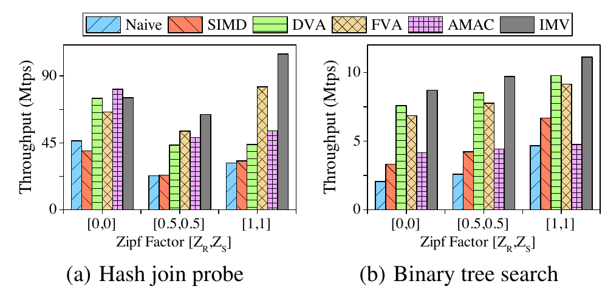


表 2：IMV 相对其他方法的加速比（原文 Table 2；表头 DAV 对应正文中的 DVA）

| 配置 | Naive | SIMD | DAV | FVA | AMAC |
|---|---:|---:|---:|---:|---:|
| HJP, [0, 0], 1 thread | 1.62 | 1.91 | 1.01 | 1.15 | 0.93 |
| HJP, [0.5, 0.5], 1 thread | 2.79 | 2.76 | 1.48 | 1.22 | 1.33 |
| HJP, [1, 1], 1 thread | 3.34 | 3.17 | 2.39 | 1.27 | 1.97 |
| BTS, [0, 0], 1 thread | 4.23 | 2.62 | 1.15 | 1.27 | 2.10 |
| BTS, [0.5, 0.5], 1 thread | 3.76 | 2.30 | 1.14 | 1.25 | 2.21 |
| BTS, [1, 1], 1 thread | 2.39 | 1.66 | 1.14 | 1.22 | 2.34 |
| HJP, [0, 0], 32 threads | 1.62 | 1.37 | 1.01 | 1.14 | 1.00 |
| HJP, [0.5, 0.5], 32 threads | 2.09 | 1.71 | 1.31 | 1.11 | 1.15 |
| HJP, [1, 1], 32 threads | 1.66 | 1.79 | 1.89 | 1.49 | 1.54 |
| BTS, [0, 0], 32 threads | 2.76 | 1.86 | 1.15 | 1.26 | 1.85 |
| BTS, [0.5, 0.5], 32 threads | 2.31 | 1.52 | 1.13 | 1.23 | 1.83 |
| BTS, [1, 1], 32 threads | 1.52 | 1.22 | 1.14 | 1.26 | 1.97 |

单线程结果见图 9。IMV 在绝大多数配置中优于其他方法，相对 Naive（纯标量）、SIMD（纯 SIMD）、DVA、FVA 和 AMAC 的最高加速比分别为 4.23、3.17、2.39、1.27 和 2.34。

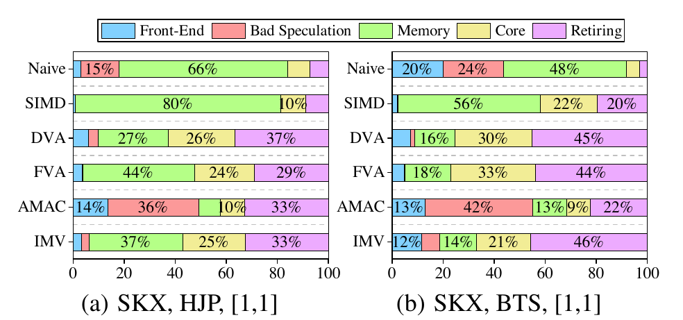

我们再用 Intel VTune 的 Top-down Microarchitecture Analysis Method（TMAM）[2] 解释 IMV 的优势。图 10 中，Front-End 是 CPU 因前端延迟而停顿的 slot 比例，例如指令缓存未命中、ITLB 未命中，或分支误预测后的取指停顿；Bad Speculation 是错误推测浪费的流水线 slot；Retiring 是用于有效工作的 slot 比例，不包括 Bad Speculation。

图 10 显示，Naive 的 HJP/BTS 分别有 66%/48% 时间受内存约束；AMAC 虽降低访问成本，仍有 36%/42% 的 bad speculation；纯 SIMD 虽消除分支，却分别有 80%/56% 时间受内存约束。Naive 与 AMAC 的结果表明，只消除分支几乎不起作用，因为仍有大量缓存未命中；整体而言，只减少内存访问或只消除分支，都不足以显著加速 HJP、BTS 及类似应用。DVA、FVA 与 IMV 同时结合向量化和预取，而 IMV 又因第 4 节分析的、更好的分歧消除方式而领先。

我们还用全部线程评测六种方法。数据通过 morsel-driven parallelism [24] 分发给线程；HJP 对 NUMA 敏感，因此把相关数据复制到各 socket，避免远程访问。表 2 也列出了全线程结果：IMV 相对 Naive、SIMD、DVA、FVA 和 AMAC 的最高加速比分别为 2.76、1.86、1.89、1.49 和 1.97。所有配置中，全线程下的相对加速几乎都低于单线程，因为更多线程会争用内存带宽、缓存、VPU 和 TLB entries 等共享资源。

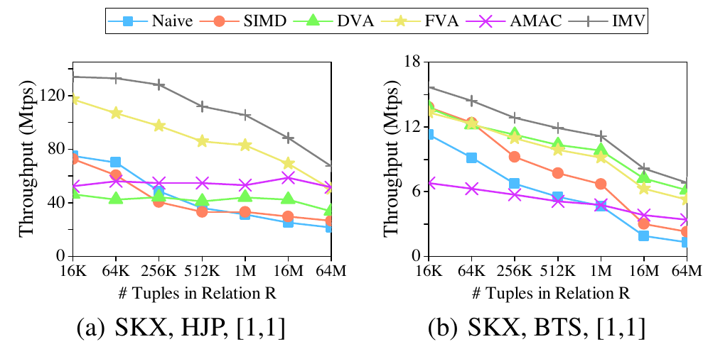

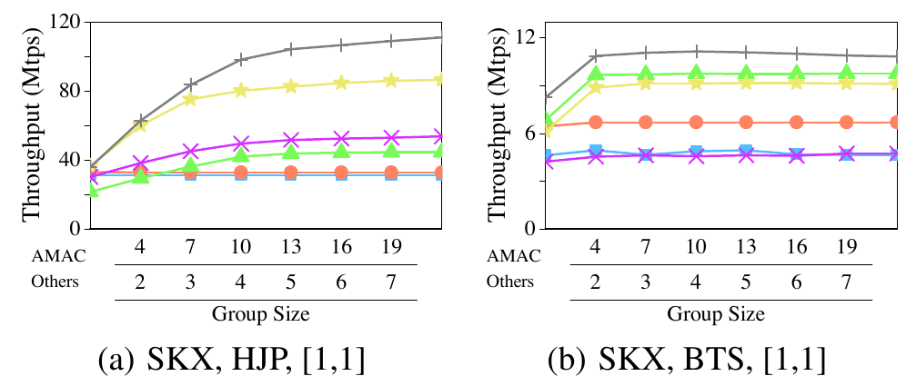

#### 5.2.1 工作负载与技术参数

**数据分布。** 我们像文献 [20] 一样改变 Zipf 因子，结果见图 9。对 HJP，AMAC 在均匀的 $[0,0]$ 下性能最好，因为它几乎不遇到 branch miss，而 IMV、FVA 和 DVA 还要付出解决分歧的额外开销。数据倾斜后 AMAC 明显恶化，尤其在 $[1,1]$ 下；DVA 也因严重分歧而落后于 IMV 和 FVA。

BTS 与 HJP 不同，数据分布对它没有明显影响，因为所建树较为茂密，没有长链。分歧较少时，DVA 略快于 FVA，但仍慢于 IMV。三种向量交错方法都优于 AMAC，因为 AMAC 遭受严重 branch miss；在 $[1,1]$ 下，AMAC 甚至慢于 SIMD。SIMD 虽能减少 branch miss，却无法缓解 cache miss，因此仍落后于 FVA、DVA 和 IMV。该实验表明，单独采用 SIMD 或软件预取都不足以提高性能，而把二者结合起来可以显著加速这些应用。

**数据规模。** 图 11 把关系 $R$ 从 16K（ $1K=2^{10}$ ）增至 64M 元组；元组数乘以哈希桶节点或树节点大小即可得到总数据量，两种数据结构的节点均为 32 字节。图中给出 $[1,1]$ 数据分布，其他情况的趋势相近。

在 HJP 中，随着 $R$ 增大，除 AMAC 外所有方法的吞吐都下降。图 10(a) 已表明 AMAC 主要受 branch miss 支配，而其他方法会随数据增大遭遇更多 cache miss。元组数超过 256K、数据离开缓存后，SIMD 和 Naive 下降得更快。DVA 因严重分歧，既不能从交错和向量化中获益，反而要承担二者开销，因此在数据仍驻留缓存时最慢。元组数超过 1M 后，所有方法还会遭遇更多 TLB miss。对 BTS，随着数据增大，所有方法的性能都会下降，SIMD 和 Naive 尤其明显，原因是更多 branch miss、TLB miss 和计算开销。

**Group size。** 预取效果取决于预取距离；在所有交错执行中，这个距离由 group size，也就是 FSM 运行实例数控制。group 必须足够大，才能用足够计算覆盖内存访问延迟；同时又受每核 MSHR 数量限制，超过该限制后更多访问会被阻塞。通常一个 group 发出的请求数可以多于 MSHR 数，因为运行时部分请求会命中缓存；但 group 中实际 miss 数不确定，而且 FSM 两次内存访问之间的计算开销并不相等，所以很难预先计算最佳 group size，本文通过实验选择。

图 12 显示，交错方法的吞吐随 group size 增长，达到某个甜点后停止增长；甜点会随平台、数据分布和应用变化。达到甜点的 group size 或更大值都可作为该配置的最佳值。对 IMV、FVA 和 DVA，所有配置都可把最佳 group size 设为 5。按原文表述，这意味着一组运行实例最多发出 40 个内存访问请求，“一个向量一次处理 8 个 64-byte 元素”；这在多数运行时情形下足以占用 MSHR。更大的 group size 会增加中间向量状态的装载和保存开销，使性能略降。AMAC 的最佳 group size 可设为 20；SIMD 和 Naive 不受 group size 变化影响。

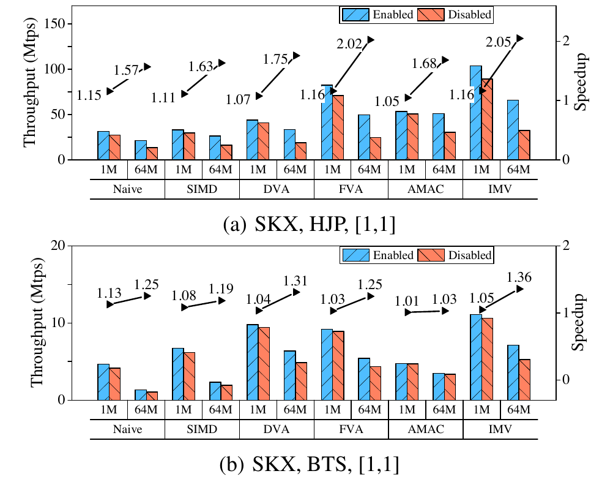

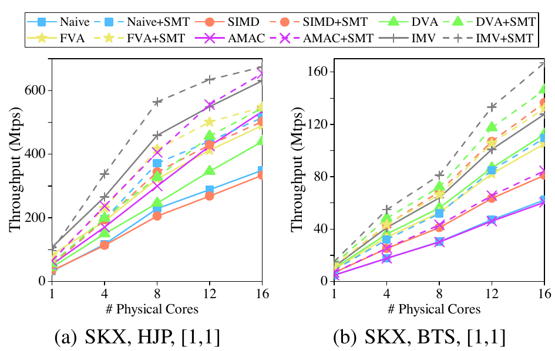

#### 5.2.2 系统架构参数

**Huge pages。** 物理内存被划分为一系列连续区域，即页；每页包含一定字节数，默认页大小为 4 KB。每个页都有虚拟地址，访问页中数据时要把虚拟地址映射为物理地址。近期地址转换会缓存在 translation lookaside buffer（TLB）中，从而降低映射成本。TLB 容量有限；若其中没有请求虚拟地址对应的物理地址，就发生 TLB miss，需要查询页表，代价远高于 TLB hit。更大的页可以略微缓解高成本的 TLB miss，因为同样数量的 TLB entries 能覆盖更多内存。

SKX 使用 2 MB huge pages，L1 cache 中有 32 个对应的 TLB entries，但仍不能满足大型内存应用。图 13 比较启用和禁用 huge pages，并改变关系 $R$ 的数据规模。启用 huge pages 后 HJP 与 BTS 都得到加速，且数据越大收益越明显，说明 TLB miss 在两种应用中都很重要。 $R$ 中 1M 元组在哈希表或二叉树中约占 32 MB，需要 $8\times 1024$ 个 4 KB 页，远超 SKX L1 TLB entries 数；64M 元组时问题更严重。即便使用 huge pages，L1 中针对 2 MB 页的 entries 只刚好满足 1M 元组，仍无法容纳 64M 元组的页标识。

所有算法中，IMV 使用 huge pages 的加速最高，且大型数据集下尤其明显：HJP 最高为 2.05 倍。这是因为 IMV 已尽力减少 cache miss 和 branch miss，之后 TLB miss 成为主要瓶颈。进一步观察表明，一种技术吞吐越高，就越容易在其他因素被消除后受 TLB miss 影响。另一方面，随着数据增大，IMV、FVA 和 DVA 相对 AMAC 的加速比变小，因为 gather/scatter 的向量代码可能同时引用更多页面，更容易触发 TLB miss。

**可扩展性。** 现代处理器包含多个物理核。图 14 分别评估增加核心和线程时交错执行的收益。从 1 核扩展到单 socket 内的 8 个核，所有方法在 HJP 与 BTS 上都近似线性加速；超过 8 核后，受 NUMA 架构影响，趋势出现差异。HJP 中 IMV 受影响最大，启用 SMT 时尤其如此，因为此时 IMV 被大量远程访问严重限制，这也解释了为何使用全部核心或线程后，IMV 相对其他方法的加速比下降。BTS 则不同：超过 8 核后，各方法吞吐仍近似线性增长，因为 BTS 没有大量远程访问。对固定核心数，启用 SMT 并不会把任何方法的吞吐提高一倍，因为同一核心内的逻辑线程会争用带宽、TLB entries 和寄存器等有限资源。

### 5.3 Hash join build 与哈希聚合

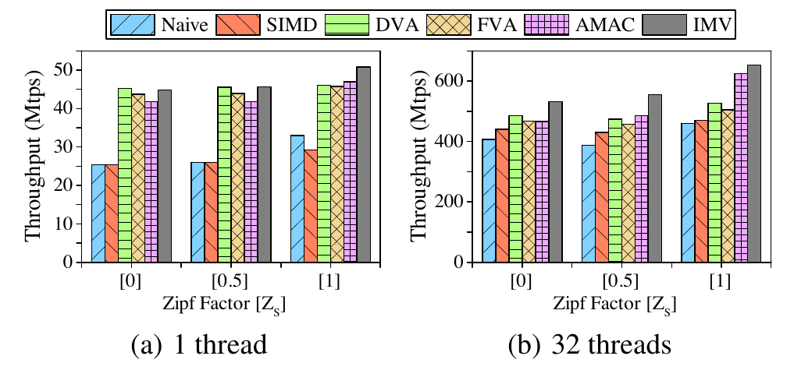

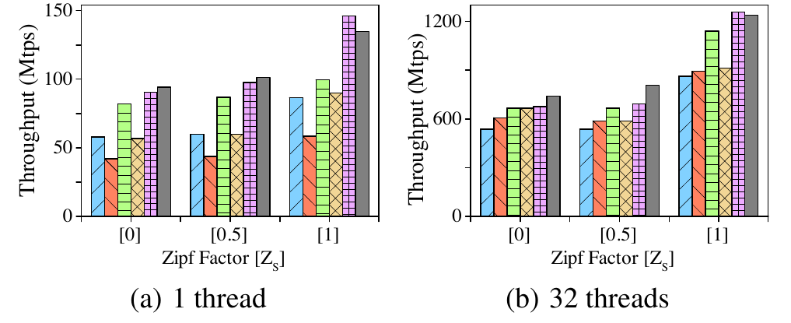

本节评测大量写入下的 IMV。Hash build 是 hash join 的两个阶段之一，分三步向 hash bucket 插入新节点：先计算 key 的哈希并找到对应 bucket；再申请一块空间，把 key 和 payload 写入其中形成新节点；最后把新节点插入 bucket 头部。这些步骤对各 bucket head 的随机访问会产生大量 cache miss。

（分组）聚合更复杂：它根据哈希值 probe 对应 bucket，找到匹配节点时更新节点中的聚合器，否则在 bucket 尾部插入新节点。probe hash bucket 的过程同样会造成大量 cache miss。这两个算子还会在 probe 所用的同一种哈希表上执行大量写入与内存分配；在多线程执行中，各线程独立运行。

图 15 给出 hash build 性能。单线程下，在三种数据分布中，IMV 相对 Naive 和 SIMD 几乎分别快 1.77 倍和 1.76 倍，因为 IMV 可以减少 build 中的大部分 cache miss；DVA、FVA 和 AMAC 也能做到这一点，所以它们的性能与 IMV 相近。32 线程下，IMV、FVA、DVA 和 AMAC 等交错方法的收益下降。在 Zipf 因子分别为 0、0.5、1 时，IMV 只比 Naive 快 1.31、1.44、1.42 倍。原因是多个 build 线程严重争用内存带宽和 TLB entries，而且内存申请会产生大量系统调用。Intel VTune 可以观察到这些问题，但软件预取无法缓解；若能在多线程执行中降低这些开销，build 会像单线程情形一样从 IMV 获得更多收益。由于 build 在 bucket 头部插入新节点，单线程和 32 线程下都不敏感于数据分布。

图 16 给出 hash aggregation 性能。图 16(a) 的单线程执行中，IMV 相对 Naive 和 SIMD 分别获得约 1.7 倍和 2.3 倍加速。SIMD 最慢，因为它按完全向量化原则重复聚合的所有步骤，产生大量冗余计算。与 build 类似，多线程时 IMV 优势下降，因为 aggregation 同样受有限内存带宽和 TLB entries 约束。即使工作负载倾斜，重复 key 会在 bucket 中合并，使待 probe 的 bucket 链变短，因此 aggregation 也不会从 IMV 获得更大收益。FVA 比另外三种交错方法慢，因为它也在每次聚合时重复全部步骤，产生与 SIMD 类似的大量冗余。特别是在 $[1]$ 下，高倾斜数据会在插入新节点或更新聚合器时产生严重冲突，因此 AMAC 反而优于 IMV。要进一步改进 IMV，需要无冲突的 aggregation 实现，但这超出本文范围。

### 5.4 Knights Landing（Xeon Phi）

Intel Xeon Phi 的微架构称为 Knights Landing，与 Skylake 不同。芯片有 64-72 个核心，每核两个 512 位 VPU，并支持四个逻辑线程，因此启用 SMT 后具有更强的内存访问延迟隐藏能力。SMT 由硬件提供，而本文交错方法由软件实现；实验要判断后者在这种平台上是否仍有效。

为排除整体可扩展性影响，实验只使用一个核心并启用四个逻辑线程；AMAC 的 group size 降为 10，DVA、FVA、IMV 降为 2。结果见图 17；build 与 aggregation 结果相似，原文因篇幅没有展示。标量实现的 Naive 和 AMAC 明显慢于另外四种方法，因为后者受益于 SIMD。一个核心上更多线程会发出更多内存请求，因此 AMAC 略快于 Naive；但在 $[1,1]$ 下，AMAC 因交错和预取开销反而慢于 Naive。这类开销有时也会让 DVA 和 FVA 慢于 SIMD。IMV 以更好的向量利用方式抵消了开销，因此优于其他方法，最高比 Naive 快 2.1 倍、比 SIMD 快 1.2 倍。结果凸显了交错执行对每核逻辑线程更少的 CPU 的重要性。

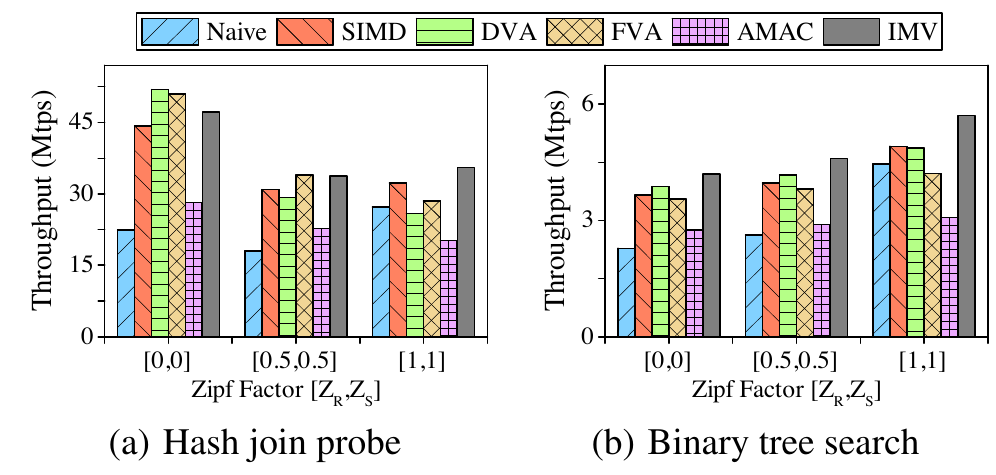

### 5.5 与其他执行模型比较

我们把 IMV 应用于完整查询执行，并与三种先进执行模型比较：以数据为中心的编译执行（data-centric compilation execution，DCE）[17]、向量化执行（vectorized execution，VE）[17] 和 relaxed operator fusion（ROF）[26]。查询基于 TPC-H：

```sql
SELECT count(*)
FROM orders, lineitem
WHERE o_orderkey = l_orderkey
  AND l_quantity < 50
  AND o_orderdate < '1996-1-1';
```

物理计划包含两个流水线： $\mathrm{scan} \to \mathrm{filter} \to \mathrm{build}$ 和 $\mathrm{scan} \to \mathrm{filter} \to \mathrm{probe} \to \mathrm{count}$。该计划基于文献 [17]，分别用不同执行模型实现。在 IMV 中，probe pipeline 被表示为 FSM，build pipeline 类似。IMV 也可用于加速 VE 和 ROF 中的 join 算子，分别称为 VE-IMV 和 ROF-IMV；VE 也可用 SIMD 加速 join，称为 VE-SIMD。

实验使用 TPC-H SF100 数据和全部 32 个线程。DCE、ROF、ROF-IMV、IMV 的 morsel size 为 10K；VE、VE-SIMD、VE-IMV 的 vector size 为 1K；ROF 各阶段之间的 buffer size 为 10K。这些参数既与既有工作 [17, 26] 一致，也在各自模型中表现良好。

图 18(a) 给出不同查询执行模型的执行时间。IMV 分别比 DCE、VE、ROF 快 1.92、2.01、1.39 倍。用 IMV 加速 VE 和 ROF 中的 join 算子，分别获得 1.72 倍和 1.39 倍加速。

DCE 比 IMV 慢，因为它既不能减少 join 中的 cache miss，也不能避免 filter 中的 branch miss；这也是 DCE 的 build pipeline 慢于其他方法的主要原因，见图 18(b)。DCE 的 probe pipeline 略快于 VE，因为 VE 会在各阶段之间物化中间结果，产生无用计算。具体而言，VE 把 hash probe 分成计算哈希、生成 join candidates、检查相等性三个阶段；阶段间结果写入向量，不相等 join candidates 的结果会浪费计算，可能抵消 VE 乱序执行的收益。即使直接用 SIMD 加速，VE 仍受 cache miss 主导。因此，用 IMV 优化 VE 中的 join 可以大幅提升性能，但由于 pull execution 中的大量函数调用，它仍慢于 IMV。

ROF 用 SIMD 优化 filter，并用 group prefetching（GP）实现 join。在这个均匀数据集上，即便使用链式哈希表，GP 仍优于 AMAC。ROF 因减少大量 cache miss 而快于 DCE 和 VE，但仍慢于 IMV；其 build pipeline 和 probe pipeline 分别比 IMV 慢 1.34 倍和 1.42 倍。IMV 同时减少 cache miss 与 branch miss，因此用 IMV 代替 GP 加速 ROF 中的 join 会表现更好。

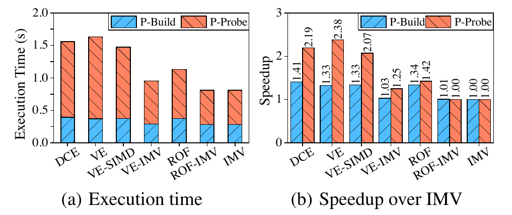

ROF-IMV 与 IMV 几乎相同：二者都用 SIMD 加速 filter，并用 IMV 提升 join。区别是 ROF-IMV 把 filter 与 join 的 build 或 probe 分为两个阶段，以 buffer 连接，因而引入物化开销，尤其当 filter 没有滤掉元组时；IMV 则把 filter 与 build/probe 合并。后一方式也可能更慢，因为 filter 后凑成一个满 SIMD 向量的时间具有随机性，未必能理想地与内存访问重叠。两者差异取决于 filter selectivity，但性能差距几乎始终在 5% 内，因此把 IMV 用于 ROF 也是加速完整查询执行的良好选择。

## 6. 讨论

### 复杂查询中的 IMV

TPC-H 这类复杂查询由多个 pipeline 组成，可从 IMV 中受益，减少缓存未命中、分支未命中和计算开销。如第 5.5 节所示，pipeline 可采用两种 IMV 执行模型：（1）用 IMV 实现整个 pipeline；（2）像 ROF 一样，把 IMV 优化算子链接到 pipeline 中。第一种方法比第二种复杂，因为需要即时（JIT）编译协助融合 pipeline 中的所有算子。SIMD 与 JIT 的结合是一个有吸引力的课题，已有工作 [9, 11] 做过初步研究，但尚未形成通用方法。此外，在 pipeline 中融合更多算子可能干扰第 5.5 节所示的交错执行，因此我们认为第二种方法更适合实际使用 IMV。

对 pipeline 中的具体算子，IMV 可处理其复杂逻辑，因为 IMV 能解决一般 `if` 和循环语句产生的分歧。各个算子的主体逻辑几乎固定，包括可能出现缓存未命中和控制流分歧的位置，因此较容易决定在哪里插入预取与 integration。算子之所以表现不同，是因为存在表达式和哈希函数等变化部分，而且它们都要支持多列与不同数据类型。本文为这些变化部分实现了多种在运行时调用的 SIMD 向量化 primitive。这与标量向量化执行 [5] 类似，但本文的 primitive 面向 SIMD 向量，而不是文献 [5] 中面向标量 batch。

SIMD 不能直接计算涉及 `varchar`、`decimal` 等特殊类型或 `substr()` 等操作的复杂表达式。若复杂类型的唯一值数量不多，可像文献 [11, 30] 那样把它们映射为数量有限的整数，以加速相等性检查等操作；其他情况下，则应以标量代码把特殊操作实现为 SIMD-like primitive，使其与 SIMD 操作无缝结合。一个向量内的 tuple 数有限，因此调用 SIMD（或 SIMD-like）primitive 的开销不能充分摊销，但可用 JIT [9, 27] 缓解；此外，在交错执行中，这部分开销几乎可以与内存访问重叠，所以 IMV 仍能取得明显加速。

### IMV 自动化

本文手工实现交错执行，并用 residual vectorized state 解决控制流分歧。理想情况下，应把这两个过程自动化，对软件开发者隐藏其细节。交错执行可通过协程 [19, 16, 31] 实现；协程可以方便地暂停或恢复函数执行，提高代码可读性与可维护性。但在向量化中，协程仍必须处理控制流分歧。若采用 residual vectorized state，协程需要具备三种能力：（1）识别分歧会在哪里发生，以及应在哪里插入 residual vectorized state；（2）在运行时高效地在协程之间共享 residual vectorized state，以减少所需向量数量；（3）像第 4.3 节分析的那样，自动调度多个分支的执行，而不是由程序显式控制。这三项要求对于在 CPU 上自动解决控制流分歧至关重要。

## 7. 相关工作

**数据库中的 SIMD。** SIMD 已在数据库中得到广泛研究，因为它既能减少分支未命中 [13] 和计算开销，也能提供便利的数据访问指令。Scan、index scan、join、aggregation、index operation 和 sorting 等重要操作已经用 SIMD 实现 [28, 29, 14, 10, 35, 8]。具体而言，采用 cuckoo hash [33] 或 linear hash [15] 的双表 join probe 可由 SIMD 高效处理。与之不同，本文关注链式哈希表 probe；它会遭遇更多缓存未命中，而本文要消除这些未命中。此外，既有工作 [29] 用 permutation lookup table 把新元素引入向量，本文则用 `expand` load 指令装入新元素。本文算法是完全向量化的，不像文献 [28, 29, 7] 那样保留标量尾部。

**分歧。** CPU 缺少 GPU 所具有的硬件支持 [12, 3]，因此必须手工处理 SIMD 向量化中的分歧。Build、probe 等单个算子内的分歧可用完全向量化 [28] 避免；这种方法可扩展到 pipeline 执行，称为 partial consume [22, 23]。文献 [22, 23] 还提出 consume everything：把分歧元组缓冲起来并推迟处理，这与本文的 residual vectorized state 相似。不过，consume everything 会在缓冲算子中引入更多嵌套 `if` 和循环，使处理逻辑更复杂。相比之下，每个 residual vectorized state 都属于 FSM 的一个分歧状态，并由一组运行实例共享。此外，partial consume 和 consume everything 都只考虑 active lane 与 inactive lane 之间的分歧，忽略 active lane 彼此之间的分歧；因此，这两种策略无法解决一般 `if` 和循环语句产生的分歧。

**SIMD 中的预取。** 缓存未命中严重限制内存密集型应用的性能。标量代码可以用 GP [6]、SPP [6] 或 AMAC [20] 进行预取；其中 AMAC 尤其能够处理不规则数据访问。对向量化代码，一些研究通过调整数据布局来提高局部性并利用硬件预取，也有少量工作初步使用软件预取。例如，文献 [32, 18] 设计了多种布局，以降低树或图遍历时的内存延迟，但这些布局不能用于哈希表 probe 等其他应用。SPP 也被用于预取等高树的规则遍历 [18]；不过，这种方法至多得到 $\log_2(W)$ 而不是 $W$ 倍加速，其中 $W$ 为向量 lane 数，因此浪费了向量中的高数据并行性。另有软件预取只辅助顺序而非随机数据访问 [7, 15]，只能略微减少缓存未命中。ROF [26] 把预取优化代码与 SIMD 优化代码链接到 pipeline 中，而不是在 SIMD 代码中用预取解决缓存未命中。

## 8. 结论

本文提出交错多向量化 IMV，用于突破 SIMD 向量化中的 memory wall。IMV 是一种新方法，可在具有不规则 immediate memory access 的 pointer-chasing 应用上同时充分利用 MLP 和 DLP。它把程序拆分为状态，这些状态位于 immediate memory access 或控制流分歧处；随后交错执行不同程序实例的状态，以隐藏内存访问延迟。

我们还提出 residual vectorized state，在每个状态内部解决控制流分歧，从而避免向量执行中的 bubble。实验表明，IMV 相比纯标量实现和纯 SIMD 向量化最高分别快 4.23 倍和 3.17 倍，因为它能同时减少缓存未命中、分支未命中和计算开销。IMV 不仅适用于 pointer-chasing 应用，也可应用到完整查询处理。未来工作将包括复杂查询中的 IMV 应用和 IMV 自动化。

## 致谢

该研究获得中国国家重点研发计划（No. 2018YFB1003400）和国家自然科学基金（No. 61772204、61732014）支持。本文作者感谢匿名审稿人和 shepherd 的建设性意见与指导。


## 参考文献

- [1] IMV Source Code. https://github.com/fzhedu/db-imv, 2019.
- [2] Intel Vtune TMAM. https://software.intel.com/en-us/vtune-amplifier-cookbook-top-down-microarchitecture-analysis-method, 2019.
- [3] M. Alam, K. S. Perumalla, and P. Sanders. Novel parallel algorithms for fast multi-GPU-based generation of massive scale-free networks. Data Science and Engineering, 4(1):61-75, 2019.
- [4] C. Balkesen, J. Teubner, G. Alonso, and M. T. Özsu. Main-memory hash joins on multi-core CPUs: Tuning to the underlying hardware. In ICDE, pages 362-373, 2013.
- [5] P. A. Boncz, M. Zukowski, and N. Nes. MonetDB/X100: Hyper-pipelining query execution. In CIDR, pages 225-237, 2005.
- [6] S. Chen, A. Ailamaki, P. B. Gibbons, and T. C. Mowry. Improving hash join performance through prefetching. ACM Trans. Database Syst., 32(3):17, 2007.
- [7] X. Cheng, B. He, X. Du, and C. T. Lau. A study of main-memory hash joins on many-core processor: A case with Intel Knights Landing architecture. In CIKM, pages 657-666, 2017.
- [8] J. Chhugani, A. D. Nguyen, V. W. Lee, W. Macy, M. Hagog, Y. Chen, A. Baransi, S. Kumar, and P. Dubey. Efficient implementation of sorting on multi-core SIMD CPU architecture. PVLDB, 1(2):1313-1324, 2008.
- [9] M. Dreseler, J. Kossmann, J. Frohnhofen, M. Uflacker, and H. Plattner. Fused table scans: Combining AVX-512 and JIT to double the performance of multi-predicate scans. In ICDE, pages 102-109, 2018.
- [10] Z. Fang, Z. He, J. Chu, and C. Weng. SIMD accelerates the probe phase of star joins in main memory databases. In DASFAA, pages 476-480, 2019.
- [11] T. Gubner and P. Boncz. Exploring query execution strategies for JIT, vectorization and SIMD. In ADMS, 2017.
- [12] T. D. Han and T. S. Abdelrahman. Reducing branch divergence in GPU programs. In GPGPU, page 3, 2011.
- [13] H. Inoue, M. Ohara, and K. Taura. Faster set intersection with SIMD instructions by reducing branch mispredictions. PVLDB, 8(3):293-304, 2014.
- [14] H. Inoue and K. Taura. SIMD- and cache-friendly algorithm for sorting an array of structures. PVLDB, 8(11):1274-1285, 2015.
- [15] S. Jha, B. He, M. Lu, X. Cheng, and H. P. Huynh. Improving main memory hash joins on Intel Xeon Phi processors: An experimental approach. PVLDB, 8(6):642-653, 2015.
- [16] C. Jonathan, U. F. Minhas, J. Hunter, J. J. Levandoski, and G. V. Nishanov. Exploiting coroutines to attack the "killer nanoseconds". PVLDB, 11(11):1702-1714, 2018.
- [17] T. Kersten, V. Leis, A. Kemper, T. Neumann, A. Pavlo, and P. A. Boncz. Everything you always wanted to know about compiled and vectorized queries but were afraid to ask. PVLDB, 11(13):2209-2222, 2018.
- [18] C. Kim, J. Chhugani, N. Satish, E. Sedlar, A. D. Nguyen, T. Kaldewey, V. W. Lee, S. A. Brandt, and P. Dubey. FAST: fast architecture sensitive tree search on modern CPUs and GPUs. In SIGMOD, pages 339-350, 2010.
- [19] V. Kiriansky, H. Xu, M. Rinard, and S. P. Amarasinghe. Cimple: instruction and memory level parallelism: a DSL for uncovering ILP and MLP. In PACT, pages 1-16, 2018.
- [20] Y. O. Koçberber, B. Falsafi, and B. Grot. Asynchronous memory access chaining. PVLDB, 9(4):252-263, 2015.
- [21] N. Kohout, S. Choi, D. Kim, and D. Yeung. Multi-chain prefetching: Effective exploitation of inter-chain memory parallelism for pointer-chasing codes. In PACT, pages 268-279, 2001.
- [22] H. Lang, A. Kipf, L. Passing, P. A. Boncz, T. Neumann, and A. Kemper. Make the most out of your SIMD investments: counter control flow divergence in compiled query pipelines. In DaMoN, pages 1-8, 2018.
- [23] H. Lang, L. Passing, A. Kipf, P. Boncz, T. Neumann, and A. Kemper. Make the most out of your SIMD investments: counter control flow divergence in compiled query pipelines. The VLDB Journal, 2019.
- [24] V. Leis, P. A. Boncz, A. Kemper, and T. Neumann. Morsel-driven parallelism: a NUMA-aware query evaluation framework for the many-core age. In SIGMOD, pages 743-754, 2014.
- [25] S. Manegold, P. A. Boncz, and M. L. Kersten. Optimizing database architecture for the new bottleneck: Memory access. The VLDB Journal, 9(3):231-246, 2000.
- [26] P. Menon, A. Pavlo, and T. C. Mowry. Relaxed operator fusion for in-memory databases: Making compilation, vectorization, and prefetching work together at last. PVLDB, 11(1):1-13, 2017.
- [27] T. Neumann. Efficiently compiling efficient query plans for modern hardware. PVLDB, 4(9):539-550, 2011.
- [28] O. Polychroniou, A. Raghavan, and K. A. Ross. Rethinking SIMD vectorization for in-memory databases. In SIGMOD, pages 1493-1508, 2015.
- [29] O. Polychroniou and K. A. Ross. Vectorized bloom filters for advanced SIMD processors. In DaMoN, pages 1-6, 2014.
- [30] O. Polychroniou and K. A. Ross. Towards practical vectorized analytical query engines. In DaMoN, pages 1-7. ACM, 2019.
- [31] G. Psaropoulos, T. Legler, N. May, and A. Ailamaki. Interleaving with coroutines: A practical approach for robust index joins. PVLDB, 11(2):230-242, 2017.
- [32] B. Ren, G. Agrawal, J. R. Larus, T. Mytkowicz, T. Poutanen, and W. Schulte. SIMD parallelization of applications that traverse irregular data structures. In CGO, pages 1-10, 2013.
- [33] K. A. Ross. Efficient hash probes on modern processors. In ICDE, pages 1297-1301, 2007.
- [34] W. A. Wulf and S. A. McKee. Hitting the memory wall: implications of the obvious. In Comp. Arch. News, pages 20-24, 1995.
- [35] J. Zhou and K. A. Ross. Implementing database operations using SIMD instructions. In SIGMOD, pages 145-156, 2002.
