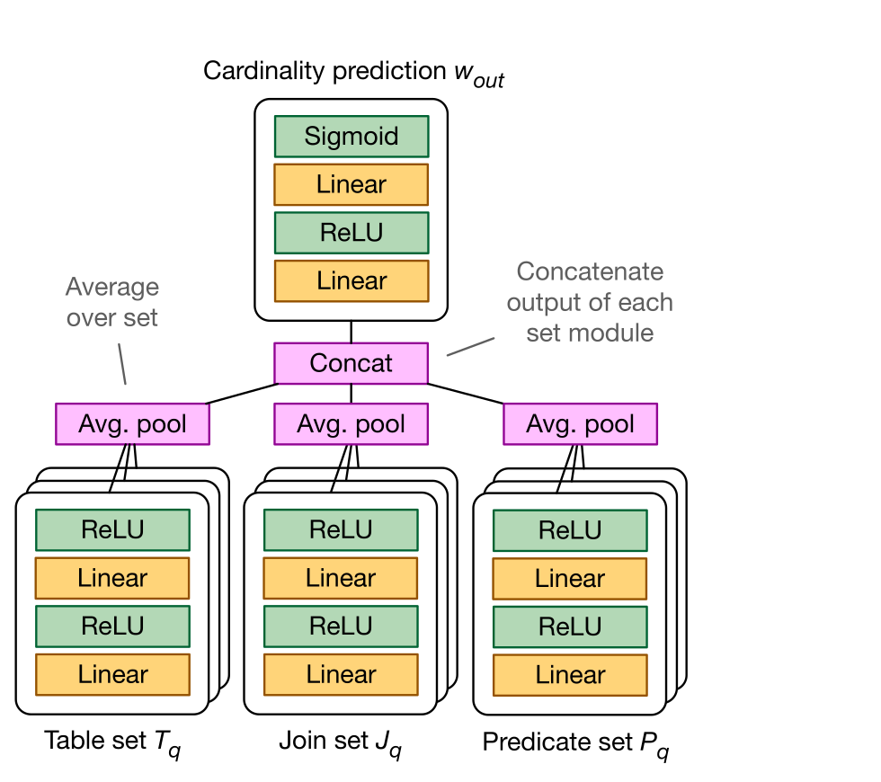
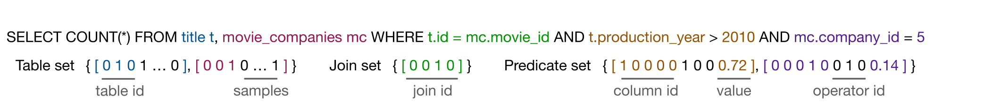
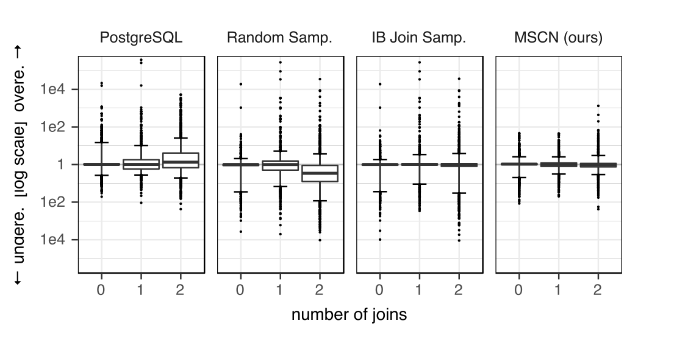
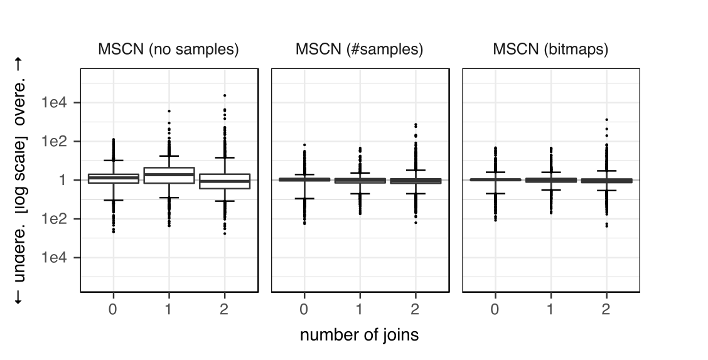
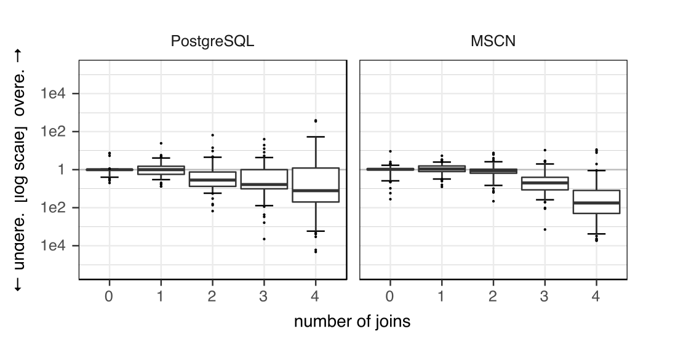
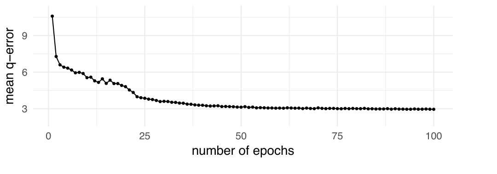

# Learned Cardinalities: Estimating Correlated Joins with Deep Learning（中文译文）

## 译者说明

本文依据同目录的 `source.pdf` 翻译。章节、图表、公式、算法、代码与参考文献按原文结构保留。

Andreas Kipf¹、Thomas Kipf²、Bernhard Radke¹、Viktor Leis¹、Peter Boncz³、Alfons Kemper¹

¹ 慕尼黑工业大学；² 阿姆斯特丹大学；³ 荷兰国家数学与计算机科学研究中心（Centrum Wiskunde & Informatica）

## 摘要

我们描述一种新的深度学习基数估计方法。MSCN 是一个多集合卷积网络，专门用于表示关系查询计划；它利用集合语义捕获查询特征和真实基数。MSCN 建立在采样式估计之上，弥补了采样式方法的两个弱点：谓词没有命中任何采样元组时失效，以及难以捕获跨连接相关性。我们在真实世界数据集上评估 MSCN，结果表明，深度学习可以显著提高查询优化核心问题——基数估计——的质量。

## 1. 引言

查询优化从根本上依赖基数估计。查询优化器要在不同计划候选之间作出选择，必须相当准确地估计中间结果大小。然而众所周知，所有广泛使用的数据库系统给出的估计经常错上若干数量级，导致查询缓慢且性能不可预测。基数估计最大的难题是跨连接相关性（join-crossing correlations）[16, 18]。例如在 Internet Movie Database（IMDb）中，法国演员比其他国籍演员更可能出演爱情电影。

如何更好地处理这一问题仍是开放研究方向。该领域的一项最先进方案是 Index-Based Join Sampling（IBJS）[17]：它用满足条件的基表样本探测现有索引结构。但与其他采样技术一样，当没有可作为起点的满足条件样本（即基表谓词选择性很强、命中率很低），或者没有合适索引时，IBJS 就会失效。在这种情况下，这些技术通常退回到有根据的“猜测”，造成很大估计误差。

过去十年，机器学习（ML），尤其是神经网络（深度学习），已经广泛用于各种应用和系统。数据库社区也开始探索如何在数据管理系统中利用机器学习。近期研究把 ML 用于参数调优 [2]、查询优化 [13, 23, 27]，甚至索引 [12] 等经典数据库问题。

我们认为，机器学习非常有希望解决基数估计问题。估计可以表述为监督学习：输入是查询特征，输出是估计基数。与已经有人提出机器学习方案的索引结构 [12] 和连接顺序 [23] 等问题不同，当前依赖基础逐表统计信息的基数估计方法表现并不好。换言之，机器学习估计器无须完美，只要优于当前不准确的基线即可。此外，机器学习模型产生的估计可直接交给现有成熟枚举算法和代价模型使用，无须对数据库系统作其他修改。

我们提出一种基于深度学习的方法，它学习预测数据中的跨连接相关性，并处理上述采样式技术的薄弱点。核心是专门设计的多集合卷积网络（multi-set convolutional network，MSCN），允许我们以集合表示查询特征。例如，$(A\bowtie B)\bowtie C$ 和 $A\bowtie(B\bowtie C)$ 都表示为 $\{A,B,C\}$。因此，模型不必浪费容量记忆查询特征的不同排列；这些排列基数相同、代价不同。这样可以得到更小的模型和更好的预测。连接枚举和代价模型则有意保留给查询优化器。

我们在真实世界 IMDb 数据集 [16] 上评估该方法。结果表明，它比采样式技术更稳健，而且在采样式技术擅长的场景——即满足条件的样本很多——也具有竞争力。模型只需要约 3 MiB、且占用可配置的较小空间；作为对照，采样式技术能够访问覆盖整个数据库的索引。这些结果很有希望，说明机器学习或许确实是解决已有数十年历史的基数估计问题的合适工具。

本文采用 Creative Commons Attribution 3.0 许可发布；只要注明原作者和 CIDR 2019，即允许分发、复制和创作衍生作品。

## 2. 相关工作

近期三篇论文 [13, 23, 27] 把连接顺序表述为强化学习问题，并用 ML 寻找查询计划，从而把深度学习用于查询优化。与之不同，我们以监督学习单独解决基数估计。之所以聚焦这一问题，是因为现代连接枚举算法已经可以为含数十个关系的查询找到最优连接顺序 [26]；而基数估计则被称为查询优化的“阿喀琉斯之踵” [21]，并造成其大多数性能问题 [16]。

二十年前，人们就针对 UDF 谓词发表了用神经网络估计基数的早期工作 [14]。回归模型也曾用于基数估计 [1]。[22] 提出一种显式机器学习的半自动替代方案：用决策树划分特征空间，并为每个分区学习不同回归模型。这些早期方法没有使用深度学习，也没有包含从统计信息派生的特征，例如我们基于样本的位图；该位图准确编码选中了哪些样本元组，因此我们认为它是学习相关性的良好起点。

用机器学习预测总体资源消耗（运行时间、内存占用、I/O、网络流量）的工作 [6, 19] 也有同样局限，尽管这些模型确实把基于统计信息的粗粒度特征（估计基数）放入特征。Liu 等人 [20] 使用现代 ML 做基数估计，但没有聚焦最关键的估计难题——连接 [16]。

我们的方法建立在采样式估计之上，把从样本得到的基数或位图纳入训练信号。多数采样方案创建逐表样本/概要，再尝试在连接时巧妙组合 [3, 5, 30, 31]。这些方法对单表查询效果良好，却不能捕获跨连接相关性，而且容易遭遇 0 元组问题（§4.2）。Müller 等人 [25] 的近期工作试图缓解合取谓词的 0 元组问题，尽管计算成本很高；但它仍不能处理单个谓词返回零结果这一基本情形。MSCN 在 0 元组场景仍能给出相当不错的估计，因而比采样方法更进一步；甚至在物化连接样本上估计（连接概要 [28]）仍不能处理 0 元组场景。

## 3. 学习型基数估计

从高层看，把机器学习用于基数估计很直接：先用查询/输出基数对训练监督学习算法，再把模型用作其他未见查询的估计器。但机器学习能否成功应用取决于若干挑战。最重要的问题是如何表示查询（“特征化”）以及使用何种监督学习算法；另一个问题是怎样获得初始训练数据集（“冷启动问题”）。本节先处理这些问题，再讨论我们的关键思想：对物化样本信息进行特征化。

### 3.1 基于集合的查询表示

我们把查询 $q\in Q$ 表示为集合的集合 $(T_q,J_q,P_q)$，其中 $T_q\subset T$ 是查询涉及的表集合，$J_q\subset J$ 是连接集合，$P_q\subset P$ 是谓词集合；$T$、$J$、$P$ 分别描述所有可用表、连接和谓词的集合。

每个表 $t\in T$ 都由唯一独热向量 $v_t$ 表示。它是长度为 $|T|$ 的二进制向量，只有一个非零位置，由此唯一标识一张表；还可以附加满足条件的基表样本数量，或标记其位置的位图。类似地，每个连接 $j\in J$ 也使用唯一独热编码。

对形如 $(\mathrm{col},\mathrm{op},\mathrm{val})$ 的谓词，列 $\mathrm{col}$ 和算子 $\mathrm{op}$ 分别以类别表示和唯一独热向量进行特征化；$\mathrm{val}$ 则以相应列的最小、最大值归一化到 $[0,1]$。

**图 1：多集合卷积网络的体系结构。** 表、连接和谓词分别表示为独立模块，每个模块对集合中的每个元素使用共享参数的两层神经网络；各模块输出取平均、拼接，再送入最终输出网络。

应用于查询表示 $(T_q,J_q,P_q)$ 时，MSCN 模型（图 1）形式如下：

$$
\text{表模块：}\quad w_T=\frac{1}{|T_q|}\sum_{t\in T_q}\mathrm{MLP}_T(v_t)
$$

$$
\text{连接模块：}\quad w_J=\frac{1}{|J_q|}\sum_{j\in J_q}\mathrm{MLP}_J(v_j)
$$

$$
\text{谓词模块：}\quad w_P=\frac{1}{|P_q|}\sum_{p\in P_q}\mathrm{MLP}_P(v_p)
$$

$$
\text{合并并预测：}\quad w_{\text{out}}=\mathrm{MLP}_{\text{out}}([w_T,w_J,w_P])
$$

图 2 给出特征化查询的例子。

**图 2：把查询特征化为特征向量集合。**

### 3.2 模型

卷积神经网络（CNN）、循环神经网络（RNN）或简单多层感知机（MLP）等标准深度神经网络架构不能直接用于这种数据结构，必须先将其序列化，即把数据结构转换成有序元素序列。这带来根本限制：模型必须耗费容量来发现原始表示中的对称性和结构。例如，它需要学会识别由多个不同大小集合组成的数据结构中的集合边界，也要学会集合序列化后元素顺序是任意的。

既然底层数据结构事先已知，就可以把这些信息直接写入深度学习架构，向模型提供归纳偏置，帮助它泛化到同一结构的未见实例，例如训练时未见过的、包含不同元素数量的集合组合。

我们提出多集合卷积网络 MSCN。其架构受近期 Deep Sets [32] 启发；Deep Sets 是一种操作集合的神经网络模块，有时也称集合卷积。其基础观察是：集合 $S$ 上任意对元素置换不变的函数 $f(S)$，都可用恰当选择的函数 $\rho$、$\phi$ 分解为：

$$
f(S)=\rho\left[\sum_{x\in S}\phi(x)\right]
$$

形式化讨论和证明见 Zaheer 等人 [32]。我们用简单全连接 MLP 参数化 $\rho$ 和 $\phi$，并利用其函数逼近性质 [4] 学习任意集合 $S$ 上灵活的映射 $f(S)$。逐个对集合元素应用共享参数的可学习映射，类似图像分类 CNN 中常用的 $1\times1$ 卷积 [29]。

查询表示由多个集合组成，因此 MSCN 对每个集合 $S$ 学习一个集合专用的逐元素神经网络 $\mathrm{MLP}_S(v_s)$，即分别作用于每个元素 $s\in S$ 的特征向量 $v_s$。¹ 集合的最终表示 $w_S$ 是各元素变换后表示的平均：²

$$
w_S=\frac{1}{|S|}\sum_{s\in S}\mathrm{MLP}_S(v_s)
$$

选择平均而不是简单求和，有利于泛化到元素数量不同的集合，否则整体信号幅度会随集合元素数而变化。实践中，我们实现了在数据小批量上运行的向量化模型。由于小批量内每个数据样本的集合元素数可能不同，我们以全零特征向量作为虚拟集合元素进行填充，使同一小批量的样本拥有相同元素数。求平均时会掩蔽虚拟元素，只让原始元素参与。

最后，把各集合表示拼接后送入最终输出 MLP：

$$
w_{\text{out}}=\mathrm{MLP}_{\text{out}}([w_{S_1},w_{S_2},\ldots,w_{S_N}])
$$

其中 $N$ 是集合总数，$[\cdot,\cdot]$ 表示向量拼接。该表示也包含这样的特殊情形：先用单独输出函数变换每个集合表示 $w_S$，这正是 [32] 原始定理所要求的形式。也可以先分别处理每个 $w_S$，之后再合并并通过另一个 MLP；为提高计算效率，我们把两步合并成一次计算。

除非另行说明，所有 MLP 模块都是两层全连接神经网络，激活函数为 $\mathrm{ReLU}(x)=\max(0,x)$。输出 MLP 最后一层则使用 $\mathrm{sigmoid}(x)=1/(1+\exp(-x))$，且只输出一个标量，所以 $w_{\text{out}}\in[0,1]$。隐藏层使用 ReLU，因为其经验性能强、求值快。其他表示向量 $w_T,w_J,w_P$ 和 MLP 隐藏层激活均为维度 $d$ 的向量；$d$ 是超参数，通过独立验证集上的网格搜索优化。

目标基数 $c_{\text{target}}$ 的归一化步骤如下：先取对数，使目标值分布更均匀；再使用训练集中取对数后的最小值和最大值归一化到 $[0,1]$。³ 归一化可逆，因此可从模型预测 $w_{\text{out}}\in[0,1]$ 恢复未归一化基数。

训练目标是最小化平均 q-error [24]，其中 $q\ge1$。q-error 是估计基数与真实基数二者之比中不小于 1 的那个因子。我们还探索了均方误差和 q-error 几何平均作为目标（§4.8），训练使用 Adam 优化器 [10]。

¹ 另一种方案是在送入 MLP 前先合并特征向量。例如，多张表各由唯一独热向量表示时，可对这些向量做逻辑或，再输入模型。但如果还要给单独独热向量关联额外信息（例如满足条件的基表样本数），这种方案就不可用。

² 独热向量的平均可以唯一标识独热向量组合，例如查询中有哪些单独表。

³ 数据变化且最小值或最大值发生变化时，该方案需要完全重训；也可以为最大值设置一个较高上限。

### 3.3 生成训练数据

所有学习算法的一项关键挑战都是“冷启动问题”：尚无查询工作负载的具体信息时如何训练模型。我们的办法是，根据模式信息生成随机查询，并从数据库真实值中抽取字面量，从而得到初始训练语料。

每个训练样本包含表标识符、连接谓词、基表谓词和查询结果的真实基数。为避免组合爆炸，只生成最多含两个连接的查询，让模型泛化到更多连接。查询生成器首先均匀抽取连接数 $|J_q|$，其中 $0\le|J_q|\le2$；再均匀选择一张至少被另一张表引用的表。如果 $|J_q|>0$，就从能与当前表集合（初始只有一张表）连接的新表中均匀选择一张，把对应连接边加入查询，并重复整个过程 $|J_q|$ 次。

对查询中的每张基表 $t$，生成器均匀抽取谓词数 $|P_q^t|$，其中 $0\le|P_q^t|\le$ 非键列数。对每个谓词，均匀抽取谓词类型（$=$、$<$ 或 $>$），再从对应列选择一个字面量（真实值）。查询生成器只生成唯一查询。随后执行这些查询取得真实结果基数，并跳过结果为空的查询，由此得到模型初始训练集。

### 3.4 丰富训练数据

我们的一项关键思想，是用物化基表样本信息丰富训练数据。对查询中的每张表，在物化样本上求值相应谓词，并把满足条件的样本数 $s$ 标注到查询上；若物化 1000 个样本，则 $0\le s\le1000$。估计未见测试查询时也执行同样步骤，使 ML 模型可以利用这些知识。

我们更进一步，用位图表示满足条件样本的位置，并把它标注到查询中的每张表。§4 将表明，该特征会改善连接估计，因为 ML 模型现在可以学会特定样本满足条件意味着什么，例如某些样本通常有很多连接伙伴。换言之，模型可以利用位图中的模式预测输出基数。

### 3.5 训练与推理

构建模型包括三步：（i）使用模式和数据信息生成随机、均匀分布的查询；（ii）执行查询，用真实基数和满足条件的物化基表样本信息标注查询；（iii）把训练数据送入 ML 模型。所有步骤都在数据库不可变快照上执行。

预测查询基数时，先把查询转换为特征表示（§3.1）。推理本身包含一定数量的矩阵乘法，还可以选择查询物化基表样本（§3.4）。使用更多查询样本训练不会增加预测时间，因此推理速度在很大程度上独立于预测质量；而纯采样方法只有查询更多样本才能提高预测质量。

## 4 评测

我们使用 IMDb 数据集评测所提方法。该数据集包含大量相关性，因此对基数估计器极具挑战 [16]。数据集涵盖 133 年间制作的 250 多万部影片、234,997 家不同公司和 400 多万名演员。

我们使用三种不同的查询工作负载⁴：（i）合成工作负载，由与训练数据相同的查询生成器使用不同随机种子生成，包含 5,000 条唯一查询；查询在非键列上含合取的等值和范围谓词，并含 0 至 2 个连接；（ii）另一个合成工作负载 scale，包含 500 条查询，旨在展示模型向更多连接的泛化能力；（iii）JOB-light，从 Join Order Benchmark（JOB）[16] 派生，包含原 113 条查询中的 70 条。与 JOB 不同，JOB-light 不含字符串谓词或析取，只包含 1 至 4 个连接的查询。JOB-light 中大多数查询在维表属性上使用等值谓词，唯一的范围谓词作用于 `production_year`。表 1 按连接数给出三个工作负载中的查询分布。合成工作负载中的非均匀分布是去除重复查询所致。

表 1：连接数分布。

| 工作负载 | 0 | 1 | 2 | 3 | 4 | 总计 |
| --- | ---: | ---: | ---: | ---: | ---: | ---: |
| synthetic | 1636 | 1407 | 1957 | 0 | 0 | 5000 |
| scale | 100 | 100 | 100 | 100 | 100 | 500 |
| JOB-light | 0 | 3 | 32 | 23 | 12 | 70 |

对比方法包括 PostgreSQL 10.3、随机采样（Random Sampling，RS）和基于索引的连接采样（Index-Based Join Sampling，IBJS）[17]。RS 在物化样本上执行基表谓词来估计基表基数，并在估计连接时假设独立性。若合取谓词没有满足条件的样本，它会尝试逐个求值合取项，最后退回到使用不同值数量（取最具选择性的合取项所在列）估计选择率。IBJS 代表连接估计的最新水平，它用满足条件的基表样本探测现有索引结构。我们的 IBJS 实现采用与 RS 相同的回退机制。

模型训练和测试在 Amazon Web Services（AWS）的 `ml.p2.xlarge` 实例上进行，使用 PyTorch 框架⁵和 CUDA。训练数据由 100,000 条含 0 至 2 个连接的随机查询和 1,000 个物化样本构成（见 §3.3），其中 90% 用于训练，10% 用于验证。训练数据的真实基数由 HyPer [8] 获取。

⁴ https://github.com/andreaskipf/learnedcardinalities

⁵ https://pytorch.org/

### 4.1 估计质量

图 3：合成工作负载上的估计误差。箱体边界为第 25/75 百分位，水平“须线”标出第 95 百分位。

图 3 比较了 MSCN 与各对比方法的 q-error。PostgreSQL 的误差更偏向高估一侧；RS 则倾向于低估连接，这是其独立性假设所致。IBJS 在中位数和第 75 百分位上表现极佳，但与 RS 一样会受空基表样本影响。MSCN 的中位数与 IBJS 相当，同时稳健性显著更强。IBJS 以大型主键和外键索引的形式使用了多得多的数据，而 MSCN 使用的状态非常小（不足 3 MiB）；即便如此，MSCN 仍能较好捕获跨连接相关性，并且较少受到零元组情形影响（见 §4.2）。

表 2 进一步给出 q-error 的中位数、各百分位数、最大值和均值。IBJS 的中位数估计最佳，而在分布尾部，MSCN 最多可将对比方法改进两个数量级。

表 2：合成工作负载上的估计误差。

| 方法 | 中位数 | 第 90 百分位 | 第 95 百分位 | 第 99 百分位 | 最大值 | 均值 |
| --- | ---: | ---: | ---: | ---: | ---: | ---: |
| PostgreSQL | 1.69 | 9.57 | 23.9 | 465 | 373901 | 154 |
| Random Samp. | 1.89 | 19.2 | 53.4 | 587 | 272501 | 125 |
| IB Join Samp. | 1.09 | 9.93 | 33.2 | 295 | 272514 | 118 |
| MSCN | 1.18 | 3.32 | 6.84 | 30.51 | 1322 | 2.89 |

### 4.2 零元组情形

在选择性较强的谓词下，纯采样方法会遇到空基表样本（零元组情形）。增加样本或采用更复杂但仍基于采样的技术（例如 [25]）可以缓解问题，但此类技术从根本上仍很难处理这种情形。本实验表明，深度学习，尤其是 MSCN，可以相当好地应对零元组情形。

合成工作负载的 1,636 条基表查询中，有 376 条（22%）出现空样本（使用 MSCN 的随机种子）。我们用这个查询子集说明 MSCN 在无法依赖运行时采样信息时如何工作，此时所有位图都只包含零。实验还包括随机采样和 PostgreSQL；随机采样使用相同随机种子，也就是与 MSCN 相同的物化样本集合。表 3 的结果表明，MSCN 能弥补纯采样技术的薄弱点，因此很适合与它们互补。

随机采样根据满足条件的样本数外推输出基数，但这里该数量为零，因而无法直接外推，只能退回到有依据的猜测。在我们的 RS 实现中，这意味着要么使用单独合取项选择率的乘积，要么使用最具选择性的谓词所在列的不同值数量。无论具体回退实现如何，它仍然只是猜测。相比之下，MSCN 可以利用单独查询特征的信号——这里即特定的表和谓词特征——给出更准确的估计。

表 3：合成工作负载中 376 条空样本基表查询的估计误差。

| 方法 | 中位数 | 第 90 百分位 | 第 95 百分位 | 第 99 百分位 | 最大值 | 均值 |
| --- | ---: | ---: | ---: | ---: | ---: | ---: |
| PostgreSQL | 4.78 | 62.8 | 107 | 1141 | 21522 | 133 |
| Random Samp. | 9.13 | 80.1 | 173 | 993 | 19009 | 147 |
| MSCN | 2.94 | 13.6 | 28.4 | 56.9 | 119 | 6.89 |

### 4.3 移除模型特征

图 4：使用不同模型变体时，合成工作负载上的估计误差。

下面考察各模型特征对预测质量的贡献。MSCN（no samples）是不含任何运行时采样特征的模型；MSCN（#samples）为每张基表提供一个基数，即满足条件的样本数；MSCN（bitmaps）是为每张基表提供一张位图的完整模型。

MSCN（no samples）只依赖获取成本低廉的查询特征，仍能给出合理估计，其总体第 95 百分位 q-error 为 25.3。加入样本基数信息后，基表和连接估计均有改善：基表、单连接和双连接估计的第 95 百分位 q-error 分别降低了 1.72 倍、3.60 倍和 3.61 倍。再用位图替代基数，这三个数值又分别改善 1.47 倍、1.35 倍和 1.04 倍。这说明模型能够利用位图所承载的信息给出更好的估计。

### 4.4 泛化到更多连接

图 5：scale 工作负载上的估计误差，展示 MSCN 如何泛化到包含更多连接的查询。

估计较大查询时，当然可以把它拆成较小子查询，分别用模型估计，再合并它们的选择率。然而，这要求假设两个子查询相互独立；对于 IMDb 这样的真实数据集，这一假设会造成较差估计，§4 中随机采样的连接估计就是例证。

本实验要回答的问题是：MSCN 对连接数超过训练范围的查询能泛化到什么程度。为此，我们使用 scale 工作负载，其中 500 条查询含 0 至 4 个连接，每种连接数各 100 条。模型仅用含 0 至 2 个连接的查询训练，因此本实验展示了模型在训练期间从未见过三连接和四连接查询的情况下如何估计它们。

从两个连接增加到三个连接时，第 95 百分位 q-error 从 7.66 增至 38.6。作为参照，PostgreSQL 对同一批查询的该指标为 78.0。达到四个连接时，MSCN 的第 95 百分位 q-error 进一步增至 2,397，而 PostgreSQL 为 4,077。

该工作负载的 500 条查询中有 58 条超过了训练期间见过的最大基数，其中 12 条含三个连接，另 46 条含四个连接。排除这些离群点后，三连接和四连接查询的第 95 百分位 q-error 分别降至 23.8 和 175。

### 4.5 JOB-light

为展示 MSCN 如何泛化到并非由我们的查询生成器产生的工作负载，我们采用 JOB-light。

表 4 给出估计误差。JOB-light 中大多数查询在维表属性上使用等值谓词，而 MSCN 训练时在 `=`、`<`、`>` 三类谓词之间采用均匀分布；在这种差异下，模型仍表现得相当好。JOB-light 还包含许多在 `production_year` 上使用闭区间谓词的查询，而训练数据只含开区间谓词。此外，JOB-light 中有五条查询超过 MSCN 训练时见过的最大基数；排除它们后，第 95 百分位 q-error 为 115。

总之，本实验说明 MSCN 可以泛化到分布不同于训练数据的工作负载。

表 4：JOB-light 工作负载上的估计误差。

| 方法 | 中位数 | 第 90 百分位 | 第 95 百分位 | 第 99 百分位 | 最大值 | 均值 |
| --- | ---: | ---: | ---: | ---: | ---: | ---: |
| PostgreSQL | 7.93 | 164 | 1104 | 2912 | 3477 | 174 |
| Random Samp. | 11.5 | 198 | 4073 | 22748 | 23992 | 1046 |
| IB Join Samp. | 1.59 | 150 | 3198 | 14309 | 15775 | 590 |
| MSCN | 3.82 | 78.4 | 362 | 927 | 1110 | 57.9 |

### 4.6 超参数调优

我们调优的模型超参数包括 epoch 数（遍历训练集的次数）、batch size（小批量大小）、隐藏单元数量和学习率。隐藏单元越多，模型越大，训练和预测成本越高，但模型可容纳的信息也越多；学习率和 batch size 都会影响训练时的收敛行为。

实验改变 epoch 数（100、200）、batch size（64、128、256、512、1024、2048）和隐藏单元数（64、128、256、512、1024、2048），学习率固定为 0.001，共形成 72 种不同配置。每种配置训练三个模型⁶，使用 90,000 个样本训练，并在含 10,000 个样本的验证集上评测。取三次运行的平均值后，验证数据上表现最好的配置是 100 个 epoch、batch size 为 1024、隐藏单元数为 256。

在许多设置下，100 个 epoch 优于 200 个 epoch。这是过拟合的结果：模型捕获了训练数据中的噪声，从而损害预测质量。总体而言，模型在多种设置下表现都很好：最佳 10 种配置之间的平均 q-error 只相差 1%，最佳与最差配置之间也只相差 21%。我们还试验了 0.001、0.005 和 0.0001 三种学习率，结果 0.001 最佳。因此默认配置采用 100 个 epoch、batch size 1024、256 个隐藏单元和 0.001 的学习率。

⁶ 每次训练运行都使用不同随机种子初始化神经网络权重。为得到足够稳定的数值，每种配置测试三次。

### 4.7 模型成本

图 6：验证集平均 q-error 随 epoch 数增加的收敛过程。

下面分析使用默认超参数时 MSCN 的训练、推理和空间成本。图 6 展示验证集误差——验证集中所有查询的平均 q-error——如何随 epoch 增多而下降。模型只需遍历 90,000 条训练查询不足 75 次，就能在 10,000 条验证查询上收敛至约为 3 的平均 q-error。100 个 epoch 的平均训练运行耗时接近 39 分钟，该时间取三次运行的平均值。

模型预测耗时为数毫秒量级，其中包括 PyTorch 框架引入的开销。理论上忽略 PyTorch 开销时，深度学习模型的预测主要由矩阵乘法支配，可利用现代 GPU 加速。因此，经过性能调优的实现有望获得很低的预测延迟。由于模型整合了采样信息，端到端预测时间将与逐表采样技术处于同一数量级。

序列化到磁盘后，MSCN（no samples）、MSCN（#samples）和 MSCN（bitmaps）的模型大小分别为 1.6 MiB、1.6 MiB 和 2.6 MiB。

### 4.8 优化指标

除优化平均 q-error 外，我们还探索了把均方误差和 q-error 几何平均作为优化目标。均方误差优化预测基数与真实基数之差的平方。我们更关心预测值和真实值之间的倍数（即 q-error），并用该指标进行评测，因此直接优化 q-error 的效果更好。

优化 q-error 的几何平均会让模型较少强调造成巨大误差的重离群点。该方法起初看似很有希望，但最终证明不如优化平均 q-error 可靠。

## 5 讨论

前文已经表明，我们的模型可以超越最先进的基数估计方法。它能很好地处理零元组情形并捕获跨连接相关性，尤其是在与运行时采样结合时。若要用于通用基数估计，还可从复杂谓词、不确定性估计和可更新性等多个方向扩展。下面讨论这些方向并勾勒可能的解决方案。

**泛化。** MSCN 在一定程度上可以泛化到连接数超过训练所见范围的查询（见 §4.4）。尽管如此，对远离训练数据邻域的查询进行泛化仍然很困难。

当然，也可以用真实工作负载中的查询或其结构训练模型。实践中，可以把用户查询中的所有字面量替换为占位符，再填入数据库中的实际值。这样就能把训练重点放在相关连接和谓词上。

**自适应训练。** 为改善训练质量，可以自适应地生成训练样本：根据验证集中查询的误差分布，生成新的训练样本，更深入地覆盖模式中的困难部分。

**字符串。** 对当前实现的一项简单扩展是支持字符串等值谓词。可以把字符串字面量散列到一个较小的整数域。这样，字符串上的等值谓词本质上就与 ID 列上的等值谓词相同，只是模型还需要处理非线性输入信号。

**复杂谓词。** 当前模型只能估计谓词类型在训练期间出现过的查询。`LIKE` 或析取等复杂谓词尚不受支持，因为模型目前不表示它们。一种支持任意复杂谓词的思路，是在这种情况下完全依赖采样位图。要注意，这会使模型容易受到零元组情形影响。可以把直方图信息特征化以缓解该问题。此外，从训练时观察到的简单谓词到测试时更复杂的谓词，位图模式的分布可能发生显著变化，使泛化变得困难。

**更多位图。** 目前每张基表只使用一张位图，表示满足条件的样本。为了提高获得满足条件样本的概率，还可为每个谓词额外使用一张位图。例如，对于含两个合取基表谓词的查询，可以为每个谓词各设一张位图，再用另一张位图表示二者的合取。在每次求值一列的列存系统中，这些信息几乎可以免费获得。前文已经表明，MSCN 能利用位图中承载的信息给出更好的预测，因此预计它也能从这些额外位图的模式中获益。

这种办法还应有助于 MSCN 估计含任意复杂谓词的查询；此时模型需要依赖许多位图提供的信息。当然，当所有谓词位图都没有任何满足条件的样本时，也就是出现零元组情形时，该办法不起作用。

**不确定性估计。** 何时真正信任模型并依赖其预测，仍是一个开放问题。一种办法是对训练数据的生成采用严格约束，并在运行时强制满足这些约束；也就是说，只有在全部约束成立时才使用模型，例如只允许主键/外键连接，或只允许特定列上的等值谓词。

更有吸引力的办法是为模型加入不确定性估计。但对于我们这样的模型，这不是一项简单任务，至今仍是活跃研究领域。已有一些近期方法 [7, 9, 15]，我们计划在未来工作中研究。

**更新。** 我们始终假设数据库不可变且只读。为处理数据和模式变化，可以完全重训模型，也可以修改模型以支持增量训练。

完全重训需要相当高的计算成本：既要重新执行查询取得最新基数，又要重训模型；但它允许使用不同的数据编码。例如，可以使用更大的独热向量容纳新表，也可以在出现新的最小值或最大值时重新归一化。已知基数仍未变化的查询（训练样本），例如相应数据范围从未更新，就不必重新执行。

增量训练则无需用原始样本集合重新训练。可以复用模型状态，只应用新样本。其中一个难点是适应数据编码的变化，包括独热编码和值的归一化。我们归一化两类值：谓词中的字面量，即实际列值；以及作为标签的输出基数。对二者而言，为最大值设置较高上限似乎最合适。

不过，增量训练的主要挑战是灾难性遗忘：当数据分布随时间漂移时，神经网络可能过拟合最新数据，并忘记过去学到的知识。如何解决该问题仍是活跃研究领域，近期已有一些方案 [11]。

## 6 结论

我们提出了一种基于 MSCN 的新型基数估计方法，MSCN 是一种新的深度学习模型。模型使用在受约束搜索空间内均匀分布的生成查询训练。实验表明，它能够学习包括跨连接相关性在内的相关性，并能解决采样技术的薄弱点，即没有样本满足条件的情形。该模型是走向可靠机器学习基数估计的第一步，还可从复杂谓词、不确定性估计和可更新性等多个方向扩展。

我们集合式模型的另一项应用，是预测一列或多列组合中的不同值数量，也就是估计分组算子的结果大小。这同样是一个困难问题，现有方法的结果并不理想，而机器学习在此很有前景。

## 7 致谢

本工作部分得到德国联邦教育与研究部（BMBF）01IS12057 号资助（FASTDATA）。本工作也是 TUM Living Lab Connected Mobility（TUM LLCM）项目的一部分，并由巴伐利亚州经济、能源与技术部（StMWi）通过巴伐利亚州政府的 Center Digitisation.Bavaria 计划提供资助。T.K. 感谢 SAP SE 的资助。

## 参考文献

[1] M. Akdere, U. Çetintemel, M. Riondato, E. Upfal, and S. B. Zdonik. Learning-based query performance modeling and prediction. In ICDE, pages 390–401, 2012.

[2] D. V. Aken, A. Pavlo, G. J. Gordon, and B. Zhang. Automatic database management system tuning through large-scale machine learning. In SIGMOD, 2017.

[3] Y. Chen and K. Yi. Two-level sampling for join size estimation. In SIGMOD, 2017.

[4] G. Cybenko. Approximation by superpositions of a sigmoidal function. Mathematics of control, signals and systems, 2(4), 1989.

[5] C. Estan and J. F. Naughton. End-biased samples for join cardinality estimation. In ICDE, 2006.

[6] A. Ganapathi, H. A. Kuno, U. Dayal, J. L. Wiener, A. Fox, M. I. Jordan, and D. A. Patterson. Predicting multiple metrics for queries: Better decisions enabled by machine learning. In ICDE, pages 592–603, 2009.

[7] C. Guo, G. Pleiss, Y. Sun, and K. Q. Weinberger. On calibration of modern neural networks. In ICML, 2017.

[8] A. Kemper and T. Neumann. HyPer: A Hybrid OLTP & OLAP Main Memory Database System Based on Virtual Memory Snapshots. In ICDE, pages 195–206. IEEE Computer Society, Apr. 2011.

[9] A. Kendall and Y. Gal. What uncertainties do we need in bayesian deep learning for computer vision? In Advances in neural information processing systems, pages 5574–5584, 2017.

[10] D. P. Kingma and J. Ba. Adam: A method for stochastic optimization. arXiv:1412.6980, 2014.

[11] J. Kirkpatrick, R. Pascanu, N. C. Rabinowitz, J. Veness, G. Desjardins, A. A. Rusu, K. Milan, J. Quan, T. Ramalho, A. Grabska-Barwinska, D. Hassabis, C. Clopath, D. Kumaran, and R. Hadsell. Overcoming catastrophic forgetting in neural networks. CoRR, abs/1612.00796, 2016.

[12] T. Kraska, A. Beutel, E. H. Chi, J. Dean, and N. Polyzotis. The case for learned index structures. In SIGMOD, 2018.

[13] S. Krishnan, Z. Yang, K. Goldberg, J. Hellerstein, and I. Stoica. Learning to optimize join queries with deep reinforcement learning. arXiv:1808.03196, 2018.

[14] M. S. Lakshmi and S. Zhou. Selectivity estimation in extensible databases - A neural network approach. In VLDB, pages 623–627, 1998.

[15] B. Lakshminarayanan, A. Pritzel, and C. Blundell. Simple and scalable predictive uncertainty estimation using deep ensembles. In Advances in Neural Information Processing Systems, pages 6402–6413, 2017.

[16] V. Leis, A. Gubichev, A. Mirchev, P. Boncz, A. Kemper, and T. Neumann. How good are query optimizers, really? PVLDB, 9(3), 2015.

[17] V. Leis, B. Radke, A. Gubichev, A. Kemper, and T. Neumann. Cardinality estimation done right: Index-based join sampling. In CIDR, 2017.

[18] V. Leis, B. Radke, A. Gubichev, A. Mirchev, P. Boncz, A. Kemper, and T. Neumann. Query optimization through the looking glass, and what we found running the Join Order Benchmark. The VLDB Journal, 2018.

[19] J. Li, A. C. König, V. R. Narasayya, and S. Chaudhuri. Robust estimation of resource consumption for SQL queries using statistical techniques. PVLDB, 5(11):1555–1566, 2012.

[20] H. Liu, M. Xu, Z. Yu, V. Corvinelli, and C. Zuzarte. Cardinality estimation using neural networks. In CASCON, 2015.

[21] G. Lohman. Is query optimization a solved problem? http://wp.sigmod.org/?p=1075, 2014.

[22] T. Malik, R. C. Burns, and N. V. Chawla. A black-box approach to query cardinality estimation. In CIDR, pages 56–67, 2007.

[23] R. Marcus and O. Papaemmanouil. Deep reinforcement learning for join order enumeration. In International Workshop on Exploiting Artificial Intelligence Techniques for Data Management, 2018.

[24] G. Moerkotte, T. Neumann, and G. Steidl. Preventing bad plans by bounding the impact of cardinality estimation errors. PVLDB, 2(1):982–993, 2009.

[25] M. Müller, G. Moerkotte, and O. Kolb. Improved selectivity estimation by combining knowledge from sampling and synopses. PVLDB, 11(9):1016–1028, 2018.

[26] T. Neumann and B. Radke. Adaptive optimization of very large join queries. In SIGMOD, 2018.

[27] J. Ortiz, M. Balazinska, J. Gehrke, and S. S. Keerthi. Learning state representations for query optimization with deep reinforcement learning. In Workshop on Data Management for End-To-End Machine Learning, 2018.

[28] V. Poosala and Y. E. Ioannidis. Selectivity estimation without the attribute value independence assumption. In VLDB, 1997.

[29] C. Szegedy, V. Vanhoucke, S. Ioffe, J. Shlens, and Z. Wojna. Rethinking the inception architecture for computer vision. In Proceedings of the IEEE conference on computer vision and pattern recognition, pages 2818–2826, 2016.

[30] D. Vengerov, A. C. Menck, M. Zaït, and S. Chakkappen. Join size estimation subject to filter conditions. PVLDB, 8(12):1530–1541, 2015.

[31] W. Wu, J. F. Naughton, and H. Singh. Sampling-based query re-optimization. In SIGMOD, pages 1721–1736, 2016.

[32] M. Zaheer, S. Kottur, S. Ravanbakhsh, B. Poczos, R. R. Salakhutdinov, and A. J. Smola. Deep sets. In Advances in Neural Information Processing Systems, 2017.
