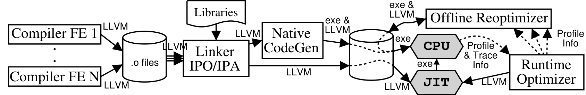
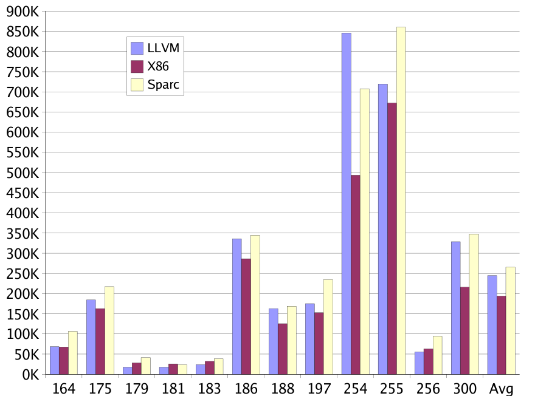
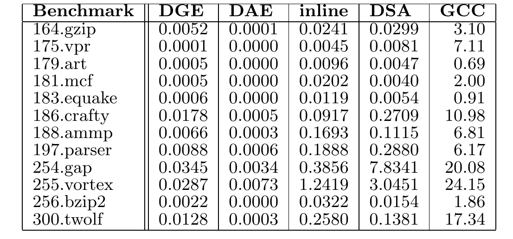

# LLVM: A Compilation Framework for Lifelong Program Analysis & Transformation（中文译文）

## 译者说明

本文依据同目录的 `source.pdf` 翻译。章节、图表、公式、算法、代码与参考文献按原文结构保留。

## 作者

Chris Lattner、Vikram Adve

University of Illinois at Urbana-Champaign

## 摘要

本文描述 LLVM（Low Level Virtual Machine），一个编译器框架，旨在通过在编译期、链接期、运行期和离线阶段向编译转换提供高级信息，支持任意程序的透明、贯穿生命周期的程序分析与转换。LLVM 定义了一种通用的低层代码表示，采用静态单赋值（SSA）形式，并包含若干新特性：简单且语言无关的类型系统，用于暴露实现高级语言特性常用的基本原语；用于类型化地址算术的指令；以及一种简单机制，可统一高效地实现高级语言异常处理和 C 中的 `setjmp/longjmp`。LLVM 编译器框架和代码表示共同提供了实践中进行长期程序分析和转换所需的一组关键能力。我们认为，当时没有其他编译方法同时提供这些能力。论文描述 LLVM 表示和编译框架的设计，并从三个方面评估：表示的大小和有效性，包括其类型信息；若干过程间问题上的编译器性能；以及 LLVM 对多个困难编译问题的帮助示例。

## 1. 引言

现代应用规模不断增长，动态性越来越强，其行为会在执行过程中变化，而且常由多种语言编写的组件构成。有些应用只有少量热点，另一些应用的执行时间却均匀分布在整个程序中 [11]。为了让所有这类程序都尽可能高效，我们认为程序分析和转换必须贯穿程序的整个生命周期。这样的“终身代码优化”包括：在链接期执行过程间优化，以保留独立编译的好处；在每个系统的安装期执行机器相关优化；在运行期执行动态优化；以及利用最终用户收集的 profile，在两次运行之间的“空闲期”进行 profile-guided 优化。

终身分析和转换的用途并不限于程序优化。静态调试、静态泄漏检测 [22]、内存管理转换 [26] 等新兴静态分析应用，本质上都是过程间分析，因此最适合在链接期执行。用于实施程序安全性的复杂分析和转换，则必须在软件安装期或加载期执行 [17]。允许程序在整个生命周期中反复优化，还使处理器架构设计者能够更灵活地演进处理器及其公开接口 [10, 18]，同时让旧应用在新系统上继续高效运行。

本文提出 LLVM（Low-Level Virtual Machine），一个旨在让任意软件都能以对程序员透明的方式获得终身程序分析和转换能力的编译器框架。LLVM 通过两部分实现这一目标：其一，一种具有若干新特性的代码表示，可共同用于分析、转换和代码分发；其二，一种利用该表示的编译器设计，提供我们所知以往任何编译方法都未同时具备的一组能力。

LLVM 代码表示使用抽象的、类似 RISC 的指令集来描述程序，同时保留有效分析所需的关键高级信息，包括类型信息、显式控制流图，以及使用无限个有类型寄存器、以静态单赋值形式表示的显式数据流 [14]。该表示具有四项新特性：

1. 一套低层、语言无关的类型系统，可用来实现高级语言中的数据类型和操作，并向所有优化阶段暴露其实现行为。
2. 在保留类型信息的同时执行类型转换和低层地址算术的指令。
3. 两条低层异常处理指令，用于实现语言特定的异常语义，同时向编译器显式暴露异常控制流。
4. 一个简单的低层内存模型，区分 heap、stack、global data 和 code 内存区域，并通过 typed pointer 访问它们。

LLVM 表示与源语言无关有两个原因。第一，它使用仅比标准汇编语言稍丰富的低层指令集和内存模型，类型系统也不妨碍表示只有少量类型信息的代码。第二，它不对程序施加任何特定的 runtime 要求或语义。但 LLVM 并非通用编译器 IR：它不直接表示高级语言特性，因而不能用于某些语言相关转换；它也不捕获后端代码生成器所用的机器相关特性或代码序列，而必须进一步 lowering 后才能做到。

由于目标和表示不同，LLVM 与 SmallTalk、Self、JVM、Microsoft CLI 等高层虚拟机是互补关系，而非替代关系。二者有三个关键区别：第一，即使源语言具有 class、inheritance 或 exception-handling semantics，LLVM 也没有这些高级构造的概念；第二，LLVM 不规定 runtime system 或特定 object model，其层次足够低，特定语言的 runtime system 本身也能用 LLVM 实现，高层虚拟机甚至可以构建在 LLVM 之上；第三，LLVM 与物理处理器的汇编语言一样，不保证 type safety、memory safety 或语言互操作性。

LLVM 编译框架利用该代码表示，同时提供我们认为支持任意程序终身分析与转换所必需的五项能力：

1. **终身编译模型。** 通过保存 LLVM 代码表示，可在应用生命周期的所有阶段执行复杂优化，包括运行期以及两次运行之间的空闲期。
2. **离线代码生成。** 尽管保留了后续优化能力，仍可在离线阶段使用不适合运行时代码生成的激进技术，把程序编译为高效本机机器码；这对终身优化最重要的目标——性能关键程序——至关重要。
3. **基于用户的剖析与优化。** LLVM 框架在最终用户环境的运行期收集 profile，使其能代表真实使用方式，并可在运行期和空闲期用于 profile-guided 转换。空闲期优化器在论文写作时仍属计划功能，尚未实现。
4. **透明的运行时模型。** 系统不规定任何特定 object model、异常语义或 runtime environment，因而任何语言或语言组合都可以编译到 LLVM。
5. **统一的全程序编译。** 语言无关性使链接后的整个应用都能以统一方式优化和编译，包括语言特定 runtime library 和 system library。

我们认为此前没有系统同时提供这五项特性。源代码级编译器提供第 2、4 项，却不尝试提供第 1、3、5 项；商业编译器中常见的链接期过程间优化器，在链接期额外提供第 1、5 项，但不能把表示保留到运行期或部署后；JVM、CLI 等高层虚拟机提供第 3 项和第 1 项的大部分能力，却不提供第 2、4、5 项；本机二进制运行时优化系统提供第 2、4、5 项，只部分提供第 3 项，并且不提供第 1 项。第 3 节将进一步解释这些差异。

我们从三方面评估 LLVM 系统：表示的大小与有效性，包括能否从 C 程序中提取有用类型信息；编译器性能——并非生成代码的性能，后者取决于所用代码生成器和优化序列；以及若干示例，说明 LLVM 为困难编译问题提供的关键能力。

本文的总体贡献如下：

- LLVM 定义了丰富的低层代码表示：它具有低层操作和内存模型，也保留了强大的语言无关分析与转换所需的丰富类型、控制流和数据流信息，并通过前述新指令集特性实现这些目标。
- LLVM 编译器框架为任意程序提供透明的终身分析和优化，具备上述五项有效终身代码分析与优化所必需的能力。据我们所知，它在这一点上是独一无二的。
- 实验结果表明，在一组 SPECINT 2000 C benchmark 中，LLVM 编译器平均能够证明 74.6% 的内存访问是类型安全的。我们的实践还表明，LLVM 捕获的类型信息足以安全执行多种激进转换，而传统上只有源代码级编译器面对 type-safe language 时才会尝试这些转换。LLVM 表示的大小与 SPARC 机器码相当，尽管保留了丰富得多的类型信息和 SSA 形式的无限寄存器集合，平均也仅比 x86 代码大约 25%。示例计时还表明，LLVM 表示适合极高效的过程间优化。

截至论文写作时，LLVM 实现支持传统上完全静态编译的 C 和 C++；我们也在探索 LLVM 能否有益于 JVM、CLI 等动态 runtime 的实现。LLVM 以非限制性许可免费提供，主页为 [http://llvm.cs.uiuc.edu/](http://llvm.cs.uiuc.edu/)。下文第 2 节介绍 LLVM 代码表示，第 3 节介绍编译器框架设计，第 4 节讨论评估，第 5 节比较相关系统，第 6 节总结全文。

## 2. LLVM 代码表示

LLVM 表示是 LLVM 区别于其他系统的关键因素之一。我们认为其中有三项具体设计是新的：LLVM type system 与实现 type-safe pointer arithmetic 的 `getelementptr` 指令；LLVM memory model；以及用于实现源语言异常处理特性的 `invoke` 和 `unwind` 指令。本节概述 LLVM 指令集，介绍这些特性，并简述其离线表示和内存表示；详细语法和语义由 LLVM Language Reference Manual 定义 [25]。

### 2.1 指令集概览

LLVM 指令集捕获普通处理器的关键操作，却避免物理寄存器、pipeline、低层 calling convention 等机器相关约束。LLVM 提供无限个有类型虚拟寄存器，可保存 primitive type 的值，包括 boolean、integer、floating point 和 pointer。这些虚拟寄存器采用静态单赋值形式 [14]。LLVM 是 load/store 架构：程序只能通过使用 typed pointer 的 `load` 和 `store` 操作，在寄存器与内存之间传值；LLVM memory model 将在 2.3 节介绍。

整个 LLVM 指令集只有 31 个 opcode。其一，同一操作不会设置多个 opcode，例如不提供一元操作符，`not` 和 `neg` 分别用 `xor` 和 `sub` 表示。其二，大部分 opcode 都按类型重载，例如 `add` 可作用于任意整数或浮点 operand type。包括全部算术和逻辑操作在内的大多数指令使用三地址形式：接收一到两个 operand，产生一个结果。

LLVM 以 SSA 作为主要代码表示：每个 SSA register 恰好定义一次，每次使用都由其定义支配。指令集包含显式 `phi` 指令，直接对应标准的非 gated SSA $\phi$ 函数。SSA 简化了许多数据流优化，并使快速的 flow-insensitive 算法无需昂贵数据流分析，就能获得 flow-sensitive 算法的许多好处；由于寄存器不存在 alias，它还显著简化了多种转换。

LLVM 也在表示中显式给出每个函数的控制流图。一个函数由一组 basic block 构成，每个 basic block 是一串 LLVM 指令，并恰好以一条 terminator instruction 结束；terminator 可以是 branch、return、`unwind` 或 `invoke`，后两者将在下文解释。每条 terminator 都显式指定其 successor basic block。

### 2.2 语言无关类型信息、Cast 与 GetElementPtr

LLVM 的一项基本设计特性是加入语言无关的类型系统。每个 SSA register 和显式 memory object 都有关联类型，所有操作都遵循严格的类型规则。类型信息与指令 opcode 共同决定指令的精确语义，例如区分浮点加法与整数加法。这使大量面向低层代码的高级转换成为可能（参见 4.1.1 节），也可利用类型不匹配来发现优化器缺陷。

LLVM type system 包含大小预先定义、与源语言无关的 primitive type：`void`、`bool`、8 至 64 位有符号/无符号整数，以及单精度和双精度浮点。这使程序能够但并非必须利用这些类型编写可移植代码。LLVM 还仅包含四种 derived type：pointer、array、structure 和 function。我们认为，从操作行为看，大多数高级语言数据类型最终都能用这四种类型的某种组合来表示，例如 4.1.2 节讨论的带继承 C++ class。

LLVM 的 `cast` 指令把一个类型的值转换为任意另一类型，这是支持 C 等非 type-safe language 所必需的，也是转换值类型的唯一方式。不存在 cast 的程序在排除数组越界等内存访问错误时必然 type-safe [17]。积极的过程间优化也可利用 LLVM type 检查多种转换的正确性。即使允许把值任意 cast 为其他类型，4.1.1 节仍表明，用 LLVM 编译的 C 程序在大部分内存访问上都能获得可靠类型信息。

在低层代码中保留类型信息的一项关键难题是地址算术。LLVM 使用 `getelementptr` 执行 type-safe pointer arithmetic：给定指向某个 aggregate type 对象的 typed pointer，该指令以保留类型的方式计算对象子元素的地址，效果相当于 LLVM 中组合的 `.` 与 `[]` 操作符。给定 structure pointer 和字段编号时，它返回字段 pointer；给定 array pointer 和整数索引时，它返回指定元素的 pointer。`load` 和 `store` 只接收一个 pointer，本身不执行 indexing，因此内存访问的处理简单而统一。

### 2.3 显式内存分配与统一内存模型

LLVM 提供有类型的内存分配指令。`malloc` 在 heap 上分配一个或多个特定类型的元素并返回 typed pointer，`free` 释放由 `malloc` 分配的内存；生成本机代码时，这两条指令会转换为适当的本机函数调用，因此仍可使用自定义内存分配器。`alloca` 与 `malloc` 类似，但在当前函数的 stack frame 而非 heap 中分配内存，并在函数返回时自动释放。所有 stack-resident data，包括 automatic variable，都用 `alloca` 显式分配。

在 LLVM 中，所有可寻址对象（lvalue）都显式分配。Global variable 和 function definition 定义的 symbol 提供对象地址，而非对象本身。这形成了统一内存模型：包括 `call` 在内的全部内存操作都通过 typed pointer 执行。不存在对内存的隐式访问，简化了内存访问分析，表示中也不需要 address-of operator。

### 2.4 函数调用与异常处理

对于普通函数调用，LLVM 提供 `call` 指令，接收 typed function pointer（可以是函数名，也可以是实际 pointer value）和有类型的 actual argument。它抽象掉底层机器的 calling convention，简化程序分析。

LLVM 最不寻常的特性之一，是为高级语言异常处理提供显式、低层且机器无关的实现机制。相同机制也支持 C 的 `setjmp` 和 `longjmp`，使这些操作能像其他语言的异常特性一样接受分析和优化。该通用异常机制基于 `invoke` 与 `unwind` 两条指令。

`invoke` 和 `unwind` 共同支持一种逻辑上基于 stack unwinding 的抽象异常处理模型；LLVM 到本机代码的生成器既可使用“零成本”的表驱动方法 [8]，也可用 `setjmp/longjmp` 实现。`invoke` 的行为与 `call` 类似，但为调用额外关联一个 basic block，作为 exception handler 的起始 block。程序执行 `unwind` 时，逻辑上不断弹栈，直到移除由 `invoke` 创建的 activation record，再把控制转移到该 `invoke` 指定的 basic block。这两条指令在 LLVM CFG 中显式暴露异常控制流，是其设计的关键方面。

这两条原语可实现多种异常处理机制；当时的 LLVM 已支持 C 的 `setjmp/longjmp`，并完整支持 C++ exception model。`unwind` 用来实现高级语言中的抛出异常和 `longjmp`；异常抛出时必须执行的代码，例如 `setjmp`、catch block、C++ automatic variable destructor 等，则使用 `invoke` 停止展开、执行所需代码，然后按需继续执行或继续展开。

图 1 的例子说明：C++ 前端会生成 `invoke`，从而在 `func()` 调用抛出异常时执行 stack-allocated `Object` 的析构函数。

**图 1：C++ 异常处理示例。**

```cpp
{
  Class Object; // Has a destructor
  func();       // Might throw
  ...
}
```

对应的 LLVM 表示显式区分普通返回目标和异常目标。`invoke` 在正常路径跳到 `OkLabel`，在异常路径跳到 `ExceptionLabel`；异常路径先调用析构函数，再用 `unwind` 继续传播。

**图 2：该示例对应的 LLVM 代码。**

```llvm
...
; Allocate stack space for object:
%Object = alloca %Class, uint 1

; Construct object:
call void %Class::Class(%Class* %Object)

; Call "func()":
invoke void %func() to label %OkLabel
        except label %ExceptionLabel

OkLabel:
  ; ... execution continues...

ExceptionLabel:
  ; If unwind occurs, execution continues here.
  ; First, destroy the object:
  call void %Class::~Class(%Class* %Object)
  ; Next, continue unwinding:
  unwind
```

Java 前端会生成类似代码，以便异常抛出时释放通过 synchronized block 或 method 获得的锁。C++、Java、OCaml 等语言中的 catch clause 可直接用 exception destination 实现；高级语言的全部异常语义都由 exception block 中调用的 runtime library 编写。

### 2.5 文本、二进制与内存表示

LLVM 表示是一种 first-class language，定义了等价的文本、二进制和内存中（即编译器内部）表示。指令集既能有效充当持久、离线的代码表示，也能充当编译器内部表示，二者之间不需要语义转换。相比之下，典型 JVM 实现会把离线使用的 stack-based bytecode 转为适合编译器转换的表示，有些还会为此转成 SSA [7]。LLVM 代码可在三种表示之间无信息损失地转换，这使转换调试更简单、测试用例更容易编写，也减少了理解内存中表示所需的时间。

## 3. LLVM 编译器框架

LLVM 编译器框架的目标，是在程序生命周期的所有阶段操作其 LLVM 表示，从而在链接期、运行期以及应用安装到用户环境后执行复杂转换。要具备实用性，该过程必须对应用开发者和最终用户透明，也必须足够高效，能够用于现实应用。本节说明整个系统及其各组件如何实现这些目标。

### 3.1 高层设计

图 3 给出 LLVM 系统的高层架构。简言之，静态编译器前端生成 LLVM 表示，LLVM linker 把这些表示合并。Linker 执行多种 link-time optimization，然后为给定目标生成高度优化的 native code——也可以推迟到安装期——并把 LLVM code 与 native code 一同保存。运行期使用轻量 instrumentation 检测程序热点并执行简单运行时优化；runtime optimizer 收集的程序行为可附回程序，使 offline optimizer 能在用户环境的空闲期，利用最终用户而非开发者运行得到的 profile，执行激进的 profile-driven interprocedural optimization。



**图 3：LLVM 系统架构。**

与传统静态编译成本机机器码的模型相比，这一策略同时提供引言所列的五项能力：终身编译模型、离线代码生成、基于用户的剖析与优化、透明 runtime model，以及统一的全程序编译。至少有两个原因使它们难以同时获得：第一，离线代码生成通常只留下 native machine code，无法在后续阶段继续对高级表示优化；第二，终身编译传统上只与基于 bytecode 的语言关联，而这类语言不提供透明 runtime model。

引言指出，此前没有编译方法同时提供全部能力，详细原因如下：

- 传统源代码级编译器提供离线代码生成和透明 runtime model，却不尝试终身编译、基于用户的剖析与优化或统一全程序编译。它们确实提供过程间优化，但需要显著修改应用 Makefile。
- 一些商业编译器把中间表示导出到 object file，并在链接期执行优化 [19, 4, 23]，因而在链接期额外提供终身编译和统一全程序编译；但我们所知没有此类系统还能把表示保留到运行期或离线阶段。
- JVM、CLI 等高层虚拟机提供基于用户的剖析与优化，部分提供终身编译——bytecode verification 的需要会严格限制运行期之前能执行的优化——也部分支持多语言的统一编译。它们通常只有采用 JIT code generation 时才能执行运行时优化，因而不提供离线代码生成；它们也不追求透明 runtime model，而是为匹配其 runtime 和 object model 的 Java、C# 等语言提供丰富 runtime framework。
- Dynamo 和 Transmeta 处理器中的 runtime optimizer 等透明二进制运行时优化系统，提供离线代码生成、透明 runtime model 和统一全程序编译，却不提供终身编译；它们只能有限地利用最终用户运行信息，因为必须处理 native binary code，限制了可执行的优化。Omniware [1] 提供离线代码生成、透明 runtime model，也可能支持统一全程序编译，但它的表示不适合高级分析和优化。
- 静态语言的 Profile Guided Optimization 以不透明的多阶段编译流程为代价，提供基于用户的剖析与优化。此外，PGO 有三项主要问题：开发者在 benchmark 之外很少实际使用；训练运行若不代表最终用户使用方式，profile 反而可能使程序劣化；profile 完全静态，编译器无法利用程序的阶段行为，也不能适应变化的使用模式。

LLVM 策略同样存在限制。第一，语言特定优化必须由前端在生成 LLVM code 之前完成，因为 LLVM 并非面向所有源语言的通用表示。第二，对于 Java 这类需要复杂 runtime system 的语言能否直接受益于 LLVM，当时仍是开放问题；我们正在探索在 LLVM 之上实现 JVM、CLI 等高层虚拟机的潜在收益。

以下各小节介绍 LLVM 编译器架构的关键组件，重点说明让上述能力变得实用而高效的设计与实现特性。

### 3.2 编译期

外部静态 LLVM 编译器（即前端）把源语言程序翻译成 LLVM 虚拟指令集。每个静态编译器可执行三项关键任务，其中第一项和第三项可选：执行语言特定优化，例如优化具有 higher-order function 的语言中的 closure；把源程序翻译为 LLVM code，并尽量保留数据值的有用类型信息；在 module 层调用 LLVM pass 做 global 或 interprocedural optimization。LLVM 优化构建成 library，前端可以方便使用。前端无需自行构造 SSA，而可先把变量分配到不采用 SSA 的 stack，再用 LLVM stack promotion pass 建立 SSA。

许多所谓“高级”优化并不依赖语言，而是更一般优化的特殊情形，例如 4.1.2 节所述的 C++ virtual function resolution。此时扩展 LLVM optimizer 通常比只为特定前端投入工作更有价值，也能让这些优化贯穿程序生命周期。

### 3.3 链接期

链接期是编译过程中大部分程序首次同时可用于分析和转换的阶段，因此天然适合跨整个程序执行激进的过程间优化。链接期优化直接作用于 LLVM，并能利用其中包含的语义信息。共享库和系统库可能在链接期不可用，或者可能已直接编译为 native code，所以这里是“大部分”而非绝对全部程序。

编译期与链接期优化器的设计还允许使用一种著名技术加速过程间分析：编译期可以为程序中每个函数计算 interprocedural summary，并附到 LLVM bytecode；链接期过程间优化器随后直接处理这些 summary，不必从头计算结果。当只修改少量 translation unit 时，这能显著加快增量编译 [6]，且无需建立 program database，也无需把输入源代码的编译推迟到链接期。

### 3.4 离线或 JIT 本机代码生成

链接期优化后，系统选择代码生成器把 LLVM 转为当前平台的 native code；当时支持 SPARC V9 和 x86。第一种配置是在链接期离线、即静态运行代码生成器，使用可能很昂贵的代码生成技术为应用生成高性能 native code。若用户决定启用链接后的运行时和离线优化器，整个程序的 LLVM bytecode 副本会嵌入 executable，以排除 runtime/offline optimizer 取得错误版本 bytecode 的可能性。代码生成器还会插入轻量 instrumentation，用来识别频繁执行的 loop region。

另一种配置使用 Just-in-Time Execution Engine，在运行期调用适当代码生成器，逐函数翻译并执行；若没有可用的本机代码生成器，则使用可移植 LLVM interpreter。

### 3.5 运行时路径剖析与重优化

LLVM 项目的目标之一，是为普通应用开发一种新的运行时优化策略。程序执行时，系统结合离线和在线 instrumentation 识别最常执行的路径。前述离线 instrumentation 在生成 native code 之前插入，用来识别经常执行的 loop region；在线 instrumentation library 再对这样的 hot loop region 插桩，以识别其中频繁执行的 path。识别出 hot path 后，系统把原 LLVM code 复制成 trace，对其执行 LLVM optimization，再生成 native code 放入 software trace cache，并把本机代码接入现有应用代码，供之后执行。

该策略结合了三项特性：第一，可提前用复杂算法生成 native code，得到高性能初始代码；第二，native code generator 与 runtime optimizer 都属于 LLVM 框架，能够协作，让 runtime optimizer 利用代码生成器对 instrumentation 和简化转换等方面的支持；第三，runtime optimizer 可利用 LLVM 表示中的高级信息执行复杂运行时优化。我们认为这三项特性共同构成 runtime optimizer 的一个“最优”设计点：初始代码可离线而非在线生成，代码生成器能协作提供支持，优化器又能处理 LLVM 而非 native code，从而执行激进优化。

### 3.6 使用最终用户 profile 的离线重优化

有些应用并不特别适合运行时优化：它们常包含大量代码，却没有任何一部分特别“热”。Runtime optimizer 无力花费大量时间改进其中任一部分，但仍可检测程序最常执行的 path，用于 code layout optimization。

为了支持这些应用，以及需要昂贵分析或转换的其他优化，系统可以使用 offline reoptimizer。它设计为在用户计算机空闲时运行，因而能比 runtime optimizer 激进得多。Offline reoptimizer 把 runtime optimizer 收集的 profile 与 LLVM 结合起来，优化并重新编译应用；这样就能执行激进的 profile-driven interprocedural optimization，又不与应用争抢处理器周期。应用使用模式随时间变化时，runtime 与 offline reoptimizer 可以协作，以保证尽可能高的性能。

## 4. 应用与经验

第 2、3 节介绍了 LLVM 代码表示和编译器架构。本节从三类问题评估该设计：表示的有效性；编译器执行全程序分析和转换的速度；以及 LLVM 系统在困难编译问题上的示例用途，重点说明其新能力如何帮助这些应用。

### 4.1 表示问题

LLVM 表示的一项关键贡献是语言无关类型系统。但 cast 可以违反类型规则，这套类型系统是否仍有根本价值？高级语言特性（例如 class）如何映射到 LLVM type system 和代码表示？最后，LLVM 表示写入磁盘后有多大？

#### 4.1.1 类型信息有何价值

可靠的程序类型信息能让优化器执行原本很困难的激进转换，例如重新排列 structure 的两个字段，或优化内存管理 [26]。但 LLVM 是 weakly typed language，声明类型并不可靠；使用之前必须通过某种分析——通常包括 pointer analysis——检查这些声明类型。关键问题是：编译为 LLVM 的程序中究竟有多少可靠类型信息？

LLVM 包含一个称为 Data Structure Analysis（DSA）的 points-to analysis [27]，它是 flow-insensitive、field-sensitive 且 context-sensitive；Automatic Pool Allocation [26] 等多项 LLVM 转换以 DSA 为主要基础。分析期间，DSA 从 LLVM 表示中提取它已验证为 type-safe access 的 memory object 类型。具体做法是把表示中的类型当作推测性类型信息，再保守检查它是否正确。DSA 不做 type inference，只验证内存访问与声明类型是否一致。事实上，DSA 相当积极：即使对象被存入通用的 `void*` data structure，之后再取出，存在来回 cast，它也常能证明对象是 type-safe 的。

我们在多种 benchmark 上测量了具有可靠对象类型信息的静态 `load` 和 `store` 操作比例。表 1 给出 SPEC CPU2000 C benchmark 的结果；Olden、Ptrdist 等更简单的 benchmark 结果更好，大多接近 100%。

表 1：可证明为 typed 的 Load 和 Store。

| Benchmark | Typed accesses | Untyped accesses | Typed percent |
| --- | ---: | ---: | ---: |
| 164.gzip | 1674 | 15 | 99.1% |
| 175.vpr | 3986 | 400 | 90.9% |
| 179.art | 585 | 0 | 100.0% |
| 181.mcf | 581 | 0 | 100.0% |
| 183.equake | 881 | 48 | 94.8% |
| 186.crafty | 9849 | 603 | 94.2% |
| 188.ammp | 1570 | 3279 | 32.4% |
| 197.parser | 1532 | 2207 | 41.0% |
| 254.gap | 6578 | 15508 | 29.8% |
| 255.vortex | 15845 | 8725 | 64.5% |
| 256.bzip2 | 1020 | 52 | 95.1% |
| 300.twolf | 7279 | 7249 | 50.1% |
| average | | | 74.3% |

表中许多程序（164、176、179、181、183、186 和 256）在编程语言并不强制类型安全的情况下，仍出人意料地 type-safe。其他程序丢失 type safety 的主要原因，是使用自定义内存分配器（197、254、255 和 300），以及 DSA 在 188 上还不够激进。即使使用自定义分配器，DSA 仍能证明相当一部分访问是 type-safe 的。由于 LLVM 缺陷，我们未能在投稿前取得 `176.gcc`、`177.mesa` 和 `253.perlbmk` 的数据。

如果 LLVM 是无类型表示，要得到类似结果会困难得多。早期 C-to-LLVM 前端以 GCC 的 RTL 内部表示为基础，提供的有用类型信息很少，DSA 和 pool allocation 的效果也差得多。新的 C 前端以 GCC 前端的 AST 表示为基础，因而可以获得丰富得多的类型信息。

#### 4.1.2 高级特性如何映射到 LLVM

与源语言相比，LLVM 是低得多的表示。即使 C 本身已经很低层，面向 LLVM 的编译器仍须 lowering complex number、structure copy、union、bit-field、variable-sized array 和 `setjmp/longjmp` 等特性。为使表示支持有效分析和转换，源语言特性到 LLVM 的映射应尽可能清晰地捕获其高级操作行为。

下面以 C++ 为例讨论这个问题，因为它是我们已经实现前端的语言中最丰富的一种。我们认为，C++ 的复杂高级特性都能在 LLVM 中清楚表达，使其行为可以得到有效分析和优化：

- Implicit call（例如 copy constructor）和 implicit parameter（例如 `this` pointer）都会显式化。
- C++ 前端会在生成 LLVM code 之前完整实例化 template。
- Base class 会展开成嵌套的 structure type。例如：

  ```cpp
  class base1 { int Y; };
  class base2 { float X; };
  class derived : base1, base2 { short Z; };
  ```

  `derived` class 的 LLVM type 是 `{{int}, {float}, short}`。若这些 class 具有 virtual function，还会包含 vtable pointer，并在分配对象时初始化为指向下述 virtual function table。
- Virtual function table 表示为一个全局常量表，由 typed function pointer 和 class 的 type-id object 构成。LLVM optimizer 可以像典型源代码级编译器一样有效地解析 virtual method call；若源代码级编译器只做每 module 而非全程序 pointer analysis，LLVM 甚至更有效。
- 如 2.4 节所述，C++ exception 会 lowering 为 `invoke` 和 `unwind`，在 CFG 中暴露异常控制流。该信息在链接期可用，使 LLVM 能通过过程间分析消除未使用的 exception handler；若源代码级编译器只能逐 module 执行，这项优化的效果会弱得多。

我们认为，Scheme、SmallTalk、ML 系列、Java 和 Microsoft CLI 中的大多数构造也能得到同样清晰的 LLVM 实现，重要例子包括 closure 和 continuation。我们计划继续探索；Java 和 Scheme 前端的初步实现工作已经开始。

#### 4.1.3 LLVM 表示有多紧凑

由于编译后程序的代码在其整个生命周期内都以 LLVM 表示保存，该表示不能过大。LLVM 的平坦三地址形式很适合简单线性布局，文件中的大多数指令只需一个 32-bit word。图 4 比较链接后的 SPEC CPU2000 LLVM 文件，与 GCC 3.3 同样使用 `-O3` 生成的本机 x86 和 32-bit SPARC executable 大小。



**图 4：LLVM、x86 与 SPARC 可执行文件大小。**

图中可见，LLVM code 与 SPARC 本机 executable 大致相同，平均约比指令密度高得多的变长 x86 指令集大 25%。考虑到 LLVM 还编码了本机 executable 不具备的丰富类型信息、控制流信息和 SSA 数据流信息，我们认为这是很好的结果。当时尚未尝试优化 bytecode 文件大小，未来还可能进一步减小。

#### 4.1.4 LLVM 有多快

LLVM 的一个重要方面，是低层表示通过小而统一的指令集、显式 CFG 与 SSA 表示，以及谨慎实现的数据结构，使分析和转换可以高效执行。这一速度对链接期、运行期等编译流程后期的用途十分重要。图 5 给出若干过程间优化的运行时间，全部在 3.06 GHz Intel Xeon 处理器上采集。



**图 5：过程间优化耗时（秒）。**

图中包括 DGE（aggressive Dead Global Variable and Function Elimination）、DAE（aggressive Dead Argument Elimination）、`inline`（function integration pass）、DSA（Data Structure Analysis），以及作为参照的 GCC，即 GCC 3.3 以 `-O3` 编译程序的时间。这些过程间优化都在链接期处理整个程序。“Aggressive” dead elimination 会先假定对象已死，除非证明它仍存活，因此能删除形成环的 dead object。

所有情况下，优化时间都明显少于 GCC 编译程序的时间，尽管 GCC 不做 cross-module optimization，在单个 translation unit 内也只做很少的 interprocedural optimization。DGE 和 DAE 只需接触程序的一小部分就能完成分析，因此非常高效。Inlining pass 也相当快，耗时与实际 inline 次数呈线性关系；例如 `255.vortex` inline 了 792 个函数，并删除了后来变为 dead 的 292 个函数体。DSA 是其中最激进的分析，主要因为它是 context-sensitive、field-sensitive、flow-insensitive pointer analysis，但与 GCC 相比仍相对很快。

### 4.2 使用生命周期分析与优化能力的应用

最后，为说明该编译器框架提供的能力，我们简要介绍 LLVM 面向三类迥异编译问题的应用示例；这些示例使用了引言中描述的新能力。

#### 4.2.1 通用编译基础设施

如前所述，我们已经在 LLVM 中实现了多种编译技术。其中最激进的是 Data Structure Analysis（DSA）和 Automatic Pool Allocation [26]，它们依据程序的逻辑数据结构分析并转换程序。这些技术从 LLVM 获得了几项显著收益：第一，只有在程序的大部分代码都可用、也就是链接期时，它们才有效；第二，类型信息对其有效性至关重要；第三，这些技术与源语言无关；第四，SSA 显著提高了 flow-insensitive DSA 的精度。

与我们研究组无关的其他研究人员，也在积极使用或探索 LLVM 编译器框架的多种用途，包括：把 LLVM 用作 binary-to-binary transformation 的中间表示；用作支持硬件 trace cache 与优化系统的 compiler backend；作为 Grid 程序 runtime optimization 和 adaptation 的基础；以及用作 embedded code 的 memory partitioning 与 optimization 编译器。

#### 4.2.2 SAFECode：安全低层表示与执行环境

SAFECode 以 LLVM 的 type-safe subset 为基础，提供一种“安全”的代码表示和执行环境。我们的目标是通过 static analysis 强制保证 SAFECode 表示中程序的 memory safety：使用 Automatic Pool Allocation 的一种变体而不是垃圾回收 [17]，并使用广泛的 interprocedural static analysis 把 runtime check 降到最低 [24, 17]。

SAFECode 系统使用了 LLVM 框架除 runtime optimization 之外的几乎全部能力。它直接使用 LLVM 代码表示，因此能够分析 C 和 C++ 程序；这一点对于支持 embedded software、middleware 和 system library 至关重要。SAFECode 依靠 LLVM 中的类型信息（不改变语法）检查并强制保证 type safety；依靠 LLVM 中的数组类型信息强制保证 array bounds safety，并使用 interprocedural analysis 在许多情况下消除运行时边界检查 [24]。它还使用 interprocedural safety checking 技术，借助链接期框架在利用过程间技术的同时保留 separate compilation 的好处；这是一个关键难题，曾导致许多相关系统避免采用过程间技术 [16, 21]。

#### 4.2.3 Virtual Instruction Set Computer 的外部 ISA

Virtual Instruction Set Computer 是一种处理器设计：程序的外部表示使用一套指令集架构（virtual ISA，即 V-ISA），具体实现中的实际 hardware ISA（I-ISA）则使用另一套。与硬件协同设计的软件 translator（实质上是复杂、面向具体实现的 backend compiler）把 V-ISA code 翻译成 I-ISA；它也是唯一知道 I-ISA 的软件。

在近期工作中，我们论证了扩展版 LLVM 指令集可作为这类处理器设计的外部 V-ISA [2]。我们还提出了一种新的 virtual-to-native translator 实现策略，能以完全独立于操作系统的方式离线翻译代码并缓存翻译结果。那项工作的目标和贡献与本文有很大不同，不过二者都以 LLVM 指令集为基础。

该工作利用指令集表示的重要特性，并扩展它以适合作为硬件的 V-ISA。LLVM 对这项工作的根本好处在于：LLVM 代码表示足够低层，可以表示包括操作系统代码在内的任意外部软件；同时又提供足够丰富的信息，支持 translator 使用复杂编译技术。第二项关键好处是同时支持 offline 和 online translation，而独立于操作系统的翻译策略正利用了这一能力。

## 5. 相关工作

我们重点把 LLVM 与三类既有工作比较：其他基于 virtual machine 的 compiler system、typed assembly language 研究，以及 link-time 或 dynamic optimization system。

如引言所述，LLVM 与 SmallTalk、Self、JVM 和 Microsoft CLI 等高层语言 virtual machine 的目标互补。前文已经指出 LLVM 与这些系统在目标上的三项关键差异，此处不再重复。Omniware virtual machine [1] 或许与 LLVM 最相似：它使用抽象的低层 RISC architecture，并能支持多种源语言。然而，那项工作的目标是提供 safety，而不是 performance；尤其是，它不包含 lifelong optimization 所需的高层信息。

Typed intermediate representation 领域也已有广泛研究。Functional language 通常把 strongly typed intermediate language（例如 [31]）作为源语言的自然延伸。Typed assembly language 项目（例如 TAL [28] 和 LTAL [9]）关注在编译和优化期间保留高层类型信息与 type safety。SafeTSA [3] 表示把类型信息与 SSA form 结合起来，目标是为 Java 程序提供一种比 JVM bytecode 更安全且更高效的表示。相比之下，LLVM virtual instruction set 并不试图保留高层语言的 type safety、捕获这类语言的高层类型信息，或直接强制保证 code safety（尽管 LLVM 可以用来实现这些目标）。LLVM 的目标是支持超越静态编译阶段的复杂分析与转换。

还有一些工作试图定义统一、通用的中间表示，但基本没有成功：从最初只被讨论、从未实现的 UNiversal Computer Oriented Language [33]（UNCOL），到近年虽已实现但应用有限的 Architecture and language Neutral Distribution Format [13]（ANDF）。这些统一表示尝试在 AST 层描述程序，因此必须包含所有可能源语言的特性。LLVM 的目标远没有如此宏大，它更像汇编语言：只使用少量类型和低层操作，而高级语言特性的“实现”则由这些类型来描述。从某些方面看，LLVM 就像一种非常严格的 RISC architecture。

Kistler 和 Franz 描述了一种用于在部署现场执行优化的编译架构：先在加载时进行简单的初始代码生成，再执行 profile-guided runtime optimization 和 offline optimization。其系统使用 Slim Binaries [20] 作为代码表示，这是一种非常紧凑的 tree-based code representation。Kistler 和 Franz 指出也可使用其他表示；LLVM 可以直接用在该架构中，从而不必像他们建议的那样，在每次重新编译时重建 SSA form。

一些系统会在链接期执行 interprocedural optimization。其中有些处理特定处理器的 assembly code [29, 32, 12, 30]，主要关注 machine-dependent optimization；另一些则从静态编译器导出附加信息，形式可以是 IR 或 annotation [34, 19, 4, 23]。这些方法都没有尝试在软件部署后支持 runtime optimization 或 offline optimization，也很难直接扩展成这样做。

还有若干系统对 native code 执行透明的 runtime optimization [5, 18, 15]。除了必须满足运行时优化的严格时间限制，这些系统还继承了优化机器级代码的全部难题 [29]。相比之下，LLVM 旨在为 runtime optimization 提供类型信息、数据流（SSA）信息和显式 CFG。例如，我们的 online tracing framework（3.5 节）直接利用 CFG，只在运行时对 hot loop region 做有限插桩。最后，无论是否使用 profile information，这些系统都不支持 link-time、install-time 或 offline optimization。

## 6. 结论

本文介绍了 LLVM：一个用于执行 lifelong code analysis 和 optimization 的系统。该系统在程序的整个生命周期内，都使用一种低层但 fully typed 的语言表示程序。由于 LLVM 表示与语言无关，程序的全部代码——包括 system library 和用多种语言编写的部分——都可以一起编译和优化。LLVM 编译器框架包括功能强大的链接期 interprocedural optimizer、用于 runtime trace-based optimization 的低开销 tracing 技术，以及 Just-In-Time 和 static code generator。

我们的实验和实践经验表明，即使对 C 程序，LLVM 也能提供丰富的类型信息；借助这些信息，可以安全执行多种激进转换，而源代码级编译器通常只会对 type-safe language 尝试这些转换。我们还表明，尽管 LLVM 捕获了丰富得多的类型信息，并以 SSA form 提供无限寄存器集合，其表示大小仍与 SPARC machine code 相当，平均只比 x86 code 大 25%。最后，我们表明，若干 whole-program optimization 都能在 LLVM 表示上非常快速地完成。当前正在探索的一个关键问题是：高层语言 virtual machine 能否有效地构建在 LLVM runtime optimization 与 code generation framework 之上。

## 参考文献

- [1] A.-R. Adl-Tabatabai, G. Langdale, S. Lucco, and R. Wahbe. Efficient and language-independent mobile programs. In Proceedings of the ACM SIGPLAN 1996 conference on Programming language design and implementation, pages 127–136. ACM Press, 1996.
- [2] V. Adve, C. Lattner, M. Brukman, A. Shukla, and B. Gaeke. A Low-level Virtual Instruction Set Architecture. page (to appear), San Diego, CA, Dec 2003.
- [3] W. Amme, N. Dalton, M. Franz, and J. ery. SafeTSA: A type safe and referentially secure mobile-code representation based on static single assignment form. In PLDI, June 2001.
- [4] A. Ayers, S. de Jong, J. Peyton, and R. Schooler. Scalable cross-module optimization. ACM SIGPLAN Notices, 33(5):301–312, 1998.
- [5] V. Bala, E. Duesterwald, and S. Banerjia. Dynamo: A transparent dynamic optimization system. In PLDI, pages 1–12, June 2000.
- [6] M. Burke and L. Torczon. Interprocedural optimization: eliminating unnecessary recompilation. TOPLAS, 15(3):367–399, 1993.
- [7] M. G. Burke, J.-D. Choi, S. Fink, D. Grove, M. Hind, V. Sarkar, M. J. Serrano, V. C. Sreedhar, H. Srinivasan, and J. Whaley. The Jalapeño Dynamic Optimizing Compiler for Java. In Java Grande, pages 129–141, 1999.
- [8] D. Chase. Implementation of exception handling. The Journal of C Language Translation, 5(4):229–240, June 1994.
- [9] J. Chen, D. Wu, A. W. Appel, and H. Fang. A provably sound TAL for back-end optimization. In PLDI, San Diego, CA, Jun 2003.
- [10] A. Chernoff, et al. FX!32: A profile-directed binary translator. IEEE Micro, 18(2):56–64, 1998.
- [11] R. Cohn, D. Goodwin, and P. Lowney. Optimizing Alpha executables on Windows NT with Spike. Digital Technical Journal, 9(4), 1997.
- [12] R. Cohn, D. Goodwin, P. Lowney, and N. Rubin. Spike: An optimizer for Alpha/NT executables, 1997.
- [13] A. Consortium. The Architectural Neutral Distribution Format, http://www.andf.org/.
- [14] R. Cytron, J. Ferrante, B. K. Rosen, M. N. Wegman, and F. K. Zadeck. Efficiently computing static single assignment form and the control dependence graph. TOPLAS, pages 13(4):451–490, October 1991.
- [15] J. C. Dehnert, et al. The Transmeta Code Morphing Software: Using speculation, recovery and adaptive retranslation to address real-life challenges. In Proc. 1st IEEE/ACM Symp. Code Generation and Optimization, San Francisco, CA, Mar 2003.
- [16] R. DeLine and M. Fahndrich. Enforcing high-level protocols in low-level software. In PLDI, Snowbird, UT, June 2001.
- [17] D. Dhurjati, S. Kowshik, V. Adve, and C. Lattner. Memory safety without runtime checks or garbage collection. In LCTES, San Diego, CA, Jun 2003.
- [18] K. Ebcioglu and E. R. Altman. DAISY: Dynamic compilation for 100% architectural compatibility. In ISCA, pages 26–37, 1997.
- [19] M. F. Fernández. Simple and effective link-time optimization of Modula-3 programs. ACM SIGPLAN Notices, 30(6):103–115, 1995.
- [20] M. Franz and T. Kistler. Slim binaries. Communications of the ACM, 40(12), 1997.
- [21] D. Grossman, G. Morrisett, T. Jim, M. Hicks, Y. Wang, and J. Cheney. Region-based memory management in cyclone. In PLDI, Berlin, Germany, June 2002.
- [22] D. L. Heine and M. S. Lam. A practical flow-sensitive and context-sensitive c and c++ memory leak detector. In Proceedings of the ACM SIGPLAN 2003 conference on Programming language design and implementation, pages 168–181. ACM Press, 2003.
- [23] IBM Corp. XL FORTRAN: Eight Ways to Boost Performance. White Paper, 2000.
- [24] S. Kowshik, D. Dhurjati, and V. Adve. Ensuring code safety without runtime checks for real-time control systems. In CASES, Grenoble, France, Oct 2002.
- [25] C. Lattner and V. Adve. LLVM Language Reference Manual. http://llvm.cs.uiuc.edu/docs/LangRef.html.
- [26] C. Lattner and V. Adve. Automatic Pool Allocation for Disjoint Data Structures. In Proc. ACM SIGPLAN Workshop on Memory System Performance, Berlin, Germany, Jun 2002.
- [27] C. Lattner and V. Adve. Data Structure Analysis: A Fast and Scalable Context-Sensitive Heap Analysis. Tech. Report UIUCDCS-R-2003-2340, Computer Science Dept., Univ. of Illinois at Urbana-Champaign, Apr 2003.
- [28] G. Morrisett, D. Walker, K. Crary, and N. Glew. From System F to typed assembly language. TOPLAS, 21(3):528–569, May 1999.
- [29] R. Muth. Alto: A Platform for Object Code Modification. Ph.d. Thesis, Department of Computer Science, University of Arizona, 1999.
- [30] T. Romer, G. Voelker, D. Lee, A. Wolman, W. Wong, H. Levy, B. Bershad, and B. Chen. Instrumentation and optimization of Win32/Intel executables using Etch. In Proc. USENIX Windows NT Workshop, August 1997.
- [31] Z. Shao, C. League, and S. Monnier. Implementing Typed Intermediate Languages. In International Conference on Functional Programming, pages 313–323, 1998.
- [32] A. Srivastava and D. W. Wall. A practical system for intermodule code optimization at link-time. Journal of Programming Languages, 1(1):1–18, Dec. 1992.
- [33] T. Steel. Uncol: The myth and the fact. Annual Review in Automated Programming 2, 1961.
- [34] D. Wall. Global register allocation at link-time. In Proc. SIGPLAN ’86 Symposium on Compiler Construction, Palo Alto, CA, 1986.
