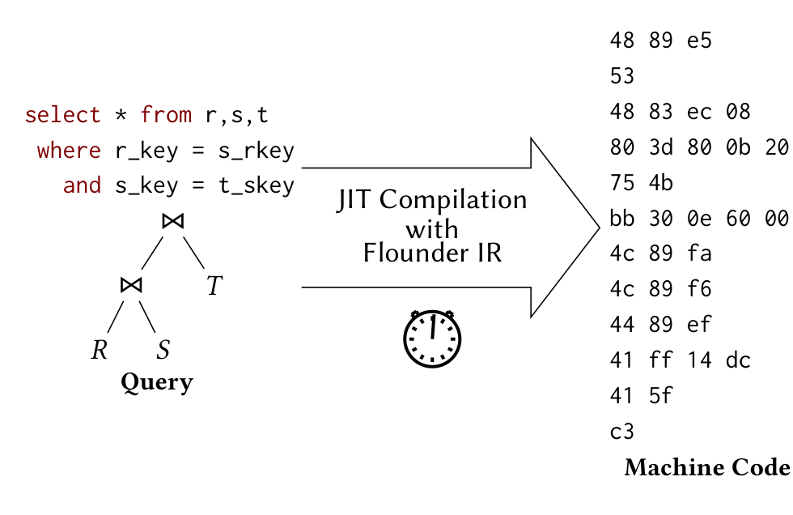
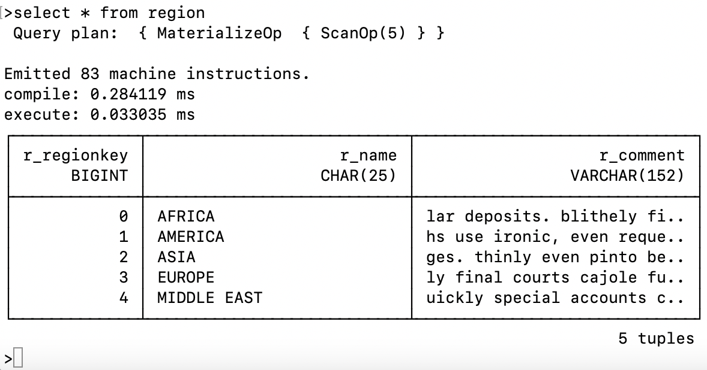
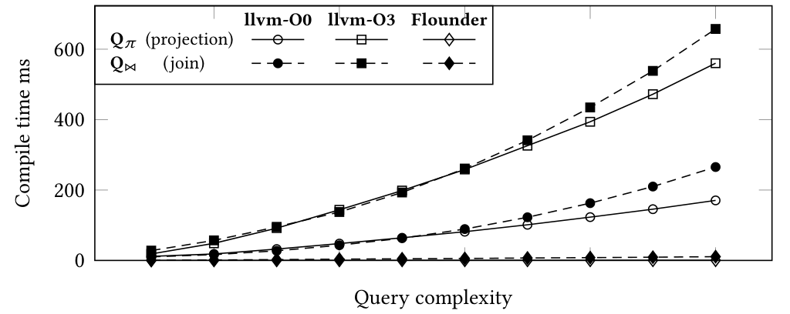
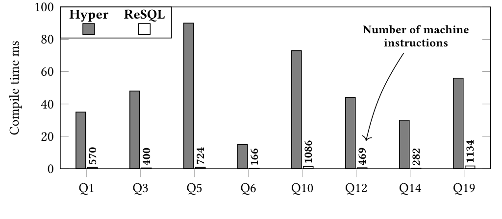

# Low-Latency Compilation of SQL Queries to Machine Code（中文译文）

## 译者说明

本文依据同目录的 `source.pdf` 翻译。章节、图表、公式、算法、代码与参考文献按原文结构保留。

## 摘要

查询编译已被证明是最高效的查询处理技术之一。尽管它处理速度快，但额外编译时间限制了适用范围，因为只有当处理时间的改进明显超过编译时间时，这种方法才最有利。最近的研究展示了极低编译时间查询编译器的可行性，可能使查询编译成为更通用的方法。本文及对应现场演示展示 ReSQL 数据库系统的能力。ReSQL 使用中间表示 Flounder IR 实现极低编译时间。与现有基于 LLVM 的技术相比，ReSQL 在真实分析查询中把从 SQL 到机器码的编译时间最多降低 101.1 倍。

## 1. 引言

查询编译通过 JIT 为每个查询生成定制机器码，消除解释查询计划和 schema 的运行时开销，从而获得高资源效率和吞吐。当查询到达时，查询计划和 schema 对本次执行而言已是常量，理论上可以在处理前被专用化。

问题是编译带来额外延迟，直接增加响应时间；只有执行时间的减少明显超过编译成本时才有利。大数据集很容易摊销它，甚至容忍 GPU 编译数秒。低编译延迟的意义不只在少等待：若足够低，系统无需为长短负载分别维护不同 backend。已有工作用解释启动、随后切换编译来隐藏成本；专用编译器若本身足够快，就不必承担两套冗余执行路径的实现代价。

### 1.1 低延迟查询编译

查询编译通常分两步：查询计划先翻译为中间表示（IR），IR 再翻译为机器码。第二步的 IR 选择尤其决定延迟。LLVM 已属低层 IR，但机器码生成仍需数十毫秒；传统非 JIT 引擎在这段时间内足以处理数百万 tuple，因而小输入很难受益。此前 Flounder IR 工作证明，可以把特性限制在关系工作负载所需范围，并在 lowering 时只运行轻量算法，从而显著低于 LLVM。



图 1：Flounder IR 的低延迟编译流程。SQL 查询先变成查询计划，再经由 Flounder IR JIT 编译为机器码；图中强调的是从关系查询到机器码的短路径。

### 1.2 贡献

本文演示 Flounder IR 如何嵌入从 SQL 到机器码的完整栈，允许观察各翻译层和最终代码，以证明这种低延迟路径在真实 DBMS 中可用。论文安排是：第 2 节比较低延迟 IR，第 3 节介绍 ReSQL 演示，第 4 节评估翻译性能，第 5 节总结。具体贡献包括：

- 展示 ReSQL DBMS，一个使用 Flounder IR 的低延迟查询编译系统。
- 说明低层 IR 如何快速翻译为机器码。
- 通过演示展示 JIT 编译、IR 检查和寄存器分配。
- 在真实分析查询上比较 LLVM 路径和 ReSQL 路径的编译时间。

## 2. 面向快速翻译的低层 IR

### 2.1 Join Probe 示例

Flounder 与 LLVM 都属于低层 IR，指令粒度接近处理器，但仍保留便于翻译的抽象。论文以 `R ⋈ S` 的 probe 为例，假定 build 代码已生成，现在用 S 的 tuple 探测哈希表。其高层 C 语义为：

```c
[...] /* child code */
int64_t* entry = null;
while (true) {
  entry = ht_get(ht, s_a, entry);
  if (entry == null) break;
  int64_t r_a = entry[0];
  int64_t r_b = entry[1];
  [...] /* parent code */
}
[...] /* child code */
```

`entry` 从 null 开始，`ht_get` 每次返回同一 key 的下一个候选；返回 null 时结束。循环体从哈希表条目解物化 `r_a/r_b`，再执行父算子代码。

### 2.2 低层表示

Flounder IR 的目标是简化并按关系负载裁剪 IR 与翻译过程，而不是承担通用高级优化。

原文 Figure 2 对比 hash join probe 的 LLVM IR 与 Flounder IR。该图主要是代码/IR，因此这里转写为代码块。

**图 2：hash join probe 算子的中间表示：(a) LLVM IR；(b) Flounder IR。**

LLVM IR 片段：

```llvm
joinProbe:
  ; get previous probe value
  %prev = phi i64* [ null, %scan ], [ %ht_get, %match ]
  ; ht_get(..) call
  %ht_get = call i64* %htGetPtr(%ht, %s_a, %prev)
  ; break when entry = NULL
  %1 = icmp ne i64* %ht_get, null
  br i1 %1, label %match, label %miss

match:
  ; read ht entry
  %addr0 = getelementptr i64, i64* %ht_get, i64 0
  %r_a = load i64, i64* %addr0
  %addr1 = getelementptr i64, i64* %ht_get, i64 1
  %r_b = load i64, i64* %addr1
  [...] ; parent code
  br label %joinProbe

miss:
  [...]
  ; child code
```

Flounder IR 片段：

```asm
[...] ; child code
vreg {entry}
mov {entry}, 0
loop_headN: ; while(..)
  ; ht_get(..) call
  mcall {entry}, {ht_get}, {ht}, {s_a}, {entry}
  ; break when entry = NULL
  cmp {entry}, 0
  je loop_footN
  ; read ht entry
  vreg {r_a}
  vreg {r_b}
  mov {r_a}, [{entry}]
  mov {r_b}, [{entry}+8]
  [...] ; parent code
  clear {r_a}
  clear {r_b}
  jmp loop_headN
loop_footN:
  clear {entry}
[...] ; child code
```

#### 结构

LLVM IR 是 basic block 图：每个块以 label 开始、以 `br` 结束，jump 构成边；编译器可据此重新选择 fall-through。Flounder 只有一条线性指令序列，查询编译器已经确定常见路径，因此不需要通用编译器再做图级布局。较简单的表示直接提高翻译速度。

#### 虚拟寄存器

两者都提供逻辑上无限的虚拟寄存器。LLVM 名称以 `%` 开头；Flounder 用 `{entry}` 形式。为降低活性分析成本，Flounder 以 marker 明确生命周期：`vreg {entry}` 开始、`clear {entry}` 结束，翻译器无需从控制流图重新推导完整 live range。

#### 寄存器分配

LLVM 会使用 live-range splitting 等算法高效利用机器寄存器。Flounder 把机器寄存器分为 attribute register 和少量 temporary register；属性值的分配只需线性扫描 IR，栈 spill 的访问由临时寄存器承接。它放弃部分全局最优，换取稳定、低成本的生成过程。

## 3. 演示：ReSQL DBMS

### 3.1 即时编译

ReSQL 建立在 Flounder IR 之上，演示提供带样例数据库的命令行界面。用户现场输入 SQL，系统用以下完整栈对多数查询即时编译，并同时报告编译与执行时间：

```text
SQL --Grammar (lemon)--> Expression Tree
    --Query Planner----> Query Plan
    --Query Compiler---> Flounder IR
    --Flounder Library-> Machine Code
```

解析器把 SQL 转为 expression tree，planner 生成 query plan；查询编译器逐关系算子生成 Flounder IR，Flounder library 再输出可立即执行的二进制机器码。



图 3：ReSQL 命令行界面示例。该图展示输入 SQL、生成查询计划、输出机器指令数量、编译/执行时间以及结果表的交互式演示路径。


### 3.2 IR 检查

用户可以同时检查生成的 IR 和最终 machine assembly，并按算子观察 register allocation、post-projection optimization、关系算子实现、hash aggregation 和 hash join。Figure 2(b) 就是 hash join probe 的可检查输出。

### 3.3 示例：寄存器分配

论文回到 Figure 2 的解物化片段。假定 4 个 attribute register 中 3 个已占用，仅 `r8` 空闲，且栈上还没有 spill：

```asm
vreg {r_a}
vreg {r_b}
mov {r_a}, [{entry}]
mov {r_b}, [{entry}+8]
[...] ; parent code
clear {r_a}
clear {r_b}
```

遇到 `vreg {r_a}` 时，分配空闲 attribute register `r8`；遇到 `{r_b}` 时已无空闲寄存器，故分配栈槽。后续 `{r_a}` 直接替换为 `r8`；访问 `{r_b}` 时，分配器插入临时寄存器与栈之间的 spill code。两个 `clear` 释放 `r8` 和栈槽。

```asm
mov r8,  [rdi]     ; read r_a
mov rax, [rdi+8]   ; read r_b through temporary
mov [rsp-8], rax   ; spill store
[...] ; parent code
```

`vreg/clear` 只驱动分配，最终机器码中被删除。第一条 move 把 `r_a` 载入 `r8`；第二、三条经 `rax` 把 `r_b` 写入 `[rsp-8]`。

## 4. 评估

论文以编译时间为演示的首要指标，执行性能沿用相关工作 [1]。测试机为 Intel Xeon E5-1607 v2 3.00 GHz、32 GB RAM、Ubuntu 18.04.4、LLVM 6.0.0，并使用同样基于 LLVM JIT 的 HyPer `v0.5-222-g04766a1` 对照。

复杂度模板 `Q_π` 改变投影属性数量，`Q_⋈` 改变 join 关系数。TPC-H 则用于真实分析查询；由于 ReSQL 当时的 planner 尚不支持 subquery，只选择无子查询的 Q1、Q3、Q5、Q6、Q10、Q12、Q14、Q19。

### 4.1 渐近编译时间

`Q_π` 从投影 50 个属性增加到极端的 500 个，过滤选择率为 1%；`Q_⋈` 从连接 2 张表增加到 100 张。比较 Flounder、LLVM O0 和 LLVM O3。

原文 Figure 4 给出两个复杂度查询模板，分别控制投影属性数量和连接关系数量：

**图 4：复杂度查询模板。**

```sql
-- Q_pi: vary projection complexity p
select r.a1, r.a2, ..., r.ap
from r
where r.a1 < c;
```

```sql
-- Q_bowtie: vary join complexity j
select r1.a, r2.a, ..., rj.a
from r1, r2, ..., rj
where r1.a = r2.a
  ...
  and rj-1.a = rj.a;
```



图 5：查询复杂度对不同中间表示编译时间的影响。LLVM O0/O3 的编译时间随复杂度快速上升，Flounder 的曲线接近底部且增长更慢。

所有方法都随复杂度增长。`Q_⋈` 最高 657 ms，`Q_π` 最高 560 ms。LLVM O0 在 10-265 ms 间，O3 在 28-657 ms 间，两者均呈超线性；Flounder 近似线性，只从 0.3 ms 增至 10.8 ms。100 表 join 上，它分别比 O0/O3 快 24.6/60.9 倍；投影模板相对 O0 的最大提升达 283 倍。

### 4.2 真实查询编译时间

HyPer 的 TPC-H 编译时间从 Q6 的 15 ms 到 Q5 的 90 ms；ReSQL 从 Q6 的 0.21 ms 到 Q19 的 1.71 ms。ReSQL 平均缩短 70.1 倍，Q5 最大缩短 101.1 倍。差异源于 Flounder IR 更简单且针对关系负载裁剪，而不是查询规模更小；Figure 6 还标出了各查询生成的 166-1,134 条机器指令。



图 6：TPC-H 查询在 HyPer 和 ReSQL 中的编译时间对比。灰色柱为 HyPer，白色柱为 ReSQL；柱内数字标示机器指令数量，显示 ReSQL 的编译时间显著更短。

## 5. 总结

本文从概念结构与编译性能两方面对照 Flounder IR 和 LLVM IR，并用现场演示展示 SQL、计划、IR、寄存器分配、机器汇编及运行计时。结果说明，针对关系查询裁剪的线性 IR 与轻量机器码生成，可以把查询编译从“需要摊销的明显成本”降到亚毫秒至低毫秒级。

## 致谢

本文工作获得 DFG Collaborative Research Center SFB 876 Project A2 支持。

## 参考文献

- [1] Henning Funke, Jan Mühlig, and Jens Teubner. 2020. Efficient generation of machine code for query compilers. In Proceedings of the 16th International Workshop on Data Management on New Hardware. 1–7.
- [2] Henning Funke and Jens Teubner. 2020. Data-Parallel Query Processing on Non- Uniform Data. PVLDB 13, 6 (2020).
- [3] André Kohn, Viktor Leis, and Thomas Neumann. 2018. Adaptive execution of compiled queries. In 2018 IEEE 34th International Conference on Data Engineering (ICDE). IEEE, 197–208.
- [4] Thomas Neumann. 2011. Efficiently compiling efficient query plans for modern hardware. PVLDB 4, 9 (2011), 539–550.
- [5] OmniSci Incorporated. 2021. OmniSciDB. https://www.omnisci.com/, last accessed on 07/25/2021.
