# Main-Memory Hash Joins on Multi-Core CPUs: Tuning to the Underlying Hardware（中文译文）

## 译者说明

本文依据同目录的 `source.pdf` 翻译。章节、图表、公式、算法、代码与参考文献按原文结构保留。

Cagri Balkesen（#1）、Jens Teubner（#2）、Gustavo Alonso（#3）、M. Tamer Özsu（*4）

\#：瑞士苏黎世联邦理工学院（ETH Zurich）计算机科学系 Systems Group。1、2、3：`{name.surname}@inf.ethz.ch`。

*：加拿大滑铁卢大学。4：`tamer.ozsu@uwaterloo.ca`。

## 摘要

多核 CPU 引入的体系结构变化促使人们重新设计内存连接算法。在过去几年中，出现了两种分歧明显的观点。一种方法主张根据体系结构参数（缓存大小、TLB 和内存带宽）精心调整算法。另一种方法则认为，现代硬件已经足以隐藏缓存和 TLB 未命中的延迟，因此，可以省去这种精细调整而不牺牲性能。

本文通过对不同算法和体系结构的实验分析，说明硬件仍然重要。硬件感知的连接算法比硬件无关的方法表现更好。本文的分析和比较表明，文献中有关连接算法行为的许多论断，源于选择效应（表的相对大小、元组大小、底层体系结构、使用有序数据等），在不同参数设置下运行的实验并不支持这些论断。通过分析，我们阐明现代硬件如何影响数据算子的实现，并给出迄今最快的基数连接实现，其吞吐量接近每秒 2 亿个元组。

## I. 引言

现代处理器在多个层次提供并行性：通过超标量执行提供指令级并行；通过扩展对单指令多数据的支持提供数据级并行（SIMD，即 128 位的 SSE、256 位的 AVX）；通过多个核心和同时多线程（SMT）提供线程级并行。这些变化正在促使内存连接算法发生深刻的重新设计。然而，迄今呈现出的局面仍没有明确结论。

一种观点认为，内存并行连接应当具有硬件感知能力（hardware-conscious）：只有针对底层体系结构精细调整算法，才能获得最佳性能 [1]。这些结果还表明，SIMD 目前尚不足以使连接算法的选择从更常用的哈希连接转向排序归并连接。不过，将来随着 SIMD 变宽，排序归并连接很可能表现得更好。

另一种观点认为，连接算法可以在保持硬件无关（hardware-oblivious）的同时获得高效率 [2]。也就是说，没有必要调优，尤其没有必要调优连接中的分区阶段；这一阶段会精心排列数据，使其适配相应的缓存。这种观点的理由是，现代硬件能够隐藏多层存储层次结构固有的性能损失。此外，该观点还认为，针对特定硬件精细调整算法，会降低其可移植性，以及面对数据倾斜等情况时的稳健性。

第三种观点声称，排序归并连接已经优于哈希连接，而且无需使用 SIMD 就能高效实现 [3]。这些结果既与 Blanas 等人 [2] 的论断相矛盾，因为它们建立在针对硬件的精心调优之上（这里是针对非均匀内存访问特征），也与 Kim 等人 [1] 关于使用 SIMD 时排序归并与哈希两者表现的论断相矛盾。

由于篇幅限制，本文关注的问题是：是否有必要按照文献 [1] 明确主张、文献 [3] 隐含主张的那样，针对底层硬件调优内存哈希连接。我们还将重点放在基数连接算法上，把与排序归并连接的比较留待未来工作。

要回答硬件是否仍然重要，是一项复杂的任务，因为现代硬件错综复杂，而且内存连接的实现和调优有许多可能的选择。更麻烦的是，影响连接算子行为的参数很多：表的相对大小、是否使用 SIMD、页大小、TLB 大小、表的结构和组织方式、硬件体系结构、实现调优等。现有研究所探索的空间很少重合，使得各自的论断难以比较。正如本文所示，许多论断只适用于某些特定的参数选择和体系结构，不能推广。

本文的第一项贡献在算法方面。我们分析文献中提出的算法，并提出若干重要优化，由此得到效率更高、面对参数变化更稳健的新算法。在这一过程中，我们对多核硬件如何影响算法设计给出了重要认识。

第二项贡献是将已有论断放回其具体背景，说明哪些参数选择或硬件特性导致了观察到的行为。这些结果阐明了哪些参数在多核系统上起作用，从而为面向多核的查询优化器必须作出的选择奠定基础。第三项也是最后一项贡献，是明确针对底层硬件调优是否有用。答案是肯定的：硬件无关的方法只有在很窄的参数组合和某些体系结构上才有优势。

## II. 背景：内存哈希连接

现有算法可分为两类。以不分区连接（第 II-B 节）为代表的硬件无关哈希连接变体，不依赖任何硬件特定参数。它们考虑的是现代硬件的定性特征，并预期能在任何技术上相近的硬件上获得良好性能。硬件感知的实现，例如（并行）基数连接（第 II-C、II-D 节），则通过按照具体硬件特性调节算法参数（例如哈希表大小），力求最大限度地利用该硬件。我们的目标是比较两种选择。一种是假设硬件如今已足以通过自动硬件预取或乱序执行隐藏自身局限，从而让硬件无关算法具有竞争力。另一种是假设显式参数调优 [^1] 带来的性能优势足以抵偿所需的投入。

[^1]: 通常借助 Calibrator [4] 等自动化工具。

### A. 标准哈希连接算法

所有现代哈希连接实现的基础，都是标准哈希连接算法 [5]、[6]。如图 1 所示，它分两个阶段运行。在第一个构建阶段（build phase），扫描两个输入关系中较小的关系 $R$，将所有 $R$ 元组加入哈希表。随后，探测阶段（probe phase）扫描第二个输入关系 $S$，为每个 $S$ 元组探测哈希表，寻找匹配的 $R$ 元组。

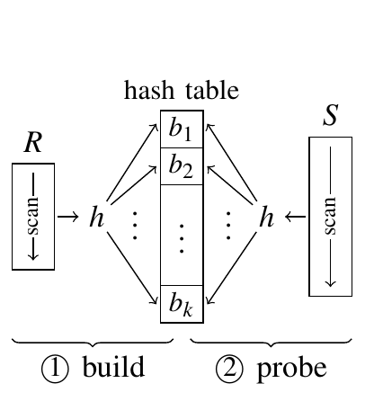

图 1. 哈希连接。

两个输入关系各扫描一次；假设哈希表访问的代价为常数时间，则标准哈希连接算法的期望复杂度为 $O(\lvert R\rvert + \lvert S\rvert)$。

### B. 不分区连接

为了利用现代并行硬件，Blanas 等人 [2] 提出了标准算法的一个变体，称为不分区连接（no partitioning join），本质上就是标准哈希连接的直接并行版本。它不依赖任何硬件特定参数，并且与稍后讨论的其他方法不同，不会对数据进行物理分区。其理由是，分区阶段需要多遍访问数据，而依靠同时多线程（SMT）等现代处理器特性来隐藏缓存延迟，就可以省去分区。

两个输入关系都被划分为等大的部分，并分配给若干工作线程。如图 2 所示，在构建阶段，所有工作线程共同填充一张所有工作线程均可访问的共享哈希表。

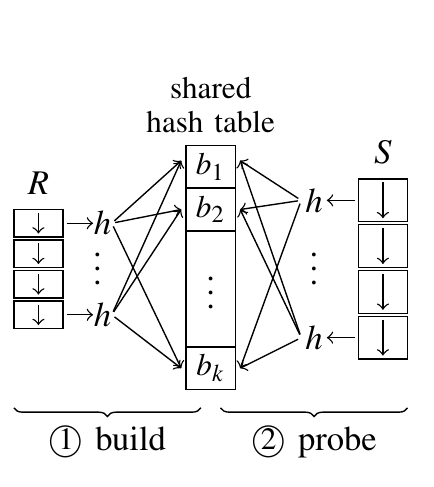

图 2. 不分区连接。

通过屏障同步后，所有工作线程进入探测阶段，并发地为各自分到的 $S$ 部分寻找匹配的连接对象。

不分区连接的一个重要特征是，哈希表由所有参与线程共享。这意味着，向哈希表并发插入时必须同步。为此，每个桶都由一个闩锁（latch）保护，线程必须获得该闩锁后才能插入元组。由于哈希桶的数量通常很大，达到数百万个，预期潜在的闩锁争用会保持在较低水平。探测阶段以只读方式访问哈希表，因此在这第二个阶段不必获取闩锁。

在具有 $p$ 个核心的系统上，这一并行哈希连接版本的期望复杂度为 $O\bigl(\frac{1}{p}(\lvert R\rvert + \lvert S\rvert)\bigr)$。

### C. 基数连接

硬件感知的内存哈希连接实现，建立在 Shatdal 等人 [7] 以及 Manegold 等人 [4]、[8] 的研究结果之上。虽然哈希的原理，即根据键的哈希值直接按位置访问，很有吸引力，但由此产生的随机内存访问可能导致缓存未命中。因此，主要着眼点是通过更高效地使用缓存来调优内存访问；研究已经表明，这会影响查询性能 [9]。Shatdal 等人 [7] 指出，当哈希表大于缓存时，几乎每次哈希表访问都会导致缓存未命中。因此，将哈希表划分成缓存大小的块可以减少缓存未命中并改善性能。Manegold 等人 [4] 进一步完善了这一思路，将分区阶段的地址转换后备缓冲器（translation look-aside buffer，TLB）影响也纳入考虑。这促成了多遍分区，它如今是基数连接算法的标准组成部分。

**分区哈希连接。** 图 3 展示了分区的思路。在算法的第一阶段，两个输入关系 $R$ 和 $S$ 分别划分为分区 $r_i$ 和 $s_j$。在构建阶段，为每个 $r_i$ 分区创建独立的哈希表（假设 $R$ 是较小的输入关系）。现在，每张哈希表都能放入 CPU 缓存。在最后的探测阶段，扫描 $s_j$ 分区，并探测相应的哈希表，寻找匹配元组。

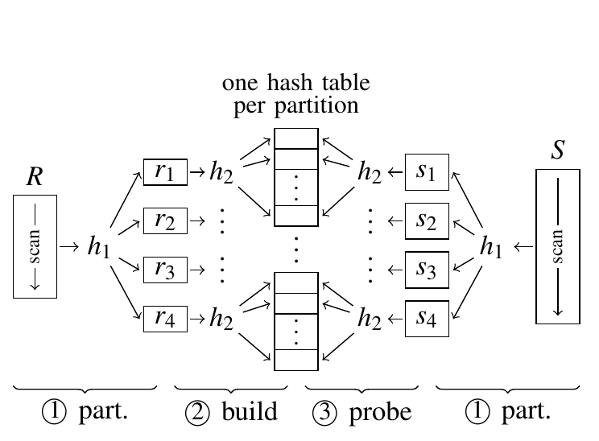

图 3. 分区哈希连接（沿用 Shatdal 等人 [7] 的方案）。

在分区阶段，根据输入元组的键值进行哈希分区（使用图 3 中的哈希函数 $h_1$，因此当 $i\ne j$ 时， $r_i\bowtie s_j=\varnothing$），并用另一个哈希函数 $h_2$ 填充哈希表。

对输入数据进行分区，虽然可以避免构建和探测阶段的缓存未命中，却可能引起另一类缓存问题。各分区通常位于不同的内存页上，每个分区都需要单独的虚拟内存映射条目。在现代处理器中，这些映射由 TLB 缓存。正如 Manegold 等人 [4] 所指出的，如果创建的分区过多，分区阶段可能产生 TLB 未命中。

本质上，可用 TLB 条目的数量，规定了能够同时高效创建或访问的分区数量上限。

**基数分区。** 通过多遍划分输入数据，可以避免过多的 TLB 未命中。在每一遍 $j$ 中，进一步细分上一遍 $j-1$ 产生的所有分区，使分区扇出始终不超过由 TLB 条目数量给定的硬件上限。实际中，每一遍查看哈希函数 $h_1$ 的不同位集，这就是基数分区（radix partitioning）名称的由来。对于典型的内存数据规模，两遍或三遍就足以生成缓存大小的分区，而不受 TLB 容量限制之苦。

**基数连接。** 图 4 展示了完整的基数连接。① 对两个输入进行两遍基数分区（这个示例只需两个 TLB 条目即可支持）。② 随后，在输入表 $R$ 的每个 $r_i$ 分区上构建哈希表。③ 最后，扫描所有 $s_i$ 分区，并探测相应的 $r_i$ 分区以寻找连接匹配。

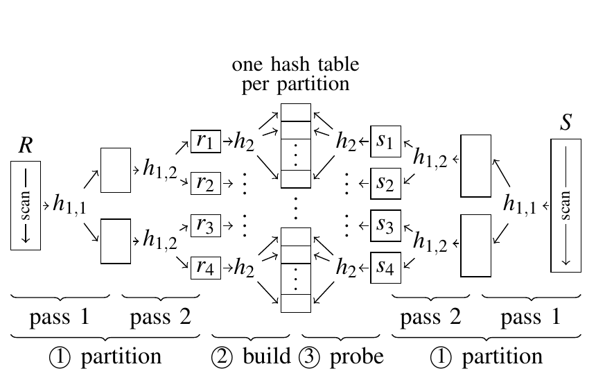

图 4. 基数连接（Manegold 等人 [4] 提出的方案）。

在基数连接中，两个输入关系都需要经过多遍处理。由于每一遍的最大“扇出”由硬件参数固定，因此需要 $\log\lvert R\rvert$ 遍，其中 $R$ 仍是较小的输入关系。因此，我们预期基数连接的运行时间复杂度为 $O\bigl((\lvert R\rvert+\lvert S\rvert)\log\lvert R\rvert\bigr)$。

**硬件参数。** 基数连接主要通过两个参数针对具体硬件进行调优：（i）每遍基数分区的最大扇出，主要受硬件 TLB 条目数量限制；（ii）最终分区的大小应大致等于系统 CPU 缓存的大小。两个参数都可以相当直接地获得，例如借助 Calibrator [4] 等基准测试工具。正如后文所见，基数连接对任一参数可能出现的配置不当都并不过分敏感。

### D. 并行基数连接

可以将两个输入关系进一步划分为子关系并分配给各线程，从而并行化基数连接 [1]。在第一遍中，所有线程创建一组共享分区。与前面一样，这组分区的数量受到硬件参数限制，通常很少，只有几十个。它们可能被许多执行线程访问，从而产生争用问题（第 II-B 节的低争用假设不再成立）。

为了避免这种争用，在每个输出分区内为每个线程预留一段专用空间。为此，要扫描两个输入关系各两次。第一次扫描计算输入数据的一组直方图，从而确切知道每个线程、每个分区的输出大小。接下来，为输出分配一块连续内存，并通过计算直方图的前缀和，让每个线程预先计算自己写入输出的独占位置。最后，所有线程无需同步即可各自进行分区。

第一遍分区之后，系统中通常已有足够多相互独立的工作（参见图 4），工作线程便可各自执行。工作线程之间的负载分配通常通过任务队列实现（参见 [1]）。

## III. 实验设置

本节介绍用于评估算法的实验设置。

### A. 工作负载

为了比较，我们采用模拟内存连接处理最相关场景的机器与工作负载配置。特别是，所有真正依赖这一组件的系统都假定采用列式存储模型。因此，我们有意选择很窄的 $\langle key,payload\rangle$ 元组配置，其中键和载荷各为 4 或 8 字节宽。作为一个附带效果，窄元组会使我们关注的影响更加明显，因为它们给系统的缓存体系施加了更大压力。[^2]

[^2]: 例如，Manegold 等人 [10] 研究过元组宽度的影响。

我们沿用了已有工作的具体负载配置，这也便于将我们的结果与过去发表的结果比较。

如表 I 所示，我们采用了 Blanas 等人 [2] 和 Kim 等人 [1] 的负载，在这里分别称为 A 和 B。所有属性都是整数， $R$ 和 $S$ 的键满足外键关系。也就是说，保证 $S$ 中每个元组恰好在 $R$ 中找到一个连接对象。除非另有说明，我们的大多数实验假设 $S$ 中来自 $R$ 的键值服从均匀分布。

表 I. 工作负载特征。

| 项目 | A（来自 [2]） | B（来自 [1]） |
| --- | --- | --- |
| 键／载荷大小 | 8／8 字节 | 4／4 字节 |
| $R$ 大小 | $16\cdot 2^{20}$ 个元组 | $128\cdot 10^6$ 个元组 |
| $S$ 大小 | $256\cdot 2^{20}$ 个元组 | $128\cdot 10^6$ 个元组 |
| $R$ 总大小 | 256 MiB | 977 MiB |
| $S$ 总大小 | 4096 MiB | 977 MiB |

### B. 硬件平台

我们在四台不同的多核机器上评估这些算法。其中三台是较新的多核平台，涵盖从较早的 Intel Nehalem 到较新的 Sandy Bridge 体系结构，还包括一台较新的 AMD Bulldozer 系统（见表 II）。Sun UltraSPARC T2 可追溯到 2007 年，每个核心提供八个线程上下文，八个线程共享缓存行大小为 16 字节的 L1 缓存。两台 Intel 机器支持 SMT，每个核心有两个线程上下文。Sun UltraSPARC T2 具有两级缓存，各核心共享缓存行大小为 64 字节的 L2 缓存。在 Intel 机器上，各核心使用共享的 L3 缓存，缓存行大小为 64 字节。AMD 机器的体系结构与其他机器不同，两个核心封装成一个模块，共享取指、译码、浮点单元和 L2 缓存等资源。因此，每个核心实际可用的 L2 缓存减少到一半，即 1 MiB。

表 II. 评估中使用的硬件平台。

| 项目 | Intel Nehalem | Intel Sandy Bridge | AMD Bulldozer | Sun Niagara 2 |
| --- | --- | --- | --- | --- |
| CPU | Xeon L5520，2.26 GHz | Xeon E5-2680，2.7 GHz | Opteron 6276，2.3 GHz | UltraSPARC T2，1.2 GHz |
| 核心／线程数 | 4／8 | 8／16 | 16／16 | 8／64 |
| 缓存大小（L1／L2／L3） | 32 KiB／256 KiB／8 MiB | 32 KiB／256 KiB／20 MiB | 16 KiB／2 MiB／16 MiB | 8 KiB／4 MiB／— |
| TLB（L1／L2） | 64／512 | 64／512 | 32／1024 | 128／— |
| 内存 | 24 GiB DDR3，1066 MHz | 32 GiB DDR3，1600 MHz | 32 GiB DDR3，1333 MHz | 16 GiB FBDIMM |
| 虚拟内存页大小 | 4 KiB | 4 KiB | 4 KiB | 8 KiB |

Intel 和 AMD 系统运行 Ubuntu Linux（内核版本 2.6.32），Sun UltraSPARC T2 运行 Debian（内核版本 3.2.0-3-sparc64-smp）。对于这里报告的结果，我们在 Ubuntu 上使用 gcc 4.4.3，在 Debian 上使用 gcc 4.6.3，并以 `-O3` 和 `-mtune=niagara2 -mcpu=ultrasparc` 命令行选项编译代码。使用 Intel 的 icc 编译器进行的额外实验，无论在定性还是定量上都未显示出显著差异。对于文中报告的性能计数器剖析，我们通过 Intel Performance Counter Monitor [11] 在代码中插桩。

## IV. 硬件无关连接

本节首先研究并优化不分区策略。为了使结果可比较，我们使用与早期工作相近的硬件，即 Nehalem L5520 系统（见表 II）。

### A. 构建代价

硬件无关的不分区连接的总代价为

$$
cost = \underbrace{c _ {put}\cdot\lvert R\rvert} _ {\text{构建代价}} + \underbrace{c _ {get}\cdot\lvert S\rvert} _ {\text{探测代价}},
$$

其中， $c _ {put}$ 和 $c _ {get}$ 分别表示向哈希表添加条目和从中读取条目的（常数）代价。写哈希表通常更昂贵，因为涉及获取桶闩锁，因此 $c _ {put}≳ c _ {get}$。

Blanas 等人在文献 [2] 中提出并评估了不分区连接。令人意外的是，在他们基于本文所谓负载 A 的实验中，构建阶段仅占总执行时间的 2%。在这一负载中， $\lvert R\rvert=\frac{1}{16}\cdot\lvert S\rvert$，因此我们原本预期构建阶段至少占总代价约 6%。

产生这些结果的代码已经公开 [12]。分析代码发现，他们的结果基于预先排好序的 $R$。因此，在用模运算哈希函数对数据项进行哈希时，数据项会映射到连续的哈希桶，形成严格的顺序内存访问。有序输入还消除了桶闩锁上的所有争用。

用随机置换的输入（即一般情况）重新运行实验后，构建代价约为 6%，与上述预期一致。为了确认判断正确，我们收集了缓存剖析数据。表 III 说明，有序输入实际上消除了所有 TLB 和 L3 缓存未命中。除此之外，我们基本能够重现其他性能结果（见图 5 中的深色柱）。

表 III. 有序输入对构建阶段的影响（文献 [2] 的代码与我们的代码比较；性能计数器单位为百万；负载 A）。

| 实现与输入 | 周期数 | L3 未命中 | 指令数 | TLB 加载未命中 |
| --- | --- | --- | --- | --- |
| 文献 [2] 的代码，有序输入 | 322 | 2 | 2215 | 1 |
| 文献 [2] 的代码，无序输入 | 1415 | 45.3 | 2263 | 52.7 |
| 我们的代码，无序输入 | 966 | 25 | 572 | 56 |

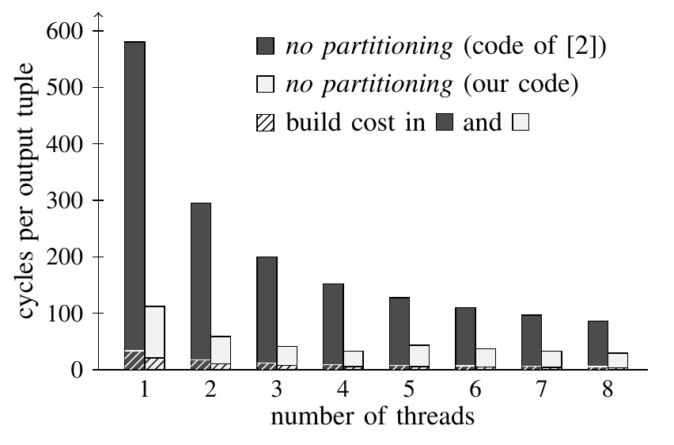

图 5. 硬件无关的不分区策略的每输出元组周期数（负载 A；Intel Xeon L5520，2.26 GHz）。深色和浅色柱分别表示文献 [2] 的代码和我们的代码，柱中的斜线部分表示构建代价。

### B. 缓存效率

表 III 的缓存剖析信息还表明，构建哈希表会产生非常多的缓存和 TLB 未命中。处理 1600 万个元组产生了 4530 万次 L3 未命中和 5270 万次 TLB 未命中，即每个输入元组约对应三次未命中。

查看文献 [2] 的代码，就能看清这种低效的原因。该代码中的哈希表按图 6 实现：哈希表本身是一组头指针，每个指针指向一条桶链表的头部。每个桶是一个 48 字节的记录。`free` 指针指向当前桶中下一个可用的元组位置，`next` 指针指向下一个溢出桶，每个桶可容纳两个 16 字节的输入元组。

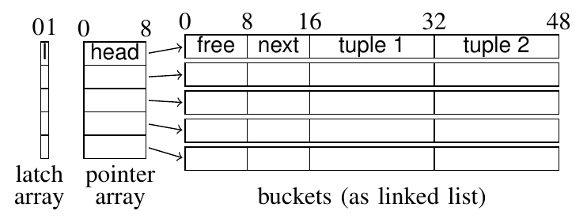

图 6. 原始哈希表实现。

由于哈希表由工作线程共享，需要用闩锁进行同步。如上图所示，闩锁被实现为独立的数组，其位置与头指针数组对应。

在这张表中，插入新条目需要三步（忽略哈希冲突引发的溢出情况）：（1）在闩锁数组中获取闩锁；（2）从哈希表中读取头指针；（3）解引用头指针，找到可以插入元组的哈希桶。实际中，这三个步骤每一步都很可能产生一次缓存未命中。

**优化后的哈希表实现。** 为了提高不分区连接的缓存效率，我们在重新实现时直接将锁与哈希桶放到相邻的内存位置。具体来说，在我们的代码中，主哈希表是一段连续的桶数组，如图 7 所示。哈希函数直接索引这一数组表示。对于溢出桶，我们在主哈希表之外分配额外的桶空间。最重要的是，1 字节的同步闩锁是 8 字节头部的一部分，头部还包含一个计数器，指示桶内当前元组数。与原研究 [2] 一致，对于负载 A，我们将哈希表配置为每桶两个 16 字节元组，并在溢出时用一个 8 字节的 `next` 指针串联哈希桶。

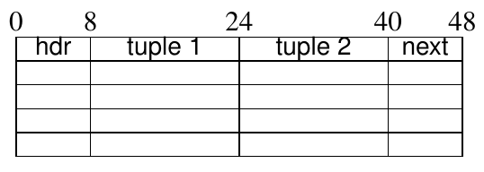

图 7. 我们的哈希表实现。

这种哈希表表示的修改效果显著。如表 III 所示，它将构建阶段的缓存未命中次数减半（探测阶段也如此，不过表 III 没有列出），并使连接处理有相当幅度的加速。

就绝对连接性能而言，我们重写的代码速度约为 Blanas 等人 [2] 代码的三倍，如图 5 所示。然而，我们的代码仍严格保持硬件无关：不需要任何硬件特定参数来调优。

### C. SMT 线程的作用

Blanas 等人 [2] 认为，不分区连接的真正优势来自它与同时多线程（SMT）硬件的良好配合。简单来说，SMT 通过在同一个 CPU 上运行两个线程，并在硬件层面巧妙地在两者之间切换，造成多出一个 CPU 的效果。这让硬件即使在一个线程因为例如缓存未命中而停顿时，也能灵活地执行有用工作。

为了研究不分区连接与 SMT 的相互作用，我们在可比较的硬件上重复了原来的 SMT 实验 [2]。我们的 Nehalem 系统有四个核心，每个核心两个硬件上下文。与原研究相同，我们先将线程分配到不同的物理核心；物理核心用尽后，再以轮转方式将线程分配到可用的硬件上下文。

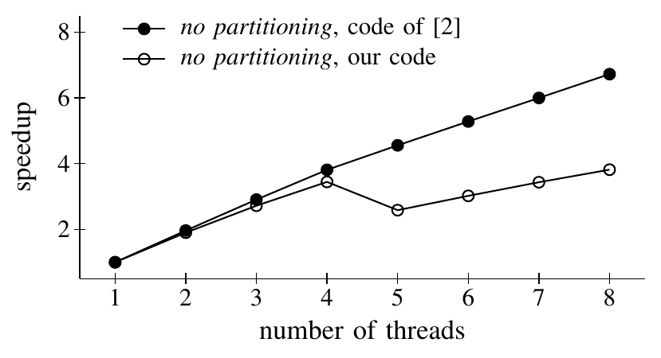

图 8. 不分区算法在 SMT 硬件上的加速比。前四个线程是“原生”线程，第 5–8 个线程是“超线程”（Xeon L5520）。

图 8 展示了不分区连接相对于同一算法单线程执行的性能（“加速比”）。我们的实验确实证实，未优化的文献 [2] 代码能够随 SMT 线程扩展。然而，用我们优化后的代码（绝对性能显著更好，见图 5）运行相同实验时，SMT 对不分区策略完全没有帮助，或者只在使用全部线程上下文时带来可以忽略的提升。

结果表明，只有当相应代码包含足够多的缓存未命中，而且在第一个线程等待时有足够的额外工作供第二个线程执行，SMT 才能弥补缓存未命中的延迟。对于冗余较少的代码，SMT 只带来可以忽略的收益。这些结果对硬件无关不分区策略背后的一项关键假设提出了疑问。

## V. 硬件感知连接

我们对并行基数连接作类似分析。Blanas 等人 [2] 也提供了这种硬件感知连接执行策略的实现。

### A. 配置参数

基数连接的关键配置参数是分区阶段的基数位数（该阶段会创建 $2^{\text{基数位数}}$ 个分区）。图 9 展示了这一参数对基数连接运行时间的影响。

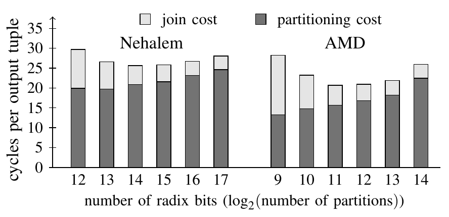

图 9. 代价与基数位数的关系（负载 B；Nehalem：两遍；AMD：一遍）。横轴为基数位数，即分区数的以 2 为底的对数；纵轴为每输出元组周期数。浅色表示连接代价，深色表示分区代价。

该图证实了预期行为：分区代价随分区数量增加而上升，而连接阶段则随分区缩小而变快。对于 Nehalem 和 AMD 体系结构，14 位和 11 位基数分别是在这两个相反影响之间的最佳折中。但更有意思的是，图中表明基数连接对于参数配置不当相当稳健：在一段配置范围内，基数连接性能仅有轻微下降。

### B. 哈希表与缓存效率

输入表经过分区后，哈希表非常小，并且始终全部驻留于缓存。因此，上一节关于哈希表访问缓存未命中的判断，不再适用于硬件感知的连接执行策略。

人们已提出多种基数连接实现。Manegold 等人 [4] 使用相当经典的桶链机制，将单个元组串联起来组成一个桶。遵循高效内存算法的良好设计原则，所有指针都实现为数组位置索引，而非实际的内存指针。

Kim 等人 [1] 构建哈希表的方式与并行分区阶段类似。首先扫描输入关系，得到哈希值的直方图。然后借助前缀和重新排列关系 $R$（得到 $R'$），使具有相同哈希值的元组在 $R'$ 中连续出现。前缀和表与重新排列后的关系一起构成哈希表，如图 10 所示。

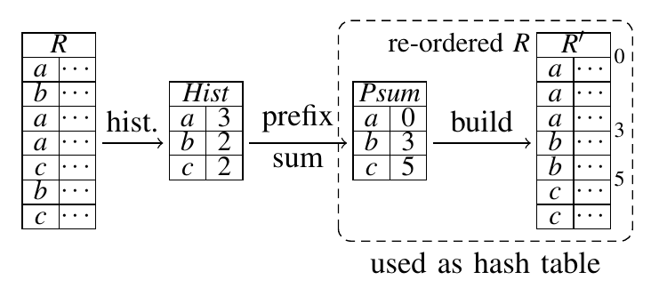

图 10. 关系重排和基于直方图的哈希表设计。

这种策略的优势是，现在可以使用 SIMD 指令比较连续的元组。此外，还可以应用软件预取机制，在比较前将潜在匹配项带入 L1 缓存。

**评估。** 我们评估了不同哈希表实现策略对基数连接中连接阶段的影响。图 11 给出了三种不同策略在连接阶段的每输出元组周期数。

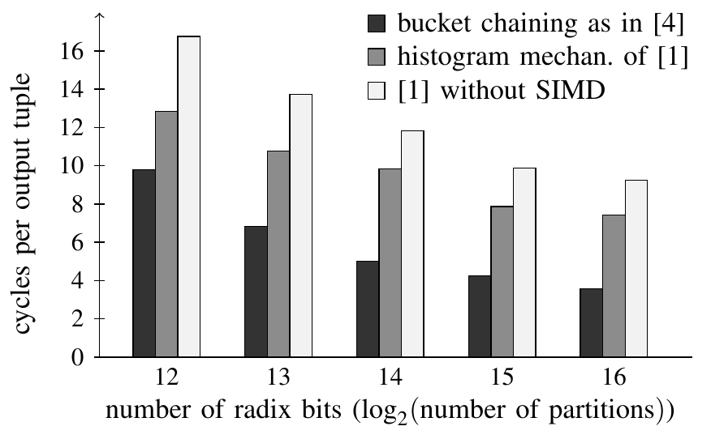

图 11. 三种不同哈希表实现技术下，基数连接的连接阶段代价（负载 B；Intel Xeon L5520，2.26 GHz；使用 8 个线程、两遍分区）。三组柱分别对应文献 [4] 的桶链、文献 [1] 的直方图机制以及不使用 SIMD 的文献 [1] 实现。

可以看到，尽管 Kim 等人 [1] 较新的实现有进行 SIMD 优化的潜力，Manegold 等人 [4] 的实现仍略胜一筹。图中还证实，随着输入数据划分得更细，连接代价总体上会降低。实际中存在一个最佳点，因为在连接之前必须付出的分区代价会随分区数量增加而上升（见图 9）。

由于 Manegold 等人的方法在此次比较中最好，后续所有实验都将采用该方法。需要指出，我们这里的选择不依赖硬件参数，是一种硬件无关的优化。不过，正如马上会看到的，由于无论采用哪种实现技术都要加上分区代价，这一选择的影响有限。

### C. 总执行时间

连接执行的总代价包括数据分区代价，以及对各分区分别计算连接的代价。为了评估总代价，并为与硬件无关的不分区算法比较作准备，我们测量了自己精心调优的实现，以及早期工作报告的实现。

我们有两个可用的基数连接实现。对于 Blanas 等人的代码 [12]，我们发现一遍分区、2048 个分区是最佳参数配置（这与他们实验 [2] 的配置一致）。该代码的分区开销相当高。我们将其归因于一种编码风格：在关键代码路径上进行了很多函数调用和指针解引用。我们自己代码的分区效率高得多，因此两遍分区、16384 个分区变成了最高效的方案。表 IV 说明，不同实现会使执行的指令数量有很大差异。我们的代码进行了两遍分区，但指令数比只需进行一遍分区的 Blanas 等人代码 [2] 少 40%。

表 IV. 不同基数连接实现的 CPU 性能计数器剖析（单位：百万）；负载 A。

| 计数器 | [2]：分区 | [2]：构建 | [2]：探测 | 我们的代码：分区 | 我们的代码：构建 | 我们的代码：探测 |
| --- | --- | --- | --- | --- | --- | --- |
| 周期数 | 9398 | 499 | 7204 | 5614 | 171 | 542 |
| 指令数 | 33520 | 2000 | 30811 | 17506 | 249 | 5650 |
| L2 未命中 | 24 | 16 | 453 | 13 | 0.3 | 2 |
| L3 未命中 | 5 | 5 | 40 | 7 | 0.2 | 1 |
| TLB 加载未命中 | 9 | 0.3 | 2 | 13 | 0.1 | 1 |
| TLB 存储未命中 | 325 | 0 | 0 | 170 | 0 | 0 |

由此得到的总执行时间以每输出元组周期数表示，见图 12。该图证实，Blanas 等人代码中的分区相当昂贵。最终，这导致所选分区数对于后续连接阶段并非最优，使其连接代码也代价高昂。在优化后的代码中，分区成为主要代价；这与 Kim 等人 [1] 的发现一致，他们在相近参数设置下报告了可比较的代价。总体而言，在图示的所有配置下，我们的代码速度约为 Blanas 等人代码的三倍。

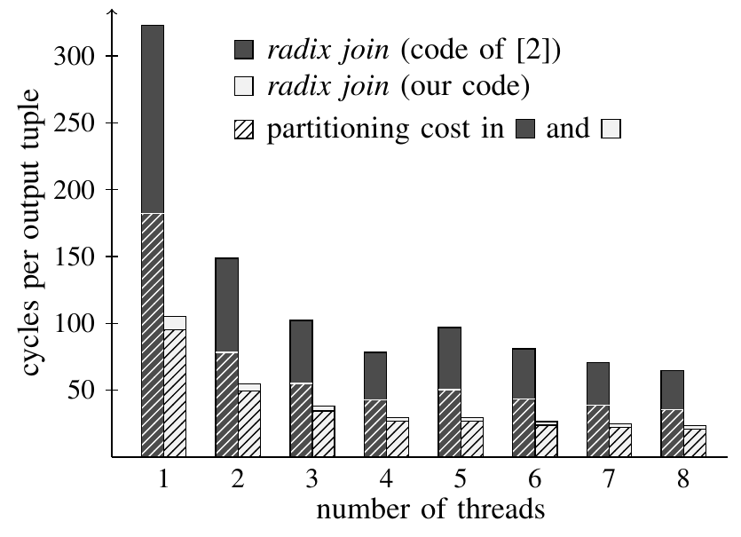

图 12. 硬件感知基数连接策略的总连接执行代价（每输出元组周期数；负载 A；Intel Xeon L5520，2.26 GHz）。深色和浅色柱分别表示文献 [2] 的代码和我们的代码，柱中的斜线部分表示分区代价。

**性能计数器。** 我们还在可用的基数连接实现中插桩，监测 CPU 性能计数器。表 IV 列出了基数连接三项任务的缓存和 TLB 未命中次数。

表中显示，Blanas 等人的实现与我们的实现，在缓存和 TLB 未命中次数上有显著差异。基数连接背后的想法是，所有分区都应足够小，能够完整放入缓存，因此预期未命中次数应很低。我们的实现符合这一点，Blanas 等人的实现则不符合。

造成差异的原因，是后者代码中的哈希构建和探测执行顺序不妥。他们的代码严格按三个阶段执行基数连接。分区（第一阶段）之后，为所有分区创建哈希表（第二阶段）。直到第三个算法阶段，才探测这些哈希表以寻找连接对象。实际上，在探测真正需要哈希表内容之前，创建的哈希表早已被逐出 CPU 缓存。我们的代码将每个分区的构建和探测放在一起执行，避免了这些不必要的内存往返访问。

### D. SMT 线程带来的加速

图 13 表明，我们评估的两个基数连接实现都无法从 SMT 线程显著获益。当线程数不超过物理核心数时，两种实现都线性扩展；到了 SMT 线程区间，两者都受线程之间共享硬件资源（即缓存、TLB）的影响。这些结果也与 Blanas 等人 [2] 的结果一致。正如前面指出的，缓存高效的算法不能在相同程度上从 SMT 线程获益，因为没有很多缓存未命中可供硬件隐藏。这些结果也有助于对照 Kim 等人 [1] 的代码验证我们的代码。我们的优化实现达到了 4.6 的加速比，非常接近 Kim 等人在类似 Intel Nehalem 处理器上报告的 4.4 倍（绝对性能也相当）。

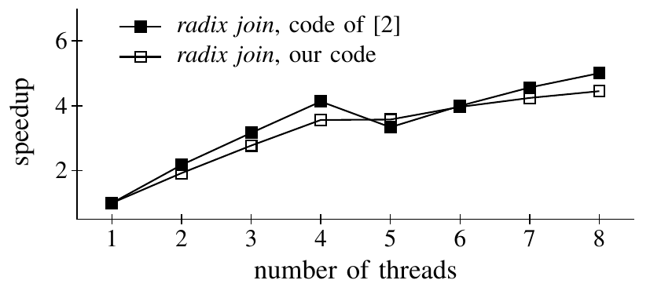

图 13. 基数算法在 SMT 硬件上的加速比。前四个线程是“原生”线程，第 5–8 个线程是“超线程”（负载 A；Xeon L5520）。

## VI. 是否需要硬件感知？

本节在广泛的参数和硬件平台范围内比较上述算法。

### A. 工作负载的影响

在所有工作负载和硬件平台上扩展实验得到的结果汇总于图 14。图 14(a) 展示了我们自己的实现使用负载 A 在若干硬件平台上的性能；这一负载正是 Blanas 等人 [2] 使用的负载。

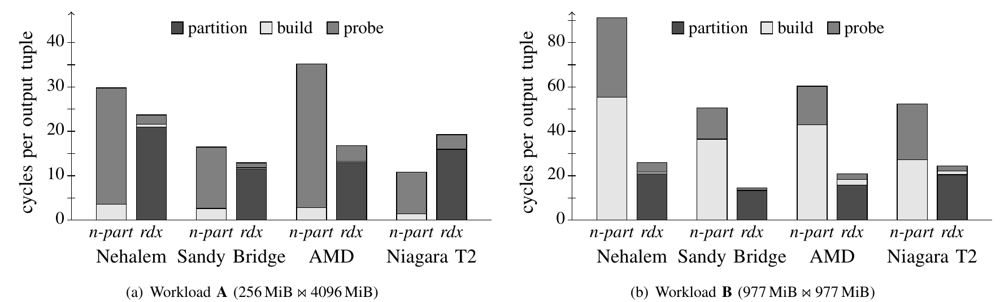

图 14. 不同硬件体系结构与工作负载下，硬件无关的不分区算法和硬件感知的基数连接算法的每输出元组周期数。实验基于我们自己优化后的代码。在 Nehalem 上使用 8 个线程，在 Sandy Bridge 和 AMD 上使用 16 个线程，在 Niagara 上使用 64 个线程。(a) 负载 A（256 MiB 与 4096 MiB 连接）；(b) 负载 B（977 MiB 与 977 MiB 连接）。柱内分别表示分区、构建和探测代价。

Blanas 等人 [2] 报告，在 x86 体系结构上，不分区连接与基数连接的性能差异很小；但在我们的结果中，当两种实现都经过同等优化时，硬件感知的基数连接明显更快。只有 Sun Niagara 上的情况不同。我们将在后面的小节中考察这一体系结构。

图 14(a) 的结果仍可被视为支持硬件无关方法的有力论据。例如，在两种 Intel 平台上约 25% 的性能优势，可能不足以抵偿基数连接参数调优所需的投入。

然而，换用第二种负载 B 运行相同实验（图 14(b)），结果就截然不同。在 Intel 机器上，基数连接的速度约为不分区连接的 3.5 倍；在 AMD 和 Sun 机器上，约为 2.5 倍。也就是说，只有当关系的相对大小相差很大时，不分区连接才有与基数连接相当的性能。这是因为在这种情况下，构建阶段的代价被降至最低。一旦表变大且大小相近，不采用硬件感知的额外开销就明显可见（参见不分区连接构建阶段的差异）。

### B. 可扩展性

为了研究两种连接变体的可扩展性，我们改变线程数，重新运行实验，直到达到每种体系结构上可用硬件上下文的最大数量。图 15 展示了结果。

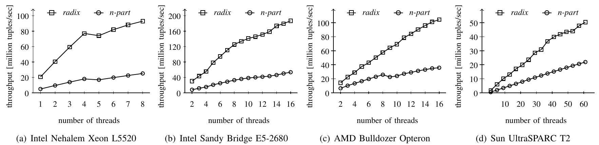

图 15. 使用负载 B，在不同机器上比较算法吞吐量。吞吐量计算为输入大小除以执行时间，其中输入大小为 $\lvert R\rvert=\lvert S\rvert$，纵轴单位为百万元组／秒。(a) Intel Nehalem Xeon L5520；(b) Intel Sandy Bridge E5-2680；(c) AMD Bulldozer Opteron；(d) Sun UltraSPARC T2。

除了第 IV-C 和 V-D 节已讨论的 SMT 问题，所有平台上的两种连接实现都表现出良好的可扩展性。得益于这种可扩展性，我们的基数连接实现达到每秒 1.96 亿个元组的吞吐量。据我们所知，这是迄今内存哈希连接达到的最高吞吐量。

在 AMD 机器上，不分区连接在约 8–10 个线程附近出现了明显的起伏。这是该 AMD 体系结构的特殊产物。尽管 Opteron 被作为 16 核处理器销售，但芯片内部由两个互连的 CPU 裸片组成 [13]。这种体系结构很可能要求为算法量身设计才能获得良好表现，这削弱了支持硬件感知算法的一项论据，因为即使算法没有参数，一些多核体系结构也可能无论如何都需要专门设计。译注：本句原文确为“支持硬件感知算法”（in favor of hardware-conscious algorithms）；此称谓与紧接着“无参数算法也可能需要专门设计”的解释存在张力，这里保留原文称谓。NUMA 会给不分区连接所用的共享哈希表带来显著问题，更不用说未来整台机器的内存可能不再保持一致性的设计。

### C. Sun UltraSPARC T2 “Niagara”

在体系结构与 x86 平台完全不同的 Sun UltraSPARC T2 上，使用负载 B 时，我们看到类似的结果。硬件感知基数连接达到每秒 5000 万个元组的吞吐量（见图 15(d)），而不分区连接仅达到每秒 2200 万个元组。

然而，考察负载 A 时，在 Niagara 2 上不分区连接反而比基数连接更快（见图 14(a)）。人们可能会将这一现象归因于 Niagara 2 极高效的片上多线程功能，但原因不止于此。首先，UltraSPARC T2 上的虚拟内存页大小为 8 KiB，TLB 是全相联的，这些都与其他体系结构有显著差别。

其次，Niagara 2 体系结构的线程同步机制极其高效。为了说明这一点，我们有意禁用了不分区连接中的闩锁代码。我们发现，与其他体系结构相比，UltraSPARC T2 上用于实现闩锁的 `ldstub` 指令十分高效，见表 V。Sun UltraSPARC T2 的这些特殊性质，同样表明在算法实现中作出考虑体系结构的决策很重要。

表 V. 不同机器上每个构建元组的闩锁代价。

| 项目 | Nehalem | Sandy Bridge | Bulldozer | Niagara 2 |
| --- | --- | --- | --- | --- |
| 使用的指令 | `xchgb` | `xchgb` | `xchgb` | `ldstub` |
| [14]、[15] 报告的指令延迟 | 约 20 个周期 | 约 25 个周期 | 约 50 个周期 | 3 个周期 |
| 测得的每构建元组影响 | 7–9 个周期 | 6–9 个周期 | 30–34 个周期 | 1–1.5 个周期 |

### D. TLB 与虚拟内存页大小

已知内存哈希连接对底层系统的虚拟内存子系统敏感，尤其对通过地址转换后备缓冲器（TLB）缓存地址转换的方式敏感。现代系统的虚拟内存设置在一定程度上可以配置。改变系统页大小后，每个地址映射（可能缓存在 TLB 中）覆盖的内存量会不同；使用大页时，对给定内存区域进行操作可能需要更少的 TLB 条目。

在操作系统支持下 [16]，Intel Nehalem 硬件主要可以在两种模式之一运行：（i）页大小为 4 KiB（默认）时，一级数据 TLB 最多可容纳 64 个内存映射；（ii）也可以把页大小设为 2 MiB，此时 TLB1 只能缓存 32 个映射。这里研究这两种选项对连接性能的影响。

**不分区连接。** 在哈希表构建和探测阶段，硬件无关的不分区连接算法会随机访问为较小连接关系 $R$ 创建的哈希表中的元素。对于负载配置 A，这张哈希表大小为 384 MiB（包括元组、闩锁和桶结构）。因此，当系统分别配置为 4 KiB 或 2 MiB 页时，命中 TLB1 中所缓存内存页的概率分别为 $64/98304\thinspace{}(=1/1536)$ 或 $32/192\thinspace{}(=1/6)$。后一种配置可能显著减少 TLB 未命中次数，从而提升执行性能。此外，现代处理器包含分页结构缓存；总页数较少时，这类缓存会有效得多。

如表 VI 所列，我们确实观察到不分区连接在使用大页时性能有所提升。然而，不分区连接的主要代价是真正的数据缓存未命中，而这不受页大小配置影响。因此，在我们的配置中，性能提升仍限于约 15%。

表 VI. 不分区连接使用大页时的性能。

| 不分区连接（负载 A） | 4 KiB 页 | 2 MiB 大页 |
| --- | --- | --- |
| 每构建元组的构建周期数 | 57.92 | 49.74 |
| 每输出元组的探测周期数 | 26.10 | 22.88 |
| 每输出元组的总周期数 | 29.72 | 25.99 |

**基数连接。** 我们的硬件感知算法基数连接，对 TLB 行为更敏感。实际上，TLB 大小通常被视为决定每遍分区可创建的最大分区数的限制因素。由于我们系统的 64 条目 TLB1 有一个 512 条目的共享 TLB2 辅助，我们的 Nehalem 系统实际上在两遍、每遍 128 路分区时达到了最佳连接性能（见第 V-A 节）。

此时改变系统页大小可能产生相反的影响。一方面，2 MiB 页大小会减少可用 TLB 条目数（TLB1 只有 32 个条目）；另一方面，系统虚拟内存设置中的内存页表结构会变小，每次 TLB 未命中需要遍历的页表更少。结果是，单次 TLB 未命中的代价降低。

表 VII 展示了这些相反影响对 Nehalem 系统连接性能的意义。在所用负载下，将系统页大小改为 2 MiB 后，基数连接的最佳配置变成了单遍、12 位的分区阶段，吞吐量提升约 15%。

表 VII. 基数连接使用大页时的性能。

| 基数连接（负载 A） | 4 KiB 页（两遍／14 位） | 2 MiB 大页（两遍／14 位） | 2 MiB 大页（一遍／12 位） |
| --- | --- | --- | --- |
| 每输入元组的分区周期数 | 19.73 | 21.71 | 15.54 |
| 每输出元组的连接周期数 | 2.77 | 2.75 | 3.64 |
| 每输出元组的总周期数 | 23.74 | 25.81 | 20.15 |

**是否使用大页？** 上述测量表明，使用大页配置的系统有性能优势。但我们指出，这是一把双刃剑。大页通常会增大系统中进程的内存占用，在生产系统里，这可能比在我们的微基准中更加成问题。

在我们的基准中，两种连接策略同等受益于大页，因此“是否需要硬件感知”这个问题的答案没有改变。正如前面提到的，随着未来系统中的输入数据规模扩大，大页带来的这点收益也可能消失。

大页可能对不分区连接的性能有更显著影响，但只有在结合显式数据预取等硬件感知优化使用时才会如此。详情请参阅我们的技术报告 [17]。

### E. 屏障同步与负载均衡

在本文考虑的两种连接变体中，并行执行线程以两种方式同步：（i）不分区连接中对共享哈希表的写访问由闩锁保护；（ii）两种连接变体均分多个阶段运行，阶段之间用屏障隔开。虽然屏障同步允许各线程独立完成大量工作，但在线程之间工作分配不均、线程不得不互相等待时，存在因空闲时间而浪费资源的风险。

对于不分区连接执行策略，屏障同步不成问题，因为按照其构造，元组在线程之间均匀分配，而且每个元组的代价基本不依赖元组值。

相比之下，只要任务没有恰当地调度到可用工作线程，基数连接就更容易受到屏障同步的拖累（我们已在第 V-C 节讨论过一个相关问题，即文献 [2] 的基数连接实现中的缓存局部性问题）。基数连接总共包含五个处理阶段（假设两遍分区）：① 计算 $R$ 的局部直方图；② 计算 $S$ 的局部直方图；③ 第一遍分区；④ 第二遍分区；⑤ 连接阶段（逐分区构建和探测）。虽然可以保证线程在前三个阶段均分输入数据，但阶段 ④ 产生的分区大小取决于 $R$ 和 $S$ 中的值分布。

为了研究潜在的负载不均衡，我们修改数据生成器，产生高度倾斜的输入数据集。 $S$ 中的外键不再以均匀概率引用 $R$ 中的键，而是遵循 Zipf 因子 $z=1.5$ 的 Zipf 分布。图 16(a) 展示了系统中八个线程（横轴）各自在时间推进（纵轴）过程中所做工作的类型。

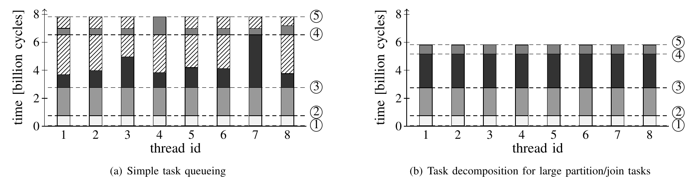

图 16. 基数连接的屏障同步代价（负载 A； $S$ 中的外键分布按 Zipf 参数 $z=1.5$ 倾斜；推进执行的任务以不同灰度表示，屏障同步等待时间以斜线填充表示）。(a) 简单任务队列使许多任务利用率不足，产生显著等待时间；(b) 对大型分区／连接任务进行细粒度任务分解（类似于 [1]），改善了负载分配，并将连接吞吐量提高 25%。纵轴单位为十亿周期，横轴为线程 ID，①–⑤ 对应五个处理阶段。

如图所示，在每个执行阶段开始附近，所有线程都在做有用工作（以不同灰度表示）。但有些线程比其他线程更早完成本阶段，这意味着它们必须等到最后一个同伴完成（图中的线程 7 和 4）。由此产生的空闲时间以斜线填充表示，它浪费了 CPU 资源，却没有真正推进线程执行。

**细粒度任务分解。** 图 16(a) 的屏障同步问题源于我们从文献 [2] 沿用的任务队列负载分配机制。该机制不足以适应倾斜输入数据。

为了应对这一问题，我们修改基数连接实现，采用与 Kim 等人 [1] 所提策略类似的任务分解。简而言之，只要阶段 ③ 后某个分区显著超过其期望大小（均匀分布下应有的大小），我们就将该分区拆成更小的块，由所有线程共同处理。这样可避免某些分区“霸占”一个执行线程并影响整体吞吐量。

图 16(b) 展示了这对执行进程的影响。这项修改成功避免了负载不均衡，使连接执行加速约 25%。尽管改进的调度机制主要适用于基数连接算法，但我们指出，其实现实际上无需参数，本身并非硬件感知优化。

### F. 倾斜数据

本节按照 Blanas 等人 [2] 的相同方法，研究数据倾斜的影响。具体而言，我们填充数据集的外键列（表 $S$），使其引用各个键值（来自 $R$）的概率遵循 Zipf 分布；Zipf 因子从 $z=0$ 变化到 $z=1.75$。

图 17 展示了不分区连接和基数连接如何响应倾斜。图中证实，倾斜有利于硬件无关的不分区连接的性能；Blanas 等人 [2] 已观察到这一点，并声称这是“相对于最先进方法的一大进步”。最终，使用负载 A 时，不分区连接的连接吞吐量超过了基数连接。

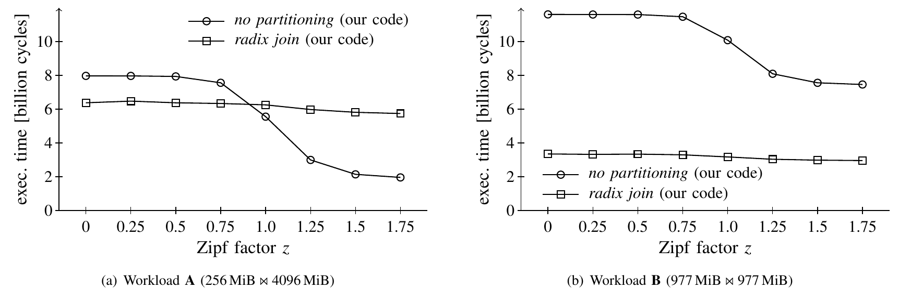

图 17. 外键引用遵循 Zipf 数据分布时的连接性能（Intel Xeon L5520，2.26 GHz）。(a) 负载 A（256 MiB 与 4096 MiB 连接）；(b) 负载 B（977 MiB 与 977 MiB 连接）。横轴为 Zipf 因子 $z$，纵轴为执行时间，单位为十亿周期。

然而，这一现象并不令人意外，而且只在数据高度倾斜时发生。例如，在文献 [2] 的“低倾斜”情形（ $z=1.05$）中， $S$ 内最常见值的出现概率为 8.4%；命中 600 个最常见连接键之一（总共 1600 万个键）的概率已超过 50%。在文献 [2] 的“高倾斜”情形（ $z=1.25$）中，超过 22% 的 $S$ 元组具有相同的值，命中前 600 个值之一的概率超过 83%。实际上，即使很小的 L1 缓存也足以容纳探测阶段会用到的 $R$ 的这小部分热点数据。

我们的结果表明，文献 [2] 的基准配置（极高倾斜、合适的关系大小）恰好落在不分区算法的最佳区间。这也可从图 17(b) 看出：使用负载 B 运行相同实验，对不分区连接的帮助没有前一种配置那么大。

性能随倾斜程度增加而提高，可以被视为不分区连接的优点。然而，这也意味着算法的运行时间特征依赖输入数据分布，因而难以预测，例如难以由基于代价的查询优化器预测。相比之下，基数连接在很宽的倾斜范围内提供可预测的性能。在稳健查询处理的背景下，这是一项理想特性；特别对于生产查询处理器而言，稳健性是一项重要且受到积极研究的标准 [18]。

### G. 关系大小比例的影响

上述实验表明，待连接表的相对大小对算法行为有很大影响。在下面这组实验中，我们研究改变关系基数对连接性能的影响。这些实验使用 Intel Xeon L5520，线程数固定为 8。我们将大小不相等的数据集中，主键构建关系 $R$ 的大小从 $1\cdot 2^{20}$ 改变到 $256\cdot 2^{20}$ 个元组。外键关系 $S$ 的大小固定为 $256\cdot 2^{20}$。不过，随着 $R$ 大小改变，我们也相应调整了 $S$ 中值的分布。

图 18 用双对数图展示了不同 $R$ 大小下，各阶段以及整个执行过程的每输出元组周期数。

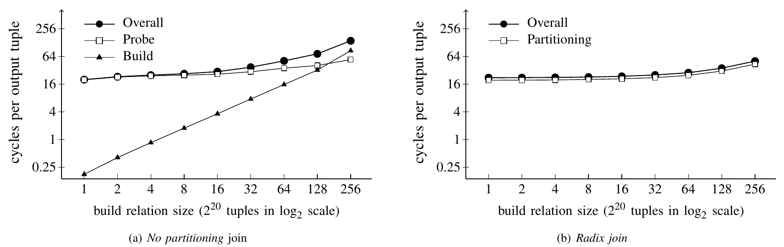

图 18. 负载 A 中改变构建关系基数时的每输出元组周期数（Intel Xeon L5520，2.26 GHz；每次实验均用最佳配置运行基数连接，基数位数在 13–15 之间变化）。(a) 不分区连接，分别给出总体、探测和构建代价；(b) 基数连接，给出总体和分区代价。横轴为构建关系大小，以 $2^{20}$ 个元组为单位，采用以 2 为底的对数刻度。

结果证实了此前的观察，并为硬件感知与硬件无关算法之间的争论给出更清晰的答案。当构建关系相对于大关系很小时，不分区连接表现很好。随着 $R$ 增大，由于构建阶段的代价，性能下降（图 18(a)）。基数连接对不同表大小要稳健得多，在所有 $R$ 大小下提供几乎恒定的性能。更重要的是，分区阶段在整个范围内的贡献相同，表明无论表大小如何，分区阶段都在发挥作用。

换言之，只有存在倾斜且被连接的表大小相差显著时，不分区连接才优于基数连接。在其他所有情况下，基数连接更好，事实上是显著更好，而且对倾斜和表的相对大小等不同参数也更稳健。

## VII. 相关工作

Manegold 等人 [8] 和 Ailamaki 等人 [9] 分别展示了现代计算硬件上内存与缓存影响的重要性之后，很快便出现新的算法变体，以在现代硬件上高效处理经典数据库问题。

实现这一目标的一项设计技术是使用分区，本文也对此进行了大量讨论。除了内存连接，分区也适用于例如聚合，Ye 等人 [19] 最近就研究了这一点。虽然聚合问题在很多方面不同于连接计算，但 Ye 等人关于不同硬件体系结构的观察与我们的观察十分一致。

本文主要考察局部缓存和内存延迟的影响，而我们此前已展示过现代 NUMA 系统的拓扑如何为连接问题增加额外复杂性 [20]。握手连接（handshake join）是在已有连接算法之上的一种求值策略，用于让这些算法感知拓扑。

出于类似动机，Albutiu 等人 [3] 提议用排序归并算法计算连接，从而形成硬件友好的顺序内存访问模式。不过，转换到并行归并连接是否足以充分顾及现代 NUMA 系统的拓扑，仍不清楚。

Kaldewey 等人 [21] 最近提出的 GPU 连接实现，其思路与不分区连接类似。与不分区连接一样，它利用硬件 SMT 机制隐藏内存访问延迟。在 GPU 中，这一思路被推向极致，许多线程／warp 共享一个物理 GPU 核心。

## VIII. 结论

本文结果明确解决了现有结果之间的矛盾：硬件无关算法只在很窄的参数区间（表大小相差显著时）和一个特定硬件平台上表现良好。此外，通过本文引入的新思路，可以使硬件感知算法显著快于迄今发表的实现，并且对更广泛的参数设置更稳健。如本文所示，这些算法也很容易针对底层硬件调优，从而大幅削弱了“它们比硬件无关算法更难移植”这一论据。

最后，本文用于获得结果的全部代码可从 [并行连接项目页面](http://www.systems.ethz.ch/projects/paralleljoins) 获取。

## 致谢

本工作获得瑞士国家科学基金会（Ambizione 资助；Avalanche 项目）和苏黎世联邦理工学院 Enterprise Computing Center（ECC）的支持。感谢 NTUA 的 Computing Systems Laboratory 提供 Niagara 机器的访问权限。感谢文献 [2] 的作者公开他们的代码和结果。

## 参考文献

[1] C. Kim, E. Sedlar, J. Chhugani, T. Kaldewey, A. D. Nguyen, A. D. Blas, V. W. Lee, N. Satish, and P. Dubey. “Sort vs. hash revisited: Fast join implementation on modern multi-core CPUs.” *PVLDB*, vol. 2, no. 2, pp. 1378–1389, 2009.

[2] S. Blanas, Y. Li, and J. M. Patel. “Design and evaluation of main memory hash join algorithms for multi-core CPUs.” In *SIGMOD Conference*, 2011, pp. 37–48.

[3] M.-C. Albutiu, A. Kemper, and T. Neumann. “Massively parallel sort-merge joins in main memory multi-core database systems.” *PVLDB*, vol. 5, no. 10, pp. 1064–1075, 2012.

[4] S. Manegold, P. A. Boncz, and M. L. Kersten. “Optimizing main-memory join on modern hardware.” *IEEE Trans. Knowl. Data Eng.*, vol. 14, no. 4, pp. 709–730, 2002.

[5] M. T. Özsu and P. Valduriez. *Principles of Distributed Database Systems*, 3rd edition. Springer, 2012.

[6] M. Kitsuregawa, H. Tanaka, and T. Moto-Oka. “Application of hash to data base machine and its architecture.” *New Generation Comput.*, vol. 1, no. 1, pp. 63–74, 1983.

[7] A. Shatdal, C. Kant, and J. F. Naughton. “Cache conscious algorithms for relational query processing.” In *VLDB*, 1994, pp. 510–521.

[8] P. A. Boncz, S. Manegold, and M. L. Kersten. “Database architecture optimized for the new bottleneck: Memory access.” In *VLDB*, 1999, pp. 54–65.

[9] A. Ailamaki, D. J. DeWitt, M. D. Hill, and D. A. Wood. “DBMSs on a modern processor: Where does time go?” In *VLDB*, 1999, pp. 266–277.

[10] S. Manegold, P. Boncz, N. Nes, and M. Kersten. “Cache-conscious radix-decluster projections.” In *VLDB*, Toronto, ON, Canada, Sep. 2004, pp. 684–695.

[11] “Intel performance counter monitor.” [在线资源](http://software.intel.com/en-us/articles/intel-performance-counter-monitor/)，访问时间：2012 年 4 月。

[12] S. Blanas and J. M. Patel. “Source code of main-memory hash join algorithms for multi-core CPUs.” [在线源代码](http://pages.cs.wisc.edu/~sblanas/files/multijoin.tar.bz2)，访问时间：2012 年 4 月。

[13] P. Conway, N. Kalyanasundharam, G. Donley, K. Lepak, and B. Hughes. “Cache hierarchy and memory subsystem of the AMD Opteron processor.” *IEEE Micro*, vol. 30, no. 2, pp. 16–29, Mar. 2010.

[14] A. Fog. “Instruction tables: Lists of instruction latencies, throughputs and micro-operation breakdowns for Intel, AMD and VIA CPUs.” [在线文档](http://www.agner.org/optimize/instruction_tables.pdf)，访问时间：2012 年 7 月。

[15] Sun. “UltraSPARC T2™ supplement to the UltraSPARC architecture 2007.” [在线文档](http://sosc-dr.sun.com/processors/UltraSPARC-T2/docs/UST2-UASuppl-HP-ext.pdf)，访问时间：2012 年 7 月。

[16] Intel. “Intel 64 and IA-32 architectures optimization reference manual.” [在线文档](http://www.intel.com/content/dam/doc/manual/64-ia-32-architectures-optimization-manual.pdf)，访问时间：2012 年 7 月。

[17] C. Balkesen, J. Teubner, G. Alonso, and M. T. Özsu. “Main-memory hash joins on multi-core CPUs: Tuning to the underlying hardware.” ETH Zurich, Systems Group, Tech. Rep., Nov. 2012.

[18] G. Graefe. “Robust query processing.” In *ICDE*, 2011, p. 1361.

[19] Y. Ye, K. A. Ross, and N. Vesdapunt. “Scalable aggregation on multi-core processors.” In *DaMoN*, 2011, pp. 1–9.

[20] J. Teubner and R. Müller. “How soccer players would do stream joins.” In *SIGMOD Conference*, 2011, pp. 625–636.

[21] T. Kaldewey, G. M. Lohman, R. Müller, and P. B. Volk. “GPU join processing revisited.” In *DaMoN*, 2012, pp. 55–62.
