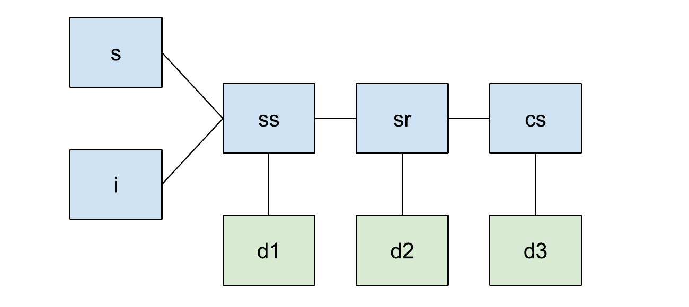
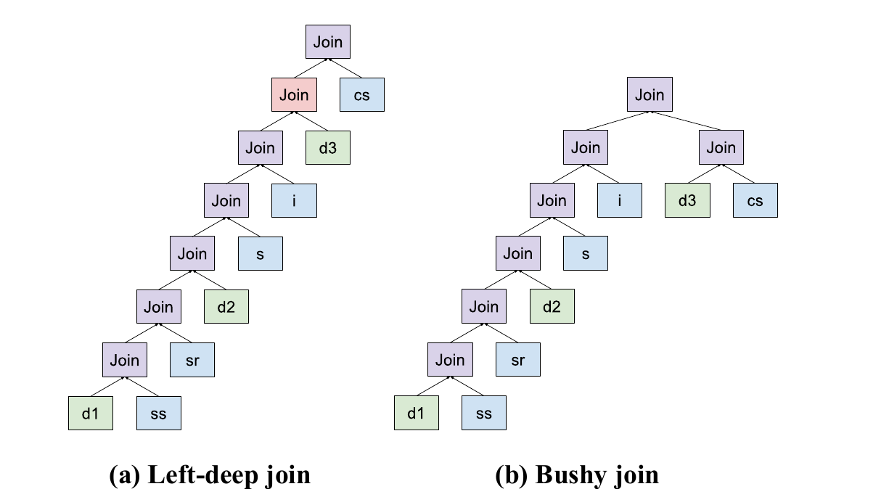
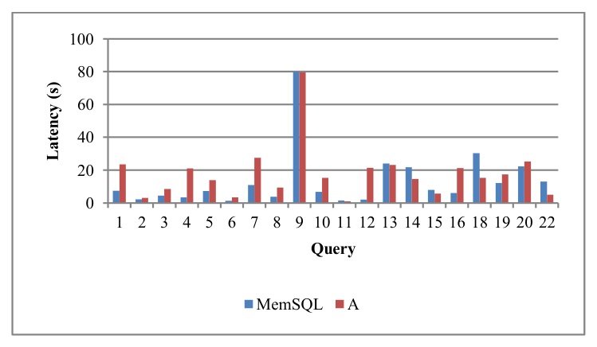
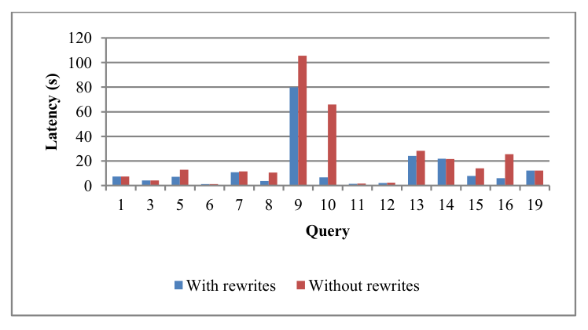
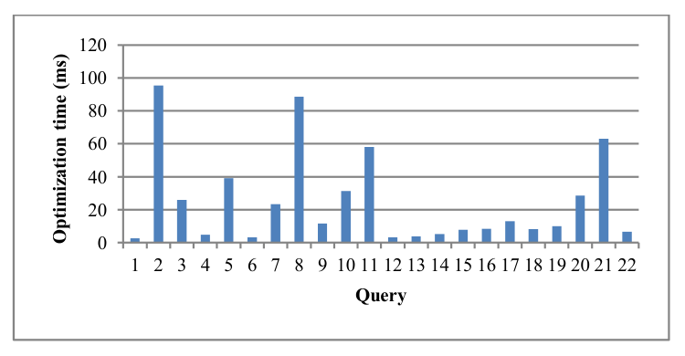

# The MemSQL Query Optimizer: A modern optimizer for real-time analytics in a distributed database（中文译文）

## 译者说明

本文依据同目录的 `source.pdf` 翻译。章节、图表、公式、算法、代码与参考文献按原文结构保留。

Jack Chen, Samir Jindel, Robert Walzer, Rajkumar Sen, Nika Jimsheleishvilli, Michael Andrews

MemSQL Inc.，534 4th Street，San Francisco, CA, 94107, USA

{jack, samir, rob, raj, nika, mandrews}@memsql.com

本文采用 Creative Commons Attribution-NonCommercial-NoDerivatives 4.0 International License 许可。许可文本见 http://creativecommons.org/licenses/by-nc-nd/4.0/；超出该许可范围的使用须通过 info@vldb.org 获得授权。

*Proceedings of the VLDB Endowment*，Vol. 9, No. 13。Copyright 2016 VLDB Endowment 2150-8097/16/09。

## 摘要

在海量数据集上做实时分析，已经成为许多企业的常见需求。这类应用不仅要求快速写入数据，也要求能对最新数据快速回答分析查询。MemSQL 是一个分布式 SQL 数据库，设计目标是利用内存优化、横向扩展的架构，支持快速、高并发且高度可扩展的实时事务和分析负载。MemSQL 客户工作负载中的许多分析查询都很复杂，涉及星型和雪花型模式上的连接、聚合、子查询等；这些查询常常是即席查询，或由商业智能工具交互式生成。它们通常要求秒级甚至更低延迟，因此优化器不仅必须生成高质量的分布式执行计划，还必须足够快地生成计划，使优化时间不成为瓶颈。

本文中，我们描述 MemSQL Query Optimizer 的架构，以及使其能够为复杂分布式查询快速生成高效执行计划的设计选择和创新。我们讨论了在分布式数据库中，如果查询重写决策忽略数据分布成本，可能会产生较差的分布式执行计划；并主张优化器在选择连接计划、应用查询重写和计算计划代价时都需要感知分布。我们还讨论了让连接枚举更快且更有效的方法，例如用基于重写的方法，在不牺牲优化时间的前提下，为包含多个星型模式的查询利用 bushy joins。最后，我们在 TPC-H 查询和真实客户工作负载上展示 MemSQL 优化器的效果。

## 1. 引言

越来越多企业依赖实时分析流水线支持关键业务决策。这些流水线将数据写入分布式存储系统，并在最新数据上运行复杂分析查询。对许多负载而言，分析查询必须被快速优化和执行，才能为交互式实时决策提供结果。通过包含大量节点的分布式集群扩展存储并并行执行查询，可以显著改善分析数据负载的执行时间。SAP HANA [3]、Teradata/Aster、Netezza [15]、SQL Server PDW [14]、Oracle Exadata [20]、Pivotal GreenPlum [17]、Vertica [7] 和 VectorWise [21] 等工业数据库系统也因面向快速分析查询而流行。

### 1.1 MemSQL 概览

MemSQL 是一个分布式、内存优化的 SQL 数据库，擅长大规模混合实时分析和事务处理。MemSQL 可以用两种格式存储数据：内存中的行式存储（row-oriented store）和磁盘支持的列式存储（column-oriented store）。表可以以 rowstore 或 columnstore 形式创建，查询可以同时涉及两类表。

MemSQL 利用内存数据存储、多版本并发控制（MVCC）和新颖的内存优化无锁数据结构，实现高并发读写，从而支持在运行中数据库上进行实时分析。MemSQL 的列存采用新的架构设计，支持低延迟查询和持续写入表上的实时流式分析 [16]。结合高度可扩展的分布式架构，这些创新使 MemSQL 能在大量变化数据上实现亚秒级查询延迟。MemSQL 设计为在通用硬件上扩展运行，不依赖任何特殊硬件或指令集便可发挥其原生性能。

MemSQL 的分布式架构是 shared-nothing 架构：分布式系统中的节点不共享内存、磁盘或 CPU。集群包含两层节点：调度节点，即 aggregator nodes；执行节点，即 leaf nodes。Aggregator 节点作为客户端与集群之间的中介；leaf 节点提供数据存储和查询处理骨干。用户将查询发给 aggregator 节点，查询在那里被解析、优化和规划。

MemSQL 中用户数据按表选择两种分布方式：

- **Distributed tables**：行按给定列集合哈希分区或分片到 leaf 节点，这些列称为 shard key。
- **Reference tables**：表数据复制到所有节点。

查询可以涉及任意组合的这两类表。

为了执行查询，aggregator 节点将输入查询转换为分布式查询执行计划（distributed query execution plan, DQEP）。DQEP 是一系列 DQEP Steps，即在集群节点上执行的操作，可能包含本地计算，也可能通过读取其他 leaf 节点上的远程表来移动数据。MemSQL 用类似 SQL 的语法和框架表示 DQEP Steps，并引入 RemoteTables 和 ResultTables 这两个 SQL 扩展。它们使 MemSQL Query Optimizer 能用类似 SQL 的语法和接口表示 DQEP。我们将在后文更详细地讨论 RemoteTables 和 ResultTables。

查询计划会被编译为机器码并缓存，以加速后续执行。MemSQL 缓存的是编译后的查询计划，而不是查询结果。编译后的计划不预先指定参数值，因此 MemSQL 可以按请求替换参数，使相同结构但参数不同的后续查询快速运行。

### 1.2 MemSQL 中的查询优化

查询优化器的目标是在潜在执行路径空间中搜索，并选择代价最低的计划，从而为给定查询找到最佳执行计划。这要求优化器具备丰富的查询重写能力，并能基于分布式数据库中的查询执行代价模型确定最佳计划。MemSQL 客户工作负载中的许多查询来自企业实时分析负载，包含跨星型和雪花型模式的连接、排序、分组聚合和嵌套子查询。它们需要强大的查询优化来找到高质量执行计划，但优化过程也必须足够快，以免优化时间显著拖慢查询运行时间。许多查询是即席查询，因此需要查询优化；即使不是即席查询，也可能因为新数据写入导致统计显著变化，从而需要重新优化。这些查询通常必须在秒级甚至更低延迟内回答，尽管它们本身复杂且资源密集。

为分布式查询处理系统设计和开发查询优化器非常困难。MemSQL 是高性能数据库，从零开始构建了内存优化无锁 skip-list 和能够运行实时流式分析的列存引擎。由于 MemSQL 查询执行引擎的独特性质，以及实时负载常意味着查询优化时间预算非常有限，我们决定也从零开始构建查询优化器。复用现有优化器框架不能最好地满足 MemSQL 场景的目标和挑战，也会继承框架缺陷与集成问题。尽管存在这些技术和工程挑战，我们仍构建了一个功能丰富的查询优化器，能够为多种复杂企业工作负载生成高质量查询执行计划。

MemSQL Query Optimizer 是数据库引擎中的模块化组件，框架分为三个主要模块：

1. **Rewriter**：对查询应用 SQL-to-SQL 重写。根据查询和重写本身的特征，Rewriter 决定基于启发式还是代价应用重写；这里的代价是运行查询的分布式代价。Rewriter 会智能地以自顶向下方式应用部分重写，以自底向上方式应用另一些重写，并交错执行能相互受益的重写。
2. **Enumerator**：优化器的核心组件，决定分布式连接顺序和数据移动决策，也决定本地连接顺序和访问路径选择。它考虑多种执行候选组成的宽搜索空间，并基于数据库操作和网络数据移动操作的代价模型选择最佳计划。Rewriter 需要对转换后的查询做代价评估时，也会调用 Enumerator。
3. **Planner**：将选定的逻辑执行计划转换为一系列分布式查询和数据移动操作。Planner 使用 RemoteTables 和 ResultTables 这些 SQL 扩展，以类似 SQL 的语法和接口表示数据移动操作与本地 SQL 操作，使计划易理解、灵活且可扩展。

### 1.3 贡献

在本文中，我们提出以下重要贡献：

- 我们主张，如果基于代价的查询重写组件不感知分布成本，那么分布式场景下优化器可能在查询重写上做出糟糕决策。我们在 MemSQL Query Optimizer 中通过让 Rewriter 调用 Enumerator，并使用其分布感知代价模型为重写后的查询计算代价，解决这个问题。
- 我们增强了 Enumerator，使其通过大量剪枝算子顺序搜索空间而能快速枚举。我们实现了新的分布感知启发式，并使用它们剪掉状态。
- 我们提出一种新算法，用于分析连接图并发现 bushy 模式；也就是说，它识别连接图中适合以 bushy joins 运行的部分，并将其作为查询重写机制应用。

论文后续结构如下：第 2 节概述 MemSQL 查询优化和 DQEP 结构；第 3 节我们深入介绍 Rewriter；第 4 节介绍高效发现 bushy join 模式的新算法；第 5 节说明 Enumerator；第 6 节描述 Planner；第 7 节我们描述我们的实验结果；第 8 节我们简要总结分布式数据库优化器设计以及减少优化时间方面的相关工作；最后，我们在第 9 节总结。

## 2. MemSQL 查询优化概览

用户查询发送给 MemSQL 后，先被解析成算子树。算子树作为查询优化器输入，经历以下步骤：

- **Rewriter** 分析算子树，并对其应用相关查询重写。如果某个重写有益，Rewriter 会应用它并改变算子树。如果重写需要基于代价决策，Rewriter 会为原始算子树和重写后的算子树计算代价，选择代价较低者。
- 算子树随后发送给 **Enumerator**。Enumerator 使用带剪枝的搜索空间探索算法，考虑表统计和分布式操作成本，例如广播和分区，生成输入查询的最佳连接顺序。输出是一个带有 Planner 指令注解的算子树。
- **Planner** 消费 Enumerator 生成的带注解算子树，并生成 DQEP。DQEP 由一系列类似 SQL 的 DQEP Steps 组成，可以作为查询文本通过网络发送给集群节点执行。DQEP Steps 在 leaf 节点上同时执行，尽可能流式传输数据。每个步骤在数据库所有分区上并行运行。

### 2.1 DQEP 示例

以众所周知的 TPC-H schema 为例，让我们假设 `customer` 表是分布式表，shard key 为 `c_custkey`；`orders` 表也是分布式表，shard key 为 `o_orderkey`。查询是在两张表之间做简单连接，并在 `orders` 表上过滤：

```sql
SELECT c_custkey, o_orderdate
FROM orders, customer
WHERE o_custkey = c_custkey
  AND o_totalprice < 1000;
```

该查询是简单连接和过滤查询，因此 Rewriter 不能直接应用查询重写，原始输入查询对应的算子树会被送入 Enumerator。两张表的 shard key 并不完全匹配连接键：`orders` 并非按 `o_custkey` 分片。因此，为执行连接需要数据移动操作。Enumerator 会基于表统计、集群节点数等选择计划。一个可能选择是按 `o_custkey` 对 `orders` 重新分区，以匹配按 `c_custkey` 分片的 `customer`。Planner 将该逻辑选择转换为如下 DQEP Steps：

```sql
(1) CREATE RESULT TABLE r0
    PARTITION BY (o_custkey) AS
    SELECT orders.o_orderdate AS o_orderdate,
           orders.o_custkey AS o_custkey
    FROM orders
    WHERE orders.o_totalprices < 1000;

(2) SELECT customer.c_custkey AS c_custkey,
           r0.o_orderdate AS o_orderdate
    FROM REMOTE(r0(p)) JOIN customer
    WHERE r0.o_custkey = customer.c_custkey;
```

**译者注：** 原始输入查询使用列名 `o_totalprice`，但原文随后 DQEP 第一步可见代码写成 `orders.o_totalprices`。这里按两处原文分别保留，没有静默统一。

该 DQEP 中有两个使用我们的 ResultTable 和 RemoteTable SQL 扩展的 SQL-like 语句。第一步在 `orders` 的每个本地分区上运行，先过滤，再按连接列 `o_custkey` 分区，并将结果流入 ResultTable `r0`。Planner 能把 `orders` 相关谓词下推到第一个 DQEP step，在数据移动前执行。

第二个语句从带 `REMOTE` 关键字的分布式表读取。这是 DQEP 中跨网络移动第一步准备数据的部分。每个分区读取 `r0` 中与本地 `customer` 分区匹配的分区。随后，前一步结果与 `customer` 表在所有分区上连接。每个 leaf 节点将结果集返回 aggregator，aggregator 负责按需组合、合并结果集，并返回客户端。

### 2.2 查询优化示例

本节我们用 TPC-H Query 17 说明优化和规划过程；这个例子展示了优化器三个组件各自值得注意的方面。该例中，`lineitem` 和 `part` 是分布式 rowstore 表，分别按 `l_orderkey` 和 `p_partkey` 哈希分区。查询为：

```sql
SELECT sum(l_extendedprice) / 7.0 AS avg_yearly
FROM lineitem, part
WHERE p_partkey = l_partkey
  AND p_brand = 'Brand#43'
  AND p_container = 'LG PACK'
  AND l_quantity < (
      SELECT 0.2 * avg(l_quantity)
      FROM lineitem
      WHERE l_partkey = p_partkey
  );
```

**Rewriter。** Rewriter 应用查询重写，得到如下查询：标量子查询被转换为连接，并且我们已将与 `part` 的连接下推到子查询中，越过 `GROUP BY`。这有益于产生更灵活的连接计划和 DQEP。原始查询无法高效执行，因为相关子查询的相关条件与 `lineitem` 的 shard key 不匹配；因此评估相关子查询要么为 `part` 的每一行做远程查询，要么先按 `l_partkey` 对大型 `lineitem` 表重新分区，代价很高。转换后的查询则可以从带选择性过滤的 `part` 开始，并按 Enumerator 决定的方式 seek 进入 `lineitem`。

```sql
SELECT Sum(l_extendedprice) / 7.0 AS avg_yearly
FROM lineitem,
     (
       SELECT 0.2 * Avg(l_quantity) AS s_avg,
              l_partkey AS s_partkey
       FROM lineitem, part
       WHERE p_brand = 'Brand#43'
         AND p_container = 'LG PACK'
         AND p_partkey = l_partkey
       GROUP BY l_partkey
     ) sub
WHERE s_partkey = l_partkey
  AND l_quantity < s_avg;
```

**Enumerator。** Enumerator 选择最便宜的连接计划，并为每个连接标注数据移动操作和类型。最佳计划是广播从 `part` 和 `sub` 过滤出的行，因为更好的替代方案会涉及对整个 `lineitem` 表重分布，而 `lineitem` 大得多，代价更高。简化后的查询计划如下：

```text
Project [s2 / 7.0 AS avg_yearly]
Aggregate [SUM(1) AS s2]
Gather partitions:all
Aggregate [SUM(lineitem_1.l_extendedprice) AS s1]
Filter [lineitem_1.l_quantity < s_avg]
NestedLoopJoin
|---IndexRangeScan lineitem AS lineitem_1,
|   KEY (l_partkey) scan:[l_partkey = p_partkey]
Broadcast
HashGroupBy [AVG(l_quantity) AS s_avg] groups:[l_partkey]
NestedLoopJoin
|---IndexRangeScan lineitem,
|   KEY (l_partkey) scan:[l_partkey = p_partkey]
Broadcast
Filter [p_container = 'LG PACK' AND p_brand = 'Brand#43']
TableScan part, PRIMARY KEY (p_partkey)
```

**Planner。** Planner 根据所选查询计划创建 DQEP，其中包含一系列带 ResultTables 和 RemoteTables 的 SQL 语句。利用 ResultTables 的能力，整个查询可以流式执行，因为没有 pipeline-blocking 算子。`GROUP BY` 也可以通过 `part` 表上现有 `p_partkey` 索引流式执行。为清晰起见，我们给出省略第 6.2.1 节广播优化的简化 DQEP：

```sql
CREATE RESULT TABLE r0 AS
SELECT p_partkey
FROM part
WHERE p_brand = 'Brand#43'
  AND p_container = 'LG PACK';

CREATE RESULT TABLE r1 AS
SELECT 0.2 * Avg(l_quantity) AS s_avg,
       l_partkey AS s_partkey
FROM REMOTE(r0), lineitem
WHERE p_partkey = l_partkey
GROUP BY l_partkey;

SELECT Sum(l_extendedprice) / 7.0 AS avg_yearly
FROM REMOTE(r1), lineitem
WHERE p_partkey = s_partkey
  AND l_quantity < s_avg;
```

**译者注：** 原文这个 DQEP 的外层 `FROM` 只有 `REMOTE(r1), lineitem`，但连接条件仍写作 `p_partkey = s_partkey`；这里保留该可见写法，没有推断改成 `l_partkey`。

## 3. Rewriter

MemSQL 查询优化器考虑多种查询重写，这些重写将给定 SQL 查询转换为语义等价、但可能对应更高效计划的另一个 SQL 查询。Rewriter 定位可应用查询转换的位置，基于启发式或代价估计决定重写是否有益，并在有益时应用转换，生成新的查询算子树。

### 3.1 启发式重写与基于代价的重写

Rewriter 执行的一个简单查询转换是列消除（Column Elimination），即删除从未使用的投影列，从而节省计算、I/O 和网络资源。该转换总是有益的，因此只要语义有效，Rewriter 就应用它。

另一方面，`GROUP BY` 下推（Group-By Pushdown）会通过将 `GROUP BY` 重排到连接之前来更早执行分组。它是否有益取决于连接大小和 `GROUP BY` 基数，因此需要代价估计。

我们还在许多重写决策中使用启发式。例如，子查询合并（Sub-Query Merging）一般会尽可能合并子查询。但当大量表通过若干简单视图连接时，合并所有子查询会得到一个包含所有表的大连接，Enumerator 优化它可能代价很高。合并子查询会丢弃连接图结构信息；尽管这些结构不携带额外的语义信息，却可能有助于优化连接。比如在 snowstorm 查询中，输入查询可能包含若干视图，每个视图对应一个大型事实表与相关维表的连接；这些视图可被高效求值，再以 bushy join 计划连接。我们可以用启发式检测这类情况，并避免合并所有视图。当然，这会限制我们可考虑的连接顺序空间；只有当我们预期子查询表示的连接树结构大致对应最优连接树时才可接受。此时，我们无需为包含所有表的大集合枚举连接并搜索 bushy joins，也能找到接近最优的连接树。

### 3.2 重写的交错执行

Rewriter 应用许多查询重写，它们之间有重要相互作用，因此我们必须智能排序，有时还需要交错。例如，外连接转内连接（Outer Join to Inner Join）会检测那些可转换为内连接的外连接，原因是查询后续谓词会拒绝 outer table 的 `NULL`；谓词下推（Predicate Pushdown）会找到派生表上的谓词，并将其下推到子查询中。下推谓词可能使外连接转内连接成为可能；而外连接转内连接也可能使谓词下推成为可能，例如 left outer join 的 `ON` 条件中的谓词现在可能被推入右表。因此，为尽可能转换查询，我们会交错这两类重写：对每个 select block 自顶向下处理时，我们先应用外连接转内连接，再应用谓词下推，然后再处理子查询。

另一方面，一些重写，例如后文的 bushy join rewrite，是自底向上的，因为它们基于代价，且其代价会受子树中子查询已选择的重写和计划影响。

### 3.3 为重写计算代价

我们可以通过调用 Enumerator 来估计候选查询转换的代价，观察转换如何影响查询树的潜在执行计划，包括受影响 select block 的连接顺序和 `GROUP BY` 执行方法。Enumerator 只需重新计算发生改变的 select block，因为我们可以为未改变的 select block 复用保存的代价注解。

当 Enumerator 被 Rewriter 调用以支持基于代价的重写时，它仍必须在决定最佳执行计划时考虑数据分布。许多查询重写会改变分布式计划，例如影响哪些连接和分组可以共址执行，以及哪些数据需要以何种规模跨网络发送。如果 Rewriter 基于不感知分布成本的模型决定是否应用重写，优化器可能选择低效分布式计划。

让我们考虑两个表 `T1(a,b)` 和 `T2(a,b)`，分别按 `T1.b` 和 `T2.a` 分片，并且 `T2.a` 上有唯一键：

```sql
CREATE TABLE T1 (a int, b int, shard key (b));
CREATE TABLE T2 (a int, b int, shard key (a), unique key (a));
```

原查询 `Q1` 为：

```sql
Q1: SELECT sum(T1.b) AS s
    FROM T1, T2
    WHERE T1.a = T2.a
    GROUP BY T1.a, T1.b;
```

应用 `GROUP BY` 下推后得到 `Q2`：

```sql
Q2: SELECT V.s
    FROM T2,
         (SELECT a, sum(b) AS s
          FROM T1
          GROUP BY T1.a, T1.b) V
    WHERE V.a = T2.a;
```

设 $R _ 1=200{,}000$ 为 `T1` 行数， $R _ 2=50{,}000$ 为 `T2` 行数； $S _ G=\frac{1}{4}$ 为按 `(T1.a,T1.b)` 分组后剩余的行比例，即 $R _ 1S _ G=50{,}000$ 是 `(T1.a,T1.b)` 的不同元组数； $S _ J=\frac{1}{10}$ 为 `T1.a` 与 `T2.a` 连接后 `T1` 剩余的行比例。由于 `T2.a` 是唯一键，每个匹配的 `T1` 行在连接中只产生一行。假设连接选择率独立于分组，则连接后行数为 $R _ 1S _ J=20{,}000$，连接和分组后 `Q1` 行数为 $R _ 1S _ JS _ G=5{,}000$。

设在 `T2.a` 唯一键上 seek 的查找代价为 $C _ J=1$ 个成本单位，哈希表执行 `GROUP BY` 的每行平均代价为 $C _ G=1$ 个成本单位。如果不考虑分布，也就是假设整个查询本地执行，则：

$$
\mathrm{Cost} _ {Q _ 1}=R _ 1 C _ J + R _ 1 S _ J C _ G
          = 200{,}000 C _ J + 20{,}000 C _ G
          = 220{,}000
$$

$$
\mathrm{Cost} _ {Q _ 2}=R _ 1 C _ G + R _ 1 S _ G C _ J
          = 200{,}000 C _ G + 50{,}000 C _ J
          = 250{,}000
$$

对这些示例参数值以及许多其他合理值， $\mathrm{Cost} _ {Q _ 1}\lt\mathrm{Cost} _ {Q _ 2}$。因此在非分布式查询或不考虑分布的代价模型中，重写被认为不利，我们会执行 `Q1`。

但是，如果我们想在分布式场景中运行查询，我们就需要移动至少一张表的数据才能执行连接。由于 `T2` 按 `T2.a` 分片，而 `T1` 不按 `T1.a` 分片，我们可以通过重分布 `T1` 或广播 `T2` 计算连接，具体取决于大小。若集群足够大，如 10 个节点，且 `T2` 并不比 `T1` 小很多，那么按 `T1.a` 重分布 `T1` 比广播 `T2` 更便宜。

`Q1` 中连接后可直接执行 `GROUP BY`，无需额外数据移动，因为连接结果按 `T1.a` 分区，每个分组的全部行都位于同一分区。`Q2` 中也可在连接前本地执行 `GROUP BY`，因为 `T1` 按 `T1.b` 分片，所有分组也位于同一分区。在分布式设置中，我们执行 `Q1` 会额外 shuffle `T1` 的所有行；`Q2` 则先在每个分区本地执行 `GROUP BY`，再 shuffle 结果，只有 $R _ 1S _ G$ 行需要重分布。原文给出的两个 MemSQL 分布式查询执行计划如下：

```text
Q1:
Gather partitions:all
Project [r0.s]
NestedLoopJoin
|---IndexSeek T2, UNIQUE KEY (a) scan:[a = r0.a]
Repartition AS r0 shard_key:[a]
HashGroupBy [SUM(T1.b) AS s] groups:[T1.a, T1.b]
TableScan T1

Q2:
Gather partitions:all
Project [r0.s]
HashGroupBy [SUM(r0.b) AS s] groups:[r0.a, r0.b]
NestedLoopJoin
|---IndexSeek T2, UNIQUE KEY (a) scan:[a = r0.a]
Repartition AS r0 shard_key:[a]
TableScan T1
```

**译者注：** 原文正文与后续代价式把 `Q1` 描述为连接后分组、把 `Q2` 描述为连接前分组；但按上述算子树自底向上读取时，`Q1` 的 `HashGroupBy` 位于 `NestedLoopJoin` 之下，`Q2` 的则位于其上，次序恰好相反。这里按 `source.pdf` 原样保留两棵树，不自行交换标签或算子。

若执行 reshuffle 的平均代价（包含网络和哈希计算）为每行 $C _ R=3$ 个成本单位，则：

$$
\mathrm{Cost} _ {Q _ 1}=R _ 1 C _ R + R _ 1 C _ J + R _ 1 S _ J C _ G
          = 200{,}000(C _ R+C _ J)+20{,}000 C _ G
          = 620{,}000
$$

$$
\mathrm{Cost} _ {Q _ 2}=R _ 1 C _ G + R _ 1 S _ G C _ R + R _ 1 S _ G C _ J
          = 200{,}000C _ G+50{,}000(C _ R+C _ J)
          = 400{,}000
$$

此时 $\mathrm{Cost} _ {Q _ 1}\gt\mathrm{Cost} _ {Q _ 2}$，因为 reshuffle 显著影响计划代价。这在网络较慢、网络成本常主导查询代价的集群中尤其可能发生。我们在一个 Amazon EC 集群中发现，`Q2` 在 MemSQL 中的运行速度约为 `Q1` 的 2 倍。基于不感知分布的代价模型做重写决策，会错误选择 `Q1`。这里的 `Q1` 只是一个包含连接和 `GROUP BY` 的简单查询；经历一系列相互作用、交错执行重写的更复杂查询，同样要求 Enumerator 在计算计划代价时考虑数据分布。

**译者注：** 原文此处可见名称为 `Amazon EC cluster`，而不是第 7 节明确写出的 `Amazon EC2`；这里未据后文替换原文。

与 Microsoft PDW 相比，PDW 的查询优化器 [14] 在连接顺序枚举时做分布式代价计算，但查询重写都在单节点 SQL Server 优化器中应用。SQL Server 优化器使用包含表统计信息的 shell database，执行基于代价的重写，并生成 PDW 消费的执行候选空间（称为 MEMO）。若 SQL Server 优化器内部没有分布式代价，PDW 会在查询重写显著影响分布成本时产生低效分布式执行计划。

## 4. Bushy Joins

如文献 [8][10] 所述，在连接枚举中搜索所有可能连接计划，包括 bushy join plans，会使寻找最优连接排列的问题代价极高且耗时。因此，许多数据库系统不考虑 bushy joins，只搜索 left-deep 或 right-deep 连接树。然而，对许多查询形状，例如包含多个星型或雪花型模式的查询，bushy join plans 对获得好执行性能至关重要，相比最佳非 bushy 计划可能有巨大加速。

我们的策略是在不牺牲优化时间、不支付搜索所有 bushy 计划代价的情况下，寻找可能具有 bushy 性质的好连接计划。该方法基于启发式，只考虑有希望的 bushy joins，而不是所有可能情况。我们寻找常见的、能从 bushy 计划获益的查询形状，并通过查询重写框架引入 bushy 性。在我们先前的工作 [12] 中，我们展示了这一通用方法的有效性。通过这种方式生成 bushy 计划的直接好处是，我们只在启发式判断存在潜在收益时才考虑 bushy 计划，从而窄而有目标地探索 bushy 计划空间。随着我们开始分析更多真实客户复杂查询负载，我们意识到，虽然通过查询重写生成 bushy join plans 是个好主意，但我们用于生成候选计划的启发式和重写方法本身都需要细化，并覆盖更通用情形。下面我们将讨论我们用于发现 bushy join plans 的新方法，它在先前方法上有所改进。

### 4.1 通过查询重写生成 bushy 计划

即使 Enumerator 只考虑 left-deep 连接树，也很容易生成本质上 bushy 的查询执行计划。做法是通过查询重写机制创建派生表，并将派生表用作连接右侧。Enumerator 照常工作，将派生表像连接中的其他表一样优化。一旦查询重写引入新派生表，Rewriter 会调用 Enumerator 对重写查询计算代价，并据此决定是否保留新引入的子查询。

Bushy Plan rewrite 显然必须基于代价决策，因为比较两个 bushy 计划选项需要考虑连接执行方法、分布方法等。不过，选择考虑哪些计划则基于启发式，以便高效探索可能有益的候选计划。

### 4.2 Bushy 计划启发式

使用查询重写机制，可以通过形成一个或多个子查询来考虑有前景的 bushy joins，每个子查询内部有独立的 left-deep 连接树。Enumerator 在每个 select block 内选择最佳 left-deep 连接树。将派生表放在连接右侧，我们就形成了 bushy 连接树。

例如考虑 snowstorm 形状查询，其中有多个大型事实表，每个事实表连接到带单表过滤条件的相关维表。最佳 left-deep 计划通常在连接第一个事实表后的每个事实表时，面临糟糕选择：要么在事实表还未被其维表过滤前就连接它，要么先连接维表而产生昂贵笛卡尔积。如果我们先将事实表与其维表连接，利用过滤后再与之前表连接，我们就可能从 bushy 计划中显著获益。
我们用于生成 bushy join plans 的算法遍历连接图，并观察图连接关系来判断是否可能形成这类 bushy 子查询，以及哪些表可成为子查询的一部分。对每个可能形成的子查询，算法调用 Enumerator 计算代价，以决定哪个候选选项更好。基本算法如下：

1. 收集连接中的表集合，构建表图：每张表是一个顶点，每个连接谓词对应两表顶点之间的一条边。
2. 识别候选卫星表（candidate satellite tables），即至少有一个选择性谓词的表，例如 `column = constant` 或 `column IN (constant,...)`。
3. 从候选卫星表中识别卫星表（satellite tables），即在连接图中只连接到其他一张表的表，尽管可能存在多个连接谓词。
4. 识别种子表（seed tables），即至少连接到两个不同表，且其中至少一个是卫星表的表。注意，由于卫星表只连接到一张表，因此一个卫星表不会邻接多个种子表。
5. 对每个种子表：
   - 使用代价机制计算当前计划代价 $C _ 1$。
   - 创建一个派生表，其中包含该种子表与其相邻卫星表的连接。某些 SQL 算子可能阻止部分卫星表移动进子查询，此时尽量移动可移动者。
   - 应用谓词下推重写，然后应用列消除重写，确保外层 select 中可在内层 select 求值的谓词被移动进去，并且内层 select 不提供外层不需要的列。
   - 计算修改后计划的新代价 $C _ 2$。如果 $C _ 1\lt C _ 2$，丢弃上述修改；否则保留。

我们的策略很通用，不依赖表基数或选择率来识别可能的 bushy 组合。在 snowstorm 查询中，它会找到事实表；这些事实表通常连接到相关维表的主键，并且至少一个维表带单表过滤。这正是我们最能从 bushy join plan 获益的情形。Rewriter 会用这些种子表生成不同候选 bushy join trees，每个种子表一个 bushy view，并用 Enumerator 对每种组合计算代价，再基于代价决定保留哪些。

以 TPC-DS Query 25 [9] 为例，查询包含 `store_sales`、`store_returns`、`catalog_sales` 三个事实表，以及带过滤的 `date_dim` 维表：

```sql
SELECT ...
FROM store_sales ss,
     store_returns sr,
     catalog_sales cs,
     date_dim d1,
     date_dim d2,
     date_dim d3,
     store s,
     item i
WHERE d1.d_moy = 4
  AND d1.d_year = 2000
  AND d1.d_date_sk = ss_sold_date_sk
  AND i_item_sk = ss_item_sk
  AND s_store_sk = ss_store_sk
  AND ss_customer_sk = sr_customer_sk
  AND ss_item_sk = sr_item_sk
  AND ss_ticket_number = sr_ticket_number
  AND sr_returned_date_sk = d2.d_date_sk
  AND d2.d_moy BETWEEN 4 AND 10
  AND d2.d_year = 2000
  AND sr_customer_sk = cs_bill_customer_sk
  AND sr_item_sk = cs_item_sk
  AND cs_sold_date_sk = d3.d_date_sk
  AND d3.d_moy BETWEEN 4 AND 10
  AND d3.d_year = 2000
GROUP BY ...
ORDER BY ...;
```

在我们对这个例子的讨论中，我们将只关注连接，忽略 `GROUP BY`、聚合和 `ORDER BY`。

**图 1：TPC-DS q25 的连接图。** 三个事实表分别连接一个带过滤的 `date_dim`，过滤表在原图中标为绿色。所有连接都在主键或其他高选择性键上。



在分布式设置中，Enumerator 选择的最佳 left-deep 连接计划为 `(d1, ss, sr, d2, s, i, d3, cs)`，如图 2(a) 所示。其中有一个代价高的笛卡尔积：当我们连接 `d3` 时，图中标为红色的 Join 节点形成笛卡尔积，因为 `d3` 只与 `cs` 有连接谓词；但在限制为 left-deep 树时，这仍比先连接尚未被 `d3` 单表过滤削减的 `cs` 更好。

我们的算法按如下方式工作。我们先构建连接图，再识别候选卫星表；此例中的 `d1`、`d2` 和 `d3` 都有选择性谓词。随后我们识别卫星表；根据算法定义及本例连接图，它们各自只连接到一张表，因此三者都是卫星表。现在我们识别种子表。我们的种子表是 `ss`（连接到卫星表 `d1`，并连接到 `sr`）、`sr`（连接到卫星表 `d2`，并连接到 `ss`）、`cs`（连接到卫星表 `d3`，并连接到 `sr`）。

**译者注：** 原文在这一段先把卫星表写成“connected to more than one table”，紧接着却又写三张表均“connected with only table”；这也与第 4.2 节步骤 3 对卫星表“只连接到一张表”的定义冲突。译文保留并明确标出这一原文内部矛盾。

Rewriter 尝试对每种组合计算代价，并用 Enumerator 评估每个重写组合。最终选择的 bushy 连接顺序是 `(d1, ss, sr, d2, s, i, (d3, cs))`，如图 2(b) 所示。在所有候选种子表中，只有 `cs` 及其卫星表引入了 bushy 性；我们也考虑了 `ss` 和 `sr`，但这些 bushy view 不改善查询代价，因此被拒绝。该 bushy 计划运行速度是 left-deep 计划的 10.1 倍。

**图 2：TPC-DS q25 的连接树。**（a）Left-deep join；（b）Bushy join。



该计划用派生表表示如下：

```sql
SELECT ...
FROM store_sales,
     store_returns,
     date_dim d1,
     date_dim d2,
     store,
     item,
     (SELECT *
      FROM catalog_sales,
           date_dim d3
      WHERE cs_sold_date_sk = d3.d_date_sk
        AND d3.d_moy BETWEEN 4 AND 10
        AND d3.d_year = 2000) sub
WHERE d1.d_moy = 4
  AND d1.d_year = 2000
  AND d1.d_date_sk = ss_sold_date_sk
  AND i_item_sk = ss_item_sk
  AND s_store_sk = ss_store_sk
  AND ss_customer_sk = sr_customer_sk
  AND ss_item_sk = sr_item_sk
  AND ss_ticket_number = sr_ticket_number
  AND sr_returned_date_sk = d2.d_date_sk
  AND d2.d_moy BETWEEN 4 AND 10
  AND d2.d_year = 2000
  AND sr_customer_sk = cs_bill_customer_sk
  AND sr_item_sk = cs_item_sk;
```

用查询重写机制生成 bushy join plans 并非新思想，相关技术已在文献 [1] 中研究。不过，文献 [1] 所用方法与我们的框架差异很大。文献 [1] 的方法基于表基数、统计和连接条件识别事实表、维表和分支表，再组合这些表形成视图。MemSQL Rewriter 不按基数和统计对表分类，只遍历连接图并观察连接数量来识别种子表。文献 [1] 要求事实表经过过滤后的有效基数必须超过某个最小阈值；我们的方案没有这项限制。事实上，我们从不查看基数，甚至可能出现种子表有效基数小于卫星表的情况。文献 [1] 还要求每个事实表至少与另一个事实表有连接边；在我们的情形中，种子表不一定要连接另一个种子表。这些根本差异使我们能够覆盖更多可能从 bushy 计划获益的通用情形。我们将在我们的实验部分（第 7 节）介绍其中一个真实客户工作负载案例。

## 5. Enumerator

Enumerator 是 MemSQL Query Optimizer 的骨干。它连接 Rewriter 和 Planner：Rewriter 将查询算子树送给 Enumerator，由 Enumerator 决定执行计划，包括分布式数据移动决策和连接顺序，并相应标注算子树。Rewriter 做大量逻辑优化，Enumerator 做物理优化。

Enumerator 需要查看代价、表和网络统计、查询特征等来执行物理优化。与其他工业级查询优化器一样，Enumerator 有代价模型，并考虑多种执行候选组成的宽搜索空间来选择最佳连接顺序。Enumerator 建立在一个假设上：简单并行化最佳串行计划对分布式查询处理是不够的；文献 [14] 也讨论了这一论断。我们还在 TPC-H、TPC-DS 和客户工作负载上开展了我们自己的一系列实验，发现连接选择需要感知分布，优化器和枚举算法需要考虑数据移动操作代价，才能得到最佳 DQEP。Enumerator 的一个重点是选择高质量分布式查询计划，包括尽可能利用共址（bucketed）连接，并最小化数据分布成本。

Enumerator 还必须处理涉及 columnstore 与 rowstore 表任意组合的查询的物理优化。这要求搜索适合两种存储格式的执行计划，并在代价模型中建模它们。

### 5.1 搜索空间分析

Enumerator 在每个 select block 内优化连接计划，但不考虑跨 select block 移动连接的优化；这由 Rewriter 处理。Enumerator 自底向上处理 select blocks：先优化最小表达式（子查询），再利用注解信息逐步优化更大的表达式（作为其他子查询父节点的子查询）。最终，当处理完最外层 select block 后，整个算子树的物理计划被确定。

虽然使用自底向上方法，同样剪枝启发式也应适用于自顶向下枚举。如前所述，可能计划集合非常大，数据移动操作的引入会进一步扩大搜索空间。为限制组合爆炸，Enumerator 实现了基于 System R [11] 风格动态规划的自底向上连接顺序枚举器，并引入 interesting properties。

System R 风格优化器有 interesting orders 概念，用于利用排序顺序等物理性质。MemSQL Optimizer Enumerator 使用的数据分片分布也是一种 interesting property，例如数据在集群中按哪些列分片。可考虑的 interesting shard keys 包括：

1. 等值连接谓词列；
2. 分组列。

在动态规划中，我们为每个候选连接集合维护在每种 interesting sharding 下的最佳代价。通过考察产生不同分片分布的计划，我们能找到后续可利用分片分布的计划。某些计划在连接早期更贵，但可能通过避免后续 reshuffle 或 broadcast 而最终更便宜。

### 5.2 分布式代价计算

分布式优化器的代价模型包含本地 SQL 关系操作（连接、分组等）的代价模型，以及数据移动操作的代价模型。对需要非共址连接的分布式查询，如果参与表的 shard key 与连接键不匹配，数据移动时间常常是查询执行时间的主导组成。数据移动操作代价模型假设每个查询隔离运行、集群硬件同质、数据在所有节点上均匀分布。这些假设并非本文首次提出，文献 [14] 已有讨论；它们并非在所有情况下都理想，但在多数情况下是有效的简化。

分布式查询执行引擎支持的数据移动操作包括：

- **Broadcast**：从每个 leaf 节点向所有其他 leaf 节点广播元组。
- **Partition/Reshuffle**：根据所选分布列的哈希，将每个 leaf 节点上的元组移动到目标 leaf 节点。

数据移动代价包括通过网络发送数据的网络和计算成本，也包括操作需要的其他计算成本，例如 reshuffle 的哈希计算。估计如下：

$$
\mathrm{Broadcast}: R D
$$

$$
\mathrm{Partition}: \frac{1}{N}(R D + R H)
$$

其中 $R$ 是需要移动的行数， $D$ 是移动每行的平均成本（取决于行大小和网络因素）， $N$ 是节点数， $H$ 是为分区计算哈希的每行成本。

### 5.3 快速枚举

在许多实时分析负载中，查询需要在几秒甚至不到一秒内完成。因此优化器不仅要生成最佳分布式执行计划，还必须快速生成，优化时间不能成为查询延迟中过大的组成。为了计算查询重写组合的代价，Rewriter 会调用 Enumerator，这要求枚举非常快。Enumerator 因此必须使用剪枝技术过滤我们生成的计划。

在分布式查询优化中，任何剪枝技术都需要感知数据分布。只基于表基数、schema 和选择率的启发式是不够的。MemSQL Enumerator 使用若干高级剪枝技术枚举算子顺序，使过程非常快。相关技术细节见文献 [12]。

## 6. Planner

Planner 的职责是将重写和枚举后的查询转换为物理执行计划。Planner 将 Enumerator 的输出转换为可分发给集群所有节点的物理执行计划。它消费 Enumerator 生成的带注解算子树，生成执行查询所需的 DQEP Steps。DQEP Steps 是类似 SQL 的步骤，可以作为查询文本通过网络发送。它们在 leaf 节点上同时执行，并尽可能流式传输数据。每个步骤在数据库所有分区上并行运行。

### 6.1 Remote Tables 与 Result Tables

在 MemSQL 中，DQEP 的每一步可能包含数据移动和本地计算。由于 SQL 易于推理且引擎已经支持，MemSQL 集群节点间所有通信都通过 SQL 接口完成。这也透明地支持了节点级优化和计划可扩展性。MemSQL 实现并使用两个重要 SQL 扩展来支持数据移动和节点级计算。

#### 6.1.1 Remote Tables

简单查询中，唯一需要的节点间通信是从 leaf 节点到 aggregator 节点。只要可能，过滤和分组表达式会下推到 leaf 查询中以增加并行性。更复杂查询需要 leaf 节点之间的数据移动。SQL 扩展 RemoteTables 允许 leaf 节点像 aggregator 一样查询所有分区。考虑：

```sql
SELECT facts.id, facts.value
FROM REMOTE(facts) AS facts
WHERE facts.value > 4;
```

该查询可在 MemSQL 集群任意 leaf 上运行。`REMOTE` 关键字表示该关系由 `facts` 表所有分区的元组组成，而不是只包含本地分区。为了向 Planner 暴露显式语法，过滤不会像 aggregator 查询那样被委托给其他每个分区。为了让 Planner 精确指示特定操作何时计算，MemSQL 使用名为 ResultTables 的扩展。

#### 6.1.2 Result Tables

仅使用 RemoteTables 足以在节点集群上求值任意关系表达式，但存在缺点。在完全分布式查询中，数据库每个分区都需要查询 RemoteTable。若每个分区查询所有其他分区，会有大量工作按二次方重复。即使表扫描，在每个分区重复执行也可能昂贵。为共享计算工作，MemSQL 节点可以存储本地 ResultTables。

ResultTable 是临时结果集，存储分布式中间结果的一个分区。它们用 SQL `SELECT` 语句定义，定义后只读。这样 Planner 可以以更细粒度将工作委托给分区。在上例中，Planner 可安排每个分区在最终 select 前运行：

```sql
CREATE RESULT TABLE facts_filtered AS
SELECT facts.id, facts.value
FROM facts
WHERE facts.value > 4;
```

RemoteTable 随后可以从这个新关系读取，而不是从原始基表读取，从而避免在接收端运行过滤。

### 6.2 在 DQEP 中使用 Remote Tables 和 Result Tables

为了完整表示 DQEP，Planner 必须用 SQL 布置一系列数据移动和计算步骤。在 MemSQL 计划中，这通过在 ResultTables 中串联操作实现。DQEP 的每个阶段由一个计算步骤表示，它可选地使用 ResultTables 从另一个执行阶段拉取行，ResultTables 表示中间结果集。通过这种方式，复杂数据流和计算可以只用这些 SQL 扩展表达。不过 ResultTables 不一定真正物化为表；对某些执行计划，它们只是抽象，底层执行可以将行从写端流式传到读端，而不写入物理表。

#### 6.2.1 Broadcasts

考虑查询：

```sql
SELECT *
FROM x JOIN y
WHERE x.a = y.a
  AND x.b < 2
  AND y.c > 5;
```

其中表 `x` 按 `a` 分片，但表 `y` 不是。如果两表都按 `a` 分片，优化器会利用共址连接。此时，根据过滤后两表相对大小，最佳计划可能是广播 `x`，也可能是 reshuffle `y` 以匹配 `x` 的分片。如果过滤后 `x` 远小于 `y`，最佳计划是过滤后广播 `x`。可用如下 DQEP 执行：

```sql
(1) CREATE RESULT TABLE r1 AS
    SELECT * FROM x
    WHERE x.b < 2;  -- on every partition

(2) CREATE RESULT TABLE r2 AS
    SELECT * FROM REMOTE(r1);  -- on every node

(3) SELECT *
    FROM r2 JOIN y
    WHERE y.c > 5
      AND r2.a = y.a;  -- on every partition
```

步骤 (1) 在每个分区上执行，先本地应用 `x.b < 2` 过滤。步骤 (2) 在每个 leaf 节点上执行，将过滤后的 `x` 行带到每个节点。此时 `r2` 会物化为临时哈希表，用于与 (3) 中的 `y` 连接。步骤 (3) 在每个 leaf 节点上执行，结果通过网络流向 aggregator，再返回客户端。使用 `r2` 可以使广播数据只被带到每个 leaf 一次；如果步骤 (3) 直接读取 `REMOTE(r1)`，查询结果相同，但每个分区都会单独从网络读取广播数据并物化结果表。

RemoteTables 和 ResultTables 抽象的灵活性也易于支持其他广播执行方法。例如：

```sql
(1) CREATE RESULT TABLE r1 AS
    SELECT * FROM x
    WHERE x.b < 2;  -- on every partition

(2) CREATE RESULT TABLE r2 AS
    SELECT * FROM REMOTE(r1);  -- on a single node

(3) CREATE RESULT TABLE r3 AS
    SELECT * FROM REMOTE(r2);  -- on every node

(4) SELECT *
    FROM r3 JOIN y
    WHERE y.c > 5
      AND r3.a = y.a;  -- on every partition
```

这里，一个节点从整个集群读取广播行，再分发给所有其他节点。这是 broadcast tree 的最小例子。相较第一个计划，它在集群中只使用线性数量连接，而不是二次方数量连接；但会引入稍多网络延迟。哪个 DQEP 更好取决于集群拓扑和数据大小。

#### 6.2.2 Reshuffles

ResultTables 也可以用指定分区键创建，以执行 reshuffle。使用同一查询和 schema，如果过滤后 `x` 大于或大小接近 `y`，最佳计划可能是按 `a` reshuffle `y` 来匹配 `x`：

```sql
(1) CREATE RESULT TABLE r1
    PARTITION BY (y.a) AS
    SELECT * FROM y
    WHERE y.c > 5;  -- on every partition

(2) SELECT *
    FROM x JOIN REMOTE(r1(p))
    WHERE x.b < 2
      AND x.a = r1.a;  -- on every partition
```

步骤 (1) 从每个本地分区对 `y` 的行重新分区。步骤 (2) 在 `x` 的每个分区上读取跨集群数据中与本地 `x` 分区相对应的分区 `p`，并执行连接。

如果 `x` 和 `y` 都不按 `a` 分片，并且过滤后两表大小相近，最佳计划可能是 reshuffle 两侧：

```sql
(1) CREATE RESULT TABLE r1
    PARTITION BY (x.a) AS
    SELECT * FROM x
    WHERE x.b < 2;  -- on every partition

(2) CREATE RESULT TABLE r2
    PARTITION BY (y.a) AS
    SELECT * FROM y
    WHERE y.c > 5;  -- on every partition

(3) SELECT *
    FROM REMOTE(r1(p)) JOIN REMOTE(r2(p))
    WHERE r1.a = r2.a;  -- on every partition
```

## 7. 实验

### 7.1 TPC-H 基准

我们使用 TPC-H 查询研究查询优化器生成的执行计划质量，主要通过与另一个数据库比较、与禁用部分查询优化的 MemSQL 比较，以及测量查询优化所需时间来评估。

我们运行并比较 MemSQL 与一个广泛使用的先进商业分析数据库；在本节中，我们将其称为“A”。A 是列式分布式数据库，其中只有磁盘后备的列式表。为匹配 A，我们在 MemSQL 中将所有表都创建为磁盘支持的 columnstore 表。我们使用 TPC-H Scale Factor 100。

我们在 Amazon EC2 上运行 MemSQL 和 A，集群由 3 台 m3.2xlarge 虚拟机组成，每台有 8 个虚拟 CPU 核（2.5 GHz Intel Xeon E5-2670v2）、30 GB RAM、160 GB SSD 存储，网络带宽 1 Gbps。MemSQL 配置为每台机器一个 leaf 节点，并在其中一台机器上额外运行一个 aggregator 节点。3 台机器对 MemSQL 来说是相对较小的集群；该配置选择主要受运行 A 的限制影响。

为任何数据库系统做完整调优都很困难，因此该实验主要目的是粗略比较 MemSQL 和 A，而不是声称 MemSQL 在 TPC-H 上优于 A。由于每个数据库都有不同执行引擎，执行计划也很难直接比较。

我们测量了单独运行每个查询的延迟。为简化起见，我们采用这一测量，因为该实验的重点是查询优化器生成的执行计划质量，而不是 MemSQL 的高并发实时分析能力等其他特性。**图 3** 显示 TPC-H 查询执行时间（单位为秒）。Query 17 和 Query 21 被省略，因为在该 MemSQL columnstore 集群配置下，由于执行限制，它们当前不能高效运行；在 rowstore 表上，它们可以被良好优化和执行。MemSQL 在许多 TPC-H 查询上的执行延迟显著低于 A，最低可至 A 的约十分之一；在一些查询上则略慢，延迟最高为 A 的 2.6 倍。



**图 3：TPC-H 查询与 A 的执行时间比较。**

我们还将 MemSQL 与禁用大多数查询重写的 MemSQL 进行比较。我们没有禁用谓词下推等基础重写，因为这会以无趣的方式严重损害性能，例如谓词下推负责把过滤移动到数据移动操作之前。没有查询重写时，若干查询根本无法高效运行，包括 q2、q4、q18、q20、q22。**图 4** 显示剩余查询的执行时间。查询重写在许多查询上大幅改善性能。例如，将标量子查询转换为连接是若干查询的关键性能重写。



**图 4：启用与禁用大多数查询重写时 TPC-H 查询的执行时间。**

我们还测量了 MemSQL 优化 TPC-H 查询所花时间，如 **图 5** 所示。每个查询都在 100ms 内完成优化，多数在 20ms 内完成。查询优化时间取决于查询中的表数量、为查询考虑的重写等因素。由于我们无法访问 A 的源代码，因而无法准确测量 A 中查询优化时间。



**图 5：MemSQL 对 TPC-H 查询的查询优化时间。**

### 7.2 客户工作负载

我们还考察一个来自 MemSQL 客户的真实分析工作负载。下面示例查询是该工作负载中某个查询关键部分的简化和匿名版本。它包含一个涉及多个表的连接，这些表形成多个星型模式。连接中没有主键或外键，也无法从 schema 描述中推断某张表是事实表还是维表。该查询代表该工作负载中共享相同连接模式的其他若干查询：

```sql
SELECT ...
FROM a11, a12, a13, a14, a15, a16, a17, a18, a19
WHERE a11.x = a12.y
  AND a11.y = a13.z
  AND a12.z = a14.x
  AND a11.a = a15.x
  AND a13.a = a16.a
  AND a13.b = a17.b
  AND a14.a = a18.a
  AND a15.a = a19.a
  AND a16.f = 1
  AND a18.c = 2
  AND a19.c = 3
  AND a17 IN (4,5,6);
```

**译者注：** 原文最后一个谓词可见内容是 `a17 IN (4,5,6)`，其中 `a17` 在 `FROM` 中是表别名，原文未给出列名；这里未自行补全。

该查询使用 bushy join plan 时的运行速度是 left-deep join plan 的 10 倍。最佳连接顺序是 bushy 计划：

```text
(a11, a12, (a13, a17, a16), (a14, a18), (a15, a19))
```

我们先前的算法 [12] 无法生成该计划，因为连接中没有主键。文献 [1] 的 bushy join 方法也无法检测该查询的 bushy 性，因为种子表 `a13`、`a14` 和 `a15` 的基数远小于它们的卫星表，达不到该方法将表视为事实表所要求的基数阈值。借助我们的新算法，我们能够在更多真实客户查询中检测 bushy 模式；这类客户查询的运行速度可提升到原来的 5 至 10 倍。

## 8. 相关工作

近年来，SAP HANA [3]、Teradata/Aster、Netezza [15]、SQL Server PDW [14]、Oracle Exadata [20]、Pivotal GreenPlum [17] 和 Vertica [7] 等大规模并行处理（MPP）数据库系统流行起来。少数系统实现并发表了关于分布式数据库查询优化和规划的工作；我们在本节简要总结其中一些。

SQL Server Parallel Data Warehouse（PDW）[14] 使用建立在 Microsoft SQL Server 优化器之上的查询优化器。SQL Server 考虑的计划搜索空间候选会发送给 PDW Data Movement Service，再用分布式算子代价计算这些计划并选择分布式计划。

Orca [17] 是 Pivotal 的模块化大数据查询优化器架构。它是自顶向下查询优化器，可作为数据库系统外的独立优化器运行，从而支持 Hadoop 等不同计算架构。Orca 论文提到连接排序和重写，但没有明确说明如何计算重写代价，或何种技术导致动态规划搜索空间中的大量状态剪枝。Orca 的中间通信语言 Data eXchange Language（DXL）基于 XML，而 MemSQL 的 ResultTables 接口基于仍广泛使用的 SQL。

Vertica [7] 为其按 projections 组织的列存数据实现了工业级优化器。该优化器实现重写和基于代价的连接顺序选择，面向星型/雪花型模式优化。Vertica 的 V2Opt 通过复制相关 projections 改善现有限制，例如连接键不共址时的性能。同样，相关论文没有明确说明如何计算重写代价、如何生成连接顺序，以及使用哪些可能与本文技术贡献重叠的剪枝策略。

过去也有许多尝试减少查询优化时间的工作。Bruno 等 [2] 提出若干多项式启发式，考虑选择率、中间连接大小等。其他早期工作 [4][18] 也提出若干启发式，但这些技术设计于分布式查询处理普及之前，因此不考虑数据分布。另一个方向是并行化连接枚举过程。Han 等 [5] 提出多种技术并在 PostgreSQL 中原型化，用于并行化 System R 风格枚举器的部分过程。Waas 等 [19] 提出技术并行化 Cascades 风格枚举过程。Heimel 等 [6] 建议使用 GPU 协处理器加速查询优化过程。

## 9. 结论

本文中，我们描述了 MemSQL Query Optimizer 的架构。它是面向分布式数据库的现代优化器，目标是在快速优化时间内有效且高效地优化复杂查询，生成非常高效的分布式查询执行计划。我们讨论了分布式数据库中的查询重写决策问题，指出现有系统中忽略分布式成本做这些决策的方法会产生糟糕计划，并描述 MemSQL 查询优化器如何解决该问题。我们还描述了使 Enumerator 能在极大搜索空间中快速优化连接的策略，包括一种高效形成 bushy join plans 的新算法。最后，我们在 TPC-H 基准的若干查询和真实客户工作负载上展示了我们的这些技术的效率。

## 10. 致谢

我们感谢匿名审稿人对本文的反馈。我们也感谢 Ankur Goyal、Wayne Hong 和 Jason Israel 对这项工作的贡献。最后，我们感谢 MemSQL 团队成员的协作，以及他们对 MemSQL 数据库系统的贡献。

## 11. 参考文献

参考文献按论文列出的题名和出处整理：

1. R. Ahmed, R. Sen, M. Poess, and S. Chakkappen. Of snowstorms and bushy trees. Proceedings of the VLDB Endowment, 7(13):1452-1461, 2014.
2. N. Bruno, C. Galindo-Legaria, and M. Joshi. Polynomial heuristics for query optimization. In Data Engineering (ICDE), 2010 IEEE 26th International Conference on, pages 589-600. IEEE, 2010.
3. F. Färber, S. K. Cha, J. Primsch, C. Bornhövd, S. Sigg, and W. Lehner. SAP HANA database: data management for modern business applications. ACM SIGMOD Record, 40(4):45-51, 2012.
4. L. Fegaras. A new heuristic for optimizing large queries. In Database and Expert Systems Applications, pages 726-735. Springer, 1998.
5. W.-S. Han, W. Kwak, J. Lee, G. M. Lohman, and V. Markl. Parallelizing query optimization. Proceedings of the VLDB Endowment, 1(1):188-200, 2008.
6. M. Heimel and V. Markl. A first step towards GPU-assisted query optimization. ADMS@ VLDB, 2012:33-44, 2012.
7. A. Lamb, M. Fuller, R. Varadarajan, N. Tran, B. Vandiver, L. Doshi, and C. Bear. The Vertica analytic database: C-store 7 years later. Proceedings of the VLDB Endowment, 5(12):1790-1801, 2012.
8. G. Moerkotte and W. Scheufele. Constructing optimal bushy processing trees for join queries is NP-hard. Technical reports, 96, 2004.
9. R. O. Nambiar and M. Poess. The making of TPC-DS. In Proceedings of the 32nd International Conference on Very Large Data Bases, pages 1049-1058. VLDB Endowment, 2006.
10. K. Ono and G. M. Lohman. Measuring the complexity of join enumeration in query optimization. In VLDB, pages 314-325, 1990.
11. P. G. Selinger, M. M. Astrahan, D. D. Chamberlin, R. A. Lorie, and T. G. Price. Access path selection in a relational database management system. In Proceedings of the 1979 ACM SIGMOD International Conference on Management of Data, pages 23-34. ACM, 1979.
12. R. Sen, J. Chen, and N. Jimsheleishvilli. Query optimization time: The new bottleneck in real-time analytics. In Proceedings of the 3rd VLDB Workshop on In-Memory Data Management and Analytics, page 8. ACM, 2015.
13. P. Seshadri, H. Pirahesh, and T. C. Leung. Complex query decorrelation. In Data Engineering, 1996. Proceedings of the Twelfth International Conference on, pages 450-458. IEEE, 1996.
14. S. Shankar, R. Nehme, J. Aguilar-Saborit, A. Chung, M. Elhemali, A. Halverson, E. Robinson, M. S. Subramanian, D. DeWitt, and C. Galindo-Legaria. Query optimization in Microsoft SQL Server PDW. In Proceedings of the 2012 ACM SIGMOD International Conference on Management of Data, pages 767-776. ACM, 2012.
15. M. Singh and B. Leonhardi. Introduction to the IBM Netezza warehouse appliance. In Proceedings of the 2011 Conference of the Center for Advanced Studies on Collaborative Research, pages 385-386. IBM Corp., 2011.
16. A. Skidanov, A. Papitto, and A. Prout. A column store engine for real-time streaming analytics. In Data Engineering (ICDE), 2016 IEEE 32nd International Conference on. IEEE, 2016.
17. M. A. Soliman, L. Antova, V. Raghavan, A. El-Helw, Z. Gu, E. Shen, G. C. Caragea, C. Garcia-Alvarado, F. Rahman, M. Petropoulos, et al. Orca: a modular query optimizer architecture for big data. In Proceedings of the 2014 ACM SIGMOD International Conference on Management of Data, pages 337-348. ACM, 2014.
18. A. Swami. Optimization of large join queries: combining heuristics and combinatorial techniques. In ACM SIGMOD Record, volume 18, pages 367-376. ACM, 1989.
19. F. M. Waas and J. M. Hellerstein. Parallelizing extensible query optimizers. In Proceedings of the 2009 ACM SIGMOD International Conference on Management of Data, pages 871-878. ACM, 2009.
20. R. Weiss. A technical overview of the Oracle Exadata database machine and exadata storage server. Oracle White Paper. Oracle Corporation, Redwood Shores, 2012.
21. M. Zukowski, M. Van de Wiel, and P. Boncz. Vectorwise: A vectorized analytical DBMS. In Data Engineering (ICDE), 2012 IEEE 28th International Conference on, pages 1349-1350. IEEE, 201.

**译者注：** `source.pdf` 中参考文献 [21] 的末尾可见内容止于 “IEEE, 201”，没有最后一位数字；这里未依据会议名称或外部资料补全。
