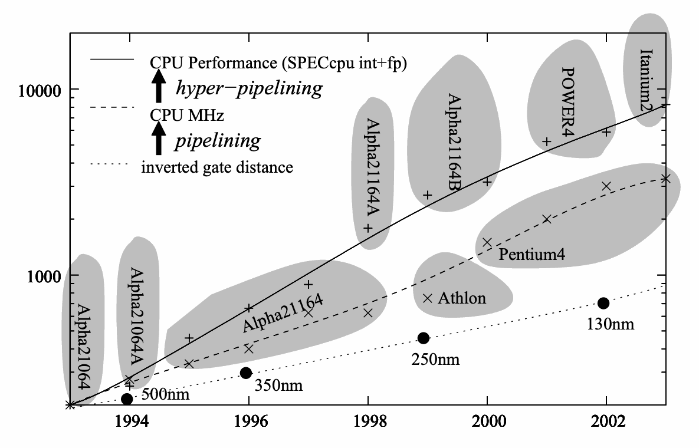
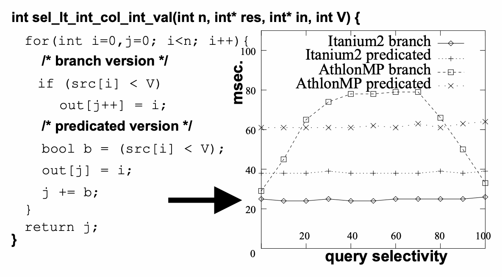
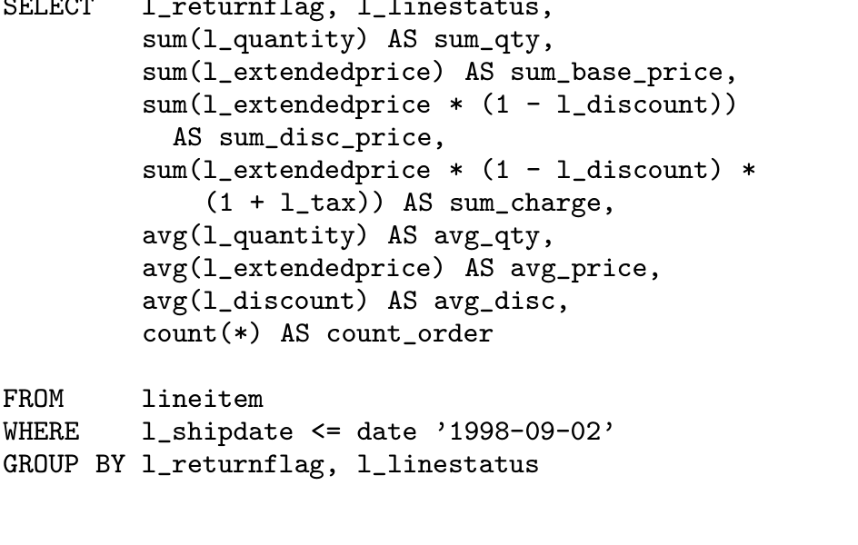
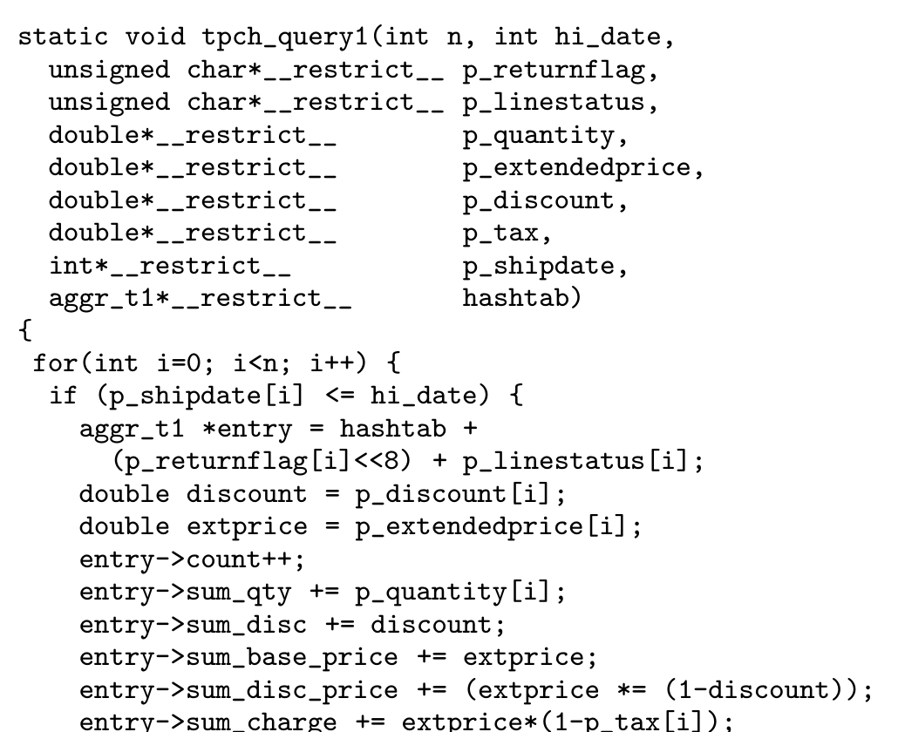
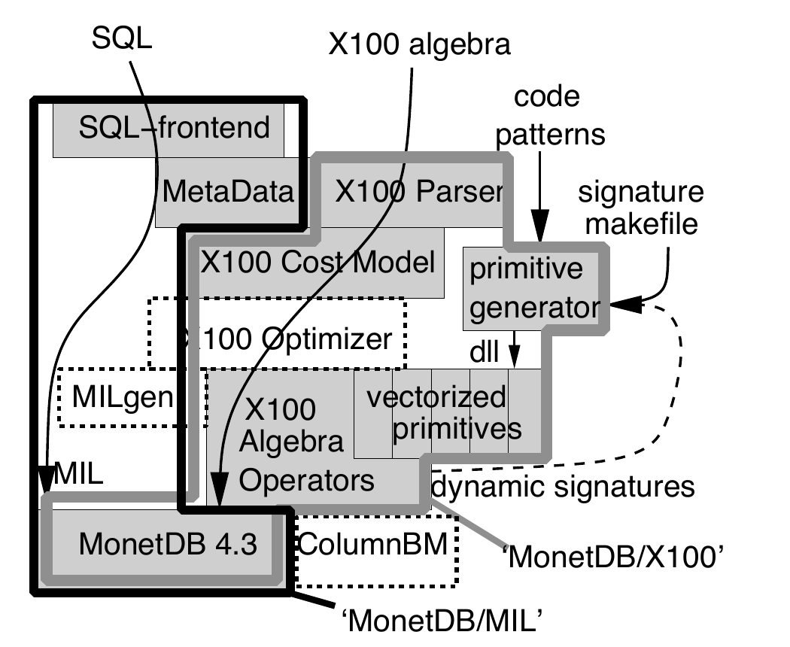
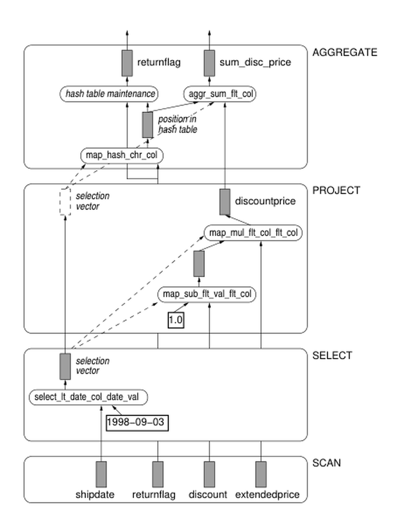
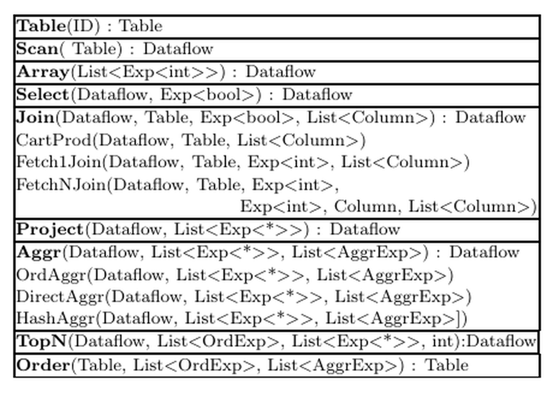
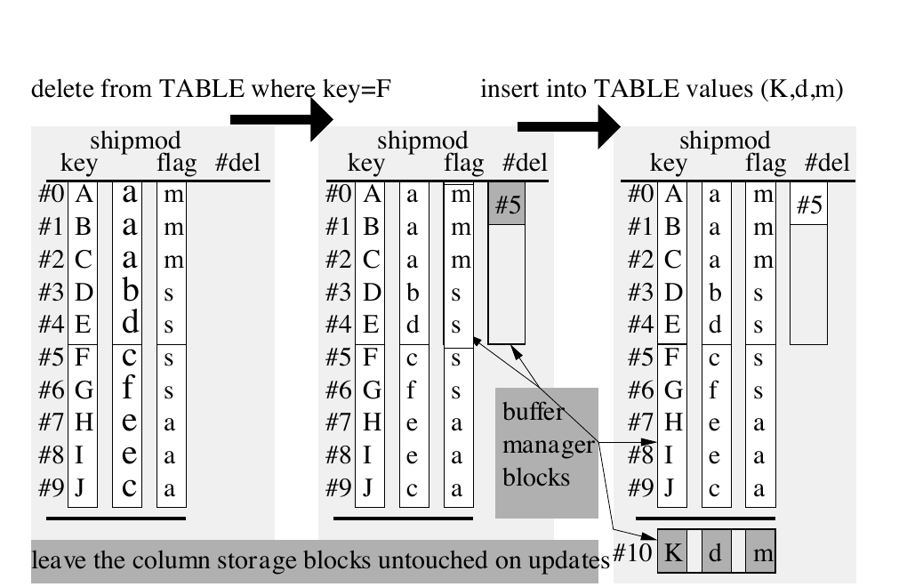
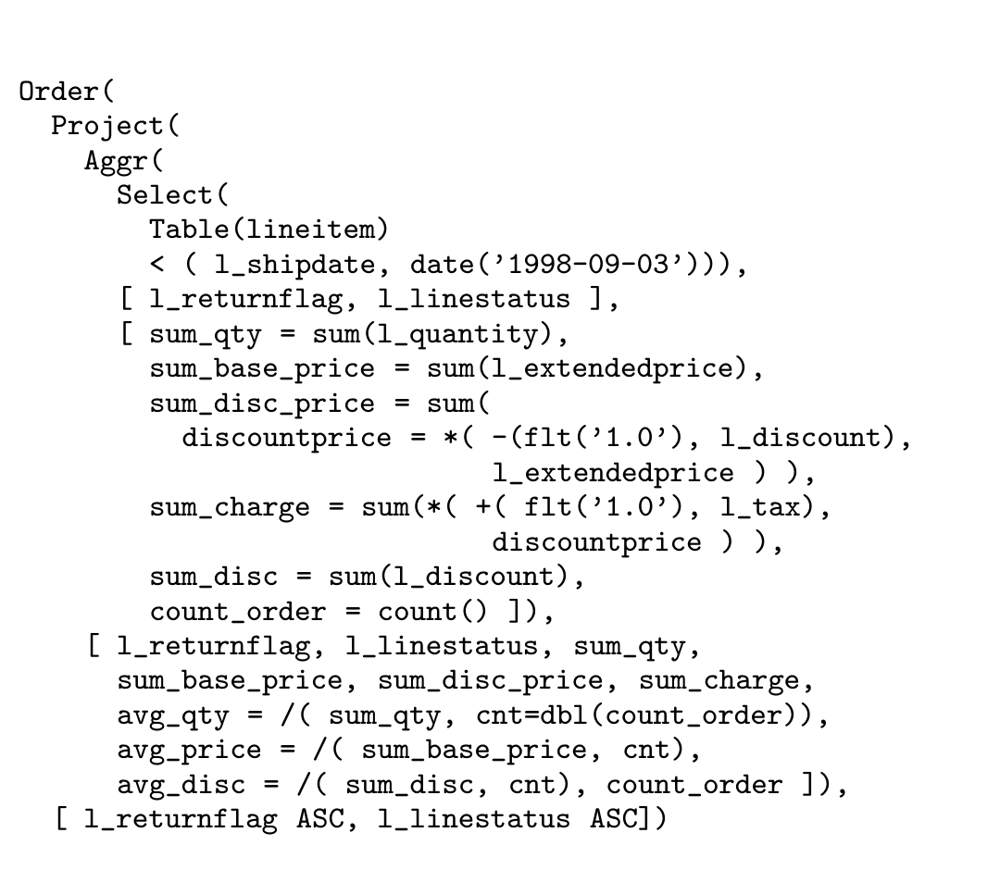
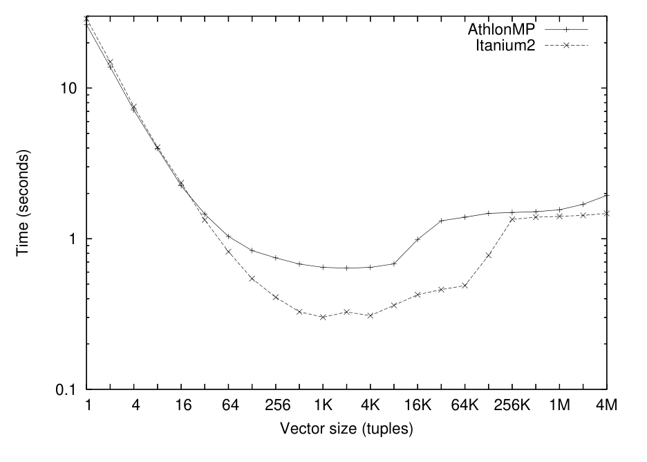

# MonetDB/X100: Hyper-Pipelining Query Execution（中文译文）

## 译者说明

本文依据同目录的 `source.pdf` 翻译。章节、图表、公式、算法、代码与参考文献按原文结构保留。

## 作者

Peter Boncz、Marcin Żukowski、Niels Nes

CWI，Kruislaan 413，Amsterdam, The Netherlands

`{P.Boncz,M.Zukowski,N.Nes}@cwi.nl`

允许免费复制本文全部或部分内容，条件是副本不得用于直接商业利益，并须载明 VLDB 版权声明、出版物题名和日期，同时注明复制行为已获 Very Large Data Base Endowment 许可。其他复制或再版行为须付费和/或获得 Endowment 的特别许可。

*Proceedings of the 2005 CIDR Conference*。

## 摘要

在决策支持、OLAP 和多媒体检索等计算密集型应用中，数据库系统在现代 CPU 上往往只能达到很低的 IPC（instructions per cycle，每周期指令数）效率。本文首先深入研究其原因，重点关注 TPC-H 基准。我们对多种关系数据库系统和 MonetDB 的分析，导出了一组新的查询处理器设计准则。

论文第二部分描述 MonetDB 系统中新 X100 查询引擎的架构。表面上，它类似经典 Volcano 风格引擎；关键区别在于所有执行都基于向量处理（vector processing）概念，因此具有很高的 CPU 效率。我们在 100GB 规模的 TPC-H 上评估 MonetDB/X100，显示其原始执行能力相比此前技术高出一到两个数量级。

## 1. 引言

现代 CPU 每秒能执行大量计算，但前提是能找到足够多独立工作来利用其并行执行能力。过去十年的硬件发展显著扩大了满吞吐和低吞吐之间的速度差，差距可轻松达到一个数量级。按直觉，决策支持、OLAP、数据挖掘和多媒体检索等查询密集型数据库负载包含许多独立计算，应能让现代 CPU 接近最优 IPC。

然而研究表明，在这些应用领域中，数据库系统通常只能达到很低的 IPC 效率 [6, 3]。我们质疑这种情况是否必然。除缓存感知查询处理这一重要话题外，本文详细研究关系数据库系统如何在查询密集型负载，特别是 TPC-H 决策支持基准中，与现代超标量 CPU 互动。

主要结论是：大多数 DBMS 采用的架构阻碍编译器使用最关键的性能优化技术，导致 CPU 效率低。特别是，流行的 Volcano [10] 迭代器模型通常实现为 tuple-at-a-time 执行。这既带来高解释开销，也把 CPU 并行机会隐藏在编译器之外。

我们还分析了 MonetDB/MIL 的 CPU 效率。MonetDB 是我们团队开发的主存数据库，论文发表时已经开源，入口为 `monetdb.cwi.nl`；其 MIL 查询语言见 [4]。MonetDB/MIL 使用 column-at-a-time 执行模型，因此没有 tuple-at-a-time 解释产生的问题。但它的整列物化策略会在执行中产生大型数据流。在决策支持负载上，MonetDB/MIL 受到内存带宽强约束，CPU 效率急剧下降。

因此，我们主张结合 MonetDB 的列式执行与 Volcano 风格流水线提供的增量物化。为此，我们从头设计并实现了 MonetDB 的新查询引擎 X100，采用向量化查询处理模型。除高 CPU 效率外，MonetDB/X100 还旨在扩展到非纯内存的数据集，即磁盘数据。论文第二部分将介绍 MonetDB/X100 架构，并在完整的 100GB TPC-H 基准上评估其性能。

### 1.1 论文结构

第 2 节介绍现代超标量（或超流水线）CPU，重点说明与查询求值性能最相关的问题。第 3 节把 TPC-H Query 1 作为 CPU 效率微基准，依次考察标准关系数据库、MonetDB，以及用于建立最大可达原始性能基线的独立手写实现。第 4 节介绍新 X100 查询处理器的架构，重点讨论查询执行，同时概述数据布局、索引和更新。第 5 节在 TPC-H 上比较 Monet 系统中的 MIL 与 X100，第 6 节讨论相关工作，第 7 节总结。

## 2. CPU 如何工作

图 1 分别给出过去十年里每一年的最高 CPU 主频、最高实际性能——两者并不必然等价——以及当年量产的最先进芯片制造工艺。CPU 主频提高的根源是制造工艺尺度进步：它通常每 18 个月缩小 1.4 倍，即摩尔定律 [13]。尺度每缩小一次，单位面积可容纳的晶体管数量约增至 2 倍，晶体管尺寸约减半，连线距离和信号延迟则缩短至约 $1/1.4$。因此，CPU 主频本应大致随信号延迟的倒数增长；图 1 显示其增长还要更快，主要原因是流水线化：把一条 CPU 指令的工作切成越来越多的阶段。每阶段工作更少，时钟频率就可以更高。



流水线引入两个风险。第一，若某条指令需要前一条指令的结果，它不能紧随其后进入流水线，必须等前一条指令走完整条流水线或其中很大一段。第二，遇到 `if a then b else c` 这类分支时，CPU 必须预测 `a` 的结果。它可能先猜测为假，让 `c` 在 `a` 之后进入流水线；若许多阶段后才发现预测错误，就必须清空流水线中的所有指令，改从 `b` 重新开始。流水线越长，清空代价越高。对应到数据库系统，选择算子中那些依赖数据且选择率既不很高也不很低的分支无法可靠预测，会显著拖慢查询执行 [17]。

超标量 CPU 还可以并行执行多条互相独立的指令。也就是说，CPU 不是一条流水线，而是多条流水线；只要新指令与所有在执行指令都相互独立，每周期就能向每条流水线送入一条新指令，IPC 因而可以大于 1。图 1 表明，超标量执行使实际 CPU 性能的增长快于频率增长。现代处理器在这方面的平衡不同：Itanium2 是 VLIW（Very Large Instruction Word）处理器，有多条并行流水线、流水线较短、频率较低；Pentium4 频率更高、流水线更深，但每周期可执行指令数较少。Intel 曾把“hyper-pipelined”作为“super-scalar”的同义营销用语来宣传 Pentium4。

流水线深度的增长十分具体：1988 年 Intel 80386 用一个或多个周期完成一条指令；1993 年 Pentium 已有 5 级流水线；1999 年 Pentium III 增至 14 级；2004 年 Pentium4 达到 31 级。1.5GHz Itanium2 的流水线只有 7 级、每周期最多执行 6 条指令，因此在任意时刻需要 $7 \times 6 = 42$ 条相互独立的指令才能达到理论峰值；3.6GHz Pentium4 每周期最多执行 3 条，需要 $31 \times 3 = 93$ 条独立指令。程序通常找不到这么多并行工作，所以尽管 Pentium4 时钟高得多，两者在基准中的实际性能仍相近。

程序员通常不会在程序中显式标注哪些指令或表达式相互独立，因此编译器优化对 CPU 利用率至关重要。最重要的技术之一是循环流水化（loop pipelining）。若要对数组 `A` 的 `n` 个独立元素分别执行相互依赖的 `F()`、`G()`，原顺序为：

```text
F(A[0]), G(A[0]), F(A[1]), G(A[1]), …, F(A[n]), G(A[n])
```

编译器可将它重排为：

```text
F(A[0]), F(A[1]), F(A[2]), G(A[0]), G(A[1]), G(A[2]), F(A[3]), …
```

假设 `F()` 的流水线依赖延迟为 2 个周期，那么 `G(A[0])` 进入执行时，`F(A[0])` 的结果恰好已经可用。

对 Itanium2 而言，编译器更为关键：由编译器找出可送入不同流水线的指令；其他 CPU 通常在运行时通过乱序执行完成这件事。Itanium2 不需要用于寻找乱序执行机会的复杂硬件逻辑，因而能容纳更多真正工作的流水线。它还提供分支谓词化（branch predication），可以并行执行 then 和 else，并在条件结果确定后丢弃其中一个结果；同样由编译器发现谓词化机会。

图 2 的微基准执行查询 `SELECT oid FROM table WHERE col < X`，其中 `X` 在 `[0, 100]` 上均匀随机分布，并让选择率 `X` 从 0 变化到 100。AthlonMP 这类普通 CPU 在 50% 选择率附近因分支误预测而表现最差。按照 [17] 的建议巧妙改写代码，把分支转换为布尔计算后，性能不再依赖选择率，但平均成本更高。Itanium2 上原始“branch”版本也很高效且不依赖选择率，因为编译器会把分支转换成硬件谓词化代码。



片上缓存同样关键。CPU 执行的指令约 30% 是内存 load/store；它们访问位于主板上、与 CPU 相距数英寸的 DRAM 芯片，因而存在约 50ns 的物理延迟下界。对 3.6GHz CPU 而言，这个理想下界已经相当于约 180 个等待周期。只有绝大多数内存访问命中片上缓存，现代 CPU 才可能接近最大吞吐。数据库研究已经证明，缓存未命中会严重损害 DBMS 性能 [3]；缓存对齐 B-tree [16, 7]、PAX [2] 和 DSM [8] 这类按列布局，以及把随机内存访问限制在 CPU cache 可容纳区域内的 radix 分区哈希连接 [18, 11]，都能显著改善性能。

总之，CPU 是复杂设备。其指令吞吐可因内存访问的缓存命中率、分支数量及其可预测/可谓词化程度，以及编译器和 CPU 平均能发现多少独立指令，而相差几个数量级。商业 DBMS 查询执行的 IPC 只有约 0.7 [6]，即每周期还执行不到一条指令；科学计算（如矩阵乘法）或多媒体处理却能在现代 CPU 上达到最高约 2 的平均 IPC。我们认为，数据库系统在大规模分析任务上不必如此低效，因为数百万元组和表达式计算本身包含大量独立工作，足以填满 CPU 提供的所有流水线。我们的目标是改造数据库架构，尽可能把这种独立性暴露给编译器和 CPU，从而显著提高查询处理吞吐。

## 3. 微基准：TPC-H Query 1

我们首先聚焦表达式计算，暂时排除 Join 等复杂关系操作。TPC-H Query 1 是一个很合适的微基准：在测试过的所有 RDBMS 上它都受 CPU 限制；其执行计划又非常简单，几乎不需要优化或复杂 Join 实现，因此各数据库系统处于同一起跑线，主要暴露表达式求值效率。

TPC-H 数据仓库的基准大小为 1GB，可按缩放因子（SF）扩大。Query 1 扫描含 $SF \times 6\mathrm{M}$ 个元组的 `lineitem` 表，选择其中几乎全部的 $SF \times 5.9\mathrm{M}$ 个元组，并计算一组定点 decimal 表达式：两次列减常量、一次列加常量、三次列乘列，以及八个聚合——四个 `SUM()`、三个 `AVG()` 和一个 `COUNT()`。group-by 只作用于两个单字符列，产生 4 个唯一组合，可用小哈希表高效完成，不需要额外 I/O，甚至不需要因访问哈希表而产生 CPU 缓存未命中。



我们依次分析 Query 1 在传统关系数据库系统、MonetDB/MIL 和手写程序中的表现。

### 3.1 关系数据库系统中的 Query 1

自 RDBMS 早期以来，查询执行通常通过物理关系代数实现，并遵循 Volcano [10] 流水线模型。然而，关系代数算子的参数自由度很高。即使简单的 `ScanSelect(R, b, P)`，也只有在查询时才完整知道输入关系 `R` 的格式——列数、类型与记录偏移——任意形式的布尔选择表达式 `b`，以及定义输出关系、每项都可任意复杂的投影表达式列表 `P`。为了处理所有可能的 `R`、`b` 和 `P`，DBMS 实现者实际上需要实现一个能处理任意复杂表达式的解释器。

这种解释器的危险在于，尤其当解释粒度是元组时，真正工作，即执行查询表达式，只占总执行成本的一小部分。MySQL 4.1 在 TPC-H Query 1 上的 gprof trace 显示，真正做算术工作的函数只占总时间约 10%。约 28% 时间花在聚合哈希表的创建和查找；剩余约 62% 分散在记录表示导航、字段读取和复制等函数中。锁和 buffer 页分配在这个决策支持查询中影响较小。

本文使用的 Linux 测试平台当时似乎没有可用的多线程 profiling 工具。

**表 1：TPC-H Query 1 性能。** 上半部分是本文实验，时间单位为秒；下半部分是取自 TPC 网站（`www.tpc.org`）的官方参考结果，性能值按 $(\mathrm{seconds} \times \mathrm{CPU\ count})/SF$ 归一化。

| 数据组 | 系统 | 时间或归一化时间 | SF | #CPU | CPU / 平台 | SPECcpu int/fp |
| --- | --- | ---: | ---: | ---: | --- | ---: |
| 本文实验 | DBMS “X” | 28.1 秒 | 1 | 1 | AthlonMP 1533MHz | 609/547 |
| 本文实验 | MySQL 4.1 | 26.6 秒 | 1 | 1 | AthlonMP 1533MHz | 609/547 |
| 本文实验 | MonetDB/MIL | 3.7 秒 | 1 | 1 | AthlonMP 1533MHz | 609/547 |
| 本文实验 | MonetDB/MIL | 3.4 秒 | 1 | 1 | Itanium2 1.3GHz | 1132/1891 |
| 本文实验 | hand-coded | 0.22 秒 | 1 | 1 | AthlonMP 1533MHz | 609/547 |
| 本文实验 | hand-coded | 0.14 秒 | 1 | 1 | Itanium2 1.3GHz | 1132/1891 |
| 本文实验 | MonetDB/X100 | 0.50 秒 | 1 | 1 | AthlonMP 1533MHz | 609/547 |
| 本文实验 | MonetDB/X100 | 0.31 秒 | 1 | 1 | Itanium2 1.3GHz | 1132/1891 |
| 本文实验 | MonetDB/X100 | 0.30 秒 | 100 | 1 | Itanium2 1.3GHz | 1132/1891 |
| TPC 参考 | Oracle10g | 18.1 | 100 | 16 | Itanium2 1.3GHz | 1132/1891 |
| TPC 参考 | Oracle10g | 13.2 | 1000 | 64 | Itanium2 1.5GHz | 1408/2161 |
| TPC 参考 | SQLserver2000 | 18.0 | 100 | 2 | Xeon P4 3.0GHz | 1294/1208 |
| TPC 参考 | SQLserver2000 | 21.8 | 1000 | 8 | Xeon P4 2.8GHz | 1270/1094 |
| TPC 参考 | DB2 UDB 8.1 | 9.0 | 100 | 4 | Itanium2 1.5GHz | 1408/2161 |
| TPC 参考 | DB2 UDB 8.1 | 7.4 | 100 | 2 | Opteron 2.0GHz | 1409/1514 |
| TPC 参考 | Sybase IQ 12.5 | 15.6 | 100 | 2 | USIII 1.28GHz | 704/1054 |
| TPC 参考 | Sybase IQ 12.5 | 15.8 | 1000 | 2 | USIII 1.28GHz | 704/1054 |

即便是 Item 操作本身，`Item_func_plus::val` 的一次加法也要执行 38 条指令，远多于机器层面的几条 load/add/store。该 trace 采自 SGI MIPS R12000：它每周期可执行三条整数或浮点指令及一条 load/store，平均操作延迟约 5 个周期。一个简单的 `+(double src1, double src2)` 在 RISC 指令中只需：

```text
LOAD src1,reg1
LOAD src2,reg2
ADD  reg1,reg2,reg3
STOR dst,reg3
```

这段代码的限制因素是三条 load/store 指令，因此 MIPS 处理器每 3 个周期可完成一次 `*(double, double)`。这与 MySQL 的 `#ins / IPC = 38 / 0.8 = 49` 个周期形成鲜明对比。

**表 2：MySQL 4.1 在 TPC-H Q1 上的 gprof trace。** `cum.` 与 `excl.` 是累计与独占时间百分比，`calls` 是调用次数，`ins.` 是每次调用指令数；加、减、乘、`SUM`、`AVG` 合计不足 10%，整体 IPC 仅约 0.7。粗体五项是真正的算术/聚合工作。

| cum. % | excl. % | calls | ins. | IPC | function |
| ---: | ---: | ---: | ---: | ---: | --- |
| 11.9 | 11.9 | 846M | 6 | 0.64 | `ut_fold_ulint_pair` |
| 20.4 | 8.5 | 0.15M | 27K | 0.71 | `ut_fold_binary` |
| 26.2 | 5.8 | 77M | 37 | 0.85 | `memcpy` |
| **29.3** | **3.1** | **23M** | **64** | **0.88** | **`Item_sum_sum::update_field`** |
| 32.3 | 3.0 | 6M | 247 | 0.83 | `row_search_for_mysql` |
| **35.2** | **2.9** | **17M** | **79** | **0.70** | **`Item_sum_avg::update_field`** |
| 37.8 | 2.6 | 108M | 11 | 0.60 | `rec_get_bit_field_1` |
| 40.3 | 2.5 | 6M | 213 | 0.61 | `row_sel_store_mysql_rec` |
| 42.7 | 2.4 | 48M | 25 | 0.52 | `rec_get_nth_field` |
| 45.1 | 2.4 | 60 | 19M | 0.69 | `ha_print_info` |
| 47.5 | 2.4 | 5.9M | 195 | 1.08 | `end_update` |
| 49.6 | 2.1 | 11M | 89 | 0.98 | `field_conv` |
| 51.6 | 2.0 | 5.9M | 16 | 0.77 | `Field_float::val_real` |
| 53.4 | 1.8 | 5.9M | 14 | 1.07 | `Item_field::val` |
| 54.9 | 1.5 | 42M | 17 | 0.51 | `row_sel_field_store_in_mysql..` |
| 56.3 | 1.4 | 36M | 18 | 0.76 | `buf_frame_align` |
| **57.6** | **1.3** | **17M** | **38** | **0.80** | **`Item_func_mul::val`** |
| 59.0 | 1.4 | 25M | 25 | 0.62 | `pthread_mutex_unlock` |
| 60.2 | 1.2 | 206M | 2 | 0.75 | `hash_get_nth_cell` |
| 61.4 | 1.2 | 25M | 21 | 0.65 | `mutex_test_and_set` |
| 62.4 | 1.0 | 102M | 4 | 0.62 | `rec_get_1byte_offs_flag` |
| 63.4 | 1.0 | 53M | 9 | 0.58 | `rec_1_get_field_start_offs` |
| 64.3 | 0.9 | 42M | 11 | 0.65 | `rec_get_nth_field_extern_bit` |
| **65.3** | **1.0** | **11M** | **38** | **0.80** | **`Item_func_minus::val`** |
| **65.8** | **0.5** | **5.9M** | **38** | **0.80** | **`Item_func_plus::val`** |

这种高成本的一个原因是缺少循环流水化。MySQL 每次调用只算一次加法，而不是对一组加数循环，编译器因此无法做循环流水化。一次加法由四条彼此依赖的指令组成，只能互相等待；按平均 5 个周期的指令延迟估算，这部分约需 20 个周期。其余约 29 个周期用于跳入例程以及压栈、出栈。

MySQL 以 tuple-at-a-time 执行表达式的后果有两项：

- `Item_func_plus::val` 每次只完成一次加法，编译器无法构造流水化循环；单次操作的指令高度依赖，必须插入等待延迟的空流水线槽（stall），使循环成本从 3 个周期上升到约 20 个周期。
- 一次例程调用本身约需 20 个周期，却只能摊在一个操作上，实际近乎把操作成本再翻一倍。

我们也在一个知名商业 RDBMS 上测试了同一查询，即表 1 第一行的 DBMS “X”。由于拿不到其源码，无法产生 gprof trace；不过它的查询求值成本与 MySQL 非常相近。表 1 下半还列出了从 TPC 网站取得的官方 Query 1 结果。

Query 1 由全表扫描中的计算主导，成本随表大小线性扩展；它还可通过水平并行做到“易并行”，所以并行系统的 TPC-H 结果很可能近似线性加速。因而可以把所有时间归一到 `SF=1`、单 CPU 后比较吞吐。表中同时给出各硬件平台的 SPECcpu int/float 分数，用于检查本文关系 DBMS 结果与 TPC 已发布结果是否大致处于同一区间。这一对照使我们相信，MySQL trace 很可能能代表商业 RDBMS 实现中的情况。

### 3.2 MonetDB/MIL 中的 Query 1

我们团队开发的 MonetDB [4] 以垂直分片著称：表按列存储，每一列放在一个包含 `[oid, value]` 对的 Binary Association Table（BAT）中。BAT 是两列表，左列称为 head，右列称为 tail；MonetDB 的代数查询语言是列代数 MIL [5]。

与关系代数不同，MIL 代数没有参数自由度。每个代数算子的参数个数和格式固定——均为两列表或常量——所计算的表达式及结果 shape 也固定。例如，`join(BAT[t_l,t_e] A, BAT[t_e,t_r] B) : BAT[t_l,t_r]` 对 `A` 的 tail 和 `B` 的 head 做等值连接；每个匹配组合返回 `A` 的 head 值与 `B` 的 tail 值。若要连接 `A` 的另一列即 head，先用 `reverse(A)` 得到交换两列后的视图 `BAT[t_e,t_l]`；这在 MonetDB 中是只交换 BAT 内部指针的零成本操作。

复杂表达式必须拆成多条 MIL 语句。例如 `extprice * (1 - tax)` 变为 `tmp1 := [-](1,tax); tmp2 := [*](extprice,tmp1)`；`[*]()` 与 `[-]()` 是把函数 map 到整个 BAT 列上的 multiplex 算子。MIL 的 column-at-a-time 含义是：算子总是消费若干已物化输入 BAT，并物化一个输出 BAT。

我们用 MonetDB/MIL 的 SQL 前端把 TPC-H Query 1 翻译成 MIL 并执行。表 3 列出的 20 次 MIL 调用合计覆盖超过 99% 的查询耗时。Query 1 上，MonetDB/MIL 显然快于同机 MySQL 和商业 DBMS，也能与已发布 TPC-H 成绩竞争；但仔细查看表 3 会发现，几乎所有 MIL 算子受内存而不是 CPU 限制。

**表 3：MonetDB/MIL 的 TPC-H Q1 trace。** SF=1 列给出主存工作集，SF=0.001 列给出可驻 cache 的缩小工作集；带宽单位为 MB/s。

| SF=1 ms | SF=1 BW | SF=.001 us | SF=.001 BW | 总 MB | 结果大小 | MIL statement |
| ---: | ---: | ---: | ---: | ---: | ---: | --- |
| 127 | 352 | 150 | 305 | 45 | 5.9M | `s0 := select(l_shipdate).mark` |
| 134 | 505 | 113 | 608 | 68 | 5.9M | `s1 := join(s0,l_returnflag)` |
| 134 | 506 | 113 | 608 | 68 | 5.9M | `s2 := join(s0,l_linestatus)` |
| 235 | 483 | 129 | 887 | 114 | 5.9M | `s3 := join(s0,l_extprice)` |
| 233 | 488 | 130 | 881 | 114 | 5.9M | `s4 := join(s0,l_discount)` |
| 232 | 489 | 127 | 901 | 114 | 5.9M | `s5 := join(s0,l_tax)` |
| 134 | 507 | 104 | 660 | 68 | 5.9M | `s6 := join(s0,l_quantity)` |
| 290 | 155 | 324 | 141 | 45 | 5.9M | `s7 := group(s1)` |
| 329 | 136 | 368 | 124 | 45 | 5.9M | `s8 := group(s7,s2)` |
| 0 | 0 | 0 | 0 | 0 | 4 | `s9 := unique(s8.mirror)` |
| 206 | 440 | 60 | 1527 | 91 | 5.9M | `r0 := [+](1.0,s5)` |
| 210 | 432 | 51 | 1796 | 91 | 5.9M | `r1 := [-](1.0,s4)` |
| 274 | 498 | 83 | 1655 | 137 | 5.9M | `r2 := [*](s3,r1)` |
| 274 | 499 | 84 | 1653 | 137 | 5.9M | `r3 := [*](s12,r0)` |
| 165 | 271 | 121 | 378 | 45 | 4 | `r4 := {sum}(r3,s8,s9)` |
| 165 | 271 | 125 | 366 | 45 | 4 | `r5 := {sum}(r2,s8,s9)` |
| 163 | 275 | 128 | 357 | 45 | 4 | `r6 := {sum}(s3,s8,s9)` |
| 163 | 275 | 128 | 357 | 45 | 4 | `r7 := {sum}(s4,s8,s9)` |
| 144 | 151 | 107 | 214 | 22 | 4 | `r8 := {sum}(s6,s8,s9)` |
| 112 | 196 | 145 | 157 | 22 | 4 | `r9 := {count}(s7,s8,s9)` |
| **3724** | — | **2327** | — | — | — | **TOTAL** |

**译者注：** 表 3 的 `r3` 行在原文中写作 `[*](s12,r0)`，而表内此前只出现 `s0` 至 `s9`；这里按原文可见内容保留，没有静默改写。

这一点通过在 `SF=0.001` 的 TPC-H 数据集上执行同一计划得到验证：`lineitem` 的所有使用列和全部中间结果都能放入 CPU cache，消除了主存流量，MonetDB/MIL 几乎快了一倍。表中 SF=1 与 SF=0.001 的 BW 列按输入 BAT 与输出 BAT 的合计大小计算各算子的 MB/s。SF=1 时，MonetDB 卡在约 500MB/s，即该硬件可持续的最大带宽 [1]；在 `SF=0.001`、纯 CPU cache 执行时，带宽可超过 1.5GB/s。以 multiplex 乘法 `[*]()` 为例，500MB/s 只相当于每秒 2000 万元组——输入 16 字节、输出 8 字节——在 1533MHz CPU 上每次乘法要 75 个周期，甚至比 MySQL 更差。

因此，MIL 的 column-at-a-time 策略是一把双刃剑。优点是它不会像 MySQL 那样把 90% 查询时间耗在 tuple-at-a-time 解释“开销”上；multiplex 算子在编译期已知布局的完整 BAT 数组上工作，编译器可做循环流水化，`SF=0.001` 结果体现了其很高的 CPU 效率。缺点则来自全量物化：复杂表达式对大量元组每执行一个函数，就物化一整列结果；这些结果往往不进入最终查询结果，只是下一个函数的输入。若查询计划顶层是聚合，最终结果甚至可能像 Query 1 一样小到可以忽略，MIL 却仍物化远多于必要的数据，造成很高的带宽消耗。

Query 1 先从 600 万元组中选择 98%，再对剩余 590 万元组聚合。MonetDB 还要用六次 positional join 物化 `select()` 的相关结果列；Volcano 式流水执行不需要这些连接，可以在一遍扫描中完成选择、计算和聚合而不物化任何数据。虽然本文聚焦主存场景中的 CPU 效率，但 MonetDB/MIL 人为制造的高带宽也使磁盘问题更难高效扩展：内存带宽远高于且远便宜于 I/O 带宽，要持续传输 1.5GB/s，需要真正高端且包含大量磁盘的 RAID 系统。

### 3.3 手写实现

为了确定现代硬件在 Query 1 这类问题上能达到什么基线，我们把它实现为 MonetDB 中的单个用户定义函数（UDF），如图 4。UDF 只接收查询实际访问的列。在 MonetDB 中，这些列以 `BAT[void,T]` 中的数组形式存储：head 列的 OID 从 0 开始稠密递增，MonetDB 因而使用不实际存储的 void（“virtual OID”），BAT 退化为数组。我们把这些数组作为 `restrict` 指针传入，让 C 编译器知道它们互不重叠；只有这样，编译器才能做循环流水化。



**译者注：** 图 4 的原文代码在更新 `sum_charge` 时写作 `extprice*(1-p_tax[i])`，与 Query 1 的加税表达式不一致；图片按原文保留，没有静默改成加号。

该实现利用了以下事实：对两个单字节字符做 `GROUP BY`，组合数绝不会超过 65536，所以两者合并后的位表示可直接作为聚合结果数组的下标。与 MonetDB/MIL 一样，代码还做了公共子表达式消除，从而省去一次减法与三个 `AVG` 聚合。

表 1 显示，这个标为 “hand-coded” 的 UDF 把查询求值成本降至惊人的 0.22 秒。本文余下部分介绍的新 X100 查询处理器与这一手写实现只差约 2 倍。

## 4. MonetDB/X100 架构

X100 的目标有三项：以很高 CPU 效率执行大数据量查询；能扩展到数据挖掘、多媒体检索等领域，并让扩展代码达到同样效率；随着最低层存储（磁盘）的容量扩展。为此它在整个存储层次上逐层消除瓶颈：

- **磁盘**：ColumnBM I/O 子系统面向顺序访问，使用垂直分片布局，并在适用时加入轻量压缩来减少带宽。
- **RAM**：用显式 memory-to-cache/cache-to-memory 例程搬运数据，例程可含平台专用的 SSE 预取或汇编数据移动；RAM 中保留与磁盘一致的垂直、压缩布局。
- **Cache**：使用类似 Volcano 的流水线，但单位是约 1000 个值、驻留 cache 的垂直小块，即向量。CPU cache 是唯一不必担心带宽的地方，因此压缩/解压发生在 RAM 与 cache 的边界；算子把大数据集高效切成 cache chunk，并只在这些小块内做随机访问。
- **CPU**：向量化 projection primitive 明确告诉编译器，相邻元组互相独立，使其可以循环流水化；X100 也尝试让聚合等其他查询处理算子具备同样性质。X100 还可为整个表达式子树编译 compound primitive，减少指令流中的 load/store；当前由构建期静态指定，未来可由优化器在运行时触发。

因此，X100 在 Volcano 和 MonetDB/MIL 之间取得平衡：它使用流水线算子避免整列物化，但每次 `next()` 返回小型向量而非一个元组。解释开销按向量大小摊销，中间结果也不会膨胀为主存带宽瓶颈。论文中的 ColumnBM 尚在开发，实验实际以 MonetDB 的内存 BAT 作为存储管理器。



### 4.1 查询语言

X100 使用相当标准的关系代数。它不沿用一次处理一列的 MIL，因为关系算子需要同时处理多个列，使一个表达式产生的向量能在仍位于 CPU cache 时直接成为下一个表达式的输入。算子之间通过 `next()` 形成流水线，但每次调用返回一批垂直向量。

#### 4.1.1 示例

图 6 用简化的 TPC-H Query 1 展示执行：

```text
Aggr(
  Project(
    Select(
      Table(lineitem),
      <(shipdate, date('1998-09-03'))),
      [discountprice = *(-(flt('1.0'), discount), extendedprice)]),
    [returnflag],
    [sum_disc_price = sum(discountprice)])
```



执行以向量（例如 1000 个值）为粒度。Scan 每次从 Monet BAT 取回一个向量，且只扫描查询真正用到的属性。Select 生成 selection vector，其中存放通过谓词的元组位置。Project 计算聚合需要的表达式；`discount`、`extendedprice` 不会在选择后复制压紧，map primitive 读取 selection vector，只计算相关位置，并把结果写回输出向量的相同位置。因此 selection vector 一直传到 Aggr。Aggr 为每个元组计算哈希表位置、更新聚合值，并在新组出现时保存分组属性；下层算子耗尽后，哈希表内容即为结果。

#### 4.1.2 X100 代数

X100 代数支持常规算子，如 Scan、Select、Project、Aggregation、Join 等。表达式被分解为 primitive 调用；primitive 针对操作、类型和输入格式组合实现。例如 map primitive 对输入向量执行加减乘除，select primitive 生成 selection vector，aggregation primitive 在 group id 上更新聚合状态。



`Table` 表示物化关系，`Dataflow` 表示在流水线中流动的元组。`Order`、`TopN` 和 `Select` 保持输入 dataflow 的 shape，其余算子可定义新 shape。`Project` 只做表达式计算，不负责消重；消重用只有 group-by 列的 `Aggr` 完成。`Array` 把 N 维数组表示为一个 N 元关系，按 column-major 维序产生所有合法数组下标坐标；MonetDB 的 RAM 数组操作前端使用这个算子 [9]。`Fetch1Join`/`FetchNJoin` 按 row id 从垂直列取值；`OrdAggr`、`DirectAggr`、`HashAggr` 是按输入性质选择的聚合实现。

聚合有三个物理算子：直接聚合、哈希聚合和有序聚合。如果源 dataflow 中同组成员连续到达，选择有序聚合；若 group id 的 bit 表示限制在已知的小域内，可像手写方案一样使用小数组直接聚合；其他情况使用哈希聚合。

当前 X100 只支持 left-deep join。默认物理实现是上方带 `Select` 的 `CartProd`，即嵌套循环连接；若检测到外键谓词且有 join index，就改用 `Fetch1Join` 或 `FetchNJoin`。这些 fetch join 也承担垂直分片中的“位置连接”：X100 为每张表赋予从 0 递增的虚拟 `#rowId`，`Fetch1Join` 可按该位置取回某列的值。这相当于 MonetDB 中把 OID positional-join 到 void 列；MIL 实践表明，这种位置连接能高效处理垂直分片额外引入的连接 [4]。

### 4.2 向量化 Primitive

采用按列向量布局的首要原因并非优化 cache 内的数据布局——X100 原本就应在缓存数据上工作——而是向量化执行 primitive 的自由度很低，正如 3.2 节所述。垂直数据模型使 primitive 只需知道所操作的列，不必知道整张表的记录 offset 或 layout；编译 X100 时，C 编译器看到的是固定 shape、通过 `restrict` 声明相互独立的数组，因而能够进行对现代 CPU 性能至关重要的激进循环流水化。向量浮点加法的生成代码形态如下：

```c
map_plus_double_col_double_col(
    int n,
    double *__restrict__ res,
    double *__restrict__ col1,
    double *__restrict__ col2,
    int *__restrict__ sel)
{
    if (sel) {
        for (int j = 0; j < n; j++) {
            int i = sel[j];
            res[i] = col1[i] + col2[i];
        }
    } else {
        for (int i = 0; i < n; i++)
            res[i] = col1[i] + col2[i];
    }
}
```

`sel` 可以为空，也可以指向 `n` 个选中位置。所有 X100 primitive 都接受这种 selection vector。选择后保留子算子原向量，通常比把所有选中值复制到新的连续向量更快。

X100 有数百个 primitive，但不手写维护，而是由 pattern 生成。例如：

```text
any::1 +(any::1 x, any::1 y) plus = x + y
```

表示两个同类型值可用 C 的中缀 `+` 实现，结果同类型，标识名为 `plus`；后续类型专用 pattern 可以覆盖它，例如 `str +(str x,str y) concat = str_concat(x,y)`。另一个文件请求要生成的签名：

```text
+(double*, double*)
+(double,  double*)
+(double*, double)
+(double,  double)
```

星号表示列，从而请求生成单值与列相加的所有组合。其他可扩展 RDBMS 往往只允许参数为单值的 UDF [19]；这会隐藏循环，妨碍编译器流水化，如 3.1 节所示。X100 让扩展作者提供源码 pattern 而不是已编译代码，因而抽象数据类型（ADT）也能在查询执行中获得一等公民待遇。MIL 和大多数可扩展 DBMS [19] 在这方面较弱，因为其主要代数算子只针对内置类型优化。

X100 二进制当时小于 1 MB；若部署在资源受限环境，可省略某些 primitive 的列版本进一步缩小体积。X100 仍能以 vector size 为 1 的方式执行这些 primitive，只是速度较慢。

X100 还能请求 compound primitive，例如：

```text
/(square(-(double*, double*)), double*)
```

这是某些多媒体检索任务中性能关键的 Mahalanobis 距离表达式 [9]。实验中 compound primitive 常比逐函数 primitive 快约 2 倍；这个倍数也与表 1 中 MonetDB/X100 和手写 TPC-H Query 1 的差距相近。普通二元 primitive 每做一次算术要装入两个参数并存一个结果，即 1 条工作指令配 3 条内存指令，而现代 CPU 每周期通常只能执行 1-2 次 load/store。compound primitive 只在表达式图边界访问内存，中间结果通过 CPU 寄存器传递，改善指令配比。论文实现的生成器仍只是 X100 make 流程中的宏展开脚本，未来计划由优化器要求动态编译 compound primitive。

对返回布尔值的 pattern，`select_*` primitive 不产生完整布尔向量，而是填充选中位置数组并返回数量。`aggr_*` primitive 则计算 `count`、`sum`、`min`、`max`，每种聚合由初始化、更新和收尾 pattern 生成不同 X100 聚合实现所需例程。

### 4.3 数据存储

MonetDB/X100 以垂直分片形式存储所有表。无论使用新的 ColumnBM buffer manager，还是 MonetDB 的 `BAT[void,T]` 存储，存储方案相同。MonetDB 将每个 BAT 存为单个连续文件；ColumnBM 则把这些文件划分为大于 1MB 的块。

垂直存储的一个缺点是更新成本较高：单行更新或删除可能需要对每列执行一次 I/O。X100 通过把垂直分片视为不可变对象来规避这一点。更新写入 delta 结构。删除通过把 tuple id 加入删除列表处理；插入则追加到独立 delta 列。ColumnBM 把所有 delta 列一起存储在一个块中，等同于 PAX [2]。因此删除和插入都只需一次 I/O。更新可视为先删除再插入。随着 delta 增长，当其大小超过总表大小的某个较小百分比时，系统应重组数据存储，使垂直存储重新最新并清空 delta。



垂直存储的优势是，访问大量元组但不访问所有列的查询可以节省带宽。这既适用于 RAM 带宽，也适用于 I/O 带宽。X100 还使用轻量压缩进一步降低带宽需求。枚举类型可把列存为一字节或二字节整数，该整数引用映射表的 row id。当查询使用这些列时，X100 自动加入 Fetch1Join 操作取回未压缩值。由于垂直分片不可变，更新只进入未压缩 delta 列，不会使压缩方案复杂化。

X100 还支持与 [12] 类似的简单 summary index，用于已聚簇、即近似有序的列。这些索引以很粗粒度存储 `#rowId`、到该位置的 running maximum 以及反向 running minimum；默认规模为 1000 个条目，`#rowId` 以固定间隔从基表抽取。索引可快速为范围谓词推导 `#rowId` 边界。由于垂直分片不可变，这些索引实际上无需维护；预期很小且驻留内存的 delta 列不建索引，始终直接访问。

## 5. TPC-H 实验

表 4 比较了 MonetDB/MIL 和 MonetDB/X100 执行全部 TPC-H 查询的结果。我们在 AthlonMP 平台——1533MHz、1GB RAM、Linux 2.4——上，以 `SF=1` 在开箱即用且带 SQL 前端的 MonetDB/MIL 中运行 SQL 基准查询；还手工把所有 TPC-H 查询翻译为 X100 algebra 后在 MonetDB/X100 中运行。前两列结果清楚表明 X100 超过 MonetDB/MIL。

在配置上，MonetDB/MIL 和 X100 都在所有外键路径上使用 join index。X100 还按日期排序 `orders` 表，并让 `lineitem` 与之聚簇；对两个表所有日期列使用 summary index；还按 region/country 排序 supplier 和 customer。SF=1 时，MonetDB/MIL 总磁盘存储约 1GB，X100 约 0.8GB，降低来自枚举类型压缩。

我们还在运行 Linux 2.4 的 1.3GHz Itanium2 服务器——3MB cache、12GB RAM——上运行 `SF=1` 和 `SF=100`。表 4 最后一列是 MAXDATA Platinum 9000-4R 的官方结果：该服务器运行 DB2 8.1 UDB，配有四颗 1.5GHz、6MB cache 的 Itanium2 和 32GB RAM；数字来自 stream 0，即没有并发查询或更新的 “power test”。

需要说明，所有 MonetDB TPC-H 数字都是纯内存结果，没有 I/O；与 DB2 比较时尤其要考虑这一点。结果也表明，即便 `SF=100`，MonetDB/X100 每个单独查询所需数据仍少于本文服务器的 12GB RAM；若像 DB2 平台一样有 32GB RAM，所有 TPC-H 查询的 hot set 都可放入内存。DB2 数字确实包含 I/O，但测试平台用了 112 块 SCSI 磁盘，这暗示其磁盘数量可能已增加到 DB2 转为 CPU-bound。即使考虑到 DB2 硬件的 CPU 能力强四倍以上，MonetDB/X100 的结果仍很稳健。

**表 4：TPC-H 性能（秒）。**

| Q | MonetDB/MIL SF=1 | X100 Athlon SF=1 | X100 Itanium SF=1 | X100 Itanium SF=100 | DB2 4CPU SF=100 |
| ---: | ---: | ---: | ---: | ---: | ---: |
| 1 | 3.72 | 0.50 | 0.31 | 30.25 | 229 |
| 2 | 0.46 | 0.01 | 0.01 | 0.81 | 19 |
| 3 | 2.52 | 0.04 | 0.02 | 3.77 | 16 |
| 4 | 1.56 | 0.05 | 0.02 | 1.15 | 14 |
| 5 | 2.72 | 0.08 | 0.04 | 11.02 | 72 |
| 6 | 2.24 | 0.09 | 0.02 | 1.44 | 12 |
| 7 | 3.26 | 0.22 | 0.22 | 29.47 | 81 |
| 8 | 2.23 | 0.06 | 0.03 | 2.78 | 65 |
| 9 | 6.78 | 0.44 | 0.44 | 71.24 | 274 |
| 10 | 4.40 | 0.22 | 0.19 | 30.73 | 47 |
| 11 | 0.43 | 0.03 | 0.02 | 1.66 | 20 |
| 12 | 3.73 | 0.09 | 0.04 | 3.68 | 19 |
| 13 | 11.42 | 1.26 | 1.04 | 148.22 | 343 |
| 14 | 1.03 | 0.02 | 0.02 | 2.64 | 14 |
| 15 | 1.39 | 0.09 | 0.04 | 14.36 | 30 |
| 16 | 2.25 | 0.21 | 0.14 | 15.77 | 64 |
| 17 | 2.30 | 0.02 | 0.02 | 1.75 | 77 |
| 18 | 5.20 | 0.15 | 0.11 | 10.37 | 600 |
| 19 | 12.46 | 0.05 | 0.05 | 4.47 | 81 |
| 20 | 2.75 | 0.08 | 0.05 | 2.45 | 35 |
| 21 | 8.85 | 0.29 | 0.17 | 17.61 | 428 |
| 22 | 3.07 | 0.07 | 0.04 | 2.30 | 93 |

### 5.1 Query 1 性能

我们进一步分析 X100 上 TPC-H Query 1。X100 提供基于底层 CPU 计数器的 tracing 和 profiling。trace 的 primitive 级统计显示，X100 能以很低的每元组周期数运行 primitive。即使相对复杂的聚合 primitive，也约为每元组 6 个周期；乘法 map primitive 约为每元组 2.2 个周期，远好于 MySQL 中约 49 周期的乘法。



另一个观察是，因为 primitive 处理的大部分数据来自 CPU cache 中的向量，X100 能维持很高带宽。MonetDB/MIL 中乘法受约 500MB/s RAM 带宽限制，而 X100 在 Itanium2 的同一算子上超过 7.5GB/s（AthlonMP 约 5GB/s）。此外，Query 1 的 `l_discount`、`l_tax`、`l_quantity` 以枚举类型存储，X100 自动插入三个 Fetch1Join 恢复原值，每个都低于 2 cycles/tuple。

**表 5：MonetDB/X100 的 TPC-H Query 1 性能 trace（Itanium2，SF=1）。** 上半部分是向量化 primitive 级统计，下半部分是更粗粒度的 X100 algebra 算子统计；输入计数中的 6M/5.9M 分别表示过滤前后约 600 万/590 万行。

| 输入 | 数据量 MB | 时间 us | 带宽 MB/s | cycles/tuple | Primitive |
| ---: | ---: | ---: | ---: | ---: | --- |
| 6M | 30 | 8518 | 3521 | 1.9 | `map fetch uchr_col flt_col` |
| 6M | 30 | 8360 | 3588 | 1.9 | `map fetch uchr_col flt_col` |
| 6M | 30 | 8145 | 3683 | 1.9 | `map fetch uchr_col flt_col` |
| 6M | 35.5 | 13307 | 2667 | 3.0 | `select lt usht_col usht_val` |
| 5.9M | 47 | 10039 | 4681 | 2.3 | `map sub flt_val flt_col` |
| 5.9M | 71 | 9385 | 7565 | 2.2 | `map mul flt_col flt_col` |
| 5.9M | 71 | 9248 | 7677 | 2.1 | `map mul flt_col flt_col` |
| 5.9M | 47 | 10254 | 4583 | 2.4 | `map add flt_val flt_col` |
| 5.9M | 35.5 | 13052 | 2719 | 3.0 | `map uidx uchr_col` |
| 5.9M | 53 | 14712 | 3602 | 3.4 | `map directgrp uidx_col uchr_col` |
| 5.9M | 71 | 28058 | 2530 | 6.5 | `aggr sum flt_col uidx_col` |
| 5.9M | 71 | 28598 | 2482 | 6.6 | `aggr sum flt_col uidx_col` |
| 5.9M | 71 | 27243 | 2606 | 6.3 | `aggr sum flt_col uidx_col` |
| 5.9M | 71 | 26603 | 2668 | 6.1 | `aggr sum flt_col uidx_col` |
| 5.9M | 71 | 27404 | 2590 | 6.3 | `aggr sum flt_col uidx_col` |
| 5.9M | 47 | 18738 | 2508 | 4.3 | `aggr count uidx_col` |

| 输入计数 | 时间 us | X100 operator |
| ---: | ---: | --- |
| 0 | 3978 | `Scan` |
| 6M | 10970 | `Fetch1Join(ENUM)` |
| 6M | 10712 | `Fetch1Join(ENUM)` |
| 6M | 10656 | `Fetch1Join(ENUM)` |
| 6M | 15302 | `Select` |
| 5.9M | 236443 | `Aggr(DIRECT)` |

### 5.1.1 向量大小影响

X100 默认向量大小为 1024，但用户可覆盖。理想情况下，所有向量合计应舒适地放入 CPU 缓存，因此不能太大；但若向量太小，利用 CPU 并行性的机会消失，X100 algebra `next()` 方法的解释开销也会增大。

实验显示，当向量大小为 1，即 tuple-at-a-time 处理时，解释开销对 X100 也很严重。随着向量大小增加，执行时间迅速改善。对该查询和平台而言，最佳值约为 1000，128 到 8K 都表现良好。Query 1 所有向量的合计宽度略高于每元组 40 字节；AthlonMP 的 L1+L2 合计 320KB，因此超过 8K 后 cache 需求越界，性能开始下降。Itanium2 有 16KB L1、256KB L2、3MB L3，退化稍早开始，随后持续到 64K × 40 字节也越过 L3。极端向量大小为 4M 时，中间结果都物化到主存，X100 行为接近 MonetDB/MIL，但仍因不需要 MIL 为投影选中元组所做的额外 join 而更快。



## 6. 相关工作

本文在经典 Volcano 迭代器模型 [10] 和 MonetDB 列式查询处理模型 [4] 之间架桥。Volcano 不仅形式化了查询处理迭代器模型，也概括了多种并行查询处理形式 [20]，其中一种策略是为每个查询算子分配单独进程。X100 的不同之处在于，它通过让一个进程在每轮查询处理迭代中花相当多时间处理同一算子——即处理一个元组向量而非单个元组——来减少开销。

与本文最接近的是 [14]，它提出 DB2 中的 blocked execution path。不同于从一开始就为向量化执行设计的 X100，该工作只用这种方法增强 aggregation 和 projection；DB2 的元组布局仍是 NSM，不过该论文也讨论了动态把 NSM 块重新映射为垂直块的可能性。

[22] 同样建议 block-at-a-time 处理，但仍聚焦 NSM 元组布局。它在算子流水线中插入 Buffer 算子，让 Buffer 连续调用子算子 N 次并缓存结果；当查询树中所有算子的总代码 footprint 超过 instruction cache 时，这能在某个算子的指令处于“热”状态时连续调用它，缓解指令缓存问题。该方案按块处理，却不修改查询算子使其真正作用于块。我们认为，采用 X100 方法会自然获得 [22] 的 instruction-cache 收益；此前也已观察到，MonetDB/MIL 的列式执行让每个算子持续运行很久，因而 instruction-cache miss 并非问题。

[21] 也提出 block-at-a-time 查询处理，这次针对 B-tree 查找；其主要目标是改善 data cache 使用，而 MonetDB/X100 的主要目标是通过循环流水化提高查询处理的 CPU 效率。

在数据存储方面，MonetDB/X100 的更新方案把 DSM [8] 用于稳定数据，把 PAX [2] 用于更新元组。这与 [15] 为更灵活的数据镜像而结合 DSM 和 NSM、并用倒排列表高效处理更新的建议接近。PAX 块可看作一组垂直向量，因此 X100 可以在这种表示上直接运行而无需转换。

## 7. 结论与未来工作

本文研究了关系数据库系统为何在现代 CPU 上 CPU 效率较低。结论是，Volcano 风格的一次一个元组执行架构引入解释开销，并阻碍编译器使用最关键的优化技术，例如循环流水化。

我们还分析了 MonetDB 主存数据库的 CPU 效率。MonetDB 不受 tuple-at-a-time 解释影响，但采用 column-at-a-time 物化策略，导致系统受内存带宽限制。

因此，本文提出在 Volcano 和 MonetDB 执行模型之间取得平衡：流水线算子之间传递小的、缓存驻留的垂直数据片段，即向量。基于这一原则，我们提出 MonetDB 的新查询引擎 X100。它使用向量化 primitive 高效完成大部分查询处理工作。在 100GB TPC-H 决策支持基准上，MonetDB/X100 相比既有 DBMS 技术最高可快两个数量级。

未来工作包括继续为 MonetDB/X100 增加更多向量化查询处理算子，把 MonetDB/MIL SQL 前端移植到 X100，并配备基于直方图的查询优化器。我们还计划把 MonetDB/X100 部署到团队正在开展的数据挖掘、XML 处理、多媒体与信息检索项目中。

我们也会继续开发 ColumnDB（前文称 ColumnBM）buffer manager，使 MonetDB/X100 能扩展到主存之外，并争取在数据从磁盘而非 RAM 顺序流入时维持同样高的 CPU 效率。为降低 I/O 带宽需求，我们计划研究轻量压缩和磁盘访问的多查询优化。最后，我们考虑把 X100 用作低功耗的嵌入式、移动环境中的高能效查询处理系统：它 footprint 小，并且用尽可能少的 CPU 周期完成尽可能多的工作，这会转化为更长的电池续航。


## 参考文献

- [1] The STREAM Benchmark: Computer Memory Bandwidth. http://www.streambench.org.
- [2] A. Ailamaki, D. DeWitt, M. Hill, and M. Skounakis. Weaving Relations for Cache Performance. In Proc. VLDB, Rome, Italy, 2001.
- [3] A. Ailamaki, D. J. DeWitt, M. D. Hill, and D. A. Wood. DBMSs on a Modern Processor: Where Does Time Go? In Proc. VLDB, Edinburgh, 1999.
- [4] P. A. Boncz. Monet: A Next-Generation DBMS Kernel For Query-Intensive Applications. Ph.d. thesis, Universiteit van Amsterdam, Amsterdam, The Netherlands, May 2002.
- [5] P. A. Boncz and M. L. Kersten. MIL Primitives for Querying a Fragmented World. VLDB J., 8(2):101–119, 1999.
- [6] Q. Cao, J. Torrellas, P. Trancoso, J.-L. Larriba-Pey, B. Knighten, and Y. Won. Detailed characterization of a quad pentium pro server running tpc-d. In Proc. ICCD, Austin, USA, 1999.
- [7] S. Chen, P. B. Gibbons, and T. C. Mowry. Improving index performance through prefetching. In Proc. SIGMOD, Santa Barbara, USA, 2001.
- [8] G. P. Copeland and S. Khoshafian. A Decomposition Storage Model. In Proc. SIGMOD, Austin, USA, 1985.
- [9] R. Cornacchia, A. van Ballegooij, and A. P. de Vries. A case study on array query optimisation. In Proc. CVDB, 2004.
- [10] G. Graefe. Volcano - an extensible and parallel query evaluation system. IEEE Trans. Knowl. Data Eng., 6(1):120–135, 1994.
- [11] S. Manegold, P. A. Boncz, and M. L. Kersten. Optimizing Main-Memory Join On Modern Hardware. IEEE Transactions on Knowledge and Data Eng., 14(4):709–730, 2002.
- [12] G. Moerkotte. Small Materialized Aggregates: A Light Weight Index Structure for Data Warehousing. In Proc. VLDB, New York, USA, 1998.
- [13] G. Moore. Cramming more components onto integrated circuits. Electronics, 38(8), Apr. 1965.
- [14] S. Padmanabhan, T. Malkemus, R. Agarwal, and A. Jhingran. Block oriented processing of relational database operations in modern computer architectures. In Proc. ICDE, Heidelberg, Germany, 2001.
- [15] R. Ramamurthy, D. J. DeWitt, and Q. Su. A case for fractured mirrors. In Proc. VLDB, Hong Kong, 2002.
- [16] J. Rao and K. A. Ross. Making B+-Trees Cache Conscious in Main Memory. In Proc. SIGMOD, Madison, USA, 2000.
- [17] K. A. Ross. Conjunctive selection conditions in main memory. In Proc. PODS, Madison, USA, 2002.
- [18] A. Shatdal, C. Kant, and J. F. Naughton. Cache conscious algorithms for relational query processing. In Proc. VLDB, Santiago, 1994.
- [19] M. Stonebraker, J. Anton, and M. Hirohama. Extendability in POSTGRES. IEEE Data Eng. Bull., 10(2):16–23, 1987.
- [20] A. Wilschut, J. Flokstra, and P. Apers. Parallel Evaluation of Multi-Join Queries. In San Jose, USA, San Jose, CA, USA, May 1995.
- [21] J. Zhou and K. A. Ross. Buffering accesses to memory-resident index structures. In Proc. VLDB, Toronto, Canada, 2003.
- [22] J. Zhou and K. A. Ross. Buffering database operations for enhanced instruction cache performance. In Proc. SIGMOD, Paris, France, 2004.
