# Morsel-Driven Parallelism: A NUMA-Aware Query Evaluation Framework for the Many-Core Age（中文译文）

## 译者说明

本文依据同目录的 `source.pdf` 翻译。章节、图表、公式、算法、代码与参考文献按原文结构保留。

## 作者

Viktor Leis、Peter Boncz、Alfons Kemper、Thomas Neumann

Technische Universitaet Muenchen；CWI

## 摘要

随着现代计算机体系结构演进，两个问题共同挑战了并行查询执行的现有方法：第一，为利用 many-core，所有查询工作必须在很快会达到上百个线程的环境中均匀分布，才能获得良好加速；第二，即使有准确的数据统计信息，由于现代乱序执行核心的复杂性，均匀划分工作仍然困难。因此，现有“plan-driven”并行方法会遇到负载均衡和上下文切换瓶颈，无法继续扩展。many-core 架构面临的第三个问题是内存控制器去中心化，导致 Non-Uniform Memory Access（NUMA）。

作为回应，本文提出 morsel-driven 查询执行框架，把调度变成细粒度、运行期、NUMA-aware 的任务。Morsel-driven 查询处理把输入数据切成小片段（morsels），并把这些 morsel 调度给 worker 线程；worker 线程运行完整的算子 pipeline，直到下一个 pipeline breaker。并行度不固化在查询计划中，而是可以在查询执行期间弹性变化，因此 dispatcher 可以对不同 morsel 的执行速度做出反应，也可以根据新到达查询动态调整资源。dispatcher 还感知 NUMA-local 的 morsel 和算子状态的数据局部性，使绝大多数执行发生在 NUMA-local 内存上。我们在 TPC-H 和 SSB benchmark 上评估，结果显示 32 核上平均加速超过 30 倍，并具有很高的绝对性能。

**分类**：H.2.4 Systems: Query processing

**关键词**：Morsel-driven parallelism；NUMA-awareness

## 1. 引言

今天硬件性能提升的主要动力来自多核并行度增加，而不是单线程性能提升。到 SIGMOD 2014 时，即将推出的主流服务器 Ivy Bridge EX 已可运行 120 个并发线程。本文用 many-core 指代拥有几十到几百个核心的架构。

与此同时，单机主存容量增加到数 TB，推动了主存数据库系统的发展。在这些系统中，查询处理不再受 I/O 限制，many-core 的巨大并行计算资源可以被真正利用。然而，为扩展大容量内存吞吐而把内存控制器移入芯片、使内存访问去中心化，会导致 NUMA。机器本身变成一个网络：数据项访问成本取决于数据所在芯片和访问线程所在芯片。因此，many-core 并行化必须考虑 RAM 和缓存层次。特别是 RAM 的 NUMA 划分必须被谨慎处理，以保证线程主要处理 NUMA-local 数据。

20 世纪 90 年代对并行处理的大量研究，使多数数据库系统采用受 Volcano 模型启发的并行形式。在这种模型中，算子大体不感知并行性；并行性由 exchange 算子封装，exchange 在执行相同 query plan pipeline 片段的多个线程之间路由 tuple stream。这类 Volcano 实现可称为 plan-driven：优化器在查询编译时静态决定运行多少线程，为每个线程实例化一个查询算子计划，并用 exchange 算子连接它们。

本文提出为主存数据库 HyPer 设计的 adaptive morsel-driven 查询执行框架。以三路 join 查询 `R join_A S join_B T` 为例，图 1 展示了基本思想。并行性通过在不同核心上并行处理每个 pipeline 达成。核心机制是调度器（dispatcher）：它允许灵活并行执行一个 operator pipeline，甚至能在查询执行过程中改变并行度。查询被切成若干 segment，每个执行 segment 取一小块输入 tuple（例如 100,000 个 tuple）的 morsel，运行该 segment，并把结果物化到下一个 pipeline breaker。

**图 1. morsel-driven parallelism 思想**：以 `R join_A S join_B T` 为例，dispatcher 把来自不同 NUMA 区域的小 morsel 分派给对应 socket 上的 worker，使扫描、构建和 probe pipeline 在多个核心上并行执行。

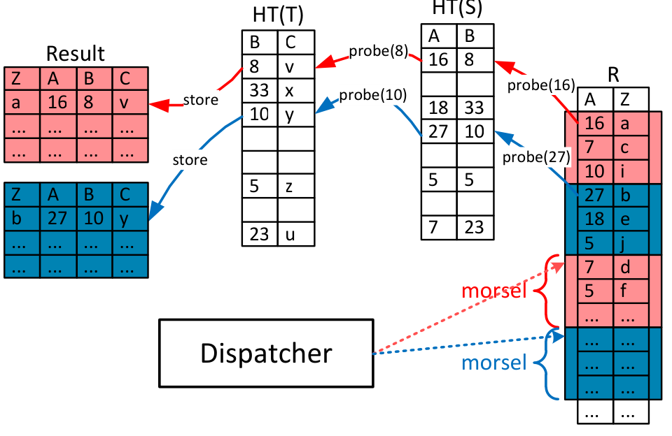

图中的颜色表示 NUMA-local 处理：线程处理 NUMA-local 输入，并把结果写入 NUMA-local 存储区。dispatcher 运行固定数量、与机器相关的线程，即使新查询到达也不会发生资源过度订阅。这些线程固定绑定到核心，避免操作系统迁移线程造成意外 NUMA-locality 损失。

Morsel-driven 调度的关键特性是任务分配发生在运行期，因此完全 elastic。即使中间结果大小分布不确定，或者现代 CPU 核心对相同工作量也表现出难以预测的性能差异，它仍能实现良好负载均衡。它的 elastic 体现在：可以处理运行期变化的 workload，通过减少或增加已运行查询的并行度来响应新查询；也容易集成不同查询优先级的机制。

Morsel-driven 不只是调度思想，而是一套完整查询执行框架。所有物理查询算子都必须能在执行阶段 morsel-wise 并行执行，例如 hash build 和 probe 都要并行化。这对 many-core 可扩展性很关键，因为 Amdahl 定律会放大任何串行阶段。Morsel-wise 框架的重要组成部分是数据局部性感知：从输入 morsel 和物化输出 buffer 的局部性开始，扩展到算子可能创建和访问的状态，例如 hash table。状态是共享数据，理论上可被任何核心访问，但仍具有较强 NUMA locality。调度器灵活选择任务，但强烈偏向最大化 NUMA-local 执行。只有为了负载均衡，少量 morsel 才会发生 remote NUMA 访问。

纯 Volcano 并行框架隐藏并行性并避免共享状态，通常由 exchange 算子动态做数据分区。我们认为这并不总是产生最优计划：分区代价不总能抵消收益，而 on-the-fly 分区获得的局部性可由 locality-aware dispatcher 达成。其他系统也提出过 per-operator parallelization，但在多查询 workload 下会过度订阅线程；本文使用固定 worker 线程和 elastic 分派来避免这个问题。

本文贡献包括：

- **Morsel-driven 查询执行**：一种新的并行查询求值框架，根本区别于传统 Volcano 模型。它在运行期通过 work-stealing 动态分配线程之间的工作，避免负载不均导致 CPU 闲置，并允许 CPU 资源在查询之间随时重新分配。
- **快速并行算子算法**：覆盖重要关系算子。
- **系统性 NUMA-awareness 集成方法**：把 NUMA locality 纳入数据库系统执行框架，而不是只作为单个算子优化。

## 2. Morsel-Driven 执行

延续引言中的例子，考虑如下查询计划：

```text
sigma(...)(R) join_A sigma(...)(S) join_B sigma(...)(T)
```

假设过滤后 `R` 最大，优化器会选择 `R` 作为 probe 输入，为 `S` 和 `T` 构建 hash table。代数查询计划包含三个 pipeline：

1. 扫描并过滤 `T`，构建 `HT(T)`。
2. 扫描并过滤 `S`，构建 `HT(S)`。
3. 扫描并过滤 `R`，probe `HT(S)` 和 `HT(T)`，并存储结果 tuple。

HyPer 使用 Just-In-Time（JIT）编译生成高效机器码。每个 pipeline segment，包括其中所有算子，都会编译成一个代码片段。这样可以获得很高的原始执行性能，并避免 Volcano tuple-at-a-time iterator 的解释开销。

**图 2. 示例查询计划的三个 pipeline 并行化**：左侧是代数求值计划；右侧展示每个 pipeline 被三路或四路并行处理。

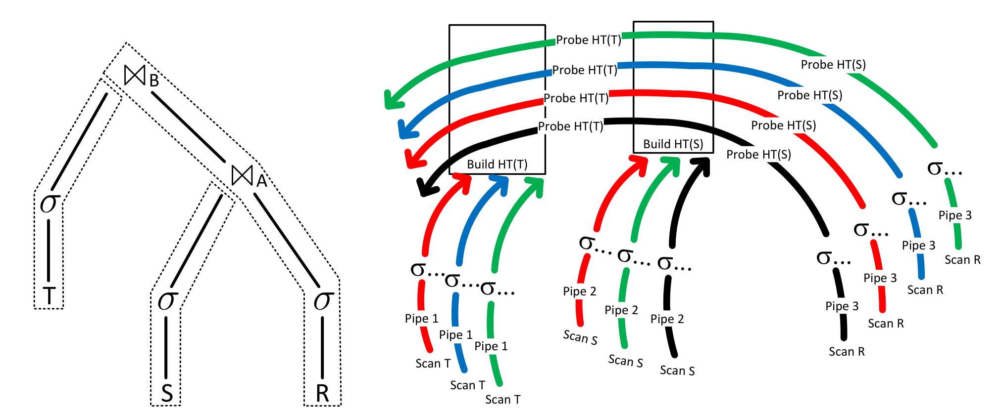

图中三条 pipeline 并不意味着必须同时运行。构建 `HT(T)` 和 `HT(S)` 的 pipeline 先运行，probe pipeline 只有在两个 hash table 都完成后才能运行。每个 pipeline 的输入被切成 morsel。后续 pipeline 会从新生成的、大小更均匀的 morsel 开始，而不是沿用上游 morsel 边界，以避免 morsel 大小倾斜。

任何时刻一个 pipeline 上工作的线程数量受处理器硬件线程数限制。为了 NUMA-local 写入和避免写中间结果时同步，QEPobject 会为每个可执行 pipeline、每个线程/核心分配一个存储区。

**图 3. 构建阶段的 NUMA-aware 处理**：以过滤 `T` 并构建 `HT(T)` 为例，逻辑 pipeline 被分为两个物理 phase。第一阶段扫描 morsel 并把存活 tuple 写入 NUMA-local storage area；第二阶段扫描这些 storage area，把指针插入全局 hash table。

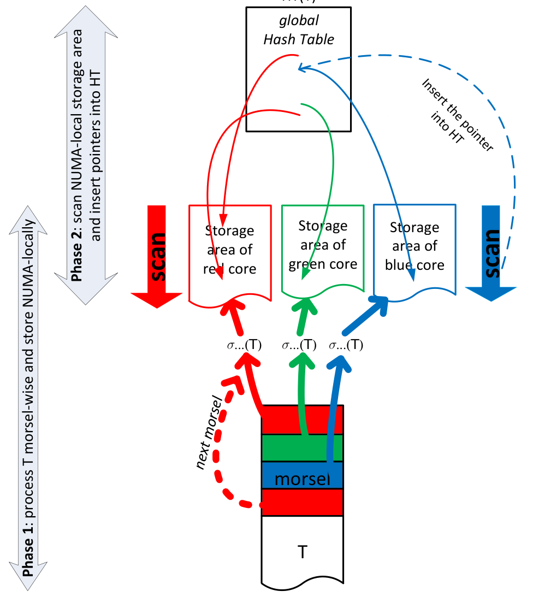

第一阶段每个 core 都有独立 storage area，避免同步。为了在后续阶段保持 NUMA locality，某个 core 的 storage area 分配在同一 socket 上。扫描和过滤所有 base table morsel 后，第二阶段再次由对应 core 上的线程扫描这些 storage area，把指针插入 hash table。把逻辑 hash table build pipeline 切成两个 phase 的好处是：第一阶段完成后，存活对象数量已知，可以完美确定全局 hash table 大小。该 hash table 会被不同 NUMA socket 上的线程 probe，因此不应放在单个 NUMA 区域，而是 interleaved 到所有 socket。由于许多线程并行插入，必须使用 lock-free 实现。

**图 4. probe 阶段 morsel-wise 处理**：线程向 dispatcher 请求工作；dispatcher 尽量把位于同一 NUMA partition 的 `R` morsel 分配给该线程。probe pipeline 的结果再次存入 NUMA-local storage area，保持后续处理局部性。

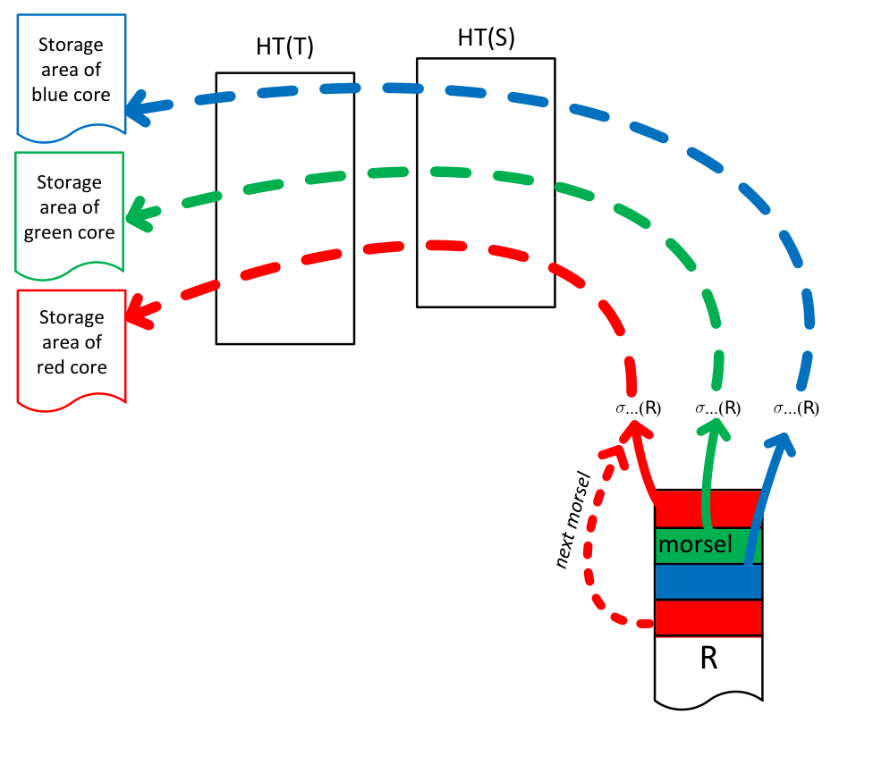

总体来说，morsel-driven parallelism 与典型 Volcano 实现一样会并行执行多个 pipeline。但与 Volcano 不同，这些 pipeline 并非完全独立：它们共享数据结构，算子感知并行执行，并必须通过高效 lock-free 机制同步。另一个差异是执行计划的线程数完全 elastic：不仅不同 pipeline segment 的线程数可不同，同一 pipeline segment 执行期间也可变化。

## 3. Dispatcher：调度并行 pipeline 任务

dispatcher 控制并分配计算资源到并行 pipeline，具体方式是给 worker 线程分配 task。系统为机器提供的每个硬件线程预创建一个 worker 线程，并永久绑定到对应硬件线程。因此，某个查询的并行度不是通过创建或终止线程控制，而是通过给固定 worker 分配某个查询的任务控制。

一个 task 由一个 pipeline job 和一个要执行该 pipeline 的 morsel 组成。抢占发生在 morsel 边界，因此不需要昂贵中断机制。我们实验发现，约 100,000 个 tuple 的 morsel size 在快速 elastic 调整、负载均衡和低维护开销之间取得良好折中。

把任务分配给运行在特定 core 上的线程时，有三个主要目标：

1. 通过把数据 morsel 分配给其所在 NUMA 区域的 core，保持 NUMA locality。
2. 对特定查询的并行度提供完全 elasticity。
3. 负载均衡：参与某个 query pipeline 的所有 core 应尽量同时完成工作，避免快 core 等待慢 core。

**图 5. Dispatcher 架构**：dispatcher 维护 pending pipeline job 列表。每个 pipeline job 维护待处理 morsel 的逻辑列表，并按 NUMA/core locality 组织。

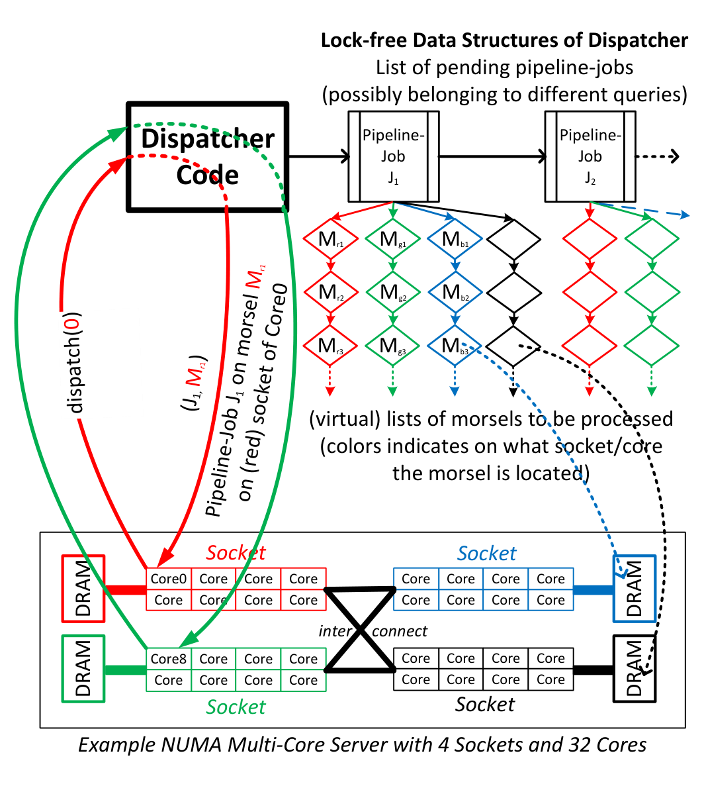

pending pipeline job 列表只包含依赖已经满足的 pipeline。例如示例查询中，两个 build pipeline 先进入列表，probe pipeline 只有在两个 build pipeline 完成后才加入。每个 active query 由一个 QEPobject 控制，负责把可执行 pipeline 转交给 dispatcher。因此，dispatcher 只维护所有依赖 pipeline 已处理完成的 pipeline job。一般情况下，队列中会有来自不同查询的 pending pipeline job，以支持查询间并行。

### 3.1 Elasticity

通过“一次一个 morsel”分派 job，系统获得完全 elastic parallelism。调度器可以根据 quality-of-service 模型智能调度多个查询的 pipeline job。例如，为优先处理一个交互式查询 `Q+`，系统可以在长查询 `Ql` 执行任意阶段降低其并行度；`Q+` 完成后，再把大多数 core 分回 `Ql`。

当前实现中所有查询优先级相同，因此线程在 active query 间平均分配。基于优先级的调度组件在开发中，超出本文范围。

对每个 pipeline job，dispatcher 维护尚需执行的 morsel 列表。每个 core 有单独列表，以保证 Core 0 请求工作时优先得到与 Core 0 在同一 socket 上分配的 morsel。一旦 Core 0 完成当前 morsel，它请求新 task；新 task 是否来自同一 pipeline job 取决于不同查询 pipeline job 的优先级。如果高优先级查询进入系统，当前查询的并行度可以降低。Morsel-wise 处理允许在不使用剧烈中断机制的情况下，把 core 重新分配给其他 pipeline job。

Morsel-driven 处理也提供简单优雅的 query canceling。用户取消查询、查询异常（如数值溢出）或系统内存耗尽时，dispatcher 中相关查询会被标记。每个 morsel 完成时会检查该标记，因此很快所有 worker 都会停止处理该查询。与强制操作系统杀线程相比，这种方法允许线程清理资源。

### 3.2 实现概览

图 5 为说明方便展示了每个 core 的 morsel 链表。实际实现中，系统为每个 core/socket 维护 storage area 边界，并在 core 请求任务时按需从对应 socket 的 pipeline 参数 storage area 中切出下一个 morsel。

图中 dispatcher 看起来像单独线程。但这有两个缺点：一是 dispatcher 本身需要一个 core，或会抢占查询求值线程；二是在 morsel size 很小时，dispatcher 可能成为竞争热点。因此，dispatcher 实际上只是一组 lock-free 数据结构。dispatcher 代码由请求工作的查询求值线程自己执行，也就是自动运行在当前 worker 空闲的 core 上。pipeline job queue 和相关 morsel queue 都使用 lock-free 数据结构以降低竞争。

### 3.3 Morsel Size

与 Vectorwise 和 IBM BLU 使用 vector/stride 在算子间传递数据不同，morsel 不适合缓存不会造成性能惩罚。Morsel 的作用是把大任务拆成小而固定大小的工作单元，便于 work stealing 和抢占。因此 morsel size 对性能并不敏感，只要足够大以摊销调度开销，同时提供良好响应时间即可。

我们用 Nehalem EX 系统上 64 线程执行 `select min(a) from R` 来测量 morsel size 对性能的影响。该查询很简单，能最大程度压测 work-stealing 数据结构。图 6 显示 morsel size 应设置为开销可忽略的最小值，在该机器上约大于 10,000。最佳值依赖硬件，但很容易实验确定。即使 morsel size 过大，最坏情况也只是导致线程利用不足；如果有足够并发查询，系统吞吐不会受影响。

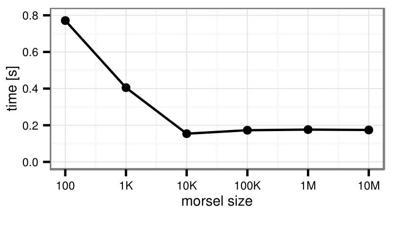

## 4. 并行算子细节

为了完全并行化每个 pipeline，每个算子都必须能并行接收 tuple，例如通过同步共享数据结构；对开启新 pipeline 的算子，还必须能并行产生 tuple。本节讨论最重要并行算子的实现。

### 4.1 Hash Join

如第 2 节和图 3 所示，hash join 的 hash table 构建分为两个阶段。第一阶段把 build 输入 tuple 物化到线程本地 storage area；这一阶段无需同步。所有输入 tuple 消费完后，系统能精确知道输入大小，因此创建大小完美的空 hash table。相比动态增长 hash table，这在并行环境中高效得多。第二阶段中，每个线程扫描自己的 storage area，并用 atomic compare-and-swap 把 tuple 指针插入 hash table。

Outer join 是该算法的小变体：每个 tuple 额外分配一个 marker，表示它是否有匹配。在 probe 阶段，若发生匹配则设置 marker。设置前先检查 marker 是否尚未设置，可以避免不必要竞争。Semi join 和 anti join 类似实现。

Balkesen 等人通过单算子 benchmark 表明，优化良好的 radix join 可比 single global hash table join 更快。但相比 radix join，本文的 single-table hash join 具有实践优势：

- 对较大的输入关系完全 pipelined，因此 probe 输入可原地处理，占用更少空间。
- 是良好的“team player”：多个小 dimension table 可由大 fact table 的 probe pipeline 作为一个团队一起 join。
- 当两个输入基数差异很大时非常高效，这在实践中很常见。
- 可从倾斜 key 分布中受益。
- 对 tuple size 不敏感。
- 没有硬件相关参数。

由于这些优势，在复杂查询处理中 single-table hash join 经常优于 radix join。例如 TPC-H 中 97.4% 的 joined tuple 来自 probe side，因此 hash table 经常能放入缓存。SSB 中该比例更高，达到 99.5%。因此我们聚焦 single-table hash join：它不依赖硬件参数和查询优化器估计，在 hash table 适合缓存时非常快，即使大于缓存也至少有不错性能。

### 4.2 Lock-Free Tagged Hash Table

hash join 使用的 hash table 有 early-filtering 优化，能改善选择性 join 性能。核心思想是给 hash bucket list 加一个小 filter tag：该 list 中所有元素都 hash 到这个 filter 中并设置对应 bit。对选择性 probe，即不会找到匹配的 probe，filter 通常把 cache miss 降到 1 次，因为检查 tag 后即可跳过 list traversal。

**图 7. Tagged hash table 的 lock-free 插入**：每个 hash table 指针中直接编码 16-bit tag，剩余 48-bit 为 pointer。插入时用单个 CAS 同时更新 pointer 和 tag。

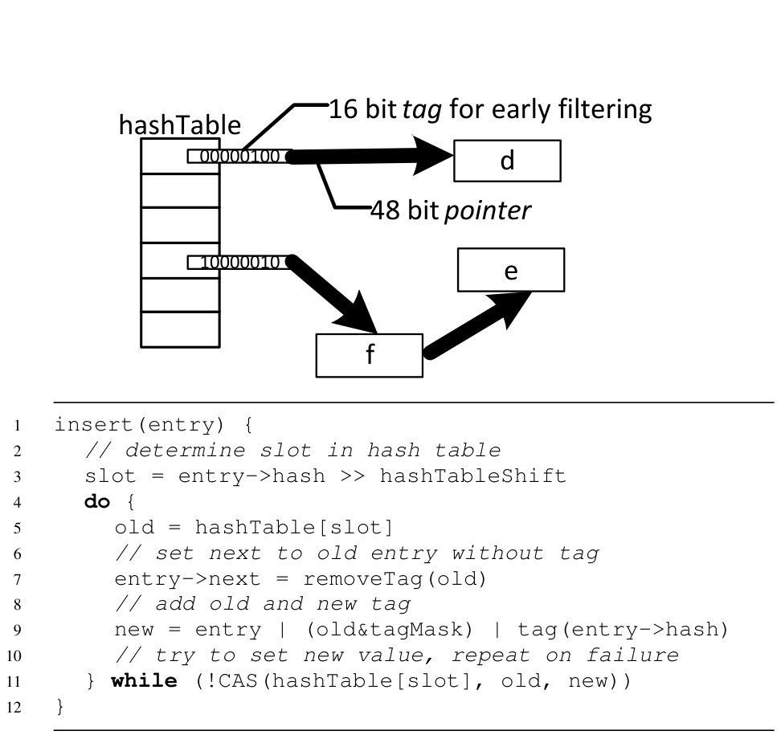

这种做法节省空间，更重要的是允许用单个 atomic compare-and-swap 同时更新 pointer 和 tag。由于 join 中 hash table 是 insert-only，且所有 lookup 都发生在 insert 完成后，因此同步成本很低。插入伪代码如下：

```text
insert(entry) {
  slot = entry->hash >> hashTableShift
  do {
    old = hashTable[slot]
    entry->next = removeTag(old)
    new = entry | (old & tagMask) | tag(entry->hash)
  } while (!CAS(hashTable[slot], old, new))
}
```

与 Bloom filter 相比，tagging 有多个优势。Bloom filter 是额外数据结构，需要多次读取；对大表而言 Bloom filter 可能放不进缓存，因此开销较高。本文方法不做不必要内存访问，只需少量廉价 bitwise 操作。因此 hash tagging 开销很低，可以总是启用，不依赖优化器估计选择率。除 join 外，tagging 在多数 key 唯一的 aggregation 中也有用。

hash table array 只存指针，不直接存 tuple，也就是不使用 open addressing。原因包括：tuple 通常比 pointer 大得多，因此 hash table 可较宽松地设置为至少输入大小的两倍，减少碰撞而不浪费太多空间；chaining 支持可变大小 tuple；并且由于 filter，probe miss 在 chaining 中实际上快于 open addressing。

hash table 和 tuple storage area 都使用大虚拟内存页（2 MB）。这减少 TLB miss，保证 page table 能放入 L1 cache，并避免 build 阶段大量 page fault 造成可扩展性问题。系统使用 Unix `mmap` 分配 hash table（若可用）。现代操作系统不会立即实际分配内存，而是在某页第一次写入时才分配。这有两个好处：不需要额外阶段把 hash table 初始化为 0；表会自适应分布在 NUMA node 上，因为 page 会位于第一个写入该 page 的线程所在 NUMA node。如果许多线程构建 hash table，它会伪随机 interleave 到所有 node；如果只有单个 NUMA node 的线程构建，它会位于该 node，这也正是期望行为。

### 4.3 NUMA-Aware 表分区

为了实现 NUMA-local table scan，关系必须分布在多个 memory node 上。最直接的方法是 round-robin。更好的替代方案是按某个“重要”属性的 hash 值分区。好处是，如果两个表都按 join key 分区，例如一个表按 primary key、另一个按 foreign key，则匹配 tuple 通常位于同一 socket。TPC-H 中典型例子是按 `orderkey` 分区 `orders` 和 `lineitem`。

这更像性能提示而不是硬分区：work stealing 或数据不均衡仍可能导致跨 socket join，但大多数 join pair 会来自同一 socket。结果是跨 socket 通信更少，因为频繁 join 的关系被 co-located。这也影响 hash table array，因为决定 hash partition 的同一个 hash 函数也用于 hash join bucket 的高位。除选择 partition key 外，该方案对系统透明；由于基于 hash 分片，每个 partition 的 tuple 数大致相同。

我们强调，该 co-location 方案有益但不是 morsel-driven 高性能的决定性因素：table scan 的 NUMA-locality 无论如何都能保证，且第一次 materialize 结果的 pipeline 之后会以 NUMA-local 方式继续处理。

### 4.4 Grouping/Aggregation

Aggregation 的性能取决于 group 数量（distinct key 数）。如果 group 很少，所有 group 都可放入缓存，aggregation 很快。如果 group 很多，会发生许多 cache miss。并行访问竞争在两种情况下都可能成为问题，尤其 key 分布倾斜时。为在不依赖优化器估计的情况下获得良好性能和可扩展性，我们使用类似 IBM BLU 的 aggregation 方法。

**图 8. 并行 aggregation**：第一阶段做线程本地预聚合，第二阶段按 partition 聚合。

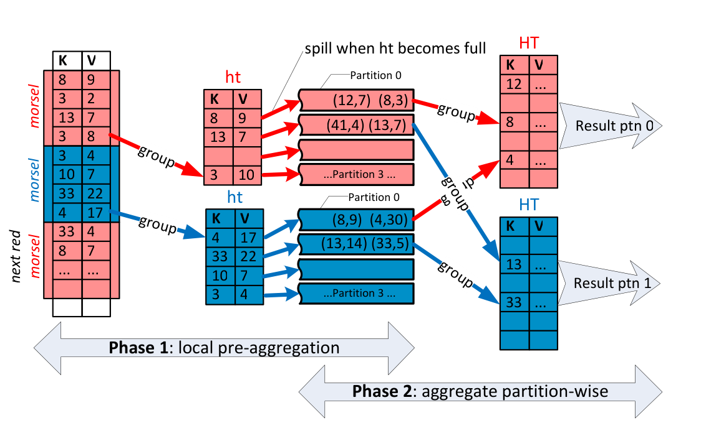

第一阶段使用线程本地固定大小 hash table 高效聚合 heavy hitters。当小预聚合表满时，将其 flush 到 overflow partition。所有输入数据分区完成后，各 partition 在线程间交换。

第二阶段中，每个线程扫描一个 partition，并聚合到线程本地 hash table。由于 partition 数多于 worker 线程，这一过程重复执行直到所有 partition 完成。某个 partition 完全聚合后，其 tuple 会立即推送到后续算子，再处理其他 partition。这样聚合结果很可能仍在缓存中，后续处理更高效。

Aggregation 与 join 的根本差异是：只有读完全部输入后才产生结果。因此无论如何不能 pipeline，本文采用分区而非像 join 一样使用单个 hash table。

### 4.5 Sorting

在主存中，hash-based 算法通常快于 sorting。因此系统目前不使用 sort-based join 或 aggregation，只在实现 `order by` 或 `top-k` 时排序。并行 sort 中，每个线程先物化并原地排序自己的输入。对 top-k 查询，每个线程直接维护包含 k 个 tuple 的 heap。

**图 9. 并行 merge sort**：local sort 后，计算全局 separator，把多个 sorted run 并行 merge 到输出数组。

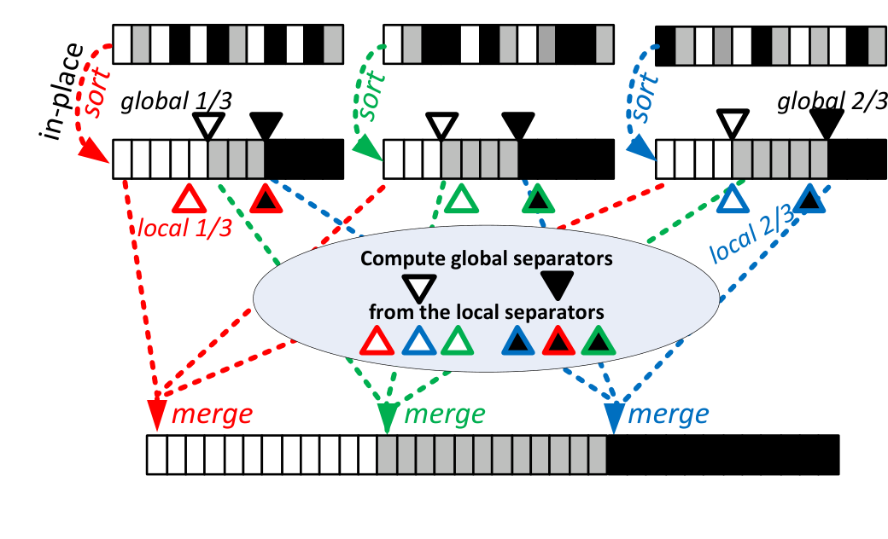

难点是计算 separator，使各 merge 独立并可无同步并行执行。每个线程先从自己的 sorted run 中等距选择 local separator。随后类似 median-of-medians，把所有 local separator 合并、排序，并计算最终全局 separator key。确定全局 separator 后，通过二分或插值搜索找到其在数据数组中的索引。利用这些索引即可计算输出数组精确布局，最后在无同步情况下把 run merge 到输出数组。

## 5. 评测

我们把并行查询求值框架集成到 HyPer 中。HyPer 是主存列数据库，支持 SQL-92，单线程性能很好，但此前没有 intra-query parallelism。评测聚焦 ad hoc 决策支持查询；除声明 primary key 外，不启用额外索引结构。因此结果主要测量 table scan、aggregation、join（包括 outer、semi、anti join）算子的性能和可扩展性。HyPer 支持行存和列存，实验使用列存格式。

### 5.1 实验设置

我们使用两种 Linux 硬件平台。默认是 4-socket Nehalem EX（Intel Xeon X7560 2.3 GHz）。部分实验使用 4-socket Sandy Bridge EP（Intel Xeon E5-4650L 2.6-3.1 GHz）。两者都有 32 个 core、64 个硬件线程、相近缓存容量，但 NUMA topology 很不同。

**图 10. NUMA topology 与理论带宽**：Sandy Bridge 每节点理论内存带宽是 Nehalem 的两倍，但每个 CPU 只连接两个其他 socket；某些访问需要两跳，增加延迟并降低带宽。

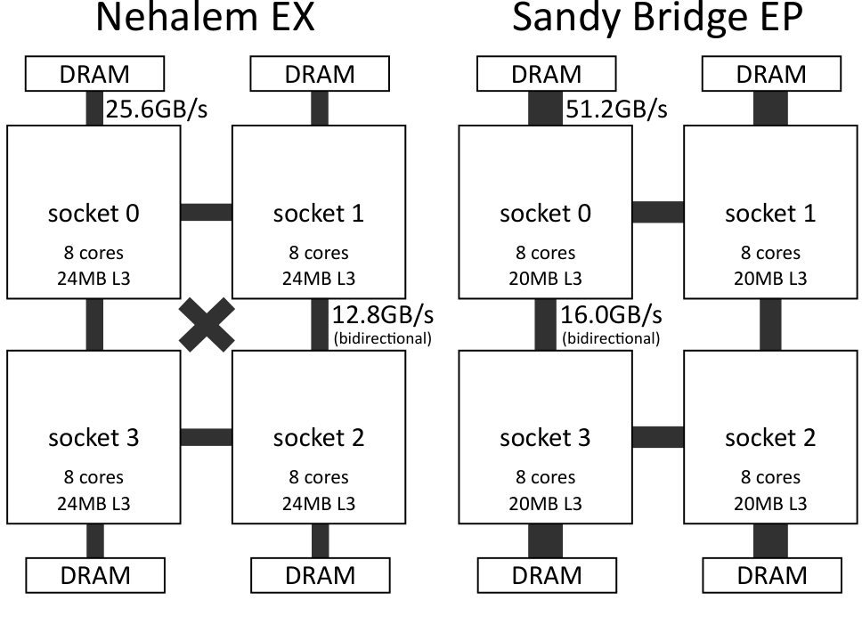

主要竞争对手是官方单机 TPC-H 领先系统 Vectorwise。我们也测了 PostgreSQL 和一个大型商业数据库的列存；相对 HyPer，PostgreSQL 平均慢 30 倍，商业列存慢 10 倍，因此后续聚焦 Vectorwise 2.5。

评测采用经典 ad hoc TPC-H 场景：不做物理存储手工调优，因此计划更相似，基本使用 hash join。Vectorwise TPC 官网结果包含额外调优，主要是 clustered index，使某些大 join 可用 merge join，并允许优化器把 range restriction 从 join 一侧传播到另一侧。这些调优可改善少数查询性能，但并不显著改善查询执行可扩展性。我们也给出 Vectorwise full-disclosure 设置下的 Nehalem EX 结果：HyPer geometric mean 0.45s、sum 15.3s、scalability 28.1x；Vectorwise 默认 geometric mean 2.84s、sum 93.4s、scalability 9.3x；Vectorwise full-disclosure settings geometric mean 1.19s、sum 41.2s、scalability 8.4x。

HyPer 可低成本原地更新数据。TPC-H scale factor 100 的两个 refresh stream 在 1 秒内完成。这不同于重读优化系统，后者因为重索引和重排序而更新昂贵。HyPer 通过按 primary key 第一个属性把每个关系分成 64 个 partition，将输入关系透明分布到所有可用 NUMA socket。执行时间包含中间结果、hash table 等内存的操作系统分配与释放。

### 5.2 TPC-H

**图 11. Nehalem EX 上 TPC-H 可扩展性**：HyPer 与 Vectorwise 都按 HyPer 单线程时间归一化。前 32 个线程是真实 core，其余是 HyperThread。

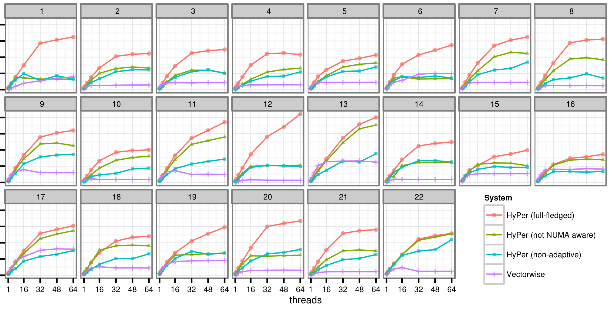

对多数查询，HyPer 接近 30 倍加速。有些查询因 simultaneous multithreading 可接近或超过 40 倍。Vectorwise 单线程性能与 HyPer 相近，但整体性能受低加速限制，常低于 10 倍。一个问题是负载均衡：即使在易并行的 scan-only Q6 中，最快线程也常比最后一个线程提前 50% 完成。TPC-H 数据完全均匀，现实 workload 中数据倾斜通常会让负载均衡更难。

Vectorwise 的问题与 Volcano 模型并行化相关。该方法通常用于 Oracle、SQL Server 等系统，因为它可以在不影响现有算子的情况下实现并行性；但它在计划时把并行性固化进计划，实例化一组独立 query plan，并用 exchange 算子连接。固定工作划分与缺乏 NUMA-awareness 结合，会造成线程间明显性能差异。

### 5.3 NUMA Awareness

表 1 展示 22 个 TPC-H 查询在 Nehalem EX 上的内存带宽和 QPI 统计。Q1 聚合最大关系，读取 82.6 GB/s，接近 100 GB/s 理论带宽上限。`remote` 列显示通过 interconnect 远程访问的数据比例。由于 NUMA-aware 处理，多数数据本地访问，因此延迟更低、带宽更高。`QPI` 列显示最繁忙 QPI link 的饱和度；在该系统上 QPI link 带宽足够。

表 1 也显示 Vectorwise 未做 NUMA 优化：多数查询 remote access 比例高。例如 Q1 中 75% remote access 表明其 buffer manager 不是 NUMA-aware。好在 QPI link 使用较均匀，关系似乎分散在 4 个 NUMA node 上，避免单个内存控制器及其 QPI link 成为瓶颈。

**表 1. Nehalem EX 上 TPC-H scale factor 100 统计。**

| Q | HyPer time s | HyPer scal x | HyPer read GB/s | HyPer write GB/s | HyPer remote % | HyPer QPI % | Vectorwise time s | Vectorwise scal x | Vectorwise read GB/s | Vectorwise write GB/s | Vectorwise remote % | Vectorwise QPI % |
| --- | ---: | ---: | ---: | ---: | ---: | ---: | ---: | ---: | ---: | ---: | ---: | ---: |
| 1 | 0.28 | 32.4 | 82.6 | 0.2 | 1 | 40 | 1.13 | 30.2 | 12.5 | 0.5 | 74 | 7 |
| 2 | 0.08 | 22.3 | 25.1 | 0.5 | 15 | 17 | 0.63 | 4.6 | 8.7 | 3.6 | 55 | 6 |
| 3 | 0.66 | 24.7 | 48.1 | 4.4 | 25 | 34 | 3.83 | 7.3 | 13.5 | 4.6 | 76 | 9 |
| 4 | 0.38 | 21.6 | 45.8 | 2.5 | 15 | 32 | 2.73 | 9.1 | 17.5 | 6.5 | 68 | 11 |
| 5 | 0.97 | 21.3 | 36.8 | 5.0 | 29 | 30 | 4.52 | 7.0 | 27.8 | 13.1 | 80 | 24 |
| 6 | 0.17 | 27.5 | 80.0 | 0.1 | 4 | 43 | 0.48 | 17.8 | 21.5 | 0.5 | 75 | 10 |
| 7 | 0.53 | 32.4 | 43.2 | 4.2 | 39 | 38 | 3.75 | 8.1 | 19.5 | 7.9 | 70 | 14 |
| 8 | 0.35 | 31.2 | 34.9 | 2.4 | 15 | 24 | 4.46 | 7.7 | 10.9 | 6.7 | 39 | 7 |
| 9 | 2.14 | 32.0 | 34.3 | 5.5 | 48 | 32 | 11.42 | 7.9 | 18.4 | 7.7 | 63 | 10 |
| 10 | 0.60 | 20.0 | 26.7 | 5.2 | 37 | 24 | 6.46 | 5.7 | 12.1 | 5.7 | 55 | 10 |
| 11 | 0.09 | 37.1 | 21.8 | 2.5 | 25 | 16 | 0.67 | 3.9 | 6.0 | 2.1 | 57 | 3 |
| 12 | 0.22 | 42.0 | 64.5 | 1.7 | 5 | 34 | 6.65 | 6.9 | 12.3 | 4.7 | 61 | 9 |
| 13 | 1.95 | 40.0 | 21.8 | 10.3 | 54 | 25 | 6.23 | 11.4 | 46.6 | 13.3 | 74 | 37 |
| 14 | 0.19 | 24.8 | 43.0 | 6.6 | 29 | 34 | 2.42 | 7.3 | 13.7 | 4.7 | 60 | 8 |
| 15 | 0.44 | 19.8 | 23.5 | 3.5 | 34 | 21 | 1.63 | 7.2 | 16.8 | 6.0 | 62 | 10 |
| 16 | 0.78 | 17.3 | 14.3 | 2.7 | 62 | 16 | 1.64 | 8.8 | 24.9 | 8.4 | 53 | 12 |
| 17 | 0.44 | 30.5 | 19.1 | 0.5 | 13 | 13 | 0.84 | 15.0 | 16.2 | 2.9 | 69 | 7 |
| 18 | 2.78 | 24.0 | 24.5 | 12.5 | 40 | 25 | 14.94 | 6.5 | 26.3 | 8.7 | 66 | 13 |
| 19 | 0.88 | 29.5 | 42.5 | 3.9 | 17 | 27 | 2.87 | 8.8 | 7.4 | 1.4 | 79 | 5 |
| 20 | 0.18 | 33.4 | 45.1 | 0.9 | 5 | 23 | 1.94 | 9.2 | 12.6 | 1.2 | 74 | 6 |
| 21 | 0.91 | 28.0 | 40.7 | 4.1 | 16 | 29 | 12.00 | 9.1 | 18.2 | 6.1 | 67 | 9 |
| 22 | 0.30 | 25.7 | 35.5 | 1.3 | 75 | 38 | 3.14 | 4.3 | 7.0 | 2.4 | 66 | 4 |


我们比较了 NUMA-aware 方法与两种替代方案：

| 方案 | Nehalem EX geometric mean | Nehalem EX max | Sandy Bridge EP geometric mean | Sandy Bridge EP max |
| --- | ---: | ---: | ---: | ---: |
| OS default | 1.57x | 4.95x | 2.40x | 5.81x |
| interleaved | 1.07x | 1.24x | 1.58x | 5.01x |

操作系统默认 placement 明显不理想，因为一个 NUMA node 的内存控制器及其 QPI link 会成为瓶颈。对 Nehalem EX，简单 interleave 是合理但非最优策略；对 Sandy Bridge EP，NUMA-awareness 对好性能更关键。原因是两种系统 NUMA 行为差别很大。微基准显示：

| 系统 | local 带宽 GB/s | 25% local + 75% remote 混合带宽 GB/s | local 延迟 ns | 混合延迟 ns |
| --- | ---: | ---: | ---: | ---: |
| Nehalem EX | 93 | 60 | 161 | 186 |
| Sandy Bridge EP | 121 | 41 | 101 | 257 |

Sandy Bridge EP 如果不能保证大多数访问本地，只能达到理论内存带宽的一小部分；混合访问延迟是本地访问的 2.5 倍。Nehalem EX 上影响小得多。因此 NUMA-awareness 的重要性取决于跨 socket interconnect 的速度和数量。

表 2 给出 Sandy Bridge EP 上 TPC-H scale factor 100 的性能，所有查询在 100GB 数据集、ad hoc hash join、无索引结构下都在 3 秒内完成。整体性能与 Nehalem 相近：Sandy Bridge 缺少互连造成可扩展性略低，但更高主频抵消了这一点。

**表 2. Sandy Bridge EP 上 TPC-H scale factor 100 性能。**

| Q | time s | scalability x |
| --- | ---: | ---: |
| 1 | 0.21 | 39.4 |
| 2 | 0.10 | 17.8 |
| 3 | 0.63 | 18.6 |
| 4 | 0.30 | 26.9 |
| 5 | 0.84 | 28.0 |
| 6 | 0.14 | 42.8 |
| 7 | 0.56 | 25.3 |
| 8 | 0.29 | 33.3 |
| 9 | 2.44 | 21.5 |
| 10 | 0.61 | 21.0 |
| 11 | 0.10 | 27.4 |
| 12 | 0.33 | 41.8 |
| 13 | 2.32 | 16.5 |
| 14 | 0.33 | 15.6 |
| 15 | 0.33 | 20.5 |
| 16 | 0.81 | 11.0 |
| 17 | 0.40 | 34.0 |
| 18 | 1.66 | 29.1 |
| 19 | 0.68 | 29.6 |
| 20 | 0.18 | 33.7 |
| 21 | 0.74 | 26.4 |
| 22 | 0.47 | 8.4 |


### 5.4 Elasticity

为展示 elasticity，我们改变并行 query stream 数量。64 个硬件线程均匀分布到 stream 上，每个 stream 执行 TPC-H 查询的随机排列。图 12 显示，即使 stream 很少（每个 stream 使用很多 core），吞吐仍保持较高。这允许在不牺牲过多吞吐的情况下，最小化高优先级查询响应时间。

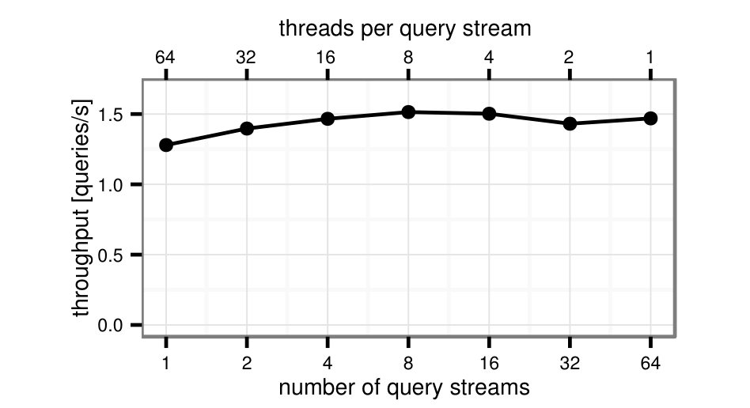

图 13 展示 morsel-wise processing 的 profiler trace。每种颜色表示一个 pipeline stage，每个块是一个 morsel。实验只用 4 个线程。先执行 TPC-H Q13，它获得 4 个线程；稍后启动 Q14。trace 显示，一旦 worker 2 和 3 完成当前 morsel，它们切换到 Q14，直到 Q14 完成，之后继续处理 Q13。这说明 worker 线程可动态重分配给其他查询，即并行化方案完全 elastic。

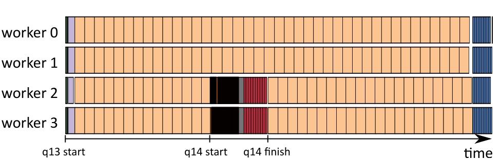

我们还用 morsel-driven 框架模拟 Volcano 静态划分：把工作切成与线程数相同的 chunk，也就是 morsel size 设为 `n/t`。在只执行单个 TPC-H 查询时，由于输入数据均匀，该变化不会显著降低性能。但如果有其他进程干扰，性能会下降，因为静态分配无法用细粒度 work stealing 弥补慢线程。

### 5.5 Star Schema Benchmark

除 TPC-H 外，我们还在 Star Schema Benchmark（SSB）上测量性能和可扩展性。表 3 显示该框架在该 workload 上表现很好，多数查询加速超过 40 倍。SSB 可扩展性高于 TPC-H，因为 TPC-H 查询更复杂、更多样：有只扫描单表的查询，有复杂 join，有简单和复杂 aggregation。要在 TPC-H 上同时获得好性能和好可扩展性，所有算子都必须可扩展，并能高效处理多样输入分布。

**表 3. Nehalem EX 上 Star Schema Benchmark scale 50。**

| SSB Q | time s | scalability x | read GB/s | write GB/s | remote % | QPI % |
| --- | ---: | ---: | ---: | ---: | ---: | ---: |
| 1.1 | 0.10 | 33.0 | 35.8 | 0.4 | 18 | 29 |
| 1.2 | 0.04 | 41.7 | 85.6 | 0.1 | 1 | 44 |
| 1.3 | 0.04 | 42.6 | 85.6 | 0.1 | 1 | 44 |
| 2.1 | 0.11 | 44.2 | 25.6 | 0.7 | 13 | 17 |
| 2.2 | 0.15 | 45.1 | 37.2 | 0.1 | 2 | 19 |
| 2.3 | 0.06 | 36.3 | 43.8 | 0.1 | 3 | 25 |
| 3.1 | 0.29 | 30.7 | 24.8 | 1.0 | 37 | 21 |
| 3.2 | 0.09 | 38.3 | 37.3 | 0.4 | 7 | 22 |
| 3.3 | 0.06 | 40.7 | 51.0 | 0.1 | 2 | 27 |
| 3.4 | 0.06 | 40.5 | 51.9 | 0.1 | 2 | 28 |
| 4.1 | 0.26 | 36.5 | 43.4 | 0.3 | 34 | 34 |
| 4.2 | 0.23 | 35.1 | 43.3 | 0.3 | 28 | 33 |
| 4.3 | 0.12 | 44.2 | 39.1 | 0.3 | 5 | 22 |


SSB 查询通常把大 fact table 与多个小 dimension table join，非常适合本文 hash join 算法的 pipelining 能力。大部分数据来自大 fact table，可 NUMA-local 读取；dimension hash table 远小于 fact table；aggregation 相比其他处理也很便宜。

## 6. 相关工作

本文相关工作有三类：单独研究多核 join 或 aggregation 的论文、完整系统描述，以及并行执行框架，尤其是 Volcano。

Radix hash join 最初用于提高局部性。Kim 等人把它用于基于反复分区输入关系的并行处理。Blanas 等人首次比较 radix join 和简单单全局 hash table join。Balkesen 等人全面研究了 hash-based 和 sort-based join 算法。Ye 等人评估了多核 CPU 上的并行 aggregation。Polychroniou 和 Ross 设计了高效聚合 heavy hitters 的算法。

NUMA 相关工作方面，Teubner 和 Mueller 较早指出 NUMA locality 的重要性，并提出 NUMA-aware window-based stream join。Albutiu 等人设计了 NUMA-aware parallel sort merge join。Li 等人通过显式调度 sorted run shuffle 来避免 NUMA interconnect 交叉流量。但尽管 sort-merge join 保持局部性，由于排序成本高，它不如 hash join 高效。Lang 等人提出低同步开销的 NUMA-aware hash join，与本文算法相似，使用一个 interleaved 到所有 NUMA node 的 latch-free hash table。

这些单算子研究对完整查询引擎的结论有限。其微基准通常使用简单 key、小 payload，并孤立分析每个算子，忽略数据如何在算子间传递，也忽略算法 pipelining 能力差异。本文系统集中在非物化 pipelined hash join，因为实践中 join 一侧常远大于另一侧。因此 pipelined join team 很常见且有效。对某些经常遍历的大 join（如 TPC-H 中 orders-lineitem），预分区数据存储可以在不物化的情况下实现 NUMA locality。

IBM BLU 和 Microsoft Apollo 是利用现代多核服务器并行查询处理的知名商业项目。IBM BLU 以 Vectorwise 风格 stride-at-a-time 处理数据，与 morsel-wise 有相似之处，但没有迹象表明 stride 在处理步骤或 pipeline 间保持 NUMA-local，也未覆盖本文提出的完全 elastic 并行度。

Volcano 模型是多数当前查询求值引擎支持多核和分布式并行的基础。非并行上下文中，Volcano 也指解释式 iterator 执行范式：结果通过算子树向上 pull，调用每个算子的 `next()` 返回下一个 tuple。这种 tuple-at-a-time 模型实现优雅，但解释开销明显。高性能分析型查询引擎兴起后，系统转向 vector 或 batch-oriented execution，例如 Vectorwise、SQL Server ColumnStore Index 的 batch mode，以及 IBM BLU 的 stride-at-a-time。HyPer 依赖 compiled query evaluation 来获得同样甚至更高的原始执行性能。

Volcano 区分 vertical parallelism 与 horizontal parallelism。前者把两个算子间的 pipeline 转为异步 producer/consumer；后者通过分区输入数据并让多个线程处理不同 partition 来并行化一个算子。多数系统实现 horizontal parallelism，因为 vertical 和 bushy parallelism 通常负载不均。SQL Server 和 Vectorwise 等系统采用这类 horizontal Volcano parallelism。

Morsel-driven execution 的区别在于：并行查询调度是细粒度、运行期自适应、NUMA-aware 的。输入数据被切成细粒度 morsel，每个 morsel 完全位于单个 NUMA partition。dispatcher 把 morsel 分配给同 socket core 上的线程以保持 NUMA locality。Morsel-wise 处理也实现完全 elasticity：并行度可在任意时刻（例如查询中途）调整。一个 morsel 完成后，线程可继续处理同一查询 pipeline 的 morsel，也可处理另一个更重要查询的任务。

## 7. 结论与未来工作

本文提出 morsel-driven query evaluation framework，用于并行查询处理。它面向 many-core 时代分析型查询性能的主要瓶颈：负载均衡、线程同步、内存访问局部性和资源 elasticity。我们在完整 TPC-H 和 SSB workload 上展示了 HyPer 中该框架的良好可扩展性。

我们强调，论文写作时，除某些手写查询和完全定制索引/存储方案外，本文结果是单服务器架构上非常快的学术结果。这里所指的例外工作 [10] 虽然有参考价值，但明显违反了 TPC-H 的多项实现规则，包括使用预计算 join、预计算 aggregation 和全文索引；它所采用的存储结构通常也很难高效更新。本文的目的不是声明性能记录，而是强调 morsel-driven 框架实现可扩展性的有效性。对本来就慢的系统提供线性可扩展性，比对 HyPer 这种快速系统更容易。与采用经典 Volcano 风格并行的 Vectorwise 相比，morsel-driven 框架在超过 8 核后明显领先。我们认为，其细粒度调度、完整算子并行化、低开销同步和 NUMA-aware 调度原则也可用于提升其他系统的 many-core scaling。

除可扩展性外，完全 elastic 的 morsel-driven parallelism 还支持动态查询 workload 的智能 priority-based scheduling。考虑 quality-of-service 约束的调度器设计和评估超出本文范围，会在后续工作中处理。

系统在多种硬件平台上都表现良好，且没有硬件特定参数。尽管如此，研究利用底层硬件知识的算法仍很有价值。尤其是进一步减少 remote NUMA access 仍有优化空间；Sandy Bridge EP 的部分连接 NUMA topology 上结果慢于全连接 Nehalem EX 就说明了这一点。

## 参考文献

[1] M.-C. Albutiu, A. Kemper, and T. Neumann. Massively parallel sort-merge joins in main memory multi-core database systems. PVLDB, 5(10), 2012.

[2] G. Alonso. Hardware killed the software star. In ICDE, 2013.

[3] K. Anikiej. Multi-core parallelization of vectorized query execution. Master's thesis, University of Warsaw and VU University Amsterdam, 2010. http://homepages.cwi.nl/~boncz/msc/2010-KamilAnikijej.pdf.

[4] C. Balkesen, G. Alonso, J. Teubner, and M. T. Özsu. Multi-core, main-memory joins: Sort vs. hash revisited. PVLDB, 7(1), 2013.

[5] C. Balkesen, J. Teubner, G. Alonso, and M. T. Özsu. Main-memory hash joins on multi-core CPUs: Tuning to the underlying hardware. In ICDE, 2013.

[6] S. Bellamkonda, H.-G. Li, U. Jagtap, Y. Zhu, V. Liang, and T. Cruanes. Adaptive and big data scale parallel execution in Oracle. PVLDB, 6(11), 2013.

[7] S. Blanas, Y. Li, and J. M. Patel. Design and evaluation of main memory hash join algorithms for multi-core CPUs. In SIGMOD, 2011.

[8] P. Boncz, T. Neumann, and O. Erling. TPC-H analyzed: Hidden messages and lessons learned from an influential benchmark. In TPCTC, 2013.

[9] P. A. Boncz, M. Zukowski, and N. Nes. MonetDB/X100: Hyper-pipelining query execution. In CIDR, 2005.

[10] J. Dees and P. Sanders. Efficient many-core query execution in main memory column-stores. In ICDE, 2013.

[11] G. Giannikis, G. Alonso, and D. Kossmann. SharedDB: Killing one thousand queries with one stone. PVLDB, 5(6), 2012.

[12] G. Graefe. Encapsulation of parallelism in the Volcano query processing system. In SIGMOD, 1990.

[13] G. Graefe. Query evaluation techniques for large databases. ACM Comput. Surv., 25(2), 1993.

[14] S. Harizopoulos, V. Shkapenyuk, and A. Ailamaki. QPipe: A simultaneously pipelined relational query engine. In SIGMOD, 2005.

[15] M. Heimel, M. Saecker, H. Pirk, S. Manegold, and V. Markl. Hardware-oblivious parallelism for in-memory column-stores. PVLDB, 6(9), 2013.

[16] A. Kemper and T. Neumann. HyPer: A hybrid OLTP&OLAP main memory database system based on virtual memory snapshots. In ICDE, 2011.

[17] T. Kiefer, B. Schlegel, and W. Lehner. Experimental evaluation of NUMA effects on database management systems. In BTW, 2013.

[18] C. Kim, E. Sedlar, J. Chhugani, T. Kaldewey, A. D. Nguyen, A. D. Blas, V. W. Lee, N. Satish, and P. Dubey. Sort vs. hash revisited: Fast join implementation on modern multi-core CPUs. PVLDB, 2(2), 2009.

[19] K. Krikellas, S. Viglas, and M. Cintra. Generating code for holistic query evaluation. In ICDE, 2010.

[20] H. Lang, V. Leis, M.-C. Albutiu, T. Neumann, and A. Kemper. Massively parallel NUMA-aware hash joins. In IMDM Workshop, 2013.

[21] P.-Å. Larson, C. Clinciu, C. Fraser, E. N. Hanson, M. Mokhtar, M. Nowakiewicz, V. Papadimos, S. L. Price, S. Rangarajan, R. Rusanu, and M. Saubhasik. Enhancements to SQL Server column stores. In SIGMOD, 2013.

[22] P.-Å. Larson, E. N. Hanson, and S. L. Price. Columnar storage in SQL Server 2012. IEEE Data Eng. Bull., 35(1), 2012.

[23] Y. Li, I. Pandis, R. Müller, V. Raman, and G. M. Lohman. NUMA-aware algorithms: the case of data shuffling. In CIDR, 2013.

[24] S. Manegold, P. A. Boncz, and M. L. Kersten. Optimizing main-memory join on modern hardware. IEEE Trans. Knowl. Data Eng., 14(4), 2002.

[25] T. Neumann. Efficiently compiling efficient query plans for modern hardware. PVLDB, 4, 2011.

[26] P. O'Neil, B. O'Neil, and X. Chen. The star schema benchmark (SSB), 2007. http://www.cs.umb.edu/~poneil/StarSchemaB.PDF.

[27] O. Polychroniou and K. A. Ross. High throughput heavy hitter aggregation for modern SIMD processors. In DaMoN, 2013.

[28] D. Porobic, E. Liarou, P. Tözün, and A. Ailamaki. ATraPos: Adaptive transaction processing on hardware islands. In ICDE, 2014.

[29] D. Porobic, I. Pandis, M. Branco, P. Tözün, and A. Ailamaki. OLTP on hardware islands. PVLDB, 5(11), 2012.

[30] I. Psaroudakis, T. Scheuer, N. May, and A. Ailamaki. Task scheduling for highly concurrent analytical and transactional main-memory workloads. In ADMS Workshop, 2013.

[31] V. Raman, G. Attaluri, R. Barber, N. Chainani, D. Kalmuk, V. KulandaiSamy, J. Leenstra, S. Lightstone, S. Liu, G. M. Lohman, T. Malkemus, R. Mueller, I. Pandis, B. Schiefer, D. Sharpe, R. Sidle, A. Storm, and L. Zhang. DB2 with BLU acceleration: So much more than just a column store. In VLDB, 2013.

[32] J. Teubner and R. Müller. How soccer players would do stream joins. In SIGMOD, 2011.

[33] Y. Ye, K. A. Ross, and N. Vesdapunt. Scalable aggregation on multicore processors. In DaMoN, 2011.

[34] M. Zukowski and P. A. Boncz. Vectorwise: Beyond column stores. IEEE Data Eng. Bull., 35(1), 2012.
