# Neo: A Learned Query Optimizer（中文译文）

## 译者说明

本文依据同目录的 `source.pdf` 翻译。章节、图表、公式、算法、代码与参考文献按原文结构保留。

Ryan Marcus¹、Parimarjan Negi²、Hongzi Mao²、Chi Zhang¹、Mohammad Alizadeh²、Tim Kraska²、Olga Papaemmanouil¹、Nesime Tatbul²˒³

¹ Brandeis University；² MIT；³ Intel Labs

联系方式：`{ryan, chi, olga}@cs.brandeis.edu`；`{pnegi, hongzi, alizadeh, kraska, tatbul}@mit.edu`

## 摘要

查询优化是数据库系统中最具挑战性的问题之一。尽管过去几十年已经取得长足进展，查询优化器仍然是极其复杂的组件，需要针对特定工作负载和数据集进行大量人工调优。受这一不足的推动，也受到近年来机器学习应用于数据管理挑战所取得进展的启发，我们提出 Neo（Neural Optimizer），一种依靠深度神经网络生成查询执行计划的新型学习型查询优化器。Neo 从现有优化器获取初始知识来引导其查询优化模型，并持续从新到达的查询中学习：既积累成功经验，也从失败中吸取教训。此外，Neo 能自然适应底层数据模式，并对估计误差保持鲁棒。实验结果表明，即使只由 PostgreSQL 这样的简单优化器引导，Neo 也能学得一个性能与最先进商业优化器相近的模型，并在某些情况下超越它们。

**PVLDB 引用格式：** Ryan Marcus, Parimarjan Negi, Hongzi Mao, Chi Zhang, Mohammad Alizadeh, Tim Kraska, Olga Papaemmanouil, Nesime Tatbul. Neo: A Learned Query Optimizer. *PVLDB*, 12(11): 1705–1718, 2019. DOI: https://doi.org/10.14778/3342263.3342644

**许可：** 本文采用 Creative Commons Attribution-NonCommercial-NoDerivatives 4.0 International License（<http://creativecommons.org/licenses/by-nc-nd/4.0/>）。超出该许可范围的使用须通过 `info@vldb.org` 取得授权。版权由权利人持有，出版权授予 VLDB Endowment。本文发表于 *Proceedings of the VLDB Endowment* 第 12 卷第 11 期，ISSN 2150-8097。

## 1. 引言

面对机器学习成功案例的浪潮，每一位数据库研究者大概都曾想过：查询优化器是否也可以通过学习得到？查询优化器是数据库系统获得良好性能的关键，能够将查询执行加速若干数量级。然而，今天构建一个优秀的优化器需要投入数千个人工工程小时，而且这门技艺只有少数专家能够完全掌握。更糟的是，查询优化器还需要繁琐地维护，尤其是在系统的执行引擎和存储引擎演进时。结果是，所有可自由获得的开源查询优化器都远远达不到 IBM、Oracle 或 Microsoft 商业优化器的性能。

由于查询优化具有启发式特征，人们曾多次尝试把学习用于查询优化器。例如，近二十年前就有人提出了 Leo，即 DB2 的学习型优化器（LEarning Optimizer）[53]。Leo 通过随时间修正基数估计来从错误中学习。然而，Leo 仍需要人工设计的代价模型、人工选择的搜索策略以及大量由开发者调节的启发式规则。重要的是，Leo 只改进基数估计模型，不能进一步依据数据优化搜索策略，例如在选择连接顺序时考虑基数估计的不确定性。

最近，数据库社区开始探索如何使用神经网络改进查询优化器 [36, 60]。其中大部分工作着眼于用学习模型替换优化器的某个组件。例如，DQ [25] 和 ReJOIN [35] 把强化学习与传统人工设计的代价模型结合起来，自动学习搜索策略并探索可能的连接顺序空间。这些论文表明，在给定代价模型上，学习得到的搜索策略可以胜过传统启发式方法。但除了代价模型以外，这些系统在基数估计、物理算子选择和索引选择上仍依赖启发式规则。

另一些方法展示了如何使用机器学习获得更好的基数估计 [22, 28, 43, 44]。然而，它们都没有证明改进后的基数估计确实会带来更好的查询计划。降低基数估计的平均误差相对容易，但要改善那些真正会改变查询计划的关键估计则困难得多 [27]。而且，与连接顺序选择不同，连接算子选择（如哈希连接、归并连接）和索引选择不能完全归约为基数估计。SkinnerDB [56] 表明，自适应查询处理策略可以受益于强化学习，但它需要专门的自适应查询执行引擎，也无法利用算子流水线。

我们提出 Neo（Neural Optimizer），一种学习型查询优化器；它在 Oracle 和 Microsoft 各自的查询执行引擎上，能够取得与这些最先进商业优化器相近或更好的性能。在给定一组保证语义正确性的查询改写规则后，Neo 学习连接顺序、算子和索引选择。Neo 使用强化学习优化这些决策，使自身适应用户的具体数据库实例，并以实际查询延迟作为决策依据。

Neo 的设计模糊了传统查询优化器三个主要组件之间的界限：基数估计、代价模型和计划搜索算法。Neo 不显式估计基数，也不依赖手工构造的代价模型。它把前两项功能合并到一个价值网络（value network）中。这个神经网络接收部分查询计划，并预测完成该部分计划后可能得到的最佳期望运行时间。在价值网络的引导下，Neo 对查询计划空间执行简单搜索来作出决策。随着 Neo 发现更好的查询计划，其价值网络不断改进，使搜索更加集中在较优计划上；这又进一步改善价值网络，进而产生更好的计划，如此循环。这个价值迭代（value iteration）[7] 强化学习过程持续进行，直至 Neo 的决策策略收敛。

实现 Neo 需要克服若干关键挑战。第一，为了自动捕捉树形查询计划中的直观模式，我们采用树卷积 [40] 设计了一个深度神经网络价值模型。第二，为了让价值网络理解特定数据库的语义，我们开发了行向量（row vector）：它利用底层数据库中的数据，自动表达查询谓词的语义。第三，我们采用示范学习（learning from demonstration）[18, 36]，克服强化学习中众所周知的样本低效问题。最后，我们把这些方法集成为一个能够构造查询执行计划的端到端强化学习系统。

尽管我们认为 Neo 迈出了重要一步，它仍有许多重要限制。第一，Neo 需要预先知道保证正确性的查询改写规则。第二，我们把 Neo 限制在选择—投影—等值连接—聚合查询上。第三，由于特征与模式相关，优化器还不能从一个数据库泛化到另一个数据库；不过，Neo 可以泛化到包含任意数量已知表的未见查询。第四，Neo 需要传统查询优化器来引导学习过程，尽管这个优化器可以很简单。

有趣的是，Neo 能自动适应其输入准确性的变化。它还可根据客户偏好进行调节，例如在最坏情况性能与平均性能之间取舍；传统查询优化器很难实现这类调整。

我们认为，Neo 推进了全学习型优化器的构建。据我们所知，Neo 是第一个以端到端方式（即直接从查询延迟学习）构造查询执行计划的全学习系统，查询改写规则除外。Neo 已经可以改善依赖 PostgreSQL 和其他开源数据库系统（如 SQLite）的众多应用。我们希望 Neo 能启发更多数据库研究者，以新的方式结合查询优化器和学习系统。

我们的贡献概括如下：

- 提出 Neo：一种端到端学习查询优化方法，覆盖连接顺序、索引和物理算子选择。
- 证明在样本查询工作负载上训练后，Neo 能泛化到从未遇到过的查询。
- 评估多种查询编码技术，并提出一种可隐式表达数据库内部相关性的新编码。
- 证明经过较短训练后，Neo 在 Oracle 和 Microsoft 各自的执行引擎上能够达到与其查询优化器相当的性能。

下文第 2 节概述 Neo 的学习框架；第 3 节说明 Neo 如何表示查询和查询计划；第 4 节介绍 Neo 的核心学习组件——价值网络；第 5 节介绍行向量，这是一种可帮助 Neo 理解用户数据中相关性的底层数据库学习表示；第 6 节给出实验评估；第 7 节讨论相关工作；第 8 节总结全文。

## 2. 学习框架概览

下面介绍图 1 所示的 Neo 系统模型及其整体强化学习策略。Neo 分两个阶段运行：初始阶段从专家优化器收集知识，运行时阶段处理用户查询。

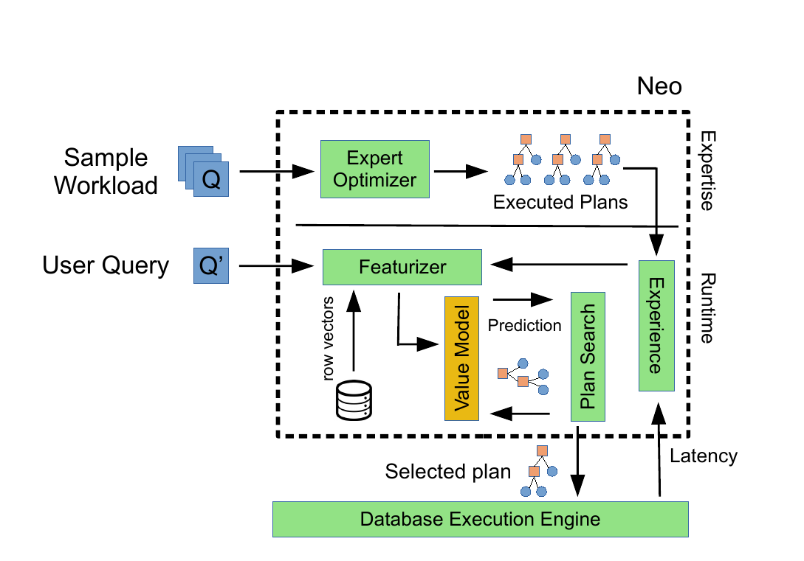

**图 1：Neo 系统模型。**

**专家知识收集。** 在图中标为 Expertise 的第一阶段，Neo 按照 [36] 的方法从传统查询优化器生成经验。Neo 假设存在一个样本工作负载（Sample Workload），其中的查询能够代表用户完整工作负载和底层执行引擎的能力，即能够覆盖一组有代表性的算子。Neo 还假设可以访问一个简单的、传统的基于规则或代价的专家优化器（Expert Optimizer），如 Selinger 优化器 [51] 或 PostgreSQL [3]。Neo 只用该优化器为样本工作负载中的每个查询生成查询执行计划（QEP）。这些 QEP 及其延迟被加入 Neo 的经验集（Experience，即计划/延迟对的集合），作为模型训练阶段的起点。需要注意，专家优化器可以与底层执行引擎毫无关系。

**模型构建。** 得到经验后，Neo 构建初始价值模型（Value Model）。价值模型是一个深度神经网络，用于预测给定部分计划或完整计划的最终执行时间。我们以监督学习方式，使用收集到的经验训练价值网络。该过程会把收集到的每个查询转换为特征（Featurizer），特征既包含查询级信息（如连接图），也包含计划级信息（如连接顺序）。Neo 可以采用多种特征化方案，从简单的独热编码到更复杂的嵌入（第 5 节）。其价值网络使用树卷积 [40] 处理树形 QEP（第 4.1 节）。

**计划搜索。** 查询级信息编码后，Neo 使用价值模型搜索 QEP 空间，即搜索连接顺序、连接算子和索引的选择，找出预测执行时间（即价值）最小的计划。某个查询的全部执行计划空间过大，无法穷举，因此 Neo 用学习到的价值模型引导最佳优先搜索（第 4.2 节）。Neo 生成的完整计划包括连接顺序、连接算子（如哈希、归并、循环）和访问路径（如索引扫描、表扫描）。该计划被发送给底层执行引擎，由后者应用语义合法的查询改写规则（如插入必要的排序操作）并执行最终计划，从而保证生成计划的正确性。

**模型再训练。** 随着 Neo 优化更多查询，价值模型通过加入每个已执行 QEP 的新经验而迭代改进，并逐渐针对用户数据库定制。具体而言，为某个查询选定 QEP 后，Neo 把它发送给底层执行引擎；引擎处理查询并把结果返回用户。Neo 同时记录该 QEP 的最终执行延迟，把计划/延迟对加入经验集，然后依据这些经验重新训练价值模型，持续改善估计。

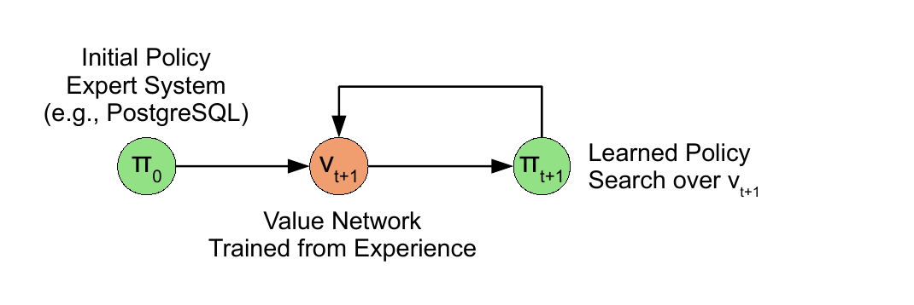

**图 2：价值迭代。**

**讨论。** 对用户发来的每个查询，Neo 都会重复“搜索—模型再训练”过程。Neo 的架构形成纠错反馈环：如果学习到的代价模型把 Neo 引向一个预测表现良好、实际延迟却很高的查询计划，模型就会学着为该劣质计划预测更高代价。以后，Neo 便更少选择具有类似特征的计划。因此，Neo 的代价模型会越来越准确，实质上是在从错误中学习。

Neo 把查询优化表示为马尔可夫决策过程（MDP，第 3.1 节给出形式化定义）：每个状态对应一个部分查询计划，每个动作对应自底向上构造计划的一步，只有最终终止状态会根据计划延迟给出奖励。Neo 在该 MDP 上的导航方法称为价值迭代 [7]。如图 2 所示，系统根据既有经验训练函数来逼近某一状态的效用（价值）；这个函数就是价值网络，随后由它生成策略。传统上，生成的策略可能非常简单，例如依据价值网络贪心选择动作。

Neo 在两个方面扩展了传统价值迭代模型。第一，Neo 不会贪心地照搬价值网络的建议。近期研究 [33, 52] 表明，用训练好的价值网络作为启发函数指导搜索可以改善结果。第二，Neo 并非“从零开始”，而是从传统查询优化器生成的查询执行计划数据集中获得初始引导。这避免了强化学习中著名的样本低效问题 [18, 48]：如果没有初始引导，强化学习算法可能需要数百万次迭代 [38] 才能达到人工专家系统的水平。直观地说，从专家源引导（示范学习）类似儿童通过模仿成人来习得语言或学习走路，已经证明能显著缩短学得良好策略所需的时间 [18, 49]。这对数据库管理系统尤其关键：每次迭代都要执行一次查询，用户不可能愿意在系统达到现有优化器水平之前先执行数百万个查询。更糟的是，执行劣质计划比执行优质计划耗时更长，因此初始迭代可能需要不可接受的时间 [36]。

任何强化学习系统的重要问题都是平衡探索与利用。Neo 利用计划搜索过程中的已有知识，高度依赖价值网络指导最佳优先搜索。与价值迭代 [38] 一样，Neo 通过模型再训练确保探索新策略：每次重新训练价值网络时，权重都会重置为随机值，并用全部已收集经验训练整个网络。这样，对于未见查询计划，价值网络的预测会保持较高随机性，因为这些计划“偏离流形” [10, 33]。Neo 的架构也与用于围棋的强化学习系统 AlphaGo [52] 非常相似；受篇幅限制，二者的详细比较见在线附录 [34] 第 2 节。

## 3. 查询特征化

本节说明如何把查询计划表示为向量，并先给出必要记号。

### 3.1 记号

对查询 $q$，定义其使用的基关系集合为 $R(q)$。查询 $q$ 的部分执行计划 $P$（记作 $Q(P)=q$）是由若干棵树组成的森林，表示一个仍在构建中的执行计划。每个内部（非叶）树节点都是连接算子 $\bowtie_i\in J$，其中 $J$ 是可用连接算子集合，例如哈希连接 $\bowtie_H$、归并连接 $\bowtie_M$ 和循环连接 $\bowtie_L$。每个叶节点则是在关系 $r\in R(q)$ 上的表扫描、索引扫描或未指定扫描，分别记为 $T(r)$、$I(r)$ 和 $U(r)$。[^1] 未指定扫描是尚未确定为表扫描还是索引扫描的扫描。例如，某个部分查询执行计划可写为：

$$
[(T(D)\bowtie_M T(A))\bowtie_L I(C)],\quad [U(B)]. \tag{1}
$$

这里，$B$ 的扫描类型尚未指定，也尚未选择把 $B$ 与计划其余部分连接起来的连接。该计划已经指定：对表 $D$ 和 $A$ 做表扫描，将二者送入归并连接，再把结果与 $C$ 通过循环连接相连。

完整执行计划只有一个根且不存在未指定扫描，所有关于执行方式的决策都已作出。若可通过以下任一方式从执行计划 $P_i$ 构造 $P_j$，则称 $P_i$ 是 $P_j$ 的子计划，记为 $P_i\subset P_j$：（1）把未指定扫描替换为索引扫描或表扫描；（2）用连接算子组合 $P_i$ 中的子树。

构造完整执行计划可以看作 MDP。MDP 的初始状态是每个扫描都未指定且不存在连接的部分计划。每个动作或者（1）用连接算子融合两个根，或者（2）把未指定扫描变为表扫描或索引扫描。更形式化地说，每个动作把当前计划 $P_i$ 转换为满足 $P_i\subset P_j$ 的某个计划 $P_j$。除最后一个动作外，所有动作的奖励均为零；最后一个动作的奖励等于生成计划的延迟。与先前工作 [25, 35] 一样，这种建模的优点是“无环”：经过有限次动作后一定会到达完整查询执行计划。

### 3.2 编码

Neo 使用两种编码：查询编码表达与查询有关、但独立于查询计划的信息；计划编码表达部分执行计划。

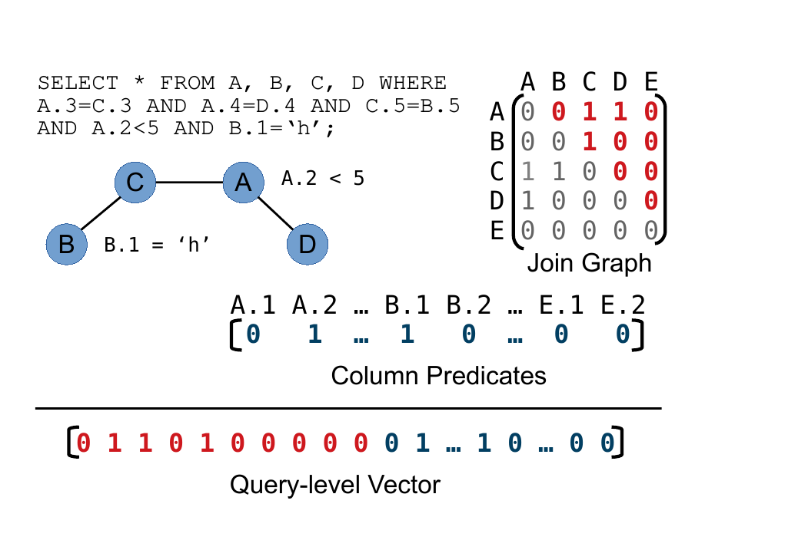

**图 3：查询级编码。图中的示例查询如下。**

```sql
SELECT * FROM A, B, C, D WHERE
A.3=C.3 AND A.4=D.4 AND C.5=B.5
AND A.2<5 AND B.1='h';
```

**查询编码。** 与先前工作 [25, 35, 43] 类似，与查询相关但独立于计划的信息表示由两部分组成。第一部分把查询的连接图编码为邻接矩阵。例如，在图 3 中，第一行第三列的 1 对应连接 $A$ 与 $C$ 的连接谓词。关系 $E$ 对应的行和列均为空，因为示例查询不涉及 $E$。为简化起见，我们假设每对关系之间至多有一个外键；该表示也很容易扩展到多个外键，例如用相关键的索引代替 1。因为矩阵对称，所以只编码其上三角部分（图中红色）。

查询编码的第二部分是列谓词向量。Neo 当前支持三种能力逐渐增强、预计算要求各不相同的变体：

1. **1-Hot（谓词是否存在）：** 简单地独热编码哪些属性出现在任意查询谓词中。向量长度等于所有数据库表的属性总数。例如，图 3 的独热向量把属性 `A.2` 和 `B.1` 对应位置设为 1，因为二者均出现在谓词中。这里不考虑连接谓词。学习代理只知道某属性是否出现在谓词中。尽管简单，1-Hot 无需访问底层数据库即可构造。
2. **Hist（谓词选择率）：** 扩展 1-Hot，用谓词的预测选择率代替 0 或 1。例如，如果预测 `A.2` 的选择率为 20%，对应值就是 0.2。我们用带均匀性假设的现成直方图方法预测选择率。
3. **R-Vector（谓词语义）：** 使用行向量的最强编码。行向量以自然语言处理模型 word2vec [37] 为基础，把列谓词向量的每一项替换为包含谓词相关语义信息的向量。这种编码需要在数据库数据上构建模型，代价最高；第 5 节将详细介绍。

表达能力更强的编码为模型学习复杂关系提供更多自由度。但这并不意味着简单编码无法让模型学习复杂关系。例如，虽然 Hist 不编码表间相关性，模型仍可能从反复观察到的查询延迟中学习相关性，并在内部修正基数估计。不过，R-Vector 为查询谓词提供语义增强表示，使 Neo 的工作更容易。

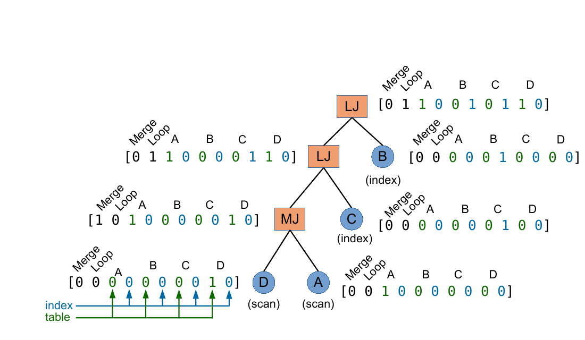

**图 4：计划级编码。**

**计划编码。** 除查询编码外，还需要表示部分或完整查询执行计划。先前工作 [25, 35] 会把每个部分执行计划的树形结构展平，而我们的编码保留执行计划固有的树结构。如图 4 所示，我们把部分执行计划的每个节点转换为向量，得到一棵向量树。向量数量（即树节点数量）可以增加，树结构本身也可能变化，例如左深树或浓密树，但每个向量的列数相同。

该表示把每个节点转换为大小为 $|J|+2|R|$ 的向量，其中 $|J|$ 是连接类型数量，$|R|$ 是关系数量。每个向量的前 $|J|$ 项编码连接类型，例如图 4 的根节点使用循环连接；后 $2|R|$ 项编码使用了哪些关系及其扫描类型（表扫描、索引扫描或未指定）。叶节点的该子向量是独热编码；若叶节点表示未指定扫描，就把它同时当作索引扫描和表扫描，即在“table”和“index”两列都置 1。内部节点的这些项是相应子节点项的并集。例如，图 4 最下方的循环连接在表 $A$ 和 $D$ 的表扫描位置以及 $C$ 的索引扫描位置上均为 1。

该表示可以包含两个尚未连接的部分查询计划，即多个根。例如，编码公式（1）的部分计划时，根节点 $U(B)$ 会被编码为 `[0000110000]`。这些编码的目的只是向下一节介绍的 Neo 价值网络提供执行计划表示。

[^1]: Neo 也可以直接处理其他扫描类型，例如位图扫描。

## 4. 价值网络

下面介绍 Neo 的价值网络。这个神经网络经过训练后，为部分执行计划 $P_i$ 预测其可能达到的最佳查询延迟，也就是在满足 $P_i\subset P_f$ 的完整执行计划 $P_f$ 中可以达到的最佳查询延迟。由于不可能预先知道某查询的最佳执行计划，我们用系统迄今见过的最佳查询延迟来近似它。

设 Neo 的经验集 $E$ 是一组延迟 $L(P_f)$ 已知的完整查询执行计划 $P_f\in E$。对任何属于某个 $P_f\in E$ 的子计划 $P_i$，我们训练模型 $M$ 逼近：

$$
M(P_i)\approx \min\{C(P_f)\mid P_i\subset P_f\land P_f\in E\},
$$

其中 $C(P_f)$ 是完整计划的代价。用户可以改变代价函数，从而改变 Neo 的行为。例如，如果用户只关心最小化整个工作负载的查询总延迟，可以把代价定义为延迟：

$$
C(P_f)=L(P_f).
$$

如果用户更希望保证工作负载中的每个查询 $q$ 都优于某个基线，则可定义：

$$
C(P_f)=\frac{L(P_f)}{Base(P_f)},
$$

其中 $Base(P_f)$ 是计划 $P_f$ 在该基线下的延迟。无论如何定义代价函数，Neo 都会随时间推移尝试将其最小化。模型通过最小化损失函数 [50] 训练；我们采用简单的 $L_2$ 损失：

$$
\left(M(P_i)-\min\{C(P_f)\mid P_i\subset P_f\land P_f\in E\}\right)^2.
$$

同一个查询计划可能因外部状态不同而表现出不同延迟，例如缓存状态或并发事务。默认情况下，Neo 的价值模型尝试预测查询计划的最终平均延迟，这会最小化 $L_2$ 损失。但可按用户需要修改损失函数，使价值网络预测最终观测到的最坏延迟，例如选择对缓存状态更鲁棒的查询计划；也可以让它预测最佳观测延迟，例如选择假设所需数据已经在缓存中的计划。如果需要，甚至可以使用分段损失函数，对用户工作负载中的不同查询分别偏向最坏、平均或最佳情况。

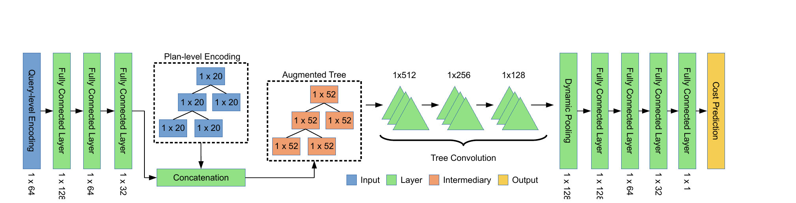

**图 5：价值网络架构。**

**网络架构。** 图 5 展示 Neo 价值网络的架构。[^2] 该架构旨在为查询优化引入合适的归纳偏置 [33]：神经网络自身的结构反映了对查询计划快慢原因的直观理解。人类研究查询计划时，会通过模式匹配识别优劣计划。例如，共享连接键的哈希连接之上的归并连接可能引入冗余排序或哈希；两个哈希连接之上的循环连接可能对基数估计误差高度敏感；以事实表作为“构建”关系的哈希连接可能发生溢写；一系列不需要重新排序的归并连接则可能表现良好，等等。我们的关键认识是，所有这些模式都能通过分析查询执行计划的子树来识别。Neo 的模型架构本质上是一大组自动从数据中学习得到的模式库，它利用了树卷积 [40]。

如图 5 所示，当模型评估部分查询计划时，查询级编码先经过若干逐层缩小的全连接层。第三个全连接层输出的向量与计划级编码拼接，即把同一个向量加入每个树节点。这是结合固定大小数据（查询级编码）与动态大小数据（计划级编码）的标准技术，称为空间复制（spatial replication）[52, 62]。每个树节点的向量增强后，树森林经过若干树卷积层 [40]；该操作把树映射为树。之后应用动态池化 [40]，把树结构展平为单一向量。若干额外全连接层再把该向量映射为一个标量，作为模型对输入计划的预测。价值网络模型的形式化说明见 [34]。

### 4.1 树卷积

CNN [29] 等神经网络模型接收结构固定的输入张量，例如向量或图像。对 Neo 而言，每个执行计划的特征被组织成树节点（如图 4）。因此，我们使用树卷积 [40]，也就是面向树形数据改造的传统图像卷积。

树卷积很适合 Neo。与图像卷积类似，树卷积让一组共享过滤器滑过计划树的每个部分。直观地说，这些过滤器可以捕捉多种局部父子关系。例如，过滤器可以查找归并连接上方的哈希连接，或在特定谓词存在时查找两个关系的连接。过滤器输出为价值网络的最终几层提供信号：输出可表明连接算子的子节点已经排序（提示使用归并连接），也可估计连接右侧关系的基数较低（提示索引可能有用）。本节后面会给出两个具体例子。

因为查询树的每个节点恰有两个子节点，每个过滤器由三个权重向量 $e_p,e_l,e_r$ 组成。过滤器作用于局部“三角形”：某节点的向量 $x_p$ 及其左右子节点向量 $x_l,x_r$；若该节点是叶节点，则子节点向量为 $\vec 0$。过滤器生成新树节点 $x'_p$：

$$
x'_p=\sigma(e_p\odot x_p+e_l\odot x_l+e_r\odot x_r).
$$

这里，$\sigma(\cdot)$ 是非线性变换（如 ReLU [16]），$\odot$ 表示点积，$x'_p$ 是过滤器输出。因此，每个过滤器会组合树节点局部邻域的信息。同一过滤器会在执行计划的每棵树上“滑动”，因而可应用于任意大小的计划。一组过滤器可作用于一棵树，生成结构相同、但节点向量大小可能不同的另一棵树。实践中会应用数百个过滤器。

树卷积的输出仍是树，因此可以“堆叠”多层树卷积过滤器。第一层作用于增强后的执行计划树，即让每个过滤器滑过增强树的每个“父节点—左子节点—右子节点”三角形。某个过滤器能看到的信息范围称为感受野 [31]。第二层过滤器作用于第一层输出，所以这一层的每个过滤器都能看到由原增强树中的节点 $n$、$n$ 的子节点和孙节点派生的信息；每一层树卷积的感受野都比前一层更大。因此，第一层学习简单特征，例如识别归并连接之上的归并连接；最后一层学习复杂特征，例如识别一条左深归并连接链。

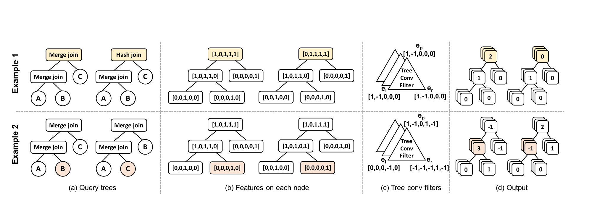

**图 6：树卷积示例。（a）查询树；（b）每个节点的特征；（c）树卷积过滤器；（d）输出。**

下面用两个例子说明第一层树卷积如何检测查询执行计划中的重要模式。图 6a 的示例 1 给出两个执行计划，它们只有最上层连接算子不同，一个是归并连接，一个是哈希连接。如图 6b 上半部分所示，每个节点特征向量的前两项编码连接类型（哈希或归并）。图 6c 上半部分的树卷积过滤器包含三个权重向量，前两项均为 $\{1,-1\}$，其余均为零；它充当连续两次归并连接的“检测器”。图 6d 上半部分显示，包含连续两个归并连接的计划根节点从该过滤器得到输出 2，而归并连接之上的哈希连接计划根节点得到输出 0。后续树卷积层可利用该信息形成更复杂的检测器，例如检测连续三个归并连接（流水线式查询执行计划），或检测归并连接与哈希连接的混合（可能引入重新哈希或重新排序）。

图 6 的示例 2 假设表 $A$ 与 $B$ 已按同一个键排序，因此理想做法是使用归并连接；表 $C$ 未排序。图 6c 下半部分的过滤器充当检测器，识别以归并连接连接 $A$ 与 $B$ 的查询计划，这通常是理想行为。顶部权重 $e_p$ 识别归并连接，右侧权重 $e_r$ 在所有表中识别表 $B$。卷积结果（图 6d 下半部分）对 $A$ 与 $B$ 的归并连接（第一个计划）给出最高输出，对 $A$ 与 $C$ 的归并连接（第二个计划）给出负输出。

实践中，过滤器权重通过学习得到，而非人工配置。用梯度下降更新权重时，与延迟相关的过滤器（有帮助的特征）会获得奖励并保持稳定，与延迟没有清晰关系的过滤器则受到惩罚并被推向更有用的取值。这形成纠错反馈环，最终得到能提取有用特征的过滤器库 [29]。

### 4.2 DNN 引导的计划搜索

价值网络能够预测执行计划的质量，却不会直接给出执行计划。借鉴近期工作 [4, 52]，我们把价值网络与搜索技术结合来生成计划，形成价值迭代方法 [7]。

给定训练好的价值网络和新到达的查询 $q$，Neo 在该查询的计划空间中搜索。在某些方面，该过程类似传统数据库优化器的搜索，只是训练好的价值网络承担了数据库代价模型的角色。但与传统系统不同，价值网络并不预测子计划本身的代价，而是预测包含给定子计划的完整执行计划所能达到的最佳延迟。借助这一区别，我们可以执行最佳优先搜索 [12]，寻找期望代价较低的执行计划。本质上，该过程会反复探索预测代价最好的候选项，直到满足停止条件。

查询 $q$ 的搜索过程从初始化一个保存部分执行计划的空最小堆开始。最小堆按价值网络对每个部分计划的代价估计排序。起初，堆中加入一个部分执行计划，其中 $R(q)$ 的每个关系都对应一个未指定扫描。例如，若 $R(q)=\{A,B,C,D\}$，则堆以 $P_0$ 初始化：

$$
P_0=[U(A)],\quad [U(B)],\quad [U(C)],\quad [U(D)].
$$

每次搜索迭代先移除最小堆顶部的子计划 $P_i$，枚举其子节点集合 $Children(P_i)$，用价值网络为每个子节点评分并加入最小堆。直观地说，$P_i$ 的子节点是通过指定 $P_i$ 中某个扫描，或用连接算子连接 $P_i$ 的两棵树所能生成的全部计划。形式化地，若 $P_i$ 已是完整计划，则 $Children(P_i)$ 为空集；否则它是在当前 MDP 状态下可用的动作集合（见第 3.1 节）。每个子节点评分并入堆后，下一次迭代继续探索最有希望的计划。搜索每一步耗时 $O(\log n)$，其中 $n$ 是最小堆大小。

发现叶节点（完整计划）后即可终止；但该搜索过程很容易转变为随时算法（anytime search algorithm）[63]：在固定时间上限到达前持续寻找更好的结果。在该变体中，Neo 不断探索堆中最有希望的节点，达到时间阈值时返回最有希望的完整执行计划。这让用户可以控制规划时间与执行时间之间的取舍，并按需要为不同查询设置不同截止时间。如果达到时间阈值时尚未找到完整执行计划，Neo 的搜索过程进入“赶工”模式 [55]，从最后探索的计划开始贪心地追踪最有希望的子节点，直到到达叶节点。截止时间应按应用调节；我们发现 250ms 足以覆盖多种工作负载（第 6.6 节）。

## 5. 行向量嵌入

如第 3.2 节所述，Neo 可以用多种方式表示查询谓词，包括简单独热编码（1-Hot）和基于直方图的表示（Hist）。本节说明并介绍 Neo 表示查询谓词的最强选项：行向量（R-Vector）。

基数估计对传统查询优化器的成功至关重要 [26, 30]，但数据库系统常作出均匀性、独立性和包含原则等简化假设，反而损害这一目标 [27]。Neo 采用不同方法：它不对数据分布作简化假设，也不尝试直接估计谓词基数，而是构建语义丰富的查询谓词向量表示，作为 Neo 价值模型的输入，使网络能够学到可泛化的数据相关性知识。遵循语义查询 [9]、实体匹配 [41]、数据发现 [14] 和错误检测 [17] 的近期工作，我们依据数据库本身的数据为每个查询谓词构建向量表示。

行向量方法建立在流行且研究充分的 word2vec 算法 [37] 上。word2vec 把自然语言词语转换为向量。向量本身没有意义，但向量间距离具有语义：例如，“spaghetti”与“pasta”的距离较小，“banana”与“doorknob”的距离较大。直观上，word2vec 利用词语上下文：文本中经常相邻出现的词获得相近的向量表示，很少相邻出现的词获得不同表示，例如“在意大利餐厅，我点了……”。在 Neo 中，我们把数据库每张表的每一行视为句子，把表中一行的每个列值视为单词。因此，经常在同一行共同出现的值会被映射到相近向量。我们把这些向量称为行向量。Neo 的价值网络可接收行向量作为输入，用它们识别数据中的相关性，也能识别语法不同但语义相似的谓词值，例如“action”和“adventure”都经常与“superhero”共同出现。

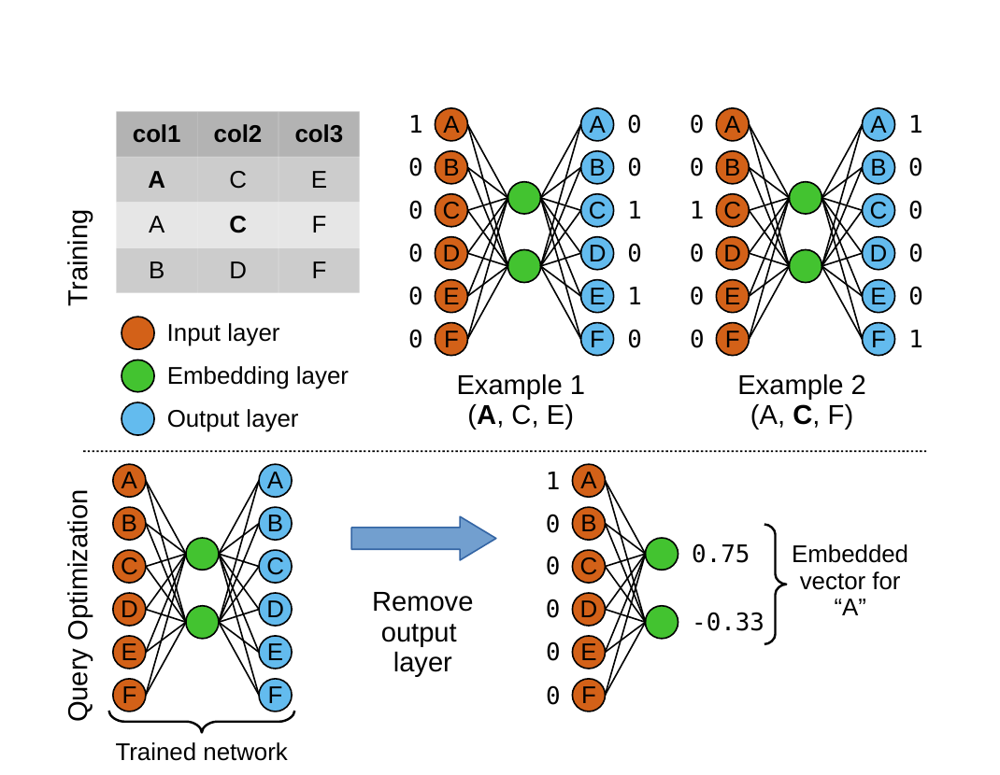

**图 7：行向量嵌入过程。上半部分是训练，下半部分是查询优化。**

本节余下部分先高层概述 Neo 如何构建行向量，再说明行向量为何能有效捕捉现实数据中的相关性；细节见在线附录 [34]。

### 5.1 R-Vector 特征化

我们的高层目标是为查询谓词构建语义丰富的输入表示。例如，若 IMDB 电影数据集/JOB 数据集 [26] 上的查询查找所有带有“marvel-comics”标签的电影演员，结果会包含很多扮演超级英雄的演员；若标签换成“avengers”，也会返回很多超级英雄演员；而查询带有“romance”标签的电影，则不太可能返回很多超级英雄演员。因此，我们希望“marvel-comics”的向量表示与“avengers”相似，而与“romance”不同。有了这样的向量化，Neo 在见过“marvel-comics”电影查询后，就更可能准确预测“avengers”电影查询，获得更多泛化机会。

Neo 的行向量编码分两步（图 7）。查询优化之前，训练步骤使用专门神经网络学习嵌入。查询优化期间，移除该专门网络的输出层，得到一个把输入映射为嵌入向量的截断网络 [34]。

**训练。** 为生成行向量，我们使用 word2vec，这是一种嵌入词集合上下文信息的自然语言处理技术 [37]。我们通过现成的 word2vec 实现 [47]，为数据库中的每个值构建嵌入。该过程显示在图 7 上半部分。

首先构建一个三层神经网络，称为嵌入网络，其输入层和输出层大小相等。训练目标是把数据库中每个独热编码值映射为表示该值上下文的输出向量。例如，图 7 上半部分的示例 1 展示了如何训练嵌入网络：输入“A”，输出表示“C”和“E”的向量，对应示例表第一行。对第一行，网络还会学习把“C”映射为表示“A”和“E”的输出向量，把“E”映射为表示“A”和“C”的输出向量。数据库中的每一行都会重复这一过程，例如示例 2。嵌入网络永远无法达到很高准确率，因为“A”可能出现在多个上下文中；算法的目标是捕捉数据库值与其上下文之间的统计关系。

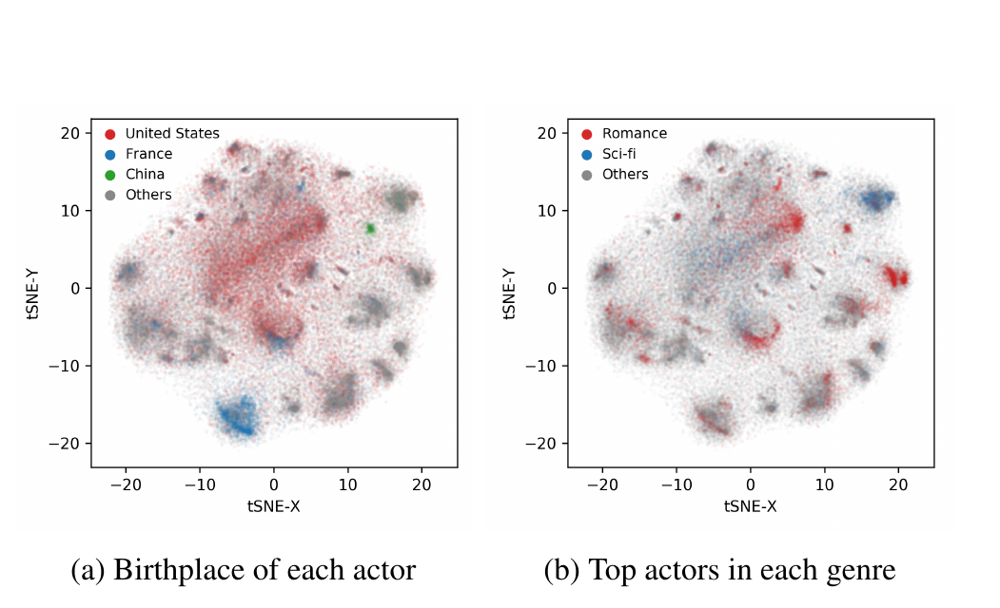

**图 8：相同演员姓名嵌入的 t-SNE 投影（每条轴都是无量纲量）。（a）按出生地着色；（b）按最常出演的类型着色。同一嵌入会自动捕捉多种相关性，相关性表现为有语义意义的簇。**

**查询优化。** 图 7 下半部分展示 Neo 在查询优化期间如何构建行向量编码。嵌入网络训练完成后，移除输出层，得到两层网络；嵌入层到输出层的变换权重也可以丢弃。把数据库值送入这个截断网络，并记录嵌入层的值，即可构建该值的向量表示。

编码查询谓词时，我们把谓词算子（如 `LIKE` 或 `!=`）与嵌入向量的信息结合起来。最简单的查询谓词形式是 `tbl.attr OP VALUE`，例如 `actor.name = "Robert Downey Jr"`。对此，可把谓词算子（如 `=`）的独热编码与谓词值（如 `"Robert Downey Jr"`）的嵌入向量拼接起来。拼接向量替换 1-Hot 编码中简单的 0 或 1（第 3.2 节）。

嵌入向量也可以组合和搜索，以处理通配符 `LIKE` 查询或复杂逻辑查询（如 `AND`、`OR`）。例如，Neo 在数据库中搜索通配符的一个匹配样例，再使用该匹配值的嵌入 [34]。还可以对数据库做部分反规范化，使 word2vec 模型捕捉跨表相关性，从而改善嵌入。我们的 word2vec 训练过程已经开源，可在 GitHub 获取 [1]。

**示例。** 接下来考察一个在 IMDB/JOB 数据集 [26] 上训练的 word2vec 模型。在整个 IMDB 数据集上训练行向量模型后，我们用 t-SNE[^3] 把演员姓名的嵌入向量空间投影到二维空间绘图 [58]。图 8 直观展示了行向量如何捕捉跨数据库表的语义相关性。如图所示，中国演员、科幻片演员等语义群组聚在一起。直观上，这为估计具有相似谓词的查询延迟提供了有用信号：图 8 中很多簇是线性可分的，所以机器学习算法能够学到它们的边界。换言之，具有相似语义值的谓词（如两位美国演员）很可能具有相似相关性（如都出现在美国电影中）。表达查询谓词的语义值，使价值网络能够识别相似谓词，从而更好地泛化到未见谓词。

[^2]: 我们在图和讨论中省略了各层之间的激活函数。

[^3]: t-SNE 算法寻找高维空间的低维嵌入，并保持点对之间的距离：低维空间中相近（相远）的点，在高维空间中也相近（相远）。

## 6. 实验

我们在合成数据集和现实数据集上评估 Neo，以回答以下问题：（1）Neo 与高质量商业优化器相比表现如何；（2）Neo 对新查询的泛化能力如何；（3）Neo 的训练和执行开销有多大；（4）不同编码策略如何影响查询延迟；（5）搜索时间、损失函数等参数如何影响整体性能；（6）Neo 对估计误差的鲁棒性如何。除非另有说明，查询都在一台配备 32GB RAM、Intel Xeon E5-2640 v4 CPU 和固态硬盘的服务器上执行。每个 DBMS 都按其发行组织提供的“最佳实践”指南配置。

### 6.1 设置

我们在多种数据库系统上评估 Neo，使用三个基准：

1. **JOB：** 连接顺序基准 [26]，在 Internet Movie Data Base（IMDB）上包含一组带复杂谓词、专门用于测试查询优化器的查询。
2. **TPC-H：** 标准 TPC-H 基准 [45]，缩放因子为 10。
3. **Corp：** 一家大型公司在匿名条件下提供的内部仪表盘应用数据，其中包括 2TB 数据集和 8,000 个不同查询。

除非另有说明，所有实验都把可用查询随机分为 80% 的训练集和 20% 的测试集。对 TPC-H，我们依据基准查询模板生成 80 个训练查询和 20 个测试查询，训练与测试查询不复用模板。

每个结果都是 50 次随机初始化运行的中位数。神经网络使用 Adam [21] 训练，用层归一化 [5] 稳定训练，激活函数为 leaky ReLU [16]。搜索截止时间为 250ms。网络架构遵循图 5；我们在 JOB 的一个小子集上测试多种变体后选定该架构，但计划级编码的大小取决于所选编码策略。行向量使用部分反规范化构建 [34]。

我们把 Neo 与两个开源数据库系统 PostgreSQL 11.2、SQLite 3.27.1，以及两个商业数据库系统 Oracle 12c、Microsoft SQL Server 2017 for Linux 比较。具体做法是：分别训练 Neo 为每个系统构建查询计划，再把 Neo 的计划与该系统自身查询优化器生成的计划比较。受 Microsoft SQL Server 和 Oracle 的许可条款 [46] 限制，我们只能展示相对性能。

Neo 收集初始经验时始终使用 PostgreSQL 优化器作为专家。我们把 Neo 为其构建查询计划的系统称为目标系统；例如，若 Neo 为在 Oracle 上执行而构建计划，Oracle 就是目标系统。训练 Neo 时，首先使用 PostgreSQL 优化器为训练集中的每个查询创建计划。然后通过查询提示强制目标系统（如 Oracle）服从该计划，并测量其在目标执行引擎上的执行时间。接着开始训练：Neo 训练价值网络来预测经验集中完整计划和部分计划的延迟，再用价值网络构建新查询计划。底层 DBMS 执行这些新计划，所得延迟加入 Neo 的经验集。整个过程重复 100 次。

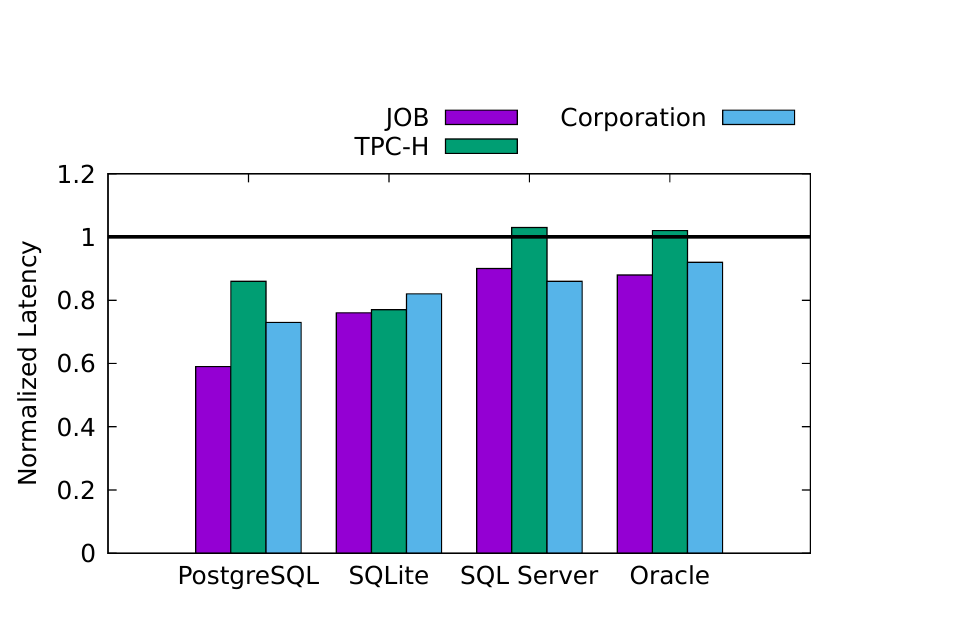

**图 9：训练 100 轮后，Neo 为测试查询创建的计划延迟；相对于目标系统对应优化器创建的计划进行归一化，并按不同工作负载展示。**

### 6.2 整体性能

图 9 展示 Neo 在每个测试工作负载上完成 100 次训练迭代后的相对性能。实验在留出数据集上采用 R-Vector 编码，数值越低越好。例如，在 PostgreSQL 与 JOB 工作负载组合上，Neo 生成的查询平均执行时间只有原 PostgreSQL 优化器生成计划的 60%。由于 Neo 的初始专家知识来自 PostgreSQL 优化器，这说明 Neo 能够改进已有开源优化器。

此外，在 SQL Server 上，Neo 为 JOB 和 Corp 工作负载生成的查询计划也比 SQL Server 商业优化器生成的计划快 10%；这些计划均在 SQL Server 上执行。SQL Server 优化器包含多阶段搜索过程和一个具有数百项输入、动态调优的代价模型 [15, 42]，理应比 PostgreSQL 优化器先进得多。然而，仅以 PostgreSQL 优化器作为初始专家，Neo 最终仍能在 SQL Server 自身平台上胜过或追平 SQL Server 优化器。Oracle 上也得到相似结果。执行时间的缩短完全来自更好的查询计划，底层执行引擎没有任何改动。Neo 唯一没有胜过这两个商业系统的情况是 TPC-H；我们推测 SQL Server 和 Oracle 都针对这一常用基准做过调优。

总体而言，该实验表明 Neo 生成的计划可以达到开源优化器及明显更强的商业优化器的水平，有时甚至更好。不过，图 9 只比较第 100 次训练轮次后 Neo 的中位性能，这自然引出两个问题：（1）训练轮次较少时性能如何、训练出足够质量的模型需要多久；下一小节回答该问题。（2）优化器对各种估计误差有多鲁棒；第 6.4 节回答该问题。

### 6.3 收敛时间

为分析收敛时间，我们在每次训练迭代后测量性能，共进行 100 个完整迭代。首先以训练迭代次数报告学习曲线，便于比较不同系统；例如，仅仅因为 MS SQL Server 执行引擎调优得更好，它的一轮训练可能比 PostgreSQL 快很多。之后报告在不同系统上训练模型的实际墙钟时间。最后分析引导方法在多大程度上缩短了训练时间。

#### 6.3.1 学习曲线

我们在每个轮次上测量 Neo 相对于目标系统优化器的性能；图中的 1 表示与目标引擎优化器相当。一个轮次是对训练查询集合的完整遍历，包括用经验重新训练网络、为每个训练查询选择计划、执行该计划，并把结果加入 Neo 的经验。图 10 展示 50 次运行：实线表示中位数，阴影区域表示最小值与最大值。除 PostgreSQL 外，每个 DBMS 的图还给出由 PostgreSQL 优化器生成、再在目标引擎上执行的计划的相对性能，例如在 Oracle 上执行 PostgreSQL 计划。

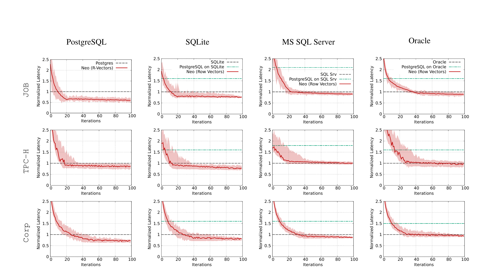

**图 10：带方差的学习曲线，即归一化延迟随时间的变化。对每个 DBMS 和数据集，图中测量该 DBMS 自身优化器、PostgreSQL 优化器及 Neo 所创建计划的延迟。延迟相对于相应 DBMS 优化器生成计划的延迟归一化，例如第四列所有值都以 Oracle 优化器生成计划的延迟为基准。阴影跨越 50 个不同随机种子运行的最小值到最大值，中间实线为中位数。包含全部特征化方案的图见 http://rm.cab/l/lc.pdf 。**

**收敛。** 各图表现出相似规律：第一次迭代后，Neo 性能较差，接近目标系统优化器的 2.5 倍；随后若干迭代中性能迅速改善，最终趋于稳定。Neo 最快只需 9 次训练迭代就能胜过 PostgreSQL 优化器，即中位运行曲线越过代表 PostgreSQL 的线。要匹配 MS SQL Server 或 Oracle 商业优化器，需要明显更多训练轮次，这并不意外，因为商业系统复杂得多。

**方差。** 除 TPC-H 外，不同训练运行之间的方差对所有工作负载都很小。我们推测 TPC-H 均匀的数据分布使 R-Vector 嵌入作用较小，所以模型需要更长时间作出相应调整。非合成数据集上没有这种现象。

#### 6.3.2 墙钟时间

前面以训练迭代次数分析 Neo 达到竞争力所需时间；下面改用真实墙钟时间。我们考察 Neo 达到两个里程碑所需的时间：（1）策略生成的查询计划达到 PostgreSQL 计划在目标执行引擎上的性能；（2）策略生成的计划达到目标系统自身优化器生成并在目标执行引擎上运行的计划性能。结果见图 11a：左、右两根柱分别表示里程碑 1 和 2，并拆分为神经网络训练时间和查询执行时间。查询执行步骤会并行化，在不同节点同时执行查询。

商业优化器更先进，因此 Neo 达到它们的水平需要更久，这并不意外。不过，对每个引擎，学习一个能持续胜过 PostgreSQL 优化器的策略都少于两小时。Neo 还能在半天内匹配或超过每个优化器。这里不包括查询编码的训练时间；1-Hot 和 Histogram 的该项时间可忽略，R-Vector 则需要更久，详见第 6.7 节。

#### 6.3.3 示范真的必要吗？

收集示范数据会增加复杂性，因此自然会问：示范是否真的必要，能否从零知识学得良好策略？先前工作 [35] 表明，现成的深度强化学习技术无需示范数据，也能学会寻找使代价模型最小的查询计划；但直接依据查询延迟端到端学习策略很困难，因为一个劣质计划可能执行数小时。随机选择的查询计划表现极差，可能比正常计划慢 100 到 1,000 倍 [26]，从而把 Neo 的训练时间扩大类似倍数 [36]。

我们尝试设置临时查询超时 $t$（如 5 分钟），在延迟超过 $t$ 时终止查询执行。但这会破坏 Neo 用于学习的大量信号：延迟 7 分钟的连接模式和延迟 1 周的连接模式得到相同奖励，Neo 因而无法知道 7 分钟计划是对 1 周计划的改进。结果是，即使训练三周以上，也无法达到 PostgreSQL 优化器的水平。

### 6.4 鲁棒性

本节测试其他查询编码（如 1-Hot）的有效性、Neo 处理专门构造并呈现新行为的未见查询的能力，以及 Neo 对带噪输入的抵抗力。

#### 6.4.1 查询编码

图 11b 展示 JOB 数据集上改变查询编码时，Neo 在各 DBMS 上的性能。这里包含两种 R-Vector 编码：一种使用部分反规范化 [34]，在部分反规范化的数据库上训练；另一种完全不反规范化，后缀为“no joins”。如预期，1-Hot 始终最差，因为它包含的谓词信息最少。Hist 虽然作出了朴素的均匀性假设，但仍提供了足够的谓词信息来改善 Neo。每种情况下，R-Vector 的整体性能最佳，“no joins”变体稍微落后。我们推测这是因为 R-Vector 比其他编码包含更多底层数据库语义信息。

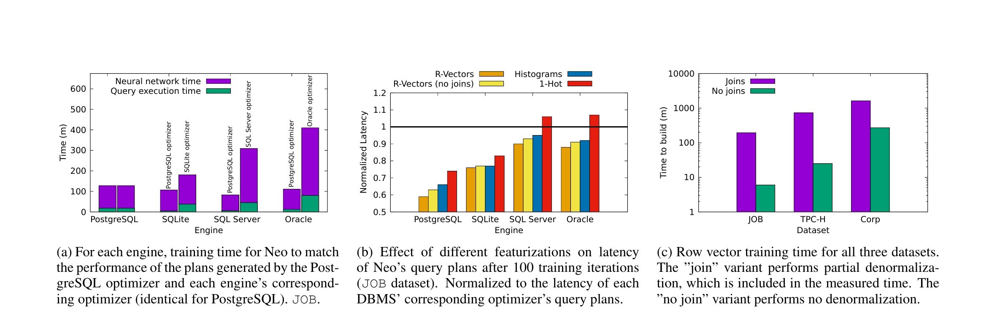

**图 11。** （a）在 JOB 上，对每个引擎，Neo 达到 PostgreSQL 优化器所生成计划的性能，以及达到该引擎对应优化器性能所需的训练时间；对 PostgreSQL 二者相同。（b）JOB 上训练 100 轮后，不同特征化方法对 Neo 查询计划延迟的影响；数值相对于各 DBMS 对应优化器计划的延迟归一化。（c）三个数据集上的行向量训练时间。“joins”变体执行部分反规范化，该时间已计入；“no joins”变体不执行反规范化。

#### 6.4.2 面对全新查询

先前实验表明，Neo 能泛化到从同一工作负载随机抽取并留出的测试集查询。这说明 Neo 能处理此前未见的谓词和连接图修改，却不一定证明它能泛化到完全不同的新查询。为测试其行为，我们创建 24 个额外查询，称为 Ext-JOB [2]；它们在语义上与原 JOB 工作负载不同，不共享谓词或连接图。

在 JOB 查询上训练 Neo 100 轮后，我们在 Ext-JOB 查询上评估 Neo。图 12a 展示结果：实心柱高度表示 Neo 在未见查询上生成的初始计划的平均归一化延迟。首先可以看到，采用 R-Vector 特征化时，Neo 为 Ext-JOB 中全新查询选择的执行计划仍能达到或胜过目标系统优化器。R-Vector 与 Hist/1-Hot 之间差距更大；我们推测原因是 R-Vector 捕捉了能泛化到全新查询的谓词信息。

**学习新查询。** Neo 能从查询执行中渐进学习，因此我们又进行了 5 次包含 Ext-JOB 查询经验的训练迭代，图 12a 以带纹理柱表示结果。Neo 每个新查询只见过几次后，性能便有所提升，说明它已经学会处理此前未见查询引入的新模式。尽管遇到新查询时性能起初会下降，Neo 能够调整自身以适应它们。这展示了深度学习驱动的查询优化器跟随现实查询工作负载变化的潜力。

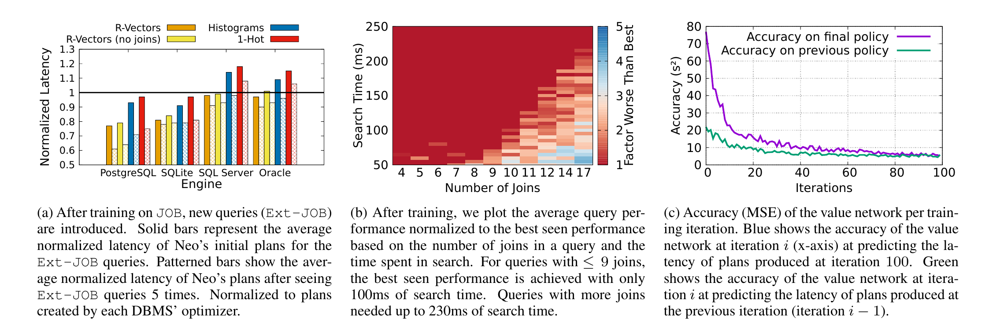

**图 12：鲁棒性与准确率；所有实验均在 JOB 上使用 PostgreSQL，把 Neo 训练 100 轮。** （a）在 JOB 上训练后引入新查询 Ext-JOB。实心柱表示 Neo 对 Ext-JOB 查询的初始计划平均归一化延迟；带纹理柱表示看过 Ext-JOB 查询 5 次后的平均归一化延迟；均相对于各 DBMS 优化器创建的计划归一化。（b）训练后，按查询连接数和搜索时间展示平均查询性能相对于最佳观测性能的倍数。连接数不超过 9 时，只需 100ms 搜索即可达到最佳观测性能；更多连接需要最多 230ms。（c）每次训练迭代的价值网络准确率（MSE）。蓝线表示第 $i$ 轮网络预测第 100 轮生成计划延迟的准确率；绿线表示第 $i$ 轮网络预测前一轮（$i-1$）生成计划延迟的准确率。

#### 6.4.3 基数估计

基数估计与查询优化的紧密关系已得到充分研究 [6, 39]。不过，有效的查询优化器必须考虑到：随着连接数增加，大多数基数估计会明显变得更不准确 [26]。深度神经网络通常被视为黑盒；这里我们说明 Neo 能够学习何时信任基数估计、何时忽略它。

为测量 Neo 对基数估计误差的鲁棒性，我们训练两个 Neo 模型，并在每个树节点上增加一个特征。第一个模型接收 PostgreSQL 优化器的基数估计，称为 PostgreSQL；第二个模型接收真实基数，称为 True cardinality。随后，在优化 JOB 查询时，把状态按连接数 $\leq 3$ 与 $>3$ 分组，并人为加入误差，绘制两个模型对所有遇到状态输出的直方图。

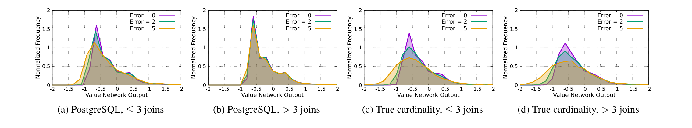

**图 13：Neo 价值网络归一化输出的直方图。** 模型在 JOB 上训练，图 13a、13b 使用 PostgreSQL 基数估计，图 13c、13d 使用真实基数。每幅图分别把 0、2、5 个数量级的随机噪声人为加入 Neo 获得的基数估计。对连接数不超过 3 的计划（13a、13c），加入误差后预测发生变化；对连接数超过 3 的计划（13b、13d），使用 PostgreSQL 估计训练的模型（13b）方差明显小于使用真实基数训练的模型（13d）。这表明 Neo 能有条件地学习“信任”输入。其他实验中 Neo 均未显式接收基数估计。

图 13a、13b 分别展示 PostgreSQL 模型在连接数 $\leq 3$ 与 $>3$ 的状态下的价值网络预测直方图。图 13a 表明，当连接数至多为 3 时，把基数估计误差从零提高到两个和五个数量级，会增大分布方差：Neo 学得的模型会随 PostgreSQL 基数估计变化。图 13b 则显示，连接数超过 3 时，网络输出分布几乎不随误差变化；也就是说，Neo 学会完全忽略此时的 PostgreSQL 基数估计。

图 13c、13d 表明，以真实基数作为输入训练 Neo 的价值模型时，无论连接数多少，模型预测都会随基数变化。换言之，获得真实基数后，Neo 会学着在任何连接数下都依赖基数信息。这说明 Neo 能够学习哪些输入特征可靠，即使特征可靠性取决于连接数等因素。

#### 6.4.4 单查询性能

接下来在查询粒度分析 Neo。图 14 的紫色柱展示 JOB 工作负载中每个查询使用 Neo 计划与 PostgreSQL 计划时的绝对性能差异（秒），二者都在 PostgreSQL 上执行。Neo 对某些查询最多加速 40 秒，但也会使少数查询变慢，例如查询 24a 慢了 8.5 秒。

与传统优化器不同，Neo 的优化目标很容易改变。此前我们一直优化工作负载总代价，即全部查询的总延迟；也可以像第 4 节讨论的那样，改为优化每个查询的相对改进，见图 14 的绿色柱。该目标会隐式惩罚相对基线（如 PostgreSQL）的查询性能回退。在这一目标下，总工作负载时间仍缩短 289 秒，而不是接近 500 秒；除一个查询外，其他查询都比 PostgreSQL 基线更快，唯一例外 29b 只回退 43 毫秒。这证明 Neo 会响应不同优化目标，可针对不同场景定制。

还可进一步定制 Neo 的损失函数，根据查询对用户的重要性，即查询优先级，给予不同权重。甚至可能构建直接感知服务等级协议（SLA）的优化器。我们把这些方向留作未来工作。

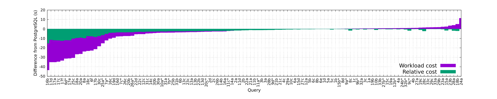

**图 14：训练 100 轮后，JOB 每个查询的 Neo 计划与 PostgreSQL 计划在工作负载代价函数和相对代价函数下的绝对时间差，越低越好。带 `*` 后缀的查询属于测试集，从未加入 Neo 的经验。**

### 6.5 价值网络准确率

Neo 的价值网络负责准确预测部分和完整查询计划的最终延迟。我们使用 PostgreSQL，在 JOB 数据集训练过程中评估价值网络准确率。每次迭代后，测量价值网络预测与计划真实延迟之间的均方误差（MSE），计划分别来自（1）前一次迭代和（2）最后一次迭代。结果见图 12c。起初，价值网络对前一轮和最后一轮计划延迟的估计都较差；随着训练继续，两条曲线逐渐收敛。价值网络在最近一轮与最后一轮上的准确率趋同，说明策略正在稳定 [54]。这是理想性质，通常会伴随运行时间方差下降，但不一定如此。

### 6.6 搜索

Neo 使用训练好的价值网络搜索查询计划，直到固定时间上限（第 4.2 节）。图 12b 展示从 JOB 数据集随机选择、在 PostgreSQL 上执行的查询，其性能如何随连接数和搜索时间变化。横轴跳过若干数值，因为 JOB 没有 13 个连接的查询。查询性能以最佳观测性能为基准。例如，当连接数为 10 时，只要截止时间超过 120ms，Neo 就能找到观测到的最佳计划。我们还把搜索时间大幅延长到 5 分钟，发现无论查询连接数多少（JOB 最多 17 个），性能都没有变化。

连接数与搜索时间敏感度之间的关系很自然：连接越多，搜索空间越大，需要更长优化时间。在许多场景下，用 250ms 优化含 17 个连接的查询可以接受；若无法接受，可能更适合使用其他方案 [59]。

### 6.7 行向量训练时间

Neo 使用开源 gensim 软件包 [47] 构建 R-Vector 编码。图 11c 给出每个数据集上“joins”（部分反规范化）与“no joins”（规范化）两种变体的行向量训练时间 [34]。R-Vector 训练时间与数据库大小有关。JOB 约为 4GB，“no joins”变体训练不到 10 分钟；Corp 约为 2TB，其“no joins”变体需要两小时。“joins”变体耗时明显更长，例如 JOB 需要三小时，Corp 超过一天。

某些情况下构建行向量的代价可能难以承受。不过，与 Hist 相比，我们发现“joins”变体平均让查询快 5%，“no joins”变体平均让查询快 3%。取决于多进程程度、查询到达率等，行向量可能很快“回本”。例如，Corp 上“joins”变体训练需要 27 小时，但行向量把查询处理加速 5%，因此运行 540 小时后即可回本。该公司始终同时执行 8 个查询，所以实际上只需三天。“no joins”变体提高 3% 性能、训练 217 分钟，只需 15 小时便可回本。

我们未分析数据库变化时行向量的行为。具体取决于数据库，行向量可能很快“陈旧”，也可能长期保持相关。新技术 [13, 61] 表明，当底层数据发生变化时，可以快速重新训练词向量模型；对这些方法的研究留作未来工作。

## 7. 相关工作

查询优化已经研究了四十多年 [11, 51]，但它仍是尚未解决的问题 [30]，尤其因为准确估计基数十分困难 [26, 27]。LEO 优化器首次提出查询优化器从错误中学习的思想 [53]。后续工作 CORDS [19] 在查询执行之前主动使用数据样本发现任意列之间的相关性。

自 [60] 提出这一方向以来，深度学习在数据库研究中越来越受重视。例如，近期工作 [20, 57] 说明如何利用强化学习实现 Eddies 风格的细粒度自适应查询处理。SkinnerDB [56] 表明，在自适应查询处理系统中，可以用带遗憾界的强化学习动态改善单个查询的执行。[43] 用强化学习构建传统优化器的状态表示。[44] 提出查询驱动的混合模型，作为直方图和采样之外的选择率学习方案。[22, 28] 提出专门捕捉跨连接相关性的深度学习基数估计方法。word2vec 风格的嵌入也已用于数据探索 [14] 和错误检测 [17]。与我们的工作最接近的是 [25, 35]，它们只针对连接顺序提出学习方法，而且依赖给定代价模型。Neo 的关键贡献是为数据库查询优化问题提供端到端、持续学习的解决方案，不依赖任何手工构造的代价模型或数据分布假设。

我们的工作建立在我们近期工作的基础上。ReJOIN [35] 为连接顺序枚举提出深度强化学习方法，[36] 又把它推广为更广泛的愿景。Decima [32] 提出利用图神经网络的强化学习调度器。SageDB [23, 24] 描绘了构建一种大量采用学习组件的新型数据处理系统的愿景。我们的工作是实现这一总体愿景的最初步骤之一。

## 8. 结论

我们提出 Neo，第一个使用深度神经网络生成高效查询执行计划的端到端学习型优化器。Neo 通过强化学习与搜索策略的组合，迭代改善性能。在四种数据库系统和三个查询数据集上，Neo 始终胜过或匹配经过数十年调优的现有商业查询优化器，例如 Oracle 和 Microsoft 的优化器。

未来，我们计划研究如何把学习模型泛化到未见模式，例如使用迁移学习 [8]。我们也希望测量 Neo 分别由更原始的优化器和先进商业优化器引导时的性能。关键问题是，Neo 忽略了很多对获得最佳查询性能至关重要的数据库状态：缓存状态、并发查询、同一服务器上的其他应用等。传统优化器往往也忽略这些因素，但 Neo 为构建自动适应外部因素的查询优化器奠定了基础。实现这一目标可能只需找到合适方法，把这些因素编码为价值网络输入，也可能仍需要大量研究。

## 9. 致谢

本研究得到 Google、Intel 和 Microsoft 对 MIT Data Systems and AI Lab（DSAIL）的支持，以及 NSF IIS 1815701、NSF IIS Career Award 1253196 和 Amazon Research Award 的支持。我们还感谢 Tim Mattson（Intel）提供的宝贵反馈。

## 10. 参考文献

1. Embedding tools, https://github.com/parimarjan/db-embedding-tools.
2. Ext-JOB queries, https://git.io/extended_job.
3. PostgreSQL database, http://www.postgresql.org/.
4. T. Anthony, Z. Tian, and D. Barber. Thinking Fast and Slow with Deep Learning and Tree Search. In *Advances in Neural Information Processing Systems 30*, NIPS '17, pages 5366–5376, 2017.
5. J. L. Ba, J. R. Kiros, and G. E. Hinton. Layer Normalization. *arXiv:1607.06450 [cs, stat]*, July 2016.
6. B. Babcock and S. Chaudhuri. Towards a Robust Query Optimizer: A Principled and Practical Approach. In *Proceedings of the 2005 ACM SIGMOD International Conference on Management of Data*, SIGMOD '05, pages 119–130, New York, NY, USA, 2005. ACM.
7. R. Bellman. A Markovian Decision Process. *Indiana University Mathematics Journal*, 6(4):679–684, 1957.
8. Y. Bengio. Deep Learning of Representations for Unsupervised and Transfer Learning. In *Proceedings of ICML Workshop on Unsupervised and Transfer Learning*, ICML WUTL '12, pages 17–36, June 2012.
9. R. Bordawekar and O. Shmueli. Using Word Embedding to Enable Semantic Queries in Relational Databases. In *Proceedings of the 1st Workshop on Data Management for End-to-End Machine Learning (DEEM)*, DEEM '17, pages 5:1–5:4, 2017.
10. P. P. Brahma, D. Wu, and Y. She. Why Deep Learning Works: A Manifold Disentanglement Perspective. *IEEE Transactions on Neural Networks and Learning Systems*, 27(10):1997–2008, Oct. 2016.
11. S. Chaudhuri. An Overview of Query Optimization in Relational Systems. In *ACM SIGMOD Symposium on Principles of Database Systems*, SIGMOD '98, pages 34–43, 1998.
12. R. Dechter and J. Pearl. Generalized Best-first Search Strategies and the Optimality of A*. *J. ACM*, 32(3):505–536, July 1985.
13. M. Faruqui, J. Dodge, S. K. Jauhar, C. Dyer, E. H. Hovy, and N. A. Smith. Retrofitting Word Vectors to Semantic Lexicons. In *The 2015 Conference of the North American Chapter of the Association for Computational Linguistics: Human Language Technologies*, NAACL '15, pages 1606–1615, 2015.
14. R. C. Fernandez and S. Madden. Termite: A System for Tunneling Through Heterogeneous Data. In *AIDM @ SIGMOD 2019*, aiDM '19, 2019.
15. L. Giakoumakis and C. A. Galindo-Legaria. Testing SQL Server's Query Optimizer: Challenges, Techniques and Experiences. *IEEE Data Eng. Bull.*, 31:36–43, 2008.
16. X. Glorot, A. Bordes, and Y. Bengio. Deep Sparse Rectifier Neural Networks. In G. Gordon, D. Dunson, and M. Dudík, editors, *Proceedings of the Fourteenth International Conference on Artificial Intelligence and Statistics*, volume 15 of PMLR '11, pages 315–323, Fort Lauderdale, FL, USA, Apr. 2011. PMLR.
17. A. Heidari, J. McGrath, I. F. Ilyas, and T. Rekatsinas. HoloDetect: Few-Shot Learning for Error Detection. *arXiv:1904.02285 [cs]*, Apr. 2019.
18. T. Hester, M. Vecerik, O. Pietquin, M. Lanctot, T. Schaul, B. Piot, D. Horgan, J. Quan, A. Sendonaris, G. Dulac-Arnold, I. Osband, J. Agapiou, J. Z. Leibo, and A. Gruslys. Deep Q-learning from Demonstrations. In *Thirty-Second AAAI Conference on Artificial Intelligence*, AAAI '18, New Orleans, Apr. 2017. IEEE.
19. I. F. Ilyas, V. Markl, P. Haas, P. Brown, and A. Aboulnaga. CORDS: Automatic Discovery of Correlations and Soft Functional Dependencies. In *ACM SIGMOD International Conference on Management of Data*, SIGMOD '04, pages 647–658, 2004.
20. T. Kaftan, M. Balazinska, A. Cheung, and J. Gehrke. Cuttlefish: A Lightweight Primitive for Adaptive Query Processing. *arXiv preprint*, Feb. 2018.
21. D. P. Kingma and J. Ba. Adam: A Method for Stochastic Optimization. In *3rd International Conference for Learning Representations*, ICLR '15, San Diego, CA, 2015.
22. A. Kipf, T. Kipf, B. Radke, V. Leis, P. Boncz, and A. Kemper. Learned Cardinalities: Estimating Correlated Joins with Deep Learning. In *9th Biennial Conference on Innovative Data Systems Research*, CIDR '19, 2019.
23. T. Kraska, M. Alizadeh, A. Beutel, Ed Chi, Ani Kristo, Guillaume Leclerc, Samuel Madden, Hongzi Mao, and Vikram Nathan. SageDB: A Learned Database System. In *9th Biennial Conference on Innovative Data Systems Research*, CIDR '19, 2019.
24. T. Kraska, A. Beutel, E. H. Chi, J. Dean, and N. Polyzotis. The Case for Learned Index Structures. In *Proceedings of the 2018 International Conference on Management of Data*, SIGMOD '18, pages 489–504, New York, NY, USA, 2018. ACM.
25. S. Krishnan, Z. Yang, K. Goldberg, J. Hellerstein, and I. Stoica. Learning to Optimize Join Queries With Deep Reinforcement Learning. *arXiv:1808.03196 [cs]*, Aug. 2018.
26. V. Leis, A. Gubichev, A. Mirchev, P. Boncz, A. Kemper, and T. Neumann. How Good Are Query Optimizers, Really? *PVLDB*, 9(3):204–215, 2015.
27. V. Leis, B. Radke, A. Gubichev, A. Mirchev, P. Boncz, A. Kemper, and T. Neumann. Query optimization through the looking glass, and what we found running the Join Order Benchmark. *The VLDB Journal*, pages 1–26, Sept. 2017.
28. H. Liu, M. Xu, Z. Yu, V. Corvinelli, and C. Zuzarte. Cardinality Estimation Using Neural Networks. In *Proceedings of the 25th Annual International Conference on Computer Science and Software Engineering*, CASCON '15, pages 53–59, Riverton, NJ, USA, 2015. IBM Corp.
29. W. Liu, Z. Wang, X. Liu, N. Zeng, Y. Liu, and F. E. Alsaadi. A survey of deep neural network architectures and their applications. *Neurocomputing*, 234:11–26, Apr. 2017.
30. G. Lohman. Is Query Optimization a “Solved” Problem? In *ACM SIGMOD Blog*, ACM Blog '14, 2014.
31. J. Long, E. Shelhamer, and T. Darrell. Fully Convolutional Networks for Semantic Segmentation. In *The IEEE Conference on Computer Vision and Pattern Recognition (CVPR)*, CVPR '15, June 2015.
32. H. Mao, M. Schwarzkopf, S. B. Venkatakrishnan, Z. Meng, and M. Alizadeh. Learning Scheduling Algorithms for Data Processing Clusters. *arXiv:1810.01963 [cs, stat]*, 2018.
33. G. Marcus. Innateness, AlphaZero, and Artificial Intelligence. *arXiv:1801.05667 [cs]*, Jan. 2018.
34. R. Marcus, P. Negi, H. Mao, C. Zhang, M. Alizadeh, T. Kraska, O. Papaemmanouil, and N. Tatbul. Neo: Towards A Learned Query Optimizer. *arXiv:1904.03711 [cs]*, Apr. 2019.
35. R. Marcus and O. Papaemmanouil. Deep Reinforcement Learning for Join Order Enumeration. In *First International Workshop on Exploiting Artificial Intelligence Techniques for Data Management*, aiDM '18, Houston, TX, 2018.
36. R. Marcus and O. Papaemmanouil. Towards a Hands-Free Query Optimizer through Deep Learning. In *9th Biennial Conference on Innovative Data Systems Research*, CIDR '19, 2019.
37. T. Mikolov, K. Chen, G. Corrado, and J. Dean. Efficient Estimation of Word Representations in Vector Space. *arXiv:1301.3781 [cs]*, Jan. 2013.
38. V. Mnih, K. Kavukcuoglu, D. Silver, A. A. Rusu, J. Veness, M. G. Bellemare, A. Graves, M. Riedmiller, A. K. Fidjeland, and G. Ostrovski. Human-level control through deep reinforcement learning. *Nature*, 518(7540):529–533, 2015.
39. G. Moerkotte, T. Neumann, and G. Steidl. Preventing Bad Plans by Bounding the Impact of Cardinality Estimation Errors. *PVLDB*, 2(1):982–993, 2009.
40. L. Mou, G. Li, L. Zhang, T. Wang, and Z. Jin. Convolutional Neural Networks over Tree Structures for Programming Language Processing. In *Proceedings of the Thirtieth AAAI Conference on Artificial Intelligence*, AAAI '16, pages 1287–1293, Phoenix, Arizona, 2016. AAAI Press.
41. S. Mudgal, H. Li, T. Rekatsinas, A. Doan, Y. Park, G. Krishnan, R. Deep, E. Arcaute, and V. Raghavendra. Deep Learning for Entity Matching: A Design Space Exploration. In *Proceedings of the 2018 International Conference on Management of Data*, SIGMOD '18, pages 19–34, New York, NY, USA, 2018. ACM.
42. B. Nevarez. *Inside the SQL Server Query Optimizer*. Red Gate books, Mar. 2011.
43. J. Ortiz, M. Balazinska, J. Gehrke, and S. S. Keerthi. Learning State Representations for Query Optimization with Deep Reinforcement Learning. In *2nd Workshop on Data Management for End-to-End Machine Learning*, DEEM '18, 2018.
44. Y. Park, S. Zhong, and B. Mozafari. QuickSel: Quick Selectivity Learning with Mixture Models. *arXiv:1812.10568 [cs]*, Dec. 2018.
45. M. Poess and C. Floyd. New TPC Benchmarks for Decision Support and Web Commerce. *SIGMOD Records*, 29(4):64–71, Dec. 2000.
46. A. G. Read. DeWitt clauses: Can we protect purchasers without hurting Microsoft. *Rev. Litig.*, 25:387, 2006.
47. R. Řehůřek and P. Sojka. Software Framework for Topic Modelling with Large Corpora. In *Proceedings of the LREC 2010 Workshop on New Challenges for NLP Frameworks*, LREC '10, pages 45–50. ELRA, May 2010.
48. S. Schaal. Learning from Demonstration. In *Proceedings of the 9th International Conference on Neural Information Processing Systems*, NIPS'96, pages 1040–1046, Cambridge, MA, USA, 1996. MIT Press.
49. M. Schaarschmidt, A. Kuhnle, B. Ellis, K. Fricke, F. Gessert, and E. Yoneki. LIFT: Reinforcement Learning in Computer Systems by Learning From Demonstrations. *arXiv:1808.07903 [cs, stat]*, Aug. 2018.
50. J. Schmidhuber. Deep learning in neural networks: An overview. *Neural Networks*, 61:85–117, Jan. 2015.
51. P. G. Selinger, M. M. Astrahan, D. D. Chamberlin, R. A. Lorie, and T. G. Price. Access Path Selection in a Relational Database Management System. In J. Mylopolous and M. Brodie, editors, *SIGMOD '89*, SIGMOD '89, pages 511–522, San Francisco (CA), 1989. Morgan Kaufmann.
52. D. Silver, A. Huang, C. J. Maddison, A. Guez, L. Sifre, G. van den Driessche, J. Schrittwieser, I. Antonoglou, V. Panneershelvam, M. Lanctot, S. Dieleman, D. Grewe, J. Nham, N. Kalchbrenner, I. Sutskever, T. Lillicrap, M. Leach, K. Kavukcuoglu, T. Graepel, and D. Hassabis. Mastering the game of Go with deep neural networks and tree search. *Nature*, 529(7587):484–489, Jan. 2016.
53. M. Stillger, G. M. Lohman, V. Markl, and M. Kandil. LEO - DB2's LEarning Optimizer. In *VLDB*, VLDB '01, pages 19–28, 2001.
54. R. S. Sutton and A. G. Barto. *Introduction to Reinforcement Learning*. MIT Press, Cambridge, MA, USA, 1st edition, 1998.
55. N. Tran, A. Lamb, L. Shrinivas, S. Bodagala, and J. Dave. The Vertica Query Optimizer: The case for specialized query optimizers. In *2014 IEEE 30th International Conference on Data Engineering*, ICDE '14, pages 1108–1119, Mar. 2014.
56. I. Trummer, S. Moseley, D. Maram, S. Jo, and J. Antonakakis. SkinnerDB: Regret-bounded Query Evaluation via Reinforcement Learning. *PVLDB*, 11(12):2074–2077, 2018.
57. K. Tzoumas, T. Sellis, and C. Jensen. A Reinforcement Learning Approach for Adaptive Query Processing. *Technical Reports*, June 2008.
58. L. van der Maaten and G. Hinton. Visualizing Data using t-SNE. *Journal of Machine Learning Research*, 9(Nov):2579–2605, 2008.
59. F. Waas and A. Pellenkoft. Join Order Selection (Good Enough Is Easy). In *Advances in Databases*, BNCD '00, pages 51–67. Springer, Berlin, Heidelberg, July 2000.
60. W. Wang, M. Zhang, G. Chen, H. V. Jagadish, B. C. Ooi, and K.-L. Tan. Database Meets Deep Learning: Challenges and Opportunities. *SIGMOD Rec.*, 45(2):17–22, Sept. 2016.
61. L. Yu, J. Wang, K. R. Lai, and X. Zhang. Refining Word Embeddings Using Intensity Scores for Sentiment Analysis. *IEEE/ACM Transactions on Audio, Speech, and Language Processing*, 26(3):671–681, Mar. 2018.
62. J.-Y. Zhu, R. Zhang, D. Pathak, T. Darrell, A. A. Efros, O. Wang, and E. Shechtman. Toward Multimodal Image-to-Image Translation. In I. Guyon, U. V. Luxburg, S. Bengio, H. Wallach, R. Fergus, S. Vishwanathan, and R. Garnett, editors, *Advances in Neural Information Processing Systems*, NIPS '17, pages 465–476. Curran Associates, Inc., 2017.
63. S. Zilberstein. Using Anytime Algorithms in Intelligent Systems. *AI Magazine*, 17(3):73–73, Mar. 1996.
