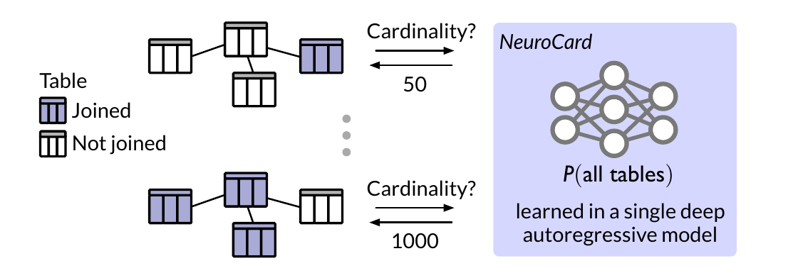
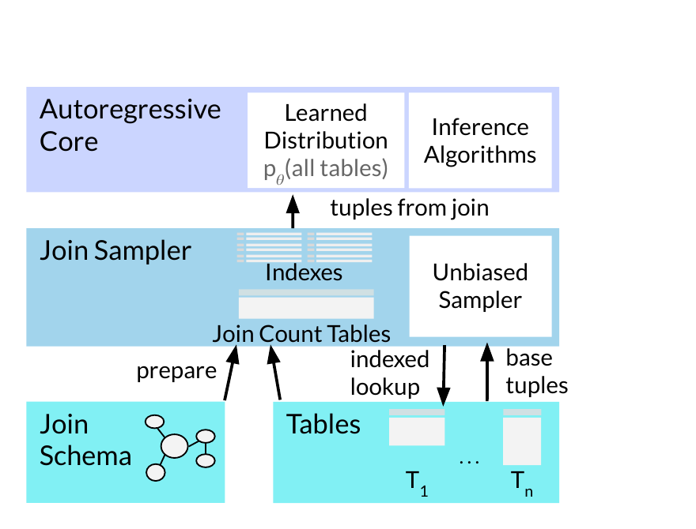
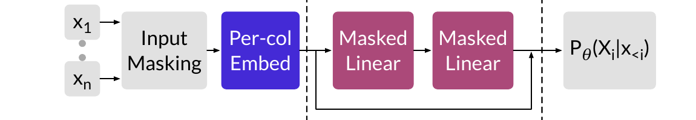
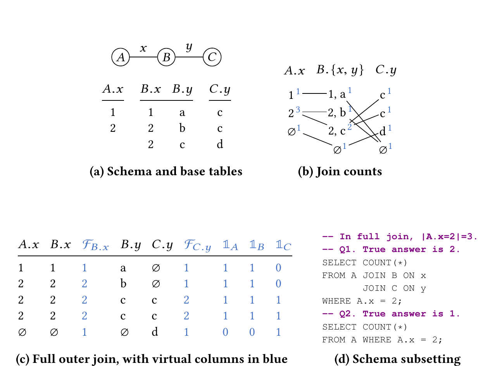
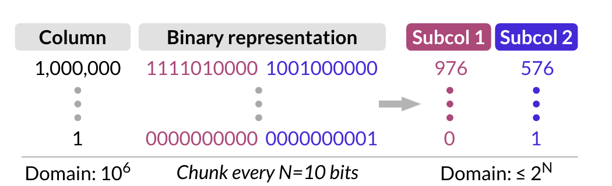
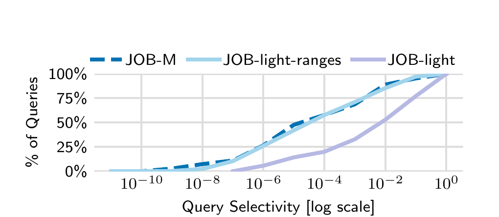
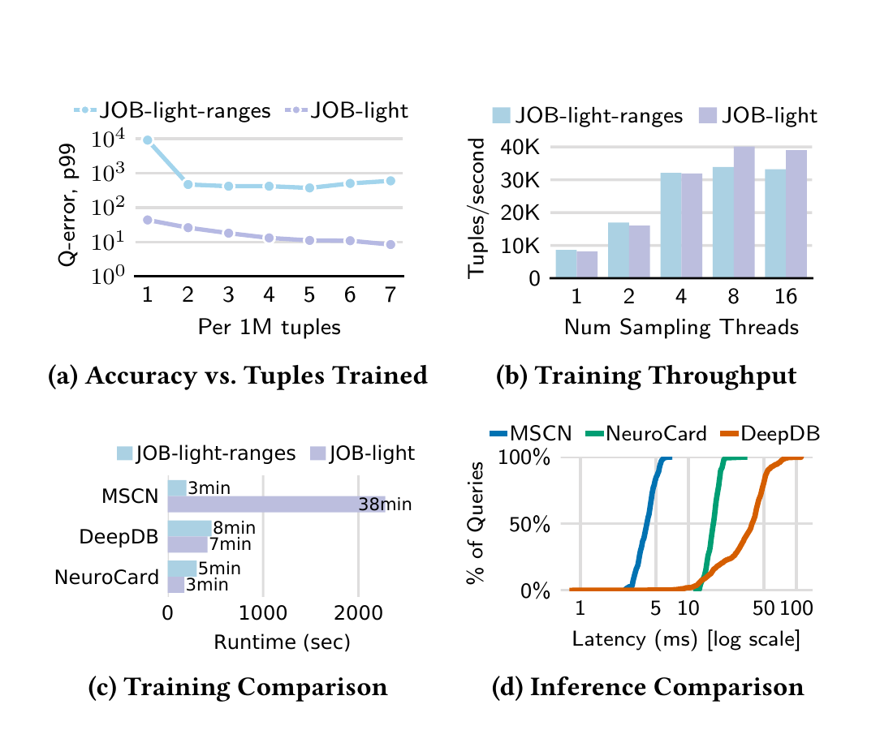
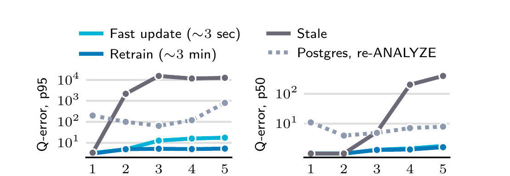

# NeuroCard: One Cardinality Estimator for All Tables（中文译文）

## 译者说明

本文依据同目录的 `source.pdf` 翻译。章节、图表、公式、算法、代码与参考文献按原文结构保留。

Zongheng Yang、Amog Kamsetty\*、Sifei Luan\*、Eric Liang、Yan Duan、Xi Chen、Ion Stoica

加州大学伯克利分校；Covariant

\* 同等贡献。

## 摘要

查询优化器依赖准确的基数估计来生成良好的执行计划。尽管这一领域已研究数十年，现有基数估计器面对复杂查询时仍不准确，原因在于它们采用了有损建模假设，且无法捕获表间相关性。我们表明：无需任何独立性假设，也可以学习数据库中所有表之间的相关性。我们提出 NeuroCard，一种连接基数估计器，它在整个数据库上构建单个神经密度估计器。借助连接采样和现代深度自回归模型，NeuroCard 在概率建模中既不假设表间独立，也不假设列间独立。NeuroCard 的精度比此前最佳方法高出数个数量级（在 JOB-light 上把最大误差推进到新的最先进水平 8.5×），可扩展到数十张表，同时空间占用紧凑（数 MB），构建或更新也很高效（数秒到数分钟）。

## PVLDB 引用格式

Zongheng Yang, Amog Kamsetty, Sifei Luan, Eric Liang, Yan Duan, Xi Chen, and Ion Stoica. NeuroCard: One Cardinality Estimator for All Tables. *PVLDB*, 14(1): 61–73, 2021. https://doi.org/10.14778/3421424.3421432

## PVLDB 工件可用性

源代码、数据和/或其他工件已发布于 https://github.com/neurocard。

## 1. 引言

查询优化器把查询转换为估计性能最佳的可执行计划。它不仅对关系数据库至关重要，对 Spark [1]、Presto [36] 等现代分析引擎同样如此。在各种技术中，基数估计对生成高质量查询计划的作用往往比代价模型或计划搜索空间更大 [19]。遗憾的是，基数估计是出了名的难题；随着查询复杂度（例如连接数）增加，其准确率可能呈指数下降 [21]。

基数估计大体有两条路线：查询驱动和数据驱动。查询驱动估计器通常借助监督学习，学习从特征化查询到预测基数的函数。它们隐含假设生产工作负载中的查询与训练查询“相似”，也就是训练查询和测试查询来自同一底层分布。当用户发出意料之外类型的查询时，这一假设便可能失效。

相比之下，数据驱动估计器不在“有代表性”的查询上训练，而是近似一张表的数据分布——即把每个元组映射到它在表中出现概率的函数。直方图就是近似数据分布的简单方法。理论上，只要估计出模式中每张表的分布，就能估计任意查询的输出基数。该方法虽更通用，却受两个缺点制约：（1）有损建模假设，例如假设各表分布彼此独立；（2）精度低，例如直方图桶数有限。幸运的是，近期机器学习进展同时缓解了这两个问题。与以往密度估计器不同，深度自回归（autoregressive，AR）模型 [4, 6, 32, 33, 42] 无需独立性假设即可学习复杂的高维数据分布，在精度和表达能力上都达到最先进水平，由此催生了基于深度 AR 模型的新型数据驱动基数估计器 [48]。

然而，深度自回归模型虽然前景可观，基于它的基数估计器仍仅限于处理单表。以下三个挑战使这条路线难以直接用于连接：

- **训练成本高。** 要学习连接分布，任何数据驱动估计器都必须看到连接结果中的真实元组。除最小规模外，预计算连接代价高昂，有时甚至不可行。
- **缺乏通用性。** AR 方法会为它要估计的每一种连接，例如 $T=T_1\bowtie T_2\bowtie T_3$，建立一个概率模型。但 $T$ 的模型不能直接用于估计 $T$ 的子集连接，例如 $T_2\bowtie\sigma(T_3)$。当然，可以为每一种可能连接都训练模型；然而可能连接的数量随表数指数增长，开销难以承受。
- **模型体积大。** 学得的 AR 模型复杂度随数据集基数增长。连接往往涉及高基数列，因此在连接上建立的 AR 模型可能大到无法接受。

我们提出 NeuroCard，一种直接从数据学习、用来克服上述挑战的学习型连接基数估计器。NeuroCard 的独特之处，是能在单个深度 AR 模型中捕获跨多个连接的相关性，且不作任何独立性假设（图 1）。训练完成后，无论查询涉及表集合中的哪个子集，该模型都能处理模式上可发出的全部查询。我们用以下关键技术解决上述挑战。

**图 1：** NeuroCard 使用单个概率模型学习数据库中所有表之间可能存在的全部相关性，从而估计涉及任意表子集的连接查询。

为降低训练成本，NeuroCard 不完整计算连接，而是从连接中采样（§4）。这类样本的关键性质是能够反映连接分布：如果某个键在连接结果中出现得更频繁，它也应在样本中更频繁。为满足这一要求，我们预计算每个键正确的采样权重。完整计算连接的最坏情况成本随表数指数增长，而用动态规划计算采样权重的时间只随数据量线性增长。

为获得通用性，NeuroCard 必须训练一个模型来回答任意表子集上的查询（§6）。基本思路是，让 AR 模型在所有表的全外连接样本上训练。全连接包含所有基表中的值，因而具备回答涉及任意表子集查询所需的充分信息。推断时，如果模式中的某张表没有出现在连接查询中，就必须处理潜在的扇出效应。设 AR 模型在全连接 $T=T_1\bowtie T_2$ 的样本上训练，现在要估计查询 $\sigma(T_1)$ 的基数。若 $T_2$ 的连接键是 $T_1$ 的外键， $T_1$ 中一个元组可能在 $T$ 中出现多次。NeuroCard 学习这些“重复”元组的概率和额外记账信息，据此校正扇出。

最后，为扩展到高基数列并避免模型体积失控，NeuroCard 使用无损列分解（lossless column factorization，§5）。AR 模型会为每个不同值存储一个嵌入向量，因此面对不同值数量达到数十万乃至更多的列，模型体积会迅速膨胀。分解把一列拆成若干子列，每个子列对应原始列值二进制表示中的一段比特。例如，32 位 ID 列 `id` 可分解成 $(id_0,\ldots,id_3)$，第一子列对应最前面的 8 位，依此类推。随后，AR 模型在这些较低基数的子列上训练，而不是直接在完整列上训练。

将这些技术结合后，NeuroCard 达到了最先进的估计精度，包括具有挑战性的尾部误差分位数。在常用 JOB-light 基准上，模式包含 6 张表和基础过滤条件，NeuroCard 仅用 4 MB 便把最大 Q-error 降到 8.5×，相对此前最先进结果提高 4.6×。我们还创建了更困难的 JOB-light-ranges 基准，加入更多内容列和范围过滤；NeuroCard 在该基准上比包括 DeepDB [12]、MSCN [15] 和 IBJS [20] 在内的既有方案精确 15–34×。最后，为检验 NeuroCard 处理更复杂连接模式的能力，我们创建了包含 16 张表及多键连接的 JOB-M。NeuroCard 能良好扩展到该基准，在保持较小模型（27 MB 覆盖 16 张表）的同时，比传统方法精确 10×。

我们的贡献如下：

- 设计并实现 NeuroCard：首个无需任何独立性假设、能够跨模式中多个连接学习的数据驱动基数估计器。所有模式内表间相关性由单个自回归模型捕获，该模型可估计任意表子集上的任意查询。
- NeuroCard 无需实际计算连接，就能学习正确的连接分布；模型训练数据是从模式中所有表的连接上得到的均匀、独立样本。
- 提出无损列分解（§5），显著减小自回归模型体积，使它能够实用于高基数列。
- 相比此前最佳方法，NeuroCard 显著改进 JOB-light 上的最先进精度。我们还提出两个新基准 JOB-light-ranges 和 JOB-M，并表明它们更具挑战性，因而能更好地衡量估计器质量（§7）。

为推动后续研究，NeuroCard 及我们使用的基准已开源：https://github.com/neurocard。

## 2. NeuroCard 概览

考虑一组表 $T_1,\ldots,T_N$。我们把它们的连接模式定义为连接关系图：顶点是表，每条边连接两张可连接的表。一个查询对应整体模式的一个子图。如果查询多次连接同一张表，我们就在模式中复制该表。我们假设提交给估计器的模式与查询均为无环结构（§4.2 讨论如何放宽该限制），因此可把它们视为树。

下面把 NeuroCard 概括为一系列目标及相应解决方案。

### 2.1 目标与解决方案

**目标：单个估计器。** 我们希望为整个连接模式构建单个基数估计器。例如，假设模式中有三张表，估计器应能处理任意表子集上的连接，如 $\sigma(T_2)$、 $T_1\bowtie T_3$ 或 $T_1\bowtie T_2\bowtie\sigma(T_3)$。

单个估计器有两个关键优势：简单且准确。多个估计器各自覆盖某个连接模板（表子集）；由于可能的连接模板随表数指数增长，这种方案无法扩展到大量表。DBMS 也更容易把单个估计器投入运行。更重要的是，多个估计器会损害精度：若某个表子集上的查询没有被单个估计器覆盖，只能通过组合多个估计器来估计其基数，组合过程就需要某种独立性假设；假设不成立时，精度会下降。

**解决方案：** 构建单个基数估计器，学习模式中所有表的全外连接（下文简称“全连接”）分布。例如，对三表模式学习 $p(\mathrm{FullOuterJoin}(T_1,T_2,T_3))$。这里不能用内连接代替全连接，因为内连接 $T_1\bowtie T_2\bowtie T_3$ 是三张表的交集；若查询只使用 $T_1$ 或 $T_1\bowtie T_3$，它们的元组未必全部存在于该交集中，估计器便缺少回答查询的信息。

**目标：高效采样全连接。** 数据驱动估计器通过读取分布中的代表性元组来学习分布。直接做法是先计算全连接，再从结果中均匀随机抽样。然而，即便 JOB-light 这样只有 6 张表的小模式，全连接也包含两万亿（ $2\cdot10^{12}$）个元组，实际中无法计算。

**解决方案：** 不物化结果，直接在全连接上均匀采样。具体而言，要保证全连接多重集 $J$ 中任意元组都以相同概率 $1/|J|$ 被抽中。为此，我们采用先进的连接采样算法 [50]（§4）：先预计算连接计数表，把每张表的连接键映射到相对于全连接的正确采样权重，再按这些计数作为权重抽取键。给定抽中的键后，通过各表索引¹查找其余列并拼接成完整元组。这样只需物化连接计数，而不必物化全连接。利用动态规划，连接计数的计算时间随数据库大小线性增长，实际中很快，例如 JOB-light 的 6 张表耗时 13 秒，JOB-M 的 16 张表耗时 4 分钟。

¹ 与既有连接采样工作 [20, 22] 一样，我们假设基表为每个连接键建立了索引。这会影响设计效率，但不影响正确性。

**目标：支持任意表子集。** 虽然全外连接包含各表的全部信息，但查询只涉及部分表时仍需谨慎。考虑：

$$
T_1.id:[1,2],\quad T_2.id:[1,1]\quad\longrightarrow\quad
T_1\bowtie T_2:[(1,1),(1,1),(2,\mathrm{NULL})].
$$

查询 $\sigma _ {id=1}(T_1)$ 的正确选择率是 $1/2$（1 行），但在全连接分布中 $P(T_1.id=1)=2/3$（2 行），因为尚未校正缺失表 $T_2$ 产生的扇出。

**解决方案：处理模式子集化。** 若查询没有包含某张表，就按该表引入的扇出缩小估计。由于学习到的概率空间是全连接，当查询只涉及一个子集、并期望选择率相对于该子集计算时，必须进行恰当缩放。

**目标：准确的密度估计。** 最后一项要素是准确而紧凑的密度估计器。

**解决方案：** 使用深度自回归模型实现密度估计器。这类神经密度估计器已经成功用于图像 [33]、音频 [42] 和文本 [32] 等高维数据。近期 Naru [48] 用深度 AR 模型在不作独立性假设的情况下学习单表所有列的相关性，在单表查询基数估计上达到最先进精度。我们用 Naru 学习全连接分布，并针对我们的场景优化其构建与推断。

### 2.2 组合起来

**图 2：NeuroCard 总体架构。** 连接采样器（§4）利用无偏连接计数提供正确的训练数据（从连接抽取的元组）；样本元组以流方式送入自回归模型，进行最大似然训练（§3）；推断算法（§6）利用学得的分布估计查询基数。

图 2 展示了 NeuroCard 的高层架构。

构建估计器分两个阶段。第一，准备连接采样器：为连接键建立或加载已有单表索引，并针对指定连接模式计算连接计数表（§4）。第二，训练深度 AR 模型：不断向采样器请求一批元组，通常每批 2K 个。采样器在后台满足请求，并可使用多个采样线程。

估计器构建完成后，即可为查询计算基数估计。对每个查询，我们用概率推断算法（§6）计算基数：（1）在学得的 AR 模型上执行蒙特卡洛积分；（2）处理模式子集化。单个估计器能够处理任意表子集上的连接以及任意范围选择条件。

## 3. 构建 NeuroCard

本节介绍实现 NeuroCard 所用技术的背景。

### 3.1 表的概率建模

考虑列域为 $\lbrace{}A_1,\ldots,A_n\rbrace{}$ 的表 $T$。该表诱导一个离散联合数据分布，即每个元组的出现概率（ $f(\cdot)$ 表示出现次数）：

$$
p(a_1,\ldots,a_n)=\frac{f(a_1,\ldots,a_n)}{|T|}.
$$

这个 $n$ 维联合分布 $p(\cdot)$ 可用于计算查询基数。把查询 $Q$ 定义为 $\sigma:A_1\times\cdots\times A_n\to\lbrace{}0,1\rbrace{}$，则满足查询的记录比例（选择率）可写成概率：

$$
P(Q)=\sum _ {a_1\in A_1}\cdots\sum _ {a_n\in A_n}
\sigma(a_1,\ldots,a_n)\thinspace{}p(a_1,\ldots,a_n).
$$

再乘行数即可得到基数： $|Q|=P(Q)\cdot|T|$。

数据驱动基数估计器可沿两个维度分类：（1）联合分解方式；（2）所用密度估计器。

**联合分解。** 联合分解也就是建模假设，它决定如何分解数据分布 $p$。任何建模假设都有可能丢失列间相关性信息，最终造成精度损失。例如，常用的一维直方图假设各列独立，把 $p$ 分解为一组一维边缘分布： $p\approx\prod _ {i=1}^{n}p(A_i)$。列值高度相关时，这会造成巨大误差。类似地，图模型等其他数据驱动基数估计器 [3, 7, 8, 40, 41] 也会假设列间条件独立或部分独立。一个例外是自回归（乘积规则）分解：

$$
p=\prod _ {i=1}^{n}p(A_i\mid A _ {\lt{}i}), \tag{1}
$$

它把整体联合分布精确表示为 $n$ 个条件分布之积。

**密度估计器。** 密度估计器决定上述因子实际被近似得多精确。最准确的“估计器”是把这些因子原样记录在哈希表中，但构建和推断成本会极其庞大，例如 $p(A_n\mid A _ {1:n-1})$。另一端的一维直方图成本很低，却因无法区分同一桶中的值而精度有限。多年来，研究者提出了核密度估计器、贝叶斯网络等大量方案。近期，深度 AR 模型 [4, 32, 33] 已成为首选的密度估计器。它不显式物化条件分布，而是在紧凑神经网络中学习 $\lbrace{}p(A_i\mid A _ {\lt{}i})\rbrace{}$。深度 AR 模型精度达到最先进水平，并首次为自回归分解提供了可处理的实现方案。

### 3.2 Naru：以深度自回归模型作为基数估计器

NeuroCard 建立在 Naru 之上。Naru 是一种最先进的基数估计器，使用深度 AR 模型完整捕获单表所有列之间的相关性。下面概述 Naru 及 NeuroCard 对它的使用方式。

**构建。** 给定表 $T$，AR 模型 $\theta$ 以元组 $x\in T$ 为输入，预测条件概率分布 $\lbrace{}p _ \theta(X_i\mid x _ {\lt{}i})\rbrace{}$；其中每一项都是第 $i$ 列上的一维分布，条件为 $x$ 的全部先前列值。输入元组的似然预测为

$$
p _ \theta(x)=\prod _ {i=1}^{n}p _ \theta(X_i=x_i\mid x _ {\lt{}i}).
$$

ResMADE [4]、Transformer [43] 等任意深度 AR 架构都能实例化该框架。训练通过最小化 KL 散度 $D _ {KL}(p\Vert p _ \theta)$，使 $p _ \theta$ 逼近数据分布 $p$。具体做法是最大似然估计（MLE），用梯度上升最大化数据的预测对数似然：

$$
\text{独立同分布采样 }x\sim p, \tag{2}
$$

$$
\text{执行梯度更新以最大化 }\log p _ \theta(x). \tag{3}
$$

在我们的场景中， $T$ 被定义为一个模式内所有表的全外连接，因此深度 AR 模型会学习跨所有表的相关性。接下来必须按照 $p$ 规定的概率抽取元组，否则 $p _ \theta$ 会逼近错误的、有偏分布。为此，我们使用能够从全连接 $T$ 产生简单随机样本的采样器（§4）。

**估计查询基数。** 构建完成后，Naru 可估计给定查询的基数。查询表示成超矩形：域为 $A_i$ 的每列 $X_i$ 被限制在有效区域 $R_i\subseteq A_i$ 中：

$$
\text{Query:}\qquad \bigwedge_i\lbrace{}X_i\in R_i\rbrace{}. \tag{4}
$$

随后，Naru 使用蒙特卡洛积分算法“渐进采样”（progressive sampling）估计查询事件的概率：

$$
\mathrm{ProgressiveSampling}(\lbrace{}X_i\in R_i\rbrace{})
=p _ \theta\negthinspace{}\left(\bigwedge_i\lbrace{}X_i\in R_i\rbrace{}\right)\cdot|T|. \tag{5}
$$

该算法从模型学得的分布中逐维抽取位于查询区域内的虚拟元组：先抽 $x_1\sim p _ \theta(X_1\mid X_1\in R_1)$，再抽 $x_2\sim p _ \theta(X_2\mid X_2\in R_2;x_1)$，依此类推，并对样本似然进行重要性加权。它还可高效支持省略列，即形如 $X_i\in \ast$ 的通配条件。

NeuroCard 在推断时调用渐进采样估计基数，但做了两项扩展。第一，应用列分解优化（§5）；它可能根据从 $X_i$ 抽到的值改变 $X _ {i+1}$ 的有效区域 $R _ {i+1}$。第二，加入模式子集化支持（§6），按相应扇出缩小 $p _ \theta(\bigwedge_i\lbrace{}X_i\in R_i\rbrace{})$。

### 3.3 连接问题形式化

一个连接模式诱导模式中所有表的全外连接 $T=\mathrm{FullOuterJoin}(T_1,\ldots,T_N)$。我们的目标是在该全连接的全部列上建立完全自回归概率模型：

$$
\text{Model:}\quad p _ \theta(T)\equiv
p _ \theta(T_1.col_1,T_1.col_2,\ldots,T_N.col_k). \tag{6}
$$

随后即可用该概率模型估计模式中任意表子集上的连接查询基数。

**支持的连接。** NeuroCard 支持无环连接模式，以及包含多路、多键等值连接的查询；§4.2 讨论如何放宽无环要求。模式应覆盖最常见的连接。对模式中没有记录的连接，可以先用 NeuroCard 得到单表估计，再用传统启发式规则 [21] 合并；这样仍可在同一框架内处理不常见情形，但精度会降低。

**支持的过滤。** NeuroCard 支持离散列或数值列上的等值与范围过滤，包括算术比较运算符 `<`、`>`、`≤`、`≥`、`=` 和 `IN`。更复杂的过滤也可用上一节的有效区域编码表达；任意形式的 AND/OR 可通过容斥原理处理。

### 3.4 模型架构

**图 3：自回归模型的默认架构。**

NeuroCard 使用标准 AR 架构 ResMADE [4]，Naru 也采用这一架构，见图 3。输入元组先表示为离散、字典编码的 ID $(x_1,\ldots,x_n)$，再由逐列嵌入矩阵编码。拼接后的嵌入向量送入一系列残差块，每个残差块包含两个掩码线性层；掩码用于保证自回归性质。输出层把最后一层输出与嵌入矩阵做点积，得到 logits $\lbrace{}\log p _ \theta(X_i\mid x _ {\lt{}i})\rbrace{}$，再在 logits 上计算交叉熵损失并反向传播。我们启用 Naru 的通配跳过优化：训练时随机掩码输入，训练特殊的边缘化 token，以帮助推断时跳过查询中的通配列。

ResMADE 之类的掩码多层感知机在效率和精度之间取得良好平衡。如有需要，NeuroCard 也能使用任意更先进的 AR 架构。§7 还给出采用 Transformer [43] 的 NeuroCard 实例。

## 4. 从连接中采样

NeuroCard 的关键挑战之一，是计算全连接的无偏样本（§2.1），使学得的分布忠实逼近全连接分布。也就是说，全连接多重集 $J$ 中每个元组都必须以 $1/|J|$ 的相同概率被抽中，而且样本必须像公式 (2) 要求的那样独立同分布。NeuroCard 使用有放回简单随机采样器，满足这两个要求。

### 4.1 算法

全连接中的元组包含连接键列和内容列，采样器利用了这一分解。第一步预计算连接计数表，即逐表统计信息，它反映连接键在全连接中的出现次数。随后，采样器逐表按与连接计数成比例的出现概率抽取连接键，最后通过在基表中查找抽到的连接键来选取内容列。一批完整样本生成后送往模型训练，过程按需重复。

**计算连接计数。** Zhao 等人 [50] 提供了适用于一般多键连接、可高效生成简单随机样本的算法框架。NeuroCard 实现其中的 Exact Weight 算法，并将它适配到全外连接。

为便于说明，考虑由表 $T_1,\ldots,T_N$ 组成的树状连接模式，并暂时假定只有连接键；内容列稍后收集。令 $T_1$ 为根表。元组 $t\in T_i$ 的连接计数，是 $T_i$ 所有后代表的全外连接中能与 $t$ 连接的元组总数，递归定义为：

$$
w_i(t)=
\prod _ {T_j\in\mathrm{Children}(T_i)}
\left(\sum _ {t'\in t\rtimes T_j}w_j(t')\right),
\qquad \forall i,\ \forall t\in T_i. \tag{7}
$$

其中 $t\rtimes T_j$ 表示 $T_j$ 中能与 $t$ 连接的全部元组。没有后代的叶表满足 $w_i(\cdot)=1$。在根表 $T_1$ 上， $w_1(t)$ 表示 $t\in T_1$ 在整个全外连接中的出现次数。每张表的连接计数通过聚合所有子表的连接计数自底向上计算。动态规划使时间复杂度随各表元组总数线性增长，即 $O(|T_1|+\cdots+|T_N|)$。

**采样。** 连接计数计算完毕后，采样器自顶向下遍历连接树来产生样本。它先按权重 $\lbrace{}w_1(t):t\in T_1\rbrace{}$ 从根表 $T_1$ 抽取 $t_1$，概率为 $w_1(t)/\sum _ {t'\in T_1}w_1(t')$；随后按广度优先顺序访问 $T_1$ 的全部后代。到达子表 $T_2$ 时，从 $t_1\rtimes T_2$ 中按权重 $\lbrace{}w_2(t):t\in t_1\rtimes T_2\rbrace{}$ 抽取 $t_2$。递归继续，直到访问全部表，最终产生样本 $(t_1,\ldots,t_N)$，其中每个 $t_i$ 是相应表中的连接键元组。

**图 4：端到端示例。**（a）三表连接模式及连接键列，省略内容列；（b）蓝色连接计数通过动态规划在线性时间内计算，并使全外连接能够被均匀采样，边连接可连接的表；（c）学习目标是模式的全外连接，蓝色为虚拟列。 $F$ 表示扇出，即某连接键值在相应基表中出现的次数；图中给出 $B.x$ 与 $C.y$ 的扇出， $A.x$ 与 $B.y$ 的扇出均为 1，故省略。每个指示器 $1_T$ 表示某元组在表 $T$ 中是否有匹配；（d）模式子集化示例，即只涉及全连接一部分表的查询（§6）。

**示例。** 考虑图 4a 的模式，图 4b 给出连接计数。叶表 $C$ 中每个元组计数均为 1。 $B$ 中的 $(2,c)$ 可连接 $C$ 中两个元组，因此连接计数为 $2=1+1$。类似传播使 $A.x=2$ 的计数变为 $3=1+2$。物理实现中，连接计数按连接键建立索引，例如 $C$ 只保存一个映射 $c\mapsto1$。采样时若先抽到 $A.x=2$，它在 $B$ 中有两个权重分别为 1 和 2 的匹配项，因此第二个匹配 $(2,c)$ 的入选概率为 $2/3$。

**NULL 处理。** 为支持全外连接，我们对 NULL 键作如下处理：给每张表 $T_i$ 加一个表示 NULL 的虚拟元组 $\bot$，并让它连接每个在 $T_i$ 中没有匹配的普通元组 $t\in T_j$，其中 $T_j\in\mathrm{Children}(T_i)$。同理， $\mathrm{Parent}(T_i)$ 中在 $T_i$ 没有匹配的普通元组 $t$ 与 $T_i$ 的 $\bot$ 连接。全 NULL 组合无效。传播过程与前面相同；图 4b 给出了示例。

**构造完整样本元组。** 在前例中，假设抽到 $\langle2;2,c;c\rangle$。我们查找 $A.x=2$ 收集 $A$ 的内容列，类似地查找 $(B.x,B.y)=(2,c)$² 与 $C.y=c$。存在多个匹配时，均匀随机选一行。三部分拼接后就是全连接中的一个样本元组。

² 可以分别查找两列索引的匹配列表并取交集；若有复合索引，则只需查找一次。

**计算全连接大小（归一化常数）。** §3.2 指出，把选择率转成基数需要行数 $|J|$。连接计数可精确给出它： $|J|=\sum _ {t\in T_1}w_1(t)$。

**并行采样。** 采样过程高度可并行：连接计数表 $\lbrace{}w_i(\cdot)\rbrace{}$ 生成后，可启动并行线程读取计数并生成样本。连接计数表本身的计算也可并行，且只需执行一次。由于样本独立同分布，并行不会破坏采样正确性。

### 4.2 与其他采样器比较

我们要求从全连接取得均匀且独立的样本，这使许多相关采样算法不适用。两项性质缺一都会使采样分布有偏，进而损害 AR 模型质量。例如，基于索引的连接采样 IBJS [20] 既不均匀也不独立；Wander Join [22] 产生独立但不均匀的样本。二者都能给出计数或其他聚合统计量的无偏估计，却不是为返回均匀连接样本而设计。蓄水池采样不放回，因而样本不独立，而且需要完整扫描全连接，无法扩展。NeuroCard 实现的 Exact Weight 是 Zhao 等人 [50] 所研究的最高效算法之一。该工作还给出支持一般连接、包括潜在循环连接的扩展，例如可打断一个环；NeuroCard 可借此放宽 §3.3 的问题设定。

## 5. 无损列分解

自回归模型用于高基数数据时，关键难题是模型参数量可能随列中不同值数量线性增长。在我们的模型架构中（§3.4），任何数据类型的列都先通过字典编码变为整数 token ID，再逐列应用嵌入层。列 $C$ 的可训练嵌入矩阵本质上是哈希表，其大小随域中不同值数 $|C|$ 线性增长。即便一列只有 $10^6$ 个不同值，使用 32 维嵌入也很容易占用 128 MB。

为高效处理高基数列，我们提出无损列分解。这一优化受现代自然语言处理中“子词单元” [35] 的启发，也与索引文献中的“位切片” [28] 有相似之处。不同于子词单元，列分解不使用字节对编码等统计算法来决定子词；不同于位切片，我们把一个值切成若干组比特，再把每组转回十进制整数。

**图 5：无损列分解（§5）。**

图 5 给出简单示例。假设任意类型的一列域大小为 $|C|=10^6$，直接支持该列需分配 $|C|\cdot h$ 个浮点数作为嵌入矩阵，其中 $h$ 是嵌入维数。NeuroCard 改为在训练时即时分解每个值：把原空间的值转换成二进制表示，再每 $N$ 位切一段； $N$ 是“分解位数”超参数。每一段转回十进制整数，形成子列；随后 AR 模型像处理普通列一样学习这些子列。每个子列只需至多 $2^N\cdot h$ 个浮点数的嵌入矩阵。在图中示例里，空间可从 128 MB 降到 250 KB，缩小超过 500×。

**模型大小与统计效率。** 分解位数 $N$ 控制模型大小和统计效率之间的权衡。减小 $N$ 会得到更多子列，每列域更小，但学习更多变量之间的关系也更困难。理论上，自回归建模使这种转换不丢失信息，因此不会降低学得分布的精度。实践中，我们观察到较低分解位数，即切成更多子列，通常略逊于较高位数，但差距不大（§7.5）。因此，我们根据空间预算设置 $N$。

**无损 = 分解 + 自回归建模。** 分解把一列拆成多个子列，再送入下游密度估计器。若密度估计器作独立性假设，例如一维直方图，那么整个过程仍是有损的。直方图用 $p(subcol_1,subcol_2)\approx p(subcol_1)p(subcol_2)$ 建模，无法捕获两个子列之间的相关性。换言之，其他估计器也能读取子列并节省空间，但其固有质量和假设决定了能学到多少子列信息及其与其他列的相关性。NeuroCard 使用自回归建模，强制模型显式捕获这种相关性（忽略其他列）：

$$
p(col)\equiv p(subcol_1,subcol_2)
=p(subcol_1)p(subcol_2\mid subcol_1),
$$

本身没有信息损失。因此，我们把分解与自回归建模的独特组合称为“无损”。

**子列上的过滤。** 概率推断时，原始列上的过滤必须翻译成子列上的等价过滤。§3.2 的推断过程会抽取位于查询区域内的样本；我们修改它，使每个子列过滤都遵循原谓词语义。回到图 5，考虑过滤 `col < 1,000,000`。高位子列 $subcol_1$ 的过滤放宽为 `≤ 976`。推断过程在此范围内抽取 $subcol_1$；若抽到 976，低位子列 $subcol_2$ 的过滤设为 `< 576`；否则高位已经满足原过滤，低位子列放置通配符。这类似于在位切片索引上处理范围谓词 [28]，NeuroCard 则把这套逻辑用于自回归模型的概率推断。

## 6. 查询 NeuroCard

构建完成后，自回归模型概括了整个全外连接。用该概率模型估计选择率的难点是：查询可能把所触及的空间限制在全连接的一部分，我们称之为“模式子集化”。模型返回的选择率默认以全连接为概率空间，而非查询特定的受限空间，因此概率推断时必须恰当缩小估计。

NeuroCard 的推断算法组合了两个基础模块。第一，Naru [48] 提出的渐进采样是一种在自回归模型上积分、得到选择率估计的蒙特卡洛算法；我们在训练好的 AR 模型上调用它，并作本节所述修改。第二，Hilprecht 等人 [12] 提出了查询在全外连接上训练的和积网络的推断算法。下面重述这些算法，并说明如何适配到新型概率模型，从而把它们推广到 NeuroCard。

**基本情形：不省略任何表。** 最简单的模式子集化，是涉及全部表的内连接查询。考虑图 4a 的数据和图 4d 中的查询 $Q_1$： $\sigma _ {A.x=2}(A\bowtie_x B\bowtie_y C)$。该查询把概率空间从全连接限制为内连接。若直接向模型查询 $|A.x=2|$，会得到 $|J|\cdot(3/5)=3$ 行，因为全连接 $J$ 的 5 行中有 3 行满足过滤。然而正确答案是 2 行：内连接中有两行，且都通过过滤。左、右外连接也可能出现这一问题。

Hilprecht 等人给出的修正方法，是为全连接中的每张表增加一个指示器列。每张表 $T$ 对应二值列 $1_T$：若全连接中的元组在表 $T$ 中有非空连接伙伴则取 1，否则取 0。

NeuroCard 的采用方式如下。训练时，采样器即时把虚拟指示器列附加到样本元组。每个样本元组都由连接键索引查找基表形成：若表 $T$ 含有该连接键，则把样本的 $1_T$ 设为 1，否则设为 0（见图 4c）。AR 模型把这些指示器当作普通列学习。

推断时，NeuroCard 根据查询中出现的表，为指示器列加入等值约束。渐进采样例程除通常的过滤条件 $\lbrace{}X_i\in R_i\rbrace{}$ 外，还对内连接查询图中每个表 $T$ 加入 $\lbrace{}1_T=1\rbrace{}$³。无省略表时，例程最终估计：

$$
P\negthinspace{}\left(\lbrace{}X_i\in R_i\rbrace{}\wedge\lbrace{}1_T=1:\text{ 对所有表 }T\rbrace{}\right). \tag{8}
$$

³ 左连接或右连接也可恰当地约束指示器列。

**示例。** 回到 $Q_1=\sigma _ {A.x=2}(A\bowtie_xB\bowtie_yC)$，我们在全连接下计算 $P(A.x=2\wedge1_A=1_B=1_C=1)$。由图 4c 可读出概率为 $2/5$，基数因而正确地算成 $5\cdot(2/5)=2$ 行。

**省略表与扇出缩放。** 更复杂的情形是查询省略了某些表。考虑图 4d 的 $Q_2=\sigma _ {A.x=2}(A)$。把范围限制在表 $A$ 后， $A.x=2$ 的行数是 1，与 $|J|\cdot P(A.x=2\wedge1_A=1)=3$ 不同，根本原因是全连接操作把基表元组扇出。为正确缩放，Hilprecht 等人提出记录逐连接扇出列；NeuroCard 对其方案作了适配⁴。

具体而言，对每个连接键列 $T.k$，我们向全连接插入虚拟扇出列 $F _ {T.k}$，其值定义为每个值在 $T.k$ 中出现的次数。例如，2 在 $B.x$ 中出现两次，因此 $F _ {B.x}(2)=2$，见图 4a、4c。连接采样器在生成每批样本时即时附加扇出值。这一步搭载在索引查找路径上，只需查询每个查找结果列表的长度，开销可忽略。

⁴ 我们的定义与 Hilprecht 等人略有不同。该工作把每个扇出列绑定到一个主键—外键连接，存储某值在外键中的频次；我们把扇出绑定到每个连接键，不论它是不是主键/外键，并定义为该值在键列自身中的频次。这样去除了主键—外键假设，支持两侧连接键都可能有重复值的一般等值连接。

在推断侧，Hilprecht 等人表明，省略表时正确基数可通过扇出缩放计算：

$$
\begin{aligned}
\mathrm{Cardinality}(Q)
&=|J|\cdot P(\lbrace{}X_i\in R_i\rbrace{}\text{ 子集化到查询 }Q)\\
&=|J|\cdot\mathbb{E} _ {X\sim J}\left[
\frac{\mathbf{1} _ {\lbrace{}X_i\in R_i\rbrace{}}\cdot\prod _ {T\in Q}1_T}
{\prod _ {R\notin Q}F _ {R.key}}
\right].
\end{aligned}\tag{9}
$$

分子处理前述基本情形，分母则计算被省略表 $\lbrace{}R\notin Q\rbrace{}$ 对查询 $Q$ 中各元组造成的总扇出。对每个省略表 $R$，算法找到模式中将它连到 $Q$ 的唯一连接键 $R.key$，并查找相应扇出 $F _ {R.key}$。由于扇出列也由模型学习，我们修改渐进采样：每个渐进样本为相关的 $F _ {R.key}$ 抽取一个具体值，计算这些扇出之积，再用该乘积除以样本的估计似然。

**示例。** 回到 $Q_2=\sigma _ {A.x=2}(A)$，约束是 $\lbrace{}A.x=2,1_A=1\rbrace{}$。图 4c 中有三行满足约束，需要缩放的键为 $B.x$ 和 $C.y$。期望展开为 $\frac15(\frac{1}{2\cdot1}+\frac{1}{2\cdot2}+\frac{1}{2\cdot2})=\frac15$；乘以 $|J|=5$，得到正确基数 1 行。

**多键连接的扇出缩放。** 我们形式化支持多键连接，例如图 4a 中 $A.x=B.x\wedge B.y=C.y$ 同时涉及 $x$、 $y$。难点在于确定要缩放的省略键集合。令 $V$ 为所有表的集合， $Q$ 为查询连接的表集合，补集 $O=V\setminus Q$ 为省略表。任取 $T\in Q$；由于连接模式是树（无环且连通），每个被省略表 $T_O\in O$ 到 $T$ 都有唯一路径。该路径上与 $T_O$ 相接的边所附连接键，就是表 $T_O$ 唯一要缩放的连接键。因此，公式 (9) 的扇出缩放因子定义明确。回到只查询 $A$ 的 $Q_2$，被省略表 $B$ 有两个连接键 $(B.x,B.y)$；由于 $B.x$ 位于路径 $A\leftrightarrow B$ 上，它是唯一扇出键。

**模式子集化总结。** NeuroCard 的概率推断结合了 Naru 的渐进采样和 Hilprecht 等人的附加列思想；我们把附加列称为虚拟列。连接采样器会在逻辑上向全连接插入两类虚拟列：指示器和扇出。二者都像普通列一样由密度模型学习，也都在渐进采样中用于处理各种模式子集化情形。

**自回归分解中的虚拟列顺序。** 自回归模型要求固定列序（§3.2）。Naru 表明，不同顺序可能影响尾部误差，但不会显著影响较低误差分位数。我们沿用 Naru 的做法，对内容列采用任意顺序；虚拟列全部放在内容列之后，且指示器在扇出之前。直觉是：（1）避免内容列条件分布被虚拟列的存在混淆；（2）把扇出放在最后，使其预测能利用尽可能多的先前信息。

早期基准中，这种次序优于把虚拟列放在前面。我们也试过在 AR 模型中进行多顺序训练 [6]，但没有看到明显改善。因此我们采用简单方案，把进一步优化留给未来工作。

## 7. 评估

我们从准确性和效率两方面评估 NeuroCard，并与最先进基数估计器比较。主要结论如下：

- NeuroCard 的准确性比此前最佳方法高 4–34×（§7.3）。在常用 JOB-light 基准上，4 MB 的 NeuroCard 最大误差仅 8.5×。
- NeuroCard 能良好扩展到更复杂的查询（§7.3）。在两个新基准中，JOB-light-ranges 使用更困难的范围过滤，JOB-M 的模式包含更多表；NeuroCard 都比既有方法精确数个数量级。
- NeuroCard 的构建和查询均很高效（§7.4）。几百万个训练元组、不到 5 分钟的学习时间，就足以达到同类最佳精度。
- 消融实验研究 NeuroCard 各组件的相对重要性（§7.5）；其中，跨所有表学习相关性和执行无偏连接采样影响最大。

### 7.1 实验设置

**工作负载（表 1）。** 我们采用真实世界 IMDB 数据集和模式测试基数估计精度。既有研究 [19, 21] 指出该数据集包含大量相关性，已把它确立为基数估计器的良好测试平台。我们测试以下 IMDB 查询工作负载：

- **JOB-light：** 被许多近期基数估计工作采用的 70 查询基准 [12, 15, 38]。模式有 6 张表：`title`（主表）、`cast_info`、`movie_companies`、`movie_info`、`movie_keyword`、`movie_info_idx`。这是典型星型模式，每张非主表都只通过 `title.id` 与 `title` 连接。全外连接包含 $2\cdot10^{12}$ 个元组。每个查询连接 2–5 张表，除 `title.production_year` 上的范围过滤外，其余过滤均为等值过滤。
- **JOB-light-ranges：** 我们从 JOB-light 派生出包含 1000 个查询的第二个基准，并增加过滤种类。1000 个查询均匀分配到 JOB-light 的 18 种连接图。对每张连接图，先用采样器从内连接结果抽一个元组，以该元组中的非 NULL 列值作为过滤字面量，再随机放置 3–6 个比较运算符：支持范围的列从 $\lbrace{}\le,\ge,=\rbrace{}$ 中抽取，否则使用等值过滤。这个生成器既遵循数据分布并保证结果非空，也比 JOB-light 包含更多种类、更多数量的过滤。一个三表查询示例为 $mc\bowtie\sigma _ {info\\_type\\_id=99}(mi\\_idx)\bowtie\sigma _ {episode\\_nr\le4\wedge phonetic\\_code\ge\text{'N612'}}(t)$，其中 $t.id$ 与其他表的 `movie_id` 连接。
- **JOB-M：** 最后一个基准包含 IMDB 中的 16 张表，并涉及多个连接键。例如，`movie_companies` 不仅通过 `movie_id` 与 `title` 连接，还通过 `company_id` 与 `company_name` 连接、通过 `company_type_id` 与 `company_type` 连接，等等。我们修改了 113 个 JOB 查询 [19]，使每张表在每个查询中至多出现一次，并删除逻辑析取，例如 $A.x=1\vee B.y=1$。每个查询连接 2–11 张表。JOB-M 的全连接比另外两个基准大 5×、维度也更多（表 1），用于检验 NeuroCard 的可扩展性。

这些基准发布于 https://github.com/neurocard。

**表 1：评估工作负载。** “表”是基表数；“行”“列”“最大域”分别是各模式全外连接的行数、列数和最大列域大小；“特征”概括查询特点。

| 工作负载 | 表 | 行 | 列 | 最大域 | 特征 |
| --- | ---: | ---: | ---: | ---: | --- |
| JOB-light | 6 | $2\cdot10^{12}$ | 8 | 235K | 单键连接 |
| JOB-light-ranges | 6 | $2\cdot10^{12}$ | 13 | 134K | + 复杂过滤 |
| JOB-M | 16 | $10^{13}$ | 16 | 2.7M | + 多键连接 |

**指标。** 我们报告各工作负载常用的 Q-error 分布。Q-error 表示估计基数偏离真实基数的倍数：

$$
Q\text{-error}(query):=\max\left(
\frac{card _ {actual}}{card _ {estimate}},
\frac{card _ {estimate}}{card _ {actual}}
\right).
$$

真实基数和估计基数都以 1 为下界，因此最小 Q-error 是 1×。既有工作 [48] 指出，降低高分位误差比降低均值或中位数更困难，所以我们报告 p100（最大值）、p99、p95 和中位数。计时实验在配有 NVIDIA V100 GPU 和 32 个 vCPU 的 AWS EC2 虚拟机上进行，报告延迟或吞吐量。

**图 6：查询选择率分布（§7.1）。**

**基准特征。** 图 6 绘制工作负载的选择率分布。每个查询的选择率定义为 $card _ {actual}/card _ {inner}$，其中分母是查询连接图的无过滤内连接行数。由于过滤更多样，JOB-light-ranges 与 JOB-M 的选择率跨度明显大于 JOB-light；中位选择率低 100× 以上，低尾部的最小选择率低 1000×。

### 7.2 对比方法

我们选择若干常见估计器家族，并尽量为每类选取最先进代表。§8 对所有家族及代表方法作更完整讨论。

**监督式查询驱动估计器。** 采用该家族近期代表 MSCN [15]。它接收特征化查询，在预物化的基表样本上运行查询过滤，把所得位图作为网络附加输入，最后预测基数。JOB-light 使用 MSCN 原论文团队公开的源码 [16] 提供的训练查询和样本位图。JOB-light-ranges 出现了新列，因此我们新生成 10K 个训练查询；生成并执行查询以取得真实基数标签耗时 3.2 小时。位图大小设为 2K，与该基准其他估计器体积相当。对于 JOB-light，我们还引用 Sun 和 Li [38] 取得的最佳结果 E2E；它是一个深度监督网络，使用比 MSCN 更有效的组件，例如池化和 LSTM。

**无监督数据驱动估计器。** 采用该家族近期技术 DeepDB [12]。它为相关性测试选出的每个表子集建立一个非神经和积网络 [29] 密度估计器，并在子集之间假设条件独立。NeuroCard 则用神经自回归模型，在模式全部表上构建一个学习型估计器。我们采用 DeepDB 推荐的两种配置：基础版最多学习两表连接；更大版本额外构建三表模型，分别对应其存储优化配置和标准配置。

DeepDB 源码 [13] 原本不支持分类字符串列上的范围查询。由于 JOB-light-ranges 包含此类查询，我们通过把字符串值字典编码成整数来重写数据和查询；报告结果已启用该优化。

**连接采样。** 实现基于索引的连接采样 IBJS [20]，最大样本量设为 10,000。查询基数通过从查询连接图取样、即时执行逐表过滤来估计。

**真实 DBMS。** 使用 PostgreSQL v12；它以一维直方图估计基数，并用启发式规则组合估计。

**其他基线。** 上述方法已在既有研究中与其他估计器比较。Naru [48] 表明，基于经典密度建模的方法——核密度估计、贝叶斯网络、MaxDiff 多维直方图——以及随机采样，都显著落后于深度自回归模型；DeepDB [12] 也表明它显著优于小波 [2]。因此我们不再比较这些方法。

**NeuroCard。** 我们在 Naru 源码 [27] 上实现 NeuroCard，默认使用 ResMADE。对复杂基准还使用 Transformer（§3.4），相应配置以 `-large` 为后缀。

### 7.3 估计准确性

#### 7.3.1 JOB-light

**表 2：JOB-light 估计误差。** 每列最低误差为最优结果。

| 估计器 | 大小 | 中位数 | p95 | p99 | 最大值 |
| --- | ---: | ---: | ---: | ---: | ---: |
| Postgres | 70 KB | 7.97 | 797 | $3\cdot10^3$ | $10^3$ |
| IBJS | – | 1.48 | $10^3$ | $10^3$ | $10^4$ |
| MSCN | 2.7 MB | 3.01 | 136 | $10^3$ | $10^3$ |
| E2E（引自 [38]） | N/A | 3.51 | 139 | 244 | 272 |
| DeepDB | 3.7 MB | 1.32 | 4.90 | 33.7 | 72.0 |
| DeepDB-large | 32 MB | 1.19 | 4.66 | 35.0 | 39.5 |
| NeuroCard | 3.8 MB | 1.57 | 5.91 | 8.48 | 8.51 |

表 2 给出 70 个 JOB-light 查询的结果。总体上，NeuroCard 在整个误差谱上都很准确，用 3.8 MB 参数把最大误差推进到新的最先进水平 8.5×。控制模型大小后，它比此前最佳方法提高超过 8×。

有几点值得注意。Postgres 的中位误差最高，说明近似分布与数据存在系统性失配，原因是它采用粗粒度密度模型（直方图）和启发式规则。IBJS 的中位误差较好，但尾部急剧恶化，因为在巨大联合空间里，实用规模的样本命中低密度查询的概率很小。MSCN 和 E2E 都是深度监督回归器，较早期方法明显改善，但二者的中位数与 p95 很接近，且与两个数据驱动估计器仍有明显差距。

NeuroCard 与 DeepDB 呈现有趣趋势。NeuroCard 在尾部（p99、最大值）好 4–8×，DeepDB 在较低分位略好。NeuroCard 尾部更稳健，原因有二：（1）密度模型明显更好——神经自回归模型优于使用列间独立假设的非神经和积网络；（2）它学习全部 6 张表所有列之间可能的相关性，而 DeepDB 在若干表子集之间假设条件独立。DeepDB-large 的体积大 8.4×，训练元组多 7.7×（54M），尾部仍落后 NeuroCard 4× 以上。NeuroCard 在较低分位，即真实密度较高的“简单”查询上略逊，可能源于 KL 散度最小化的众数覆盖行为 [9]。

#### 7.3.2 JOB-light-ranges

该基准含 1000 个查询，沿用 JOB-light 的连接模板，并在更多内容列上加入等值/范围过滤；JOB-light 只在一列上使用范围过滤。结果见表 3。

**表 3：JOB-light-ranges 估计误差。** 每列最低误差为最优结果。

| 估计器 | 大小 | 中位数 | p95 | p99 | 最大值 |
| --- | ---: | ---: | ---: | ---: | ---: |
| Postgres | 70 KB | 13.8 | $2\cdot10^3$ | $2\cdot10^4$ | $5\cdot10^6$ |
| IBJS | – | 10.1 | $4\cdot10^4$ | $10^6$ | $10^8$ |
| MSCN | 4.5 MB | 4.53 | 397 | $6\cdot10^3$ | $2\cdot10^4$ |
| DeepDB | 4.4 MB | 3.40 | 537 | $8\cdot10^3$ | $2\cdot10^5$ |
| DeepDB-large | 21 MB | 2.00 | 91.7 | $2\cdot10^3$ | $4\cdot10^4$ |
| NeuroCard | 4.1 MB | 1.87 | 57.1 | 375 | 8169 |
| NeuroCard-large | 21 MB | 1.40 | 35.1 | 232 | 1029 |

NeuroCard 在全部误差分位上都最准确，比此前最佳方法最多提高 15–34×。它也是唯一中位误差低于 2×、p99 保持三位数的估计器。总体上，各估计器都比 JOB-light 更不准确，但下降幅度不同。与 MSCN 相比，NeuroCard 在中位数、p95、p99、最大值上分别改善 2×、7×、15×、2×；与 DeepDB 相比分别改善 2×、9×、21×、23×。比较两个估计器的放大版本，改善分别为 1.4×、2.6×、9.6×、34×。由于既有方法无法捕获该基准所检验的更复杂列间相关性，NeuroCard 的优势明显扩大。

#### 7.3.3 JOB-M

该基准检验 NeuroCard 扩展到更大、更复杂连接模式的能力。与 JOB-light 只使用 `movie_id` 不同，JOB-M 包含 16 张表，每个查询通过多个连接键连接 2–11 张表。基线只保留 Postgres 和 IBJS：MSCN 的查询编码不支持该基准的复杂过滤；DeepDB 面对这个含高基数分类列的 16 表数据集会耗尽内存。

**表 4：JOB-M 估计误差。** 每列最低误差为最优结果。

| 估计器 | 大小 | 中位数 | p95 | p99 | 最大值 |
| --- | ---: | ---: | ---: | ---: | ---: |
| Postgres | 120 KB | 174 | $10^4$ | $8\cdot10^4$ | $10^5$ |
| IBJS | – | 61.1 | $3\cdot10^5$ | $4\cdot10^6$ | $4\cdot10^6$ |
| NeuroCard | 27.3 MB | 2.84 | 404 | 1327 | $2\cdot10^4$ |
| NeuroCard-large | 409 MB | 1.96 | 26.4 | 304 | 874 |

表 4 表明 NeuroCard 在复杂模式上仍保持较高精度。Postgres 误差很大，IBJS 也表现不佳，因为连接数增加后许多中间样本会变空。NeuroCard 克服了这一问题，在所有分位上都精确 10× 以上。空间方面，模型要在 16 张表的全外连接上训练，最大域超过 200 万；不作列分解的 NeuroCard 需要 900 MB。借助 §5 的列分解，模型缩至 27 MB，不到全部表总大小的 1%。NeuroCard-large 展示了放大模型时的可扩展性。

### 7.4 效率

确认 NeuroCard 精度最佳后，我们进一步研究其统计效率和物理效率。

**图 7：NeuroCard 的统计效率与物理效率。**（a）准确性与训练元组数；（b）训练吞吐量；（c）训练用时比较；（d）推断延迟比较。

**达到良好精度需要多少元组？** 图 7a 绘制 JOB-light 和 JOB-light-ranges 上的 p99 随训练元组数变化。约 2–3M 个元组足以使 NeuroCard 达到同类最佳精度（对比表 2、3）。更多样本仍有帮助，但收益逐渐递减。在 $10^{12}$ 个数据点的总体中只使用约 $10^7$ 个样本（仅 0.001%），许多查询必然触及从未见过的数据点；仍能达到高精度，说明 NeuroCard 泛化良好、统计效率很高。

**采样如何影响训练吞吐量？** 图 7b 绘制用于提供训练数据的采样线程数与每秒训练元组数。四个线程就足以让训练 GPU 饱和。线程更少时，设备等待训练数据的时间多于计算时间。峰值吞吐量约 40K 元组/秒，因此 NeuroCard 训练 3M 个元组约需 1.25 分钟。

**端到端训练时间比较。** 图 7c 比较表 2、3 所报告 MSCN、DeepDB、NeuroCard 配置的墙钟训练时间。MSCN 还需单独执行训练查询以收集真实基数；10K 查询耗时 3.2 小时，远长于图中仅列出的模型训练时间。DeepDB 在并行 CPU 上运行，效率很高。NeuroCard 计算连接计数表后开始训练和即时采样，两个数据集的计数计算均耗时 13 秒；并行采样与 GPU 加速使其构建高效。

**端到端推断时间比较。** 图 7d 绘制三种学习方法在 1000 个 JOB-light-ranges 查询上的延迟 CDF，仍使用准确性表中的基础配置。MSCN 与 NeuroCard 在 GPU 上运行，DeepDB 在 CPU 上运行；三者均用 Python 实现。MSCN 的轻量网络计算较少，因而最快。DeepDB 延迟跨度很大：复杂度较低的查询（连接和过滤较少）约 1 ms，最高复杂度查询约 100 ms。NeuroCard 延迟更可预测，中位数 17 ms、最小值 12 ms，因为神经自回归模型涉及更多浮点运算。工程优化，例如使用原生语言，都能加速这些方法；NeuroCard 还可通过模型压缩或权重量化降低计算成本。

### 7.5 剖析 NeuroCard

为理解各部分作用，我们在 JOB-light-ranges 上逐项改变 NeuroCard 的主要组件并测量精度。基础配置采用表 3 中较小的 NeuroCard，所有消融均一次只改变一个组件。结果见表 5。

**表 5：NeuroCard 消融实验。** 未列值与基础配置相同；报告 JOB-light-ranges 的 p50 与 p95。“采样器”（A）、“列分解位数”（B）、“自回归模型大小”（C）、“学得的表间相关性”（D）以及“是否使用自回归模型”（E）分别被改变。

| 配置 | 采样器 | 分解位数 | $d _ {ff};d _ {emb}$ | 学得的相关性 | p50 | p95 |
| --- | --- | ---: | --- | --- | ---: | ---: |
| Base（4.1 MB） | 无偏 | 14 | 128; 16 | 单个 AR 中的所有表 | 1.9 | 57.1 |
| (A) | 有偏 |  |  |  | 33 | 3270 |
| (B) |  | 10（2.2 MB） |  |  | 2.2 | 173 |
| (B) |  | 12（2.6 MB） |  |  | 2.0 | 168 |
| (B) |  | 无（12 MB） |  |  | 1.6 | 62.7 |
| (C) |  |  | 128; 64（23 MB） |  | 1.5 | 44.0 |
| (C) |  |  | 1024; 16（31 MB） |  | 1.7 | 64.0 |
| (D) |  |  |  | 每张表一个 AR | 40 | $9\cdot10^4$ |
| (E) | 无模型；仅均匀连接样本 |  |  |  | 4.0 | $2\cdot10^5$ |

在（A）中，使用适配到全连接的 IBJS 作为有偏采样器⁵，会显著降低学习型估计器精度。中位误差大幅增加，说明分布存在系统性失配。总体上，正确采样是第二重要的设计选择。

⁵ 将事实表 `title` 放在最前，并使用 $10^6$ 的大中间结果大小。

（B）组改变列分解粒度。位数越小，子列越多，精度略有下降；禁用分解占用空间最多，表现似乎最好。（C）组改变前馈线性层维数 $d _ {ff}$ 或嵌入维数 $d _ {emb}$。扩大嵌入明显比扩大线性层有效，可能因为优化过程中每个 token 的语义能得到更细致刻画。

（D）组改变 NeuroCard 学得的相关性。此前配置都在单个模型中学习全部表分布，捕获所有可能相关性；这里改为每张表建立一个与 Base 架构相同的模型，再用独立性假设组合跨表查询的估计。缺少表间相关性建模时，该变体精度最低。

（E）组完全去掉 AR 模型，只把均匀连接样本作为估计器：使用 §4 采样器，从每个查询的连接图抽取 $10^4$ 个数据库真实元组的简单随机样本。中位误差尚可，但尾部比自回归模型差 $10^4$×，因为许多查询没有命中任何样本。AR 模型能访问条件概率分布，这些条件分布支持高效的渐进采样概率推断；单独采样做不到这一点，因此 AR 模型的统计效率更高。

**调参指南。** （B）（C）表明 NeuroCard 对超参数不太敏感。对于新数据集，建议从 Base 配置开始，在空间预算范围内尽可能增大模型。推荐优先级依次为：分解位数、 $d _ {emb}$、 $d _ {ff}$ 和层数。训练元组数可由早停或时间预算决定；§7.4 建议从几百万到一千多万个开始。

### 7.6 更新策略

NeuroCard 可通过重新训练或追加梯度更新（即增量训练）处理新数据。为测试两种策略，我们模拟按时间顺序追加分区：表 `title` 按年份列范围分成 5 个分区。每个分区数对应整个数据库和全连接的不同快照，所以在不同分区数下运行同一组查询可得到 5 组真实基数。

比较三种策略；它们在首次摄入后都以 7M 个元组完整训练：（1）**陈旧（stale）**：只在第一个快照上训练一次，之后不更新；（2）**快速更新（fast update）**：每次新摄入后，以原样本数的 1%（70K）增量更新；（3）**重新训练（retrain）**：每次摄入后使用原样本数的 100%（7M）。图中也给出追加梯度步骤所需延迟。

**图 8：NeuroCard 的快速更新与慢速更新。** JOB-light；每种策略的 p95、p50 均取 10 次运行平均。Postgres 作为对照，每次摄入后都更新统计信息，耗时 1–2 秒。

结果见图 8。不更新时，陈旧 NeuroCard 的精度显著下降，这符合预期，因为每个分区都会加入大量新信息。快速更新可恢复大部分精度，且开销极小；即使完整重训也只需几分钟，并能取得最高精度。NeuroCard 的统计效率（达到相应精度所需元组数）和物理效率共同促成了这些非常实用的更新策略。

## 8. 相关工作

**无监督数据驱动基数估计器。** 这一家族近似数据分布，可追溯到 System R 使用的一维直方图 [34]。此后，所用密度模型质量持续提高。

**经典方法。** 多维直方图 [10, 25, 30, 31] 能捕获列间相关性，因而比一维直方图更精确。自 21 世纪初起，图模型开始用于单表或连接基数估计 [3, 8, 40]。这些密度模型通过假设条件独立或部分独立，在精度和效率之间折中；它们还需要昂贵的结构学习，即从数据集寻找最佳模型结构。

**和积网络。** SPN 是约十年前提出的树状密度估计器 [29]。每个叶节点是某个属性切片上的粗直方图，中间层用乘法或加法组合子节点信息。由于采用切片间独立等启发式假设，SPN 表达能力有限；存在任何深度的 SPN 都无法高效捕获的简单分布 [24]。DeepDB [12] 是近期采用 SPN 的基数估计器。

NeuroCard 与 DeepDB 有以下相似处：（S1）二者都采用学习多表全外连接的形式化；（S2）我们的“模式子集化”能力建立在 DeepDB 的查询算法之上。

二者也有以下差异：（D1）**现代密度模型。** NeuroCard 选择的深度自回归模型是通用函数逼近器，从根本上更有表达力；不同于 SPN，它不在建模中作独立性假设。（D2）**学得的相关性。** NeuroCard 主张尽可能捕获跨表相关性，学习模式全部表的全外连接。DeepDB 表达能力有限，因而为相关性测试选出的多个表子集分别训练 SPN，每个子集约含 1–3 张表，并在子集之间假设条件独立。（D3）**正确采样。** NeuroCard 识别出无偏地从连接数据分布采样这一关键要求；DeepDB 的连接元组则来自完整计算，或来自有偏分布的 IBJS。由于这些差异，NeuroCard 的精度最高可超过 DeepDB 34×（§7）。

**深度自回归模型。** 深度 AR 模型是密度估计领域的突破，也是机器学习领域当前最先进的密度模型 [4, 6, 32, 43]。它在神经网络中以可处理的方式学习复杂高维分布，捕获属性之间全部可能的相关性。AR 模型的独特之处，是能访问输入属性间的所有条件分布。单表基数估计器 Naru [48] 就采用深度 AR 模型；通过访问条件分布，Naru 提出在 AR 模型上积分的高效算法，以生成选择率估计。NeuroCard 建立在单表 Naru 之上，并克服支持连接所独有的挑战（§2）。

**监督式查询驱动基数估计器。** 利用历史查询或收集到的查询改善估计，可以追溯到 LEO [37]。这条路线近年来重新兴起，部分原因是查询日志更加丰富 [44]，或出现了更好的函数逼近器，例如把特征化查询映射到预测基数的神经网络 [15, 38]。也有工作探索借助查询反馈改进密度建模的混合方法，例如核密度估计 [11, 14] 和均匀分布混合 [49]。监督式估计器容易利用查询反馈、处理复杂谓词（如 UDF），通常也更轻量 [5]。NeuroCard 的估计精度优于该家族代表方法；由于不受分布外查询影响，它在根本上也更稳健。复杂谓词可在从 NeuroCard 学得分布中采样的元组上执行。

**连接采样。** 大量研究讨论了数据库中的基础问题——连接采样。NeuroCard 使用先进连接采样器，取得能够代表连接分布的训练元组。它采用 Zhao 等人 [50] 的线性时间 Exact Weight 算法；这是该研究中性能最高的采样器之一，恰好能提供 NeuroCard 要求的均匀、独立样本。NeuroCard 还能进一步利用该算法对循环连接模式的扩展。IBJS [20] 和 Wander Join [22] 虽能给出计数和聚合的无偏估计，却不提供均匀连接样本，因而不适合收集训练数据。实验还表明，在连接样本之上叠加现代密度模型很有价值。

**学习型数据库组件。** 近期大量工作把经典机器学习或现代深度学习用于各种数据库组件，例如索引 [17]、数据布局 [47] 和查询优化 [18, 23, 39]。NeuroCard 可被视作一个通用核心，能够服务于任何查询引擎，无论引擎本身是否学习化。由于它无需独立性假设即可建模表间和列间相关性，其用途还可能超越查询优化，扩展到数据插补 [45]、索引 [46] 等需要理解表和属性的任务。

## 9. 结论

NeuroCard 建立在一个简单思想上：无需任何独立性假设，学习数据库全部表之间的相关性。它把连接采样与深度自监督学习中的成熟技术用于基数估计这一查询优化基础问题。与经典数据驱动估计器一样，NeuroCard 从数据学习；不同之处在于，它用概率模型 $p _ \theta(\text{all tables})$ 捕获所有可能的表间相关性。据我们所知，NeuroCard 是首个能对十余张表作无假设概率建模的基数估计器。它使用单个紧凑且学习高效的逐模式模型，把连接基数估计精度推进到最先进水平，比既有方法高 4–34×。

## 致谢

我们感谢 Joe Hellerstein 富有成效的讨论与指导，也感谢 Michael Whittaker、Richard Liaw 和 Chenggang Wu 对我们的论文提出的深刻意见。

## 参考文献

[1] Michael Armburst, Reynold S. Xin, Cheng Lian, Yin Huai, Davies Liu, Joseph K. Bradley, Xiangrui Meng, Tomer Kaftan, Michael J. Franklin, Ali Ghodsi, and Matei Zaharia. 2015. Spark SQL: Relational Data Processing in Spark. In *Proceedings of the 2015 ACM SIGMOD International Conference on Management of Data* (Melbourne, Victoria, Australia) (SIGMOD '15). ACM, New York, NY, USA, 1383–1394.

[2] Kaushik Chakrabarti, Minos Garofalakis, Rajeev Rastogi, and Kyuseok Shim. 2001. Approximate query processing using wavelets. *The VLDB Journal* 10, 2–3 (2001), 199–223.

[3] Amol Deshpande, Minos Garofalakis, and Rajeev Rastogi. 2001. Independence is good: Dependency-based histogram synopses for high-dimensional data. *ACM SIGMOD Record* 30, 2 (2001), 199–210.

[4] Conor Durkan and Charlie Nash. 2019. Autoregressive Energy Machines. In *Proceedings of the 36th International Conference on Machine Learning* (Proceedings of Machine Learning Research), Kamalika Chaudhuri and Ruslan Salakhutdinov (Eds.), Vol. 97. PMLR, Long Beach, California, USA, 1735–1744.

[5] Anshuman Dutt, Chi Wang, Azade Nazi, Srikanth Kandula, Vivek Narasayya, and Surajit Chaudhuri. 2019. Selectivity estimation for range predicates using lightweight models. *Proceedings of the VLDB Endowment* 12, 9 (2019), 1044–1057.

[6] Mathieu Germain, Karol Gregor, Iain Murray, and Hugo Larochelle. 2015. MADE: Masked autoencoder for distribution estimation. In *International Conference on Machine Learning*, 881–889.

[7] Lise Getoor, Nir Friedman, Daphne Koller, and Benjamin Taskar. 2001. Learning probabilistic models of relational structure. In *ICML*, Vol. 1, 170–177.

[8] Lise Getoor, Benjamin Taskar, and Daphne Koller. 2001. Selectivity estimation using probabilistic models. In *ACM SIGMOD Record*, Vol. 30. ACM, 461–472.

[9] Ian Goodfellow, Yoshua Bengio, and Aaron Courville. 2016. *Deep learning*. MIT press.

[10] Dimitrios Gunopulos, George Kollios, Vassilis J. Tsotras, and Carlotta Domeniconi. 2005. Selectivity estimators for multidimensional range queries over real attributes. *The VLDB Journal* 14, 2 (2005), 137–154.

[11] Max Heimel, Martin Kiefer, and Volker Markl. 2015. Self-Tuning, GPU-Accelerated Kernel Density Models for Multidimensional Selectivity Estimation. In *Proceedings of the 2015 ACM SIGMOD International Conference on Management of Data* (SIGMOD '15). ACM, New York, NY, USA, 1477–1492.

[12] Benjamin Hilprecht, Andreas Schmidt, Moritz Kulessa, Alejandro Molina, Kristian Kersting, and Carsten Binnig. 2020. DeepDB: Learn from Data, not from Queries! *Proceedings of the VLDB Endowment* 13, 7 (2020), 992–1005.

[13] Hilprecht et al. 2020. Github repository, deepdb-public. github.com/DataManagementLab/deepdb-public. [Online; accessed April, 2020].

[14] Martin Kiefer, Max Heimel, Sebastian Breß, and Volker Markl. 2017. Estimating join selectivities using bandwidth-optimized kernel density models. *Proceedings of the VLDB Endowment* 10, 13 (2017), 2085–2096.

[15] Andreas Kipf, Thomas Kipf, Bernhard Radke, Viktor Leis, Peter A. Boncz, and Alfons Kemper. 2019. Learned Cardinalities: Estimating Correlated Joins with Deep Learning. In *CIDR 2019, 9th Biennial Conference on Innovative Data Systems Research, Asilomar, CA, USA, January 13–16, 2019, Online Proceedings*.

[16] Kipf et al. 2019. Github repository, learnedcardinalities. github.com/andreaskipf/learnedcardinalities. [Online; accessed April, 2020].

[17] Tim Kraska, Alex Beutel, Ed H. Chi, Jeffrey Dean, and Neoklis Polyzotis. 2018. The case for learned index structures. In *Proceedings of the 2018 International Conference on Management of Data*. ACM, 489–504.

[18] Sanjay Krishnan, Zongheng Yang, Ken Goldberg, Joseph Hellerstein, and Ion Stoica. 2018. Learning to optimize join queries with deep reinforcement learning. arXiv preprint arXiv:1808.03196 (2018).

[19] Viktor Leis, Andrey Gubichev, Atanas Mirchev, Peter Boncz, Alfons Kemper, and Thomas Neumann. 2015. How good are query optimizers, really? *Proceedings of the VLDB Endowment* 9, 3 (2015), 204–215.

[20] Viktor Leis, Bernhard Radke, Andrey Gubichev, Alfons Kemper, and Thomas Neumann. 2017. Cardinality Estimation Done Right: Index-Based Join Sampling. In *CIDR*.

[21] Viktor Leis, Bernhard Radke, Andrey Gubichev, Atanas Mirchev, Peter Boncz, Alfons Kemper, and Thomas Neumann. 2018. Query optimization through the looking glass, and what we found running the join order benchmark. *The VLDB Journal* (2018), 1–26.

[22] Feifei Li, Bin Wu, Ke Yi, and Zhuoyue Zhao. 2016. Wander join: Online aggregation via random walks. In *Proceedings of the 2016 International Conference on Management of Data*. 615–629.

[23] Ryan Marcus, Parimarjan Negi, Hongzi Mao, Chi Zhang, Mohammad Alizadeh, Tim Kraska, Olga Papaemmanouil, and Nesime Tatbul. 2019. Neo: A Learned Query Optimizer. *PVLDB* 12, 11 (2019), 1705–1718.

[24] James Martens and Venkatesh Medabalimi. 2014. On the expressive efficiency of sum product networks. arXiv preprint arXiv:1411.7717 (2014).

[25] M. Muralikrishna and David J. DeWitt. 1988. Equi-depth multidimensional histograms. In *ACM SIGMOD Record*, Vol. 17. ACM, 28–36.

[26] Kevin P. Murphy. 2012. *Machine learning: a probabilistic perspective*. MIT press.

[27] Neural Relation Understanding (Naru). 2020. Github repository, naru. github.com/naru-project/naru. [Online; accessed April, 2020].

[28] Patrick O'Neil and Dallan Quass. 1997. Improved query performance with variant indexes. In *Proceedings of the 1997 ACM SIGMOD International Conference on Management of Data*. 38–49.

[29] Hoifung Poon and Pedro Domingos. 2011. Sum-product networks: A new deep architecture. In *2011 IEEE International Conference on Computer Vision Workshops (ICCV Workshops)*. IEEE, 689–690.

[30] Viswanath Poosala, Peter J. Haas, Yannis E. Ioannidis, and Eugene J. Shekita. 1996. Improved Histograms for Selectivity Estimation of Range Predicates. In *Proceedings of the 1996 ACM SIGMOD International Conference on Management of Data* (Montreal, Quebec, Canada) (SIGMOD '96). ACM, New York, NY, USA, 294–305.

[31] Viswanath Poosala and Yannis E. Ioannidis. 1997. Selectivity estimation without the attribute value independence assumption. In *VLDB*, Vol. 97, 486–495.

[32] Alec Radford, Jeffrey Wu, Rewon Child, David Luan, Dario Amodei, and Ilya Sutskever. 2019. Language models are unsupervised multitask learners. URL https://openai.com/blog/better-language-models (2019).

[33] Tim Salimans, Andrej Karpathy, Xi Chen, and Diederik P. Kingma. 2017. PixelCNN++: Improving the PixelCNN with Discretized Logistic Mixture Likelihood and Other Modifications. In *5th International Conference on Learning Representations, ICLR 2017, Toulon, France, April 24–26, 2017, Conference Track Proceedings*.

[34] P. Griffiths Selinger, Morton M. Astrahan, Donald D. Chamberlin, Raymond A. Lorie, and Thomas G. Price. 1979. Access path selection in a relational database management system. In *Proceedings of the 1979 ACM SIGMOD International Conference on Management of Data*. ACM, 23–34.

[35] Rico Sennrich, Barry Haddow, and Alexandra Birch. 2016. Neural Machine Translation of Rare Words with Subword Units. In *Proceedings of the 54th Annual Meeting of the Association for Computational Linguistics (Volume 1: Long Papers)*. Association for Computational Linguistics, Berlin, Germany, 1715–1725.

[36] R. Sethi, M. Traverso, D. Sundstrom, D. Phillips, W. Xie, Y. Sun, N. Yegitbasi, H. Jin, E. Hwang, N. Shingte, and C. Berner. 2019. Presto: SQL on Everything. In *2019 IEEE 35th International Conference on Data Engineering (ICDE)*, 1802–1813.

[37] Michael Stillger, Guy M. Lohman, Volker Markl, and Mokhtar Kandil. 2001. LEO—DB2's learning optimizer. In *VLDB*, Vol. 1, 19–28.

[38] Ji Sun and Guoliang Li. 2019. An end-to-end learning-based cost estimator. *Proceedings of the VLDB Endowment* 13, 3 (2019), 307–319.

[39] Immanuel Trummer, Junxiong Wang, Deepak Maram, Samuel Moseley, Saehan Jo, and Joseph Antonakakis. 2019. SkinnerDB: Regret-Bounded Query Evaluation via Reinforcement Learning. In *Proceedings of the 2019 International Conference on Management of Data* (SIGMOD '19). ACM, New York, NY, USA, 1153–1170.

[40] Kostas Tzoumas, Amol Deshpande, and Christian S. Jensen. 2011. Lightweight graphical models for selectivity estimation without independence assumptions. *Proceedings of the VLDB Endowment* 4, 11 (2011), 852–863.

[41] Kostas Tzoumas, Amol Deshpande, and Christian S. Jensen. 2013. Efficiently adapting graphical models for selectivity estimation. *The VLDB Journal* 22, 1 (2013), 3–27.

[42] Aaron Van den Oord, Sander Dieleman, Heiga Zen, Karen Simonyan, Oriol Vinyals, Alex Graves, Nal Kalchbrenner, Andrew Senior, and Koray Kavukcuoglu. 2016. WaveNet: A generative model for raw audio. arXiv preprint arXiv:1609.03499 (2016).

[43] Ashish Vaswani, Noam Shazeer, Niki Parmar, Jakob Uszkoreit, Llion Jones, Aidan N. Gomez, Łukasz Kaiser, and Illia Polosukhin. 2017. Attention is all you need. In *Advances in neural information processing systems*. 5998–6008.

[44] Chenggang Wu, Alekh Jindal, Saeed Amizadeh, Hiren Patel, Wangchao Le, Shi Qiao, and Sriram Rao. 2018. Towards a learning optimizer for shared clouds. *Proceedings of the VLDB Endowment* 12, 3 (2018), 210–222.

[45] Richard Wu, Aoqian Zhang, Ihab Ilyas, and Theodoros Rekatsinas. 2020. Attention-based Learning for Missing Data Imputation in HoloClean. *Proceedings of Machine Learning and Systems* (2020), 307–325.

[46] Yingjun Wu, Jia Yu, Yuanyuan Tian, Richard Sidle, and Ronald Barber. 2019. Designing succinct secondary indexing mechanism by exploiting column correlations. In *Proceedings of the 2019 International Conference on Management of Data*, 1223–1240.

[47] Zongheng Yang, Badrish Chandramouli, Chi Wang, Johannes Gehrke, Yinan Li, Umar Farooq Minhas, Per-Åke Larson, Donald Kossmann, and Rajeev Acharya. 2020. Qd-tree: Learning Data Layouts for Big Data Analytics. In *Proceedings of the 2020 International Conference on Management of Data* (SIGMOD '20).

[48] Zongheng Yang, Eric Liang, Amog Kamsetty, Chenggang Wu, Yan Duan, Xi Chen, Pieter Abbeel, Joseph M. Hellerstein, Sanjay Krishnan, and Ion Stoica. 2019. Deep Unsupervised Cardinality Estimation. *Proceedings of the VLDB Endowment* 13, 3 (2019), 279–292.

[49] Barzan Mozafari Yongjoo Park, Shucheng Zhong. 2020. QuickSel: Quick Selectivity Learning with Mixture Models. *SIGMOD* (2020).

[50] Zhuoyue Zhao, Robert Christensen, Feifei Li, Xiao Hu, and Ke Yi. 2018. Random sampling over joins revisited. In *Proceedings of the 2018 International Conference on Management of Data*, 1525–1539.
