# Optimization of Common Table Expressions in MPP Database Systems（中文译文）

## 译者说明

本文依据同目录的 `source.pdf` 翻译。章节、图表、公式、算法、代码与参考文献按原文结构保留。

## 摘要

大数据分析经常包含带有相似或相同表达式的复杂查询，这些表达式通常称为公用表表达式（Common Table Expressions, CTEs）。CTE 可以由用户显式定义，用于简化查询表达；也可能隐式出现在商业智能工具、金融应用和决策支持系统生成的查询中。在大规模并行处理（Massively Parallel Processing, MPP）数据库系统中，由于查询处理具有分布式特性，底层数据量巨大，而且系统必须满足可扩展性要求，CTE 带来了新的挑战。在这种场景下，有效优化并高效执行 CTE，对于及时处理大数据上的分析查询至关重要。

本文在 Orca - Pivotal 面向大数据的查询优化器 - 的语境中，提出一个覆盖 CTE 表示、优化和执行的完整框架。我们使用工业标准决策支持基准实验展示了这些技术的收益。

## 1. 引言

大数据分析在很多业务领域中越来越常见，包括金融机构、政府机构和保险服务商。大数据的使用范围从生成简单报表到执行复杂分析工作负载不等。随着这些领域中存储和处理的数据量不断增加，可扩展地处理分析查询面临很多挑战。MPP 数据库通过把存储和查询处理分布到多个节点和进程上来应对这些挑战。

公用表表达式（CTE）常用于包含许多重复计算的复杂分析查询。CTE 可以看作只在单个查询生命周期内存在的临时表。CTE 的目的，是避免在同一查询中多次引用的表达式被重复执行。CTE 可以由用户显式定义，也可以由查询优化器隐式生成（见第 8 节）。下面的例子展示了使用 SQL `WITH` 子句显式定义 CTE 的场景。

### 示例 1

考虑如下查询：

```sql
WITH v as (
  SELECT i_brand, i_current_price, max(i_units) m
  FROM item
  WHERE i_color = 'red'
  GROUP BY i_brand, i_current_price
)
SELECT *
FROM v
WHERE m < 100
  AND v.i_current_price IN (
    SELECT min(i_current_price)
    FROM v
    WHERE m > 5
  );
```

示例 1 包含一个 CTE `v`，其定义中有过滤和分组操作，并且在主查询中被引用两次。这可以避免重复写出完整的 `v` 定义。

实践中，`v` 的定义可能复杂得多，可能包含 join、子查询、用户自定义函数等，并且可能在查询中被引用两次以上。因此，把它定义为 CTE 有两个目标：第一，简化查询，使其更易读；第二，如果处理得当，通过只计算一次复杂表达式获得性能收益。

CTE 遵循生产者/消费者模型：CTE 定义产生数据，查询中引用该 CTE 的位置消费数据。一种执行 CTE 的方法是展开（inline）所有 CTE consumer，也就是在内部重写查询，用完整表达式替换每一个 CTE 引用。这种方法简化了查询执行逻辑，但可能因为多次执行相同表达式而引入性能开销；如果展开后的查询很复杂，还可能增加查询优化时间。

另一种方法是真正按 producer/consumer 方式执行 CTE：单独优化 CTE 表达式并只执行一次，把结果保存在内存中；如果数据放不进内存，或者必须在不同进程之间通信 - 在 MPP 系统中常见 - 则写入磁盘。之后每次引用 CTE 时都读取这些数据。这种方法避免重复执行同一表达式，但可能引入磁盘 I/O 开销。它对查询优化时间的影响通常有限，因为优化器只选择一个由所有 CTE consumer 共享的计划。然而，由于所有 consumer 固定使用同一个执行计划，重要的优化机会也可能丢失。

### 1.1 挑战

#### 1.1.1 死锁风险

MPP 系统利用并行查询执行。查询计划中的不同部分可以作为独立进程同时执行，并可能运行在不同机器上。随着计划中的算子执行，数据在这些进程之间流动。在某些情况下，一个进程必须等待另一个进程产生它需要的数据。例如，如果 CTE 定义在一个进程中，而 CTE consumer 在另一个进程中，那么后者必须等待前者。对于涉及多个 CTE 的复杂查询，优化器需要保证查询执行时不会出现两个或更多进程互相等待的情况。

CTE 构造需要在查询优化框架中被干净地抽象出来，从而保证生成的计划没有死锁。第 4 节和第 5 节讨论我们的设计如何显著简化死锁处理。

#### 1.1.2 枚举内联替代方案

总是内联 CTE 或从不内联 CTE 都很容易被证明是次优的。

### 示例 2

给定 TPC-DS 的 `item` 表，并假设 `item.i_color` 上存在索引，考虑如下查询：

```sql
WITH v as (
  SELECT i_brand, i_color
  FROM item
  WHERE i_current_price < 1000
)
SELECT v1.*
FROM v v1, v v2, v v3
WHERE v1.i_brand = v2.i_brand
  AND v2.i_brand = v3.i_brand
  AND v3.i_color = 'red';
```

图 1(a) 展示了从不内联 CTE 时产生的计划。此时 CTE 执行一次，结果被复用三次，避免了重复计算；但该计划无法利用 `i_color` 上的索引。

相反，图 1(b) 展示了内联所有 CTE 的计划。所有 CTE 引用都被替换为 CTE 表达式的展开形式，优化器因此可以在其中一个展开表达式中使用 `i_color` 索引；但另两个展开表达式会重复计算。

图 1(c) 展示了一种可能的计划：只展开一个 CTE 引用，使其可以使用索引；另外两个引用不内联，以避免重复计算公共表达式。单独采用“全内联”或“全不内联”策略都不会考虑这种计划。查询优化器需要高效枚举这些组合方案并为它们估算代价。第 6 节说明我们的计划枚举方法如何解决这个问题。

**图 1：示例 2 查询的可能计划。**  

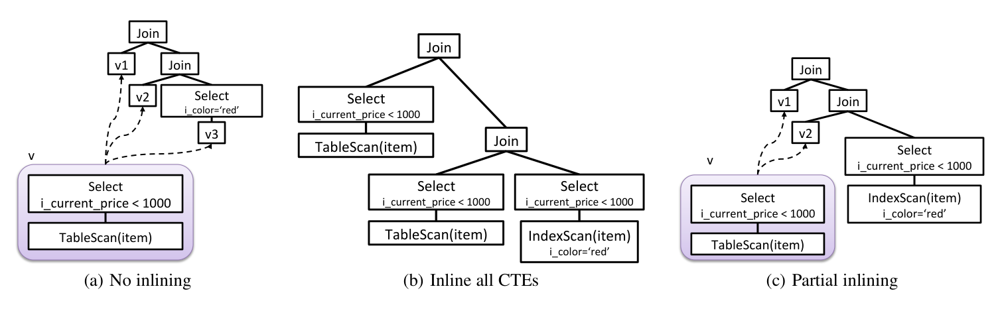

(a) 不内联；(b) 内联所有 CTE；(c) 部分内联。

#### 1.1.3 上下文化优化

CTE 不应脱离其出现位置单独优化。孤立优化很容易错过多种优化机会。例如，如果查询在所有 CTE consumer 上都有过滤条件，这些过滤条件可能可以下推到 CTE 计划中，从而减少需要产生的元组数量。类似地，多个 consumer 可能要求 CTE 结果按相同方式分区或排序。考虑把这类需求下推到 CTE 计划中的替代方案，可以避免对同一批数据重复排序或重复重分布。

但是，每当查询中引用一次 CTE 就重新优化一次该 CTE 并不可扩展，会导致搜索空间指数级增长。CTE 优化需要有机地嵌入优化器，让它能考虑 CTE 与其他优化之间的相互作用，并尽早剪枝劣质计划。第 7 节说明我们如何处理这一挑战。

### 1.2 贡献

本文提出一种表示、优化和执行带有非递归 CTE 查询的新方法。该方法已在 Orca（Pivotal Query Optimizer）中实现，并已用于生产环境。主要贡献如下：

- 提出一个面向 MPP 数据库系统的 CTE 优化框架。该框架扩展并构建在现有优化器基础设施之上，使 CTE 能够在查询使用它们的上下文中被优化。
- 提出一种技术：CTE 不会因为查询中每个引用都被重新优化，而只会在存在优化机会时重新进入相关优化流程，例如过滤或排序操作下推。这样保证优化时间不会随 CTE consumer 数量呈指数增长。
- 提出一种基于代价的方法，决定是否在给定查询中展开 CTE。代价模型同时考虑磁盘 I/O 和重复执行 CTE 的代价。
- 提出多种减少计划搜索空间、加速查询执行的优化，包括向 CTE 下推谓词、单次引用 CTE 总是内联、消除从未引用的 CTE。
- 提出一种查询执行模型，保证 CTE producer 总是在 CTE consumer 之前执行。在 MPP 场景中，这对避免死锁至关重要。

我们还使用 TPC-DS 基准评估了这些技术的效率。

本文其余部分组织如下：第 2 节回顾相关工作；第 3 节介绍 MPP 架构和 Orca 查询优化背景；第 4 节给出 CTE 表示；第 5 节说明该表示如何保证无死锁执行；第 6 节描述计划枚举技术；第 7 节讨论属性推导、属性 enforcement 和代价估计；第 8 节讨论 CTE 如何作为优化工具用于没有显式 CTE 的查询；第 9 节描述 MPP 系统中带 CTE 查询的执行方式；第 10 节给出实验评估；第 11 节总结全文。

## 2. 相关工作

公共子表达式优化问题在查询处理和查询优化领域已有充分研究。这里聚焦两个与本文方案相关的重要方向。

**CTE 优化。** Silva 等人提出了对 SCOPE 查询优化器的扩展，使用两阶段优化技术处理第 1.1.3 节讨论的上下文化优化挑战。第一阶段使用原始 SCOPE 优化器，并增加一个步骤，把所有 CTE consumer 所需的物理属性（例如数据分区和排序）记录到链表中。随后使用一个重新优化阶段，识别 CTE consumer 的最低公共祖先，并基于 CTE consumer 的局部需求重新优化 CTE producer，目标是识别全局最优计划。

与该工作不同，本文方案把 CTE 优化有机集成到查询优化器核心，避免重新优化（见第 7 节）。我们的表示框架还允许直接识别 CTE 的优化入口点，不需要搜索最低公共祖先。最后，由于优化在一个阶段内完成，我们的方法天然支持尽早剪枝计划空间，从而避免不必要的优化。

PostgreSQL 把 CTE 视为一种在复杂查询中隔离子查询的方式。生成的计划在单独子计划中求值 CTE，且该子计划与主查询隔离优化。这种方法可能放弃重要优化机会，例如：内联 CTE、当所有 CTE consumer 都要求相同属性时在 CTE 输出上 enforcement 排序等物理属性、把谓词下推到 CTE 子计划中。

Oracle 优化器可以生成把子查询结果存入临时表的计划，然后根据需要多次引用该临时表。优化器也可以内联对重构子查询的每个引用。`MATERIALIZE` 和 `INLINE` 优化器 hint 可用于影响决策。HP Vertica 和 PDW 也会在查询执行期间把 CTE 结果保存在临时表中。

**使用物化视图进行优化。** 在传统数据库系统中，使用物化视图进行查询优化和执行是已被充分研究的问题。本文探索内联替代方案的方法，与决定是否使用物化视图回答查询时使用的代价驱动方法有相似之处。但本文处理的问题与物化视图选择问题正交，区别如下：

第一，使用物化视图主要依赖视图匹配技术，以判断某个物化视图是否可用于优化特定查询。显式 CTE 通常不需要视图匹配，因为它们在查询中被定义并引用。视图匹配技术可以用来发现查询中隐式定义的公共子表达式；我们的框架可以利用并构建在这类技术之上，在 CTE 框架中捕获并优化子表达式（见第 8.2 节）。

第二，如第 7 节所示，CTE 可以利用上下文优化，其中 CTE consumer 的局部需求可能把新计划施加到 CTE producer 侧，例如把谓词或排序顺序从 consumer 推到 producer。物化视图不适用于这一点，因为物化视图的创建发生在可能使用它的查询之外。此外，与物化视图不同，CTE 是查询的一部分定义，并不会持久存储。因此，物化视图维护和设计问题不适用。

## 3. 背景

本节概述两个关键背景：第 3.1 节介绍底层 MPP 架构；第 3.2 节概述 Orca 查询优化器。

### 3.1 大规模并行处理

现代横向扩展数据库引擎通常基于两类设计原则之一：分片数据库（sharded databases）和大规模并行处理数据库（MPP databases）。两者都是 shared-nothing 架构，每个节点管理自己的存储和内存，并且通常基于水平分区。分片的常见使用场景包括按“西部”与“东部”客户划分，或按用户名字母范围分区。分片系统优化的是在少量分片子集上执行查询，分片之间通信相对有限。分片可以部署在不同数据中心甚至不同地理区域。

MPP 数据库优化的是每个查询的并行执行。节点通常位于同一个数据中心内，每个查询可以访问所有节点上的数据。查询优化器生成包含显式数据移动指令的执行计划，并在优化期间考虑移动数据的代价。MPP 数据库中执行的查询可以包含多个流水线执行阶段，每个阶段在节点之间有显式通信。例如，可以使用多阶段聚合，在所有节点参与下计算整个数据集上的聚合。

Pivotal 的 Greenplum Database（GPDB）是一个 MPP 分析数据库。GPDB 采用 shared-nothing 架构，由多个协作处理器组成，典型部署包括数十到数百个节点。通过把负载分布到多个服务器或主机上，多个独立数据库组成一个整体，向外呈现单一数据库镜像。master 是入口，客户端连接到 master 并提交 SQL 语句。master 与其他数据库实例（称为 segment）协调工作。

查询执行期间，数据可以按多种方式分布：哈希分布（hashed distribution）按某个哈希函数把元组分布到 segment；复制分布（replicated distribution）在每个 segment 存储一份完整表副本；单点分布（singleton distribution）把整个分布式表从多个 segment 收集到一个主机，通常是 master。

特殊算子 Motion 用于完成 segment 之间的数据通信。Motion 算子是两个活动进程之间的边界，这两个进程发送/接收数据，并可能运行在不同节点上。Motion 的目标是建立给定的数据分布。例如，为了在列 `x` 上建立哈希分布，运行在 segment `S` 上的 `Redistribute(x)` Motion 实例会根据 `x` 的哈希值，把 `S` 上的元组发送到其他 segment，同时接收其他 segment 上并行运行的 `Redistribute(x)` 实例发送来的元组。类似地，Broadcast Motion 和 Gather Motion 用于建立复制分布和单点分布。第 7.1 节进一步说明在查询优化期间如何使用 Motion enforcement 所需的数据分布。

### 3.2 Orca 中的查询优化

Orca 是 Pivotal 数据管理产品（包括 GPDB 和 HAWQ）的查询优化器。Orca 是一个基于 Cascades 框架的现代自顶向下查询优化器。

在 Orca 中，计划空间被编码到一个紧凑数据结构 Memo 中。Memo 由一组容器组成，称为 group。每个 group 包含逻辑等价表达式，称为 group expression。每个 group expression 是一个算子，其子节点是其他 group。Memo 的这种递归结构可以紧凑表示巨大的候选计划空间。包含查询顶层算子的 Memo group 称为 root group。

计划替代方案由 transformation rule 生成。规则可以产生等价逻辑表达式，也可以产生已有表达式的物理实现。应用 transformation rule 的结果会加入 Memo，可能创建新 group，也可能向已有 group 添加新表达式。

优化期间，算子可以要求其子节点满足物理属性（例如排序顺序和数据分布）。子计划可以自己满足所需属性（例如 IndexScan 输出有序数据），也可以使用 enforcer 算子（例如 Sort）来提供所需属性。

## 4. CTE 的表示

为说明 Orca 如何表示带 CTE 的查询，我们从一个简单例子开始。

### 示例 3

```sql
WITH v AS (
  SELECT i_brand FROM item WHERE i_color = 'red'
)
SELECT *
FROM v as v1, v as v2
WHERE v1.i_brand = v2.i_brand;
```

图 2 展示了该查询的初始逻辑表示。我们引入如下新的 CTE 算子：

- **CTEProducer**：该算子最初作为一棵单独逻辑树的根，该逻辑树对应 CTE 定义。查询中每定义一个 CTE，就有这样一棵树和一个 CTEProducer 算子。它们最初不连接到主查询逻辑树。每个 CTEProducer 有唯一 id。
- **CTEConsumer**：该算子表示查询中引用 CTE 的位置。CTEConsumer 节点数量等于查询中 CTE 引用数量。CTEConsumer 算子中的 id 对应它引用的 CTEProducer。多个 CTEConsumer 可以引用同一个 CTEProducer。
- **CTEAnchor**：该算子表示特定 CTE 在查询中的定义位置，并定义该 CTE 的作用域。CTE 只能在对应 CTEAnchor 所根植的子树中被引用。
- **Sequence**：这是一个二元算子，按顺序从左到右执行其子节点，并返回右子节点结果。Orca 也使用 Sequence 优化分区表查询。

**图 2：示例 3 查询的逻辑表示。**  

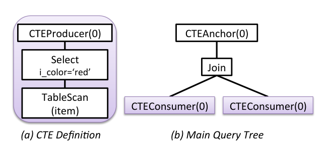

图中主查询包含 join，CTE 定义独立表示为 CTEProducer，主查询中两个引用表示为同一 id 的 CTEConsumer。

图 3 展示了图 2 查询的两个可能执行计划。第一个计划内联所有 CTE。此时 CTEAnchor 被移除，每个 CTEConsumer 被表示 CTE 定义的整棵树替换。第二个计划不做 CTE 内联。CTEAnchor 被 Sequence 算子替换；Sequence 的第一个子节点是 CTEProducer，第二个子节点是 CTEAnchor 原来的子节点。

Sequence 算子保证特定执行顺序：CTEProducer 下的子树先执行，然后任何对应 CTEConsumer 才开始执行。因此，当执行到 CTEConsumer 时，要读取的数据已经可用。这保证生成计划没有死锁，尤其适用于包含多个 CTE 的计划。第 5 节进一步展开。

**图 3：示例 3 查询的执行计划。**  

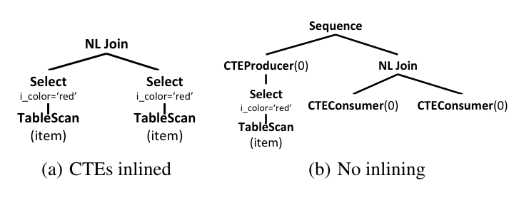

(a) CTE 被内联；(b) 不内联。第二种计划使用 Sequence 保证先执行 producer，再执行 consumer。

前述算子也可用于表示嵌套 CTE。

### 示例 4

```sql
WITH v as (
  SELECT i_current_price p FROM item
  WHERE i_color = 'red'
),
w as (
  SELECT v1.p FROM v as v1, v as v2
  WHERE v1.p < v2.p
)
SELECT *
FROM v as v3, w as w1, w as w2
WHERE v3.p < w1.p + w2.p;
```

图 4 展示示例 4 查询的逻辑表示。每个 CTEProducer 节点位于对应 CTE 的逻辑树之上。主查询有两个 CTEAnchor 节点，顺序与 `WITH` 子句中 CTE 出现顺序相同。注意，一些 CTEConsumer 节点在主查询中，另一些位于 CTEProducer 之下的树中，对应 CTE 内部引用其他 CTE 的情况。

**图 4：示例 4 查询的逻辑表示。**

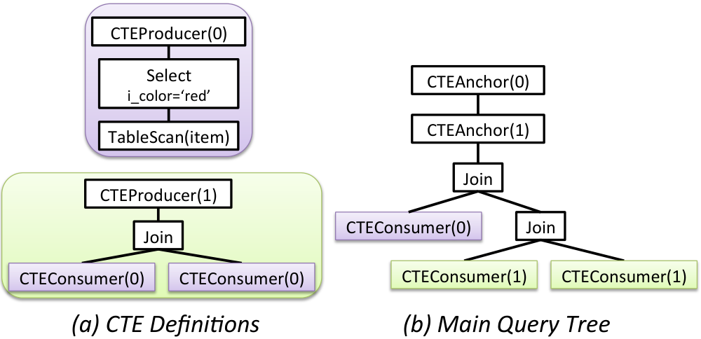

## 5. CTE 执行与死锁

执行带 CTE 的计划会在计划的不同部分之间创建运行时依赖。优化器必须考虑这些依赖，并保证生成的计划对任何可能输入都是无死锁的。

一种可能方法是把 CTEProducer 放到某个 CTEConsumer 节点之下。考虑示例 3 的查询以及图 2 的逻辑表示。一个可能的执行计划可以使用 Nested Loop Join（NLJoin），并把 CTEProducer 直接挂在 join 内侧（右侧）的 CTEConsumer 下面，如图 5(a) 所示。在该计划中，NLJoin 触发其外侧（左侧）子节点执行，进而触发左侧 CTEConsumer 执行。这个 CTEConsumer 会阻塞，因为它要读取的元组尚未产生。由于 NLJoin 的外侧子节点阻塞，执行永远到不了内侧子节点，而内侧子节点本应执行 CTEProducer。因此该计划产生死锁。

如果把 CTEProducer 放在先执行的 consumer 下面，也就是本例中 NLJoin 的外侧（左侧）子节点下面，就可以避免这个死锁。一个朴素的死锁规避方法如下：

1. 不考虑 CTE 表达式，优化主查询。
2. 分别优化每个 CTE 表达式。
3. 对查询中的每个 CTE，按依赖顺序执行：
   - 按执行顺序遍历主查询执行计划；
   - 把该 CTEProducer 对应的树挂到遍历中遇到的第一个对应 consumer 下面。

该方法的一个明显缺点是，第一步没有考虑 CTEProducer 执行代价。于是，主查询原本选择的计划在插入较小的 CTE 子计划之后可能不再最优。

另一个复杂性来源于：对某些输入而言，查询计划的某些部分可能完全跳过执行。考虑图 5(b) 的计划。该计划按照上述算法，把 CTEProducer 放在执行顺序中遇到的第一个 CTEConsumer 下面。现在假设 `i_current_price` 上的过滤条件不返回任何元组。很多执行引擎会优化执行流程，直接跳过 join 内侧，因为 join 算子不会产生任何元组。在这种情况下，放在 join 内侧子节点下的 CTEProducer 永远不会执行。当执行到顶层 join 之下的 CTEConsumer 时，它会尝试从从未执行过的 CTEProducer 读取元组，从而产生死锁。

理论上，这些情况可以在查询优化或执行阶段规避。但这会让处理逻辑越来越复杂，紧密耦合优化器和执行引擎设计，带来可维护性和可扩展性挑战。在 MPP 系统中问题更加严重，因为还必须处理不同节点上进程之间的通信。Sequence 算子大大简化了计划中 CTEProducer 的放置决策，使优化器可以透明地执行多种优化而不必担心死锁。

**图 5：带死锁的执行计划。**  

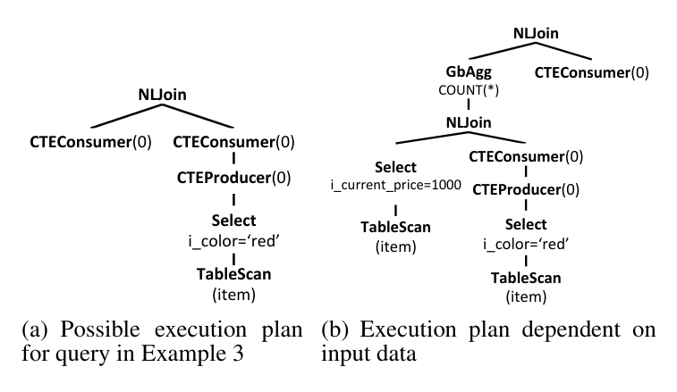

(a) 示例 3 查询的一个可能执行计划；(b) 依赖输入数据的执行计划。

## 6. 计划枚举

本节说明如何为带 CTE 的查询生成计划替代方案。我们使用图 2 的逻辑查询作为说明。初始逻辑查询表达式先插入 Memo，创建所需的多个 Memo group。图 6 展示了用该逻辑表达式初始化 Memo 后的表示，其中每个编号方框代表一个独立 Memo group。

**图 6：插入图 2 查询后的 Memo。**

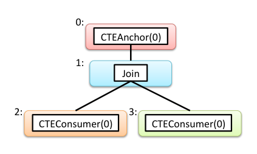

### 6.1 Transformation Rules

一个 transformation rule 接受 Memo group 中的表达式作为输入，并产生另一个表达式加入同一个 group。对于每个 CTE，我们生成“内联”和“不内联”两类替代方案。图 7 展示了应用如下 CTE 相关 transformation 后的 Memo：

- 第一条规则应用到 CTEAnchor 算子。它在与 CTEAnchor 相同的 group（group 0）中生成 Sequence 算子。Sequence 的左子节点是表示 CTE 定义的整棵树，因此可能创建若干新 group（group 4、5、6）；右子节点是 CTEAnchor 原来的子节点（group 1）。
- 第二条规则也应用到 CTEAnchor，在同一个 group（group 0）中生成 NoOp 算子，其唯一子节点是 CTEAnchor 的子节点（group 1）。
- 第三条规则应用到 CTEConsumer 算子，生成一份 CTE 定义的拷贝，并把该表达式加入与 CTEConsumer 相同的 group。例如，对于 group 2 中的 CTEConsumer，CTE 定义被加入，使 Select 算子也位于 group 2，其子节点 TableScan 加入新 group（group 7）。

估算不同替代方案代价后（见第 7 节），优化器从每个 group 中选择代价最低的替代方案。例如，如果优化器从 group 0 中选择以 NoOp 为根的计划，并从 group 2 和 group 3 选择内联表达式，就得到图 3(a) 的计划。相反，如果优化器从 group 0 中选择以 Sequence 为根的计划，并从 group 2 和 group 3 选择 CTEConsumer，就得到图 3(b) 的计划。

图 8 展示了通过选择其他算子可能得到的其他计划。注意，这些图中并非所有计划都是合法的。例如，图 8(a) 和 8(b) 中包含 CTEConsumer，但没有对应 CTEProducer。这类计划无法执行，因为 CTEConsumer 需要读取从未产生的数据。图 8(c) 有 CTEProducer，但没有对应 CTEConsumer。这意味着 CTE 表达式会被无谓地额外执行一次并缓存。第 6.2 节中的算法会避免生成这些计划。

图 8(d) 不是非法计划，但不是最高效计划，因为其中只有一个 CTEConsumer 对应该 CTEProducer。该计划的代价与图 3(a) 基本等价，只是额外产生了缓存 CTE 输出的开销。第 6.3.2 节说明如何避免生成这类计划。

使用 Memo 表示不同替代方案，使是否内联 CTE 的决策完全基于代价。在同一查询中，一些 CTE 可以被内联，另一些可以不内联。内联也允许执行一些优化，例如谓词下推、分布、排序等。

例如，考虑图 9(a) 中的 CTEProducer。图 9(b) 的局部逻辑表达式展示了 CTEConsumer 上方有一个谓词。应用内联 CTEConsumer 的 transformation rule 后得到图 9(c) 的局部表达式。Orca 默认会尽可能把谓词下推，因此图 9(c) 的表达式最终会转换为图 9(d)，这可能显著减少中间行数。

**图 7：应用 transformation 后的 Memo。**  

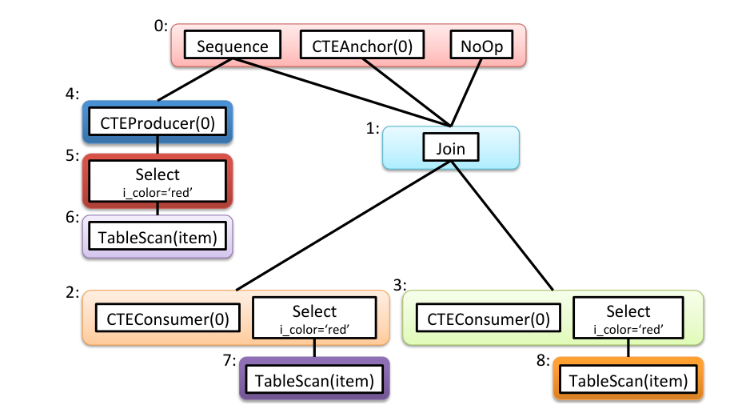

**图 8：其他可能计划。**  

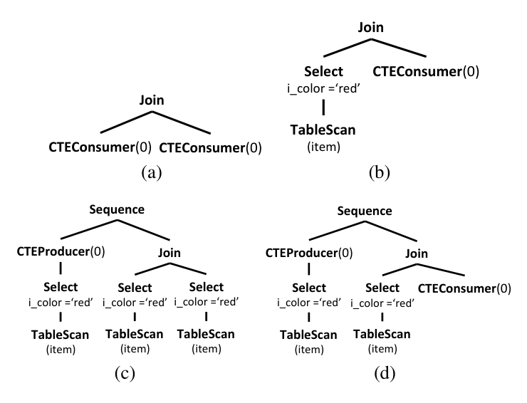

**图 9：通过内联 CTE 下推谓词。**

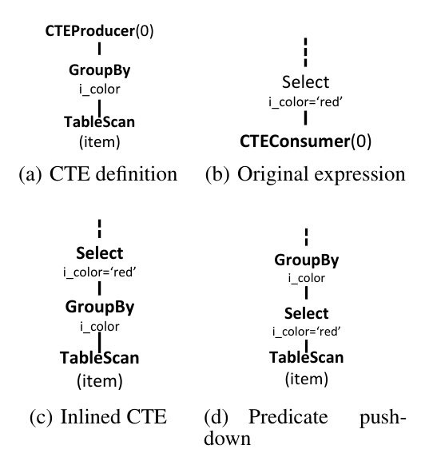

### 6.2 避免非法计划

本节描述用于检查计划和子计划是否合法的算法，合法性相对于 CTEProducer 和 CTEConsumer 的配置而言。该算法适配 Orca 向下传递查询需求并向上推导计划属性的框架（见第 3.2 节）。算法实际运行在 Memo 编码的不同替代计划上。为了说明，这里给出一个作用于完整计划的递归版本。

主函数见算法 1。输入为一个计划（或子计划）的根节点，以及一个 CTE requirement 列表。列表中的每个元素是一个 `CTESpec` 对象。函数输出也是 `CTESpec` 对象列表，表示给定子计划中的 CTE 配置。每个 `CTESpec` 是一个未解析 CTEProducer 或 CTEConsumer 的紧凑规格，由 CTE id 和规格类型组成：`p` 表示 producer，`c` 表示 consumer。为简单起见，用二元组 `(id, type)` 表示，例如 `(1, c)` 表示 id 为 1 的 consumer。

该函数最初在整棵计划的顶层节点上调用，并传入空 requirement 列表。函数先计算当前节点的 `CTESpec` 列表（第 1-2 行），然后处理子节点（第 3-7 行）。对每个子节点，函数基于父节点传来的 requirement 和前序子节点返回的 `CTESpec` 计算新的 CTE requirement（第 4 行）；再递归调用子节点（第 5 行），并把子节点返回的 `CTESpec` 与前序子节点结果合并（第 6 行）。最后，函数检查当前节点及其子节点合并后的 `CTESpec` 是否满足父节点传来的 requirement。如果不满足，则当前计划非法（第 8-10 行）；否则把合并后的 `CTESpec` 列表返回父节点（第 11 行）。

```text
Algorithm 1: DeriveCTEs

Input : Node node, List reqParent
Output: List of CTESpecs

1  List specList;
2  specList.Add(node.ComputeCTESpec());
3  foreach child in node.children do
4      List reqChild = Request(specList, reqParent);
5      List specChild = DeriveCTEs(child, reqChild);
6      Combine(specList, specChild);
7  end
8  if !Satisfies(specList, reqParent) then
9      SignalInvalidPlan();
10 end
11 return specList;
```

该算法使用若干辅助函数：

- `ComputeCTESpec()` 是算子相关函数，用于为不同算子计算局部 `CTESpec` 表示。大多数算子的实现返回空列表，例外是 CTEProducer 和 CTEConsumer：它们各自返回一个包含自身 CTE id 的 `CTESpec`。
- `Request()` 为给定子节点计算新的 requirement 列表，同时考虑父节点 requirement 和前序子节点返回的 `CTESpec`。新的 requirement 包括：父节点不要求但由前序子节点引入的 `CTESpec`；以及父节点要求但前序子节点尚未解析的 `CTESpec`。
- `Combine()` 合并来自当前节点及其子节点的 `CTESpec` 列表。如果存在相同 id 但不同类型的 `CTESpec`，它们互相抵消，不出现在合并列表中。其余 `CTESpec` 被复制到合并列表。
- `Satisfies()` 检查整个子计划的 CTE 表示是否满足父节点向下传递的 requirement。它通过比较两个列表中的 `CTESpec` 是否匹配来完成。
- `SignalInvalidPlan()` 标记当前处理计划非法，因此不能作为给定查询的可选执行计划。

如本节开头所述，Orca 中的实现直接运行在 Memo group 上，而不是运行在已抽取计划上。请求和推导属性在 Memo group 与其子 group 之间传递。标记非法子计划只是意味着该子计划从计划空间中移除，不参与任何计划。换言之，我们不会等到生成所有替代计划后再应用该算法，而是在属性推导过程中应用它，以避免非法算子组合。

### 6.3 跨 Consumer 的优化

包含 CTE 的执行计划还可以用多种方式进一步优化，以改善执行性能。这些优化必须考虑给定 CTE 的所有 consumer，不能只局部应用到单个 CTEConsumer。

#### 6.3.1 谓词下推

第 6.1 节说明，内联 CTE 使谓词下推成为可能，从而减少中间行数。不过在 Orca 中，我们引入了一种即使不内联 CTE 也能下推谓词的方法。

### 示例 5

```sql
WITH v as (
  SELECT i_brand, i_color
  FROM item
  WHERE i_current_price < 50
)
SELECT *
FROM v v1, v v2
WHERE v1.i_brand = v2.i_brand
  AND v1.i_color = 'red'
  AND v2.i_color = 'blue';
```

该查询有两个 CTEConsumer，每个上面都有一个谓词。图 10(a) 展示了不内联 CTE 时原始查询的一个可能执行计划。在该计划中，CTEProducer 输出了任何 CTEConsumer 都不需要的元组。我们通过把所有 CTEConsumer 上方谓词取析取（OR）形成新谓词，并把新谓词推到 CTEProducer 来优化它。这样可以减少需要物化的数据量。仍然需要在 CTEConsumer 上方应用原始谓词，以只产生所需元组。优化后的计划见图 10(b)。

**图 10：不内联时的谓词下推。**  

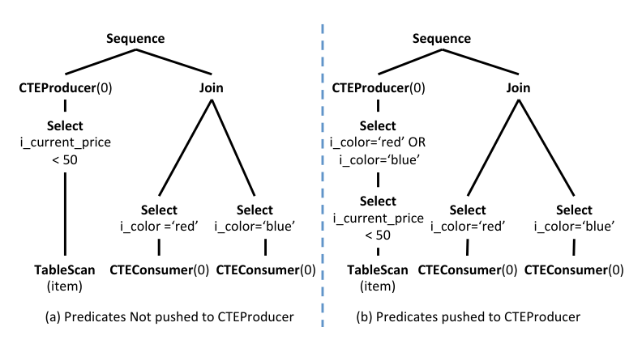

(a) 谓词未下推到 CTEProducer；(b) 谓词下推到 CTEProducer。

#### 6.3.2 总是内联单次使用 CTE

Orca 使用一个启发式规则：任何只有一个 consumer 的 CTE 都自动内联。

### 示例 6

```sql
WITH v as (
  SELECT i_color
  FROM item
  WHERE i_current_price < 50
)
SELECT *
FROM v
WHERE v.i_color = 'red';
```

该查询只有一个 `v` 的 consumer。无论是否内联，CTE 表达式都只执行一次。但如果不内联，还会产生物化和重新读取物化元组的额外代价。因此，被引用一次的 CTE 总是内联更好。

#### 6.3.3 消除未使用 CTE

### 示例 7

```sql
WITH v as (
  SELECT i_color
  FROM item
  WHERE i_current_price < 50
)
SELECT *
FROM item
WHERE item.i_color = 'red';
```

作为上一项优化的扩展，从未在查询中引用的 CTE 可以被完全移除。示例 7 中，`v` 被定义但未被引用。无论 `v` 的定义多复杂，都可以在不影响查询结果的前提下完全移除。该优化也可以迭代应用于包含多个 CTE 的查询。

### 示例 8

```sql
WITH v as (
  SELECT i_current_price p FROM item
  WHERE i_current_price < 50
),
w as (
  SELECT v1.p FROM v as v1, v as v2
  WHERE v1.p < v2.p
)
SELECT *
FROM item
WHERE item.i_color = 'red';
```

在该查询中，`v` 被引用两次，而 `w` 从未被引用。因此可以消除 `w` 的定义。消除 `w` 后，`v` 的唯一引用也被移除，于是 `v` 的定义也可以消除。

## 7. 上下文化优化

本节讨论本文提出的上下文化优化技术，并用简单例子说明其影响。本文的关键贡献之一，是能够根据 CTE 在不同计划中的使用上下文，以不同方式优化 CTE。已有工作使用 CTE 重新优化阶段处理这一问题，该阶段利用之前常规优化阶段中发现的 CTE 属性（见第 2 节）。

据我们所知，本文框架是第一个把 CTE 优化集成到优化器核心、避免完整重新优化的方案。CTE 与其他优化在同一个框架中结合，形成了高效、系统化、消除重复工作的流程。高效优化通常会转化为更高质量的生成计划，因为更多资源可以用于 join ordering 等昂贵操作。

### 7.1 Enforcement 物理属性

Orca 通过处理 Memo group 中的优化请求来优化候选计划。一个优化请求是一组物理属性，要求由物理 group expression 满足。所需物理属性包括排序顺序、分布、可回绕性（rewindability）、CTE 和数据分区。为清晰起见，这里聚焦数据分布，其他属性处理方式类似。

对于传入的优化请求，每个物理 group expression 会向子 Memo group 传递相应请求。子请求取决于传入 requirement 以及算子的局部 requirement。优化期间，同一个 group 可能收到许多相同请求。Orca 把已计算请求缓存在 group 的哈希表中。传入请求只有在 group 哈希表中不存在时才会计算。

CTE 优化需要在不同上下文中满足物理属性，从而导致潜在竞争的计划替代方案。我们使用示例 3 的查询，在图 11 中展示这一过程。

#### 7.1.1 Producer 上下文

可以在不考虑 CTEConsumer 出现位置的情况下生成 CTEProducer 计划。图 11(a) 中，Sequence 算子向 group 4（CTEProducer 所在 group）请求 `ANY` 分布。该请求可由 group 4 生成的任何计划满足。在这个例子中，最便宜计划的派生分布是 `Hashed(i_sk)`，也就是 `item` 表的分布。

接下来，该计划的物理属性会附着到发送给 group 1 的请求上，而 CTEConsumer 从 group 1 派生。这使得 CTEConsumer 之后能够判断 CTE 计划是否满足 CTEConsumer 上下文中的 requirement，或者是否需要属性 enforcer 来满足缺失 requirement。

group 1 中 HashJoin 算子的局部 requirement 要求基于 join 条件 `v1.i_brand = v2.i_brand` 对齐子节点分布，目标是把会 join 的元组放在同一节点上。这通过从子 group 2 和 3 都请求 `Hashed(i_brand)` 分布完成。注意，CTE 计划属性仍然附着在这些请求上。随后，group 2 和 3 中的 CTEConsumer 检查 CTE 计划的分布 `Hashed(i_sk)` 是否满足请求的 `Hashed(i_brand)`。本例中不满足，因此在 group 2 和 3 中插入 `Redistribute(i_brand)` enforcer 以满足所需分布。

图 11(a) 展示了上述步骤产生的候选计划，其中 CTE 结果在相同哈希表达式上被重分布两次。由于该计划不知道 CTEConsumer 上下文，这种冗余无法避免。该方案可能不是最佳选择，因为浪费了网络和 CPU 资源。接下来说明如何为该例生成更高效计划。

#### 7.1.2 Consumer 上下文

CTEConsumer 出现位置可能要求相同属性。这些属性可以在 CTEProducer 表达式中 enforcement，以避免重复工作。

图 11(b) 中，CTEConsumer 算子额外把一个 `Hashed(i_brand)` 请求（以虚线标注）送回 group 0，也就是 Sequence 所在 group。不同于其他优化请求，该请求不是由 Memo 中的父子关系产生，而是用于把 CTEConsumer requirement 推入 CTEProducer 计划。我们的框架支持这一点，因为每个 Sequence 都为它的 CTE 在 Memo 中提供优化入口点。该优化可能避免 CTEConsumer 侧的属性 enforcement。

与前述类似，`Hashed(i_brand)` 请求触发一串新的优化请求，并在 Memo group 之间传播。这会在 group 5 中加入 `Redistribute(i_brand)` 算子，以 enforcement 所需分布。当优化到达 group 2 和 3 时，CTEConsumer 识别到附着的 CTE 计划属性满足 `Hashed(i_brand)` 分布，因此 CTEConsumer 侧无需再进行属性 enforcement。图 11(b) 展示了一个候选计划，其中 CTE 结果在共享给 CTEConsumer 之前只进行一次最优分布。

CTEConsumer 部分或全部内联的计划替代方案在该例中仍然合法。优化器会估算所有不同替代方案的代价，以选择最佳计划，见第 7.2 节。

还需要强调的是，由于 CTE 优化被集成到 Orca 核心，不需要多阶段优化，也不需要在常规优化完成后再考虑 CTE。并且，由于 CTE 与其他优化结合在一个框架中，可以全面剪枝搜索空间。具体做法是在完整计算优化请求之前先计算其代价下界；如果已知存在代价更低的完整计划，就消除该请求。这可以提前截断额外的 CTE 优化。受篇幅限制，细节略去。

**图 11：为示例 3 的不同计划 enforcement 物理属性。**  

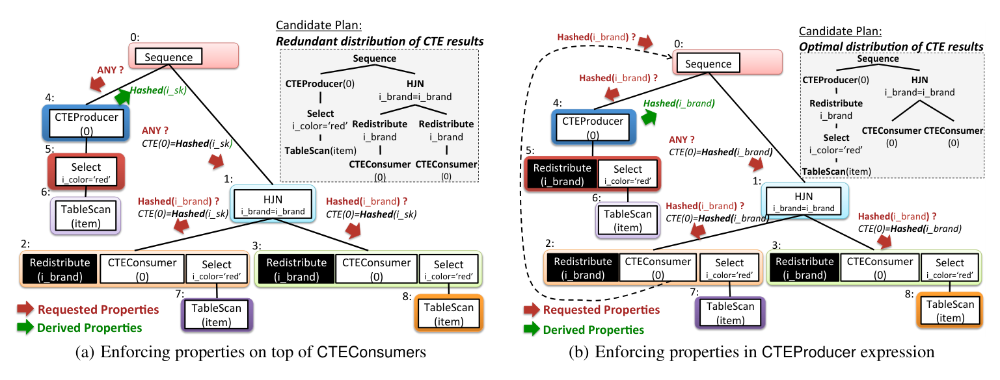

(a) 在 CTEConsumer 上方 enforcement 属性，导致 CTE 结果重复重分布；(b) 在 CTEProducer 表达式中 enforcement 属性，使 CTE 结果只重分布一次。

### 7.2 代价估计

正确为 CTE 估算代价对优化至关重要。CTEProducer 的代价是执行其下整棵子树的代价，加上把结果物化到磁盘的代价。CTEConsumer 的代价是从磁盘读取行，因此类似一次表扫描的代价。相反，内联 CTE 表达式的代价是完整执行该表达式的代价。

对每个 CTEConsumer，优化器有两个替代计划：

1. CTE 表达式被内联，因此承担执行该表达式的完整代价；
2. CTE 表达式不被内联，因此只承担读取 CTE 输出的代价。

然而，局部比较这两个替代方案的代价是不正确的，因为第二个替代方案还隐式假设在别处有一个 CTEProducer 执行该表达式并写出结果。CTEProducer 的代价不能简单加到 CTEConsumer 的读取代价上，因为 CTEProducer 计算并写出的数据可以被多个 consumer 读取，所以其开销会在这些 consumer 之间摊销。

如已有工作指出的，最佳计划决策不能只在每个 CTEConsumer 局部完成，而必须考虑同一 CTE 的所有 consumer 以及对应 CTEProducer。不同于已有方法，本文方法不需要额外计算同一 CTE 所有 consumer 的最低公共祖先，因为这已经是已知的：就是包含对应 CTEAnchor 的 Memo group。

由于 CTEProducer 通过 Sequence 连接到查询其余部分，任何包含 CTEProducer 的计划替代方案（例如图 3(b)）都会把它的代价计入，而不依赖 CTEConsumer 数量。不包含 CTEProducer 的计划（例如图 3(a)）不会产生该额外代价。因此，代价计算与计划比较会随着不同计划替代方案的枚举有机发生。

## 8. 基于 CTE 的优化

本节讨论 Orca 如何隐式生成 CTE，作为优化不包含显式 CTE 查询的一种方法。我们说明 CTE 如何用于优化某些关系构造，例如 distinct aggregate（第 8.1 节），以及用于公共子表达式消除（第 8.2 节）。

### 8.1 生成 CTE 的 Transformation

在若干场景中，Orca 会在查询优化期间使用 transformation rule 隐式生成 CTE。例如，在优化窗口函数、full outer join 和 distinct aggregate 时，Orca 会考虑使用 CTE 的计划替代方案。下面的例子说明其中一种场景。

### 示例 9

```sql
SELECT COUNT(DISTINCT cs_item_sk), AVG(DISTINCT cs_qty)
FROM catalog_sales
WHERE cs_net_profit > 1000;
```

示例 9 的查询在 `catalog_sales` 上计算两个不同的 distinct aggregate。单个 distinct aggregate 的一种 MPP 执行策略要求输入基于聚合列做哈希分布。这样可以把相同值发送到同一节点，并使用多级聚合进行去重，从而高效识别重复项。

但是，当需要两个或更多不同 distinct aggregate 时，例如 `COUNT(DISTINCT cs_item_sk)` 与 `AVG(DISTINCT cs_qty)`，这种策略效率下降，因为每个聚合都要求在不同列上分布。

在 Orca 中，有一条规则把不同 distinct aggregate 转换为 CTEConsumer 之间的 join，使不同聚合的输入只计算一次。join 用于把两个聚合值拼接到一个结果元组中。图 12 展示了该 transformation rule 的输入与输出。每个 CTEConsumer 基于一个聚合列经过不同的 Redistribute 算子。这样 MPP 系统节点可以并行执行 distinct aggregate 计算。如果 distinct aggregate 超过两个，join 可以级联。

**图 12：为多个 distinct aggregate 生成 CTE。**

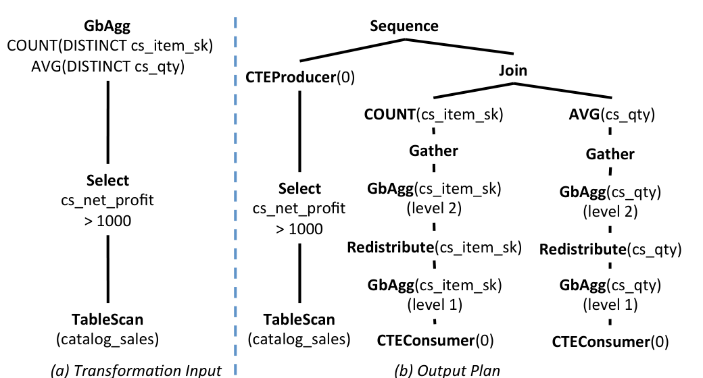

### 8.2 公共子表达式消除

除了优化带显式 CTE 的查询，本文框架还可用于优化包含公共子表达式但未显式定义 CTE 的查询。这被称为公共子表达式消除（common subexpression elimination）。

### 示例 10

```sql
SELECT *
FROM (
  SELECT i_brand, count(*) as b
  FROM item
  GROUP BY i_brand
  HAVING count(*) > 10
) t1,
(
  SELECT i_brand, count(*) as b
  FROM item
  GROUP BY i_brand
  HAVING count(*) > 20
) t2
WHERE t1.i_brand <> t2.i_brand;
```

图 13(a) 描述该查询的逻辑表达式树。查询有一个重复的公共子表达式，以两个虚线框标出。算法 2 把输入逻辑表达式 `expr_in` 转换为等价表达式 `expr_out`，其中公共子表达式被替换为 CTEConsumer。

算法使用 `DetectMatches()` 函数检测相同子表达式（第 2 行）。该函数可以有多种实现方式，例如使用已有工作中的 table signatures 方法。`DetectMatches()` 的输出是集合 `M`，由 `expr_in` 中相互匹配的子表达式组组成。

计算 `M` 后，算法访问 `M` 中成员数量超过一个的组。对于每个这样的组 `m`，创建一个 CTEProducer，并把创建的 CTE id 赋给 `m.id`（第 3-6 行）。随后调用 `InsertCTEConsumers()`，递归访问子表达式，把每个公共子表达式替换为对应 CTEConsumer。最后，在每组公共子表达式的最低公共祖先（LCA）上方插入 CTEAnchor（第 9-12 行）。图 13(b) 展示了处理示例 10 查询后的输出表达式。

注意，这只是一个可能算法。也可以使用其他方法识别相似但不完全相同的子表达式。在这一语境中，本文框架可以利用多种视图匹配技术，如第 2 节讨论。

```text
Algorithm 2: Common Subexpression Elimination

1  Algorithm EliminateCommonSubexpressions()
   Input : Expression expr_in
   Output: Expression expr_out

2  M = DetectMatches(expr_in);
3  foreach (m in M such that size(m) > 1) do
4      expr_p = any expression in m;
5      p = create CTEProducer for expr_p;
6      m.id = p.id;
7  end
8  expr_out = InsertCTEConsumers(expr_in, M);
9  foreach (m in M such that m.used == true) do
10     l = LCA(m.consumers, expr_out);
11     expr_out = insert CTEAnchor(m.id) above l in expr_out;
12 end
13 return expr_out;

14 Procedure InsertCTEConsumers()
   Input : Expression expr_in, SetOfMatches M
   Output: Expression expr_out

15 if (exists m in M such that expr_in in m) then
16     m.used = true;
17     c = create CTEConsumer(m.id);
18     add c to m.consumers;
19     return c;
20 end
21 new_children = new set;
22 foreach (child in expr_in.children) do
23     new_child = InsertCTEConsumers(child, M);
24     add new_child to new_children;
25 end
26 return new Expression(expr_in.op, new_children);
```

**图 13：公共子表达式消除。**  

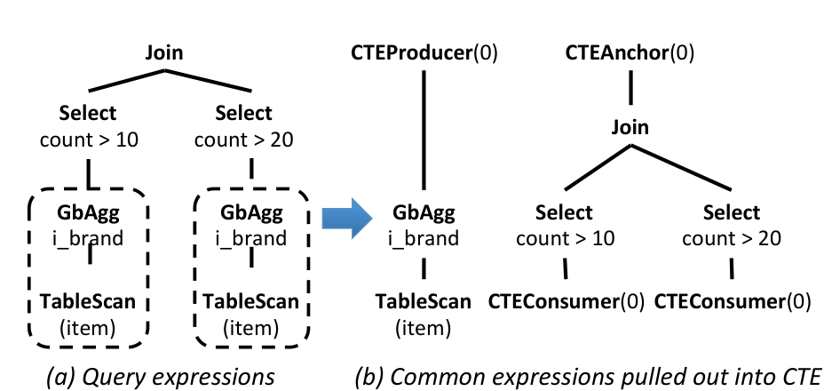

(a) 原始查询表达式；(b) 公共表达式被拉出为 CTE。

## 9. 执行

在 MPP 数据库中，查询计划的不同部分可以在不同进程中执行，既可能在同一主机内，也可能跨不同主机。在 GPDB 这样的 shared-nothing MPP 架构中，同一主机内的进程共享一个公共文件系统，不同主机中的进程通过网络通信。Orca 产生的计划要求 CTEConsumer 从同一主机中的 CTEProducer 读取元组，可以是在同一进程内，也可以是在不同进程内；但不会要求从另一主机上的 CTEProducer 读取。

查询执行开始前，CTEConsumer 被实例化为 SharedScan 算子，CTEProducer 被实例化为 Materialize（Spool）节点，或者当 CTE 产生有序结果时实例化为 Sort 节点。示例 3 查询的一个可能执行计划见图 14。Broadcast 算子管理图中两个活动进程之间的数据交换（见第 3.1 节）。

通常，一个 CTEProducer 有多个 CTEConsumer，这些 consumer 既可能运行在同一进程中，也可能运行在其他进程中。执行引擎允许 CTEConsumer 在这两种场景下读取 CTEProducer 的元组。此外，当涉及多个进程时，执行引擎提供同步机制，确保 consumer 可以等待 producer 产生元组。CTEProducer 和 CTEConsumer 使用共同的 CTEId 识别彼此。另外，每个 CTEProducer 会标注同一进程内 consumer 数量以及不同进程中 consumer 数量。这些信息用于 consumer 与 producer 之间的同步协议。

在 GPDB 中，包含 CTEConsumer 的进程在开始执行分配给它的任何算子前，会执行依赖检查。它使用同步协议等待 producer 的确认，确认所有元组已经产生并可供读取。不包含任何 consumer 的进程正常执行。如果某进程中存在 producer，该 producer 会在所有元组可用时通知所有 consumer。同步协议保证无论 producer 和 consumer 以何种顺序到达同步点，都不会丢失通知。

Producer 算子的结果会显式物化到 TupleStore 中。TupleStore 是一种在一组元组上实现迭代器的数据结构。CTEProducer 的 TupleStore 可以存储在内存或磁盘中，取决于数据大小、可用内存量以及 CTEProducer 上的计划 requirement。

当某个 CTEProducer 的所有 consumer 都位于同一进程中时，consumer 可以直接读取 producer 的 TupleStore 内容。如果数据量适合算子内存，TupleStore 存储在内存中，从而获得额外性能收益。如果至少一个 consumer 位于不同进程中，则 TupleStore 存储在磁盘上。CTEConsumer 接收文件名以及元组已经在磁盘上的通知，然后从磁盘读取元组。

当 CTEProducer 生成有序元组时，还可以应用额外优化。如果 producer 上方的算子是 Sort，则避免显式物化结果。Sort 算子本身已经把结果物化到 TupleStore 中，因此该 TupleStore 可以直接与 consumer 共享。

带 CTE 计划的执行还可以进一步改进：只有当第一个 CTEConsumer 请求时，才懒执行 CTEProducer。如果 CTEProducer 和 CTEConsumer 位于同一进程中，需要一种在计划不同部分之间切换执行的机制；如果它们位于不同进程中，则需要更多进程间协调，包括流控以及在同一主机内不同进程之间高效发送元组。CTEProducer 还必须能够在 consumer 以不同速率请求数据时 spill 到磁盘。这类计划的代价无法在优化时估计，因为它完全依赖执行流；代价估计会随着 CTEProducer 在内存执行、spill 到磁盘或完全不执行而变化。我们计划在未来工作中研究这些改进。

**图 14：示例 3 的 GPDB 执行计划。**

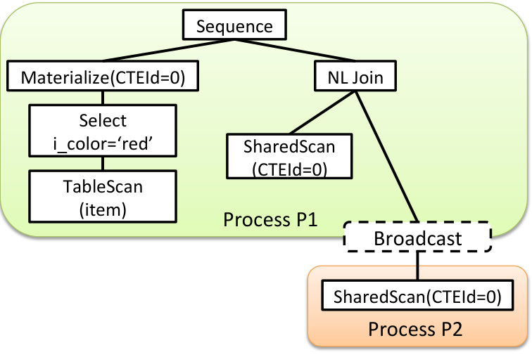

## 10. 实验

本节给出实验评估。第 10.1 节描述实验设置。第 10.2 节比较 Orca 生成的计划与 GPDB 旧查询优化器 Planner 生成的计划，后者总是内联 CTE。第 10.3 节说明基于代价的 CTE 内联相对于总是内联或从不内联的重要性。本文没有实验比较其他数据库系统提出的技术。一般来说，这不可行，因为许多系统与各自优化/执行框架紧密耦合，而这些框架与 GPDB 和 Orca 有很大差异。第 2 节已经说明本文方法与其他方法的相似和不同。

### 10.1 设置

实验在一个 8 节点集群上进行，节点之间通过 10Gbps 以太网连接。每个节点有双路 Intel Xeon 3.33GHz 处理器、48GB RAM，以及 12 块 600GB SAS 磁盘，组成两个 RAID-5 组。操作系统为 Red Hat Enterprise Linux 5.5。实验使用 5TB 的 TPC-DS 基准。工作负载包含 48 个查询，均为包含 CTE 的 TPC-DS 查询。

### 10.2 Orca 与 Planner 比较

| 设置 | 执行时间 |
| --- | ---: |
| Orca | 32,951.82 秒 |
| Planner | 57,176.04 秒 |

**表 1：总执行时间。**

表 1 展示使用 Orca 和 Planner 执行整个工作负载的总执行时间。Orca 把总执行时间降低了 43%。图 15 展示每个查询使用 Orca 后的相对性能提升。提升按使用 Planner 时的执行时间百分比计算，因此 10% 的提升表示使用 Orca 时查询在 90% 的时间内完成。X 轴是 Planner 下的执行时间，采用对数尺度。可以看到，Orca 在短查询和长查询上都普遍加速执行时间。80% 的查询表现出性能提升。该提升来自避免不必要的 CTE 内联，从而避免重复执行公共表达式，以及前文讨论的有效 CTE 优化。

也有一些情况下，Orca 的计划与 Planner 生成的计划同样好。这通常发生在物化并从磁盘读取 CTE 输出的开销，大致等于 Planner 计划中多次执行 CTE 表达式所节省的时间时。最后，有些查询在 Orca 下性能退化。我们调查发现，这些情况主要由于 Orca 因代价模型参数调优不完美和基数误估而选择了次优计划。

**图 15：Orca 与 Planner 的性能比较。**

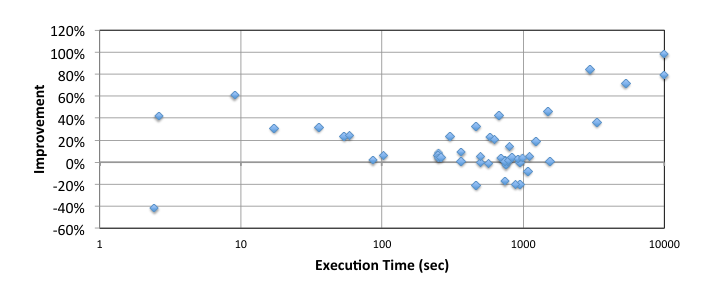

### 10.3 基于代价的内联

接下来，通过如下设置执行工作负载，评估基于代价的 CTE 内联方法：

1. 基本 CTE 优化：禁用 CTE 内联，也禁用向 CTEProducer 下推谓词。
2. 强制内联所有 CTE。
3. 基于代价的内联，并启用所有优化。这是 Orca 默认设置。

该实验目标是展示：基于代价的内联通过以代价驱动方式同时应用“纯内联”和“基本 CTE 优化”两个原则，可以生成更好计划，而不是启发式地只采用其中一种原则。图 16 展示了这些设置之间的性能差异。纵轴表示执行时间，采用对数尺度。

我们观察到，48 个 TPC-DS 查询中有 14 个在三种不同设置下执行时间差异小于 10%，因此图 16 忽略这些查询。在剩余 34 个查询中，如果把“内联”作为启发式选择，平均会导致 44% 的性能退化，最坏情况下退化 4 倍，例如查询 14a。

纯内联 CTE 方法只在内联 CTE 高选择性时带来显著性能收益，例如查询 11 和 31，其内联子查询基数只有几百个元组。在这两个案例中，只使用基本 CTE 优化会导致 2 倍性能退化。

基于代价的内联方法兼得两类方法的优点。当只有一个 consumer 时（如图 17(a) 所示），或者 CTE 足够便宜、可以重复执行时，优化器倾向内联。与此同时，当重复执行 CTE 表达式代价较高时，基于代价的方法倾向不内联。这种混合方法，加上把谓词下推到 CTEProducer 的收益（如图 17(b)），最多节省 55% 的执行时间，且优化开销可以忽略。

**图 16：性能比较 - 基本 CTE 优化（不内联） vs. 只内联方法 vs. 基于代价的 CTE 方法。**  

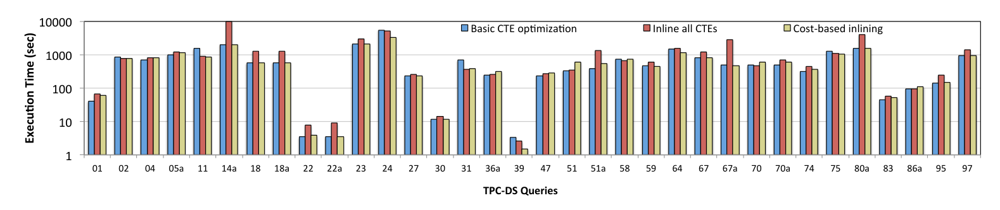

**图 17：单项 CTE 优化效果 - (a) 内联单 consumer CTE；(b) 向 CTE producer 下推谓词。**

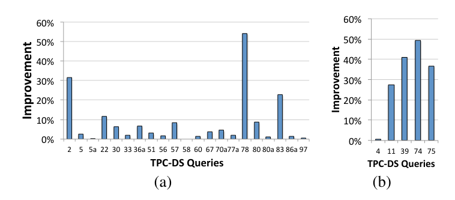

## 11. 总结

本文提出了一个覆盖 CTE 表示、优化和执行的完整框架。该工作显著扩展了优化器基础设施，并处理了 MPP 系统中分布式查询处理相关的多个挑战。使用标准决策支持基准的实验展示了这些技术的效率。

## 12. 参考文献

[1] PostgreSQL. http://www.postgresql.org.

[2] L. Antova, A. El-Helw, M. A. Soliman, Z. Gu, M. Petropoulos, and F. Waas. Optimizing Queries over Partitioned Tables in MPP Systems. In SIGMOD, pages 373-384, 2014.

[3] C. Bear, A. Lamb, and N. Tran. The Vertica Database: SQL RDBMS for Managing Big Data. In MBDS, 2012.

[4] S. Bellamkonda, R. Ahmed, A. Witkowski, A. Amor, M. Zait, and C. C. Lin. Enhanced Subquery Optimizations in Oracle. PVLDB, 2(2):1366-1377, 2009.

[5] L. Chang, Z. Wang, T. Ma, L. Jian, L. Ma, A. Goldshuv, L. Lonergan, J. Cohen, C. Welton, G. Sherry, and M. Bhandarkar. HAWQ: A Massively Parallel Processing SQL Engine in Hadoop. In SIGMOD, pages 1223-1234, 2014.

[6] J. Goldstein and P. Larson. Optimizing Queries using Materialized Views: A Practical, Scalable Solution. In SIGMOD, pages 331-342, 2001.

[7] G. Graefe. The Cascades Framework for Query Optimization. IEEE Data Eng. Bull., 18(3), 1995.

[8] L. L. Perez and C. M. Jermaine. History-aware query optimization with materialized intermediate views. In ICDE, pages 520-531. IEEE, 2014.

[9] Pivotal. Greenplum Database. http://www.pivotal.io/big-data/pivotal-greenplum-database, 2013.

[10] S. Shankar, R. Nehme, J. Aguilar-Saborit, A. Chung, M. Elhemali, A. Halverson, E. Robinson, M. S. Subramanian, D. DeWitt, and C. Galindo-Legaria. Query Optimization in Microsoft SQL Server PDW. In SIGMOD, pages 767-776, 2012.

[11] Y. N. Silva, P. Larson, and J. Zhou. Exploiting Common Subexpressions for Cloud Query Processing. In ICDE, pages 1337-1348, 2012.

[12] M. A. Soliman, L. Antova, V. Raghavan, A. El-Helw, Z. Gu, E. Shen, G. C. Caragea, C. Garcia-Alvarado, F. Rahman, M. Petropoulos, F. Waas, S. Narayanan, K. Krikellas, and R. Baldwin. Orca: A Modular Query Optimizer Architecture for Big Data. In SIGMOD, pages 337-348, 2014.

[13] TPC. TPC-DS Benchmark. http://www.tpc.org/tpcds.

[14] J. Zhou, P. Larson, J. C. Freytag, and W. Lehner. Efficient Exploitation of Similar Subexpressions for Query Processing. In SIGMOD, pages 533-544, 2007.

[15] J. Zhou, P.-A. Larson, and R. Chaiken. Incorporating Partitioning and Parallel Plans into the SCOPE Optimizer. In ICDE, pages 1060-1071, 2010.
