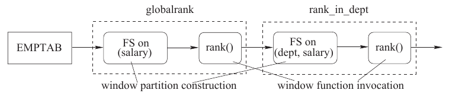
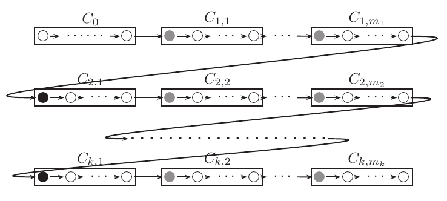
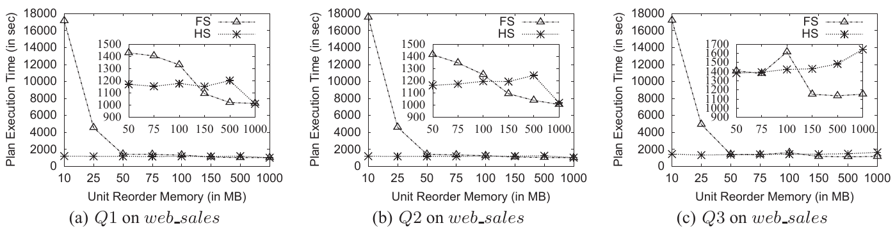
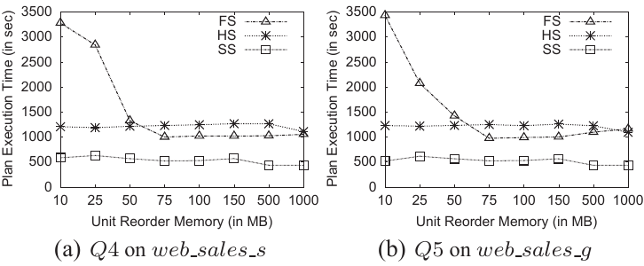
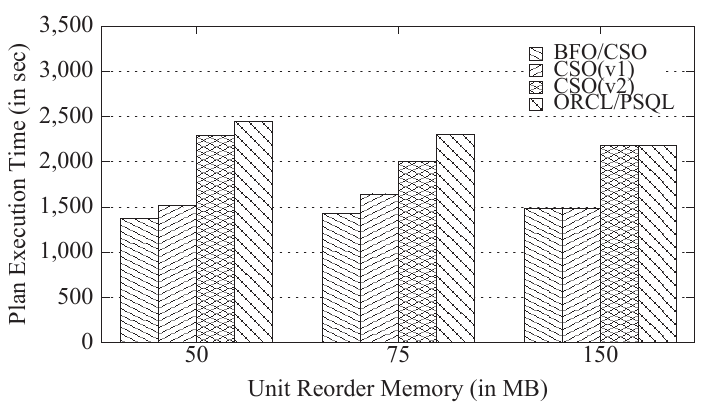
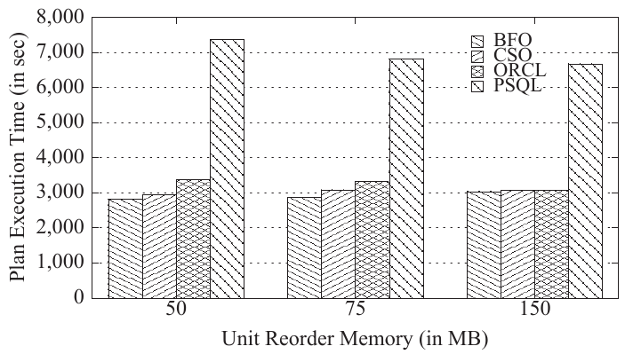
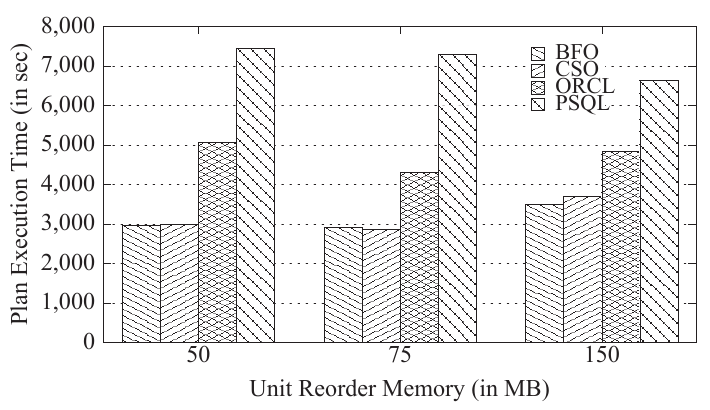
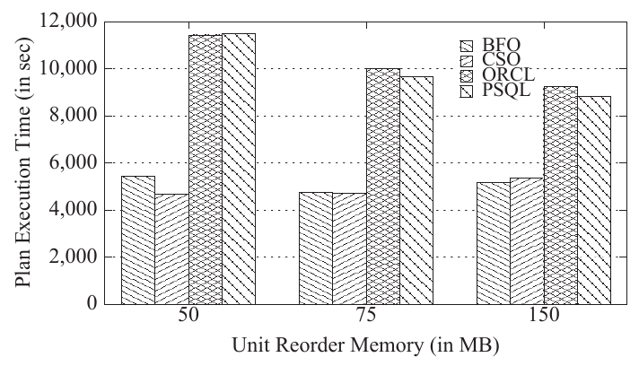

# Optimization of Analytic Window Functions（中文译文）

## 译者说明

本文依据同目录的 `source.pdf` 翻译。章节、图表、公式、算法、代码与参考文献按原文结构保留。

Yu Cao‡*、Chee-Yong Chan†、Jie Li§*、Kian-Lee Tan†

‡ 中国 EMC 实验室，yu.cao@emc.com<br>
† 新加坡国立大学计算机学院，新加坡，{chancy, tankl}@comp.nus.edu.sg<br>
§ 杜克大学计算机科学系，美国，jieli@cs.duke.edu

* 本研究在相关作者就职于新加坡国立大学期间完成。

发表于 *Proceedings of the VLDB Endowment*，第 5 卷第 11 期，2012 年。本卷论文获邀在第 38 届国际超大型数据库会议上报告研究成果；会议于 2012 年 8 月 27—31 日在土耳其伊斯坦布尔举行。

## 摘要

分析函数是在单条 SQL 语句中执行复杂数据分析的先进方式。特别是，商业系统经常使用一类重要的分析函数——窗口函数——来支持 OLAP 和决策支持应用。窗口函数为每个输入元组返回一个值，该值通过对相邻元组构成的窗口应用某个函数而得到。然而，现有窗口函数求值方法基于朴素的排序方案。本文研究如何优化窗口函数的求值。我们提出若干高效技术，并识别可用于优化一组窗口函数求值的优化机会。我们已将该方案集成到 PostgreSQL 中。在 TPC-DS 数据集以及合成数据集和查询上开展的全面实验表明，与现有方法相比，该方案能够显著加速执行。

## 1. 引言

如今，DB2、Oracle 和 SQL Server 等主流商业数据库系统都在 SQL 中支持分析函数，以表达复杂的分析任务。通过这些分析函数，排名、百分位数、移动平均和累计和等常见分析可以用一条 SQL 语句简洁地表达。更重要的是，这些函数能够提高查询处理效率：与不使用分析函数的对应查询相比，以分析函数表达的分析查询有可能消除自连接、相关子查询，并且／或者使用更少的临时表 [19, 4]。然而，据我们所知，关于优化分析函数处理的已发表研究并不多。

本文关注一类称为**窗口函数**的重要分析函数。它由 SQL:2003 标准引入，已广泛用于支持 OLAP 和决策支持应用。窗口函数可以是排名函数、引用函数、分布函数或聚合函数之一，但它在一个基表或派生表上求值。该表可以看作若干逻辑**窗口分区**的并集。每个窗口分区对应一个 WPK 值，其中 WPK 是属性集合 $\lbrace wpk _ 1,wpk _ 2,\ldots,wpk _ m\rbrace$；任意两个窗口分区的 WPK 值不相交。若 WPK 为空，则整张表形成一个窗口分区。此外，每个窗口分区内的元组按照 WOK 排序，WOK 是属性序列 $(wok _ 1,wok _ 2,\ldots,wok _ n)$。在一个窗口分区内，每个元组都有一个由满足某些条件的相邻元组组成的窗口。窗口函数实质上通过对元组 $t$ 的窗口内所有元组应用某个函数，为 $t$ 计算并追加一个新的窗口函数属性。换言之，在表 $T$ 上求值窗口函数 $wf$ 将生成新表 $T'$，它恰好包含 $T$ 的每一个元组，同时增加一个属性，其值由 $wf$ 导出。

一个基本窗口查询块可以看作普通 SQL 查询 $Q$ 加上在 SELECT 子句中定义的一个或多个窗口函数。这些窗口函数彼此独立。执行窗口查询时，首先优化并执行 $Q$ 中除 ORDER BY 和 DISTINCT 之外的所有查询子句，得到一张**待开窗表**（windowed table），随后在该表上调用这些窗口函数。最后应用 ORDER BY 子句，将含有新增窗口函数属性的结果表按特定顺序排序。

**例 1** 为了求出每个员工的薪水在其所在部门以及整个公司中的排名，相应的窗口查询定义了两个窗口函数 `rank_in_dept` 和 `globalrank`，其中 PARTITION BY 键表示 WPK，ORDER BY 键表示 WOK：

```sql
SELECT empnum, dept, salary,
       rank() OVER (PARTITION BY dept ORDER BY
       salary desc nulls last) as rank_in_dept,
       rank() OVER (ORDER BY salary desc nulls
       last) as globalrank
FROM emptab;
```

在此例中，待开窗表就是源表 `emptab`。示例输出如下。

| EMPNUM | DEPT | SALARY | RANK_IN_DEPT | GLOBALRANK |
| --- | --- | --- | --- | --- |
| 4 | 1 | 78000 | 1 | 3 |
| 5 | 1 | 75000 | 2 | 4 |
| 9 | 1 | 53000 | 3 | 7 |
| 7 | 2 | 51000 | 1 | 8 |
| 3 | 2 | - | 2 | 9 |
| 6 | 3 | 79000 | 1 | 2 |
| 10 | 3 | 75000 | 2 | 4 |
| 8 | 3 | 55000 | 3 | 6 |
| 2 | - | 84000 | 1 | 1 |
| 1 | - | - | 2 | 9 |

当前数据库系统原则上按以下方式在待开窗表上求值窗口函数。

**单个窗口函数。** 在待开窗表上计算单个窗口函数包含两个逻辑步骤。第一步，按 WPK 和 WOK 的规定，通过一次**元组重排**操作将待开窗表重排成物理窗口分区。常规元组重排操作是排序，排序顺序由 WPK 的某个排列与 WOK 拼接而成。我们将这种重排称为**全排序**（Full Sort，FS）。生成的窗口分区以流水线方式进入第二步，在每个窗口分区内对每个元组依次调用窗口函数。输出表的元组顺序与 FS 的排序顺序一致。

**多个窗口函数。** 系统构造一条**窗口函数链**，在待开窗表上依次求值多个窗口函数。待开窗表的元组首先输入链中的第一个窗口函数。对于其余每个窗口函数，求值是在前一个窗口函数重排后的输出上进行的。图 1 展示了例 1 的窗口函数链。



图 1：例 1 的传统窗口函数链。图中分别标出窗口分区构造与窗口函数调用。

注意，某个排序顺序 $O$ 可能同时满足链中几个连续窗口函数对窗口分区的要求。由于窗口函数不会改变元组顺序，因此求值由这些窗口函数组成的子链时，只需用 FS 将子链中第一个窗口函数的输入重排为 $O$。例如，考虑窗口函数 $wf _ 1=(\mathrm{WPK} _ 1=\lbrace a,b\rbrace ,\mathrm{WOK} _ 1=(c))$，其后接另一个窗口函数 $wf _ 2=(\mathrm{WPK} _ 2=\lbrace b\rbrace ,\mathrm{WOK} _ 2=(a))$。若用排序顺序 $(b,a,c)$ 的 FS 对 $wf _ 1$ 的输入重排，则可以直接在 $wf _ 1$ 的输出上求值 $wf _ 2$，无需进一步重排元组。一些系统已采用这种 **FS 共享优化**，例如 Oracle [5]。

本文重新审视单个窗口函数的高效求值以及窗口函数链的优化问题。对于单个窗口函数的求值，我们开发了两种新的元组重排机制。第一种称为**哈希排序**（Hashed Sort，HS），它基于一个关键观察：元组重排操作所交付的窗口分区可以按任意次序排列，而不会影响后续窗口函数调用的结果正确性和性能。因此，HS 首先将表哈希到由完整窗口分区构成的桶中，然后分别对各桶排序，得到物理窗口分区。由于避免了全排序，预期 HS 优于 FS，尤其是在排序内存较小时。

第二种称为**分段排序**（Segmented Sort，SS），可在能够利用输入表已有顺序时应用。具体而言，窗口函数的输入应对应一个元组段序列，对每一段排序后就能得到求值窗口函数所需的窗口分区。例如，考虑链中窗口函数 $wf _ 1=(\mathrm{WPK} _ 1=\lbrace a\rbrace ,\mathrm{WOK} _ 1=(b))$，后接 $wf _ 2=(\mathrm{WPK} _ 2=\lbrace a\rbrace ,\mathrm{WOK} _ 2=(c))$。若用排序顺序为 $(a,b)$ 的 FS，或哈希键为 $\lbrace a\rbrace$、排序顺序为 $(a,b)$ 的 HS 重排 $wf _ 1$ 的输入，那么 $wf _ 1$ 的输出由若干元组段构成，每段只有一个 $a$ 值。因此，为 $wf _ 2$ 重排元组时，只需将每一段按 $(c)$ 排序。与 FS 和 HS 相比，预期 SS 的开销低得多，因为它既不需要全排序，也不需要对表分区。

FS 和 HS 之间具有一种对偶关系，类似于其他基于哈希和基于排序的查询处理方法之间的对偶关系 [12]。SS 看起来类似于部分排序操作 [7, 8, 13]，后者利用输入已满足的部分排序顺序来生成所需的完整排序顺序。然而，部分排序要求输入、输出都具有全序；SS 则更灵活，其输入和输出可以是**分段关系**，即按某些属性分区、按另一些属性排序的关系段序列。事实上，可以将 SS 视为部分排序操作的一种通用而灵活的扩展，用于为窗口函数求值重排元组。据我们所知，我们首次认识并研究了在窗口函数求值中应用 HS 和 SS 技术的益处。

对于查询中的多个窗口函数，寻找最优求值顺序是 NP 难问题。因此，我们还提出一种基于**覆盖集**（cover set）的优化方案，以高效生成窗口函数链。该方案实质上将窗口函数划分为覆盖集，使每个覆盖集内的窗口函数至多需要一次 FS/HS/SS 重排操作，且该操作用于覆盖集中的第一个窗口函数。我们给出将窗口函数划分为覆盖集以及确定覆盖集处理顺序的启发式方法。该方案自然包含了 FS 共享优化。

我们的窗口函数求值技术可以无缝集成到典型查询优化器中，并与其他互补优化方法结合使用，例如有趣顺序（interesting orders）[16] 和并行执行。我们在 PostgreSQL [1] 中实现了原型，并利用 TPC-DS [2] 数据集以及合成数据集和查询进行了广泛的性能研究。结果显示 HS 和 SS 操作相对于 FS 的有效性，并表明与现有方法相比，我们基于覆盖集的优化方案接近最优。

本文其余部分安排如下。第 2 节给出全文使用的记号。第 3 节详细介绍 HS 和 SS 操作。第 4 节描述在待开窗表上求值多个窗口函数的覆盖集优化方案。第 5 节讨论如何将窗口函数求值技术纳入集成式查询优化框架。第 6 节验证所提出技术的有效性。第 7 节讨论相关工作，第 8 节给出结论。技术结果的证明另见文献 [9]。

## 2. 预备知识

设 $A$ 为属性集合， $X$ 和 $Y$ 为两个属性序列。除基数 $|\cdot|$、子集 $\subseteq,\subset$、并集 $\cup$、交集 $\cap$ 和补集 $-$ 等标准集合记号外，我们还使用以下记号：

- $\vec{A}$： $A$ 的一个排列；
- $|X|$： $X$ 中的属性个数；
- $\mathrm{attr}(X)$： $X$ 中属性构成的集合；
- $X\circ Y$：拼接 $X$ 和 $Y$ 得到的属性序列；
- $X\wedge Y$： $X$ 和 $Y$ 的最长公共前缀；
- $X\leq Y$（ $X\lt Y$）： $X$ 是 $Y$ 的前缀（真前缀）；
- $ε$：空属性序列。

给定属性集合 $A$ 和关系 $R$，若 $R'\subseteq R$ 由 $R$ 中属性 $A$ 取值相同的全部元组构成，即 $|\Pi _ A(R')|=1$ 且 $\Pi _ A(R')\cap\Pi _ A(R-R')=\varnothing$，则称 $R'$ 为 $R$ 的一个 **$A$ 组**。因此， $R$ 是 $|\Pi _ A(R)|$ 个互不相交的 $A$ 组的并集。

每个窗口函数 $wf _ i$ 用二元组 $(\mathrm{WPK} _ i,\mathrm{WOK} _ i)$ 表示，其中 $\mathrm{WPK} _ i$ 是分区键属性的集合， $\mathrm{WOK} _ i$ 是排序键属性的序列。为简化表述且不失一般性，我们假定 $\mathrm{WOK} _ i$ 中所有属性均按升序排序。

## 3. 窗口函数求值

本节考虑在关系 $R$ 上求值单个窗口函数 $wf=(\mathrm{WPK},\mathrm{WOK})$。首先引入一个关键概念——分段关系，用它刻画窗口函数求值。接着介绍两种新的元组重排技术，即哈希排序与分段排序，以得到匹配窗口函数的分段关系。我们还给出这些技术的代价模型并分析其权衡。最后，简要介绍如何通过并行执行哈希排序和分段排序进一步提高性能。

### 3.1 分段关系

**定义 1（分段关系）** 考虑关系 $R$，其中 $X$ 是 $\mathrm{attr}(R)$（即 $R$ 的属性集合）的子集， $Y$ 是由 $\mathrm{attr}(R)$ 中某些属性组成的序列。若 $R$ 按某种顺序排列，形成 $k\geq1$ 个互不相交的非空段 $R _ 1,R _ 2,\ldots,R _ k$ 的序列，并满足下列全部性质，则称 $R$ 是关于 $X$ 和 $Y$ 的分段关系，记为 $R _ {X,Y}$：

1. $\bigcup _ {i=1}^{k}R _ i=R$；
2. 任意两个段的 $X$ 值不相交，即 $\Pi _ X(R _ i)\cap\Pi _ X(R _ j)=\varnothing$，对所有 $i,j\in[1,k]$ 且 $i\neq j$ 成立；
3. 每个段均按 $Y$ 排序。

注意，若 $X=\varnothing$，则 $R _ {X,Y}$ 在 $Y$ 上具有全序，且恰好只含一个段 $R$；若 $X=\varnothing$ 且 $Y=ε$，则 $R _ {X,Y}$ 无序。

一般而言， $R _ {X,Y}$ 的每个段由 $R$ 的一个或多个 $X$ 组构成。特殊情况下， $R _ {X,Y}$ 的每个段 $R _ i$ 恰好由一个 $X$ 组组成，即 $|\Pi _ X(R _ i)|=1$；此时称 $R _ {X,Y}$ 按 $X$ **分组**，记为 $R^g _ {X,Y}$。在 $R^g _ {X,Y}$ 中，每个段也按 $X\cup\mathrm{attr}(Y)$ 的任意一个保持 $\mathrm{attr}(Y)$ 原有次序的排列有序。

**定义 2** 给定分段关系 $R _ {X,Y}$ 与窗口函数 $wf=(\mathrm{WPK},\mathrm{WOK})$，若 $X\subseteq\mathrm{WPK}$，且存在 WPK 的某个排列 $\vec{\mathrm{WPK}}$，满足 $\vec{\mathrm{WPK}}\circ\mathrm{WOK}\leq Y$，则称 $R _ {X,Y}$ **匹配** $wf$（或 $wf$ 被 $R _ {X,Y}$ 匹配）。更一般地，给定窗口函数集合 $W$，若 $R _ {X,Y}$ 匹配每个 $wf\in W$，则称 $R _ {X,Y}$ 匹配 $W$。

**例 2** 分段关系 $R _ {\varnothing,(a,b,c)}$、 $R _ {\lbrace a\rbrace ,(b,a,c)}$ 与 $R^g _ {\lbrace b\rbrace ,(a,c)}$ 均匹配窗口函数 $wf=(\lbrace a,b\rbrace ,(c))$。

匹配窗口函数的分段关系具有下述有用性质。

**定理 1** 若 $R$ 匹配窗口函数 $wf$，则可以通过对 $R$ 进行顺序扫描来求值 $wf$，无需任何重排操作。

我们通过考虑在 $R _ {X,Y}$ 上求值 $wf=(\mathrm{WPK},\mathrm{WOK})$ 来解释定理 1 的直观含义。由于 $X\subseteq\mathrm{WPK}$， $R _ {X,Y}$ 的每个段 $R _ i$ 包含一个或多个 WPK 组。此外，由于每个 $R _ i$ 按 $Y$ 有序，且存在某个排列 $\vec{\mathrm{WPK}}$ 使 $\vec{\mathrm{WPK}}\circ\mathrm{WOK}\leq Y$，因此每个 $R _ i$ 必然也按 $\vec{\mathrm{WPK}}\circ\mathrm{WOK}$ 有序，可以视为一个或多个 WPK 组的串接。所以 $R _ i$ 内每个 WPK 组均按 WOK 有序。于是，可以顺序扫描 $R _ {X,Y}$ 中有序 WPK 组构成的序列来求值 $wf$。

根据定理 1，为了在 $R$ 上求值 $wf=(\mathrm{WPK},\mathrm{WOK})$，只需在 $R$ 不匹配 $wf$ 时重排 $R$，得到匹配 $wf$ 的 $R _ {X,Y}$，然后顺序扫描它。最直接的重排方法是全排序（FS）：对于 WPK 的某个排列 $\vec{\mathrm{WPK}}$，按 $\vec{\mathrm{WPK}}\circ\mathrm{WOK}$ 对 $R$ 排序。排序结果 $R'$ 实质上是 $R _ {\varnothing,\vec{\mathrm{WPK}}\circ\mathrm{WOK}}$，显然匹配 $wf$。但计算 $wf$ 实际上并不需要 $R'$ 在 $\vec{\mathrm{WPK}}\circ\mathrm{WOK}$ 上具有全序；它只要求输入元组部分有序，即形成按 WPK 分组、每组内按 WOK 排序的元组分区序列。

在接下来两节介绍更高效的重排技术之前，先引入可重排性的概念。

**定义 3（可重排）** 给定窗口函数 $wf$、关系 $R$ 与重排技术 $O$，若可以使用 $O$ 重排 $R$，使重排后的关系匹配 $wf$，则称 $(R,wf)$ 是 **$O$ 可重排的**。更一般地，给定窗口函数集合 $W$，若每个 $wf\in W$ 都满足 $(R,wf)$ 为 $O$ 可重排，则称 $(R,W)$ 是 $O$ 可重排的。

### 3.2 哈希排序技术

哈希排序（HS）分两步相对于 $wf$ 重排 $R$。第一步以某个哈希键 $\mathrm{WHK}\subseteq\mathrm{WPK}$ 对 $R$ 做哈希，将其分成一组桶；第二步对每个桶 $R _ i$ 按排序键 $\vec{\mathrm{WPK}}\circ\mathrm{WOK}$ 排序，其中 $\vec{\mathrm{WPK}}$ 是 WPK 的某个排列。因此，HS 实质上将 $R$ 重排为匹配 $wf$ 的 $R _ {\mathrm{WHK},\vec{\mathrm{WPK}}\circ\mathrm{WOK}}$。为了防止 HS 退化为 FS，要求 $\mathrm{WHK}\neq\varnothing$；因而当 $\mathrm{WPK}\neq\varnothing$ 时， $(R,wf)$ 为 HS 可重排。

**例 3** 对于 $wf=(\lbrace a,b\rbrace ,(c))$，若 WHK 为 $\lbrace a\rbrace$、 $\lbrace b\rbrace$ 或 $\lbrace a,b\rbrace$，且 $\vec{\mathrm{WPK}}$ 为 $(a,b)$ 或 $(b,a)$，则可以用 HS 将 $R$ 重排为匹配 $wf$ 的关系。

HS 的细节如下。第一步顺序扫描 $R$，按 WHK 做哈希以构造桶。HS 尽量在分配的主存中保留更多桶。每当内存满时，HS 选择一个桶 $R _ i$ 写出到磁盘，此后属于 $R _ i$ 的任何元组也都写出到磁盘。分区步骤结束时，一部分桶驻留主存，其余桶驻留磁盘。第二步先对内存驻留桶排序，再对磁盘驻留桶排序。

HS 还可作如下优化。如果已知 WHK 值的统计信息，例如基关系 $R$ 的直方图，就可能估计出最频繁的 WHK 值（MFV）；每个这样的值所对应的元组总大小超过排序内存大小。具有这些值的元组归入特殊桶 $R _ x$，并立即以流水线方式送去排序，与其他元组不同，它们不会被缓存到主存或写出到磁盘。因此， $R _ x$ 会先于其他任何桶排序。这项优化最多可以为 $R _ x$ 节省一遍 I/O。此外，它很可能使更多哈希桶留在内存中，从而使用内部排序。

### 3.3 分段排序技术

分段排序（SS）旨在将关系 $R _ {X,Y}$ 重排为匹配窗口函数 $wf=(\mathrm{WPK},\mathrm{WOK})$ 的关系。如下面所述，SS 分别对 $R _ {X,Y}$ 的每个段／组排序，它们的大小一般远小于整个关系。因此，SS 通常比 FS 和 HS 高效得多。

满足以下任一条件时， $(R _ {X,Y},wf)$ 为 SS 可重排：(1) $X\neq\varnothing$ 且 $X\subseteq\mathrm{WPK}$；或 (2) $X=\varnothing$，且存在 WPK 的某个排列 $\vec{\mathrm{WPK}}$，使 $(\vec{\mathrm{WPK}}\circ\mathrm{WOK})\wedge Y$ 非空。具体而言，SS 将 $R _ {X,Y}$ 重排为某个排列对应的 $R _ {X,\vec{\mathrm{WPK}}\circ\mathrm{WOK}}$。注意，当 $X=\varnothing$ 时，需要选择使 $(\vec{\mathrm{WPK}}\circ\mathrm{WOK})\wedge Y$ 非空的排列；根据 SS 的适用条件，这样的排列必然存在。后文将说明，当 $X=\varnothing$ 时施加这一排列约束，是为了确保 SS 不退化为需要对整个 $R _ {X,Y}$ 排序的 FS。因为 $X\subseteq\mathrm{WPK}$，由定义 2 可知重排后的关系匹配 $wf$。

现在解释如何从 $R _ {X,Y}$ 得到 $R _ {X,\vec{\mathrm{WPK}}\circ\mathrm{WOK}}$。令 $\alpha=(\vec{\mathrm{WPK}}\circ\mathrm{WOK})\wedge Y$。于是 $\vec{\mathrm{WPK}}\circ\mathrm{WOK}=\alpha\circ\beta$，其中 $\beta$ 是某个属性序列。¹ 按照 $\alpha$ 是否为空，需要考虑两种情况。首先考虑 $\alpha$ 非空的一般情况。由于 $\alpha\leq Y$，因此 $R _ {X,Y}$ 中按 $Y$ 有序的每一段 $R _ i$ 必然也按 $\alpha$ 有序。所以每段 $R _ i$ 实际上是一个 $\alpha$ 组序列。将这些 $\alpha$ 组分别按 $\beta$ 排序后，每段 $R _ i$ 便按 $\alpha\circ\beta=\vec{\mathrm{WPK}}\circ\mathrm{WOK}$ 有序。这样就将 $R _ {X,Y}$ 重排成了 $R _ {X,\vec{\mathrm{WPK}}\circ\mathrm{WOK}}$。

**脚注 1：** 注意，由于 $R _ {X,Y}$ 不匹配 $wf$， $\alpha\neq\vec{\mathrm{WPK}}\circ\mathrm{WOK}$。因此， $\beta$ 至少含一个属性。

**例 4** 考虑用 SS 针对 $wf=(\lbrace a,b\rbrace ,(c))$ 将 $R$ 重排为 $R'$。若 $R=R _ {\varnothing,(a,d)}$，则 $\alpha=(a)$ 且 $R'=R _ {\varnothing,(a,b,c)}$。若 $R=R _ {\lbrace a\rbrace ,(a,b,d)}$，则 $\alpha=(a,b)$ 且 $R'=R _ {\lbrace a\rbrace ,(a,b,c)}$。若 $R=R^g _ {\lbrace b\rbrace ,(a,d)}$，则 $\alpha=(a,b)$ 且 $R'=R^g _ {\lbrace b\rbrace ,(a,c)}$。

再考虑 $\alpha$ 为空的第二种情况，即 $\beta=\vec{\mathrm{WPK}}\circ\mathrm{WOK}$。分别将 $R _ {X,Y}$ 的每段 $R _ i$ 按 $\beta$ 排序，就将 $R _ {X,Y}$ 重排成了 $R _ {X,\vec{\mathrm{WPK}}\circ\mathrm{WOK}}$。注意，根据 SS 的适用条件， $\alpha$ 为空必然意味着 $X\neq\varnothing$，否则我们应已选择能确保 $\alpha$ 非空的 WPK 排列。如前所述，避免 $X$ 和 $\alpha$ 同时为空，是为了确保 SS 不退化为 FS：若 $X$ 为空，即 $R _ {X,Y}$ 仅含一段，则 SS 实际上是在按 $\beta$ 对整个 $R _ {X,Y}$ 作完整排序。

**例 5** 考虑两个用 SS 针对 $wf=(\lbrace a,b\rbrace ,(c))$ 将 $R$ 重排为 $R'$ 的例子。若 $R=R _ {\lbrace a\rbrace ,(d)}$，则 $R'=R _ {\lbrace a\rbrace ,(a,b,c)}$。若 $R=R _ {\lbrace b\rbrace ,(c)}$，则 $R'=R _ {\lbrace b\rbrace ,(a,b,c)}$。

通常，依据 $\vec{\mathrm{WPK}}$ 的选择，SS 将 $R _ {X,Y}$ 重排为匹配 $wf$ 的关系的方式不止一种。在 $\alpha$ 非空的一般情况下，合理做法是选择使 $\alpha$ 的不同值总数最多的 WPK 排列，² 从而让每段内的各 $\alpha$ 组尽可能小，提高排序及重排效率。

**脚注 2：** 对于给定的 $R _ {X,Y}$， $Y$ 是固定的，因此这等价于最大化 $\alpha$ 中的属性数。

我们指出，部分排序操作 [7, 13] 实质上是 SS 的一个实例：输入关系为 $R _ {\varnothing,Y}$，目标窗口函数为 $wf=(\varnothing,\mathrm{WOK})$，且 $Y\lt \mathrm{WOK}$。显然，SS 的适用范围比部分排序广得多。

最后，我们给出一个用于推理 SS 可重排性的有用性质。由于篇幅有限，证明见 [9]。

**定理 2** 设 $wf _ 1$ 与 $wf _ 2$ 为两个不同窗口函数， $R$ 为关系。

1. 若 $R$ 匹配 $wf _ 1$，且 $R'$ 是在 $R$ 上求值 $wf _ 1$ 的输出，则 $(R,wf _ 2)$ 为 SS 可重排，当且仅当 $(R',wf _ 2)$ 为 SS 可重排。
2. 若 $(R,wf _ 1)$ 为 SS 可重排，且 $R'$ 由针对 $wf _ 1$ 使用 SS 重排 $R$ 而得到，则 $(R,wf _ 2)$ 为 SS 可重排，当且仅当 $(R',wf _ 2)$ 为 SS 可重排。

定理 2 实质上说明，对于某个窗口函数 $wf _ 2$，关系 $R$ 的 SS 可重排性在两类从 $R$ 到 $R'$ 的变换下保持不变：(1) 在 $R$ 上求值某个窗口函数 $wf _ 1$ 得到 $R'$；(2) 针对某个窗口函数 $wf _ 1$，使用 SS 重排 $R$ 得到 $R'$。所谓保持不变，是指 $(R,wf _ 2)$ 为 SS 可重排，当且仅当 $(R',wf _ 2)$ 为 SS 可重排。第 4 节的优化框架将使用这一性质。

### 3.4 代价模型与分析

本节给出用 FS、HS 和 SS 重排形如 $R _ {X,Y}$ 的关系 $R$、使之匹配 $wf=(\mathrm{WPK},\mathrm{WOK})$ 的代价模型。由于重排操作符可以在重排尚未结束时以流水线方式将输出送给其他操作符，我们的代价模型包含输出重排后关系的代价，但不包含读取输入关系的代价。

以 $\mathrm{Cost}(R,O)$ 表示使用操作符 $O$ 重排 $R$ 的代价， $M$ 表示该操作分配到的主存块数， $B(R _ i)$ 表示关系／段／组 $R _ i$ 的块数。设 $k$ 为 $R _ {X,Y}$ 中的段数。

FS 基于标准外部归并排序算法，分为两个阶段：初始有序段生成阶段创建称为 run 的有序子集；归并阶段反复将这些 run 合并成更大的 run，直至只剩一个。假定使用置换选择生成初始有序 run，则每个初始 run 的大小为 $2M$ 块。使用常见的 $F$ 路归并模式归并这些 run，其中 $F$ 为归并阶数，即利用 $M$ 可以同时归并的 run 数。因此，

$$
\mathrm{Cost}(R,\mathrm{FS})=2\times B(R)\times\left(\left\lceil\log _ F\left(\frac{B(R)}{2M}\right)\right\rceil+1\right).\qquad\text{(1)}
$$

对于 HS，我们假设 WHK 值均匀分布。若 $R$ 中 WHK 的不同值数 $D(\mathrm{WHK})$ 足够大，则预期生成的每个哈希桶足够小，能够放入主存并进行内部排序；否则，当 $D(\mathrm{WHK})$ 很小时，哈希桶可能需要外部排序。因此，将生成的哈希桶总数估计为 $N=D(\mathrm{WHK})$，并将每个哈希桶 $R _ i$ 的大小估计为 $B(R _ i)=B(R)/N$。从未被写出到磁盘的桶数为 $N'=\lfloor M\times N/B(R)\rfloor$。因此，

$$
\mathrm{Cost}(R,\mathrm{HS})=2\times B(R)\times\left(1-\frac{N'}{N}\right)+\sum _ {i=1}^{N}\mathrm{Cost}(R _ i).\qquad\text{(2)}
$$

其中， $\mathrm{Cost}(R _ i)$ 为对第 $i$ 个哈希桶 $R _ i$ 进行内部或外部排序的代价。由于 HS 中的排序可能比 FS 产生更少的 I/O 开销——归并趟数可能更少——预期 $\sum _ {i=1}^{N}\mathrm{Cost}(R _ i)$ 小于 $\mathrm{Cost}(R,\mathrm{FS})$。因此，当 $\mathrm{Cost}(R,\mathrm{FS})-\sum _ {i=1}^{N}\mathrm{Cost}(R _ i)$ 足够大，即 $M$ 较小时， $\mathrm{Cost}(R,\mathrm{HS})$ 小于 $\mathrm{Cost}(R,\mathrm{FS})$。我们因而预期 HS 通常与 FS 相当，而在 $M$ 较小时优于 FS。

对于 SS，回顾第 3.3 节：若 $\alpha$ 为空，SS 对 $R _ {X,Y}$ 的各段独立排序；否则，对 $R$ 各段中的 $\alpha$ 组独立排序。为方便起见，把每个待排序的段／组称为一个**单元**。为了建立排序代价模型，需要估计单元的数量和大小。设 $u$ 为 $R$ 每段中的单元数。假定 $R$ 的各属性均匀分布且彼此不相关，因此每段 $R _ i$ 都有 $B(R _ i)=B(R)/k$。

按照 $\alpha$ 是否为空分两种情况。当 $\alpha$ 为空时，每个单元就是一段，因此 $u=1$。

再考虑 $\alpha$ 非空的情况。注意，每段包含 $R$ 中不同 $X$ 值的一个真子集。若段足够大，则当 $\mathrm{attr}(\alpha)\cap X$ 为空时，假设该段包含 $R$ 中全部不同的 $\alpha$ 值；交集非空时，则假设包含其中的 $1/k$。否则，假设段内每个元组具有不同的 $\alpha$ 值。因此，

$$
u=\begin{cases}
\min(T(R)/k,D(\alpha)),&\mathrm{attr}(\alpha)\cap X=\varnothing,\\
\min(T(R)/k,D(\alpha)/k),&\text{otherwise}.
\end{cases}
$$

其中， $T(R)$ 表示 $R$ 的元组数， $D(\alpha)$ 表示 $R$ 中不同 $\alpha$ 值的数量。于是， $R$ 总共含 $k\ast u$ 个单元，每个单元大小为 $B(R)/(k\ast u)$ 块。因此，

$$
\mathrm{Cost}(R,\mathrm{SS})=\sum _ {i=1}^{k\ast u}\mathrm{Cost}(U _ i).\qquad\text{(3)}
$$

其中， $\mathrm{Cost}(U _ i)$ 为对单元 $U _ i$ 进行内部或外部排序的代价。

SS 可以非常高效，几乎不产生 I/O 开销，甚至完全不产生 I/O 开销，尤其是在待排序单元较小时。比较式 (2) 和式 (3)，SS 的代价至少不会高于 HS。此外，与 FS 相比，SS 的元组比较次数明显更少，而且不会增加 I/O 开销：独立排序 $k$ 段、每段 $n/k$ 个元组的复杂度为 $O(k\ast (n/k)\log(n/k))=O(n\log(n/k))$；一次性排序全部 $n$ 个元组的复杂度则为 $O(n\log n)$。因此，预期 SS 的代价通常低于 FS 和 HS。

### 3.5 并行执行

对关系 $R$ 按 WPK 属性进行哈希分区或范围分区，即可容易地并行求值 $wf=(\mathrm{WPK},\mathrm{WOK})$。随后可在每个数据分区上并行求值 $wf$。容易看出，若 $(R,wf)$ 为 SS 可重排（或 HS 可重排），那么各数据分区同样可以通过适当的 SS（或 HS）操作重排元组来处理。

## 4. 多个窗口函数求值的优化

本节考虑求值查询中一组窗口函数的一般问题。具体而言，需要优化在关系 $R$ 上对窗口函数集合 $W=\lbrace wf _ 1,\ldots,wf _ n\rbrace$ 的求值，其中每个 $wf _ i=(\mathrm{WPK} _ i,\mathrm{WOK} _ i)$， $R$ 对于某个属性集合 $X$ 和属性序列 $Y$ 具有 $R _ {X,Y}$ 的形式。回顾前文：若 $R$ 为无序关系，则 $X$ 是空集， $Y$ 是空序列。

### 4.1 求值模型

按照窗口函数的某种顺序，依次求值 $W$ 中的窗口函数。设 $(wf _ 1,\ldots,wf _ n)$ 为选定的求值顺序，以 $I _ j$ 和 $O _ j$ 分别表示求值每个 $wf _ j\in W$ 时的输入和输出关系。每个窗口函数的求值包含以下两步。首先，若 $I _ j$ 不匹配 $wf _ j$，则使用适用的重排技术，即 FS、HS 或 SS，将 $I _ j$ 重排为匹配 $wf _ j$ 的 $I' _ j$。为方便起见，不需重排时也用 $I' _ j$ 表示 $I _ j$。其次，顺序扫描 $I' _ j$ 以计算 $wf _ j$。注意，当 $j=1$ 时， $I _ j$ 是原始关系 $R _ {X,Y}$；否则 $I _ j=O _ {j-1}$。

上述顺序求值模型已在多个数据库系统中实现，包括 DB2、Oracle、SQL Server³ 和 PostgreSQL。

**脚注 3：** 对于商业 DBMS，我们的结论来自对测试查询物理计划的观察。另需指出，Oracle 还支持单个窗口函数的并行求值 [4, 5]。

为了优化 $W$ 的求值，需要选择窗口函数的求值顺序，并为每个不被其输入关系匹配的窗口函数选择重排技术。以下结果说明该优化问题是 NP 难的。

**定理 3** 为给定窗口函数集合寻找代价最低的求值计划是 NP 难问题。

证明将旅行商问题 [14] 归约到该问题的一个特殊情况：强制使用 FS 重排每个窗口函数的输入。完整证明见 [9]。

### 4.2 方法概览

鉴于优化一组窗口函数求值是 NP 难问题，本文提出一种高效启发式方法。我们通过最小化两个关键方面来优化 $W$ 的求值：(1) 重排操作的数量；(2) 使用 FS 和 HS 进行重排的次数，因为它们通常比 SS 低效。

注意，每次窗口函数求值都会计算一个附加列，用于存储某个分析函数的结果，因此随着求值进行，后续窗口函数的输入关系大小实际上会逐渐增加。不过，为使优化问题便于处理，我们的优化框架作了一个简化假设：每次窗口函数求值的输入和输出关系大小相同。我们将它称为**关系大小假设**。由于窗口函数的数量不太多，求值引入的附加列相对于元组大小较小。第 4.6 节讨论如何进一步优化方法，以减轻这一假设的影响。实验结果将表明，即使采用这一简化假设，我们的优化框架仍然有效。

下面两个例子说明优化框架的直观依据。

**例 6** 考虑在输入关系 $R _ {\varnothing,ε}$ 上求值 $W=\lbrace wf _ 1=(\lbrace a\rbrace ,(b)),wf _ 2=(\lbrace a\rbrace ,ε)\rbrace$。该输入既不匹配 $wf _ 1$，也不匹配 $wf _ 2$。若先将 $R$ 重排为 $R _ {\varnothing,(a,b)}$ 以求值 $wf _ 1$，则 $wf _ 1$ 的输出直接匹配 $wf _ 2$。相反，若先将 $R$ 重排为 $R _ {\varnothing,(a)}$ 以求值 $wf _ 2$，则还需要一次额外的 SS 操作重排 $wf _ 2$ 的输出，才能求值 $wf _ 1$。

**例 7** 考虑在输入关系 $R _ {\varnothing,ε}$ 上求值 $W=\lbrace wf _ 1=(\lbrace a,b\rbrace ,ε),wf _ 2=(\lbrace a\rbrace ,(c))\rbrace$，输入同样不匹配两者中的任何一个。假定先用 FS 重排 $R$ 以求值 $wf _ 1$。若重排结果为 $R _ {\varnothing,(a,b)}$，只需用一次 SS 操作重排 $wf _ 1$ 的输出，即可求值 $wf _ 2$。但若重排结果为 $R _ {\varnothing,(b,a)}$，则需要更昂贵的 FS/HS 操作，才能将 $wf _ 1$ 的输出重排为适合 $wf _ 2$ 的输入。

如例 6 所示，减少重排次数的一项有效策略是识别可被同一个分段关系 $R _ i$ 匹配的窗口函数子集 $W _ i$。其思路是：不必在求值 $W _ i$ 中每个窗口函数时都可能执行一次重排，只需重排一次输入关系，得到 $R _ i$，即可用它求值 $W _ i$。下面形式化给出这种求值思路所需的性质。

**定理 4** 设在关系 $R$ 上求值窗口函数集合 $W$。若 $R$ 匹配 $W$，则对于 $W$ 中窗口函数的任意求值顺序 $(wf _ 1,\ldots,wf _ n)$，每个 $wf _ i\in W$ 在 $I _ i$ 上求值生成的输出关系 $O _ i$ 都匹配 $W$。

**推论 1** 若 $R$ 匹配窗口函数集合 $W$，则对于 $W$ 的任意求值顺序，均可在 $R$ 上求值 $W$，无需任何重排操作。

因此，由作为定理 1 推广的推论 1 可知：若关系 $R$ 不匹配窗口函数集合 $W$，但能够将 $R$ 重排为匹配 $W$ 的 $R'$，则只需一次重排即可在 $R$ 上求值 $W$。具体而言，对于 $W$ 的任意求值顺序 $(wf _ 1,\ldots,wf _ n)$，求值 $wf _ 1$ 需要将 $R$ 重排为 $R'$；随后求值各个 $wf _ i$（ $i\gt 1$）均不需要重排。

下面刻画一个关系匹配一组窗口函数所需的重要性质。

**定义 4** 如果对窗口函数集合 $W$ 中的每个 $wf _ i$，都存在 $\mathrm{WPK} _ i$ 的一个排列 $\vec{\mathrm{WPK} _ i}$，且存在某个 $wf _ c\in W$，使每个 $wf _ i\in W-\lbrace wf _ c\rbrace$ 均满足

$$
\vec{\mathrm{WPK} _ i}\circ\mathrm{WOK} _ i\leq\vec{\mathrm{WPK} _ c}\circ\mathrm{WOK} _ c,
$$

则称 $W$ 为一个**覆盖集**。窗口函数 $wf _ c$ 称为 $W$ 的**覆盖窗口函数**， $\vec{\mathrm{WPK} _ c}\circ\mathrm{WOK} _ c$ 称为 $wf _ c$ 的**覆盖排列**。

**例 8** 考虑 $W=\lbrace wf _ 1,wf _ 2,wf _ 3\rbrace$，其中 $wf _ 1=(\lbrace a,b,c\rbrace ,(d))$， $wf _ 2=(\lbrace a,b\rbrace ,(c,d))$， $wf _ 3=(\lbrace a,b\rbrace ,(c))$。 $W$ 是覆盖集，有两个覆盖窗口函数 $wf _ 1$ 和 $wf _ 2$。

**定理 5** 若关系 $R$ 匹配窗口函数集合 $W$，则 $W$ 是覆盖集。

定理 5 的证明见 [9]。该定理启发我们采用如下方式优化 $W$ 的求值。将 $W$ 划分成一组覆盖集 $W=C _ 0\cup\cdots\cup C _ k$，且每个 $C _ i$ 在 $C _ {i+1}$ 之前求值。

对于每个覆盖集 $C _ i$，若其输入关系匹配 $C _ i$ 中第一个窗口函数，或可重排成匹配该窗口函数的某个关系，则每个 $C _ i$ 至多需要一次重排。因此，求值 $W$ 至多需要 $k+1$ 次重排。通过最小化 $W$ 的划分中覆盖集的数量，就能最小化求值 $W$ 的重排操作数。

我们的求值方法基于上述思路，将 $W$ 的求值组织成覆盖集求值的序列，而每个覆盖集的求值又是窗口函数求值的序列。下一节详述这种基于覆盖集的求值策略。

### 4.3 基于覆盖集的求值

介绍方法之前，先给出一些记号。对每个覆盖集 $C _ i$，以 $I _ i$ 和 $O _ i$ 分别表示其求值的输入与输出关系，即 $I _ i$ 为 $C _ i$ 中第一个窗口函数的输入关系， $O _ i$ 为其中最后一个窗口函数的输出关系。用 $wf _ i^\ast$ 表示 $C _ i$ 中第一个求值的窗口函数。

为了同时减少重排总次数和 FS/HS 重排次数，我们将 $W$ 划分为三个互不相交的子集 $W=C _ 0\cup C _ 1\cup C _ 2$，依次求值 $C _ 0$、 $C _ 1$，最后求值 $C _ 2$。每个 $C _ i$ 都可能为空。

$C _ 0$ 是 $W$ 中被输入关系 $R _ {X,Y}$ 匹配的窗口函数集合。由定理 5， $C _ 0$ 必然是覆盖集；由推论 1，求值 $C _ 0$ 的各窗口函数均不需要重排。

由于 $R _ {X,Y}$ 不匹配 $W-C _ 0$ 中的任何窗口函数，剩余集合 $C _ 1\cup C _ 2$ 的求值至少需要一次重排。为最小化 FS/HS 重排的使用，令 $C _ 1$ 包含 $W-C _ 0$ 中全部使 $(R _ {X,Y},C _ 1)$ 为 SS 可重排的窗口函数。由定理 2， $(O _ 0,C _ 1)$ 必然也为 SS 可重排，其中 $O _ 0$ 为求值 $C _ 0$ 所生成的输出关系。因此，求值 $C _ 1$ 只需 SS 重排，可以避免 FS/HS 重排。为减少求值 $C _ 1$ 所需的 SS 重排次数，我们进一步将 $C _ 1$ 划分为最少的互不相交覆盖集： $C _ 1=C _ {1,1}\cup\cdots\cup C _ {1,m _ 1}$。第 4.4 节说明细节。

求值 $C _ 2$ 更为复杂，因为它至少需要一次 FS/HS 重排以及零次或多次 SS 重排。为减少其重排次数，也将 $C _ 2$ 按覆盖集集合进行求值： $C _ 2=(C _ {2,1}\cup\cdots\cup C _ {2,m _ 2})\cup\cdots\cup(C _ {k,1}\cup\cdots\cup C _ {k,m _ k})$。第 4.5 节说明细节。

基于覆盖集的求值总体结构见图 2。每个圆表示一次窗口函数求值，颜色表示所使用的重排技术：白色表示不重排，灰色表示使用 SS，黑色表示使用 FS 或 HS。每个框内的窗口函数构成一个覆盖集，有向边连接成窗口函数求值链。除了无需重排的 $C _ 0$，每个覆盖集 $C _ {i,j}$ 的求值恰好需要一次重排，该重排是求值其第一个窗口函数的一部分。



图 2：基于覆盖集的求值方法。

下面讨论 $C _ 1$ 和 $C _ 2$ 求值的优化。

### 4.4 求值 C1

如上一节所述， $(O _ 0,C _ 1)$ 为 SS 可重排，将 $C _ 1$ 划分成最少的覆盖集就能最小化其 SS 重排次数。不过，如下结果表明，求出这样的最优划分是 NP 难的。

**定理 6** 将窗口函数集合 $W$ 划分为最少数量的覆盖集是 NP 难问题。

证明通过从最小顶点着色问题 [14] 归约而建立，完整证明见 [9]。

因此，可以用高效启发式方法求解 $C _ 1$ 的划分，例如用于最小顶点着色问题的 Brélaz 启发式算法 [6]。

假定已将 $C _ 1$ 划分成 $m _ 1$ 个覆盖集，即 $C _ 1=C _ {1,1}\cup\cdots\cup C _ {1,m _ 1}$，求值顺序为 $C _ {1,1},\ldots,C _ {1,m _ 1}$。于是 $I _ {1,1}=O _ 0$。由于 $(O _ 0,C _ 1)$ 为 SS 可重排，由定理 2 可知，每个 $C _ {1,j}$ 都满足 $(I _ {1,j},C _ {1,j})$ 为 SS 可重排。

根据以下结果，每个 $C _ {1,j}$ 在 $I _ {1,j}$ 上求值只需一次 SS 重排，证明见 [9]。

**定理 7** 考虑在关系 $R _ {X,Y}$ 上求值窗口函数集合 $W$，其中 $W$ 为覆盖集， $(R,W)$ 为 SS 可重排。设 $R _ {X,Y'}$ 是针对 $W$ 的覆盖函数 $wf _ c$，使用 SS 重排 $R$ 所生成的输出关系，且 $Y'$ 为 $wf _ c$ 的覆盖排列。那么 $R _ {X,Y'}$ 匹配 $W$。

设 $I _ {1,j}$ 具有 $R _ {X,Y}$ 的形式。为应用定理 7 在 $I _ {1,j}$ 上求值 $C _ {1,j}$，选择 $C _ {1,j}$ 的一个覆盖函数作为首个求值的窗口函数 $wf^\ast _ {1,j}$。由于 $I _ {1,j}$ 不匹配 $wf^\ast _ {1,j}$，但 $(I _ {1,j},wf^\ast _ {1,j})$ 为 SS 可重排，我们针对 $wf^\ast _ {1,j}$ 用 SS 将 $I _ {1,j}$ 重排为 $I' _ {1,j}$，使其具有 $R _ {X,Y'}$ 的形式，其中 $Y'$ 为 $wf^\ast _ {1,j}$ 的覆盖排列。由定理 7， $I' _ {1,j}$ 匹配 $C _ {1,j}$，因此每个 $wf _ i\in C _ {1,j}$ 都可以求值，无需进一步重排。

### 4.5 求值 C2

根据 $C _ 2$ 的定义，对每个 $wf _ i\in C _ 2$， $R _ {X,Y}$ 都不匹配 $wf _ i$，且 $(R _ {X,Y},wf _ i)$ 不为 SS 可重排。此外，由定理 2， $(O _ {1,m _ 1},wf _ i)$ 也不为 SS 可重排，其中 $O _ {1,m _ 1}$ 是求值 $C _ 1$ 所生成的输出关系。因此，求值 $C _ 2$ 至少需要一次 FS/HS 重排。

为了最小化求值 $C _ 2$ 所需的 FS/HS 次数，将它划分为最少数量的分区 $C _ 2=P _ 2\cup\cdots\cup P _ k$，⁴ 使每个 $P _ i$ 的求值恰好需要一次 FS/HS 重排及零次或多次 SS 重排。为减少求值每个 $P _ i$ 所需的 SS 次数，再将每个 $P _ i$ 划分成最少的覆盖集： $P _ i=C _ {i,1}\cup\cdots\cup C _ {i,m _ i}$。

**脚注 4：** 为记号方便， $C _ 2$ 的分区编号从 $P _ 2$ 而非 $P _ 1$ 开始。每个 $P _ i$ 随后还要划分为覆盖集 $C _ {i,j}$，因此这样可以保证 $C _ 2$ 中覆盖集的标签与 $C _ 1$ 中的不同。

$C _ 2$ 中的覆盖集按以下顺序求值：每个 $P _ i$ 先于 $P _ {i+1}$；每个 $P _ i$ 内， $C _ {i,j}$ 先于 $C _ {i,j+1}$。完整覆盖集求值顺序见图 2。

注意，每个 $P _ i$ 的首个覆盖集 $C _ {i,1}$ 都必须用 FS/HS 重排，这是因为对每个 $wf\in C _ 2$， $(R _ {X,Y},wf)$ 都不为 SS 可重排。因此，每个 $P _ i$ 内的 $C _ {i,1}$ 用 FS/HS 重排，而其余覆盖集 $C _ {i,j}$（ $j\gt 1$）均用 SS 重排。

为了使上述 $C _ 2$ 求值策略可行，必须对 $C _ 2$ 的每个 $P _ i$ 及每个 $j\in[2,m _ i]$，保证 $(I _ {i,j},C _ {i,j})$ 为 SS 可重排，使 $P _ i$ 中除第一个以外的覆盖集都能使用 SS。以下结果给出该策略所需的性质。

**定义 5（可共享前缀）** 窗口函数集合 $W=\lbrace wf _ 1,\ldots,wf _ n\rbrace$ 称为**可共享前缀的**（prefixable），如果对每个 $wf _ i\in W$，存在 $\mathrm{WPK} _ i$ 的一个排列 $\vec{\mathrm{WPK} _ i}$，使

$$
\bigwedge _ {i=1}^{n}\left(\vec{\mathrm{WPK} _ i}\circ\mathrm{WOK} _ i\right)
$$

非空。

**定理 8** 设在关系 $R$ 上求值窗口函数集合 $W$，且对每个 $wf _ i\in W$， $R$ 均不匹配 $wf _ i$， $(R,wf _ i)$ 也不为 SS 可重排。那么， $W$ 能以一次 FS/HS 重排以及零次或多次 SS 重排完成求值，当且仅当 $W$ 可共享前缀。

根据定理 8，证明见 [9]，我们的 $C _ 2$ 求值策略要求每个 $P _ i$ 都可共享前缀。不过，如下结果表明，寻找 $C _ 2$ 的这种最优划分是 NP 难的。

**定理 9** 将窗口函数集合 $W$ 划分为最少数量、互不相交的可共享前缀子集，是 NP 难问题。

证明将最小集合覆盖问题 [14] 归约到该问题的一个特殊情况，完整证明见 [9]。可以用贪心启发式求解该划分问题：在构造每个可共享前缀子集时，尽量增加其中的窗口函数数目，以减少子集总数。该启发式的细节另见 [9]，其时间复杂度为 $O(|W|^2)$。第 6.2 节的实验验证了这一启发式的有效性：它对所有测试窗口查询都成功找到了 $C _ 2$ 的最优划分。

假定已将 $C _ 2$ 划分为 $k$ 个可共享前缀子集， $C _ 2=P _ 2\cup\cdots\cup P _ k$，并按前述方式将每个 $P _ i$ 划分为 $m _ i$ 个覆盖集： $P _ i=C _ {i,1}\cup\cdots\cup C _ {i,m _ i}$。

> 译注：原文此处称“ $k$ 个”子集，但沿用的下标从 2 到 $k$，实际列出 $k-1$ 个；这里保留原文计数表述与下标。

处理每个 $P _ i$ 包含两个主要步骤。第一步，针对 $C _ {i,1}$ 中的 $wf^\ast _ {i,1}$，将 $I _ {i,1}$ 重排为 $I' _ {i,1}$，使其满足两个性质：(1) $C _ {i,1}$ 恰好用一次 FS/HS 重排即可求值；(2) $P _ i$ 中其余每个 $C _ {i,j}$ 恰好用一次 SS 重排即可求值。

对于这次重排，如果 FS 和 HS 均适用，则基于代价决定选用哪种技术。下两小节分别讨论这两种重排情况。

第二步，按以下方式求值各 $C _ {i,j}$。根据性质 1，用 $I' _ {i,1}$ 求值 $C _ {i,1}$，无需进一步重排。根据性质 2，使用 $I' _ {i,1}$ 求值 $P _ i-\lbrace C _ {i,1}\rbrace$，过程与使用 $O _ 0$ 求值 $C _ 1$ 相同。

接下来详细说明第一步如何用 FS/HS 重排 $I _ {i,1}$。

#### 4.5.1 使用 FS 重排

首先讨论如何针对 $wf^\ast _ {i,1}$ 用 FS 将 $I _ {i,1}$ 重排为 $I' _ {i,1}$。主要任务是确定 FS 的排序键，使其满足两个性质：(1) $I' _ {i,1}$ 匹配 $C _ {i,1}$；(2) 对每个 $j\in[2,m _ i]$， $(I' _ {i,1},wf^\ast _ {i,j})$ 为 SS 可重排。性质 1 确保 $C _ {i,1}$ 恰好用一次 FS 重排即可求值，性质 2 确保 $P _ i$ 中其余每个 $C _ {i,j}$ 恰好用一次 SS 重排即可求值。

按以下方式导出 FS 排序键。选择 $C _ {i,1}$ 的某个覆盖函数作为 $wf^\ast _ {i,1}$。以 $\theta(P _ i)$ 表示在各 $\mathrm{WPK} _ j$ 的所有排列组合中， $\bigwedge _ {wf _ j\in P _ i}(\vec{\mathrm{WPK} _ j}\circ\mathrm{WOK} _ j)$ 能取得的最长公共前缀。由于 $P _ i$ 可共享前缀， $\theta(P _ i)$ 至少包含一个属性。注意它可能不唯一，例如在例 8 中， $\theta(W)$ 可以是 $abc$ 或 $bac$。由定义，对每个 $wf _ j\in P _ i$，均存在 $\mathrm{WPK} _ j$ 的某个排列，使 $\theta(P _ i)\leq\vec{\mathrm{WPK} _ j}\circ\mathrm{WOK} _ j$。

设 $\gamma$ 为 $wf^\ast _ {i,1}$ 的一个覆盖排列，且 $\theta(P _ i)\leq\gamma$。由于 $P _ i$ 可共享前缀， $wf^\ast _ {i,1}$ 是 $C _ {i,1}$ 的覆盖函数，因此 $\gamma$ 必然存在。若用 $\gamma$ 作为 FS 排序键重排 $I _ {i,1}$，那么它是 $wf^\ast _ {i,1}$ 的覆盖排列这一事实保证性质 1，而 $\theta(P _ i)\leq\gamma$ 保证性质 2。⁵

**脚注 5：** 要求 $\theta(P _ i)\leq\gamma$，实际上是性质 2 的充分条件而非必要条件。具体来说，只要 $\theta'\leq\gamma$，其中 $\theta'$ 是 $\theta(P _ i)$ 的非空前缀，性质 2 就成立。但正文给出的更强要求有利于性能，因为后续 SS 重排可以通过排序更小的段而提高效率。

#### 4.5.2 使用 HS 重排

接着讨论如何针对 $wf^\ast _ {i,1}$ 用 HS 将 $I _ {i,1}$ 重排为 $I' _ {i,1}$。回顾前文，HS 在 $\mathrm{WPK} _ {i,1}\neq\varnothing$ 时适用。与 FS 类似，需要选择哈希键 WHK 和排序键，使性质 1、2 得到满足。

设 $\theta'$ 为 $\theta(P _ i)$ 满足以下条件的最长前缀：对每个 $wf _ j\in C _ {i,1}$，都有 $\mathrm{attr}(\theta')\subseteq\mathrm{WPK} _ j$。为满足性质 1、2，只需选择 $\theta'$ 的任意子集作为 WHK。排序键的选择与第 4.5.1 节对 FS 的讨论相同。

### 4.6 进一步优化

本节讨论一些与框架相关的求值顺序问题，以及如何进一步优化方法，以减轻关系大小假设的影响（第 4.2 节）。

根据前面的讨论，我们的求值框架产生的计划（见图 2）实际上只是部分有序：某些覆盖集之间以及一个覆盖集内部某些窗口函数之间的求值顺序，可以在不影响正确性的前提下重新安排，以进一步优化。具体而言，可以重新安排：(1) $C _ 0$ 内的窗口函数；(2) $C _ 1$ 的覆盖集；(3) $C _ 2$ 的各个 $P _ i$；(4) $C _ 2$ 中每个 $P _ i$ 的覆盖集；(5) 每个覆盖集（ $C _ 0$ 除外）中首个窗口函数的覆盖函数选择；(6) 每个 $C _ {i,j}$ 中非首位的窗口函数，其中 $i\in[1,k]$、 $j\in[1,m _ i]$。

为应对关系大小假设，一种合理启发式是把上述窗口函数／覆盖集／ $P _ i$ 统称为单元，按各单元求值所产生的附加列大小升序安排它们，使产生较大附加列的单元所带来的负面影响推迟到执行链后部。我们计划将这些进一步优化作为未来工作进行探索。

## 5. 集成式窗口查询优化

本节给出两种方法，将上一节的优化框架集成到整个查询优化过程中。

窗口查询 WQ 实质上是在常规 SQL 语句 Q 的 SELECT 子句中增加窗口函数集合 W。对 WQ 进行优化的一种松耦合集成方法，是将优化任务分解成三个顺序执行的子任务。首先优化 Q 中除 DISTINCT 和 ORDER BY 之外的部分，生成待开窗表 WT。其次，采用上一节的优化框架，优化在 WT 上求值 W 的过程，产生输出表 WT′。最后，优化在 WT′ 上执行剩余 DISTINCT 和 ORDER BY 子句的过程。

尽管松耦合集成提供了将窗口函数优化框架纳入查询优化器的直接方式，但把 WQ 作为三个独立子任务优化，可能得到次优的最终查询计划。例如，第二个子任务的一个次优计划可能产生按某个“有趣”顺序排列的 WT′，从而让最终子任务采用更低代价的计划，最终得到整体代价更低的查询计划。

采用更紧密集成的方法优化 WQ，可以缓解这个缺点。基于 W 和 Q，我们识别一个有趣顺序 [16] 和／或有趣分组 [15, 18] 性质集合 IP。直观而言，IP 包含 WT 的一些潜在性质，它们可能有利于由 WT 导出 WT′。例如，假定 Q 包含 GROUP BY 子句，其分组属性集合为 $gpk$。那么，WT 的一种有趣顺序或分组性质，就是 WT 为分段关系 $\mathrm{WT}^g _ {gpk,ε}$ 或 $\mathrm{WT} _ {\varnothing,\vec{gpk}}$，从而使 W 对应的 $C _ 0\cup C _ 1$ 非空。对 IP 中每个有趣性质 $ip$，查询优化器生成用于产生具有该性质的待开窗表 $\mathrm{WT} _ {ip}$ 的最优子计划。此外，优化器还生成不考虑 IP 中任何有趣性质、产生任意待开窗表 $\mathrm{WT} _ o$ 的最优计划。

对每个 $\mathrm{WT} _ {ip}$ 或 $\mathrm{WT} _ o$，我们导出在其上求值 W 的最优窗口函数链 C。进一步地，通过重排 C 中 $C _ 2$ 的各个 $P _ i$（如果 $C _ 2$ 为空，则重排 $C _ 1$ 的覆盖集），还尝试从 C 导出代价最低的链 C′，使所得 $\mathrm{WT}' _ {ip}$ 或 $\mathrm{WT}' _ o$ 完全或部分满足 ORDER BY 子句的排序要求，从而避免显式排序，或使用更便宜的部分排序。通过考虑这些有趣性质来扩大 WQ 的计划搜索空间，就不会遗漏最优查询计划。

## 6. 性能研究

我们通过在 PostgreSQL 9.1.0 [1] 中构建的原型验证这些思路。在实现中，哈希排序（HS）和分段排序（SS）都作为标准执行操作符集成到 PostgreSQL 中。此外，我们修改了 PostgreSQL 优化器，使其支持四种不同优化方案；它们都以窗口函数链作为查询计划：

- **CSO**：本文提出的基于覆盖集的优化方案。
- **BFO**：穷举方案，枚举并比较窗口查询的所有基于 FS、HS 和 SS 的可行执行计划。
- **ORCL**：Oracle 8i [5] 所采用的方案。它尝试将查询中的窗口函数聚集为最少数量的排序组（Ordering Group，OG），这与我们的覆盖集概念等价。但每个 OG 中的首个窗口函数仅能通过 FS 重排。
- **PSQL**：PostgreSQL 9.10 采用的朴素方案。查询中的窗口函数严格按照其在 SELECT 子句中的输入次序求值，每个窗口函数仅通过 FS 重排。对窗口函数 $wf$，FS 排序键 $\vec{\mathrm{WPK}}\circ\mathrm{WOK}$ 中的 $\vec{\mathrm{WPK}}$ 恰好采用 SELECT 子句中 WPK 属性的输入次序。PSQL 唯一采用的优化是：当窗口函数被其输入匹配时，省略对应的 FS。

> 译注：原文在本节开头写 PostgreSQL 9.1.0，在 PSQL 定义中写 PostgreSQL 9.10；此处保留两处原始写法。

所有实验均在一台 Dell 工作站上运行，配置为 64 位 Intel Xeon X5355 2.66 GHz 处理器、4 GB 内存、一块 500 GB SATA 硬盘和另一块 1 TB SATA 硬盘，操作系统为 Linux 2.6.22。操作系统与 PostgreSQL 安装在 500 GB 磁盘上，数据库存储在 1 TB 磁盘上。

### 6.1 FS、HS 和 SS 的微基准测试

本实验通过微基准测试比较 FS、HS 和 SS 在各种情况下的性能。为此，定义如下窗口查询模板 Q：

```sql
SELECT *, rank() OVER
       (PARTITION BY AttrSet ORDER BY AttrSeq)
FROM T
```

Q 实质上是在待开窗表 $T$ 上求值一个窗口 `rank()` 函数，其 WPK 为 `AttrSet`，WOK 为 `AttrSeq`，其中 `AttrSet`、`AttrSeq` 和 $T$ 均可配置。另一个变化的实验参数是专用于每次元组重排操作的可用工作内存，称为**单次重排内存**，记为 $M$，取值范围为 10 MB 到 1000 MB。

Q 的执行会为 `rank()` 调用一次元组重排。为进行比较，我们直接测量 Q 的计划执行代价，其中包含元组重排代价，以及后续窗口函数调用的代价；后者通常保持不变。

表 1：微基准测试使用的查询。

| 部分 | 查询 | T | AttrSet | AttrSeq |
| --- | --- | --- | --- | --- |
| 1 | Q1 | `ws_sales` | `{ws_item_sk}` | `(ws_sold_time_sk)` |
| 1 | Q2 | `ws_sales` | `{ws_item_sk, ws_bill_customer_sk}` | `(ws_sold_time_sk)` |
| 1 | Q3 | `ws_sales` | `{ws_warehouse_sk}` | `(ws_sold_time_sk)` |
| 2 | Q4 | `ws_sales_s` | `{ws_quantity}` | `(ws_item_sk)` |
| 2 | Q5 | `ws_sales_g` | `{ws_quantity}` | `(ws_item_sk)` |

> 译注：原文表 1 使用 `ws_sales`、`ws_sales_s`、`ws_sales_g`，对应正文使用 `web_sales`、`web_sales_s`、`web_sales_g`。译文保留各处命名。

测试分为两部分。第一部分中， $T$ 为 TPC-DS [2] 基准中的 `web_sales` 关系。我们使用 TPC-DS 官方生成器，以规模因子 100 生成 `web_sales`。生成的表总大小为 14.3 GB，包含 7200 万个元组，平均元组大小为 214 字节。`web_sales` 的所有属性均匀分布。由于表完全无序，SS 不适用于对其重排。因此，本部分只比较 FS 与 HS。我们将 Q 实例化为表 1 所列的 Q1、Q2、Q3，分别对应窗口分区数适中（204000）、极大（71976736）和极小（16）的三种情况。



图 3：微基准测试第 1 部分：FS 与 HS。子图 (a)、(b)、(c) 分别为 `web_sales` 上的 Q1、Q2、Q3；横轴为单次重排内存（MB），纵轴为计划执行时间（秒）。

实验结果见图 3，我们有以下观察。首先，当 $M$ 小于 150 MB 时，FS 性能对它很敏感，而 HS 性能相对稳定，基本不受 $M$ 影响。这是因为 $M$ 从 10 MB 增长到 150 MB 时，FS 的 run 归并趟数从 6 降为 1，而 HS 的哈希桶排序要么是内部排序，要么只需一趟 run 归并的外部排序。其次，当 $M$ 小于 50 MB 时，HS 相对于 FS 获得巨大性能提升；当 $M$ 在 50 MB 至 100 MB 之间时，提升也相当可观；当 $M$ 大于 100 MB 时，HS 则不及 FS。HS 性能落后的原因是：当 $M\leq150\ \mathrm{MB}$ 时，FS 仅产生一遍表 I/O，而 HS 由于存在表分区阶段，总会产生超过一遍的表 I/O。不过，在许多情况下，HS 的性能损失可忽略或不显著。

> 译注：上句的 $M\leq150\ \mathrm{MB}$ 是原文 p.1252 的可见不等号。它与紧邻的“小内存归并趟数较多、到 150 MB 降为 1”说明不一致；此处保留原文条件，不将其静默改为相反方向。

第三，我们进一步考察 Q3：其 16 个窗口分区每个大小为 900 MB。由于我们没有实现 HS 的那项优化，Q3 中 HS 的每个哈希桶总包含不止一个窗口分区，即使 $M$ 达到 1000 MB 也必须溢写到磁盘。因此，随着 $M$ 增加，HS 的 I/O 性能没有改善，而元组比较的 CPU 总代价却越来越高。这解释了图 3(c) 中 HS 性能随 $M$ 增大而下降的现象。

概括而言，当 $M$ 不是很大时，预期 HS 优于 FS。此外，HS 相对于 FS 的另一优势是在很宽的 $M$ 范围内性能稳定。另一方面，HS 的潜在缺点在于，其输出不像 FS 那样具有全序，而全序可能有利于下一阶段的操作，例如 ORDER BY。

测试第二部分比较 SS 与 FS、HS 的性能。我们生成 $T$ 的两个不同实例 `web_sales_s` 和 `web_sales_g`，均由第一部分的 `web_sales` 手动重排而来。`web_sales_s` 按 `ws_quantity` 排序，`web_sales_g` 则按该属性分组。于是，将 Q 实例化为表 1 中的 Q4、Q5，SS 对它们都适用。注意，在 Q4、Q5 中，SS 都分别对每个 `ws_quantity` 组按 `ws_item_sk` 排序。



图 4：微基准测试第 2 部分：SS 与 FS、HS。子图 (a) 为 `web_sales_s` 上的 Q4，(b) 为 `web_sales_g` 上的 Q5；横轴为单次重排内存（MB），纵轴为计划执行时间（秒）。

如图 4 所示，SS 在所有情况下都大幅优于 FS 和 HS。这些实验结果与代价模型的预测一致。

### 6.2 窗口查询求值

本实验测量第 4 节所述覆盖集窗口函数优化方案的有效性。为此，生成一组具有如下形式的窗口查询：

```sql
SELECT *, W FROM web_sales
```

其中，W 表示一组窗口 `rank()` 函数，`web_sales`（简称 `ws`）就是上一个微基准第一部分使用的 TPC-DS 表。测试查询涉及的 `ws_sales` 属性及其缩写见表 2。为方便起见，本节后文用缩写引用这些属性。

表 2：测试窗口查询涉及的 `ws_sales` 属性及其缩写。

| 属性 | 缩写 |
| --- | --- |
| `ws_sold_date_sk` | `date` |
| `ws_sold_time_sk` | `time` |
| `ws_ship_date_sk` | `ship` |
| `ws_item_sk` | `item` |
| `ws_bill_customer_sk` | `bill` |

测试窗口查询为 Q6、Q7、Q8、Q9，其中的窗口函数分别列于表 3、5、7、9。注意，对每个查询中的两个窗口函数 $wf _ i$ 和 $wf _ j$，如果 $i\lt j$，则 $wf _ i$ 在 SELECT 子句中先于 $wf _ j$。这四个查询优化后的执行计划，即窗口函数链，分别见表 4、6、8、10。在链中， $wf _ i/ws\rightarrow wf _ j$ 表示 `web_sales` 或 $wf _ i$ 的输出匹配 $wf _ j$； $wf _ i/ws\xrightarrow{X}wf _ j$ 则表示需要使用 $X=\mathrm{FS}/\mathrm{HS}/\mathrm{SS}$ 重排，才能求值 $wf _ j$。

我们为查询计划中的每次元组重排分配的单次重排内存 $M$ 选择了 50 MB、75 MB、150 MB 三个值。最大测试内存为 150 MB 有两个原因。首先，根据图 3，该实验中 HS 和 FS 都不会始终严格优于另一方。这样设置旨在检验第 3.4 节 HS、FS 代价模型的准确性。其次，从图 3、图 4 可见，相比 150 MB 的单次重排内存，更大的内存对 HS、FS、SS 性能影响很小，因而不会推翻下述结论。

接下来，逐个测试窗口查询比较 CSO、WF、ORCL 和 PSQL 的性能。

> 译注：原文此处写作 WF，前文定义和后文图表所比较的四种方案中，相应名称为 BFO。

表 3：Q6 包含的窗口函数。

| 函数 | WPK | WOK |
| --- | --- | --- |
| $wf _ 1$ | $\lbrace item\rbrace$ | $(date)$ |
| $wf _ 2$ | $\lbrace item\rbrace$ | $(bill)$ |

表 4：Q6 的执行计划。

| 方案 | M（MB） | 计划 |
| --- | --- | --- |
| BFO/CSO | 50/75 | $ws\xrightarrow{\mathrm{HS}}wf _ 1\xrightarrow{\mathrm{SS}}wf _ 2$ |
| BFO/CSO | 150 | $ws\xrightarrow{\mathrm{FS}}wf _ 1\xrightarrow{\mathrm{SS}}wf _ 2$ |
| CSO(v1) | 50/75/150 | $ws\xrightarrow{\mathrm{FS}}wf _ 1\xrightarrow{\mathrm{SS}}wf _ 2$ |
| CSO(v2) | 50/75 | $ws\xrightarrow{\mathrm{HS}}wf _ 1\xrightarrow{\mathrm{HS}}wf _ 2$ |
| CSO(v2) | 150 | $ws\xrightarrow{\mathrm{FS}}wf _ 1\xrightarrow{\mathrm{FS}}wf _ 2$ |
| ORCL/PSQL | 50/75/150 | $ws\xrightarrow{\mathrm{FS}}wf _ 1\xrightarrow{\mathrm{FS}}wf _ 2$ |



图 5：使用 Q6 评价不同优化方案。横轴为单次重排内存（MB），纵轴为计划执行时间（秒）。

对于 Q6，CSO 生成的执行计划与 BFO 完全相同，PSQL 生成的执行计划与 ORCL 完全相同，如表 4 所示。因此，我们还测试了 CSO 的两个变体：禁用 HS 的 CSO(v1)，以及禁用 SS 的 CSO(v2)。实验结果见图 5。显然，为 $wf _ 2$ 使用 SS 后，BFO/CSO 显著提高了 Q6 的查询性能。此外，当 $M$ 为 50 MB 或 75 MB 时，引入 CSO(v1)、CSO(v2) 展示了 $wf _ 1$、 $wf _ 2$ 使用 FS 与 HS 的代价差异。因此可见，BFO/CSO 借助所提出的代价模型，正确选择了窗口函数应使用 FS 还是 HS。

表 5：Q7 包含的窗口函数。

| 函数 | WPK | WOK |
| --- | --- | --- |
| $wf _ 1$ | $\lbrace date,time,ship\rbrace$ | $ε$ |
| $wf _ 2$ | $\lbrace time,date\rbrace$ | $ε$ |
| $wf _ 3$ | $\lbrace item\rbrace$ | $ε$ |
| $wf _ 4$ | $\varnothing$ | $(item,bill)$ |
| $wf _ 5$ | $\lbrace date,time,item,bill\rbrace$ | $(ship)$ |

表 6：Q7 的执行计划。

| 方案 | M（MB） | 计划 |
| --- | --- | --- |
| BFO | 50/75 | $ws\xrightarrow{\mathrm{HS}}wf _ 1\rightarrow wf _ 2\xrightarrow{\mathrm{FS}}wf _ 5\rightarrow wf _ 4\rightarrow wf _ 3$ |
| BFO | 150 | $ws\xrightarrow{\mathrm{FS}}wf _ 1\rightarrow wf _ 2\xrightarrow{\mathrm{FS}}wf _ 5\rightarrow wf _ 4\rightarrow wf _ 3$ |
| CSO | 50/75 | $ws\xrightarrow{\mathrm{FS}}wf _ 5\rightarrow wf _ 4\rightarrow wf _ 3\xrightarrow{\mathrm{HS}}wf _ 1\rightarrow wf _ 2$ |
| CSO | 150 | $ws\xrightarrow{\mathrm{FS}}wf _ 5\rightarrow wf _ 4\rightarrow wf _ 3\xrightarrow{\mathrm{FS}}wf _ 1\rightarrow wf _ 2$ |
| ORCL | 50/75/150 | $ws\xrightarrow{\mathrm{FS}}wf _ 5\rightarrow wf _ 4\rightarrow wf _ 3\xrightarrow{\mathrm{FS}}wf _ 1\rightarrow wf _ 2$ |
| PSQL | 50/75/150 | $ws\xrightarrow{\mathrm{FS}}wf _ 1\xrightarrow{\mathrm{FS}}wf _ 2\xrightarrow{\mathrm{FS}}wf _ 3\xrightarrow{\mathrm{FS}}wf _ 4\xrightarrow{\mathrm{FS}}wf _ 5$ |



图 6：使用 Q7 评价不同优化方案。横轴为单次重排内存（MB），纵轴为计划执行时间（秒）。

Q7 实际上是文献 [5] 用于说明 ORCL 优化机制的贯穿示例。如表 6 所示，BFO、CSO、ORCL 都找到具有相同最少覆盖集集合的执行计划。这些计划的差异在于单个窗口函数的 HS/FS 选择，以及链中窗口函数或覆盖集的次序。相反，Q7 突显了 PSQL 的朴素性：它未能识别一个相当明显的优化机会，即调整 $wf _ 1$ 的 FS 排序键，就能让 $wf _ 1$ 的输出匹配 $wf _ 2$。结果如图 6 所示，PSQL 性能远差于 BFO、CSO、ORCL。另一方面，BFO、CSO、ORCL 之间很小的性能差异带来了一些观察。首先，对 Q7，BFO 和 CSO 再次通过所提出的代价模型，正确选择了各窗口函数的 FS/HS。其次，不使用 SS 时，链中的覆盖集次序对计划性能影响很小；这与第 4.2 节关系大小假设背后的直观判断一致。

按照表 6 和表 8，Q8 从 Q7 修改而来：把 $wf _ 4$ 的属性 `item` 从 $\mathrm{WOK} _ 4$ 移到 $\mathrm{WPK} _ 4$，并把 $wf _ 5$ 的属性 `bill` 从 $\mathrm{WPK} _ 5$ 移到 $\mathrm{WOK} _ 5$。得到的执行计划列于表 8。可以看到，BFO、CSO、ORCL 各自生成了一组数量最少、但彼此不同的覆盖集。不过，与 BFO、CSO 不同，ORCL 无法识别另一个优化机会：三个覆盖集的首个窗口函数中，有一个实际上为 SS 可重排，在 ORCL 中就是 $wf _ 5$。因此，如图 7 所示，ORCL 性能比 BFO、CSO 略差，而 PSQL 仍最差。另一方面，BFO 与 CSO 的性能差异可以忽略，这表明影响计划性能最明显的是覆盖集数量以及 SS 的使用，而不是它们在链中的次序。

> 译注：原文此处引用表 6、表 8；这两张表列的是执行计划，窗口函数定义实际列于表 5、表 7。正文保留原文引用。

表 7：Q8 包含的窗口函数。

| 函数 | WPK | WOK |
| --- | --- | --- |
| $wf _ 1$ | $\lbrace date,time,ship\rbrace$ | $ε$ |
| $wf _ 2$ | $\lbrace time,date\rbrace$ | $ε$ |
| $wf _ 3$ | $\lbrace item\rbrace$ | $ε$ |
| $wf _ 4$ | $\lbrace item\rbrace$ | $(bill)$ |
| $wf _ 5$ | $\lbrace date,time,item\rbrace$ | $(bill,ship)$ |

表 8：Q8 的执行计划。

| 方案 | M（MB） | 计划 |
| --- | --- | --- |
| BFO | 50/75 | $ws\xrightarrow{\mathrm{HS}}wf _ 1\rightarrow wf _ 2\xrightarrow{\mathrm{SS}}wf _ 5\xrightarrow{\mathrm{HS}}wf _ 4\rightarrow wf _ 3$ |
| BFO | 150 | $ws\xrightarrow{\mathrm{FS}}wf _ 1\rightarrow wf _ 2\xrightarrow{\mathrm{SS}}wf _ 5\xrightarrow{\mathrm{FS}}wf _ 4\rightarrow wf _ 3$ |
| CSO | 50/75 | $ws\xrightarrow{\mathrm{HS}}wf _ 5\xrightarrow{\mathrm{SS}}wf _ 1\rightarrow wf _ 2\xrightarrow{\mathrm{HS}}wf _ 4\rightarrow wf _ 3$ |
| CSO | 150 | $ws\xrightarrow{\mathrm{FS}}wf _ 5\xrightarrow{\mathrm{SS}}wf _ 1\rightarrow wf _ 2\xrightarrow{\mathrm{FS}}wf _ 4\rightarrow wf _ 3$ |
| ORCL | 50/75/150 | $ws\xrightarrow{\mathrm{FS}}wf _ 4\rightarrow wf _ 3\xrightarrow{\mathrm{FS}}wf _ 5\rightarrow wf _ 2\xrightarrow{\mathrm{FS}}wf _ 1$ |
| PSQL | 50/75/150 | $ws\xrightarrow{\mathrm{FS}}wf _ 1\xrightarrow{\mathrm{FS}}wf _ 2\xrightarrow{\mathrm{FS}}wf _ 3\xrightarrow{\mathrm{FS}}wf _ 4\xrightarrow{\mathrm{FS}}wf _ 5$ |



图 7：使用 Q8 评价不同优化方案。横轴为单次重排内存（MB），纵轴为计划执行时间（秒）。

最后一个测试查询 Q9 包含最多的窗口函数，因此执行计划最复杂，见表 10。这一次，PSQL 终于成功省略了 $wf _ 3$ 的 FS，生成的执行计划与 ORCL 相当。ORCL 明显不及 BFO、CSO 有两方面原因。一方面，ORCL 比 BFO、CSO 多生成一个覆盖集；另一方面，它本质上无法识别 SS 相关优化机会。表 10 与图 8 共同显示，BFO、CSO 的优化效果同样好。在 50 MB 内存下，CSO 优于 BFO，是实际计划执行代价与代价模型估计之间偶然不一致造成的。

表 9：Q9 包含的窗口函数。

| 函数 | WPK | WOK |
| --- | --- | --- |
| $wf _ 1$ | $\lbrace item\rbrace$ | $(bill,date)$ |
| $wf _ 2$ | $\lbrace item,time\rbrace$ | $(date)$ |
| $wf _ 3$ | $\lbrace item\rbrace$ | $(time)$ |
| $wf _ 4$ | $\varnothing$ | $(item,date)$ |
| $wf _ 5$ | $\lbrace bill,date\rbrace$ | $(time)$ |
| $wf _ 6$ | $\lbrace bill\rbrace$ | $(time)$ |
| $wf _ 7$ | $\lbrace date,time\rbrace$ | $ε$ |
| $wf _ 8$ | $\varnothing$ | $(time)$ |

表 10：Q9 的执行计划。

| 方案 | M（MB） | 计划 |
| --- | --- | --- |
| BFO | 50/75 | $ws\xrightarrow{\mathrm{FS}}wf _ 1\xrightarrow{\mathrm{SS}}wf _ 2\rightarrow wf _ 3\xrightarrow{\mathrm{SS}}wf _ 4\xrightarrow{\mathrm{HS}}wf _ 5\xrightarrow{\mathrm{SS}}wf _ 6\xrightarrow{\mathrm{FS}}wf _ 7\rightarrow wf _ 8$ |
| BFO | 150 | $ws\xrightarrow{\mathrm{FS}}wf _ 1\xrightarrow{\mathrm{SS}}wf _ 2\rightarrow wf _ 3\xrightarrow{\mathrm{SS}}wf _ 4\xrightarrow{\mathrm{FS}}wf _ 5\xrightarrow{\mathrm{SS}}wf _ 6\xrightarrow{\mathrm{FS}}wf _ 7\rightarrow wf _ 8$ |
| CSO | 50/75 | $ws\xrightarrow{\mathrm{FS}}wf _ 7\rightarrow wf _ 8\xrightarrow{\mathrm{HS}}wf _ 6\xrightarrow{\mathrm{SS}}wf _ 5\xrightarrow{\mathrm{FS}}wf _ 2\rightarrow wf _ 3\xrightarrow{\mathrm{SS}}wf _ 1\xrightarrow{\mathrm{SS}}wf _ 4$ |
| CSO | 150 | $ws\xrightarrow{\mathrm{FS}}wf _ 7\rightarrow wf _ 8\xrightarrow{\mathrm{FS}}wf _ 6\xrightarrow{\mathrm{SS}}wf _ 5\xrightarrow{\mathrm{FS}}wf _ 2\rightarrow wf _ 3\xrightarrow{\mathrm{SS}}wf _ 1\xrightarrow{\mathrm{SS}}wf _ 4$ |
| ORCL | 50/75/150 | $ws\xrightarrow{\mathrm{FS}}wf _ 2\rightarrow wf _ 8\xrightarrow{\mathrm{FS}}wf _ 4\xrightarrow{\mathrm{FS}}wf _ 7\xrightarrow{\mathrm{FS}}wf _ 1\xrightarrow{\mathrm{FS}}wf _ 3\xrightarrow{\mathrm{FS}}wf _ 6\xrightarrow{\mathrm{FS}}wf _ 5$ |
| PSQL | 50/75/150 | $ws\xrightarrow{\mathrm{FS}}wf _ 1\xrightarrow{\mathrm{FS}}wf _ 2\rightarrow wf _ 3\xrightarrow{\mathrm{FS}}wf _ 4\xrightarrow{\mathrm{FS}}wf _ 5\xrightarrow{\mathrm{FS}}wf _ 6\xrightarrow{\mathrm{FS}}wf _ 7\xrightarrow{\mathrm{FS}}wf _ 8$ |



图 8：使用 Q9 评价不同优化方案。横轴为单次重排内存（MB），纵轴为计划执行时间（秒）。

总的来说，对全部四个测试查询 Q6、Q7、Q8、Q9，BFO 与 CSO 始终交付最好的执行计划。ORCL 明显不及 BFO、CSO，但同时又显著优于 PSQL。

### 6.3 优化开销

本实验进一步比较这四种优化方案的优化开销。我们生成了一组在 `web_sales` 上求值的窗口查询，各查询包含不同数量的窗口函数。对每个查询中的每个窗口函数 $wf$，随机确定 WPK、WOK 的属性个数及属性本身。不同方案优化六个查询的开销列于表 11，窗口函数数量从 6 到 10。

> 译注：原文称“六个查询”，但表 11 仅列出窗口函数数目为 6、7、8、9、10 的五列；此处保留原文表述。

表 11：不同优化方案对包含不同数量窗口函数的查询的优化开销，单位为毫秒。

| 方案 | 6 个窗口函数 | 7 个窗口函数 | 8 个窗口函数 | 9 个窗口函数 | 10 个窗口函数 |
| --- | --- | --- | --- | --- | --- |
| BFO | 1.56 | 18.47 | 9336 | 489286 | $9.8\times10^6$ |
| CSO | 1.44 | 3.56 | 4.07 | 7.49 | 12.31 |
| ORCL | 0.99 | 1.04 | 1.27 | 1.36 | 1.49 |
| PSQL | 0.85 | 0.91 | 1.03 | 1.11 | 1.18 |

从表 11 可见，ORCL、PSQL 的优化开销都随着窗口函数数量缓慢增长。CSO 的开销增长稍快，但仍然很小。然而，正如预期，BFO 在窗口函数不超过 7 个时，其优化开销可以接受；当数量超过 8 个时，则完全无法接受。特别是，对一个包含 10 个窗口函数的查询，BFO 大约需要 2.7 小时才能导出最优计划！

根据上一个实验的结果，CSO 的效果与按设计应始终生成最优计划的 BFO 很接近。同时，如上所示，CSO 远比 BFO 轻量。因此，可以得出结论：CSO 在优化效果与优化效率之间取得了最佳权衡。

## 7. 相关工作

据我们所知，[5] 是公开领域中唯一专门研究窗口函数求值优化的研究报告。该工作只使用 FS 重排元组。相比之下，我们提出两种新的元组重排操作 HS、SS，二者都是 FS 的有竞争力的替代方案。[5] 提出的优化方案同样利用 WPK 和 WOK 的性质，将窗口函数聚集为排序组，这与我们的覆盖集概念等价，以最小化所需 FS 操作总数。不过，我们基于覆盖集的优化方案自然包含 [5] 的方案，并增加了 HS、SS 相关优化。此外，[5] 提及的另外两项窗口函数优化，即排名函数的谓词下推和单个窗口函数的并行执行，都与我们的方法互补，可以共存。

窗口查询中的窗口函数根据不同的窗口分区和排序规定，为同一张待开窗表计算一组附加的窗口函数列。类似地，GROUP BY 子句的三个扩展——GROUPING SETS、ROLLUP 和 CUBE——以多种不同方式对表中元组分组，为不同元组组计算聚合，最后将所有元组组拼接成单个结果。⁶ 然而，这些 GROUP BY 扩展已有的优化技术，例如 [3]、[10]、[11]，无法直接应用于窗口函数求值。首先，窗口函数求值保留原始表元组，而这些 GROUP BY 扩展会把每个元组组折叠成一个元组。其次，同一个窗口查询中的窗口函数可以具有不同类型，而这些 GROUP BY 扩展是在不同元组组上求值一组全局聚合函数。

**脚注 6：** ROLLUP 和 CUBE 都是 GROUPING SETS 的特殊情况。

[15, 17, 18] 等研究提出了优化框架，利用函数依赖推导查询执行中间结果具有的排序与分组性质，目的是避免查询计划中冗余的排序和分组操作。本文同样需要推导窗口函数之间流动的中间结果的性质，以决定合适的元组重排操作。但我们形式化的唯一有趣性质是第 3 节定义的关系分段，排序与分组都是它的特殊情况。此外，在我们的框架中，能够改变元组顺序的操作包括新提出的 HS、SS，其行为明显不同于 [15, 18] 所考虑的 GROUP BY、连接等操作。因此，它们的技术无法直接应用或扩展到本文的问题背景中。

## 8. 结论

本文给出了优化窗口函数求值的全面框架。我们提出了两种新的元组重排方法——哈希排序（HS）和分段排序（SS），它们能够高效地为窗口函数求值重排元组。为处理包含多个窗口函数的复杂查询，我们还设计了一种轻量的覆盖集优化方案，为这些函数生成最优或接近最优的窗口函数求值链。我们已将这些技术集成到 PostgreSQL 中。广泛的性能研究表明，与现有窗口函数实现及优化相比，这些技术能够带来可观的性能提升。

未来工作有几个方向。首先，待开窗表属性间的函数依赖对窗口函数优化有不可忽视的影响，值得进一步利用。其次，可以为某些类型的窗口函数开发专门优化，例如 [5] 提出的窗口排名函数谓词下推。我们计划研究其他窗口函数类型，识别更多优化机会。最后，本文假定窗口函数采用顺序求值模型，另一种选择则是基于图的求值模型：一个窗口函数可以从多个来源接收输入，也可以将输出交付给多个目标。研究这种图模型的有效性也是我们未来工作的计划之一。

## 9. 参考文献

[1] Postgresql. http://www.postgresql.org/.

[2] TPC BENCHMARK Decision Support. http://www.tpc.org/tpcds/.

[3] S. Agarwal, R. Agrawal, P. Deshpande, A. Gupta, J. F. Naughton, R. Ramakrishnan, and S. Sarawagi. On the computation of multidimensional aggregates. In *VLDB*, pages 506–521, 1996.

[4] S. Bellamkonda, R. Ahmed, A. Witkowski, A. Amor, M. Zait, and C.-C. Lin. Enhanced subquery optimizations in oracle. *PVLDB*, 2(2):1366–1377, 2009.

[5] S. Bellamkonda, T. Bozkaya, B. Ghosh, A. Gupta, J. Haydu, S. Subramanian, and A. Witkowski. Analytic functions in Oracle 8i. Technical report, 2000. http://tinyurl.com/3pcbsmq.

[6] D. Brélaz. New methods to color the vertices of a graph. *Commun. ACM*, 22(4):251–256, 1979.

[7] Y. Cao, R. Bramandia, C.-Y. Chan, and K.-L. Tan. Optimized query evaluation using cooperative sorts. In *ICDE*, pages 601–612, 2010.

[8] Y. Cao, R. Bramandia, C.-Y. Chan, and K.-L. Tan. Sort-sharing-aware query processing. *VLDB Journal*, 21(3):411–436, 2012.

[9] Y. Cao, C.-Y. Chan, J. Li, and K.-L. Tan. Optimization of analytic window functions. Technical report, 2012. http://www.comp.nus.edu.sg/~chancy/window-tr.pdf.

[10] D. Chatziantoniou and K. A. Ross. Querying multiple features of groups in relational databases. In *VLDB*, pages 295–306, 1996.

[11] Z. Chen and V. Narasayya. Efficient computation of multiple group by queries. In *SIGMOD*, pages 263–274, 2005.

[12] G. Graefe. Query evaluation techniques for large databases. *ACM Computing Surveys*, 25(2):73–170, 1993.

[13] R. Guravannavar and S. Sudarshan. Reducing order enforcement cost in complex query plans. In *ICDE*, pages 856–865, 2007.

[14] R. M. Karp. Reducibility among combinatorial problems. In *Complexity of Computer Computations*, pages 85–103. 1972.

[15] T. Neumann and G. Moerkotte. A combined framework for grouping and order optimization. In *VLDB*, pages 960–971, 2004.

[16] P. G. Selinger, M. M. Astrahan, D. D. Chamberlin, R. A. Lorie, and T. G. Price. Access path selection in a relational database management system. In *SIGMOD*, pages 23–34, 1979.

[17] D. Simmen, E. Shekita, and T. Malkemus. Fundamental techniques for order optimization. In *SIGMOD*, pages 57–67, 1996.

[18] X. Wang and M. Cherniack. Avoiding sorting and grouping in processing queries. In *VLDB*, pages 826–837, 2003.

[19] C. Zuzarte, H. Pirahesh, W. Ma, Q. Cheng, L. Liu, and K. Wong. Winmagic: subquery elimination using window aggregation. In *SIGMOD*, pages 652–656, 2003.
