# Optimizing Queries over Partitioned Tables in MPP Systems（中文译文）

## 译者说明

本文依据同目录的 `source.pdf` 翻译。章节、图表、公式、算法、代码与参考文献按原文结构保留。

Lyublena Antova、Amr El-Helw、Mohamed A. Soliman、Zhongxian Gu、Michalis Petropoulos、Florian Waas<br>
lantova@gopivotal.com；aelhelw@gopivotal.com；msoliman@gopivotal.com；zgu@gopivotal.com；mpetropoulos@gopivotal.com；flw@datometry.com

SIGMOD 2014，Snowbird，Utah，USA。<br>
ACM 978-1-4503-2376-5/14/06，\$15.00。<br>
DOI：http://dx.doi.org/10.1145/2588555.2595640

## 摘要

基于值范围对表进行分区，是数据库系统中组织表的一种强大机制。在数据仓库和大规模数据分析场景中，分区表尤其重要，因为这类查询往往倾向于扫描大范围数据。在这种场景下，如果能从查询计划中消除那些与回答给定查询无关的分区，就可以带来显著性能提升。如何在查询优化中处理分区表已经引起大量关注；然而，对于大规模并行处理（Massively Parallel Processing, MPP）数据库及其分布式特性而言，仍有若干独有挑战尚未解决。

本文介绍 Pivotal Greenplum Database 中实现的分区表查询优化技术。我们提出一种简洁统一的分区表表示，并设计优化技术生成查询计划，把是否访问某些分区的决策推迟到查询运行时。实验表明，在多种场景中，由此产生的查询计划明显优于传统查询计划。

**分类与主题描述**  
H.2.4 [Database Management]: Systems - Query processing; Distributed databases

**关键词**  
query optimization; MPP systems; partitioning

## 1. 引言

几乎无需再强调处理海量数据系统的必要性。大数据和数据驱动分析如今遍布各个业务垂直领域，包括政府机构、金融机构、电信、保险和零售。从运行简单报表，到执行复杂分析工作负载以从数据中获得洞察，这些组织正在大量投资大数据解决方案。这推动了多家初创公司的诞生，也促使许多传统数据库厂商改变方向，以支持大规模数据的可扩展、高效处理。

数据分区是处理大量数据时实现效率和可扩展性的经典技术。分区有多种形式。许多现代数据库系统会对数据分区，以便把数据存储和处理放在不同节点上从而实现并行性 [9, 11, 16]。数据也可以在单机上分区，包括按行水平分区，或按列垂直分区，以减少为回答查询所需的数据扫描。数据分区的常见收益包括：只扫描相关部分，从而缩短扫描时间；改善维护能力，因为数据可以独立加载、建索引或重新格式化。本文介绍用于优化复杂查询的技术，使其利用分区并只选择相关分区进行扫描。

客户常用的一种场景，是根据日期或时间戳字段按时间顺序对数据分区。图 1 展示了一个例子。

图中表 `orders` 包含过去两年的数据，并按月分区。该分区方案的基本思想是：如果查询在分区键上指定了范围谓词，就可以避免扫描不会满足谓词的冗余分区。图 2 展示了一个汇总上一季度订单的查询。

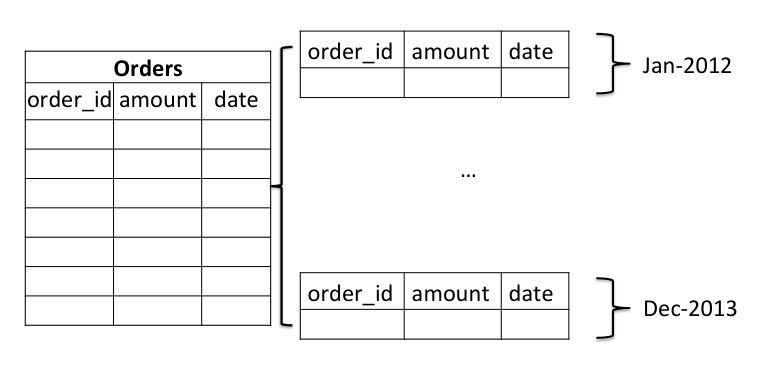

**图 1：按日期分区的 `orders` 表。**

```sql
SELECT avg(amount)
FROM orders
WHERE date BETWEEN '10-01-2013' AND '12-31-2013';
```

**图 2：可静态消除无关分区的示例查询。**

为评估该查询，只需要扫描最后三个分区，而不是构成 `orders` 表的全部 24 个分区。这种技术通常称为静态分区消除（static partition elimination），几乎所有支持分区的系统都实现了它 [9, 11, 16]。它根据查询中指定的谓词，在查询优化时静态确定需要扫描哪些分区。

客户也经常使用图 3 所示的星型模式设计来建模数据。事实表 `orders` 有一个外键指向单独的维表 `date_dim`。该模型是图 1 模型的规范化形式，可以指定日期的其他属性，例如“星期几”。事实表和维表可以独立分区。在本例中，事实表按外键 `date_id` 分区。针对该模式的查询通常需要把事实表与维表 join，此时静态分区消除并不总是可行。

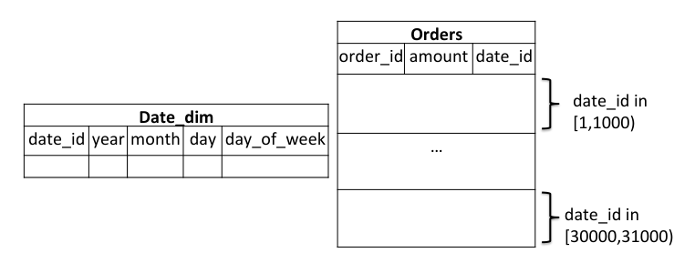

**图 3：事实表 `orders` 按 `date_id` 分区，外键位于维表 `date_dim` 中。**

```sql
SELECT avg(amount)
FROM orders
WHERE date_id IN (
  SELECT date_id
  FROM date_dim
  WHERE year = 2013
    AND month BETWEEN 10 AND 12
);
```

**图 4：只能在运行时评估部分查询后消除无关分区的示例查询。**

图 4 是原始图 2 查询的改写版本。现在必须把 `orders` 表与维表 join，才能找到匹配元组。在该查询中，`orders` 的分区键值事先未知，只能在运行时对维表上的子查询求值之后确定。这称为动态分区消除（dynamic partition elimination）。大多数数据库系统要么不支持它，要么只为简单查询和简单模式设计提供非常初级的支持。除了 join 引发的分区消除，还有其他场景中分区键在优化时未知，例如带参数的 prepared statement。该场景同样需要动态分区消除，因为参数值只有运行时才提供。

本文提出一种优化分区表复杂查询的新方法。主要贡献如下：

- 提出一个分区及分区表查询表示模型，具有如下性质：
  - 使用遵循 producer-consumer 范式的抽象算子：PartitionSelector 决定需要扫描哪些分区（producer），DynamicScan 消费 PartitionSelector 产生的分区 id 并实际扫描这些分区。
  - 生成的查询计划紧凑：计划大小与表中总分区数以及需要扫描的分区数无关。
  - 以统一方式支持静态和动态分区消除。
  - 方法独立于分区表的实际存储格式，可应用于存储层中多种分区表示模型。
- 提出分区消除算法，能够在查询计划中生成所有有意义的 PartitionSelector 放置方式。
- 支持高级分区方案，例如多级层次分区。
- 性能实验展示优化器生成计划相对于既有方法的效率。我们能够在复杂查询中识别分区消除机会，并实现查询运行时间的多倍改进。实验室结果也在 Pivotal Greenplum Database 的早期现场试用中得到确认，一些客户报告由于高级分区消除技术，查询运行时间实现了数倍改进。

本文其余部分组织如下：第 2 节介绍分区表查询模型并描述分区消除算法；第 3 节介绍 Pivotal MPP 系统中分区选择算法的实现；第 4 节展示该方法的效率；第 5 节回顾相关工作；第 6 节总结全文。

## 2. 优化分区表查询

### 2.1 定义

设模式为 $(A _ 1,\ldots,A _ n)$ 的表 $T$ 是一组元组 $\lbrace\langle a _ 1,\ldots,a _ n\rangle\rbrace$。如果存在分区函数：

$$
f _ T: pk\mapsto\lbrace T _ 1,\ldots,T _ n,\bot\rbrace,
$$

用于基于分区键值把元组 $t$ 分配到某个分区 $T _ i$，或分配到无效分区（记作 $\bot$），则称表 $T$ 在键 $pk\in\lbrace A _ 1,\ldots,A _ n\rbrace$ 上被逻辑划分为分区 $T _ 1,\ldots,T _ m$。后者意味着该元组无法映射到任何分区。对于分区表 $T$，用 $P(T)$ 表示其分区集合。

> **译者注：** 原文先把分区编号写为 $T _ 1,\ldots,T _ m$，但分区函数的值域写到 $T _ n$；此处按原式保留这一符号不一致。

注意，分区 $T _ 1,\ldots,T _ m$ 不一定必须在磁盘上物化。为简化讨论，假设给定一个逻辑分区对象 id（OID） $T _ i$，存储层能够定位并获取属于该分区的元组。

在大多数系统中，分区函数 $f _ T$ 实现类别分区或范围分区。还假设存在函数 $f _ T ^ \ast$：

$$
f _ T ^ \ast:\phi(pk)\mapsto\lbrace\ldots,T _ {i _ 1},\ldots\rbrace\subseteq P(T).
$$

对于给定的分区键谓词 $\phi(pk)$，该函数返回一组分区 OID $\lbrace T _ {i _ 1},\ldots,T _ {i _ m}\rbrace$，使得如果元组 $t$ 不属于这些分区，则 $t$ 不满足 $\phi$。换言之，函数 $f _ T ^ \ast$ 针对给定分区键谓词执行分区选择，返回所有可能满足该谓词的分区。注意，这样的函数总是存在，因为它可以简单返回 $P(T)$。对于形如 $pk=c$ 的谓词，函数 $f _ T ^ \ast$ 等同于把分区函数 $f _ T$ 应用于值 $c$。理想情况下，分区选择函数应返回满足给定谓词的最小分区 OID 集合，因为它将作为后续分区剪枝的基础。第 3 节讨论在商业 DBMS 中如何实现 $f _ T ^ \ast$ 以处理分区键上的复杂谓词。

> **译者注：** 原文把形式化条件写成 $t\notin\lbrace T _ {i _ 1},\ldots,T _ {i _ m}\rbrace$，直接将元组与分区 OID 集合比较，类型并不一致；上文按紧随其后的文字含义译为“ $t$ 不属于这些分区”，并在此照录原式而不猜测另一条公式。

### 2.2 分区表查询模型

为实现分区表扫描，我们把物理查询算子集合扩展为两个新构造：PartitionSelector 和 DynamicScan。这两个算子成对出现，采用 producer-consumer 模型。PartitionSelector 为 DynamicScan 计算分区 OID，而 DynamicScan 负责获取这些分区中的元组。PartitionSelector 可以通过共享内存或文献中已知的任何通信通道，把分区 OID 传给 DynamicScan。

第一个例子是对分区表执行简单全表扫描。设 $T$ 是一个包含分区 $T _ 1,\ldots,T _ {100}$ 的分区表，其中分区 $T _ i$ 保存满足 $pk\in[(i-1)\cdot 10+1,i\cdot 10)$ 的元组。图 5(a) 展示对 $T$ 执行全扫描的查询计划。计划左右两侧分别是 PartitionSelector 和 DynamicScan。PartitionSelector 产生所有子分区 OID $T _ 1,\ldots,T _ {100}$，并把它们发送给 DynamicScan 消费。计划树根部是 Sequence 算子，保证 PartitionSelector 先于 DynamicScan 执行。

通过改变 PartitionSelector 的形状及其在查询计划中的位置，可以实现更复杂的模式，例如基于等值谓词、范围谓词的分区选择，以及动态分区消除。图 5(b) 和图 5(c) 分别展示了 `T` 上等值选择和范围选择的查询计划。这里 PartitionSelector 带有查询中的分区选择谓词，中间表中的 OID 只包括可能满足选择谓词的分区 OID。

最后，图 5(d) 展示了对 join 查询完成动态分区消除的查询计划。注意，PartitionSelector 与 DynamicScan 位于相反一侧，其谓词 `R.A = T.pk` 引用了表 `R` 的值。当 join 的外侧（左侧）执行时，来自 `R` 的元组流入 PartitionSelector，分区选择函数会应用于这些值，从而根据 `R.A` 的值选择分区。在这种情况下，不需要 Sequence 算子，因为 Join 算子本身 enforcement 了子节点从左到右的执行顺序。

**图 5：使用不同 PartitionSelector 实现不同扫描模式。**  

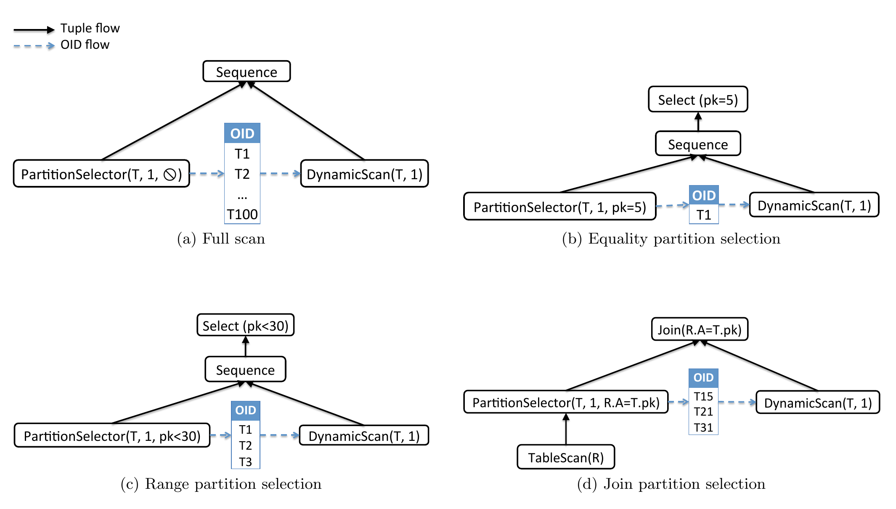

(a) 全扫描；(b) 等值分区选择；(c) 范围分区选择；(d) join 分区选择。

下面给出三个新算子的非正式定义。

**PartitionSelector。** 一个带有分区表 OID `T`、`partScanId` 标识符以及可选分区键谓词的算子。PartitionSelector 是带副作用的算子：基于 OID `T` 和给定谓词，它使用第 2.1 节定义的函数 `f*_T` 计算所有满足谓词的子分区 OID，然后把它们推给具有相同 `partScanId` 的 DynamicScan。`partScanId` 标识符用于在查询引用多个分区表，或同一分区表的多个实例时，区分不同的 `(PartitionSelector, DynamicScan)` 对。如果未指定谓词，PartitionSelector 获取 `T` 的所有子 OID。PartitionSelector 最多有一个子节点。如果有子节点，算子输出与其子节点相同；否则不产生输出。

**DynamicScan。** 一个负责从分区表 `T` 中扫描元组的算子。它带有分区表 OID 和 `partScanId`。DynamicScan 消费具有相同 `partScanId` 的 PartitionSelector 提供的分区 OID，并从这些分区中获取元组。

**Sequence。** 一个按顺序执行其子节点并返回最后一个子节点结果的算子。

该查询模型可以进一步泛化：把 DynamicScan 抽象为一个表返回函数，它基于运行时参数从分区表产生一组行。该抽象可用于描述文献中的若干方案 [9, 11]，其中分区选择和扫描由不同算子完成。例如，该模型的 Index-Join 实现由 join 的外侧子节点执行分区选择，计算需要扫描的分区键（参数值）；join 的内侧子节点通过查找分区键上的索引执行分区扫描。

在 MPP 数据库中实现该模型时，一个关键点是分区选择算子和扫描算子可能运行在不同机器上的进程或线程中。第 3 节描述如何处理这一挑战。

### 2.3 PartitionSelector 的放置

本节描述一种算法：给定带有 DynamicScan 的物理算子树，计算 PartitionSelector 的放置位置。通常，在表达式树中放置 PartitionSelector 有多种方式，但并非所有放置方式都能实现最优分区消除。运行示例使用图 6 的查询，它选择加州上一季度的所有销售记录。表 `date_dim` 和 `sales_fact` 分别按 `month` 和 `date_id` 分区。

```sql
SELECT *
FROM sales_fact s, date_dim d, customer_dim c
WHERE d.month BETWEEN 10 AND 12
  AND c.state = 'CA'
  AND d.id = s.date_id
  AND c.id = s.cust_id;
```

**图 6：选择上一季度所有销售记录的查询。**

> **译者注：** 原文图 6 的 `FROM` 子句在 `date_dim d` 与 `customer_dim c` 之间漏了逗号；为使查询可读、可运行，上述代码补入逗号，并在此明确记录这一源文排印错误。

算法输入是查询优化器生成的表达式树，其中扫描分区表使用 DynamicScan，但尚未放置 PartitionSelector。图 8(a) 展示了图 6 查询的一个可能表达式树。算法目标是找到 PartitionSelector 的最优放置方式，这里的最优性以需要扫描的分区数量最少为准。

本例中，算法结果见图 8(b)。结果计划中有两个 PartitionSelector。较低位置、ID 为 1 的选择器为 `date_dim` 的 DynamicScan 实现分区消除；PartitionSelector 2 使用 `date_dim` 上选择产生的值，为 `sales_fact` 实现动态分区消除。另一种可能放置方式是把 PartitionSelector 2 推到 join 的内侧，但该查询计划不会完成分区消除。

还要注意，DynamicScan 和对应 PartitionSelector 不需要是同一节点的直接子节点：在图 8(b) 中，它们在计划树中相隔多层。这展示了该方法在优化复杂分区表查询时的通用性。

为简化说明，本文给出递归版本算法。第 3.1 节说明这些算法如何在紧凑计划空间表示上实现，而不是只作用于一棵完整算子树。还要注意，PartitionSelector 放置算法与数据分布正交；数据分布指基础表经过哈希分布并放置在集群不同物理节点上。第 3 节详细说明如何在同一系统中结合分区和分布。

**算法 1：PlacePartSelectors。**

```text
Input : List inputPartSelectors, Expression expr
Output: Expression where all partition selection has been enforced

1  List partSelectorsOnTop;
2  List childPartSelectors;
3  expr.operator.ComputePartSelectors(
       inputPartSelectors,
       partSelectorsOnTop,
       childPartSelectors);
4  List newChildren;
5  foreach child in expr.children, childPartSelectorList in childPartSelectors do
6      Expression newChild = PlacePartSelectors(child, childPartSelectorList);
7      newChildren.Add(newChild);
8  end
9  return EnforcePartSelectors(partSelectorsOnTop, expr.Operator, newChildren);
```

主函数如算法 1 所示。它接受输入表达式 `expr` 和 `inputPartSelectorSpecs` 列表，返回所有 PartitionSelector 都已放置的表达式。每个 `PartSelectorSpec` 是对需要为每个未解析 DynamicScan 放置的 PartitionSelector 算子的紧凑规格。其结构见图 7，包含用于识别 DynamicScan 的 `partScanId`、分区键，以及可选的分区键谓词，可用于分区消除。最初 `partPredicate` 为 `NULL`，但随着 PartitionSelector 穿过不同算子被向下推，它可能被增强。

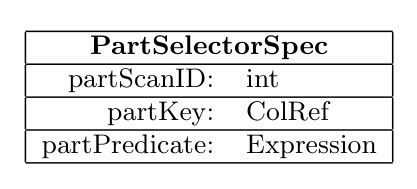

**图 7：PartSelectorSpec。**

`PlacePartSelectors` 函数的输入 `PartSelectorSpecs` 通过遍历树并识别所有需要对应 PartitionSelector 的 DynamicScan 初始化。该输入列表首先传给 `ComputePartSelectors`，这是计算的主驱动（第 3 行）。该函数为每种算子类型重载，计算哪些 PartitionSelector 需要放在当前算子上方（输出列表 `partSelectorsOnTop`），哪些需要推到子节点（输出列表 `childPartSelectors`）。算法 1 第 4 行计算出两个列表后，递归把必要的 PartitionSelector 推给子节点（第 6-7 行），再把其余 PartitionSelector 放在当前算子上方（第 9 行）。

> **译者注：** 原文正文称两个列表在算法 1 第 4 行计算完成，但实际函数调用位于第 3 行，第 4 行只是声明 `newChildren`；此处保留原文行号。

下面分别给出 `ComputePartSelectors` 在若干可消除分区算子上的实现，包括 Join（第 2.3.3 节）、Select（第 2.3.2 节），以及不可消除分区算子的默认实现（第 2.3.1 节）。算法使用的辅助函数如下：

- `EnforcePartSelectors`：给定算子和需要在上方 enforcement 的 PartitionSelector 列表，构造一棵在上方放置这些 PartitionSelector 的新表达式树。
- `Operator::HasPartScanId`：检查具有给定 part scan id 的 DynamicScan 是否位于以当前算子为根的表达式树作用域中。
- `FindPredOnKey`：给定一个标量表达式，抽取引用给定列的谓词。
- `Conj`：构造给定谓词的合取。

#### 2.3.1 默认 PartitionSelector 放置

下列伪代码给出 `ComputePartSelectors` 的默认实现，用于没有分区过滤谓词的算子，例如 GroupBy、Union、Project 等。它只是把 `PartSelectorSpec` 推到定义具有给定 `partScanId` 的 DynamicScan 的子表达式中（第 8 行）；如果 DynamicScan 不在以该算子为根的子树中，则把它放在当前算子上方（第 3 行）。

**算法 2：`Operator::ComputePartSelectors`。**

```text
Input : List inputPartSelectors, List partSelectorsOnTop,
        List childPartSelectors
Output: Compute default partition selectors for operators

1  foreach partSpec in inputPartSelectors do
2      if !this.HasPartScanId(partSpec.partScanId) then
3          partSelectorsOnTop.Add(partSpec);
4      end
5      else
6          foreach child operator op do
7              i = order of op among children;
8              if op.HasPartScanId(partSpec.partScanId) then
9                  childPartSelectors[i].Add(partSpec);
10             end
11         end
12     end
13 end
```

#### 2.3.2 Select 的 PartitionSelector 放置

算法 3 展示 Select 算子的 `ComputePartSelectors` 实现。对每个输入 `PartSelectorSpec`，首先检查对应 part scan 是否定义在以 Select 算子为根的子树中（第 2 行）。如果不在，则在 Select 上方 enforcement。如果在下方，则把 `PartSelectorSpec` 推给子节点；但在此之前，抽取分区键上的分区过滤谓词，并把它加入 `PartSelectorSpec`（第 6-13 行），方法是先与从上方传来的谓词构造合取。

图 8(c) 展示了该函数在图 8(a) 示例上的一次运行。id 为 1 的 DynamicScan 定义在 Select 子树中，因此继续推给子节点。同时，由于 Select 的谓词涉及分区键 `month`，该谓词会加入传给子节点的 `PartSelectorSpec`。id 为 2 的 DynamicScan 不在 Select 子树中，因此其 PartitionSelector 需要在 Select 算子上方解析。

**算法 3：`Select::ComputePartSelectors`。**

```text
Input : List inputPartSelectors, List partSelectorsOnTop,
        List childPartSelectors
Output: Compute partition selectors for Select operator

1  foreach partSpec in inputPartSelectors do
2      if !this.HasPartScanId(partSpec.partScanId) then
3          partSelectorsOnTop.Add(partSpec);
4      end
5      else
6          Expression partKeyPredicate =
               FindPredOnKey(partSpec.partKey, this.Predicate());
7          if partKeyPredicate found then
8              PartSelectorSpec newPartSpec =
                   new PartSelectorSpec(
                     partSpec.partScanId,
                     partSpec.partKey,
                     Conj(partKeyPredicate, partSpec.partPredicate);
9              childPartSelectors[0].Add(newPartSpec);
10         end
11         else
12             childPartSelectors[0].Add(partSpec);
13         end
14     end
15 end
```

> **译者注：** 原文算法 3 第 8 行在 `Conj(...)` 之后缺少关闭 `new PartSelectorSpec(...)` 的右括号；此处按原文保留。

#### 2.3.3 Join 的 PartitionSelector 放置

算法 4 展示 Join 算子的 `ComputePartSelectors` 实现。与默认实现和 Select 实现一样，首先检查给定 part scan 是否在以 Join 算子为根的子树作用域中（第 2 行）。如果不在，则需要在 Join 上方 enforcement。否则，检查它是否定义在外侧。回忆本文模型中 DynamicScan 是 consumer，PartitionSelector 是 producer。因此，如果 DynamicScan 定义在 Join 算子的外侧，就不能把 PartitionSelector 放在内侧，因为这会破坏 producer 与 consumer 之间的执行顺序。该检查由第 7-8 行实现。

如果 DynamicScan 定义在内侧，则检查 join 谓词是否包含分区键上的条件，且该条件可用于分区消除。如果有，则把 `PartSelectorSpec` 推到外侧（第 16 行）；否则它需要在内侧、靠近 DynamicScan 定义的位置解析。

图 8(d) 展示该函数在图 8(a) 示例上的运行。id 为 1 的 DynamicScan 定义在 HashJoin 外侧，因此对应 PartSelectorSpec 继续向外侧子节点推。id 为 2 的 DynamicScan 定义在内侧子节点，而 HashJoin 谓词限制了分区键 `date_id`。这意味着可以通过把 PartSelectorSpec 推到外侧来做分区剪枝。该 join 节点的 `ComputePartSelectors` 输出显示：没有 PartitionSelector 放到“on top”列表，也没有推到 HashJoin 内侧子节点；因此 scan id 1 和 2 的两个 PartitionSelector 都会放到 join 外侧。

**算法 4：`Join::ComputePartSelectors`。**

```text
Input : List inputPartSelectors, List partSelectorsOnTop,
        List childPartSelectors
Output: Compute partition selectors for join

1  foreach partSpec in inputPartSelectors do
2      if !this.HasPartScanId(partSpec.partScanId) then
3          partSelectorsOnTop.Add(partSpec);
4      end
5      else
6          Expression partKeyPredicate =
               FindPredOnKey(partSpec.partKey, this.Predicate());
7          bool definedInOuterChild =
               children[0].HasPartScanId(partSpec.partScanId);
8          if definedInOuterChild then
9              childPartSelectors[0].Add(partSpec);
10         end
11         else if partKeyPredicate not found then
12             childPartSelectors[1].Add(partSpec);
13         end
14         else
15             PartSelectorSpec newPartSpec =
                   new PartSelectorSpec(
                     partSpec.partScanId,
                     partSpec.partKey,
                     Conj(partKeyPredicate, partSpec.partPredicate);
16             childPartSelectors[0].Add(newPartSpec);
17         end
18     end
19 end
```

> **译者注：** 原文算法 4 第 15 行与算法 3 相同，也缺少关闭 `new PartSelectorSpec(...)` 的右括号；此处按原文保留。

**图 8：在表达式中放置 PartitionSelector。**  

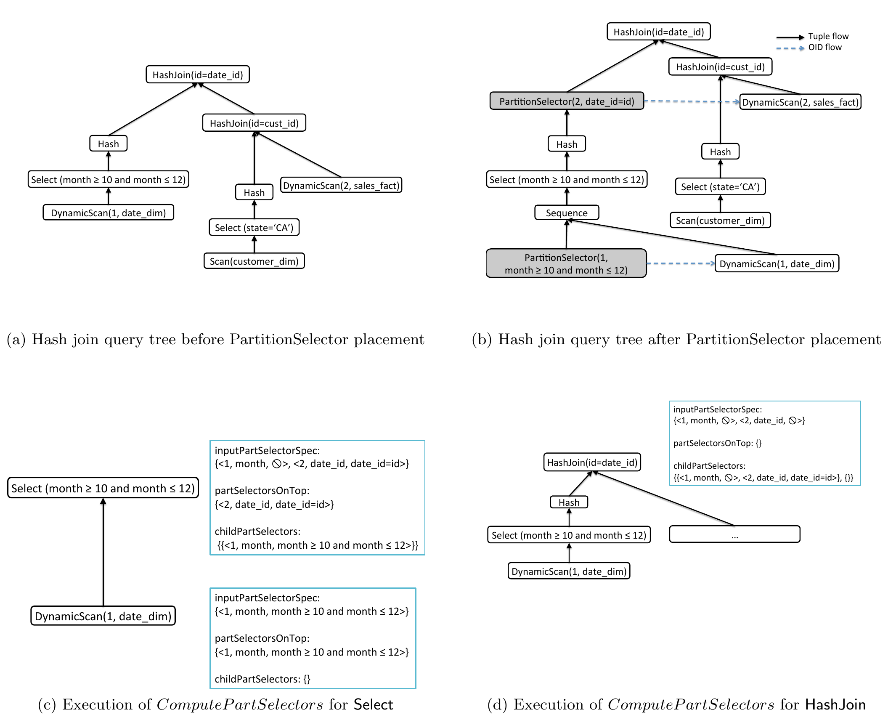

(a) 放置前的 HashJoin 查询树；(b) 放置后的查询树；(c) Select 上 `ComputePartSelectors` 的执行；(d) HashJoin 上 `ComputePartSelectors` 的执行。

### 2.4 多级分区表

大多数数据库系统也支持层次分区，其中表按多个层级分区。图 9 展示了这种分区方案的一个例子。`orders` 表使用两级分区。第一级使用 `date` 列，使每个分区包含一个月的数据。这些分区再使用 `region` 列进一步划分为子分区。针对该表的查询可以指定特定日期范围、地区，或两者都指定。系统可以使用这些条件避免扫描不会产生结果的分区。

为支持多级分区，需要扩展前文的数据结构和算法。第 2.2 节定义的 PartitionSelector 需要扩展为带有一组可选谓词，而不是单个可选谓词。基于 OID `T` 和给定谓词集合，它计算所有满足谓词的叶级子分区 OID。以图 9 的 `orders` 表为例，图 10 展示了若干可能传给 PartitionSelector 的谓词，以及它在每种情况下计算得到的子分区 OID。

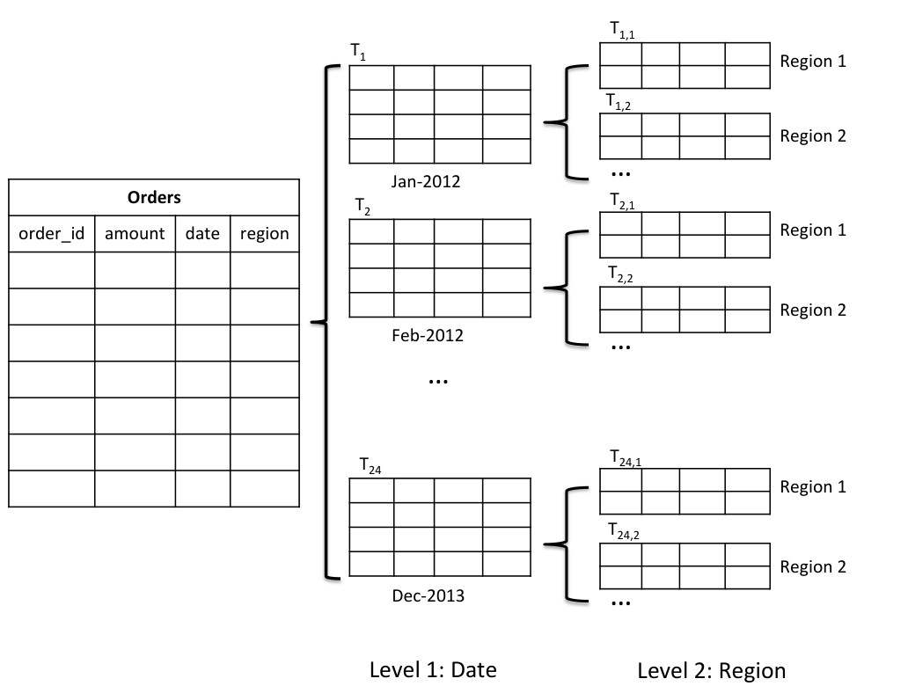

**图 9：按 date 和 region 的多级分区。**

```text
partPredicate                                  Partition OIDs
date = 'Jan-2012'                              T_{1,1}, T_{1,2}, ..., T_{1,n}
region = 'Region 1'                            T_{1,1}, T_{2,1}, ..., T_{24,1}
date = 'Jan-2012' AND region = 'Region 1'      T_{1,1}
φ                                              所有叶级分区 OID
```

**图 10：多级分区选择。**

图 7 的 `PartSelectorSpec` 需要扩展为支持 `partKeys` 列表和谓词列表，如图 11 所示。两个列表的元素数量必须相等，并且等于该 `PartSelectorSpec` 所定义表的分区层级数。注意，`partPredicates` 列表中的某些元素可以为空，表示对应 `partKey` 上没有谓词。

```text
PartSelectorSpec
partScanID: int
partKeys: List<ColRef>
partPredicates: List<Expression>
```

**图 11：扩展后的 PartSelectorSpec。**

算法的唯一变化是：算法 3 和算法 4 中使用的 `FindPredOnKey` 函数必须扩展为接受 `partKeys` 列表，并返回与这些 key 对应的谓词列表。如果未发现分区过滤谓词，该函数返回 `NULL`。

## 3. 实现

Greenplum Database（GPDB）是 Pivotal 的大规模并行关系数据库系统。HAWQ [12] 是 Pivotal 面向 Hadoop 的 SQL 引擎。两个 Pivotal 产品都使用 Orca [15]，这是一个专门为支持不同计算架构中的大规模分析处理而设计的新查询优化器。本节先在第 3.1 节描述 Orca 内部分区选择的实现，再在第 3.2 节描述运行时环境。

### 3.1 查询优化

在 MPP 系统中，数据可以分布到不同主机或物理机器上。查询执行期间，可以用多种方式 enforcement 中间结果分布，包括：哈希分布，根据某个哈希函数把元组分布到主机；复制分布，在每个主机上存放完整表副本；单点分布，把整个分布式表从多个主机收集到单个主机。数据分布与分区正交。也就是说，一个分布式表也可以在每台主机上分区。

查询计划可以通过特殊的 Motion 算子 enforcement 特定数据分布。查询执行期间，Motion 算子是两个活动进程之间的边界，这两个进程发送/接收数据，并可能运行在不同主机上。这限制了能执行分区选择的合法计划形状，因为本文依赖共享内存完成 PartitionSelector 与 DynamicScan 算子之间所需的通信（见第 2.2 节）。具体而言，优化器必须保证一对通信的 PartitionSelector 和 DynamicScan 算子在同一个进程中运行。这意味着在 PartitionSelector、DynamicScan 及其最低公共祖先之间不能存在 Motion 算子。

图 12 展示了基于上述约束的合法与非法计划例子。一般来说，很难直接约束任意复杂计划的形状，尤其当 PartitionSelector 和 DynamicScan 出现在相距较远的子树中时。下面说明查询优化器如何以原则化方式处理该 requirement。

**图 12：Motion 与 PartSelector 的相互作用。**

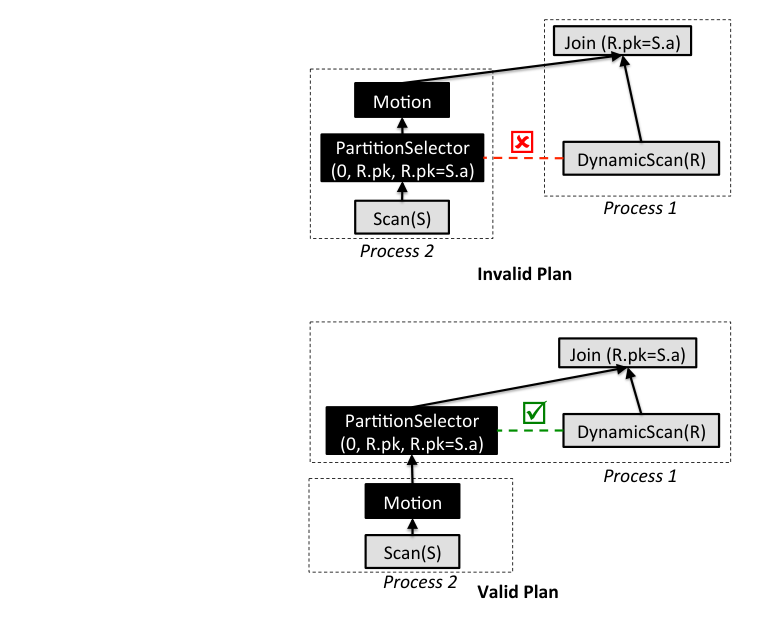

Orca 是基于 Cascades 优化框架 [6] 的新 Pivotal 查询优化器。Orca 把优化器搜索空间紧凑编码在 Memo 结构中。Memo 由一组容器组成，称为 group；每个 group 包含逻辑等价表达式，称为 group expression。每个 group expression 是一个算子，子节点为其他 group。这种递归 Memo 结构可以紧凑表示非常大的计划替代空间。图 13 展示一个 Memo 例子。算子之间的依赖通过 group 引用编码。例如，Group 0 中的 `HashJoin[1,2]` 是一个 group expression，它有两个子 group：1 和 2。

使用如下简单查询说明 Orca 中分区表查询优化：

```sql
SELECT *
FROM R, S
WHERE R.pk = S.a;
```

其中 `R` 和 `S` 是哈希分布表，`R` 是按分区键 `R.pk` 分区的表，`S` 是非分区表。

Orca 有可扩展的属性 enforcement 框架，把数据分布、分区选择等 requirement 建模为物理属性。给定计划可以自己满足某个物理属性（例如哈希分布表输出哈希分布数据），也可以在计划中插入 enforcer 算子（例如 Motion）来提供所需属性。PartitionSelector 算子就是分区选择属性的 enforcer。

图 13 展示前述查询的部分 Memo 结构。图中用黑框区分 enforcer 算子。Enforcer 的子节点属于包含 enforcer 自身的同一个 group。例如，`Redistribute(R.pk)[1]` 是一个 enforcer，它使用 Group 1 中的子算子提供 `Hashed(R.pk)` 分布。类似地，`Replicate[2]` 是一个 enforcer，使用 Group 2 中的子算子提供复制数据分布。向同一 group 添加多个 enforcer 可以考虑被 enforcement 属性的不同排列，同时丢弃非法排列。

优化从一个初始优化请求开始，该请求提交到与查询表达式 root 对应的 Memo group。提交到 Memo group `g` 的优化请求 `r`，通过寻找满足 `r` 且以 `g` 中某个算子为根的最低估算代价计划来计算。称这种计划的根算子为请求 `r` 的最佳 group expression（best GExpr）。

对 `g` 的每个传入优化请求，`g` 中每个 group expression 会根据算子的局部 requirement 创建发往子 group 的对应请求。图 13 展示了 group 哈希表，其中每个传入优化请求被缓存，并关联到它的最佳 GExpr。某些 group expression 下方的小表展示了传入请求与子请求之间的相关映射。

在示例查询中，假设初始优化请求是 Group 0 中的 `req. #1: {Any, <0, R.pk, phi>}`。该请求指定结果可以有任意数据分布，但必须为表 0（即 `R`）选择分区。优化 Group 0 中的 HashJoin 算子以满足该请求时，需要考虑额外的局部 requirement，即基于条件 `R.pk = S.a` 把要 join 的元组放在同一位置。这可以通过多种方式完成，包括：请求一个子节点被复制而另一个子节点为任意分布；或者请求 `S` 分布为 `Hashed(S.a)`、`R` 分布为 `Hashed(R.pk)`。对于分区选择，HashJoin 根据 join 子节点隐式从左到右的执行顺序，在其左子节点中请求使用有意义的分区选择条件 `R.pk = S.a`。这些不同优化替代方案被枚举并编码为不同优化请求，如图 13 所示。

Memo 通过为每个算子维护“已计算优化请求到对应子优化请求”的映射来编码合法计划。例如，图 13 中 Group 2 的 PartitionSelector 下方小表表示：以 PartitionSelector 为根、满足 `req. #8` 的最佳计划，需要 Group 2 中满足 `req. #6` 的子计划。该计划由 Replicate 算子给出，而 Replicate 又需要满足 `req. #7` 的子计划，即 Scan(S)。

考虑 Group 0 中的 `HashJoin[2,1]` 算子。一对优化请求会生成给子 group：Group 2 的 `req. #8: {Replicated, <0, R.pk, R.pk=S.a>}`，以及 Group 1 的 `req. #5: {Any, <>}`。为使用 Group 2 中以 Replicate 为根的计划满足 `req. #8`，不能考虑把 PartitionSelector 作为其子节点。原因是这样的计划会让分区选择 producer 与 consumer 之间的通信不可能完成，如本节开头所述。另一方面，当考虑 Group 2 中以 PartitionSelector 为根的计划时，可以考虑 Replicate 作为其子节点。Orca 通过允许每个算子禁止在其上方 enforcement 某些属性来实现这一能力。每当考虑一个计划替代方案时，都会执行算子特定逻辑，保证 enforcer 按正确顺序插入。

图 14 展示与图 13 部分 Memo 对应的部分计划空间。Plan 1、2 和 3 由 `HashJoin[1,2]` 产生的优化请求生成；Plan 4 由 `HashJoin[2,1]` 产生的优化请求生成。唯一执行分区选择的是 Plan 4，它的代价是复制 `S`。Orca 的代价模型会考虑这些不同替代方案并选择最佳计划。

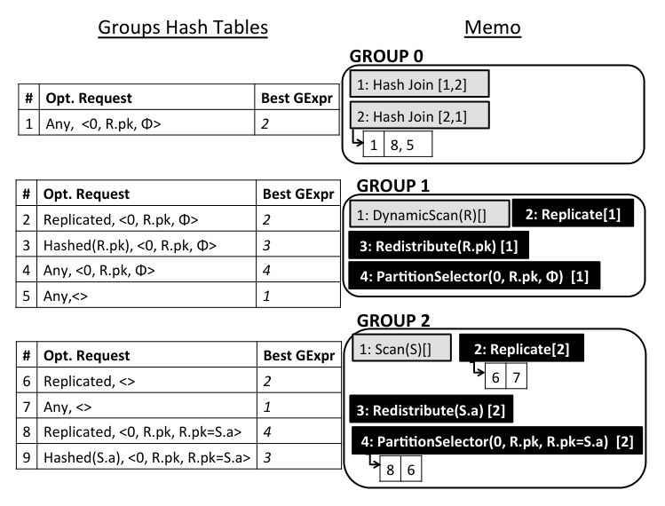

**图 13：部分 Memo。**

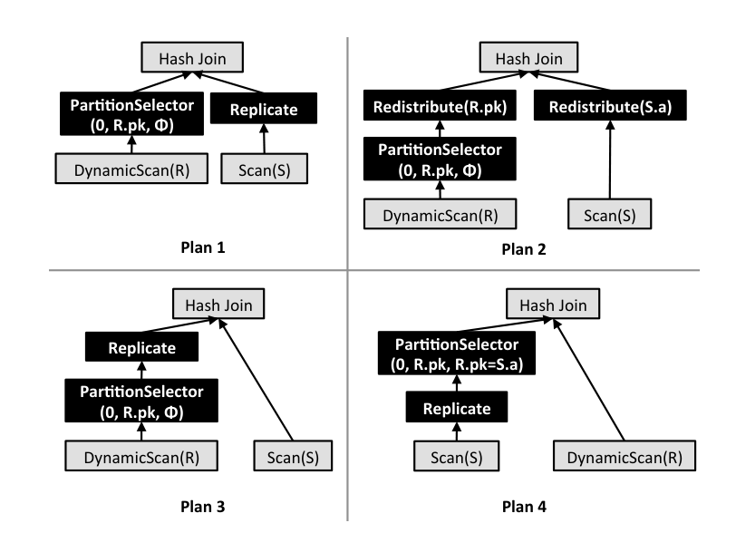

**图 14：部分计划空间。**

### 3.2 运行时环境

GPDB 和 HAWQ 允许用户通过为每个分区指定范围或类别约束来对表分区。在磁盘上，分区表示为单独的物理表，并带有关联 check constraint，用于表示分区键上的对应约束。注意，每个约束都可以写成 $pk\in\bigcup _ i(a _ {i1},a _ {ik})$ 的形式，其中 $(a _ {i1},a _ {ik})$ 是开区间或闭区间，也可能是无界区间。该表示也覆盖类别分区，因为区间的起点和终点可以重合。

为实现 PartitionSelector 算子，系统结合使用专用内置函数和已有查询算子来调用这些函数。内置函数在查询执行期间获取分区表的元数据信息，查询计划可以在其上方放置过滤算子，以只选择需要扫描的分区。

| 函数 | 返回类型 | 描述 |
| --- | --- | --- |
| `partition_expansion(rootOid)` | `setof(OID)` | 给定 root OID 的所有子分区 OID 集合 |
| `partition_selection(rootOid, value)` | `OID` | 包含给定分区键值的子分区 OID |
| `partition_constraints(rootOid)` | `(OID, min, minincl, max, maxincl)` | 子分区 OID 及其约束集合 |
| `partition_propagation(partScanId, oid)` | `void` | 把给定分区 OID 推送给具有给定 id 的 DynamicScan |

**表 1：内置分区选择函数。**

前三个函数以不同形式获取分区元数据；最后一个函数 `partition_propagation` 则把选中的分区 OID 从 PartitionSelector 推送给具有给定 id 的 DynamicScan。

图 15(a) 和 15(b) 分别展示图 5(d) 与图 5(c) 中基于等值和范围的 PartitionSelector 实现。为实现基于等值的分区选择（图 15(a)），系统用 join 参数作为分区键值调用 `partition_selection` 函数，并把得到的 OID 传给 `partition_propagation`，后者把该 OID 推给 DynamicScan。为实现基于范围的分区选择（图 15(b)），系统调用 `partition_constraints` 函数，返回所有子分区及其范围约束。函数调用上方的 selection 只选择范围起点小于查询中指定常量的分区，上方的 Project 把通过过滤的元组 OID 传播给 DynamicScan。

注意，在这种方法中，“静态”和“动态”分区选择以统一方式实现。例如，要实现图 5(b) 中的“静态”分区消除，需要用查询中的常量调用 `partition_selection`；而在图 15(a) 中，传入的是来自表的值。

**图 15：运行时环境中 PartitionSelector 的实现。**  

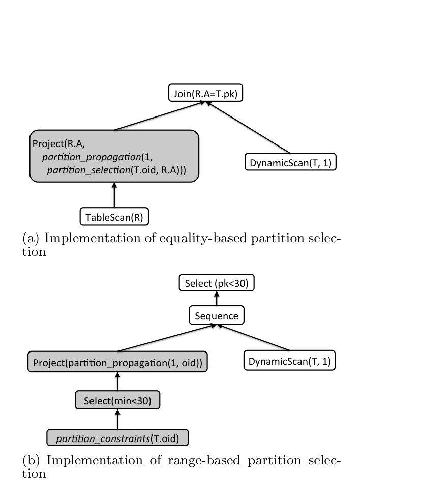

(a) 基于等值的分区选择实现；(b) 基于范围的分区选择实现。

## 4. 实验

本节给出实验评估。实验目标是展示：第一，本文分区模型不会在表扫描中引入明显开销；第二，分区消除算法有效；第三，该模型保证查询计划大小紧凑且可扩展。

### 4.1 设置

实验使用一个四节点集群，节点之间通过 10Gbps 以太网连接。每个节点有双路 Intel Xeon 八核 Sandy Bridge 2.7GHz 处理器、64GB RAM，以及 12 块 600GB SAS 磁盘，组成两个 RAID-5 组。操作系统为 Red Hat Enterprise Linux 5.5。

分区消除实验使用 256GB TPC-DS 基准 [1] 及分区表。TPC-DS 是工业标准决策支持基准，由一组复杂业务分析查询组成。它的 25 张表、429 列和 99 个查询模板能够很好表示现代决策支持系统，并且是测试查询优化器的优秀基准。

### 4.2 分区开销

本节展示该方法相对于分区数量的可扩展性。实验使用 TPC-H 基准 [2] 中的 `lineitem` 表，其中包含 7 年数据，并运行简单查询：

```sql
SELECT * FROM lineitem;
```

实验改变分区数量，使用若干常见分区场景，如表 2 所示。该表还展示这些场景相对于未分区 `lineitem` 表引入的开销。结果显示，分区不会引入显著开销，并且无论分区数量如何，全扫描查询的性能都保持稳定。这使分区成为一种非常可扩展的性能改进方法。

| 分区数 | 描述 | 开销 |
| ---: | --- | ---: |
| 42 | 每个分区表示 2 个月 | 3% |
| 84 | 按月分区 | 3% |
| 169 | 按双周分区 | 1% |
| 361 | 按周分区 | 2% |

**表 2：对 `lineitem` 分区。**

### 4.3 分区消除效果

本节使用 TPC-DS 基准 [1] 的一个子集展示分区消除方法的有效性。实验比较 Orca 与 GPDB 的旧查询优化器 Planner。该工作负载包含引用分区表的 TPC-DS 查询，涉及 `store_sales`、`web_sales`、`catalog_sales`、`store_returns`、`web_returns`、`catalog_returns` 和 `inventory`。

我们分别使用 Planner 和 Orca 运行整个工作负载。表 3 展示了基于分区消除效果对工作负载的高层分类。80% 的查询中，Orca 的分区消除算法与 Planner 一样好。14% 的工作负载中，Orca 成功消除比 Planner 更多的分区，从而降低扫描代价。6% 的工作负载（最后两类）中，Orca 产生了次优计划，没有消除分区或消除的分区少于 Planner。这些次优计划部分源于基数估计错误或需要进一步调优的次优代价模型参数。我们正在积极研究并持续改进 Orca。

| 类别 | 百分比 |
| --- | ---: |
| Orca 消除分区，Planner 不消除 | 11% |
| Orca 比 Planner 消除更多分区 | 3% |
| Orca 和 Planner 消除分区效果相同 | 80% |
| Orca 比 Planner 消除更少分区 | 3% |
| Orca 不消除分区，Planner 消除 | 3% |

**表 3：工作负载分类。**

图 16 展示整个工作负载中每张表扫描的分区数量总和。可以看到，使用 Orca 时每张表扫描的分区数都小于使用 Planner 时扫描的分区数。Orca 的分区消除方法最多消除 80% 的分区，例如在 `web_returns` 表上。

上述实验没有报告绝对运行时间，因为 Orca 相比旧 Planner 包含多项改进，很难在两个系统之间量化单独由分区选择带来的运行时收益。Orca 的完整性能研究，包括与 Planner 及竞争系统的比较，不在本文范围内，另有文献介绍 [15]。

为本文目的，我们又使用上述 TPC-DS 基准执行另一个实验：在 Orca 中以两种配置运行同一工作负载。一种启用分区选择，另一种禁用分区选择，其余参数保持相同。图 17 展示启用分区选择后每个查询获得的相对提升。提升表示为不启用分区选择时运行时间的百分比，因此 50% 的提升表示查询运行时间减半，百分比越大表示节省越多。可以看到，分区选择在不同程度上普遍加速执行时间，对短查询和长查询都有帮助。超过一半查询提升超过 50%，超过 25% 的查询提升超过 70%。图 17 也展示了短查询组中的一个大异常值，以及中长查询组中的两个小异常值，这些查询在开启分区选择时性能退化。我们调查发现，这些异常值是 Orca 在分区选择场景下选择次优计划造成的，原因归结于代价模型参数调优不完善。

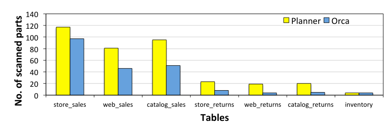

**图 16：分区消除。**

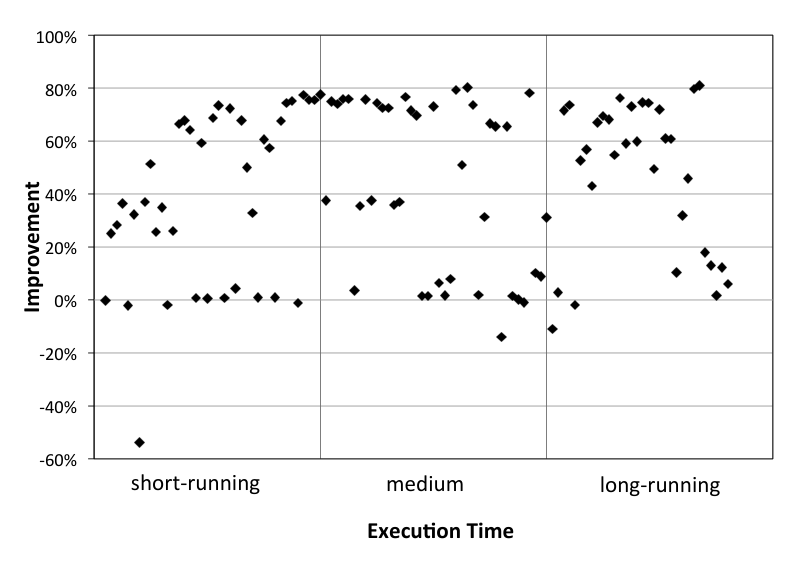

**图 17：启用分区选择时执行时间的相对改进。**

### 4.4 计划大小比较

我们还进行实验，展示该方法相对于计划大小的可扩展性。实验比较 Orca 与 Planner 生成的计划。Planner 中分区基于 PostgreSQL inheritance 机制，查询计划显式列出所有需要扫描的分区。注意，这也是相关工作中采用的方法 [7]。

#### 4.4.1 带有常量分区消除谓词的查询

本实验使用 TPC-H 基准中的分区 `lineitem` 表，并运行简单选择查询，该查询使用形如 `l_shipdate < X` 的谓词限制需要扫描的分区数量。通过改变 `X`，生成选择 1%、25%、50%、75% 和 100% 分区的查询。图 18(a) 展示 Orca 的查询计划大小保持不变，而 Planner 的计划大小随着需要扫描并显式枚举在计划中的分区数量线性增长。

#### 4.4.2 带有 Join 分区消除谓词的查询

本实验考虑合成生成的表 $R(a,b)$ 和 $S(a,b)$，二者分别按 $R.b$ 和 $S.b$ 分区。实验改变每个表的分区数量，并执行如下 join 查询：

```sql
SELECT *
FROM R, S
WHERE R.b = S.b
  AND S.a < 100;
```

Planner 支持动态分区消除：必要的分区 OID 在运行时计算并存入参数，然后传给实际 join 查询计划，后者使用该参数判断给定分区是否需要扫描。然而，查询计划仍然必须列出所有分区，因为优化时不知道哪些分区会被消除。因此，如图 18(b) 所示，查询计划大小是分区数量的函数。

图中 Orca 的测量计划大小也显示出对分区数量的某些依赖。这是因为 segment 节点上复制元数据的方式存在限制，导致第 3.2 节中分区函数需要的一部分元数据必须嵌入查询计划结构，并随计划一起发送给 segment 节点。实际查询计划大小确实与分区数量无关，其形状如图 8(b) 所示。

#### 4.4.3 分区表上的 DML 查询

本实验使用第 4.4.2 节中的表 $R$ 和 $S$。执行如下 DML 语句，用来自 $S$ 的值更新表 $R$：

```sql
UPDATE R
SET b = S.b
FROM S
WHERE R.a = S.a;
```

图 18(c) 显示 Planner 生成的计划大小随表中分区数量呈二次增长，因为计划需要枚举各个分区之间的所有 join 组合。在 Orca 中，不需要这种枚举，因此计划大小几乎保持不变。再次说明，Orca 计划大小的小幅变化来自前一实验指出的元数据目录低效，而不是实际计划形状。

**图 18：不同查询模式下 Planner 与 Orca 的计划大小比较。**  

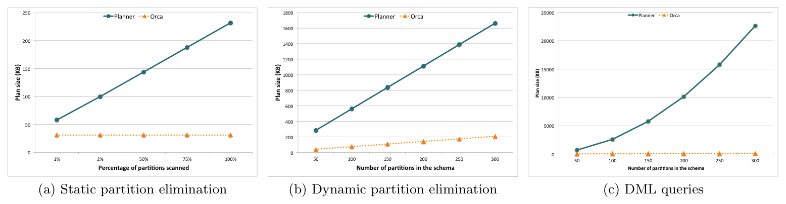

(a) 静态分区消除；(b) 动态分区消除；(c) DML 查询。

## 5. 相关工作

本节回顾在查询分区表时利用潜在查询优化机会的相关工作。大多数 DBMS（IBM DB2 [9]、Oracle [11]、Microsoft SQL Server [16]）都支持单级和多级分区。在这些系统中，静态分区消除通常发生在查询优化期间，selection 谓词用于确定扫描哪些分区，并且执行计划只引用这些分区。

动态分区消除通过在运行时绑定 join 变量，并计算符合条件的分区以供扫描来工作。此外，Oracle [11] 支持 partition-wise join，用于两个分区表在对应分区键上 join 的情况。此时，join 被拆分成较小 join，其中第一个表中的每个分区只与另一个表中匹配的分区 join。虽然这些系统实现了某种形式的动态分区消除，但我们只能找到少量单级等值 join 的简单示例，没有说明查询优化器如何选择这些计划，也没有说明这些技术是否适用于复杂查询，还是只处理简单 join 模式。据我们所知，本文是第一个全面研究如何为复杂查询实现动态分区消除技术，并将其集成到 MPP 系统一般用途查询优化器中的工作。

近期一项研究 [7] 向 PostgreSQL 优化器加入了面向分区表查询的复杂优化技术。该工作假设星型或雪花模式，其中维表和事实表按相同列分区。其方法作用于 partition-wise join，并基于分区约束的包含关系消除不可能产生结果的 join。虽然该方法对其假设模式效果很好，但它没有把计划大小与分区数量解耦。当处理数千个分区时，这是一个重大问题。此外，它不能直接应用于 MPP 系统。

随着 Hadoop 快速成为大数据分析的流行生态，许多 SQL on Hadoop 方案被提出。开源方案如 Cloudera Impala [10]、Facebook Presto [5] 和 Hortonworks Stinger [8] 只支持继承自 Hive [4] 的静态分区消除。虽然 Hive 曾提出动态分区消除 [13]，但当时尚未实现；Pivotal 的 HAWQ [12] 使用 Orca，并以统一方式支持静态和动态分区消除。

寻找好的分区方案属于数据库物理设计调优的一部分，不在本文范围内。不过已有多种自动寻找良好分区方案的技术 [3, 14]。

## 6. 总结

MPP 数据库系统的分布式特性在处理分区表时带来了独有挑战。关键在于找到一种抽象：它既能很好地嵌入现代查询优化器的基本构件，又能满足面向性能的可扩展性要求。

本文提出一种方法，把分区表及所有相关访问方法表示为代数元素。由此形成的框架使查询优化器能够探索多种计划替代方案。更重要的是，本文设计强调动态计划：是否访问某个分区 - 这可能带来可观 I/O 代价 - 的决策可以推迟到查询执行阶段，从而利用优化时未知的底层数据具体特征。

本文系统已作为 Orca 优化器计划的一部分，在 Pivotal Greenplum Database 中实现，并已在生产部署中证明非常有效。

未来工作计划处理若干高级主题，包括索引、更好的代价建模，以及与其他优化的完整互操作性。

## 7. 参考文献

[1] TPC-DS. http://www.tpc.org/tpcds, 2005.

[2] TPC-H. http://www.tpc.org/tpch, 2009.

[3] S. Agrawal, V. Narasayya, and B. Yang. Integrating Vertical and Horizontal Partitioning into Automated Physical Database Design. In SIGMOD, 2004.

[4] Apache. Hive. http://hive.apache.org/, 2013.

[5] L. Chan. Presto: Interacting with petabytes of data at Facebook. http://prestodb.io, 2013.

[6] G. Graefe. The Cascades Framework for Query Optimization. IEEE Data Eng. Bul., 18(3), 1995.

[7] H. Herodotou, N. Borisov, and S. Babu. Query Optimization Techniques for Partitioned Tables. In SIGMOD, 2011.

[8] Hortonworks. Stinger, Interactive query for Apache Hive. http://hortonworks.com/labs/stinger/, 2013.

[9] IBM. DB2 Partitioned Tables. http://publib.boulder.ibm.com/infocenter/db2luw/v9r7/topic/com.ibm.db2.luw.admin.partition.doc/doc/c0021560.html, 2007.

[10] M. Kornacker and J. Erickson. Cloudera Impala: Real-Time Queries in Apache Hadoop, for Real. http://www.cloudera.com/content/cloudera/en/products-and-services/cdh/impala.html, 2012.

[11] T. Morales. Oracle Database VLDB and Partitioning Guide 11g Release 1 (11.1). 2007.

[12] Pivotal. HD: HAWQ. http://www.gopivotal.com/sites/default/files/Hawq_WP_042313_FINAL.pdf, 2013.

[13] L. J. Pullokkaran and L. Leverenz. MapJoin and Partition Pruning. https://cwiki.apache.org/confluence/display/Hive/MapJoin+and+Partition+Pruning, 2013.

[14] J. Rao, C. Zhang, N. Megiddo, and G. M. Lohman. Automating Physical Database Design in a Parallel Database. In SIGMOD, 2002.

[15] M. A. Soliman, L. Antova, V. Raghavan, A. El-Helw, Z. Gu, E. Shen, M. Petropoulos, F. Waas, S. Narayanan, K. Krikellas, and R. Baldwin. Orca: A Modular Query Optimizer Architecture for Big Data. In SIGMOD, 2014.

[16] R. Talmage. Partitioned Table and Index Strategies Using SQL Server 2008. 2009.
