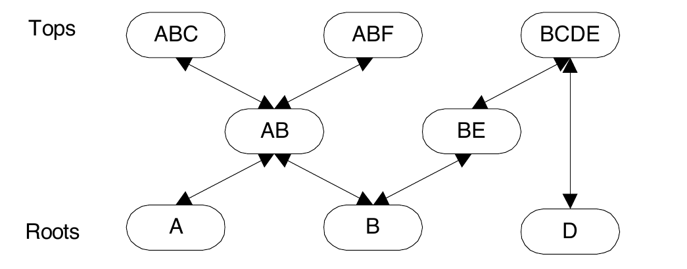
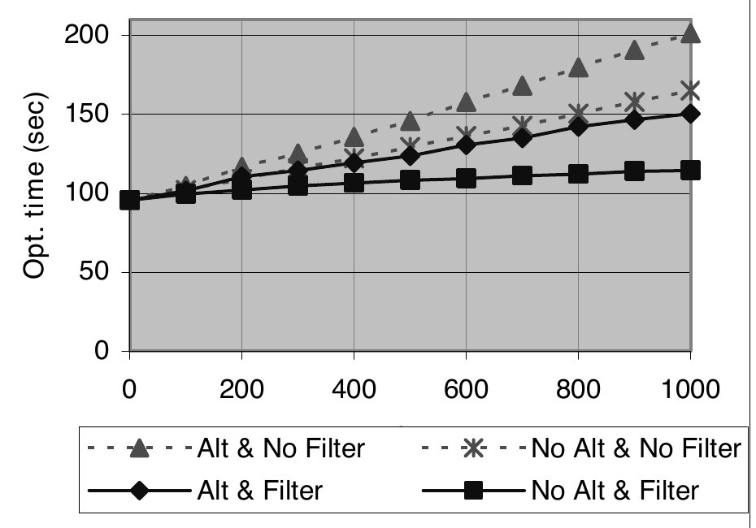
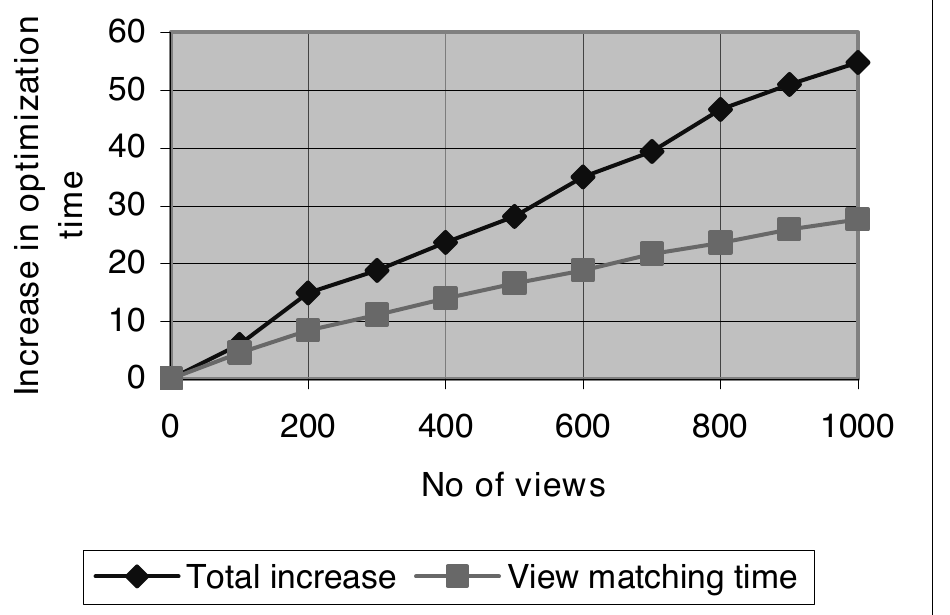
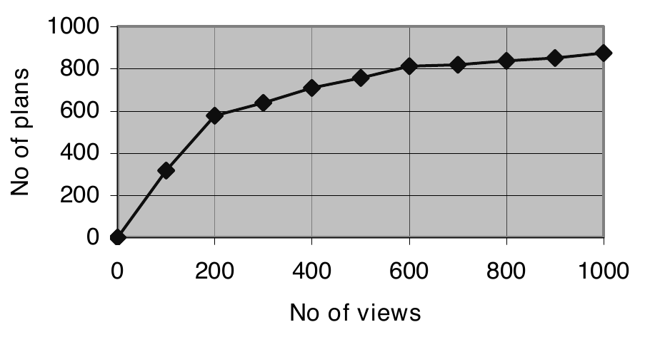

# Optimizing Queries Using Materialized Views: A Practical, Scalable Solution（中文译文）

## 译者说明

本文依据同目录的 `source.pdf` 翻译。章节、图表、公式、算法、代码与参考文献按原文结构保留。

Jonathan Goldstein、Per-Åke Larson

Microsoft Research, One Microsoft Way, Redmond, WA 98052

`{jongold,palarson}@microsoft.com`

## 摘要

物化视图能够大幅缩短查询处理时间，对大型表上的聚合查询尤其如此。要发挥这种潜力，查询优化器必须知道如何以及何时利用物化视图。本文提出一种快速、可扩展的算法，用于判断查询的部分或全部是否能由物化视图计算，并说明如何把它集成进基于变换的优化器。当前版本处理由选择、连接和最终分组组成的视图。优化过程仍完全基于成本：系统不会依据启发式规则选择单个“最佳”改写，而是生成多个改写，由优化器按通常方式选择最佳方案。基于 Microsoft SQL Server 中实现的实验结果显示了出色的性能与可扩展性。优化时间随视图数量缓慢增长，即使视图数达到一千，耗时仍然很低。

## 关键词

物化视图（materialized views）、视图匹配（view matching）、查询优化（query optimization）。

## 1. 引言

利用物化视图加速查询处理是一个老想法 [10]，但直到最近几年才被商业数据库系统采用。近期 TPC-R 基准测试结果和实际客户经验表明，审慎使用物化视图可以把查询处理时间缩短若干数量级。要发挥物化视图的潜力，必须高效解决三个问题：

- **视图设计：** 确定要物化哪些视图，包括如何存储和索引它们。
- **视图维护：** 当基表更新时，高效更新物化视图。
- **视图利用：** 高效使用物化视图来加速查询处理。

本文讨论基于变换的优化器中的视图利用。从概念上说，优化器生成查询表达式的所有可能改写，估算各自成本，并选择成本最低的一个。基于变换的优化器通过对查询子表达式应用局部变换规则来生成改写。应用规则会产生与原表达式等价的替代表达式。视图匹配，即利用物化视图计算子表达式，就是这样一条变换规则。视图匹配规则调用视图匹配算法，判断原表达式能否由一个或多个现有物化视图计算；如果可以，就生成替代表达式。优化期间可能多次调用该算法，每次针对不同子表达式。

本文的主要贡献是：（a）一种面向由选择、连接和最终分组组成的视图（SPJG 视图）的高效视图匹配算法；（b）一种新的索引结构，它索引视图定义而非视图数据，可以快速把搜索范围缩小到一小组候选视图，再对这些候选应用视图匹配。这里描述的算法版本仅限于 SPJG 视图，并生成单视图替代式。不过，这些并非本文方法固有的局限；算法和索引结构都可以扩展到更广泛的视图和替代式类别。本文简要讨论可能的扩展，细节不在讨论范围内。

本文的视图匹配算法快速且可扩展。速度至关重要，因为在优化复杂查询时，视图匹配算法可能被多次调用。我们还希望该算法能高效处理数千个视图。许多数据库系统包含数百甚至数千个表，这类数据库可能拥有数百个物化视图。类似文献 [1] 所述的工具也能生成大量视图。智能系统还可以缓存并复用先前计算过的查询结果；缓存结果可视为临时物化视图，因此很容易产生数千个物化视图。我们在 Microsoft SQL Server 中实现了该算法；SQL Server 使用基于 Cascades 框架 [6] 的变换型优化器。实验显示出色的性能和可扩展性。优化时间随视图数量线性增长，但即使视图数达到一千，耗时仍然很低。

通过优化器的常规规则机制集成视图匹配会带来重要收益。系统可以生成多个改写，其中有些利用物化视图，有些不利用。无论是否使用物化视图，所有改写都参加正常的成本优化。物化视图上的二级索引（如果存在）会自动纳入考虑。优化时间甚至可能缩短：如果优化早期找到使用物化视图的低成本计划，就会收紧成本界限，从而进行更激进的剪枝。

本文其余部分组织如下。第 2 节描述支持的物化视图类别并定义待解决的问题。第 3 节介绍判断查询表达式能否由某个视图计算的算法。第 4 节介绍索引结构。第 5 节给出基于原型实现的实验结果。第 6 节讨论相关工作。第 7 节总结全文并简要讨论可能的扩展。

## 2. 问题定义

SQL Server 2000 支持物化视图。它们被称为索引视图（indexed views），因为物化视图可以有多种索引方式。在现有视图上创建唯一聚簇索引即可将其物化。唯一性意味着视图输出必须包含唯一键，这是保证视图可以增量更新的必要条件。创建聚簇索引后，还可以创建额外的二级索引。

并非所有视图都可以建立索引。可索引视图必须由单层 SQL 语句定义，其中包含选择、（内）连接以及可选的分组。`FROM` 子句不能包含派生表，也就是说只能引用基表；同时不允许子查询。聚合视图的输出必须包含所有分组列（因为它们定义了键）和一个计数列。聚合函数仅限于 `sum` 和 `count`。这就是本文考虑的视图类别。

**示例 1：** 本例说明如何在 SQL Server 2000 中创建一个索引视图，并为它添加二级索引。本文所有示例都使用 TPC-H/R 数据库。

```sql
create view v1 with schemabinding as
  select p_partkey, p_name, p_retailprice,
    count_big(*) as cnt,
    sum(l_extendedprice*l_quantity) as gross_revenue
  from dbo.lineitem, dbo.part
  where p_partkey < 1000
    and p_name like '%steel%'
    and p_partkey = l_partkey
  group by p_partkey, p_name, p_retailprice

create unique clustered index v1_cidx on v1(p_partkey)

create index v1_sidx on v1(gross_revenue, p_name)
```

第一条语句创建视图 `v1`。索引视图要求使用短语 `with schemabinding`。所有聚合视图都必须包含一个 `count_big` 列，才能以增量方式处理删除操作（计数变为零时，该分组为空，必须删除对应行）。由算术或其他表达式定义的输出列必须通过 `AS` 子句命名，以便后续引用。第二条语句物化该视图，并把结果存储在聚簇索引中。尽管该语句只指定视图的（唯一）键，但其中的行包含所有输出列。最后一条语句在物化视图上创建二级索引。

如引言所述，基于变换的优化器通过递归地对关系表达式应用变换规则生成改写。视图匹配是一条作用于选择-投影-连接-分组（SPJG）表达式的变换规则。对于每个表达式，我们希望找出所有能够计算它的物化视图。本文要求表达式能够仅由该视图计算。本文考虑的视图匹配问题如下。

**使用单视图替代式的视图匹配：** 给定一个 SPJG 形式的关系表达式，找出所有能够计算该表达式的物化（SPJG）视图，并为找到的每个视图构造一个与给定表达式等价的替代表达式。

我们不对整体查询施加限制。尽管本文只考虑单视图替代式，但查询的不同部分可以使用不同视图求值。每当优化器发现 SPJG 表达式，就会调用视图匹配规则。视图匹配生成的所有替代式都按通常方式参与基于成本的优化。此外，物化视图上定义的所有二级索引也会像基表索引一样自动纳入考虑。

本文所述算法仅限于 SPJG 子表达式和单表替代式，但这并不是本文方法固有的局限。该算法可以扩展到更广泛的输入与替代表达式，例如包含并集、外连接或分组集聚合的表达式。

## 3. 从视图计算查询表达式

本节介绍用于判断查询表达式能否由某个视图计算的测试，以及在可以计算时如何构造替代表达式。第一小节讨论连接-选择-投影（SPJ）视图和查询，并假设视图与查询引用相同的表。带额外表的视图和带聚合的视图分别在后续小节讨论。无须考虑比查询表达式包含更少表的视图，因为这类视图只能用于计算查询表达式的子表达式；视图匹配规则会自动作用于每个子表达式。

本文算法利用四类约束：列上的非空约束、主键约束、唯一性约束（显式声明，或由创建唯一索引隐含）以及外键约束。我们假设视图和查询表达式的选择谓词已经转换为合取范式（conjunctive normal form, CNF）；如果没有，则先将它们转换成 CNF。我们还假设已经消除连接，因此查询和视图表达式都不含冗余表（SQL Server 优化器会自动完成这一步）。

### 3.1 连接-选择-投影视图与查询

要使 SPJ 查询表达式能够由某个视图计算，该视图必须满足以下要求：

1. 视图包含查询表达式需要的所有行。由于本文只考虑单视图替代式，这显然是必要条件；如果考虑由多个视图的并集构成的替代式，则不一定需要满足它。
2. 可以从视图中选出所有需要的行。即使视图包含全部所需行，也不一定能正确提取它们。选择通过应用谓词完成；如果谓词需要的某个列没有出现在视图输出中，就无法选出所需行。
3. 所有输出表达式都能由视图输出计算。
4. 所有输出行都以正确的重复因子出现。SQL 采用包语义（bag semantics），也就是说基表或 SQL 表达式的输出可以包含重复行。因此，仅仅让两个表达式产生相同的行集合还不够；每个重复行还必须恰好出现相同次数。

列之间的等价关系在测试中起重要作用，因此先讨论这一主题。随后逐项讨论如何保证满足上述要求，每项要求各用一个小节说明。

#### 3.1.1 列等价类

令 $W=P_1 \land P_2 \land \cdots \land P_n$ 是某个 SPJ 表达式采用 CNF 表示的选择谓词。收集适当的合取项后，可将该谓词重写为 $W=P_E\land P _ {NE}$，其中 $P_E$ 包含形如 $(T_i.C_p=T_j.C_q)$ 的列等值谓词， $P _ {NE}$ 包含其余所有合取项。 $T_i$ 和 $T_j$ 是表，二者不一定不同； $C_p$ 和 $C_q$ 是列引用。

假设 SPJ 表达式的求值过程是：先计算各表的笛卡尔积，再应用 $P_E$ 中的列等值谓词，然后应用 $P _ {NE}$ 中的谓词，最后计算输出列表中的表达式。应用列等值谓词之后， $P _ {NE}$ 中的谓词和输出列里的某些列可以互换。以后将会用到这种在等价列之间重新路由列引用的能力。

基于 $P_E$ 中的列等值谓词计算一组等价类，可以紧凑表示列等价知识。一个等价类就是一组已知相等的列。等价类很容易计算：一开始，把表达式所引用各表的每一列分别放在单独的集合中；然后以任意顺序遍历列等值谓词。对于每个 $(T_i.C_p=T_j.C_q)$，找到包含 $T_i.C_p$ 的集合和包含 $T_j.C_q$ 的集合。如果它们是不同集合，就合并二者；否则不做任何操作。最终留下的集合就是所需的等价类集合，其中包括只含一列的平凡等价类。

#### 3.1.2 视图中是否存在所有需要的行？

假设查询表达式和视图表达式都引用表 $T_1,T_2,\ldots,T_m$。令 $W_q$ 表示查询表达式 `where` 子句中的谓词， $W_v$ 表示视图表达式的谓词。原则上，判断视图是否包含查询表达式需要的所有行很简单：我们只需证明，对于 $T_1,T_2,\ldots,T_m$ 的所有有效实例，表达式 `select * from T1,T2,...,Tm where Wq` 的输出都是 `select * from T1,T2,...,Tm where Wv` 输出的子集。当 $W_q\Rightarrow W_v$ 时，这一点得到保证，其中 $\Rightarrow$ 表示逻辑蕴含。

因此，我们需要一种判断 $W_q\Rightarrow W_v$ 是否成立的算法。把谓词重写为 $W_q=P _ {q,1}\land P _ {q,2}\land\cdots\land P _ {q,m}$ 和 $W_v=P _ {v,1}\land P _ {v,2}\land\cdots\land P _ {v,n}$。一种简单而保守的算法，是检查 $W_v$ 中每个合取项 $P _ {v,i}$ 是否都能与 $W_q$ 中的某个合取项匹配。

判断两个合取项是否匹配有多种方法。例如，可以只做语法匹配：把每个合取项转换成字符串，也就是该合取项的 SQL 文本，再匹配字符串。缺点是，即使很小的语法差异也会产生不同字符串。例如，谓词 `(A > B)` 和 `(B < A)` 无法匹配。要避免这个问题，就必须解释谓词，并利用表达式之间的等价关系。利用交换律就是一个好例子，它适用于比较、加法、乘法和析取（OR）等多种表达式。根据匹配函数中内置的等价知识多少，可以设计复杂度和精细程度不同的函数。例如，简单函数可能只理解 `(A+B) = (B+A)`，更复杂的函数还可能识别 `(A/2 + B/5)*10 = A*5 + B*2`。

本文的判断算法利用列等价关系和列取值范围的知识。首先，把谓词 $W_q$ 和 $W_v$ 各自分成三部分，把蕴含测试写成：

$$
P _ {Eq}\land P _ {Rq}\land P _ {Uq}\Rightarrow P _ {Ev}\land P _ {Rv}\land P _ {Uv}.
$$

 $P _ {Eq}$ 由查询中的所有列等值谓词组成， $P _ {Rq}$ 包含范围谓词， $P _ {Uq}$ 是由 $W_q$ 其余所有合取项组成的残余谓词。 $W_v$ 也按相同方式划分。列等值谓词是形如 $(T_i.C_p=T_j.C_r)$ 的原子谓词，其中 $C_p$ 和 $C_r$ 是列引用。范围谓词是形如 $(T_i.C_p\ \mathrm{op}\ c)$ 的原子谓词，其中 $c$ 是常量， $\mathrm{op}$ 是“ $\lt{}$”“ $\le$”“ $=$”“ $\ge$”“ $\gt{}$”之一。该蕴含测试可拆分成三个独立测试：

$$
(P _ {Eq}\land P _ {Rq}\land P _ {Uq}\Rightarrow P _ {Ev})\land
(P _ {Eq}\land P _ {Rq}\land P _ {Uq}\Rightarrow P _ {Rv})\land
(P _ {Eq}\land P _ {Rq}\land P _ {Uq}\Rightarrow P _ {Uv}).
$$

从前件中去掉合取项可以加强蕴含测试。（用形式化语言说，对于任意谓词 $A,B,C$，公式 $(A\Rightarrow C)\Rightarrow(A\land B\Rightarrow C)$ 成立。换言之，如果仅由 $A$ 就能推出 $C$，那么 $A$ 与 $B$ 一起当然也能推出 $C$。）最终测试是上述三个测试的加强形式。为判断查询所需的所有行是否都存在于视图中，我们应用以下三个测试：

$$
P _ {Eq}\Rightarrow P _ {Ev}\qquad\text{（等值连接包含测试）}
$$

$$
P _ {Eq}\land P _ {Rq}\Rightarrow P _ {Rv}\qquad\text{（范围包含测试）}
$$

$$
P _ {Eq}\land P _ {Uq}\Rightarrow P _ {Uv}\qquad\text{（残余包含测试）}
$$

第一个测试称为等值连接包含测试，因为实践中大多数列等值谓词都来自等值连接。不过， $P_E$ 包含所有列等值谓词，即使它们引用的是同一个表中的列。回忆一下， $P _ {Eq}$ 中的谓词用于计算查询等价类。由于后两个蕴含式的前件都含有 $P _ {Eq}$，列引用可以重新路由到查询等价类中的任意列。

这些测试显然比最低要求更强，因此可能错过一些机会。例如，从等值连接测试的前件中去掉 $P _ {Rq}$ 后，如果查询把两列等同于同一个常量，如 `(A=2) AND (B=2)`，而视图包含较弱的谓词 `(A=B)`，算法就会漏掉该情况。残余包含测试中也可能出现类似问题。例如，查询包含 `(A=5) AND (B=3)`，而视图包含谓词 `(A+B)=5` 时，算法会安全地、但错误地认定视图没有提供全部所需行。这是速度与完备性之间的权衡。

检查约束很容易纳入这些测试。关键观察是，可以把查询所涉及表上的检查约束加入 `where` 子句，而不改变查询结果。因此，可通过把检查约束加入蕴含式 $W_q\Rightarrow W_v$ 的前件来考虑它们。测试是否真正利用这些检查约束，则取决于所用判断算法。

**等值连接包含测试。**

等值连接包含测试要求：视图中相等的所有列在查询中也必须相等，但反过来不要求成立。实现上，先按上一小节的方法分别计算查询和视图的列等价类，再检查视图中每个非平凡等价类是否都是查询中某个等价类的子集。只检查视图中的所有列等值谓词是否也存在于查询中要弱得多，因为它没有考虑传递性。假设视图包含 `(A=B AND B=C)`，查询包含 `(A=C AND C=B)`。尽管实际谓词不匹配，它们在逻辑上等价，因为二者都蕴含 $A=B=C$。使用等价类可以正确捕获传递性的影响。

如果视图通过等值连接包含测试，我们就知道它不包含冲突的列等值约束。还可以很容易地计算为了从视图产生查询结果，需要施加哪些补偿性列等值约束。每当若干视图等价类 $E_1,E_2,\ldots,E_n$ 映射到同一个查询等价类 $E$ 时，就在 $E_i$ 中任意一列和 $E _ {i+1}$ 中任意一列之间创建列等值谓词，其中 $i=1,2,\ldots,n-1$。

**范围包含测试。**

在不涉及 OR 时，范围包含测试有一个简单算法。我们为查询中的每个等价类关联一个范围，指定该等价类中各列的下界和上界。两个界限最初都未初始化。然后逐个处理范围谓词，找到包含所引用列的等价类，并按需设置或调整其范围。如果谓词类型是 $(T_i.C_p\le c)$，就把上界设为其当前值与 $c$ 中的较小者。如果谓词类型是 $(T_i.C_p\ge c)$，就把上界设为其当前值与 $c$ 中的较大者。形如 $(T_i.C_p\lt{}c)$ 的谓词按 $(T_i.C_p\le c-\Delta)$ 处理，其中 $c-\Delta$ 表示列 $T_i.C_p$ 的定义域中紧邻 $c$ 的前一个值。形如 $(T_i.C_p\gt{}c)$ 的谓词按 $(T_i.C_p\le c+\Delta)$ 处理。最后，形如 $(T_i.C_p=c)$ 的谓词按 $(T_i.C_p\ge c)\land(T_i.C_p\le c)$ 处理。对视图重复同样过程。

如果视图受到比查询更严格的约束，就不能产生全部所需行。检查时，考虑至少设置了一个界限、带范围的视图等价类。找到查询中与之匹配的等价类，即至少与该视图等价类共享一列的查询等价类，再检查查询等价类的范围是否包含于视图等价类的范围中（未初始化的界限按 $+\infty$ 或 $-\infty$ 处理）。如果不包含，范围包含测试失败，拒绝该视图。

在此过程中，还可以确定为了产生查询结果，必须对视图施加哪些补偿性范围谓词。如果查询范围与对应视图范围精确匹配，无须限制。如果下界不完全匹配，就必须通过谓词 `(T.C >= lb)` 限制视图结果，其中 `T.C` 是该（查询）等价类中的一列，`lb` 是查询范围的下界。如果上界不同，则需要施加谓词 `(T.C <= ub)`。

该范围覆盖算法可扩展为支持范围谓词的析取（OR）。由于篇幅限制，这里不讨论该扩展；本文原型不支持析取。

**残余包含测试。**

既不是列等值谓词也不是范围谓词的合取项，构成查询和视图的残余谓词。对这些谓词所做的唯一推理是列等价。测试蕴含关系时，检查视图残余谓词的每个合取项是否都与查询残余谓词中的某个合取项匹配。如果两个列引用属于同一个（查询）等价类，就认为它们匹配。如果匹配失败，就拒绝该视图，因为它包含查询中不存在的谓词。查询中任何未与视图内容匹配的残余谓词，都必须施加到视图上。

如本节开头所述，两个合取项能否匹配取决于匹配算法。本文原型实现使用浅层匹配算法：除列等价关系外，表达式必须完全相同。表达式表示为一个文本字符串和一列列引用。文本字符串包含省略列引用后的表达式文本；列表包含表达式中的每个列引用，顺序与它们在表达式文本中出现的顺序一致。比较两个表达式时，先比较字符串。如果字符串相等，就扫描两个列表并比较相同位置的列引用。如果两个列引用位于同一个（查询）等价类中，就认为列引用匹配；否则不匹配。所有列对都匹配时，表达式才匹配。为追求速度，我们选择了这种浅层算法，同时完全清楚它可能错过一些机会。

总之，测试视图是否包含查询所需全部行的过程如下：

1. 计算查询和视图的等价类。
2. 检查视图中的每个等价类是否都是某个查询等价类的子集。如果不是，拒绝该视图。
3. 计算查询和视图的范围区间。
4. 检查每个视图范围是否包含对应的查询范围。如果不是，拒绝该视图。
5. 检查视图残余谓词中的每个合取项是否都与查询残余谓词中的某个合取项匹配。如果不是，拒绝该视图。

**示例 2：**

视图：

```sql
Create view V2 with schemabinding as
  Select l_orderkey, o_custkey, l_partkey,
    l_shipdate, o_orderdate,
    l_quantity*l_extendedprice as gross_revenue
  From dbo.lineitem, dbo.orders, dbo.part
  Where l_orderkey = o_orderkey
    And l_partkey = p_partkey
    And p_partkey >= 150
    And o_custkey >= 50 and o_custkey <= 500
    And p_name like '%abc%'
```

查询：

```sql
Select l_orderkey, o_custkey, l_partkey,
  l_quantity*l_extendedprice
From lineitem, orders, part
Where l_orderkey = o_orderkey
  And l_partkey = p_partkey
  And l_partkey >= 150 and l_partkey <= 160
  And o_custkey = 123
  And o_orderdate = l_shipdate
  And p_name like '%abc%'
  And l_quantity*l_extendedprice > 100
```

**第 1 步：计算等价类。**

视图等价类：`{l_orderkey, o_orderkey}`、`{l_partkey, p_partkey}`、`{o_orderdate}`、`{l_shipdate}`。

查询等价类：`{l_orderkey, o_orderkey}`、`{l_partkey, p_partkey}`、`{o_orderdate, l_shipdate}`。

这里没有列出所有平凡等价类；列出 `{o_orderdate}` 和 `{l_shipdate}` 是因为本例后面会用到它们。

**第 2 步：检查视图等价类包含关系。**

两个非平凡的视图等价类在查询等价类中都有完全匹配项。（平凡）等价类 `{o_orderdate}` 和 `{l_shipdate}` 映射到同一个查询等价类，这意味着替代表达式必须创建补偿谓词 `(o_orderdate=l_shipdate)`。

**第 3 步：计算范围。**

视图范围：

$$
\lbrace{}l\\_partkey,p\\_partkey\rbrace{}\in(150,+\infty),\qquad
\lbrace{}o\\_custkey\rbrace{}\in(50,500).
$$

查询范围：

$$
\lbrace{}l\\_partkey,p\\_partkey\rbrace{}\in(150,160),\qquad
\lbrace{}o\\_custkey\rbrace{}\in(123,123).
$$

**第 4 步：检查查询范围包含关系。**

`{l_partkey, p_partkey}` 上的范围 $(150,160)$ 包含于对应的视图范围。上界不匹配，因此必须施加谓词 `({l_partkey, p_partkey} <= 160)`。`{o_custkey}` 上的范围 $(123,123)$ 也包含于对应的视图范围。两个界限都不匹配，因此必须施加谓词 `(o_custkey >= 123)` 和 `(o_custkey <= 123)`，二者可简化为 `(o_custkey = 123)`。

**第 5 步：检查视图残余谓词是否匹配。**

视图残余谓词：

```sql
p_name like '%abc%'
```

查询残余谓词：

```sql
p_name like '%abc%'
l_quantity*l_extendedprice > 100
```

视图只有一个残余谓词 `p_name like '%abc%'`，它也存在于查询中。额外的查询残余谓词 `l_quantity*l_extendedprice > 100` 必须被施加。

该视图通过所有测试，因此我们认定它包含全部所需行。必须对视图施加的补偿谓词是 `(o_orderdate = l_shipdate)`、`({p_partkey, l_partkey} <= 160)`、`(o_custkey = 123)` 和 `(l_quantity*l_extendedprice > 100.00)`。第二个谓词中的记法 `{p_partkey, l_partkey}` 表示可以选择 `p_partkey` 或 `l_partkey` 中任意一个。

#### 3.1.3 能否选出需要的行？

上一小节说明了如何确定必须对视图施加哪些补偿谓词，才能把结果缩减为正确的行集合。这些谓词分为三类：

1. 比较视图与查询等价类时得到的列等值谓词。上例有一个此类谓词：`(o_orderdate = l_shipdate)`。
2. 对比查询范围和视图范围时得到的范围谓词。此类谓词有两个：`({p_partkey, l_partkey} <= 160)` 和 `(o_custkey = 123)`。
3. 查询中未匹配的残余谓词。此类谓词有一个：`(l_quantity*l_extendedprice > 100)`。

所有补偿谓词都必须能由视图输出计算。我们利用列之间的等价关系，把每个列引用看作引用包含该列的等价类，而不是引用列本身。除一种情况外，全部使用查询等价类；唯一例外是补偿性列等值谓词，即上面列表中的第 1 类。这些谓词正是为了施加查询所要求的额外列等价关系而引入的。每个这类谓词会合并两个视图等价类；这些谓词合在一起，使视图等价类变得与查询等价类相同。因此，列引用可以重定向到其视图等价类中的任意列，却不能重定向到其查询等价类中的任意列。

上面的第 1 类和第 2 类补偿谓词只含简单列引用。我们只需检查被引用等价类中是否至少有一列是视图输出列，并把引用路由到该列。第 3 类补偿谓词可能涉及更复杂的表达式。在这种情况下，即使某些被引用列无法映射到视图输出列，也可能对表达式求值。例如，如果 `l_quantity*l_extendedprice` 可作为视图输出列使用，即使没有 `l_quantity` 和 `l_extendedprice` 两列，我们仍能对谓词 `(l_quantity*l_extendedprice > 100)` 求值。不过，本文原型实现忽略了这种可能性，要求补偿谓词中引用的所有列都能映射到视图的（简单）输出列。

总之，我们按以下方式判断查询所需的所有行能否从视图中被正确选出：

1. 按上一小节所述，在比较视图等价类和查询等价类时构造补偿性列等值谓词。尝试把每个列引用映射到某个输出列（使用视图等价类）；如果做不到，拒绝该视图。
2. 按上一小节所述，通过比较列范围构造补偿性范围谓词。尝试把每个列引用映射到某个输出列（使用查询等价类）；如果做不到，拒绝该视图。
3. 找出查询中存在而视图中缺少的残余谓词。尝试把每个列引用映射到某个输出列（使用查询等价类）；如果做不到，拒绝该视图。

#### 3.1.4 能否计算输出表达式？

检查查询的所有输出表达式能否由视图计算，与检查附加谓词能否被正确计算很相似。如果输出表达式是常量，直接把常量复制到输出。如果输出表达式是简单列引用，就检查它能否映射到视图的某个输出列（使用查询等价类）。对于其他表达式，先检查视图输出是否包含完全相同的表达式（需要考虑列等价关系）。如果包含，直接用对匹配视图输出列的引用替换该输出表达式。否则，检查表达式的所有源列是否都能映射到视图输出列，即检查能否完全由（简单）输出列计算整个表达式。视图不能通过这些测试时，就拒绝它。

该算法会漏掉一些情况。例如，我们没有考虑表达式的某个部分是否与视图输出表达式匹配，也没有考虑能否利用 `where` 子句中的约束，可能再结合列上的检查约束，推导出某个查询列是常量。

#### 3.1.5 行是否以正确的重复因子出现？

当查询和视图引用完全相同的表时，只要视图通过前述测试，该条件就自然满足。更有意思的情况是视图引用了额外表，下一小节将讨论它。

### 3.2 带额外表的视图

假设有一个引用表 $T_1,T_2,\ldots,T_n$ 的 SPJ 查询，以及一个额外引用了表 $S$ 的视图，即该视图引用 $T_1,T_2,\ldots,T_n,S$。在什么情况下，查询仍能由该视图计算？本文方法基于识别保持基数的连接（cardinality-preserving joins，有时也称表扩展连接）。如果表 $T$ 中的每一行都恰好与表 $S$ 中的一行连接，那么 $T$ 与 $S$ 之间的连接就是保持基数的。此时，可以认为 $S$ 只是用自身列扩展了 $T$。若 $T$ 中一个非空外键的所有列与 $S$ 中一个唯一键做等值连接，该连接就有这一性质。外键约束保证：对于 $T$ 的每一行 $t$， $S$ 中至少存在一行 $s$，其列值与 $t$ 中所有非空的外键列都匹配。验证外键约束时， $t$ 中所有包含空值的列都会被忽略。可以证明，所有要求（等值连接、全部列、非空、外键、唯一键）都是必要的。

现在考虑视图引用多个额外表的情况。假设查询引用 $T_1,T_2,\ldots,T_n$，视图还引用 $m$ 个额外表，即 $T_1,T_2,\ldots,T_n,T _ {n+1},T _ {n+2},\ldots,T _ {n+m}$。为了判断 $T _ {n+1},T _ {n+2},\ldots,T _ {n+m}$ 是否通过一系列保持基数的连接与 $T_1,T_2,\ldots,T_n$ 相连，我们构造一个称为外键连接图（foreign-key join graph）的有向图。图中的节点代表表 $T_1,T_2,\ldots,T_n,T _ {n+1},T _ {n+2},\ldots,T _ {n+m}$。如果视图直接或传递地指定了表 $T_i$ 与表 $T_j$ 之间的连接，并且该连接满足上面列出的全部五项要求（等值连接、全部列、非空、外键、唯一键），就从 $T_i$ 向 $T_j$ 添加一条边。

添加边时，必须使用等价类才能正确捕获传递的等值连接条件。假设正在考虑是否从表 $T_i$ 向表 $T_j$ 添加一条边，而且有一个可接受的外键约束，从 $T_i$ 的列 $F_1,F_2,\ldots,F_n$ 指向 $T_j$ 的列 $C_1,C_2,\ldots,C_n$。对每个 $C_i$，找到包含该列的等价类，并检查对应外键列 $F_i$ 是否属于同一个等价类。如果连接列通过测试，就添加该边。

构造图后，尝试通过一系列删除操作消除节点 $T _ {n+1},T _ {n+2},\ldots,T _ {n+m}$。不断删除没有出边且恰好有一条入边的节点（逻辑上，这相当于执行入边所表示的连接）。删除节点 $T_i$ 时，也删除其入边，这可能使另一个节点变得可删除。该过程一直继续，直到再也无法删除节点，或者已经消除 $T _ {n+1},T _ {n+2},\ldots,T _ {n+m}$。如果成功消除这些节点，就说明可以通过保持基数的连接消除视图中的额外表，视图通过该项测试。

视图仍必须通过上一小节详述的测试（包含测试和所需输出列可用性测试）。不过，这些测试都假定查询与视图引用相同的表。要使两者相同，可以从概念上把额外表 $T _ {n+1},T _ {n+2},\ldots,T _ {n+m}$ 加入查询，并使用从视图中消除它们时所用的完全相同的外键连接，把它们连接到现有表 $T_1,T_2,\ldots,T_n$。因为这些连接都保持基数，所以查询结果完全不会改变。

实践中，我们只通过更新查询等价类来模拟加入额外表。首先，为 $T _ {n+1},T _ {n+2},\ldots,T _ {n+m}$ 中的每一列添加一个平凡等价类（此时相当于已把这些表加入查询的 `from` 子句）。然后，扫描上述消除过程中删除的所有外键边的连接条件，并把它们应用到查询等价类上。这会合并某些查询等价类（此时相当于已把连接条件加入 `where` 子句）。该过程结束时，（概念上）修改后的查询与视图引用相同的表，查询等价类也已更新以反映这一变化。修改后，可以原样应用上一小节描述的全部测试。

**示例 3：** 本例说明带额外表的视图。

视图：

```sql
Create view v3 with schemabinding as
  Select c_custkey, c_name, l_orderkey,
    l_partkey, l_quantity
  From dbo.lineitem, dbo.orders, dbo.customer
  Where l_orderkey = o_orderkey
    And o_custkey = c_custkey
    And o_orderkey >= 500
```

查询：

```sql
Select l_orderkey, l_partkey, l_quantity
From lineitem
Where l_orderkey between 1000 and 1500
  And l_shipdate = l_commitdate
```

由此得到视图和查询的如下等价类及范围：

视图：

$$
\lbrace{}l\\_orderkey,o\\_orderkey\rbrace{},\quad \lbrace{}o\\_custkey,c\\_custkey\rbrace{};
$$

$$
\lbrace{}l\\_orderkey,o\\_orderkey\rbrace{}\in(500,+\infty).
$$

查询：

$$
\lbrace{}l\\_shipdate,l\\_commitdate\rbrace{};\qquad
\lbrace{}l\\_orderkey\rbrace{}\in(1000,1500).
$$

视图的外键连接图包含三个节点（`lineitem`、`orders`、`customer`），其中有一条从 `lineitem` 指向 `orders` 的边，以及一条从 `orders` 指向 `customer` 的边。`customer` 节点没有出边且有一条入边，因此可以删除；这也会删除从 `orders` 指向 `customer` 的边。于是 `orders` 不再有出边，也可以删除。

随后，从概念上把 `orders` 和 `customer` 加入查询。`lineitem` 到 `orders` 边的连接谓词是 `l_orderkey = o_orderkey`，它生成等价类 `{l_orderkey, o_orderkey}`。`orders` 到 `customer` 边的连接谓词是 `o_custkey = c_custkey`，它生成等价类 `{o_custkey, c_custkey}`。更新后的查询等价类和范围为：

$$
\lbrace{}l\\_shipdate,l\\_commitdate\rbrace{},\quad
\lbrace{}l\\_orderkey,o\\_orderkey\rbrace{},\quad
\lbrace{}o\\_custkey,c\\_custkey\rbrace{};
$$

$$
\lbrace{}l\\_orderkey,o\\_orderkey\rbrace{}\in(1000,1500).
$$

接下来应用包含测试。视图通过等值连接包含测试，因为每个视图等价类都是某个查询等价类的子集。视图也通过范围包含测试，因为视图范围 $\lbrace{}l\\_orderkey,o\\_orderkey\rbrace{}\in(500,+\infty)$ 包含对应的查询范围 $\lbrace{}l\\_orderkey,o\\_orderkey\rbrace{}\in(1000,1500)$。补偿谓词为 `l_orderkey >= 1000` 和 `l_orderkey <= 1500`；由于视图输出中有 `l_orderkey`，可以施加这两个谓词。最后，查询的每个输出列都能由视图输出计算。

上述过程保证：可以直接或间接把视图中的每个额外表“预连接”到查询的某个输入表 $T$，而所得更宽的表与 $T$ 包含完全相同的行。这样做很安全，但有一定限制性，因为我们只需对查询实际消费的行做出保证，而非所有行。下面是这种情况的一个例子。假设视图由表 $T$ 和 $S$ 在 `T.F=S.C` 上连接而成，其中 `F` 被声明为引用 `C` 的外键，`C` 是 $S$ 的主键。再考虑表 $T$ 上谓词为 `T.F > 50` 的选择查询。如果 `T.F` 没有声明 `not null`，本文过程会拒绝该视图。 $T$ 与 $S$ 的连接不保持 $T$ 的基数，因为 `T.F` 列中为空的行不会出现在视图里。不过，对于 `T.F` 非空的行子集，该连接确实保持基数；这正是所需性质，因为查询中的拒空谓词 `T.F > 50` 会排除空值。换言之， $T$ 中 `T.F` 为空的任意行无论如何都会被查询谓词丢弃。

可以修改算法来处理这种情况（尚未实现）。只需在考虑是否向外键连接图添加边时进行额外检查：如果查询包含作用于该列的拒空谓词（等值连接谓词除外），那么允许空值的外键列仍可接受。

### 3.3 聚合查询与视图

本节考虑聚合查询和视图。SQL Server 允许在查询和物化视图的 `group-by` 列表中使用表达式，而不只是列。在物化视图中，所有 `group-by` 表达式还必须出现在输出列表中，才能保证每行都有唯一键。此外，输出列表必须包含 `count_big(*)` 列，才能以增量方式处理删除操作。当前物化视图中唯一允许的其他聚合函数是 `sum`。

我们把聚合查询看作一个 SPJ 查询后接分组操作，聚合视图也同样处理。如果视图满足以下要求，聚合查询就能由该视图计算：

1. 视图的 SPJ 部分产生查询 SPJ 部分所需的所有行，而且重复因子正确。
2. 补偿谓词（如果有）所需的所有列都能在视图输出中获得。
3. 视图不包含聚合，或者它的聚合程度低于查询，也就是说，可以对视图输出的分组做进一步聚合，得到查询形成的分组。
4. 进一步分组（如果需要）所需的所有列都能在视图输出中获得。
5. 计算输出表达式所需的所有列都能在视图输出中获得。

前两个要求与 SPJ 查询相同。如果查询的 `group-by` 列表是视图 `group-by` 列表的子集，第三个要求就得到满足。也就是说，如果视图按表达式 $A,B,C$ 分组，那么查询可以按 $A,B,C$ 的任意子集分组，其中包括空集，对应没有 `group-by` 子句的聚合查询。当前我们要求查询中的每个 `group-by` 表达式都精确匹配视图中的某个 `group-by` 表达式（考虑列等价关系）。这一要求可以放宽。如文献 [16] 所示，只要视图的分组表达式在函数上决定查询的分组表达式就足够了。

如果查询的 `group-by` 列表与视图的相同，就无须进一步聚合，因此第四个要求自动满足。如果查询列表是严格子集，就必须在视图之上添加补偿性 `group-by`。分组表达式与查询相同。因为它们是视图分组表达式的子集，而视图的所有分组表达式都必须属于视图输出，所以它们总能在视图输出中获得。因此，第三个要求会自动满足。

测试第四个要求是否满足，几乎与 SPJ 查询部分的讨论完全相同。唯一的细微差别出现在聚合表达式上。如果查询指定 `count(*)`，而视图是聚合视图，就必须把 `count(*)` 替换为对视图 `count_big(*)` 列求 `SUM`。如果查询输出包含 `SUM(E)`，其中 $E$ 是标量表达式，就要求视图含有与之精确匹配的输出列（考虑列等价关系）。`AVG(E)` 转换为 `SUM(E)/count_big(*)`。

**示例 4：** 上述方法听起来可能过于简单，有些读者也许会怀疑我们能否处理下面视图和查询所示的情况。

视图：

```sql
Create view v4 with schemabinding as
  Select o_custkey, count_big(*) as cnt,
    sum(l_quantity*l_extendedprice) as revenue
  From dbo.lineitem, dbo.orders
  Where l_orderkey = o_orderkey
  Group by o_custkey
```

查询：

```sql
Select c_nationkey,
  sum(l_quantity*l_extendedprice)
From lineitem, orders, customer
Where l_orderkey = o_orderkey
  And o_custkey = c_custkey
Group by c_nationkey
```

显然，可以先把视图与 `customer` 表连接，再按 `c_nationkey` 聚合结果，从而计算该查询。不过，视图不满足上面列出的任何条件，因此人们可能以为本文算法会错过这个机会。事实并非如此——这是与优化器集成发挥作用的情况。对于此类查询，SQL Server 优化器还会生成包含预聚合的候选方案。也就是说，它会生成如下形式的查询表达式：

```sql
Select c_nationkey, sum(rev)
From customer,
  (Select o_custkey,
    sum(l_quantity*l_extendedprice) as rev
   From lineitem, orders
   Where l_orderkey = o_orderkey
   Group by o_custkey) as iq
Where c_custkey = o_custkey
Group by c_nationkey
```

当视图匹配算法作用于内层查询时，很容易识别出该表达式可以由 `v4` 计算。用该视图替换后，会恰好产生所需表达式：

```sql
Select c_nationkey, sum(revenue)
From customer, v4
Where c_custkey = o_custkey
Group by c_nationkey
```

## 4. 快速过滤视图

为加速视图匹配，我们在内存中维护每个物化视图的描述。视图描述包含应用上一节所有测试所需的信息。即便如此，如果视图数量很大，每次调用视图匹配规则时都把测试应用于所有视图仍然很慢。本节介绍一种称为过滤树（filter tree）的内存索引，使我们能够快速丢弃查询不可能使用的视图。

过滤树是一棵多路搜索树，所有叶节点都位于同一层。树中的节点包含一组“键-指针”对。一个键是一组值，而不只是单个值。内部节点中的指针指向下一层的某个节点，叶节点中的指针则指向一组视图描述。过滤树在每一层都把视图集合划分成越来越小的分区。

搜索过滤树时可能遍历多条路径。搜索到达某个节点后，会沿该节点的若干出指针继续。是否沿某个指针继续，由该指针对应键上的搜索条件决定。条件始终属于同一种类型：若某个键是给定搜索键的子集（或超集），或者与搜索键相等，则该键符合条件。搜索键也是一个集合。始终可以线性扫描并检查每个键，但如果节点包含很多键，这样可能很慢。为了避免线性扫描，我们把键组织成格结构（lattice structure），以便轻松找出给定搜索键的所有子集（或超集）。我们把这种内部结构称为格索引（lattice index）。

下一小节更详细地介绍格索引，然后说明树中不同层使用的分区条件。

### 4.1 格索引

集合之间的子集关系在集合上施加了偏序，可以表示成格。顾名思义，格索引把键组织成与格结构对应的图。除前述“键-下行指针”对之外，格索引中的节点还包含两组指针：超集指针和子集指针。节点 $V$ 的一条超集指针指向一个节点，后者表示 $V$ 所表示集合的极小超集。同样， $V$ 的一条子集指针指向一个节点，后者表示 $V$ 所表示集合的极大子集。没有子集的集合称为根（roots），没有超集的集合称为顶（tops）。格索引还包含一个指向所有顶的指针数组和一个指向所有根的指针数组。图 1 展示了存储八个键集合的格索引。



*图 1：存储八个键集合的格索引：A、B、D、AB、BE、ABC、ABF、BCDE。*

搜索格索引是一个简单的递归过程。假设要查找 `AB` 的超集。我们从顶节点开始，发现 `ABC` 和 `ABF` 都是 `AB` 的超集。对于每个符合条件的节点，递归跟随其子集指针，每一步都检查目标节点是否仍为 `AB` 的超集。`AB` 符合条件，但它的子集节点都不符合。搜索返回 `ABC`、`ABF` 和 `AB`。注意，`AB` 被到达两次，一次从 `ABC` 到达，另一次从 `ABF` 到达。为避免多次访问甚至多次返回同一节点，搜索过程必须记住已经访问的节点。查找子集的算法类似；主要区别是搜索从根节点开始，并沿超集指针向上进行。

由于篇幅限制，本文不介绍格索引的插入和删除算法。它们并不复杂，但细节需要谨慎处理。

### 4.2 分区条件

过滤树以递归方式把视图集合划分成越来越小、互不重叠的分区。每一层使用不同的分区条件。本节介绍本文原型使用的分区条件。

#### 4.2.1 源表条件

可以丢弃缺少查询所需某些表的视图。下面的条件描述了这一点。

**源表条件：** 只有当视图的源表集合是查询源表集合的超集时，查询才可能由该视图计算。

我们以视图的源表集合作为键构造格索引。给定查询的源表集合后，搜索格索引中包含满足该条件之视图的分区。

#### 4.2.2 核心条件

回顾第 3.2 节从视图中消除额外表的算法。在那一节，只要算法把源表集合缩减到与查询源表集合相同就足够了。不过，我们可以让算法继续运行，直到再也不能从视图中消除表，从而把剩余表集合缩减到最小。我们把剩余集合称为视图的核心（hub）。如第 3.2 节所述，只有能够通过保持基数的连接消除所有额外表时，视图才可用于回答查询。核心无法进一步缩减，因此，如果某个视图的核心不是查询源表集合的子集，显然可以忽略该视图。由此得到以下条件。

**核心条件：** 只有当视图核心是查询源表集合的子集时，查询才可能由该视图计算。

上一个条件给出了视图源表集合的下界，本条件则给出上界。这里仍然使用格索引结构，但以视图核心为键，而不是完整的源表集合。给定查询后，在索引中搜索键为查询源表集合之子集的节点。

上述计算视图核心的算法往往会得到不必要地过小的核心，因为它只考虑外键连接。还可以考虑其他谓词来改进它。假设表 $T$ 会被上述算法从核心中消除。令 `T.C` 是不参与任何非平凡等价类的列。如果某个范围谓词或其他谓词引用 `T.C`，就可以把 $T$ 留在核心中。此时，连接不再保证保持基数，因为 `T.C` 上的谓词可能拒绝 $T$ 中的某些行。只有查询包含涉及 `T.C` 的列等值谓词时，才能把对 `T.C` 的引用重新路由到另一列。不过，如果确实如此， $T$ 也必然属于查询的源表，因此把 $T$ 留在核心中不会导致视图被拒绝。

#### 4.2.3 输出列条件

暂且假设查询和视图的输出列表都只包含简单列引用，更复杂的输出表达式稍后单独处理。前文已经说明，只有全部查询输出表达式都能由视图输出计算时，查询才能由该视图计算。不过，由于列之间可能等价，查询输出列不一定要直接匹配视图输出列。下面的例子说明实际要求。

**示例 6：**

假设查询输出列 $A$、 $B$ 和 $C$。再假设查询中的列等值谓词生成如下等价类：`{A, D, E}`、`{B, F}`、`{C}`。同一等价类中的列值相同，因此在输出列表中可以互换。我们把输出列表写成 `{A, D, E}`、`{B, F}`、`{C}` 来表示这种选择。

现在考虑一个视图，其列等价类可写为 `{A, D, G}`、`{E}`、`{B}` 和 `{C, H}`，其中真正包含在视图输出列表中的列是 `A`、`E`、`B` 和 `C`，其余成员来自视图列等值谓词计算出的等价关系。从逻辑上说，可以认为该视图输出了所有这些列，即其输出列表被扩展为 $A,D,G,E,B,C,H$。

如果 $A$、 $D$ 或 $E$ 中至少一列存在于视图的扩展输出列表中，就能计算查询的第一个输出列。本例中三列都存在。同样，如果扩展输出列表中有 $B$ 或 $F$，就能计算第二列；本例有 $B$，但没有 $F$。最后，第三个输出列需要 $C$，它也存在于扩展输出列表中。因此，查询输出可以由该视图计算。

本例表明，为正确测试输出列可用性，必须同时考虑查询和视图中的列等价关系。具体做法是，把输出列表中的每个列引用替换为对列等价类的引用。对视图，再把被引用等价类中的每个列都纳入，计算扩展输出列表。于是可以陈述必须满足的条件。

**输出列条件：** 对查询输出列表中的每个等价类，只有视图扩展输出列表中至少存在该等价类的一列时，视图才可能提供所有所需输出列。

为了利用该条件，以视图的扩展输出列表为键构造格索引。给定查询后，从顶节点开始递归搜索索引。若某节点的扩展输出列表满足上述条件，则该节点符合条件，并继续跟随它的子集指针。如果不满足，就不必跟随这些指针，因为如果视图 $V$ 不能提供全部所需列，那么扩展输出列表为 $V$ 扩展输出列表之子集的任何视图也都不能提供。

#### 4.2.4 分组列

只有查询分组列是视图分组列的子集时，聚合查询才可能由聚合视图计算；这里同样需要考虑列等价关系。这与查询输出列和视图输出列之间必须成立的关系完全相同。因此，可以像扩展输出列那样扩展视图的分组列表，并在扩展分组列表上构造格索引。完整的分组列条件如下。

**分组列条件：** 对查询分组列表中的每个等价类，只有视图扩展分组列表中至少存在该等价类的一列时，聚合查询才可能由聚合视图计算。

#### 4.2.5 受范围约束的列

如果某个视图在一列上指定了范围约束，而查询没有在该列上施加范围约束，那么查询不能由该视图计算；这里同样需要考虑列等价关系。我们为每个查询和视图关联一个范围约束列表，其中每个条目引用一个列等价类。如果某个列等价类的范围受限，即至少设置了一个界限，就把它加入该列表。接下来，以与输出列相同的方式为查询（但不为视图）计算扩展约束列表。由此得到必须满足的条件。

**范围约束条件：** 对视图范围约束列表中的每个等价类，只有查询扩展范围约束列表中至少存在该等价类的一列时，查询才可能由该视图计算。

注意，扩展范围约束列表与查询而非视图关联。因此，不能像输出列和分组列索引那样，在视图的扩展约束列表上构造格索引。不过，可以基于涉及缩减范围约束列表的较弱条件构造格索引。缩减范围约束列表只包含引用平凡等价类的列，也就是不与任何其他列等价的列。

**弱范围约束条件：** 只有视图的缩减范围约束列表是查询扩展范围约束列表的子集时，查询才可能由该视图计算。

基于此条件构造格索引时，视图的完整约束列表会包含在节点中并用作节点的键，但子集-超集关系仅根据缩减约束列表计算。搜索从根开始，沿超集边向上进行。如果节点通过弱范围约束条件，就跟随其超集指针，但只有当该节点还通过完整范围约束条件时才返回它。如果节点不能通过弱范围约束条件，它的所有超集节点也都会失败，因此无须检查。

#### 4.2.6 残余谓词条件

回忆一下，我们把既非列等值谓词也非范围谓词的所有谓词都视为残余谓词。残余包含测试检查视图中的每个残余谓词是否也存在于查询中，并同样考虑列等价关系。本文实现的测试使用一个匹配函数：先比较省略列引用后转换成文本字符串的谓词，再单独匹配列引用。我们为每个视图和查询关联一个只包含其残余谓词文本字符串的残余谓词列表。必须满足以下条件。

**残余谓词条件：** 只有视图的残余谓词列表是查询残余谓词列表的子集时，查询才可能由该视图计算。

为了过滤，以视图的残余谓词列表为键构造格索引。给定查询的残余列表后，搜索键为查询残余列表之子集的节点。

#### 4.2.7 输出表达式条件

输出表达式的处理方式与残余谓词大致相同。把表达式转换成省略列引用的文本字符串，并为每个视图和查询关联一个由其输出表达式文本字符串组成的输出表达式列表。于是可以基于以下条件构造格索引。

**输出表达式条件：** 只有查询的（文本）输出表达式列表是视图（文本）输出表达式列表的子集时，查询才可能由该视图计算。

搜索会查找键为查询（文本）输出表达式列表之超集的节点。该条件是保守的，因为我们忽略了使用普通列或预计算部分从头计算表达式的可能性。可以削弱条件以覆盖这种可能，但细节不在本文讨论范围内。

#### 4.2.8 分组表达式条件

分组子句中的表达式可以按输出列表中表达式的相同方式处理。完整条件如下。

**分组表达式条件：** 只有聚合查询的（文本）分组表达式列表是聚合视图（文本）分组表达式列表的子集时，聚合查询才可能由该聚合视图计算。

### 4.3 小结

如前所示，上面的每个条件都可以作为一个格索引的基础，用于划分视图集合。各条件彼此独立，可以按任意顺序组合成过滤树。例如，可以创建这样一棵过滤树：根节点按视图核心划分视图，第二层节点再按视图扩展输出列列表细分每个分区。可以到此为止，也可以使用其他条件加入更多层。本文实现使用一棵八层过滤树。从上到下，各层分别是：核心、源表、输出表达式、输出列、残余约束和范围约束。对于聚合视图，还有两个额外层：分组表达式和分组列。

## 5. 实验结果

我们在 SQL Server 中实现了视图匹配算法，包括过滤树。目标之一是即使物化视图很多，也要保持较低的优化时间。为此进行了一系列实验，测量优化时间的增加以及使用过滤树的收益。

实验使用的视图是在 TPC-H/R 数据库上随机生成的 SPJG 视图。生成每个视图时，先随机选择一个表，再通过外键等值连接随机加入其他表。然后在随机选择的列上添加范围谓词，直到结果 SPJ 部分的估算基数达到所含最大表基数的 25%-75%。输出列也随机选择。约 75% 的视图是聚合视图，使用随机选择的输出列分组。剩余的任意（数值）输出列用作 `SUM` 的参数。

一个参数文件指定下列频率：某个表被选为初始表的频率、某个外键被选作连接的频率、某列获得范围谓词的频率，以及某列被选为输出列的频率。我们总共生成了 1000 个物化视图。查询用相同方式生成，但随机数生成器使用不同种子，并把结果基数限制在查询所用最大表基数的 8%-12%。40% 的查询引用两个表，20% 引用三个表，17% 引用四个表，13% 引用五个表，8% 引用六个表，2% 引用七个表。

所有实验都在一台配备 128 MB 内存和 700 MHz Pentium 处理器的机器上运行。数据库是比例因子为 0.5（500 MB）的 TPC-H，定义了主键和外键。比例因子不影响优化时间。

图 2 展示了在物化视图数量变化时，1000 个随机生成查询的总优化时间。下面两条线是在启用过滤树时测得的。标记为 `Alt&Filter` 的线表示总优化时间。优化时间随视图数量线性增长。使用 1000 个视图时，优化时间增加约 60%，但绝对时间仍很低，平均每个查询只需 0.15 秒。优化时间增加来自两个因素：查找和检查候选视图的时间，以及优化器进一步处理所生成替代式的时间。为了区分这两部分，我们还运行了不引入替代式的优化，即视图匹配算法照常分析，但总是不生成替代式就返回。最下面一条线表示不产生替代式时的优化时间。结果表明，大约 35% 的时间用于查找和检查视图，其余时间用于进一步处理所生成的替代式。



*图 2：优化时间随视图数量变化。*

上面两条虚线表示禁用过滤树时的优化时间。使用过滤树查找候选视图可显著缩短优化时间。使用 1000 个视图时，禁用过滤树会让优化时间增加约 110%，而启用时只增加约 60%。

仅仅通过始终不生成替代式来估算视图匹配时间，并不完全准确。引入替代式会增加视图匹配所花的时间，因为替代式会进一步产生其他表达式，而系统也会尝试对这些表达式做视图匹配。换言之，引入替代式会增加视图匹配规则的调用次数。我们对代码进行了插桩，以更准确地测量视图匹配规则的总耗时，结果绘于图 3。使用 1000 个视图时，优化时间增量中约一半来自视图匹配代码。视图较少时，平均生成的替代式也较少，花在视图匹配上的时间比例更大。视图非常少时，大多数调用根本不会生成替代式，此时所有时间都花在（未成功的）视图匹配上。



*图 3：优化时间总增量与视图匹配规则耗时。*

我们还测量了过滤树在减少需要进一步仔细测试的视图数量方面有多有效。视图匹配规则可能作用于不可接受的表达式，例如表达式可能包含子查询。此时，规则会立即返回，不检查任何视图。后续汇总不计这些未成功的调用。如果第一次测试成功，就开始寻找可接受的视图。没有过滤树时，随后必须检查每个视图。使用过滤树后，大多数视图会被迅速丢弃，只留下很小的候选视图集合。在本文工作负载上，过滤树非常有效：候选集合平均始终缩减到视图总数的 0.4% 以下。实际数字是：100 个视图时为 0.29%，1000 个视图时为 0.36%。

平均而言，15%-20% 的候选视图通过进一步检查并产生替代式。每次调用产生的替代式平均数量很低：100 个视图时为 0.04，1000 个视图时增至 0.59。这意味着大多数调用完全找不到匹配视图。不过，每个查询会多次调用视图匹配规则。在本文工作负载中，平均调用次数介于 17.8 到 17.9 次之间。每个查询产生的替代式平均数量从 100 个视图时的 0.7 增至 1000 个视图时的 10.5。换言之，优化器平均会考虑十多种使用视图的不同查询改写。



*图 4：最终查询计划中使用物化视图的计划数。*

图 4 绘出最终执行计划中实际使用物化视图的计划数量。考虑到视图和查询都是随机生成的，曲线表现符合预期：随着系统中已有视图数增加，新增视图带来的收益会递减。仅有 200 个视图时，约 60% 的查询，其最佳执行计划已经使用了视图；有 1000 个视图时，这一比例增至约 87%。这些结果只能说明视图匹配确实在工作：它找到了适用视图并生成更好的计划。

## 6. 相关工作

文献中为解决视图匹配问题提出的算法，在以下几个方面有所不同：

- 考虑的查询表达式类别。
- 支持的视图类别。
- 考虑的替代表达式类别。
- 是否以及如何处理多个替代式。
- 假定包语义还是集合语义。
- 利用哪些约束（如果利用约束）。

不过，视图匹配算法只解决了优化问题的一部分。算法还必须集成到整体优化过程中，使所有使用视图的有效改写都能生成，并以与不使用视图的改写相同的方式求值。许多有关使用视图做查询优化的论文完全忽略了这方面；有些只考虑如何找出所有有效改写，还有一些提出用启发式规则选择最佳改写。

Larson 和 Yang [10] 最早描述了面向 SPJ 查询和视图的视图匹配算法。他们假定集合语义，只考虑单表替代式，也不考虑约束。其算法有时会生成无法用 SQL 或标准关系代数表达的替代式。本文的视图匹配算法与该文采用的方法有许多共同之处。在后续论文 [17] 中，Larson 和 Yang 扩展了算法，考虑由多个视图连接构成的替代式。该工作的重点是找出所有有效改写，但没有讨论如何选择最佳改写。

Chaudhuri 等人 [4] 发表了第一篇把物化视图使用集成进查询优化的论文；其目标是使用动态规划的 System-R 风格优化器。他们处理有限形式的 SPJ 查询和视图，并假定集合语义。其匹配算法不考虑谓词包含或约束。他们使用一个映射表，指定查询的哪些子表达式可以由某个可用视图替换。映射表在开始连接枚举之前计算。在连接枚举过程中，从映射表中定位当前所考虑表达式的改写，并按通常方式估算其成本。一个只涉及十个查询的小型实验研究表明，仅有六个物化视图就会使优化时间增加 50%。

Levy、Mendelzon 和 Sagiv [11] 研究了使用视图改写 SPJ 查询的复杂度，并证明许多相关问题是 NP 完全的。即使对于最简单的问题版本——判断是否存在不含内置谓词的合取查询改写——也是如此。（用 SQL 术语说，即 `where` 子句仅限于列等值谓词，以及把列等同于常量的谓词之合取。）

Gupta、Harinarayan 和 Quass [9] 引入了一种广义投影算子，在统一框架中涵盖去重、聚合、分组和保留重复的投影。该论文重点讨论这一新算子的变换规则，并使用这些规则生成可以利用聚合视图改写的表达式。替代表达式仅限单个视图，并且没有考虑选择谓词和分组表达式的包含关系。

Srivastava 等人 [15] 提出了一种面向 SPJG 查询和视图的视图匹配算法。他们假定包语义，但不考虑约束。他们考虑选择谓词的包含关系，不过具体程度并不明确，因为论文没有完整描述包含测试算法。除单视图替代式外，他们还考虑由视图并集构成的替代式（但仅限 SPJ 视图）。不出所料，本文视图匹配算法基于与其相似的条件。不过，他们要求视图与被替换表达式引用完全相同的表，而本文没有这一要求。该论文没有讨论如何在多个改写中选择，也没有讨论优化器集成的其他问题，并且未给出实验结果。Chang 和 Lee [3] 认识到，即使视图包含额外表，有时仍然可以使用它。但我们无法从其论文中判断他们使用了哪些验证测试。

要求查询分组列是视图分组列的子集，是充分但非必要条件。Yan 和 Larson [16] 证明，只要视图的分组列在函数上决定查询的分组列就足够了。该性质在 OLAP 环境中很重要，因为维度层次中的低层在函数上决定高层。Park、Kim 和 Lee [13] 利用这些函数依赖，在 OLAP 查询和视图之间定义了偏序（格）。其关键观察是，只有当视图在格中与查询处于相同层级或更低层级时，视图才可能有用。他们的算法可能产生包含并集和连接的替代式，并用启发式规则选择最佳改写，但没有报告实验结果。本文算法很容易扩展为考虑维度层次中的函数依赖，不过 SQL Server 当时没有任何指定这种函数依赖的方法。如果维度层次实现为一组通过外键相连的表，则函数依赖由外键隐含，可以被算法利用。

Oracle 是第一个支持物化视图的商业数据库系统 [2]。视图可以包含连接和聚合，但不能包含选择。Oracle 8i 文档简要描述了查询改写算法。该算法考虑使用物化视图替换 PSJG 查询的部分或全部。它考虑通过保持基数的连接加入额外表的视图，也考虑维度层次不同层级之间的函数依赖。一个替代表达式可以使用多个视图。如果存在多个改写，就依据所涉视图大小使用启发式规则选择其中一个，再优化所选改写，并与不使用物化视图的最佳计划比较。文档没有提供查询改写算法速度或可扩展性的信息。

Zaharioudakis 等人 [18] 描述了在 DB2 UDB 中实现的视图匹配算法。该算法对查询图进行自底向上匹配，但不要求精确匹配。过程中可以引入补偿节点，例如选择和进一步聚合。算法能识别保持基数的连接，也能识别选择谓词包含关系（不过没有描述确切算法），还处理复杂聚合（rollup、cube、grouping sets）。论文没有准确说明考虑哪些替代表达式，也没有说明是否考虑多个改写；同时没有讨论与成本优化器的集成，也没有报告实验结果。

Pottinger 和 Levy [14] 在数据集成语境下考虑合取 SPJ 查询和视图的视图匹配问题。在该语境中，视图描述某个数据源可提供的数据，查询必须仅使用这组视图回答。可能无法找到与查询等价的改写；目标转而变为找出极大包含改写（maximally-contained rewriting），以提供尽可能好的答案，也就是最多的行。改写是多个视图组合之并集，每个组合内部连接多个视图，每个这样的组合为结果贡献一部分行。他们提出了称为 MiniCon 的新算法，并将其性能与此前两种算法比较。

MiniCon 算法考虑连接列的可用性，从而减少视图组合数量。也就是说，如果为了提供完整的行，视图 $V$ 必须与表 $T$（或另一个包含 $T$ 的视图）连接，但所需连接列不在 $V$ 的输出列中，就可以丢弃 $V$。随后，他们通过实验证明，利用这一观察能显著提速。由于目标不同，我们并不完全清楚如何把这些发现转化到查询优化语境中。

## 7. 总结与扩展

物化视图可以显著缩短查询处理时间，但前提是查询优化器能够快速找出适用视图。本文提出了一种面向 SPJG 视图的高效视图匹配算法，并介绍如何将其集成进基于变换的优化器。本文还提出了一种称为过滤树的索引结构，它大幅加快了适用视图的查找。基于 Microsoft SQL Server 实现的实验结果表明，该算法速度很快，并能扩展到数量很大的视图。当系统中有 1000 个视图时，即使平均生成十个使用视图的不同替代式，平均优化时间仍低至每个查询 0.15 秒。据我们所知，尚无其他算法达到这种速度和可扩展性水平。

我们计划扩展算法，使其覆盖更广泛的视图和替代表达式类别。有些扩展很容易，只需局部改动。例如，用于判断视图是否包含查询所需全部行的测试比较保守，没有充分利用约束。这些测试可以从多个方面细化。前文已经说明如何考虑检查约束；也可以相对容易地支持含 OR 的谓词。我们还希望改进关于何时能由其他标量表达式计算某个标量表达式的推理。

另一些扩展稍微复杂一点。当前算法只生成单表替代式。我们计划把并集替代式和含基表回连（backjoin）的替代式加入算法库。并集替代式覆盖以下情况：单个视图无法提供全部所需行，但可以从多个视图收集这些行。重叠视图加上 SQL 的包语义，使问题变得复杂。如果能从多个视图获得相同的行，就必须保证这些行以正确的重复因子出现在结果中。基表回连覆盖以下情况：视图包含所需的所有表和行，但缺少某些列。此时，把视图回连到基表以取回缺失列可能是值得的，尤其当索引能够提供这些缺失列时。

## 8. 参考文献

1. S. Agrawal, S. Chaudhuri, V. R. Narasayya. Automated Selection of Materialized Views and Indexes in SQL Databases. VLDB 2000: 496-505.
2. R. G. Bello, K. Dias, J. Feenan, J. Finnerty, W. D. Norcott, H. Sun, A. Witkowski, M. Ziauddin. Materialized Views in Oracle. VLDB 1998: 659-664.
3. J. Chang, S. Lee. Query Reformulation Using Materialized Views in Data Warehousing Environment. First ACM International Workshop on Data Warehousing and OLAP (DOLAP), 1998: 54-59.
4. S. Chaudhuri, S. Krishnamurthy, S. Potamianos, K. Shim. Optimizing Queries with Materialized Views. ICDE 1995: 190-200.
5. S. Cohen, W. Nutt, A. Serebrenik. Rewriting Aggregate Queries Using Views. PODS 1999: 155-166.
6. G. Graefe. The Cascades Framework for Query Optimization. Data Engineering Bulletin, 18(3), 1995: 19-29.
7. G. Graefe, W. J. McKenna. The Volcano Optimizer Generator: Extensibility and Efficient Search. ICDE 1993: 209-218.
8. S. Grumbach, M. Rafanelli, L. Tininini. Querying Aggregate Data. PODS 1999: 174-184.
9. A. Gupta, V. Harinarayan, D. Quass. Aggregate Query Processing in Data Warehousing Environments. VLDB 1995: 358-369.
10. P.-Å. Larson, H. Z. Yang. Computing Queries from Derived Relations. VLDB 1985: 259-269.
11. A. Levy, A. O. Mendelzon, Y. Sagiv, D. Srivastava. Answering Queries Using Views. PODS 1995: 95-104.
12. W. Nutt, Y. Sagiv, S. Shurin. Deciding Equivalence Among Aggregate Queries. PODS 1998: 214-223.
13. C.-S. Park, M. H. Kim, Y.-J. Lee. Rewriting OLAP Queries Using Materialized Views and Dimension Hierarchies in Data Warehouses. Korea Advanced Institute of Science and Technology, CS/TR-2000-156.
14. R. Pottinger, A. Levy. A Scalable Algorithm for Answering Queries Using Views. VLDB 2000: 484-495.
15. D. Srivastava, S. Dar, H. V. Jagadish, A. Levy. Answering Queries with Aggregation Using Views. VLDB 1996: 318-329.
16. W. P. Yan, P.-Å. Larson. Eager Aggregation and Lazy Aggregation. VLDB 1995: 345-357.
17. H. Z. Yang, P.-Å. Larson. Query Transformation for PSJ Queries. VLDB 1987: 245-254.
18. M. Zaharioudakis, R. Cochrane, G. Lapis, H. Pirahesh, M. Urata. Answering Complex SQL Queries Using Automatic Summary Tables. SIGMOD 2000: 105-116.
