# Orca: A Modular Query Optimizer Architecture for Big Data（中文译文）

## 译者说明

本文依据同目录的 `source.pdf` 翻译。章节、图表、公式、算法、代码与参考文献按原文结构保留。

## 摘要

数据管理系统中分析型查询处理的性能，主要取决于系统查询优化器的能力。随着数据规模增长，以及对复杂分析查询处理需求的提升，Pivotal 构建了新的查询优化器。本文介绍 Orca 的架构。Orca 是 Pivotal 所有数据管理产品的新查询优化器，包括 Pivotal Greenplum Database 和 Pivotal HAWQ。

Orca 是一次综合性研发工作：它把先进查询优化技术与我们团队的原创研究结合起来，形成了模块化、可移植的优化器架构。除整体架构外，本文还突出介绍若干独特特性，并给出与其他系统的性能对比。

**主题分类**：H.2.4 [Database Management]: Systems - Query processing; Distributed databases

**关键词**：查询优化、代价模型、MPP、并行处理

## 1. 引言

大数据重新激发了人们对查询优化的兴趣。一类新的数据管理系统在可扩展性、可用性和处理能力上不断突破，使数百 TB 甚至 PB 级的大数据集能够通过 SQL 或类 SQL 接口直接用于分析。优秀优化器与普通优化器之间的差距一直都很大，而当系统要处理的数据量显著增加时，优化错误会被放大，查询优化的重要性也比以往更加突出。

尽管该领域已有大量研究，商业和开源项目中的许多现有查询优化器仍主要基于早期商业数据库时代的技术，也经常容易产生次优结果。认识到研究成果与实际实现之间存在显著差距后，我们设计了一种满足当前需求、同时为未来发展留出空间的架构。

本文描述 Greenplum/Pivotal 近期研发工作的成果 Orca。Orca 是面向高要求分析工作负载设计的先进查询优化器。它在以下几个方面区别于其他优化器：

**模块化（Modularity）**。Orca 使用高度可扩展的元数据和系统描述抽象，不再像传统优化器那样受限于某个特定宿主系统。通过 Metadata Provider SDK 支持的插件，Orca 能够较快移植到其他数据管理系统。

**可扩展性（Extensibility）**。Orca 把查询及其优化过程中的所有元素都表示为同等地位的一等对象，避免了多阶段优化器的陷阱。在多阶段优化中，某些优化经常被当作事后补救处理。多阶段优化器很难扩展，因为新优化或新查询结构往往无法匹配既有阶段边界。

**面向多核（Multi-core ready）**。Orca 使用高效、感知多核的调度器，把细粒度优化子任务分发到多个核心上，以加速优化过程。

**可验证性（Verifiability）**。Orca 在内建机制层面提供了用于确认正确性和性能的特殊设施。这些工具不仅改善工程实践，还支持高置信度快速开发，并缩短新功能和 bug 修复的周转时间。

**性能（Performance）**。与 Pivotal 先前系统相比，Orca 有显著改进，在许多场景中能带来 10 倍到 1000 倍的查询加速。

本文描述 Orca 架构，强调该设计带来的高级能力，给出组件蓝图，并介绍我们团队为实现该项目而开创和部署的工程实践。最后，本文基于 TPC-DS 基准给出性能结果，并与开源领域中的查询处理系统进行比较。

## 2. 预备知识

本节介绍大规模并行处理数据库（Section 2.1）和 Hadoop 查询引擎（Section 2.2）。

### 2.1 大规模并行处理

Pivotal Greenplum Database（GPDB）是一个大规模并行处理（Massively Parallel Processing, MPP）分析数据库。GPDB 采用 shared-nothing 计算架构，由两个或更多协同处理器组成。每个处理器都有自己的内存、操作系统和磁盘。GPDB 利用这种高性能系统架构分摊 PB 级数据仓库的负载，并并行使用系统资源处理给定查询。


图 1 展示 GPDB 的高层架构。大量数据的存储和处理通过把负载分散到多个服务器或主机上完成，形成一组协同工作的独立数据库，对外呈现为单一数据库映像。master 是 GPDB 的入口，客户端连接 master 并提交 SQL 语句。master 与其他数据库实例协作完成数据处理和存储，这些实例称为 segment。当查询提交给 master 后，查询会被优化并拆成更小组件，再分发到 segments 协同产生最终结果。interconnect 是负责 segments 之间进程通信的网络层，使用标准千兆以太网交换结构。

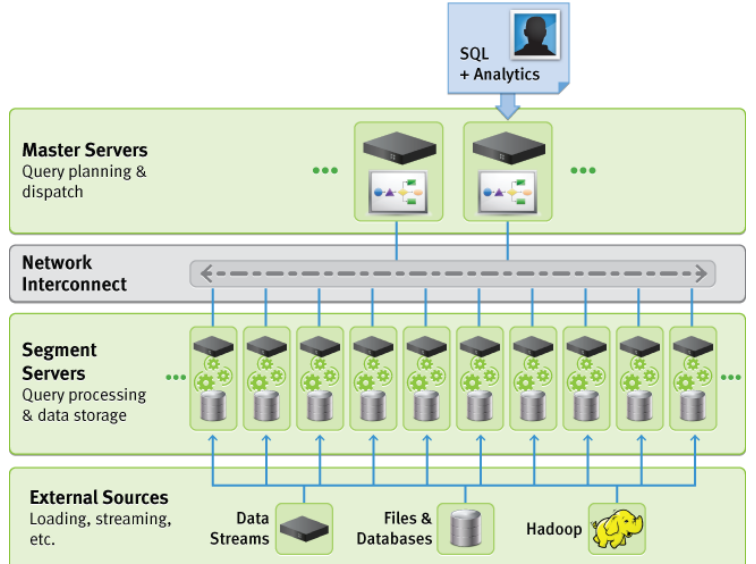

查询执行期间，数据可以用多种方式分布到 segments：哈希分布（hashed distribution）根据某个哈希函数把元组分发到 segments；复制分布（replicated distribution）在每个 segment 保存表的完整副本；单点分布（singleton distribution）把整个分布式表从多个 segments 收集到单个主机，通常是 master。

### 2.2 Hadoop 上的 SQL

在 Hadoop 上处理分析查询越来越流行。最初，查询被表达为 MapReduce 作业，Hadoop 的吸引力主要来自可扩展性和容错性。然而，用 MapReduce 编写、手工优化和维护复杂查询很困难。因此，Hive 等类 SQL 声明式语言被构建在 Hadoop 之上。HiveQL 查询会被编译为 MapReduce 作业并由 Hadoop 执行。HiveQL 加快了复杂查询开发，但也暴露出 Hadoop 生态需要优化器，因为编译出的 MapReduce 作业性能较差。

Pivotal 通过引入 HAWQ 应对这一挑战。HAWQ 是构建在 HDFS 之上的大规模并行 SQL 兼容引擎。HAWQ 在核心中使用 Orca 生成高效查询计划，最小化访问 Hadoop 集群中数据的代价。HAWQ 架构把先进的基于代价的优化器与 Hadoop 的可扩展性和容错性结合起来，支持 PB 级数据的交互式处理。

近期，Cloudera Impala 和 Facebook Presto 等系统也引入新优化器，以支持 Hadoop 上的 SQL 处理。当时这些系统仅支持 SQL 标准特性的子集，并且优化主要限于基于规则的方法。相比之下，HAWQ 提供完整的标准兼容 SQL 接口和基于代价的优化器，这在 Hadoop 查询引擎中是前所未有的。Section 7 的实验说明 Orca 在功能和性能两方面如何使 HAWQ 区别于其他 Hadoop SQL 引擎。

## 3. Orca 架构

Orca 是 Pivotal 数据管理产品的新查询优化器，包括 GPDB 和 HAWQ。Orca 是基于 Cascades 优化框架的现代自顶向下查询优化器。许多 Cascades 优化器与宿主系统紧密耦合，而 Orca 的独特特性是能够脱离数据库系统作为独立优化器运行。这对于用一个优化器支持 MPP 和 Hadoop 等不同计算架构至关重要，也使新的查询处理范式能够复用关系优化领域的大量遗产。此外，优化器独立运行后，可以在不穿过数据库系统单体结构的情况下进行更细致的测试。

**DXL**。将优化器与数据库系统解耦，需要建立处理查询的通信机制。Orca 包含一个在优化器和数据库系统之间交换信息的框架，称为 Data eXchange Language（DXL）。该框架使用基于 XML 的语言编码必要信息，例如输入查询、输出计划和元数据。DXL 之上叠加了一个简单通信协议，用于发送初始查询结构并取回优化后的计划。DXL 的主要好处之一，是可以把 Orca 打包为独立产品。


图 2 展示 Orca 与外部数据库系统的交互。Orca 的输入是 DXL 查询，输出是 DXL 计划。优化期间，Orca 可以向数据库系统查询元数据，例如表定义。Orca 通过允许数据库系统注册元数据提供器（Metadata Provider, MD Provider）来抽象元数据访问细节；该提供器负责在元数据发送给 Orca 前把它序列化为 DXL。元数据也可以来自普通文件，文件中保存了以 DXL 格式序列化的元数据对象。

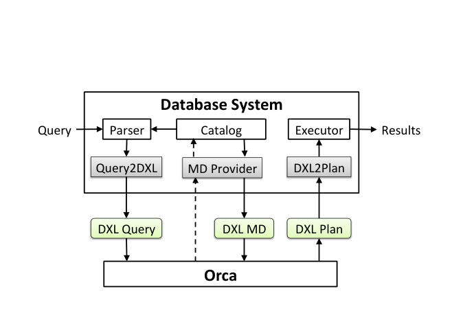

数据库系统需要包含能消费和生成 DXL 格式数据的转换器。Query2DXL 转换器把查询解析树转换为 DXL 查询，DXL2Plan 转换器把 DXL 计划转换为可执行计划。这些转换器完全在 Orca 外部实现，因此多个系统可以通过提供适当转换器来使用 Orca。

Orca 架构高度可扩展；所有组件都可以单独替换并分别配置。图 3 展示 Orca 的不同组件。

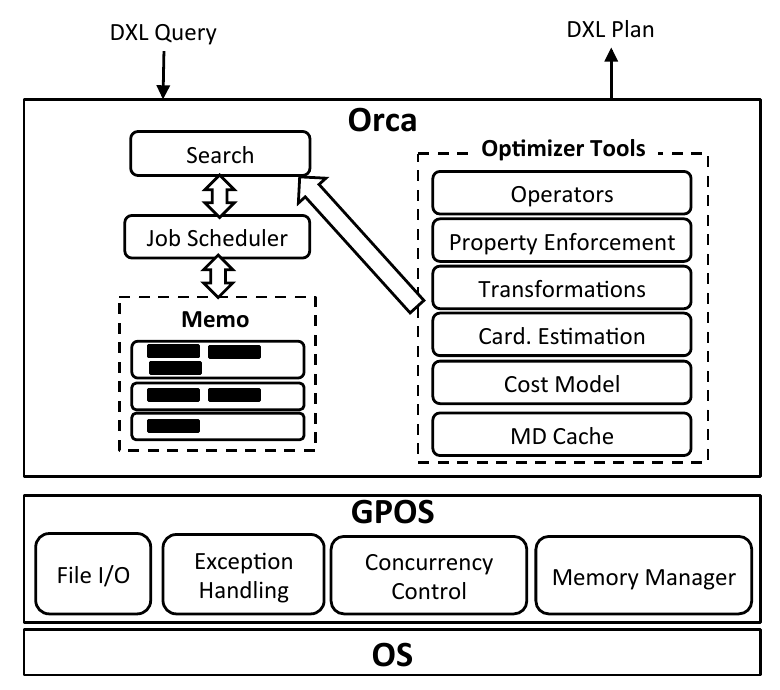


**Memo**。优化器生成的计划备选空间被编码在一种紧凑的内存数据结构中，称为 Memo。Memo 由一组容器组成，容器称为 group；每个 group 包含逻辑等价表达式。Memo group 捕获查询的不同子目标，例如对表的过滤或两个表的连接。group 成员称为 group expression，它们用不同逻辑方式达成 group 目标，例如不同连接顺序。每个 group expression 是一个算子，其子节点是其他 groups。Memo 的递归结构可以紧凑编码巨大的可能计划空间。

**Search 和 Job Scheduler**。Orca 使用搜索机制遍历可能计划备选空间，并找出估计代价最低的计划。该搜索机制由专门的 Job Scheduler 支持。调度器创建有依赖或可并行的工作单元，用三大步骤执行查询优化：exploration 生成等价逻辑表达式；implementation 生成物理计划；optimization 强制满足所需物理属性（例如排序顺序）并为计划备选估价。

**Transformations**。计划备选通过应用 transformation rule 生成。规则可以产生等价逻辑表达式，例如 `InnerJoin(A,B) -> InnerJoin(B,A)`；也可以产生已有表达式的物理实现，例如 `Join(A,B) -> HashJoin(A,B)`。规则应用结果会 copy-in 到 Memo，这可能创建新 group，或者向已有 group 添加新的 group expression。每条 transformation rule 都是自包含组件，可以在 Orca 配置中显式启用或禁用。

**Property Enforcement**。Orca 包含一个可扩展框架，用形式化属性规范描述查询需求和计划特征。属性包括多种类型：逻辑属性，例如输出列；物理属性，例如排序顺序和数据分布；标量属性，例如连接条件使用的列。查询优化期间，每个算子可以向子节点请求特定属性。优化后的子计划可能自己满足所需属性，例如 IndexScan 计划输出有序数据；否则需要在计划中插入属性强制器（enforcer），例如 Sort 算子，以产生所需属性。该框架允许每个算子根据子计划属性和算子的局部行为控制 enforcer 的放置。

**Metadata Cache**。元数据（例如表定义）变化不频繁，如果每个查询都携带元数据会产生开销。Orca 在优化器侧缓存元数据，只有当某段元数据不在缓存中，或自上次加载到缓存后已经发生变化时，才从 catalog 取回。元数据缓存还把数据库系统细节与优化器隔离，这对测试和调试特别有用。

**GPOS**。为与可能具有不同 API 的操作系统交互，Orca 使用称为 GPOS 的 OS 抽象层。GPOS 为 Orca 提供大量基础设施，包括内存管理器、并发控制原语、异常处理、文件 I/O 和同步数据结构。

## 4. 查询优化

本节先描述 Orca 的优化工作流（Section 4.1），再说明优化过程如何并行执行（Section 4.2）。

### 4.1 优化工作流

本文用如下查询作为贯穿示例：

```sql
SELECT T1.a FROM T1, T2
WHERE T1.a = T2.b
ORDER BY T1.a;
```

其中 `T1` 的分布是 `Hashed(T1.a)`，`T2` 的分布是 `Hashed(T2.a)`。


清单 1 展示该查询在 DXL 中的表示，其中给出了所需输出列、排序列、数据分布和逻辑查询。元数据（例如表和算子定义）带有 metadata id（Mdid），以便优化期间请求更多信息。Mdid 是由数据库系统标识、对象标识和版本号组成的唯一标识。例如，`0.96.1.0` 表示 GPDB 的整数相等算子，版本为 `1.0`。元数据版本用于使跨查询修改过的缓存元数据对象失效。

**代码清单 1：DXL 查询消息。**

```xml
<?xml version="1.0" encoding="UTF-8"?>
<dxl:DXLMessage xmlns:dxl="http://greenplum.com/dxl/v1">
  <dxl:Query>
    <dxl:OutputColumns>
      <dxl:Ident ColId="0" Name="a" Mdid="0.23.1.0"/>
    </dxl:OutputColumns>
    <dxl:SortingColumnList>
      <dxl:SortingColumn ColId="0" OpMdid="0.97.1.0">
    </dxl:SortingColumnList>
    <dxl:Distribution Type="Singleton" />
    <dxl:LogicalJoin JoinType="Inner">
      <dxl:LogicalGet>
        <dxl:TableDescriptor Mdid="0.1639448.1.1" Name="T1">
          <dxl:Columns>
            <dxl:Ident ColId="0" Name="a" Mdid="0.23.1.0"/>
            <dxl:Ident ColId="1" Name="b" Mdid="0.23.1.0"/>
          </dxl:Columns>
        </dxl:TableDescriptor>
      </dxl:LogicalGet>
      <dxl:LogicalGet>
        <dxl:TableDescriptor Mdid="0.2868145.1.1" Name="T2">
          <dxl:Columns>
            <dxl:Ident ColId="2" Name="a" Mdid="0.23.1.0"/>
            <dxl:Ident ColId="3" Name="b" Mdid="0.23.1.0"/>
          </dxl:Columns>
        </dxl:TableDescriptor>
      </dxl:LogicalGet>
      <dxl:Comparison Operator="=" Mdid="0.96.1.0">
        <dxl:Ident ColId="0" Name="a" Mdid="0.23.1.0"/>
        <dxl:Ident ColId="3" Name="b" Mdid="0.23.1.0"/>
      </dxl:Comparison>
    </dxl:LogicalJoin>
  </dxl:Query>
</dxl:DXLMessage>
```

原文中的 `<dxl:SortingColumn ...>` 行没有自闭合斜杠，也没有对应的结束标签；以上按可见原文保留。

DXL 查询消息被发送到 Orca，Orca 解析它并转换为内存中的逻辑表达式树，再 copy-in 到 Memo。图 4 展示 Memo 的初始内容。该逻辑表达式为两个表和 `InnerJoin` 操作创建三个 groups。为简洁起见，图中省略了连接条件。Group 0 称为 root group，因为它对应逻辑表达式的根。逻辑表达式中算子之间的依赖以 group 引用捕获。例如，`InnerJoin[1,2]` 表示把 Group 1 和 Group 2 作为子节点。

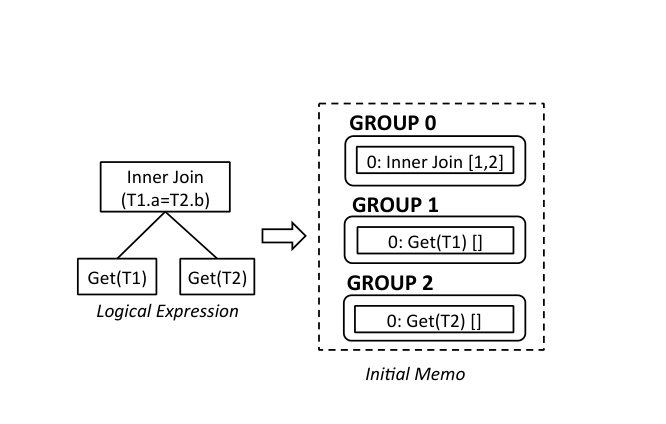


优化按照以下步骤进行。

**(1) Exploration**。触发生成逻辑等价表达式的 transformation rule。例如，Join Commutativity 规则会从 `InnerJoin[1,2]` 生成 `InnerJoin[2,1]`。Exploration 会向已有 group 添加新的 group expression，也可能创建新 group。Memo 结构内置基于表达式拓扑的重复检测机制，用于检测并消除不同 transformation 创建的重复表达式。

**(2) Statistics Derivation**。Exploration 结束时，Memo 保存给定查询的完整逻辑空间。随后 Orca 触发统计派生机制，为 Memo groups 计算统计信息。Orca 中的统计对象主要是一组列直方图，用于派生基数和数据倾斜估计。统计派生在紧凑 Memo 结构上执行，以避免展开搜索空间。

为了给目标 group 派生统计信息，Orca 会选择最有希望产生可靠统计的 group expression。统计 promise 的计算与表达式类型有关。例如，连接条件较少的 `InnerJoin` expression，比另一个连接条件更多但等价的 `InnerJoin` expression 更有希望产生可靠统计；这种情况可能出现在生成多个连接顺序时。其理由是：连接条件越多，估计误差传播并放大的可能性越高。为基数估计计算置信分数很有挑战，因为需要跨给定表达式的所有节点聚合置信分数。我们当时正在探索在紧凑 Memo 结构中计算置信分数的多种方法。

选择目标 group 中最有希望的 group expression 后，Orca 递归触发该 expression 子 group 的统计派生。最后，通过合并子 group 的统计对象构造目标 group 的统计对象。


图 5 用贯穿示例说明统计派生机制。首先执行自顶向下 pass，由父 group expression 向其子 group 请求统计信息。例如，`InnerJoin(T1,T2)` 在 `(a=b)` 上请求 `T1.a` 和 `T2.b` 的直方图。所需直方图按需通过注册的 MD Provider 从 catalog 加载，解析为 DXL，并存储在 MD Cache 中供后续请求使用。然后执行自底向上 pass，把子统计对象合并为父统计对象。结果是在 `T1.a` 和 `T2.b` 列上得到可能被修改过的直方图，因为连接条件可能影响列直方图。

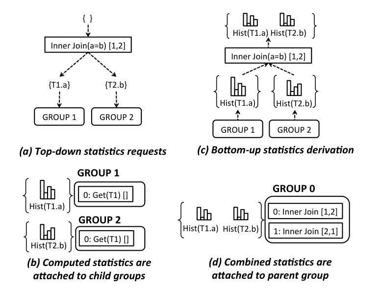

构造出的统计对象附着到各个 group 上，之后可在优化期间增量更新，例如添加新的直方图。这对控制统计派生成本至关重要。

**(3) Implementation**。触发创建逻辑表达式物理实现的 transformation rule。例如，`Get2Scan` 规则从逻辑 `Get` 生成物理表 `Scan`；类似地，`InnerJoin2HashJoin` 和 `InnerJoin2NLJoin` 规则生成 Hash Join 和 Nested Loops Join 实现。

**(4) Optimization**。本步骤强制属性并为计划备选估价。优化从向 Memo root group 提交初始优化请求开始，请求中指定查询需求，例如结果分布和排序顺序。向 group `g` 提交请求 `r`，含义是请求以 `g` 中物理算子为根、满足 `r` 的最低代价计划。

对每个传入请求，每个物理 group expression 会根据传入需求和算子的局部需求，把相应请求传递给子 group。优化期间，许多相同请求可能提交到同一个 group。Orca 把计算过的请求缓存在 group 哈希表中。只有当传入请求尚未存在于 group 哈希表时才会计算。此外，每个物理 group expression 维护一个局部哈希表，把传入请求映射到对应的子请求。后续从 Memo 抽取物理计划时会使用这种链接结构。


图 6 展示贯穿示例中的 Memo 优化请求。初始优化请求是 `req. #1: {Singleton, <T1.a>}`，表示查询结果需要按 `T1.a` 给出的顺序收集到 master。图中还展示 group 哈希表，其中每个请求关联到以最低估计代价满足它的最佳 group expression（GExpr）。黑色框表示插入 Memo 的 enforcer 算子，用于产生排序顺序和数据分布。`Gather` 算子把所有 segments 的元组收集到 master。`GatherMerge` 算子把所有 segments 的有序数据收集到 master，同时保持排序顺序。`Redistribute` 算子根据给定参数的哈希值把元组分发到 segments。

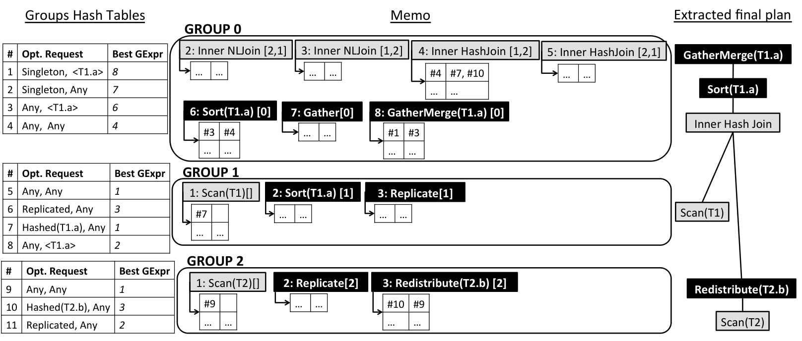

图 7 展示 `InnerHashJoin[1,2]` 对 `req. #1` 的优化。对该请求，一种备选计划是基于连接条件对齐子节点分布，使要连接的元组位于同一位置。这通过向 group 1 请求 `Hashed(T1.a)` 分布、向 group 2 请求 `Hashed(T2.b)` 分布实现。两个 group 都被要求输出任意排序顺序（Any sort order）。找到子节点最佳计划后，`InnerHashJoin` 合并子属性以确定交付的数据分布和排序顺序。注意，group 2 的最佳计划需要按 `T2.b` 对 `T2` 进行哈希重分布，因为 `T2` 原本按 `T2.a` 哈希分布；group 1 的最佳计划则只是简单 `Scan`，因为 `T1` 已按 `T1.a` 哈希分布。

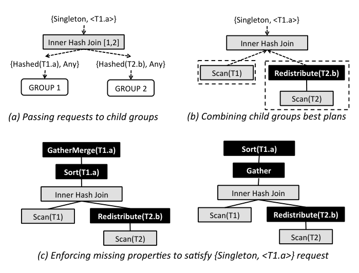

当交付属性不满足初始需求时，未满足属性必须被强制。Orca 中的属性强制是一个灵活框架，允许每个算子基于子计划交付属性和算子的局部行为定义强制所需属性的行为。例如，如果外侧子节点已经交付所需顺序，一个保持顺序的 Nested Loop Join 可能不需要在连接之上再强制排序。

Enforcer 会被添加到包含正在优化的 group expression 的 group 中。图 7 展示了通过属性强制满足 `req. #1` 的两个可能计划。左侧计划先在 segments 上对连接结果排序，再在 master 上 gather-merge 有序结果；右侧计划先把连接结果从 segments 收集到 master，再执行排序。这些不同备选会编码到 Memo 中，并由代价模型区分其代价。


最后，根据优化请求给出的链接结构从 Memo 中抽取最佳计划。图 6 展示了贯穿示例的计划抽取过程。图中展示了相关 group expression 的局部哈希表。每个局部哈希表把传入优化请求映射到对应子优化请求。

抽取从 root group 中查找 `req. #1` 的最佳 group expression 开始，这会得到 `GatherMerge` 算子。`GatherMerge` 的局部哈希表中，对应子请求是 `req #3`。`req #3` 的最佳 group expression 是 `Sort`，因此把 `GatherMerge` 连接到 `Sort`。`Sort` 的局部哈希表中，对应子请求是 `req #4`。`req #4` 的最佳 group expression 是 `InnerHashJoin[1,2]`，因此把 `Sort` 连接到 `InnerHashJoin`。继续同样过程即可完成计划抽取，得到图 6 中的最终计划。

抽取出的计划被序列化为 DXL 格式，并发送给数据库系统执行。数据库系统端的 DXL2Plan 转换器根据底层查询执行框架，把 DXL 计划转换为可执行计划。

**多阶段优化（Multi-Stage Optimization）**。Orca 当时的进行中工作包括实现多阶段优化。Orca 中的一个优化阶段定义为使用 transformation rule 子集的一次完整优化工作流，并可带有超时和代价阈值。阶段会在以下任一条件满足时终止：找到低于代价阈值的计划；发生超时；或 transformation rule 子集耗尽。用户可以通过 Orca 配置指定优化阶段。该技术支持资源受限优化，例如把最昂贵的 transformation rule 配置到后续阶段，以避免增加优化时间。该技术也是尽早获得查询计划、缩减复杂查询搜索空间的基础。

**查询执行（Query Execution）**。最终计划的副本会分发到每个 segment。分布式查询执行期间，每个 segment 上的 distribution enforcer 既作为数据发送方，也作为数据接收方。例如，segment `S` 上运行的 `Redistribute(T2.b)` 实例根据 `T2.b` 的哈希值把 `S` 上的元组发送给其他 segments，同时也接收其他 segments 上 `Redistribute(T2.b)` 实例发送的元组。

### 4.2 并行查询优化

查询优化可能是数据库系统中 CPU 最密集的过程。有效使用 CPU 会带来更好的查询计划，从而提升系统性能。并行化查询优化器对于利用现代多核 CPU 设计至关重要。

Orca 是支持多核的优化器。优化过程被拆成小工作单元，称为 optimization jobs。Orca 当时有七类优化 job：

- `Exp(g)`: 生成 group `g` 中所有 group expression 的逻辑等价表达式。
- `Exp(gexpr)`: 生成 group expression `gexpr` 的逻辑等价表达式。
- `Imp(g)`: 生成 group `g` 中所有 group expression 的实现。
- `Imp(gexpr)`: 生成 group expression `gexpr` 的实现备选。
- `Opt(g, req)`: 返回以 group `g` 中算子为根、满足优化请求 `req` 的最低估计代价计划。
- `Opt(gexpr, req)`: 返回以 `gexpr` 为根、满足优化请求 `req` 的最低估计代价计划。
- `Xform(gexpr, t)`: 使用规则 `t` 转换 group expression `gexpr`。

对给定查询，每种类型都可能创建数百甚至数千个 job 实例。这给 job 依赖处理带来挑战。例如，只有当 group expression 的子 group 也已优化后，该 group expression 才能被优化。


图 8 展示了一个局部 job 图，其中在优化请求 `req0` 下优化 group `g0` 会触发一棵很深的依赖 job 树。依赖通过子父链接编码；父 job 必须等所有子 job 完成后才能结束。当子 job 推进时，父 job 需要挂起。这允许没有相互依赖的子 job 获取可用线程并并行运行。当所有子 job 完成后，被挂起的父 job 会收到通知并恢复处理。

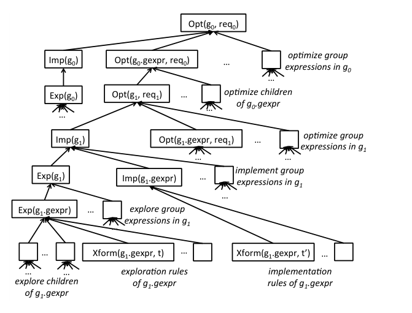

Orca 包含一个从头设计的专门 job scheduler，用于最大化 job 依赖图的 fan-out，并为并行查询优化提供所需基础设施。调度器提供 API，把优化 job 定义为可重入过程，使其能被可用处理线程拾取执行。调度器还维护 job 依赖图，以识别并行机会，例如在不同 groups 中运行 transformation，并在被依赖 job 结束时通知挂起 job。

并行查询优化期间，不同优化请求可能触发多个并发请求修改同一个 Memo group。为了减少目标相同的 job 之间的同步开销，例如探索同一个 group，job 不应知道彼此的存在。当某个目标的优化 job 正在处理时，所有具有相同目标的新进入 job 都被强制等待，直到运行中的 job 完成并发出通知。此时，挂起的 job 可以取得已完成 job 的结果。该功能通过为每个 group 附加 job 队列实现；只要存在相同目标的活跃 job，新进入 job 就会排队。

## 5. 元数据交换

Orca 被设计为在数据库系统外运行。优化器与数据库系统之间的主要交互点之一是元数据交换。例如，优化器可能需要知道某个表上是否定义了索引，以制定高效查询计划。元数据访问由一组 Metadata Providers 支持；这些 providers 是系统特定插件，用于从数据库系统取回元数据。


图 9 展示 Orca 如何与不同后端系统交换元数据。查询优化期间，Orca 访问的所有元数据对象都会 pin 在内存缓存中，并在优化完成或抛出错误时 unpin。所有元数据对象访问都通过 MD Accessor 完成。MD Accessor 跟踪优化会话中正在访问的对象，并确保不再需要时释放它们。如果请求的元数据对象尚未在缓存中，MD Accessor 还负责透明地从外部 MD Provider 获取元数据。服务不同优化会话的不同 MD Accessor 可以具有不同外部 MD Provider。

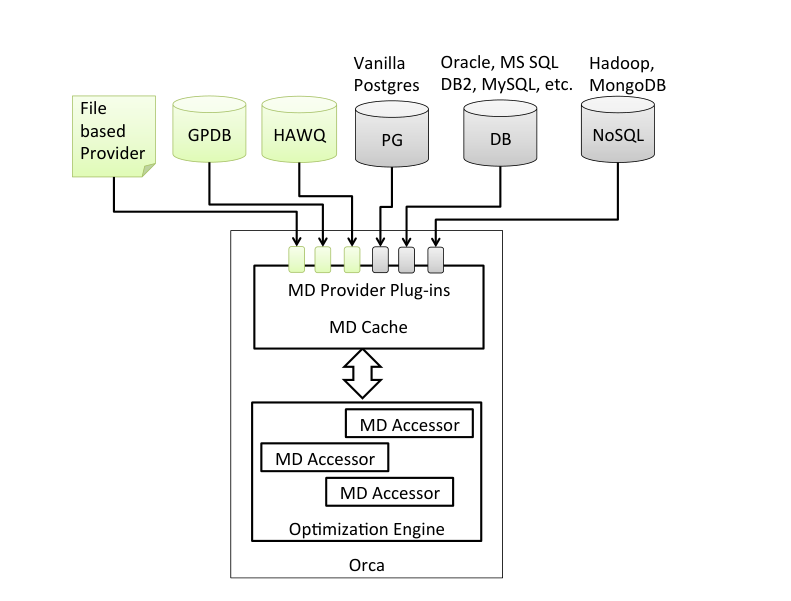

除系统特定 provider 外，Orca 还实现了基于文件的 MD Provider，用于从 DXL 文件加载元数据，从而无需访问在线后端系统。Orca 包含自动工具，用于把优化器需要的元数据采集到最小 DXL 文件中。Section 6.1 说明该工具如何在后端数据库系统离线时重放客户查询优化。


## 6. 可验证性

测试查询优化器与构建优化器同样具有挑战。Orca 从早期开发阶段就把测试纳入设计。内建测试方案使开发者难以在添加新功能时引入回归，也使测试工程师能够轻松添加每次构建都要验证的测试用例。此外，我们还利用多种自建工具和测试框架确保 Orca 的质量和可验证性，包括基数估计测试框架、多种规模的基准测试、可通过反转数据库统计信息生成数据的数据生成器，以及下一节讨论的两个独特测试工具。

第一个工具是自动捕获和重放优化器异常，见 Section 6.1。第二个工具实现了自动测量优化器代价模型准确性的方法，见 Section 6.2。

### 6.1 最小复现

AMPERe 是 Automatic capture of Minimal Portable and Executable Repros 的工具，即自动捕获最小、可移植、可执行复现。构建 AMPERe 的动机，是在无法访问客户生产系统的情况下重现并调试客户在优化器中遇到的问题。

AMPERe dump 会在遇到非预期错误时自动触发，也可以按需生成，用来调查次优查询计划。dump 捕获复现问题所需的最少数据，包括输入查询、优化器配置和元数据，并以 DXL 序列化。如果 dump 因异常生成，还会包含异常栈跟踪。


清单 2 展示简化 AMPERe dump 的例子。该 dump 只包含重现问题所需的数据。例如，dump 捕获 MD Cache 状态，其中只包含查询优化过程中获取过的元数据。AMPERe 也被设计为可扩展：Orca 中任何组件都可以向 AMPERe serializer 注册自己，在输出 dump 中生成额外信息。

**代码清单 2：简化的 AMPERe dump。**

```xml
<?xml version="1.0" encoding="UTF-8"?>
<dxl:DXLMessage xmlns:dxl="http://greenplum.com/dxl/v1">
  <dxl:Thread Id="0">
    <dxl:Stacktrace>
      1 0x000e8106df gpos::CException::Raise
      2 0x000137d853 COptTasks::PvOptimizeTask
      3 0x000e81cb1c gpos::CTask::Execute
      4 0x000e8180f4 gpos::CWorker::Execute
      5 0x000e81e811 gpos::CAutoTaskProxy::Execute
    </dxl:Stacktrace>
    <dxl:TraceFlags Value="gp_optimizer_hashjoin"/>
    <dxl:Metadata SystemIds="0.GPDB">
      <dxl:Type Mdid="0.9.1.0" Name="int4"
                IsRedistributable="true" Length="4" />
      <dxl:RelStats Mdid="2.688.1.1" Name="r" Rows="10"/>
      <dxl:Relation Mdid="0.688.1.1" Name="r"
                    DistributionPolicy="Hash"
                    DistributionColumns="0">
        <dxl:Columns>
          <dxl:Column Name="a" Attno="1" Mdid="0.9.1.0"/>
        </dxl:Columns>
      </dxl:Relation>
    </dxl:Metadata>
    <dxl:Query>
      <dxl:OutputColumns>
        <dxl:Ident ColId="1" Name="a" Mdid="0.9.1.0"/>
      </dxl:OutputColumns>
      <dxl:LogicalGet>
        <dxl:TableDescriptor Mdid="0.688.1.1" Name="r">
          <dxl:Columns>
            <dxl:Column ColId="1" Name="a" Mdid="0.9.1.0"/>
          </dxl:Columns>
        </dxl:TableDescriptor>
      </dxl:LogicalGet>
    </dxl:Query>
  </dxl:Thread>
</dxl:DXLMessage>
```

AMPERe 允许在生成 dump 的系统之外重放 dump。任意 Orca 实例都可以加载 dump，取回输入查询、元数据和配置参数，从而发起与触发问题场景相同的优化会话。该过程如图 10 所示：优化器从 dump 中加载输入查询，为元数据创建基于文件的 MD Provider，设置优化器配置，然后启动优化线程以即时重现问题。

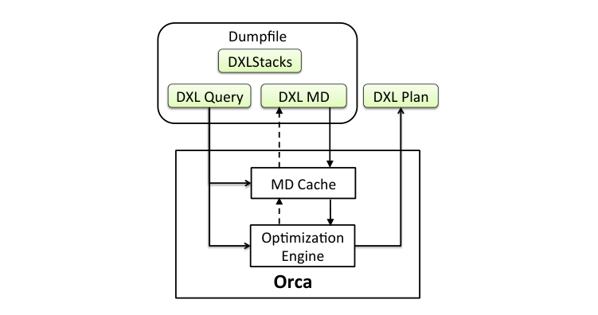

AMPERe 也被用作测试框架，其中一个 dump 就是包含输入查询及其期望计划的测试用例。重放 dump 文件时，Orca 可能生成与期望不同的计划，例如由于代价模型变化。这种差异会导致测试用例失败，并触发对计划差异根因的调查。借助该框架，任何带有 AMPERe dump 的 bug，无论来自内部测试还是客户报告，都可以自动转化为自包含测试用例。

### 6.2 测试优化器准确性

Orca 代价模型的准确性会受多种误差源影响，包括不准确的基数估计和未正确调整的代价模型参数。因此，代价模型对计划执行墙钟时间的预测并不完美。量化优化器准确性对于避免 bug 修复和新功能引入性能回归至关重要。

Orca 包含一个内建工具 TAQO，用于 Testing the Accuracy of Query Optimizer。TAQO 测量优化器代价模型正确排序任意两个给定计划的能力，也就是说，估计代价更高的计划是否确实运行更久。图 11 中，优化器正确排序了 `(p1, p3)`，因为它们的实际代价与计算出的估计代价成正比。另一方面，优化器错误排序了 `(p1, p2)`，因为它们的实际代价与计算出的估计代价成反比。

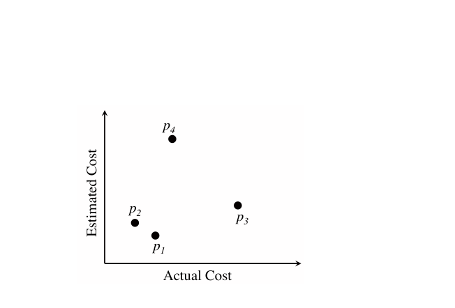


TAQO 通过为优化给定查询时优化器考虑的计划估价并执行这些计划，来测量优化器准确性。一般来说，评估搜索空间中每一个计划是不可行的。该限制可以通过从搜索空间均匀采样计划来克服。优化请求的链接结构（见 Section 4.1）为 TAQO 构建统一计划采样器提供了基础设施。

给定某个查询搜索空间中的计划样本后，TAQO 计算两个排序之间的相关分数：一个排序基于估计代价，另一个排序基于实际代价。相关分数结合了多种度量，包括计划重要性和计划距离。对非常好的计划出现代价误估时，该分数会给予更高惩罚；对实际执行时间很接近的计划，如果估计代价只有小差异，则不会惩罚优化器。相关分数还允许对不同数据库系统的优化器进行基准测试，评估其相对质量。

## 7. 实验

实验选择对配备 Orca 的数据库系统进行端到端评估，而不是单独评估 Orca 的各个组件，以突出新查询优化器带来的价值。我们先将 Orca 与 Pivotal GPDB 的遗留查询优化器比较，然后将 Pivotal HAWQ（核心使用 Orca）与其他流行 SQL on Hadoop 方案比较。

### 7.1 TPC-DS 基准

实验基于 TPC-DS 基准。TPC-DS 是广泛采用的决策支持基准，由一组复杂业务分析查询构成。它通过提供更丰富的 schema 和更大范围的业务问题，取代了著名的 TPC-H。这些问题覆盖业务报表、即席探索、迭代查询和数据挖掘。我们在开发过程中观察到，TPC-H 通常缺乏企业客户工作负载的复杂性。相比之下，TPC-DS 包含 25 个表、429 列和 99 个查询模板，能够很好代表现代决策支持系统，也是测试查询优化器的优秀基准。TPC-DS 查询中丰富的 SQL 语法，包括 WITH 子句、窗口函数、子查询、外连接、CASE 语句、INTERSECT、EXCEPT 等，也是对任何查询引擎 SQL 兼容性的严肃测试。

### 7.2 MPP 数据库

本部分比较 Orca 与 GPDB 遗留查询优化器（也称 Planner）的性能。Planner 的部分设计继承自 PostgreSQL 优化器。Planner 是一个稳健优化器，在过去十多年中良好服务了数百个生产系统，并不断改进。

#### 7.2.1 实验设置

Orca 与 Planner 的比较使用一个 16 节点集群，节点之间通过 10Gbps 以太网连接。每个节点有双 Intel Xeon 3.33GHz 处理器、48GB RAM，以及十二块 600GB SAS 磁盘，组成两个 RAID-5 组。操作系统为 Red Hat Enterprise Linux 5.5。

实验安装同一版本 GPDB 的两个隔离实例，一个使用 Orca，另一个使用 Planner。性能评估使用 10TB TPC-DS 基准和分区表。

#### 7.2.2 性能

实验从 TPC-DS 的 99 个模板生成 111 个查询。Orca 和 Planner 都支持这些查询的原始形式，无需重写。完整 SQL 兼容性为 BI 工具提供最大兼容性，也便于不同背景的数据分析师使用。Section 7.3 的 SQL on Hadoop 实验显示，许多 Hadoop SQL 引擎当时只能开箱支持 TPC-DS 查询的一小部分。


图 12 展示 Orca 相对 Planner 在所有查询上的加速比，其中高于 1 的柱表示 Orca 性能更好。可以看到，Orca 能够为 80% 的查询产生相近或更好的查询计划。对完整 TPC-DS 套件，Orca 相对 Planner 达到 5 倍加速。

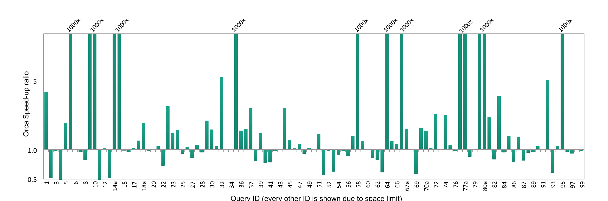

特别地，有 14 个查询中 Orca 达到至少 1000 倍加速，这是由于实验设置了 10000 秒超时。这些查询使用 Planner 的计划运行超过 10000 秒，而使用 Orca 的计划能在数分钟内完成。

Orca 带来的性能改进来自多种关键特性的组合：

- **Join Ordering**。Orca 包含多种基于动态规划、left-deep join tree 和基于基数的连接排序优化。
- **Correlated Subqueries**。Orca 采用并扩展了子查询的统一表示，以检测深度相关谓词，并把它们上拉为连接，从而避免重复执行子查询表达式。
- **Partition Elimination**。Orca 引入了一种用于动态裁剪分区表的新框架。该特性通过扩展 Orca 的 enforcer 框架以容纳新属性来实现。
- **Common Expressions**。Orca 为 WITH 子句引入新的 producer-consumer 模型。该模型允许复杂表达式只求值一次，并由多个算子消费其输出。

上述特性之间的配合由 Orca 的架构和组件抽象支持。每个特性都可以在尽量少改变其他特性行为的情况下设计、实现和测试。图 12 展示了这些特性结合后的收益，以及它们之间干净的交互。

对于少量查询，Orca 产生了次优计划，相比 Planner 最多慢 2 倍。这些次优计划部分来自基数估计误差，或仍需进一步调优的次优代价模型参数。我们正在积极调查这些问题并持续改进 Orca。

实验还测量了使用完整 transformation rule 集时的优化时间和 Orca 内存占用。平均优化时间约为 4 秒，平均内存占用约为 200 MB。正如 Section 4.1 所述，进行中工作包括实现 shortcut optimization 技术，并改进复杂查询的资源消耗。

### 7.3 Hadoop 上的 SQL

Hadoop 因可扩展性迅速成为流行分析生态。近年来，许多 Hadoop 系统开发了 SQL 或类 SQL 查询接口。本节将 Pivotal HAWQ（由 Orca 驱动）与三个 Hadoop SQL 引擎比较：Impala、Presto 和 Stinger。

#### 7.3.1 实验设置

实验在一个 10 节点集群上进行：两个节点用于 HDFS name node 和 SQL 引擎协调服务，八个节点用于 HDFS data node 和 worker node。每个节点有双 Intel Xeon 八核 2.7GHz 处理器、64GB RAM 和 22 块 900GB JBOD 磁盘。操作系统为 Red Hat Enterprise Linux 6.2。

Impala 使用 CDH 4.4 和 Impala 1.1.1，Presto 使用 0.52，Stinger 使用 Hive 0.12。实验尽力为每个系统调优配置，包括启用 short circuit read、为 worker 分配尽可能多内存，以及为协调服务提供独立节点。HAWQ 使用 Pivotal HD 1.1。

在不同系统中优化 TPC-DS 查询非常具有挑战，因为这些系统当时 SQL 支持有限。例如，Impala 尚不支持窗口函数、不带 LIMIT 的 ORDER BY 语句，以及 ROLLUP 和 CUBE 等分析函数。Presto 尚不支持非等值连接。Stinger 当时不支持 WITH 子句和 CASE 语句。此外，所有这些系统都不支持 INTERSECT、EXCEPT、析取连接条件和相关子查询。这些不支持的特性迫使实验排除大量查询。

排除不支持查询后，仍需要重写剩余查询，以绕过不同系统中的解析限制。例如，Stinger 和 Presto 不支持隐式 cross-join 和某些数据类型。经过大量过滤和重写后，在总计 111 个查询中，实验最终在 Impala 中得到 31 个查询计划，在 Stinger 中得到 19 个，在 Presto 中得到 12 个。

#### 7.3.2 性能

实验最初尝试使用 10TB TPC-DS 基准评估不同系统。然而，Stinger 的多数查询没有在合理时间内返回，Impala 和 Presto 的几乎所有查询都因内存不足失败。这主要是因为当算子的内部状态超出内存限制时，这些系统无法把部分结果 spill 到磁盘。

为了提高不同系统的覆盖度，实验改用 256GB TPC-DS 基准，因为集群总工作内存约为 400GB（50GB x 8 个节点）。遗憾的是，即便在这种设置下，Presto 仍无法成功运行任何 TPC-DS 查询，虽然实验能够在 Presto 上运行更简单的连接查询。Impala 和 Stinger 则能够运行若干 TPC-DS 查询。


图 15 总结所有系统中受支持查询的数量。图中同时展示每个系统能够优化的查询数，即返回查询计划的查询数，以及在 256GB 数据集上能够完成执行并返回查询结果的查询数。

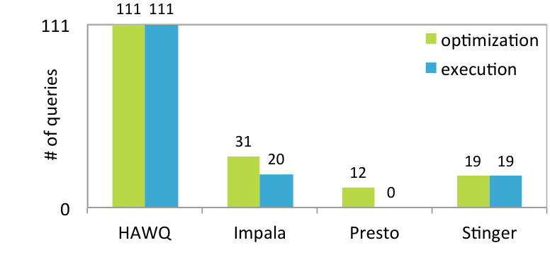

图 13 和图 14 展示 HAWQ 相对 Impala 和 Stinger 的加速比。由于两个系统并不支持所有查询，图中只列出成功查询。图 13 中带 `*` 的柱表示在 Impala 中内存不足的查询。查询 46、59 和 68 中，Impala 与 HAWQ 性能相近。

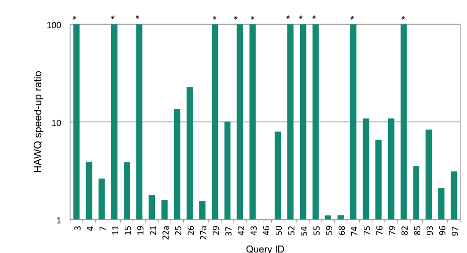

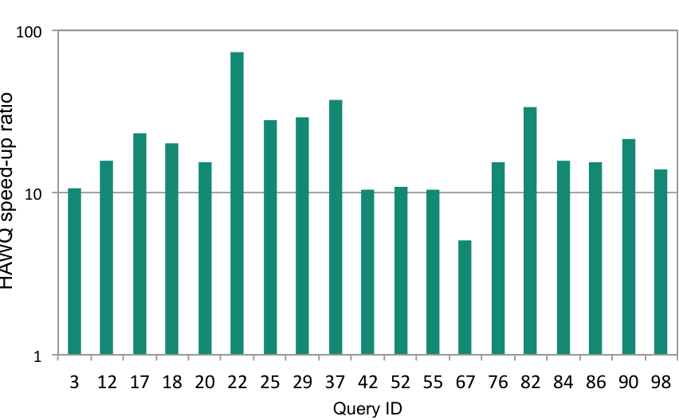

在 HAWQ 加速最显著的查询中，我们发现 Impala 和 Stinger 会按查询中指定的字面顺序处理连接，而 Orca 会探索不同连接顺序，并使用基于代价的方法推荐最佳顺序。例如在 query 25 中，Impala 先连接两个事实表 `store_sales` 和 `store_returns`，再把这个巨大的中间结果与另一个事实表 `catalog_sales` 连接，这很低效。相比之下，Orca 先把事实表与维表连接，以减少中间结果。

总体而言，连接排序是一种非平凡优化，需要优化器侧的大量基础设施。Impala 建议用户按被连接表大小的降序书写连接。然而，该建议忽略了表上的过滤条件，这些过滤条件可能具有选择性；它还给复杂查询的数据库用户增加了非平凡负担，并且可能不被自动生成查询的 BI 工具支持。查询优化器缺少连接排序优化，会负面影响生成计划的质量。HAWQ 加速的其他可能原因，例如资源管理和查询执行，不在本文范围内。

在这组实验中，HAWQ 相对 Impala 的平均加速比为 6 倍，相对 Stinger 为 21 倍。需要注意的是，图 13 和图 14 中列出的查询是 TPC-DS 基准中相对简单的查询。更复杂的查询，例如带相关子查询的查询，当时其他系统尚不支持，而 Orca 完全支持。我们计划在未来当其他系统支持所有查询后，重新评估 TPC-DS 基准性能。

## 8. 相关工作

过去几十年中，查询优化一直是多项突破性创新的沃土。本节讨论若干基础查询优化技术，以及 MPP 数据库和 Hadoop 系统领域的近期提案。

### 8.1 查询优化基础

Volcano Parallel Database 提出了数据库中实现并行性的基本原则。该框架引入 exchange operators，支持两类并行性：通过流水线实现的算子间并行（inter-operator parallelism），以及通过在不同进程上运行的算子之间划分元组实现的算子内并行（intra-operator parallelism）。该设计允许每个算子在本地数据上独立执行，也允许它与其他进程中运行的同一算子的副本并行工作。若干 MPP 数据库使用这些原则构建商业成功产品。

Cascades 是可扩展优化器框架，其原则被用于构建 MS-SQL Server、SCOPE、PDW 和本文介绍的 Orca。该框架流行的原因在于它清晰分离了逻辑计划空间和物理计划空间。这主要通过把算子和 transformation rule 封装为自包含组件实现。该模块化设计使 Cascades 能够对逻辑等价表达式分组以消除重复工作，允许按需触发规则而不是采用 Volcano 的穷尽方法，并允许根据规则对给定算子的有用性安排规则应用顺序。

在 Cascades 原则基础上，已有并行优化框架支持为多核架构构建类似 Cascades 的优化器。Orca 中的并行查询优化框架基于这些原则。

### 8.2 MPP 数据库上的 SQL 优化

存储和查询数据量的指数增长，使 MPP 系统使用更广，包括 Teradata、Oracle Exadata、Netezza、Pivotal Greenplum Database 和 Vertica。受篇幅限制，本文只总结近期为应对大数据挑战而重新设计查询优化器的一些工作。

SQL Server Parallel Data Warehouse（PDW）大量复用成熟的 Microsoft SQL Server 优化器。对每个查询，PDW 向 SQL Server 优化器触发优化请求；该优化器在一个 shell database 上工作，这个数据库只维护数据库的元数据和统计信息，不保存用户数据。SQL Server 优化器探索的计划备选随后被发送到 PDW 的 Data Movement Service（DMS），在那里这些逻辑计划被补上分布信息。该方法避免了从头构建优化器，但也使调试和维护更困难，因为优化逻辑分布在两个不同进程和代码库中。

Structured Computations Optimized for Parallel Execution（SCOPE）是 Microsoft 的数据分析平台，结合了并行数据库和 MapReduce 系统的特征。与 Hive 类似，SCOPE 的脚本语言基于 SQL。SCOPE 面向 Cosmos 分布式数据平台开发，后者使用 append-only 文件系统；而 Orca 的愿景是与多种底层数据管理系统协作。

SAP HANA 是处理业务分析和 OLTP 查询的分布式内存数据库系统。MPP 数据库中的分析查询可能生成大量中间结果。并发分析查询可能耗尽可用内存，而多数内存已经用于存储和索引原始数据；这会触发数据 spill 到磁盘，对查询性能产生负面影响。

Vertica 是 C-Store 项目的商业化 MPP 版本，其中数据被组织为 projections，每个 projection 是表属性的一个子集。最初的 StarOpt 及其修改版 StratifiedOpt 是为星型/雪花型 schema 上的查询定制设计的，其中同一范围的连接键被 colocate。当无法实现数据 colocate 时，相关 projections 会复制到所有节点以提升性能，这由 Vertica 的 V2Opt 优化器处理。

### 8.3 Hadoop 上的 SQL

在 Hadoop 上执行 SQL 的经典方法，是使用 Hive 把查询转换为 MapReduce 作业。MapReduce 对交互式分析的性能可能不理想。Stinger 是一个通过利用和扩展 Hive 来优化 Hadoop 查询求值的项目。不过，这种方法可能需要显著重新设计 MapReduce 计算框架，以优化数据 passes，并把中间结果物化到磁盘。

多个系统通过创建专门查询引擎来支持 Hadoop 上的交互式处理，使 HDFS 中的数据能基于 SQL 处理，而无需使用 MapReduce。Impala、HAWQ 和 Presto 是这一方向的重要工作。这些方法在查询优化器和执行引擎的设计及能力上不同，而两者都是查询性能的差异化因素。

DBMS 与 Hadoop 技术的协同部署允许数据在各自平台上原生处理：DBMS 中使用 SQL，HDFS 中使用 MapReduce。Hadapt 开创了这种方法。Microsoft 也引入 PolyBase，提供把 PDW 中的表与 HDFS 上的数据连接的能力，以优化平台之间的数据交换。

AsterixDB 是一个开源项目，基于 NoSQL 风格数据模型高效存储、索引和查询半结构化信息。当时 AsterixDB 的查询规划器由用户 hints 驱动，而不是像 Orca 那样基于代价。Dremel 是 Google 的可扩展列式方案，用于分析 MapReduce pipeline 输出。Dremel 提供高层脚本语言，类似 AsterixDB 的 AQL 和 SCOPE，用于处理只读嵌套数据。

## 9. 总结

开发 Orca 的目标，是构建一个查询优化平台：它不仅代表先进技术状态，也足够强大和可扩展，能够支持新优化技术和高级查询特性的快速开发。

本文描述了从头构建这样一个系统所需的工程工作。把一系列技术保护措施集成到 Orca 中需要显著投入，但已经通过快速开发节奏和高质量软件获得回报。Orca 的模块化允许通过一种干净、统一的抽象编码系统能力和元数据，从而容易适配不同数据管理系统。

## 10. 参考文献

本文参考文献按原编号保留，题名和会议信息保留英文。

[1] TPC-DS. http://www.tpc.org/tpcds, 2005.

[2] L. Antova, A. ElHelw, M. Soliman, Z. Gu, M. Petropoulos, and F. Waas. Optimizing Queries over Partitioned Tables in MPP Systems. In SIGMOD, 2014.

[3] L. Antova, K. Krikellas, and F. M. Waas. Automatic Capture of Minimal, Portable, and Executable Bug Repros using AMPERe. In DBTest, 2012.

[4] K. Bajda-Pawlikowski, D. J. Abadi, A. Silberschatz, and E. Paulson. Efficient Processing of Data Warehousing Queries in a Split Execution Environment. In SIGMOD, 2011.

[5] A. Behm et al. ASTERIX: Towards a Scalable, Semistructured Data Platform for Evolving-world Models. Distributed and Parallel Databases, 29(3), 2011.

[6] R. Chaiken et al. SCOPE: Easy and Efficient Parallel Processing of Massive Data Sets. PVLDB, 1(2), 2008.

[7] L. Chan. Presto: Interacting with petabytes of data at Facebook. http://prestodb.io, 2013.

[8] Y. Chen et al. Partial Join Order Optimization in the Paraccel Analytic Database. In SIGMOD, 2009.

[9] J. C. Corbett et al. Spanner: Google's Globally-distributed Database. In OSDI, 2012.

[10] D. J. DeWitt et al. Split Query Processing in Polybase. In SIGMOD, 2013.

[11] F. Farber et al. SAP HANA Database: Data Management for Modern Business Applications. SIGMOD Record, 40(4), 2012.

[12] G. Graefe. Encapsulation of Parallelism in the Volcano Query Processing System. In SIGMOD, 1990.

[13] G. Graefe. The Cascades Framework for Query Optimization. IEEE Data Engineering Bulletin, 18(3), 1995.

[14] G. Graefe and W. J. McKenna. The Volcano Optimizer Generator: Extensibility and Efficient Search. In ICDE, 1993.

[15] Z. Gu, M. A. Soliman, and F. M. Waas. Testing the Accuracy of Query Optimizers. In DBTest, 2012.

[16] Hortonworks. Stinger, Interactive query for Apache Hive. http://hortonworks.com/labs/stinger/, 2013.

[17] M. Kornacker and J. Erickson. Cloudera Impala: Real-Time Queries in Apache Hadoop, for Real. Cloudera product page, 2012.

[18] A. Lamb et al. The Vertica Analytic Database: C-Store 7 Years Later. PVLDB, 5(12), 2012.

[19] S. Melnik et al. Dremel: Interactive Analysis of Web-Scale Datasets. PVLDB, 3(1):330-339, 2010.

[20] Pivotal. Greenplum Database. Pivotal product page, 2013.

[21] Pivotal. HAWQ. Pivotal white paper, 2013.

[22] P. G. Selinger, M. M. Astrahan, D. D. Chamberlin, R. A. Lorie, and T. G. Price. Access Path Selection in a Relational Database Management System. In SIGMOD, 1979.

[23] S. Shankar et al. Query Optimization in Microsoft SQL Server PDW. In SIGMOD, 2012.

[24] E. Shen and L. Antova. Reversing Statistics for Scalable Test Databases Generation. In DBTest, 2013.

[25] M. Singh and B. Leonhardi. Introduction to the IBM Netezza Warehouse Appliance. In CASCON, 2011.

[26] M. Stonebraker et al. C-Store: A Column-oriented DBMS. In VLDB, 2005.

[27] Teradata. http://www.teradata.com/, 2013.

[28] A. Thusoo et al. Hive - A Petabyte Scale Data Warehouse using Hadoop. In ICDE, 2010.

[29] F. Waas and C. Galindo-Legaria. Counting, Enumerating, and Sampling of Execution Plans in a Cost-based Query Optimizer. In SIGMOD, 2000.

[30] F. M. Waas and J. M. Hellerstein. Parallelizing Extensible Query Optimizers. In SIGMOD, 2009.

[31] R. Weiss. A Technical Overview of the Oracle Exadata Database Machine and Exadata Storage Server, 2012.
