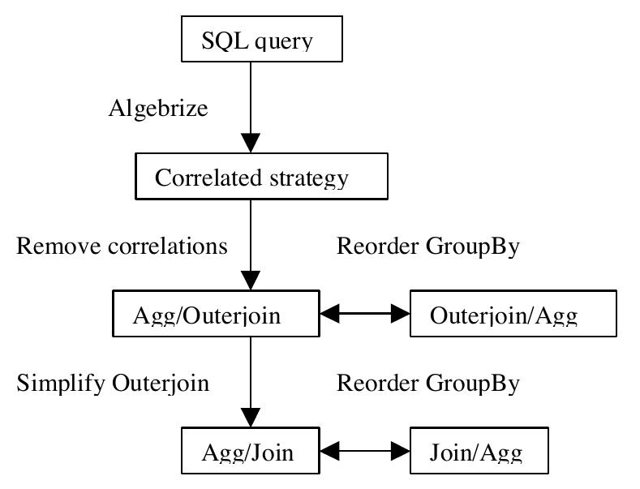
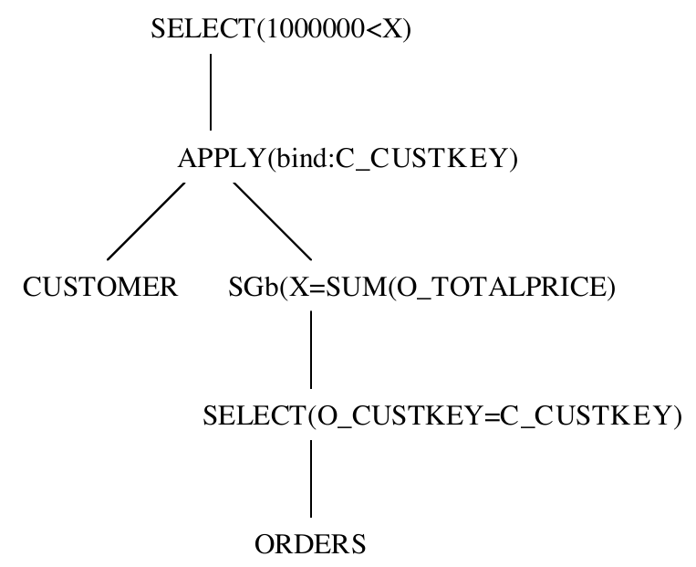
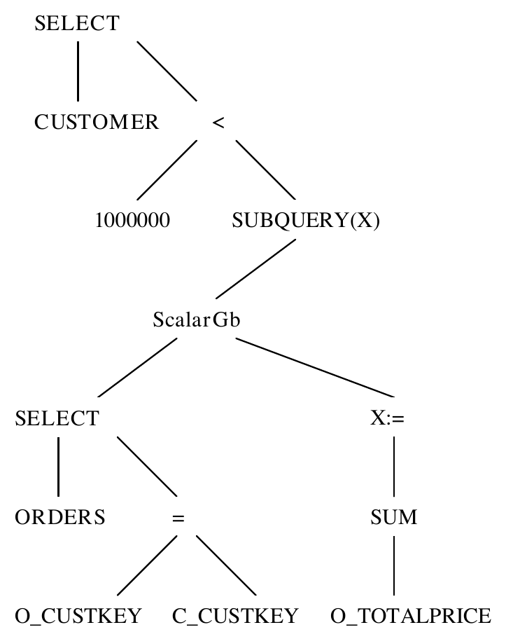
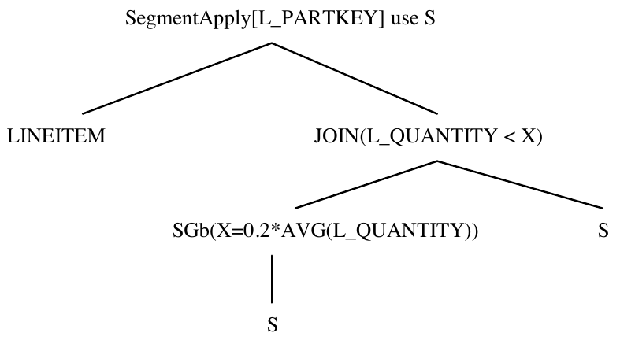
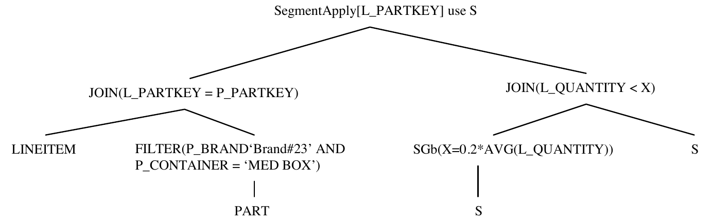
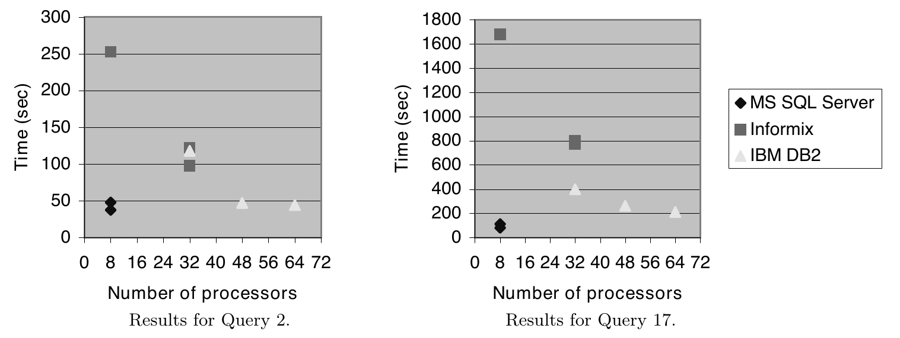

# Orthogonal Optimization of Subqueries and Aggregation（中文译文）

## 译者说明

本文依据同目录的 `source.pdf` 翻译。章节、图表、公式、算法、代码与参考文献按原文结构保留。

César A. Galindo-Legaria、Milind M. Joshi

`{cesarg,milindj}@microsoft.com`<br>
Microsoft Corp.<br>
One Microsoft Way<br>
Redmond, WA 98052

ACM SIGMOD 2001，2001 年 5 月 21—24 日，美国加利福尼亚州圣巴巴拉。

## 摘要

针对子查询求值提出的策略，与针对分组和聚合提出的策略之间，存在相当大的重叠。本文展示了若干小型、独立的基本操作如何生成丰富的高效执行策略，覆盖早期文献建议的标准子查询求值方案。这些小型基本操作分属于两个主要且正交的领域：消除相关性，以及高效处理外连接和 GroupBy。基于这些组成部分的优化方法，使查询处理在子查询方面具有语法无关性，即无论等价查询是否使用子查询来编写，都会产生同样高效的计划。

我们介绍 Microsoft SQL Server（7.0 和 8.0 版）中针对包含子查询和／或聚合的查询所实现的技术，它们以若干正交优化为基础。我们分别聚焦于消除相关子查询（也称为“查询展平”）以及高效执行带聚合的查询。最终得到的是一种模块化、灵活的实现，能够生成非常高效的执行计划。为了说明这一方法的有效性，我们给出 TPC-H 基准中若干查询的结果。在写作时（2000 年 11 月）所有已公布的 300GB 规模 TPC-H 结果中，SQL Server 在这些查询上取得了最快的结果，即使它所用的处理器数仅为其他系统的一部分。

## 1. 引言

子查询是 SQL 语言中一种方便而简洁的构造，商业数据库系统已经实现它多年。它是一种标准机制，在实际应用中经常使用；研究人员一直致力于其高效求值，并提出了强有力的技术。在这里，我们观察到，针对子查询执行提出的技术，与 GroupBy 求值等其他技术之间有显著重叠。因此，我们采用的方法是识别并实现更基本、彼此独立的优化，由它们共同生成高效的执行计划。

本文介绍 Microsoft SQL Server 中实现的子查询和聚合技术，组织如下。首先回顾标准的子查询求值方案，并说明如何将它们归结为其他基本优化。随后回顾相关性的代数表示，即参数化子表达式的使用。第 2 节重点讨论子查询的表示与规范化，目标是用标准关系代数算子替换相关性。第 3 节介绍高效执行带聚合查询的技术。第 4 节概述前面介绍的技术如何融入我们的查询处理器架构。第 5 节利用当前已公布的 TPC-H 结果数据，展示这一方法的性能结果。第 6 节总结全文。

### 1.1 标准子查询执行策略

在详细介绍子查询策略之前，需要先澄清 SQL 中两种聚合形式，它们在空输入上的行为不同。“向量”聚合（vector aggregation）既指定分组列，也指定要计算的聚合。[^1] 例如，获取每天的总销售额：

```sql
select o_orderdate, sum(o_totalprice)
from orders
group by o_orderdate
```

如果 `orders` 为空，该查询的结果也为空。另一方面，“标量”聚合（scalar aggregation）不指定分组列。例如，获取表中的总销售额：

```sql
select sum(o_totalprice) from orders
```

第二个查询*总是恰好返回一行*。空输入上的结果值取决于聚合函数：对于 `sum`，结果为 `null`；对于 `count`，结果为 0 [13]。在代数表达式中，我们将向量聚合记为 $\mathcal{G} _ {A,F}$，其中 $A$ 是分组列， $F$ 是要计算的聚合；将标量聚合记为 $\mathcal{G}^{1} _ {F}$。

[^1]: 使用 `distinct` 去重是“向量聚合”的一种特例：将具有相同值的组折叠成一行，但没有实际要计算的聚合函数。我们将 `distinct` 规范化为 GroupBy。

我们使用下面的 SQL 查询回顾标准的子查询执行策略。它查找订货金额超过 1,000,000 美元的客户。子查询使用标量聚合计算某位客户的订货总额。之所以称其为“相关子查询”，是因为它使用从子查询外部的表中解析得到的参数；本例中的参数是列 `c_custkey`。我们的示例采用 TPC-H 基准中直观的数据模式。

**Q1：**

```sql
select c_custkey
from customer
where 1000000 <
      (select sum(o_totalprice)
       from orders
       where o_custkey = c_custkey)
```

**相关执行。** 最接近 SQL 写法的执行方式是逐一取出客户，按照子查询的指定计算总金额，然后过滤掉订货金额小于指定金额的客户。这通常被视为一种较差的策略，因为它逐行处理客户，而不是采用面向集合的执行方式；但是，如果外表很小，且存在合适的索引，它实际上可能是最佳策略。

> 译注：原文此处说过滤掉金额“小于”指定值的客户；上面的 Q1 使用严格比较 `1000000 < ...`，因此金额恰好等于该值的客户也不会保留。

**先外连接，再聚合。** 这一执行策略最初由 Dayal [5] 提出。为了使用面向集合的算法，可以先收集每位客户的全部订单，再按客户分组聚合，最后依据聚合结果过滤。对应的 SQL 写法如下。

```sql
select c_custkey
from customer left outer join
     orders on o_custkey = c_custkey
group by c_custkey
having 1000000 < sum(o_totalprice)
```

使用外连接忠实保留了相关执行的语义：相关子查询使用标量聚合，因此对每位客户都恰好返回一行，即使不存在符合条件的订单。使用外连接时，没有匹配订单的客户会得到保留，对这种未匹配行进行聚合的结果为 `null`。

**先聚合，再连接。** 这一执行策略最初由 Kim [11] 提出。可以直接在 `orders` 表上聚合，得到每位客户的总销售额，再与 `customer` 表连接。这也允许将聚合条件下推到连接之下。其 SQL 写法使用派生表，而不是子查询。

```sql
select c_custkey
from customer,
     (select o_custkey from orders
      group by c_custkey
      having 1000000 < sum(o_totalprice))
     as AggResult
where o_custkey = c_custkey
```

> 译注：原文派生表中的分组列写作 `c_custkey`，此处按原样保留；该列来自外面的 `customer`，而派生表选择的列是 `o_custkey`。这与正文所述“直接在 orders 上按客户聚合”的写法不一致。

### 1.2 我们的技术：使用基本而正交的组成部分

在上面列出的策略中，哪一个最高效取决于表大小、条件的选择率以及聚合的缩减因子。我们使用正交、可复用的基本操作来得到上面列出的策略以及更多策略，并用代价估计在它们之间选择，而不是从某种子查询用法直接跳到上述某个策略。图 1 展示了基本优化如何导出不同的“子查询策略”。上面的标准策略只是图中可能出现的两个方框；图示的其他策略同样可行，而且根据数据分布和可用索引，有时还会更好。还有一些可用于 GroupBy 查询的优化没有在图中展示，第 3 节将讨论它们。通过实现所有这些正交技术，查询处理器应当能为前面列出的各种等价 SQL 写法产生相同的高效执行计划，从而实现一定程度的语法无关性。接下来介绍图中的基本变换。



图 1：连接不同执行策略的基本操作。

**代数化为初始算子树。** 我们对相关性的代数表示以 Apply 算子为基础。Apply 是一个二阶关系构造，将子表达式的参数化执行抽象出来。下面的第 1.3 节将进一步说明这一算子。

**消除相关性。** 消除相关性就是把 Apply 改写成外连接等其他算子。第 2.3 节详细说明如何实现这一点。对前面使用的示例查询，消除相关性之后得到的恰好是 Dayal 提出的策略。

**简化外连接。** 文献 [7] 详细说明了在拒绝空值（null-rejecting）的条件下，将外连接简化为连接的方法。我们采用相同的框架，但加入了在 GroupBy 算子中推导拒绝空值性质的处理，这是该文没有涉及的。消除相关性通常会产生外连接，随后在可能的情况下再把它们简化为连接。在前面的示例中，条件 `1000000 < x` 拒绝 `x` 取空值，这就触发了将外连接简化为连接的操作。

**重排 GroupBy。** 文献 [3, 18] 介绍了围绕连接重排 GroupBy 的方法。在我们的实现中，在这些工作的基础上加入了围绕外连接的重排，并且依据聚合函数的抽象性质开展操作，而不是只考虑五种标准 SQL 聚合。

### 1.3 一个有用的工具：用代数表示参数化执行

在开发正交优化时，一个方便的工具是对参数化子查询执行进行代数表示。基本思路类似于 LISP 的 APPLY 或 MAPCAR 算子：在一组元素上求值某个表达式，并收集结果。我们使用的第一个构造是 Apply。关系数据库的实践者会把它看成带相关性的嵌套循环，而面向对象数据库的研究人员可能直接使用 lambda 演算记法，例如 [16, 4, 12]。Apply 接受一个关系输入 $R$ 和一个参数化表达式 $E(r)$；它对每一行 $r \in R$ 求值表达式 $E$，并收集结果。形式化地，

$$
R\thinspace{}\mathcal{A}^{⊗}\thinspace{}E
=\bigcup _ {r\in R}\left(\lbrace r\rbrace⊗ E(r)\right),
$$

其中 $⊗$ 可以是笛卡尔积、左外连接、左半连接或左反连接。最基本的形式是 $\mathcal{A}^{\times}$，如果未指定连接变体，就假定使用笛卡尔积。由于我们处理的是 SQL，本文使用的所有算子都面向多重集（bag），不假定会自动消除重复项。特别是，上式中的并运算是 `UNION ALL`。重复项通过 `distinct` 显式消除；如前所述，它只是 GroupBy 的一种特例。

例如，前面子查询示例 Q1 的相关执行策略，其代数表示如图 2 所示。在这一情形下，每次调用参数化表达式都恰好返回一行，因此 `customer` 的基数经过 Apply 后保持不变。一般而言，输出行数取决于 $E(r)$ 的基数，以及用来将其结果与 $r$ 组合的连接变体。



图 2：使用 Apply 执行子查询。

至少有三个研究／开发团队独立探索过 Apply 在（子）查询处理中的作用：Tandem 将其称为元组替换连接（tuple substitution join）[1]；Oregon Graduate Institute 与 Portland State University 将其称为 d-join [17]；Microsoft 也进行了研究 [6]。有趣的是，这三个团队当时都在使用基于 Goetz Graefe 的 Cascades 查询优化器开发的优化器 [8]。

Apply 处理的是接受标量（或行值）参数的表达式。第二个有用的构造是 SegmentApply，它处理使用*表值*参数的表达式。它接受一个关系输入 $R$、一个参数化表达式 $E(S)$，以及来自 $R$ 的一组分段列 $A$。它像 GroupBy 一样，使用列 $A$ 对 $R$ 分段，并对每一个这样的段 $S$ 执行 $E(S)$。形式化地，

$$
R\thinspace{}\mathcal{SA} _ {A}\thinspace{}E
=\bigcup _ a\left(\lbrace a\rbrace\times E(\sigma _ {A=a}R)\right),
$$

其中 $a$ 遍历 $A$ 的定义域中的所有值。

这些高阶构造并不会增加标准关系算子 $\times$、 $\sigma$、 $\pi$、 $-$、 $\cup$ 以及 SQL 所需的 GroupBy 算子的表达能力。SegmentApply 可以用 Apply 改写，而任何包含标准算子与 Apply 的表达式，都可以改写成只含标准算子的表达式 [6]。不过，这些构造仍然是有用的查询处理工具：它们使查询表示更加方便（Apply 直接对应于逐元组的表达风格），并显著扩展可供执行考虑的备选方案空间。这是以代数方式实现的，既允许形式化的代数操作，也便于顺畅地集成到代数查询处理器中。

## 2. 子查询的表示与规范化

本节详细讨论如何从一个 SQL 子查询出发，生成一个不使用相关执行的等价算子树。得到的是一种范式，对应于不使用子查询的查询写法。我们考虑所有 SQL 子查询，说明用标准算子替换它们时，哪些因素使替换容易或困难，由此划分出若干大类子查询。

### 2.1 带相互递归的直接代数表示

第一步，解析器／代数化器接受 SQL 写法，并生成一棵同时包含关系算子和标量算子的算子树。例如，SQL 的 `where` 子句被翻译为关系选择算子，它在算子树中有两个子表达式。第一个子表达式以关系算子为根，计算待过滤的关系输入。第二个子表达式以标量算子为根，表示用于过滤的谓词。图 3 展示了代数化器为第 1.1 节的示例查询 Q1 生成的算子树。关系节点以粗体显示。



图 3：子查询的直接代数表示。

在这一表示中，标量算子的孩子可以是关系子表达式，如图所示。直接执行这棵算子树意味着，对子查询采用“嵌套循环式”执行，并且关系执行组件与标量执行组件之间存在相互递归：关系选择算子的逐行执行会调用谓词的标量求值，后者又调用子查询的关系执行。

### 2.2 使用 Apply 的代数表示

通过引入 Apply 算子，可以消除代数化器输出中标量节点与关系节点之间的相互递归。一般方法是：在某算子的标量表达式需要子查询结果时，先于该算子显式求值子查询。设关系算子 $\odot$ 作用于输入 $R$，其标量参数 $e$ 使用子查询 $Q$。我们首先使用 Apply 执行子查询，使子查询结果作为一个（新）列 $q$ 可用；然后，用这个变量替换对子查询的使用：

$$
\odot _ {e(Q)}R\thinspace{}↝\thinspace{}\odot _ {e(q)}\left(R\thinspace{}\mathcal{A}^{⊗}\thinspace{}Q\right).
$$

例如，从图 3 的算子树中消除相互递归，便得到图 2 的树。在关系选择算子之下引入一个 $\mathcal{A}^{\times}$ 算子来计算子查询，将结果存储在列 $X$ 中。图 2 不再展示标量表达式展开后的算子树。

这里展示了如何从标量表达式中移除一个子查询，但这一技术自然适用于多个子查询：在这种情况下，由一系列 Apply 算子在关系输入上计算各个子查询。

此时的直接执行仍然以嵌套循环为基础。然而，标量执行与关系执行之间的递归调用已经消除，因为标量求值不再需要回调关系引擎。消除相互递归不仅可能影响性能，也会简化实现。

### 2.3 消除 Apply

给定一个含有 Apply 算子的关系表达式，可以得到不使用 Apply 的等价表达式。过程是在算子树中朝叶子方向下推 Apply，直到 Apply 的右孩子不再从左孩子取得参数。图 4 描述了允许这种下推的性质；更多细节以及对这些性质的讨论，见 [17, 6]。

$$
R\thinspace{}\mathcal{A}^{⊗}\thinspace{}E=R⊗ _ {\mathrm{true}}E
\qquad\text{(1)}
$$

条件： $E$ 中没有从 $R$ 解析得到的参数。

$$
R\thinspace{}\mathcal{A}^{⊗}\thinspace{}(\sigma _ pE)=R⊗ _ pE
\qquad\text{(2)}
$$

条件： $E$ 中没有从 $R$ 解析得到的参数。

$$
R\thinspace{}\mathcal{A}^{\times}\thinspace{}(\sigma _ pE)
=\sigma _ p(R\thinspace{}\mathcal{A}^{\times}\thinspace{}E)
\qquad\text{(3)}
$$

$$
R\thinspace{}\mathcal{A}^{\times}\thinspace{}(\pi _ vE)
=\pi _ {v\cup\mathrm{columns}(R)}(R\thinspace{}\mathcal{A}^{\times}\thinspace{}E)
\qquad\text{(4)}
$$

$$
R\thinspace{}\mathcal{A}^{\times}\thinspace{}(E _ 1\cup E _ 2)
=(R\thinspace{}\mathcal{A}^{\times}\thinspace{}E _ 1)\cup(R\thinspace{}\mathcal{A}^{\times}\thinspace{}E _ 2)
\qquad\text{(5)}
$$

$$
R\thinspace{}\mathcal{A}^{\times}\thinspace{}(E _ 1-E _ 2)
=(R\thinspace{}\mathcal{A}^{\times}\thinspace{}E _ 1)-(R\thinspace{}\mathcal{A}^{\times}\thinspace{}E _ 2)
\qquad\text{(6)}
$$

$$
R\thinspace{}\mathcal{A}^{\times}\thinspace{}(E _ 1\times E _ 2)
=(R\thinspace{}\mathcal{A}^{\times}\thinspace{}E _ 1)\bowtie _ {R.\mathrm{key}}(R\thinspace{}\mathcal{A}^{\times}\thinspace{}E _ 2)
\qquad\text{(7)}
$$

$$
R\thinspace{}\mathcal{A}^{\times}\thinspace{}(\mathcal{G} _ {A,F}E)
=\mathcal{G} _ {A\cup\mathrm{columns}(R),F}(R\thinspace{}\mathcal{A}^{\times}\thinspace{}E)
\qquad\text{(8)}
$$

$$
R\thinspace{}\mathcal{A}^{\times}\thinspace{}(\mathcal{G}^{1} _ {F}E)
=\mathcal{G} _ {\mathrm{columns}(R),F'}(R\thinspace{}\mathcal{A}^{\mathrm{LOJ}}\thinspace{}E)
\qquad\text{(9)}
$$

恒等式（7）至（9）要求 $R$ 包含一个键 $R.\mathrm{key}$。在恒等式（7）中，在 $R.\mathrm{key}$ 上连接，是对相应显然谓词的简写。在恒等式（9）中， $F'$ 包含 $F$ 中的聚合，但将其表示为作用在单列上；例如，如果 $F$ 是 `count(*)`，则 $F'$ 是 `count(c)`，其中 $c$ 是 $E$ 的某个不可空列。恒等式（9）对所有满足 $\mathrm{agg}(\varnothing)=\mathrm{agg}(\lbrace \mathrm{null}\rbrace)$ 的聚合都成立，而 SQL 聚合满足这一性质。

图 4：消除相关性的规则。

例如，考虑图 2 的表达式。Apply 的右孩子包含一个标量聚合，下面是一个选择算子，再往下就没有外部引用了。消除 Apply 的过程如图 5 所示。先使用恒等式（9），将 Apply 下推到 Scalar GroupBy 之下；再使用恒等式（2），吸收最后一个参数化的选择算子并消除 Apply。这就得到了先外连接再聚合的策略。此外，由于存在作用于聚合结果的谓词，左外连接（记为 LOJ）可以简化为连接。

$$
\sigma _ {1000000\lt X}\left(
\mathrm{customer}\thinspace{}\mathcal{A}^{\times}\thinspace{}
\mathcal{G}^{1} _ {X=\mathrm{sum}(\mathrm{o\verb0_0price})}
\sigma _ {\mathrm{o\verb0_0custkey}=\mathrm{c\verb0_0custkey}}\mathrm{orders}
\right)
$$

根据恒等式（9），上式等于

$$
\sigma _ {1000000\lt X}\mathcal{G} _ {\mathrm{c\verb0_0custkey},X=\mathrm{sum}(\mathrm{o\verb0_0price})}
\left(\mathrm{customer}\thinspace{}\mathcal{A}^{\mathrm{LOJ}}\thinspace{}
\sigma _ {\mathrm{o\verb0_0custkey}=\mathrm{c\verb0_0custkey}}\mathrm{orders}\right).
$$

根据恒等式（2），又等于

$$
\sigma _ {1000000\lt X}\mathcal{G} _ {\mathrm{c\verb0_0custkey},X=\mathrm{sum}(\mathrm{o\verb0_0price})}
\left(\mathrm{customer}\thinspace{}\mathrm{LOJ} _ {\mathrm{o\verb0_0custkey}=\mathrm{c\verb0_0custkey}}\thinspace{}\mathrm{orders}\right).
$$

根据外连接简化，最后等于

$$
\sigma _ {1000000\lt X}\mathcal{G} _ {\mathrm{c\verb0_0custkey},X=\mathrm{sum}(\mathrm{o\verb0_0price})}
\left(\mathrm{customer}\bowtie _ {\mathrm{o\verb0_0custkey}=\mathrm{c\verb0_0custkey}}\mathrm{orders}\right).
$$

图 5：消除相关性的示例。

> 译注：图 5 原文使用 `o_price`，而 Q1 与图 2 使用 `o_totalprice`；这里保留各处的原始标识符。

### 2.4 所有 SQL 子查询

到目前为止，我们介绍了将子查询规范化为标准关系算子的变换，并使用标量聚合子查询举例说明了这一过程。现在介绍其他 SQL 子查询场景，以及它们会怎样影响我们的方案。

对于布尔值子查询，即 `exists`、`not exists`、`in` 子查询以及量化比较，可以将子查询改写为一个标量 `count` 聚合。从聚合结果的使用上下文（等于零或大于零）可知，聚合算子一旦找到一行，就可以停止请求更多行，因为额外的行不会影响比较结果。

一个可进一步优化的常见情形是：关系选择算子的唯一谓词是一个存在性子查询；或者，一个选择算子把存在性子查询与其他条件以 AND 组合，而通过拆分该算子可以得到上述情形。在这种情况下，整个选择算子被转换为：针对 `exists` 的 Apply-semijoin，或针对 `not exists` 的 Apply-antisemijoin。如果可能，再用恒等式（2）将这样的 Apply 转换为非相关表达式。对于得到的半连接，我们考虑将其执行为连接后接 GroupBy（去重）；这是由半连接的定义导出的。这个 GroupBy 同样可以重排，因而覆盖了 [14] 建议的半连接策略。

有两种场景，会从根本上阻碍将子查询规范化为标准关系代数算子。我们将它们称为*异常子查询*（exception subqueries），它们需要标量特有的功能。考虑下面的查询。

**Q2：**

```sql
select c_name,
       (select o_orderkey from orders
        where o_custkey = c_custkey)
from customer
```

对每位客户，输出客户名称以及一个获取订单键的子查询结果。存在三种情况：如果子查询恰好返回一行，就在标量表达式中使用该值；如果没有返回任何行，就使用 `null`；最后，如果返回多于一行，就产生运行时错误 [13]。上述查询是合法的，但只要某位客户碰巧有两张或更多订单，就会产生运行时错误。标准关系代数中不存在运行时错误，因此我们需要一个额外的算子来表示这些子查询。我们将这一算子称为 Max1row。它接受关系输入，不加修改地传递输入行；如果输入多于一行，就产生运行时错误。将它放在 Apply 的右子表达式中，用于核验 SQL 子查询的语义。

Max1row 可以进行一定程度的重排，但我们认为这种情况并不太值得关注。根据我们的经验，在大多数有实际意义的情况下，最多只会返回一行，而编译器可以根据键的信息检测到这一点。此时就不需要 Max1row。例如，下面交换表的角色，为每个订单检索客户名称。这样得到的查询更有意义，而且只要 `s_custkey` 是声明的键，编译器就可以避免使用 Max1row。

```sql
select o_orderkey,
       (select c_name from customer
        where c_custkey = o_custkey)
from orders
```

> 译注：本段原文将声明的键写作 `s_custkey`，上面的查询实际使用 `customer.c_custkey`；保留原文的这一差异。

另一种有问题的构造是条件式标量执行，在 SQL 中写作：

```sql
case when <cond> then <value1> else <value2> end
```

关键在于，当 `<cond>` 为真时，不应求值 `<value2>`。因此，提前执行一个比如包含在 `<value2>` 中的子查询是不正确的，尤其是在它碰巧会产生运行时错误的情况下。为处理这一场景，我们使用 Apply 的一个修改版本，根据谓词有条件地执行参数化表达式。为了完整性，必须实现这一机制；但根据我们的经验，这种场景在实践中非常少见。

### 2.5 子查询的分类

我们的方法将 SQL 中的子查询用法划分为三个大类，查询处理器应对它们采取不同处理方式。

**第 1 类：无需增加公共子表达式就能消除的子查询。** 一般情况下，消除 Apply 需要引入额外的公共子表达式，例如恒等式（5）引入了 $R$ 的两个副本。不需要引入公共子表达式的情形更容易处理。特别是常见的、由简单 select/project/join/aggregate 块构成的子查询，很容易处理。第 1.1 节的 Q1 就是这一类的查询示例。我们的规范化方案产生一棵由标准关系算子构成、不含任何相关性的算子树。此后，基于代价的优化会考虑一系列备选方案，包括重新引入相关执行；当处理的外部行很少且存在合适索引时，这种执行可能非常有效。以往对 SQL 子查询的研究隐含地聚焦于这一类子查询的某个子集。

任何适用于第 1 类子查询的子查询处理策略，都必然存在一种更基本的表述，能够用于没有相关性的表达式。例如，[15] 中介绍的子查询求值“magic”策略，在连接和聚合上有一种基本表述 [17]。

**第 2 类：通过引入额外公共子表达式来消除的子查询。** 要在这一类中实现最优性与语法无关性，就必须理解含公共子表达式查询的计划空间，以及生成值得考虑的计划所需的机制；我们认为这仍需要进一步研究。在当前实现中，这些子查询不会在规范化阶段被消除，但我们仍会在基于代价的优化阶段考虑解嵌套变换。这可能比原始子查询形式有所改进，而且会使用基于代价的决策来选择适当的执行计划。然而，这样并不提供语法无关性，也没有对值得考虑的方案空间的简单刻画。我们尚未发现有任何工作尝试优化这一类子查询。

使用 TPC-H 模式，很难写出一个属于这一类、简短而有实际意义的查询。下面是这一类的一个合法（但无实际意义）的 SQL 示例，使用了 `UNION ALL`。消除 Apply 需要恒等式（5），它会引入外表的多个副本。

```sql
select *,
from partsupp
where 100 >
      (select sum(s_acctbal) from
             (select s_acctbal
              from supplier
              where s_suppkey = ps_suppkey
              union all
              select p_retailprice
              from part
              where p_partkey = ps_partkey)
             as unionresult)
```

> 译注：原文称其为合法 SQL，但可见代码的 `select *` 后确实有一个多余逗号；这里保留该逗号。

**第 3 类：异常子查询。** 这些子查询在根本上是非关系性的，因为它们需要产生运行时错误等标量特有的功能。我们认为这些情形相对不太值得关注，而且在实践中较为少见。据我们所知，尚无研究工作处理这一类查询。第 2.4 节的 Q2 是这一类查询的一个例子。

## 3. 聚合的全面优化

本节介绍高效处理带聚合查询的技术。我们扩展了关于 GroupBy/Aggregate 重排和查询分段执行的早期工作，并将它们用代数形式表述。由此得到一系列变换规则，用于生成值得考虑的执行策略，在基于代价的优化中使用。

### 3.1 重排 GroupBy

对关系做聚合会降低其基数。这可能使我们以为，可以采用与过滤器相同的提前求值策略。但事实并非总是如此，因为聚合可能相当昂贵，且代价在很大程度上取决于参与聚合的行数。以连接为例：如果连接谓词大幅降低基数，那么在连接之后执行 GroupBy 可能更好。延后执行可以避免不必要地计算那些之后会被连接丢弃的聚合结果。另一个原因可能是存在合适的索引，使连接能够通过索引查找来执行；如果聚合挡在中间，这种执行方式可能就不可用了。因此，最好生成两种备选方案，再把选择交给基于代价的优化器。

本节研究围绕过滤、连接、半连接等算子移动 GroupBy 所需满足的条件。如前所述，其中一些思路已在 [3, 18] 中提出。我们在这里将它们表述为能够实现成基本优化规则的形式。下一节对外连接做同样的处理。在讨论中，我们将 GroupBy 形式化地记为 $\mathcal{G} _ {A,F}$，其中 $A$ 为分组列集合， $F$ 为聚合函数。

先讨论重排过滤与聚合的基本操作。对于 GroupBy 算子，输入关系中分组列取值相同的行，恰好产生一条输出行。如果聚合之上的过滤器拒绝一行，那么在被下推到聚合之下后，它必须拒绝生成该行的整组输入行。这组行共有的唯一特征就是分组列的取值。因此，当且仅当过滤器使用的所有列，在输入关系中都由分组列函数决定时，才能围绕 GroupBy 移动该过滤器。

围绕连接移动聚合要稍微复杂一些。如果分组列、聚合计算和连接谓词各自满足一定条件，就能将 GroupBy 下推到连接之下。设两个关系的连接之上有一个 GroupBy，即 $\mathcal{G} _ {A,F}(S\bowtie _ pR)$，我们希望把 GroupBy 下推到连接之下，使关系 $R$ 先聚合再参与连接，即

$$
S\bowtie _ p\left(\mathcal{G} _ {A\cup\mathrm{columns}(p)-\mathrm{columns}(S),F}R\right).
$$

当且仅当满足以下三个条件时，这样做才可行：

1. 如果连接谓词 $p$ 使用的某列由关系 $R$ 定义，那么该列属于分组列。
2. 关系 $S$ 的键属于分组列。
3. 聚合表达式只使用关系 $R$ 定义的列。

要理解为什么这样做是正确的，可以把连接看成笛卡尔积之后接过滤。前两个条件保证了谓词中的所有列都由分组列函数决定，因此可以把 GroupBy 下推到过滤器之下。第二个条件意味着，在聚合过程中，来自关系 $S$ 的任意两行都不会被放进同一个组。最后一个条件保证了只用关系 $R$ 就可以计算聚合表达式。这两个条件共同使我们能够将 GroupBy 下推到笛卡尔积之下。

把 GroupBy 上拉到连接之上要容易得多。所需条件仅仅是：参与连接的关系具有键，并且连接谓词不使用聚合函数的结果。这两个限制直接来自上面的讨论。形式化地，

$$
S\bowtie _ p(\mathcal{G} _ {A,F}R)
=\mathcal{G} _ {A\cup\mathrm{columns}(S),F}(S\bowtie _ pR).
$$

即使这两个条件，也没有初看上去那样严格。如果关系 $S$ 没有键，总可以在执行过程中构造一个。对于第二个条件，总可以将连接谓词中的合取项分离出来，放到连接之后的过滤器中执行。如果谓词 $p$ 使用了聚合函数的结果，就可以对它采用这一策略。

半连接与反半连接可以看成过滤器，因为它们根据列值决定纳入或排除某个关系的行。因此，可以很容易地根据过滤器的条件，推导出围绕 GroupBy 重排这些算子所需的条件。设一个聚合之后接半连接，即 $(\mathcal{G} _ {A,F}R)\ltimes _ pS$；当且仅当 $p$ 不使用任何聚合表达式的结果，并且谓词 $p$ 中的每一列 $c$ 都满足以下条件时，才能将半连接下推：如果 $c\notin\mathrm{columns}(S)$，则 $c$ 由分组列（即集合 $A$）函数决定。反半连接的条件完全相同。

### 3.2 围绕外连接移动 GroupBy

消除标量值子查询的相关性，会产生外连接后接 GroupBy。因此，优化器具有能重排这两个算子的基本操作尤为重要。上面引用的文献都没有讨论这一问题。

为了将 GroupBy 下推到外连接之下，连接谓词、分组列以及聚合计算仍然必须满足前面提到的三个条件。唯一的区别是，如果聚合表达式不满足某个条件，可能需要在外连接之上添加一个额外的投影。

下面说明为什么这样做可行，以及为什么可能需要投影。外连接的结果有两种行：匹配的行，以及不匹配、用 NULL 补齐的行。我们知道，分组列包含外部关系的一个键。这意味着，一个组绝不可能同时包含匹配行与未匹配行。对于匹配行，使用与连接相同的论证即可证明正确性。对于未匹配行，提前聚合意味着根本不会对它们进行聚合！这正是额外条件与可选投影发挥作用的地方。

在外连接的结果中，一条未匹配行恰好出现一次。因此，给定分组列包含外部关系的键，一个包含未匹配行的组就不可能再包含其他行。聚合函数只使用非外部关系的列。对于未匹配行，这些列全为 NULL。因此，我们关心的聚合表达式性质，就是把它应用于 NULL 后得到什么结果。如果结果为 NULL，正如大多数简单聚合表达式那样，就不必再做其他事情。外连接会自动提供所需的 NULL。对于结果不为 NULL 的聚合表达式，需要添加一个投影，对每条未匹配行，把聚合结果设为适当的常量值。[^2] 注意，这个常量可以在编译时计算。对于 `count(*)`，这一常量值为零。

> 译注：图 4 的恒等式（9）已说明，标量 `count(*)` 去相关时须改写为对内侧不可空列的 `count(c)`；这里应区分该改写与直接对外连接补空行计算 `count(*)`。

[^2]: 检测未匹配行需要内侧的一个不可空列，这样的列总可以构造出来；或者需要修改外连接，使其提供一个表示是否匹配的列。

形式化地，

$$
\mathcal{G} _ {A,F}(S\thinspace{}\mathrm{LOJ} _ p\thinspace{}R)
=\pi _ c\left(S\thinspace{}\mathrm{LOJ} _ p\thinspace{}(\mathcal{G} _ {A-\mathrm{columns}(S),F}R)\right),
$$

其中，计算投影 $\pi _ c$ 在必要时引入非 NULL 结果。

例如，在第 1.1 节前面展示的外连接／聚合策略中，可以将聚合下推到外连接之下。

```sql
select c_custkey
from customer left outer join
     (select o_custkey,
             sum(o_totalprice) as totalorder
      from orders
      group by c_custkey) as AggResult
on o_custkey = c_custkey
where 1000000 < totalorder
```

> 译注：与第 1.1 节一样，原文派生表内的分组列写作 `c_custkey`，而选择列为 `o_custkey`；此处保留原样。

这里不需要计算投影，因为聚合表达式 `sum(o_totalprice)` 在只含一个 NULL 的输入上计算时，结果确实为 NULL。

### 3.3 局部聚合

对连接谓词、分组列等的限制意味着，并非总能将 GroupBy 下推到连接之下。但有时可以在连接之前完成部分聚合，然后在连接之后组合这些部分聚合行，得到最终结果。这可能是高效的，因为它降低了连接输入的基数。其中一些思路已在 [3, 18] 中讨论过。这里引入一个称为 LocalGroupBy 的新算子（形式化地记为 $\mathcal{LG}$），并开发允许将它下推到其他关系算子之下的基本操作，从而获得提前聚合的能力。

为了引入 LocalGroupBy，需要将聚合函数分解为两个新函数：一个执行提前的部分聚合，本文称之为局部聚合（local aggregate）；另一个组合这些聚合结果以生成最终结果，本文称之为全局聚合（global aggregate）。形式化地，若有一个聚合函数 $f$，就需要一个局部聚合函数 $f _ l$ 和一个全局聚合函数 $f _ g$，使得对于任意集合 $S$ 及其任意划分 $\lbrace S _ 1,S _ 2,\ldots,S _ n\rbrace$，都有

$$
f\left(\bigcup _ {i=1}^{n}S _ i\right)
=f _ g\left(\bigcup _ {i=1}^{n}f _ l(S _ i)\right).
$$

注意，查询执行引擎中的聚合函数实现，无论基于哈希还是基于排序，只要需要将数据溢写到磁盘后再重新组合，就必须具有将聚合分解为局部与全局两部分的能力。[^3]

[^3]: 可能存在 `avg` 这样的复合聚合，没有局部／全局版本。但它们是根据具有这种版本的基本聚合来计算的，因为我们希望能够使用会溢写到磁盘的算法来计算它们。

如果一个 GroupBy 中使用的所有聚合函数都能这样分解（这种情况应当几乎总是成立），就可以用 LocalGroupBy 后接一个“全局”GroupBy，替换“标准”GroupBy。形式化地，

$$
\mathcal{G} _ {A,F}R=\mathcal{G} _ {A,F _ g}\mathcal{LG} _ {A,F _ l}R,
$$

其中 $F _ l$ 和 $F _ g$ 是与 $F$ 对应的局部和全局聚合表达式。

LocalGroupBy 有一个有趣的性质：可以扩充分组列，而不影响最终结果。向分组列集合中加入一列，只会把组进一步划分。但由于最后还有一个“全局”聚合来组合这些部分结果，最终结果保持不变。

这种扩充分组列的能力给予我们无限的自由度。以连接为例，现在要满足在讨论围绕连接重排聚合时提到的前两个限制，已经非常容易：只要加入所需的列即可。于是只剩下第三个关于聚合函数的限制。解决办法仍然是扩充分组列。可以通过以下步骤，从 LocalGroupBy 中移除一个聚合函数计算：首先，将聚合输入列（一般情况下也可以是一个表达式）加入分组列，以扩充分组列集合；此时，聚合函数作用于一组 `count(*)` 个相同值。接着，将该聚合计算替换为一个稍后的投影；一般而言，这个投影根据 `count(*)` 以及原始聚合输入来计算结果，而原始聚合输入在组内是一个常量。例如，假设分组列包含列 `a`，且要计算的聚合之一为 `sum(a)`。在聚合之后计算表达式 $a\times\mathrm{count}(\ast)$，可以得到相同的答案。聚合函数的这一性质使我们能够把 LocalGroupBy 中使用的任意聚合函数替换为 `count(*)`，从而满足第三个限制。我们可以将 LocalGroupBy 下推到任意连接之下，并且可以推到连接的任意一侧。关于 LocalGroupBy 与其他若干算子重排的更多细节及正确性证明，见 [10]。

注意，在查询执行引擎中，LocalGroupBy 的实际实现不必与 GroupBy 有任何不同。使用一个单独算子只是为了让优化器的工作更容易，因为上面介绍的变换仅对 LocalGroupBy 算子有效。

### 3.4 分段执行

消除标量值子查询相关性的过程，经常会得到两个几乎相同的表达式连接在一起；唯一的区别是其中一个做了聚合，另一个没有。TPC-H 基准的 Query 17 就是一个简单例子。消除相关性后，查询的 SQL 表示如下：

```sql
select sum(l_extendedprice)/7.0 as avg_yearly
from lineitem, part,
     (select l_partkey as l2_partkey,
             0.2 * avg(l_quantity) as x
      from lineitem
      group by l_partkey) as aggresult
where p_partkey = l_partkey
      and p_brand = 'brand#23'
      and p_container = 'med box'
      and p_partkey = l2_partkey
      and l_quantity < x
```

这里，`lineitem` 表的两个实例连接在一起，其中一个按 `l_partkey` 分组。使用隐含谓词，这一连接的 SQL 表示为：

```sql
select l_partkey, l_extendedprice
from lineitem,
     (select l_partkey as l2_partkey,
             0.2 * avg(l_quantity) as x
      from lineitem
      group by l_partkey) as aggresult
where l_partkey = l2_partkey
      and l_quantity < x
```

从语义上看，这个连接试图找出所有这样的 `lineitem` 行：订购数量小于该零件平均订购数量的 20%。但这意味着，要选择某条 `lineitem` 行，并不需要整个派生表 `aggresult`。所需的只是该行所引用零件的平均数量。这就产生了一种值得考虑的相关执行策略：可以按零件对 `lineitem` 表分段，再独立计算每一段中的连接。SegmentApply 做的正是这件事。

SegmentApply 算子与前面详细研究的 Apply 算子非常相似。唯一的区别是，参数是一组行，而不是单行。SegmentApply 的内侧孩子是一个使用该行集合的表达式。图 6 展示了 `lineitem` 连接变换后的形式。分段执行已在 [2] 中讨论过。我们的贡献是将其表述为代数算子，使之能够用于基于代价的优化器。这一形式化也让我们能够引入重排基本操作。



图 6：SegmentApply。

#### 3.4.1 引入 SegmentApply

每当看到一个表达式的两个实例通过连接相连，其中一个表达式还可以额外带有聚合和／或过滤时，我们都会尝试生成使用 SegmentApply 的备选方案。关键是寻找连接谓词中的一个合取项：它对两个表达式中同一列的两个实例进行相等比较。这种比较意味着，该列取值不同的行永远不会匹配，因此可以用该列来划分关系。注意，连接谓词可以包含多个满足这一条件的列，从而得到更细的分段。如果连接谓词确实能产生这样的分段列，就引入一个使用 SegmentApply 的相关执行备选方案。

消除存在性子查询的相关性，会生成半连接或反半连接。上一节的论证同样适用于这些算子。因此，如果存在公共子表达式，且所需的等值条件成立，在这两种情况下也都可以引入 SegmentApply。唯一的区别在于相关表达式。

#### 3.4.2 围绕 SegmentApply 移动连接

回到 TPC-H 示例，可以看到，查看所有 `lineitem` 行是多余的，因为最终结果只关心具有特定品牌和特定容器的零件。只处理这些零件的 `lineitem` 行会更高效。如果增加一个重排 SegmentApply 与连接的基本操作，就可以通过提前与 `part` 表连接来缩减 `lineitem` 表，从而实现这一优化。SegmentApply 的代数表示允许像其他算子一样操作它，使加入这样的基本操作变得很容易。

将连接下推到 SegmentApply 之下时，需要检查的关键条件是保持分段。连接谓词必须使一个段中的所有行要么全部通过，要么全部不通过。如果下推连接只移除了其中一部分行，相关表达式的结果就会不同。设有 SegmentApply 表达式 $(R\thinspace{}\mathcal{SA} _ {A}\thinspace{}E)\bowtie _ pT$，其中 $A$ 是分段列集合， $p$ 是连接谓词。“全部或全无”的条件意味着，谓词 $p$ 只能使用分段列或者关系 $T$ 的列，不能使用其他列。[^4]

[^4]: 如讨论 GroupBy 时所说，这个条件没有看上去那样严格。可以把连接谓词中的一部分拆出来，放到连接之后的过滤器中应用。

满足这一条件的连接谓词，仍然可能改变分段。如果连接使 $R$ 的一行匹配 $T$ 的多行，那么产生的所有这些行都会被纳入该段。不过，这有一个简单的解决办法：将关系 $T$ 的键加入分段列。[^5] 这样就保证了该行的每个实例进入不同的段。

[^5]: 这正是将连接下推到 GroupBy 之下时我们所做的操作。这并不奇怪，因为 SegmentApply 只是 GroupBy 的更一般形式。

形式化地，有

$$
(R\thinspace{}\mathcal{SA} _ {A}\thinspace{}E)\bowtie _ pT
=(R\bowtie _ pT)\thinspace{}\mathcal{SA} _ {A\cup\mathrm{columns}(T)}\thinspace{}E,
$$

当且仅当

$$
\mathrm{columns}(p)\subseteq A\cup\mathrm{columns}(T).
$$

TPC-H Query 17 中与 `part` 表连接的谓词使用了列 `l_partkey`，而它正是我们的分段列。因此，可以把连接下推到 SegmentApply 之下。需要把 `part` 表的键，即 `p_partkey`，加入分段列；不过，由于两个分段列 `l_partkey` 和 `p_partkey` 相等，可以安全地删掉其中之一。最终表达式如图 7 所示。



图 7：将与 PART 的连接下推到 SegmentApply 之下。

> 译注：图 7 的 FILTER 标签在 `P_BRAND` 与 `'Brand#23'` 之间没有显示比较运算符；第 3.4 节 SQL 在相应位置使用 `=`。另外，SQL 中的字符串以小型大写字形排印，而图 7 分别显示 `'Brand#23'` 与 `'MED BOX'`，此处保留源图的原始标签。

再次提醒，这些备选方案都要估算代价，并且只有当它们看起来更便宜时，才会用于最终计划。

## 4. SQL Server 中的编译

下面简要介绍 SQL Server 中有关的编译步骤，以及如何把不同优化纳入其中。第 2 节的大部分内容涉及准备规范化的算子树，作为基于代价优化的输入。第 3 节主要讨论能够显著缩短执行时间的备选方案；但需要估算代价，才能决定何时使用它们，因此它们属于基于代价的优化阶段。

**解析与绑定。** 这一步把 SQL 文本较为直接地翻译成同时包含关系算子与标量算子的算子树，形式如第 2.1 节所示。注意，当前 SQL 允许在任何允许标量表达式的位置使用（相关）子查询，包括 SELECT 和 WHERE 子句。任何标量表达式都可以把关系表达式作为孩子。

**查询规范化。** 这一步把算子树转换为简化／规范化形式。简化包括，例如在可能的情况下将外连接转换为连接，以及检测空的子表达式。对于子查询，消除关系执行与标量执行之间的相互递归，这总是可以做到的；还消除相关性，这通常可以做到。规范化结束时，最常见的子查询形式已经转换为某种连接变体。

**基于代价的优化。** 使用变换规则生成执行备选方案，并选择估计代价最低的计划来执行。重要的优化类别包括：重排各类连接变体；重排 GroupBy 与连接变体；考虑 GroupBy 的特殊策略；引入相关执行（最简单也最常见的是索引查找连接）。我们基于代价的优化器，其架构遵循 Volcano 优化器 [9] 的主要思路，因此通过变换规则生成值得考虑的重排。

## 5. 性能结果

现在给出这些优化在 TPC-H 基准查询上的结果。规范化展平了基准中的所有子查询，但这并不直接影响查询性能；产生影响的是重排及 GroupBy 优化技术。特别是，我们的整套技术适用于 Query2 和 Query17。

图 8 列出了截至 2000 年 11 月 27 日公布的所有 300GB 规模 TPC-H 结果；按照 TPC 的报告规则，我们在这里列出它们。图 9 绘制了已公布的 Query2 和 Query17 的耗时结果。数字取自 TPC 网页（<http://www.tpc.org>）上可获得的信息，涵盖全部八项 300GB 规模 TPC-H 结果。这些结果都没有使用集群。横轴是每项基准结果使用的处理器数，纵轴是 power run 的执行耗时。例如，Query17 图中的左下点，对应在 8 个处理器上取得的 79.7 秒耗时；同一图中的右下点则是在 64 个处理器上耗时 210.4 秒。数据点按 DBMS 区分，因为不同的查询处理器很可能采用不同技术。在这两个查询上，SQL Server 公布了最快的结果，即使所用的处理器数仅为其他系统的一部分。

| 系统 | 数据库 | QphH @300GB | Price/QphH @300GB，美元 | 系统可用日期 | 提交日期 |
| --- | --- | ---: | ---: | --- | --- |
| COMPAQ ProLiant 8000-8P | Microsoft SQL Server 2000 | 1506 | 280 | 11/17/00 | 11/17/00 |
| HP NetServer LXr 8500 | Microsoft SQL Server 2000 | 1402 | 207 | 08/18/00 | 08/18/00 |
| HP 9000 N4000 Enterprise Server | Informix Extended Parallel Server 8.30 FC2 | 1592 | 973 | 05/02/00 | 05/02/00 |
| COMPAQ AlphaServer GS320 Model 6/731 | Informix XPS 8.30 FC3 | 4951 | 983 | 08/31/00 | 07/13/00 |
| HP 9000 V2500 Enterprise Server | Informix Extended Parallel Server 8.30 FC2 | 3714 | 1119 | 12/17/99 | 10/21/99 |
| IBM NUMA-Q 2000 | IBM DB2 UDB 7.1 | 4027 | 652 | 09/05/00 | 09/05/00 |
| IBM NUMA-Q 2000 | IBM DB2 UDB 7.1 | 5923 | 653 | 09/05/00 | 09/05/00 |
| IBM NUMA-Q 2000 | IBM DB2 UDB 7.1 | 7334 | 616 | 08/15/00 | 05/03/00 |

图 8：截至 2000 年 11 月 27 日公布的 300GB 规模 TPC-H 结果。按照 TPC 报告规则在此列出。



图 9：TPC-H 结果中报告的查询性能，规模为 300GB。左图为 Query 2 的结果，右图为 Query 17 的结果；横轴为处理器数，纵轴为时间（秒）。

TPC-H 对允许使用哪些索引有严格规定，这使物理数据库设计相对于查询处理器技术和硬件的影响减小。SQL Server 的快速结果由多个因素共同促成，包括查询优化与执行。本文前面介绍的技术是其中的重要组成部分。

## 6. 结论

本文介绍了 Microsoft SQL Server 用来处理带子查询和／或聚合查询的方法。该方法基于以下几个思想。

**应通过正交优化处理子查询与聚合。** 早期工作有时会把多个独立的基本操作组合起来，导出适合某些情形的策略。我们则把这些独立而小型的基本操作分离出来。这样可以以更细的粒度应用它们，生成更丰富的执行计划集，使证明更加模块化，并简化实现。

**用于参数化子表达式的代数构造，是有用的查询处理工具。** Apply 和 SegmentApply 构造并不增加关系代数的表达能力。但是，对于某些查询语言构造，它们使查询表示更加方便，并显著扩展可供执行考虑的备选方案空间。这以代数方式实现，既允许形式化的代数操作，也便于顺畅地集成到代数查询处理器中。

**为了语法无关性，应在查询规范化时消除参数化表达式（即相关子查询）。** 第 2 节介绍了用代数方式消除相关性。我们考虑了所有 SQL 子查询，说明用标准算子替换它们时，哪些因素使替换容易或困难，并由此划分为三大类。在容易的一端，子查询主体若由简单的 SQL 查询块构成，就总是可以而且应该在规范化中消除。下一个层次中，消除子查询需要引入公共子表达式，因此对查询处理器提出了额外要求，要求它处理得到的“展平”表达式。最后，需要在执行时检查错误的子查询，例如核验一个标量值子查询最多返回一行，从本质上来说并不是关系性的。据我们所知，早期的子查询研究隐含地聚焦于最简单的那一类。

**基于代价的优化应考虑丰富的 GroupBy/Aggregate 执行备选方案。** GroupBy/Aggregate 经常出现，既可能直接写在原始查询中，也可能由查询规范化产生。第 3 节介绍了两种强有力的技术：重排 GroupBy，以及分段执行。我们扩展了早期工作，并用代数形式表述它们，得到若干生成值得考虑的执行策略的变换规则。正是这些优化带来了我们所报告的数量级性能提升。

第 5 节使用已公布 TPC-H 结果中的数据，展示了整体方法的有效性。特别是，我们的整套技术适用于 Query2 和 Query17。在写作时（2000 年 11 月）所有已公布的 300GB 规模 TPC-H 结果中，SQL Server 在这些查询上取得了最快的结果，即使它所用的处理器数仅为其他系统的一部分。

## 7. 参考文献

[1] P. Celis and H. Zeller. Subquery elimination: A complete unnesting algorithm for an extended relational algebra. In *Proceedings of the Thirteenth International Conference on Data Engineering, April 7-11, 1997 Birmingham U.K*, page 321, 1997.

[2] D. Chatziantoniou and K. A. Ross. Groupwise processing of relational queries. In *Proceedings of the 23rd International Conference on Very Large Databases*, Athens, pages 476–485, 1997.

[3] S. Chaudhuri and K. Shim. Including Group-By in query optimization. In *Proceedings of the Twentieth International Conference on Very Large Databases*, Santiago, pages 354–366, 1994.

[4] S. Cluet and C. Delobel. A general framework for the optimization of object-oriented queries. In *Proceedings of ACM SIGMOD 1992*, pages 383–392, 1992.

[5] U. Dayal. Of nests and trees: A unified approach to processing queries that contain nested subqueries, aggregates, and quantifiers. In *Proceedings of the Thirteenth International Conference on Very Large Databases*, Brighton, pages 197–208, 1987.

[6] C. A. Galindo-Legaria. Parameterized queries and nesting equivalences. Technical report, Microsoft, 2001. MSR-TR-2000-31.

[7] C. A. Galindo-Legaria and A. Rosenthal. Outerjoin simplification and reordering for query optimization. *ACM Transactions on Database Systems*, 22(1):43–73, Mar. 1997.

[8] G. Graefe. The Cascades framework for query optimization. *Data Engineering Bulletin*, 18(3):19–29, 1995.

[9] G. Graefe and W. J. McKenna. The volcano optimizer generator: Extensibility and efficient. In *Proceedings of the Ninth International Conference on Data Engineering*, Viena, Austria, pages 209–218, 1993.

[10] M. M. Joshi and C. A. Galindo-Legaria. Properties of the GroupBy/Aggregate relational operator. Technical report, Microsoft, 2001. MSR-TR-2001-13.

[11] W. Kim. On optimizing an SQL-like nested query. *ACM Transactions on Database Systems*, 7(3):443–469, Sept. 1982.

[12] T. Leung, G. Mitchell, B. Subramanian, B. Vance, S. L. Vandenberg, and S. B. Zdonik. The AQUA data model and algebra. In *DBPL*, pages 157–175, 1993.

[13] J. Melton and A. R. Simon. *Understanding the new SQL: A complete guide*. Morgan Kaufmann, San Francisco, 1993.

[14] H. Pirahesh, J. M. Hellerstein, and W. Hasan. Extensible/rule based query rewrite optimization in starburst. In *Proceedings of ACM SIGMOD 1992*, pages 39–48, 1992.

[15] P. Seshadri, H. Pirahesh, and T. Y. C. Leung. Complex query decorrelation. In *Proceedings of the Twelfth International Conference on Data Engineering*, New Orleans, Luisiana, pages 450–458, 1996.

[16] G. Shaw and S. Zdonik. An object-oriented query algebra. In *Proceedings of the Second International Workshop on Database Programming Languages*, pages 249–225, 1989.

> 译注：参考文献 [16] 原文的页码范围写作 249–225，此处按原样保留。

[17] Q. Wang, D. Maier, and L. Shapiro. Algebraic unnesting of nested object queries. Technical report, Oregon Graduate Institute, 1999. CSE-99-013.

[18] Y. P. Yan and P. A. Larson. Eager aggregation and lazy aggregation. In *Proceedings of the 21st International Conference on Very Large Databases*, Zurich, pages 345–357, 1995.
