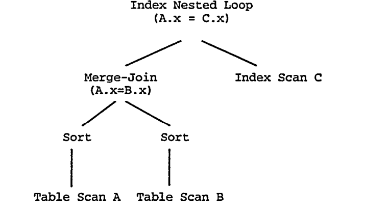
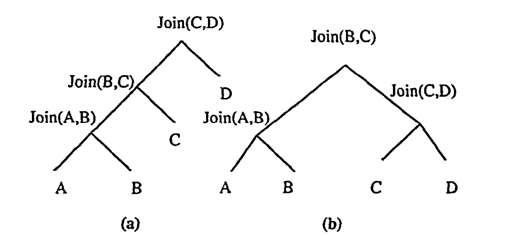
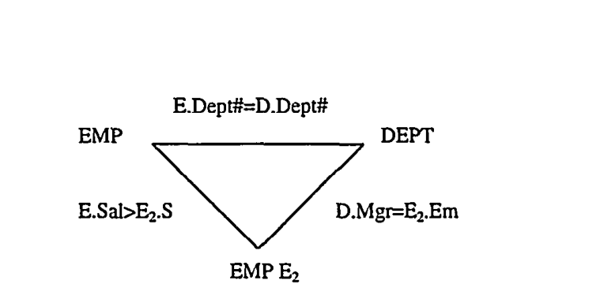
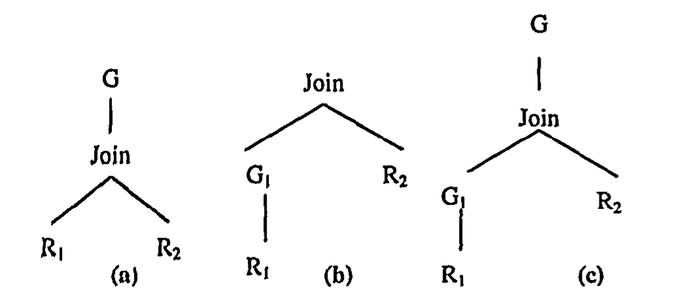

# An Overview of Query Optimization in Relational Systems（中文译文）

## 译者说明

本文依据同目录的 `source.pdf` 翻译。章节、图表、公式、算法、代码与参考文献按原文结构保留。

## 1. 目标

自 20 世纪 70 年代初以来，查询优化领域已有大量工作。在一篇短文中很难覆盖这庞大研究体的广度和深度。因此，我决定主要关注关系数据库系统中 SQL 查询的优化，并呈现自己带有偏向且不完整的观点。本文目标不是全面综述，而是解释基础，并抽样介绍该领域的重要工作。由于疏漏或篇幅限制，我未能显式致谢该领域许多贡献者，并为此致歉。为便于表述，我在若干地方牺牲了一些技术精确性。

## 2. 引言

关系查询语言为访问关系数据库中存储的数据提供了高层声明式（declarative）接口。随着时间推移，SQL 已成为关系查询语言标准。SQL 数据库系统的查询求值组件有两个关键部分：查询优化器（query optimizer）和查询执行引擎（query execution engine）。

查询执行引擎实现一组物理算子（physical operators）。一个算子接收一个或多个数据流作为输入，并产生一个输出数据流。物理算子的例子包括外部排序（external sort）、顺序扫描（sequential scan）、索引扫描（index scan）、nested-loop join 和 sort-merge join。称其为物理算子，是因为它们不一定与关系算子一一对应。理解物理算子的最简单方式，是把它们看成用于执行 SQL 查询的构件代码。一次执行的抽象表示是物理算子树（physical operator tree），如图 1 所示。算子树中的边表示物理算子之间的数据流。本文交替使用 physical operator tree 和 execution plan（或 plan）。执行引擎负责执行该计划并生成查询答案。因此，查询执行引擎的能力决定了哪些算子树结构是可行的。




查询优化器负责为执行引擎生成输入。它以 SQL 查询的解析表示作为输入，负责从可能执行计划空间中为给定 SQL 查询生成高效执行计划。优化器任务并不简单，因为对给定 SQL 查询，可能存在大量算子树：

- 给定查询的代数表示可以转换为许多逻辑等价的代数表示，例如：

```text
Join(Join(A,B),C) = Join(Join(B,C),A)
```

- 对给定代数表示，可能存在许多实现该代数表达式的算子树。例如，数据库系统通常支持多种连接算法。

此外，这些计划执行时的吞吐量或响应时间可能差异很大。因此，优化器对执行计划的明智选择至关重要。查询优化可以被视为一个困难的搜索问题。为解决该问题，需要提供：

- 计划空间，即搜索空间（search space）。
- 代价估计技术，使搜索空间中每个计划都可以被赋予一个代价。直观地说，这是执行该计划所需资源的估计。
- 能够搜索执行空间的枚举算法（enumeration algorithm）。

理想的优化器应满足三点：搜索空间包含低代价计划；代价估计技术准确；枚举算法高效。三项任务都不简单，因此构建优秀优化器是一项巨大工程。

本文先讨论 System R 优化框架，因为它是一种非常优雅的方法，推动了后续大量优化工作。Section 4 讨论优化器考虑的搜索空间，并介绍搜索空间中包含的重要代数变换。Section 5 讨论代价估计问题。Section 6 讨论搜索空间枚举。到此为止，本文完成基础优化框架的讨论。Section 7 讨论查询优化的若干较新发展。

## 3. 示例：System R 优化器

System R 项目显著推动了关系系统查询优化的技术状态。Selinger 等人的思想被许多商业优化器吸收，并持续保持重要性。本文在 Select-Project-Join（SPJ）查询上下文中介绍这些重要思想的一部分。SPJ 查询类与数据库理论中广泛研究的 conjunctive queries 密切相关，并可将其概括在内。

在 SPJ 查询上下文中，System R 优化器的搜索空间由对应线性连接序列的算子树构成。例如：

```text
Join(Join(Join(A,B),C),D)
```

如图 2(a) 所示。由于连接具有结合律和交换律，这些序列在逻辑上等价。连接算子可以使用 nested loop 或 sort-merge 实现。每个扫描节点可以使用索引扫描（聚簇或非聚簇索引）或顺序扫描。最后，谓词会尽早求值。




代价模型为搜索空间中的任意部分计划或完整计划赋予估计代价。它也确定计划中每个算子输出数据流的估计大小。该模型依赖以下内容：

1. 维护在关系和索引上的一组统计信息，例如关系中的数据页数、索引中的页数、列中不同值个数。
2. 用于估计谓词选择率，并预测每个算子节点输出数据流大小的公式。例如，连接输出大小可通过两个关系大小相乘，再应用所有适用谓词的联合选择率来估计。
3. 用于估计每个算子 CPU 和 I/O 执行代价的公式。这些公式考虑输入数据流的统计属性、输入数据流上已有访问方法、数据流上任何可用顺序。例如，如果一个数据流已有序，那么该流上 sort-merge join 的代价可能显著降低。此外，模型还检查输出数据流是否会具有某种顺序。

代价模型使用上述信息，以自底向上的方式为计划中的算子计算并关联以下信息：

1. 算子节点输出所表示的数据流大小。
2. 算子节点输出数据流创建或保持的任何元组顺序。
3. 该算子的估计执行代价，以及到目前为止部分计划的累计代价。

System R 优化器的枚举算法展示了两项重要技术：动态规划（dynamic programming）和 interesting orders。

动态规划方法的核心基于一个假设：代价模型满足最优性原则（principle of optimality）。具体地，为获得包含 `k` 个连接的 SPJ 查询 `Q` 的最优计划，只需考虑 `Q` 中包含 `k-1` 个连接的子表达式的最优计划，并用额外连接扩展这些计划。换言之，包含 `k-1` 个连接的 `Q` 的子表达式（也称子查询）的次优计划，不需要在确定 `Q` 的最优计划时继续考虑。

因此，基于动态规划的枚举把 SPJ 查询 `Q` 视为一组待连接关系 `{R1, ..., Rn}`。枚举算法自底向上进行。在第 `j` 步结束时，算法为所有大小为 `j` 的子查询产生最优计划。为获得包含 `j+1` 个关系的子查询的最优计划，算法考虑所有可能方式，即通过扩展第 `j` 步构造出的计划来构造该子查询的计划。例如，`{R1, R2, R3, R4}` 的最优计划可从以下候选的最优计划中选出最低代价者：

```text
Join({R1,R2,R3}, R4)
Join({R1,R2,R4}, R3)
Join({R1,R3,R4}, R2)
Join({R2,R3,R4}, R1)
```

其余 `{R1, R2, R3, R4}` 的计划可被丢弃。动态规划方法显著快于朴素方法，因为只需要枚举 `O(n2^n)` 个计划，而不是 `O(n!)` 个计划。

System R 优化器的第二个重要方面是考虑 interesting orders。考虑一个查询，它表示 `{R1, R2, R3}` 的连接，并带有谓词 `R1.a = R2.a = R3.a`。假设子查询 `{R1, R2}` 的 nested-loop 和 sort-merge join 计划代价分别为 `x` 和 `y`，且 `x < y`。在为 `{R1, R2, R3}` 考虑计划时，按普通剪枝会不再考虑 `R1` 和 `R2` 使用 sort-merge 连接的计划。然而，如果用 sort-merge 连接 `R1` 和 `R2`，连接结果会按 `a` 排序。该排序顺序可能显著降低与 `R3` 连接的代价。因此，剪掉 `R1` 和 `R2` 之间的 sort-merge join 计划可能导致全局计划次优。

问题在于，`R1` 与 `R2` 的 sort-merge join 结果在输出流中具有对后续连接有用的元组顺序，而 nested-loop join 不具有这种顺序。因此，对给定查询，System R 会识别那些可能对查询执行计划产生影响的元组顺序，这就是 interesting orders。进一步地，在 System R 优化器中，只有当两个计划表示相同表达式且具有相同 interesting order 时才会被比较。interesting order 的思想后来被概括为 physical properties，并在现代优化器中广泛使用。直观地说，physical property 是同一逻辑表达式的不同计划不一定共享、但会影响后续操作代价的计划特征。System R 考虑 physical properties 的方法，也展示了一种处理最优性原则失效的简单机制。

尽管 System R 方法优雅，但该框架不容易扩展以纳入其他扩展搜索空间的逻辑变换（超出 join ordering 之外）。这推动了更可扩展优化架构的发展。不过，基于代价的优化、动态规划和 interesting orders 强烈影响了后续优化技术。

## 4. 搜索空间

如 Section 2 所述，优化的搜索空间取决于保持等价性的代数变换集合，以及优化器支持的物理算子集合。本节讨论许多重要代数变换中的一部分。需要注意，变换不一定降低代价，因此必须由枚举算法以基于代价的方式应用，以确保获得正收益。

优化器在优化查询生命周期中可能使用多种查询表示。初始表示通常是查询解析树，最终表示是算子树。另一种中间表示是逻辑算子树（也称查询树），用于捕获代数表达式。图 2 是查询树的例子。查询树节点通常还会带有额外注解。

一些系统也使用“面向演算”的表示来分析查询结构。对 SPJ 查询，这种结构通常由查询图（query graph）捕获，其中节点表示关系（相关变量），带标签的边表示关系之间的连接谓词（见图 3）。




虽然概念简单，但这种表示在多个方面不足以表示任意 SQL 语句结构。首先，谓词图只表示一组连接谓词，无法表示 union 等其他代数算子。其次，与自然连接不同，outer join 等算子是不对称的，并且对求值顺序敏感。最后，这种表示无法捕获 SQL 语句可能具有嵌套查询块这一事实。在 Starburst 系统使用的 Query Graph Model（QGM）结构中，构件是增强查询图，能够表示没有嵌套的简单 SQL 语句（single block query）。多块查询被表示为一组子图，子图之间的边表示跨查询块的谓词和量词。相比之下，Exodus 及其派生系统在优化所有阶段统一使用查询树和算子树。

### 4.1 算子之间的交换

一大类重要变换利用算子之间的交换性。本节给出若干例子。

#### 4.1.1 泛化连接顺序选择

在许多系统中，连接操作序列在语法上受到限制，以控制搜索空间。例如，System R 项目只考虑线性连接序列，并把关系之间的笛卡尔积推迟到所有连接之后。

由于连接具有交换律和结合律，算子树中的连接序列不必是线性的。特别地，关系 `R1, R2, R3, R4` 的连接查询可以用如下代数表达式表示并求值：

```text
Join(Join(A,B), Join(C,D))
```

这种查询树称为 bushy，如图 2(b) 所示。Bushy join 序列需要物化中间关系。虽然 bushy tree 可能产生更低代价的查询计划，但它们会显著扩大枚举搜索空间的成本。尽管已有一些研究分析探索 bushy join 序列的价值，大多数系统总体上仍关注线性连接序列，以及受限子集的 bushy join tree。

推迟笛卡尔积也可能导致性能较差。在许多决策支持查询中，查询图形成星型结构；已有观察表明，在适当节点（OLAP 术语中的维度表）之间执行笛卡尔积，会显著降低代价。

在可扩展系统中，连接枚举器的行为可以按查询调整，以限制 join tree 的 bushy 程度，并允许或禁止笛卡尔积。然而，提前确定这种调优对搜索质量和搜索成本的影响并不简单。

#### 4.1.2 Outerjoin 和 Join

单侧 outer join 是 SQL 中的不对称算子，会保留一个关系中的所有元组。对称 outer join 会保留两个操作数关系。因此，`(R LOJ S)` 中，`LOJ` 表示 `R` 和 `S` 之间的 left outer join，它保留 `R` 的所有元组。除自然连接得到的元组外，该操作还包含 `R` 中所有无法与 `S` 连接的剩余元组，并为其 `S` 属性填充 `NULL`。

与自然连接不同，outer join 和 join 的序列不能自由交换。不过，当连接谓词位于 `(R,S)` 之间，而 outer-join 谓词位于 `(S,T)` 之间时，以下恒等式成立：

```text
Join(R, S LOJ T) = Join(R,S) LOJ T
```

如果该结合规则可以重复应用，就能得到一个等价表达式，其中“连接块”的求值先于“outer join 块”。随后，joins 可以彼此之间按任意方式重排。与其他变换一样，该恒等式的使用需要基于代价。相关工作定义了一类可重排 joins 和 outer joins 的查询。

#### 4.1.3 Group-By 和 Join


在带 group-by 的 SPJ 查询传统执行中，查询的 SPJ 部分先于 group-by 求值。本节描述的变换使 group-by 操作可以先于 join 执行。这些变换也适用于带 `SELECT DISTINCT` 的查询，因为后者是 group-by 的特例。group-by 算子求值可能显著减少元组数，因为 group-by 算子诱导出的关系分区中，每个分区只生成一个元组。因此，在某些情况下，先执行 group-by 可以显著降低 join 成本。此外，如果存在适当索引，group-by 操作可能以较低成本求值。这类变换的对偶情形，是 group-by 算子可以被上拉越过 join。

考虑图 4(a) 中的查询树。设 `R1` 和 `R2` 之间的连接是 foreign key join，`G` 的聚合列来自 `R1`，group-by 列集合是 `R1` 外键列的超集。对这种查询，考虑图 4(b) 中对应算子树，其中 `G1 = G`。在该树中，最终与 `R2` 的连接只能消除 `G1` 创建的 `R1` 的某些潜在分区，不会影响分区本身，也不会影响 `G1` 为这些分区计算出的聚合值，因为 `R1` 中每个元组至多与 `R2` 中一个元组连接。因此，可以如下推下 group-by，并对任意无副作用聚合函数保持等价。



图 4(c) 展示了一个引入 group-by 的例子，表示一类有用场景：group-by 操作分阶段执行。例如，假设在图 4(a) 中，所有应用聚合函数的列都来自 `R1`。在这些情况下，引入的 group-by 算子 `G1` 基于 `R1` 节点的投影列划分关系，并在这些分区上计算聚合值。然而，图 4(a) 中的真实分区可能需要把 `G1` 引入的多个分区合并为单个分区，即多对一映射。group-by 算子 `G` 负责完成这一点。这种分阶段聚合仍可能有用，因为 `G1` 的数据缩减效果可以降低 join 成本。分阶段聚合要求聚合函数满足如下性质：`Agg(S U S')` 可以由 `Agg(S)` 和 `Agg(S')` 计算得到。例如，为计算每个 division 中所有产品的总销售额，可以使用图 4(c) 的变换先提前聚合，得到每个产品的总销售额。随后需要一个 group-by，对属于每个 division 的所有产品求和。

### 4.2 将多块查询约简为单块查询

本节描述的技术说明，在某些条件下，可以把多块 SQL 查询折叠为单块 SQL 查询。

#### 4.2.1 合并视图

考虑使用 `SELECT ANY` 的 conjunctive query。如果查询中的一个或多个关系是视图，但每个视图都通过 conjunctive query 定义，那么可以简单展开视图定义，得到单块 SQL 查询。例如，如果：

```text
Q = Join(R,V)
V = Join(S,T)
```

则查询 `Q` 可以展开为：

```text
Join(R, Join(S,T))
```

并可自由重排。该步骤可能需要对视图定义中的变量重命名。

遗憾的是，当视图比简单 SPJ 查询更复杂时，这种简单展开无法工作。当一个或多个视图包含 `SELECT DISTINCT` 时，移动或上拉 `DISTINCT` 的变换必须谨慎保持重复项数量。更一般地，当视图包含 group-by 算子时，展开需要能够上拉 group-by 算子，并随后不仅自由重排 joins，还要自由重排 group-by 算子以确保最优性。特别地，给定类似图 4(b) 的查询，需要考虑如何把它转换为图 4(a) 那样的形式，使 `R1` 和 `R2` 可以自由重排。虽然 Section 4.1.3 的变换可用于这些场景，但这凸显了该问题的复杂性。

#### 4.2.2 合并嵌套子查询

考虑如下来自相关工作的嵌套查询，其中 `Emp#` 和 `Dept#` 是对应关系的键：

```sql
SELECT Emp.Name
FROM Emp
WHERE Emp.Dept# IN
  SELECT Dept.Dept#
  FROM Dept
  WHERE Dept.Loc = 'Denver'
    AND Emp.Emp# = Dept.Mgr
```

如果使用元组迭代语义回答查询，那么内层查询会对 `Dept` 关系的每个元组求值一次。当内层查询块不包含外层查询块变量（uncorrelated）时，可以应用显然的优化：内层查询块只需求值一次。不过，当确实存在来自外层块的变量时，称查询块是相关的（correlated）。在上例中，`Emp.Emp#` 是相关变量。

Kim 及后续工作识别出将相关嵌套 SQL 查询 unnest 并 flatten 为单个查询的技术。例如，上面的嵌套查询可化为：

```sql
SELECT E.Name
FROM Emp E, Dept D
WHERE E.Dept# = D.Dept#
  AND D.Loc = 'Denver'
  AND E.Emp# = D.Mgr
```

Dayal 首先给出了 unnesting 的代数视角。问题复杂度取决于嵌套结构，即嵌套子查询是否具有量词（例如 `ALL`、`EXISTS`）、聚合，或两者都没有。在最简单情形中，上述查询就是一个例子，元组语义可以建模为：

```text
Semijoin(Emp, Dept, Emp.Dept# = Dept.Dept#)
```

一旦这样看，就不难理解为什么查询可以合并，因为：

```text
Semijoin(Emp, Dept, Emp.Dept# = Dept.Dept#)
= Project(Join(Emp,Dept), Emp.*)
```

其中 `Join(Emp,Dept)` 使用谓词 `Emp.Dept# = Dept.Dept#`，`Project` 的第二个参数表示保留关系 `Emp` 的所有列。

当嵌套子查询中存在聚合时，问题更复杂，因为合并查询块要求在不违反嵌套查询语义的情况下上拉聚合。考虑如下示例：

```sql
SELECT Dept.name
FROM Dept
WHERE Dept.num-of-machines >=
  (SELECT COUNT(Emp.*)
   FROM Emp
   WHERE Dept.name = Emp.Dept-name)
```

保持重复项和 null 尤其微妙。为了理解这一点，观察某个特定 `Dept.name` 值（例如 `d`）：如果没有任何元组匹配 `Emp.Dept.name`，即使谓词 `Dept.name = Emp.dept.name` 失败，`Dept` 元组 `d` 仍存在一个输出元组。然而，如果采用本节第一个查询使用的变换，就不会为部门 `d` 产生输出元组，因为连接谓词失败。因此，在存在聚合时，必须通过 left outerjoin 保留外层查询块的所有元组。

具体地，上述查询可正确转换为：

```sql
SELECT Dept.name
FROM Dept LEFT OUTER JOIN Emp
  ON (Dept.name = Emp.dept.name)
GROUP BY Dept.name
HAVING Dept.num-of-machines >= COUNT(Emp.*)
```

因此，对这一类查询，合并后的单块查询具有 outer joins。如果查询块之间的嵌套结构是线性的，该方法适用，并产生由线性 joins 和 outer-joins 序列组成的单块查询。事实证明，这种 joins 和 outer-joins 序列可使用 Section 4.1.2 的结合规则，先计算所有 joins，再按序计算所有 outer joins。另一种 unnesting 子查询的方法，是把查询转换为使用 table expressions 或 views 的查询，因此不再是单块查询。这是 Kim 工作的方向，后续工作对其进行了改进。

### 4.3 使用类似 Semijoin 的技术优化多块查询

上一节给出了多块查询如何折叠为单块的例子。本节讨论一种互补方法。该方法目标是利用跨块谓词的选择性。概念上，它类似于使用 semijoin 把站点 `A` 中相关值的信息传播到远程站点 `B`，使 `B` 不向 `A` 发送不必要元组。在多块查询上下文中，`A` 和 `B` 位于不同查询块，但属于同一查询，因此传输成本不是重点。相反，“从 `A` 接收的信息”用于减少 `B` 中所需计算，并确保 `B` 产生的结果与 `A` 相关。该技术需要引入新的 table expressions 和 views。

例如，考虑如下查询：

```sql
CREATE VIEW DepAvgSal AS (
  SELECT E.did, Avg(E.Sal) AS avgsal
  FROM Emp E
  GROUP BY E.did
)

SELECT E.eid, E.Sal
FROM Emp E, Dept D, DepAvgSal V
WHERE E.did = D.did
  AND E.did = V.did
  AND E.age < 30
  AND D.budget > 100k
  AND E.sal > V.avgsal
```

该技术识别出：可以只对上述查询中的 `E` 和 `D` 做连接，并投影唯一的 `E.did`，从而创建相关 `E.did` 集合。该集合可以传递给视图 `DepAvgSal`，以限制其计算。这通过下面三个视图完成：

```sql
CREATE VIEW PartialResult AS
  (SELECT E.id, E.sal, E.did
   FROM Emp E, Dept D
   WHERE E.did = D.did
     AND E.age < 30
     AND D.budget > 100k)

CREATE VIEW Filter AS
  (SELECT DISTINCT P.did
   FROM PartialResult P)

CREATE VIEW LimitedAvgSal AS
  (SELECT E.did, Avg(E.Sal) AS avgsal
   FROM Emp E, Filter F
   WHERE E.did = F.did
   GROUP BY E.did)
```

重写后的查询利用这些视图限制计算：

```sql
SELECT P.eid, P.sal
FROM PartialResult P, LimitedDepAvgSal V
WHERE P.did = V.did
  AND P.sal > V.avgsal
```

该技术可用于包含视图（包括递归视图）定义或嵌套子查询的多块查询。在每种情况下，目标都是避免视图或嵌套子查询中的冗余计算。也必须认识到计算这些视图（例如上例中的 `PartialResult`）的成本，与使用这些视图减少计算成本之间存在权衡。

上述变换与 semijoin 的形式关系已有研究提出，并可作为把该策略集成到基于代价优化器中的基础。注意，该技术的退化应用是在查询块之间传递谓词，而不是传递视图结果。这个较简单技术已用于分布式和异构数据库，并被进一步泛化。

## 5. 统计与代价估计

给定一个查询，存在许多逻辑等价的代数表达式；对每个表达式，又有许多用算子实现它的方式。即便忽略枚举可能性空间的计算复杂度，仍然存在一个问题：如何决定哪个算子树消耗最少资源。资源可能是 CPU 时间、I/O 成本、内存、通信带宽，或这些资源的组合。因此，给定查询的一个部分或完整算子树，能够准确且高效地评估其代价非常重要。代价估计必须准确，因为优化质量取决于代价估计质量。代价估计也必须高效，因为它处在查询优化内层循环中，会被反复调用。

基本估计框架来自 System R 方法：

1. 收集已存储数据的统计摘要。
2. 给定一个算子及其每个输入数据流的统计摘要，确定：
   - 输出数据流的统计摘要。
   - 执行该操作的估计代价。

第 2 步可以迭代应用到任意深度的算子树，从而为每个算子派生代价。得到每个算子节点的代价后，可以组合树中每个算子节点的代价，得到计划代价。

Section 5.1 讨论存储数据的统计参数，以及高效获得这类统计信息的方法，并讨论如何传播统计信息。Section 5.2 讨论物理算子的代价估计问题。

需要区分数据流统计属性和计划代价的性质。一个计划输出数据流的统计属性，与同一查询的任何其他计划相同，但其代价可能不同。换言之，统计摘要是逻辑属性，而计划代价是物理属性。

### 5.1 数据统计摘要

#### 5.1.1 基础数据上的统计信息

对每个表，必要统计信息包括数据流中的元组数，因为该参数决定数据扫描、连接及其内存需求的代价。除元组数外，表使用的物理页数也很重要。数据流列上的统计信息也很有用，因为这些统计可用于估计该列上谓词的选择率。这类信息会为存在一个或多个索引的列创建，不过也可以按需为其他任意列创建。

在大量系统中，列上的数据分布由直方图（histogram）表示。直方图把列值划分为 `k` 个桶。在许多情况下，`k` 是常数，并决定直方图的精度。不过，`k` 也决定内存使用，因为优化查询时，相关列的直方图会被加载到内存中。

值的分桶有多种选择。许多数据库系统使用等深（equi-depth，也称 equi-height）直方图表示列上的数据分布。如果表有 `n` 条记录，直方图有 `k` 个桶，则等深直方图把该列值集合划分为 `k` 个范围，使每个范围具有相同数量的值，即 `n/k`。

压缩直方图会把频繁出现的值放入 singleton buckets。这类 singleton buckets 的数量可以调节。相关研究表明，这种直方图对高倾斜或低倾斜数据都有效。与优化有关的直方图问题之一，是对桶内值做出的假设。例如，在等深直方图中，可以假设桶端点之间的值均匀分布。相关工作讨论了这种假设，也给出了直方图的广泛分类，以及直方图结构对准确性的影响。

缺少直方图时，可以使用列值的 min 和 max 等信息。不过实践中通常使用第二小和第二大的值，因为 min 和 max 很可能是离群值。直方图信息还由该列不同值个数等参数补充。

虽然直方图提供单列信息，但不能提供列之间相关性（correlations）的信息。为了捕获相关性，需要值的联合分布。一种选择是考虑二维直方图。不幸的是，可能性空间很大。许多系统不提供详细联合分布，而只使用摘要信息，例如不同值对的数量。例如，与多列索引相关联的统计信息可能包括前导列上的直方图，以及数据中存在的不同列值组合总数。

#### 5.1.2 估计基础数据上的统计信息

企业级数据库通常具有大 schema 和大量数据。因此，为了灵活获取统计信息并改善准确性，需要能够准确且高效地估计统计参数。数据采样是一种可能方法。不过，挑战在于限制估计误差。早期工作表明，对给定查询，只需小样本就能以高概率估计出对该查询准确的直方图。然而，这没有抓住问题重点，因为目标是构建对大类查询都较准确的直方图。我近期工作讨论了该问题。

我还表明，不同值估计任务在理论上容易出错：对任意估计方案，都存在使其误差显著的数据库。该结果解释了过去估计不同值个数时遇到的困难。近期工作也讨论了以增量方式维护统计信息的问题。

#### 5.1.3 统计信息传播

仅使用基础数据上的信息并不够，因为查询通常包含多个算子。因此，必须能够通过算子传播统计信息。这类算子的最简单例子是 selection。如果某列 `A` 上有直方图，且查询是列 `A` 上的简单 selection，那么可以修改直方图以反映 selection 的影响。由于需要对桶内值做出均匀分布等假设，该步骤会产生一些不准确。

此外，无法捕获相关性是关键误差源。在上例中，这表现为不修改表上除 `A` 以外其他属性的分布，从而可能在后续算子中产生显著误差。同样，如果存在多个谓词，通常会做独立性假设，并使用选择率乘积。不过，一些系统只使用最具选择性谓词的选择率，并能识别潜在相关性。当连接谓词涉及的列上存在直方图时，可以“连接”这些直方图。但这会带来对齐相应桶的问题。最后，如果没有直方图信息，则会使用临时常数估计选择率。

### 5.2 代价计算

代价估计步骤试图确定一个操作的代价。代价模块估计 CPU、I/O，以及在并行或分布式系统中的通信成本。多数系统把这些参数组合为一个总体度量，用于比较备选计划。选择适当参数集合来确定代价需要非常谨慎。

早期研究指出，除输入数据流的物理和统计属性以及选择率计算外，建模 buffer utilization 对准确估计也很关键。这要求根据索引层级使用不同 buffer pool hit ratio，并通过考虑连接方法属性调整 buffer utilization。例如，indexed nested loop join 中的索引扫描具有相对明显的引用局部性。

代价模型会考虑物理设计的相关方面，例如数据页和索引页的 colocated placement。然而，对数据流进行准确代价估计和统计信息传播，仍是查询优化中困难的开放问题之一。

## 6. 枚举架构

枚举算法必须通过探索搜索空间，为给定查询选择低成本执行计划。Section 3 讨论的 System R join enumerator 被设计为只选择最优线性连接顺序。软件工程方面的考虑是：构建枚举器时，应使其能够优雅适应搜索空间变化，包括新增变换、新增物理算子（例如新的 join 实现）以及代价估计技术变化。较新的优化架构以此范式构建，称为可扩展优化器（extensible optimizers）。

构建可扩展优化器要求很高，因为它不只是提出更好的枚举算法。更准确地说，它们为优化器设计演进提供基础设施。不过，架构通用性必须与枚举效率需求平衡。

本文简要关注两个代表性可扩展优化器：Starburst 和 Volcano/Cascades。尽管它们存在差异，可以总结出一些共性：

- 在算子节点上使用广义代价函数和物理属性。
- 使用规则引擎，让变换修改查询表达式或算子树。这类规则引擎也提供了引导搜索以获得效率的能力。
- 暴露许多可调旋钮，用于调节系统行为。遗憾的是，为最佳性能设置这些旋钮是一项艰巨任务。

### 6.1 Starburst

IBM Almaden 的 Starburst 项目中，查询优化从 SQL 查询的结构化表示开始，该表示贯穿优化生命周期。它称为 Query Graph Model（QGM）。在 QGM 中，box 表示查询块，box 之间带标签的弧表示跨块表引用。每个 box 包含谓词结构信息，以及数据流是否有序的信息。

在优化的 query rewrite 阶段，规则用于把一个 QGM 转换为另一个等价 QGM。规则被建模为任意函数对。第一个函数检查适用条件，第二个函数执行变换。forward chaining rule engine 管理规则。规则可以分组成 rule classes，并且可以调节 rule classes 的求值顺序以聚焦搜索。由于任意规则应用都会产生合法 QGM，因此任意规则应用集合都保证查询等价，前提是规则本身有效。query rewrite 阶段没有可用代价信息，这迫使该模块要么保留通过规则应用获得的备选，要么以启发式方式使用规则，从而牺牲最优性。

查询优化第二阶段称为 plan optimization。在该阶段，给定 QGM 后选择执行计划（算子树）。Starburst 中，物理算子称为 LOLEPOPs，可以通过多种方式组合以实现更高层算子。这类组合使用类似 grammar production 的语言表达。一个高层操作的实现用它在物理算子上的 derivation 表达。在计算这些 derivations 时，表示相同物理和逻辑属性但成本更高的可比计划会被剪枝。每个计划都有一个关系描述，对应其表示的代数表达式；一个估计代价；以及 physical properties，例如顺序。这些属性会在自底向上构建计划时传播。因此，每个物理算子都关联一个函数，表示该物理算子对上述每类属性的影响。该系统中的连接枚举器类似 System R 的自底向上枚举方案。

### 6.2 Volcano/Cascades

Volcano 和 Cascades 可扩展架构从 Exodus 演化而来。在这些系统中，规则被统一用于表示搜索空间知识。使用两类规则。transformation rules 把一个代数表达式映射为另一个代数表达式。implementation rules 把一个代数表达式映射为一个算子树。规则可以具有适用条件。

逻辑属性、物理属性和代价会与计划关联。物理属性和代价取决于用于实现算子的算法及其输入数据流。为提高效率，Volcano/Cascades 以自顶向下方式使用动态规划，即 memoization。当收到优化任务时，它通过查找过去已优化计划表中的逻辑和物理属性，检查该任务是否已经完成。否则，它会应用逻辑 transformation rule、implementation rule，或使用 enforcer 修改数据流属性。在每个阶段，它使用某个动作的 promise 决定下一步。promise 参数可编程，并反映代价参数。

Volcano/Cascades 框架与 Starburst 的枚举方法不同：

- 这些系统不使用两个独立优化阶段，因为所有变换都是代数式且基于代价。
- 从代数算子到物理算子的映射在单一步骤中发生。
- 与 Starburst query rewrite 阶段的 forward chaining 规则应用不同，Volcano/Cascades 采用目标驱动的规则应用。

## 7. 超越基础问题

到目前为止，本文覆盖了优化器软件组件的基础。本节讨论若干更高级问题。每个问题在商业系统中都相当重要。

### 7.1 分布式和并行数据库

分布式数据库引入了通信成本问题，并扩大了搜索空间，因为在优化查询时，可以移动数据并为中间操作选择站点。早期一些工作几乎专注于降低通信成本，例如使用 semijoins；System R* 的结果则指出本地处理具有主导作用。随着时间推移，分布式数据库架构演化为两类：用于处理物理分布的 replicated databases，以及用于 scale-up 的 parallel databases。在复制架构中，维护副本之间的一致性是重要问题，但不属于本文范围。

与分布式系统不同，并行数据库表现为单一系统，但利用多个处理元素降低查询响应时间。并行性的收益可以用多种方式获得。例如，物理数据分布把表（更一般地，数据流）划分或复制到多个节点，使处理器能够在独立数据集上工作。并行性也可以来自独立操作或流水线操作，例如把 producer 和 consumer 节点放到不同处理器上。并行性的优势会被处理器之间交换数据所需的通信抵消，例如当一个操作后需要重新分区数据时。此外，把物理算子有效调度到处理器上，为优化问题带来了新的维度。

XPRS 项目主张两阶段方法：第一阶段使用传统单处理器查询优化生成执行计划；第二阶段确定处理器调度。XPRS 中的查询优化工作没有研究处理器通信的影响。Hasan 的工作展示了考虑通信成本的重要性。Hasan 保留 XPRS 的两阶段优化框架，但在第一阶段优化中纳入数据重分区的成本与收益，以确定连接顺序和使用的访问方法。数据流的分区属性被视为数据流的物理属性。第一阶段输出是物理算子树，它暴露 precedence constraints（例如排序）和流水线执行。第二阶段优化中，Hasan 提出了考虑通信成本的调度算法。

### 7.2 用户定义函数

存储过程（也称用户定义函数）已经在关系系统中广泛可用。虽然不同产品支持程度不同，它们提供了强大机制，可减少客户端-服务器通信，并把应用语义纳入查询。

当这类存储过程被视为查询中的一等公民时，会出现新的优化问题。确定用户定义函数的代价模型仍然是困难问题。枚举算法上下文中也出现有趣问题。例如，当存储过程作为查询 `WHERE` 子句中的用户定义谓词时，与其他谓词不同，这类谓词可能代价昂贵，例如因为它们可能作用在图像等 BLOB 上。因此，尽早求值这类谓词不再是合理启发式。

优化带用户定义谓词的查询问题已有研究提出。一种方法是从动态查询优化角度把用户定义谓词视为一个关系。其他方法利用如下观察：如果没有 joins，则昂贵谓词可以按 rank 高效排序，而 rank 由其选择率和每元组求值成本计算。不过，将 rank 用于带 joins 的查询可能导致次优计划。后续工作通过把用户定义谓词应用表示为计划的一种 physical property 解决了这一缺陷，使基于动态规划的枚举算法能保证最优性。此外，在代价模型的现实假设下，该问题被证明在用户定义谓词数量上是多项式的。

解决用户定义谓词优化问题只是更广泛问题的第一步：如何在查询系统中表示 ADT 的语义，并优化 ADT 上的查询。该问题也与语义查询优化领域密切相关。

### 7.3 物化视图

物化视图（materialized views）是视图（即查询）的结果，由查询子系统缓存，并由优化器透明使用。优化问题如下：给定一组物化视图和一个查询，目标是在考虑已有物化视图的情况下优化查询。

该问题引入两个基本挑战。首先，需要解决查询重构问题，使查询能够使用一个或多个物化视图。一般问题不可判定，即使确定有效充分条件也并不简单，因为 SQL 非常复杂。相关工作只在单块 SQL 查询上下文中处理该问题，并且还需要扩展到复杂查询。

其次，如果把优化问题视为两步：先生成所有逻辑等价表达式，再分别优化每个表达式，那么优化成本可能增加，因为子表达式不是以基于代价的方式剪枝。相关工作展示了在存在物化视图时，如何重叠枚举步骤和生成等价表达式的步骤。

### 7.4 其他优化问题

本文只能触及查询优化中的一些基础问题。还有许多重要领域没有讨论。一个有趣方向是在运行时信息可用性约束下，推迟完整计划生成。另一个开放问题是在确定执行计划时考虑其他资源，尤其是内存。相关工作讨论了在查询优化中优化利用顺序的问题。面向对象系统中的优化器技术也是一个值得单独讨论的重要领域。

此外，随着数据库系统用于多媒体和 Web 场景，能够处理模糊（不精确）查询也是一个有趣方向。近期对决策支持系统的重视也激发了 SQL 扩展方面的工作。例如 CUBE 并不是由表达能力需求驱动，而是希望扩展语言，使优化器可以利用这些构造更好优化决策支持系统。

## 8. 结论

优化远不只是变换和查询等价。优化基础设施同样重要。设计有效且正确的 SQL 变换很困难，开发稳健代价度量也难以捉摸，而构建可扩展枚举架构是一项重大工程。

尽管已有多年工作，仍然存在重要开放问题。不过，理解现有工程框架，是对查询优化领域做出有效贡献的必要条件。

## 致谢

我与 Umesh Dayal、Goetz Graefe、Waqar Hasan、Ravi Krishnamurthy、Guy Lohman、Hamid Pirahesh、Kyuseok Shim 和 Jeff Ullman 的许多非正式讨论，极大帮助我发展了对 SQL 优化的理解。他们中的许多人也通过评论帮助改进了本文草稿。我也感谢 Latha Colby、William McKenna、Vivek Narasayya 和 Janet Wiener 对草稿提出的深刻意见。最后，我感谢 Debjani 的耐心。

## 9. 参考文献

本文参考文献按原编号保留，题名和会议信息保留英文；少数字符按上下文从扫描版校正。

[1] Apers, P. M. G., Hevner, A. R., Yao, S. B. Optimization Algorithms for Distributed Queries. IEEE Transactions on Software Engineering, 9(1), 1983.

[2] Bancilhon, F., Maier, D., Sagiv, Y., Ullman, J. D. Magic sets and other strange ways to execute logic programs. In ACM PODS, 1986.

[3] Bernstein, P. A., Goodman, N., Wang, E., Reeve, C. L., Rothnie, J. Query Processing in a System for Distributed Databases (SDD-1). ACM TODS, 6(4), 1981.

[4] Chaudhuri, S., Shim, K. An Overview of Cost-based Optimization of Queries with Aggregates. IEEE Data Engineering Bulletin, Sept. 1995.

[5] Chaudhuri, S., Shim, K. Including Group-By in Query Optimization. In VLDB, Santiago, 1994.

[6] Chaudhuri, S., Shim, K. Query Optimization with Aggregate Views. In EDBT, Avignon, 1996.

[7] Chaudhuri, S., Dayal, U. An Overview of Data Warehousing and OLAP Technology. ACM SIGMOD Record, March 1997.

[8] Chaudhuri, S., Shim, K. Optimization of Queries with User-defined Predicates. In VLDB, Mumbai, 1996.

[9] Chaudhuri, S., Krishnamurthy, R., Potamianos, S., Shim, K. Optimizing Queries with Materialized Views. In IEEE Data Engineering Conference, Taipei, 1995.

[10] Chaudhuri, S., Gravano, L. Optimizing Queries over Multimedia Repositories. In ACM SIGMOD, Montreal, 1996.

[11] Chaudhuri, S., Motwani, R., Narasayya, V. Random Sampling for Histogram Construction: How much is enough? In ACM SIGMOD, Seattle, 1998.

[12] Chimenti, D., Gamboa, R., Krishnamurthy, R. Towards an Open Architecture for LDL. In VLDB, Amsterdam, 1989.

[13] Dayal, U. Of Nests and Trees: A Unified Approach to Processing Queries That Contain Nested Subqueries, Aggregates and Quantifiers. In VLDB, 1987.

[14] Fagin, R. Combining Fuzzy Information from Multiple Systems. In ACM PODS, 1996.

[15] Finkelstein, S. Common Expression Analysis in Database Applications. In ACM SIGMOD, Orlando, 1982.

[16] Ganski, R. A., Long, H. K. T. Optimization of Nested SQL Queries Revisited. In ACM SIGMOD, San Francisco, 1987.

[17] Gassner, P., Lohman, G., Schiefer, K. B. Query Optimization in the IBM DB2 Family. IEEE Data Engineering Bulletin, Dec. 1993.

[18] Gibbons, P. B., Matias, Y., Poosala, V. Fast Incremental Maintenance of Approximate Histograms. In VLDB, Athens, 1997.

[19] Graefe, G., Ward, K. Dynamic Query Evaluation Plans. In ACM SIGMOD, Portland, 1989.

[20] Graefe, G. Query Evaluation Techniques for Large Databases. ACM Computing Surveys, 25(2), June 1993.

[21] Graefe, G. The Cascades Framework for Query Optimization. IEEE Data Engineering Bulletin, Sept. 1995.

[22] Graefe, G., DeWitt, D. J. The Exodus Optimizer Generator. In ACM SIGMOD, San Francisco, 1987.

[23] Graefe, G., McKenna, W. J. The Volcano Optimizer Generator: Extensibility and Efficient Search. In IEEE ICDE, Vienna, 1993.

[24] Gray, J., Bosworth, A., Layman, A., Pirahesh, H. Data Cube: A Relational Aggregation Operator Generalizing Group-by, Cross-Tab, and Sub-Totals. In IEEE ICDE, New Orleans, 1996.

[25] Gupta, A., Harinarayan, V., Quass, D. Aggregate-query processing in data warehousing environments. In VLDB, Zurich, 1995.

[26] Haas, L., Freytag, J. C., Lehman, G. M., Pirahesh, H. Extensible Query Processing in Starburst. In ACM SIGMOD, Portland, 1989.

[27] Haas, P. J., Naughton, J. F., Seshadri, S., Stokes, L. Sampling-Based Estimation of the Number of Distinct Values of an Attribute. In VLDB, Zurich, 1995.

[28] Hasan, W. Optimization of SQL Queries for Parallel Machines. LNCS 1182, Springer-Verlag, 1996.

[29] Hellerstein, J. M., Stonebraker, M. Predicate Migration: Optimization Queries with Expensive Predicates. In ACM SIGMOD, Washington D.C., 1993.

[30] Hellerstein, J. M. Predicate Migration Placement. In ACM SIGMOD, Minneapolis, 1994.

[31] Hong, W., Stonebraker, M. Optimization of Parallel Query Execution Plans in XPRS. In Conference on Parallel and Distributed Information Systems, 1991.

[32] Hong, W. Parallel Query Processing Using Shared Memory Multiprocessors and Disk Arrays. Ph.D. Thesis, University of California, Berkeley, 1992.

[33] Ioannidis, Y., Ng, R. T., Shim, K., Sellis, T. Parametric Query Optimization. In VLDB, Vancouver, 1992.

[34] Ioannidis, Y. E. Universality of Serial Histograms. In VLDB, Dublin, 1993.

[35] Kim, W. On Optimizing an SQL-like Nested Query. ACM TODS, 9(3), 1982.

[36] Levy, A., Mumick, I. S., Sagiv, Y. Query Optimization by Predicate Move-Around. In VLDB, Santiago, 1994.

[37] Lohman, G. M. Grammar-like Functional Rules for Representing Query Optimization Alternatives. In ACM SIGMOD, 1988.

[38] Lehman, G., Mohan, C., Haas, L., Daniels, D., Lindsay, B., Selinger, P., Wilms, P. Query Processing in R*. In Query Processing in Database Systems. Springer Verlag, 1985.

[39] Mackert, L. F., Lohman, G. M. R* Optimizer Validation and Performance Evaluation For Distributed Queries. In Readings in Database Systems. Morgan Kaufmann.

[40] Mackert, L. F., Lohman, G. M. R* Optimizer Validation and Performance Evaluation for Local Queries. In ACM SIGMOD, 1986.

[41] Melton, J., Simon, A. Understanding The New SQL: A Complete Guide. Morgan Kaufmann.

[42] Mumick, I. S., Finkelstein, S., Pirahesh, H., Ramakrishnan, R. Magic is Relevant. In ACM SIGMOD, Atlantic City, 1990.

[43] Mumick, I. S., Pirahesh, H. Implementation of Magic Sets in a Relational Database System. In ACM SIGMOD, Montreal, 1994.

[44] Muralikrishna, M. Improved Unnesting Algorithms for Join Aggregate SQL Queries. In VLDB, Vancouver, 1992.

[45] Muralikrishna, M., DeWitt, D. J. Equi-Depth Histograms for Estimating Selectivity Factors for Multi-Dimensional Queries. In ACM SIGMOD, Chicago, 1988.

[46] Ono, K., Lohman, G. M. Measuring the Complexity of Join Enumeration in Query Optimization. In VLDB, Brisbane, 1990.

[47] Ozsu, M. T., Valduriez, P. Principles of Distributed Database Systems. Prentice-Hall, 1991.

[48] Piatetsky-Shapiro, G., Connell, C. Accurate Estimation of the Number of Tuples Satisfying a Condition. In ACM SIGMOD, 1984.

[49] Pirahesh, H., Hellerstein, J. M., Hasan, W. Extensible/Rule Based Query Rewrite Optimization in Starburst. In ACM SIGMOD, 1992.

[50] Poosala, V., Ioannidis, Y., Haas, P., Shekita, E. Improved Histograms for Selectivity Estimation. In ACM SIGMOD, Montreal, 1996.

[51] Poosala, V., Ioannidis, Y. E. Selectivity Estimation Without the Attribute Value Independence Assumption. In VLDB, Athens, 1997.

[52] Poosala, V., Ioannidis, Y. E., Haas, P. J., Shekita, E. J. Improved Histograms for Selectivity Estimation of Range Predicates. In ACM SIGMOD, Montreal, 1996.

[53] Rosenthal, A., Galindo-Legaria, C. Query Graphs, Implementing Trees, and Freely Reorderable Outerjoins. In ACM SIGMOD, Atlantic City, 1990.

[54] Schneider, D. A. Complex Query Processing in Multiprocessor Database Machines. Ph.D. thesis, University of Wisconsin, Madison, 1990.

[55] Selinger, P. G., Astrahan, M. M., Chamberlin, D. D., Lorie, R. A., Price, T. G. Access Path Selection in a Relational Database System. In Readings in Database Systems. Morgan Kaufmann.

[56] Seshadri, P., et al. Cost Based Optimization for Magic: Algebra and Implementation. In ACM SIGMOD, Montreal, 1996.

[57] Seshadri, P., Pirahesh, H., Leung, T. Y. C. Decorrelating complex queries. In IEEE ICDE, 1996.

[58] Simmen, D., Shekita, E., Malkemus, T. Fundamental Techniques for Order Optimization. In ACM SIGMOD, Montreal, 1996.

[59] Srivastava, D., Dar, S., Jagadish, H. V., Levy, A. Answering Queries with Aggregation Using Views. In VLDB, Mumbai, 1996.

[60] Yan, W. P., Larson, P. A. Eager aggregation and lazy aggregation. In VLDB, Zurich, 1995.

[61] Yang, H. Z., Larson, P. A. Query Transformation for PSJ-Queries. In VLDB, 1987.
