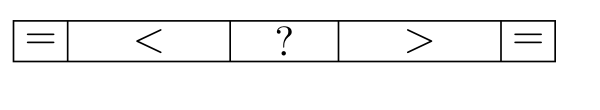
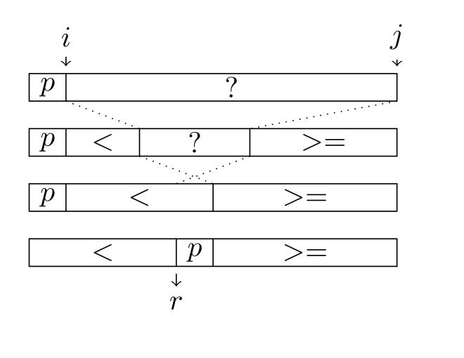
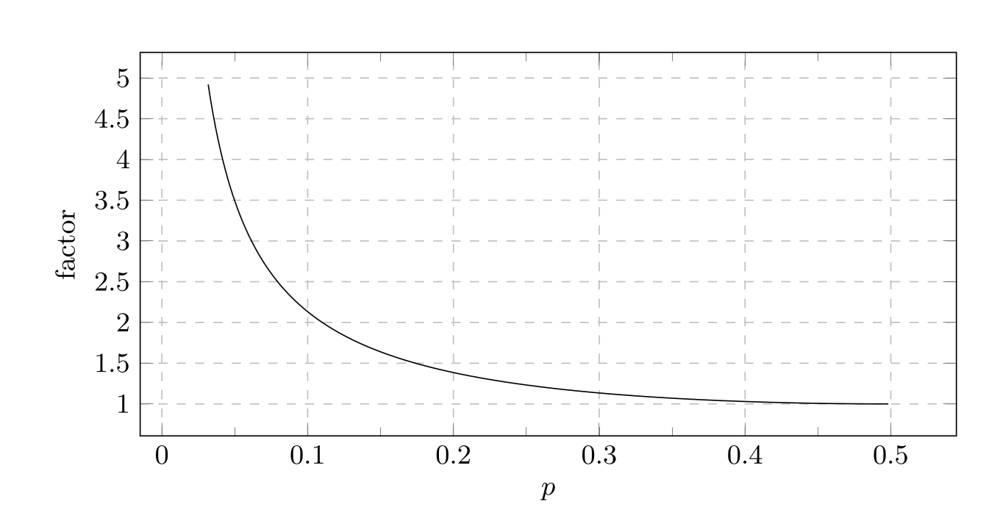
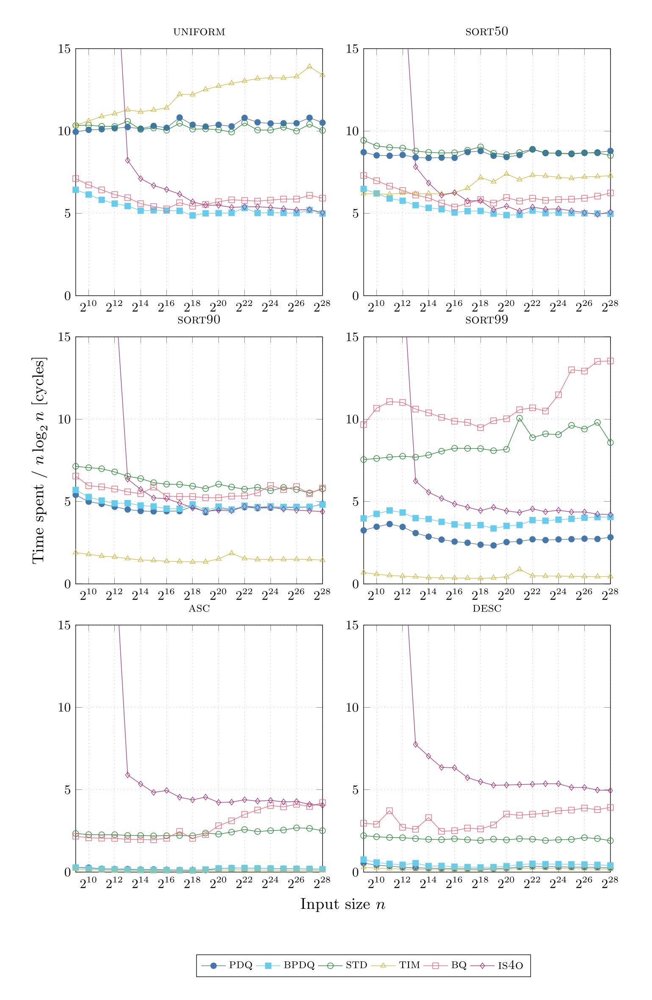
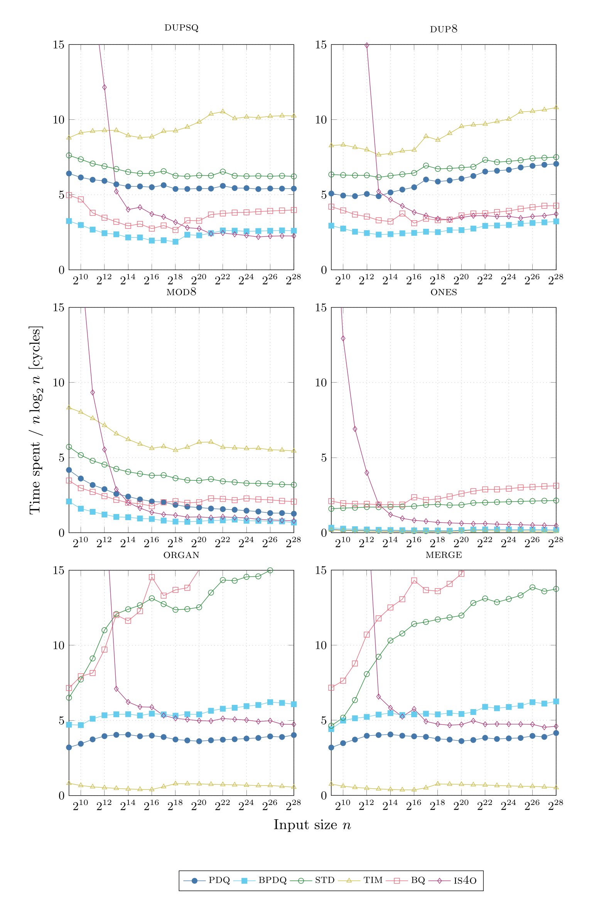
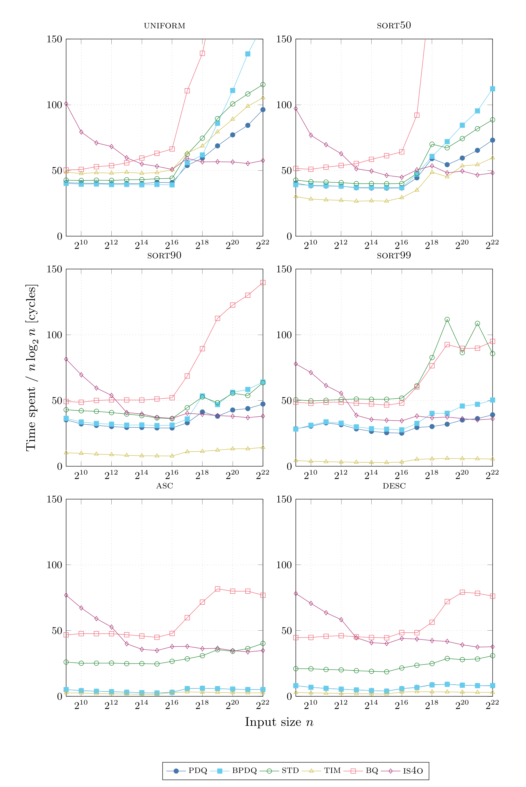
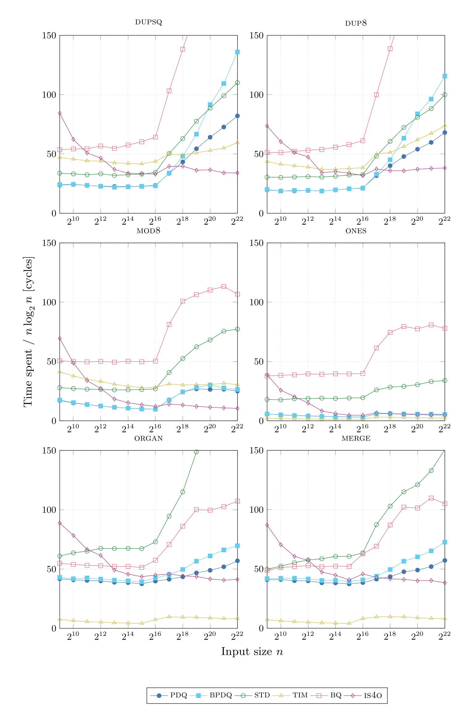
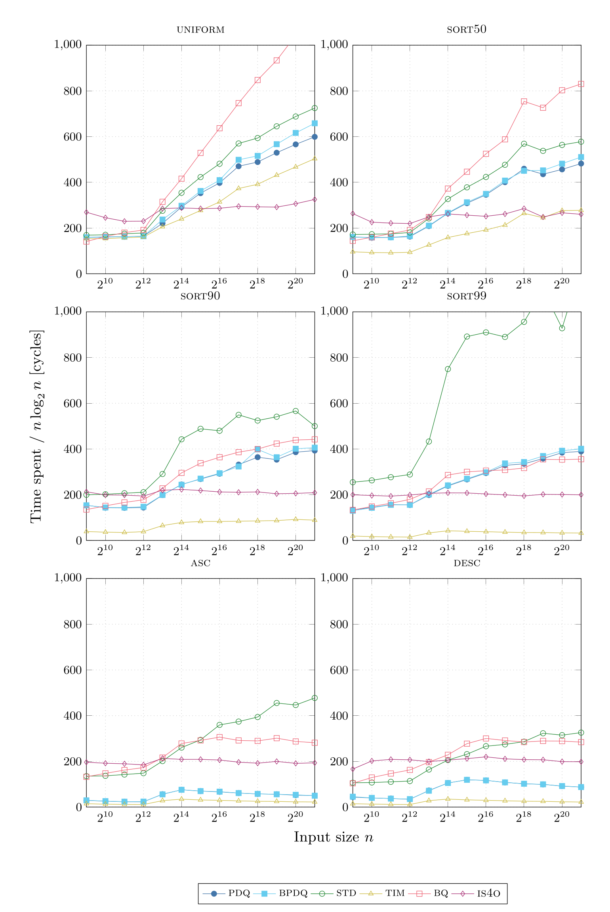
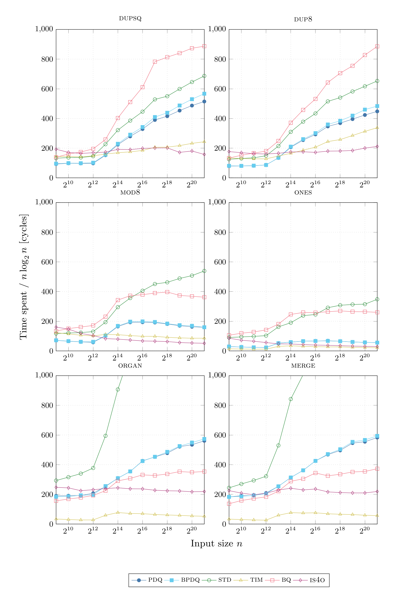

# Pattern-defeating Quicksort（中文译文）

## 译者说明

本文依据同目录的 `source.pdf` 翻译。章节、图表、公式、算法、代码与参考文献按原文结构保留。

作者：Orson R. L. Peters<br>
邮箱：orsonpeters@gmail.com<br>
单位：莱顿大学

## 摘要

本文提出一种新的荷兰国旗问题解法，它不需要三路比较，并使快速排序在输入含有 $k$ 个不同元素时具有真正的 $O(nk)$ 最坏情况运行时间。我们把它与其他已知及新颖技术结合，构造出一种混合排序：它从不会明显慢于常规快速排序，却能在许多输入分布上获得显著加速。

## 1. 引言

在本文写作时，使用最广泛的混合排序算法或许是 introsort [12]。它结合插入排序、堆排序 [19] 和快速排序 [10]，速度很快，堪称真正的混合算法。该算法会进行“自省”，并用一些非常简单的启发式规则决定何时改变策略：递归深度过大时切换到堆排序，分区规模过小时切换到插入排序。

模式破坏快速排序（pattern-defeating quicksort，简称 pdqsort）的目标，是改进 introsort 的启发式规则，构造一种具有多项理想性质的混合排序算法。它保留快速排序的对数级内存使用量和真实场景中快速的平均性能，能够以确定性方式有效识别并对抗最坏情况行为，并且对若干常见模式以线性时间运行。它也不可避免地继承了原地快速排序的不稳定性，因此不能用于要求稳定性的场景。

第 2 节简要概述模式破坏快速排序及相关工作；第 3 节提出荷兰国旗问题的新解法，并证明对于含 $k$ 个不同元素的输入，其最坏情况时间为 $O(nk)$；第 4 节介绍 pdqsort 使用的其他新技术，第 5 节介绍若干先前已知的技术。最后一节对 pdqsort 进行经验性能评估。

本文附带一个开源、当时达到业界领先水平的 C++ 实现 [14]。该实现与 `std::sort` 完全兼容，并以宽松许可证发布。我们邀请标准库维护者评估它，并将其用作通用的不稳定排序算法。本文写作时，得益于 Stjepan Glavina 的移植工作，Rust 已在标准库的 `sort_unstable` 中采用 pdqsort；C++ Boost.Sort 库中也提供了该实现。

## 2. 概述与相关工作

模式破坏快速排序是一种由快速排序 [10]、插入排序和后备排序组成的混合排序。本文采用堆排序作为后备排序，但实际上任何最坏情况为 $O(n\log n)$ 的排序算法都可以；启发式规则最终切换到后备算法的情况极其少见。pdqsort 的每次递归调用都会在退回后备算法、使用插入排序、以及分区后继续递归三者中选择其一。

小规模递归调用使用插入排序。尽管插入排序的最坏情况为 $O(n^2)$，但常数因子很小，在较小的 $n$ 上优于快速排序。后文会讨论如何正确实现用于混合算法的插入排序；这些技术并不新颖，却十分重要。我们曾尝试采用类似 Codish 等人 [5] 方法的小型排序网络作为另一种基本情形，但没能胜过插入排序。我们推测，在混合排序中，插入排序较小的代码体积带来的有利缓存效应，足以抵消算法本身较慢的影响。

分区方面，我们使用一种新方案，它会间接实现三分区。该方案与 BlockQuicksort [7] 中极为重要的技术结合使用；当比较函数无分支时，后者能大幅加速分区。从相等元素的视角看，我们的分区方案在某种意义上类似 Yaroslavskiy 的双轴快速排序 [18]。我们也考虑过双轴和多轴 [2] 快速排序变体，但最终坚持传统分区，原因包括实现简单、本文技术适用性更强，以及 BlockQuicksort 带来的巨大加速无法直接扩展到多个轴（这方面可参见 IPS$^4$o [3]）。

轴选择采用众所周知的三者取中方案；输入足够大时则采用 John Tukey 的 ninther [17]。Kurosawa [11] 发现，ninther 的比较次数与选择真正中位数几乎相同，却简单得多。

最后，我们用两项新技术击败输入模式。首先，我们不再像 introsort 那样仅根据调用深度切换到后备算法，而是定义“坏分区”并跟踪坏分区。这能更精确地判断不良排序行为，从而更准确地决定何时使用后备算法。每当检测到坏分区时，我们还会交换若干精心选择的元素；这既能打破常见模式、像随机快速排序一样引入“噪声”，又能把新的轴候选者加入候选集合。其次，我们采用 Howard Hinnant 提出的一项技术，以极小开销乐观地处理升序和降序序列；据我们所知，先前文献尚未介绍过该技术。

## 3. 荷兰国旗问题的一种更快解法

朴素快速排序可能把比较结果相等的元素放到同一分区，从而在全相等输入分布上触发 $\Theta(n^2)$ 的最坏情况。更聪明的实现会总是交换或从不交换相等元素，使相等元素均匀分布到两个分区，取得平均情况性能。然而，包含大量比较结果相等元素的输入相当常见[^equal-comparison]，我们还能做得更好。高效处理相等元素需要三分区，这等价于 Dijkstra 的荷兰国旗问题 [6]。



**图 1.** Bentley-McIlroy 使用的不变量。分区完成后，暂存在开头和末尾的相等元素会被交换到中间。

pdqsort 使用快速的“相向指针”（approaching pointers）方法 [4] 进行分区。两个下标分别初始化为序列开头的 $i$ 和末尾的 $j$。在保持不变量的同时递增 $i$、递减 $j$；当两个不变量都失效时，交换两个指针所指的元素，以恢复不变量。指针交叉时算法结束。实现者必须非常谨慎：这个算法概念简单，却极易写错。

Bentley 和 McIlroy 描述了一种分区不变量：先把等于轴的元素交换到分区两端，分区完成后再把它们交换回中间。存在大量相等元素时，这种做法很高效，但有一个显著缺点：交换前必须显式检查每个元素是否等于轴，多花一次比较。无论相等元素是否很多，这项开销都会发生，因此会损害平均情况性能。



**图 2.** pdqsort 的 `partition_right` 所使用的不变量，依次展示初始、中途和完成状态。循环结束时，轴会被交换到正确位置。$p$ 是单个轴元素，$r$ 是分区例程返回的、指示轴位置的指针。虚线表示算法推进时 $i$ 和 $j$ 的变化。这是简化表示，例如 $i$ 的实际位置有一个元素的偏移。

不同于先前算法，pdqsort 的分区方案不是自包含的。它使用两个独立的分区函数：`partition_left` 把等于轴的元素归入左分区，`partition_right` 把等于轴的元素归入右分区。注意，两个函数始终都能做到每个元素只比较一次，因为 $a < b \Leftrightarrow a \not\ge b$，而 $a \not< b \Leftrightarrow a \ge b$。

为简洁起见，本文使用一个经过简化且不完整的 C++ 实现说明 pdqsort。它只支持 `int`，并使用比较运算符；不过，将其扩展到任意类型和自定义比较函数并不困难。为了传递子序列[^contiguous]，代码遵循 C++ 约定：一个指针指向起点，另一个指向尾后位置。确切细节请参见完整实现 [14]。

```cpp
int* part_left(int* l, int* r) {
    int* i = l;
    int* j = r;
    int p = *l;

    while (*--j > p);
    if (j + 1 == r) {
        while (i < j && *++i <= p);
    } else {
        while (*++i <= p);
    }

    while (i < j) {
        std::swap(*i, *j);
        while (*--j > p);
        while (*++i <= p);
    }

    std::swap(*l, *j);
    return j;
}

int* part_right(int* l, int* r) {
    int* i = l;
    int* j = r;
    int p = *l;

    while (*++i < p);
    if (i - 1 == l) {
        while (i < j && *--j >= p);
    } else {
        while (*--j >= p);
    }

    // bool no_swaps = (i >= j);
    while (i < j) {
        std::swap(*i, *j);
        while (*++i < p);
        while (*--j >= p);
    }

    std::swap(*l, *(i - 1));
    return i - 1;
}
```

**图 3. `partition_left` 与 `partition_right` 的高效实现。** 原文因版面宽度限制将二者写成 `part_left` 和 `part_right`。代码几乎没有边界检查：我们假设 $p$ 是至少三个元素的中位数，并在后续迭代中使用先前元素作为哨兵，避免越界。预先分区的子序列不会发生交换；只需比较一次指针即可用 `no_swaps` 检测到这一点，后文的启发式规则会利用该信息。

两个分区函数都假设轴是第一个元素，并且它已被选为子序列中至少三个元素的中位数。这样可以省去第一次迭代中的一次边界检查。

给定子序列 $\alpha$，以 $p$ 为轴对它执行 `partition_right`。然后检查右分区，把第一个元素称为 $q$，剩余子序列称为 $\beta$：

```text
[ p |               α               ]
[       <       | p |      >=       ]
[       <       | p | q |     β     ]
```

若 $p \ne q$，则 $q > p$，于是对 $q,\beta$ 执行 `partition_right`。把该操作的左分区重新命名为 $q',\beta'$（图中加撇以强调重命名）。右分区标为“$>$”，因为我们在此过程中采用轴 $p$ 的视角，但标为“$>$”的分区完全可能包含等于 $q$ 的元素：

```text
[       <       | p | q' |   β'   | > ]
```

只要 $p \ne q$，就递归应用上述步骤。如果某一时刻 $q,\beta$ 为空，便可断定不存在等于 $p$ 的元素；最初对 $\alpha$ 分区时已经完成三分区。否则，考虑 $p=q$ 的情况。已知 $\forall x\in\beta: x\ge p$，因此 $\nexists x\in\beta: x<q$。若对 $q,\beta$ 执行 `partition_left`，所有小于或等于 $q$ 的元素都会被分到左边；但我们刚刚已经断定 $\beta$ 不含小于 $q$ 的元素。因此，$\beta$ 的左分区只包含等于 $q$（也即等于 $p$）的元素，右分区只包含大于 $q$ 的元素：

```text
[       <       | p |   =   | q |   >   ]
```

由此得到 pdqsort 使用的分区算法。子序列的前驱（predecessor）是原序列中紧邻它之前的元素；最左侧子序列没有前驱。若子序列有前驱 $p$，并且 $p$ 与选定轴 $q$ 比较相等，则使用 `partition_left`，否则使用 `partition_right`。不需要对 `partition_left` 的左分区递归，因为它只包含等价元素。

### 3.1. 含 $k$ 个不同元素时 pdqsort 的 $O(nk)$ 最坏情况

**引理 1.** 子序列的任何前驱[^recursive-subsequence]，都曾是某个祖先节点的轴。

**证明.** 若该子序列是其父分区的直接右子节点，则其前驱就是父分区的轴。若该子序列是父分区的左子节点，则它的前驱与父分区的前驱相同。引理的前提是该子序列存在前驱，所以它并非最左侧子序列；因此必定存在某个祖先，使该子序列位于其右子树中。□

**引理 2.** 某个不同值 $v$ 第一次被选作轴时，它不可能等于自己的前驱。

**证明.** 假设 $v$ 等于其前驱。由引理 1，该前驱曾是某个祖先分区的轴，这与 $v$ 第一次被选作轴相矛盾。因此 $v$ 不等于其前驱。□

**推论 1.** $v$ 第一次被选作轴时，总是使用 `partition_right` 分区，并且所有满足 $x=v$ 的元素 $x$ 都会进入右分区。

**引理 3.** 在下一个等于 $v$ 的元素再次被选作轴之前，对所有与 $v$ 比较相等的 $x$，$x$ 必定位于紧邻 $v$ 右侧的分区中。

**证明.** 由推论 1，$x$ 不可能位于 $v$ 左侧的分区，因此任何轴为 $w<v$ 的其他分区都无关紧要。也不可能存在轴为 $w>v$ 的分区把等于 $v$ 的 $x$ 放入其右分区，否则将推出 $x\ge w>v$，形成矛盾。因此，所有 $x=v$ 的元素都留在紧邻 $v$ 右侧的分区中。□

**引理 4.** 第二次选中值等于 $v$ 的元素作为轴时，所有满足 $x=v$ 的元素都将处于正确位置，并且不再被递归处理。

**证明.** 第二次选中另一个 $x=v$ 的元素作为轴时，引理 3 表明 $v$ 必定是它的前驱，因此会用 `partition_left` 分区。在该步骤中，所有等于 $x$（因而等于 $v$）的元素都会进入左分区，之后不再递归处理。引理 3 还说明，我们由此恰好处理完了传给 pdqsort 的全部等于 $v$ 的元素。□

**定理 1.** 当输入分布含有 $k$ 个不同值时，pdqsort 的复杂度为 $O(nk)$。[^nk-upper-bound]

**证明.** 引理 4 证明，每个不同值最多被选作轴两次；此后，所有等于该值的元素都已正确排序。每次分区操作的复杂度为 $O(n)$，所以最坏情况运行时间为 $O(nk)$。□

## 4. 其他新技术

### 4.1. 防止快速排序的 $O(n^2)$ 最坏情况

模式破坏快速排序把不平衡程度超过 $p$ 的分区称为坏分区，其中 $p$ 是轴所在的百分位，例如完美分区时 $p=\frac12$。算法最初把一个计数器设为 $\log n$。每次遇到坏分区时，它都会在递归前递减计数器[^per-subtree-counter]。若一次递归调用开始时计数器已为 0，则改用堆排序处理该子序列，而不再使用快速排序。

**引理 5.** pdqsort 在坏分区上花费的时间至多为 $O(n\log n)$。

**证明.** 计数器会持续递减，因此在包含坏分区的 $\log n$ 层之后，调用树会在堆排序处终止。每一层最多执行 $O(n)$ 的工作，总运行时间为 $O(n\log n)$。□

**引理 6.** pdqsort 在好分区上花费的时间至多为 $O(n\log n)$。

**证明.** 考虑这样一种情形：快速排序的分区操作总把 $pn$ 个元素放入左分区，把 $(1-p)n$ 个元素放入右分区。这持续形成最差的好分区，其运行时间可用以下递推关系描述：

$$
T(n,p)=n+T(pn,p)+T((1-p)n,p).
$$

对任意 $p\in(0,1)$，Akra-Bazzi 定理 [1] 给出 $\Theta(T(n,p))=\Theta(n\log n)$。□

**定理 2.** 模式破坏快速排序的复杂度为 $O(n\log n)$。

**证明.** 模式破坏快速排序在好分区、坏分区和退化情形上花费的时间均为 $O(n\log n)$；退化情形依靠同样为 $O(n\log n)$ 的堆排序保证。这三类情形穷尽了 pdqsort 的全部递归调用，因此模式破坏快速排序的复杂度为 $O(n\log n)$。□

我们已经证明，对任何 $p\in(0,1)$，模式破坏快速排序的复杂度都是 $O(n\log n)$，但这并没有告诉我们应当如何选择 $p$。

Yuval Filmus [8] 解出了上述递推关系，使我们能够研究快速排序相对于最优情形 $p=\frac12$ 的减速程度。他得到：

$$
\lim_{n\to\infty}\frac{T(n,p)}{T(n,\frac12)}=\frac{1}{H(p)},
$$

其中 $H$ 是 Shannon 二元熵函数：

$$
H(p)=-p\log_2(p)-(1-p)\log_2(1-p).
$$

绘出该函数，可以观察快速排序的基础性能特征：



**图 4.** $T(n,p)$ 相对于 $T(n,\frac12)$ 的减速倍数。该图很好地说明了快速排序通常为何如此之快：即使每次分区都是 80/20，运行时间也只比理想情况慢 40%。

基准测试表明，在随机打乱的数据上，堆排序大约比快速排序慢一倍。如果选择满足 $H(p)^{-1}=2$ 的 $p$，那么“坏分区”就大致等价于“比堆排序还差”。

这种方案的优点是：体系结构发生变化，或者用另一种最坏情况排序算法替代堆排序时，可以相应调整 $p$。我们选择 $p=0.125$ 作为坏分区阈值，理由有二：它与平均排序操作慢一倍的界限相当接近，而且任何平台都能用一次简单的位移计算它。

与 introsort 用静态的对数递归调用上限来防止最坏情况相比，这种方案更精确。测试中我们发现，introsort（pdqsort 也有这种情况，但程度较轻）在处理带有坏模式的输入时，开头往往很不顺；不过经过若干次分区后，模式会被打散。此时我们的方案会在剩余排序中继续使用已经恢复快速的快速排序，而 introsort 对糟糕开局的权重过大，会退化到堆排序。

### 4.2. 在坏分区中引入新的轴候选者

有些输入模式在分区后会形成某种自相似结构，导致相似的轴被反复选中；我们希望消除这一现象。图 4 也揭示了原因：好轴与一般轴之间的差距很小，所以反复选择好轴的收益相对有限；一般轴与坏轴之间的差距却极大。传统的 $O(n^2)$ 最坏情况就是极端例子：反复分区，却没有取得实质进展。

经典处理办法是随机化轴选择，也就是随机快速排序。但它有多个缺点：排序不再是确定性的，访问模式不可预测，生成随机数还需要额外运行时间；同时也会破坏有益模式，例如第 5.2 节的技术将无法再处理降序模式，“大体有序”的输入模式性能也会下降。

模式破坏快速排序采用不同方法。分区后，我们检查它是不是坏分区；如果是，就把当前轴候选者换成其他元素。pdqsort 的实现选择子序列首、中、尾三个元素的中位数作为轴；遇到坏分区后，会把首尾两个候选者替换成位于该分区约 25% 和 75% 百分位处的元素。当分区大到需要用 Tukey ninther 选择轴时，也会把 ninther 的候选者替换成位于该分区约 25% 和 75% 百分位处的元素。

这样，模式破坏快速排序仍完全是确定性的，却能以很小开销打破许多常规快速排序难以处理的模式。如果你不担心非确定性的缺点，并希望获得随机快速排序的保证（例如防御拒绝服务攻击），也可以把轴候选者换成随机候选者。即使如此，最好仍只在坏分区后这么做，以免破坏有益模式。

## 5. 先前已知的技术

### 5.1. 插入排序

几乎所有优化过的快速排序实现在递归到很小的子序列（$\le 16$–$32$ 个元素）时，都会切换到另一种算法，通常是插入排序。不过，即便简单的插入排序也值得优化，因为这一阶段会耗费相当多时间。

重要的一点是用一系列移动替代交换，从而消除大量不必要的数据搬动。另一项显著改进[^insertion-gain]是去掉插入排序内层循环的边界检查。对于任何非最左侧子序列都可以这样做，因为待排序子序列之前必定存在某个元素，可以充当终止循环的哨兵。虽然改动很小，但为获得最佳性能，需要另写一个函数；根据条件切换行为会抵消这项微优化的意义。这个变体传统上称为无防护插入排序（unguarded insertion sort）[13]。这是一个典型例子：即使增加元素比较次数，仍然可能得到更快的代码。

### 5.2. 在无交换分区上乐观地执行插入排序

这项技术并不新颖，源自 Howard Hinnant 的 `std::sort` 实现 [9]，但据我们所知，以前尚未在文献中描述。分区后，可以检查该分区是否没有发生交换，也就是除把轴放到正确位置外，没有交换任何元素。如图 3 的 `no_swaps` 变量所示，只需比较一次指针即可检查这一条件。

若分区无交换且不是坏分区，我们会对两个分区执行局部插入排序；一旦需要的修正次数超过一个很小的阈值，便中止操作，以降低误判最佳情形时的开销。反之，如果只需极少修正甚至无需修正，排序立即完成，不必继续递归。

只要正确选择轴[^pivot-fragile]，这个小型乐观启发式就能在线性时间内处理升序、降序，以及在升序序列末尾追加任意元素的输入。我们认为，这些输入分布在排序函数接收到的输入中占比远高于一般情况，很值得为此付出假阳性带来的微小开销。

这项开销确实很小，因为大数组偶然出现无交换分区的概率极低。构造最坏情况输入的恶意攻击者也不会因此占到更多便宜：每个分区的最大额外开销约为 $n$ 次操作，最坏只会令运行时间翻倍；而攻击者本来就能构造使 pdqsort 退化到堆排序的最坏情况，达到同样效果。此外，只有当分区不是坏分区时才会触发局部插入排序，所以攻击者若想反复触发误判的局部插入排序，就必须让快速排序持续取得良好进展。

### 5.3. 块分区

现代快速排序最重要的优化之一，是 Edelkamp 和 Weiß 最近提出的 BlockQuicksort [7]。其技术通过消除分区期间的分支预测，带来巨大加速[^block-gain]。在 pdqsort 中，它只用于 `partition_right`，因为代码体积很大，而 `partition_left` 很少调用。

通过以数据相关移动替代分支，可以消除分支预测。首先确定一个静态块大小[^block-size]。然后，只要剩余元素不少于 `2*bsize`，就重复以下过程。

先检查左侧的前 `bsize` 个元素。若块内某元素大于或等于轴，它应当移到右侧；否则应保持原位。对于每个需要移动的元素，把其偏移存入 `offsets_l`。对右侧末尾的 `bsize` 个元素执行同样操作，并找出严格小于轴的元素，把偏移存入 `offsets_r`：

```cpp
int num_l = 0;
for (int i = 0; i < bsize; ++i) {
    if (*(l + i) >= pivot) {
        offsets_l[num_l] = i;
        num_l++;
    }
}

int num_r = 0;
for (int i = 0; i < bsize; ++i) {
    if (*(r - 1 - i) < pivot) {
        offsets_r[num_r] = i + 1;
        num_r++;
    }
}
```

但这些代码仍含有分支，因此改写为：

```cpp
int num_l = 0;
for (int i = 0; i < bsize; ++i) {
    offsets_l[num_l] = i;
    num_l += *(l + i) >= pivot;
}

int num_r = 0;
for (int i = 0; i < bsize; ++i) {
    offsets_r[num_r] = i + 1;
    num_r += *(r - 1 - i) < pivot;
}
```

这段代码没有分支。现在可以无条件交换两个偏移缓冲区所指的元素：

```cpp
for (int i = 0; i < std::min(num_l, num_r); ++i) {
    std::iter_swap(l + offsets_l[i], r - offsets_r[i]);
}
```

这里只交换 `std::min(num_l, num_r)` 个元素，因为必须把每个应在左侧的元素与一个应在右侧的元素配对。剩余元素会在下一次迭代中复用[^offset-buffer]，但这样做需要多写一些代码。也可以在处理最后一批元素时复用最后一个未清空的缓冲区，从而避免浪费比较，不过同样要增加代码。关于完整实现[^block-details]和更多说明，请查阅 GitHub 仓库及 Edelkamp 和 Weiß 的原论文。

这里的核心概念是：用数据相关移动替代分支，再执行无条件交换。只要比较函数本身无分支，就能消除排序代码中几乎所有分支。实践中，这意味着加速主要适用于整数、浮点数、由它们组成的小元组及类似类型。不过，它仍然是比较排序；即便给出任意复杂的无分支比较函数（例如 `a*c > b-c`），它也能工作。

比较函数含分支时，这种分区方法可能更慢。C++ 实现采取保守策略：默认只在比较函数是 `std::less` 或类似函数、并且被排序元素为原生数值类型时使用块分区。用户若想在其他场景使用块分区，需要显式请求。

## 6. 实验结果

### 6.1. 方法

我们评估以下算法：带块分区的模式破坏快速排序（BPDQ）、不带块分区的版本（PDQ）、libstdc++ 的 `std::sort` 所实现的 introsort（STD）、Timothy van Slyke 的 C++ Timsort [15] 实现 [16]（TIM）、BlockQuicksort（BQ），以及 In-Place Super Scalar Samplesort [3] 的顺序版本（IS$^4$O）。据我们所知，最后一种算法代表当时大规模数据顺序、原地比较排序的最佳水平。

与 BlockQuicksort 的比较尤其重要，因为它是衡量本文新方法的基准。BlockQuicksort 代码仓库定义了多个版本，其中一个同样采用 Hoare 风格的相向指针分区和 Tukey ninther 轴选择。我们选择这个最接近的版本，因为它与本文算法最相似。BlockQuicksort 的作者还提出了自己的重复元素处理方案；为比较他们的方法与本文方法的效果，我们也启用了该方案。

我们在三种数据类型上评估算法。最简单的 `INT` 是普通 64 位整数。由于并非所有数据类型都有无分支比较函数，我们还使用 `STR`：它是 `INT` 的 `std::string` 表示，并在前面补零，使字典序与数值顺序一致。最后，为模拟比较函数昂贵的输入，我们评估 `BIGSTR`；它与 `STR` 类似，但前置 1000 个零，人为增大比较时间。比较次数更少的算法应当在这种类型上取得优势。

算法在多种输入分布上评估：

- 随机打乱的均匀分布值：`UNIFORM`，$A[i]=i$；
- 随机打乱且含大量重复值的分布：`DUPSQ`，$A[i]=i\bmod\lfloor\sqrt n\rfloor$；`DUP8`，$A[i]=i^8+n/2\bmod n$；`MOD8`，$A[i]=i\bmod 8$；`ONES`，$A[i]=1$；
- 部分打乱的均匀分布：`SORT50`、`SORT90` 和 `SORT99`，分别已有前 50%、90% 和 99% 的元素按升序排列；
- 三者取中轴选择传统上臭名昭著的坏情形：`ORGAN`，前半段升序、后半段降序；`MERGE`，两个等长升序数组串接；
- 已完全排序的输入：`ASC` 与 `DESC`。

评估在 AMD Ryzen Threadripper 2950x 上进行，主频 4.2 GHz、内存 32 GB。所有代码用 GCC 8.2.0 编译，参数为 `-march=native -m64 -O2`。为保证实验完整性，不同时测试两个实例，也不同时运行其他资源密集型进程。所有随机打乱都针对每个规模和输入分布确定性地选择种子，因此同一实验中所有算法接收完全相同的输入。每项基准测试会反复运行，直到至少经过 10 秒且至少完成 10 次迭代。前一条件通过多次重复小实例来降低计时噪声，后一条件降低某一次特定随机打乱的影响。报告值是平均周期数，再除以 $n\log_2n$，以便在不同规模间归一化。评估程序总计花费 9 小时进行排序，另有更多时间用于准备输入分布。

完整结果规模很大（12 种分布 $\times$ 3 种数据类型，共 36 个图），因此放在附录 A。

### 6.2. 结果与观察

首先，在所有基准中，PDQ 和 BPDQ 从未明显慢于不具备模式破坏能力的对应算法 STD 和 BQ。事实上，唯一的性能回退是：在较大的 `UNIFORM-INT` 实例上，PDQ 比 STD 慢约 4.5%；而较小规模下 PDQ 更快，BPDQ 则大约快一倍。

存在一个例外：在 `BIGSTR` 数据类型上，BQ 在 `ORGAN` 和 `MERGE` 分布中胜过 BPDQ，在 `SORT99` 上也略快。具体原因尚不清楚。尤其令人好奇的是，在 `INT` 类型下与 `UNIFORM` 比较时，前两种分布显然是 BQ 的坏情形；但在 `BIGSTR` 中情形反转，BQ 在 `ORGAN` 和 `MERGE` 上显著快于 `UNIFORM`。所以这里并不是 BPDQ 慢，而是 BQ 快得反常。无论如何，PDQ 和 BPDQ 在这些情形下都保持了与 `UNIFORM` 相近的良好性能，确实击败了模式。

由这些观察可以安全地说，模式破坏快速排序的启发式规则只有极小开销，甚至没有开销。

缓存方面的行为值得注意。在本测试系统上，`sizeof(std::string)` 为 32；`STR` 基准中，所有基于快速排序的算法在 $n\approx2^{16}$ 附近都出现明显的斜率变化，此时 1.5 MB 的 L1 缓存恰好被填满。奇怪的是，即使 `INT` 输入规模远超任何 CPU 缓存，也从未出现这种斜率变化。对 `BIGSTR`，斜率变化出现得稍早，约在 $n=2^{12}$。Timsort 似乎几乎不受影响，但这方面明显的赢家是 IS$^4$O，它看起来基本上与缓存无关。

我们原本就知道块分区并非总有收益。即使数据类型的比较可以无分支完成，它仍不一定更快。当数据具有很强的模式、分支预测器几乎每次都能猜对时（例如 `MERGE-INT` 中的 PDQ），传统分区仍可能快得多。

只要输入含有较长的升序或降序游程，Timsort 领先并不令人意外。Timsort 基于归并排序，因此能够充分利用数据中的游程。pdqsort 能够击败模式，也就是不会在不利模式上严重变慢，但它不能利用这些游程。

以往基准测试中，Timsort 的常数因子很高，对任何没有可利用模式的数据都明显更慢。从本文结果来看，我们要祝贺 Timothy van Slyke 实现出了高性能版本，它的竞争力显著更强。尤其对更大或更难比较的类型，Timsort 现在是很好的选择。

本文处理相等元素的方案非常有效。尤其当等价类数量接近 1（例如 `MOD8` 和 `ONES`）时，运行时间显著下降；即使在 `DUPSQ` 等较温和的情形下，相对于各自在 `UNIFORM` 中的表现，模式破坏排序也比对应算法建立起明显优势。

最后，由于在无交换分区上乐观地执行插入排序，pdqsort 在升序和降序输入上取得了惊人的加速，足以与 Timsort 匹敌。

## 7. 结论与未来研究

我们得出结论：本文提出的启发式规则和技术开销很小，并能有效处理多种输入模式。对于中小规模输入或中小数据类型，模式破坏快速排序通常是综合最佳选择。它与其他快速排序变体都会受困于大到无法装入缓存的数据集，而 IS$^4$O 在此场景表现出色；但后者在较小规模上性能较差。未来研究或许可以结合这两类算法各自的优点。

## 参考文献

1. Akra, M., Bazzi, L.: On the solution of linear recurrence equations. *Computational Optimization and Applications* **10**(2), 195–210 (1998).
2. Aumüller, M., Dietzfelbinger, M., Klaue, P.: How good is multi-pivot quicksort? *ACM Transactions on Algorithms* **13**(1), 8:1–8:47 (Oct 2016). https://doi.org/10.1145/2963102
3. Axtmann, M., Witt, S., Ferizovic, D., Sanders, P.: In-place parallel super scalar samplesort (ipsssso). *CoRR* abs/1705.02257 (2017). http://arxiv.org/abs/1705.02257
4. Bentley, J. L., McIlroy, M. D.: Engineering a sort function. *Software: Practice and Experience* **23**(11), 1249–1265 (1993).
5. Codish, M., Cruz-Filipe, L., Nebel, M., Schneider-Kamp, P.: Optimizing sorting algorithms by using sorting networks. *Formal Aspects of Computing* **29**(3), 559–579 (May 2017). https://doi.org/10.1007/s00165-016-0401-3
6. Dijkstra, E. W.: *A Discipline of Programming*. Prentice Hall PTR, Upper Saddle River, NJ, USA, 1st edn. (1997).
7. Edelkamp, S., Weiß, A.: BlockQuicksort: How branch mispredictions don’t affect quicksort. *CoRR* abs/1604.06697 (2016).
8. Filmus, Y.: Solving recurrence relation with two recursive calls. Computer Science Stack Exchange. https://cs.stackexchange.com/q/31930
9. Hinnant, H., et al.: libc++ C++ standard library. http://libcxx.llvm.org/ (2018), [Online; accessed 2018].
10. Hoare, C. A.: Quicksort. *The Computer Journal* **5**(1), 10–16 (1962).
11. Kurosawa, N.: Quicksort with median of medians is considered practical. *CoRR* abs/1608.04852 (2016).
12. Musser, D.: Introspective sorting and selection algorithms. *Software: Practice and Experience* **27**, 983–993 (1997).
13. Musser, D. R., Stepanov, A. A.: Algorithm-oriented generic libraries. *Software: Practice and Experience* **24**(7), 623–642 (1994).
14. Peters, O. R. L.: Pattern-defeating Quicksort Implementation. https://github.com/orlp/pdqsort (2018), [Online; accessed 2018].
15. Peters, T.: Timsort. http://svn.python.org/projects/python/trunk/Objects/listsort.txt (2002), [Online; accessed 2019].
16. van Slyke, T.: Timsort implementation. https://github.com/tvanslyke/timsort-cpp (2018), [Online; accessed 2019].
17. Tukey, J. W.: The ninther, a technique for low-effort robust (resistant) location in large samples. In: *Contributions to Survey Sampling and Applied Statistics*, pp. 251–257. Elsevier (1978).
18. Wild, S., Nebel, M. E.: Average case analysis of Java 7’s dual pivot quicksort. In: Epstein, L., Ferragina, P. (eds.) *Algorithms – ESA 2012*, pp. 825–836. Springer Berlin Heidelberg, Berlin, Heidelberg (2012).
19. Williams, J. W. J.: Algorithm 232: Heapsort. *Communications of the ACM* **7**(6), 347–348 (1964).

## 附录 A. 完整实验评估

这里收录全部实验，覆盖三种数据类型。同一数据类型的所有图共享相同坐标轴；每种数据类型的图被拆成两幅，每页一幅。



**图 5.** `INT` 基准：`UNIFORM`、`SORT50`、`SORT90`、`SORT99`、`ASC`、`DESC`。纵轴为耗时除以 $n\log_2 n$ 后的周期数，横轴为输入规模 $n$；图例为 PDQ、BPDQ、STD、TIM、BQ、IS$^4$O。



**图 6.** `INT` 基准（续）：`DUPSQ`、`DUP8`、`MOD8`、`ONES`、`ORGAN`、`MERGE`。坐标轴与图例同图 5。



**图 7.** `STR` 基准：`UNIFORM`、`SORT50`、`SORT90`、`SORT99`、`ASC`、`DESC`。纵轴为耗时除以 $n\log_2 n$ 后的周期数，横轴为输入规模 $n$；图例为 PDQ、BPDQ、STD、TIM、BQ、IS$^4$O。



**图 8.** `STR` 基准（续）：`DUPSQ`、`DUP8`、`MOD8`、`ONES`、`ORGAN`、`MERGE`。坐标轴与图例同图 7。



**图 9.** `BIGSTR` 基准：`UNIFORM`、`SORT50`、`SORT90`、`SORT99`、`ASC`、`DESC`。纵轴为耗时除以 $n\log_2 n$ 后的周期数，横轴为输入规模 $n$；图例为 PDQ、BPDQ、STD、TIM、BQ、IS$^4$O。



**图 10.** `BIGSTR` 基准（续）：`DUPSQ`、`DUP8`、`MOD8`、`ONES`、`ORGAN`、`MERGE`。坐标轴与图例同图 9。

[^equal-comparison]: 一种常见做法是定义只使用部分可用数据的自定义比较函数，例如按颜色给汽车排序。这样会出现许多本质上并不相等、但在排序操作的比较语境中相等的元素。
[^contiguous]: 本文所称子序列一律假定为连续子序列。
[^recursive-subsequence]: 这里只考虑传入 pdqsort 递归调用的子序列。
[^nk-upper-bound]: 注意，这只是上界；当 $k$ 很大时，$O(n\log n)$ 仍然适用。
[^per-subtree-counter]: 该计数器在调用图的每棵子树中分别维护，并非整个排序过程共享的全局变量。因此，第一次分区后左分区退化到最坏情况，并不意味着右分区也会退化。
[^insertion-gain]: 在我们针对小整数排序的基准测试中，提升为 5%–15%。
[^pivot-fragile]: 坦率地说，这一点有些脆弱。查看 pdqsort 源码中的确切轴选择过程，会发现实现实际先对轴候选者排序，把中位数放到起始位置；若分区无交换，它会被换回中间。对参考实现稍作偏离，就可能失去线性时间保证。
[^block-gain]: 在我们针对小整数排序的基准测试中，提升为 50%–80%。
[^block-size]: 本实现最终采用固定的 64 个元素，但最优值取决于 CPU、缓存体系结构以及待排序数据。
[^offset-buffer]: 每次迭代后，至少有一个偏移缓冲区为空；我们会填充任何空缓冲区。
[^block-details]: 此处略去了许多重要细节和优化，因为它们与 BlockQuicksort 的关系比与模式破坏快速排序更紧密。完整实现会展开循环，每个元素只用两次移动而非三次来完成交换，并利用填充块时获得的全部比较信息。
