# Permutable Compiled Queries: Dynamically Adapting Compiled Queries without Recompiling（中文译文）

## 译者说明

本文依据同目录的 `source.pdf` 翻译。章节、图表、公式、算法、代码与参考文献按原文结构保留。

**作者：** Prashanth Menon、Amadou Ngom、Lin Ma、Todd C. Mowry、Andrew Pavlo（卡内基梅隆大学）

## 摘要

即时查询编译是一种提升数据库管理系统（DBMS）分析查询性能的技术。然而，相对于查询本身的执行时间，逐查询编译的成本可能非常显著。这一开销使 DBMS 难以采用成熟的自适应查询处理方法：当真实数据分布与优化器估计不符时，系统无法低成本地为查询生成新计划。优化器也可以预先生成多个子计划，但每加入一个备选都会增加编译时间，因此实际只能容纳少量替代方案。

本文提出 PCQ，用以弥合 JIT 编译与 AQP 之间的鸿沟。PCQ 允许 DBMS 修改已经编译的查询，既不需要重新编译，也不要求在查询开始前包含全部可能变体。PCQ 在查询代码中设置间接层，使 DBMS 甚至能在查询运行过程中改变计划。我们在一个内存 DBMS 中实现 PCQ，并用微基准将其与非自适应计划比较，又与先进分析型 DBMS 比较。实验表明，PCQ 相对静态计划可获得超过 4 倍的性能，在分析基准上相对其他 DBMS 可获得超过 2 倍的性能。

**PVLDB 引用信息：** Prashanth Menon, Amadou Ngom, Lin Ma, Todd C. Mowry, Andrew Pavlo. *Permutable Compiled Queries: Dynamically Adapting Compiled Queries without Recompiling*. PVLDB 14(2): 101-113, 2021. DOI: 10.14778/3425879.3425882。

## 1. 引言

内存 DBMS 假定数据库主要存储在 DRAM，因此磁盘 I/O 不再构成查询瓶颈。研究者转而从减少执行指令数与降低每条指令周期数（CPI）两方面提升 OLAP 性能 [9]。减少执行指令数的一种方法源自 20 世纪 70 年代 [10]：即时查询编译 [21, 39] 把 SQL 转为查询专用机器码。相比解释式执行，它能专门化访问方法和哈希表等中间结构，还可改善紧循环局部性，使元组更可能通过 CPU 寄存器直接在算子间传递 [27, 28]。

但编译只能加速既定计划，无法补救优化器选错操作顺序、误估数据结构大小或未为热键优化代码路径。这些错误来自指数级搜索空间，以及以直方图、草图和样本等摘要为基础、无法捕捉相关性的代价模型 [23]。AQP [12] 用动态反馈环观察执行行为；若真实数据与估计偏差过大，系统可为后续调用改用策略，或停止当前查询，把执行中收集的信息交给优化器生成新计划 [6]。

AQP 对编译式 DBMS 有两项困难。复杂查询重新编译常需数百毫秒 [20]；运行环境和数据分布还可能在一次查询中持续变化，重编译一次并不够。例如同一表不同数据块的最佳谓词顺序会变化；同一缓存计划的不同调用也几乎总有不同并发负载和参数。

PCQ 的关键是“只编译一次”：不反复调用编译器，也不预编译多个物理计划，而把一个计划组织成日后可排列的形式。例如五个合取过滤项有 120 种顺序，PCQ 只编译每项一次，就能按观测选择率在 120 种顺序间切换。其实现融合预编译向量原语 [9] 与 HyPer 风格流水线 JIT [28]，并在底层代码中嵌入轻量钩子，用于观察且在运行中修改流水线；一条流水线的指标也可在其他流水线编译前用于优化它们。

我们在编译式内存 DBMS NoisePage [4] 中实现 PCQ。对商业优化器生成的计划最高提升约 4 倍；与 Tableau HyPer [3] 和 Actian Vector [1] 相比，启用 PCQ 的 NoisePage 最高快 2 倍。

## 2. 背景

我们先概述查询编译和自适应查询规划，再说明为何要把二者结合起来，以支持现有 DBMS 无法实现的优化。

### 2.1 查询编译

新查询到达时，优化器生成表示关系算子数据流的计划树。解释式 DBMS 遍历计划树执行查询，要反复追踪指针和经过条件分支；磁盘不再是瓶颈时，这种开销尤其不利。查询编译将计划树转换为针对查询硬编码的例程，减少条件判断和其他检查。

DBMS 有两种主要编译方式。其一是输出源代码，再调用 gcc 等外部编译器生成机器码 [19, 21]，早期 MemSQL 和 Amazon Redshift 使用此法。其二是在进程内生成 IR，再由 LLVM 等嵌入式库编译 [28]；HyPer、后期 MemSQL [32]、Peloton [27]、Hekaton 和 Splice Machine 属于此类。

编译时间本身是主要问题：外部编译器每查询可能耗时数秒 [21]，进程内编译器也可能耗时数百毫秒，重量级优化遍还会增加时间。三种缓解办法分别是尽量预编译；分阶段编译以降低启动延迟，但编译器一次只见计划局部，优化效果可能下降；或先解释同一 IR，在后台编译完成后无缝切换到本机代码 [20]。

### 2.2 自适应查询处理

规划时遍历整个数据库代价过高，因此优化器用代价模型近似计划成本；执行时可能发现近似错误，例如低估连接输出基数并选错连接顺序或缓冲区大小 [23]。并发查询对内存通道和 CPU cache 的干扰等环境因素更不可能预知。

AQP 不再严格“先规划、后执行”，而让优化与执行互相反馈 [6]。执行中可丢弃计划并用新估计重新优化 [26]，也可只修改尚未执行的流水线 [40]。重启的代价必须与继续错误计划权衡：若已处理大量必要数据，重启并不明智。为避免重启，一些优化器为单查询生成整流水线 [11, 16] 或流水线内部 [7] 的备选子计划，并插入 `change` [16]、`switch` [7] 等特殊算子，在运行时根据条件选择子计划。

### 2.3 重新优化已编译查询

为编译式系统重新生成计划很昂贵；即使预先算出一条流水线的全部变体，把额外流水线纳入计划也会增加编译时间。后台编译 [20] 又会与查询执行争用 CPU。细粒度优化更加困难：若想把表扫描中最有选择性的谓词放在最前面，每种顺序都生成流水线会造成组合爆炸，编译这些流水线所需的计算会占据系统主导；按需编译也未必赶得上数据和运行环境在执行中的变化。

为说明编译式 DBMS 为什么需要低开销 AQP，我们用一个实验测量顺序扫描时计算 `WHERE` 子句的性能。表 A 包含 1,000 万个元组和六个 64 位整数列 `col1` 至 `col6`，工作负载只有以下查询：

```sql
SELECT * FROM A
WHERE col1 = δ1 AND col2 = δ2 AND ... AND col6 = δ6;
```

我们生成每列数据并选择过滤常量 $\delta_i$，使查询总体选择率固定，而各谓词项的选择率在不同数据块间变化；实验环境详见第 5 节。第一种配置是优化器选择固定求值顺序的最佳“静态”计划；第二种“最优”计划预先知道每个数据块的最佳过滤顺序，相当于编译了查询的全部可能流水线，因此代表理论执行时间下界；第三种配置使用根据选择率重排的 PCQ 过滤器。

图 1(a) 表明，选择率较低时，静态计划最多比最优计划慢 4.4 倍；选择率升高后，需要处理的元组更多，差距逐渐缩小。PCQ 会依据实时数据分布周期性重排谓词，在全部选择率下始终保持在最优执行时间的 10% 以内。

接下来，我们通过为 `col1` 增加过滤项形成范围谓词，改变过滤项数量并测量三种方法的代码生成时间。图 1(b) 显示，少于三项时三者相近；超过三项后，最优方案必须生成 $O(n!)$ 个可能计划，因而变得不切实际。相比之下，PCQ 从一项增至七项时，代码生成时间仅增加约 20%。

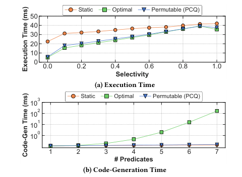

**图 1：重新优化已编译查询。PCQ 以很小的编译开销，通过自适应获得接近最优的执行性能。**

这些结果说明，编译式 DBMS 需要在不重新编译、也不预先生成替代计划的情况下，动态排列并调整查询计划。

## 3. PCQ 概览

PCQ 让 JIT DBMS 在运行中改变已编译查询策略，同时不重启、不重复工作、不预编译替代流水线。它与主动式重新优化 [7] 都无需回到优化器或重复处理元组；区别是 PCQ 不预计算全部子计划，也不预设切换阈值，而在运行时探索能改善延迟或资源利用率的策略。该框架虽为 NoisePage 的 LLVM 环境设计，也适用于其他支持查询编译的引擎。

图 2 给出系统生命周期：优化器先生成物理计划；Translator 把计划转成带 PCQ 构造的 TPL；Compiler 把 TPL 编成 bytecode；执行阶段收集 samples、更新 stats，并通过 policies 改变过滤顺序。

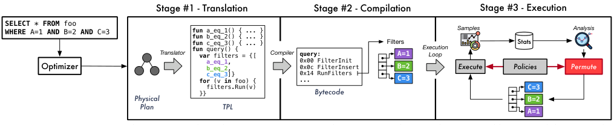

**图 2：系统概览。DBMS 把 SQL 查询翻译成包含间接层、支持排列的 DSL，再将 DSL 编译为紧凑字节码并由解释器执行；执行期间，系统采集并分析各谓词的统计信息，再调整其顺序。**

### 3.1 阶段 1：翻译

优化器生成物理计划后，翻译器把它分解为流水线，并转换成名为 TPL 的数据库 DSL。TPL 结合 VectorWise 风格预编译原语 [9] 与 HyPer 以数据为中心的代码生成 [28]，比 C/C++ 更易应用数据库专用优化，且编译延迟低。

翻译器加入两类 PCQ 构造。第一类是可开关的指标钩子，按策略收集流水线底层操作的运行时性能。第二类是参数化运行时结构，以间接层替换执行策略。算子逻辑可分查询无关与查询特定部分；后者由 DBMS 生成不同版本并用指针切换。间接性有两级：一级中算子无需知道查询特定实现，二级要求运行时与代码生成器协作。图 2 的过滤数组每项指向生成函数，排列只需交换指针。

```text
fun a_eq_1() { ... }
fun b_eq_2() { ... }
fun c_eq_3() { ... }
fun query() {
  var filters = {[a_eq_1, b_eq_2, c_eq_3]}
  for (v in foo) { filters.Run(v) }
}
```

### 3.2 阶段 2：编译

编译器把含钩子和间接结构的 TPL 转成紧凑 CISC 字节码。除算术、内存和分支指令外，还包括带 NULL 语义的 SQL 值比较、表/索引迭代器、哈希表构造和并行任务。图 2 用 `FilterInit`、`FilterInsert`、`RunFilters` 构造可排列过滤器；过滤器的函数指针数组顺序就是实际求值顺序。

### 3.3 阶段 3：执行

DBMS 先解释字节码，同时用 LLVM 异步编译本机代码；完成后自动切换函数实现 [20]。运行时结构的策略决定何时采样，以及收到新指标后如何适应。图 2 以固定概率收集各过滤项选择率和耗时，构造使当前分布下执行时间最小的排名。线程处理不相交表片段，可能看到不同分布，故独立决策；策略还须容纳线程同时运行字节码/本机实现且耗时不同。

NoisePage 是推送式面向批引擎，以类似宽松算子融合 [27] 的方式结合向量化与一次一元组执行。批处理摊销 PCQ 间接开销，并让 LLVM 自动向量化生成代码。

## 4. 支持的查询优化

下面介绍 PCQ 支持的优化类别。如前所述，DBMS 生成查询执行代码时，会让流水线内可能具有不同性能的操作可以在运行时重新排列或选择性启用。操作既可以是单个谓词这类短时、细粒度步骤，也可以是连接这类代价较高的关系算子。各项优化彼此独立，不会改变同一流水线或查询其他流水线中其他优化的行为。对每个类别，我们分别说明优化器是否需要修改物理计划、Translator 如何组织代码以支持运行时排列，以及 DBMS 如何采集策略决策所需的指标。

### 4.1 过滤条件重排

第一类优化是在扫描操作期间改变谓词求值顺序。最佳顺序需要在选择率与求值时间之间权衡：先运行选择性更高的过滤器可以尽早丢弃更多元组，但该过滤器本身可能很昂贵；最快的过滤器又可能丢弃太少元组，使 DBMS 浪费周期去计算后续过滤器。

**准备与代码生成。** DBMS 先把过滤表达式规范化为析取范式（DNF）。DNF 表达式由 $M$ 个析取项 $s_1 \lor s_2 \lor \cdots \lor s_M$ 构成，每个 $s_i$ 又是 $N$ 个合取因子 $f_1 \land f_2 \land \cdots \land f_N$ 的合取；每个因子就是完整过滤表达式中的一个谓词，例如 `col4 < 44`。DBMS 既能重排每个析取项内部的因子，也能重排 DNF 中的析取项，因此可能的总体顺序数为：

$$
R = M!N!
$$

把因子拆成函数有两项好处。第一，DBMS 只需交换函数指针，几乎无需额外成本，也无需重新编译，就能探索不同顺序。第二，系统可以在各自最适合之处同时使用代码生成和向量化：复杂算术表达式使用生成的融合代码，避免物化中间结果；简单谓词则使用约 250 个预编译向量原语组成的库。

图 3(a) 的 `WHERE` 子句已经是 DNF，因此无需进一步改写：

```sql
SELECT * FROM A
WHERE col1 * 3 = col2 + col3 AND col4 < 44;
```

Translator 为每个过滤因子生成一个接收 tuple vector 的函数。图 3(b) 中，`p1` 调用内建的向量化选择原语，`p2` 则使用融合的一次一元组逻辑。`query` 在第 2 行用函数列表初始化封装过滤与排列逻辑的运行时结构，在第 3 行对 A 生成面向批的顺序扫描，并在第 4 行通过 `filters.Run(v)` 对每批元组应用过滤器。

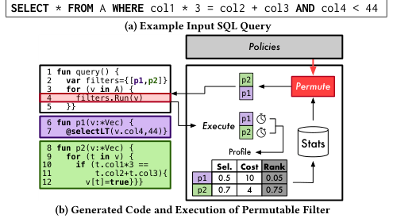

**图 3：过滤重排。Translator 把 (a) 中的查询转换为 (b) 左侧的 TPL，使用带查询特定过滤逻辑的数据结构模板；(b) 右侧展示策略采集指标后重排过滤条件。**

图 3 的核心生成代码为：

```text
fun query() {
  var filters = {[p1, p2]}
  for (v in A) { filters.Run(v) }
}
fun p1(v:*Vec) { @selectLT(v.col4, 44) }
fun p2(v:*Vec) {
  for (t in v) {
    if (t.col1 * 3 == t.col2 + t.col3) { v[t] = true }
  }
}
```

**运行时排列。** 可排列过滤器收到输入批次后，先由策略决定是否重新采集每个过滤组件的统计信息；采集频率和具体指标均可配置。本文采用的简单策略是，以固定概率 $p$ 随机采样选择率和运行时间，并在第 5 节研究 $p$ 的影响。

若策略不采样，DBMS 按当前顺序调用过滤函数：同一析取项中的函数逐步过滤元组，各析取项的结果再合并成最终过滤结果。若策略选择重新采样，DBMS 就对全部输入元组执行每个谓词，记录其选择率和调用时间并构造 profile。谓词的排序指标同时考虑选择率和求值成本：

$$
\mathrm{rank}(p)=\frac{1-s_p}{c_p}
$$

其中 $s_p$ 是谓词 $p$ 的选择率， $c_p$ 是该谓词的单元组求值成本。DBMS 把刷新后的统计数据写入内存统计表，再结合新的 rank 和过滤器排列策略重排谓词。为了测得真实选择率，重新采样时不能 short-circuit，而必须在全部输入上执行所有过滤器，这会产生冗余工作。因此，策略必须在减少无用计算与快速响应数据倾斜变化之间权衡。

### 4.2 自适应聚合

第二类优化从基于哈希的聚合中抽取“热”分组键，为这些键生成不探测哈希表的独立维护路径。哈希聚合包含五个面向批的步骤：哈希、探测、键相等检查、初始化和更新；并行聚合还需要第六步，把线程局部的部分聚合合并进全局聚合哈希表。初始化、更新和合并通常计算密集且与查询相关，Translator 会为它们生成定制代码，其余步骤则使用向量原语。

图 4 使用以下查询说明 PCQ 自适应聚合如何利用分组键倾斜：

```sql
SELECT col1, COUNT(*)
FROM A
GROUP BY col1;
```

**准备与代码生成。** Translator 先创建处理热键的专用函数 `aggregateHot`。它接收一批输入元组和一个包含 $N$ 个热键聚合 payload 的数组；数组中的每个元素都保存分组键和持续累积的聚合值， $N$ 的大小由策略决定。为便于说明，图中抽取两个 heavy-hitter key。由于 $N$ 是查询编译期常量，Translator 会生成 $N$ 个条件分支：匹配热数组的元组按查询语义更新聚合值，其余元组落入“冷”键路径。

接下来，Translator 生成 `aggregateMerge`，把部分计算完成的聚合列表合并到哈希表中；同样因为 $N$ 是编译期常量，它会把 $N$ 个聚合的合并逻辑完全展开并内联。最后，Translator 在主查询函数中建立 `aggregator` 运行时结构，注入包括热键处理与合并函数在内的各聚合步骤函数指针。

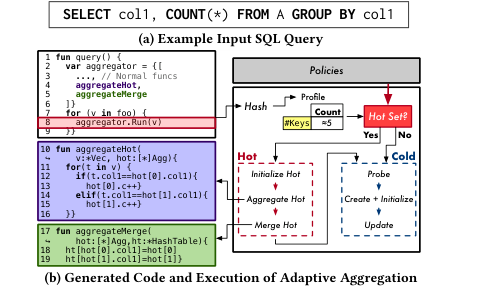

**图 4：自适应聚合。(a) 中的查询被转换为 (b) 左侧的 TPL；(b) 右侧逐步展示一次 PCQ 聚合执行。**

```text
fun query() {
  var aggregator = {[..., aggregateHot, aggregateMerge]}
  for (v in A) { aggregator.Run(v) }
}
fun aggregateHot(v:*Vec, hot:[*]Agg) {
  for (t in v) {
    if (t.col1 == hot[0].col1) { hot[0].c++ }
    elif (t.col1 == hot[1].col1) { hot[1].c++ }
  }
}
fun aggregateMerge(hot:[*]Agg, ht:*HashTable) {
  ht[hot[0].col1] = hot[0]
  ht[hot[1].col1] = hot[1]
}
```

**运行时排列。** 聚合的常规流程基本不变，区别在于 DBMS 为一批分组键计算哈希值时，还使用 HyperLogLog（HLL）[15] 跟踪近似 distinct key 数。HLL 表示紧凑，与复杂的聚合逻辑相比，计算开销很小。只有当 HLL 估计该批次的不同分组键少于 $N$ 时，系统才采用优化流水线。

在优化路径中，DBMS 分配聚合值数组，并用当前批次中最热的键初始化。识别热键的方法由策略决定：简单策略取批次中前 $N$ 个唯一键，更复杂的策略则随机采样，直至找到 $N$ 个唯一键。本文采用前一种策略，因为其性能与成本权衡最好。初始化后，DBMS 调用专用热键聚合函数，返回时再用合并函数把部分结果写回哈希表。

HLL 估计存在误差，因此某些元组可能没有命中热集合，此时还必须用冷路径处理该批，存在额外扫描的风险；DBMS 通过调整 HLL 估计误差来降低这一风险。并行聚合无需修改上述算法，也不需要生成额外代码，每个执行线程仍像以往一样进行线程局部聚合。

### 4.3 自适应连接

PCQ 从两方面优化 hash join：依据运行时信息选择哈希表实现，以及在右深或左深查询计划中重排连接的应用顺序。本文约定 hash join 的左输入为构建侧、右输入为探测侧。

哈希表分两阶段构建。第一阶段，DBMS 以行格式把左输入元组及其已计算哈希值物化到线程局部内存缓冲区，并用 HLL 估计唯一连接键数量。左输入耗尽后，DBMS 用该估计值判断哈希表大小：若预计小于 CPU 的 L3 cache 容量，就构造 concise hash table（CHT）[31]；否则构造带 pointer tagging 的 bucket-chained hash table [22]。这使 DBMS 能一次精确设置哈希表大小，避免构建期间 resize，并能依数据分布在运行时选择实现。第二阶段，每个线程扫描自身缓冲区来构建全局哈希表：若采用桶链表，则用原子 compare-and-swap 插入指向线程局部元组的指针；若采用 CHT，则按文献 [31] 执行分区构建。

下面以图 5 的查询说明可排列连接：

```sql
SELECT * FROM A
INNER JOIN B ON A.col1 = B.col1
INNER JOIN C ON A.col2 = C.col1;
```

**准备与代码生成。** 优化器在包含连续连接的右深计划中启用可排列连接，并指定一张与其余一张或多张表连接的“驱动”表。根据访问方法，系统可以使用 hash join 或 index join；无论是 inner join 还是 outer join，都能以任意顺序应用，因为每个驱动元组彼此独立，中间迭代状态也只在一个元组批次内短暂存在。图 5(b) 中，A 可以先与 B 连接，也可以先与 C 连接，最佳顺序可能随查询处理的数据块分布变化。NoisePage 的实现另有一项要求：驱动表必须包含全部连接所需的所有键列。

代码生成时，Translator 为每个连接生成一个 key-check function。图 5(c) 中，`joinB` 和 `joinC` 分别检查 A 与 B、C 的连接键；它们接收输入 tuple vector 和候选 tuple vector，再逐元组计算连接谓词。实现既可以分派到向量原语，也可以直接使用一次一元组 bytecode；`joinC` 就用内建原语，通过 SIMD 指令完成融合的 gather 与 select。

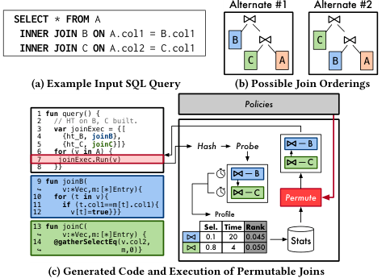

**图 5：自适应连接。DBMS 把 (a) 中的查询转换为 (c) 中的程序；(c) 右侧展示一次包含指标采集的可排列连接执行。**

Translator 随后在流水线中构造负责连接与排列逻辑的 `joinExec`。每个连接提供三项输入：待探测哈希表的指针、组成连接键的属性下标列表，以及 key-check function 指针。最后，Translator 生成扫描 A 的代码，并对每批元组调用连接执行器。

```text
fun query() {
  var joinExec = {[{ht_B, joinB}, {ht_C, joinC}]}
  for (v in A) { joinExec.Run(v) }
}
fun joinB(v:*Vec, m:[*]Entry) {
  for (t in v) { if (t.col1 == m[t].col1) { v[t] = true } }
}
fun joinC(v:*Vec, m:[*]Entry) { @gatherSelectEq(v.col2, m, 0) }
```

**运行时排列。** DBMS 先为输入批次中的每个元组计算哈希值，再由策略决定是否重新采集各连接的统计数据。若需要采集，系统依次探测各个哈希表。探测分两步：哈希表内嵌 Bloom filter，因此第一步只用已经计算的哈希值完成合并的 lookup/filter；第二步调用各连接的键相等函数，消除第一步的 false positive。后续连接只处理已经通过前序连接的元组。全部连接完成后，系统构造记录每一步选择率与耗时的 profile，像过滤器一样把它保存到内部目录，再按策略重排连接。

## 5. 评估

下面分析 PCQ 方法及其系统架构。我们在 NoisePage DBMS [4] 中实现了 PCQ 框架和执行引擎。NoisePage 是兼容 PostgreSQL 的 HTAP DBMS，在 Apache Arrow 内存列式数据 [25] 上采用 HyPer 风格的 MVCC [29]，并使用 LLVM 9 把字节码 JIT 编译为机器码。

实验机器配有 2 颗 10 核 Intel Xeon Silver 4114 CPU（2.2 GHz、每颗 25 MB L3 cache、支持 AVX512）和 128 GB DRAM。我们用 `numactl` 确保 DBMS 把整个数据库载入同一 NUMA region。微基准使用 Google Benchmark [2] 实现；该库会把每项实验运行足够多次，以获得统计稳定的执行时间。介绍工作负载后，我们先用单线程实验评估 PCQ 对已编译查询的改进，以尽量消除调度干扰；最后再用多线程查询，把启用 PCQ 的 NoisePage 与两个先进 OLAP DBMS 比较。

### 5.1 工作负载

**微基准。** 我们建立了一个合成基准，用于隔离并测量 DBMS 运行时行为的不同方面。数据库包含 A 至 F 六张表，每张表都有六个 64 位有符号整数列 `col1` 至 `col6`、300 万个元组，占用 144 MB。每项实验会改变列值的分布和相关性，以突出某个具体组件。工作负载包含三类查询，分别对应第 4 节的一项优化：含三个谓词的扫描查询、带分组的聚合查询，以及多路连接查询。

**TPC-H。** 该决策支持工作负载模拟 OLAP 环境 [37]，包含 3NF schema 中的八张表。我们使用 scale factor 10（约 10 GB），并采用倾斜版 TPC-H 生成器 [5]，使数据更接近真实应用。实验选择九条查询，覆盖 TPC-H choke point 分类 [8] 中从计算密集型到内存/连接密集型的类别；因此，我们预期结果也能推广到基准中的其余查询。

**Star Schema Benchmark（SSB）。** 该工作负载模拟数据仓库环境 [30]。它以 TPC-H 为基础，但有三项区别：把最大的两张表 `LINEITEM` 和 `ORDERS` 反规范化为新的事实表 `LINEORDER`；删除 `PARTSUPP`；增加新的 `DATE` 维表。SSB 包含 13 条以连接复杂性见长的查询。我们同样使用 scale factor 10（约 10 GB），但采用默认的均匀随机数据生成器。

### 5.2 过滤适应性

首先评估 PCQ 在数据分布变化时优化并排列过滤条件的能力。微基准查询对一张表执行顺序扫描：

```sql
SELECT * FROM A
WHERE col1 < 1000 AND col3 < 1000 AND col3 < 3000;
```

`WHERE` 子句常量使实验的数据生成器能够指定目标选择率。

**随时间变化的性能。** 第一项实验改变各谓词选择率。我们让其中一个谓词的选择率约为 2%，另两个各为 98%，并在表中互不重叠的区段轮换最有选择性的谓词：前 500 个元组块由 `col1` 上的谓词最有选择性，接下来 500 个块则由 `col2` 上的谓词最有选择性，如此使每个谓词只在表的三分之一范围内最优。

PCQ 可排列过滤器采用 10% 采样率，即 DBMS 对每个数据块以 10% 概率收集指标。作为对照，实验还执行三种分别把不同谓词放在首位的“静态”顺序，代表现有不可排列的 JIT 编译式 DBMS。

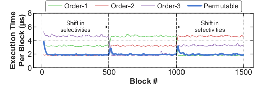

**图 6：随时间变化的性能。顺序扫描期间三种静态过滤顺序与 PCQ 过滤器的每数据块执行时间。**

图 6 表明，每种静态顺序都只在表的一部分最优。数据分布在第 500 和第 1000 个块变化后，PCQ 起初仍执行此前占优的顺序，性能出现短暂抖动；但它会在十个数据块内重新采样选择率并切换到新最优顺序。总体上，PCQ 查询比任何静态计划快约 2.5 倍。

**改变谓词选择率。** 接下来通过改变上述查询的数据分布，让过滤器的总体选择率从 0%（没有元组入选）变化到 100%（全部元组入选），以检验可排列过滤器的稳健性。PCQ 仍使用 10% 采样率。静态配置采用优化器根据已有统计信息选择的顺序；“最优”配置则预先获得每个数据块的最佳顺序，代表不计重新采样开销时可达到的性能上界。

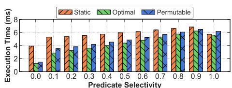

**图 7：改变谓词选择率。总体查询选择率变化时，静态、最优和可排列顺序的性能。**

图 7 表明，在全部选择率范围内，PCQ 都保持在最优配置的 20% 以内；只要选择率低于 100%，PCQ 和最优配置也始终优于优化器给出的静态顺序。选择率为 0% 时，PCQ 和最优配置分别比静态顺序快 2.7 倍和 3.6 倍，因为二者都能把最有选择性的谓词放在首位。选择率增加后，DBMS 必须处理更多元组，各配置耗时都会增长；到 100% 时自适应已无必要，PCQ 反而因采样开销最慢。所有配置在 100% 时又比 90% 时快，是因为 DBMS 会对满向量启用专用优化。

**过滤排列开销。** 第 4.1 节指出，指标采集频率与运行性能之间存在权衡。为量化这一关系，我们把重采样频率从 0.0（从不采样）变化到 1.0（每访问一个数据块都采样并重新排序）。过滤器总体选择率固定为 2%，最有选择性的谓词仍在第 500 和第 1000 个数据块处切换。查询从图 6 中总体性能最好的 `Order-3` 静态顺序开始；我们分别测量采集性能指标和实际执行所花的时间。

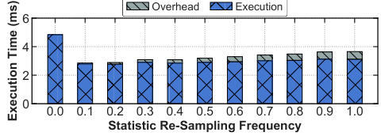

**图 8：过滤排列开销。谓词总体选择率固定为 2% 时，不同策略重采样频率下可排列过滤器的性能。**

图 8 表明二者并非线性关系。完全禁用采样虽然没有指标开销，却无法响应分布波动，因此比可排列过滤器慢约 1.7 倍。每个数据块都采样会在执行时间上增加 15% 开销。0.1 采样率表现最佳，后续实验均采用这一设置。

### 5.3 聚合适应性

下面评估 PCQ 利用倾斜加速 hash aggregation 的能力。本节实验在没有另行说明时，都使用微基准中对单表执行以下哈希聚合的查询；数据生成器会让分组键 `col1` 呈现指定倾斜：

```sql
SELECT col1, SUM(col2), SUM(col3), SUM(col4)
FROM A
GROUP BY col1;
```

**改变聚合键数量。** 第一项实验改变表中唯一分组键的总数。`col1` 从随机分布中取值，以控制每次试验的唯一键数；聚合函数使用的 `col2` 至 `col4` 则从各自取值域中均匀随机生成。

PCQ 固定抽取五个 heavy-hitter key；该数量在 DBMS 中可调，但本实验不改变。静态对照按数据中心式方法把表扫描与聚合融合 [28]，代表现有 JIT DBMS 的执行方式。

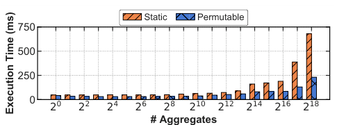

**图 9：改变聚合数量。唯一聚合键总数变化时，自适应聚合的性能。**

图 9 显示，当聚合键少于 16k、哈希表能放入 CPU cache 时，PCQ 优于静态配置。键数少于五个时，全部更新都经由“热”路径，带来 1.5 倍提升；超过该阈值后，PCQ 回退到混合向量化/JIT 实现，仍比静态计划快 1.6 倍。即使基数很高，PCQ 仍表现良好，因为它对哈希表执行与数据无关的随机访问，而且预编译与生成的聚合步骤都能自动向量化。哈希表在约 256k 个键时超过 CPU LLC，此时上述优势最明显，PCQ 比静态计划快 3 倍。

**改变聚合倾斜度。** 抽取更多 heavy-hitter key 会增加分支预测失败的可能性，也会生成更大的函数、延长编译时间，因此 DBMS 必须谨慎选择抽取数量。为研究这一关系，我们把唯一分组键总数固定为 200k，使用倾斜的 Zipfian 分布生成 `col1`，并比较抽取 0、1、2、4、8 个热键的 PCQ 配置。实验同时测量查询执行时间和输入元组命中热键条件分支的比例。

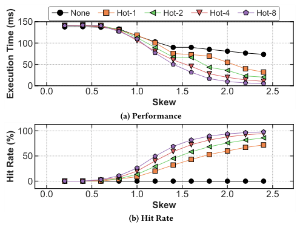

**图 10：改变聚合倾斜度。在键数固定时增加聚合键倾斜度；(a) 为聚合总执行时间，(b) 为输入元组命中 heavy-hitter 分支的比例。**

图 10(a) 显示，低倾斜时各配置相差不超过 3%，`None` 最快，因为均匀键分布使其他配置加入的分支基本都不命中。倾斜增加后，抽取热键的版本逐渐占优，收益最终在系统达到内存带宽上限时趋于平稳。`None` 使用 bucket-chained hash table，其余配置则更新普通数组中的聚合值；倾斜度为 2.4 时，`Hot-8` 比 `None` 快 18 倍。

图 10(b) 给出热键命中率。倾斜低于 1.0 时，只有约 10% 元组进入 heavy-hitter 分支，其余元组遭遇分支预测失败后回退到冷键路径，这解释了低倾斜时优化配置的退化。倾斜度为 1.6 时，`Hot-1` 与 `Hot-8` 的命中率分别为 45% 和 82%；倾斜度为 2.4 时，各优化配置的最小和最大命中率分别达到 72% 与 98%。

### 5.4 连接适应性

下面评估 PCQ 根据数据分布优化 hash join 的能力。每项实验都构造右深连接树，在独立流水线中建立哈希表，再在最终流水线中探测；数据生成器会为每对表的连接键指定选择率，并控制总体选择率。

**改变连接选择率。** 第一项实验在三张微基准表之间执行两个 inner hash join：

```sql
SELECT * FROM A
INNER JOIN B ON A.col1 = B.col1
INNER JOIN C ON A.col2 = C.col1;
```

连接属性的数据从 0%（没有元组找到连接伙伴）到 100%（全部元组找到伙伴）变化。静态配置使用 DBMS 给出的连接顺序，并采用 HyPer JIT 引擎会生成的融合一次一元组模型 [28]。PCQ 采用 10% 重采样策略，并从与静态配置相同的初始连接顺序开始。

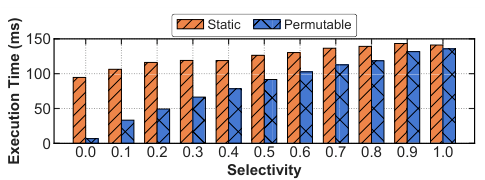

**图 11：改变连接选择率。改变总体连接选择率时，执行三个 hash join 的时间。**

图 11 表明，选择率为 0% 时，PCQ 会在处理探测输入的十个数据块内发现并切换到最优连接顺序，因此比静态连接快约 14 倍。随着选择率上升，需要处理的元组更多，排列的必要性下降；到 100% 时，PCQ 仍因对哈希、探测和键相等步骤进行向量化而略胜静态计划。

**改变连接数量。** 最后一项实验把查询中的 hash join 数量从一个增加到五个，同时把总体选择率保持在 10%。单连接本不需要排列，NoisePage 在这种情况下会消除可排列连接；论文仍将它列入图中，以便完整比较。实验在前述查询后追加连接子句，并投影全部表列。

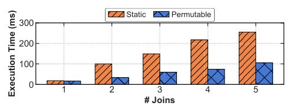

**图 12：改变连接数量。总体连接选择率保持 10% 时，多步连接的执行时间。**

图 12 显示，即使只有一个连接，PCQ 也因使用向量化 hash/probe 例程，并受益于 LLVM 对键相等检查函数的自动向量化而快 1.15 倍。随着连接数量增加，PCQ 会发现最有选择性的连接并把它们提前执行：两个连接时比静态计划快 3 倍，超过三个连接时快 2.5 倍。

### 5.5 系统比较

最后，我们把启用和禁用 PCQ 的 NoisePage 与两个先进内存 DBMS 比较：Actian Vector 9.2 [1] 和 Tableau HyPer 5.1 [3]。Vector 是基于 MonetDB/X100 [9] 的列式 DBMS，执行引擎由 SIMD 优化的向量原语构成；我们调整其配置，使其充分利用系统内存和 CPU 线程。HyPer 用 LLVM 生成可解释或 JIT 编译的一次一元组计划，也支持 SIMD 谓词求值；依 Tableau 工程师建议，我们不修改 HyPer 配置。

系统比较使用 TPC-H 和 SSB。各系统载入数据后，先执行所需的统计收集和优化操作；我们用工作负载预热一次，再报告连续五次运行的平均执行时间。我们人工检查计划并尽力确保各 DBMS 执行等价计划，但这些系统仍各自包含其他系统没有的优化。NoisePage 使用 HyPer 优化器生成的查询计划。

#### 5.5.1 倾斜 TPC-H 逐查询分析

我们使用 Microsoft 倾斜数据生成器 [5]，将 skew 设为 2.0。图 13 给出整体结果，表 1 则拆分每项优化的作用。表中每格表示在此前 PCQ 优化基础上再启用本项的相对加速；接近 1.0 表示影响小，空白表示不适用。

- **Q1：** 四个分组键上计算五个聚合。最热键对接收的更新从无倾斜时 49% 增至高倾斜时 86%，触发聚合优化并提升 1.7 倍。PCQ NoisePage 比 Vector 快 4.8 倍、比 HyPer 慢 1.2 倍；我们归因于 HyPer 的定点运算快于 NoisePage 浮点运算。
- **Q4：** 五个分组键上一个聚合，`ORDERS` 上有可排列过滤；`o_orderdate` 范围谓词选择率 0.08% 且高度倾斜。翻转范围谓词并优化聚合后，相对 NoisePage 基线和商业系统均提升约 2 倍，主要收益来自聚合。
- **Q5：** 六表连接但仅两个连接可排列；最终在两个分组键上求和。过滤收益有限，聚合提升 1.33 倍；两个可排列连接未重排，连接项为 1.00。总体比 HyPer 快 3 倍、比 Vector 快 5 倍。
- **Q6：** `LINEITEM` 上过滤选择率 0.05%。倾斜不改变谓词顺序，固定概率重采样反使 PCQ 比基线慢 4%；更高级采样策略可避免。各系统 SIMD 过滤性能接近。
- **Q7：** HyPer 选择的 bushy 连接计划比右深计划慢 4 倍。虽无元组进入最终聚合，PCQ 翻转 `l_shipdate` 范围谓词仍提升 1.2 倍。
- **Q11：** 五个连接均不可排列；两个聚合基数不触发优化；向量化谓词都只有单项。无 PCQ 优化触发，说明框架空载开销可忽略。NoisePage 与 HyPer 接近，比 Vector 快 4 倍。
- **Q16：** 以 `PARTSUPP` 为驱动的右深流水线，`PART` 上有多项过滤和哈希聚合。过滤重排提升近 1.2 倍；按构建表大小重排连接以使用 SIMD gather 又提升 1.2 倍。总体比 HyPer 快 7.4 倍、比 Vector 快 3 倍；HyPer 高倾斜下错选左反连接而非右反连接。
- **Q18：** 以 `ORDERS` 为驱动的右深流水线；聚合基数超过阈值。PCQ 重排连接，使小表使用 SIMD gather，提升 1.19 倍。HyPer 错用右半连接而非左半连接，比 PCQ 慢 2.6 倍。
- **Q19：** `PART` 与 `LINEITEM` 内连接后接复杂析取过滤和静态聚合。重排 `LINEITEM` 谓词提升 1.2 倍。HyPer 分别比 NoisePage、Vector 快 1.2 倍和 2.5 倍；NoisePage 损失来自一次一元组与向量过滤并用时“已选元组”内部表示间的转换。

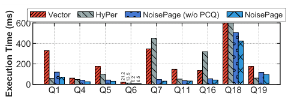

**图 13：倾斜 TPC-H 上的系统比较。在倾斜 TPC-H 基准上评估 NoisePage、HyPer 和 Vector。**

表 1：TPC-H speedup。数值表示在已有前序 PCQ 优化基础上再启用对应优化后的增益；`-` 表示该优化未适用。

| Query | +Filters (§4.1) | +Aggregations (§4.2) | +Joins (§4.3) |
|---|---:|---:|---:|
| Q1 | - | 1.71 | - |
| Q4 | 1.05 | 1.54 | - |
| Q5 | 1.08 | 1.33 | 1.00 |
| Q6 | 0.96 | - | - |
| Q7 | 1.02 | 1.40 | 1.00 |
| Q11 | - | 1.02 | - |
| Q16 | 1.18 | 1.00 | 1.00 |
| Q18 | - | 1.00 | 1.19 |
| Q19 | 1.21 | - | - |

在 SSB 上，所有系统都先收集统计信息并执行必要优化。图 14 展示端到端执行时间；表 2 表明，SSB 中最主要收益来自 join permutation，尤其是 Q2/Q3 类查询。

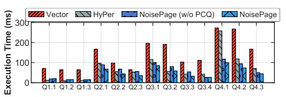

**图 14：Star Schema Benchmark 上的系统比较。在 SSB 上评估 NoisePage、HyPer 和 Vector。**

表 2：SSB speedup。数值表示逐步启用 PCQ 优化后的相对增益。

| Query | +Filters (§4.1) | +Aggregations (§4.2) | +Joins (§4.3) |
|---|---:|---:|---:|
| Q1.1 | 1.00 | 1.00 | 1.00 |
| Q1.2 | 1.02 | 1.00 | 1.00 |
| Q1.3 | 1.06 | 1.00 | 1.00 |
| Q2.1 | 0.96 | 1.00 | 1.32 |
| Q2.2 | 0.99 | 1.00 | 1.56 |
| Q2.3 | 1.00 | 1.00 | 1.60 |
| Q3.1 | 1.00 | 1.00 | 1.20 |
| Q3.2 | 1.01 | 1.00 | 1.42 |
| Q3.3 | 1.03 | 1.00 | 1.69 |
| Q3.4 | 1.00 | 1.00 | 0.92 |
| Q4.1 | 1.03 | 1.00 | 1.19 |
| Q4.2 | 1.02 | 1.00 | 1.33 |
| Q4.3 | 1.02 | 1.00 | 0.98 |

#### 5.5.2 SSB 分组分析

本实验在 Star Schema Benchmark [30] 上评估全部系统。十三条查询分四组，组内结构等价，只是过滤和聚合项不同，因此同组查询行为可以互相推广。与前面的 TPC-H 实验不同，为展示自适应收益，启用 PCQ 的 NoisePage 从随机初始计划开始，而无 PCQ 版本使用 HyPer 生成的最优计划。

- **Q1.*：** 最小表与最大表之间只有一个连接，两表都有选择性多项过滤。连接不可排列，过滤重排只带来小幅收益。HyPer 在压缩数据上执行 SIMD 向量过滤，CPI 更好，分别比 NoisePage 和 Vector 快 1.7 倍、3.7 倍。
- **Q2.*：** 三个连接和一个聚合。PCQ 从随机连接顺序出发，按选择率和运行条件排列，平均比基线快约 1.5 倍。过滤探索有轻微负收益，因为最佳顺序始终不变；可调采样策略能避免。总体比 HyPer 快 1.4 倍、比 Vector 快 2.2 倍。
- **Q3.*：** 与 Q2 类似但替换一张基表，仅 Q3.4 触发聚合优化。连接探索平均提升 1.3 倍；Q3.4 因最佳排名稳定后仍探索其他顺序而退化，探索开销大于收益。总体比基线和 HyPer 快 1.3 倍、比 Vector 快 3.2 倍。
- **Q4.*：** 连接全部五张表。除 Q4.3 外均找到最优连接和过滤顺序，相对基线约提升 1.26 倍；Q4.3 同样因强制探索退化。平均比基线快 1.2 倍，比 HyPer、Vector 分别快 1.9 倍、3.4 倍。

总体来看，与非自适应静态计划相比，PCQ 在微基准中最高超过 4 倍；在分析基准中，相对其他先进 DBMS 也有超过 2 倍的性能优势。重要结论是：少量间接开销通常小于错误编译计划带来的损失。

## 6. 相关工作

Deshpande 等综述了 2000 年代后期以前的 AQP [12]。AQP 监控查询运行行为，判断优化器基数估计是否越过阈值，然后用新估计重新优化，或在物化点切换备选子计划；前者因重编译成本不适合 JIT DBMS。

与 PCQ 最相关的是参数化优化 [11, 16] 和主动式重新优化 [7]。Volcano 为一条流水线生成多个计划，以 `choose-plan` 算子按观测基数选择。Rio 在流水线内加入 `switch` 算子并收集运行统计 [7]。Plan Bouquets [14] 生成运行时切换且有最坏情况界的“参数化最优计划集”。它们面向解释式 DBMS，只在执行前粗粒度选择不可排列子计划；PCQ 可在流水线执行中切换策略。Perron 等也表明现代代价优化器对部分查询仍会失效 [33]，PCQ 在执行期处理许多相同问题。

IBM 的 AQP 可动态重排流水线连接 [24]，但针对 OLTP，难以推广到分析查询。SkinnerDB 用强化学习近似最优连接顺序 [38]，却需为所有索引预计算哈希表，且只支持单线程。HyPer 的自适应编译 [20] 与 NoisePage 一样先解释专用字节码，但其字节码源自 LLVM IR；HyPer 只在解释/编译模式间切换，不修改高层计划或进行第 4 节的流水线内优化。

Vector [9] 拼接按数据类型专门化的预编译原语。其“微自适应”用不同编译器生成原语，并以多臂老虎机按性能选择 [34]；它只能改变编译器，不能依据观测数据做全计划优化。Zeuch 等用 CPU 硬件计数器建立代价模型，估计多表选择率并调整执行顺序。

Apache Spark 的方法动态推测优化数据文件解析代码 [35]。Grizzly [17] 先生成带 profiling 的通用 C++，再重编译优化变体并用硬件计数器验证；它支持谓词重排和域值专门化，但 PCQ 无需重编译且支持更多优化。

早期 Postgres 谓词迁移 [18] 收集谓词完成时间，供优化器为未来查询权衡选择率与求值成本；DB2 的 LEO [36] 同样把运行信息反馈给优化器。PCQ 则修改当前正在执行的查询。Dreseler 等将 TPC-H choke point 分为计划级、逻辑算子级和引擎效率级 [13]，认为谓词放置和子查询扁平化最重要；PCQ 在执行引擎支持前者，后者仍由优化器负责。

## 7. 结论

本文提出 PCQ，一种弥合 JIT 编译与 AQP 之间鸿沟的查询处理架构。PCQ 在生成代码中加入带间接层的动态运行时结构，使 DBMS 能在查询运行期间安全、原子地切换计划。为摊销切换开销，生成代码依赖面向批的处理。

我们为三类关系算子提出了 PCQ 优化。对于扫描，系统使用自适应过滤器，高效发现能缩短执行时间的过滤顺序。对于基于哈希的聚合，系统动态识别并利用 grouping key 的倾斜，把重键抽入哈希表之外的专用路径。最后，对于左深或右深 hash join，系统可以在运行时重排多个连接的应用顺序，以最大化性能。实验表明，NoisePage 启用 PCQ 后，在合成工作负载上最高获得 4 倍性能提升，在 TPC-H 和 SSB 基准上最高获得 2 倍性能提升。

## 致谢

本文工作部分由 National Science Foundation (IIS-1846158, IIS-1718582, SPX-1822933)、Google Research Grants 和 Alfred P. Sloan Research Fellowship program 支持。

## 参考文献

- [1] [n.d.]. Actian Vector. http://esd.actian.com/product/Vector.
- [2] [n.d.]. Google Benchmark. https://github.com/google/benchmark.
- [3] [n.d.]. HyPer. https://hyper-db.de.
- [4] [n.d.]. NoisePage. https://noise.page.
- [5] [n.d.]. Skewed TPC-H. https://www.microsoft.com/en-us/download/details.aspx?id=52430.
- [6] Shivnath Babu and Pedro Bizarro. 2005. Adaptive Query Processing in the Looking Glass. In CIDR. 238–249.
- [7] Shivnath Babu, Pedro Bizarro, and David DeWitt. 2005. Proactive Re-optimization. In SIGMOD. 107–118.
- [8] Peter Boncz, Thomas Neumann, and Orri Erling. 2014. TPC-H Analyzed: Hidden Messages and Lessons Learned from an Influential Benchmark.
- [9] Peter Boncz, Marcin Zukowski, and Niels Nes. 2005. MonetDB/X100: Hyper-pipelining query execution. In CIDR.
- [10] Donald D. Chamberlin, Morton M. Astrahan, Michael W. Blasgen, James N. Gray, W. Frank King, Bruce G. Lindsay, Raymond Lorie, James W. Mehl, Thomas G. Price, Franco Putzolu, Patricia Griffiths Selinger, Mario Schkolnick, Donald R. Slutz, Irving L. Traiger, Bradford W. Wade, and Robert A. Yost. 1981. A history and evaluation of System R. Commun. ACM 24 (October 1981), 632–646. Issue 10.
- [11] Richard L. Cole and Goetz Graefe. 1994. Optimization of Dynamic Query Evaluation Plans. In Proceedings of the 1994 ACM SIGMOD International Conference on Management of Data (SIGMOD ’94). 150–160.
- [12] Amol Deshpande, Zachary G. Ives, and Vijayshankar Raman. 2007. Adaptive Query Processing. Foundations and Trends in Databases 1, 1 (2007), 1–140.
- [13] Markus Dreseler, Martin Boissier, Tilmann Rabl, and Matthias Uflacker. 2020. Quantifying TPC-H Choke Points and Their Optimizations. PVLDB 13, 8 (2020), 1206–1220.
- [14] Anshuman Dutt and Jayant R. Haritsa. 2014. Plan Bouquets: Query Processing without Selectivity Estimation. In Proceedings of the 2014 ACM SIGMOD International Conference on Management of Data (SIGMOD ’14). 1039–1050.
- [15] Philippe Flajolet, Éric Fusy, Olivier Gandouet, and Frédéric Meunier. 2007. HyperLogLog: the analysis of a near-optimal cardinality estimation algorithm. In AofA: Analysis of Algorithms (DMTCS Proceedings). 137–156.
- [16] G. Graefe and K. Ward. 1989. Dynamic Query Evaluation Plans. SIGMOD Rec. 18, 2 (June 1989), 358–366.
- [17] Philipp M Grulich, Sebastian Breß, Steffen Zeuch, Jonas Traub, Janis von Bleichert, Zongxiong Chen, Tilmann Rabl, and Volker Markl. 2020. Grizzly: Efficient Stream Processing Through Adaptive Query Compilation (SIGMOD).
- [18] Joseph M. Hellerstein and Michael Stonebraker. 1993. Predicate Migration: Optimizing Queries with Expensive Predicates. In SIGMOD. 267–276.
- [19] Yannis Klonatos, Christoph Koch, Tiark Rompf, and Hassan Chafi. 2014. Building efficient query engines in a high-level language. PVLDB 7, 10 (2014), 853–864.
- [20] André Kohn, Viktor Leis, and Thomas Neumann. 2018. Adaptive Execution of Compiled Queries. In ICDE. 197–208.
- [21] Konstantinos Krikellas, Stratis D Viglas, and Marcelo Cintra. 2010. Generating code for holistic query evaluation. In Data Engineering (ICDE), 2010 IEEE 26th International Conference on. IEEE, 613–624.
- [22] Viktor Leis, Peter Boncz, Alfons Kemper, and Thomas Neumann. 2014. Morsel-driven Parallelism: A NUMA-aware Query Evaluation Framework for the Many-core Age. In SIGMOD. 743–754.
- [23] Viktor Leis, Andrey Gubichev, Atanas Mirchev, Peter A. Boncz, Alfons Kemper, and Thomas Neumann. 2015. How Good Are Query Optimizers, Really? PVLDB 9, 3 (2015), 204–215.
- [24] Q. Li, M. Shao, V. Markl, K. Beyer, L. Colby, and G. Lohman. 2007. Adaptively Reordering Joins during Query Execution. In 2007 IEEE 23rd International Conference on Data Engineering. 26–35. https://doi.org/10.1109/ICDE.2007.367848
- [25] Tianyu Li, Matthew Butrovich, Amadou Ngom, Wes McKinney, and Andrew Pavlo. 2019. Mainlining Databases: Supporting Fast Transactional Workloads on Universal Columnar Data File Formats. Under Submission.
- [26] Volker Markl, Vijayshankar Raman, David Simmen, Guy Lohman, Hamid Pirahesh, and Miso Cilimdzic. 2004. Robust Query Processing through Progressive Optimization. In Proceedings of the 2004 ACM SIGMOD International Conference on Management of Data (SIGMOD ’04). 659–670.
- [27] Prashanth Menon, Todd C. Mowry, and Andrew Pavlo. 2017. Relaxed Operator Fusion for In-Memory Databases: Making Compilation, Vectorization, and Prefetching Work Together At Last. Proceedings of the VLDB Endowment 11 (September 2017), 1–13. Issue 1.
- [28] Thomas Neumann. 2011. Efficiently Compiling Efficient Query Plans for Modern Hardware. PVLDB 4, 9 (2011), 539–550.
- [29] Thomas Neumann, Tobias Mühlbauer, and Alfons Kemper. 2015. Fast Serializable Multi-Version Concurrency Control for Main-Memory Database Systems (SIGMOD).
- [30] Patrick O’Neil, Elizabeth O’Neil, Xuedong Chen, and Stephen Revilak. 2009. The star schema benchmark and augmented fact table indexing. In Technology Conference on Performance Evaluation and Benchmarking. Springer, 237–252.
- [31] R Barber G Lohman I Pandis, V Raman R Sidle, G Attaluri N Chainani S Lightstone, and D Sharpe. 2014. Memory-Efficient Hash Joins. Proceedings of the VLDB Endowment 8, 4 (2014).
- [32] Drew Paroski. 2016. Code Generation: The Inner Sanctum of Database Performance. http://highscalability.com/blog/2016/9/7/code-generation-the-inner-sanctum-of-database-performance.html.
- [33] M. Perron, Z. Shang, T. Kraska, and M. Stonebraker. 2019. How I Learned to Stop Worrying and Love Re-optimization. In 2019 IEEE 35th International Conference on Data Engineering (ICDE).
- [34] Bogdan Raducanu, Peter A. Boncz, and Marcin Zukowski. 2013. Micro adaptivity in Vectorwise. In SIGMOD. 1231–1242.
- [35] Filippo Schiavio, Daniele Bonetta, and Walter Binder. 2020. Dynamic Speculative Optimizations for SQL Compilation in Apache Spark. Proc. VLDB Endow. 13, 5 (Jan. 2020), 754–767. https://doi.org/10.14778/3377369.3377382
- [36] Michael Stillger, Guy M. Lohman, Volker Markl, and Mokhtar Kandil. 2001. LEO - DB2’s LEarning Optimizer. In VLDB. 19–28.
- [37] The Transaction Processing Council. 2013. TPC-H Benchmark (Revision 2.16.0). http://www.tpc.org/tpch/.
- [38] Immanuel Trummer, Junxiong Wang, Deepak Maram, Samuel Moseley, Saehan Jo, and Joseph Antonakakis. 2019. SkinnerDB: Regret-Bounded Query Evaluation via Reinforcement Learning. CoRR abs/1901.05152 (2019). arXiv:1901.05152 http://arxiv.org/abs/1901.05152
- [39] Stratis D. Viglas. 2013. Just-in-time Compilation for SQL Query Processing. PVLDB 6, 11 (2013), 1190–1191.
- [40] Jianqiao Zhu, Navneet Potti, Saket Saurabh, and Jignesh M. Patel. 2017. Looking Ahead Makes Query Plans Robust. PVLDB 10, 8 (2017), 889–900.
