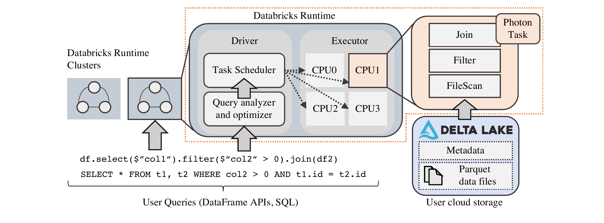
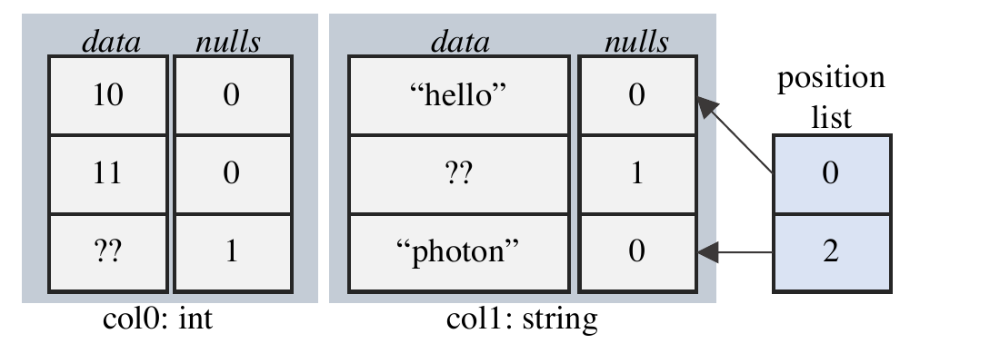
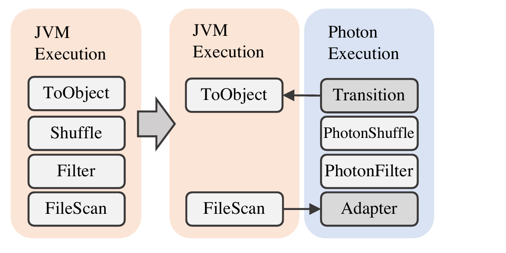
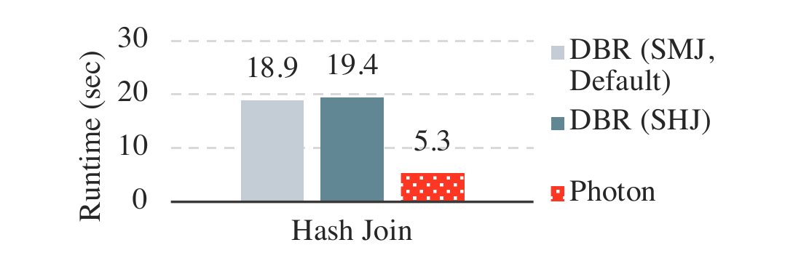
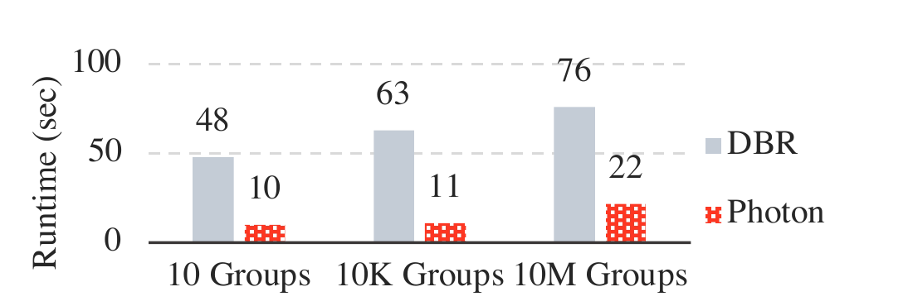
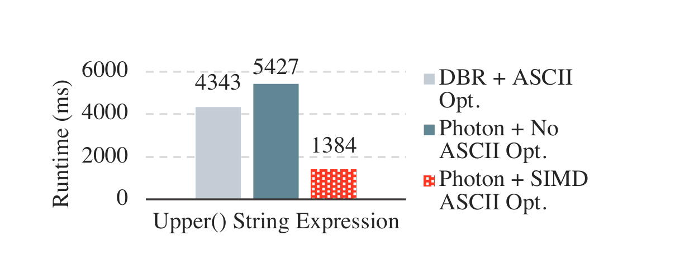
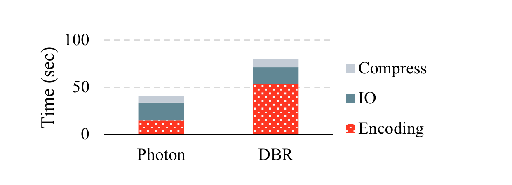
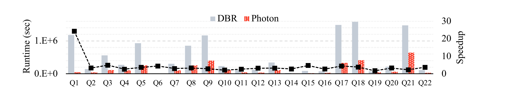
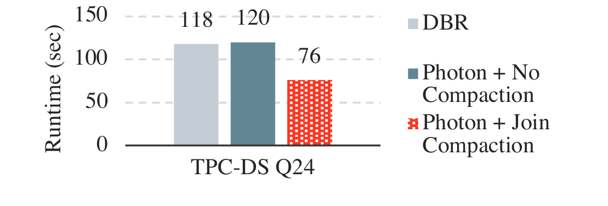

# Photon: A Fast Query Engine for Lakehouse Systems（中文译文）

## 译者说明

本文依据同目录的 `source.pdf` 翻译。章节、图表、公式、算法、代码与参考文献按原文结构保留。

Alexander Behm、Shoumik Palkar、Utkarsh Agarwal、Timothy Armstrong、David Cashman、Ankur Dave、Todd Greenstein、Shant Hovsepian、Ryan Johnson、Arvind Sai Krishnan、Paul Leventis、Ala Luszczak、Prashanth Menon、Mostafa Mokhtar、Gene Pang、Sameer Paranjpye、Greg Rahn、Bart Samwel、Tom van Bussel、Herman van Hovell、Maryann Xue、Reynold Xin、Matei Zaharia

Databricks Inc.；`photon-paper-authors@databricks.com`

## 摘要

许多组织正在转向一种称为“湖仓一体”（Lakehouse）的数据管理范式：在非结构化数据湖之上实现结构化数据仓库的功能。这给查询执行引擎带来了新的挑战。执行引擎既要在数据湖中无处不在的原始、未经整理的数据集上提供良好性能，也要在 Apache Parquet 等流行列式文件格式所存储的结构化数据上提供优异性能。

为实现这些目标，我们介绍 Photon：Databricks 为 Lakehouse 环境开发的一种向量化查询引擎。Photon 在 SQL 工作负载上可以超过现有云数据仓库，同时实现了更通用的执行框架，既能高效处理原始数据，也支持 Apache Spark API。我们讨论 Photon 的设计选择，例如向量化与代码生成之间的取舍；并介绍它与现有 SQL 和 Apache Spark 运行时的集成、任务模型及内存管理器。Photon 已让某些客户工作负载加速超过 10 倍，最近还帮助 Databricks 在官方 100TB TPC-DS 基准中创下新的审计性能纪录。

**ACM 引用格式：** Alexander Behm, Shoumik Palkar, Utkarsh Agarwal, Timothy Armstrong, David Cashman, Ankur Dave, Todd Greenstein, Shant Hovsepian, Ryan Johnson, Arvind Sai Krishnan, Paul Leventis, Ala Luszczak, Prashanth Menon, Mostafa Mokhtar, Gene Pang, Sameer Paranjpye, Greg Rahn, Bart Samwel, Tom van Bussel, Herman van Hovell, Maryann Xue, Reynold Xin, Matei Zaharia. 2022. Photon: A Fast Query Engine for Lakehouse Systems. In *Proceedings of the 2022 International Conference on Management of Data (SIGMOD '22)*, June 12–17, 2022, Philadelphia, PA, USA. ACM, New York, NY, USA, 14 pages. https://doi.org/10.1145/3514221.3526054

**许可：** 在不为营利或商业利益复制、分发，且副本首页保留本声明和完整引用的前提下，允许免费制作本文全部或部分内容的数字或纸质副本，用于个人或课堂使用。由 ACM 以外其他权利人持有版权的组件须尊重其版权；注明出处的摘要使用不受限制。其他复制、再出版、上传服务器或分发到邮件列表的行为，需要事先取得明确许可并可能付费；许可请求发送至 `permissions@acm.org`。版权由权利人持有，出版权授予 ACM。ACM ISBN 978-1-4503-9249-5/22/06。

## 1 引言

如今，企业把绝大多数数据存放在 Amazon S3、Azure Data Lake Storage 和 Google Cloud Storage 等可扩展、弹性数据湖中。这些数据湖用 Apache Parquet 或 Delta Lake [4, 18] 等开放文件格式保存原始且往往未经整理的数据集，并可由 Apache Spark、Presto [49, 58] 等多种引擎访问，以运行从 SQL 到机器学习的各种工作负载。传统上，为了满足要求最高的 SQL 工作负载，企业还会把精心整理的数据子集移入数据仓库，以获得高性能、治理能力和并发性。然而，这种双层架构既复杂又昂贵：仓库只能看到部分数据，而且提取、转换、装载（ETL）过程中的问题可能使仓库数据与原始数据不同步 [19]。

为此，许多组织开始采用 Lakehouse 数据管理架构 [19]，直接在数据湖之上实现治理、ACID 事务和丰富 SQL 支持等数据仓库功能。这种单层方法有望简化数据管理：用户可以用统一方式治理和查询全部数据，需要管理的 ETL 步骤和查询引擎也更少。近来，Delta Lake [18] 等新存储层已经在数据湖上实现事务和时间旅行等许多数据仓库管理功能，并提供数据聚簇和数据跳过索引等存储访问优化工具。不过，要让 Lakehouse 工作负载达到最高性能，不仅要优化存储层，也要优化查询处理。

本文介绍 Photon：Databricks 为 Lakehouse 工作负载开发的新型向量化查询引擎，可执行 SQL 或 Apache Spark DataFrame API [20] 编写的查询。Photon 已为数百名客户执行数千万条查询。与先前的 Databricks Runtime——基于 Apache Spark 的优化引擎——相比，客户使用 Photon 后平均获得 3 倍加速，最高超过 10 倍。2021 年 11 月，Databricks 还使用 Photon 在 Amazon S3 上基于 Delta Lake 格式的 Lakehouse 系统中创下经审计的 100TB TPC-DS 世界纪录，说明开放数据格式和通用云存储也可以实现最先进的 SQL 性能。

Photon 的设计需要解决两个关键挑战。第一，Photon 不同于传统数据仓库引擎，必须在原始、未经整理的数据上表现良好；此类数据可能极不规则，物理布局很差，字段很大，也缺乏有用的聚簇或数据统计信息。第二，Photon 必须支持现有 Apache Spark DataFrame API，并与其语义兼容；数据湖工作负载广泛使用该 API。若要兑现以单一查询引擎和统一语义服务组织全部工作负载的 Lakehouse 承诺，这一点至关重要，但它也造成了艰难的工程和测试问题。在满足这两项挑战的同时，Photon 当然还要尽可能快。它们最终引出了 Photon 的设计：用 C++ 编写的向量化引擎，与 Apache Spark 的内存管理器清晰交互，并包含多项针对原始、未经整理数据的优化。

**挑战 1：支持原始、未经整理的数据。** Lakehouse 环境的数据种类比传统 SQL 仓库丰富得多。频谱一端是 Lakehouse 中“干净”的表格数据集；用户会认真设计约束、统计信息和索引的模式，清理并组织数据以提高读取性能。另一端是未经整理的原始数据，可能具有小文件、多列、稀疏或超大数据值等次优布局，而且没有有用的聚簇或统计信息；但许多用户仍希望查询这类数据。此外，字符串在原始数据中既方便又普遍，甚至会被用于表示整数和日期等数值数据。此类数据往往已经反规范化，因此字符串列还可能用占位值表示未知或缺失值，而不是使用 NULL；可空性、字符串编码（例如 ASCII 与 UTF-8）等模式信息通常也不存在。

因此，Lakehouse 执行引擎的设计必须足够灵活：既能在任意未经整理的数据上提供良好性能，又能在遵循 Lakehouse 最佳实践的数据上提供优异性能，例如多维聚簇 [19]、合理的文件大小和合适的数据类型；同时还要覆盖数据科学、ETL、即席 SQL 和 BI 等多种用例。

我们用两个早期设计决策解决该挑战。第一，与 Spark SQL 选择代码生成 [20] 不同，Photon 采用向量化解释执行模型。向量化执行让 Photon 可以在运行时自适应：发现、维护并利用微批数据特征，通过专用代码路径适应 Lakehouse 数据集的属性，从而获得最佳性能。例如，对几乎没有 NULL 的列或主要由 ASCII 组成的字符串数据，Photon 会运行按批优化的代码。

我们还发现向量化方法在工程上有其他优势。尽管代码生成模型在某些场景下表现更好，例如复杂条件表达式，但根据我们对两种方法的原型实践以及在其他引擎上的经验，向量化模型更容易构建、分析、调试和大规模运维。这使团队能把更多时间投入到缩小两者性能差距的专门优化中。保留查询算子等抽象边界，也更方便采集丰富指标，帮助最终用户理解查询行为。

第二，Photon 使用原生语言 C++ 实现，而没有沿用基于 Java VM 的既有 Databricks Runtime 引擎。原因之一是 JVM 引擎已经触及性能上限；另一个原因是内部即时编译器存在方法大小等限制，当 JVM 优化放弃时会形成性能断崖。原生代码的性能通常也更容易解释，因为内存管理和 SIMD 等方面都可以显式控制。原生引擎不仅提升了性能，也更容易处理大型记录和查询计划。

**挑战 2：支持现有 Spark API。** 组织已经在数据湖上运行各种应用，从 ETL 到机器学习等高级分析。在 Databricks 平台上，这些工作负载利用 Apache Spark API，混合使用经过 SQL 优化器的 DataFrame 或 SQL 代码，以及被当作黑盒处理的用户定义代码。为了加速既有工作负载，并确保 Databricks 上 SQL 工作负载与 Spark 工作负载具有相同语义，我们把 Photon 设计为与 Spark 引擎集成，既支持混合 SQL 算子与 UDF 的 Spark 工作负载，也支持纯 SQL 工作负载。困难在于，Photon 必须能与用户定义代码共享资源，并匹配 Apache Spark 既有 Java SQL 引擎的语义。

为解决该挑战，Photon 与基于 Apache Spark 的 Databricks Runtime（DBR）紧密集成。DBR 是 Apache Spark 的一个分支，提供相同 API，但在可靠性和性能上有所改进。Photon 作为一组新的物理算子加入 DBR，DBR 查询优化器可以在部分查询计划中选择它们；这些算子还与 Spark 的内存管理器、监控和 I/O 系统集成。由于在算子层集成，客户无需修改工作负载即可透明获得 Photon 的收益。查询可以部分在 Photon 中执行，对尚不支持的操作回退到 Spark SQL；随着 Photon 不断加入新功能，这些转换会逐渐减少。局部推出 Photon 的能力让我们获得了宝贵的现场运维经验。Photon 还能接入实时指标等功能，因此使用 Photon 的查询仍会像以前一样显示在 Spark UI 中。最后，我们严格测试 Photon，确保其语义不偏离 Spark SQL，从而防止既有工作负载出现意外行为变化。

## 2 背景

为说明 Photon 如何融入生产 Lakehouse 系统，本节介绍 Databricks 的 Lakehouse 产品。

### 2.1 Databricks Lakehouse 架构

Databricks Lakehouse 平台由四个主要组件构成：原始数据湖存储层；支持仓库式事务和回滚等功能的自动数据管理层；执行分析工作负载的弹性执行层；以及客户与数据交互的用户界面。

**数据湖存储。** Databricks 平台把存储与计算解耦，客户可以选择自己的低成本存储提供商，例如 S3、ADLS 或 GCS。这一设计既避免客户数据锁定，也避免昂贵迁移，因为客户可以直接把 Databricks 连接到云存储中的既有大型数据集。Databricks 通过计算服务与数据湖之间的连接器访问客户数据，数据本身使用 Apache Parquet 等开放文件格式存储。

**自动数据管理。** 多数 Databricks 客户已经迁移到 Delta Lake [18]：构建在云对象存储上的开源 ACID 表存储层。Delta Lake 在表格数据集上支持 ACID 事务、时间旅行、审计日志和快速元数据操作等仓库式功能，并用 Parquet 同时存储数据和元数据。

传统仓库以查询性能为由，把客户数据摄取到专有格式中 [13, 21]；与之不同，我们发现，只要访问层合适，专有数据仓库中的许多存储优化也能用开放文件格式实现。Databricks 还在 Delta Lake 格式之上实现自动数据聚簇和缓存等优化，以进一步提高性能。例如，按常用查询谓词聚簇记录，可以启用数据跳过并减少 I/O [18]。

**弹性执行层。** 图 1 展示 Databricks 的执行层，即所有数据处理运行所在的“数据平面”。它既执行自动数据聚簇和元数据访问等内部查询，也执行 ETL 作业、机器学习和 SQL 等客户查询。Databricks 的执行层每天读取和处理艾字节级数据。因此，该组件必须可扩展、可靠且性能优异，才能降低客户成本并支持交互式数据分析。Photon 在执行层中负责对每个已处理数据分区进行单线程查询执行。



**图 1：Databricks 的执行层。** Photon 作为 Databricks Runtime 的一部分运行；后者在由公有云虚拟机构成的分布式集群上执行查询。在这些集群内，Photon 以单线程方式在数据分区上执行任务。

执行层使用 AWS、Azure 和 Google Cloud 上的云计算虚拟机。Databricks 以集群为粒度管理这些虚拟机：一个集中式 driver 节点负责协调执行，一个或多个 executor 节点读取并处理数据。这些虚拟机运行处理用户查询的 Databricks Runtime，也运行日志收集、访问控制等管理软件。§2.2 会进一步介绍 Databricks Runtime。

### 2.2 Databricks Runtime

Databricks Runtime（DBR）负责所有查询执行（图 1）。它提供 Apache Spark 的全部 API，并在开源代码基础上包含多项性能与稳健性改进。Photon 位于 DBR 的最低层，在 DBR 多线程、无共享执行模型中负责单线程任务执行。

提交给 DBR 的应用称为 job，每个 job 分为若干 stage。stage 读取一个或多个文件或数据交换，并以一次数据交换或一个结果结束。stage 又拆成各个 task；这些 task 在不同数据分区上执行相同代码。DBR 的 stage 边界是阻塞的，即前一 stage 结束后下一 stage 才开始。因此，系统可以在 stage 边界通过重放 stage 或重新规划查询来实现容错或自适应执行。

DBR 使用一个 driver 节点负责调度、查询规划和其他集中式任务。driver 管理一个或多个 executor 节点，每个 executor 都运行任务执行进程，扫描、处理数据并生成结果。该进程是多线程的，包含任务调度器和线程池，可并行执行 driver 提交的独立任务。

SQL 查询与其他查询共享同一执行框架，可以由一个或多个 job 组成。例如，文件元数据查询和 SQL 子查询都可能在同一个总体查询内作为独立 job 执行。driver 负责把 SQL 文本或用 Apache Spark DataFrame API 构造的 DataFrame 对象转换为查询计划。

查询计划是由 SQL 算子（如 Filter、Project、Shuffle）组成的树，并映射为一组 stage。查询规划完成后，driver 启动 task 执行查询的每个 stage。每个 task 使用内存执行引擎处理数据。Photon 就是这种执行引擎，它取代了以前基于 Apache Spark SQL 的引擎。

### 2.3 示例：端到端 SQL 查询执行

考虑清单 1 的 SQL 查询，用户把它提交给 Databricks。查询作用于 `customer` 和 `orders` 两张逻辑表，二者都由用户云账户中的 Delta 文件支持。

```sql
SELECT
    upper(c_name), sum(o_price)
FROM
    customer, orders
WHERE
    o_shipdate > '2021-01-01' AND
    customer.c_age > 25 AND
    customer.c_orderid = orders.o_orderid
GROUP BY
    c_name
```

**清单 1：SQL 查询示例。** 该查询既能受益于文件聚簇等存储优化，也能受益于 Photon 提供的运行时引擎优化，例如 SIMD 向量化执行。

Databricks 服务首先把查询路由到集群的 driver 节点。driver 负责创建查询计划，包括算子重排序等逻辑优化，以及选择连接策略等物理规划。这个示例查询可应用多项优化：如果 `orders` 表按日期分区，就能通过分区裁剪避免扫描不必要的数据；如果数据已经聚簇，而且已知年龄谓词不会匹配某些文件，还能跳过更多文件。Databricks 的 Lakehouse 通过 Hilbert 聚簇 [32] 等功能支持这两种优化。Delta 格式还能加快元数据操作，例如列出表最新快照的文件 [18]。

driver 选定要扫描的文件并完成物理查询计划后，会通过 Apache Spark RDD API 把查询计划转换为可执行代码，再把序列化代码发送到每个 executor 节点。executor 以 task 形式在输入数据分区上运行这些代码。task 从用户云存储读取数据；如果用户以前查询过该表，也可能从本地 SSD 缓存读取；然后求值其余查询算子。

## 3 执行引擎设计决策

本节先概述 Photon 架构，再深入介绍查询引擎的主要设计决策。

### 3.1 概览

Photon 是原生执行引擎，即用 C++ 实现；它被编译为共享库，由 DBR 调用。Photon 在 executor 的 JVM 进程内作为 DBR 单线程 task 的一部分运行。与 DBR 一样，Photon 把 SQL 查询组织成算子树；每个算子通过 `HasNext()`/`GetNext()` API 从子节点拉取一批数据。该 API 也通过 Java Native Interface [8] 从用 Java 实现的算子拉取数据；同理，Photon 上方的算子也可用同一 API 从 Photon 拉取数据。

Photon 与 Java 算子还有两项区别：它处理列式数据，并用解释式向量化而非代码生成来实现算子。这意味着 Photon 和 Java 算子期望的内存数据布局可能不同。下文会更详细说明新旧引擎为何存在这些差异。

### 3.2 JVM 与原生执行

我们很早就决定离开 JVM，用原生代码实现新执行引擎。既有 Databricks Runtime 基于 JVM，因此把一个原生引擎与运行时其余部分集成是一项重大而困难的决策。

转离 JVM 的根本原因，是工作负载越来越受 CPU 限制，而继续改进既有引擎性能越来越难。多个因素共同造成了这种变化。第一，本地 NVMe SSD 缓存 [38] 和自动优化 shuffle [55] 等底层优化大幅降低 I/O 延迟。第二，Delta Lake 支持的数据聚簇技术让查询能通过文件裁剪更积极地跳过不需要的数据 [32]，进一步减少 I/O 等待。最后，Lakehouse 引入了需要密集处理非规范化数据、大字符串和非结构化嵌套数据类型的新工作负载，进一步加重内存执行压力。

于是，JVM 引擎中的内存执行逐渐成为瓶颈；若要继续榨取性能，就必须深入掌握 JVM 内部机制，确保 JIT 编译器生成最优代码，例如使用 SIMD 指令的循环。据观察，能够经常更新生成式 Java 代码的工程师，几乎都曾做过 JVM 内部开发。我们还发现，缺乏对内存流水线、自定义 SIMD kernel 等底层优化的控制，也形成了既有引擎的性能上限。

生产查询还开始触及 JVM 性能断崖。例如，堆大小超过 64GB 时，垃圾回收性能会受到严重影响；相对于现代云实例的内存容量，这一限制并不大。即使在 JVM 引擎中，我们也不得不手工管理堆外内存，所得代码未必比原生语言更易编写或维护。

类似地，执行 Java 代码生成 [54] 的既有引擎受限于生成方法大小和代码缓存大小；超过限制时，只能回退到慢得多的 Volcano 式 [31] 解释代码路径。对于有数百列的宽表——Lakehouse 中很常见——生产部署经常触发该限制。综合评估规避 JVM 性能上限和扩展性限制所需的工程投入后，我们决定实现原生查询执行运行时。

### 3.3 解释式向量化与代码生成

现代高性能查询引擎主要采用两种设计之一：MonetDB/X100 [23] 一类的解释式向量化设计，或者 Spark SQL、HyPer [41]、Apache Impala [3] 一类的代码生成设计。简言之，解释式向量化引擎使用动态分派机制，例如虚函数调用，选择针对给定输入要执行的代码；但它按批处理数据，以摊销虚函数调用开销、启用 SIMD 向量化，并更好利用 CPU 流水线和内存层次。代码生成系统则在运行时用编译器产生针对查询定制的代码，从而消除虚函数调用。

构建原生引擎原型时，我们同时尝试了两种方法的原生实现；代码生成方案以 Weld [45] 为起点。最终，出于以下技术和实践原因，我们选择向量化方案。

**更易开发和扩展。** 对代码生成方法的一项早期观察是，它更难构建和调试。引擎在运行时生成执行代码，因此必须手工注入便于定位问题的代码。若不手工加入插桩，调试器、栈跟踪工具等现有工具也很难使用。解释式方法则“只是 C++”，现有工具对此高度适配；打印调试等技术也容易得多。

有趣的是，把代码生成运行时用于大型系统时，多数工作不在于构建编译器，而在于添加工具与可观测性。例如，Weld 存在几项比较两种方法前必须解决的性能问题，但没有 `perf` 等工具就很难调试。据经验，工程师用代码生成引擎做出聚合原型花了两个月，而用向量化引擎只花数周。

**可观测性更容易。** 代码生成通常通过折叠、内联算子，把它们合并为少量流水线函数，从而消除解释与函数调用开销。这样有利于性能，却不利于可观测性。例如，算子代码可能融合到逐行处理循环中，因此很难高效报告每个查询算子分别花费了多少时间。向量化方法保留算子间抽象边界，通过一次处理一批数据摊销开销，所以每个算子都能维护自己的指标。引擎部署给客户后，这一点尤其重要：客户查询往往无法分享或由引擎开发者直接运行，这些指标会成为调试客户工作负载性能问题的主要接口。

**更易适应变化的数据。** 如 §4.6 所述，Photon 可在运行时按批属性选择代码路径。Lakehouse 中并非每类查询都有传统约束和统计信息，因此这点格外重要。解释式向量化执行模型天然依赖动态分派，使自适应更容易。代码生成引擎若想达到同样效果，要么在运行时编译数量过多的分支，要么动态重新编译部分查询；二者都会影响执行时间、内存用量等。虽然这并非做不到，却会增加编译时间和启动开销。事实上，今天作为代码生成引擎标杆的 HyPer [41]，在某些场景下也会用解释器规避这些代价。

**仍可做专门优化。** 代码生成在某些场景中具有明确的性能优势。例如，经典编译器优化可以简化复杂表达式树：公共子表达式消除可复用计算，死存储消除可自动裁剪未使用列引用；逐元组处理没有解释开销，也不会遇到稀疏批问题。

尽管如此，我们发现，针对最常见场景创建专用融合算子，往往能让向量化引擎获得类似收益。例如，`between` 表达式求值 `col >= left` 与 `col <= right`；它在客户查询中很常见，若表示为合取，则可能产生很高解释开销。因此我们专门创建了融合算子。总体上，这种复杂度取舍让团队能够把工程时间转投到此类专门优化，从而在许多场景下缩小两种模型的性能差距。

### 3.4 面向行与面向列的执行

第三项设计选择是，Photon 默认使用面向列的内存数据表示，而不是沿用 Spark SQL 面向行的数据表示。在列式表示中，同一列的值在内存中连续存放；访问每一列的特定元素即可在逻辑上组装一行。

先前工作已经详细说明列式执行的优势 [35, 51]。概括而言，列式布局更适合 SIMD；可以把算子实现为紧凑循环，从而获得更高效的数据流水线和预取；还能让数据交换和溢写的序列化更高效。Lakehouse 中还有一项额外优势：执行引擎主要与 Parquet 等列式文件格式交互，列式表示在扫描数据时可以省去代价可能很高的列转行操作。我们还能保留字典以降低内存用量，这对字符串等变长数据尤其重要，而此类数据在 Lakehouse 场景中也很常见。列式引擎写列式数据同样更简单。

实际中，Photon 在某些场景也会把列转换为行。例如，数据通常以行形式缓存在哈希表等数据结构中，因为若按列存储，哈希表探测时的键比较等操作就需要代价高昂的随机访问。

### 3.5 局部推出

最后一项设计选择，是允许逐步、局部地推出新执行引擎。这意味着新引擎不仅要与任务调度、内存管理等执行框架集成，也要与既有 SQL 引擎集成。

该决定完全出于实践考虑。基于开源 Apache Spark 的既有 SQL 引擎始终在变化，开源社区持续贡献改进、功能和 bug 修复。例如，2021 年 7 月，开源 Spark 项目有 321 个提交，其中 47% 涉及 SQL 包。因此，新执行引擎不可能一次支持既有引擎的全部功能。最终设计允许查询的一部分在新引擎中执行，对尚不支持的功能则平滑回退到旧引擎。

后两节将说明这些设计决策如何落实。§4 详细介绍原生、向量化、面向列的 Photon 执行引擎；§5 讨论 Photon 与既有 JVM 框架和执行引擎集成时的具体挑战，以及如何实现局部推出。

## 4 Photon 中的向量化执行

本节介绍 Photon 向量化列式执行引擎的实现。

### 4.1 分批列式数据布局

Photon 使用列式数据格式表示数据，每一列的值都连续存储在内存中。列组在逻辑上构成行组；系统把它们拆成批来处理，以限制内存用量并利用缓存局部性。

因此，Photon 中的基本数据单元是保存一批值的单列，称为列向量（column vector）。除连续的值缓冲区外，列向量还包含一个字节向量，表示每个值是否为 NULL。列向量也可保存字符串编码等批级元数据。

列批（column batch）是列向量的集合，用来表示行，如图 2 所示。除了为一行中的每一列保存一个列向量外，列批还包含位置列表（position list）数据结构，其中存储批内“活跃”行的索引；所谓活跃，是指这些行尚未被过滤，表达式和算子等仍应考虑它们。访问列批中的一行需要通过位置列表间接寻址，如清单 2 所示。



**图 2：Photon 中的列批。** 该批表示模式 `{int, string}`，包含元组 `(10, "hello")` 和 `(null, "photon")`。非活跃行索引处的数据仍可能有效。

区分活跃行与非活跃行的另一种可能设计是字节向量。这种设计更适合 SIMD，但即使批很稀疏，也必须遍历全部行。实验表明，除最简单的查询外，这通常会降低总体性能，因为循环必须遍历 $O(\text{batch size})$ 个元素，而不是 $O(\text{active rows})$ 个元素。近期工作也证实了我们的结论 [42]。

Photon 中的数据以列批为粒度流经 Project、Filter 等算子。每个算子从子节点接收一个列批，并产生一个或多个输出批。

### 4.2 向量化执行 kernel

Photon 的列式执行围绕执行 kernel 构建：这些函数对一个或多个数据向量执行高度优化的循环。这一思想最早由 X100 系统提出 [23]。数据平面上几乎所有操作的最底层都用 kernel 实现，例如表达式求值、哈希表探测、数据交换序列化和运行时统计计算。

这些 kernel 有时使用手写 SIMD intrinsic，但很多时候依靠编译器自动向量化；我们也会给输入加上 `RESTRICT` 注解 [1] 等提示来帮助自动向量化。还可以使用 C++ 模板，针对不同输入类型专门化 kernel。

Photon 以向量为粒度调用算子和表达式。每个 kernel 以若干向量和列批的位置列表为输入，产生一个向量作为输出。算子之间传递向量，直到数据最终离开 Photon 供外部使用，例如交给 Spark。清单 2 给出一个表达式 kernel 的示例，它计算数值的平方根。

```cpp
template <bool kHasNulls, bool kAllRowsActive>
void SquareRootKernel(const int16_t* RESTRICT pos_list,
    int num_rows, const double* RESTRICT input,
    const int8_t* RESTRICT nulls, double* RESTRICT result) {
  for (int i = 0; i < num_rows; i++) {
    // branch compiles away since condition is
    // compile-time constant.
    int row_idx = kAllRowsActive ? i : pos_list[i];
    if (!kHasNulls || !nulls[row_idx]) {
      result[row_idx] = sqrt(input[row_idx]);
    }
  }
}
```

**清单 2：根据 NULL 与非活跃行是否存在而专门化的 Photon kernel。** 针对编译期常量模板参数的分支会被优化掉。

### 4.3 过滤与条件表达式

Photon 通过修改列批的位置列表来实现过滤。过滤表达式以列向量为输入，以位置列表为输出；输出列表是输入位置列表的子集。实现 `CASE WHEN` 等条件表达式时，我们修改位置列表，使每个分支调用 kernel 时只“打开”一部分行，同时写入同一输出向量。由此也可看出，不能为了启用 SIMD 等目的而修改非活跃行，因为这些位置仍可能包含有效数据。

### 4.4 向量化哈希表

Photon 的哈希表不同于标准的标量访问哈希表，它针对向量化访问做了优化。哈希表查找分为三步。第一，哈希 kernel 对一批键计算哈希值。第二，探测 kernel 用这些哈希值加载哈希表项的指针；哈希表项按行存储，所以一个指针即可表示复合键。第三，把哈希表项与查找键逐列比较，并为不匹配的行生成位置列表。不匹配行按照探测策略推进已占用 bucket 的索引，继续探测；Photon 使用二次探测。

每一步都受益于向量化执行。哈希计算与键比较可利用 SIMD。探测阶段虽然发出随机内存访问，也能从向量化获益：相互独立的加载在 kernel 代码中彼此靠近，因而硬件可以并行执行。其他设计也许能通过软件预取获得类似效果，但据我们的经验，手工预取很难调优，而且不同硬件的最优配置往往不同。

### 4.5 向量内存管理

内存管理是任何执行引擎的重要考量。为避免昂贵的操作系统级分配，Photon 使用内部缓冲池为临时列批分配内存。缓冲池缓存已分配的内存，并采用最近使用机制进行分配，使每个输入批反复申请时都能继续使用热内存。查询算子在执行期间固定，因此端到端处理一个输入批所需的向量分配数量也是固定的。

变长数据（例如字符串缓冲区）单独管理：系统使用只追加池，并在处理每个新批之前释放该池。池所用内存由全局内存跟踪器记录，所以理论上，如果引擎遇到大到无法容纳的字符串，可以调整批大小。

对于生命周期超过单个批的大型持久分配，例如聚合或连接所用内存，系统会通过外部内存管理器单独跟踪；§5 将更详细讨论这类分配。我们发现，细粒度内存分配很有价值，因为与 Spark SQL 引擎相比，它能更稳健地处理 Lakehouse 场景中常见的大型输入记录。

### 4.6 自适应执行

Lakehouse 场景的一项主要挑战，是查询输入缺乏统计信息、元数据或规范化。有些表有可供规划器决策的统计信息，另一些表除了模式之外则一无所有。此外，NULL 数据很常见，处理和规范化字符串的表达式也频繁出现。因此，执行引擎必须承担在这些数据上高效执行查询的责任。为此，Photon 支持批级自适应：运行时构建一批数据的元数据，并用它优化执行 kernel 的选择。

Photon 的每个执行 kernel 至少能适应两个变量：批内是否存在 NULL，以及批内是否存在非活跃行。没有 NULL 时可以移除分支，从而提高性能；没有非活跃行时可以避免经位置列表间接查找，同样会提升性能并启用 SIMD。清单 2 展示了这类专门化。

Photon 还会视具体场景专门化其他 kernel。例如，如果字符串全部采用 ASCII 编码而不是通用 UTF-8，许多字符串表达式都能走优化代码路径。因此，Photon 可以计算并在列向量中保存是否为 ASCII 的元数据，运行时据此选择正确的 kernel。

另一个例子是，Photon 可以在运行时选择压实稀疏批以提高性能。对采用向量化 API 探测大型哈希表而言，这一点尤其有效：密集批能并行发出哈希表加载，更好地利用内存并行性；稀疏批则会承受很高的内存延迟，却无法跑满内存带宽。

我们也探索了其他场景的自适应，例如根据运行时发现的用户数据模式来自适应选择 shuffle 编码。我们发现，许多用户用 36 字符字符串而不是等价的 128 位整数来编码唯一标识符；也观察到整数等数值数据被编码为字符串，而这些数据使用二进制格式序列化会更高效。

## 5 与 Databricks Runtime 集成

Photon 与 Databricks Runtime（DBR）集成。与传统数据仓库不同，Photon 要和所有在 DBR 与 Lakehouse 存储架构上执行的其他工作负载共享资源，从机器学习模型的数据清洗到 ETL 都包括在内。对于含有新引擎尚不支持算子的查询，Photon 还要与旧的 Spark SQL 执行引擎共存。因此，Photon 必须与 DBR 的查询规划器和内存管理器紧密集成。

### 5.1 把 Spark 计划转换为 Photon 计划

为了与旧 Spark SQL 引擎集成，我们把表示旧引擎执行方式的物理计划转换为表示 Photon 执行方式的计划。这一转换通过 Catalyst [20] 中的一条新规则完成；Catalyst 是 Spark SQL 的可扩展优化器。一条 Catalyst 规则由模式匹配语句及其对应替换项组成，并应用于查询计划。如果某模式匹配查询计划中的任一节点，就把该节点替换成对应项。图 3 给出一个示例。



**图 3：把 Spark SQL 计划转换为 Photon 计划。**

该规则按如下方式工作。首先，从文件扫描节点开始，自底向上遍历输入计划，把每个 Photon 支持的旧引擎节点映射为 Photon 节点。遇到 Photon 不支持的节点时，插入转换节点，把列式 Photon 格式转换成旧引擎使用的行式格式。我们不会从计划中部重新开始转换节点，以免因过多列转行枢轴而导致性能回退。

我们还在文件扫描与第一个 Photon 节点之间加入适配器节点。它把旧扫描的输入映射为 Photon 列批；由于扫描本身产生列式数据，这一步是零复制的。

### 5.2 执行 Photon 计划

查询规划完成后，DBR 启动 task 来执行计划各个 stage。对使用 Photon 的 task，Photon 执行节点先把计划中的 Photon 部分序列化为 Protobuf [6] 消息，再通过 Java Native Interface（JNI）[8] 把消息传给 Photon C++ 库。后者反序列化 Protobuf，并把它转换成 Photon 内部计划。

Photon 内部的执行计划与 DBR 对应计划相似：每个算子都是带 `HasNext()`/`GetNext()` 接口的节点，父节点从子节点拉取数据，但粒度是列批。Photon 在 JVM 进程内运行，通过 JNI 与 Java 运行时通信。

如果计划以数据交换结束，Photon 会写出符合 Spark shuffle 协议的文件，并把该文件的元数据交给 Spark。Spark 根据元数据执行 shuffle，随后新 stage 中的新 Photon task 读取相关分区。由于 Photon 使用的自定义数据序列化格式与 Spark 格式不兼容，Photon shuffle write 必须配套 Photon shuffle read。

**读取扫描数据的适配器节点。** Photon 计划的叶节点总是一个“适配器”节点。它接收 Spark 扫描节点生成的列式数据，并把指向这些数据的指针交给 Photon。在 Photon 内部，适配器节点的 `GetNext()` 方法通过 C++ 到 Java 的 JNI 调用，把原生指针列表传入 JVM。每列传两个指针：一个指向列值向量，另一个指向每个列值的 NULL 标记。

Java 侧的扫描节点使用 Spark 开源的 `OffHeapColumnVector` [9] 类，直接生成存储在堆外内存中的列式数据。与 Photon 相同，该类把原始类型值首尾相接地存入堆外内存，并以堆外字节数组保存 NULL 标记，每个值占一个字节。因此，适配器节点只需把 Photon 提供的指针指向堆外列向量内存，无需复制。每消费一个批只进行一次 JNI 调用。测量中，一次 JNI 调用的开销与一次 C++ 虚函数调用相当，约为 23 ns。

**把 Photon 数据传给 Spark 的转换节点。** Photon 计划的最后一个节点是“转换”节点。与适配器节点不同，转换节点必须把列式数据转为行式数据，旧 Spark SQL 行式引擎才能处理。由于 Apache Spark 读取列式格式时，扫描总是生成列式数据，即使没有 Photon，也必须执行一次这样的枢轴转换。

我们只从扫描节点开始把计划转换为 Photon，因此 Photon 计划顶部增加一次枢轴不会比 Spark 产生回退：Spark 计划与 Photon 计划都各有一次枢轴。然而，如果急于把计划任意部分都改为使用 Photon，就可能产生任意多次枢轴，进而造成回退。目前我们采取保守策略，不这样做。未来可能研究如何权衡 Photon 带来的加速与新增一次列转行枢轴造成的减速。

### 5.3 统一内存管理

Photon 与 Apache Spark 共享同一集群，因此必须对内存和磁盘用量持有一致认识，避免被操作系统或 JVM 因内存不足（OOM）而终止。为此，Photon 接入 Apache Spark 的内存管理器。

Photon 把内存预留与内存分配分开。内存预留会向 Spark 的统一内存管理器申请内存。与发给该管理器的所有请求一样，这可能触发溢写，即 Spark 要求某个内存消费者释放内存以满足新请求。Photon 接入了该内存消费者 API，所以 Spark 可以要求 Photon 为其他正在执行的内存密集型算子溢写数据；例如，Spark 中的排序 task 可能要求 Photon 算子溢写。

反过来，Photon 发起预留时也可能让其他 Spark 算子溢写，或让 Photon 自身溢写；后一种情况形成“递归溢写”，即一个 Photon 算子代表另一个算子释放内存。这与许多数据库引擎略有不同：后者给算子固定内存预算，算子只能“自我溢写”。这里采用动态溢写，是因为我们往往不知道算子会消耗多少数据，特别是 SQL 算子与同样预留内存的用户定义代码共存时。

决定溢写哪个算子时，我们使用与开源 Apache Spark 相同的策略。简而言之，如果为满足一次预留请求需要溢写 $N$ 字节，就按已分配内存从少到多排序所有内存消费者，并选择第一个持有至少 $N$ 字节的消费者进行溢写。这样既能减少溢写次数，也能避免释放超过必要量的数据。

预留内存后，Photon 就能安全分配而不触发溢写。分配完全是 Photon 的局部操作；Spark 只核算 Photon 请求的内存。因此，对哈希连接、分组聚合等可溢写算子，一个输入批的处理分成两个阶段：先在预留阶段为新输入批取得内存并处理溢写，再在分配阶段生成临时数据，因为此时不再发生溢写。在查询经常超过可用内存的 Lakehouse 场景中，这种灵活的溢写机制至关重要。

### 5.4 管理堆内与堆外内存

DBR 与 Apache Spark 都支持向内存管理器申请堆外和堆内内存。管理堆外内存时，Spark 集群为每个节点配置静态“堆外大小”，由内存管理器从中分发。每个内存消费者都有责任只使用分配给自己的内存；超额使用可能导致操作系统因 OOM 终止进程。

然而，仅仅预配内存还不足以保证稳定运行。JVM 通常在检测到较高堆内内存用量时执行垃圾回收。使用 Photon 后，大部分内存都在堆外，因此垃圾回收很少发生；如果 Photon 的部分查询依赖堆内内存，这就会成为问题。

广播就是一个例子。Photon 使用 Spark 内置的广播机制向集群每个节点共享数据，例如用于广播哈希连接。该机制用 Java 实现，因此必须把 Photon 堆外内存复制到 Spark 堆内内存。然而，这些临时内存不会被频繁回收；如果其他 Spark 代码试图进行大型分配，可能触发 Java `OutOfMemory` 错误。我们新增一个监听器，在查询结束后清理 Photon 特有状态，从而把 Photon 状态绑定到查询生命周期，而不是某一垃圾回收代。

### 5.5 与其他 SQL 功能交互

Photon 会改变 DBR 查询的计划。尽管如此，DBR 与 Apache Spark 的许多重要性能功能仍能与 Photon 兼容。例如，Photon 可以参与自适应查询执行 [29]：系统在 stage 边界使用运行时统计信息重新分区和重新规划查询。Photon 算子实现了导出这类决策所需统计信息的接口，例如 shuffle 文件大小，以及 stage 结束时产生的输出行数。

同样，Photon 可以利用 shuffle、exchange、子查询复用以及动态文件裁剪等优化；这些功能对 Lakehouse 场景中的高效数据跳过尤其关键。Photon 也与 Spark 指标系统集成，可以在查询执行期间提供显示在 Spark UI 中的实时指标。

### 5.6 保证语义一致

我们遇到的另一项有趣挑战，是确保 Photon 行为与 Apache Spark 完全一致。同一个查询表达式究竟在 Photon 还是 Spark 中运行，取决于查询其他部分是否能在 Photon 中执行，因此结果必须一致。例如，Java 与 C++ 的整数转浮点数类型转换实现不同，某些场景下会产生不同结果。又如，许多时间表达式依赖 IANA 时区数据库 [14]；JVM 自带一个特定版本，如果 Photon 使用另一版本，许多表达式就会返回不同结果。

为对照 Spark 检查结果，我们使用三类测试：（1）显式枚举 SQL 表达式等测试用例的单元测试；（2）在 SQL 查询上显式比较 Photon 与 Spark 结果的端到端测试；（3）随机生成输入数据，并把结果与 Spark 比较的模糊测试。下文分别说明。

**单元测试。** 我们使用两类单元测试。在原生代码中，我们为 `upper()`、`sqrt()` 等 SQL 表达式构建了一个单元测试框架，可在表格中为任一表达式指定输入与输出值。框架随后把表加载到列向量中，对全部可用专门化形式求值，例如无 NULL、有 NULL、无非活跃行等，并将结果与预期输出比较。这也能保证非活跃行没有被错误覆盖。

我们还接入 Spark 既有的开源表达式单元测试。这些测试与 Photon 的函数注册表联动，由后者判断测试用例是否受支持。如果支持，就为该单元测试编译查询，例如 `SELECT expression(inputs) FROM in_memory_table`，分别在 Spark 和 Photon 上执行并比较结果。这样便获得开源社区和 Databricks 贡献的完整单元测试覆盖。

**端到端测试。** 端到端测试通过向 Spark 与 Photon 提交查询并比较结果来测试查询算子。我们有一组只在启用 Photon 时执行的专用测试，例如测试 OOM 行为或 Photon 特有计划转换；也会在整套 Spark SQL 测试上启用 Photon，以获得额外覆盖。我们由此发现过多个“意外”bug，例如在 Spark 中启用堆外内存后，文件扫描产生不兼容或损坏的数据，从而导致内存破坏。

**模糊测试。** 最后一类兼容性测试是对照 Spark 与 Photon 测试随机查询。模糊测试既包含完全通用的随机数据与查询生成器，也包含针对特定功能的定向模糊测试器。

其中一个专用模糊测试器针对 Photon 的 decimal 实现。Photon 与 Spark 的行为不同：为提高性能，Photon 可以对不同类型的输入执行运算；Spark 则总是先把 decimal 输入转换成输出类型，这可能导致较差性能。该差异会造成某些不可避免的行为差别，模糊测试器通过一份行为白名单来检查它们。

## 6 实验评估

本节通过实验展示 Photon 相对于 DBR 的加速，重点回答三个问题：（1）哪些查询形态最能受益于 Photon？（2）与既有引擎相比，Photon 的端到端性能如何？（3）自适应等针对性优化有何影响？

### 6.1 哪些查询能受益于 Photon？

Photon 主要改善大量时间花在连接、聚合和 SQL 表达式求值等 CPU 密集操作上的查询。这些操作最能受益于 Photon 相对 DBR 的差异：原生代码、列式向量化执行与运行时自适应。Photon 也能加速数据交换与写入等其他算子，方式包括加快其内存执行，或在网络传输数据时使用更好的编码格式。对于受 I/O 或网络限制的查询，我们预计 Photon 不会显著改善性能。

首先，我们在预计会受益的查询微基准上比较 Photon 与 DBR，包括连接、聚合、表达式求值和 Parquet 写入；随后说明这些改进如何转化为 TPC-H 的端到端查询性能。

**微基准设置。** 实验运行在一台 Amazon EC2 `i3.2xlarge` 实例上，JVM 使用 11 GB 内存，Photon 使用 35 GB 堆外内存[^1]。基准以单线程运行，并从内存表读取，以隔离 Photon 执行改进的影响。

**哈希连接。** 为测试连接性能，我们比较 Spark 的排序归并连接与哈希连接，以及 Photon 的哈希连接[^2]。实验创建两张人工表，每张包含 1 GB 整数数据，并在整数列上执行内等值连接。



**图 4：** `SELECT count(*) FROM t1, t2 WHERE t1.id = t2.id`。向量化哈希表使 Photon 中的连接快 3 倍。我们将它与 DBR 的排序归并连接（SMJ）和 shuffled hash join（SHJ）比较。

图 4 给出结果。Photon 的向量化哈希表性能比 DBR 高 3.5 倍，主要原因是并行加载能更好地利用内存层次；解释式向量化执行使这一优化成为可能。Photon 还通过向量缓冲池减少内存分配抖动，获得进一步加速。虽然 Photon 在哈希与键比较中也使用 SIMD，但多数连接都属内存密集型，因此，探测时改进加载并行性对性能影响最大。

**聚合。** 为展示 Photon 对聚合查询的收益，该基准在字符串列上执行分组聚合，对不同数量的整数分组使用 `CollectList` 聚合函数。该函数把输入行收集到数组数据类型中。DBR 使用 Scala 集合实现它，而且不支持代码生成，主要是因为 Spark SQL 代码生成框架与需要可变大小聚合状态的聚合函数不兼容。Photon 则使用该表达式的自定义向量化实现。



**图 5：** `SELECT collect_list(strcol) GROUP BY intcol`。原生内存管理与快速向量化哈希表带来最高 5.7 倍加速。

图 5 给出结果。该微基准中，Photon 最多比 DBR 快 5.7 倍。与连接相同，Photon 在解析要聚合到哪个分组时受益于向量化哈希表。求值聚合表达式本身时，Photon 还使用内存池等技术提高性能：它把跨分组的列表分配合并，而不是独立管理每个分组的状态。

**表达式求值。** 为展示 Photon 中表达式求值的影响，我们运行把字符串转成大写的 `upper` 表达式。DBR 和 Photon 都对 ASCII 字符串做专门处理：ASCII 可通过简单的逐字节减法转成大写，通用 UTF-8 字符串则需要 Unicode 库把每个 UTF-8 码点映射为相应的大写形式。Photon 的字符串 ASCII 检查和大写转换 kernel 都使用 SIMD。



**图 6：向量化与原生代码的性能收益。** 图中用自定义 SIMD ASCII 检查 kernel 举例；该自定义 kernel 相比 DBR 带来 3 倍加速。

图 6 给出结果。作为基线，我们还展示完全不针对 ASCII 专门化的 Photon：每个字符串都使用 ICU [7] 库转成大写，这也是 DBR 的 UTF-8 路径所用的库。Photon 的自定义 SIMD ASCII 检查与大写转换 kernel 合计使性能比 DBR 提高 3 倍，比基于 ICU 的实现提高 4 倍。

总体而言，Photon 支持 Apache Spark 的 100 多个表达式。Photon 中的表达式求值高度受益于原生代码和缓冲池复用；当 DBR 依赖通用 Java 库执行计算时，效果尤其明显。

**Parquet 写入。** Photon 支持写入 Parquet/Delta 文件；该操作用于创建新表或向既有表追加数据。DBR 使用开源、基于 Java 的 Parquet-MR 库 [11] 执行此操作。为比较两者的 Parquet 写入性能，我们写入一张 2 亿行、6 列的 Parquet 表；列类型分别为整数、长整数、日期、时间戳、字符串和布尔值，覆盖最常用的 Parquet 列编码 [10]。

不同于其他基准，为体现写入云存储的影响，本实验在单节点 `i3.2xlarge` 集群上运行，使用 8 个线程和 16 个分区，表存放在 S3 中。



**图 7：使用 Photon 写入 Parquet 的收益。** 优化后的列编码器带来 2 倍加速。

图 7 按阶段分解了运行时间。Photon 的端到端性能比 DBR 高 2 倍，主要加速来自列编码：它使用更快的哈希表对字符串列进行字典编码 [5]，并采用优化的位打包 [12] 与统计计算 kernel。DBR 与 Photon 在页面压缩和写入存储上所用时间大致相同。

[^1]: 这是启用 Photon 的集群上，该实例类型的默认设置。

[^2]: Photon 不支持排序归并连接；Apache Spark 默认使用它，是因为 Spark 的 shuffled hash join 实现不支持溢写。

### 6.2 与 DBR 的 TPC-H 对比

下面使用 TPC-H 基准查询，在集群上评估端到端查询性能。我们在一个由 8 个 AWS 工作节点和 1 个 driver 节点组成的集群上运行 22 条 TPC-H 查询。每个节点都是 `i3.2xlarge` 实例，配有 64 GB 内存和 8 个 vCPU（Intel Xeon E5-2686 v4）。基准使用 SF=3000 的 Delta 格式数据，存储在 Amazon S3 中。预热一次后，图 8 给出每条查询三次运行中的最短时间。



**图 8：Photon 与 DBR 的 TPC-H 性能（SF=3000）。** Photon 使 DBR 的每条查询平均加速 4 倍。

总体上，Photon 的最高加速为 23 倍，全部查询平均加速 4 倍。Photon 与 DBR 执行时使用相同逻辑计划。为了更好理解加速来源，我们用 Databricks 内部集群剖析工具分别剖析每条查询的一次运行。剖析结果表明，加速主要来自 §6.1 讨论的操作：向量化哈希表使连接和聚合更快，表达式求值更快，某些情况下 shuffle 序列化也更高效。多数查询的瓶颈都是大型连接或聚合。

Q1 的加速最大，比 DBR 快 23 倍，因为它严重受限于 Decimal 算术。Photon 使用原生整数类型向量化 Decimal 算术；DBR 只对低精度 decimal 使用原生整数，其他操作都使用无限精度 Java Decimal，因此某些表达式能加速 80 多倍。Q6 等简单扫描聚合查询也因同样原因获得加速：Photon 使用原生 kernel 向量化聚合。

Q9 是受大型连接限制的代表性查询；Photon 将其执行为 shuffled hash join。我们观察到，无论与 DBR 的 shuffled hash join 还是排序归并连接相比，Photon 的连接算子都消耗更少周期。加速主要来自并行哈希表加载对缓存缺失延迟的掩蔽，哈希表扩容时避免复制等较小优化也有贡献。有了这些优化，Photon 中 Q9 的主要开销变成写入 shuffle 文件，占总时间的 50%。

**TPC-DS 性能。** 为进一步验证 Photon 性能，TPC 委员会在启用 Photon 的 DBR 上独立运行完整 TPC-DS 基准，比例因子为 100 TB。数据存于 Amazon S3，查询运行在 AWS 上由 256 台 `i3.2xlarge` 实例组成的集群中。完整基准包括所有查询前后相继运行的 power run、并发运行和数据库更新运行。截至 2022 年 2 月，启用 Photon 的 DBR 保持该总体基准的 TPC 世界纪录 [15, 53]。Photon 加速 TPC-DS 的原因与 TPC-H 多有相同：表达式求值、连接和聚合都更快。

### 6.3 JVM 转换开销

Photon 使用 JNI 与 Spark 交互，也使用转换算子在 Spark 与 Photon 之间传递数据。为了测量这些算子的开销，我们运行一条从内存表读取单个整数列的简单查询。该查询不做其他工作，而且 Photon 必须把所有行从自身表示转换成 Spark 表示，因此它展示了转换节点的最坏情况开销。

观察结果是：0.06% 的执行时间花在 JNI 内部方法上，0.2% 花在向 Photon 供数的适配器节点上。Photon 与 DBR 的其余剖析结果相同：约 95% 的时间用于把行序列化为 Scala 对象，以便用一个无操作 UDF 处理；剩余时间花在各种 Spark 迭代器上。列转行操作没有引入额外开销，因为 Spark 本来就必须执行这一步。总体而言，我们没有发现 JNI 或转换节点构成显著开销来源，特别是这些调用通过分批得到摊销时。

### 6.4 运行时自适应的收益

本节用微基准展示 Photon 自适应机制的影响，具体演示两类自适应。

**适应稀疏批。** Photon 会在探测哈希表前压实列批，以提高内存并行性。该功能具有自适应性，因为 Photon 在运行时跟踪列批稀疏度。为说明其收益，我们在 16 节点集群上分别启用和禁用自适应连接压实，运行 TPC-DS Q24。



**图 9：Photon 自适应连接压实对 TPC-DS Q24 的影响。** 压实使向量化性能超过代码生成，相比 DBR 带来 1.55 倍加速。

图 9 给出结果。与直接探测稀疏批相比，压实总体使性能提高 1.5 倍。还应注意，不压实的 Photon 反而不及 DBR：这是向量化执行模型的结果，因为稀疏列批还会让连接下游算子承担很高的解释开销。DBR 的代码生成模型天然没有这种解释开销，因为引擎一次处理一个值元组，并通过“内联”算子消除开销。该优化表明，经过谨慎工程设计，向量化执行引擎同样可以消除这类开销，但需要额外专门化。

**自适应字符串编码微基准。** 数据 shuffle 仍是许多查询的主要瓶颈。除了消耗网络带宽，大型 shuffle 还会造成内存压力，可能触发溢写并降低性能。

我们在 Photon 中构建原型的一项自适应机制，是把 UUID 字符串编码成 128 位整数。UUID 是一种标准化概念 [37]，具有规范的 36 字节字符串格式；它们经常出现在数据湖中，也常由 Apache Spark 直接生成。得益于这种规范格式，UUID 可以用紧凑的 128 位表示。Photon 能在写 shuffle 文件前检测含 UUID 的字符串列，并按需切换到优化编码。

为评估该功能，我们运行单机微基准，对包含 5000 万行 UUID 字符串列的数据集重新分区，并测量端到端执行时间与 shuffle 数据量降幅。所有方案在写 shuffle 文件前都用 LZ4 压缩数据。表 1 给出结果。

| 配置 | 运行时间（ms） | 数据量（MB） |
| --- | ---: | ---: |
| DBR | 31501 | 1759.6 |
| Photon + 无自适应 | 17324 | 1715.1 |
| Photon + 自适应 | 15069 | 763.2 |

**表 1：Photon 在人工数据上使用自适应 UUID 编码的影响。** 自适应减少 LZ4 需要压缩的数据量，并可能减少溢写。

总体而言，该微基准的端到端执行时间小幅降低了 15%，主要因为 LZ4 需要压缩的数据变少；但新压缩方案使数据量下降超过 2 倍。在内存密集型查询中，这种降幅可以避免数据溢写到磁盘，或避免对下游算子造成内存压力，因此可能对端到端性能产生超比例影响。

## 7 相关工作

Photon 建立在学术界与工业界丰富的数据库引擎设计成果之上。Photon 的向量化执行模型由 MonetDB/X100 [23] 首创，C-Store [51]、Vertica [35] 和 Snowflake [26] 等工业 OLAP DBMS 则帮助证明了其实用性。

本文所述批级自适应方案类似 Vectorwise 系统中的微自适应 [47]，后者让查询以细粒度适应不断变化的数据。Ngom 等人 [42] 同期探索了用位置列表表示行过滤；该工作得出了与我们实验相近的结论，即除最简单的查询外，位置列表都优于字节向量。利用 SIMD 提高数据库算子性能也早有讨论 [46, 59]。例如，Photon 哈希表的访问模式与 Polychroniou 等人 [46] 的设计相似，不过我们的哈希表还包含充分利用内存带宽的额外优化。

我们讨论了选择向量化执行模型而非代码生成执行模型的原因。其他系统也实现并评估过代码生成模型，其中最著名的是 HyPer [41]。先前工作 [34, 50] 也探讨过这一主题，一些系统还尝试了混合方案 [36, 40]。我们的引擎把执行 kernel 专门化到常见模式，作为一种“离线”代码生成；但观察表明，代码生成很可能对复杂表达式有帮助。我们把混合方法留作未来工作。

Photon 嵌入 Databricks Runtime；后者基于 Apache Spark [57] 和 Spark SQL [20]。另有多个系统探索过如何在更通用的 MapReduce 式框架中优化 SQL 查询执行 [17, 24, 27, 28, 30, 44, 48, 56]。Flare [28] 尤其值得注意，它也把原生执行引擎嵌入 Spark，但没有讨论内存管理与溢写等问题。Apache Arrow 项目 [2] 提供了与 Photon 列向量相似的内存格式，也包含对 Arrow 缓冲区执行表达式的类似 kernel 概念。

Photon 解决了 Lakehouse 存储架构特有的一些查询处理挑战 [19]。端到端效率还依赖于解决数据存储、数据管理和高效文件检索问题；Delta Lake [18] 存储层与列式 Parquet 文件格式 [4] 为此提供了支撑。许多 Parquet 与 Delta 特有优化已经由 Abadi 等人 [16] 讨论，例如从文件格式到执行引擎始终保持列压缩。

最后，Photon 的动机来自若干长期观察：硬件日益并行，I/O 速度增长超过单核性能，而且针对内存层次优化对性能至关重要 [22, 25, 33, 39, 43, 52]。未来这些趋势只会变得更加重要。

## 8 结论

我们介绍了 Photon：一种面向 Lakehouse 环境、支撑 Databricks Runtime 的新型向量化查询引擎。Photon 的原生设计解决了此前 JVM 执行引擎面对的许多扩展性和性能问题。其向量化处理模型支持快速开发、丰富的指标报告，以及用于处理数据湖中无处不在的非结构化“原始”数据的微自适应执行。

增量推出使我们能够为数百名客户和数百万条查询启用 Photon，即使完整查询尚未得到支持也不例外。通过标准基准与微基准，我们证明 Photon 在 SQL 工作负载上达到了最先进的性能。

## 参考文献

- [1] 2017. Restrict-qualified pointers in LLVM. https://llvm.org/devmtg/2017-02-04/Restrict-Qualified-Pointers-in-LLVM.pdf.
- [2] 2018. Apache Arrow. https://arrow.apache.org/.
- [3] 2021. Apache Impala. https://impala.apache.org/.
- [4] 2021. Apache Parquet. https://parquet.apache.org.
- [5] 2021. Dictionary encoding. https://github.com/apache/parquet-format/blob/master/Encodings.md#dictionary-encoding-plain_dictionary--2-and-rle_dictionary--8.
- [6] 2021. Google Protocol Buffers. https://developers.google.com/protocol-buffers/.
- [7] 2021. ICU - International Components for Unicode. https://icu.unicode.org/.
- [8] 2021. JNI APIs and Developer Guides. https://docs.oracle.com/javase/8/docs/technotes/guides/jni/.
- [9] 2021. OffHeapColumnVector. https://github.com/apache/spark/blob/master/sql/core/src/main/java/org/apache/spark/sql/execution/vectorized/OffHeapColumnVector.java.
- [10] 2021. Parquet Encodings. https://github.com/apache/parquet-format/blob/master/Encodings.md.
- [11] 2021. Parquet-MR. https://github.com/apache/parquet-mr.
- [12] 2021. RLE/Bit-packing encoding. https://github.com/apache/parquet-format/blob/master/Encodings.md#run-length-encoding--bit-packing-hybrid-rle--3.
- [13] 2021. Snowflake Database Storage. https://docs.snowflake.com/en/user-guide/intro-key-concepts.html#database-storage.
- [14] 2021. Time Zone Database. https://www.iana.org/time-zones.
- [15] 2021. TPC-DS Result Details. http://tpc.org/tpcds/results/tpcds_result_detail5.asp?id=121103001.
- [16] Daniel Abadi, Peter Boncz, Stavros Harizopoulos Amiato, Stratos Idreos, and Samuel Madden. 2013. *The Design and Implementation of Modern Column-oriented Database Systems*. Now Hanover, Mass.
- [17] Sameer Agarwal, Davies Liu, and Reynold Xin. 2016. Apache Spark as a Compiler: Joining a Billion Rows per Second on a Laptop. https://databricks.com/blog/2016/05/23/.
- [18] Michael Armbrust, Tathagata Das, Liwen Sun, Burak Yavuz, Shixiong Zhu, Mukul Murthy, Joseph Torres, Herman van Hovell, Adrian Ionescu, Alicja undefineduszczak, Michał undefinedwitakowski, Michał Szafrański, Xiao Li, Takuya Ueshin, Mostafa Mokhtar, Peter Boncz, Ali Ghodsi, Sameer Paranjpye, Pieter Senster, Reynold Xin, and Matei Zaharia. 2020. Delta Lake: High-Performance ACID Table Storage over Cloud Object Stores. *Proc. VLDB Endow.* 13, 12 (August 2020), 3411–3424. https://doi.org/10.14778/3415478.3415560.
- [19] Michael Armbrust, Ali Ghodsi, Reynold Xin, and Matei Zaharia. 2021. Lakehouse: A New Generation of Open Platforms that Unify Data Warehousing and Advanced Analytics. *CIDR*.
- [20] Michael Armbrust, Reynold S. Xin, Cheng Lian, Yin Huai, Davies Liu, Joseph K. Bradley, Xiangrui Meng, Tomer Kaftan, Michael J. Franklin, Ali Ghodsi, and Matei Zaharia. 2015. Spark SQL: Relational Data Processing in Spark. In *Proc. ACM SIGMOD* (Melbourne, Victoria, Australia). 1383–1394. https://doi.org/10.1145/2723372.2742797.
- [21] Benoit Dageville. 2021. Striking a balance with ‘open’ at Snowflake. https://www.infoworld.com/article/3617938/striking-a-balance-with-open-at-snowflake.html.
- [22] Peter A. Boncz, Stefan Manegold, Martin L. Kersten, et al. 1999. Database architecture optimized for the new bottleneck: Memory access. In *VLDB*, Vol. 99. 54–65.
- [23] Peter A. Boncz, Marcin Zukowski, and Niels Nes. 2005. MonetDB/X100: Hyper-Pipelining Query Execution. In *CIDR*, Vol. 5. 225–237.
- [24] Yingyi Bu, Bill Howe, Magdalena Balazinska, and Michael D. Ernst. 2010. HaLoop: Efficient Iterative Data Processing on Large Clusters. *Proc. VLDB Endow.* 3, 1–2 (September 2010), 285–296. https://doi.org/10.14778/1920841.1920881.
- [25] Björn Daase, Lars Jonas Bollmeier, Lawrence Benson, and Tilmann Rabl. 2021. Maximizing persistent memory bandwidth utilization for OLAP workloads. In *Proceedings of the 2021 International Conference on Management of Data*. 339–351.
- [26] Benoit Dageville, Thierry Cruanes, Marcin Zukowski, Vadim Antonov, Artin Avanes, Jon Bock, Jonathan Claybaugh, Daniel Engovatov, Martin Hentschel, Jiansheng Huang, Allison W. Lee, Ashish Motivala, Abdul Q. Munir, Steven Pelley, Peter Povinec, Greg Rahn, Spyridon Triantafyllis, and Philipp Unterbrunner. 2016. The Snowflake Elastic Data Warehouse. In *Proceedings of the 2016 International Conference on Management of Data* (San Francisco, California, USA) (SIGMOD ’16). Association for Computing Machinery, New York, NY, USA, 215–226. https://doi.org/10.1145/2882903.2903741.
- [27] J. Dees and P. Sanders. 2013. Efficient many-core query execution in main memory column-stores. In *Data Engineering (ICDE), 2013 IEEE 29th International Conference on*. 350–361. https://doi.org/10.1109/ICDE.2013.6544838.
- [28] Grégory M. Essertel, Ruby Y. Tahboub, James M. Decker, Kevin J. Brown, Kunle Olukotun, and Tiark Rompf. 2018. Flare: Optimizing Apache Spark with Native Compilation for Scale-up Architectures and Medium-Size Data. In *Proceedings of the 13th USENIX Conference on Operating Systems Design and Implementation* (Carlsbad, CA, USA) (OSDI’18). USENIX Association, USA, 799–815.
- [29] Wenchen Fan, Herman van Hövell, and MaryAnn Xue. 2020. Adaptive Query Execution: Speeding Up Spark SQL at Runtime. https://databricks.com/blog/2020/05/29/adaptive-query-execution-speeding-up-spark-sql-at-runtime.html.
- [30] Ionel Gog, Malte Schwarzkopf, Natacha Crooks, Matthew P. Grosvenor, Allen Clement, and Steven Hand. 2015. Musketeer: All for One, One for All in Data Processing Systems. In *Proc. ACM EuroSys* (Bordeaux, France). Article 2, 16 pages. https://doi.org/10.1145/2741948.2741968.
- [31] Goetz Graefe. 1990. *Encapsulation of Parallelism in the Volcano Query Processing System*. Vol. 19. ACM.
- [32] Adrian Ionescu. 2018. Processing Petabytes of Data in Seconds with Databricks Delta. https://databricks.com/blog/2018/07/31/processing-petabytes-of-data-in-seconds-with-databricks-delta.html.
- [33] A. Kagi, James R. Goodman, and Doug Burger. 1996. Memory Bandwidth Limitations of Future Microprocessors. In *Computer Architecture, 1996 23rd Annual International Symposium on*. IEEE, 78–78.
- [34] Timo Kersten, Viktor Leis, Alfons Kemper, Thomas Neumann, Andrew Pavlo, and Peter Boncz. 2018. Everything you always wanted to know about compiled and vectorized queries but were afraid to ask. *Proceedings of the VLDB Endowment* 11, 13 (2018), 2209–2222.
- [35] Andrew Lamb, Matt Fuller, Ramakrishna Varadarajan, Nga Tran, Ben Vandier, Lyric Doshi, and Chuck Bear. 2012. The Vertica analytic database: C-store 7 years later. *arXiv preprint arXiv:1208.4173* (2012).
- [36] Harald Lang, Tobias Mühlbauer, Florian Funke, Peter A. Boncz, Thomas Neumann, and Alfons Kemper. 2016. Data Blocks: Hybrid OLTP and OLAP on Compressed Storage Using Both Vectorization and Compilation. In *Proceedings of the 2016 International Conference on Management of Data* (San Francisco, California, USA) (SIGMOD ’16). ACM, New York, NY, USA, 311–326. https://doi.org/10.1145/2882903.2882925.
- [37] P. Leach, M. Mealling, and R. Salz. 2005. RFC 4122: A Universally Unique IDentifier (UUID) URN Namespace. https://datatracker.ietf.org/doc/html/rfc4122.
- [38] Alicja Luszczak, Michał Szafrański, Michał Switakowski, and Reynold Xin. 2018. Databricks Cache Boosts Apache Spark Performance. https://databricks.com/blog/2018/01/09/databricks-cache-boosts-apache-spark-performance.html.
- [39] John D. McCalpin et al. 1995. Memory bandwidth and Machine Balance in Current High Performance Computers. *IEEE Computer Society Technical Committee on Computer Architecture (TCCA)* 1995 (1995), 19–25.
- [40] Prashanth Menon, Todd C. Mowry, and Andrew Pavlo. 2017. Relaxed operator fusion for in-memory databases: Making compilation, vectorization, and prefetching work together at last. *Proceedings of the VLDB Endowment* 11, 1 (2017), 1–13.
- [41] Thomas Neumann. 2011. Efficiently Compiling Efficient Query Plans for Modern Hardware. *Proc. VLDB* 4, 9 (2011), 539–550. https://doi.org/10.14778/2002938.2002940.
- [42] Amadou Ngom, Prashanth Menon, Matthew Butrovich, Lin Ma, Wan Shen Lim, Todd C. Mowry, and Andrew Pavlo. 2021. Filter Representation in Vectorized Query Execution. In *Proceedings of the 17th International Workshop on Data Management on New Hardware* (Virtual Event, China) (DAMON’21). Association for Computing Machinery, New York, NY, USA, Article 6, 7 pages. https://doi.org/10.1145/3465998.3466009.
- [43] Kay Ousterhout, Ryan Rasti, Sylvia Ratnasamy, Scott Shenker, Byung-Gon Chun, and V ICSI. 2015. Making Sense of Performance in Data Analytics Frameworks. In *NSDI*, Vol. 15. 293–307.
- [44] Shoumik Palkar, James Thomas, Deepak Narayanan, Pratiksha Thaker, Rahul Palamuttam, Parimajan Negi, Anil Shanbhag, Malte Schwarzkopf, Holger Pirk, Saman Amarasinghe, et al. 2018. Evaluating End-to-end Optimization for Data Analytics Applications in Weld. *Proceedings of the VLDB Endowment* 11, 9 (2018), 1002–1015.
- [45] Shoumik Palkar, James Thomas, Anil Shanbhag, Deepak Narayanan, Holger Pirk, Malte Schwarzkopf, Saman Amarasinghe, and Matei Zaharia. 2017. Weld: A Common Runtime for High Performance Data Analytics. In *Conference on Innovative Data Systems Research (CIDR)*.
- [46] Orestis Polychroniou, Arun Raghavan, and Kenneth A. Ross. 2015. Rethinking SIMD Vectorization for In-Memory Databases. In *Proceedings of the 2015 ACM SIGMOD International Conference on Management of Data* (Melbourne, Victoria, Australia) (SIGMOD ’15). Association for Computing Machinery, New York, NY, USA, 1493–1508. https://doi.org/10.1145/2723372.2747645.
- [47] Bogdan Răducanu, Peter Boncz, and Marcin Zukowski. 2013. Micro Adaptivity in Vectorwise. In *Proceedings of the 2013 ACM SIGMOD International Conference on Management of Data*. ACM, 1231–1242.
- [48] Christopher J. Rossbach, Yuan Yu, Jon Currey, Jean-Philippe Martin, and Dennis Fetterly. 2013. Dandelion: A Compiler and Runtime for Heterogeneous Systems. In *Proc. ACM SOSP* (Farmington, Pennsylvania, USA). ACM, 49–68. https://doi.org/10.1145/2517349.2522715.
- [49] Raghav Sethi, Martin Traverso, Dain Sundstrom, David Phillips, Wenlei Xie, Yutian Sun, Nezih Yegitbasi, Haozhun Jin, Eric Hwang, Nileema Shingte, and Christopher Berner. 2019. Presto: SQL on Everything. In *2019 IEEE 35th International Conference on Data Engineering (ICDE)*. 1802–1813. https://doi.org/10.1109/ICDE.2019.00196.
- [50] Juliusz Sompolski, Marcin Zukowski, and Peter Boncz. 2011. Vectorization vs. compilation in query execution. In *Proceedings of the Seventh International Workshop on Data Management on New Hardware*. 33–40.
- [51] Mike Stonebraker, Daniel J. Abadi, Adam Batkin, Xuedong Chen, Mitch Cherniack, Miguel Ferreira, Edmond Lau, Amerson Lin, Sam Madden, Elizabeth O’Neil, et al. 2018. C-store: a column-oriented DBMS. In *Making Databases Work: the Pragmatic Wisdom of Michael Stonebraker*. 491–518.
- [52] Wm. A. Wulf and Sally A. McKee. 1995. Hitting the memory wall: implications of the obvious. *ACM SIGARCH Computer Architecture News* 23, 1 (1995), 20–24.
- [53] Reynold Xin and Mostafa Mokhtar. 2021. Databricks Sets Official Data Warehousing Performance Record. https://databricks.com/blog/2021/11/02/databricks-sets-official-data-warehousing-performance-record.html.
- [54] Reynold Xin and Josh Rosen. 2015. Project Tungsten: Bringing Apache Spark Closer to Bare Metal. https://databricks.com/blog/2015/04/28/project-tungsten-bringing-spark-closer-to-bare-metal.html.
- [55] MaryAnn Xue and Allison Wang. 2018. Faster SQL: Adaptive Query Execution in Databricks. https://databricks.com/blog/2020/10/21/faster-sql-adaptive-query-execution-in-databricks.html.
- [56] Yuan Yu, Michael Isard, Dennis Fetterly, Mihai Budiu, Úlfar Erlingsson, Pradeep Kumar Gunda, and Jon Currey. 2008. DryadLINQ: A System for General-Purpose Distributed Data-Parallel Computing Using a High-Level Language. In *OSDI*, Vol. 8. 1–14.
- [57] Matei Zaharia, Mosharaf Chowdhury, Tathagata Das, Ankur Dave, Justin Ma, Murphy McCauley, Michael J. Franklin, Scott Shenker, and Ion Stoica. 2012. Resilient Distributed Datasets: A Fault-tolerant Abstraction for In-memory Cluster Computing. In *Proceedings of the 9th USENIX conference on Networked Systems Design and Implementation*. USENIX Association, 2–2.
- [58] Matei Zaharia, Reynold S. Xin, Patrick Wendell, Tathagata Das, Michael Armbrust, Ankur Dave, Xiangrui Meng, Josh Rosen, Shivaram Venkataraman, Michael J. Franklin, Ali Ghodsi, Joseph Gonzalez, Scott Shenker, and Ion Stoica. 2016. Apache Spark: A Unified Engine for Big Data Processing. *Commun. ACM* 59, 11 (October 2016), 56–65. https://doi.org/10.1145/2934664.
- [59] Jingren Zhou and Kenneth A. Ross. 2002. Implementing database operations using SIMD instructions. In *Proceedings of the 2002 ACM SIGMOD international conference on Management of data*. 145–156.
