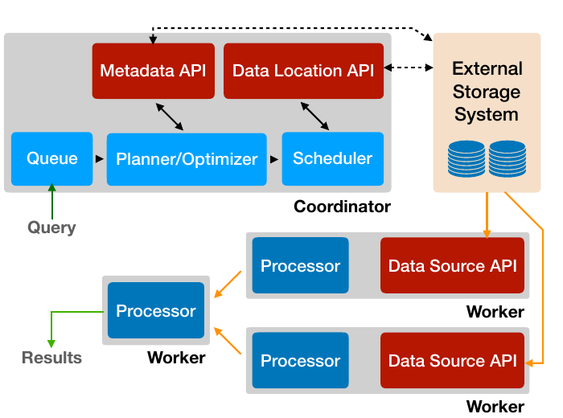
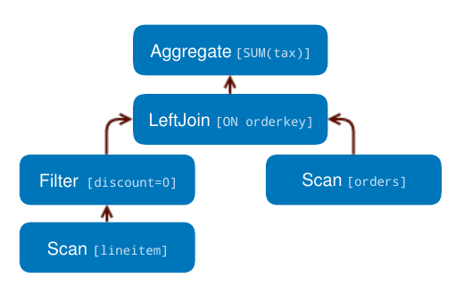
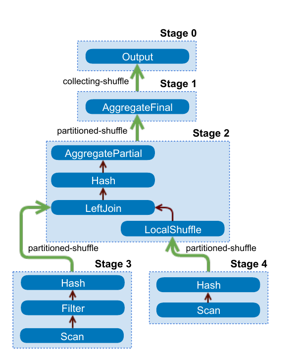
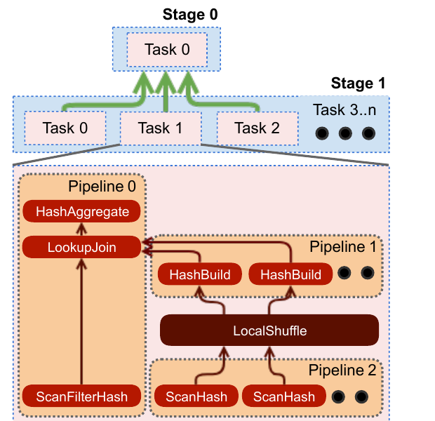
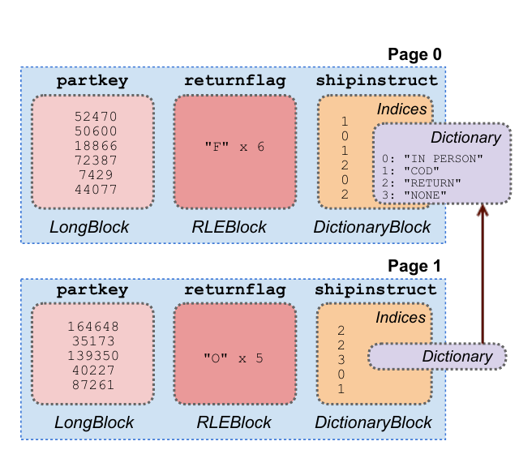
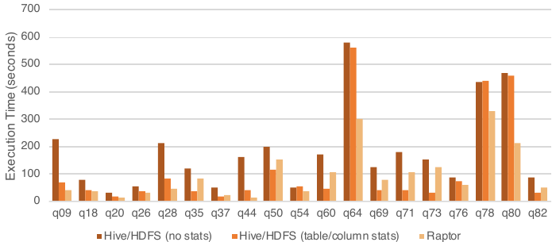
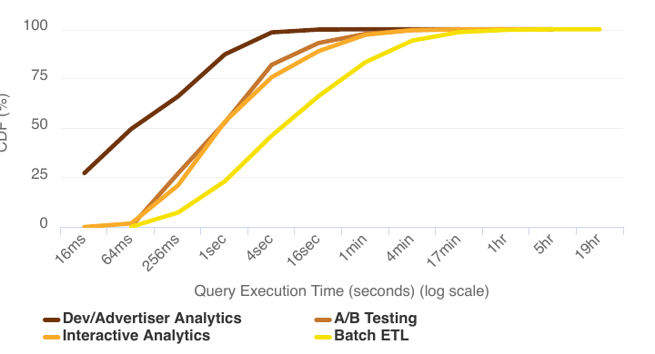
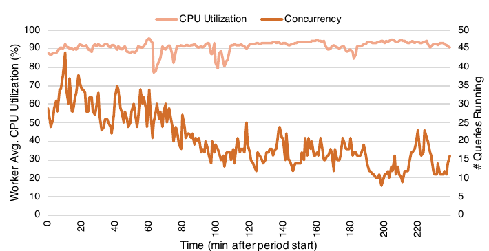

# Presto: SQL on Everything（中文译文）

## 译者说明

本文依据同目录的 `source.pdf` 翻译。章节、图表、公式、算法、代码与参考文献按原文结构保留。

Raghav Sethi、Martin Traverso、Dain Sundstrom、David Phillips、Wenlei Xie、Yutian Sun、Nezih Yigitbasi、Haozhun Jin、Eric Hwang、Nileema Shingte、Christopher Berner

Facebook, Inc.

Martin Traverso、Dain Sundstrom、David Phillips、Nileema Shingte 和 Christopher Berner 在贡献期间供职于 Facebook, Inc.

## 摘要

Presto 是一个开源分布式查询引擎，承担 Facebook 很大一部分 SQL 分析工作负载。Presto 的设计目标是自适应、灵活和可扩展。它支持特征各异的多种用例：既有要求亚秒级延迟、直接面向用户的报表应用，也有聚合或连接数 TB 数据、持续数小时的 ETL 作业。Presto 的 Connector API 允许插件为数十种数据源提供高性能 I/O 接口，包括 Hadoop 数据仓库、RDBMS、NoSQL 系统和流处理系统。本文首先概述 Presto 在 Facebook 支持的一组用例，随后介绍其架构与实现，并指出使其能够支持这些用例的功能和性能优化。最后，本文给出性能结果，展示主要设计决策的影响。

**索引词：** SQL；查询引擎；大数据；数据仓库。

## I. 引言

从海量数据中快速、方便地提取洞见，对技术驱动型组织日益重要。随着收集和存储大量数据的成本下降，查询这些数据的工具需要变得更快、更易用且更灵活。使用 SQL 这样的流行查询语言，可以让组织内更多人开展数据分析。然而，如果组织不得不部署多套互不兼容的类 SQL 系统，分别解决不同类别的分析问题，易用性就会受到损害。

Presto 是一个开源分布式 SQL 查询引擎，自 2013 年起在 Facebook 的生产环境中运行；如今 Uber、Netflix、Airbnb、Bloomberg 和 LinkedIn 等多家大型企业也在使用。Qubole、Treasure Data 和 Starburst Data 等组织提供基于 Presto 的商业产品。Amazon Athena[^1] 交互式查询服务建立在 Presto 之上。Presto 在 GitHub 上已有一百多名贡献者，形成了强大的开源社区。

Presto 的设计目标是自适应、灵活和可扩展。它提供 ANSI SQL 接口，可查询存储在 Hadoop 环境、开源和专有 RDBMS、NoSQL 系统以及 Kafka 等流处理系统中的数据。借助“通用 RPC”[^2] connector，只需实现大约六个 RPC 端点，就能很容易地为专有系统添加 SQL 接口。Presto 对外提供开放的 HTTP API，附带 JDBC 支持，并与多种行业标准的商业智能（BI）工具和查询编写工具兼容。内置 Hive connector 可以直接读写 HDFS、Amazon S3 等分布式文件系统，还支持 ORC、Parquet、Avro 等常用开源文件格式。

截至 2018 年末，Presto 承担 Facebook 很大一部分 SQL 分析工作负载，包括交互式/BI 查询以及长时间运行的批量抽取-转换-装载（ETL）作业。此外，Presto 还为多种面向最终用户的分析工具提供动力，服务高性能仪表盘，为多个内部 NoSQL 系统提供 SQL 接口，并支撑 Facebook 的 A/B 测试基础设施。总体而言，Presto 每天在 Facebook 处理数百 PB 数据和数千万亿行记录。

Presto 有以下几个显著特征：

- 它是一套自适应多租户系统，能够并发运行数百个内存密集、I/O 密集和 CPU 密集的查询，扩展到数千个工作节点，并高效利用集群资源。
- 它采用可扩展的联邦式设计，管理员可以建立能够处理多个不同数据源的集群，甚至可以在一条查询中访问这些数据源。这降低了集成多个系统的复杂度。
- 它很灵活，可以配置成支持约束和性能特征截然不同的广泛用例。
- 它面向高性能而构建，包含代码生成等多项相互关联的关键功能和优化。多个运行中的查询会共享工作节点上一个长生命周期的 Java 虚拟机（JVM）进程，由此缩短响应时间，但也要求集成调度、资源管理和隔离机制。

本文的主要贡献是描述 Presto 引擎的设计，并讨论实现上述特征所需的具体优化与权衡。次要贡献包括：针对若干关键设计决策和优化给出性能结果，以及总结开发和维护 Presto 过程中获得的经验。

Presto 最初用于在 Facebook 数据仓库上实现交互式查询，后来逐渐支持多种不同用例；第 II 节介绍其中几个。本文不研究这段演化过程，而是描述论文撰写时的引擎和用例，并结合用例指出主要功能。其余部分安排如下：第 III 节概述架构；第 IV 节深入系统设计；第 V 节介绍若干重要性能优化；第 VI 节给出性能结果；第 VII 节说明开发 Presto 获得的工程经验；第 VIII 节概述关键相关工作；第 IX 节作结。Presto 仍处于活跃开发中，经常加入重要新功能。本文描述的是 2018 年 9 月发布的 0.211 版本。

[^1]: <https://aws.amazon.com/athena>
[^2]: 这里使用 Thrift；它是一种用于以多种语言定义和创建服务的接口定义语言及 RPC 协议。

## II. 用例

Facebook 运行着许多 Presto 集群，最大规模约 1000 个节点，并支持多种用例。本节选择四种部署规模较大、差异明显的用例并说明其需求。

### A. 交互式分析

Facebook 把一个大型多租户数据仓库作为内部服务运行，多个业务职能部门和组织单元共享较少的一组托管集群。数据存放在分布式文件系统中，元数据存放在单独的服务中；二者的 API 分别类似于 HDFS 和 Hive metastore 服务。本文称其为“Facebook 数据仓库”，并使用 Presto “Hive” connector 的一个变体来读写它。

Facebook 工程师和数据科学家经常检查少量数据（压缩后约 50 GB-3 TB）、检验假设，并构建可视化或仪表盘。用户通常依赖查询编写工具、BI 工具或 Jupyter notebook。单个集群需要支持 50-100 条形态各异的并发运行查询，并在数秒或数分钟内返回结果。用户对端到端墙钟时间非常敏感，却未必能够准确判断查询所需资源。开展探索式分析时，用户可能不需要返回完整结果集；查询往往在返回初步结果后就被取消，或者使用 `LIMIT` 子句限制系统应生成的结果数据量。

### B. 批量 ETL

上述数据仓库通过 ETL 查询定期写入新鲜数据。查询由工作流管理系统调度；该系统确定任务之间的依赖关系并据此安排任务。Presto 支持用户从旧式批处理系统迁移；按 CPU 用量计算，ETL 查询如今占 Facebook Presto 工作负载的很大一部分。这些查询通常由数据工程师编写和优化，往往比交互式分析查询更加耗费资源，且经常执行 CPU 密集的转换，以及占用大量内存（数 TB 分布式内存）的聚合或与其他大表的连接。与资源效率和集群总吞吐量相比，查询延迟的重要性稍低。

### C. A/B 测试

Facebook 使用 A/B 测试，通过统计假设检验评估产品变更的影响；其大部分 A/B 测试基础设施建立在 Presto 之上。用户希望测试结果在数小时内而不是数天后可用，并要求数据完整、准确。用户还需要以交互式延迟（约 5-30 秒）对结果任意切片和切块，以获得更深入的洞见。预聚合很难满足这一要求，因此结果必须即时计算。生成结果需要连接多个大型数据集，其中包含用户、设备、测试和事件属性。由于查询由程序生成，查询形态局限于一个较小集合。

### D. 开发者/广告主分析

Presto 支撑着多个面向外部开发者和广告主的定制报表工具。Facebook Analytics[^3] 是该用例的一项部署，它向使用 Facebook 平台构建应用的开发者提供高级分析工具。这些部署通常提供 Web 界面，生成形态受限的查询。总体数据量很大，但查询具有很高的选择性，因为用户只能访问自己的应用或广告的数据。大多数查询形态包含连接、聚合或窗口函数。数据摄取延迟为分钟级。工具需要具备交互性，因此查询延迟要求非常严格，约为 50 毫秒-5 秒。考虑到用户规模，集群必须达到 99.999% 可用性，并支持数百条并发查询。

[^3]: <https://analytics.facebook.com>

## III. 架构概览

Presto 集群由一个 coordinator 节点和一个或多个 worker 节点组成。Coordinator 负责查询准入、解析、规划和优化，以及查询编排；worker 节点负责查询处理。图 1 是 Presto 架构的简化视图。



客户端向 coordinator 发送包含 SQL 语句的 HTTP 请求。Coordinator 通过评估队列策略、解析和分析 SQL 文本、创建并优化分布式执行计划来处理请求。

Coordinator 把计划分发给 worker，启动任务（task），然后开始枚举 split。Split 是外部存储系统中某个可寻址数据块的不透明句柄，被分配给负责读取相应数据的任务。

运行这些任务的 worker 节点从外部系统获取数据来处理 split，或者处理中间结果由其他 worker 生成的结果。Worker 使用协作式多任务并发处理多条查询的任务。执行过程尽可能流水线化；数据一旦可用，便在任务之间流动。对于某些查询形态，Presto 可以在处理完所有数据之前返回结果。只要可能，中间数据和状态都保存在内存中。在节点之间重分布数据时，系统会调节缓冲机制以尽量降低延迟。

Presto 面向可扩展性而设计，提供用途广泛的插件接口。插件可以提供自定义数据类型、函数、访问控制实现、事件消费者、排队策略和配置属性。更重要的是，插件还提供 connector，使 Presto 能通过 Connector API 与外部数据存储通信。Connector API 由四部分构成：Metadata API、Data Location API、Data Source API 和 Data Sink API。这些 API 的设计目标，是让 connector 在物理分布式执行引擎环境中实现高性能。开发者已为 Presto 主仓库贡献十多种 connector，此外还有若干专有 connector。

## IV. 系统设计

本节介绍 Presto 引擎的一些关键设计决策和功能。我们先说明 Presto 支持的 SQL 方言，然后沿查询生命周期，从客户端一直追踪到分布式执行；还将介绍使 Presto 支持多租户的部分资源管理机制，最后简要讨论容错。

### A. SQL 方言

Presto 严格遵循 ANSI SQL 规范 [2]。尽管引擎并未实现规范描述的每一项功能，已经实现的功能都尽可能符合规范。为提高易用性，我们谨慎选择了少量语言扩展。例如，在 ANSI SQL 中操作 map 和 array 等复杂数据类型很困难。为了简化对这些常用数据类型的操作，Presto 语法支持匿名函数（lambda 表达式）和内置高阶函数，例如 `transform`、`filter` 和 `reduce`。

### B. 客户端接口、解析和规划

#### 1）客户端接口

Presto coordinator 主要向客户端提供 RESTful HTTP 接口，并附带一流的命令行接口。Presto 还提供 JDBC 客户端，因此能够兼容 Tableau、MicroStrategy 等多种 BI 工具。

#### 2）解析

Presto 使用基于 ANTLR 的解析器把 SQL 语句转换成语法树。分析器借助这棵树确定类型和类型强制转换、解析函数及作用域，并提取子查询、聚合和窗口函数等逻辑组件。

#### 3）逻辑规划

逻辑规划器利用语法树和分析信息生成中间表示（IR），编码形式是一棵由计划节点组成的树。每个节点代表一项物理或逻辑操作，计划节点的子节点就是其输入。规划器生成的节点完全是逻辑性的，即不包含计划应当如何执行的信息。考虑以下简单查询：

```sql
SELECT
    orders.orderkey, SUM(tax)
FROM orders
LEFT JOIN lineitem
    ON orders.orderkey = lineitem.orderkey
WHERE discount = 0
GROUP BY orders.orderkey
```

该查询的逻辑计划如图 2 所示。



### C. 查询优化

计划优化器把逻辑计划转换成更物理化的结构，表示查询的一种高效执行策略。其工作方式是贪心地评估一组转换规则，直至达到不动点。每条规则都有一个能够匹配查询计划子树的模式，并决定是否应用转换；转换结果是逻辑等价的子计划，用于替换匹配目标。Presto 包含多条规则，其中有谓词和 limit 下推、列裁剪、去相关等常见优化。

我们正在增强优化器，依据 Cascades 框架 [13] 引入的技术对计划进行基于代价的评估，从而更全面地探索搜索空间。不过，Presto 已经支持两种会考虑表统计和列统计的基于代价优化：连接策略选择和连接重排。本文只讨论优化器的几项功能；全面介绍超出本文范围。

#### 1）数据布局

当 connector 通过 Data Layout API 提供数据的物理布局时，优化器可以利用该布局。Connector 会报告位置和其他数据属性，例如分区、排序、分组及索引。同一张表可以由 connector 返回多个属性不同的布局，优化器则为查询选择效率最高的布局 [15, 19]。运营开发者/广告主分析集群的管理员使用这项功能；只需增加物理布局，他们就能优化新的查询形态。后续各节还会介绍引擎利用这些属性的其他方式。

#### 2）谓词下推

优化器可以与 connector 协作，判断何时把范围谓词和等值谓词经由 connector 下推能够提高过滤效率。

例如，开发者/广告主分析用例采用一个建立在分片 MySQL 之上的专有 connector。该 connector 把数据划分为存放在各个 MySQL 实例中的分片，并能把范围谓词或点谓词一直下推到单个分片，保证从 MySQL 读取的只有匹配数据。存在多个布局时，引擎选择在谓词列上建有索引的布局。开发者/广告主分析工具采用的过滤器具有很高选择性，因此高效的索引过滤非常重要。对于交互式分析和批量 ETL 用例，Presto 以类似方式利用 Hive connector 的分区裁剪和文件格式功能（第 V-C 节）来提高性能。

#### 3）节点间并行

优化过程的一部分，是识别计划中能够跨 worker 并行执行的部分。这些部分称为“stage”；每个 stage 被分发为一个或多个 task，每个 task 对不同的输入数据集合执行相同计算。引擎在 stage 之间插入带缓冲的内存数据传输（shuffle），以交换数据。Shuffle 会增加延迟、占用缓冲内存并产生很高的 CPU 开销。因此，优化器必须慎重考虑计划中插入的 shuffle 总数。图 3 展示一种朴素实现如何把计划划分为 stage，并用 shuffle 将其连接。



**数据布局属性。** 优化器可以利用物理数据布局，尽量减少计划中的 shuffle 数。这对 A/B 测试用例非常有用，因为几乎每条查询都要执行大型连接，以产生实验细节或群体信息。引擎利用参与连接的两张表按同一列分区这一事实，采用共置连接策略，消除耗费大量资源的 shuffle。

如果 connector 暴露的数据布局把连接列标记为索引，优化器便能判断索引嵌套循环连接是否合适。通过把数据仓库中存储的规范化数据与生产数据存储（键值存储或其他形式）连接起来，这项能力可以实现极高的操作效率；交互式分析用例经常使用它。

**节点属性。** 与 connector 类似，计划树中的节点可以表达其输出属性，即数据的分区、排序、分桶和分组特征 [24]。这些节点还可以表达引入 shuffle 时需要考虑的必需属性和偏好属性。多余的 shuffle 会直接省略；在其他情况下，系统可以改变 shuffle 的属性来减少所需 shuffle 数。Presto 会贪心地选择满足尽可能多必需属性的分区方式，从而减少 shuffle。这意味着优化器可能选择在较少的列上分区，某些情况下会造成更严重的分区倾斜。例如，把这项优化应用到图 3 的计划后，计划会折叠为单一数据处理 stage。

#### 4）节点内并行

优化器使用类似机制，识别计划 stage 中适合在单个节点的多个线程间并行化的部分。节点内并行远比节点间并行高效，因为它几乎没有延迟开销，而且状态（例如哈希表和字典）可以在线程间高效共享。增加节点内并行能够显著加速执行，尤其适合并发度限制下游 stage 吞吐量的查询形态：

- 交互式分析会运行许多一次性的短查询，用户通常不会花时间优化这些查询。因此分区倾斜很常见，其成因可能是数据的固有属性，也可能是常见查询模式，例如按用户国家分组，同时只筛选少数几个国家。这通常表现为大量数据按哈希分区到少量节点上。
- 批量 ETL 作业往往在很少过滤或完全不过滤的情况下转换大型数据集。在这些场景中，树上层涉及的少量节点可能不足以快速处理叶 stage 生成的数据量。任务调度见第 IV-D2 节。

在这两种场景中，每个 worker 使用多个线程执行计算，可以在一定程度上缓解并发瓶颈。引擎能够用多个线程运行同一个算子序列，即同一条 pipeline。图 4 展示优化器如何把连接的一部分并行化。



### D. 调度

Coordinator 以可执行 task 的形式把计划 stage 分发给 worker；task 可以看作单个处理单元。接着，coordinator 用 shuffle 把一个 stage 中的 task 与其他 stage 中的 task 相连，形成一棵相互连接的处理器树。数据一旦可用，就从一个 stage 流向下一个 stage。

一个 task 内可以有多条 pipeline。一条 pipeline 由一串 operator 组成，每个 operator 在数据上执行单一且定义明确的计算。例如，执行哈希连接的 task 至少必须包含两条 pipeline：一条构建哈希表（构建 pipeline），另一条从探测端以流式方式读取数据并执行连接（探测 pipeline）。当优化器判断 pipeline 的一部分可以受益于更高的本地并行度时，就能拆分这条 pipeline，并独立并行化相应部分。图 4 中，构建 pipeline 被拆成两条 pipeline：一条扫描数据，另一条构建哈希表分区；两者通过本地内存 shuffle 相连。

为了执行查询，引擎需要作出两组调度决策：第一组决定 stage 的调度顺序；第二组决定应调度多少 task，以及把它们放到哪些节点。

#### 1）Stage 调度

Presto 支持两种 stage 调度策略：一次全部调度（all-at-once）和分阶段调度（phased）。一次全部调度会并发调度执行过程中的所有 stage，数据可用后立即处理，从而尽量缩短墙钟时间。该策略有利于交互式分析、开发者/广告主分析和 A/B 测试等延迟敏感型用例。分阶段执行会找出有向数据流图中为避免死锁而必须同时启动的所有强连通分量，并按拓扑顺序执行这些分量。例如，以分阶段模式执行哈希连接时，只有哈希表构建完成后，调度器才会调度对左侧数据进行流式处理的 task。这能大幅提高批量分析用例的内存效率。

当调度器依据策略判定某个 stage 应被调度时，便开始把该 stage 的 task 分配给 worker 节点。

#### 2）Task 调度

Task 调度器检查计划树，把 stage 分为叶 stage 和中间 stage。叶 stage 从 connector 读取数据；中间 stage 只处理其他 stage 生成的中间结果。

**叶 stage。** 对于叶 stage，task 调度器将 task 分配给 worker 节点时，会考虑网络和 connector 施加的约束。例如，无共享部署要求 worker 与存储节点共置；调度器会利用 Connector Data Layout API 在这种条件下决定 task 放置位置。A/B 测试用例要求可预测的高吞吐、低延迟数据读取；Raptor connector 能够满足这一要求。Raptor 是为 Presto 优化的存储引擎，采用无共享架构，把 ORC 文件存放在闪存盘上，把元数据存放在 MySQL 中。

性能分析显示，在各生产集群中，大部分 CPU 时间用于解压、解码、过滤和转换从 connector 读取的数据。这类工作非常容易并行，因此让这些 stage 在尽可能多的节点上运行，通常能得到最短的墙钟时间。所以，如果不存在约束且数据能够划分为足够多的 split，系统会在集群的每个 worker 节点上调度一个叶 stage task。Facebook 数据仓库以共享存储模式部署，即全部数据都位于远端；集群的每个节点通常都会参与叶 stage 的处理。这种执行策略可能大量占用网络。

调度器还可以利用插件提供的层次结构推断网络拓扑，以优化读取。Facebook 受网络约束的部署可以通过该机制向引擎表达“优先机架内读取而非跨机架读取”的偏好。

**中间 stage。** 中间 stage 的 task 可以放置到任意 worker 节点。不过，引擎仍需决定每个 stage 应调度多少 task；该决策依据 connector 配置、计划属性、所需数据布局和其他部署配置作出。有些情况下，引擎可以在执行期间动态改变 task 数量；第 IV-E3 节给出一种这样的场景。

#### 3）Split 调度

叶 stage 中的 task 在 worker 节点上开始执行时，该节点就可以接收一个或多个 split（见第 III 节）。Split 中包含的信息随 connector 而异。从分布式文件系统读取时，split 可能由文件路径和文件某一区域的偏移量组成；对于 Redis 键值存储，split 包含表信息、键和值的格式、待查询主机列表等内容。

叶 stage 中每个 task 都必须分配到至少一个 split，才能具备运行条件。中间 stage 的 task 始终可以运行，只有被中止或全部上游 task 完成时才会结束。

**Split 分配。** Task 在 worker 节点上建立后，coordinator 开始向其分配 split。Presto 让 connector 以小批次枚举 split，再惰性地把 split 分配给 task。这是 Presto 的一项重要功能，具有以下益处：

- 查询响应时间与 connector 枚举大量 split 所需的时间解耦。例如，Hive connector 枚举分区并列出每个分区目录中的文件，可能需要数分钟。
- 无需处理全部数据即可开始生成结果的查询，例如只进行过滤选择的查询，常在很短时间内被取消，或在满足 `LIMIT` 子句后提前结束。在交互式分析用例中，查询甚至经常在所有 split 枚举完毕之前就已结束。
- Worker 为分配给自己的 split 维护一个处理队列。Coordinator 只需把新 split 分配给队列最短的 task。保持小队列能让系统适应不同 split 的 CPU 处理成本差异，以及 worker 之间的性能差异。
- 查询无需把自己的全部元数据都保存在内存中即可执行。这对 Hive connector 很重要，因为查询可能访问数百万个 split，很容易耗尽 coordinator 的可用内存。

这些功能对运行在 Facebook Hive 兼容数据仓库上的交互式分析和批量 ETL 用例尤其有用。需要指出的是，惰性 split 枚举会使准确估计和报告查询进度变得困难。

### E. 查询执行

#### 1）本地数据流

Split 被分配给线程后，由 driver loop 执行。Presto 的 driver loop 比流行的 Volcano 递归迭代器（pull）模型 [1] 更复杂，但提供了重要能力。它更适合协作式多任务：operator 可以在让出线程前迅速进入已知状态，而不必无限期阻塞。Driver 还可以在无需额外输入就能继续推进的 operator 之间移动数据，例如继续执行耗费大量资源或会爆发式扩张的转换，从而让每个时间片完成尽可能多的工作。循环每次迭代都会在所有能够推进的 operator 对之间移动数据。

Driver loop 操作的数据单元称为 page，它是行序列的列式编码。Connector Data Source API 收到 split 后会返回 page；operator 通常消费输入 page、执行计算并生成输出 page。图 5 展示 page 在内存中的结构。Driver loop 不断在 operator 之间移动 page，直到调度时间片结束（见第 IV-F1 节），或者所有 operator 都无法继续推进。

#### 2）Shuffle

Presto 的设计目标是在最大化资源利用率的同时尽量降低端到端延迟；节点间数据流机制也体现了这一选择。Presto 使用基于 HTTP 的带缓冲内存 shuffle 交换中间结果。Task 生成的数据存入缓冲区，供其他 worker 消费；worker 使用 HTTP 长轮询从其他 worker 请求中间结果。服务器会保留数据，直到客户端使用前一次响应中发送的 token 请求下一段，因此确认机制隐含在传输协议中。长轮询能尽量缩短响应时间，尤其是在传输少量数据时。与把 shuffle 数据持久化到磁盘的系统 [4, 21] 相比，这种机制延迟低得多，使 Presto 能支持开发者/广告主分析等延迟敏感型用例。

引擎会调节并行度，使输入和输出缓冲区维持目标利用率。输出缓冲区已满会导致 split 执行停滞并占用宝贵内存，输入缓冲区利用不足则会产生不必要的处理开销。

引擎持续监控输出缓冲区利用率。如果利用率持续偏高，就通过减少有资格运行的 split 数降低有效并发度，使网络资源共享更加公平。在客户端（最终用户或其他 worker）无法以数据生成速率消费数据时，这也是一项重要的效率优化。没有这项功能，运行复杂多 stage 查询的慢客户端可能长期占用数十 GB 缓冲内存。交互式分析中，即使只有少量结果数据（约 10-50 MB）通过慢速连接下载到 BI 工具或查询编写工具，这种场景也很常见。

在接收端，引擎监控每次请求传输数据量的移动平均值，由此计算目标 HTTP 请求并发度，使输入缓冲区保持填充而不超出容量。这种反压会让上游 task 随缓冲区填满而减速。

#### 3）写入

ETL 作业通常会产生必须写入其他表的数据。在远程存储环境中，影响写入性能的重要因素是执行写入时的并发度，即经由 Connector Data Sink API 写入数据的总线程数。

考虑一个配置为使用 Amazon S3 存储的 Hive connector。每次并发写入 S3 都会创建一个新文件；如果用数百次写入来写入总量不大的数据，很可能产生许多小文件。除非这些小数据单元之后能被合并，否则读取时很可能产生不可接受的高开销：大量缓慢的元数据操作和受延迟制约的读取性能。另一方面，并发度太低又可能使总写入吞吐量降至不可接受的水平。

Presto 再次采用自适应方法：当引擎判断为写入生成数据的 stage 超出缓冲区利用率阈值，以及可配置的单 writer 已写数据阈值时，会在更多 worker 节点上增加 task，动态提高 writer 并发度。对于写入密集的批量 ETL 用例，这是一项重要的效率优化。

### F. 资源管理

Presto 很适合多租户部署，一个关键原因是它含有完全集成的细粒度资源管理系统。单个集群可以并发执行数百条查询，并尽可能充分利用 CPU、I/O 和内存资源。

#### 1）CPU 调度

Presto 主要优化集群总体吞吐量，即用于处理数据的 CPU 总量。本地（节点级）调度器还会尽量缩短计算成本低的查询的周转时间，并让 CPU 需求相近的查询公平共享 CPU 资源。Task 的资源使用量，是其所有 split 获得的线程 CPU 时间之和。为尽量降低协调开销，Presto 在 task 层跟踪 CPU 资源用量，并在本地作出调度决策。

Presto 在每个 worker 节点上调度许多并发 task，以实现多租户，并采用协作式多任务模型。任意一个 split 一次最多只能在线程上运行一个一秒时间片，随后必须让出线程并返回队列。当输出缓冲区已满（下游 stage 消费不够快）、输入缓冲区为空（上游 stage 生成数据不够快）或系统内存不足时，本地调度器甚至会在时间片尚未结束时就改去处理另一 task。这样会为可运行的 split 释放线程，帮助 Presto 最大化 CPU 利用率，并高度自适应不同的查询形态。所有用例都能受益于这种细粒度资源效率。

Split 让出线程后，引擎需要决定下一步运行哪个 task；一个 task 关联一个或多个 split。Presto 不会预先预测完成新查询需要的资源，而是直接根据 task 的累计 CPU 时间，把它归入多级反馈队列 [8] 的五个级别之一。Task 累积的 CPU 时间越多，就会迁移到越高的级别。每个级别都分配到可用 CPU 时间的一个可配置比例。

实践中，很难在任意工作负载下实现公平的协作式多任务。Split 的 I/O 与 CPU 特性差异很大，有时甚至同一 task 内也如此；复杂函数（如正则表达式）相对其他 split 可能消耗过多线程时间。一些 connector 没有提供异步 API，worker 线程可能被占用数分钟。

调度器处理这些约束时必须具有自适应性。系统提供低成本的 yield 信号，使长时间运行的计算可以在 operator 内停止。如果 operator 超过时间片，调度器就把实际线程时间“记账”到该 task，并暂时减少其后续执行次数。这种自适应行为使 Presto 能应对交互式分析和批量 ETL 中形态多样的查询；系统优先处理资源消耗最低的查询。该选择反映出一种认识：用户希望廉价查询快速完成，而不太在意规模更大、计算成本更高的作业需要多久。即使以更多上下文切换为代价，并发运行更多查询也能降低总排队时间，因为短查询会迅速离开系统。

#### 2）内存管理

内存是 Presto 这类多租户系统面临的主要资源管理挑战之一。本节介绍引擎控制集群内存分配的机制。

**内存池。** Presto 中所有非微不足道的内存分配都必须归类为用户内存或系统内存，并在相应内存池中预留。用户内存是仅凭系统或输入数据的基础知识就能让用户推断的内存用量，例如聚合的内存用量与其基数成正比。系统内存则主要是实现决策的副产品，例如 shuffle 缓冲区，可能与查询形态和输入数据量无关。

引擎分别限制用户内存和总内存（用户内存加系统内存）；超出全局限制（跨 worker 聚合）或单节点限制的查询会被终止。当节点耗尽内存时，系统停止 task 的处理，从而阻塞查询内存预留。总内存上限通常远高于用户内存上限，生产环境中只有少量查询会超过总上限。

查询的单节点用户内存上限与全局用户内存上限通常不同，从而允许一定程度的最大倾斜。考虑一个 500 节点集群，每个节点有 100 GB 查询内存，并要求单条查询在全局最多使用 5 TB。在这种情况下，10 条查询可以并发分配到这么多总内存。但如果要允许 2:1 的倾斜，即查询的一个分区消耗中位数两倍的内存，则单节点查询内存上限必须设置为 20 GB。这意味着只有 5 条查询能保证在不耗尽节点可用内存的情况下运行。

在 500 节点的交互式分析或批量 ETL 集群上，并发运行超过 5 条查询很重要。由于这些集群中的查询在内存特征上差异很大，包括倾斜、分配速率和分配的时间局部性，5 条查询不太可能在某个时刻同时在同一个 worker 节点上分配至各自上限。因此，只要存在节点内存不足时维持集群健康的机制，通常可以安全地超额承诺集群内存。Presto 有两种这样的机制：spill 和预留池。

**Spill。** 节点耗尽内存时，引擎按符合条件的 task 的执行时间升序，对其调用内存撤销过程；一旦有足够内存满足最后一项请求便停止。撤销通过把状态 spill 到磁盘来完成。Presto 支持对哈希连接和聚合进行 spill。不过，Facebook 的所有部署都没有配置 spill。集群通常足够大，能够提供数 TB 分布式内存；用户重视完全内存内执行的可预测延迟；本地磁盘还会增加硬件成本，在 Facebook 的共享存储部署中尤其如此。

**预留池。** 如果节点耗尽内存，而集群未配置 spill 或已无可撤销内存，就用预留内存机制解除集群阻塞。每个节点的查询内存池进一步分成通用池和预留池。当某个 worker 节点的通用池耗尽时，该 worker 上使用内存最多的查询会在所有 worker 节点上“晋升”到预留池。此时，为该查询分配的内存计入预留池而非通用池。为防止不同 worker 阻塞不同查询而形成死锁，整个集群一次只能有一条查询进入预留池。如果预留池已被占用时某个节点的通用池耗尽，该节点上来自其他 task 的全部内存请求都会停滞。查询在预留池中一直运行到完成，之后集群解除所有未完成内存请求的阻塞。这有些浪费，因为每个节点的预留池都必须足够容纳触及本地内存上限的查询。集群也可以配置为改去终止能够解除最多节点阻塞的那条查询。

### G. 容错

Presto 能通过底层重试从许多瞬时错误中恢复。不过，截至 2018 年末，Presto 对 coordinator 或 worker 节点崩溃还没有真正有效的内置容错能力。Coordinator 故障会使集群不可用；worker 节点崩溃则会使该节点上运行的全部查询失败。Presto 依靠客户端自动重试失败查询。

在 Facebook 生产环境中，我们根据用例，利用外部编排机制以不同可用性模式运行集群。交互式分析和批量 ETL 用例使用备用 coordinator，A/B 测试和开发者/广告主分析则运行多个活跃集群。外部监控系统识别造成异常多故障的节点并将其移出集群；节点经自动修复后会重新加入。各机制都能在不同程度上缩短不可用时间，却无法完全掩盖故障。

标准 checkpoint 或部分恢复技术计算成本很高，而且在一个数据可用后就会立即流式返回客户端的系统中难以实现。基于复制的容错机制 [6] 也会消耗大量资源。考虑到成本、节点平均故障间隔、约 1000 节点的集群规模，以及显示大多数查询（包括批量 ETL）都会在数小时内完成的遥测数据，这些技术的预期价值尚不明确。其他研究者也得出类似结论 [17]。

不过，我们正积极改进长时间运行查询的容错能力，评估增加可选 checkpoint，并把重启范围限制在计划中无法以流水线方式运行的子树。

## V. 查询处理优化

本节介绍几项对大多数用例都有益的重要查询处理优化。

### A. 与 JVM 协同

Presto 以 Java 实现，运行在 HotSpot Java 虚拟机（JVM）上。要让实现获得尽可能好的性能，就必须利用底层平台的优势，同时适应其局限。数据压缩或校验和算法等性能敏感代码可以受益于特定优化或 CPU 指令。应用层虽然无法控制 JVM 即时（JIT）编译器如何生成机器码，却可以调整代码结构，以利用 JIT 编译器提供的方法内联、循环展开和 intrinsic 等优化。对于 JVM 无法生成最优机器码的场景，例如 128 位数学运算，我们正在探索使用 Graal [22]。

垃圾回收（GC）算法的选择会显著影响应用性能，甚至左右应用的实现选择。Presto 使用 G1 收集器；它不擅长处理超过一定大小的对象。为限制此类对象数量，Presto 避免分配大于“humongous”阈值的对象或缓冲区，必要时使用分段数组。高度互连的大型对象图也会因 G1 需要维护 remembered set 结构而带来问题 [10]。查询执行关键路径上的数据结构建立在扁平内存数组之上，以减少引用数和对象数，减轻 GC 的工作。例如，`HISTOGRAM` 聚合不是为每个直方图维护独立对象，而是用一组扁平数组和哈希表存储所有分组的桶键与计数。

### B. 代码生成

引擎的一项主要性能功能是面向 JVM 字节码的代码生成，它有两种形式。

#### 1）表达式求值

查询引擎的性能部分取决于其计算复杂表达式的速度。Presto 包含一个能计算任意复杂表达式的表达式解释器，并将其用于测试；但在生产环境中对数十亿行求值，它实在太慢。为提高速度，Presto 生成字节码，直接处理常量、函数调用、变量引用以及惰性或短路操作。

#### 2）针对 JIT 优化器启发式规则

Presto 为若干关键 operator 及 operator 组合生成字节码。生成器利用引擎对计算语义更深入的了解，生成比通用处理循环更适合 JIT 优化的字节码。生成器主要针对三种行为：

- 引擎会在每个时间片于不同 task pipeline 的不同 split 间切换（第 IV-F1 节）。如果使用常见的循环式实现，JIT 将无法优化它，因为紧凑处理循环收集到的性能分析信息会被其他 task 或查询污染。
- 即使在单一 task pipeline 的处理循环中，引擎也知道每项计算涉及的类型，并能针对列生成展开循环。消除循环体内目标类型的变化后，profiler 会断定调用点是单态的，因而可以内联虚方法。
- 为每个 task 生成的字节码会编译成独立的 Java 类，因此 JIT 优化器可以独立分析每一个类。实际上，JIT 优化器会让引擎为查询生成的定制程序进一步适应实际处理的数据。每个 task 的性能分析相互独立，因此在每个 task 处理不同数据分区的环境中能够提高性能。此外，随着数据（例如时序数据或日志）变化，性能特征在 task 生命周期内也可能改变，从而触发生成代码的更新。

生成的字节码还受益于内联的二阶效应。JVM 能扩大优化范围、自动向量化更多计算，并利用基于频率的基本块布局尽量减少分支；CPU 分支预测也变得高效得多 [7]。字节码生成还提高了引擎把中间结果存放在寄存器或缓存而非内存中的能力 [16]。

### C. 文件格式功能

Scan operator 使用叶 split 信息调用 Connector API，并以 page 形式接收列式数据。一个 page 由 block 列表组成，每个 block 是一个采用扁平内存表示的列。使用扁平内存数据结构对性能很重要，尤其对于复杂类型；指针追逐、拆箱和虚方法调用会给紧凑循环增加显著开销。

Hive 和 Raptor 等 connector 会尽可能利用特定文件格式的功能 [20]。Presto 附带一些定制文件格式 reader，能利用文件头/尾中的统计信息，例如最小-最大范围头和 Bloom filter，高效跳过数据区段。这些 reader 能把某些形式的压缩数据直接转换成 block，引擎可以高效操作这些 block（第 V-E 节）。

图 5 展示一个 page 的布局，其中每列采用一种压缩编码方案。字典编码 block 能有效压缩低基数数据区段，游程编码（RLE）block 则压缩重复数据。多个 page 可以共享一个字典，从而显著提高内存效率。ORC 文件中的一列可以为整个 stripe（最多数百万行）使用同一个字典。



### D. 惰性数据加载

Presto 支持数据的惰性物化，可以利用 ORC、Parquet 和 RCFile 等文件格式的列式压缩特征。Connector 可以生成 lazy block，只有 cell 实际被访问时才读取、解压和解码数据。由于很大一部分 CPU 时间花在解压和解码上，而 filter 又经常具有很高选择性，当列很少被访问时，这项优化非常有效。对批量 ETL 用例的一份生产工作负载样本进行测试表明，惰性加载使获取的数据量减少 78%、加载的 cell 数减少 22%、总 CPU 时间减少 14%。

### E. 直接操作压缩数据

只要可能，Presto 就直接操作来自 connector 的压缩数据，即字典编码和游程编码 block。图 5 展示这些 block 在 page 中的组织方式。当负责计算转换或 filter 的 page processor 遇到字典 block 时，它会处理字典中的全部值；遇到游程编码 block 时，则处理唯一值。这使引擎可以用快速、无条件分支的循环处理整个字典。

某些情况下，字典中的值多于 block 中的行。此时，page processor 推测尚未引用的值会在后续 block 中用到。它跟踪实际生成的行数和字典大小，以衡量处理字典相对于处理所有索引的效率。如果行数大于字典大小，处理字典很可能更高效。Page processor 在 block 序列中遇到新字典时，会利用这一启发式规则决定是否继续推测。

Presto 构建哈希表时，例如执行连接或聚合时，也会利用字典 block 的结构。处理索引时，operator 把每个字典项对应的哈希表位置记录到数组中。如果后续索引重复该项，就直接复用位置，不再重新计算。连续 block 共享同一字典时，page processor 会保留该数组，进一步减少所需计算。

Presto 在执行期间还会产生压缩的中间结果。例如，当生成字典编码或游程编码 block 更高效时，join processor 就会生成这类 block。对于哈希连接，探测端在哈希表中查找键时，会把值索引记录到数组里，而不是复制实际数据。Operator 随后直接生成一个字典 block：索引列表就是该数组，字典则引用哈希表中的 block。

## VI. 性能

本节给出性能结果，展示本文若干主要设计决策的影响。

### A. 自适应性

在 Facebook 内部，我们在生产环境中运行多种 connector，让用户能够处理存储在不同内部系统中的数据。表 1 概述支持第 II 节所列用例的 connector 和部署。

**表 1：支持所选用例的 Presto 部署。**

| 用例 | 查询时长 | 工作负载形态 | 集群规模 | 并发度 | Connector |
| --- | --- | --- | --- | --- | --- |
| 开发者/广告主分析 | 50 ms-5 s | 连接、聚合和窗口函数 | 数十个节点 | 数百条查询 | 分片 MySQL |
| A/B 测试 | 1 s-25 s | 转换、过滤和连接数十亿行 | 数百个节点 | 数十条查询 | Raptor |
| 交互式分析 | 10 s-30 min | 对最多约 3 TB 数据开展探索式分析 | 数百个节点 | 50-100 条查询 | Hive/HDFS |
| 批量 ETL | 20 min-5 h | 转换、过滤，以及连接或聚合 1-100+ TB 输入数据 | 最多 1000 个节点 | 数十条查询 | Hive/HDFS |

为了展示 Presto 如何适应 connector 特征，我们比较 TPC-DS benchmark 在 30 TB scale factor 下的查询运行时间。Presto 能运行全部 TPC-DS 查询，但本实验选择无需 spill 的低内存子集。

我们使用 Presto 0.211，以及 Hive/HDFS 和 Raptor connector 的内部变体。Raptor 是为 Presto 设计的无共享存储引擎，使用 MySQL 保存元数据，并以 ORC 格式把数据存储在本地闪存盘上。Raptor 支持复杂的数据组织形式，包括排序、分桶和时间列；但本实验中的数据是随机分区的。Hive connector 使用一个类似 Hive Metastore 的内部服务，并访问远程分布式文件系统上以类 ORC 格式编码的文件；该文件系统的功能与 HDFS 相似，属于共享存储架构。这些 connector 变体的性能特征与公有云提供商上的部署相似。

每条查询都在 100 节点测试集群上以三种设置运行：（1）数据存放在 Raptor 中，表分片随机分布于节点之间；（2）数据存放在 Hive/HDFS 中，不提供统计信息；（3）数据存放在 Hive/HDFS 中，并提供表统计和列统计。统计信息可用时，Presto 优化器可以针对连接顺序和连接策略作出基于代价的决策。每个节点配置一颗 28 核、2.40 GHz Intel Xeon E5-2680 v4 CPU，1.6 TB 闪存和 256 GB DDR4 RAM。

图 6 表明，connector 的特征会显著影响 Presto 查询运行时间。在不改变查询或集群配置的情况下，Presto 能利用 connector 的吞吐量、延迟、统计信息可用性等特征来适应 connector。结果还说明，一个 Presto 集群既能充当传统企业数据仓库（数据必须摄取到其中），也能充当 Hadoop 数据仓库上的查询引擎。Facebook 数据工程师经常先用 Presto 在 Hadoop 仓库上开展探索式分析，再把聚合结果或频繁访问的数据装入 Raptor，以获得更快的分析和低延迟仪表盘。



### B. 灵活性

Presto 的灵活性很大程度上来自低延迟数据 shuffle 机制，以及支持高性能处理大量数据的 Connector API。图 7 展示所选用例在生产部署中的查询运行时间分布。这里只纳入成功且实际从存储读取数据的查询。结果说明，可以有效配置 Presto，使其既服务延迟要求严格（20-100 毫秒）的 Web 用例，也运行由程序调度、持续数小时的 ETL 作业。



### C. 资源管理

Presto 集成的细粒度资源管理系统，可以在查询之间迅速转移 CPU 和内存资源，从而最大化多租户集群的资源效率。图 8 是某个交互式分析集群四小时内的 CPU 和并发度指标轨迹。即使需求从峰值 44 条查询降到最低 8 条，Presto 的 worker 节点平均 CPU 利用率仍约为 90%。值得注意的是，为维持响应能力，调度器会优先处理新到达且成本低的工作负载（第 IV-F1 节）：查询获准进入系统后数毫秒内，它就会把集群很大一部分 CPU 分配给新查询。



## VII. 工程经验

自 2013 年起，Facebook 的一个小团队一直把 Presto 作为服务进行开发和运营。我们观察到，在快速演进环境的反馈循环中，若干工程理念对 Presto 的设计产生了格外显著的影响。

**自适应优先于可配置。** Presto 是执行任意用户定义计算的复杂多租户查询引擎，不仅必须适应不同的查询特征，还必须适应特征的不同组合。例如，在 Presto 具备端到端自适应反压（第 IV-E2 节）之前，少量慢客户端作业会占用大量内存和 CPU，进而不利地影响同时运行的延迟敏感型作业。缺少自适应能力时，只能狭窄地划分工作负载并分别调优每种负载的配置；这种方法无法扩展到生产环境中多种多样的查询形态。

**轻松插桩。** Presto 在查询级和节点级公开细粒度性能统计信息。我们维护自己的高效统计收集库，对近似数据结构使用扁平内存。应鼓励可观测的系统设计，让工程师可以插桩并理解代码性能；我们的库让增加统计信息变得像给方法加注解一样简单。因此，一个中位数水平的 Presto worker 节点会公开约 10,000 个实时性能计数器；对于每条查询，我们都会收集并保存 operator 级统计信息，并向上合并到 task 和 stage 层。对遥测工具的投入使我们能以数据驱动方式优化系统。

**静态配置。** Presto 这类复杂系统的运维问题很难迅速定位根因并缓解。配置属性可能以难以推断的方式影响系统性能；与快速改变配置相比，我们更重视理解集群状态的能力。与 Facebook 的其他一些系统不同，Presto 尽可能使用静态配置而非动态配置。我们开发了自己的配置库；只要存在任何警告，包括未使用、重复或冲突的属性，它就会在启动时使进程崩溃，以“高声”失败。该模型也带来一组独特挑战。不过，在集群和配置集合很多时，把复杂度从运维调查转移到部署过程和工具会更高效。

**垂直集成。** 与其他工程团队一样，对于性能和效率很重要的组件，我们会设计定制库。例如，定制文件格式 reader 让我们能端到端使用 Presto 原生数据结构，避免转换开销。但我们也发现，在长生命周期进程中运行一个高度多线程、执行任意计算的系统时，能够方便地调试和控制库行为同样重要。

考虑近期的一个生产问题。Presto 使用 Java 内置的 gzip 库。在调试一系列进程崩溃时，我们发现 glibc 与调用原生代码的 gzip 库之间的交互会造成内存碎片；对于特定工作负载组合，这又会造成严重的原生内存泄漏。为解决问题，我们改变了使用库的方式，以影响正确的缓存刷新行为；在其他情况下，我们甚至为压缩格式自行编写库。

定制库还能提高开发者效率：只实现必要功能可以缩小缺陷暴露面；还可以统一配置管理，并为本用例提供匹配的细致插桩支持。

## VIII. 相关工作

过去十年，在大型数据集上运行 SQL 的系统变得十分流行。每套系统都有一组独特权衡；全面考察这一领域超出本文范围，因此这里只关注其中若干较为重要的工作。

Apache Hive [21] 最初在 Facebook 开发，为 HDFS 中存储的数据提供类 SQL 接口；它把查询编译成 MapReduce [9] 或 Tez [18] 作业来执行。Spark SQL [4] 是构建在流行 Spark 引擎 [23] 之上的较新系统，解决了 MapReduce 的许多局限。Spark SQL 能在多个分布式数据存储上运行大型查询，也能在内存中操作中间结果。不过，这些系统不支持端到端流水线，通常还会在 stage 间 shuffle 期间把数据持久化到文件系统。这样虽然提高了容错能力，额外延迟却使其不适合交互式或低延迟用例。

Vertica [15]、Teradata、Redshift、Oracle Exadata 等产品都能在不同程度上读取外部数据。但它们围绕内部数据存储构建，操作已经装入系统的数据时性能最高。有些系统采用混合方法，集成 RDBMS 式执行与 MapReduce 执行，例如 Microsoft SQL Server PolyBase [11] 面向非结构化数据，而 Hadapt [5] 面向性能。Apache Impala [14] 能提供交互式延迟，但工作在 Hadoop 生态系统内部。

相比之下，Presto 与数据源无关。管理员可以把 Presto 与 Raptor 这样的垂直集成数据存储共同部署，也可以配置 Presto，以很低的开销查询多种系统中的数据，包括关系/NoSQL 数据库、专有内部服务和流处理系统；甚至在同一个 Presto 集群中也能做到这一点。

Presto 建立在系统和数据库社区长期开发的丰富创新技术之上。它使用与 Neumann [16] 和 Diaconu 等人 [12] 所述相似的查询计划编译技术，显著加快查询处理；尽可能利用 Abadi 等人 [3] 的技术操作压缩数据，并生成压缩的中间结果；像 Vertica 和 C-Store [19] 一样从多个 projection 中选择最优布局；还使用与 Zhou 等人 [24] 相似的策略，根据计划属性进行推断，尽量减少 shuffle。

## IX. 结论

本文介绍了 Presto：一个由 Facebook 开发、用于快速处理大型数据集的开源 MPP SQL 查询引擎。Presto 的设计具有灵活性，可以配置成在多种用例下进行高性能 SQL 处理。丰富的插件接口和 Connector API 使其具有可扩展性，能够集成不同数据源，并在多种环境中有效工作。引擎也面向自适应性而设计：它可以利用 connector 功能加速执行，并根据系统中运行查询的特征，自动调节读写并行度、网络 I/O、operator 启发式策略和调度。Presto 的架构既能服务延迟要求极低的工作负载，也能高效处理成本高昂、长时间运行的查询。

Presto 使 Facebook 这样的组织能够部署一套 SQL 系统，应对多种常见分析用例，并方便地查询多个存储系统，同时扩展到约 1000 个节点。它的架构和设计在拥挤的“大数据上的 SQL”领域找到了自己的位置。Facebook 和业界对 Presto 的采用正在快速增长，开源社区也继续保持活跃。

## 致谢

感谢 Vaughn Washington、Jay Tang、Ravi Murthy、Ahmed El Zein、Greg Leclercq、Varun Gajjala、Ying Su、Andrii Rosa、Rebecca Schlussel、German Gil、Jiexi Lin、Masha Basmanova、Rongrong Zhong、Shixuan Fan、Elon Azoulay、Timothy Meehan，以及 Facebook 的许多其他同事对本文和 Presto 的贡献。感谢 David DeWitt、Nathan Bronson、Mayank Pundir 和 Pedro Pedreira 对本文草稿提出的反馈。

我们也非常感谢 Piotr Findeisen、Grzegorz Kokosiński、Łukasz Osipiuk、Karol Sobczak、Piotr Nowojski，以及 Presto 开源社区其他成员的贡献和持续支持。

## 参考文献

- [1] *Volcano - An Extensible and Parallel Query Evaluation System*. IEEE Transactions on Knowledge and Data Engineering, 6(1):120-135, 1994.
- [2] *SQL - Part 1: Framework (SQL/Framework)*. ISO/IEC 9075-1:2016, International Organization for Standardization, 2016.
- [3] D. Abadi, S. Madden, and M. Ferreira. Integrating Compression and Execution in Column-Oriented Database Systems. In *SIGMOD*, 2006.
- [4] M. Armbrust, R. S. Xin, C. Lian, Y. Huai, D. Liu, J. K. Bradley, X. Meng, T. Kaftan, M. J. Franklin, A. Ghodsi, and M. Zaharia. Spark SQL: Relational Data Processing in Spark. In *SIGMOD*, 2015.
- [5] K. Bajda-Pawlikowski, D. J. Abadi, A. Silberschatz, and E. Paulson. Efficient Processing of Data Warehousing Queries in a Split Execution Environment. In *SIGMOD*, 2011.
- [6] M. Balazinska, H. Balakrishnan, S. Madden, and M. Stonebraker. Fault-tolerance in the Borealis Distributed Stream Processing System. In *SIGMOD*, 2005.
- [7] B. Chattopadhyay, L. Lin, W. Liu, S. Mittal, P. Aragonda, V. Lychagina, Y. Kwon, and M. Wong. Tenzing: A SQL Implementation On The MapReduce Framework. In *PVLDB*, volume 4, pages 1318-1327, 2011.
- [8] F. J. Corbató, M. Merwin-Daggett, and R. C. Daley. An Experimental Time-Sharing System. In *Proceedings of the Spring Joint Computer Conference*, 1962.
- [9] J. Dean and S. Ghemawat. MapReduce: Simplified Data Processing on Large Clusters. In *OSDI*, 2004.
- [10] D. Detlefs, C. Flood, S. Heller, and T. Printezis. Garbage-first Garbage Collection. In *ISMM*, 2004.
- [11] D. J. DeWitt, A. Halverson, R. V. Nehme, S. Shankar, J. Aguilar-Saborit, A. Avanes, M. Flasza, and J. Gramling. Split Query Processing in PolyBase. In *SIGMOD*, 2013.
- [12] C. Diaconu, C. Freedman, E. Ismert, P.-A. Larson, P. Mittal, R. Stonecipher, N. Verma, and M. Zwilling. Hekaton: SQL Server's Memory-Optimized OLTP Engine. In *SIGMOD*, 2013.
- [13] G. Graefe. The Cascades Framework for Query Optimization. IEEE Data Engineering Bulletin, 18(3):19-29, 1995.
- [14] M. Kornacker, A. Behm, V. Bittorf, T. Bobrovytsky, C. Ching, A. Choi, J. Erickson, M. Grund, D. Hecht, M. Jacobs, I. Joshi, L. Kuff, D. Kumar, A. Leblang, N. Li, I. Pandis, H. Robinson, D. Rorke, S. Rus, J. Russell, D. Tsirogiannis, S. Wanderman-Milne, and M. Yoder. Impala: A Modern, Open-Source SQL Engine for Hadoop. In *CIDR*, 2015.
- [15] A. Lamb, M. Fuller, R. Varadarajan, N. Tran, B. Vandiver, L. Doshi, and C. Bear. The Vertica Analytic Database: C-Store 7 Years Later. *PVLDB*, 5(12):1790-1801, 2012.
- [16] T. Neumann. Efficiently Compiling Efficient Query Plans for Modern Hardware. *PVLDB*, 4(9):539-550, 2011.
- [17] A. Rasmussen, M. Conley, G. Porter, R. Kapoor, A. Vahdat, et al. Themis: An I/O-Efficient MapReduce. In *SoCC*, 2012.
- [18] B. Saha, H. Shah, S. Seth, G. Vijayaraghavan, A. Murthy, and C. Curino. Apache Tez: A Unifying Framework for Modeling and Building Data Processing Applications. In *SIGMOD*, 2015.
- [19] M. Stonebraker, D. J. Abadi, A. Batkin, X. Chen, M. Cherniack, M. Ferreira, E. Lau, A. Lin, S. Madden, E. O'Neil, et al. C-Store: A Column-oriented DBMS. In *VLDB*, 2005.
- [20] D. Sundstrom. Even faster: Data at the speed of Presto ORC, 2015. <https://code.facebook.com/posts/370832626374903/even-faster-data-at-the-speed-of-presto-orc/>.
- [21] A. Thusoo, J. S. Sarma, N. Jain, Z. Shao, P. Chakka, N. Zhang, S. Anthony, H. Liu, and R. Murthy. Hive: A Petabyte Scale Data Warehouse Using Hadoop. In *ICDE*, 2010.
- [22] T. Würthinger, C. Wimmer, A. Wöß, L. Stadler, G. Duboscq, C. Humer, G. Richards, D. Simon, and M. Wolczko. One VM to Rule Them All. In *ACM Onward! 2013*, pages 187-204. ACM, 2013.
- [23] M. Zaharia, M. Chowdhury, T. Das, A. Dave, J. Ma, M. McCauly, M. J. Franklin, S. Shenker, and I. Stoica. Resilient Distributed Datasets: A Fault-Tolerant Abstraction for In-Memory Cluster Computing. In *NSDI*, 2012.
- [24] J. Zhou, P. A. Larson, and R. Chaiken. Incorporating Partitioning and Parallel Plans into the Scope Optimizer. In *ICDE*, 2010.
