# Push vs. Pull-Based Loop Fusion in Query Engines（中文译文）

## 译者说明

本文依据同目录的 `source.pdf` 翻译。章节、图表、公式、算法、代码与参考文献按原文结构保留。

## 作者

Amir Shaikhha、Mohammad Dashti、Christoph Koch

Ecole Polytechnique Federale de Lausanne

## 摘要

数据库查询引擎使用 pull-based 或 push-based 方法，以避免在查询算子之间物化数据。本文深入研究这两类查询引擎，展示各自限制和优势。类似地，编程语言社区也发展了 loop fusion 技术，用于在 collection programming 中移除中间集合。本文通过展示 pipelined query engine 与 loop fusion 技术之间的联系，把数据库社区与编程语言社区联系起来。基于这种联系，我们提出一种新的 pull-based engine，它受 loop fusion 技术启发，结合两类方法的优点。

随后，我们首次在公平环境中，在 query compilation 上下文里实验评估多种 engine，消除过去只与某一种方法绑定使用的辅助优化所造成的偏差。结果表明，对于现实分析型 workload，两种 pipelined query engine 没有哪一种具有显著优势，这与近期研究的暗示不同。我们还通过 microbenchmark 展示，所提出的 engine 通过结合双方优点，可以支配现有 engine。

## 1. 引言

数据库查询引擎成功利用了关系代数式查询计划语言的组合性。查询计划由多个算子组成，概念上可以按顺序一个接一个执行。但实际这样执行会导致很差性能。先计算并物化第一个算子的结果，再传给第二个算子，代价可能很高，特别是中间结果很大、需要沿内存层次移动时。编程语言和编译器社区也观察到同样问题，并提出 loop fusion 和 deforestation，即消除中间结果数据结构的构造和销毁。

关系数据库很早就提出了一个解决方案：Volcano Iterator model。在该模型中，tuple 沿算子链向上被 pull。算子之间通过 iterator 链接，并以 lock-step 方式前进。中间结果不会累积；tuple 是按需、由概念上“后续”的算子请求产生。

近年又出现一种 operator chaining 模型，同样避免中间结果物化，但反转控制流：tuple 从 source relation 向最终结果算子 push。近期论文似乎暗示 push 模型总能比 pull 模型带来更好查询处理性能，尽管没有直接、公平的比较。本文的重要贡献之一就是破除这一迷思。我们表明，如果公平比较，push 和 pull 引擎性能非常相近，各有强项和弱项，没有明确赢家。push engine 本质上常只在 query compilation 上下文中被讨论，这把 push 范式的潜在优势与 code inlining 的优势混在一起。公平比较必须解耦这两个方面。

图 1 在公平场景下，用 8 GB TPC-H 数据比较 push 和 pull 引擎。结果没有明确赢家：TPC-H Q12 和 Q14 中 pull engine 更好；一些情况下 push-based engine 略好。各自优缺点在第 2 节详细说明。

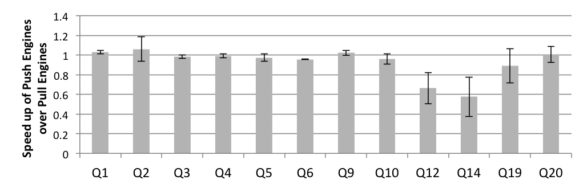

本文深入研究 push 与 pull 范式的取舍。选择 push、pull 或任何合理替代方案，是查询引擎架构中的基本决策，会影响整个系统架构。因此必须深入理解相关性质和取舍，而不能寄希望于后续用“补丁”弥补选择的缺点。

我们还展示编程语言社区如何遇到并解决同类挑战。具体地，研究 PL 社区针对 collection programming 的 stream fusion，并展示它如何适配查询处理、结合 pull 和 push 的优点。此外，我们使用 push 方法中的思想来解决 stream fusion 的已知限制，最终构建一种结合 push 与 pull 优点的查询引擎。本质上，该引擎在粗粒度层面是 pull-based，在细粒度层面则 push 单个数据 tuple。

本文贡献包括：

- 第 2 节讨论 pipelined query engine；第 3 节介绍 collection programming 中的 loop fusion，并展示二者联系及各方法限制。
- 第 4 节基于 loop fusion 联系提出一种新的 pipelined query engine，灵感来自 PL 社区的 stream fusion；第 5 节讨论实现问题和所需编译器优化。
- 第 6 节实验评估多种 query engine 架构。microbenchmark 展示现有 engine 的弱点，以及新 engine 如何结合双方优点规避这些弱点；TPC-H 查询则显示，良好实现下各 engine 在现实分析型查询上没有显著优势差异。

文中代码片段、接口和示例都使用 Scala，但概念不依赖 Scala。其他带有非纯函数式和面向对象特性的语言，如 OCaml、F#、C++11、C# 或 Java 8，也可使用这些思想。

## 2. Pipelined Query Engines

DBMS 接受声明式查询（如 SQL），把它交给查询优化器寻找快速物理查询计划，然后由查询引擎解释执行或编译为低层代码（如 C 代码）。物理查询计划执行计算和数据转换。一串查询算子可以 pipelined，也就是一个算子的输出流式传入下一个算子，不物化中间数据。

Pipelining 有两种方法：

- **Demand-driven pipelining**：算子反复从 source operator pull 下一个 tuple。
- **Data-driven pipelining**：算子把每个 tuple push 给 destination operator。

### 2.1 Pull Engine，也称 Iterator Pattern

Iterator model 是查询引擎中使用最广泛的 pipelining 技术。它最初在 XRM 中提出，后来因 Volcano 系统采用并加入并行化设施而流行。

简言之，iterator model 中每个算子通过向 source operator 请求下一个元素来 pipeline 数据。这样无需等待整个中间关系生成完毕，每个算子都可惰性生成数据。具体方式是 destination operator 调用 source operator 的 `next` 方法。pull-based engine 的设计直接对应面向对象编程中的 Iterator design pattern。

以如下 SQL 为例：

```sql
SELECT SUM(R.B)
FROM R
WHERE R.A < 10
```

图 2 展示 push 和 pull 引擎中 control flow 与 data flow 的区别。在 pull engine 中，每个查询算子都扮演 destination operator，通过调用 source operator 的 `next` 函数请求数据。每个算子也作为 source operator 为其 destination operator 生成结果数据。生成数据是 `next` 函数的返回值。pull engine 中 control-flow edge 与 data-flow edge 方向相反。

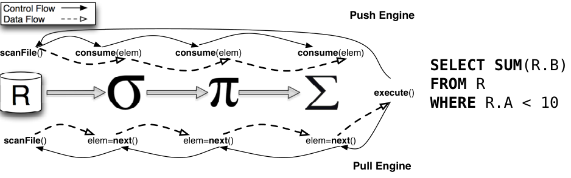

换一个角度，每个算子可看作一个 `while` 循环，其中每次迭代调用 source operator 的 `next`。当 `next` 返回特殊值（例如 `null`）时，循环终止。

Pull-based query engine 有两个主要问题。

第一，`next` 调用通常实现为虚函数。不同 `next` 实现的算子必须链接在一起。这类调用很多，每次调用都需要查虚表，导致较差 instruction locality。Query compilation 可通过内联这些虚函数调用解决该问题。

第二，selection operator 在实践中有问题。调用 selection operator 的 `next` 时，destination operator 必须等待 selection operator 返回下一个满足谓词的数据 tuple。这会通过更多循环和分支使控制流更复杂。复杂 CFG 会降低 branch prediction。直观地说，这是因为 pull engine 没有类似 `continue` 的结构来跳过无关结果。Push-based query engine 可以解决这个问题。

### 2.2 Push Engine，也称 Visitor Pattern

Push-based engine 广泛用于流处理系统。Volcano 在实现 query engine 的 inter-operator parallelism 时也使用 data-driven pipelining。在 query compilation 上下文中，StreamBase、Spade、HyPer 和 LegoBase 都使用 push-based query engine。

在 push engine 中，控制流相对 pull engine 被反转。不是 destination operator 从 source operator 请求数据，而是数据从 source operator push 到 destination operator。具体实现是 source operator 把数据作为参数传给 destination operator 的 `consume` 方法。这意味着 tuple-by-tuple 地急切传输数据，而不是像 pull engine 那样惰性请求。

Push engine 可用面向对象编程中的 Visitor design pattern 实现。每个算子定义为 visitor class，其中 `consume` 方法相当于 `visit`。算子链初始化通过 Visitor pattern 的 `accept` 方法完成，对应 push engine 中的 `produce` 方法。

查询处理在每个算子中包含两个阶段：

1. 算子准备自己产生数据，只在初始化时执行一次。
2. 算子消费 source operator 提供的数据，并为 destination operator 产生数据。这是主处理阶段，通过调用 destination operator 的 `consume` 并传递产生的数据完成。

因此 push engine 中 control flow 和 data flow 方向相同。

Push engine 解决了 pull engine 在 selection operator 上的问题。若产生的数据不满足谓词，push engine 可用 `continue` 这样的结构跳过当前循环迭代。这样简化控制流，并在 selection operator 场景下改善 branch prediction。

但 push engine 在 `limit` 和 `merge join` 上有困难。对 `limit`，push engine 天生不允许提前终止 producer 的循环，因为 producer 控制迭代。对 merge join，需要同时按需从两个有序输入推进；push engine 很难对两个输入都保持 pipeline，往往必须打断其中一侧 pipeline。

### 2.3 Compiled Engines

一般而言，查询运行时成本取决于两类因素：数据在存储和计算组件之间传输的时间，以及实际计算所需时间。在磁盘型 DBMS 中，主导成本通常是从/到二级存储的数据传输。因此，只要 pipelining 算法不打断 pipeline，pull 与 push 的差异不明显；pull engine 中 selection 的控制流问题会被数据传输成本掩盖。

随着 in-memory DBMS 出现，指令布局变得非常重要。Query compilation 使用代码生成和编译技术来内联虚函数，并进一步专门化代码以改善缓存局部性。因此，每种 pipelining algorithm 生成的代码形状很重要，需要针对不同 workload 研究其性能。

图 3a 展示示例 SQL 在 pull engine 中内联后的代码。selection operator 需要额外 `while` 循环，这增加分支并复杂化 CFG。图 3c 展示该 CFG：矩形表示语句块，菱形表示条件，边表示执行流，回边表示循环跳转。复杂 CFG 让优化编译器更难理解和优化，运行时主要因 branch prediction 变差而性能下降。

图 3b 展示相同查询在 push engine 中专门化后的代码。selection 可总结为单个 `if` 判断，整体代码更简单，如图 3d 所示。这更有利于底层优化编译器推理和优化，并改善 branch prediction。

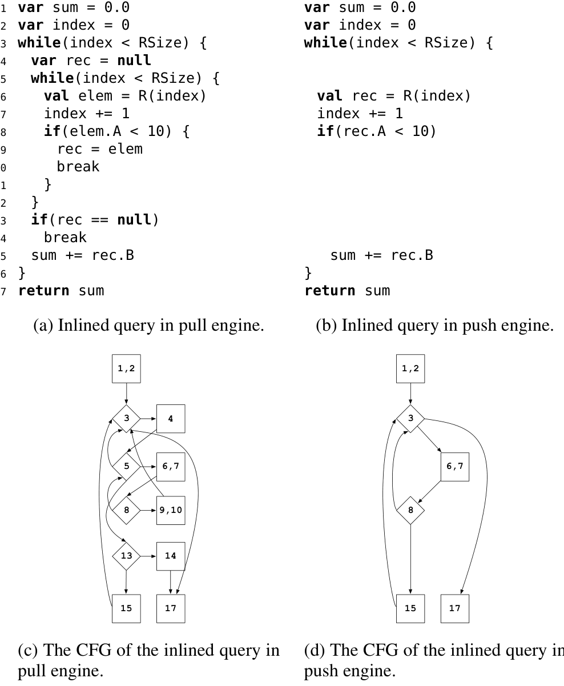

此前研究常未把 pipelining 概念与 associated specializations 分离。例如 HyPer 本质上是 push engine，同时默认使用编译器优化，却没有区分 push 范式与编译优化各自对性能的贡献。LegoBase 假定 push engine 后接 operator inlining，而 pull engine 不使用 operator inlining。另一方面，也缺少在同一环境中比较 inlined pull engine 与 inlined push engine 的实验。第 6 节试图在尽可能共享环境和代码库的公平条件下做比较。

此外，朴素编译 pull engine 并不会得到好性能。因为朴素 iterator model 实现没有考虑 `next` 调用数量。例如 selection operator 的朴素实现会调用 source operator 的 `next` 两次：

```scala
class SelectOp[R](p: R => Boolean) {
  def next(): R = {
    var elem: R = source.next()
    while (elem != null && !p(elem)) {
      elem = source.next()
    }
    elem
  }
}
```

第一次调用在循环前初始化，第二次在循环中。内联可能导致代码规模爆炸，进而损害 instruction cache。因此，query engine 实现必须考虑这一点。我们的 pull-based selection operator 只调用一次 source `next`，通过改变 `while` 循环形状减少代码膨胀。实验显示这种 inline-aware 实现很重要。

## 3. Collection Programming 中的 Loop Fusion

Collection programming API 越来越流行。Ferry 和 LINQ 使用这类 API 把应用与数据库后端无缝集成；Spark RDD 使用同样的 collection 操作；Scala、Haskell、Java 8 等主流语言也提供函数式 collection 抽象。这类 API 的理论基础包括 Monad Calculus 和 Monoid Comprehensions。

与 query engine 类似，collection programming 的声明性有代价。每个 collection operation 对一个集合执行计算并产生转换后的集合。串接多次调用会创建不必要的中间集合。Loop fusion 或 deforestation 消除 collection program 中的中间集合。由于该转换非局部且脆弱，很难应用到包含 imperative features 的非纯函数式程序中，因此主流编译器通常缺少它。

为提供实用实现，可以把语言限制为纯函数式 DSL，使 fusion rule 可局部应用。这类方法称为 short-cut deforestation：用局部转换而不是全局转换移除中间集合，更容易集成到真实编译器。Haskell 和 Scala DSL 中已有成功实现。

### 3.1 Fold Fusion

Fold fusion 中，每个 collection operation 使用两个构造实现：

1. `build` 方法：产生 collection。
2. `foldr` 方法：消费 collection。

一些方法如 `map` 同时使用两者：消费给定 collection 并产生新 collection。另一些方法如 `sum` 只需 `foldr` 消费 collection 并产生聚合结果。本文采用 imperative 变体，用 `foreach` 代替 `foldr`。Scala 中 `foreach` 签名为：

```scala
class List[T] {
  def foreach(f: T => Unit): Unit
}
```

`foreach` 通过遍历 collection 元素并对每个元素应用给定函数来消费 collection。`build` 是 `foreach` 的对应 producer：

```scala
def build[T](consumer: (T => Unit) => Unit): List[T]
```

`map` 可表示为：

```scala
class List[T] {
  def map[S](f: T => S): List[S] =
    build { consume =>
      this.foreach(e => consume(f(e)))
    }
}
```

把 collection operation 改写为 `build` 和 `foreach` 后，可用如下规则移除中间 collection：

```text
Fold-Fusion Rule:
build(f1).foreach(f2)  =>  f1(f2)
```

例如 `list.map(f).map(g)` 可转换为 `list.map(f o g)`。图 4 展示 fold、unfold 和 stream fusion 在该例子上的转换。Fold fusion 的关键优点是：不需要为每对 collection operation 编写 fusion rule。对 n 个 collection operation，不需要 O(n^2) 条 rewrite rule；只需把各操作表达为 `build` 和 `foreach`，即 O(n) 条规则。

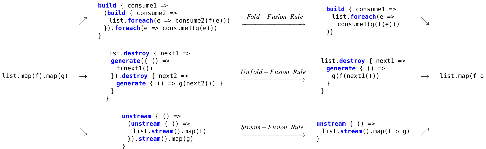

该方法能很好地 deforest 多数 collection operator，但不擅长 `zip` 和 `take`。`zip` 需要同时遍历两个 collection，而 `foreach` 只遍历一个 collection；因此只能 deforest 其中一个，另一个必须创建中间 collection。`take` 则无法中途停止 `foreach` 迭代。因此 fold fusion 在这两个操作上表现不好。

### 3.2 Unfold Fusion

Unfold fusion 可视为 fold fusion 的对偶方法。每个 collection operation 用两个构造表达：`generate` 和 `destroy`：

```scala
class List[T] {
  def destroy[S](f: (() => T) => S): S
}

def generate[T](next: () => T): List[T]
```

`destroy` 消费给定 list。通过调用 `destroy` 提供的 `next` 函数，可访问 collection 的每个元素。`generate` 产生一个 collection，其元素由传入函数指定。

`map` 可表达为：

```scala
class List[T] {
  def map[S](f: T => S): List[S] =
    this.destroy { next =>
      generate { () =>
        val elem = next()
        if (elem == null) null else f(elem)
      }
    }
}
```

中间 `generate` 与 `destroy` 链可由如下规则移除：

```text
Unfold-Fusion Rule:
generate(f1).destroy(f2)  =>  f2(f1)
```

Unfold fusion 对 `filter` 引入递归迭代，实践中可能有性能问题；但理论上仍能成功 deforest。它也不能融合嵌套 collection 操作，本文不讨论这一点。

### 3.3 Loop Fusion 就是 Operator Pipelining

查询可通过串接 query operator 表达；collection program 也可通过 collection operator pipeline 表达。关系查询与 collection program 的关系已有充分研究。算子可分三类：

1. 从源（文件或数组）产生 collection 的 producer。
2. 把给定 collection 转换成另一个 collection 的 transformer。
3. 把 collection 聚合成单个结果的 consumer。

**表 1. 查询算子与 collection 算子的映射**

| 算子类别 | Producer | Transformer | Consumer |
| --- | --- | --- | --- |
| Query operator | Scan | Selection, Projection, OrderBy, Limit, Join, Merge Join, Agg(Group By) | Agg(single result) |
| Collection operator | `List.fromArray` | `filter`, `map`, `sortBy`, `take`, `flatMap`, `zip`, transformer fold | `fold` |

Nested loop join 可用两个嵌套 `flatMap` 表达，但 hash-based join 没有直接等价物。`zip` 与 merge join 行为相似，但语义不同。表示 Group By 的 aggregation 是 transformer，而折叠为单个结果的 aggregation 是 consumer。

Query engine 中的 pipelining 类似 collection programming 中的 loop fusion：二者都移除会打断流式 pipeline 的中间 relation/collection。Pipelining 还对应面向对象编程中的设计模式：

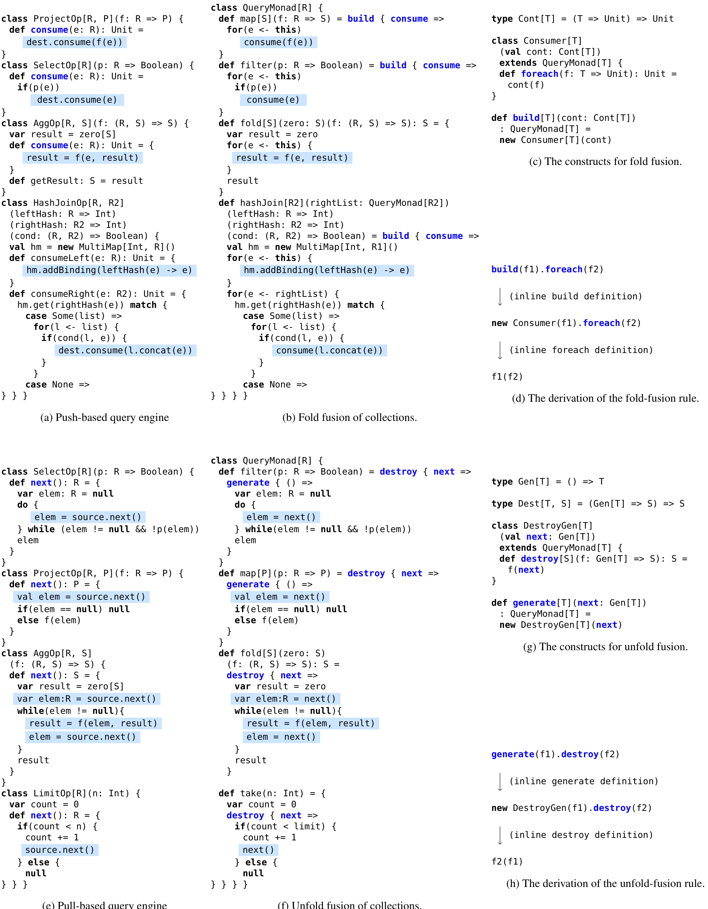

**表 2. Pipelined query engine、设计模式和 loop fusion 的对应关系**

| Query engine | OO design pattern | Loop fusion |
| --- | --- | --- |
| Pull engine | Iterator | Unfold fusion；Stream fusion |
| Push engine | Visitor | Fold fusion |

**Push Engine = Fold Fusion**。Visitor pattern 与 fold fusion 存在相似性。一方面，Visitor design pattern 被证明对应数据类型的 Church encoding；另一方面，list 上的 `foldr` 对应 lambda calculus 中 list 的 Church encoding。二者都通过把底层数据结构转为 Church encoding 来消除中间结果。前者的 specialization 通过内联移除虚函数调用；后者通过 fold-fusion rule 和 beta-reduction 移除物化点。

**Pull Engine = Unfold Fusion**。Iterator pattern 与 unfold fusion 对应。`next` 函数相当于 `generate` 提供元素，`destroy` 则消费该 generator。Pull engine 中 `next` 返回 `null` 用于表示完成，类似 unfold fusion 的终止条件。

这一对应关系说明，数据库查询引擎和 PL loop fusion 面临同一组基本取舍：push/fold 对 selection 友好但对 early termination 和双输入协同推进不友好；pull/unfold 对 early termination 和 merge-like 操作友好，但 selection 会带来额外循环和分支。

## 4. 一种改进的 Pull-Based Engine

本节先介绍另一种 collection program loop fusion 技术，然后基于它提出一种新的 pull-based query engine。

### 4.1 Stream Fusion

在函数式语言中，循环通常表达为递归函数。优化编译器很难推理递归函数。Stream fusion 试图通过把递归 collection operation 转换为非递归 stream operation 解决该问题。

做法是：先用 `stream` 方法把 collection 转换为 stream；再调用 stream 上的对应方法得到转换后的 stream；最后用 `unstream` 把 stream 转回 collection。签名如下：

```scala
def unstream[T](next: () => Step[T]): List[T]

class List[T] {
  def stream(): Step[T]
}
```

例如 `map` 可表示为：

```scala
class List[T] {
  def map[S](f: T => S): List[S] =
    unstream { () =>
      this.stream().map(f)
    }
}
```

中间 stream 由 `Step` 数据结构表示。`Step` 操作主要是非递归的，这简化了优化编译器的任务。但这些转换本身不会直接带来性能提升，甚至可能因为 collection 和 stream 之间转换产生开销而变慢。因此需要如下规则移除中间转换：

```text
Stream-Fusion Rule:
unstream(() => e).stream()  =>  e
```

Stream fusion 与 unfold fusion 思想相似，主要差异在 `filter`。Stream fusion 使用特殊值 `Skip` 实现 `filter`；unfold fusion 则用额外嵌套 `while` 循环跳过不必要元素。因此 stream fusion 解决了 unfold fusion 在 `filter` 上的实践问题。

### 4.2 Stream-Fusion Engine

我们提出的 query engine 采用与 iterator model 相同设计，因此仍是 pull engine。但它不调用 `next`，而是调用 `stream`，返回类型为 `Step` 的 wrapper 对象。本文称其为 stream-fusion engine。

Pull engine 在 selection operator 上的问题是：目的算子要等待 selection operator 返回下一个满足谓词的元素。stream-fusion engine 用 `Skip` 对象解决这个问题：`Skip` 表示当前元素应被忽略。因此 selection 不再阻塞 destination operator。

每个 query operator 都提供合适的 `stream` 实现，并调用 source operator 的 `stream` 请求下一个元素。Stream fusion 使用 `stream` 获取下一个元素，再通过 `unstream` 转回 collection。

从另一角度看，push engine 可表达为 `while + continue`；它天生不能在 producer 的 `while` 完成前终止迭代。Pull engine 可表达为 `while + break`；它的 demand-driven 性质允许提前终止，但无法跳过一次迭代，只能用嵌套 `while` 表达 skip。Stream-fusion engine 用 `Skip` 增加 skip 能力，因此支持 `while + break + continue`。

图 6 展示 stream-based query engine 和 stream fusion 技术的结构。`Step` 数据类型有三个情况：

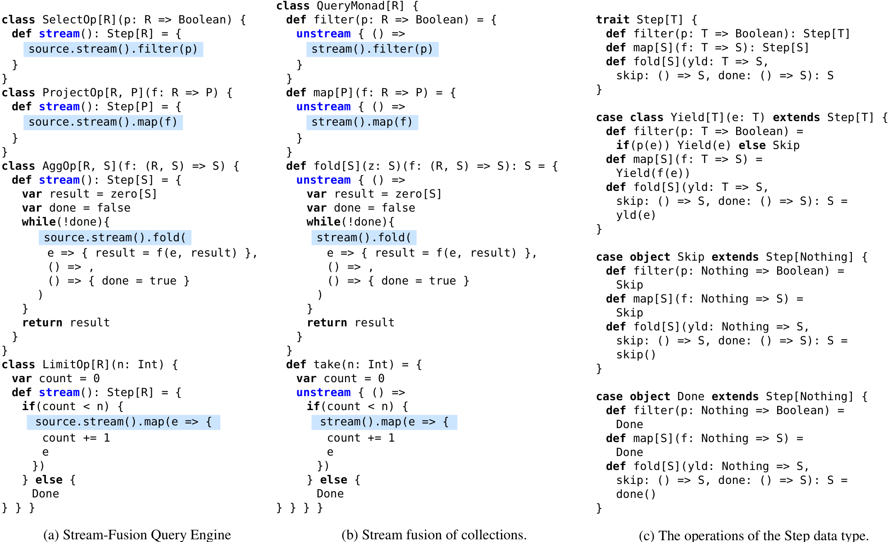

```scala
trait Step[T] {
  def filter(p: T => Boolean): Step[T]
  def map[S](f: T => S): Step[S]
  def fold[S](yld: T => S, skip: () => S, done: () => S): S
}

case class Yield[T](e: T) extends Step[T]
case object Skip extends Step[Nothing]
case object Done extends Step[Nothing]
```

- `Yield(e)` 表示产生一个元素。
- `Skip` 表示当前元素被过滤掉，应跳过。
- `Done` 表示没有更多元素，角色类似 pull engine 中的 `null`。

例如，对包含两个元素的关系选择第一个元素、过滤第二个元素：第一次调用 selection operator 的 `stream` 产生 `Yield(first)`；第二次产生 `Skip`；第三次产生 `Done`。

**表 3. 各 pipelined query engine 支持的循环构造**

| Engine | 循环构造 |
| --- | --- |
| Push engine | `while + continue` |
| Pull engine | `while + break` |
| Stream-fusion engine | `while + break + continue` |

示例查询在 stream-fusion engine 中专门化后的代码与 push engine 一样紧凑。但如果直接实现，会因为创建中间 `Step` 对象而产生性能问题。第 5 节讨论如何优化。

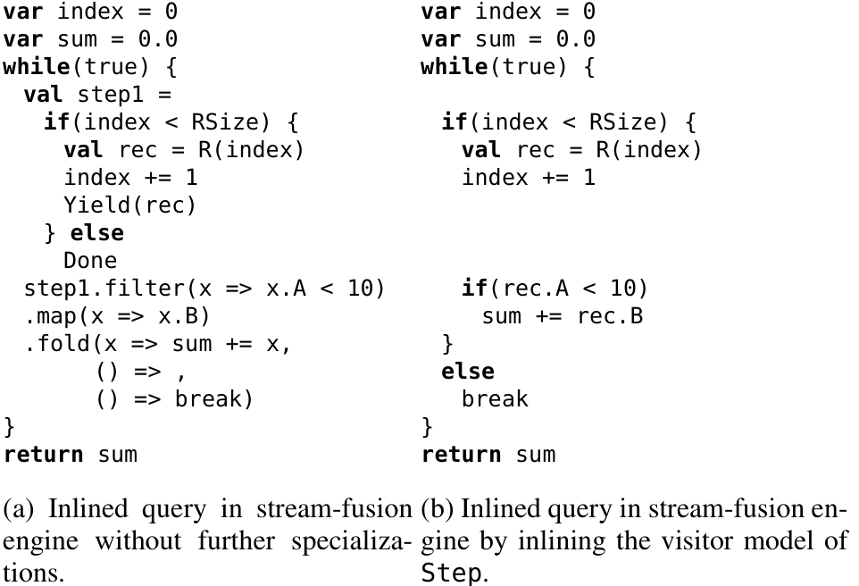

## 5. 实现

我们使用开源 DBLAB 框架实现不同 query engine 及其优化。DBLAB 允许用 Scala 这种高级语言实现 engine。输入程序可表达为 QPlan 物理查询计划，或 QMonad collection program。优化用 DBLAB transformation framework 的 rewrite rule 实现。

我们实现了 collection programming 操作和对应 loop fusion 技术。由于第 3.3 节展示了 query engine 与 collection programming 的等价关系，collection fusion 的实验结果也对应不同 pipelined query engine 方法。

### 5.1 通过 Inlining 实现 Fusion

Loop fusion rule 通常作为宿主语言编译器扩展的局部 transformation rule 实现。本文展示这些 fusion rule 只用 inlining 即可实现。

以 fold fusion 为例，`build` 定义内联后创建一个 `QueryMonad` 对象。该对象的 `foreach` 方法把传给 `build` 的高阶函数 `f1` 应用到 `foreach` 输入参数 `f2`。再内联 `foreach` 即可得到 fold-fusion rule：

```text
build(f1).foreach(f2)
=> new Consumer(f1).foreach(f2)
=> f1(f2)
```

Unfold fusion 和 stream fusion 遵循类似模式：

```text
generate(f1).destroy(f2)  =>  f2(f1)
unstream(() => e).stream()  =>  e
```

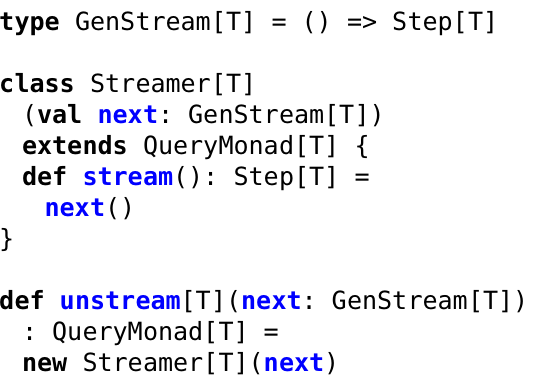

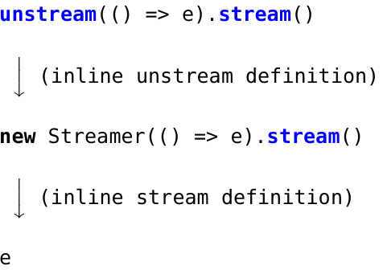

### 5.2 移除中间结果

Stream-fusion engine 虽然移除了中间 relation，却会创建中间 `Step` 对象。这些对象有两个问题：

1. `Step` 操作是虚函数调用，导致差的 cache locality 和性能下降。
2. 中间对象通常造成 heap allocation，增加内存消耗并降低运行时性能。

原始 stream fusion 依赖 GHC 编译器提供的优化。若要在其他语言中有效实现，需要类似优化。

虚函数调用问题可通过把 `Step` 操作改写为枚举所有 `Step` 情况解决。因为该数据类型只有三种具体情况：`Yield`、`Skip`、`Done`。函数式语言可用 pattern matching；命令式实现可用 `if`。

heap allocation 问题可通过 escape analysis 解决：这些对象没有逃逸出使用作用域，例如没有被复制进数组，也没有作为函数参数逃逸。因此 heap allocation 可转为 stack allocation。编译器还可进一步通过 scalar replacement 移除 stack allocation，把编码 `Step` 所需字段转换为局部变量，从而完全消除 `Step` 抽象。

我们还提出另一种视角：移除中间 `Step` 对象与移除中间 relation/collection 是同类问题，可借用类似思想。具体做法是用 Visitor pattern 实现 `Step` 数据类型。这类似数据类型的 Church encoding，会把 `Step` 对象 push 下 pipeline。因此 stream-fusion engine 在粗粒度层面是 pull engine，在细粒度层面则 push tuple。

**图 10. 用 Visitor pattern 实现 `Step` 数据类型**

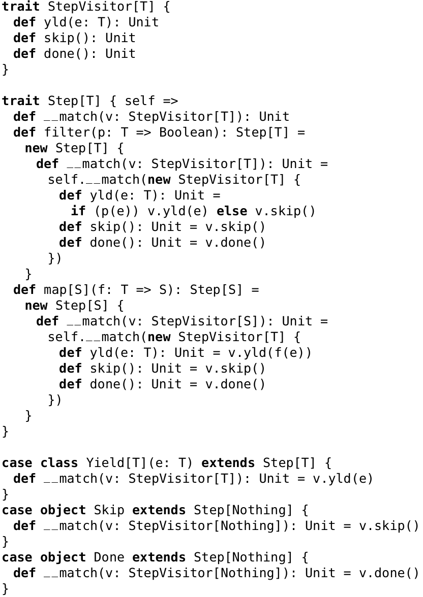

```scala
trait StepVisitor[T] {
  def yld(e: T): Unit
  def skip(): Unit
  def done(): Unit
}

trait Step[T] { self =>
  def __match(v: StepVisitor[T]): Unit

  def filter(p: T => Boolean): Step[T] =
    new Step[T] {
      def __match(v: StepVisitor[T]): Unit =
        self.__match(new StepVisitor[T] {
          def yld(e: T): Unit =
            if (p(e)) v.yld(e) else v.skip()
          def skip(): Unit = v.skip()
          def done(): Unit = v.done()
        })
    }
}
```

应用该增强后，示例查询生成代码与 push engine 代码非常相似：不再有 `Step` 操作的额外虚函数调用，不再物化中间 `Step` 对象，也不再因为 selection 产生额外嵌套 `while`。这使底层编译器更容易理解和优化。

## 6. 实验结果

实验使用一台服务器级 x86 机器，配备两颗 Intel Xeon E5-2620 v2 CPU（2 GHz）、256 GB DDR3 RAM（1600 MHz）和两块 2 TB HDD。操作系统是 Red Hat Enterprise 6.7。

为公平比较，不同 pipelining 技术使用同一组 transformation：dead code elimination（DCE）、common subexpression elimination（CSE）/ global value numbering（GVN）、partial evaluation（inlining 和 constant propagation）。除非明确说明，scalar replacement 总是应用。实验不使用数据结构 specialization transformation 或 inverted index。所有实验使用 DBLAB 的 in-memory row-store 表示。

生成程序使用 Clang 2.9 编译，并使用最激进优化选项 `-O3`。C 数据结构使用 GLib 2.42.1。

评测分两部分：首先用 microbenchmark 展示不同 query engine 的差异；然后用 TPC-H benchmark 研究更复杂查询中的行为。

### 6.1 Micro Benchmarks

Microbenchmark 分三类：

1. 只包含 selection 和无 group-by aggregation，产生单个结果。
2. 包含 selection、projection、sort 和 limit，返回结果列表。
3. 包含 selection 和不同 join 算子（hash join、merge join、semi hash join），随后接 aggregation，产生单个结果。

除非说明，所有查询使用 scale factor 8 的 TPC-H 生成数据库。附录表 4 给出 SQL。

**对 selectivity 的敏感性。** 图 11 展示一个 selection 后接 aggregation 的简单查询在不同 selectivity 下的行为。对高度选择性查询，Volcano pull engine 表现更好，因为无用元素在内部紧循环中被更快跳过；其他 engine 由外层循环负责跳过。对较高 selectivity，多数情况下 push engine 最好。Visitor-based stream-fusion engine 与 push engine 几乎相同，而只使用 scalar replacement、不使用 Visitor pattern 的 stream-fusion engine 多数情况下更差。

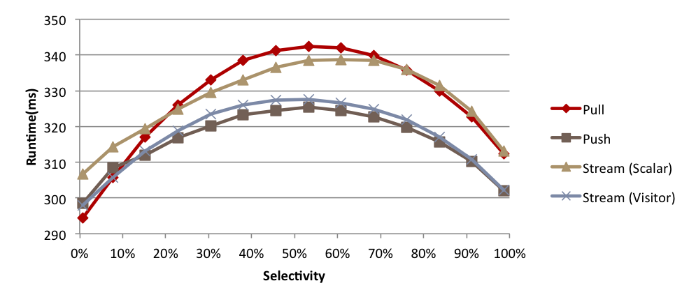

**单 pipeline 聚合。** 图 12 展示单 pipeline、通过对一列求和产生单结果的查询。只有一个 filter 时，push engine 略好于 pull engine；stream-fusion engine 隐藏了 pull engine 的这一局限。若有 selection 链，差异更明显。不过实践中优化器会把合取谓词合并为单个 selection，因此该情况很少出现。

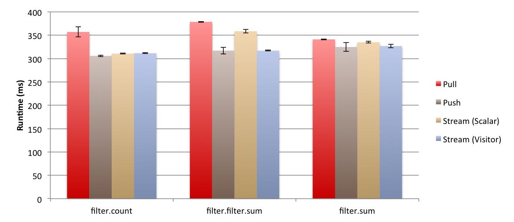

**单 pipeline 列表结果。** 图 13 展示不包含 aggregation、产生元素列表的查询，使用 1 GB 数据。selection 后接 projection 时，各 engine 类似。但如果查询过滤后返回 top-k，push engine 更差，因为 limit operator 会打断 push pipeline。selection-projection-limit 的情况更明显，pull engine 和 stream-fusion engine 更好。

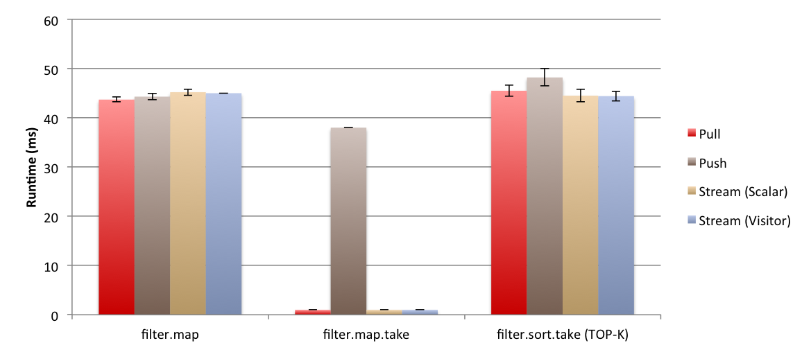

**带 join 的聚合。** 图 14 展示不同 join 操作性能。hash join 和 semi hash join 中，各 engine 没有明显差异。merge join 中，pull engine 相比 push engine 有很大优势，主要因为 push engine 不能同时 pipeline merge join 的两个输入，被迫打断其中一个输入 pipeline。

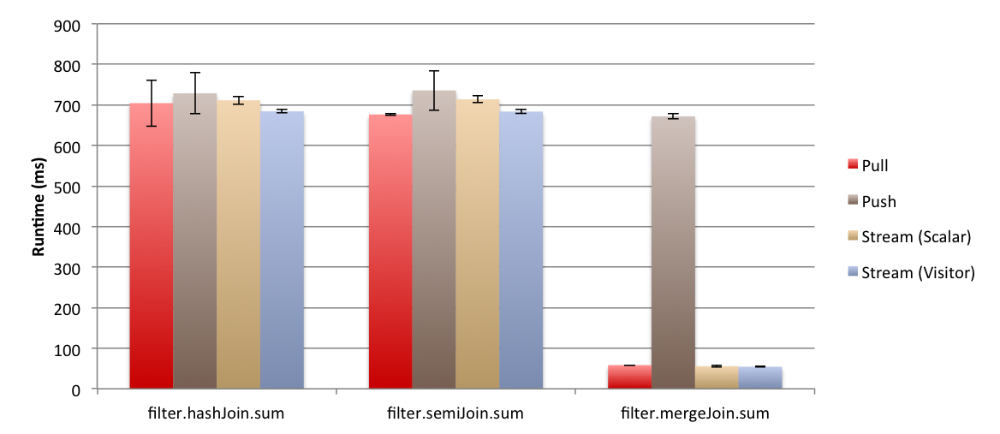

### 6.2 Macro Benchmarks

本节研究实践中更常见的复杂分析查询，即 TPC-H。首先展示细粒度优化和 inline-aware pull engine 实现对一个 TPC-H 查询的影响，然后比较 12 个 TPC-H 查询上的不同 engine。所有实验使用 8 GB TPC-H 数据。

**Inline-aware pull engine 实现。** 朴素 pull engine 的 selection operator 会调用 source `next` 两次。在 selection 链中，这可能指数级增加代码大小。该情况实践中不频繁，因为 selection 通常紧跟 scan；但 TPC-H Q19 在 join 后使用 selection。图 15 显示，inline-aware selection 实现使 pull engine 性能提升约 15%。主要原因是它为这些查询生成的查询处理代码减少约 40%，改善 instruction cache locality。

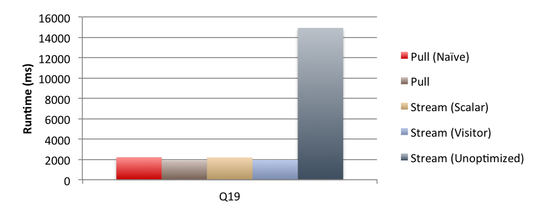

**移除中间对象分配。** 图 15 还显示，heap allocation 中间 `Step` 对象会使性能差一个数量级。与只把 heap allocation 转为 stack allocation 相比，用 Visitor pattern 实现 `Step` 还能提升约 50%。实验还显示，在 TPC-H 查询中，把 heap allocation 转为 stack allocation（通过 Visitor pattern 或 scalar replacement）可把内存消耗从 14 GB 降到 11 GB。

**分析型查询中的不同 engine。** 图 16 展示多个 TPC-H 查询在不同 engine 上的性能。总体上，engine 之间差异不是数量级级别；多数情况下提升很小。这是因为比较在公平场景中进行，所有 engine 都做 specialization，不同于此前一些工作未对 pull engine 应用 operator inlining。

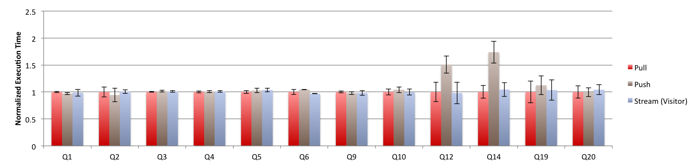

这些查询可分两类。第一类中所有 engine 表现几乎相同。一些情况下 push engine 略有提升，主要因为生成代码控制流更好，使底层编译器能生成更好机器码。但即使如此，差异也很小。

第二类中 pull engine 更好，主要因为使用 merge join 和 limit。Q14 使用 limit，pull engine 相比 push engine 平均快约 80%。Q12 使用 merge join，pull engine 相比 push-based engine 平均快约 70%。Q12 中使用 merge join 的查询计划几乎是 hash join 计划的两倍快，因为两个输入关系已经按 join key 排序；merge join 可 on-the-fly 执行 join，而 hash join 必须在 join 时构造中间 hash table。

Stream-fusion engine 在整个实验中使用 Visitor pattern。当控制流很重要时，它表现与 push engine 一样好；在 push engine 需要打断 pipeline 的场景（如 limit 和 merge join）中，它又与 pull engine 一样好。因此 stream-fusion engine 是适合作为 query engine 的选择。

## 7. 讨论：并行性

本节讨论本文结果如何应用到并行查询引擎。Intra-operator parallelism 是实现查询引擎并行性的主要方式之一。在这种方法中，数据被分给不同线程，每个线程负责顺序处理自己的 chunk，最后把不同线程计算的结果 merge 成一个结果。split 和 merge 算子被插入到 pipeline breaker（如 aggregation 和 hash join）之间。因此，每个线程顺序计算一串 pipelining operator 的结果。

如果使用相同 split 和 merge 算子，pull 与 push engine 的唯一区别就是它们多高效地计算一条 pipelining operator chain。因此，在 intra-operator parallelism 的公平环境中，本文单线程场景的实验结果预计也适用于多线程场景。

Intra-operator parallelism 的关键决策之一是何时做 partitioning decision。如果在查询编译时做，称为 plan-driven；如果推迟到运行期，称为 morsel-driven。后者的优势是利用运行期信息，通过 work-stealing 获得更好负载均衡。但 partitioning decision 的选择独立于 query engine 类型。所有 query engine 都可使用这两种方法，work-stealing 调度对它们的影响类似。

PL 社区也有类似并行 collection program 的工作。例如 morsel-driven parallelism 与并行 collection programming library 中的 work-stealing 调度有相似思想。

## 8. 结论

如果公平比较 push 与 pull-based query processing，特别是尽可能在两种方法中都内联代码，那么没有哪一种方法明显优于另一种。细看二者的基本工作方式后，任何一方若在性能上完全支配另一方，反而会显得令人意外。

本文还把三种编程语言中的基本 loop fusion 方法与 query engine 联系起来：fold、unfold 和 stream fusion。Pull engine 与 unfold fusion 对应，push engine 与 fold fusion 对应。

最后，我们把对各方法弱点的经验应用到 query engine 构建中，提出一种受 stream fusion 启发的新方法。它结合 push 与 pull engine 的各自优点，并避免二者弱点：粗粒度上保持 pull 的 demand-driven 能力，支持 break/limit/merge-like 操作；细粒度上用 `Skip` 和 Visitor/Church encoding 风格把 tuple push 下去，避免 selection 造成的嵌套循环和不必要对象。

## 附录 A. Microbenchmark 查询

表 4：Microbenchmark 查询所用 SQL。

| 查询 | SQL |
| --- | --- |
| `filter.count` | `SELECT COUNT(*)`<br>`FROM LINEITEM`<br>`WHERE L_SHIPDATE >= DATE '1995-12-01'` |
| `filter.sum` | `SELECT SUM(L_DISCOUNT * L_EXTENDEDPRICE)`<br>`FROM LINEITEM`<br>`WHERE L_SHIPDATE >= DATE '1995-12-01'` |
| `filter.filter.sum` | `SELECT SUM(L_DISCOUNT * L_EXTENDEDPRICE)`<br>`FROM LINEITEM`<br>`WHERE L_SHIPDATE >= DATE '1995-12-01'`<br>`AND L_SHIPDATE < DATE '1997-01-01'` |
| `filter.map` | `SELECT L_DISCOUNT * L_EXTENDEDPRICE`<br>`FROM LINEITEM`<br>`WHERE L_SHIPDATE >= DATE '1995-12-01'` |
| `filter.sort.take` | `SELECT L_EXTENDEDPRICE`<br>`FROM LINEITEM`<br>`WHERE L_SHIPDATE >= DATE '1995-12-01'`<br>`ORDER BY L_ORDERKEY`<br>`LIMIT 1000` |
| `filter.map.take` | `SELECT L_DISCOUNT * L_EXTENDEDPRICE`<br>`FROM LINEITEM`<br>`WHERE L_SHIPDATE >= DATE '1995-12-01'`<br>`LIMIT 1000` |
| `filter.XJoin(filter).sum` | `SELECT SUM(O_TOTALPRICE)`<br>`FROM LINEITEM, ORDERS`<br>`WHERE O_ORDERDATE >= DATE '1998-11-01'`<br>`AND L_SHIPDATE >= DATE '1998-11-01'`<br>`AND O_ORDERKEY = L_ORDERKEY` |

## 参考文献

[1] StreamBase Systems, http://www.streambase.com.

[2] Y. Ahmad and C. Koch. DBToaster: A SQL compiler for high-performance delta processing in main-memory databases. PVLDB, 2(2):1566–1569, 2009.

[3] M. Armbrust, R. S. Xin, C. Lian, Y. Huai, D. Liu, J. K. Bradley, X. Meng, T. Kaftan, M. J. Franklin, A. Ghodsi, and M. Zaharia. Spark SQL: Relational Data Processing in Spark. SIGMOD '15, pages 1383–1394, New York, NY, USA, 2015. ACM.

[4] A. Biboudis, N. Palladinos, G. Fourtounis, and Y. Smaragdakis. Streams à la carte: Extensible pipelines with object algebras. In 29th European Conference on Object-Oriented Programming, page 591, 2015.

[5] R. D. Blumofe and C. E. Leiserson. Scheduling multithreaded computations by work stealing. Journal of the ACM (JACM), 46(5):720–748, 1999.

[6] C. Böhm and A. Berarducci. Automatic synthesis of typed λ-programs on term algebras. Theoretical Computer Science, 39:135–154, 1985.

[7] V. Breazu-Tannen, P. Buneman, and L. Wong. Naturally embedded query languages. Springer, 1992.

[8] V. Breazu-Tannen and R. Subrahmanyam. Logical and computational aspects of programming with sets/bags/lists. Springer, 1991.

[9] P. Buchlovsky and H. Thielecke. A type-theoretic reconstruction of the visitor pattern. Electronic Notes in Theoretical Computer Science, 155:309–329, 2006.

[10] J.-D. Choi, M. Gupta, M. Serrano, V. C. Sreedhar, and S. Midkiff. Escape analysis for Java. ACM SIGPLAN Notices, 34(10):1–19, 1999.

[11] D. Coutts, R. Leshchinskiy, and D. Stewart. Stream fusion: from lists to streams to nothing at all. In ICFP '07, 2007.

[12] A. Crotty, A. Galakatos, K. Dursun, T. Kraska, U. Çetintemel, and S. B. Zdonik. Tupleware: "big" data, big analytics, small clusters. In CIDR, 2015.

[13] C. Diaconu, C. Freedman, E. Ismert, P.-A. Larson, P. Mittal, R. Stonecipher, N. Verma, and M. Zwilling. Hekaton: SQL Server's memory-optimized OLTP engine. In Proceedings of the 2013 ACM SIGMOD International Conference on Management of Data, SIGMOD '13, pages 1243–1254, New York, NY, USA, 2013. ACM.

[14] B. Emir, M. Odersky, and J. Williams. Matching objects with patterns. ECOOP '07, pages 273–298, Berlin, Heidelberg, 2007. Springer-Verlag.

[15] L. Fegaras and D. Maier. Optimizing object queries using an effective calculus. ACM Transactions on Database Systems, 25(4):457–516, December 2000.

[16] B. Gedik, H. Andrade, K.-L. Wu, P. Yu, and M. Doo. SPADE: the System S declarative stream processing engine. In SIGMOD, 2008.

[17] J. Gibbons and B. C. d. S. Oliveira. The essence of the iterator pattern. Journal of Functional Programming, 19(3-4):377–402, 2009.

[18] A. Gill, J. Launchbury, and S. L. Peyton Jones. A short cut to deforestation. FPCA, pages 223–232. ACM, 1993.

[19] G. Graefe. Volcano—an extensible and parallel query evaluation system. IEEE Transactions on Knowledge and Data Engineering, 6(1):120–135, 1994.

[20] T. Grust, M. Mayr, J. Rittinger, and T. Schreiber. FERRY: database-supported program execution. SIGMOD 2009, pages 1063–1066. ACM.

[21] T. Grust, J. Rittinger, and T. Schreiber. Avalanche-safe LINQ compilation. PVLDB, 3(1-2):162–172, September 2010.

[22] T. Grust and M. Scholl. How to comprehend queries functionally. Journal of Intelligent Information Systems, 12(2-3):191–218, 1999.

[23] R. Hinze, T. Harper, and D. W. H. James. Theory and practice of fusion. In Proceedings of the 22nd International Conference on Implementation and Application of Functional Languages, IFL '10, pages 19–37, Berlin, Heidelberg, 2011. Springer-Verlag.

[24] M. Hirzel, R. Soulé, S. Schneider, B. Gedik, and R. Grimm. A catalog of stream processing optimizations. ACM Computing Surveys, 46(4):46:1–46:34, March 2014.

[25] C. Hofer and K. Ostermann. Modular domain-specific language components in Scala. In Proceedings of the Ninth International Conference on Generative Programming and Component Engineering, GPCE '10, pages 83–92, New York, NY, USA, 2010. ACM.

[26] S. P. Jones, C. Hall, K. Hammond, W. Partain, and P. Wadler. The Glasgow Haskell Compiler: a technical overview. In Proc. UK Joint Framework for Information Technology (JFIT) Technical Conference, volume 93. Citeseer, 1993.

[27] M. Jonnalagedda and S. Stucki. Fold-based fusion as a library: A generative programming pearl. In Proceedings of the 6th ACM SIGPLAN Symposium on Scala, pages 41–50. ACM, 2015.

[28] M. Karpathiotakis, I. Alagiannis, and A. Ailamaki. Fast queries over heterogeneous data through engine customization. PVLDB, 9(12):972–983, 2016.

[29] M. Karpathiotakis, I. Alagiannis, T. Heinis, M. Branco, and A. Ailamaki. Just-in-time data virtualization: Lightweight data management with ViDa. In CIDR, 2015.

[30] Y. Klonatos, C. Koch, T. Rompf, and H. Chafi. Building efficient query engines in a high-level language. PVLDB, 7(10):853–864, 2014.

[31] Y. Klonatos, C. Koch, T. Rompf, and H. Chafi. Errata for "Building efficient query engines in a high-level language": PVLDB 7(10):853–864. PVLDB, 7(13):1784–1784, August 2014.

[32] C. Koch. Incremental query evaluation in a ring of databases. PODS 2010, pages 87–98. ACM, 2010.

[33] C. Koch. Abstraction without regret in database systems building: a manifesto. IEEE Data Engineering Bulletin, 37(1):70–79, 2014.

[34] C. Koch, Y. Ahmad, O. Kennedy, M. Nikolic, A. Nötzli, D. Lupei, and A. Shaikhha. DBToaster: higher-order delta processing for dynamic, frequently fresh views. VLDB Journal, 23(2):253–278, 2014.

[35] K. Krikellas, S. Viglas, and M. Cintra. Generating code for holistic query evaluation. In ICDE, pages 613–624, 2010.

[36] V. Leis, P. Boncz, A. Kemper, and T. Neumann. Morsel-driven Parallelism: A NUMA-aware Query Evaluation Framework for the Many-core Age. SIGMOD '14, pages 743–754, New York, NY, USA, 2014. ACM.

[37] R. A. Lorie. XRM: An extended (N-ary) relational memory. IBM, 1974.

[38] M. Mehta and D. J. DeWitt. Managing intra-operator parallelism in parallel database systems. In VLDB, volume 95, pages 382–394, 1995.

[39] E. Meijer, B. Beckman, and G. Bierman. LINQ: Reconciling Object, Relations and XML in the .NET Framework. SIGMOD '06, pages 706–706. ACM, 2006.

[40] D. G. Murray, M. Isard, and Y. Yu. Steno: Automatic optimization of declarative queries. PLDI '11, pages 121–131, New York, NY, USA, 2011. ACM.

[41] F. Nagel, G. Bierman, and S. D. Viglas. Code generation for efficient query processing in managed runtimes. PVLDB, 7(12):1095–1106, 2014.

[42] T. Neumann. Efficiently Compiling Efficient Query Plans for Modern Hardware. PVLDB, 4(9):539–550, 2011.

[43] S. Pantela and S. Idreos. One loop does not fit all. In Proceedings of the 2015 ACM SIGMOD International Conference on Management of Data, pages 2073–2074. ACM, 2015.

[44] J. Paredaens and D. V. Gucht. Possibilities and limitations of using flat operators in nested algebra expressions. In Proceedings of the Seventh ACM SIGACT-SIGMOD-SIGART Symposium on Principles of Database Systems, March 21–23, 1988, Austin, Texas, USA, pages 29–38, 1988.

[45] B. C. Pierce. *Types and Programming Languages*. MIT Press, 2002.

[46] A. Prokopec, P. Bagwell, T. Rompf, and M. Odersky. A generic parallel collection framework. In Euro-Par 2011 Parallel Processing, pages 136–147. Springer, 2011.

[47] S. Schuh, X. Chen, and J. Dittrich. An experimental comparison of thirteen relational equi-joins in main memory. 2016.

[48] A. Shaikhha, Y. Klonatos, L. Parreaux, L. Brown, M. Dashti, and C. Koch. How to architect a query compiler. SIGMOD '16, 2016.

[49] O. Shivers and M. Might. Continuations and transducer composition. PLDI '06, pages 295–307. ACM, 2006.

[50] J. Svenningsson. Shortcut fusion for accumulating parameters & zip-like functions. ICFP '02, pages 124–132. ACM, 2002.

[51] Transaction Processing Performance Council. TPC-H, a decision support benchmark. http://www.tpc.org/tpch.

[52] P. Trinder. Comprehensions, a Query Notation for DBPLs. In Proc. of the 3rd DBPL workshop, DBPL3, pages 55–68, San Francisco, CA, USA, 1992. Morgan Kaufmann Publishers Inc.

[53] S. Viglas, G. M. Bierman, and F. Nagel. Processing Declarative Queries Through Generating Imperative Code in Managed Runtimes. IEEE Data Engineering Bulletin, 37(1):12–21, 2014.

[54] J. Vlissides, R. Helm, R. Johnson, and E. Gamma. *Design Patterns: Elements of Reusable Object-Oriented Software*. Reading: Addison-Wesley, 49(120):11, 1995.

[55] P. Wadler. Deforestation: Transforming programs to eliminate trees. In ESOP '88, pages 344–358. Springer, 1988.

[56] P. Wadler. Comprehending monads. In Proceedings of the 1990 ACM Conference on LISP and Functional Programming, LFP '90, pages 61–78, New York, NY, USA, 1990. ACM.

[57] M. Zaharia, M. Chowdhury, T. Das, A. Dave, J. Ma, M. McCauley, M. J. Franklin, S. Shenker, and I. Stoica. Resilient Distributed Datasets: A Fault-tolerant Abstraction for In-memory Cluster Computing. NSDI '12. USENIX Association.
