# Relaxed Operator Fusion for In-Memory Databases: Making Compilation, Vectorization, and Prefetching Work Together At Last（中文译文）

## 译者说明

本文依据同目录的 `source.pdf` 翻译。章节、图表、公式、算法、代码与参考文献按原文结构保留。

## 摘要

内存 DBMS 是现代 OLAP 应用的关键组件，因为它们能低延迟访问大量数据。由于磁盘访问不再是这类系统的主要瓶颈，查询执行引擎设计的重点转向 CPU 性能优化。近年系统重新采用 JIT 编译，把查询作为本地代码执行，而不是解释计划。查询编译的先进做法是把查询计划中的算子融合在一起，尽量减少物化开销，通过高效方式在算子间传递元组。然而，我们的经验分析表明，更有策略的物化反而能带来更好性能。论文提出 relaxed operator fusion 查询处理模型，允许 DBMS 在查询计划中引入 staging point，临时物化中间结果。这使系统能够利用计划中的元组间并行性，结合 prefetching 和 SIMD vectorization，在数据集超过 CPU cache 时加快执行。评估显示，该方法最多降低 OLAP 查询执行时间 2.2 倍，并相比其他内存 DBMS 最高提升 1.8 倍。

## 1. 引言

随着 DRAM 的性价比持续提高，越来越多的 DBMS 应用能够把数据常驻内存。我们预计，未来大多数 OLAP 应用都会采用内存数据库。由于这类系统的大部分工作数据集都在内存中，磁盘访问不再是查询执行的首要瓶颈；从内存访问数据时产生的 cache miss，以及处理器的计算吞吐量，反而成为决定性能的关键因素。

现代 CPU 提供了两类可用于缓解上述问题的指令。第一类是软件预取指令：它们可以在数据真正被使用之前，把内存块搬入 CPU cache，从而隐藏高代价 cache miss 的延迟 [14, 22]。第二类是 SIMD 指令：它们利用向量式数据并行提高计算吞吐量 [33]。以往研究分别讨论过特定数据库算子上的软件预取和 SIMD；本文关注的则是如何在整个查询计划范围内成功地组合两者。

二者面临的共同难点是，它们都不适合一次处理一条元组的模型（例如 Volcano [19]）。软件预取必须提前若干条元组发出请求，才能让其 cache miss 与其他元组的处理重叠；SIMD 则需要从一批元组中提取数据并行性，凑成 SIMD 宽度的向量。尽管二者都要求同时观察多条元组，其数据要求并不相同：SIMD 向量指令要求数据连续紧凑地排列；预取只要求提前生成一组地址，不要求这些地址或其指向的数据块连续。随着处理位置从查询计划树的叶子上移，存活数据通常越来越稀疏，软件预取与 SIMD 的相对收益也会随之变化。

此前没有 DBMS 从整个查询计划出发统一运用编译、SIMD 和显式预取。大多数支持查询编译的系统不采用向量化处理模型，或只编译谓词等计划片段；它们也不在整个计划中使用数据级并行或显式预取。支持这些技术所需的宽寄存器和较强软件预取能力，也是当时近五年才普及的硬件条件。

为此，本文提出宽松算子融合（relaxed operator fusion，ROF）。ROF 让 DBMS 以适当方式组织生成代码：在适合的计划片段内继续融合算子，同时在需要 SIMD 和软件预取的位置设置暂存点（staging point），临时物化中间结果。我们在 Peloton 内存 DBMS [5] 中实现了该模型，并用 TPC-H [40] 评估。实验表明，ROF 最多可使 OLAP 查询加速 2.2 倍；与 HyPer [20] 和 Actian Vector [1] 相比，把查询编译、SIMD 与预取组合起来的性能最高达到只使用其中一类执行技术时的 1.8 倍。

论文以 TPC-H Q19 的简化查询贯穿说明。为方便论述，图 1 省略了完整 WHERE 条件；原查询中的三个分支分别是 LineItem 和 Part 属性上的一组合取谓词。


```sql
SELECT SUM(...) AS revenue
FROM LineItem JOIN Part ON l_partkey = p_partkey
WHERE (CLAUSE1) OR (CLAUSE2) OR (CLAUSE3);
```

下文首先介绍查询计划编译、向量化和现代 CPU 上的预取；随后分析三种技术为何难以直接结合，给出 ROF 的执行与规划方法；最后通过 TPC-H 实验评估该模型，并讨论相关工作。

## 2. 背景

### 2.1 查询编译

DBMS 可以用多种方式编译查询。一种方式是生成 C/C++，再调用外部编译器（例如 gcc）编译为本地代码；另一种方式是生成中间表示（IR），由 LLVM 等运行时引擎转换为机器码；还有基于分阶段计算的方法：对查询引擎做部分求值，自动生成专门化的 C/C++，再交由外部编译器编译 [21]。

除机器码生成途径不同之外，生成代码的组织方式也有多种 [30, 41, 37, 31]。最朴素的做法是为每个算子生成独立例程，由父算子调用子算子例程，向上拉取下一份数据。它虽快于解释执行，CPU 仍会因为控制流频繁跳转而遭遇代价高昂的分支预测失败 [30]。

HyPer [30] 和 MemSQL [32] 采用的推送式模型更有效：它减少函数调用，并让执行路径更紧凑。优化器首先找出查询计划中的流水线断点（pipeline breaker），也就是会把部分或全部元组从 CPU 寄存器显式溢出并物化到内存的算子。在推送式模型中，子算子产生元组并推送给父算子，请求其消费。元组属性被装入 CPU 寄存器，在两个流水线断点之间依次通过各个算子；到达下一断点时才物化。两个断点之间的算子处理寄存器中的元组，因此具有更好的数据局部性。

图 2a 是 Q19 的执行计划，含 P1、P2 和 P3 三条流水线；符号 Ω 表示消费计划输出。优化器为每条流水线生成一个循环。循环的每次迭代从基表或中间数据结构（例如连接使用的哈希表）读取一条元组，使其经过该流水线的全部算子，最后把可能已经修改的元组写入下一份物化状态，供后一条流水线使用。把多个算子的执行合并进一次循环迭代，就称为算子融合。融合避免了把元组数据写回内存；属性可以经 CPU 寄存器或很可能仍在 cache 中的栈直接传递。

图 2c 中的彩色代码块与图 2a 的同色流水线相对应。P1 扫描 Part 表并执行连接的 build 阶段；P2 扫描 LineItem，与 Part 连接，然后计算聚合；P3 返回聚合结果。流水线内的操作只通过寄存器执行，只有读取新元组或在流水线断点处物化结果时才访问内存。图 2b 则提前展示了加入 ROF 暂存点后的计划。

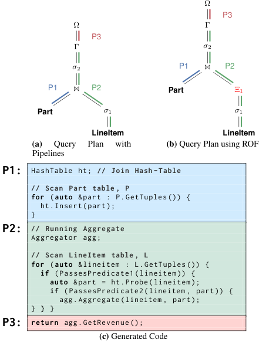

图 2 中的核心代码结构如下：

```cpp
HashTable ht; // Join Hash-Table

// P1: scan Part table
for (auto &part : P.GetTuples()) {
  ht.Insert(part);
}

Aggregator agg;

// P2: scan LineItem and process join/filter/aggregate
for (auto &lineitem : L.GetTuples()) {
  if (PassesPredicate1(lineitem)) {
    auto &part = ht.Probe(lineitem);
    if (PassesPredicate2(lineitem, part)) {
      agg.Aggregate(lineitem, part);
    }
  }
}

// P3
return agg.GetRevenue();
```

### 2.2 向量化处理

图 2c 的代码减少了分支和函数调用等 CPU 指令，因而优于解释执行，但它仍然一次处理一条元组，使 DBMS 难以采用同时作用于多条元组的优化 [6]。

早期系统已经研究过每次迭代生成多条元组。MonetDB 的批量处理模型会物化每个算子的全部输出，从而减少函数调用次数；但除非表采用列式布局且查询谓词选择性很强，这种方法会破坏 cache 局部性 [43]。MonetDB 的 X100 项目 [11] 改为每次生成通常包含 100 到 10,000 条元组的结果向量，并成为 VectorWise（现为 Actian Vector）的基础；Snowflake [17] 和 Tupleware [16] 也采用了类似方法。

现代 CPU 很适合向量化处理。循环紧凑且各次迭代往往相互独立，乱序处理器可以并发执行多个迭代，充分利用深流水线。向量引擎可依赖编译器自动发现能转换为 SIMD 的循环，但现代编译器通常只能优化针对数值列的简单计算循环；直到较近的研究才展示如何手工 SIMD 化更复杂的数据库操作 [33, 34]。

图 3 给出 Q19 的向量化伪代码。P1 与图 2c 基本相同，但以 block 读取 Part。向量化 DBMS 采用晚期物化，因此哈希表只保存连接键属性及对应的 tuple ID。P2 读取 LineItem block，并把整个 block 一次交给 `PassesPredicate1`。谓词函数返回通过条件的元组位置数组，即选择向量（selection vector）；后续每次调用都携带该向量，只处理仍然有效的元组。系统用输入 block 和选择向量探测哈希表，找出候选连接匹配，再依据匹配位置从 Part 重构元组 block。倒数第二步同时使用两个 block 与连接产生的选择向量，生成最终有效元组列表，然后执行聚合。

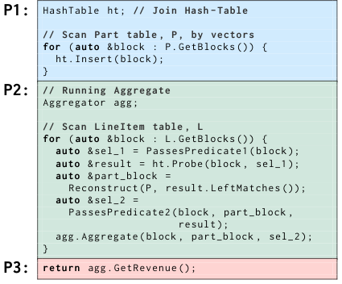

```cpp
HashTable ht; // Join Hash-Table

// P1
for (auto &block : P.GetBlocks()) {
  ht.Insert(block);
}

Aggregator agg;

// P2
for (auto &block : L.GetBlocks()) {
  auto &sel_1 = PassesPredicate1(block);
  auto &result = ht.Probe(block, sel_1);
  auto &part_block = Reconstruct(P, result.LeftMatches());
  auto &sel_2 = PassesPredicate2(block, part_block, result);
  agg.Aggregate(block, part_block, sel_2);
}

// P3
return agg.GetRevenue();
```

向量化既能利用现代编译器，也能利用现代 CPU，并为显式 SIMD 提供了条件；但大多数 DBMS 并不会在整棵查询计划中都使用 SIMD。一些系统只在 checksum 等内部子任务上使用它；另一些研究虽为关系算子提供 SIMD 实现，却假设数据集足够小、能完全放入 CPU cache [33]。真实应用通常不满足这一假设。一旦数据不能驻留 cache，处理器会因内存访问停顿，向量化的计算吞吐优势便会大幅缩小。

### 2.3 预取

预取的基本思想是预测 DBMS 即将进行的内存访问，在真正使用数据前主动把它从内存搬入 CPU cache，从而避免后续访问发生 cache miss。请求既可由硬件预测器发起，也可由显式软件预取指令发起。现代 CPU 能检测并预取规则的步长访问，因此单列顺序扫描很适合硬件预取；但哈希表或索引探测等不规则模式超出了硬件预取器的能力。编译器也能为数组程序自动插入软件预取 [29]，研究者还提出过针对指针数据结构的编译预取算法 [27]，然而现代编译器同样无法识别数据库操作中常见的不规则模式。

以往已有针对 DBMS 算子的预取研究 [14, 22]。这些方法的共同思路，是把每条元组含有 N 次相互依赖内存访问的主循环，改造成 N+1 个代码步骤：每一步消费上一步预取的数据，并为下一步发起新预取。

- 分组预取（group prefetching，GP）[14] 以大小为 G 的组处理输入；组内元组锁步通过各个代码步骤，从而保证同时最多存在 G 个相互独立的在途内存访问。
- 软件流水线预取（software-pipelined prefetching，SPP）让不同元组分别处在不同代码步骤，形成流动的流水线。
- 异步内存访问链（asynchronous memory-access chaining，AMAC）[22] 维护一个处于不同处理步骤的元组窗口；某条元组一完成便立即换出，支持提前结束。

主流商用 CPU 大约从二十年前开始在指令集中加入软件预取。硬件可同时跟踪的在途预取数量不断增加，但仍然有限；如果 DBMS 在短时间内发出过多请求，跟踪未完成请求的硬件缓冲区一旦填满，CPU 很可能直接丢弃后续预取。

## 3. 问题概览

查询编译、向量化和预取各自都能优化内存 DBMS 的执行，那么能否构造一种同时保留三者收益的查询处理模型？据我们所知，当时还没有 DBMS 成功做到这一点。主要原因是，多数查询编译系统生成一次一条元组的代码，并主动避免物化；向量化与预取却都需要输入向量，才能利用数据级或元组间并行性。已有研究或者退回解释式 SIMD 扫描，再把结果逐条喂给编译代码 [25]；或者无法把数据暂存在适合预取的位置 [15]。向量化系统依靠 CPU 乱序执行发掘数据级并行，但对哈希连接或索引探测等复杂算子往往无能为力。因而需要一种混合模型：既支持一次一条元组，也支持向量化与预取，并只在收益合适的位置物化状态。

我们用一个哈希连接微基准说明这种矛盾。两张表都只有一个 32-bit 整数列，并实现三种连接：(1) 标量的一次一条元组连接；(2) 采用文献 [33] 垂直向量化技术的 SIMD 连接；(3) 加入分组预取 [14] 的一次一条元组连接。

实验把连接哈希表大小从 1 MB 调到 1024 MB，以每秒输出元组数衡量总吞吐。探测表 A 固定为 1 亿条元组，原始数据约 382 MB；通过改变 build 表 B 的大小生成目标规模的哈希表。哈希表采用开放寻址和线性探测，填充因子为 50%，哈希函数使用 MurmurHash3 的 32-bit finalizer；选择该函数是为了接近真实实现，且它只需要三次位移、两次乘法和三次异或。每个 bucket 包含 4-byte key 和 4-byte payload，整体按结构体数组布局。两张表的值都均匀分布，A 中每条元组至多匹配 B 中一条。连接输出 1 亿条元组，总计约 381 MB。机器有 20 个关闭超线程的硬件线程和共享的 25 MB L3 cache；完整环境见第 5 节。

图 4 给出结果。采用垂直向量化的 SIMD probe 即使在哈希表可驻留 cache 时，也慢于带预取的一次一条元组 probe，因为哈希冲突与键冲突会迫使向量化版本重新计算哈希。当哈希表超出 cache 后，一次一条元组的两个版本（有、无预取）都快于 SIMD：此时连接从计算受限转为内存受限，提高计算吞吐已无济于事。在所有规模下，带预取的一次一条元组处理都表现最好，常常最多快 1.2 倍。

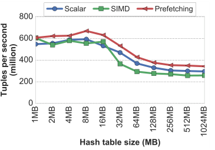

微基准的主要结论是：对哈希连接而言，不论哈希表大小如何，带预取的一次一条元组处理都胜过 SIMD。预取必须同时观察一批元组，才能利用元组间并行；而完全流水线化的编译计划恰恰避免一切物化。与此同时，越往计划树上层，数据越稀疏、访问越随机，软件预取越重要：在叶子处还可依靠硬件预取器，在上层则不行。因此，全向量化和全编译融合都不是最优解。DBMS 应该能在查询计划中的适当位置谨慎物化元组，为预取与向量化创造条件；在其他位置仍融合算子，保持高效流水线。

## 4. Relaxed Operator Fusion

算子融合的首要目标是尽量减少物化；我们认为，若物化位置选择得当，它反而可以暴露查询执行固有的元组间并行性。一次一条元组的处理天然没有这种并行性。因此，ROF 放松“流水线内所有算子必须融合”的约束，把一条流水线分解为多个阶段（stage）；每个阶段是流水线的一个分区，分区内所有算子仍然融合。

同一流水线的阶段只通过 cache-resident 的 tuple ID 向量通信。元组在某一阶段内逐条顺序通过算子；若元组在该阶段仍然有效，其 ID 就追加到输出向量。只要输出向量未满，执行便停留在当前阶段；向量达到容量后，处理转移到下一阶段，前一阶段的输出成为后一阶段的输入。ROF 任一时刻恰好只有一个活跃阶段，因此只要向量足够小，输入与输出向量都能留在 CPU cache 中。

ROF 是流水线式一次一条元组处理与向量化处理的混合体。它与传统向量化有两个关键差异。第一，除流水线最后一轮之外，ROF 阶段总向下游交付 100% 填满的输入向量，而传统向量引擎交付的 block 可能受选择向量限制，只有部分位置有效。第二，ROF 允许一个阶段跨越多个连续的关系算子，并在其中融合执行；传统向量化通常逐个关系算子处理，甚至会把一个算子拆成多个向量化原语，例如先向量化计算哈希，再向量化查表。

选择暂存点的原则是：当短暂物化 tuple ID 的成本低于由元组间并行、SIMD 和预取获得的收益时，便放松融合。典型位置包括可 SIMD 化算子的输入和输出，以及对超出 cache 的结构执行随机访问的算子输入。

### 4.1 示例

回到 TPC-H Q19，图 2b 在第一个谓词 $\sigma_1$ 之后加入一个阶段边界；图中 $\Xi$ 表示阶段输出向量。图 5 是修改后 P2 的生成代码。第一阶段（原文第 13-20 行）扫描 LineItem，把元组交给 $\sigma_1$ 判断；通过的 tuple ID 追加到 $\Xi$。向量达到容量或扫描耗尽 LineItem 后，才把整批 ID 交给下一阶段。

第二阶段（原文第 22-30 行）据此读取有效 LineItem 元组，探测连接哈希表并寻找匹配。若存在匹配，LineItem 和 Part 两侧的数据一起交给第二个谓词 $\sigma_2$；仍通过的结果进入最终聚合。

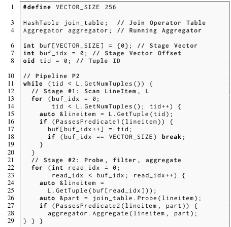

```cpp
#define VECTOR_SIZE 256

HashTable join_table;
Aggregator aggregator;

int buf[VECTOR_SIZE] = {0}; // stage vector
int buf_idx = 0;            // stage vector offset
oid tid = 0;                // tuple id

while (tid < L.GetNumTuples()) {
  // Stage #1: scan LineItem
  for (buf_idx = 0; tid < L.GetNumTuples(); tid++) {
    auto &lineitem = L.GetTuple(tid);
    if (PassesPredicate1(lineitem)) {
      buf[buf_idx++] = tid;
      if (buf_idx == VECTOR_SIZE) break;
    }
  }

  // Stage #2: probe, filter, aggregate
  for (int read_idx = 0; read_idx < buf_idx; read_idx++) {
    auto &lineitem = L.GetTuple(buf[read_idx]);
    auto &part = join_table.Probe(lineitem);
    if (PassesPredicate2(lineitem, part)) {
      aggregator.Aggregate(lineitem, part);
    }
  }
}
```

每条流水线仍只生成一个外层循环（原文第 11-31 行），其中包含该流水线全部阶段的逻辑。DBMS 把外层循环拆成多个内层循环，每个阶段一个；图 5 的第 13-20 行与第 22-30 行分别对应两个阶段。阶段内的算子代码继续融合，例如第 26 行是 probe，第 27 行是第二个谓词，第 28 行是聚合。一般而言，一条含 $k$ 个阶段的流水线会有 $k$ 个内层循环和 $k-1$ 个阶段输出向量。

每个输出向量都维护读位置和写位置。写位置记录向量中已有多少条元组；读位置记录下游阶段已经消费到哪里。阶段在两种情况下耗尽输入：(1) 读位置越过基表、哈希表等物化状态的数据末端；(2) 输入向量的读写索引相等。只有组成流水线的所有阶段都结束，整条流水线才算完成。若某阶段访问的外部数据结构还要供后续阶段使用，ROF 会增加一个与主 tuple ID 输出向量对齐的伴随向量，用来保存数据位置或指针。

ROF 足够灵活，可以同时表示一次一条元组和传统向量化，因而涵盖两种模型。若每条流水线恰好只有一个阶段，阶段内所有算子完全融合，没有中间输出向量，便退化为一次一条元组。若在流水线每对算子之间都设置阶段边界，则可表示向量化处理。暂存本身收益有限；其价值在于让原本不可能使用的 SIMD 和对非 cache-resident 数据的预取成为可能。

### 4.2 向量化

一次一条元组执行通常无法使用 SIMD。ROF 在 SIMD 算子的输入处建立阶段边界，以一个向量为其供数；接下来还需要决定，是否也在 SIMD 算子的输出处建立边界。若有输出边界，算子可以用 selective store 把有效 tuple ID 高效写入输出向量。若没有边界，算子结果就必须继续流经同一阶段的后续算子，此时有两种方案：一是退出 SIMD 代码，逐 lane 迭代结果并逐条推给下游 [12, 42]；二是把包含全部 lane 的 SIMD 寄存器直接交给下游。前者会让寄存器在阶段剩余处理期间一直被占用，后者在部分输入未通过算子时会让无效 lane 继续参与计算，两者都不理想。

因此，ROF 贪心地在所有 SIMD 算子输出处强制设置阶段边界。这样做有三个好处：(1) SIMD 算子总能向下游交付只含有效元组、100% 填满的向量；(2) 后续算子无需做有效性检查；(3) DBMS 可以生成完全由 SIMD 指令组成的紧凑内层循环。

与标量选择返回一个布尔值不同，SIMD 谓词一次处理 $n$ 个元素，返回保存在 SIMD 寄存器中的 bitmask；每个元素对应的所有位要么全 0、要么全 1，表示相关元组是否有效。一种“部分向量化”的实现会逐位迭代 mask 以取出有效性。ROF 改为全程留在 SIMD 代码中：使用预先计算、驻留 cache 的索引表查出 permutation mask，把 SIMD 元素重排为有效与无效两段。

图 6 对 4-byte 整数列 `attr_A` 求值谓词 `attr_A < 44`。DBMS 先把硬件最宽 SIMD 寄存器能容纳的属性值及其 tuple ID 一并装入，然后比较得到 bitmask。示例中 ID 为 1、3、7 的元组未通过。系统调用 `movemask` 把 bitmask 转为整数 174，用它索引 permutation table，查得重排序列 `(0,2,4,5,6)`。该序列把位置 0、2、4、5、6 的有效元素移至寄存器最前方，相当于在寄存器内划分有效与无效部分。系统对原 bitmask 和 tuple ID 计数器应用同一 permutation，再以重排后的 bitmask 为选择 mask，用 masked store 把 ID 写到当前输出位置。最后通过 `popcnt` 统计有效元组数并推进写位置，装入下一组属性，同时让 tuple ID 向量前进 8。

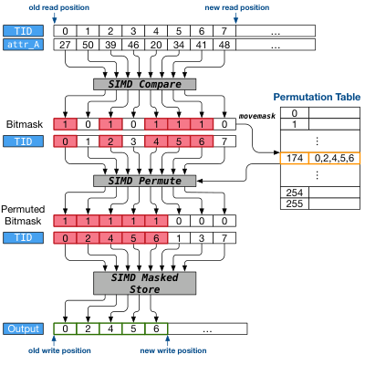

若 SIMD register 有 $n$ 个元素，则 bitmask 可能状态数为：

$$
2^n
$$

在 AVX2 256-bit register 处理 8 个 4-byte 整数时， $n=8$，共有 $2^8=256$ 个 mask。每个 mask 存储 8-byte permutation，因此表大小为：

$$
2^8 \times 8 = 2\text{KB}
$$

该表可驻留在 CPU L1 cache 中。

### 4.3 预取

除规则的顺序扫描之外，DBMS 中较复杂的内存访问通常超出当时硬件预取器和商用编译器的处理范围。因此，我们为 OLAP DBMS 中重要的不规则、数据依赖访问提出新的编译器 pass，用于自动插入预取指令。

DBMS 必须足够早地预取，才能用有效计算覆盖内存延迟；同时又要避免不必要预取带来的额外开销 [29]。若只在单条元组的流水线处理范围内预取，等系统知道该元组能在计划树上走多远时，剩余计算往往已经不足以掩盖延迟。反过来，激进地预取流水线内可能用到的全部数据，也会因为 cache 污染和无效指令损害性能。流水线越复杂，未来数据地址越难提前预测，这两类问题也越严重。

ROF 在需要随机访问、且访问结构大于 cache 的算子输入处安装阶段边界。这样，启用预取的算子总会收到完整的输入向量；不同元组可以独立处理，系统便能重叠它们的计算与内存访问。第 5 节实验表明，哈希连接和哈希聚合是两类能从预取中显著获益的重要算子。

图 7 展示论文中 hash table 的 open-addressing 数据结构。每个 bucket 包含 status、key、value 和 hash；status 与 key 放在 bucket 开头，使 probe 时可以尽量用一次内存引用读取必要元数据。

实现细节以图 7 的哈希表为例，连接和哈希聚合都使用该结构。表采用开放寻址与线性探测；此前研究表明这种设计稳健且 cache-friendly [35]。主哈希函数选用 MurmurHash3 [9]。文献 [33] 更偏好 multiply-add-shift 等计算简单的函数，但我们需要一个通用函数，既支持多种非整数类型、又有丰富的哈希分布，同时执行足够快；MurmurHash3 满足这些条件，也被 MemSQL、Cassandra 和 Spark 等系统采用 [4, 2, 3]。

哈希表由连续 bucket 数组组成。每个 bucket 起始是 8-byte 状态字段，分别表示空、含一个键值对、或该键存在重复值。重复值存放在外部连续内存区，此时状态字段改作指向该区域的指针。状态与键放在 bucket 前部，以便在键不超过一个 cache line 减去 8 byte 时，用一次内存 load 同时读出两者。每次插入或探测都会查看状态，键则用于解决键冲突。哈希值仅在 resize 时用于避免重算；resize 远少于插入与探测，故把哈希放在 bucket 末尾不会影响总体连接或聚合性能。

该布局同时适合软件和硬件预取。连接与聚合以元组向量为输入，软件预取可加速第一次随机探测；发生哈希冲突后，连续 bucket 的线性探测又能触发硬件预取器。把状态和键放在最前面，旨在用至多一次 bucket 内存引用判断是否占用及键是否匹配。

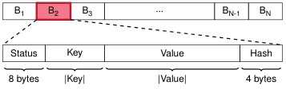

ROF 可搭配任意软件预取方法，本文选择 GP 有四个原因。第一，GP 代码比 SPP 和 AMAC 更容易生成。第二，GP 天然在各代码步骤之间提供组级同步边界，插入重复键值对时可借此解决潜在数据竞争。第三，文献 [14] 表明 SPP 相对 GP 只带来很小提升，却需要更复杂的代码结构。第四，开放寻址加线性探测意味着每条元组在插入或探测时恰好发生一次随机哈希表访问，只有重复值处理需要两次；即便数据倾斜，同一组中的元组仍有相同随机访问次数，因而 AMAC 的提前换出机制不会比 GP 更有优势。

### 4.4 查询规划

用 ROF 生成代码时，优化器对每个查询要做两个决定：(1) 是否启用 SIMD 谓词求值；(2) 是否启用预取。

Peloton 的 planner 对 SIMD 采用贪心策略：如果扫描算子的谓词可以 SIMD 化，就在每个此类扫描后设置边界。表达式树已经包含数据类型和运算信息，据此判断谓词能否映射到 SIMD 指令并不困难。第 5 节实验显示，在扫描谓词上使用 SIMD 从未导致性能下降。

预取有两种规划方法。第一种依赖数据库级和查询级统计信息，估计查询所需的全部中间物化结构大小；若某个算子随机访问的结构预计超过 cache，planner 就在其输入处设置阶段边界，并为其启用预取。若统计不准确，该启发式可能失误并造成小幅退化，第 5.3 节的 Q1 即是实例。

第二种方法是在每个执行随机内存访问的算子输入处都设置阶段边界，但为它生成两条代码路径：一条预取，一条不预取。查询编译器同时生成统计收集代码，运行时跟踪中间结构大小，再据此选择路径。这样，预取决定便从查询规划中解耦。朴素实现会造成代码膨胀：每个分支都要复制余下查询逻辑，多个预取算子会反复放大。ROF 可在该算子的输出处再设置阶段边界，只复制当前算子的两种实现，而无需复制查询计划其余部分。

## 5. 评估

我们在 Peloton 内存 DBMS [5] 中实现 ROF。Peloton 原本是使用解释式查询执行引擎的 HTAP DBMS；实验版本先把 planner 改为使用 LLVM 3.7 支持 JIT 编译，再扩展为能生成包含 ROF 优化的编译计划。

实验机器采用双路 10-core Intel Xeon E5-2630v4，合计 20 个物理核、25 MB L3 cache 和 128 GB DRAM。该 Broadwell 处理器支持 AVX2 256-bit SIMD 寄存器，每个物理核可同时保有 10 个未完成内存预取请求，即 10 个 line-fill buffer（LFB）槽。我们还在更老的 Haswell CPU 上测试过，没有发现性能趋势变化。

评估先说明工作负载，再把 ROF 与只做查询编译的 baseline 作高层比较；随后逐条拆解计划，分析 ROF 在哪些算子上最有效；接着为每条 TPC-H 查询选出最佳计划，分别测量 vector size 和 prefetch distance 两个编译参数的敏感性。为避免 cache coherence traffic 干扰，这些初始实验每个查询只用单线程，且不并发运行多个查询。之后再测量多线程性能，最后把 Peloton ROF 与另外两个先进 OLAP DBMS 的绝对性能比较。

数据库通过 `numactl` 全部装入同一 NUMA region。每个实验运行十次，报告十次实际执行时间的平均值。

### 5.1 工作负载

实验采用 TPC-H [40] 的一个子集。TPC-H 是模拟 OLAP 环境的决策支持工作负载，事先几乎不了解将执行的查询；其模式包含 8 张满足 3NF 的表。所有实验使用 scale factor 10，数据约 10 GB。Peloton 当时仍处于早期开发阶段，我们计划在系统成熟后再测试更大规模。

TPC-H 共 22 条查询，我们选择 Q1、Q3、Q4、Q5、Q6、Q13、Q14 和 Q19 八条，覆盖文献 [10] 给出的全部 TPC-H choke-point 分类，同时囊括从计算密集到内存/连接密集的不同查询，因此预期结论也能推广到其余查询。

图 8 展示其中 Q1、Q3、Q13 和 Q14 的高层查询计划与流水线标注；Q19 的计划见图 2a。

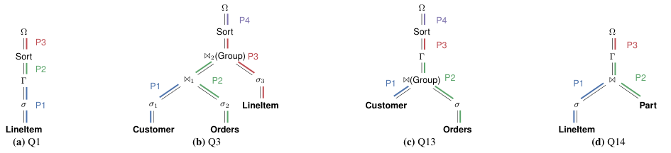

### 5.2 基线比较

第一组实验采用 HyPer [30] 等查询编译 DBMS 的以数据为中心的方法（data-centric）作为 baseline，再执行启用 ROF 的同一批查询，以衡量第 4 节所述预取和向量化优化能带来的提升。

图 9 比较 Peloton 以数据为中心的编译引擎启用与不启用 ROF 的结果。除 Q1 外，其余七条查询均加速 1.7-2.5 倍。Q1 的特殊原因在 5.3 节详述：它的聚合哈希表只有 4 项、可驻留 L1，预取指令反而带来成本；准确统计应避免这项优化。

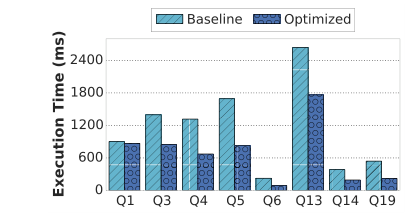

### 5.3 优化分解

论文逐个查询分解 ROF 优化。每个图的 baseline 是未使用 ROF 的执行，后续 O1、O2 等优化是累积应用的。

图 10 是 Q1 case study。ROF 相对 baseline 只提高 1.04 倍。绝大部分时间在 P1 的选择与聚合中；P2 把聚合结果物化到用于排序的内存堆，P3 执行排序，二者合计不足执行时间的 0.3%，在图中几乎不可见。

O1 在 P1 的 LineItem 谓词后加入边界，并把标量谓词改为 SIMD 检查。该谓词选择率高达 98%，SIMD 的较低 CPI 收益被把几乎所有有效 ID 复制进输出向量的冗余开销抵消，因此延迟只略微降低。更重要的是，扫描只占 P1 总时间的 4%，其余 96% 在聚合。即使 AVX2 256-bit 对扫描达到理论最高 8 倍加速，整条查询也最多加速 1.036 倍。

O2 复用 SIMD 扫描写入 $\Xi$ 的阶段向量，为聚合 build 阶段预取哈希 bucket。结果查询反而变慢，因为聚合哈希表只有 4 项，足以放进 L1 cache，无需预取；调用预取指令的成本不可忽略。这个结果说明准确查询统计很重要：错误估计会让 planner 为预取安装不必要的 ROF 阶段边界并降低性能。

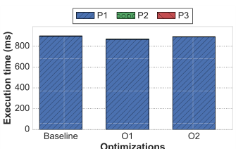

| 优化 | 修改 | 说明 |
|---|---|---|
| O1 | `P1 => (LineItem -> σ -> Ξ -> Γ)` | 对谓词 `σ` 应用 SIMD。 |
| O2 | `-` | 使用 `Ξ` 为 `Γ` build 阶段预取 bucket。 |

图 11 是 Q3 case study。简单 SIMD 谓词优化（O1、O2、O5）只带来小幅收益；更重要的是在 hash table probe 前插入 staging vector 并进行预取（O3、O4、O6）。

Q3 三个 scan/filter 仅占相应 pipeline 的约 1%、3.7%、7%；O3 对第一 join probe prefetch 使 P2 快 1.4 倍，O4 对第二 join build prefetch 使 P2 再快 1.26 倍、全查询 1.14 倍；O6 对最大 LineItem 的 probe prefetch 带 1.38 倍，全部优化累计约 1.61 倍。

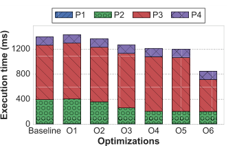

| 优化 | 修改 | 说明 |
|---|---|---|
| O1 | `P1 => (Customer -> σ1 -> Ξ1 -> ⋈1)` | 对 `Customer` 的谓词 `σ1` 应用 SIMD。 |
| O2 | `P2 => (Orders -> σ2 -> Ξ2 -> ⋈1 -> ⋈2)` | 对 `Orders` 的谓词 `σ2` 应用 SIMD。 |
| O3 | `-` | 使用 `Ξ2` 为 `⋈1` probe 阶段预取 bucket。 |
| O4 | `P2 => (Orders -> σ2 -> Ξ2 -> ⋈1 -> Ξ3 -> ⋈2)` | 使用 `Ξ3` 为 `⋈2` build 阶段预取 bucket。 |
| O5 | `P3 => (LineItem -> σ3 -> Ξ4 -> ⋈2 -> Sort)` | 对谓词 `σ3` 应用 SIMD。 |
| O6 | `-` | 使用 `Ξ4` 为 `⋈2` probe 阶段预取 bucket。 |

图 12 是 Q13 case study。Q13 中 Orders 的 predicate 不能用 SIMD 直接处理，但在 predicate 后建立 stage boundary，仍能通过预取 group-join 的 hash bucket 提升性能。

O1 对 group-join build/probe prefetch 快 1.34 倍；O2 对 aggregation build prefetch 再快 1.04 倍，累计约 1.5 倍。

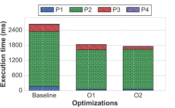

| 优化 | 修改 | 说明 |
|---|---|---|
| O1 | `P2 => (Orders -> σ -> Ξ1 -> ⋈ -> Γ)` | 使用 `Ξ1` 为 `⋈` probe 阶段预取 bucket。 |
| O2 | `P2 => (Orders -> σ -> Ξ1 -> ⋈ -> Ξ2 -> Γ)` | 使用 `Ξ2` 为 `Γ` build 阶段预取 bucket。 |

图 13 是 Q14 case study。LineItem 上的谓词选择率约 2%，非常适合转成 SIMD predicate；预取 build/probe 阶段进一步降低 join 成本。

SIMD 使 P1 快 1.89 倍、全查询快 1.37 倍；join build/probe prefetch 相对前一步再快 1.45 倍，累计近 2 倍。最终 aggregation 是固定单输出 counter，几乎无成本。

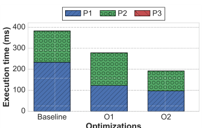

| 优化 | 修改 | 说明 |
|---|---|---|
| O1 | `P1 => (LineItem -> σ -> Ξ -> ⋈)` | 对 `LineItem` 的谓词 `σ` 应用 SIMD。 |
| O2 | `-` | 使用 `Ξ` 和 `Part` 为 join `⋈` 期间预取 bucket。 |

图 14 是 Q19 case study。Q19 的第一阶段谓词选择率低于 4%，适合 SIMD；后续 O2/O3 通过 staged prefetching 继续降低 probe 和后续处理成本。

O1 使全查询近 1.6 倍；复用其 vector 对 join probe/build prefetch 后，相对前一步再近 1.6 倍，累计约 2.5 倍。

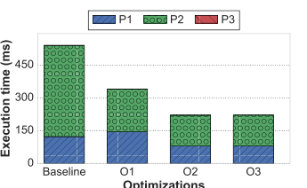

| 优化 | 修改 | 说明 |
|---|---|---|
| O1 | `P2 => (LineItem -> σ1 -> Ξ1 -> ⋈ -> σ2 -> Γ)` | 对 `LineItem` 的谓词 `σ1` 应用 SIMD。 |
| O2 | `-` | 使用 `Ξ1` 为 `⋈` probe 阶段预取 bucket。 |
| O3 | `P2 => (LineItem -> σ1 -> Ξ1 -> ⋈ -> Ξ2 -> σ2 -> Ξ3 -> Γ)` | 在每对算子之间插入 staging point。 |

### 5.4 向量宽度敏感性

此前实验对每条查询都使用最佳 vector size 和 prefetch group size。这里固定 prefetch group 为 16，为八条查询选取最佳 staged plan，再把全部输出向量的容量从 64 改到 256K 条元组，以衡量阶段输出宽度的影响。

图 15 显示，除 Q3 外其余查询对 vector width 基本不敏感。Q14 和 Q19 虽然都从 SIMD 获得很大收益，宽度变化却不显著：它们的扫描选择率分别很低，Q14 为 2%，Q19 为 4%，SIMD 已把主要瓶颈推到后续阶段。Q14 的瓶颈主要是 join probe，Q19 则主要是 join build；两者都要访问超过 cache 的哈希表，即使有预取，额外内存延迟仍占计划执行时间的大头。

Q1 也不敏感，但原因不同：LineItem 上超过 98% 的元组通过谓词，P1 的瓶颈不是 SIMD 扫描，而是聚合；增大 vector 不会改善聚合。Q13 的主要瓶颈是 Orders 表 `o_comment` 列上的 `LIKE`，该谓词不能 SIMD 化；输出向量只用于后续 probe 的哈希 bucket 预取，而 group size 16 已足以饱和硬件的内存级并行，进一步增大 vector 没有帮助。

唯一随宽度改善的是 Q3，但超过 16K 后也不再提升。其 LineItem SIMD 扫描谓词约有 54% 选择率，较大的向量让执行在 SIMD 阶段连续停留更久，并减少最外层循环迭代。一般来说，较大向量可减少最外层迭代次数，对低选择率扫描有利；对含连接的查询则帮助有限，因为现代 CPU 可同时维持的内存引用数量有限，查询很快从计算受限转为内存受限。

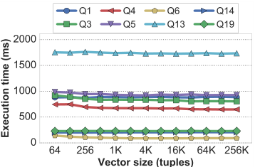

### 5.5 预取距离敏感性

我们再次使用第 5.2 节为每条查询选出的最佳 staged plan，并把输出向量宽度固定为第 5.4 节得到的最优值；随后把 prefetch group 从 0（禁用预取）调到 256 条元组。

图 16 显示，除 Q1 和 Q6 外，group size 对所有查询都有强烈影响。Q6 只有顺序扫描，性能自然不随预取组变化。Q1 唯一被预取的数据结构是可驻留 L1 的聚合哈希表，因而 group 为 0 时最快；不过其弱谓词仍能使用 SIMD，综合图 9 和图 10，ROF 并没有让 Q1 整体退化。

其余查询随 group 增大而加速，直到 16 后趋于饱和。实验 CPU 每核最多有 10 个未完成 L1 cache reference，直觉上 group 10 已应饱和 memory-level parallelism，实测最优值却是 16。原因是本文 GP 实现还受指令数约束：更大的组会减少最外层循环迭代，从而降低总指令数；超过 16 后 CPU 已经饱和，继续增大不再改善性能。

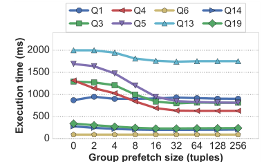

### 5.6 多线程执行

我们实现了 HyPer [26] 多线程策略的简化版本。查询计划中的每条流水线由多个线程执行，各线程只修改 thread-local state；遇到流水线断点时，由单一 coordinator thread 合并所有执行线程产生的数据。实验采用八条查询各自的最佳 staged plan，在 TPC-H SF10 数据库上把执行线程从 1 增加到机器的 20 个物理核，每个点仍取十次平均。

图 17 表明，ROF 的向量化与预取可以配合多线程执行。所有查询从 1 线程变为 2 线程时，执行时间反而出现跳升，这是多线程所需 bookkeeping 与同步的固定开销，与 ROF 无关。哈希连接 build 侧结束于同步 barrier：执行线程等待 coordinator 构建 global hash table。线程数少时，这项开销大于并行收益；线程更多后才被摊薄。

Q1 是高选择率谓词的 CPU-bound 查询，ROF 仍无改善，与第 5.3-5.5 节一致。Q1 随线程数增加持续加速，直到 20 个核全部利用并耗尽内存带宽。其余七条查询的加速趋势相近。虽然每个执行线程只构建一个较小的 thread-local hash table，coordinator 的 global table 始终超出 CPU cache；连接 probe 侧通常比 build 侧大一个数量级，因此 Q3、Q13、Q14、Q19 等查询使用 ROF 预取后，仍比 baseline 快 1.5-1.61 倍。

Q3 和 Q13 在超过 10 线程后出现轻微执行时间抖动，原因是双路 CPU 的 NUMA 效应（每个 socket 10 核）。两者都采用 group hash join，DBMS 在 build 和 probe 阶段使用同一个物化哈希表，并用 64-bit compare-and-swap 串行化对表的并发更新；不同 NUMA region 的 CPU 访问 global table 中计数器时延迟不同。Q5 也出现该效应，因为它需要探测两张 global hash table，即四次随机内存访问。尽管如此，ROF 仍约快 1.5 倍。

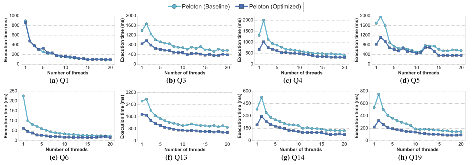

### 5.7 系统比较

最后把 Peloton ROF 与 Vector [1] 和 HyPer [20] 两个先进内存 DBMS 比较。Vector 是基于 MonetDB/X100 的列式系统，向量化执行引擎支持压缩表，并在硬件可用时采用 SIMD；HyPer 同样是列式系统，但像 Peloton 一样用 LLVM 生成一次一条元组的编译查询计划。Peloton 分别以 baseline（禁用 ROF）和 optimized（启用 ROF）两种配置执行。

所有系统使用第 5.1 节相同的硬件与数据库。为公平起见，三者都禁用多线程，并尽力针对 TPC-H 调优。Vector 和 HyPer 各自还有三套系统不完全共有的优化，因此我们只保证生成计划等价或至少差异不大。正式测量前，先在每个 DBMS 上执行一遍全部 TPC-H 查询完成 warm-up。

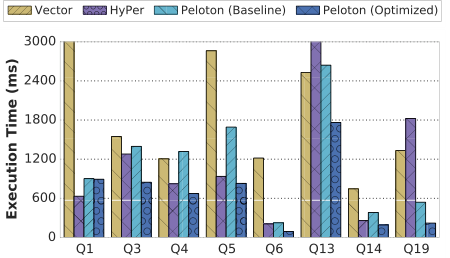

图 18 的逐查询结果如下。

- Q1：HyPer 最快，比 Peloton 快近 1.38 倍，比 Vector 快 6.5 倍以上；主要原因是 HyPer 使用定点 decimal arithmetic，而不是计算成本更高的浮点运算。
- Q3：Peloton ROF 分别比 Vector 和 HyPer 快 1.8 倍、1.5 倍；未启用 ROF 的 Peloton 与 HyPer 相近，因为二者都生成推送式编译查询。Q3 有两次连接；若不通过早期物化做分区，两张哈希表都无法驻留 cache，每次查表都会 miss。ROF 让不同元组的计算与内存访问重叠，从而隐藏延迟。基于 radix partition 的连接也能缓解该问题，但文献 [36] 表明，连接后为后续算子收集属性的开销会抵消 in-cache join 的收益。Vector 对 LineItem 谓词使用 SIMD，而实验所用 HyPer 版本没有 SIMD scan；后续工作 [25] 才补上该能力。
- Q4：Peloton ROF 分别比 Vector 和 HyPer 快 1.8 倍、1.2 倍。Peloton baseline 与 Vector 相近，但慢于 HyPer，原因是 HyPer 用 SIMD（SSE4）实现的 CRC32 求哈希，而 Peloton 的 MurmurHash3 计算更重。ROF 的预取收益部分被复杂哈希的额外指令抵消，不过相对 Peloton baseline 仍提升两倍以上。
- Q5：Peloton ROF 约比 Vector 快 3.4 倍，比 HyPer 快 1.1 倍。Q5 是包含五张大表的五路连接，物化连接表会超过 cache，因而预取格外重要。ROF 相对 Peloton baseline 提升两倍以上，但只略胜 HyPer；同样是因为 HyPer 的 CRC32 哈希更简单。LineItem 扫描在探测 Orders 哈希表前没有过滤，Peloton 的大量时间耗在哈希计算，更高的指令数抵消部分预取收益。
- Q6：Peloton ROF 分别比 Vector 和 HyPer 快 5.4 倍、2.3 倍。Q6 是带 1.2% 高选择性谓词的顺序扫描，SIMD 谓词求值在 Peloton 中带来两倍以上提升。所用 HyPer 版本不含 SIMD 优化 [25]，若加入后预计也能获得类似收益。
- Q13：Peloton baseline 慢于 Vector；启用 ROF、消除连接中的 cache miss 代价后，约比 Vector 快 1.4 倍。该查询大部分时间在 Orders 表扫描，因为其中包含 `LIKE`；性能很大程度取决于字符串匹配实现。Peloton 使用假定输入干净的简单比较，Vector 和 HyPer 较慢，我们推测二者可能使用了能处理破损 UTF 编码等异常数据的更复杂实现。
- Q14：LineItem 上的高选择性扫描适合 SIMD。Peloton ROF 和 Vector 可利用这一点，HyPer 的实验版本与 Peloton baseline 只能做标量扫描。Peloton 和 Vector 使用 hash join，HyPer 使用 index nested-loop join；因此 Peloton baseline 还要承担 probe 时遍历重复链的开销，慢于 HyPer。加入 SIMD scan，并对 join build/probe 两侧预取后，Peloton ROF 分别比 Vector 和 HyPer 快 3.9 倍、1.35 倍。
- Q19：与 Q14 类似，LineItem 上也有高选择性扫描。相关属性基数足够低，Peloton 使用 dictionary encoding，ROF 将标量扫描变成 SIMD 向量扫描；Vector 也自动压缩字符串。再加入预取和暂存后，Peloton ROF 分别比 Vector 和 HyPer 快 6 倍、8 倍。

综合实验，宽松融合最多把 OLAP 查询执行时间降低 2.2 倍，并相对其他内存 DBMS 达到最高 1.8 倍的整体性能收益。完全融合并非查询编译的终点；现代硬件上，适度物化有时更优。

## 6. 相关工作

20 世纪 70 年代，IBM System R 已经使用过一种原始的代码生成方法 [13]：系统为每个算子选择预定义代码模板，把 SQL 语句直接编译为汇编。研究者后来指出，重复查询通过避免反复解析和优化显然可从编译中获益，但临时查询的收益不够明确。IBM 在 1980 年代初放弃该方法，原因包括外部函数调用成本高、跨操作系统可移植性差，以及软件工程复杂。

此后在 1980 和 1990 年代，除少数例外，主流 DBMS 不再考虑查询编译，转而采用 Volcano 查询处理模型 [19]。Volcano 抽象让 planner 可以用算子组合执行计划，实现和维护都更容易；在磁盘型 DBMS 中，它与查询编译性能相近，因为查询求值主要耗时在磁盘取数，而非解释开销。

内存 DBMS 兴起后，查询编译重新受到重视。Microsoft Hekaton [18] 是较早恢复该技术的系统之一；它是 SQL Server 的内存 OLTP 存储管理器，把传统查询计划转换为一个实现 Volcano-style iterator 的 C 函数。

Cloudera Impala [23] 是分布式 OLAP DBMS，具有 C++/LLVM 混合的向量化执行引擎。它用 LLVM 编译频繁执行函数的查询特化版本，包括元组解析、哈希计算和谓词求值；UDF 也会被编译并内联进查询计划。

HyPer [20] 推动了以数据为中心的（data-centric）推送式查询执行模型 [30]。它把查询计划翻译为 LLVM IR，但复杂且与具体查询无关的数据库逻辑仍使用预编译 C++。推送式引擎融合流水线内全部算子，避免算子间物化，使其能直接访问 CPU 寄存器中的元组属性，生成紧凑循环并改善代码局部性和执行时间。

MemSQL [4] 同样使用 LLVM 做全查询编译。它把查询参数从查询中剥离，使同一查询换用不同输入值时无需重新编译。LegoBase [21] 则采用生成式编程（staging）：对 Volcano-style 解释引擎做部分求值，生成高度定制的 C 查询代码；转换过程中可应用推送式数据流、行式或列式布局、向量化或一次一条元组处理等优化。

DBToaster [8, 7] 是面向高效视图维护的流处理引擎。传统 DBMS 会把物化视图增量更新视为普通表更新；DBToaster 分析视图与基表关系，构造优化的 delta query，常可免去后续基表扫描，再把它翻译为 C++ 并用标准编译器生成机器码。

Tupleware [15] 是分布式 DBMS，可把由 UDF 组成的工作流自动编译为 LLVM IR。系统分析工作流，区分可向量化与不可向量化部分，以指导代码生成；还提出一种混合谓词求值方法，用启发式模型把谓词检查与输出复制分开。

文献 [38] 和 [37] 在投影、选择和哈希连接三类简单查询上比较向量化与编译引擎，结论是没有一种技术始终最优，必须组合二者才能获得最佳性能。HIQUE [24] 不使用 Volcano iterator，而是依据每个算子的 C++ 代码模板把代数计划编译出来；模板规定算子结构，底层记录访问和谓词逻辑再按查询定制。它与 ROF 的差别在于每个算子都物化结果，无法实现算子流水线。

MapD [39] 是针对只读查询的 GPU 加速 DBMS，使用 C++/LLVM 混合引擎。查询专用例程和谓词表达式先编译成 LLVM IR，再通过 Nvidia 的中间 NVVM IR JIT 编译成 GPU 本地代码。与 MemSQL 类似，它会提取常量，避免输入参数变化时重新编译；实现上用生成的 IR 作为哈希表键，把 IR 映射到已 JIT 的查询代码。

ROF 与上述工作的区别，是在同一个编译执行模型中有选择地保留算子融合，并借助 cache-resident 暂存向量统一支持 SIMD 与显式预取；planner 还会根据谓词能力和数据结构大小决定边界位置。

## 7. 结论

本文提出面向内存 OLAP DBMS 的宽松算子融合查询处理模型。DBMS 在计划中设置暂存点，把中间结果短暂物化到 cache-resident buffer；这些缓冲区让系统能用向量化与软件预取共同利用元组间并行，在数据集超过 CPU cache 时也可采用原先无法在完全融合计划中使用的优化。

我们在 Peloton 内存 DBMS 中实现 ROF，实验显示其最多将 OLAP 查询执行时间降低 2.2 倍；与 HyPer 和 Actian Vector 相比，执行时间最多降低到带来 1.8 倍性能收益。核心观点是算子融合应服务于性能，而不是成为绝对原则：对 cache-resident 查询，完全融合能减少开销；对内存延迟主导查询，适度暂存能暴露元组间并行，使 SIMD 和预取发挥作用。

## 致谢

本文工作部分由 National Science Foundation (CCF-1438955, IIS-1718582) 和 Intel Science and Technology Center for Visual Cloud Systems 支持。我们还感谢 Tim Kraska 的反馈。

## 参考文献

- [1] Actian Vector. http://esd.actian.com/product/Vector.
- [2] Apache Cassandra. http://cassandra.apache.org/.
- [3] Apache Spark. http://spark.apache.org/.
- [4] MemSQL. http://www.memsql.com.
- [5] Peloton Database Management System. http://pelotondb.io.
- [6] D. J. Abadi, S. R. Madden, and N. Hachem. Column-stores vs. row-stores: How different are they really? In SIGMOD, pages 967-980, 2008.
- [7] Y. Ahmad, O. Kennedy, C. Koch, and M. Nikolic. Dbtoaster: Higher-order delta processing for dynamic, frequently fresh views. PVLDB, 5(10):968-979, 2012.
- [8] Y. Ahmad and C. Koch. Dbtoaster: A SQL compiler for high-performance delta processing in main-memory databases. PVLDB, 2(2):1566-1569, 2009.
- [9] A. Appleby. MurMur3 Hash. https://github.com/aappleby/smhasher.
- [10] P. Boncz, T. Neumann, and O. Erling. TPC-H Analyzed: Hidden Messages and Lessons Learned from an Influential Benchmark. 2014.
- [11] P. Boncz, M. Zukowski, and N. Nes. MonetDB/X100: Hyper-pipelining query execution. In CIDR, 2005.
- [12] D. Broneske, A. Meister, and G. Saake. Hardware-sensitive scan operator variants for compiled selection pipelines. In Datenbanksysteme für Business, Technologie und Web (BTW), pages 403-412, 2017.
- [13] D. D. Chamberlin, M. M. Astrahan, M. W. Blasgen, J. N. Gray, W. F. King, B. G. Lindsay, R. Lorie, J. W. Mehl, T. G. Price, F. Putzolu, P. G. Selinger, M. Schkolnick, D. R. Slutz, I. L. Traiger, B. W. Wade, and R. A. Yost. A history and evaluation of system r. Commun. ACM, 24:632-646, October 1981.
- [14] S. Chen, A. Ailamaki, P. B. Gibbons, and T. C. Mowry. Improving hash join performance through prefetching. In ICDE, pages 116-127, 2004.
- [15] A. Crotty, A. Galakatos, K. Dursun, T. Kraska, C. Binnig, U. Cetintemel, and S. Zdonik. An architecture for compiling udf-centric workflows. PVLDB, 8(12):1466-1477, 2015.
- [16] A. Crotty, A. Galakatos, K. Dursun, T. Kraska, U. Çetintemel, and S. B. Zdonik. Tupleware: "big" data, big analytics, small clusters. In CIDR, 2015.
- [17] B. Dageville, T. Cruanes, M. Zukowski, V. Antonov, A. Avanes, J. Bock, J. Claybaugh, D. Engovatov, M. Hentschel, J. Huang, A. W. Lee, A. Motivala, A. Q. Munir, S. Pelley, P. Povinec, G. Rahn, S. Triantafyllis, and P. Unterbrunner. The snowflake elastic data warehouse. SIGMOD ’16, pages 215-226, 2016.
- [18] C. Freedman, E. Ismert, and P.-A. Larson. Compilation in the microsoft SQL server hekaton engine. IEEE Data Eng. Bull., 2014.
- [19] G. Graefe. Volcano- an extensible and parallel query evaluation system. IEEE Trans. on Knowl. and Data Eng., 6:120-135, 1994.
- [20] A. Kemper and T. Neumann. HyPer: A hybrid OLTP&OLAP main memory database system based on virtual memory snapshots. In ICDE, pages 195-206, 2011.
- [21] Y. Klonatos, C. Koch, T. Rompf, and H. Chafi. Building efficient query engines in a high-level language. PVLDB, 7(10):853-864, 2014.
- [22] O. Kocberber, B. Falsafi, and B. Grot. Asynchronous memory access chaining. PVLDB, 9(4):252-263, 2015.
- [23] M. Kornacker, A. Behm, V. Bittorf, T. Bobrovytsky, C. Ching, A. Choi, J. Erickson, M. Grund, D. Hecht, M. Jacobs, I. Joshi, L. Kuff, D. Kumar, A. Leblang, N. Li, I. Pandis, H. Robinson, D. Rorke, S. Rus, J. Russell, D. Tsirogiannis, S. Wanderman-Milne, and M. Yoder. Impala: A modern, open-source SQL engine for hadoop. In CIDR 2015, Seventh Biennial Conference on Innovative Data Systems Research, 2015.
- [24] K. Krikellas, S. D. Viglas, and M. Cintra. Generating code for holistic query evaluation. In Data Engineering (ICDE), 2010 IEEE 26th International Conference on, pages 613-624. IEEE, 2010.
- [25] H. Lang, T. Mühlbauer, F. Funke, P. A. Boncz, T. Neumann, and A. Kemper. Data blocks: Hybrid OLTP and OLAP on compressed storage using both vectorization and compilation. In Proceedings of the 2016 International Conference on Management of Data, SIGMOD Conference 2016, San Francisco, CA, USA, June 26 - July 01, 2016, pages 311-326, 2016.
- [26] V. Leis, P. Boncz, A. Kemper, and T. Neumann. Morsel-driven parallelism: A numa-aware query evaluation framework for the many-core age. In Proceedings of the 2014 ACM SIGMOD International Conference on Management of Data, SIGMOD ’14, pages 743-754, 2014.
- [27] C.-K. Luk and T. C. Mowry. Compiler-based prefetching for recursive data structures. In Proceedings of the Seventh International Conference on Architectural Support for Programming Languages and Operating Systems, ASPLOS VII, pages 222-233, 1996.
- [28] G. Moerkotte and T. Neumann. Accelerating queries with group-by and join by groupjoin. PVLDB, 4(11):843-851, 2011.
- [29] T. C. Mowry, M. S. Lam, and A. Gupta. Design and evaluation of a compiler algorithm for prefetching. In Proceedings of the Fifth International Conference on Architectural Support for Programming Languages and Operating Systems, ASPLOS V, pages 62-73, 1992.
- [30] T. Neumann. Efficiently compiling efficient query plans for modern hardware. PVLDB, 4(9):539-550, 2011.
- [31] S. Pantela and S. Idreos. One loop does not fit all. In Proceedings of the 2015 ACM SIGMOD International Conference on Management of Data, SIGMOD ’15, pages 2073-2074, 2015.
- [32] D. Paroski. Code Generation: The Inner Sanctum of Database Performance. http://highscalability.com/blog/2016/9/7/code-generation-the-inner-sanctum-of-database-performance.html, September 2016.
- [33] O. Polychroniou, A. Raghavan, and K. A. Ross. Rethinking simd vectorization for in-memory databases. SIGMOD, pages 1493-1508, 2015.
- [34] O. Polychroniou and K. A. Ross. Vectorized bloom filters for advanced simd processors. DaMoN ’14, pages 6:1-6:6, 2014.
- [35] S. Richter, V. Alvarez, and J. Dittrich. A seven-dimensional analysis of hashing methods and its implications on query processing. PVLDB, 9(3):96-107, 2015.
- [36] S. Schuh, X. Chen, and J. Dittrich. An experimental comparison of thirteen relational equi-joins in main memory. In Proceedings of the 2016 International Conference on Management of Data, SIGMOD Conference 2016, San Francisco, CA, USA, June 26 - July 01, 2016, pages 1961-1976, 2016.
- [37] J. Sompolski. Just-in-time Compilation in Vectorized Query Execution. Master’s thesis, University of Warsaw, Aug 2011.
- [38] J. Sompolski, M. Zukowski, and P. Boncz. Vectorization vs. compilation in query execution. In Proceedings of the Seventh International Workshop on Data Management on New Hardware, DaMoN ’11, pages 33-40, 2011.
- [39] A. Suhan and T. Mostak. MapD: Massive Throughput Database Queries with LLVM on GPUs. http://devblogs.nvidia.com/parallelforall/mapd, June 2015.
- [40] The Transaction Processing Council. TPC-H Benchmark (Revision 2.16.0). http://www.tpc.org/tpch/, June 2013.
- [41] S. D. Viglas. Just-in-time compilation for sql query processing. PVLDB, 6(11):1190-1191, 2013.
- [42] J. Zhou and K. A. Ross. Implementing database operations using simd instructions. In Proceedings of the 2002 ACM SIGMOD International Conference on Management of Data, SIGMOD ’02, pages 145-156, New York, NY, USA, 2002. ACM.
- [43] M. Zukowski, N. Nes, and P. Boncz. Dsm vs. nsm: Cpu performance tradeoffs in block-oriented query processing. DaMoN ’08, pages 47-54, 2008.
