# Rethinking SIMD Vectorization for In-Memory Databases（中文译文）

## 译者说明

本文依据同目录的 `source.pdf` 翻译。章节、图表、公式、算法、代码与参考文献按原文结构保留。

## 作者

Orestis Polychroniou（哥伦比亚大学）、Arun Raghavan（Oracle Labs）、Kenneth A. Ross（哥伦比亚大学）

第一作者的部分工作在 Oracle Labs 完成。Kenneth A. Ross 获 NSF IIS-1422488 项目与 Oracle 赠款支持。

## 摘要

分析型数据库一直在适应底层硬件，以充分利用所有并行性来源。与此同时，硬件也朝多个方向演进，探索不同的取舍。MIC 架构便是其中一例：它偏离主流 CPU 设计，在单芯片上容纳更多、更简单的核心，并依靠 SIMD 指令弥补性能差距。

数据库系统长期尝试利用 CPU 的 SIMD 能力。然而，主流 CPU 直到近年才采用更宽的 SIMD 寄存器和更高级的指令，因为它们并不主要依靠 SIMD 获得效率。本文提出基于 gather、scatter 等高级 SIMD 操作的新型数据库算子向量化设计与实现。我们研究选择、哈希表与分区，并将它们组合为排序和连接。对基于 MIC 的 Xeon Phi 协处理器及最新主流 CPU 的评测表明，这些向量化设计相对先进标量与向量方法最高快一个数量级。本文还说明，高效向量化会影响内存数据库算子的算法设计、硬件架构设计与能效：它能使简单核心达到与复杂核心相当的速度。这些方法适用于具备高级 SIMD 能力、采用大量简单核心或少量复杂核心的 CPU 与协处理器。

## 1. 引言

实时分析是大数据驱动商业智能的方向盘。数据库客户的需求已经从追求高 ACID 事务吞吐的 OLTP，扩展到在整个数据库上交互式执行 OLAP 查询。因此，厂商要么为 OLAP 重建新的 DBMS [28, 37]，要么在既有、以 OLTP 为中心的 DBMS 中增强快速 OLAP 能力。

大容量主存的出现，是分析查询能够眨眼间完成的原因之一。过去，查询优化把从磁盘读取的块数作为主要成本单位；如今，整个数据库往往能够常驻主存，高效内存算法的重要性十分明显。新时期数据库设计的主流变化是列存储 [19, 28, 37]：列存储提高压缩率、缩小数据占用、减少每个元组需要访问的列数，并结合列式执行与延迟物化 [9]，消除对主存列的不必要访问。

硬件通过三类并行性提供性能：线程并行、指令级并行与数据并行。分析型数据库已经演进为利用全部三类并行性。对单个算子，线程并行通过把输入均分给各线程实现 [3, 4, 5, 8, 14, 31, 40]；对组合多个算子的查询，则在查询计划的流水线断点处分割物化数据，并把数据块动态分配给线程 [18, 28]。指令级并行通过对元组块应用同一操作 [6]，以及把查询编译成紧凑机器码 [16, 22] 实现。数据并行则要求每个算子有效使用 SIMD 指令 [7, 15, 26, 30, 39, 41]。

这些并行性来源的演进，都是为了在单芯片功耗预算不变的前提下继续提升性能。主流 CPU 同时强化了所有方向：大规模超标量流水线、数十条指令的乱序执行、高级 SIMD，以及每片多个核心。例如 Intel Haswell 每周期最多发射 8 个微操作，具有 192 项重排序缓冲区、256 位 SIMD 指令、每核两级私有缓存、一个大型共享缓存，并可扩展到每片 18 核。

与主流 CPU 同时出现的另一条路线，是众集成核（many-integrated-cores，MIC）架构。它移除大规模超标量流水线、乱序执行与大型 L3 缓存，换取面积和功耗更小的核心。每个核心基于 Pentium 1 式简单顺序流水线，但增加了大型 SIMD 寄存器、高级 SIMD 指令，以及用来隐藏加载和指令延迟的同时多线程。单核面积与功耗更小，因此一片芯片能容纳更多核心。

MIC 最初是面向 GPU 的设计 [33]，后来转向高性能计算。用高 FLOPS 机器执行超线性复杂度的计算密集算法很自然；但主存中的分析查询由数据密集型线性算法构成，主要是在“移动”而不是“处理”数据。既有数据库 SIMD 工作优化过顺序访问算子，如索引扫描 [41] 和线性扫描 [39]；设计过节点布局与 SIMD 寄存器匹配的多路树 [15, 26]；也用只适用于特定问题的临时向量化技巧优化过排序等算子 [7, 11, 26]。

本文给出主存数据库算子的 SIMD 向量化设计原则，同时不改变基线标量算法的逻辑或数据布局。这里的基线算法指最直接的标量实现。形式化地说，设一个问题的最优复杂度为 `O(f(n))`，其最简单标量实现执行 `O(f(n))` 条标量指令；若向量实现执行 `O(f(n)/W)` 条向量指令，就称该算法可以完全向量化，其中 `W` 是向量长度。随机内存访问按定义不具备数据并行性，因此不计入这一规则。

我们定义了一组反复复用的基本向量操作，并用非连续加载 gather、非连续存储 scatter 等高级 SIMD 指令实现。缺少直接硬件支持时，也能用更简单指令模拟，但会付出性能代价。

本文在主存数据库环境中实现选择扫描、哈希表与分区，再把它们组合成排序和连接。这些算子占据主存分析查询的大量执行时间。选择扫描采用无分支元组选择和缓存内缓冲；哈希表覆盖多种哈希方案的构建与探测；分区覆盖 radix、hash、range 三类直方图函数和大于缓存的数据重排。它们最终组合为 radix sort 与多种 hash join，用来展示向量化如何改变最优算法设计。

实验把这些实现与相应的先进标量和向量技术比较，平台包括 Intel Xeon Phi 与最新主流 CPU。Xeon Phi 是当时唯一可获得的 MIC 硬件，也是唯一普遍可得、同时支持 gather 与 scatter 的硬件；最新 Haswell CPU 支持 gather。排序与连接实验还比较了 Xeon Phi 7120P（61 个 1.238 GHz P54C 核心，300 W TDP）与四颗高端 Sandy Bridge CPU（共 `4 × 8` 个 2.2 GHz 核心，`4 × 130 W` TDP）。二者性能相近，但 Phi 的能量消耗约为后者一半。

下一代 Xeon Phi 还将提供独立 CPU 形态，并支持下一代主流 CPU 也会采用的 AVX 3。本文并不把 Xeon Phi 当作类似 GPU、还会受 PCIe 带宽限制的协处理加速器，而把它视为适合执行分析数据库负载、且可能更节能的另一种 CPU 设计。

本文贡献如下：

1. 提出内存数据库算子高效向量化的设计原则，并定义频繁复用的基本向量操作。
2. 设计并实现向量化选择扫描、哈希表和分区，再组合成排序与多种连接变体。
3. 在 Xeon Phi 与最新主流 CPU 上同先进标量和向量技术比较，最高取得一个数量级的加速。
4. 说明向量化会影响内存算子的算法选择、硬件架构设计与能效，并使简单核心达到与复杂核心相当的速度。

下文安排如下：第 2 节回顾相关工作；第 4-7 节讨论选择扫描、哈希表、Bloom filter 和分区；第 8、9 节讨论排序与 hash join 的算法设计；第 10 节给出实验；第 11 节比较 SIMD 与 GPU；第 12 节总结；实现细节见附录。

## 2. 相关工作

已有许多工作把 SIMD 加入数据库算子。Zhou 等将其用于线性扫描、索引扫描和嵌套循环连接 [41]；Ross 为 cuckoo hashing 提出每桶探测多个键 [30]；Willhalm 等优化 bit-packed 数据解压 [39]；Inoue 等提出数据并行 combsort 与 merge [11]；Chhugani 等优化用于 mergesort 的 bitonic merging [7]；Kim 等设计适配 SIMD 布局的多路树 [15]。Polychroniou 等讨论过 heavy-hitter 聚合更新的取舍 [25]、通过 range-function 索引实现快速范围分区 [26]，以及用 gather 探测 Bloom filter [27]。Schlegel 等描述了 Xeon Phi 上可扩展的频繁项集挖掘 [32]。

数据库算子也长期针对现代处理器优化。Manegold 等提出 cache-conscious hash join [19]；Kim 等把它扩展到多核 CPU，并与 SIMD sort-merge join 比较 [14]；Cieslewicz 等与 Ye 等研究无争用聚合 [8, 40]；Blanas 等和 Balkesen 等评估硬件调优 hash join [3, 5]；Albutiu 等提出 NUMA-aware join，Balkesen 等又在多 CPU 上比较连接变体 [1, 4]。Satish 等和 Wassenberg 等为 radix sort 提出 buffered partitioning [31, 38]；Polychroniou 等为排序提出 in-place 与 range partitioning [26]。Jha 等在 Xeon Phi 上优化 hash join，但 SIMD 仅部分用于计算哈希函数和加载哈希桶 [12]。

编译器可以基于循环展开 [17] 与控制流谓词化 [34]，把部分标量代码转换为 SIMD；本文设计远比这种转换复杂，而且并非严格等价变换。数据库算子本身也能直接编译 [22]，因此仍有必要手工向量化以取得最大性能。

GPU 已用于通用查询 [2]，也用于加速索引 [15]、排序 [31]、连接 [13, 24] 和选择 [36]。SIMT GPU 把线程组织成 warp，每周期让所有线程以谓词方式执行同一标量指令；SIMD 代码则需要在软件中把控制流改写为数据流。第 11 节将讨论二者的相似性及本文方法对 SIMT GPU 的适用程度。

## 3. 基本操作

本节定义实现向量化数据库算子所需的四种基本操作。前两种是空间连续的内存访问：选择性加载（selective load）和选择性存储（selective store），只使用部分向量 lane。后两种是空间不连续的加载与存储：gather 和 scatter。

### 3.1 选择性存储

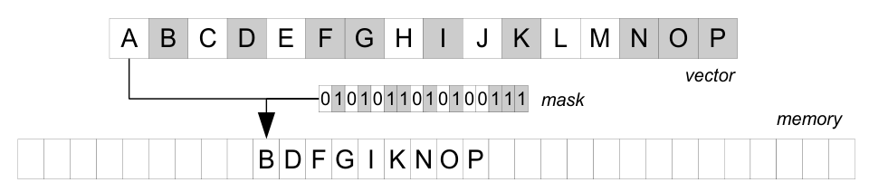

选择性存储把向量中特定子集的 lane 连续写到一个内存位置。写入哪些 lane 由向量或标量寄存器中的掩码决定，掩码不能被限制为编译期常量。图 1 中，掩码选中的 `B、D、F、G、I、K、N、O、P` 被紧凑写成连续序列。

### 3.2 选择性加载

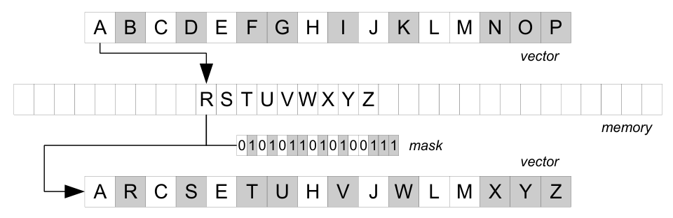

选择性加载是对称操作：从一个连续内存位置读取值，只写入掩码指定的 lane；掩码中不活跃的 lane 保留向量原值。它可在一个循环中只替换已经完成任务的 lane，从而立即复用向量容量。

### 3.3 Gather

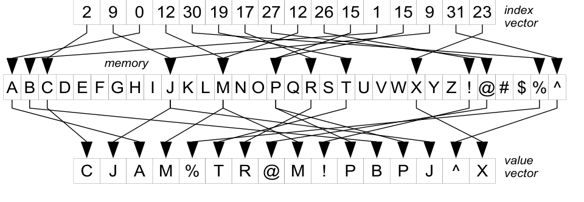

Gather 从非连续位置加载值。输入是索引向量与数组指针，输出向量的每个 lane 取得相应数组单元。增加掩码后得到 selective gather，只访问部分 lane，其余 lane 保持原值。

### 3.4 Scatter

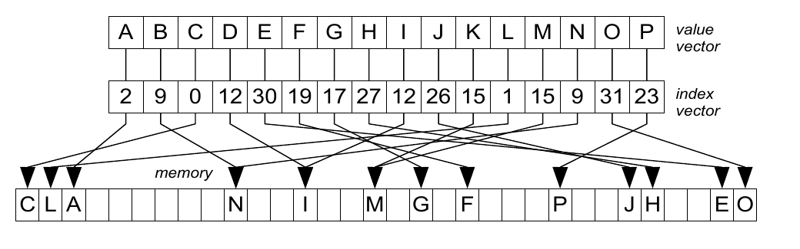

Scatter 向多个非连续位置写值。输入是索引向量、数组指针和值向量。若多个 lane 指向同一位置，本文假定最右侧 lane 的值最终写入；加入掩码即可只写部分 lane。

Gather 与 scatter 并不真正并行执行全部访问，因为 L1 cache 每周期通常只允许一到两个不同访问；每周期执行 `W` 个 cache 访问并不现实。这正是随机访问必须排除在 `O(f(n)/W)` 完全向量化规则之外的原因。

当时最新的 Haswell CPU 支持 gather，但不支持 scatter；更早的 Sandy Bridge 两者都不支持。软件可以谨慎模拟 gather，代价通常较小，细节见附录 B。

最新主流 CPU 也不直接支持 selective load/store，但可以用向量 permutation 模拟。先把 lane 选择掩码抽取为 bitmask，用作预生成 permutation 表的索引；随后重排数据向量，把活跃与不活跃 lane 分到寄存器两侧。Selective store 可以直接非对齐写出重排向量；selective load 则先非对齐加载新向量，再 blend 两个向量，只替换目标 lane。这一技术最早用于 CPU 上的向量化 Bloom filter [27]，但当时没有把它抽象为基本操作。Xeon Phi 指令见附录 C。

## 4. 选择扫描

选择扫描重新成为主存查询执行的重要手段，并在现代 OLAP DBMS 中替代传统非聚簇索引 [28]。进一步优化包括：用轻量 bit compression 降低内存带宽 [39]；生成统计信息以跳过数据区域 [28]；扫描 bitmap-zonemap 以跳过整个 cache line [35]。

线性选择扫描的性能长期与分支误预测联系在一起。算法 1 的直接标量实现会在谓词结果不稳定时产生误预测。既有工作说明，把控制流转成数据流会改变性能，使不同选择率对应不同最优实现 [29]。算法 2 消除分支，代价是访问所有 payload 列，并急切求值所有选择谓词。

```text
算法 1 选择扫描（标量，有分支）
j <- 0                                      // 输出位置
for i <- 0 .. |T_keys_in|-1:
    k <- T_keys_in[i]                       // 访问键列
    if k >= k_lower && k <= k_upper:        // 可短路判断
        T_payloads_out[j] <- T_payloads_in[i]
        T_keys_out[j] <- k
        j <- j + 1
```

```text
算法 2 选择扫描（标量，无分支）
j <- 0                                      // 输出位置
for i <- 0 .. |T_keys_in|-1:
    k <- T_keys_in[i]                       // 复制全部列
    T_payloads_out[j] <- T_payloads_in[i]
    T_keys_out[j] <- k
    m <- (k >= k_lower ? 1 : 0) & (k <= k_upper ? 1 : 0)
    j <- j + m                              // 条件标志更新下标，无分支
```

向量化选择扫描用 selective store 写出满足选择谓词的 lane。SIMD 指令同时求值谓词并产生合格 lane 的 bitmask。部分向量化方法逐位抽取 bitmask，再访问相应元组；本文直接用整个 bitmask，把所有合格元组一次紧凑写入输出向量。

选择率很低时，应避免访问 payload 列，因为额外内存带宽会降低性能；若分支被推测执行，还会发出无用的 payload load。为此，我们使用一个常驻 cache 的小缓冲区，只保存合格元组的下标而不是实际值。缓冲区满后重新加载这些下标，gather 各列的真实值，再 flush 到输出。算法 3 给出该变体，记号见附录 A。

如果物化到内存的数据近期不会复用，本文使用 streaming store。主流 CPU 的 non-temporal store 绕过较高层 cache，提高 RAM 写带宽。Xeon Phi 没有标量 streaming store，但有一条指令能用向量覆盖整条 cache line 而不先读回；其向量长度必须等于 cache line，且不需要主流 CPU 的 write-combining buffer。所有顺序写输出的算子都采用缓冲，算法描述中不再重复画出。

```text
算法 3 选择扫描（向量）
i, j, l <- 0                                // 输入、输出、缓冲下标
r_vec <- {0,1,2,...,W-1}                    // 输入下标向量
for i <- 0 .. |T_keys_in|-1 step W:
    k_vec <- T_keys_in[i]                   // 加载 W 个键
    m <- (k_vec >= k_lower) & (k_vec <= k_upper)
    if m != false:                          // 可选分支
        B[l] <-[m] r_vec                    // selective store 合格下标
        l <- l + popcount(m)
        if l > |B|-W:
            for b <- 0 .. |B|-W step W:
                p_vec <- B[b]
                k_vec <- T_keys_in[p_vec]   // gather 解引用
                v_vec <- T_payloads_in[p_vec]
                T_keys_out[b+j] <- k_vec    // streaming store
                T_payloads_out[b+j] <- v_vec
            p_vec <- B[|B|-W]               // 把溢出下标移回开头
            B[0] <- p_vec
            j <- j + |B|-W
            l <- l - |B| + W
    r_vec <- r_vec + W
// 循环结束后 flush 最后不足一批的元素
```

## 5. 哈希表

哈希表通过常数时间键查找支持数据库连接与聚合。在 hash join 中，一个关系构建表，另一个关系探测匹配；在 group-by 聚合中，哈希表把元组映射到唯一 group id，或插入、更新部分聚合值。

已有 SIMD 哈希表通常采用 bucketized 布局：一个 bucket 放多个键，用 SIMD 把单个 probe key 与桶内多个键比较。本文把“一个输入键对多个表中键”的方式称为水平向量化（horizontal vectorization）。Bucketized cuckoo hashing [30] 等变体能支持较高装载因子。加载单个 32 位字与加载整个向量同样快，因此 bucketized probe 的额外成本主要是用 `log W` 步提取正确 payload。

若每个 probe key 平均搜索少于 `W` 个 bucket，水平向量化会浪费 lane。例如，一个 50% 满、每键仅一个匹配的线性探测表，找到匹配平均约访问 1.5 个 bucket；把一个输入键同许多表中键比较，既难有高收益，也无法利用不断变宽的 SIMD 寄存器。

本文提出通用的垂直向量化（vertical vectorization）：不修改哈希表布局，每个 SIMD lane 处理一个不同输入键，并访问不同的表位置。我们研究线性探测、双重哈希与 cuckoo hashing。哈希函数采用乘法哈希，通常需要两次乘法；桶数为 `2^n` 时，只需一次乘法与一次移位。乘法在主流 CPU 上仅耗费少量周期，且有 SIMD 支持。

### 5.1 线性探测

线性探测属于开放寻址：插入元素或终止查找前，沿表线性前进直到遇到空桶。表只保存 key 与 payload，不含指针。

```text
算法 4 线性探测 - 探测（标量）
j <- 0
for i <- 0 .. |S_keys|-1:                   // 外部、探测关系
    k <- S_keys[i]
    v <- S_payloads[i]
    h <- upper_half((k*f) * |T|)            // 乘法哈希
    while T_keys[h] != k_empty:
        if k == T_keys[h]:
            RS_R_payloads[j] <- T_payloads[h]
            RS_S_payloads[j] <- v
            RS_keys[j] <- k
            j <- j + 1
        h <- h + 1
        if h == |T|: h <- 0
```

```text
算法 5 线性探测 - 探测（向量）
i, j <- 0
o_vec <- 0                                  // 各 lane 的探测偏移
m <- true
while i + W <= |S_keys_in|:
    k_vec <-[m] S_keys[i]                   // 只替换已结束 lane
    v_vec <-[m] S_payloads[i]
    i <- i + popcount(m)
    h_vec <- upper_half((k_vec*f) * |T|)
    h_vec <- h_vec + o_vec
    h_vec <- (h_vec < |T|) ? h_vec : h_vec-|T|
    kT_vec <- T_keys[h_vec]                 // gather bucket
    vT_vec <- T_payloads[h_vec]
    m <- (kT_vec == k_vec)
    RS_keys[j] <-[m] k_vec                  // selective store 命中
    RS_S_payloads[j] <-[m] v_vec
    RS_R_payloads[j] <-[m] vT_vec
    j <- j + popcount(m)
    m <- (kT_vec == k_empty)                // 空桶表示该键完成
    o_vec <- m ? 0 : o_vec+1
```

算法 5 每轮让 `W` 个 lane 各处理一个 probe key，并以 gather 访问哈希表。它没有先让固定的 `W` 个键全部完成再加载下一组，而是在确认某个键不再有匹配时，立即 selective load 新键替换已完成 lane。因此，每个键的循环次数与标量实现相同；每次找到匹配，就用 selective store 写出相应 lane。偏移向量记录每个键已在表中前进多远；新键替换旧键时，其偏移清零。

更简单的实现是一次加载 `W` 个键，再用内层循环找到全部匹配。但内层循环次数取决于这 `W` 个键中的最大探测长度，而平均探测长度可能小得多，因而会让许多 SIMD lane 空转。动态复用 lane 会以“乱序”方式读取 probe 输入，所以算法不再稳定：输出顺序不一定等于原 probe 输入顺序。

构建线性探测表与此类似，只是必须找到空桶才能插入。

```text
算法 6 线性探测 - 构建（标量）
for i <- 0 .. |R_keys|-1:
    k <- R_keys[i]
    h <- upper_half((k*f) * |T|)
    while T_keys[h] != k_empty:
        h <- h + 1
        if h == |T|: h <- 0
    T_keys[h] <- k
    T_payloads[h] <- R_payloads[i]
```

```text
算法 7 线性探测 - 构建（向量）
l_vec <- {1,2,...,W}                        // lane 唯一标记
i, j <- 0; m <- true
o_vec <- 0
while i + W <= |R_keys|:
    k_vec <-[m] R_keys[i]
    v_vec <-[m] R_payloads[i]
    i <- i + popcount(m)
    h_vec <- o_vec + upper_half((k_vec*f) * |T|)
    h_vec <- (h_vec < |T|) ? h_vec : h_vec-|T|
    kT_vec <- T_keys[h_vec]
    m <- (kT_vec == k_empty)
    T_keys[h_vec] <-[m] l_vec               // 先散射 lane 标记
    lback_vec <-[m] T_keys[h_vec]           // 再 gather 回读
    m <- m & (l_vec == lback_vec)           // 只保留无冲突 lane
    T_keys[h_vec] <-[m] k_vec
    T_payloads[h_vec] <-[m] v_vec
    o_vec <- m ? 0 : o_vec+1
```

构建同样以 selective load 动态复用已完成 lane，并用 gather 判断候选桶是否为空，再以 scatter 写入。多个 lane 可能选中同一个空桶，因此写入前必须检测冲突。我们先把 `[1,2,...,W]` 这样的 lane 唯一值 scatter 到候选位置，再用相同索引 gather 回来；若读回的标记等于本 lane 标记，它就可以安全写入。冲突 lane 下轮前进到下一桶。

未来 AVX 3 的 `vpconflictd` 可直接支持这一功能，省掉额外的 scatter 和 gather，但当时主流 CPU 与 Xeon Phi 都不支持。若输入键唯一，例如在候选键上连接，可直接 scatter 真正的 key 再 gather 回来检测冲突，节省一次 scatter。

算法为清晰起见把 key 与 payload 分开画出；实际表采用交错 key-value 布局。32 位 key 与 32 位 payload 的两次连续 16-way 32 位 gather，可替换为两次 8-way 64 位 gather，再用少量 shuffle 拆出 key 与 payload，从而把 cache 访问数减半；scatter 同理，具体见附录 E。

Selective load/store 假定输入还有足够元素填满向量。末尾不足 `2W` 个元组时切换到标量代码；这部分数量有界，相对于总输入可以忽略，不影响总体吞吐。

### 5.2 双重哈希

哈希表中的重复键可以有两种处理方式：把 payload 存在独立表中，或在哈希表中重复存储 key。前者适合大多数匹配都来自重复键的情况；后者适合多数键唯一的情况，但若使用线性探测，重复键会在同一区域形成簇。双重哈希使用第二个哈希函数分散冲突，使访问桶数接近真实匹配数，因而能让第二种布局同时适用于唯一键和重复键。按重复次数比较不同表布局不在本文范围内。

```text
算法 8 双重哈希函数
fL_vec <- m ? f1 : f2                       // 首次用主哈希，碰撞后用第二因子
fH_vec <- m ? |T| : |T|-1                  // 碰撞步长永不为 0
h_vec <- m ? 0 : h_vec+1
h_vec <- h_vec + upper_half((k_vec * fL_vec) * fH_vec)
h_vec <- (h_vec < |T|) ? h_vec : h_vec-|T| // 不做昂贵 modulo
```

上述双重哈希过程中，`m` 标记尚未探测过任何桶的 lane。若主哈希 `h1` 的值域为 `[0, |T|)`，碰撞哈希 `h2` 的值域为 `[1, |T|)`，且 `|T|` 是素数，那么

$$
h = h_1 + N \cdot h_2 \pmod {|T|}
$$

在 `N < |T|` 次碰撞内不会重复访问同一桶。为避免昂贵取模，只在 `h >= |T|` 时执行 `h - |T|`。

### 5.3 Cuckoo hashing

Cuckoo hashing [23] 使用多个哈希函数，也是此前唯一已有向量化方案的哈希表类型 [30]：旧方案在一个 bucket 内放多个 key，采用水平向量化。本文研究它，一方面比较垂直向量化与既有方法 [30, 42]，另一方面说明构建 cuckoo 表这类复杂控制流也能转成数据流向量逻辑。

标量 probe 有两种写法。简单写法仅在第一桶不匹配时检查第二桶；另一种总是访问两桶，再以位操作 blend 结果 [42]，牺牲额外访问换取消除分支，并已被证明在 CPU 上快于其他变体 [42]。

```text
算法 9 Cuckoo hashing - 探测
j <- 0
for i <- 0 .. |S|-1 step W:
    k_vec <- S_keys[i]
    v_vec <- S_payloads[i]
    h1_vec <- upper_half((k_vec*f1) * |T|)
    h2_vec <- upper_half((k_vec*f2) * |T|)
    kT_vec <- T_keys[h1_vec]                // gather 第一候选桶
    vT_vec <- T_payloads[h1_vec]
    m <- (k_vec != kT_vec)
    kT_vec <-[m] T_keys[h2_vec]             // 仅未命中 lane 访问第二桶
    vT_vec <-[m] T_payloads[h2_vec]
    m <- (k_vec == kT_vec)
    RS_keys[j] <-[m] k_vec
    RS_S_payloads[j] <-[m] v_vec
    RS_R_payloads[j] <-[m] vT_vec
    j <- j + popcount(m)
```

这里没有内层循环，因为每键只有两个候选位置。输入以对齐向量 load、按原顺序读取；先 gather 第一桶，再仅为未匹配 key gather 第二桶。Cuckoo 表本身不能直接支持重复键。探测是稳定的，但表超出 cache 后会访问远端桶。

构建更复杂：若两个候选桶都非空，就要逐出其中一个旧元组，将其放到另一个候选位置；这一过程可能反复进行直到遇到空桶。

```text
算法 10 Cuckoo hashing - 构建
i, j <- 0; m <- true
while i + W <= |R|:
    k_vec <-[m] R_keys_in[i]                // 空闲 lane 读取新元组
    v_vec <-[m] R_payloads_in[i]
    i <- i + popcount(m)
    h1_vec <- upper_half((k_vec*f1) * |B|)
    h2_vec <- upper_half((k_vec*f2) * |B|)
    h_vec <- h1_vec + h2_vec - h_vec        // 旧元组切换到另一函数
    h_vec <- m ? h1_vec : h_vec             // 新元组先用第一函数
    kT_vec <- T_keys[h_vec]
    vT_vec <- T_payloads[h_vec]
    m <- m & (kT_vec != k_empty)            // 新元组第一桶非空时试第二桶
    h_vec <- m ? h2_vec : h_vec
    kT_vec <-[m] T_keys[h_vec]
    vT_vec <-[m] T_payloads[h_vec]
    T_keys[h_vec] <- k_vec                  // scatter，插入或交换
    T_payloads[h_vec] <- v_vec
    kback_vec <- T_keys[h_vec]              // gather 回读唯一键检测冲突
    m <- (k_vec != kback_vec)
    k_vec <- m ? kT_vec : k_vec             // 保留冲突或新逐出元组
    v_vec <- m ? vT_vec : v_vec
    m <- (k_vec == k_empty)                 // 已完成 lane 下轮装新元组
```

向量构建循环让空闲 lane 加载新元组，其余 lane 携带上一轮的冲突元组或被逐出元组。新元组用一个或两个哈希函数寻找空桶；旧元组改用上一轮未使用的候选位置。所有 lane scatter 后再 gather key 检测冲突。此前已 gather 的新逐出元组与发生冲突的 lane 进入下一轮，其余 lane 立即复用。

## 6. Bloom Filter

Bloom filter 是在连接前跨表应用选择条件、即执行半连接的重要数据结构。若根据 `k` 个哈希函数定位的 `k` 个 bit 都已置位，元组才通过过滤。只要某次 bit-test 失败就立即终止该元组非常重要，因为大多数元组只检查少量 bit 就会失败。

已有研究 [27] 说明，最新主流 CPU 上的向量化 Bloom filter probe 相对标量代码有显著提升，尤其当 filter 常驻 cache 时。它同样遵循“每 lane 处理不同输入键”的原则，也是本文设计的来源之一；但此前没有明确抽象基本向量操作。本文在 Xeon Phi 上评估该设计，使用 selective load 在完成 lane 中补入新 key、用 gather 访问相应 bit word、以 mask 保留仍通过的 lane，并用 selective store 紧凑写出最终合格元组。

## 7. 分区

分区是现代硬件查询执行中的通用操作：它把大输入拆成互不重叠、cache-conscious 的子问题。连接与聚合可以使用 hash partitioning，把输入拆成小分区，分发给线程，并使每个分区装入 cache [3, 4, 5, 14, 19, 26]。本文覆盖 radix、hash 与 range 三类分区。

### 7.1 Radix 与 Hash 直方图

在真正移动数据并生成连续分区之前，先用直方图确定边界。对每个 key 求分区函数，并递增相应计数。采用乘法哈希后，hash partitioning 的函数成本可以与 radix 一样低。

```text
算法 11 Radix 分区 - 直方图
o_vec <- {0,1,2,...,W-1}
H_partial[P*W] <- 0                         // W 份复制直方图
for i <- 0 .. |T_keys_in|-1 step W:
    k_vec <- T_keys_in[i]
    h_vec <- (k_vec << bL) >> bR            // radix 函数
    h_vec <- o_vec + h_vec*W                // 每 lane 使用独立计数槽
    c_vec <- H_partial[h_vec]                // gather W 个计数
    H_partial[h_vec] <- c_vec+1             // 无冲突 scatter
for i <- 0 .. P-1:
    c_vec <- H_partial[i*W]
    H[i] <- horizontal_sum(c_vec)           // 合并 W 份结果
```

若多个 lane scatter 到同一计数器，最终仍只会增加 1。算法 11 因此复制直方图以隔离 lane：lane `j` 更新 `H_partial[i*W+j]`，最后把每个分区的 `W` 个计数横向规约为一个结果。若复制后的直方图无法装入最快 cache，就使用 1 字节计数，并在溢出时 flush。

### 7.2 Range 直方图

Radix 和 hash 分区函数显著快于 range 函数。Range partitioning 要在有序 splitter 数组上做二分查找；即使数组常驻 cache，访问次数仍为对数级且彼此依赖，关键路径会暴露 cache-hit 延迟 [26]，仅消除分支改善有限。

```text
算法 12 Range 分区函数
l_vec <- 0; h_vec <- P                      // l_vec 最终也是输出
for i <- 0 .. log(P)-1:
    a_vec <- (l_vec+h_vec) >> 1
    d_vec <- D[a_vec-1]                     // gather splitter
    m <- (k_vec > d_vec)
    l_vec <- m ? a_vec : l_vec              // 选择上半区
    h_vec <- m ? h_vec : a_vec              // 选择下半区
```

上述 Range 分区函数用 gather 为 `W` 个 key 同时加载 splitter，blend 更新 low/high 指针，实现向量化二分查找。可不失一般性地令 `P=2^n`，因为 splitter 数组末尾可用最大值补齐。

此前还有一种 range index：每个节点包含多个 splitter，用 SIMD 把它们同一个输入 key 比较 [26]。节点至少与向量一样宽，索引运算和节点访问仍用标量代码，不用 gather，而依靠超标量流水线隐藏成本。它相当于二分查找的水平向量化，本文会在简单核心与复杂核心上比较。

### 7.3 数据重排与冲突串行化

数据重排阶段真正移动元组。为让输出分区占据连续空间，需要一个由直方图前缀和初始化的分区 offset 数组；每转移一个元组就更新相应 offset。

向量重排用 gather/scatter 更新 offset，再 scatter 元组到输出。但若多个 lane 的元组属于同一分区，offset 只会加一，且这些元组会互相覆盖。算法 13 迭代使用 scatter 与 gather 检测冲突，计算每个 lane 的冲突内序号。

```text
算法 13 冲突串行化函数 serialize(h_vec, A)
l_vec <- {W-1,W-2,...,0}                    // 反转掩码
h_vec <- permute(h_vec, l_vec)              // 反转分区号
c_vec <- 0; m <- true
repeat:
    A[h_vec] <-[m] l_vec                    // scatter lane 唯一值
    lback_vec <-[m] A[h_vec]
    m <- m & (l_vec != lback_vec)           // 仅保留冲突 lane
    c_vec <- m ? c_vec+1 : c_vec
until m == false
return permute(c_vec, l_vec)                // 恢复原顺序
```

每轮把 lane 唯一值 scatter 到一个有 `P` 个元素的临时数组，再用同一索引 gather 回来，冲突 lane 的序号加一并继续。即使最坏执行 `W` 轮，访问的不同位置总数仍为 `W`；若第 `i` 轮访问 `a_i` 个不同位置，则 `sum(a_i)=W`。

Scatter 冲突时最右 lane 生效，因此同一分区的一组元组本会逆序写出，而且该组右端 lane 只会把 offset 加一而不是加组大小 `k`。串行化前反转索引向量，可以正确递增 offset 并维持输入顺序。稳定分区是 LSB radix sort 等算法的必要条件。

```text
算法 14 Radix 分区 - 数据重排
O <- prefix_sum(H)
for i <- 0 .. |T_keys_in|-1 step W:
    k_vec <- T_keys_in[i]
    v_vec <- T_payloads_in[i]
    h_vec <- (k_vec << bL) >> bR
    o_vec <- O[h_vec]                       // gather 分区 offset
    c_vec <- serialize(h_vec, O)
    o_vec <- o_vec+c_vec
    O[h_vec] <- o_vec+1                     // scatter 更新 offset
    T_keys_out[o_vec] <- k_vec
    T_payloads_out[o_vec] <- v_vec
```

### 7.4 缓冲数据重排

直接重排在输入常驻 cache 时很快，但输入大于 cache 后会遇到三类问题。第一，分区 fanout 超过 TLB 容量时发生 TLB thrashing [20]；第二，产生许多 cache conflict，最坏甚至受 cache 组相联度限制 [31]；第三，普通 store 会先把即将完整覆盖的 cache line 读入，从而降低写带宽 [38]。向量化无缓冲重排虽比标量版快，却无法消除这些算法层面的低效。

既有工作提出先把数据写入紧凑小缓冲，再成组 flush [31]。若每分区缓冲小且彼此紧密排列，就不会产生 TLB 或 cache miss。每分区有 `W` 个槽时，cache/TLB miss 降到 `1/W`。用 non-temporal store flush 还能帮助硬件 write combining，避免输出污染 cache [38]。Fanout 上限取决于 cache 是否容纳全部缓冲。标量 buffered shuffling 已在 [4, 26] 详细描述。

```text
算法 15 Radix 分区 - 缓冲数据重排
O <- prefix_sum(H)
for i <- 0 .. |T_keys_in|-1 step W:
    k_vec <- T_keys_in[i]
    v_vec <- T_payloads_in[i]
    h_vec <- (k_vec << bL) >> bR
    o_vec <- O[h_vec]
    c_vec <- serialize(h_vec, O)
    o_vec <- o_vec+c_vec
    O[h_vec] <- o_vec+1
    oB_vec <- o_vec & (W-1)                 // 分区缓冲内位置
    m <- (oB_vec < W)                       // 未溢出 lane
    m_over <- !m
    oB_vec <- oB_vec + h_vec*W
    B_keys[oB_vec] <-[m] k_vec
    B_payloads[oB_vec] <-[m] v_vec
    m <- (oB_vec == W-1)                    // 填满分区最后槽的 lane
    if m != false:
        H[0] <-[m] h_vec                    // 紧凑存入待 flush 分区栈
        for j <- 0 .. popcount(m)-1:
            h <- H[j]
            o <- (O[h] & -W)-W
            kB_vec <- B_keys[h*W]
            vB_vec <- B_payloads[h*W]
            T_keys_out[o] <- kB_vec         // streaming store 整向量
            T_payloads_out[o] <- vB_vec
        B_keys[oB_vec-W] <-[m_over] k_vec   // flush 后写入溢出项
        B_payloads[oB_vec-W] <-[m_over] v_vec
// 循环后清理未满缓冲
```

该缓冲版本与前一无缓冲版本的根本区别，是把元组 scatter 到常驻 cache 的缓冲，而不是直接 scatter 到最终输出。每轮写入 `W` 个元组后，遍历它们涉及的分区，只要某分区的全部缓冲槽已填满，就 flush 到输出。

同一轮可能有多个元组写入同一分区，因此先找出不会溢出的 lane 并 selective scatter，再 flush 已满缓冲，最后 scatter 原先溢出的 lane。通过输出下标识别哪些 lane 填满了分区缓冲；还要确保同一轮不会对同一缓冲 flush 两次。待 flush 分区通过 selective store 压入栈，然后逐分区“水平”flush。写出用 streaming store，避免输出污染 cache。由于同时面向多个输出，第 4 节的单输出缓冲方式不适用。

Hash partitioning 只需把数据拆成键域互不重叠的组，无须稳定。因此可以不做冲突串行化，只检测冲突 lane 并留到下一轮。若 `P>W`，每轮冲突很少，性能会略有提升。

如果元组的 key 与 rid 分开存放，可在写入缓冲前交错两列，用更少、更宽的 scatter，方法与哈希表相同。对多列 payload，可把全部列视为统一元组一起重排，也可逐列重排。前者最好在运行时为每个查询编译专用代码；后者可复用预编译、按类型特化的代码，也是本文采用的方法。生成直方图时，把目标分区与冲突序号一起写入临时数组；后续各列就不必重读更宽的 key，也不必重复冲突串行化。每个临时项需要 `log P + log W` 位。

## 8. 排序

排序是数据库连接与聚合的子问题，也用于 declustering、索引构建、压缩与去重。既有研究指出，大规模排序基本等价于分区：radix sort 与基于 range partitioning 的比较排序性能接近，关键是最大化 fanout、减少分区轮数 [26]。

本文实现 least-significant-bit（LSB）radix sort，这是 32 位 key 上最快的方法 [26]。Xeon Phi 的向量整数运算只支持 32 位，因此不评估更宽 key。并行 LSB radix sort 把输入均分给线程，再对所有线程的直方图做前缀和，使各线程的分区输出正确交错。直方图生成与重排采用 shared-nothing，最大化线程并行；向量化 buffered partitioning 则同时最大化数据并行。

## 9. Hash Join

连接是分析查询中最常见、也可能昂贵到主导执行时间的算子之一。近期工作比较了主存等值连接中的 sort-merge join 与 hash join：前者主要成本来自排序 [4, 14]；基线 hash join 先把内部关系构建为哈希表，再用外部关系探测匹配。

在 hash join 上应用分区，可形成优缺点不同、可向量化程度也不同的多种方案。输入远大于 cache，因此三种方案一旦分区都使用第 7.4 节的 buffered shuffling。

第一种称为 no partition：完全不分区。多个线程用原子操作共同构建一张共享哈希表，然后用 barrier 同步；只读 probe 无需原子操作。由于 SIMD 不支持原子操作，build 无法完全向量化。

第二种称为 min partition：只进行足以消除原子操作的最小分区。把内部关系分为 `T` 份，`T` 为线程数，各线程构建一张不共享的哈希表。Probe 时要同时选择目标哈希表与桶。稍微修改跨 `T` 张表的 probe 代码后，全部阶段都能完全向量化。

第三种称为 max partition：反复分区两侧关系，直到内部关系的每个分区都能装入一张常驻 cache、通常为 L1 的哈希表。首次分区把两侧数据分给 `T` 个线程；每个线程再以一轮或多轮独立细分自己的部分。最终分区用于在 cache 内 build 和 probe，全部阶段均可完全向量化。

## 10. 实验评测

实验使用三类平台：基于 MIC 的 Xeon Phi 协处理器、单颗 Haswell CPU，以及四颗高端 Sandy Bridge CPU。具体配置见表 1。

| 项目 | 1 个 CoPU | 1 颗 CPU | 4 颗 CPU |
|---|---:|---:|---:|
| 市场名称 | Xeon Phi | Xeon | Xeon |
| 型号 | 7120P | E3-1275v3 | E5-4620 |
| 时钟频率 | 1.238 GHz | 3.5 GHz | 2.2 GHz |
| 核心数 × SMT | `61 × 4` | `4 × 2` | `(4 × 8) × 2` |
| 核心架构 | P54C | Haswell | Sandy Bridge |
| 发射宽度 | 2-way | 8-way | 6-way |
| 重排序缓冲区 | 无 | 192 项 | 168 项 |
| 每核 L1 | `32 + 32 KB` | `32 + 32 KB` | `32 + 32 KB` |
| 每核 L2 | 512 KB | 256 KB | 256 KB |
| 总 L3 | 0 | 8 MB | `4 × 16 MB` |
| 内存容量 | 16 GB | 32 GB | 512 GB |
| 加载带宽 | 212 GB/s | 21.8 GB/s | 122 GB/s |
| 复制带宽 | 80 GB/s | 9.3 GB/s | 38 GB/s |
| SIMD 宽度 | 512 bit | 256 bit | 128 bit |
| Gather / Scatter | 支持 / 支持 | 支持 / 不支持 | 不支持 / 不支持 |
| TDP | 300 W | 84 W | `4 × 130 W` |

Haswell 的 256 位 SIMD 和 gather 最接近 Xeon Phi 的 512 位 SIMD，因而用于比较本文向量实现同标量及先进向量实现的差异。但单颗 Haswell 无法匹配 Phi 的总体规模，所以总体性能与能效比较改用处理能力和内存带宽相近的四颗 Sandy Bridge CPU。

Xeon Phi 代码用 ICC 15 编译，选项为 `-mmic -no-vec`，后者关闭编译器自动向量化。主流 CPU 按每个实验的最快结果选用 ICC 15 或 GCC 4.9，统一使用 `-O3`；Haswell 使用 `-mavx2`（AVX 2），Sandy Bridge 使用 `-mavx`（带 VEX 编码的 SSE 4）。Xeon Phi 的嵌入式系统运行 Linux 2.6，Haswell 机器运行 Linux 3.13，Sandy Bridge 机器运行 Linux 3.2。

除非另有说明，实验使用包括 SMT 在内的全部硬件线程，以缩短 load 与指令延迟。数据均在内存中合成，服从均匀分布。TPC-H 等主流分析 DBMS benchmark 也使用均匀数据，它并不会特别偏袒某个算子；实际上既有工作表明，连接、分区与排序在偏斜数据下反而更快 [5, 26]。针对偏斜优化不在本文范围内。

### 10.1 选择扫描

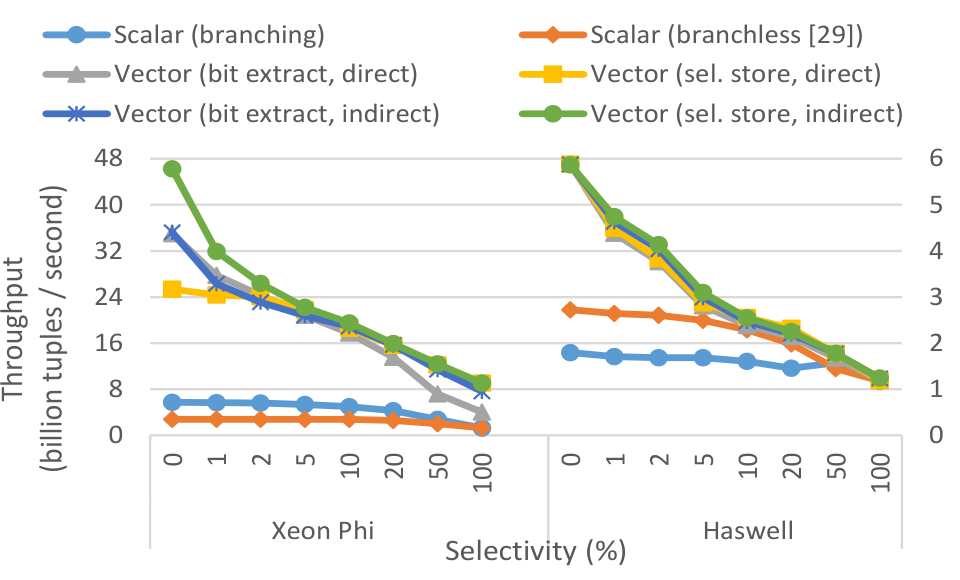

图 5 的表由 32 位 key 与 32 位 payload 构成，谓词为 `k_min <= k <= k_max`，其中上下界是查询常量。实验改变选择率，测量六种实现：有分支和无分支两种标量版本 [29]，以及由两个正交设计选择组合出的四种向量版本。第一维是在 bitmask 中逐位抽取合格元组，还是用 selective store；第二维是谓词求值时直接访问 key 与 payload 并缓冲合格值，还是只加载 key、缓冲合格 rid，flush 时再解引用真实 key 与 payload。

在 Xeon Phi 上，标量代码几乎比向量代码慢一个数量级；在 Haswell 上，向量代码约快一倍。低选择率更快，因为从 RAM 只加载 key 比复制 key 与 payload 更快，而且能跳过更多 payload 访问。消除分支 [29] 在 Haswell 上有益，在 Xeon Phi 上却因 set 指令较慢而降低性能。

Haswell 上四个向量版本几乎相同，因为都已打满带宽；无分支标量版本在选择率达到 10% 时也开始追上。Xeon Phi 上，低选择率时“间接”方案避免 payload 访问的收益最大，高选择率时 selective store 胜过逐元组 bit extract。结论是：简单 Phi 核心必须依靠向量化才能饱和带宽；复杂主流 CPU 核心即使在低选择率下仍会从向量化获益。

### 10.2 哈希表

本节先在 Xeon Phi 与 Haswell 上测量 probe throughput，并同先进标量和向量方法比较；随后只在具备 scatter 的 Xeon Phi 上，迭代测量 shared-nothing 哈希表的 build 与 probe。

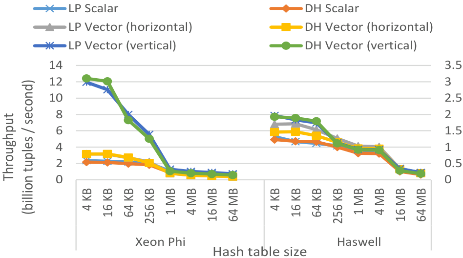

图 6 比较线性探测（LP）与双重哈希（DH）。输入是一列 `10^9` 个 32 位 key，输出是一列匹配项的 32 位 payload；几乎所有 key 都命中，哈希表装载因子为 50%。水平向量版本使用 bucketized 表，让一个输入 key 同多个表中 key 比较 [30]；本文的垂直版本则以 gather 让多个输入 key 分别同一个候选表 key 比较。在 Xeon Phi 上，本文实现最高比其他所有方法快 6 倍；在 Haswell 上，cache-resident 表也获得较小但明确的加速。

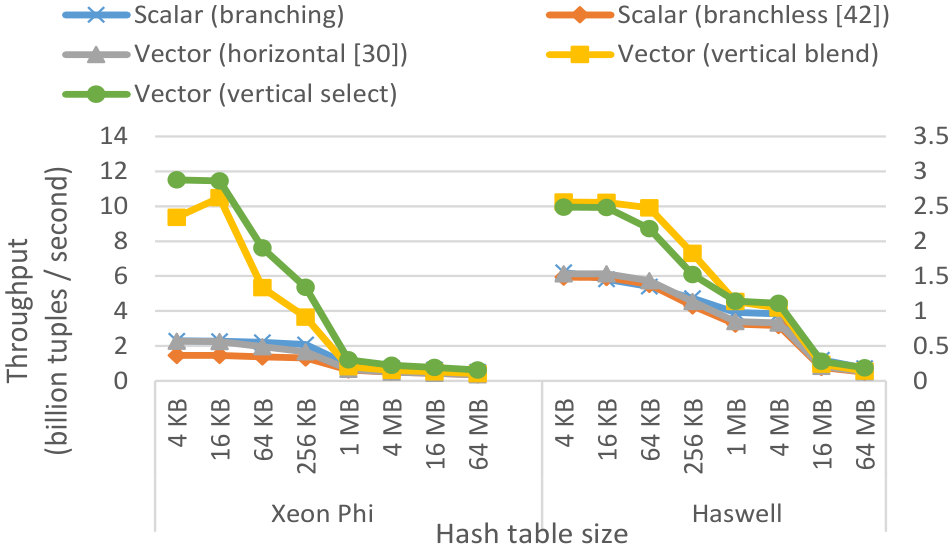

图 7 在相同设置下测量 cuckoo hashing。标量版包括有分支和无分支 [42]；向量版包括水平 bucketized [30] 与垂直方案，后者又分为总是加载两桶再 blend，以及 selective load 第二桶。无分支标量 [42] 在 Xeon Phi 和 Haswell 上都慢于有分支标量。Haswell 上 ICC 生成的有分支代码更快，而 GCC 生成的有分支代码很慢。垂直向量化在 Xeon Phi 上最高快 5 倍，在 Haswell 上最高快 1.7 倍。

Bucketized probe 使用 128 位 SSE 4、每次探 4 个 key，反而比 256 位 AVX 2、每次探 8 个 key 更快，原因是前者的寄存器内 broadcast 更便宜。这也说明“向量越宽必然越快”并不成立，布局与指令成本同样关键。

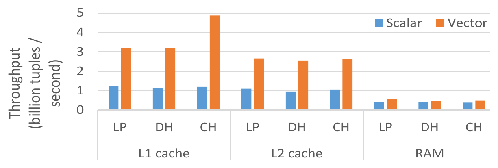

图 8 模拟 partitioned hash join 的最后阶段，交替 build 和 probe shared-nothing 表。Build:probe 为 1:1，全部 key 命中，并改变表大小：约 4 KB 时位于 L1，64 KB 时位于 L2，1 MB 时超出 cache。两侧输入都有 32 位 key 与 payload，输出包含匹配 key 与两侧 payload；装载因子 50%，并让 Phi 内存带宽饱和。吞吐定义为 `(|R|+|S|)/t`。表在 L1 时向量化加速 `2.6-4×`，在 L2 时加速 `2.4-2.7×`，超出 cache 时仍加速 `1.2-1.4×`。

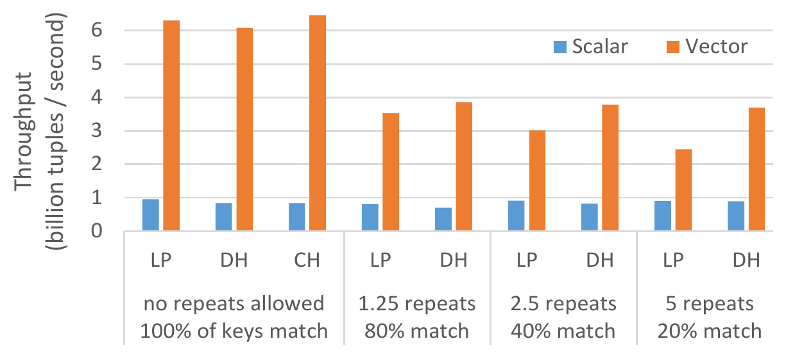

图 9 在保持输出大小相同的条件下改变重复键数。所有表均在 L1，build:probe 为 1:10，其余设置同图 8。无重复键时加速 `6.6-7.7×`，高于图 8，因为 build 比 probe 昂贵，还要检测冲突；单独 build 的加速为 `2.5-2.7×`。每个 key 重复 5 次时，DH 仍加速 4.1 倍，LP 只加速 2.7 倍，说明 DH 对重复键聚簇更有韧性。CH 不直接支持重复键，因此只出现在无重复组。

### 10.3 Bloom Filter

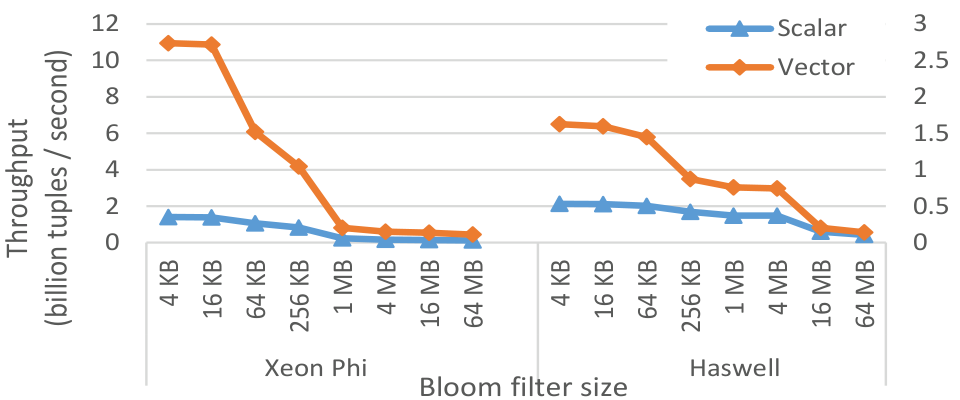

图 10 使用 [27] 的设计，并在 Xeon Phi 上增加 selective load/store 与缓冲，同时关闭循环展开。Filter 使用 5 个哈希函数、每项 10 bit，选择率为 5%，输入是 32 位 key 与 payload。随着 filter 大小从 4 KB 增长到 64 MB，Xeon Phi 的向量加速为 `3.6-7.8×`，Haswell 为 `1.3-3.1×`。Cache-resident filter 尤其适合这种以不同 lane 并发探测不同 key 的垂直向量化。

### 10.4 分区

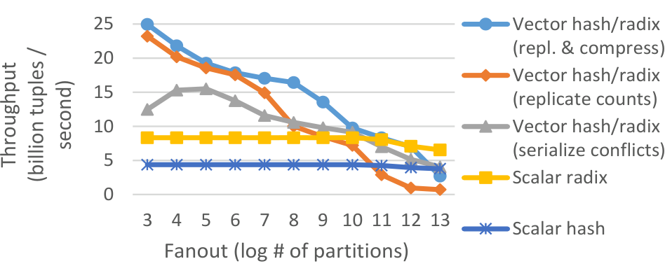

图 11 比较 Xeon Phi 上 radix/hash histogram。主流 CPU 上这一步已经打满内存加载带宽 [26]；Phi 的标量代码则主要受分区函数限制。把每个计数复制 `W` 份后，向量 radix 相对标量加速 2.55 倍。复制直方图超过 L1 时会变慢，但把计数压缩到 8 bit 可支持更大 `P`。冲突串行化不需要复制，却更慢，尤其当 `P<=W` 时；`P` 过大后，复制与串行化都变得昂贵。

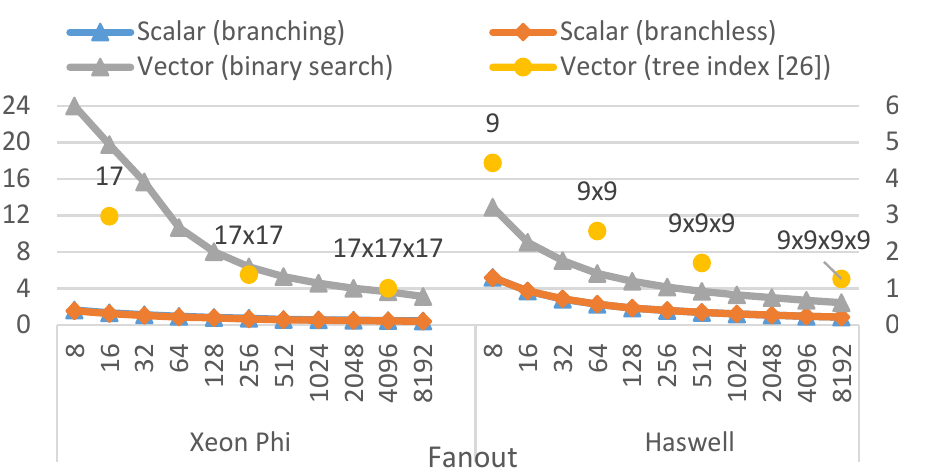

图 12 测量 range partition function。向量二分查找在 Xeon Phi 上加速 `7-15×`，在 Haswell 上加速 `2.4-2.8×`。SIMD range index [26] 在 Haswell 上更快，在 Xeon Phi 上却更慢，因为简单流水线被标量指令占满。图中树节点标注如 `17×17`、`9×9×9`，表示每层节点 fanout；根节点常驻寄存器。

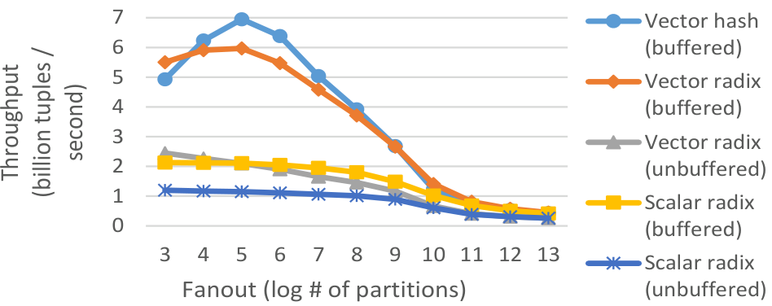

图 13 使用大于 cache 的输入测量 Xeon Phi shuffling。主流 CPU 因无 scatter 无法完全向量化，但在较大 fanout 下能饱和内存复制带宽 [4, 26]。Xeon Phi 上：无缓冲版本中，向量化最高加速 1.95 倍；标量版本中，缓冲最高加速 1.8 倍；缓冲版本中，向量化最高加速 2.85 倍，并使用到约 60% 的 copy bandwidth。使 `throughput × bits` 最大的每轮最佳 fanout 为 5-8 个 radix bit。图中的不稳定 hash partitioning 比稳定 radix partitioning 最高快 17%。

### 10.5 排序与 Hash Join

实验分三阶段：先在 Xeon Phi 上测量并展示向量化如何改变算法设计；再同四颗高端 CPU 比较总体性能与能效；最后研究通用实现及多列物化的成本。

#### 10.5.1 向量化加速与算法设计

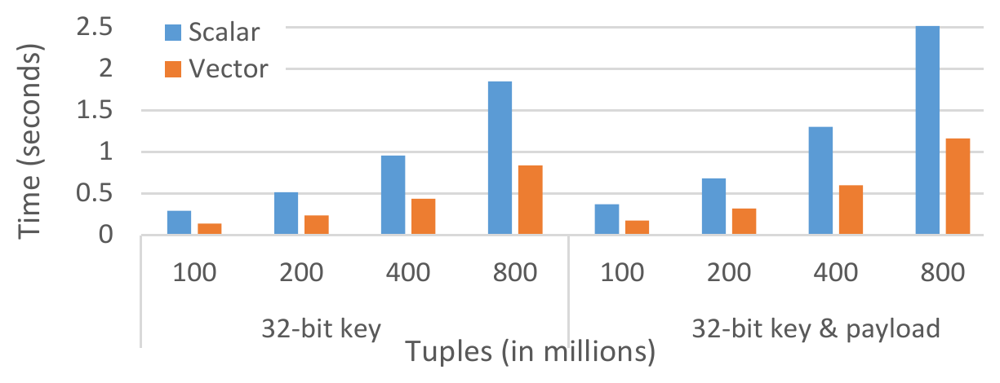

图 14 中，LSB radix sort 相对先进标量代码加速 2.2 倍，执行时间随输入大小从 1 亿到 8 亿元组近似线性增长。主流 CPU 的每轮分区已接近带宽上限，因此通常接近饱和 [26, 31, 38]。

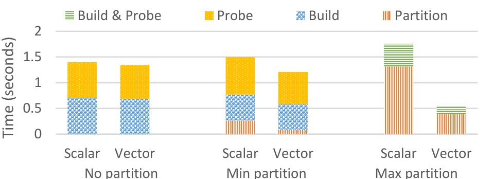

图 15 测量第 9 节的三种 hash join。实验假定 foreign-key join，但实现本身通用。No-partition 与 min-partition 只分别获得 1.05 倍和 1.25 倍加速；fully/max-partitioned 方案获得 3.3 倍加速，成为总体最快方案，并领先第二名 2.25 倍。这一差距大到无法再为 hardware-oblivious join [12] 辩护。

Hash join 也快于 sort-merge join [4, 14]：排序 `4×10^8` 个元组用 0.6 秒，而把两侧各 `2×10^8` 个元组连接并物化输出只用 0.54 秒。

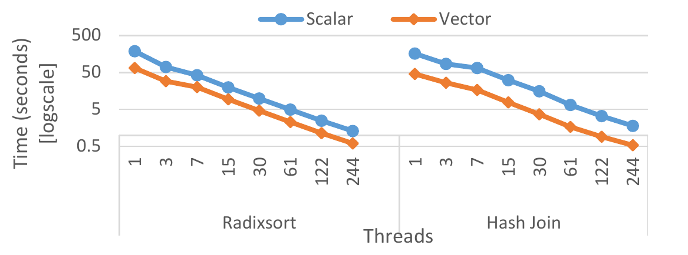

图 16 把线程数从 1 增长到 244，radix sort 与 partitioned hash join 都接近线性扩展，即使进入 2-way、4-way SMT 仍继续提升，因为 SMT 隐藏了 load 与指令延迟。Xeon Phi 的向量指令延迟为 4 个周期，4-way SMT 对隐藏该延迟至关重要。主流 CPU 的 LSB radix sort 已经饱和，2-way SMT 只能带来边际加速 [26]。

#### 10.5.2 总体性能与能效

本节把 Xeon Phi 与四颗 Sandy Bridge（SB）CPU 比较，任务为 radix sort 与 partitioned hash join。SB 上的 LSB radix sort 使用 [26] 的源码。其分区轮次受内存限制，无法从完全向量化中受益。Radix sort 与 hash join 均 NUMA-aware，数据跨 CPU 最多传输一次 [26]；cache 内连接使用图 6 的水平线性探测。

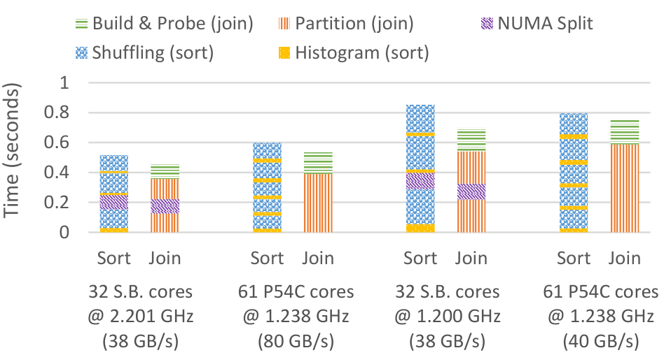

图 17 的排序输入为 `4×10^8` 个元组，连接输入为两侧各 `2×10^8` 个元组，每表均为 32 位 key 与 payload。原始配置下，Phi 的 radix sort 与 hash join 都比四颗 SB CPU 慢约 14%。若假设运行功耗与 TDP 成比例，两项任务在 Phi 上的能效都高约 1.5 倍。

我们还配平两平台：把 SB 降频到 1.2 GHz，并把 Phi 的复制带宽减半至 40 GB/s；后者通过让代码访问两倍于实际处理量的字节实现。此时 Phi 的 radix sort 快 7%，hash join 慢 8%。同既有研究 [4, 14] 一致，hash join 胜过 sort-merge join：即使还要物化连接输出，连接 `2×2×10^8` 个元组仍比单独排序 `4×10^8` 个元组快。

#### 10.5.3 多列、类型与物化

向量代码不像标量代码那样容易同时处理多种类型。前文只使用 32 位列，足以表达排序键和连接索引。Radix-decluster [21] 等类型通用物化方法只能单轮执行，受 cache 容量限制；类型通用的 buffered shuffling 能同时解决类型与容量问题。

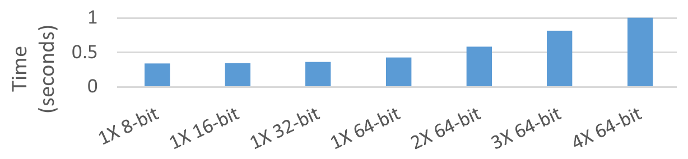

图 18 对 32 位 key 的 radix sort 改变 payload 列数与宽度。每一轮只生成一次直方图，然后逐列重排。8 位、16 位列的重排成本与 32 位列相同，因为实现受计算而非带宽限制，而且 Xeon Phi 会把 8/16 位操作提升为 32 位向量 lane。方法对更宽元组扩展良好：8 字节元组排序需 0.36 秒，36 字节元组约 1 秒。

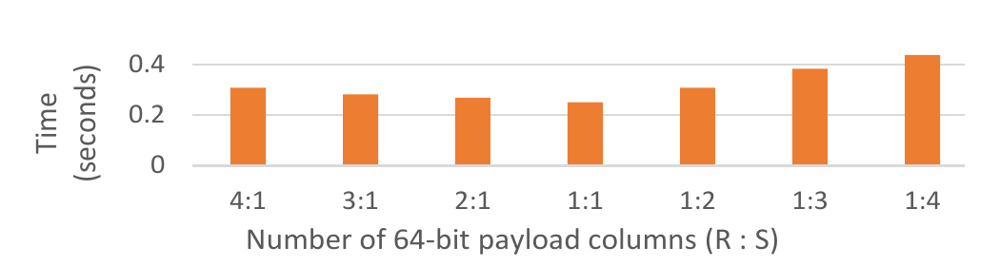

图 19 的关系大小为 `10^7 ./ 10^8` 个元组，key 为 32 位，两侧 payload 为数量不同的 64 位列。Cache 外按图 18 方法逐列重排；cache 内哈希表只存 rid，再用 rid 解引用各列。

另一种物化策略是：先连接 key 与 rid，把结果聚簇为 payload 较短一侧的顺序，再按另一侧顺序重新分区。这样，不采用只做单轮的 radix-decluster [21]，而让较短 payload 经过一轮或多轮 cache-conscious 分区。不过，为每种列数与宽度组合寻找最快策略超出本文范围。

## 11. SIMD CPU 与 SIMT GPU

GPU 的 SIMT 模型与 CPU SIMD 有一定相似性。SIMT GPU 执行标量代码，但把一个 warp 中所有线程“绑”在一起，每周期执行同一指令。例如 gather/scatter 在 GPU 程序中表现为各线程对非连续位置的普通标量 load/store；横向 SIMD 操作可由跨 warp 的特殊 shuffle 指令支持。因此，CPU 线程近似对应 GPU warp，GPU 线程近似对应 SIMD lane。

二者的控制流处理不同。SIMD 代码必须由程序员“手工”消除条件控制流；SIMT 则自动把控制流转成数据流：执行全部路径，并对每条路径中未选择该路径的线程取消指令效果。

然而，把本文 SIMD 代码一对一改写成 SIMT 的价值有限，因为两类硬件的内存层次行为差异很大。SIMD 向量化在 cache-conscious 处理下收益最大，而这通常要通过分区实现；GPU 借助优秀的内存延迟隐藏，即使不分区也能很快 [13, 24]。选择扫描等顺序算子在 GPU 上已有详细研究 [36]。

本文不比较 GPU 与 Xeon Phi。我们把 Xeon Phi 视作一种潜在 CPU 设计，研究向量化如何使它更适合分析数据库，因此实验不通过 Phi 的 PCIe 总线传输数据。

## 12. 结论

本文为主存分析数据库提出通用 SIMD 向量化实现，定义基本向量操作和设计原则，并以纯向量代码实现选择扫描、哈希表和分区，再组合成排序与连接。实验把这些实现与最新主流 CPU 上的标量及先进向量代码、以及采用大量简单核心和宽 SIMD 的 Xeon Phi 比较。

结果说明，向量化不只是给既有标量循环换上更宽指令。Selective load/store、gather/scatter、lane 动态复用、冲突检测与 cache-resident buffering 会改变算子结构，甚至改变最优算法选择。对内存数据库而言，高效向量化还能影响硬件架构与能效，使简单核心获得可与复杂核心相当的性能。本文方法适用于采用简单或复杂核心的各种 SIMD 处理器。

## 致谢与支持

原文未另设致谢段。标题页注明：第一作者的部分工作在 Oracle Labs 完成；Kenneth A. Ross 获 NSF IIS-1422488 项目及 Oracle 赠款支持。

## 附录 A：记号

向量布尔操作产生 bitmask，在算法中写成标量变量。例如 `m <- x_vec < y_vec` 得到掩码 `m`；`m <- true` 把 `m` 的 `W` 个 bit 全部置一。

向量作为数组下标时表示 gather 或 scatter。`x_vec <- A[y]` 是普通向量 load，`x_vec <- A[y_vec]` 是 gather。Selective load/store/gather/scatter 在赋值上下标出 bitmask，例如 `x_vec <-[m] A[y]` 为 selective load，`x_vec <-[m] A[y_vec]` 为 selective gather。

`popcount(m)`（原文写作 `|m|`）是掩码中置位 bit 的数量，`|T|` 是数组 `T` 的长度。`x_vec <- m ? y_vec : z_vec` 表示 vector blend。向量表达式中的标量，要在主循环前预先广播成所有 lane 都等于该标量的向量；例如 `x_vec <- x_vec+k` 与 `m <- x_vec>k` 中的 `k` 均如此。

## 附录 B：Gather 与 Scatter

最新主流 CPU 的 AVX 2 gather 以单条指令表达；当时主流 CPU 尚无 scatter。Xeon Phi 上，每次 gather/scatter 指令调用只访问一条 cache line，并重复调用直到 `W` 个 lane 全部处理完。若索引涉及 `N` 条不同 cache line，指令会发射 `N` 次，且 `N<=W`。

下面是 Xeon Phi 的 16-way gather 核心汇编。标量寄存器 `rax` 保存数组指针，512 位 `zmm0` 保存索引，`zmm1` 保存加载值，`k1` 是由 `kxnor` 置位的 16 位布尔向量。每次 `vpgatherdd` 找到 `k1` 中最左置位 bit，从 `zmm0` 取出索引，识别指向同一 cache line 的其他 lane，把值载入 `zmm1` 并清除相应 bit；若仍有置位 bit，`jknzd` 跳回。

```asm
kxnor          %k1, %k1
loop:
vpgatherdd     (%rax, %zmm0, 4), %zmm1 {%k1}
jknzd          loop, %k1
```

Scatter 与 gather 对称。若索引向量中多个 lane 的值相同，最右 lane 的值被写入，但 `k1` 中所有对应 bit 都会清除。观察一次调用清除了多个 bit，可以判断有多个访问落在同一 cache line；但无法区分它们是写同一地址的冲突，还是对同一 cache line 中不同地址的写入。

非选择性 gather/scatter 在开始时把 `k1` 全置一。选择性版本把 `k1` 和 `zmm1` 同时用作输入与输出，由 `k1` 决定加载哪些 lane；`zmm1` 中掩码未选中的 lane 不变。

每次 gather/scatter 的延迟与吞吐由访问的 cache line 数决定。假设数据均在 L1，访问集中在越少 cache line 越快；对相同 cache line 数，项目越少总延迟也越低 [10]。

Haswell gather 中的 `k1` 是普通向量。Haswell 与 Phi 的行为差异，可能源于乱序 CPU 能把一条高延迟、无分支的 gather 与其他指令更好地重叠。已有测量表明，Haswell gather 在 L1 和 L2 中性能几乎相同；从 L1/L2 中 `W` 条不同 cache line 各取一项，与把同一项加载 `W` 次几乎同样快 [10]。

Xeon Phi 在同一循环中混合 gather 与 scatter 会降低性能，因此简单地交替发射两者没有收益。理想硬件应把 Phi 的空间局部性感知 gather/scatter 与 Haswell 的单指令语义结合起来，让执行单元内部无分支地遍历最多 `W` 条不同 cache line。

硬件不支持时可以模拟 gather/scatter。我们用其他向量指令谨慎实现 gather，并用于线性探测和双重哈希。相对硬件 gather，probe 性能最多损失 13%（图 6），且表越大损失越小。访问不常驻 cache 时几乎没有差别，因为两者最终走相同的单地址 load/store 内存路径。

## 附录 C：选择性加载与存储

Selective load/store 必须支持非对齐内存，因此一次访问可能跨越两条 cache line。Xeon Phi 为两条 cache line 各提供一条指令。Haswell 则使用非对齐向量访问与 permutation，例程见附录 D、E。

下面是 Xeon Phi 对 16 个 32 位值的 selective store。`_mm` 前缀函数是 Intel Intrinsics Guide 提供的 intrinsic。

```c
void _mm512_mask_packstore_epi32(int32_t *p, // 指针
                                 __mmask16 m, // 掩码
                                 __m512i v)   // 向量
{
    _mm512_mask_packstorelo_epi32(&p[0],  m, v);
    _mm512_mask_packstorehi_epi32(&p[16], m, v);
}
```

对称的 selective load 如下。输入 `v` 中未被 `m` 选中的 lane 保持原值。

```c
__m512i _mm512_mask_loadunpack_epi32(__m512i v,
                                     __mmask16 m,
                                     const int32_t *p)
{
    v = _mm512_mask_loadunpacklo_epi32(v, m, &p[0]);
    v = _mm512_mask_loadunpackhi_epi32(v, m, &p[16]);
    return v;
}
```

Intel intrinsic 参考地址为 `software.intel.com/sites/landingpage/IntrinsicsGuide/`。

## 附录 D：选择扫描实现

### D.1 Xeon Phi

下面代码假定 key 与 payload 都是 32 位，采用第 4 节的间接缓冲版本：把合格输入 rid 写入 cache-resident 缓冲，再 gather 数据。谓词为 `k_lower <= k <= k_upper`。缓冲必须足够小以常驻 L1；`_mm512_storenrngo_ps` 覆盖 cache line 而不先读回，因此输入输出需要 cache-line 对齐。

```c
for (i = j = k = 0; i < tuples; i += 16) {
    /* 加载 key 列并求值谓词 */
    key = _mm512_load_epi32(&keys[i]);
    m = _mm512_cmpge_epi32_mask(key, mask_lower);
    m = _mm512_mask_cmple_epi32_mask(m, key, mask_upper);

    if (!_mm512_kortestz(m, m)) {           /* jkzd */
        /* 把合格元组 rid 选择性写入缓冲 */
        _mm512_mask_packstore_epi32(&rids_buf[k], m, rid);
        k += _mm_countbits_64(_mm512_mask2int(m));
    }

    if (k > buf_size - 16) {
        /* flush 缓冲 */
        for (b = 0; b != buf_size - 16; b += 16) {
            ptr = _mm512_load_epi32(&rids_buf[b]);
            key_f = _mm512_i32gather_ps(ptr, keys, 4);
            pay_f = _mm512_i32gather_ps(ptr, pays, 4);
            _mm512_storenrngo_ps(&keys_out[b + j], key_f);
            _mm512_storenrngo_ps(&pays_out[b + j], pay_f);
        }
        /* 把多出的 rid 移到缓冲起点 */
        ptr = _mm512_load_epi32(&rids_buf[b]);
        _mm512_store_epi32(&rids_buf[0], ptr);
        j += buf_size - 16;
        k -= buf_size - 16;
    }
    rid = _mm512_add_epi32(rid, mask_16);
}
```

### D.2 Haswell AVX 2

Haswell 每次处理 8 个 lane。Selective store 被一个二路 partition 替代：从查找表加载 permutation mask [27]，把合格 rid 压紧到寄存器一端，再以 `maskstore` 写入缓冲。

```c
for (i = j = k = 0; i < tuples; i += 8) {
    key = _mm256_load_si256((__m256i*) &keys[i]);
    cmp_lo = _mm256_cmpgt_epi32(mask_lower, key);
    cmp_hi = _mm256_cmpgt_epi32(key, mask_upper);
    cmp = _mm256_or_si256(cmp_lo, cmp_hi);
    cmp = _mm256_xor_si256(cmp, mask_minus_1);

    if (!_mm256_testz_si256(cmp, cmp)) {
        m = _mm256_movemask_ps(_mm256_castsi256_ps(cmp));
        perm_comp = _mm_loadl_epi64(&perm[m]);
        perm = _mm256_cvtepi8_epi32(perm_comp);
        cmp = _mm256_permutevar8x32_epi32(cmp, perm);
        ptr = _mm256_permutevar8x32_epi32(rid, perm);
        _mm256_maskstore_epi32(&rids_buf[k], cmp, ptr);
        k += _mm_popcnt_u64(m);

        if (k > buf_size - 8) {
            for (b = 0; b != buf_size - 8; b += 8) {
                ptr = _mm256_load_si256((__m256i*) &rids_buf[b]);
                key = _mm256_i32gather_epi32(keys, ptr, 4);
                pay = _mm256_i32gather_epi32(pays, ptr, 4);
                _mm256_stream_si256((__m256i*) &keys_out[b + j], key);
                _mm256_stream_si256((__m256i*) &pays_out[b + j], pay);
            }
            ptr = _mm256_load_si256((__m256i*) &rids_buf[b]);
            _mm256_store_si256((__m256i*) &rids_buf[0], ptr);
            j += buf_size - 8;
            k -= buf_size - 8;
        }
    }
    rid = _mm256_add_epi32(rid, mask_8);
}
```

## 附录 E：哈希表实现

### E.1 Xeon Phi 线性探测 probe

下面的 probe 输入和哈希表都使用 32 位 key 与 payload，输出包括 key 和两侧 payload。`mask_factor` 是乘法哈希因子，`mask_buckets` 是桶数，`mask_empty` 是空桶特殊 key。表采用交错布局，因此用 64 位 gather 一次读取 key-payload 对；`_MM512_UNPACK_EPI32` 把两个 64 位对寄存器拆成 32 位 key 与 payload。

```c
m = _mm512_kxnor(m, m);                    /* 掩码全置位 */
off = _mm512_xor_epi32(off, off);           /* 探测偏移清零 */
for (i = j = 0; i + 16 <= S_tuples;) {
    key = _mm512_mask_loadunpack_epi32(key, m, &S_keys[i]);
    pay = _mm512_mask_loadunpack_epi32(pay, m, &S_pays[i]);
    i += _mm_countbits_64(_mm512_mask2int(m));

    hash = _mm512_mullo_epi32(key, mask_factor);
    hash = _mm512_mulhi_epu32(hash, mask_buckets);
    hash = _mm512_add_epi32(hash, off);

    lo = _mm512_i32logather_epi64(hash, table, 8);
    hash = _mm512_permute4f128_epi32(hash, _MM_PERM_BADC);
    hi = _mm512_i32logather_epi64(hash, table, 8);
    _MM512_UNPACK_EPI32(lo, hi, table_key, table_pay);

    m = _mm512_cmpeq_epi32_mask(key, table_key);
    _mm512_mask_packstore_epi32(&keys_out[j], m, key);
    _mm512_mask_packstore_epi32(&S_pays_out[j], m, pay);
    _mm512_mask_packstore_epi32(&R_pays_out[j], m, table_pay);
    j += _mm_countbits_64(_mm512_mask2int(m));

    m = _mm512_cmpeq_epi32_mask(table_key, mask_empty);
    off = _mm512_add_epi32(off, mask_1);
    off = _mm512_mask_xor_epi32(off, m, off, off);
}
```

### E.2 Xeon Phi 线性探测 build

Double hashing 的实现几乎相同，差别只在哈希下标更新。`_MM512_PACK_EPI32` 把 key 与 payload 打包成 64 位对；代码分两次 scatter lane 1-8 和 9-16。

```c
m = _mm512_kxnor(m, m);
off = _mm512_xor_epi32(off, off);
for (i = 0; i + 16 <= R_tuples;) {
    key = _mm512_mask_loadunpack_epi32(key, m, &R_keys[i]);
    pay = _mm512_mask_loadunpack_epi32(pay, m, &R_rids[i]);
    i += _mm_countbits_64(_mm512_mask2int(m));

    hash = _mm512_mullo_epi32(key, mask_factor);
    hash = _mm512_mulhi_epu32(hash, mask_buckets);
    hash = _mm512_add_epi32(hash, off);

    tab = _mm512_i32gather_epi32(hash, table, 8);
    m = _mm512_cmpeq_epi32_mask(tab, mask_empty);

    _mm512_mask_i32scatter_epi32(table, m, hash, mask_unique, 8);
    tab = _mm512_mask_i32gather_epi32(tab, m, hash, table, 8);
    m = _mm512_mask_cmpeq_epi32_mask(m, tab, mask_unique);

    _MM512_PACK_EPI32(key, pay, lo, hi);
    _mm512_mask_i32loscatter_epi64(table, m, hash, lo, 8);
    hash = _mm512_permute4f128_epi32(hash, _MM_PERM_BADC);
    mt = _mm512_kmerge2l1h(m, m);
    _mm512_mask_i32loscatter_epi64(table, mt, hash, hi, 8);

    off = _mm512_add_epi32(off, mask_1);
    off = _mm512_mask_xor_epi32(off, m, off, off);
}
```

构建中的 scatter 冲突检测是向量化最常见的问题。未来 AVX 3 的 `_mm512_conflict_epi32` 等指令会比较所有 `i<j` 的 lane 对，并为每个 lane 生成一个掩码，标出左侧相同值 lane；结果为零的 lane 无冲突，可省掉 gather/scatter 检测。

Probe 的输出可能立即被复用，也可能不会。若不会复用，需采用与选择扫描相同的缓冲：先 selective store 到缓冲，再以 streaming store flush，而不能直接把普通 store 输出留在 cache。

### E.3 Haswell AVX 2 probe

Haswell 没有 selective load/store 指令，下面通过 permutation 同时模拟二者。`inv` 标出已结束、需要装入新 key 的 lane；`perm` 查找表分别把输出匹配项与仍有效项压紧。

```c
inv = _mm256_cmpeq_epi32(inv, inv);
off = _mm256_xor_si256(off, off);
for (i = j = 0; i + 8 <= S_tuples;) {
    new_key = _mm256_maskload_epi32(&S_keys[i], inv);
    new_pay = _mm256_maskload_epi32(&S_vals[i], inv);
    key = _mm256_or_si256(_mm256_andnot_si256(inv, key), new_key);
    pay = _mm256_or_si256(_mm256_andnot_si256(inv, pay), new_pay);

    hash = _mm256_mullo_epi32(key, mask_factor);
    off = _mm256_add_epi32(off, mask_1);
    off = _mm256_andnot_si256(inv, off);
    hash = _mm256_mulhi_epu32(hash, mask_buckets);
    hash = _mm256_add_epi32(hash, off);

    lo = _mm256_i32gather_epi64(table_64, hash, 8);
    hash = _mm256_permute4x64_epi64(hash, 14);
    hi = _mm256_i32gather_epi64(table_64, hash, 8);
    _MM256_UNPACK_EPI32(lo, hi, table_key, table_val);

    inv = _mm256_cmpeq_epi32(table_key, mask_empty);
    out = _mm256_cmpeq_epi32(table_key, key);
    m_out = _mm256_movemask_ps(_mm256_castsi256_ps(out));
    m_inv = _mm256_movemask_ps(_mm256_castsi256_ps(inv));
    perm_out_comp = _mm_loadl_epi64(&perm[m_out]);
    perm_inv_comp = _mm_loadl_epi64(&perm[m_inv ^ 255]);
    perm_out = _mm256_cvtepi8_epi32(perm_out_comp);
    perm_inv = _mm256_cvtepi8_epi32(perm_inv_comp);

    out = _mm256_permutevar8x32_epi32(out, perm_out);
    RS_key = _mm256_permutevar8x32_epi32(key, perm_out);
    S_pay = _mm256_permutevar8x32_epi32(pay, perm_out);
    R_pay = _mm256_permutevar8x32_epi32(table_val, perm_out);
    _mm256_maskstore_epi32(&keys_out[j], out, RS_key);
    _mm256_maskstore_epi32(&S_pays_out[j], out, S_pay);
    _mm256_maskstore_epi32(&R_pays_out[j], out, R_pay);
    j += _mm_popcnt_u64(m_out);

    inv = _mm256_permutevar8x32_epi32(inv, perm_inv);
    key = _mm256_permutevar8x32_epi32(key, perm_inv);
    off = _mm256_permutevar8x32_epi32(off, perm_inv);
    i += _mm_popcnt_u64(m_inv);
}
```

## 附录 F：分区实现

### F.1 Radix 直方图

下面是 Xeon Phi 上 32 位 key 的 radix histogram。Radix 函数用 `mask_shift_left` 与 `mask_shift_right` 两次移位；复制直方图下标为 `partition*16+lane`。

```c
for (i = 0; i < tuples; i += 16) {
    key = _mm512_load_epi32(&keys[i]);
    part = _mm512_sllv_epi32(key, mask_shift_left);
    part = _mm512_srlv_epi32(part, mask_shift_right);
    part = _mm512_fmadd_epi32(part, mask_16, mask_lanes);
    count = _mm512_i32gather_epi32(part, hists, 4);
    count = _mm512_add_epi32(count, mask_1);
    _mm512_i32scatter_epi32(hists, part, count, 4);
}
for (p = 0; p != partitions; ++p) {
    count = _mm512_load_epi32(&hists[p << 4]);
    hist[p] = _mm512_reduce_add_epi32(count);
}
```

为把复制直方图留在 cache，可用 8 位计数并补充溢出处理。Xeon Phi 汇编允许 gather/scatter 用修饰符访问 8 位或 16 位内存位置，而运算仍在 16 个 32 位 lane 上进行。

### F.2 Range 二分函数

下面是 Xeon Phi 对 32 位 key 的向量二分查找，Haswell 代码相同。Splitter 数组可补齐到 `P=2^n`。

```c
hi = mask_partitions;
lo = _mm512_xor_epi32(lo, lo);
for (i = 0; i != log_partitions; ++i) {
    mid = _mm512_add_epi32(lo, hi);
    mid = _mm512_srli_epi32(mid, 1);
    del = _mm512_i32gather_epi32(mid, &splitters[-1], 4);
    m = _mm512_cmpgt_epi32(key, del);
    lo = _mm512_mask_blend_epi32(m, lo, mid);
    hi = _mm512_mask_blend_epi32(m, mid, hi);
}
```

### F.3 冲突串行化

`mask_reverse` 是反转 lane 的固定 permutation mask，也因每 lane 值唯一而可用于冲突检测。AVX 3 conflict 指令也能实现同一算法；但 AVX 3 没有向量 bit-count，所以需要让每个 lane 反复执行 `x & (x-1)` 清最低置位 bit，并为仍非零 lane 的 offset 加一。

```c
__m512i _mm512_serialize_conflicts(__m512i part, int32_t *array)
{
    part = _mm512_permutevar_epi32(part, mask_reverse);
    __m512i back, res = _mm512_xor_epi32(res, res);
    __mmask16 m = _mm512_kxnor(m, m);
    do {
        _mm512_mask_i32scatter_epi32(array, m, part,
                                     mask_reverse, 4);
        back = _mm512_mask_i32gather_epi32(back, m, part,
                                           array, 4);
        m = _mm512_mask_cmpneq_epi32_mask(m, back, mask_reverse);
        res = _mm512_mask_add_epi32(res, m, res, mask_1);
    } while (!_mm512_kortestz(m, m));
    return _mm512_permutevar_epi32(res, mask_reverse);
}
```

### F.4 稳定 buffered shuffling

下面代码处理 32 位 key 与 payload，输入输出均按 cache line 对齐。主循环后还要 flush 未满缓冲。多线程时，清理应在同步之后进行，以修复每个分区可能被破坏的第一条 cache line。

若逐列处理多种宽度，8、16、32、64 位列每分区分别缓冲 64、32、16、8 项。16 个 64 位值跨两条 cache line，因此 64 位列每轮可能发生两次溢出，需要分三阶段而不是两阶段 scatter。

```c
for (i = 0; i < tuples; i += 16) {
    key = _mm512_load_epi32(&keys[i]);
    pay = _mm512_load_epi32(&pays[i]);
    part = _mm512_sllv_epi32(key, mask_shift_left);
    part = _mm512_srlv_epi32(part, mask_shift_right);

    off = _mm512_i32gather_epi32(part, offsets, 4);
    ser_off = _mm512_serialize_conflicts(part, offsets);
    off_back = _mm512_add_epi32(off, ser_off);
    off_back = _mm512_add_epi32(off_back, mask_1);
    _mm512_i32scatter_epi32(offsets, part, off_back, 4);

    _MM512_PACK_EPI32(key, pay, lo, hi);
    off = _mm512_and_epi32(off, mask_15);
    off = _mm512_add_epi32(off, ser_off);
    off_lo = _mm512_fmadd_epi32(part, mask_16, off);
    off_hi = _mm512_permute4f128_epi32(off_lo, _MM_PERM_BCDC);

    m = _mm512_cmpgt_epi32_mask(mask_15, off);
    mt = _mm512_knot(m);
    _mm512_mask_i32loscatter_epi64(buffers, m, off_lo, lo, 8);
    m = _mm512_kmerge2l1h(m, m);
    _mm512_mask_i32loscatter_epi64(buffers, m, off_hi, hi, 8);

    m = _mm512_cmpeq_epi32_mask(off, mask_15);
    if (!_mm512_kortestz(m, m)) {
        _mm512_mask_packstorelo_epi32(flush_part, m, part);
        j = 0;
        k = _mm_countbits_64(_mm512_mask2int(m));
        do {
            p = flush_part[j];
            o = (offsets[p] & -16) - 16;
            lo_f = _mm512_load_ps(&buffers[(p << 4) + 0]);
            hi_f = _mm512_load_ps(&buffers[(p << 4) + 8]);
            _MM512_UNPACK_PS(lo_f, hi_f, key_f, pay_f);
            _mm512_storenrngo_ps(&keys_out[o], key_f);
            _mm512_storenrngo_ps(&pays_out[o], pay_f);
        } while (++j != k);

        if (!_mm512_kortestz(mt, mt)) {
            _mm512_mask_i32loscatter_epi64(&buffers[-16], mt,
                                            off_lo, lo, 8);
            mt = _mm512_kmerge2l1h(mt, mt);
            _mm512_mask_i32loscatter_epi64(&buffers[-16], mt,
                                            off_hi, hi, 8);
        }
    }
}
/* 循环后 flush 其余缓冲项 */
```

## 参考文献

1. M.-C. Albutiu et al. “Massively parallel sort-merge joins in main memory multi-core database systems.” *PVLDB*, 5(10):1064-1075, June 2012.
2. P. Bakkum et al. “Accelerating SQL database operations on a GPU with CUDA.” In *GPGPU*, pages 94-103, 2010.
3. C. Balkesen et al. “Main-memory hash joins on multi-core CPUs: Tuning to the underlying hardware.” In *ICDE*, pages 362-373, 2013.
4. C. Balkesen et al. “Multicore, main-memory joins: Sort vs. hash revisited.” *PVLDB*, 7(1):85-96, Sept. 2013.
5. S. Blanas et al. “Design and evaluation of main memory hash join algorithms for multi-core CPUs.” In *SIGMOD*, pages 37-48, 2011.
6. P. Boncz et al. “MonetDB/X100: Hyper-pipelining query execution.” In *CIDR*, 2005.
7. J. Chhugani et al. “Efficient implementation of sorting on multi-core SIMD CPU architecture.” In *VLDB*, pages 1313-1324, 2008.
8. J. Cieslewicz et al. “Automatic contention detection and amelioration for data-intensive operations.” In *SIGMOD*, pages 483-494, 2010.
9. D. J. DeWitt et al. “Materialization strategies in a column-oriented DBMS.” In *ICDE*, pages 466-475, 2007.
10. J. Hofmann et al. “Comparing the performance of different x86 SIMD instruction sets for a medical imaging application on modern multi- and manycore chips.” *CoRR*, arXiv:1401.7494, 2014.
11. H. Inoue et al. “AA-sort: A new parallel sorting algorithm for multi-core SIMD processors.” In *PACT*, pages 189-198, 2007.
12. S. Jha et al. “Improving main memory hash joins on Intel Xeon Phi processors: An experimental approach.” *PVLDB*, 8(6):642-653, Feb. 2015.
13. T. Kaldewey et al. “GPU join processing revisited.” In *DaMoN*, 2012.
14. C. Kim et al. “Sort vs. hash revisited: fast join implementation on modern multicore CPUs.” In *VLDB*, pages 1378-1389, 2009.
15. C. Kim et al. “FAST: Fast architecture sensitive tree search on modern CPUs and GPUs.” In *SIGMOD*, pages 339-350, 2010.
16. K. Krikellas et al. “Generating code for holistic query evaluation.” In *ICDE*, pages 613-624, 2010.
17. S. Larsen et al. “Exploiting superword level parallelism with multimedia instruction sets.” In *PLDI*, pages 145-156, 2000.
18. V. Leis et al. “Morsel-driven parallelism: A NUMA-aware query evaluation framework for the many-core age.” In *SIGMOD*, pages 743-754, 2014.
19. S. Manegold et al. “Optimizing database architecture for the new bottleneck: Memory access.” *J. VLDB*, 9(3):231-246, Dec. 2000.
20. S. Manegold et al. “What happens during a join? Dissecting CPU and memory optimization effects.” In *VLDB*, pages 339-350, 2000.
21. S. Manegold et al. “Cache-conscious radix-decluster projections.” In *VLDB*, pages 684-695, 2004.
22. T. Neumann. “Efficiently compiling efficient query plans for modern hardware.” *PVLDB*, 4(9):539-550, June 2011.
23. R. Pagh et al. “Cuckoo hashing.” *J. Algorithms*, 51(2):122-144, May 2004.
24. H. Pirk et al. “Accelerating foreign-key joins using asymmetric memory channels.” In *ADMS*, 2011.
25. O. Polychroniou et al. “High throughput heavy hitter aggregation for modern SIMD processors.” In *DaMoN*, 2013.
26. O. Polychroniou et al. “A comprehensive study of main-memory partitioning and its application to large-scale comparison- and radix-sort.” In *SIGMOD*, pages 755-766, 2014.
27. O. Polychroniou et al. “Vectorized Bloom filters for advanced SIMD processors.” In *DaMoN*, 2014.
28. V. Raman et al. “DB2 with BLU acceleration: So much more than just a column store.” *PVLDB*, 6(11):1080-1091, Aug. 2013.
29. K. A. Ross. “Selection conditions in main memory.” *ACM Transactions on Database Systems*, 29(1):132-161, Mar. 2004.
30. K. A. Ross. “Efficient hash probes on modern processors.” In *ICDE*, pages 1297-1301, 2007.
31. N. Satish et al. “Fast sort on CPUs and GPUs: A case for bandwidth oblivious SIMD sort.” In *SIGMOD*, pages 351-362, 2010.
32. B. Schlegel et al. “Scalable frequent itemset mining on many-core processors.” In *DaMoN*, 2013.
33. L. Seiler et al. “Larrabee: A many-core x86 architecture for visual computing.” *ACM Transactions on Graphics*, 27(3), Aug. 2008.
34. J. Shin. “Introducing control flow into vectorized code.” In *PACT*, pages 280-291, 2007.
35. L. Sidirourgos et al. “Column imprints: A secondary index structure.” In *SIGMOD*, pages 893-904, 2013.
36. E. A. Sitaridi et al. “Optimizing select conditions on GPUs.” In *DaMoN*, 2013.
37. M. Stonebraker et al. “C-store: A column-oriented DBMS.” In *VLDB*, pages 553-564, 2005.
38. J. Wassenberg et al. “Engineering a multi core radix sort.” In *EuroPar*, pages 160-169, 2011.
39. T. Willhalm et al. “SIMD-scan: Ultra fast in-memory table scan using on-chip vector processing units.” *PVLDB*, 2(1):385-394, Aug. 2009.
40. Y. Ye et al. “Scalable aggregation on multicore processors.” In *DaMoN*, 2011.
41. J. Zhou et al. “Implementing database operations using SIMD instructions.” In *SIGMOD*, pages 145-156, 2002.
42. M. Zukowski et al. “Architecture-conscious hashing.” In *DaMoN*, 2006.
