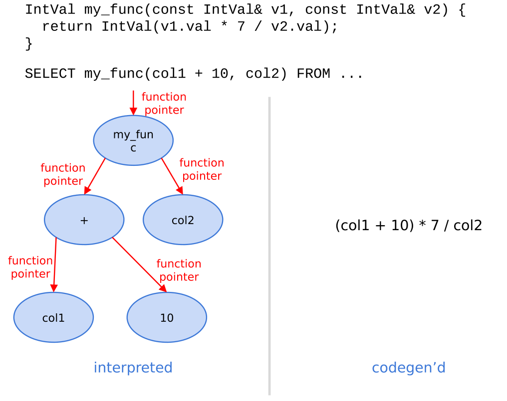
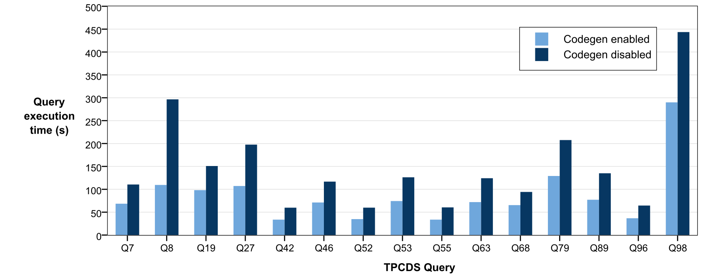

# Runtime Code Generation in Cloudera Impala（中文译文）

## 译者说明

本文依据同目录的 `source.pdf` 翻译。章节、图表、公式、算法、代码与参考文献按原文结构保留。

## 作者与出版信息

- Skye Wanderman-Milne（`skye@cloudera.com`）
- Nong Li（`nong@cloudera.com`）

本文刊载于 *Bulletin of the IEEE Computer Society Technical Committee on Data Engineering*，2014 年，第 31–37 页。

原文版权声明：© 2014 IEEE。允许个人使用；若为广告或促销而重印、再版，创建用于转售的新合集，向服务器或邮件列表再分发，或在其他作品中复用受版权保护的组成部分，须事先获得 IEEE 许可。

## 摘要

我们讨论如何在 SQL 引擎中使用运行时代码生成来改善查询执行时间。代码生成允许只在运行时才知道的查询特定信息，例如列类型和表达式操作符，在性能关键函数中像编译期已知一样使用，从而得到更高效实现。我们介绍 Cloudera Impala，一个面向 Hadoop 的开源 MPP 数据库。Impala 使用代码生成，查询时间最高可加速 5 倍。

## 1. 引言

Cloudera Impala 是构建在 Hadoop 生态上的开源 MPP 数据库。Hadoop 已证明是存储和处理海量数据的非常有效的系统：它使用 HDFS 和 HBase 作为存储管理器，并以 MapReduce 作为处理框架。Impala 的目标是结合 Hadoop 的灵活性和可扩展性，以及商业 MPP 数据库的性能和 SQL 支持。Impala 执行查询比已有 Hadoop 方案快 10 到 100 倍，并接近商业 MPP 数据库 [1]，使用户能对大数据执行交互式探索分析。

Impala 从底层设计上尽量利用现代硬件和高效查询执行技术。它面向分析负载而不是 OLTP，因此复杂、长时间、CPU-bound 查询很常见。使用 LLVM [3] 的运行时代码生成，是我们广泛用于缩短执行时间的技术之一。

LLVM 是编译器库和工具集合。与传统独立编译器不同，LLVM 模块化且可复用；它为编译流程各阶段公开独立 API，让应用程序可以在运行中调用 JIT 编译，同时获得现代优化器和多架构机器码生成能力。

Impala 使用 LLVM 在运行时生成并编译经过充分优化的查询专用函数；在有代表性的工作负载上，这项技术可让执行时间改善 5 倍或更多。我们在本文中说明如何做到这一点：第 2 节讨论运行时代码生成如何产生更快的函数，第 3 节介绍我们如何实现代码生成，第 4 节讨论它对用户自定义函数（UDF）的意义，第 5 节给出我们的实验结果，我们在第 6 节作总结。

## 2. 运行时代码生成的优势

Impala 使用运行时代码生成，为性能关键函数生成查询专用版本，尤其针对会在一次查询中执行许多次、因而占据大部分总耗时的“内层循环”函数。例如，把数据文件中的一条记录解析为 Impala 内存 tuple 的函数，需要对扫描到的每一条记录调用一次；扫描大表时，调用次数可能达到数万亿甚至更多。因此，即使每次调用只减少几条指令，也可能显著缩短查询时间。

如果没有代码生成，为了处理编译期未知的运行时信息，函数通常不得不保留额外开销。例如，只处理整数的记录解析函数会比同时支持字符串、浮点数等类型的通用函数更快，但待扫描文件的 schema 在编译期并不知道，所以预编译系统只能选择最通用的实现，即使运行时已经知道实际只需其中很小一部分功能。

代码生成允许系统把运行时变量当作编译期常量嵌入性能关键函数，从生成结果中删除解释这些查询常量所需的开销。解释版本不对运行时信息作任何假设，适用于任意查询；codegen 版本则绑定到一组特定的运行时信息，因此查询不同，生成的 `MaterializeTuple()` 也可能不同。

**图 1：展示运行时代码生成可实现优化的示例函数。**

图 1 以 `MaterializeTuple()` 对比解释版本与一种可能的 codegen 版本。解释版本需要循环 slot、读取 `offsets_` 和 `types_`，再按类型分派：

```cpp
void MaterializeTuple(char* tuple) {
  for (int i = 0; i < num_slots_; ++i) {
    char* slot = tuple + offsets_[i];
    switch(types_[i]) {
      case BOOLEAN:
        *slot = ParseBoolean();
        break;
      case INT:
        *slot = ParseInt();
        break;
      case FLOAT: ...
      case STRING: ...
      // etc.
    }
  }
}
```

codegen 版本把运行时常量内联到专用函数中，去掉循环和类型分派：

```cpp
void MaterializeTuple(char* tuple) {
  *(tuple + 0) = ParseInt();      // i = 0
  *(tuple + 4) = ParseBoolean();  // i = 1
  *(tuple + 5) = ParseInt();      // i = 2
}
```

更具体地说，代码生成让我们通过以下三类技术优化函数：

- **消除条件分支。** 解释函数必须用 `if` 或 `switch` 处理的运行时信息，在生成函数中已经解析为唯一分支。以 Figure 1 为例，我们在运行时知道循环次数和每个 slot 的类型，因此可以展开循环并消除类型分支。分支指令会妨碍指令流水线和指令级并行，这通常是收益最大的优化之一。
- **消除内存加载。** 从内存加载值的代价可能很高，还可能阻塞流水线。如果一次加载在函数每次调用时都会得到不同结果，例如加载 tuple 中的实际值，就无法消除；但若我们知道它在每次调用时都会得到相同结果，就可以用代码生成把这次加载替换为实际值。Figure 1 中的 `offsets_` 和 `types_` 在查询开始时生成、整个查询期间不变，因此展开循环后可把数组内容直接内联。
- **内联虚函数调用。** 虚调用本身代价较高，而且阻止编译器内联被调函数。若运行时知道对象的具体类型，我们可以用代码生成把虚调用替换成对具体函数的直接调用，再将其内联。表达式树尤其受益：Impala 中每种表达式通过覆写基类虚函数实现，并递归调用子表达式；对于加法等很简单的操作，调用成本甚至高于计算本身。解析并内联这些调用后，表达式树可直接求值，不再产生逐节点调用开销。



图 2：表达式树优化示意图。左侧解释执行通过表达式树和函数指针逐层求值；右侧 codegen 后直接得到 `(col1 + 10) * 7 / col2` 形式的表达式，避免虚函数调用和树遍历。函数内联还提高了指令级并行度，并让编译器能够跨表达式执行公共子表达式消除等进一步优化。

## 3. 使用 LLVM 生成代码

当 Impala 后端执行引擎收到查询计划后，会在查询开始执行前使用 LLVM 生成并编译性能关键函数的查询专用版本。本节详细说明这些函数在交给 LLVM 编译之前如何生成。

### 3.1 LLVM IR

LLVM 的代码生成各阶段主要使用 LLVM IR [8]。IR 是类似汇编语言的低层、类型化中间表示，其中许多简单指令可以直接映射为机器指令；Clang C++ 编译器 [5] 等 LLVM 前端先生成 IR，LLVM 再对其优化并下沉为目标机器码。我们在 Impala 中使用两种方式生成 IR 函数：用 LLVM 的 `IRBuilder` 逐条构造 IR 指令，或使用 Clang 把 C++ 函数交叉编译为 IR。

### 3.2 IRBuilder

LLVM 的 C++ API 提供 `IRBuilder` 类 [7]，可以用程序逐条构造 IR 指令。这类似直接用汇编语言编写函数：这种逐指令构造很直接，却相当繁琐。在 Impala 中，用 IRBuilder 生成一个 IR 函数的 C++ 代码，通常比同一函数的解释版本长许多倍。不过，这种技术可以构造任意函数。

### 3.3 编译为 IR

相比用 IRBuilder 从零构造查询专用函数，我们通常更愿意先用 C++ 编写函数，再通过 Clang 编译成 IR，并在运行时注入查询专用信息。这样，我们就可以用 C++ 编写函数，而不必用 IRBuilder 逐条构造指令。我们还会把同一函数同时交叉编译为 IR 和本机代码，从而能方便地选择解释版本或代码生成版本。这对调试很重要：我们可以判断错误来自函数本身还是代码生成过程，也可以用 `gdb` 调试本机函数。

论文发表时，我们修改已编译 IR 函数的唯一机制，是把对解释函数的调用替换为对等价查询专用生成函数的调用。我们用这种方式消除第 2 节所述的虚函数调用。例如，我们会把实现各种表达式类型的许多虚函数同时交叉编译为 IR 和本机代码；禁用代码生成时，通用本机实现按原样运行；启用代码生成时，我们递归查找对子表达式的调用，并把它们替换为对生成函数的调用。

不过，仅靠这种机制还不能让我们充分发挥代码生成的全部优势；它也无法帮助我们实现第 2 节所述的许多技术，例如消除条件分支和内存加载。目前，我们仍用 IRBuilder 生成能从这些技术受益的函数。我们正在开发新的预编译 IR 变换框架：对 Figure 1 的 `MaterializeTuple()`，我们希望先利用已知的 `num_slots_` 展开循环，以便我们能用每次迭代特有的运行时信息替换各次迭代，再把对 `offsets_` 和 `types_` 的访问替换为实际值。一旦我们拥有这套变换框架，我们将能比使用 IRBuilder 时更容易、更快速地实现代码生成函数。

## 4. 用户自定义函数

Impala 提供 C++ 用户自定义函数（UDF）API。最传统的写法是用 C++ 实现 UDF，编译为共享对象，再在运行时动态链接。不过，如前所述，Impala 能够编译和执行 Clang 生成的 IR 函数。我们利用这一能力执行编译为 IR、而非共享对象的 UDF。这样 LLVM 就能跨用户函数边界进行内联，使 UDF 获得与 Impala 内建函数相同的性能。

除性能收益外，这套架构还让其它语言更容易接入。正如我们使用 Clang 把 C++ 函数编译为 IR，任何拥有 LLVM 前端的语言都可以用来编写 UDF，而无需修改查询引擎。例如 Numba [9] 可以把 Python 编译成 IR；使用我们的方法，开发者编写的 Python UDF 甚至可能比静态编译为共享对象的 C++ UDF 更快。

## 5. 实验结果

在表 3 中，我们展示随着我们提高查询复杂度，运行时代码生成所取得的效果。这些查询运行于一个 10 节点集群，数据集是 6 亿行 Avro [4] 数据。在第一个查询中，我们只统计总行数；这不需要真正解析 Avro 记录，代码生成只能优化已经很简单的计数聚合，因此收益较小。在第二个查询中，我们统计单列，需要解析 Avro 数据以识别 NULL；与第一个查询相比，这使代码生成的收益增加了 60%。最后，我们运行图 3 所示的 TPC-H Q1；它包含多个聚合、表达式和 `GROUP BY` 子句，因此加速显著增大。

表 3 展示随着查询复杂度增加，code generation 带来的端到端收益也增加：

| Query | Code generation disabled | Code generation enabled | Speedup |
| --- | ---: | ---: | ---: |
| `select count(*) from lineitem` | 3.554 sec | 2.976 sec | 1.19x |
| `select count(l_orderkey) from lineitem` | 6.582 sec | 3.522 sec | 1.87x |
| `TPCH-Q1` | 37.852 sec | 6.644 sec | 5.70x |

**图 3：TPC-H Q1 查询。**

```sql
select
  l_returnflag,
  l_linestatus,
  sum(l_quantity),
  sum(l_extendedprice),
  sum(l_extendedprice * (1 - l_discount)),
  sum(l_extendedprice * (1 - l_discount) * (1 + l_tax)),
  avg(l_quantity),
  avg(l_extendedprice),
  avg(l_discount),
  count(1)
from lineitem
where l_shipdate <= '1998-09-02'
group by l_returnflag, l_linestatus
```

在表 4 中，我们考察运行时代码生成如何减少执行 TPC-H Q1 时的指令数。表中同时列出分支数：

| 配置 | # Instructions | # Branches |
| --- | ---: | ---: |
| Code generation disabled | 72,898,837,871 | 14,452,783,201 |
| Code generation enabled | 19,372,467,372 | 3,318,983,319 |
| Speedup | 4.29x | 3.76x |

说明：按表内计数直接相除，Instructions 和 Branches 的结果分别约为 3.76x 和 4.36x，与原文 Speedup 行所列的 4.29x 和 3.76x 不一致；本译文按原表保留。

这些计数由 Linux `perf` 工具的硬件计数器采集。计数覆盖整个查询执行过程，因此也包含尚未受益于代码生成的代码路径。



图 4：TPC-DS 查询在启用和禁用 code generation 下的执行时间。浅色柱为启用 codegen，深色柱为禁用 codegen。

最后，我们在图 4 中给出启用和禁用代码生成时运行若干略作修改的 TPC-DS 查询的结果。这些查询运行于一个 10 节点集群，使用 scale factor 为 1 TB 的 Parquet [6, 2] 数据集。它们没有达到上述 TPC-H Q1 的约 5 倍加速，因为部分查询执行路径尚未实现代码生成：几乎所有这些查询都包含 `ORDER BY`，当时排序不受益于代码生成；Parquet 解析器也尚未使用代码生成。我们选择 Parquet 而非已经支持代码生成的 Avro，是因为若使用 Avro，这些查询会转为 I/O-bound。即便如此，每个查询仍获得明显加速；我们预计，扩大代码生成覆盖后收益还会提高。

## 6. 结论与未来工作

LLVM 让我们能够实现一个通用 SQL 引擎，同时让每个查询的运行效果接近我们为该查询专门编写了一个应用。代码生成从 Impala 最初发布时就已提供，我们也对进一步改进它的诸多想法感到振奋。论文发表时，我们只为部分算子和函数生成代码，并正在扩大覆盖范围。生成的查询部分越多，我们越能利用函数内联和后续的跨函数优化；最终，我们希望把整棵查询执行树折叠成单个函数，消除几乎所有内存访问并把状态保留在寄存器中。

我们还在开展另一个项目：把 Python 开发环境与 Impala 集成，利用 IR UDF 能力，让用户完全在 Python shell 或脚本中编写 UDF，并在 Hadoop 集群上运行，由系统自动封送参数和结果。

系统会按需在原生 Python 类型与 Impala 类型之间自动转换参数和结果。我们希望这能为 Impala 和 Hadoop 带来涉及科学计算的新用例。

以上只是我们可以用运行时代码生成探索的众多可能方向中的一部分。这项技术已经证明极其有用；我们预计它会在性能关键型应用中得到更广泛采用。

## 参考文献

- [1] Erickson, Justin, Greg Rahn, Marcel Kornacker, and Yanpei Chen. "Impala Performance Update: Now Reaching DBMS-Class Speed." Cloudera Developer Blog. Cloudera, 13 Jan. 2014. http://blog.cloudera.com/blog/2014/01/impala-performance-dbms-class-speed/
- [2] "Introducing Parquet: Efficient Columnar Storage for Apache Hadoop." Cloudera Developer Blog. Cloudera, 13 March 2013. http://blog.cloudera.com/blog/2013/03/introducing-parquet-columnar-storage-for-apache-hadoop/
- [3] "LLVM: An Infrastructure for Multi-Stage Optimization", Chris Lattner. Masters Thesis, Computer Science Dept., University of Illinois at Urbana-Champaign, Dec. 2002.
- [4] http://avro.apache.org/
- [5] http://clang.llvm.org/
- [6] http://parquet.io/
- [7] http://llvm.org/docs/doxygen/html/classllvm_1_1IRBuilder.html
- [8] http://llvm.org/docs/LangRef.html
- [9] http://numba.pydata.org
