# SAHA: A String Adaptive Hash Table for Analytical Databases（中文译文）

## 译者说明

本文依据同目录的 `source.pdf` 翻译。章节、图表、公式、算法、代码与参考文献按原文结构保留。

## 作者

Tianqi Zheng 1,2,*，Zhibin Zhang 1，Xueqi Cheng 1,2

1. 中国科学院计算技术研究所，网络数据科学与技术重点实验室，北京 100190，中国；zhangzhibin@ict.ac.cn (Z.Z.)；cxq@ict.ac.cn (X.C.)
2. 中国科学院大学，北京 100049，中国

* 通信作者：zhengtianqi@ict.ac.cn

收稿：2020 年 2 月 3 日；录用：2020 年 3 月 9 日；发表：2020 年 3 月 11 日

## 出版信息

本文发表于 *Applied Sciences* 2020, 10, 1915。DOI：<https://doi.org/10.3390/app10061915>。

原文版权行注明：版权 © 2020，权利人为本文作者，出版方为 MDPI（瑞士巴塞尔）。本文采用 Creative Commons Attribution 4.0 International License（CC BY 4.0）；许可文本见 <http://creativecommons.org/licenses/by/4.0/>。

## 摘要

哈希表是分析型数据库工作负载中的基础数据结构，常用于聚合、连接、集合过滤和记录去重。哈希表的性能特征会随着被处理数据的类型，以及构造了多少插入、查找和删除操作而显著变化。我们关注哈希表的一些常见使用场景：对任意字符串数据进行聚合和连接。我们设计了一种新的哈希表 `SAHA`，它与现代分析型数据库紧密集成，并针对字符串数据做了优化，具备以下优势：(1) 内联短字符串，并且只为长字符串保存哈希值；(2) 使用特殊的内存加载技术来快速完成分派和哈希计算；(3) 利用向量化处理批量执行哈希操作。我们的评测结果表明，在分析型工作负载中，`SAHA` 相比 Google SwissTable、Facebook F14Table 等先进哈希表快 1 到 5 倍。它已经合入 ClickHouse 数据库，并在生产环境中表现出良好效果。

**关键词**：哈希表；分析型数据库；字符串数据

## 1. 引言

### 1.1 背景

我们正处在大数据时代。过去十年中，数据分析应用大量涌现，管理的数据类型和结构也越来越丰富。数据集的指数级增长给数据分析平台带来了巨大挑战，其中一个典型平台就是关系数据库。关系数据库通常用于存储和抽取可以变现或具有其他业务价值的信息。数据库系统的一个重要目标是通过 SQL [1] 回答决策支持查询。例如，一个典型查询可能是取回所有账户总余额超过指定阈值的客户对应的数据值。它主要使用两个 SQL 算子：`join` 算子用于关联对应值，`group` 算子用于汇总账户余额。这两个算子几乎出现在每一个决策支持查询中。例如，在最知名的决策支持基准 TPC-DS [2] 的 99 个查询中，80 个查询包含 `group` 算子，97 个查询包含 `join` 算子。高效实现这两个算子可以显著降低决策支持查询的运行时间，并有利于交互式数据探索。`group` 和 `join` 算子有许多不同实现。为了理解分析型数据库如何处理这些算子，以及可以进行哪些优化，我们先描述 ClickHouse [3]、Impala [4] 和 Hive [5] 等知名分析型数据库的常见实现，然后讨论这些算子的热点路径。

#### 1.1.1 Group 算子

图 1 展示了分析型数据库中 `group` 算子的典型实现。（一种可能的查询语句是统计每个 `col` 的数量并输出 `<col, count>` 对：`SELECT col, count(*) FROM table GROUP BY col`。）它包含两个处理阶段：阶段 1 使用来自数据源的数据构建哈希表。哈希表中的每条记录关联一个计数器。如果记录是新插入的，对应计数器设为 1；否则计数器递增。阶段 2 将哈希表中的记录组装成可供后续查询处理使用的格式。一个需要注意的点是，聚合器从扫描器读取一批行，然后逐个插入哈希表。这被称为向量化处理（vectorized processing）。它通过更小的循环体提升缓存利用率、去虚函数化，并可能被编译成更快的 SIMD（Single Instruction, Multiple Data）[6] 实现。（向量化处理是一次对一组值进行操作，而不是反复一次操作一个值。）它在分析型数据库中被广泛使用。

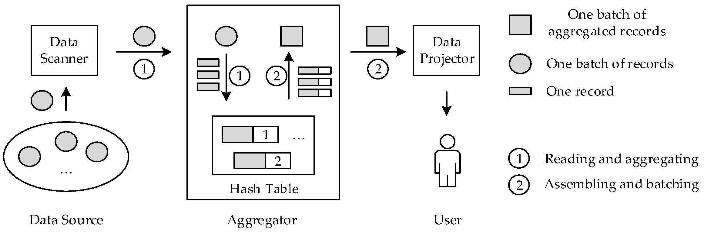

**图 1.** 向量化数据库中 `group` 算子的典型实现。

#### 1.1.2 Join 算子

图 2 展示了分析型数据库中 `join` 算子的典型实现。（查询语句可能是用 `key_col` 连接表 A 和表 B，并输出两张表中的列 `<A.left_col, B.right_col>`：`SELECT A.left_col, B.right_col FROM A JOIN B USING (key_col)`。）它也有两个阶段：阶段 1 使用连接语句右侧表的数据构建哈希表，阶段 2 从左侧表读取数据，并以流水线方式探测刚构建好的哈希表。构建阶段与前述 `group` 实现类似，但每个表槽位存储的是对右侧列的引用。两个阶段也都是向量化的。

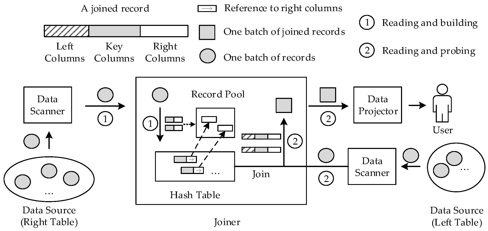

**图 2.** 向量化数据库中 `join` 算子的典型实现。

#### 1.1.3 哈希表

`group` 和 `join` 算子的核心数据结构是哈希表（Hash Table）。哈希表是一种将键关联到值的数据结构。通过选择合适的哈希函数，它支持以常数时间查询给定键。基本思想是选择一个哈希函数，将任意键映射为数值哈希值，而这些哈希值作为索引用来定位哈希表中存放值的槽位。不过，两个不同的键可能得到相同哈希值，进而落到相同索引。如果某个键与哈希表中同一索引下已经存在的键发生冲突，就使用探测函数来解决冲突。

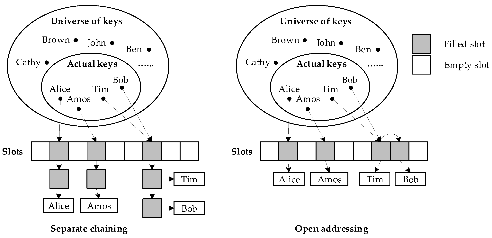

**图 3.** 哈希表的两种主要实现。

解决冲突主要有两种方式：开放寻址（open addressing）和分离链接（separate chaining），如图 3 所示。在分离链接中，元素通过链表存储在哈希表外部。发生冲突的项会链接在单独的链表中。为了查找给定记录，需要计算键的哈希值，取回对应链表并在其中搜索。相比开放寻址，这通常效率较低，因为会产生额外的缓存未命中和分支条件。不过它容易实现，并具有引用稳定性等其他属性，也就是键和值的引用和指针必须在对应键被移除前保持有效。因此它仍被广泛使用，也是 C++ 无序哈希表的默认实现。

在开放寻址中，所有元素都存储在哈希表内。为了查找给定记录，搜索过程会按某种规则检查表槽位，直到找到目标元素。这个过程称为沿冲突链探测，有很多不同的探测方案，例如线性探测、二次探测和双重哈希。这些方案很直观，其名称也来自探测过程本身。还有一些更复杂的策略，例如 RobinHood [7] 和 Hopscotch [8]，它们包含复杂的元素调整逻辑。当哈希表逐渐变满时，许多冲突链会变长，探测可能变得昂贵。为了保持效率，需要通过将元素重新散布到更大的数组中来重哈希。触发重哈希的指标称为负载因子，即哈希表中已存记录数量除以容量。开放寻址哈希表具有更好的缓存局部性、更少的指针间接访问，并且非常适合向量化处理。因此，对分析型工作负载而言，应使用开放寻址方案来获得更高性能。为简洁起见，除非另有说明，本文提到的所有哈希表都使用开放寻址方案。

### 1.2 问题

为分析型数据库实现高效哈希表并不简单，因为哈希表本身有巨大的设计空间，并且对查询运行时间有关键影响。Richter 等人 [9] 深入分析了如何为整数键实现哈希表。他们提出了 10 多个需要检查的条件，以寻找最佳哈希表实现。然而，在分析型数据库中很少有足够信息来满足这些检查条件；同时，由于字符串长度可变，处理字符串键比处理整数更困难。现实世界中的字符串数据常被用作许多查询的键列，例如 URL 域名、昵称、关键词、RDF（Resource Description Framework）属性和 ID 等。这些数据集有一个共同属性：平均长度较短。也有一些字符串数据集，例如包裹投递地址和 Web 搜索短语，具有较长的平均字符串长度。尽管如此，当前分析型数据库并没有针对任一分布做优化，并且也很难预先判断字符串数据集在每个子集中的实际长度分布，从而选择合适的哈希表实现。总之，我们讨论处理字符串数据集上的分析型工作负载时遇到的三个问题：

1. 处理字符串数据集时，应根据字符串长度分布应用不同优化。不存在一种可以适配所有字符串数据场景的单一哈希表。
2. 用指针存储短字符串在成本上不划算，而为短字符串保存哈希值也是空间浪费。
3. 在哈希表插入或查找过程中，对长字符串求哈希对缓存不友好。

### 1.3 我们的解决方案和贡献

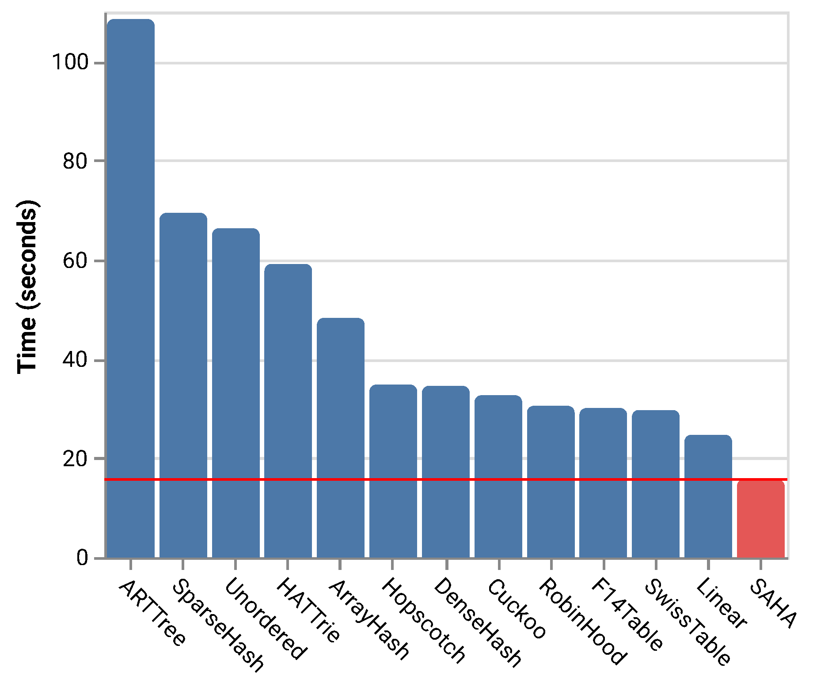

**图 4.** 多种哈希表处理 `group` 和 `join` 基准时相对 `SAHA` 的耗时柱状图。

为解决这些问题，我们提出 `SAHA`，一种面向分析型数据库的字符串自适应哈希表。它将短字符串键重新解释为整数数组，并直接存储在槽位中，不需要任何间接访问。对于长字符串键，它在每个槽位中保存计算出的哈希值以及字符串数据指针，以降低长字符串比较的频率。`SAHA` 在 `group` 和 `join` 算子的每个向量化处理步骤中预计算哈希值，并在后续操作中直接使用这些哈希值。这降低了哈希表插入和查找时探测空槽位造成的缓存污染，尤其适用于长字符串。`SAHA` 还提供了一个基于字符串长度的高度优化键分派器。它可以适配不同字符串数据集，并动态选择最合适的哈希表实现。我们的工作主要有以下贡献：

1. **优化的字符串分派器。** 我们实现了一个基于字符串长度的字符串键分派器，用于将字符串数据集划分为具有预定义字符串长度分布的子集。该分派器使用特殊的内存加载技术进行优化，因此不会给底层哈希表引入性能退化。
2. **混合字符串哈希表。** 我们为不同长度的字符串设计了五种哈希表实现。每种实现都针对一种字符串长度分布优化。所有实现以标准哈希表接口统一为一个哈希表，同时能够适配字符串数据。由于各个子哈希表独立增长，而不是整体增长，因此它还具有较低峰值内存使用量的优势，增长过程也更平滑。
3. **预哈希和向量化编程接口。** 我们发现，在哈希表中进行向量化处理之前，可以预先计算记录的哈希值。这可以在当前批次充满长字符串时优化缓存利用率。我们提出一种新的编程接口，它接受插入和查找函数的回调，使得预计算哈希值等附加信息可以在哈希表内部计算。
4. **广泛实验。** 我们使用真实世界数据集和合成数据集进行了广泛实验，以验证 `SAHA` 的性能。实验关注哈希函数、计算时间、主存利用效率等哈希表关键性能因素。结果表明，在所有场景中，`SAHA` 相比先进哈希表快 1 到 5 倍，如图 4 所示。

本文其余部分组织如下。第 2 节讨论相关工作。第 3 节描述 `SAHA` 的主要构造及其优化。第 4 节展示 `SAHA` 的向量化专用优化及其支持的编程接口。第 5 节给出实验结果。最后，第 6 节给出结论。

## 2. 相关工作

### 2.1 哈希表

哈希表是一种成熟且被广泛研究的数据结构，至今仍是研究热点。第 1 节已经简要提到了一些教科书中常见的实现。这里讨论现实世界中活跃使用的另外三种实现：(1) RobinHood 表 [7] 是一种派生自线性探测的哈希表，如果被探测键离其本应所在的槽位过远，它会通过移动当前元素来限制每个槽位冲突链的长度；(2) Hopscotch [8] 与之类似，但它不是将元素移出，而是基于槽位中的元数据将被探测键交换到更靠近其槽位的位置；(3) Cuckoo hash [10] 使用两个哈希函数，为每个键提供哈希表中的两个可能位置。因此，它保证每次查找只需要较少次数的内存访问。冲突链会变成具有有趣数学特征的图状结构，吸引了许多研究者 [11-13]。这些工作都面向通用数据集，与我们的工作正交。`SAHA` 只需要小幅适配，就可以使用这些哈希表中的任一种作为后端。

一些哈希表通过支持高负载因子来节省内存 [14,15]。这些紧凑哈希表使用位图做占用检查，并用稠密数组存储元素。不过，与字符串编码技术相比，在处理字符串数据时实际节省的内存并不显著。由于需要维护额外位图，插入和查找操作都会变慢。`SAHA` 通过内联短字符串优化内存使用。它可以达到相似的内存消耗，但比这些紧凑哈希表更高效。

工业界广泛使用的先进哈希表包括 Google 的 SwissTable [16] 和 Facebook 的 F14Table [17]。二者都面向通用用途设计，并针对现代硬件优化。其技术思路是将元素分组为小块，并将每个小块打包成带有额外探测元数据的小哈希表。相比在整个哈希表上操作，每个小块可以被更高效地处理。SwissTable 与 F14Table 的主要区别在于，SwissTable 将块的元数据分开存放，而 F14 将元数据和块中的元素放在一起。虽然它们在常规查找和插入操作中性能良好，但略慢于精心设计的线性探测哈希表，例如 ClickHouse [3] 中使用的哈希表，这是我们找到的最快聚合实现。它使用针对 `group` 和 `join` 操作裁剪过的专用线性哈希表，并具有优化过的重哈希实现。在 `group` 工作负载中，它比 SwissTable 和 F14Table 都快 20%。不过，它没有针对字符串数据做优化。`SAHA` 将字符串优化与这个高度调优的哈希表结合起来，使其胜任字符串数据集上的分析型工作负载。

### 2.2 字符串的数据结构和优化

著名的字符串关联容器之一是称为 trie [18] 的树状数据结构。它提供与哈希表类似的功能，并支持字符串前缀搜索等额外操作。Trie 已经被充分研究，也提出了许多高效实现 [19-22]。然而，它并不适合字符串聚合等分析型工作负载。如 [23] 所指出，他们观察到，在运行一些简单聚合查询时，ART [22] 比开放寻址哈希表慢将近 5 倍。我们在第 5 节也观察到类似结果。主要原因是，任何 trie 结构的每个节点都包含指针，而遍历树相比开放寻址哈希表的扁平数组实现需要过多间接访问。

一些哈希表实现 [21,24] 试图将冲突链中的字符串键压缩到连续内存块中。由于字符串被内联，这可以减少内存消耗并降低指针间接访问的频率。因此，在这些哈希表中执行查找会更高效。不过，由于需要额外移动内存，插入会慢得多，尤其是长字符串。`SAHA` 只内联短字符串，并将它们直接存储在槽位中，而不是放到单独冲突链里。因此，它具有相同优势，同时不会影响插入。

许多分析型数据库采用字符串编码作为压缩方案 [3,25-27]。它为每个字符串列维护一个字符串字典，并将输出编码存储为整数列。随后这些整数列可以直接用于 `group` 和 `join` 操作。然而，这只有在字符串列基数较低时才有效，否则维护字典会变得过于昂贵。`SAHA` 适用于任意基数，并且也可以与字符串编码一起使用。

### 2.3 小结

我们在表 1 中选择了 12 种哈希表和 trie，概述可用于字符串数据集上 `group` 和 `join` 的主要数据结构。表中列出了简短描述和与 `SAHA` 相比的字符串相关特性。我们还会在第 5 节的详细基准测试中评估所有这些数据结构。

1. **内联字符串。** 哈希表是否直接存储字符串数据，而不持有字符串指针。
2. **保存哈希值。** 字符串的计算哈希值是否与字符串一起存储在哈希表中。
3. **紧凑。** 哈希表是否具有高负载因子（我们认为 trie 的负载因子为 100%）。

**表 1.** 哈希表。

| 名称 | 内联字符串 | 保存哈希值 | 紧凑 | 描述 |
| --- | --- | --- | --- | --- |
| SAHA | 混合 | 混合 | 否 | 按长度分派后的线性探测 |
| Linear [3] | 否 | 是 | 否 | 线性探测 |
| RobinHood [7] | 否 | 是 | 否 | 有限距离内线性探测 |
| Hopscotch [8] | 否 | 是 | 否 | 邻域探测 |
| Cuckoo [10] | 否 | 是 | 否 | 在两个表之间交替探测 |
| Unordered | 否 | 否 | 否 | 链接法（GNU stdlibc++ 的实现） |
| SwissTable [16] | 否 | 部分 | 否 | 元数据分离的二次探测 |
| F14Table [17] | 否 | 部分 | 否 | 元数据内联的二次探测 |
| DenseHash [14] | 否 | 否 | 否 | 二次探测 |
| SparseHash [14] | 否 | 否 | 是 | 稀疏表上的二次探测 |
| HATTrie [21] | 是 | 否 | 是 | 以 ArrayHash 作为叶节点的 trie 树 |
| ArrayHash [24] | 是 | 否 | 是 | 使用紧凑数组的链接法 |
| ARTTree [22] | 是 | 否 | 是 | 使用混合节点的 trie 树 |

## 3. 构造

`SAHA` 的主要构造包括两组子哈希表：`Hash Table Sn` 和 `Hash Table L`，以及一个字符串键分派器。图 5 展示了 `SAHA` 的架构。除 `Hash Table S0` 之外，所有子表都实现为线性探测哈希表；`Hash Table S0` 是数组查找表。数组查找表将键直接解释为数组索引，因此可以在不存储键数据的情况下，用一到两条 CPU 指令完成元素查找。数组查找表通常用于全集数据基数较小的场景，例如小整数；而字符串数据由于具有无限基数，本来并不适合。不过，由于我们将字符串长度限制为两个字节，`Hash Table S0` 中最多只有 65,536 个不同键，因此即使对字符串数据也可以应用数组查找技术。

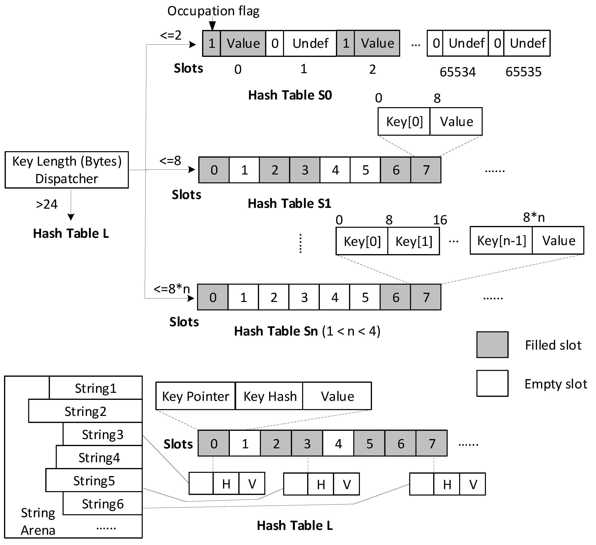

**图 5.** `SAHA` 架构，其中多个哈希表用于存储不同长度范围的字符串。

对于长度大于 2 字节但小于 25 字节的字符串键，我们将它们存储在多个 `Hash Table S` 实现中。这些表的主要区别是槽位大小。我们将字符串键重新解释为整数数组。对于长度在 `(2, 8]` 字节内的字符串键，使用一个 8 字节整数；对于长度在 `(8, 16]` 内的键，使用两个整数；对于长度在 `(16, 24]` 内的键，使用三个整数。这些整数直接存储在槽位中，不使用字符串指针。选择线性探测哈希表的原因是，它在分析型工作负载中取得了很好的性能结果，并且实现代码体积更小，这对 `SAHA` 很重要。由于我们会在多个不同哈希表实现之间分派，如果使用复杂实现，代码体积会膨胀，并对性能产生明显影响。为了验证这一选择，我们在第 5 节将线性探测哈希表与大量其他实现进行了比较。

对于长度超过 24 字节的字符串键，我们在 `Hash Table L` 中直接存储字符串指针以及计算出的哈希值。由于长字符串移动成本较高，持有指针而不是内联字符串键，会使插入和重哈希更快。选择 24 字节作为阈值的原因是：(1) 我们观察到大量字符串数据集 80% 的字符串都短于 24 字节；(2) 使用更多整数表示字符串会因过多数据拷贝而抵消性能收益。为长字符串保存计算出的哈希值也很重要，因为重新计算哈希代价很高，而与存储长字符串相比，额外保存哈希值的内存开销可以忽略不计。保存的哈希值也可用于在线性探测时检查给定槽位是否包含当前键。否则，即使两个长字符串的哈希值不同，也必须总是比较两个长字符串是否相等。`Hash Table L` 还包含一个名为 `String Arena` 的内存池，用于保存插入的字符串。哈希表需要对插入数据拥有完整所有权，因为在处理 `group` 或 `join` 工作负载的每一行时，当前记录会在插入后被销毁。

字符串键分派器接收一个字符串键，并将它分派给对应哈希表的例程。由于它位于代码的关键路径中，需要谨慎实现和优化，以避免引入性能退化。为了分派短字符串，需要从给定指针加载字符串数据到当前栈上，并转换为数值数组。为了高效拷贝内存，应使用常量字节数，而不是直接调用 `memcpy(dst, src, len)`。我们使用 8 字节作为最小内存拷贝单位，每次从字符串数据读取一个整数到数组。如果字符串长度不能被 8 整除，就从结束位置减 8 开始加载最后几个字节。因此，我们仍然拷贝 8 字节，只是移出图 6 中的 `H` 部分。然而，如果字符串短于 8 字节，拷贝 8 字节可能导致段错误，图 6 中展示了下溢和上溢。（段错误由带内存保护的硬件触发，用于通知操作系统软件试图访问受限内存区域。）为解决这一问题，在分派到 `Hash Table S1` 时，我们对字符串指针做内存地址检查。由于内存页大小为 4096 字节，如果 `pointer & 2048 = 0`，说明字符串数据位于内存页的上半部，因此只可能发生下溢。此时可以安全地从位置 0 拷贝 8 字节，并去掉 `T` 部分。否则，只可能发生上溢，前述算法可以正确工作。

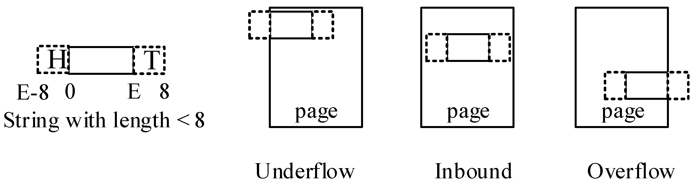

**图 6.** 长度短于 8 字节的字符串键的三种内存布局。

代码清单 1 用伪 C++ 展示了字符串键分派器的实现。它接收带有指针和大小的字符串键，并将键分派到子哈希表。不同哈希表需要不同键类型，但输入字符串数据相同；因此使用了一个 union 结构。每个字符串键中 `T` 部分的长度可以用 `(-key.size & 7) * 8` 计算，并用于快速内存加载。当哈希表用于 `group` 和 `join` 工作负载时，主要有两个例程：`emplace` 和 `find`。`emplace` 例程用于在给定键尚未出现在表中时将数据插入哈希表；如果表中已经存在与待插入键相等的键，则返回哈希表中的数据。`find` 例程与 `emplace` 略有不同：如果给定键在哈希表中缺失，它不会插入数据，而是向调用者返回键未找到的指示。这里我们演示的是对 `emplace` 的分派，其他例程以类似方式分派。实现需要保证所有子哈希表的方法体都被内联到分派代码中。否则，分派过程会因为引入额外函数调用而影响性能。为了达到这一效果，实际实现需要仔细调优。一种可能的实现可参考 [28]。

除这些构造外，`SAHA` 还提供以下优化以进一步降低运行时间：

- **`Hash Table Sn` 的槽位空检查。** 由于 `Hash Table Sn` 中不存储字符串长度，一种检查给定槽位是否为空的方法是验证该槽位键数组中的所有整数是否都等于零。不过，由于 UTF-8 中零字节是码点 0，即 NUL 字符；不存在其他 Unicode 码点会在其 UTF-8 编码中包含零字节。因此，我们只需要检查第一个整数，也就是图 5 中的 `key[0] == 0`。这能带来可观提升，尤其对每个键包含三个整数的 `Hash Table S3`。
- **`Hash Table L` 的自动所有权处理。** 对于长字符串，在成功插入时，我们会把字符串数据拷贝到 `String Arena` 中，以持有字符串键的所有权。这要求插入方法返回已插入字符串键的引用，从而将字符串指针修改到 `String Arena` 中的新位置。然而，返回键引用代价很高，因为在 `SAHA` 中字符串也被存储为整数；通用地返回引用会要求构造临时字符串。为解决这一问题，我们为字符串键增加一个可选内存池引用，并允许哈希表决定何时需要将字符串键解析到内存池中。这用于 `Hash Table L`，在新插入时自动解析字符串。
- **带内存加载优化的 CRC32 哈希。** 循环冗余校验（CRC）是一种检错码。它能以尽可能少的冲突对字节流求哈希，因此是哈希函数的良好候选。现代 CPU 提供 CRC32 原生指令，可以在少数周期内计算 8 字节的 CRC 值。因此，我们可以使用字符串分派器中的内存加载技术高效执行 CRC32 哈希。

**代码清单 1.** 伪 C++ 中用于 `emplace` 例程的字符串分派器实现。

```cpp
void dispatchEmplace(StringRef key, Slot *& slot) {
    int tail = (-key.size & 7) * 8;
    union { StringKey8 k8; StringKey16 k16; StringKey24 k24; uint64_t n[3]; };
    switch (key.size) {
    case 0:
        Hash_Table_S0.emplace(0, slot);
    case 1..8:
        if (key.pointer & 2048) == 0)
          { memcpy(&n[0], key.pointer, 8); n[0] &= -1 >> tail; }
        else { memcpy(&n[0], key.pointer + key.size - 8, 8); n[0] >>= tail; }
        if (n[0] < 65536) Hash_Table_S0.emplace(k8, slot);
        else Hash_Table_S1.emplace(k8, slot);
    case 9..16:
        memcpy(&n[0], key.pointer, 8);
        memcpy(&n[1], key.pointer + key.size - 8, 8);
        n[1] >>= s;
        Hash_Table_S2.emplace(k16, slot);
    case 17..24:
        memcpy(&n[0], key.pointer, 16);
        memcpy(&n[2], key.pointer + key.size - 8, 8);
        n[2] >>= s;
        Hash_Table_S3.emplace(k24, slot);
    default:
        Hash_Table_L.emplace(key, slot);
    }
}
```

为了更好地理解这些优化的有效性，我们分别讨论哈希表 `find` 和 `emplace` 例程的代价模型。对于 `find` 例程，它主要由两个步骤组成：(a) 计算当前键的哈希值，以查找其冲突链，记为 $H$；(b) 探测该链以确定是否存在匹配键，记为 $P$。探测过程的复杂度与冲突链平均长度有关，记为 $\alpha$。我们可以进一步把探测过程拆分为加载每个槽位的内存内容 $P _ L$，以及进行键比较 $P _ C$。在加入重哈希等其他维护操作的复杂度 $O$ 后，一次失败 `find` 操作的运行时复杂度 $T _ {\mathrm{find}}$ 可表示为公式 (1)。

$$
T _ {\mathrm{find}} = O + H + \alpha \ast (P _ L + P _ C)
\qquad \text{(1)}
$$

一次成功查找的复杂度几乎相同，只是 $\alpha$ 更小；也就是说，一旦找到匹配项就能更早结束。一次失败的 `emplace` 操作（我们之所以称为失败，是因为当哈希表中已存在相同键时，`emplace` 无法存储该键）等同于一次成功的 `find`；而一次成功的 `emplace` 还有一个额外步骤：在找到空槽位之后，需要存储被插入的元素，记为 $S$。对于字符串值，这意味着将字符串数据解析到哈希表的内存池中，即 $S _ P$，并将更新后的字符串指针写入槽位，即 $S _ W$。因此，如公式 (2) 所示，一次成功 `emplace` 操作的总运行时复杂度 $T _ {\mathrm{emplace}}$ 高于 `find` 操作。

$$
T _ {\mathrm{emplace}} = O + H + \alpha \ast (P _ L + P _ C) + S _ P + S _ W
\qquad \text{(2)}
$$

优化所有这些参数对提升哈希表性能都很重要，但参数 $O$ 除外，因为它与开放寻址方案的机制有关，优化空间很小。参数 $\alpha$ 与探测方案、哈希函数和数据集本身相关。优化 $\alpha$ 是一个宽泛话题，超出了本文范围。相反，我们采用一个经过工业验证、具有良好 $\alpha$ 值的哈希表策略作为构建块，也就是 ClickHouse 的哈希表，并且它的维护成本也较低。为了验证我们对其余参数优化的有效性，我们使用从 twitter.com 获取的真实世界字符串数据集设计了字符串插入基准，评估每个参数的运行时复杂度。为了覆盖所有参数，我们只测试成功的 `emplace` 操作，并预处理数据集，只保留不同字符串，使所有 `emplace` 操作都成功。对比对象是 ClickHouse 中的哈希表，作为基线；测试结果见表 2。微基准表明，我们的优化显著改善了所有参数。

**表 2.** 有无优化时代价模型参数复杂度的比较。

| 参数 | 基线 | SAHA | 优化 |
| --- | ---: | ---: | --- |
| H | 33 | 22 | 内存加载优化 |
| PL + PC | 56 | 37 | 字符串内联和槽位空检查优化 |
| SP | 34 | 6 | 字符串分派和自动所有权处理 |
| SW | 16 | 14 | 选择性保存哈希值 |
| 单位 | 每键周期数 | 每键周期数 |  |

## 4. 预哈希和向量化编程接口

`SAHA` 面向分析型数据库设计，而向量化处理查询流水线提供了独特的优化机会。其中一项主要优化是预哈希。对哈希表中的元素进行插入或查找时，一个必要步骤是计算该元素的哈希值。这需要检查元素的完整内容，意味着 CPU 缓存会被该元素填充。当字符串较长时，它可能占用大量缓存空间，并可能驱逐用于哈希表槽位的数据，导致缓存竞争。为了在探测时更好地利用 CPU 缓存，我们需要避免读取字符串内容。对于插入新的长字符串或查找不存在的长字符串，如果已有预计算哈希值，就可以做到这一点。例如，当一个全新的长字符串插入 `SAHA` 时，它会被分派到 `Hash Table L`。随后我们直接使用预计算哈希值进行探测。由于 `Hash Table L` 的槽位中也保存哈希值，一个全新字符串很可能在不进行任何字符串比较的情况下找到空槽位。即使两个不同长字符串具有相同哈希值，比较这两个字符串也通常会很早结束，除非二者共享很长前缀。对于长字符串，数据集通常具有高基数，而处理新键是哈希表中的主要情况。因此，通过预计算哈希值，很有可能避免读取字符串内容。

我们可以在接收一批记录之后、在哈希表中处理它们之前计算哈希值。图 7 展示了有无预哈希的比较。在哈希表外部实现预哈希很简单。然而，对分析型数据库而言，这种设计并不好，因为分析型数据库还会聚合整数键和复合键，而这些场景下预哈希没有意义。因此，该优化应对聚合器透明，并存在于哈希表内部。为了实现预哈希，哈希表应接收一批记录，而不是一次接收一行。因此，我们为 `SAHA` 提出了一种向量化编程接口。它也可以应用到其他哈希表。

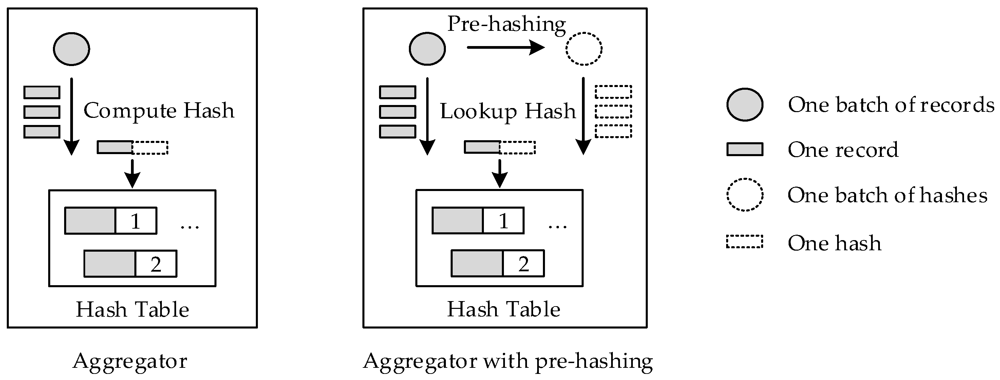

**图 7.** 有无预哈希的向量化聚合实现比较。

图 8 展示了一个接收一批记录的哈希表示意图。它在执行其他操作之前预计算哈希值。处理每条记录之后，已注册回调会被调用以完成操作。在聚合器示例中，回调是应用于记录的聚合函数。代码清单 2 展示了有无向量化时 `emplace` 例程的比较。借助向量化编程接口，我们可以实现其他优化，例如对批量记录重排序以打破数据依赖。

**代码清单 2.** 伪 C++ 中有无向量化的 `emplace` 例程比较。

```cpp
// vanilla emplace
void emplace(
    StringRef key,
    Slot *& slot) {
  uint64_t hash = hashing(key);
  slot = HashTable.probing(hash);
}

// Aggregating
for (StringRef& key : keys) {
  Slot* slot;
  emplace(key, slot);
  if (slot == nullptr)
    slot->value = 1;
  else
    ++slot->value;
}

// vectorized emplace with pre-hashing
void emplaceBatch(
    vector<StringRef>& keys,
    Callback func) {
  vector<uint64_t> hashes(keys.size());
  for (int i = 0; i < keys.size(); ++i)
    hashes[i] = hashing(keys[i]);
  for (int i = 0; i < keys.size(); ++i)
    func(HashTable.probing(hash[i]));
}

void callback(Slot* slot) {
  if (slot == nullptr)
    slot->value = 1;
  else
    ++slot->value;
}

// Aggregating
emplaceBatch(keys, callback);
```

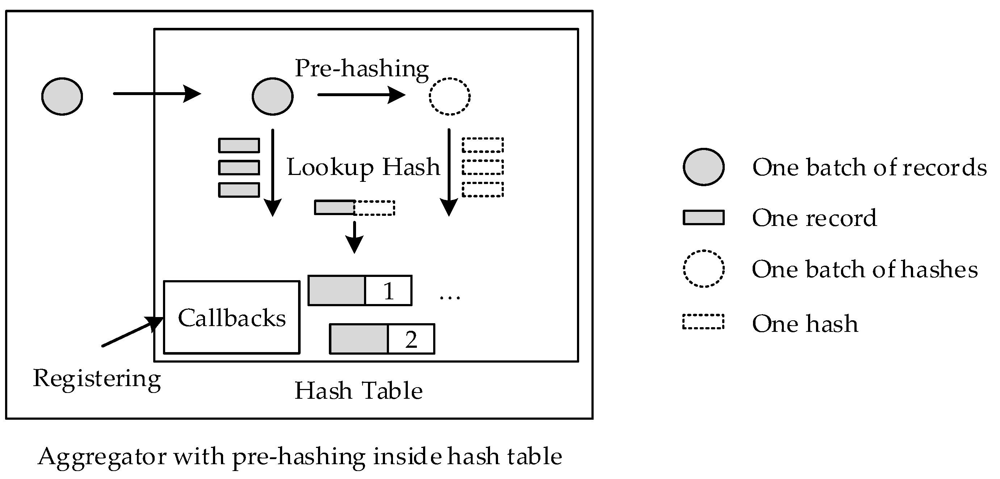

**图 8.** 使用向量化编程接口和预哈希的哈希表聚合器。

## 5. 评测

本节我们使用一台物理服务器和四个基准（`SetBuild`、`SetLookup`、`group` 和 `join`）评估 `SAHA` 的性能。我们使用四个真实世界数据集，它们具有不同字符串长度分布属性，如表 3 所示。我们还生成了额外的合成数据集，以进一步研究不同字符串长度分布下的性能。物理服务器包含两颗 Intel Xeon E5-2640v4 CPU 和 128 GB 内存。我们使用不同均值，通过二项式字符串长度分布合成了 Term 数据集。

**表 3.** 数据集。

| 名称 | 描述 | 字符串数 | 不同字符串数 | 0.2 | 0.4 | 0.6 | 0.8 | 1.0 |
| --- | --- | ---: | ---: | ---: | ---: | ---: | ---: | ---: |
| Hotspot | 微博热点话题 | 8,974,818 | 1,590,098 | 12 | 15 | 18 | 24 | 837 |
| Weibo | 微博用户昵称 | 8,993,849 | 4,381,094 | 10 | 12 | 16 | 21 | 45 |
| Twitter | Twitter 用户昵称 | 8,982,748 | 7,998,096 | 8 | 9 | 11 | 13 | 20 |
| SearchPhrase | Yandex Web 搜索短语 | 8,928,475 | 4,440,301 | 29 | 44 | 57 | 77 | 2025 |
| Term2 | 均值长度 2 | 8,758,194 | 835,147 | 1 | 1 | 2 | 3 | 14 |
| Term4 | 均值长度 4 | 8,758,194 | 3,634,680 | 2 | 3 | 4 | 6 | 17 |
| Term8 | 均值长度 8 | 8,758,194 | 8,247,994 | 6 | 7 | 9 | 10 | 25 |
| Term16 | 均值长度 16 | 8,758,194 | 8,758,189 | 13 | 15 | 17 | 19 | 40 |
| Term24 | 均值长度 24 | 8,758,194 | 8,758,194 | 20 | 23 | 25 | 28 | 47 |
| Term48 | 均值长度 48 | 8,758,194 | 8,758,194 | 44 | 47 | 49 | 52 | 73 |

我们将 `SAHA` 与表 1 中的多种不同哈希表比较。首先，在所有真实世界数据集上，用四个基准评估这些哈希表，并累积运行时间以获得性能对比概览。对于每个数据集和基准，图 9 展示了相对于所有哈希表中最快者的减速热力图。随后，我们对最快的实现做额外的详细比较测试。这有助于减少后续详细基准数量。此外，由于我们试图选择领先的哈希表，预哈希优化没有纳入这一轮比较，因为并非所有哈希表都适合预哈希。

从图 9 我们可以看到，`SAHA` 几乎在所有基准中都取得了最佳性能。只有在处理长字符串时，它才略慢于 ClickHouse 的线性探测哈希表。基于 trie 的实现极慢，不应被用于 `group` 和 `join` 工作负载。在所有开放寻址哈希表中，线性探测不需要复杂探测方案就已经足够好，并在所有实现中取得第二好的性能。向量化哈希表在四个基准中都没有展现性能优势。

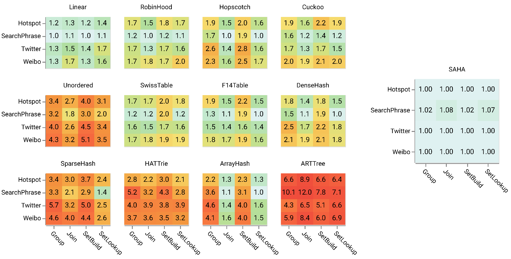

**图 9.** 多种哈希表在四个数据集（HotSpot、Weibo、Twitter、SearchPhrase）上的 `SetBuild`、`SetLookup`、`group` 和 `join` 基准中，相对于所有哈希表中最快者的减速热力图。数值越低越好，绿色表示更好，1 表示该哈希表在特定数据集和特定基准上最快。

为了完成评测，我们还比较了每个哈希表在基准测试期间分配的峰值内存。为了获得准确的内存统计，我们使用 `malloc` hooks 记录每次分配和释放，并跟踪达到的最大值。我们只在两个数据集上评估 `group` 基准，因为这足以衡量内存消耗特征。如图 10 所示，处理短字符串时，`SAHA` 内存效率高，接近紧凑实现，同时获得最佳运行性能。HATTrie 具有最低内存消耗，比 `SAHA` 低 30%，但运行时间慢 4 倍。对于长字符串数据集，`SAHA` 不提供内存优化，并且与所有保存哈希值的实现使用相同内存量。由于我们尚未包含预哈希优化，它也具有与 Linear 相同的性能特征。紧凑哈希表和基于 trie 树的实现非常节省内存，但耗时更多，应谨慎使用。向量化哈希表比其他开放寻址实现消耗的内存略少，因为它们按块分配内存，并且内存对齐引入的浪费更少。

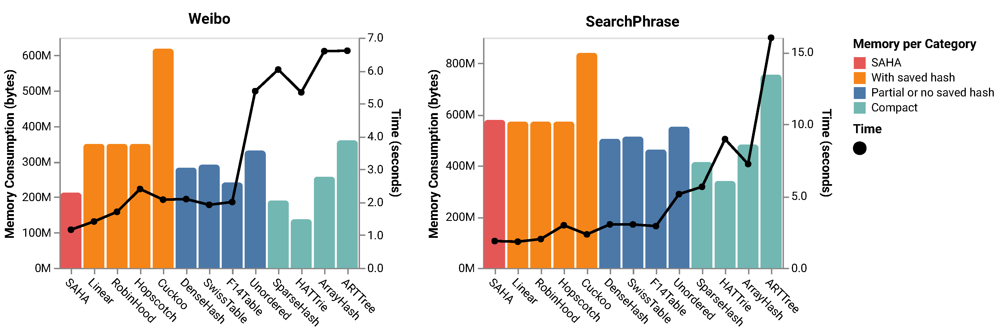

**图 10.** 多种哈希表在两个具有短、长字符串长度分布的数据集（Weibo 和 SearchPhrase）上运行 `group` 基准时的内存消耗和时间消耗组合柱线图。柱状图按内存消耗特征分组。

如前文所述，为了在处理长字符串时取得更好性能，我们引入了预哈希优化。从前面的基准可以看到，Linear 哈希表可以作为良好基线。因此，我们在图 11 中对 Linear 和 `SAHA` 做详细比较，并展示预哈希对长字符串的收益。评测显示，预哈希显著提升了长字符串数据集上的性能，同时也有利于短字符串数据集。有两个数据集 SearchPhrase 和 Term48 中，不使用预哈希的 `SAHA` 因代码膨胀引入了少量性能退化；不过，预哈希优化完全抵消了这部分退化。唯一比不使用预哈希更慢的数据集是 Term2，因为它包含非常短的字符串，此时哈希计算本身很简单。但总运行时间也很小，退化可以忽略。因此，预哈希通常都应启用，因为它总体上提升了哈希表性能。

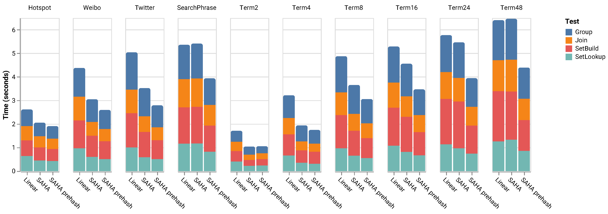

**图 11.** Linear、`SAHA` 和启用预哈希的 `SAHA` 在所有数据集上的 `SetBuild`、`SetLookup`、`group` 和 `join` 基准中的累积运行时间柱状图。

我们还评估了 `SAHA` 字符串分派器的优化。该基准与评估预哈希优化时类似。我们使用一种朴素字符串分派器实现作为基线。它没有内存加载优化，并且代码体积更大。从图 12 可以看到，与朴素分派相比，我们的优化在多数测试场景中使性能增益翻倍。不过，在处理只包含极短或极长字符串的数据集时，该优化不会影响性能，因为这两种情况几乎不受内存加载影响。

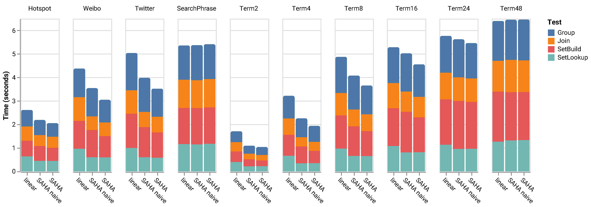

**图 12.** Linear、使用朴素分派的 `SAHA` 和 `SAHA` 在所有数据集上的 `SetBuild`、`SetLookup`、`group` 和 `join` 基准中的累积运行时间柱状图。

为了理解不同哈希表在大数据集上的可扩展性和性能，我们使用从 weibo.com 获取的真实世界字符串数据集，其中包含 10 亿行。图 13 使用折线图比较了多种哈希表，以展示每种哈希表的可扩展性。可以看到，`SAHA` 线性扩展，并且由于字符串内联优化，它对内存更友好，因此处理大数据集时改善更明显。此外，由于 `join` 工作负载主要包含键查找操作，`SAHA` 的性能优势变得更加突出。

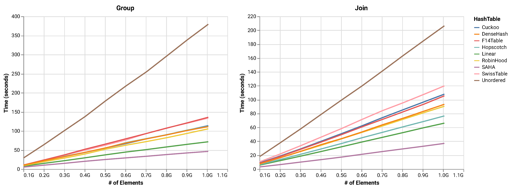

**图 13.** 多种哈希表在真实世界 Weibo 数据集上的 `group` 和 `join` 基准中的耗时折线图。

为了验证使用 CRC32 指令作为哈希函数的优势，我们将它与另外七种哈希函数进行评估。其中一些被广泛使用，例如 MurmurHash；另一些更现代，并声称能取得良好结果，例如 t1ha 和 xxHash。由于每个基准中的哈希操作相似，我们只使用 `group` 基准进行比较。由于哈希函数可能影响底层哈希表的性能，我们从前述基准中选择六种哈希表，替换其哈希函数后重新运行测试。我们还使用两个差异显著的数据集 Weibo 和 SearchPhrase，评估字符串长度分布对哈希函数的影响。如图 14 所示，CRC32Hash 在所有场景中最快。结果表明，哈希函数在不同哈希表上的表现具有一致性。在长字符串数据集 SearchPhrase 上，不同哈希函数之间的差异大于以短字符串为主的 Weibo 数据集。这是因为处理短字符串时，哈希操作占总运行时间的比例更小；因此，Weibo 数据集上的基准对不同哈希函数不太敏感。CRC32 的性能优势主要来自现代 CPU 中的 `_mm_crc32_u64` 等原生指令。因此，它是 `SAHA` 的默认哈希函数。

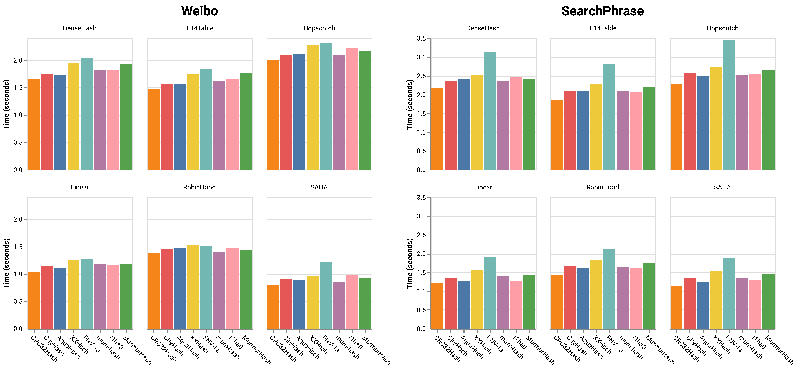

**图 14.** 多种哈希函数在两个具有短、长字符串长度分布的数据集（Weibo 和 SearchPhrase）上运行 `group` 基准时的耗时柱状图。

由于我们的目标是优化分析型数据库中的真实世界工作负载，我们在 ClickHouse 数据库中实现了 `SAHA`，并将其端到端时间消耗与内置哈希表实现进行比较。由于当前 ClickHouse `join` 机制存在限制，我们只评估了 `group` 基准，但它可以很好地指示查询运行时间改善。我们使用 `SELECT str, count(*) FROM <table> GROUP BY str` 作为基准查询，其中 `<table>` 是前述评测中使用的任一数据集。该表填充了一列名为 `str`、类型为 string 的数据。如图 15 所示，`SAHA` 将总查询运行时间最多缩短 40%，并且在所有字符串数据分布上都始终更快。由于执行端到端 `group` 基准时还有其他操作参与，例如数据扫描、内存拷贝和多种字符串处理，我们无法获得前述哈希表评测中展示的同等改善；然而，对分析型数据库这样的高度优化应用而言，40% 的提升已经很显著，也表明哈希表在 `group` 等分析查询中扮演了重要角色。此外，在短字符串数据集上评估时，内存消耗大幅下降，因为我们将短字符串表示为数值，并且没有使用保存的哈希值。

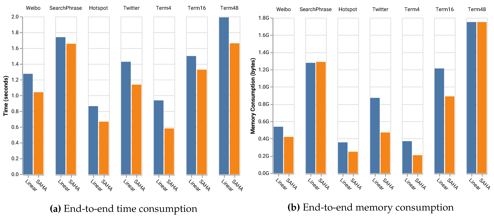

**图 15.** ClickHouse 内置哈希表和启用预哈希的 `SAHA` 在多个数据集上的端到端 `group` 查询基准中的时间消耗和内存消耗柱状图。

## 6. 结论

我们提出了 `SAHA`，一种混合哈希表实现，它将短字符串作为整数存储在一组底层哈希表中。`SAHA` 的核心思想是使用字符串长度分派，使小字符串键进入为整数构建的哈希表，而长字符串键会保存其哈希值，以避免昂贵的哈希重计算。相比使用指针存储短字符串，它在 CPU 和内存上都更高效。结合预哈希和内存加载等其他优化，最终得到的哈希表相比我们能找到的第二好实现快近 100%。我们进行了广泛评测，并对哈希表、哈希函数和字符串数据分布做了详细分析。`SAHA` 的部分代码已经合入 ClickHouse，并在生产环境中被广泛使用和测试。

在未来工作中，我们计划研究长字符串子哈希表的向量化可能性，也计划结合排序和其他数据结构来进一步优化分析型查询。

**作者贡献：** 概念化，T.Z.；方法论，T.Z.；软件，T.Z.；验证，T.Z.；初稿撰写，T.Z.；可视化，T.Z.；监督，Z.Z.；项目管理，Z.Z.；经费获取，X.C.

**经费：** 本研究由中国科学院战略性先导科技专项（XDA19020400）资助。

**致谢：** 我们感谢 Yandex ClickHouse 团队审阅 `SAHA` 代码，并帮助将其合入 ClickHouse 代码库。我们感谢匿名审稿人的意见，这些意见帮助改进并澄清了本文。

**利益冲突：** 本文作者声明不存在利益冲突。

## 参考文献

> **原文勘误提示：** 原文参考文献 [1] 与 [6] 的题名和 URL 目标相互错配：[1] 题名写作 “SIMD”，链接却指向 SQL；[6] 题名写作 “SQL”，链接却指向 SIMD。下列条目按原文保留。

1. Wikipedia Contributors. SIMD-Wikipedia, The Free Encyclopedia, 2020. Available online: https://en.wikipedia.org/w/index.php?title=SQL&oldid=938477808 (accessed on 1 Feburary 2020).
2. Nambiar, R.O.; Poess, M. The Making of TPC-DS. VLDB 2006, 6, 1049-1058.
3. ClickHouse Contributors. ClickHouse: Open Source Distributed Column-Oriented DBMS, 2020. Available online: https://clickhouse.tech (accessed on 1 Feburary 2020).
4. Bittorf, M.K.A.B.V.; Bobrovytsky, T.; Erickson, C.C.A.C.J.; Hecht, M.G.D.; Kuff, M.J.I.J.L.; Leblang, D.K.A.; Robinson, N.L.I.P.H.; Rus, D.R.S.; Wanderman, J.R.D.T.S.; Yoder, M.M. Impala: A Modern, Open-Source SQL Engine for Hadoop; CIDR: Asilomar, CA, USA, 2015.
5. Thusoo, A.; Sarma, J.S.; Jain, N.; Shao, Z.; Chakka, P.; Anthony, S.; Liu, H.; Wyckoff, P.; Murthy, R. Hive: A Warehousing Solution over a Map-reduce Framework. Proc. VLDB Endow. 2009, 2, 1626-1629. doi:10.14778/1687553.1687609.
6. Wikipedia contributors. SQL - Wikipedia, The Free Encyclopedia, 2020. Available online: https://en.wikipedia.org/w/index.php?title=SIMD&oldid=936265376 (accessed on 1 Feburary 2020).
7. Celis, P.; Larson, P.A.; Munro, J.I. Robin hood hashing. In Proceedings of the IEEE 26th Annual Symposium on Foundations of Computer Science (sfcs 1985), Washington, DC, USA, 21-23 Oct 1985; pp. 281-288.
8. Herlihy, M.; Shavit, N.; Tzafrir, M. Hopscotch Hashing. In Distributed Computing; Taubenfeld, G., Ed.; Springer: Berlin/Heidelberg, Germany, 2008; pp. 350-364.
9. Richter, S.; Alvarez, V.; Dittrich, J. A seven-dimensional analysis of hashing methods and its implications on query processing. Proc. VLDB Endow. 2015, 9, 96-107.
10. Pagh, R.; Rodler, F.F. Cuckoo hashing. In European Symposium on Algorithms; Springer: Berlin/Heidelberg, Germany, 2001; pp. 121-133.
11. Kirsch, A.; Mitzenmacher, M.; Wieder, U. More robust hashing: Cuckoo hashing with a stash. SIAM J. Comput. 2010, 39, 1543-1561.
12. Breslow, A.D.; Zhang, D.P.; Greathouse, J.L.; Jayasena, N.; Tullsen, D.M. Horton tables: Fast hash tables for in-memory data-intensive computing. In Proceedings of the 2016 USENIX Annual Technical Conference (USENIX ATC 16), Denver, CO, USA, 22-24 June 2016; pp. 281-294.
13. Scouarnec, N.L. Cuckoo++ hash tables: High-performance hash tables for networking applications. In Proceedings of the 2018 Symposium on Architectures for Networking and Communications Systems, Ithaca, NY, USA, 23-24 July 2018; pp. 41-54.
14. google sparsehash@googlegroups.com. Google Sparse Hash, 2020. Available online: https://github.com/sparsehash/sparsehash (accessed on 1 Feburary 2020).
15. Barber, R.; Lohman, G.; Pandis, I.; Raman, V.; Sidle, R.; Attaluri, G.; Chainani, N.; Lightstone, S.; Sharpe, D. Memory-efficient hash joins. Proc. VLDB Endow. 2014, 8, 353-364.
16. Benzaquen, S.; Evlogimenos, A.; Kulukundis, M.; Perepelitsa, R. Swiss Tables and absl::Hash, 2020. Available online: https://abseil.io/blog/20180927-swisstables (accessed on 1 Feburary 2020).
17. Bronson, N.; Shi, X. Open-Sourcing F14 for Faster, More Memory-Efficient Hash Tables, 2020. Available online: https://engineering.fb.com/developer-tools/f14/ (accessed on 1 Feburary 2020).
18. Wikipedia contributors. Trie-Wikipedia, The Free Encyclopedia, 2020. Available online: https://en.wikipedia.org/w/index.php?title=Trie&oldid=934327931 (accessed on 1 Feburary 2020).
19. Aoe, J.I.; Morimoto, K.; Sato, T. An efficient implementation of trie structures. Softw. Pract. Exp. 1992, 22, 695-721.
20. Heinz, S.; Zobel, J.; Williams, H.E. Burst tries: A fast, efficient data structure for string keys. ACM Trans. Inf. Syst. (Tois) 2002, 20, 192-223.
21. Askitis, N.; Sinha, R. HAT-trie: A cache-conscious trie-based data structure for strings. In Proceedings of the Thirtieth Australasian Conference on Computer Science, Ballarat, VIC, Australia, 30 January-2 February 2007; Australian Computer Society, Inc.: Mountain View, CA, USA, 2007; Volume 62, pp. 97-105.
22. Leis, V.; Kemper, A.; Neumann, T. The adaptive radix tree: ARTful indexing for main-memory databases. In Proceedings of the 2013 IEEE 29th International Conference on Data Engineering (ICDE), Brisbane, QLD, Australia, 8-12 April 2013; pp. 38-49. doi:10.1109/ICDE.2013.6544812.
23. Alvarez, V.; Richter, S.; Chen, X.; Dittrich, J. A comparison of adaptive radix trees and hash tables. In Proceedings of the 2015 IEEE 31st International Conference on Data Engineering, Seoul, Korea, 13-17 April 2015; pp. 1227-1238.
24. Askitis, N.; Zobel, J. Cache-conscious collision resolution in string hash tables. In International Symposium on String Processing and Information Retrieval; Springer: Berlin/Heidelberg, Germany, 2005; pp. 91-102.
25. Lamb, A.; Fuller, M.; Varadarajan, R.; Tran, N.; Vandiver, B.; Doshi, L.; Bear, C. The Vertica Analytic Database: C-store 7 Years Later. Proc. VLDB Endow. 2012, 5, 1790-1801. doi:10.14778/2367502.2367518.
26. Färber, F.; Cha, S.K.; Primsch, J.; Bornhövd, C.; Sigg, S.; Lehner, W. SAP HANA Database: Data Management for Modern Business Applications. SIGMOD Rec. 2012, 40, 45-51. doi:10.1145/2094114.2094126.
27. Stonebraker, M.; Abadi, D.J.; Batkin, A.; Chen, X.; Cherniack, M.; Ferreira, M.; Lau, E.; Lin, A.; Madden, S.; O'Neil, E.; et al. C-store: A column-oriented DBMS. In Making Databases Work: The Pragmatic Wisdom of Michael Stonebraker; ACM: New York, NY, USA, 2018; pp. 491-518.
28. Amos Bird (Tianqi Zheng). Add StringHashMap to Optimize String Aggregation, 2019. Available online: https://github.com/ClickHouse/ClickHouse/pull/5417 (accessed on 1 Feburary 2020).
