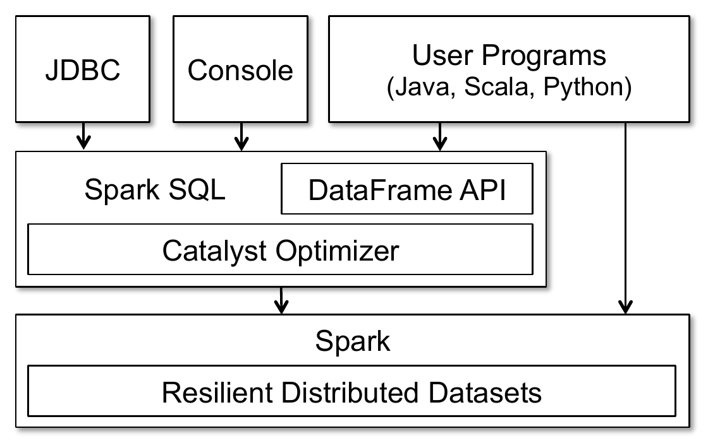
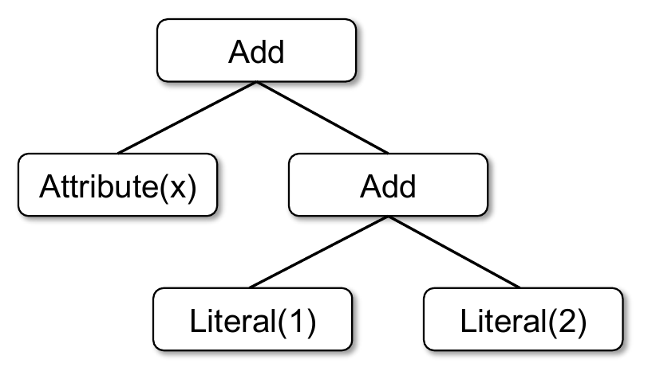
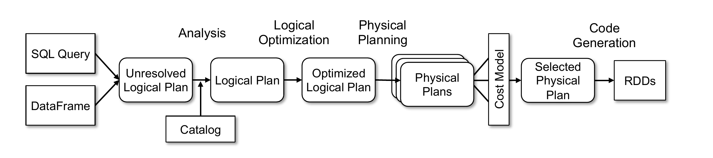
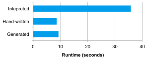
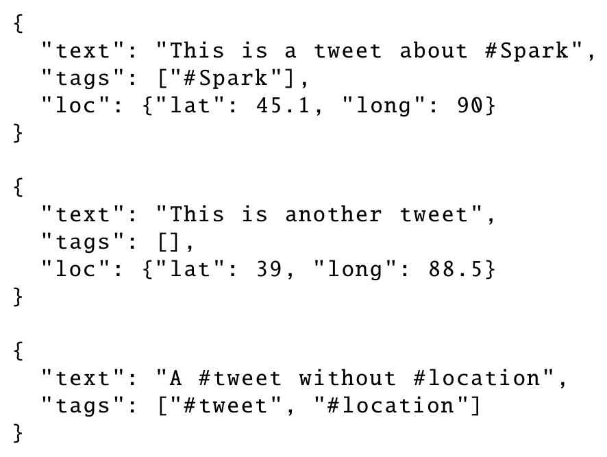
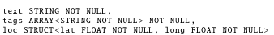
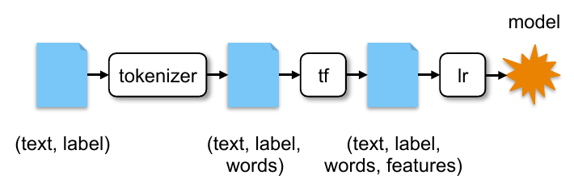
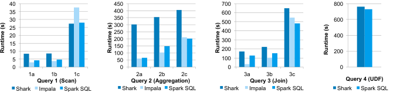
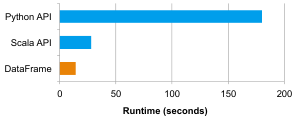
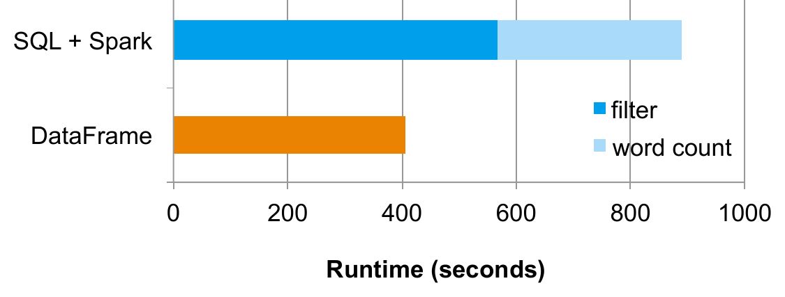

# Spark SQL: Relational Data Processing in Spark（中文译文）

## 译者说明

本文依据同目录的 `source.pdf` 翻译。章节、图表、公式、算法、代码与参考文献按原文结构保留。

Michael Armbrust、Reynold S. Xin、Cheng Lian、Yin Huai、Davies Liu、Joseph K. Bradley、Xiangrui Meng、Tomer Kaftan、Michael J. Franklin、Ali Ghodsi、Matei Zaharia

## 摘要

Spark SQL 是 Apache Spark 的新模块，它把关系处理与 Spark 的函数式编程 API 集成在一起。基于我们构建 Shark 的经验，Spark SQL 让 Spark 程序员可以利用关系处理的优势，例如声明式查询和优化过的存储；也让 SQL 用户能够调用 Spark 中复杂的分析库，例如机器学习库。与此前系统相比，Spark SQL 有两个主要新增点。第一，它通过声明式 DataFrame API，在关系处理与过程式处理之间提供了更紧密的集成，并能与过程式 Spark 代码结合。第二，它包含一个高度可扩展的优化器 Catalyst。Catalyst 利用 Scala 编程语言的特性，使添加可组合规则、控制代码生成和定义扩展点变得容易。基于 Catalyst，我们构建了一系列面向现代数据分析复杂需求的特性，包括 JSON 的 schema 推断、机器学习类型，以及到外部数据库的查询联邦。我们把 Spark SQL 视为 SQL-on-Spark 和 Spark 本身的演进：它在保留 Spark 编程模型优势的同时，提供更丰富的 API 和优化能力。

**类别与主题词**：H.2 [Database Management]: Systems

**关键词**：Databases；Data Warehouse；Machine Learning；Spark；Hadoop

## 1. 引言

大数据应用需要混合多种处理技术、数据源和存储格式。最早面向这些工作负载的系统，例如 MapReduce，向用户提供了强大但低层次的过程式编程接口。使用这类系统编程负担较重，并且为了获得高性能，通常需要用户手动优化。因此，后续出现了多个系统，希望通过关系接口提供更高效的用户体验。Pig、Hive、Dremel 和 Shark [29, 36, 25, 38] 等系统都利用声明式查询实现更丰富的自动优化。

关系系统的流行表明，用户常常更愿意编写声明式查询；但对许多大数据应用而言，仅有关系方法仍然不够。首先，用户希望在各种可能是半结构化或非结构化的数据源之间执行 ETL，这通常需要自定义代码。其次，用户希望执行机器学习、图处理等高级分析，而这些任务很难只用关系系统表达。在实践中，我们观察到，大多数数据流水线理想上都应由关系查询和复杂过程式算法共同表达。遗憾的是，关系系统和过程式系统直到当时仍然大体分离，迫使用户在两种范式之间二选一。

本文描述我们在 Spark SQL 中结合这两种模型的工作。Spark SQL 是 Apache Spark [39] 的一个重要新组件，建立在我们早期 SQL-on-Spark 系统 Shark 的基础上。但 Spark SQL 不再要求用户在关系 API 与过程式 API 之间选择，而是允许两者无缝混合。

Spark SQL 通过两个贡献弥合这两种模型之间的差距。第一，Spark SQL 提供 DataFrame API，它能够在外部数据源和 Spark 内置分布式集合上执行关系操作。这个 API 类似 R [32] 中广泛使用的 data frame 概念，但操作是延迟求值的，因此可以执行关系优化。第二，为了支持大数据场景中广泛的数据源和算法，Spark SQL 引入了新的可扩展优化器 Catalyst。Catalyst 让添加数据源、优化规则和面向机器学习等领域的数据类型变得容易。

DataFrame API 在 Spark 程序内部提供了丰富的关系/过程式集成。DataFrame 是结构化记录的集合，既可以用 Spark 的过程式 API 操作，也可以用新的关系 API 操作以获得更充分的优化。它们可以直接从 Spark 内置的 Java/Python 对象分布式集合创建，从而把关系处理带入已有 Spark 程序。机器学习库等其他 Spark 组件也会接收和产生 DataFrame。在许多常见场景中，DataFrame 比 Spark 的过程式 API 更方便、更高效。例如，用户可以通过一条 SQL 语句在一次扫描中计算多个聚合，而这在传统函数式 API 中不容易表达。DataFrame 还会自动以列式格式存储数据，相比 Java/Python 对象显著更紧凑。最后，不同于 R 和 Python 中已有的 data frame API，Spark SQL 中的 DataFrame 操作会经过关系优化器 Catalyst。

为了支持 Spark SQL 中多样的数据源和分析工作负载，我们设计了名为 Catalyst 的可扩展查询优化器。Catalyst 利用 Scala 的模式匹配等语言特性，在图灵完备语言中表达可组合规则。它提供一个通用框架来变换树结构，我们用它执行分析、规划和运行时代码生成。通过这个框架，Catalyst 也可以用新的数据源扩展，包括 JSON 等半结构化数据，以及可以下推过滤条件的“智能”数据存储，例如 HBase；也可以用用户自定义函数和面向机器学习等领域的用户自定义类型扩展。函数式语言被认为很适合构建编译器 [37]，因此它适合构建可扩展优化器并不令人意外。实践中，我们发现 Catalyst 能有效支持 Spark SQL 快速增加能力；发布后，外部贡献者也很容易添加新特性。

Spark SQL 于 2014 年 5 月发布，现已成为 Spark 中开发最活跃的组件之一。写作本文时，Apache Spark 是大数据处理领域最活跃的开源项目，过去一年有超过 400 位贡献者。Spark SQL 已部署在非常大规模的环境中。例如，一家大型互联网公司在包含 8000 个节点、超过 100 PB 数据的集群上使用 Spark SQL 构建数据流水线并运行查询。每个单独查询经常处理数十 TB 数据。此外，许多用户不仅把 Spark SQL 用于 SQL 查询，也把它用于结合过程式处理的程序。比如，在运行 Spark 的托管服务 Databricks Cloud 中，三分之二的客户会在其他编程语言内部使用 Spark SQL。从性能看，在 Hadoop 上执行关系查询时，Spark SQL 与只支持 SQL 的系统相比具有竞争力；在可用 SQL 表达的计算上，它也比朴素 Spark 代码快最高 10 倍，并且更节省内存。

更一般地说，我们把 Spark SQL 看作核心 Spark API 的重要演进。Spark 原有的函数式编程 API 虽然很通用，但只提供有限的自动优化机会。Spark SQL 一方面让更多用户可以使用 Spark，另一方面也提升了已有用户的优化能力。在 Spark 内部，社区正在把 Spark SQL 纳入更多 API：DataFrame 已成为新的机器学习 ML pipeline API 的标准数据表示，我们希望未来把它扩展到 GraphX 和 streaming 等组件。

本文组织如下：第 2 节介绍 Spark 背景和 Spark SQL 的目标；第 3 节描述 DataFrame API；第 4 节描述 Catalyst 优化器；第 5 节介绍我们在 Catalyst 上构建的高级特性；第 6 节评估 Spark SQL；第 7 节描述基于 Catalyst 的外部研究；第 8 节介绍相关工作。

## 2. 背景与目标

### 2.1 Spark 概览

Apache Spark 是一个通用集群计算引擎，提供 Scala、Java 和 Python API，并包含 streaming、图处理和机器学习库 [6]。Spark 于 2010 年发布，据我们所知，它是使用类似 DryadLINQ [20] 的“语言集成”API 的系统中使用最广泛的系统之一，也是最活跃的大数据处理开源项目。2014 年 Spark 有超过 400 位贡献者，并被多家厂商打包发行。

Spark 提供类似近期其他系统 [20, 11] 的函数式编程 API，用户操作称为 Resilient Distributed Datasets（RDD）[39] 的分布式集合。每个 RDD 是分区存储在集群上的 Java 或 Python 对象集合。RDD 可通过 `map`、`filter`、`reduce` 等操作处理，这些操作接收编程语言中的函数并把函数发送到集群节点。例如，下面的 Scala 代码统计文本文件中以 `ERROR` 开头的行数：

```scala
lines = spark.textFile("hdfs://...")
errors = lines.filter(s => s.contains("ERROR"))
println(errors.count())
```

这段代码通过读取 HDFS 文件创建名为 `lines` 的字符串 RDD，然后用 `filter` 变换得到另一个 RDD `errors`，最后对该数据执行 `count`。

RDD 具备容错能力：系统可以通过 RDD 的 lineage 图恢复丢失数据，例如重新运行上面的 `filter` 操作以重建丢失分区。RDD 还可以显式缓存在内存或磁盘上，以支持迭代计算 [39]。

关于 API 还需注意一点：RDD 是延迟求值的。每个 RDD 表示计算数据集的“逻辑计划”，但 Spark 会等到 `count` 等输出操作出现时才启动计算。这让引擎能够进行简单查询优化，例如流水线执行。以上例而言，Spark 会把从 HDFS 文件读取 `lines`、应用过滤器、计算运行中的计数流水线化，因此无需物化中间的 `lines` 和 `errors` 结果。虽然这种优化非常有用，但它也受限于引擎不了解 RDD 中数据结构和用户函数语义：RDD 中的数据是任意 Java/Python 对象，函数包含任意代码。

### 2.2 Spark 上此前的关系系统

我们构建 Spark 关系接口的第一次尝试是 Shark [38]。Shark 修改 Apache Hive，使其运行在 Spark 上，并在 Spark 引擎之上实现传统 RDBMS 优化，例如列式处理。Shark 展现了良好的性能，以及与 Spark 程序集成的机会，但也有三个重要挑战。第一，Shark 只能查询存储在 Hive catalog 中的外部数据，因此不适合查询 Spark 程序内部的数据，例如上面手工创建的 `errors` RDD。第二，从 Spark 程序调用 Shark 的唯一方式是拼接 SQL 字符串，这在模块化程序中不方便且容易出错。第三，Hive 优化器针对 MapReduce 设计且难以扩展，因此难以构建机器学习数据类型或新数据源支持等新特性。

### 2.3 Spark SQL 的目标

基于 Shark 的经验，我们希望把关系处理扩展到 Spark 中的原生 RDD 和范围更广的数据源。我们为 Spark SQL 设定了以下目标：

1. 使用程序员友好的 API，支持在 Spark 程序内部的原生 RDD 上以及外部数据源上执行关系处理。
2. 使用成熟的 DBMS 技术提供高性能。
3. 易于支持新数据源，包括半结构化数据，以及适合查询联邦的外部数据库。
4. 支持用图处理和机器学习等高级分析算法进行扩展。

## 3. 编程接口

Spark SQL 作为运行在 Spark 之上的库，如图 1 所示。它暴露 SQL 接口，可通过 JDBC/ODBC 或命令行控制台访问；它也暴露集成到 Spark 支持语言中的 DataFrame API。我们先介绍 DataFrame API，因为它允许用户混合过程式代码和关系代码。不过，高级函数也可以通过 UDF 暴露给 SQL，从而被商业智能工具调用。UDF 会在第 3.7 节讨论。



*图 1：Spark SQL 的接口以及它与 Spark 的交互。*

### 3.1 DataFrame API

Spark SQL API 的主要抽象是 DataFrame，即具有相同 schema 的行构成的分布式集合。DataFrame 等价于关系数据库中的表，也可以像 Spark 原生分布式集合 RDD 一样以类似方式操作。与 RDD 不同，DataFrame 会跟踪 schema，并支持多种关系操作，从而实现更优化的执行。

DataFrame 可以从系统 catalog 中的表构造，这些表基于外部数据源；也可以从已有的原生 Java/Python 对象 RDD 构造（第 3.5 节）。构造之后，DataFrame 可以用 `where`、`groupBy` 等关系算子操作。这些算子接收领域专用语言（DSL）中的表达式，该 DSL 类似 R 和 Python 中的 data frame [32, 30]。每个 DataFrame 也可以视为 `Row` 对象的 RDD，使用户能够调用 `map` 等过程式 Spark API。

最后，与传统 data frame API 不同，Spark DataFrame 是 lazy 的：每个 DataFrame 对象表示计算某个数据集的逻辑计划，只有当用户调用 `save` 等特殊输出操作时才执行。这使系统可以跨构建 DataFrame 的所有操作进行丰富优化。

下面的 Scala 代码从 Hive 表定义一个 DataFrame，基于它派生另一个 DataFrame，并打印结果：

```scala
ctx = new HiveContext()
users = ctx.table("users")
young = users.where(users("age") < 21)
println(young.count())
```

在这段代码中，`users` 和 `young` 都是 DataFrame。片段 `users("age") < 21` 是 data frame DSL 中的表达式，它会被捕获为抽象语法树，而不是像传统 Spark API 那样表示一个 Scala 函数。最后，每个 DataFrame 只是表示一个逻辑计划，即读取 `users` 表并过滤 `age < 21`。当用户调用作为输出操作的 `count` 时，Spark SQL 会构建物理计划来计算最终结果。这可能包括一些优化，例如当存储格式为列式时只扫描 `age` 列，甚至在数据源中使用索引统计匹配行数。

### 3.2 数据模型

Spark SQL 对表和 DataFrame 使用基于 Hive [19] 的嵌套数据模型。它支持所有主要 SQL 数据类型，包括 boolean、integer、double、decimal、string、date 和 timestamp；也支持复杂的非原子数据类型，包括 struct、array、map 和 union。复杂数据类型还可以相互嵌套，以创建更强大的类型。不同于许多传统 DBMS，Spark SQL 在查询语言和 API 中为复杂数据类型提供一等支持。此外，Spark SQL 也支持用户自定义类型，如第 4.4.2 节所述。

使用这个类型系统，我们能够准确建模来自 Hive、关系数据库、JSON 以及 Java/Scala/Python 原生对象等多种源和格式的数据。

### 3.3 DataFrame 操作

用户可以使用类似 R data frames [32] 和 Python Pandas [30] 的领域专用语言，对 DataFrame 执行关系操作。DataFrame 支持所有常见关系算子，包括投影（`select`）、过滤（`where`）、连接（`join`）和聚合（`groupBy`）。这些算子都接收受限 DSL 中的表达式对象，使 Spark 能捕获表达式结构。例如，下面代码计算每个部门中的女性员工数：

```scala
employees
  .join(dept, employees("deptId") === dept("id"))
  .where(employees("gender") === "female")
  .groupBy(dept("id"), dept("name"))
  .agg(count("name"))
```

这里 `employees` 是 DataFrame，`employees("deptId")` 是表示 `deptId` 列的表达式。表达式对象有许多会返回新表达式的运算符，包括常见比较运算符，例如 `===` 表示相等测试、`>` 表示大于，以及算术运算符 `+`、`-` 等。它们还支持聚合，例如 `count("name")`。所有这些运算符会构建表达式的抽象语法树（AST），再传给 Catalyst 优化。这不同于原生 Spark API：后者接收包含任意 Scala/Java/Python 代码的函数，而这些代码对运行时引擎是不透明的。完整 API 可参考 Spark 官方文档 [6]。

除了关系 DSL，DataFrame 还可以注册为系统 catalog 中的临时表，并用 SQL 查询。下面代码展示了一个例子：

```scala
users.where(users("age") < 21)
     .registerTempTable("young")
ctx.sql("SELECT count(*), avg(age) FROM young")
```

SQL 有时能更简洁地计算多个聚合，也允许程序通过 JDBC/ODBC 暴露数据集。注册到 catalog 的 DataFrame 仍然是未物化视图，因此优化可以跨 SQL 和原始 DataFrame 表达式发生。不过，DataFrame 也可以物化，这会在第 3.6 节讨论。

### 3.4 DataFrame 与关系查询语言

表面上看，DataFrame 提供与 SQL 和 Pig [29] 等关系查询语言相同的操作，但我们发现，得益于它们与完整编程语言的集成，DataFrame 对用户而言明显更容易使用。例如，用户可以把代码拆成 Scala、Java 或 Python 函数，在函数之间传递 DataFrame 来构建逻辑计划；当运行输出操作时，仍能获得跨整个计划的优化。同样，开发者可以使用 `if` 语句和循环等控制结构组织工作。一位用户表示，DataFrame API “像 SQL 一样简洁和声明式，只是我可以命名中间结果”，指的是它更容易组织计算并调试中间步骤。

为了简化 DataFrame 编程，我们还让 API 及早分析逻辑计划，也就是识别表达式中的列名是否存在于底层表中，以及数据类型是否合适；但查询结果仍然延迟计算。因此，Spark SQL 会在用户输入无效代码行后立即报告错误，而不是等到执行时才报告。这也比处理一条大型 SQL 语句更方便。

### 3.5 查询原生数据集

真实世界流水线常常从异构源提取数据，并运行来自不同程序库的多种算法。为了与过程式 Spark 代码互操作，Spark SQL 允许用户直接在编程语言原生对象的 RDD 上构建 DataFrame。Spark SQL 可以使用反射自动推断这些对象的 schema。在 Scala 和 Java 中，类型信息从语言类型系统中提取，例如 JavaBeans 和 Scala case classes。在 Python 中，由于类型系统是动态的，Spark SQL 会对数据集采样以执行 schema 推断。

例如，下面的 Scala 代码从 `User` 对象的 RDD 定义 DataFrame。Spark SQL 会自动检测列名 `name`、`age` 以及数据类型 string 和 int。

```scala
case class User(name: String, age: Int)

// Create an RDD of User objects
usersRDD = spark.parallelize(
  List(User("Alice", 22), User("Bob", 19)))

// View the RDD as a DataFrame
usersDF = usersRDD.toDF
```

在内部，Spark SQL 创建一个指向 RDD 的逻辑数据扫描算子。它会被编译成访问原生对象字段的物理算子。需要强调的是，这与传统对象关系映射（ORM）非常不同。ORM 经常产生昂贵转换，把整个对象翻译为不同格式。相比之下，Spark SQL 原地访问原生对象，并且只提取每个查询用到的字段。

查询原生数据集的能力，让用户可以在已有 Spark 程序内部运行优化过的关系操作。此外，它也使 RDD 与外部结构化数据组合变得简单。例如，我们可以把 `users` RDD 与 Hive 中的表连接：

```scala
views = ctx.table("pageviews")
usersDF.join(views, usersDF("name") === views("user"))
```

### 3.6 内存缓存

与之前的 Shark 一样，Spark SQL 可以使用列式存储把热点数据物化到内存中，这通常称为 cache。与 Spark 原生缓存相比，后者只是把数据存为 JVM 对象；列式缓存可以通过字典编码、游程编码等列式压缩方案把内存占用降低一个数量级。缓存对交互式查询和机器学习中常见的迭代算法尤其有用。用户可在 DataFrame 上调用 `cache()` 来启用。

### 3.7 用户自定义函数

用户自定义函数（UDF）一直是数据库系统的重要扩展点。例如，MySQL 依赖 UDF 为 JSON 数据提供基础支持。更高级的例子是 MADLib 使用 UDF 在 Postgres 和其他数据库系统中实现机器学习算法 [12]。然而，数据库系统通常要求 UDF 在独立的编程环境中定义，而该环境又不同于主要查询接口。

Spark SQL 的 DataFrame API 支持以内联方式定义 UDF：用户可以传入 Scala、Java 或 Python 函数，这些函数内部还可以使用完整 Spark API。例如，给定一个机器学习模型对象，我们可以把它的预测函数注册为 UDF：

```scala
val model: LogisticRegressionModel = ...
ctx.udf.register("predict",
  (x: Float, y: Float) => model.predict(Vector(x, y)))

ctx.sql("SELECT predict(age, weight) FROM users")
```

注册后，UDF 也可以通过 JDBC/ODBC 接口被商业智能工具使用。除了像这里这样操作标量值的 UDF，用户还可以定义接收整个表名的 UDF，如 MADLib [12] 所做的那样，并在函数内部使用分布式 Spark API，从而把高级分析函数暴露给 SQL 用户。最后，由于 UDF 定义和查询执行都使用相同的通用编程语言，例如 Scala 或 Python，用户可以用标准工具调试或分析整个程序。

上面的例子展示了许多流水线中的常见用例：同时使用关系算子和难以用 SQL 表达的高级分析方法。DataFrame API 让开发者能够无缝混合这些方法。

## 4. Catalyst 优化器

为实现 Spark SQL，我们设计了新的可扩展优化器 Catalyst。Catalyst 基于 Scala 中的函数式编程构造。Catalyst 的可扩展设计有两个目的。第一，我们希望容易添加新的优化技术和特性，特别是解决大数据中常见的问题，例如半结构化数据和高级分析。第二，我们希望外部开发者能够扩展优化器，例如添加数据源特定规则以将过滤或聚合下推到外部存储系统中，或支持新的数据类型。Catalyst 支持基于规则和基于代价的优化。

过去也有人提出过可扩展优化器，但它们通常要求使用复杂的领域专用语言来指定规则，并用“优化器编译器”把规则翻译成可执行代码 [17, 16]。这会带来较高学习成本和维护负担。相比之下，Catalyst 使用 Scala 编程语言的标准特性，例如模式匹配 [14]，让开发者在使用完整编程语言的同时仍能简洁地指定规则。函数式语言在设计上部分就是为了构建编译器，因此我们发现 Scala 很适合这项任务。尽管如此，据我们所知，Catalyst 是第一个基于这种语言构建的生产级查询优化器。

Catalyst 的核心是一个通用库，用于表示树并应用规则来操纵树。在这个框架之上，我们构建了面向关系查询处理的库，例如表达式、逻辑查询计划，以及处理查询执行不同阶段的几组规则：分析、逻辑优化、物理规划和代码生成。代码生成会把部分查询编译成 Java 字节码。对于代码生成，我们使用 Scala 的另一项特性 quasiquotes [34]，它让运行时从可组合表达式生成代码变得容易。最后，Catalyst 提供多个公共扩展点，包括外部数据源和用户自定义类型。

### 4.1 树

Catalyst 中的主要数据类型是由节点对象组成的树。每个节点有一个节点类型和零个或多个子节点。新的节点类型在 Scala 中定义为 `TreeNode` 类的子类。这些对象是不可变的，可通过下一小节讨论的函数式变换来操作。

作为一个简单例子，假设我们有以下三个节点类，用于一个非常简单的表达式语言：

- `Literal(value: Int)`：常量值。
- `Attribute(name: String)`：输入行中的属性，例如 `x`。
- `Add(left: TreeNode, right: TreeNode)`：两个表达式的和。

这些类可以用来构建树。例如表达式 `x+(1+2)` 的树如图 2 所示，它可以在 Scala 代码中表示如下：

```scala
Add(Attribute(x), Add(Literal(1), Literal(2)))
```



*图 2：表达式 `x+(1+2)` 的 Catalyst 树。*

### 4.2 规则

树可以通过规则操作。规则是从一棵树到另一棵树的函数。虽然规则可以在输入树上运行任意代码，因为树只是 Scala 对象，但最常见的方法是使用一组模式匹配函数，查找并替换具有特定结构的子树。

模式匹配是许多函数式语言的特性，用来从可能嵌套的代数数据类型结构中提取值。在 Catalyst 中，树提供 `transform` 方法，它会在树的所有节点上递归应用一个模式匹配函数，并把匹配到各模式的节点转换为结果。例如，我们可以实现一条规则，对常量之间的 `Add` 操作进行常量折叠：

```scala
tree.transform {
  case Add(Literal(c1), Literal(c2)) => Literal(c1+c2)
}
```

把它应用到图 2 中 `x+(1+2)` 的树，会得到新树 `x+3`。这里的 `case` 关键字是 Scala 标准模式匹配语法 [14]，可用于匹配对象类型，也可为提取出的值命名，例如这里的 `c1` 和 `c2`。

传给 `transform` 的模式匹配表达式是一个偏函数，意味着它只需要匹配所有可能输入树的一部分。Catalyst 会测试给定规则适用于树的哪些部分，并自动跳过和下钻那些不匹配的子树。这意味着规则只需要关注某个优化适用的树，而不必关心那些不适用的树。因此，随着系统加入新的算子类型，规则不需要随之修改。

规则以及 Scala 模式匹配通常可以在同一个 `transform` 调用中匹配多个模式，从而非常简洁地同时实现多个转换：

```scala
tree.transform {
  case Add(Literal(c1), Literal(c2)) => Literal(c1+c2)
  case Add(left, Literal(0)) => left
  case Add(Literal(0), right) => right
}
```

实践中，规则可能需要执行多次才能完全转换一棵树。Catalyst 把规则分组成批次，并对每个批次执行直到达到固定点，即应用规则后树不再变化。把规则运行到固定点，意味着每条规则都可以简单且自包含，同时最终仍能对整棵树产生更大的全局效果。比如上面的规则重复应用后，可以对 `(x+0)+(3+3)` 这样的更大树进行常量折叠。另一个例子是，第一个批次可能分析表达式并为所有属性分配类型，第二个批次则使用这些类型执行常量折叠。每个批次之后，开发者还可以对新树运行健全性检查，例如确认所有属性都已分配类型；这些检查通常也通过递归匹配编写。

最后，规则条件和规则体可以包含任意 Scala 代码。这让 Catalyst 比优化器领域专用语言更强大，同时在简单规则上仍保持简洁。我们的经验表明，对不可变树进行函数式变换使整个优化器非常容易推理和调试。它也允许优化器并行化，虽然我们尚未利用这一点。

### 4.3 在 Spark SQL 中使用 Catalyst

我们在四个阶段使用 Catalyst 的通用树转换框架，如图 3 所示：（1）分析逻辑计划以解析引用；（2）逻辑计划优化；（3）物理规划；（4）代码生成，把查询的一部分编译成 Java 字节码。在物理规划阶段，Catalyst 可以生成多个计划并基于代价比较。其他所有阶段都完全基于规则。每个阶段使用不同类型的树节点；Catalyst 包含表达式、数据类型、逻辑算子和物理算子的节点库。下面逐一描述这些阶段。



*图 3：Spark SQL 中查询规划的阶段。圆角矩形表示 Catalyst 树。*

#### 4.3.1 分析

Spark SQL 从要计算的关系开始，这个关系可能来自 SQL parser 返回的抽象语法树，也可能来自用 API 构造的 DataFrame 对象。两种情况下，关系都可能包含未解析的属性引用或关系。例如，在 SQL 查询 `SELECT col FROM sales` 中，`col` 的类型，甚至它是不是合法列名，都需要查找表 `sales` 后才知道。如果某个属性尚不知道类型，或者尚未匹配到输入表或别名，则称为 unresolved。Spark SQL 使用 Catalyst 规则和跟踪所有数据源中表的 Catalog 对象来解析这些属性。它首先构建带有未绑定属性和数据类型的“未解析逻辑计划”树，然后应用规则完成以下工作：

- 按名称从 catalog 中查找关系。
- 把 `col` 等命名属性映射到给定算子子节点提供的输入。
- 确定哪些属性引用同一个值，并为它们赋予唯一 ID；这之后可用于优化 `col = col` 等表达式。
- 在表达式中传播和强制转换类型。例如，在解析 `col` 并可能把子表达式转换为兼容类型之前，我们无法知道 `1 + col` 的类型。

分析器的规则总计约 1000 行代码。

#### 4.3.2 逻辑优化

逻辑优化阶段把标准的基于规则的优化应用到逻辑计划上。这些优化包括常量折叠、谓词下推、投影裁剪、空值传播、布尔表达式简化和其他规则。总体而言，我们发现为多种场景添加规则非常简单。例如，当我们向 Spark SQL 添加定点精度 `DECIMAL` 类型时，希望优化小精度 `DECIMAL` 上的 `SUM` 和 `AVG` 等聚合；编写一条查找 `SUM` 和 `AVG` 表达式中此类 decimal、将其转换为未缩放 64 位 `LONG`、执行聚合再转换回来的规则，只需要 12 行代码。下面复现了一个仅优化 `SUM` 表达式的简化版本：

```scala
object DecimalAggregates extends Rule[LogicalPlan] {
  /** Maximum number of decimal digits in a Long */
  val MAX_LONG_DIGITS = 18

  def apply(plan: LogicalPlan): LogicalPlan = {
    plan transformAllExpressions {
      case Sum(e @ DecimalType.Expression(prec, scale))
          if prec + 10 <= MAX_LONG_DIGITS =>
        MakeDecimal(Sum(LongValue(e)), prec + 10, scale)
    }
  }
}
```

另一个例子是，一条 12 行规则可把简单正则的 `LIKE` 表达式优化为 `String.startsWith` 或 `String.contains` 调用。规则中可以使用任意 Scala 代码，这让这些超出子树结构模式匹配的优化也很容易表达。逻辑优化规则总计约 800 行代码。

#### 4.3.3 物理规划

在物理规划阶段，Spark SQL 接收逻辑计划，并使用与 Spark 执行引擎匹配的物理算子生成一个或多个物理计划。随后它基于代价模型选择计划。目前，对已知较小的关系，Spark SQL 使用广播 join；对于其他情形，它支持广播 join 或 shuffle join。该框架未来支持更广泛的基于代价优化，因为代价可用规则估算。

物理规划器还执行基于规则的物理优化，例如把关系算子流水线化为作用在 Spark `map` 操作中的函数。除此之外，它还可以把操作从逻辑计划下推到支持谓词或投影下推的数据源。我们会在第 4.4.1 节描述用于数据源的 API。物理规划规则总计约 500 行代码。

#### 4.3.4 代码生成

查询优化的最后阶段是生成 Java 字节码并在每台机器上运行。由于 Spark SQL 经常处理内存中的数据集，此时处理过程受 CPU 约束，因此我们希望支持代码生成以加速执行。不过，代码生成引擎通常很复杂，本质上接近构建编译器。Catalyst 依赖 Scala 的 quasiquotes [34] 特性简化代码生成。Quasiquotes 允许程序化构造 Scala 语言中的抽象语法树，然后将其馈送给运行时 Scala 编译器生成字节码。我们使用 Catalyst 把表示 SQL 表达式的树转换为用于求值该表达式的 Scala 代码 AST，再编译和运行生成代码。

作为一个简单例子，考虑第 4.2 节引入的 `Add`、`Attribute` 和 `Literal` 树节点，它们允许写出 `(x+y)+1` 等表达式。如果没有代码生成，这些表达式需要对每一行数据解释执行，也就是沿 `Add`、`Attribute`、`Literal` 节点树下行。这会引入大量分支和虚函数调用，降低执行速度。有了代码生成，我们可以编写函数把一个具体表达式树翻译为 Scala AST：

```scala
def compile(node: Node): AST = node match {
  case Literal(value) => q"$value"
  case Attribute(name) => q"row.get($name)"
  case Add(left, right) =>
    q"${compile(left)} + ${compile(right)}"
}
```

以 `q` 开头的字符串是 quasiquotes。它们看起来像字符串，但会在编译期由 Scala 编译器解析，并表示其中代码的 AST。Quasiquotes 可以拼接变量或其他 AST，拼接用 `$` 表示。例如，`Literal(1)` 会变成 Scala AST `1`，而 `Attribute("x")` 会变成 `row.get("x")`。最终，类似 `Add(Literal(1), Attribute("x"))` 的树会变成 Scala 表达式 `1+row.get("x")`。

Quasiquotes 会在编译期进行类型检查，确保只生成有效的 Scala 代码；并且生成的代码比字符串拼接更易组合，且直接生成 Scala AST，而不是 Scala parser 必须再解析的字符串。此外，它们高度可组合，因为代码生成规则可以各自不知道子节点如何构建的情况下从子节点请求代码。最后，生成的代码会被 Scala 编译器进一步优化，以防 Catalyst 错过表达式级优化。图 4 展示了 quasiquotes 如何让我们生成代码，其性能接近手写程序。



*图 4：对表达式 `x+x+x` 进行求值的性能比较，其中 `x` 是整数，表达式执行 10 亿次。*

我们发现，quasiquotes 在达到代码生成目标方面很直接，也观察到 Spark SQL 的新贡献者能够快速添加针对新表达式类型的规则。Quasiquotes 同样适合我们在原生 Java 对象上运行的目标：访问这些对象字段时，我们可以生成对所需字段的直接访问，而不是把对象复制进 Spark SQL `Row` 再调用 `Row` 的访问方法。最后，把代码生成的求值与尚未生成代码的表达式解释求值相结合也很直接，因为我们编译的 Scala 代码可以直接调用表达式解释器。Catalyst 代码生成器总计约 700 行代码。

### 4.4 扩展点

Catalyst 围绕可组合规则设计，便于用户和第三方库扩展。开发者可以在运行时向查询优化的每个阶段添加规则批次，只要它们遵守每个阶段的契约，例如确保分析阶段解析所有属性。为了让一些扩展不必理解 Catalyst 规则也能加入，我们还定义了两个更窄的公共扩展点：数据源和用户自定义类型。它们仍然依赖核心引擎的设施与优化器其他部分交互。

#### 4.4.1 数据源

开发者可以用若干 API 为 Spark SQL 定义新的数据源，这些 API 暴露不同程度的优化可能性。所有数据源都必须实现 `createRelation` 函数；该函数接收一组键值参数，如果可以成功加载关系，就返回对应的 `BaseRelation` 对象。每个 `BaseRelation` 包含一个 schema 和可选的估算字节大小。例如，一个表示 MySQL 的数据源可以接收表名作为参数，并向 MySQL 请求该表大小的估计值。

为了让 Spark SQL 读取数据，`BaseRelation` 可以实现多个接口之一，以暴露不同复杂度的能力。最简单的 `TableScan` 要求关系返回包含全表数据的 `Row` 对象 RDD。更高级的 `PrunedScan` 接收要读取的列名数组，并返回只包含这些列的 `Row`。第三个接口 `PrunedFilteredScan` 同时接收所需列名和 `Filter` 对象数组；`Filter` 是 Catalyst 表达式语法的子集，可用于谓词下推。这些过滤器是建议性的，也就是说，数据源应尝试只返回通过每个过滤器的行，但如果遇到无法求值的过滤器，允许返回 false positive。最后，`CatalystScan` 接口会给数据源一整组 Catalyst 表达式树用于谓词下推，不过这些表达式同样是建议性的。

这些接口允许数据源实现不同程度的优化，同时仍让开发者很容易添加几乎任意类型的简单数据源。我们以及其他人已经用这些接口实现了如下数据源：

- CSV 文件：只扫描整个文件，但允许用户指定 schema。
- Avro [4]：一种自描述的嵌套数据二进制格式。
- Parquet [5]：一种列式格式，支持列裁剪和所有过滤器。
- JDBC 数据源：从主流 RDBMS 并行扫描表范围，并把过滤器下推到 RDBMS，以减少通信。

使用这些数据源时，程序员在 SQL 语句中指定包名，并为配置选项传入键值对。例如，Avro 数据源接收文件路径：

```sql
CREATE TEMPORARY TABLE messages
USING com.databricks.spark.avro
OPTIONS (path "messages.avro")
```

所有数据源还可以暴露网络 locality 信息，也就是每个数据分区最好从哪些机器读取。这通过它们返回的 RDD 对象暴露，因为 RDD 有内置数据 locality API [39]。最后，类似接口也用于把数据写入已有表或新表。这些接口更简单，因为 Spark SQL 只需要提供要写入的 `Row` 对象 RDD。

#### 4.4.2 用户自定义类型（UDT）

为了在 Spark SQL 中支持高级分析，我们希望允许用户自定义类型。例如，机器学习应用可能需要 vector 类型，图算法可能需要表示图的类型，而图本身也可以在关系表上表示 [15]。不过，添加新类型可能很有挑战，因为数据类型渗透到执行引擎的各个方面。例如，在 Spark SQL 中，内置数据类型会用列式、压缩格式存入内存缓存（第 3.6 节）；在上一节的数据源 API 中，我们需要向数据源作者暴露所有可能的数据类型。

在 Catalyst 中，我们通过把用户自定义类型映射为由 Catalyst 内置类型组成的结构来解决这个问题。要把 Scala 类型注册为 UDT，用户需要提供从其类对象到内置类型 Catalyst `Row` 的映射，以及反向映射。在用户代码中，他们现在可以在 Spark SQL 查询的对象中使用该 Scala 类型，而它会在底层转换为内置类型。同样，他们可以注册直接操作该类型的 UDF（见第 3.7 节）。

作为简短例子，假设我们要把二维点 `(x, y)` 注册为 UDT。我们可以把这种向量表示为两个 `DOUBLE` 值。注册该 UDT 的代码如下：

```scala
class PointUDT extends UserDefinedType[Point] {
  def dataType = StructType(Seq( // Our native structure
    StructField("x", DoubleType),
    StructField("y", DoubleType)
  ))
  def serialize(p: Point) = Row(p.x, p.y)
  def deserialize(r: Row) =
    Point(r.getDouble(0), r.getDouble(1))
}
```

注册该类型之后，当 Spark SQL 被要求把原生对象转换为 DataFrame 时，它会识别 `Point`；定义在 `Point` 上的 UDF 也会接收 `Point`。此外，当缓存数据时，Spark SQL 会以列式格式存储 `Point`，也就是分别压缩 `x` 和 `y` 两列；`Point` 也可写入 Spark SQL 的所有数据源，数据源会把它看作一对 `DOUBLE`。我们在 Spark 机器学习库中使用这一能力，见第 5.2 节。

## 5. 高级分析特性

本节描述我们专门为处理“大数据”环境挑战而加入 Spark SQL 的三个特性。第一，在这些环境中，数据常常是非结构化或半结构化的。虽然可以用过程式方式解析这类数据，但会产生冗长样板代码。为了让用户可以立即查询数据，Spark SQL 包含面向 JSON 和其他半结构化数据的 schema 推断算法。第二，大规模处理常常超越聚合和 join，需要对数据执行机器学习。我们描述 Spark SQL 如何被纳入 Spark 机器学习库的新高层 API [26]。最后，数据流水线常常组合来自不同存储系统的数据。基于第 4.4.1 节的数据源 API，Spark SQL 支持查询联邦，使单个程序能够高效查询不同来源。这些特性都建立在 Catalyst 框架之上。

### 5.1 半结构化数据的 Schema 推断

半结构化数据在大规模环境中很常见，因为它容易生成，也容易随时间添加字段。在 Spark 用户中，我们看到 JSON 被大量用作输入数据。遗憾的是，在 Spark 或 MapReduce 这样的过程式环境中处理 JSON 很麻烦：多数用户会借助类似 ORM 的库，例如 Jackson [21]，把 JSON 结构映射为 Java 对象；也有人尝试用更低层的库直接解析每条输入记录。

在 Spark SQL 中，我们添加了一个 JSON 数据源，它能从一组记录自动推断 schema。例如，给定图 5 中的 JSON 对象，库会推断出图 6 所示的 schema。用户只需把 JSON 文件注册为表，并用按路径访问字段的语法查询它：



*图 5：表示 tweets 的 JSON 记录样例。*



*图 6：从图 5 中 tweets 推断出的 schema。*

```sql
SELECT loc.lat, loc.long FROM tweets
WHERE text LIKE '%Spark%' AND tags IS NOT NULL
```

我们的 schema 推断算法只需单次扫描数据；如果需要，也可以在数据样本上运行。它与 XML 和对象数据库的 schema 推断工作 [9, 18, 27] 有关，但更简单，因为它只推断静态树结构，不允许任意深度的递归嵌套元素。

具体而言，该算法尝试推断一棵 `STRUCT` 类型树，其中每个 `STRUCT` 可包含原子、数组或其他 `STRUCT`。对于从根 JSON 对象出发的每条不同字段路径，例如 `tweet.loc.latitude`，算法会找到与观察到的字段实例匹配的最具体 Spark SQL 数据类型。例如，如果该字段的所有出现都是适合 32 位的整数，则推断为 `INT`；如果更大，则使用 `LONG`（64 位）或 `DECIMAL`（任意精度）；如果还出现小数值，则使用 `FLOAT`。如果字段展示多种类型，Spark SQL 使用最通用的 `STRING` 类型，并保留原始 JSON 表示。对于包含数组的字段，它会对所有观察到的元素使用相同的“最具体超类型”逻辑确定元素类型。我们用数据上的单个 `reduce` 操作实现该算法：每条记录先生成自己的 schema（即类型树），然后通过可结合的“最具体超类型”函数合并这些 schema，对每个字段类型进行泛化。这使算法既单遍，又节省通信，因为大量归约可在每个节点本地完成。

一个简短例子是图 5 和图 6 中 `loc.lat` 与 `loc.long` 类型的泛化。每个字段在一条记录中是整数，在另一条记录中是浮点数，因此算法返回 `FLOAT`。还要注意，对于 `tags` 字段，算法推断出非空字符串数组。

实践中，我们发现该算法能很好处理真实 JSON 数据集。例如，它能为 Twitter firehose 中的 JSON tweets 正确识别可用 schema；这类数据包含约 100 个不同字段和高度嵌套结构。多个 Databricks 客户也已成功将其应用到内部 JSON 格式。

在 Spark SQL 中，我们还使用同一算法推断 Python 对象 RDD 的 schema（见第 3 节），因为 Python 不是静态类型语言，一个 RDD 可以包含多种对象类型。未来，我们计划为 CSV 文件和 XML 添加类似推断。开发者发现，能够把这些数据集视为表并立即查询，或与其他数据连接，对提升生产力非常有价值。

### 5.2 与 Spark 机器学习库集成

作为 Spark SQL 在其他 Spark 模块中实用性的例子，MLlib（Spark 的机器学习库）引入了一个使用 DataFrame 的新高层 API [26]。这个新 API 基于机器学习 pipeline 概念；这种抽象也出现在 SciKit-Learn [33] 等其他高层 ML 库中。Pipeline 是数据变换图，例如特征提取、归一化、降维和模型训练，每个步骤都会交换数据集。Pipeline 是有用的抽象，因为 ML 工作流包含许多步骤；把这些步骤表示为可组合元素，使改变 pipeline 某些部分或在整个工作流层面搜索调参参数变得容易。

为了在 pipeline 阶段之间交换数据，MLlib 开发者需要一种紧凑但灵活的格式，因为数据集可能很大，而且每条记录可能包含多种类型字段。例如，用户最初可能有包含文本字段和数值字段的记录，随后在文本上运行 TF-IDF 等特征化算法，把文本转成向量；再对其他字段归一化，对整组特征做降维，等等。新的 API 使用 DataFrame 表示数据集，其中每列表示数据的一个特征。所有可在 pipeline 中调用的算法都接收输入列和输出列的名称，因此可作用于任意字段子集并产生新字段。这让开发者很容易构建复杂 pipeline，同时保留每条记录的原始数据。图 7 展示了一个短 pipeline，以及创建 DataFrame 的 schema。



*图 7：一个短 MLlib pipeline 及运行它的 Python 代码。它从 `(text, label)` 记录的 DataFrame 开始，把文本切分为词，运行词频特征化器 HashingTF 获得特征向量，然后训练 logistic regression。*

```python
data = <DataFrame of (text, label) records>

tokenizer = Tokenizer()
  .setInputCol("text").setOutputCol("words")
tf = HashingTF()
  .setInputCol("words").setOutputCol("features")
lr = LogisticRegression()
  .setInputCol("features")

pipeline = Pipeline().setStages([tokenizer, tf, lr])
model = pipeline.fit(data)
```

MLlib 为使用 Spark SQL 需要做的主要工作，是为向量创建用户自定义类型。这个 vector UDT 可以存储稠密和稀疏向量，并把它们表示为四个原语字段：表示类型（dense 或 sparse）的 boolean、向量大小、索引数组（用于 sparse 坐标）和 double 值数组（对于 sparse 向量表示非零坐标；否则表示所有坐标）。除了 DataFrame 在跟踪和操作列方面的实用性，我们发现它还有另一个重要价值：它使得在 Spark 支持的所有编程语言中暴露 MLlib 新 API 变得容易得多。以前，MLlib 中的每个算法都会接收表示特定领域概念的对象，例如分类中的 labeled point，或推荐中的 `(user, product)` rating；这些类都必须在不同语言中实现，例如从 Scala 复制到 Python。全面使用 DataFrame 后，在所有语言中暴露算法变得更简单，因为只需要在 Spark SQL 中做数据转换，而这些转换已经存在。随着 Spark 增加新语言绑定，这一点尤其重要。

最后，MLlib 使用 DataFrame 存储，也让把所有算法暴露给 SQL 变得非常容易。我们可以简单定义一个类似 MADlib 的 UDF，如第 3.7 节所述，它会在内部对表调用算法。我们还在探索在 SQL 中暴露 pipeline 构造的 API。

### 5.3 对外部数据库的查询联邦

数据流水线常常组合来自异构源的数据。例如，推荐流水线可能把流量日志、用户画像数据库和用户社交媒体流组合在一起。由于这些数据源常常位于不同机器或不同地理位置，天真地查询它们可能代价极高。Spark SQL 数据源利用 Catalyst 尽可能把谓词下推到数据源中。

例如，下面使用 JDBC 数据源和 JSON 数据源连接两个表，以查找最近注册用户的流量日志。方便的是，两种数据源都能自动推断 schema，用户无需定义 schema。JDBC 数据源还会把过滤谓词下推到 MySQL，以减少传输数据量。

```sql
CREATE TEMPORARY TABLE users USING jdbc
OPTIONS (driver "mysql" url "jdbc:mysql://userDB/users")

CREATE TEMPORARY TABLE logs
USING json OPTIONS (path "logs.json")

SELECT users.id, users.name, logs.message
FROM users JOIN logs WHERE users.id = logs.userId
AND users.registrationDate > "2015-01-01"
```

在底层，JDBC 数据源使用第 4.4.1 节中的 `PrunedFilteredScan` 接口，该接口同时给出请求列名和这些列上的简单谓词，例如相等、比较和 `IN` 子句。在这个例子中，JDBC 数据源会在 MySQL 上运行以下查询：

```sql
SELECT users.id, users.name FROM users
WHERE users.registrationDate > "2015-01-01"
```

在未来 Spark SQL 版本中，我们还希望为 HBase 和 Cassandra 等键值存储添加谓词下推，这些系统支持有限形式的过滤。

## 6. 评估

我们从两个维度评估 Spark SQL 的性能：SQL 查询处理性能和 Spark 程序性能。具体而言，我们展示 Spark SQL 的可扩展架构不仅支持更丰富的功能，也能相比此前基于 Spark 的 SQL 引擎带来显著性能提升。此外，对 Spark 应用开发者而言，DataFrame API 可以在让 Spark 程序更简洁、更容易理解的同时，相比原生 Spark API 带来显著加速。最后，结合关系查询和过程式查询的应用，在集成式 Spark SQL 引擎上运行，比把 SQL 和过程式代码作为分离的并行作业运行更快。

### 6.1 SQL 性能

我们使用 AMPLab big data benchmark [3] 比较 Spark SQL、Shark 和 Impala [23] 的性能。该 benchmark 使用 Pavlo 等人 [31] 开发的 Web 分析工作负载，包含四类带不同参数的查询，分别执行扫描、聚合、join 和基于 UDF 的 MapReduce 作业。我们使用六台 EC2 i2.xlarge 机器组成的集群，其中一台 master、五台 worker；每台机器有 4 个 core、30 GB 内存和 800 GB SSD；运行 HDFS 2.4、Spark 1.3、Shark 0.9.1 和 Impala 2.1.1。数据集使用列式 Parquet 格式 [5] 压缩后为 110 GB。

图 8 展示每个查询的结果，并按查询类型分组。查询 1-3 有不同参数来改变选择率，其中 1a、2a 等选择率最高，1c、2c 等选择率最低并处理更多数据。查询 4 使用基于 Python 的 Hive UDF，Impala 不直接支持该 UDF；该查询主要受 UDF 的 CPU 成本限制。



*图 8：Shark、Impala 和 Spark SQL 在 big data benchmark 查询 [31] 上的性能。*

可以看到，在所有查询中，Spark SQL 都显著快于 Shark，并且总体上与 Impala 有竞争力。它与 Shark 的差异主要来自 Catalyst 中的代码生成（第 4.3.4 节），该技术降低了 CPU 开销。该特性使 Spark SQL 在许多查询中可以与基于 C++ 和 LLVM 的 Impala 引擎竞争。Spark SQL 与 Impala 最大的差距出现在查询 3a，因为查询选择率使得其中一张表非常小，Impala 选择了更好的 join 计划。

### 6.2 DataFrame 与原生 Spark 代码对比

除了运行 SQL 查询，Spark SQL 也可以通过 DataFrame API 帮助非 SQL 开发者编写更简单、更高效的 Spark 代码。Catalyst 可以对 DataFrame 操作执行手写代码难以完成的优化，例如谓词下推、流水线执行和自动 join 选择。即使不考虑这些优化，DataFrame API 也能由于代码生成而更高效。对 Python 应用尤其如此，因为 Python 通常慢于 JVM。

在这个评估中，我们比较一个执行分布式聚合的 Spark 程序的两种实现。数据集包含 10 亿个整数对 `(a, b)`，其中 `a` 有 100,000 个不同值，运行在上一节相同的五 worker i2.xlarge 集群上。我们度量为每个 `a` 值计算 `b` 平均值所需的时间。首先，看一个使用 Spark Python API 中 `map` 和 `reduce` 函数计算平均值的版本：

```python
sum_and_count = \
  data.map(lambda x: (x.a, (x.b, 1))) \
      .reduceByKey(lambda x, y: (x[0]+y[0], x[1]+y[1])) \
      .collect()
[(x[0], x[1][0] / x[1][1]) for x in sum_and_count]
```

相比之下，同一程序可以用 DataFrame API 写成一个简单操作：

```python
df.groupBy("a").avg("b")
```

图 9 显示，DataFrame 版本比手写 Python 版本快 12 倍，而且代码更简洁。这是因为在 DataFrame API 中，只有逻辑计划在 Python 中构造，所有物理执行都会编译为 JVM 字节码形式的原生 Spark 代码，从而更高效。实际上，DataFrame 版本也比上面 Spark 代码的 Scala 版本快 2 倍。这主要来自代码生成：DataFrame 版本中的代码避免了手写 Scala 代码中出现的昂贵 key-value pair 分配。



*图 9：使用原生 Spark Python 和 Scala API 编写的聚合，与使用 DataFrame API 编写的聚合之间的性能比较。*

### 6.3 Pipeline 性能

DataFrame API 还能提升结合关系处理和过程式处理的应用性能，因为开发者可以在单个程序中写出所有操作，并跨关系代码和过程式代码流水线化计算。作为简单例子，我们考虑一个两阶段 pipeline：它从语料库中选择一部分文本消息，并计算最常见的词。虽然例子很简单，但它可以模拟一些真实 pipeline，例如计算某个特定人群在 tweets 中最常用的词。

在该实验中，我们在 HDFS 中生成了包含 100 亿条消息的合成数据集。每条消息平均包含从英语词典抽取的 10 个词。pipeline 第一阶段使用关系过滤选择约 90% 的消息。第二阶段计算词频。

首先，我们使用分离的 SQL 查询加基于 Scala 的 Spark 作业实现 pipeline，这类似于运行分离关系引擎和过程式引擎的环境，例如 Hive 和 Spark。随后，我们使用 DataFrame API 实现组合 pipeline，即使用 DataFrame 的关系算子执行过滤，并用 RDD API 在结果上执行 word count。相比第一种 pipeline，第二种 pipeline 避免了先把整个 SQL 查询结果保存为 HDFS 中间数据集、再传给 Spark 作业的成本，因为 Spark SQL 会把 word count 的 map 与用于过滤的关系算子流水线化。图 10 比较了两种方法的运行时性能。除了更容易理解和操作，基于 DataFrame 的 pipeline 还把性能提升了 2 倍。



*图 10：两阶段 pipeline 的性能。上方为分离的 Spark SQL 查询加 Spark 作业，下方为集成的 DataFrame 作业。*

## 7. 研究应用

除了直接实用的生产用例，我们也看到研究者对 Catalyst 的可扩展性表现出显著兴趣。下面概述两个利用 Catalyst 的研究项目：一个面向近似查询处理，另一个面向基因组学。

### 7.1 广义在线聚合

Zeng 等人在改进在线聚合通用性的工作中使用了 Catalyst [40]。该工作把在线聚合的执行泛化为支持任意嵌套聚合查询。它允许用户通过查看在总数据一部分上计算的结果，观察查询执行进度。这些部分结果还包含准确性度量，使用户可以在达到足够准确性后停止查询。

为了在 Spark SQL 内部实现该系统，该文作者添加了一个新算子，用于表示被拆成采样批次的关系。在查询规划期间，调用 `transform` 将原始完整查询替换为若干查询，每个查询在数据的连续样本上运行。

不过，仅仅用样本替换完整数据集，并不足以在线地计算正确答案。标准聚合等操作必须被替换为有状态对应操作，以同时考虑当前样本和之前批次的结果。此外，可能基于近似答案过滤 tuple 的操作，也必须被替换为能够考虑当前估计误差的版本。

这些变换都可以表达为 Catalyst 规则，不断修改算子树直到它产生正确在线答案。不基于采样数据的树片段会被这些规则忽略，并使用标准代码路径执行。基于 Spark SQL，该文作者用约 2000 行代码实现了一个相当完整的原型。

### 7.2 计算基因组学

计算基因组学中的常见操作涉及根据数值 offset 检查重叠区域。这个问题可以表示为带不等式谓词的 join。考虑两个数据集 `a` 和 `b`，schema 为 `(start LONG, end LONG)`。range join 操作可以用 SQL 表达如下：

```sql
SELECT * FROM a JOIN b
WHERE a.start < a.end
  AND b.start < b.end
  AND a.start < b.start
  AND b.start < a.end
```

如果没有特殊优化，许多系统会用低效算法执行前述查询，例如 nested loop join。相比之下，专用系统可以用 interval tree 计算该 join 的答案。ADAM 项目 [28] 的研究者能够在 Spark SQL 的一个版本中构建特殊规划规则，高效执行这种计算，使其在使用标准数据操作能力的同时，也能使用专门处理代码。所需改动约 100 行代码。

## 8. 相关工作

**编程模型。** 多个系统都尝试把关系处理与最初用于大规模集群的过程式处理引擎结合起来。其中 Shark [38] 与 Spark SQL 最接近，因为它运行在同一引擎上，并提供关系查询与高级分析的相同组合。Spark SQL 通过更丰富、更适合程序员的 DataFrame API 改进了 Shark；在 DataFrame 中，查询可以用宿主编程语言中的构造以模块化方式组合（见第 3.4 节）。它还允许直接在原生 RDD 上运行关系查询，并支持 Hive 之外的广泛数据源。

对 Spark SQL 设计有启发的一个系统是 DryadLINQ [20]，它把 C# 中的语言集成查询编译为分布式 DAG 执行引擎。LINQ 查询同样是关系式的，但可以直接在 C# 对象上运行。Spark SQL 超越 DryadLINQ 的地方在于，它还提供类似常见数据科学库 [32, 30] 的 DataFrame 接口、面向数据源和类型的 API，以及通过在 Spark 上执行来支持迭代算法。

其他系统只在内部使用关系数据模型，并把过程式代码降级为 UDF。例如，Hive 和 Pig [36, 29] 提供关系查询语言，但有被广泛使用的 UDF 接口。ASTERIX [8] 内部有半结构化数据模型。Stratosphere [2] 也有半结构化模型，但提供 Scala 和 Java API，让用户容易调用 UDF。PIQL [7] 同样提供 Scala DSL。与这些系统相比，Spark SQL 能直接查询用户自定义类中的数据，即原生 Java/Python 对象，因此与原生 Spark 应用集成更紧密；它也允许开发者在同一种语言中混合过程式 API 和关系 API。此外，通过 Catalyst 优化器，Spark SQL 同时实现了优化，例如代码生成，以及多数大规模计算框架中不存在的功能，例如 JSON schema 推断和机器学习数据类型。我们认为，这些特性对于为大数据提供集成、易用的环境至关重要。

最后，data frame API 已经出现在单机 [32, 30] 和集群 [13, 10] 上。与此前 API 不同，Spark SQL 使用关系优化器优化 DataFrame 计算。

**可扩展优化器。** Catalyst 优化器与 EXODUS [17] 和 Cascades [16] 等可扩展优化器框架有相似目标。不过，传统优化器框架通常要求用领域专用语言编写规则，并使用“优化器编译器”把它们翻译成可运行代码。我们的主要改进是用函数式编程语言的标准特性构建优化器，从而在降低维护负担和学习曲线的同时，提供相同甚至更强的表达能力。高级语言特性在 Catalyst 的许多区域都有帮助。例如，我们使用 quasiquotes 进行代码生成的方法（第 4.3.4 节）是我们所知最简单、最可组合的方法之一。虽然可扩展性很难量化，但一个有希望的信号是，Spark SQL 在发布后的前 8 个月中有超过 50 位外部贡献者。

对于代码生成，LegoBase [22] 最近提出了在 Scala 中使用 generative programming 的方法，也可以在 Catalyst 中用它替代 quasiquotes。

**高级分析。** Spark SQL 建立在近期许多大规模集群高级分析算法工作的基础上，包括用于迭代算法 [39] 和图分析 [15, 24] 的平台。暴露分析函数的需求也与 MADlib [12] 相同，但那里采用的方法不同：MADlib 必须使用 Postgres UDF 的受限接口，而 Spark SQL 的 UDF 可以是完整的 Spark 程序。最后，Sinew 和 Invisible Loading [35, 1] 等技术尝试为 JSON 等半结构化数据提供查询和优化能力。我们希望在 JSON 数据源中应用其中一些技术。

## 9. 结论

本文介绍了 Spark SQL，这是 Apache Spark 的新模块，提供与关系处理的丰富集成。Spark SQL 用声明式 DataFrame API 扩展 Spark，使其支持关系处理，提供自动优化等优势，并允许用户编写混合关系处理和复杂分析的流水线。它支持一系列面向大规模数据分析的特性，包括半结构化数据、查询联邦，以及用于机器学习的数据类型。为了启用这些特性，Spark SQL 基于名为 Catalyst 的可扩展优化器；Catalyst 嵌入 Scala 编程语言，使添加优化规则、数据源和数据类型变得容易。用户反馈和 benchmark 表明，Spark SQL 让编写混合关系处理和过程式处理的数据流水线显著更简单、更高效，同时相比此前 SQL-on-Spark 引擎提供显著加速。

Spark SQL 是开源项目，地址为 <http://spark.apache.org>。

## 10. 致谢

我们感谢 Cheng Hao、Tayuka Ueshin、Tor Myklebust、Daoyuan Wang，以及迄今为止的其他 Spark SQL 贡献者。我们还感谢 Google F1 团队的 John Cieslewicz 和其他成员，他们在 Catalyst 优化器早期讨论中提供了帮助。Franklin 和 Kaftan 的工作部分受到以下支持：NSF CISE Expeditions Award CCF-1139158、LBNL Award 7076018、DARPA XData Award FA8750-12-2-0331，以及来自 Amazon Web Services、Google、SAP、The Thomas and Stacey Siebel Foundation、Adatao、Adobe、Apple, Inc.、Blue Goji、Bosch、C3Energy、Cisco、Cray、Cloudera、EMC2、Ericsson、Facebook、Guavus、Huawei、Informatica、Intel、Microsoft、NetApp、Pivotal、Samsung、Schlumberger、Splunk、Virdata 和 VMware 的捐赠。

## 11. 参考文献

- [1] A. Abouzied, D. J. Abadi, and A. Silberschatz. Invisible loading: Access-driven data transfer from raw files into database systems. In EDBT, 2013.
- [2] A. Alexandrov et al. The Stratosphere platform for big data analytics. The VLDB Journal, 23(6):939-964, Dec. 2014.
- [3] AMPLab big data benchmark. https://amplab.cs.berkeley.edu/benchmark.
- [4] Apache Avro project. http://avro.apache.org.
- [5] Apache Parquet project. http://parquet.incubator.apache.org.
- [6] Apache Spark project. http://spark.apache.org.
- [7] M. Armbrust, N. Lanham, S. Tu, A. Fox, M. J. Franklin, and D. A. Patterson. The case for PIQL: a performance insightful query language. In SOCC, 2010.
- [8] A. Behm et al. Asterix: towards a scalable, semistructured data platform for evolving-world models. Distributed and Parallel Databases, 29(3):185-216, 2011.
- [9] G. J. Bex, F. Neven, and S. Vansummeren. Inferring XML schema definitions from XML data. In VLDB, 2007.
- [10] BigDF project. https://github.com/AyasdiOpenSource/bigdf.
- [11] C. Chambers, A. Raniwala, F. Perry, S. Adams, R. R. Henry, R. Bradshaw, and N. Weizenbaum. FlumeJava: Easy, efficient data-parallel pipelines. In PLDI, 2010.
- [12] J. Cohen, B. Dolan, M. Dunlap, J. Hellerstein, and C. Welton. MAD skills: new analysis practices for big data. VLDB, 2009.
- [13] DDF project. http://ddf.io.
- [14] B. Emir, M. Odersky, and J. Williams. Matching objects with patterns. In ECOOP 2007 - Object-Oriented Programming, volume 4609 of LNCS, pages 273-298. Springer, 2007.
- [15] J. E. Gonzalez, R. S. Xin, A. Dave, D. Crankshaw, M. J. Franklin, and I. Stoica. GraphX: Graph processing in a distributed dataflow framework. In OSDI, 2014.
- [16] G. Graefe. The Cascades framework for query optimization. IEEE Data Engineering Bulletin, 18(3), 1995.
- [17] G. Graefe and D. DeWitt. The EXODUS optimizer generator. In SIGMOD, 1987.
- [18] J. Hegewald, F. Naumann, and M. Weis. XStruct: efficient schema extraction from multiple and large XML documents. In ICDE Workshops, 2006.
- [19] Hive data definition language. https://cwiki.apache.org/confluence/display/Hive/LanguageManual+DDL.
- [20] M. Isard and Y. Yu. Distributed data-parallel computing using a high-level programming language. In SIGMOD, 2009.
- [21] Jackson JSON processor. http://jackson.codehaus.org.
- [22] Y. Klonatos, C. Koch, T. Rompf, and H. Chafi. Building efficient query engines in a high-level language. PVLDB, 7(10):853-864, 2014.
- [23] M. Kornacker et al. Impala: A modern, open-source SQL engine for Hadoop. In CIDR, 2015.
- [24] Y. Low et al. Distributed GraphLab: a framework for machine learning and data mining in the cloud. VLDB, 2012.
- [25] S. Melnik et al. Dremel: interactive analysis of web-scale datasets. Proc. VLDB Endow., 3:330-339, Sept 2010.
- [26] X. Meng, J. Bradley, E. Sparks, and S. Venkataraman. ML pipelines: a new high-level API for MLlib. https://databricks.com/blog/2015/01/07/ml-pipelines-a-new-high-level-api-for-mllib.html.
- [27] S. Nestorov, S. Abiteboul, and R. Motwani. Extracting schema from semistructured data. In ICDM, 1998.
- [28] F. A. Nothaft, M. Massie, T. Danford, Z. Zhang, U. Laserson, C. Yeksigian, J. Kottalam, A. Ahuja, J. Hammerbacher, M. Linderman, M. J. Franklin, A. D. Joseph, and D. A. Patterson. Rethinking data-intensive science using scalable analytics systems. In SIGMOD, 2015.
- [29] C. Olston, B. Reed, U. Srivastava, R. Kumar, and A. Tomkins. Pig Latin: a not-so-foreign language for data processing. In SIGMOD, 2008.
- [30] pandas Python data analysis library. http://pandas.pydata.org.
- [31] A. Pavlo et al. A comparison of approaches to large-scale data analysis. In SIGMOD, 2009.
- [32] R project for statistical computing. http://www.r-project.org.
- [33] scikit-learn: machine learning in Python. http://scikit-learn.org.
- [34] D. Shabalin, E. Burmako, and M. Odersky. Quasiquotes for Scala, a technical report. Technical Report 185242, Ecole Polytechnique Federale de Lausanne, 2013.
- [35] D. Tahara, T. Diamond, and D. J. Abadi. Sinew: A SQL system for multi-structured data. In SIGMOD, 2014.
- [36] A. Thusoo et al. Hive-a petabyte scale data warehouse using Hadoop. In ICDE, 2010.
- [37] P. Wadler. Monads for functional programming. In Advanced Functional Programming, pages 24-52. Springer, 1995.
- [38] R. S. Xin, J. Rosen, M. Zaharia, M. J. Franklin, S. Shenker, and I. Stoica. Shark: SQL and rich analytics at scale. In SIGMOD, 2013.
- [39] M. Zaharia et al. Resilient distributed datasets: a fault-tolerant abstraction for in-memory cluster computing. In NSDI, 2012.
- [40] K. Zeng et al. G-OLA: Generalized online aggregation for interactive analysis on big data. In SIGMOD, 2015.
