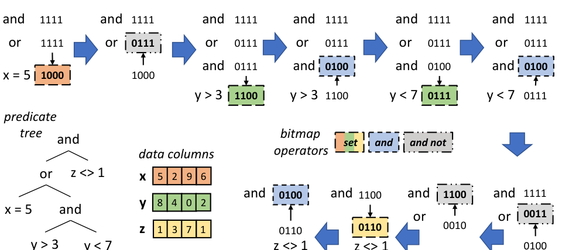
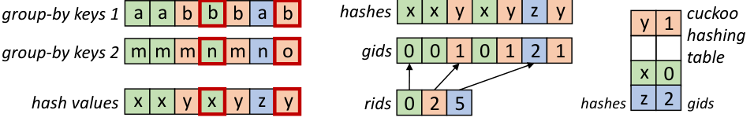
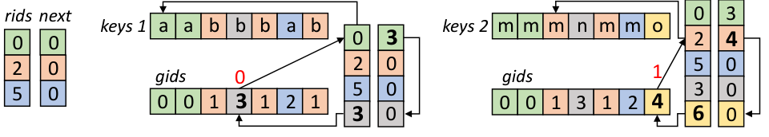
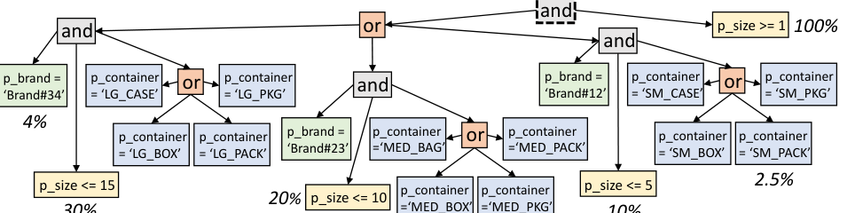
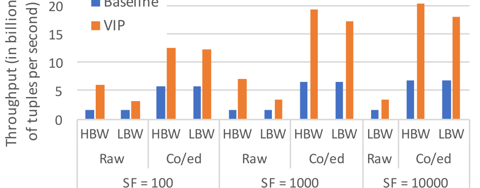
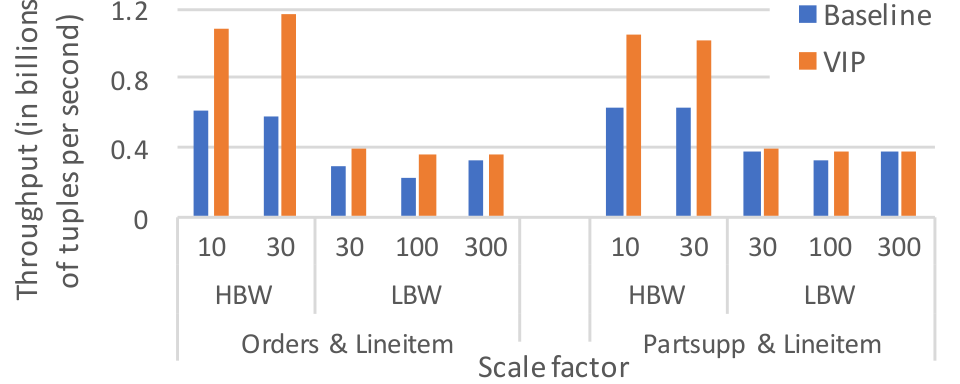
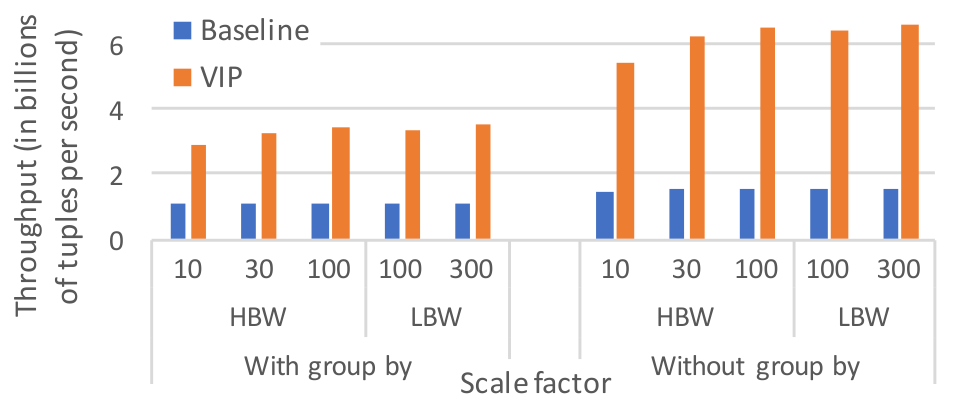

# Towards Practical Vectorized Analytical Query Engines（中文译文）

## 译者说明

本文依据同目录的 `source.pdf` 翻译。章节、图表、公式、算法、代码与参考文献按原文结构保留。

## 作者

Orestis Polychroniou、Kenneth A. Ross

## 摘要

查询执行引擎正在适应底层硬件以最大化性能。主流 CPU 正在出现更宽的 SIMD 寄存器和更复杂的 SIMD 指令集；新的处理器设计，例如依赖 SIMD 数据并行性的众核平台，也通过在单芯片上放入更多小核心来提升吞吐。在数据库文献中，用 SIMD 优化带有 key-rid 对的独立算子很常见；然而，最先进的查询引擎依赖紧密耦合算子的编译，在这种设计下，手工优化的独立算子不再实际。

本文提出 VIP，一个从预编译、列式、数据并行子算子自底向上构建的分析型查询引擎，并且完全用 SIMD 实现。在基于 TPC-H 的评测中，VIP 超过了针对查询手工优化的标量代码。

## 1. 引言

硬件感知的数据库设计与实现一直是研究热点，因为现代硬件演进对查询执行有深刻影响。数据库系统已经分化出面向事务、分析、科学计算等不同负载的设计。随着存储和执行目标变窄，系统也围绕新的硬件动态重新设计。

在分析型数据库中，列式存储已经成为标准选择，因为查询通常访问大量元组中的少数列，而事务负载更常更新少量元组。分析型查询引擎本身则仍存在多种设计取舍：列式执行还是行式执行，解释还是按查询编译，缓存感知执行还是算子流水线。

高效的内存内执行需要低解释成本、优化的内存访问和高 CPU 效率。低解释成本通常与高指令级并行相关，可以通过一次处理整列、每次迭代处理一批元组，或者在运行时编译查询专用代码实现。内存访问可通过算子流水线减少物化，或通过分区减少缓存/TLB 未命中。数据并行则通过 SIMD 向量化实现。线性访问算子，如扫描和压缩，天然适合数据并行；针对单个数据库算子的临时 SIMD 优化也已有大量研究。

本文介绍 VIP：一个从预编译数据并行子算子自底向上构建的分析型查询执行引擎。VIP 完全用 SIMD 实现，是第一个把高级 SIMD 向量化技术用于现实查询的查询引擎设计。它支持每个算子中的多列和多数据类型、扫描和连接中的复杂谓词组合，以及带表达式的多个聚合。

VIP 的算子调用预编译子算子。每个子算子一次处理一个列、一个元组块，数据几乎一直停留在 SIMD 寄存器中。查询代码生成和编译是当前查询引擎的主流设计，也被现代商业分析型数据库采用。我们的评测使用源自 TPC-H 的查询，显示 VIP 超过了模仿最新代码生成引擎的查询专用手工标量代码，并且 VIP 没有运行时按查询编译开销。

## 2. 相关工作

块式执行（block-at-a-time）和查询专用代码生成/编译是分析型查询引擎的主流设计。二者都能消除解释开销；后者还通过融合流水线算子减少中间结果物化，但需要承担运行时编译成本。块式执行可以用预取缓解缓存未命中。若执行已经受内存带宽限制，基础 SIMD 向量化收益也会下降。

SIMD 向量化通常用于孤立数据库算子，输入形式多为 key-rid 对。已有大量 join、sort、scan、compression 实现。线性访问算子容易向量化；非线性访问算子，例如哈希表和分区，需要更高级的 SIMD 技术。商业系统没有广泛采用完全向量化实现，主要困难在于同时有效支持多列、多数据类型和复杂谓词。

Voodoo 等向量代数尝试为 SIMD CPU 和 SIMT GPU 提供原则化抽象，但非线性算子仍常退化为围绕 SIMD primitive 的简单循环。简单地使用 SIMD load/gather 或依赖编译器自动向量化，只能得到有限收益，无法达到 VIP 这种系统化设计的复杂度和性能。

## 3. 设计与实现

VIP 使用列式执行，但不会一次处理整列。相反，它一次处理下一个元组块中的一个列，让中间结果留在缓存中，从而摊销解释成本。它不是在元组块上使用 Volcano 模型，而是扩展 column-at-a-time 模型。实验中，我们由于平台 NUMA 影响使用静态工作分配；VIP 也可扩展为动态分配。

VIP 的算子由列式、数据并行子算子自底向上构成，并完全用 SIMD 实现。执行查询时，每个算子调用预编译子算子；每个子算子在一个元组块上一次处理一个列。块大小被选择为既能摊销解释成本，又让工作集留在 CPU 私有高速缓存中。子算子在一个特定数据类型的列上执行基本操作，因此可以做极端手工优化。

一个复合键哈希连接可以说明子算子如何跨列工作。为了计算复合键哈希，VIP 先根据第一列的数据类型调用哈希子算子，并把哈希值留在缓存中；然后对第二列调用哈希子算子并更新哈希值。如果块足够小，哈希数组会保持在缓存里。原文给出了对 32 位整数列执行 FNV 哈希的 AVX-512 子算子。每个数据类型都需要对应实现，例如 `hash_T(T* data, uint32_t* hash, size_t tuples)`。

**代码清单：32 位整数列的 FNV 哈希子算子 `hash_int32`。**

```cpp
void hash_int32(int32_t* data, uint32_t* hash, size_t tuples) {
  const __m512i m_255 = _mm512_set1_epi32(255);  // mask to isolate lower byte
  const __m512i m_fnv = _mm512_set1_epi32(16777619);  // FNV prime constant
  for (size_t i = 0; i != tuples; i += 16) {  // 16 SIMD lanes
    __m512i h = _mm512_load_epi32(&hash[i]);  // load hash values from cache
    __m512i d = _mm512_load_epi32(&data[i]);  // load data values from column
    for (size_t j = 0; j != 4; ++j) {  // FNV hash processes 1 byte at a time
      h = _mm512_ternarylogic_epi32(h, d, m_255, 120);  // xor byte with hash
      h = _mm512_mullo_epi32(h, m_fnv);  // multiply hash with the FNV prime
      d = _mm512_srli_epi32(d, 8); }  // shift right to process the next byte
    _mm512_store_epi32(&hash[i], h); }  // store back the updated hash values
  [...] }  // process the last (up to 15) values using scalar code
```

### 3.1 选择扫描

```math
throughput \propto W / cycles
```



现代分析型数据库在选择上更偏向线性扫描而非索引。代码生成引擎也倾向于对扫描和解压使用预编译 SIMD 代码。在原始 column-at-a-time 模型中，每个谓词产生一个 rid 列表，合取和析取通过 rid 列表的交或并计算。VIP 使用 bitmap 保存谓词之间的中间结果，类似商业系统做法。

在线性扫描中，性能由访问的缓存行数量决定。SIMD 可以非常高效地在 W 个连续值上处理谓词，因此 VIP 以 W 个元组为单位求值或跳过。原文给出 32 位整数比较谓词的子算子：输入 bitmap 表示哪些元组仍需判断，输出 bitmap 表示求值结果。复杂谓词表达式表示为树，VIP 在同一个元组块上遍历该树，一次处理一个谓词。

**代码清单：32 位整数列比较谓词子算子 `select_int32`。**

```cpp
void select_int32(const int32_t* data, size_t tuples,  // the input column
    const uint16_t* bitmap_in,  // bitmap denoting the yet undetermined tuples
    uint16_t* bitmap_out,  // bitmap denoting a superset of qualifying tuples
    int32_t constant, int op) {  // the comparison constant and the operator
  const __m512i m_con = _mm512_set1_epi32(constant);  // mask
  switch (op) {  // separate code per comparison operator
  case '>':  // code for the ">" operator (can be split as separate function)
    for (i = 0; i != tuples; i += 256) {  // scan over data column and bitmap
      __m256i bit = _mm256_load_si256(bitmap_in);  // load 256 bitmap bits
      if (!_mm256_testz_si256(b, b)) {  // skip 256 tuples if all bits are 0
        __m512i bit_E = _mm512_cvtepu16_epi32(bit);
        // find groups of 16 tuples (out of 256 tuples) that are not all 0
        uint64_t m = _mm512_test_epi32_mask(bit_E, bit_E);
        do {  // evaluate groups of 16 tuples at a time that are not all 0
          size_t j = _tzcnt_u64(m);  // load 16 values from the 32-bit column
          __m512i key = _mm512_load_epi32(&data[j << 4]));
          // evaluate the selective predicate (in this example greater than)
          bitmap_out[j] = _mm512_cmpgt_epi32_mask(key, m_con);
        } while (m = _blsr_u64(m)); }  // process the next 16 tuples
      bitmap_in += 16, bitmap_out += 16, data += 256; }
    break; [...] }}  // other comparison operators, e.g., "=", "<", etc.
```

原文可见片段没有声明 `i`，并写成 `_mm256_testz_si256(b, b)`，而前一行变量名是 `bit`；`_mm512_load_epi32(&data[j << 4]))` 还多出一个右括号。以上均按原文保留。

对复杂谓词而言，最简单做法是对所有列、所有谓词全部求值，再合并 bitmap。但在某些情况下，短路谓词可以快几个数量级。因此 VIP 用前面谓词的输出跳过后续谓词的求值，同时也跳过列加载。在合取节点中，输入 bitmap 表示已经满足所有前序兄弟谓词的元组；其他元组可以跳过。在析取节点中，输入 bitmap 表示此前所有谓词都失败的元组。

扫描输出是排序的 rid 数组，可用于访问列值。若采用 late materialization，系统只追加 rid。物化策略属于查询优化问题，取决于选择率、基数、列数量、数据类型以及内存带宽等硬件因素。VIP 的设计与具体物化策略正交，可以支持多种策略。

### 3.2 压缩

现代分析型数据库会直接在压缩列上求值选择谓词。字典编码为每列维护排序后的不同值字典，并用字典索引替换列值；若有 `n` 个不同值，每个索引需要 `ceil(log n)` 位。VIP 使用 horizontal bit packing 存储索引。在这种方案下仍可短路，但由于压缩布局的错位，不一定总能跳过完整缓存行。

原文展示了一个子算子：它解包字典索引的位，并在不解引用字典的情况下直接求值谓词。对每 16 个 32 位索引，只需少量 SIMD 指令和预计算 permutation mask 即可完成解包。谓词在 SIMD 寄存器中直接求值。

**代码清单：压缩 32 位整数列的谓词子算子 `select_int32_compressed`。**

```cpp
void select_int32_compressed(const void* data_in, [...] size_t dict_bits) {
  [...]  // showing only the innermost loop for the ">" predicate on 16 tuples
  size_t j = _tzcnt_u64(m);  // compute the offset of 16 tuples out of 256
  __m512i x = _mm512_loadu_si512(data + dict_bits * 2 * j);  // load compressed
  // isolate the lower and upper 32-bit word per compressed index
  __m512i x1 = _mm512_permutevar_epi32(m_per_1, x);
  __m512i x2 = _mm512_permutevar_epi32(m_per_2, x);
  x1 = _mm512_srlv_epi32(x1, m_srl);  // align the lower 32-bit word
  x2 = _mm512_sllv_epi32(x2, m_sll);  // align the upper 32-bit word
  // merge the aligned lower and upper 32-bit word, and clear high-order bits
  x = _mm512_ternarylogic_epi32(x1, x2, m_max, 168);
  bitmap_out[j] = _mm512_cmpgt_epi32_mask(x, m_con); [...] }  // the predicate
```

原文形参名为 `data_in`，可见函数体却使用未在片段中声明的 `data`；其余依赖量可能位于开头的 `[...]` 中，以上按原文保留。

对包含大量不同值的列，解引用大型字典可能和一次哈希连接一样昂贵。因此，压缩应在不需要慢速解压时使用。使用同一字典压缩的属性可以在不解压的情况下连接。另一方面，对聚合函数中使用的唯一数值列进行压缩，会增加解压开销。

### 3.3 哈希连接

哈希连接常被作为独立算子用 key-rid 对优化。虽然这种设置下可以达到很好性能，但结果可能误导，因为它忽略 late materialization 成本。如果连接涉及复合键，或连接键不一定是 32 位整数，许多独立算子优化也不再适用。VIP 因此把哈希连接分解为多个子算子：按列计算哈希，构建哈希表，探测哈希表，再根据 rid 验证实际键列。

构建哈希表时，VIP 使用连接键列的哈希值，桶位置由哈希值掩码得到，不重新哈希。哈希表桶保存 `hash` 和 `rid`。构建子算子每轮最多处理 16 个哈希值，使用 SIMD lane 装载新值、计算桶位置、gather 现有桶、检查空桶、检测 lane 冲突，再把 key-rid 对 scatter 到表中。

**代码清单：用连接键哈希值构建哈希表的 `build_hashes` 子算子。**

```cpp
typedef struct { uint32_t hash; int32_t rid; } join_bucket_t;
void build_hashes(const uint32_t* hashes, size_t tuples,  // the hash values
    join_bucket_t* hash_table, size_t buckets) {  // the hash table
  const __m512i m_inc = _mm512_set_epi32(15,14,[...],0); [...]  // constants
  // scalar and SIMD registers holding the overall state of the function
  __m512i key, rid, loc; size_t i = 0, j = 16; __mmask16 k = 0xFFFF;
  while (i + j <= tuples) {  // process (up to) 16 hash values per iteration
    // replace finished SIMD lanes with new hash values from the input column
    key = _mm512_mask_expandloadu_epi32(key, k, &hashes[i]);
    __m512i inc = _mm512_add_epi32(m_inc, _mm512_set1_epi32(i)); i += j;
    rid = _mm512_mask_expand_epi32(rid, k, inc);  // generate inner rids
    loc = [...];  // compute the bucket location and gather hash table rids
    __m512i rid_H = _mm512_i32gather_epi32(loc, &hash_table[0].rid, 8);
    k = _mm512_cmplt_epi32_mask(rid_H, m_0);  // find empty hash table buckets
    __m512i con = _mm512_conflict_epi32(loc);  // detect conflicting lanes
    k = _mm512_mask_testn_epi32_mask(k, con, con);
    j = _mm_popcnt_u64(k);  // count lanes that can be reused
    // pack 32-bit keys and rids to 64-bit pairs and scatter to hash table
    __m512i buc_L = _mm512_permutex2var_epi32(key, m_pak_1, rid);
    __m512i buc_H = _mm512_permutex2var_epi32(key, m_pak_2, rid);
    _mm512_mask_i32loscatter_epi64(hash_table, k, loc, buc_L, 8);
    loc = _mm512_alignr_epi32(loc, loc, 8);
    _mm512_mask_i32loscatter_epi64(hash_table, k >> 8, loc, buc_H, 8); }
  [...] }  // build the last (15 or less) hash values using scalar code
```

探测时，VIP 也每轮处理多个哈希值，使用 SIMD lane 重用机制处理未完成探测。它不能在一般连接中使用不允许重复键的 cuckoo hashing，因为即使外键连接中内侧键唯一，不同内侧键仍可能映射到相同哈希值。某些情形可通过选择合适哈希函数保证无冲突，例如总输入宽度不超过 3 字节时 32 位 FNV 哈希不会冲突。

**代码清单：探测哈希表的 `probe_hashes` 子算子。**

```cpp
size_t probe_hashes(const uint32_t* hashes, size_t tuples,  // the hash values
    const join_bucket_t* hash_table, size_t buckets,  // the hash table
    int32_t* inner_rids, int32_t* outer_rids) {  // inner and outer side rids
  [...] while (i + j <= tuples) {  // process (up to) 16 tuples per iteration
    // load new keys (hash values) from input while also reusing SIMD lanes
    key = _mm512_mask_expandloadu_epi32(key, k, &hashes[i]);
    __m512i inc = _mm512_add_epi32(m_inc, _mm512_set1_epi32(i)); i += j;
    rid = _mm512_mask_expand_epi32(rid, k, inc);  // generate outer rids
    loc = [...];  // gather hash table buckets of packed key-rid pairs
    __m512i buc_L = _mm512_i32logather_epi64(loc, hash_table, 8);
    loc = _mm512_alignr_epi32(loc, loc, 8);
    __m512i buc_H = _mm512_i32logather_epi64(loc, hash_table, 8);
    // unpack key-rid pairs to keys and (implicitly generated) rids
    __m512i key_H = _mm512_permutex2var_epi32(buc_L, m_unp_1, buc_H);
    __m512i rid_H = _mm512_permutex2var_epi32(buc_L, m_unp_2, buc_H);
    k = _mm512_cmpeq_epi32_mask(key, key_H);  // compare the keys
    _mm512_mask_compressstoreu_epi32(&outer_rids[o], k, rid);
    _mm512_mask_compressstoreu_epi32(&inner_rids[o], k, rid_H);
    o += _mm_popcnt_u64(k);  // append inner & outer rids
    k = _mm512_cmplt_epi32_mask(rid_H, m_0);  // detect empty bucket lanes
    j = _mm_popcnt_u64(k); }  // count empty bucket lanes to be replaced
  [...]  // process the last (15 or less) tuples using scalar code
  return o; }  // return the total number of matching tuples
```

对于复合键和哈希冲突，VIP 需要重新求值连接谓词，包括等值条件。也就是说，哈希值用于快速定位候选，rid 用于回到列值验证。

### 3.4 分区

许多主存连接和聚合算法依赖分区以获得缓存局部性。VIP 支持 radix、hash 和 range 等分区函数，并用 SIMD 实现 histogram 生成和数据重排。分区可让后续哈希表、gid 映射和部分聚合留在缓存中，从而减少随机访问成本。

为连续存储分区输出，VIP 先计算 histogram：从 key 列加载并哈希下一块元组，把哈希转换为 partition id，再递增计数器。为了避免 SIMD scatter 冲突，histogram 按 $W$ 个 SIMD lane 复制 $W$ 份。

**代码清单：更新分区 histogram 的 `histogram` 子算子。**

```cpp
void histogram(const uint32_t* hashes, int32_t* histogram_x16,
    uint8_t* pids, int bit_lo, int bit_hi) {  // bit range
  const __m512i m_1 = _mm512_set1_epi32(1); [...]
  for (size_t i = 0; i != tuples; i += 16) {  // 16 SIMD lanes
    __m512i p = _mm512_load_epi32(&hashes[i]);  // load hash values
    p = _mm512_srl_epi32(p, m_srl);  // get partition id from hash value
    p = _mm512_sll_epi32(p, m_sll);
    _mm_stream_si128(&pids[i], _mm512_cvtepi32_epi8(p));
    __m512i o = _mm512_add_epi32(p, m_rep);  // get offsets
    __m512i c = _mm512_i32gather_epi32(off, histogram_x16, 4);
    c = _mm512_add_epi32(c, m_1);  // increment the histogram counters
    _mm512_i32scatter_epi32(histogram_x16, o, c, 4); } [...] }
```

原文可见函数形参没有 `tuples`，函数体却使用它；gather 使用 `off`，而相邻可见变量是 `o`。以上按原文保留。

为了预计算分区输出边界，系统先跨线程计算 histogram 的 prefix sum，再用下面的子算子计算每个元组的输出偏移并把它留在缓存中。后续逐列 shuffle payload 时可复用这些偏移，避免重复计算。

**代码清单：计算每个元组输出偏移的 `shuffle_core` 子算子。**

```cpp
void shuffle_core(const uint8_t* pids, size_t tuples,  // partition ids
    int32_t* partition_offset,  // the latest the output offset per partition
    int8_t* conflict_offset,  // compute the serialization offset per tuple
    int32_t* output_offset) { [...]  // compute the output offset per tuple
  for (size_t i = 0; i != tuples; i += 16) {  // 16 SIMD lanes
    // load partition ids and gather the output offset per partition
    __m512i p = _mm512_cvtepu8_epi32(_mm_load_si128(&pids[i]));
    __m512i o = _mm512_i32gather_epi32(p, partition_offset, 4);
    __m512i s = [...];  // serialize conflicts (9 instructions)
    _mm_store_si128(&conflict_offset[i],_mm512_cvtepi32_epi8(s));
    o = _mm512_add_epi32(o, s);  // update and store the offsets per tuple
    _mm512_store_epi32(&output_offset[i], off);  // output offset per tuple
    o = _mm512_add_epi32(o, m_1);  // update the per-partition output offsets
    _mm512_i32scatter_epi32(partition_offset, p, o, 4); } [...] }
```

原文在 store 行使用 `off`，而相邻可见向量变量是 `o`；以上按原文保留。

除了输出偏移，VIP 还保存用于串行化 scatter 冲突的偏移。若 SIMD lane $i$ 和 $j$ 指向同一分区，$i$ 的偏移为 $o$，$j$ 的偏移则通过加 1 变为 $o+1$。系统用 conflict-detection SIMD 指令生成 lane 间冲突 bitmap，再逐 lane 统计置位数。

计算偏移后，VIP 对下一块元组一次 shuffle 一个列。直接 scatter 到输出会造成过多 cache conflict，因此先写入 cache-resident buffer；某个分区的 buffer 填满后，再用 non-temporal store 批量 flush。每个分区的 buffer 为两条 cache line：下半区填满后写出，并把上半区移到下半区。下面是 32 位整数列的实现。

**代码清单：32 位整数列的 `shuffle_int32` 子算子。**

```cpp
void shuffle_int32(const uint8_t* pids, size_t tuples,
    const int8_t* conflict_offsets, const int32_t* output_offsets,
    const int32_t* in, int32_t* buf, int32_t* out) { [...]
  for (size_t i = 0; i != tuples; i += 16) {  // 16 SIMD lanes
    __m512i o = _mm512_load_epi32(&output_offsets[i]);
    __m512i s = _mm512_cvtepu8_epi32(_mm_load_si128(&conflict_offsets[i]));
    o = _mm512_sub_epi32(o, s);  // remove serialization offset
    o = _mm512_and_epi32(o, m_15);  // determine buffer slot
    o = _mm512_add_epi32(o, s);  // add serialization offset
    __mmask16 k = _mm512_cmpeq_epi32_mask(o, m_15);  // partitions to flush
    __m512i p = _mm512_cvtepu8_epi32(_mm_load_si128(&pids[i]));
    o = _mm512_or_epi32(o, _mm512_slli_epi32(p, 5));  // offset in buffers
    __m512i v = _mm512_stream_load_si512(&in[i]);  // load data from column
    _mm512_i32scatter_epi32(buf, o, v, 4);  // store column data to buffers
    if (_mm512_kortestz(k, k)) continue;  // skip if no buffers are full
    uint64_t m = k;  // bitmask of lanes with full buffers to be flushed
    do {  // flush one full buffer at a time to memory using streaming stores
      size_t j = i + _tzcnt_u64(m);  // tuple location in input column
      size_t o = output_offsets[j];  // tuple location in partitioned output
      int32_t* b = &buf[pids[j] << 5];  // pick buffer to flush
      __m512i x1 = _mm512_load_si512(b);  // load buffer data
      __m512i x2 = _mm512_load_si512(b + 16);
      _mm512_stream_si512(&out[o - 15], x1);  // flush lower half of buffer
      _mm512_store_si512(b, x2);  // overwrite lower half with upper half
    } while (m = _blsr_u64(m)); }  // get next set bit of mask
  [...] }  // process the last (up to 15) tuples in scalar code
```

### 3.5 分组聚合

VIP 的 group-by aggregation 先估算 group 数，可选地分区输入以实现 cache-conscious execution，再为每个元组确定 group id（gid）、计算中间表达式，最后用 gid 更新部分聚合。对 group-by 列，VIP 逐列计算 hash，并用 cuckoo table 中的 `(hash, gid)` 对把 hash 映射到 gid；若没有匹配，就创建 group、分配下一个隐式 gid，并保存当前元组的 rid。



下面的子算子使用 group-by 列的 hash 生成 gid。为降低代码复杂度，原文省略了向表中插入新 group 的部分。由于 cuckoo hash table 的插入本身可能失败，也可能低估 group 数，系统设置阈值；达到阈值后会扩容并从头重建 hash table。

**代码清单：把 group-by hash 映射为 gid 的 `hashes_to_gids` 子算子。**

```cpp
typedef struct { uint32_t hash; int32_t gid; } aggr_bucket_t;
size_t hashes_to_gids(const uint32_t* hashes, int32_t* gids, size_t tuples,
    size_t groups, int32_t* rids, aggr_bucket_t* hash_table, int log_buckets) {
  const __m512i m_inc = _mm512_set_epi32(15,[...],1,0); [...]  // constants
  __m512i key, gid, loc; __mmask16 k = 0xFFFF;  // initially use all lanes
  size_t i = 0, j = 16, g = 0, k = [...];  // hash table rebuild threshold
  while ((i = i + j) <= tuples) {  // 16 SIMD lanes
    if (--k == 0) { [...] }  // resize and rebuild the entire hash table
    key = _mm512_mask_loadu_epi32(key, k, &hashes[i - 16]);  // load hashes
    // compare the hash values across all lanes using conflict detection
    __m512i con = _mm512_conflict_epi32(key);
    __mmask16 k1 = _mm512_testn_epi32_mask(con, con);
    __m512i loc_1 = [...], loc_2 = [...];  // compute hash bucket locations
    // use alternative hash function for displaced tuples as per cuckoo hashing
    loc = _mm512_ternarylogic_epi32(loc, loc_1, loc_2, 150);
    loc = _mm512_mask_mov_epi32(loc, k1, loc_1);  // 1st hash bucket location
    // gather 16 hash buckets for lanes with unique hash
    __m512i buc_L, buc_H;  // load buckets from hash table
    buc_L = _mm512_mask_i32gather_epi64(buc_L, k3, hash_table, loc_1, 8);
    loc_1 = _mm512_alignr_epi32(loc_1, loc_1, 8);
    buc_H = _mm512_mask_i32gather_epi64(buc_H, k3 >> 8, hash_table, loc_1, 8);
    [...]  // unpack buckets to hashes (key_H) and gids (gid_H)
    // determine the lanes that need to gather the 2nd cuckoo hash bucket
    k2 = _mm512_mask_cmpge_epi32_mask(k1, gid_H, m_0);
    k2 = _mm512_mask_cmpneq_epi32_mask(k2, key, key_H);
    k2 = _mm512_kand(k2, k);  // 2nd hash bucket location
    loc = _mm512_mask_mov_epi32(loc, k2, loc_2);
    buc_L = _mm512_mask_i32logather_epi64(buc_L, k3, loc, hash_table, 8);
    loc = _mm512_alignr_epi32(loc, loc, 8);
    buc_H = _mm512_mask_i32logather_epi64(buc_H, k3 >> 8, loc, hash_table, 8);
    [...]  // re-unpack to hashes (key_H) and gids (gid_H)
    // find the leftmost lane with the same hash value in the SIMD register
    con = _mm512_and_epi32(con, _mm512_sub_epi32(m_0, con));
    con = _mm512_sub_epi32(m_31, _mm512_lzcnt_epi32(con));
    con = _mm512_mask_blend_epi32(k2, con, m_inc);
    // determine lanes with hashes that need to be scattered to the hash table
    k3 = _mm512_cmpge_epi32_mask(gid_H, m_0)
    k = _mm512_mask_cmpneq_epi32_mask(k3, key, key_H);
    k = _mm512_kor(_mm512_kand(k, k2), _mm512_kandn(k3, k2));
    if (!_mm512_kortestz(k, k)) {  // check if there are no new groups
      // copy gid from lestmost lane with same hash and store gids in order
      _mm512_storeu_epi32(&gids[i - 16], _mm512_permutevar_epi32(con, gid_H));
      j = 16, k = _mm512_kxnor(k, k);  // reuse all lanes
    } else { [...] }}  // create new gids, append rids, and update hash table
  [...] return g; }  // process the last tuples and return the number of groups
```

原文可见片段在同一作用域先声明 `__mmask16 k`，随后又声明 `size_t ... k = [...]`；`k3 = _mm512_cmpge_epi32_mask(...)` 行没有分号，注释还写成 `lestmost`。`loc`、`k2`、`k3`、`key_H` 和 `gid_H` 等依赖可能位于 `[...]` 中，以上均按原文保留。

与 join 不同，这里显式使用 cuckoo hashing，以输入顺序探测 hash 并映射到 gid。唯一 hash 到 gid 的映射仍可能因 hash collision 而错误。因此系统用每组第一个元组的 rid 回查 group-by 列；若当前值不匹配，就沿着相同 hash 下不同 group 的 gid-rid 链表继续比较，找到匹配便改写当前 gid，否则追加新的 gid-rid 对。



VIP 使用类型专用子算子解决 group-by 列的 hash collision：顺序加载 group-by 列和 gid，用 gid gather 每组第一个元组的 rid，再用 rid gather 定义该组的列值；不匹配时分支到标量代码创建新 group。

处理聚合函数时，gid 直接作为映射索引。多列函数以 block-at-a-time 方式计算；例如 `sum(x*y)` 先为下一块元组计算 `x*y`，保存中间结果，再更新部分和。为了避免冲突，commutative aggregate 的数组像分区 histogram 一样复制。下面的子算子计算整数列的 `min()`；若只有一个 group 或没有 group-by，则直接在寄存器中更新聚合值。

**代码清单：更新复制的部分最小值的 `update_min_int32` 子算子。**

```cpp
void update_min_int32(const int32_t* data, const int32_t* gids,
    size_t tuples, float* min_x16, size_t groups) {
  const __m512i m_inc = _mm512_set_epi32(15,14,[...],1,0);
  for (size_t i = 0; i != tuples; i += 16) {  // 16 SIMD lanes
    __m512i val = _mm512_load_si512(&data[i]);  // load data from column
    __m512i gid = _mm512_loadu_si512(&gids[i]);  // load gids from cache
    // compute the offset of (replicated) partial aggregates from the gid
    __m512i loc = _mm512_or_epi32(_mm512_slli_epi32(gid, 4), m_inc);
    __m512i min = _mm512_i32gather_epi32(loc, min_x16, 4);  // load the min
    __mmask16 k = _mm512_cmplt_epi32_mask(val, min);  // store back if smaller
    _mm512_mask_i32scatter_epi32(min_x16, k, loc, val, 4); }}
```

原文把 `min_x16` 声明为 `float*`，却用 `epi32` gather/scatter 作为 32 位整数聚合值；`groups` 在可见片段中也未使用。以上按原文保留。

如果输入已分区，每个线程处理不同分区，并在处理完该分区所有元组前把哈希表、每组 rid 和部分聚合保持在缓存中，然后本地合并。如果输入未分区，线程按块处理，并把部分聚合保持在缓存中；随后使用专用哈希表跨线程链接并合并部分聚合。

## 4. 实验评测

实验平台是 Intel Xeon Phi 7210 Knights Landing CPU。这是一代依赖高级 AVX-512 SIMD 指令提升每核心性能的众核 CPU，相比主流 CPU 可在芯片上放入更多较小核心。该 CPU 有 64 个 1.3 GHz 核心，4 路 SMT，16 GB 高带宽片上 MCDRAM，以及 192 GB DDR4 DRAM。我们使用 ICC 18 和 `-O3` 编译。

所有实验都把 VIP 与查询专用、手工优化的标量代码比较，后者模拟最新代码生成查询引擎。基线通过对一个元组一次流水线处理实现寄存器驻留执行，不包含函数调用。这个标量、寄存器驻留、row-at-a-time 模型与 VIP 的 SIMD、解释式、block-at-a-time 模型形成鲜明对比。实验忽略基线的编译时间，这有利于基线，因为 VIP 不在运行时编译代码。

### 4.1 TPC-H Q19 的复杂选择

```sql
WHERE (p_brand = ... AND p_container IN (...) AND l_quantity BETWEEN ...)
   OR (p_brand = ... AND p_container IN (...) AND l_quantity BETWEEN ...)
   OR (p_brand = ... AND p_container IN (...) AND l_quantity BETWEEN ...);
```





我们选择 TPC-H 中谓词组合最复杂的选择：Q19 中对 `part` 表的选择。表达式树按选择率排列，既不是 CNF 也不是 DNF。`p_brand` 和 `p_container` 是 `char(10)`，分别有 25 和 40 个不同值；`p_size` 是 32 位整数，有 50 个不同值。压缩后，这三列分别只需 5、6、5 位，每个元组 footprint 从 24 字节降到 2 字节。payload 列是 `p_partkey`，只为通过选择的 0.24% 元组访问。

随着规模因子变化，VIP 在压缩和未压缩数据上都超过基线，速度提升约 2.1 到 4.5 倍。复杂谓词数量突出显示了 VIP 设计的效率：它用缓存中的 bitmap 处理复杂表达式，而不依赖查询专用编译。由于 Q19 中多数谓词选择率较高，短路求值对性能非常关键。

### 4.2 TPC-H 核心表哈希连接



我们评测 TPC-H 核心表连接：

```sql
select l_partkey, l_suppkey, o_custkey
from lineitem, orders
where l_orderkey = o_orderkey;

select l_orderkey, l_partkey, l_suppkey
from lineitem, partsupp
where l_partkey = ps_partkey
  and l_suppkey = ps_suppkey;
```

基线使用查询专用哈希桶布局物化 payload，并在内侧键唯一时遇到第一个匹配就停止探测。VIP 支持分区，直到内侧表能放入缓存，并按元组块执行哈希连接以保持缓存驻留。在快速内存（HBW）上，VIP 对 `lineitem` 与 `orders` 的连接快 1.8 到 2 倍，对 `lineitem` 与 `partsupp` 的连接快 1.6 到 1.7 倍。复合键连接加速较小，因为 VIP 的设计会在用哈希值连接后，通过 rid 分别验证复合键的每个列。在慢速内存（LBW）上，两种方法接近：分区方法受多 pass 的内存带宽限制，基线则受缓存未命中限制。

### 4.3 TPC-H Q1 的分组聚合



对分组聚合，我们使用 TPC-H Q1。每列使用能容纳值域的最小数据类型。基线一次处理一个元组，并为每个线程更新私有哈希表。VIP 对下一个元组块一次计算一个表达式。与传统 column-at-a-time 执行不同，VIP 不把中间结果物化到缓存外。VIP 还能复用 Q1 聚合函数中的公共子表达式，例如：

```sql
sum(l_extendedprice * (1 - l_discount)),
sum(l_extendedprice * (1 - l_discount) * (1 + l_tax))
```

结果显示，无论内存类型如何，VIP 快 2.7 到 3.2 倍。估计 group 的过程在这里快一个数量级。我们还执行了去掉 group-by 子句的同一查询；此时两种方法都把部分聚合保存在寄存器中。VIP 仍快 3.6 到 4.3 倍。

## 5. 未来工作

本文评测使用的众核 CPU 依赖高级 SIMD 指令实现高性能。然而，众核 CPU 和协处理器不像主流 CPU 那样普及，也未必会作为独立平台长期商业化。我们计划在最新主流 CPU 上评测 VIP，因为这些 CPU 也支持 AVX-512，并进一步研究如何让 VIP 适配主流 CPU 的新硬件特性。

## 6. 结论

本文提出 VIP，一个从预编译数据并行子算子自底向上构建、并完全用 SIMD 实现的查询引擎。VIP 设计可适应现代硬件特性，例如利用众核 CPU 的高带宽片上内存来支持缓存感知执行。

与早期只关注单个数据库算子的部分 SIMD 实现不同，VIP 支持基础数据库算子的现实组合：选择、哈希连接、分组聚合；它可以处理任意数量列、多数据类型、压缩、复杂谓词和表达式。基于最新 AVX-512 SIMD 指令的众核 CPU 评测显示，VIP 超过了模拟最新代码生成查询引擎的查询专用手工优化代码，而且不需要运行时编译。总体而言，VIP 是朝着基于高级 SIMD 向量化、并充分利用现代 CPU 硬件特性的现实查询执行迈出的一步。


## 参考文献

- [1] D. Abadi, D. Myers, D. DeWitt, and S. Madden. Materialization strategies in a column-oriented DBMS. In ICDE, pages 466-475, 2007.
- [2] C. Balkesen, G. Alonso, J. Teubner, and M. T. Ozsu. Multicore, main-memory joins: Sort vs. hash revisited. PVLDB, 7(1):85-96, Sept. 2013.
- [3] C. Balkesen, J. Teubner, G. Alonso, and M. T. Ozsu. Main-memory hash joins on multi-core cpus: Tuning to the underlying hardware. In ICDE, pages 362-373, 2013.
- [4] S. Blanas, Y. Li, and J. Patel. Design and evaluation of main memory hash join algorithms for multi-core CPUs. In SIGMOD, pages 37-48, 2011.
- [5] P. A. Boncz, M. Zukowski, and N. Nes. MonetDB/X100: Hyper-pipelining query execution. In CIDR, 2005.
- [6] X. Cheng, B. He, X. Du, and C. T. Lau. A study of main-memory hash joins on many-core processor: A case with Intel Knights Landing architecture. In CIKM, pages 657-666, 2017.
- [7] J. Chhugani, A. D. Nguyen, V. W. Lee, W. Macy, M. Hagog, Y.-K. Chen, A. Baransi, S. Kumar, and P. Dubey. Efficient implementation of sorting on multi-core SIMD CPU architecture. In VLDB, pages 1313-1324, 2008.
- [8] A. Costea, A. Ionescu, B. Răducanu, M. Switakowski, C. Bârca, J. Sompolski, A. Luszczak, M. Szafrański, G. de Nijs, and P. Boncz. Vectorh: Taking SQL-on-Hadoop to the next level. In SIGMOD, pages 1105-1117, 2016.
- [9] B. Dageville, T. Cruanes, M. Zukowski, V. Antonov, A. Avanes, J. Bock, J. Claybaugh, D. Engovatov, M. Hentschel, J. Huang, A. W. Lee, A. Motivala, A. Q. Munir, S. Pelley, P. Povinec, G. Rahn, S. Triantafyllis, and P. Unterbrunner. The Snowflake elastic data warehouse. In SIGMOD, pages 215-226, 2016.
- [10] P. Flajolet and G. N. Martin. Probabilistic counting algorithms for data base applications. J. Comput. Syst. Sci., 31(2):182-209, Sept. 1985.
- [11] G. Fowler, L. C. Noll, K.-P. Vo, and D. Eastlake. The FNV non-cryptographic hash algorithm. Technical report, 2017. http://www.ietf.org/internet-drafts/draft-eastlake-fnv-13.txt.
- [12] G. Graefe. Volcano: An extensible and parallel query evaluation system. TKDE, 6(1):120-135, Feb. 1994.
- [13] A. Gupta, D. Agarwal, D. Tan, J. Kulesza, R. Pathak, S. Stefani, and V. Srinivasan. Amazon redshift and the case for simpler data warehouses. In SIGMOD, pages 1917-1923, 2015.
- [14] H. Inoue, T. Moriyama, H. Komatsu, and T. Nakatani. AA-sort: A new parallel sorting algorithm for multi-core SIMD processors. In PACT, pages 189-198, 2007.
- [15] H. Inoue, M. Ohara, and K. Taura. Faster set intersection with SIMD instructions by reducing branch mispredictions. PVLDB, 8(3):293-304, Nov. 2014.
- [16] H. Inoue and K. Taura. SIMDand cache-friendly algorithm for sorting an array of structures. PVLDB, 8(11):1274-1285, July 2015.
- [17] S. Jha, B. He, M. Lu, X. Cheng, and H. P. Huynh. Improving main memory hash joins on Intel Xeon Phi processors: An experimental approach. PVLDB, 8(6):642-653, Feb. 2015.
- [18] T. Kersten, V. Leis, A. Kemper, T. Neumann, A. Pavlo, and P. Boncz. Everything you always wanted to know about compiled and vectorized queries but were afraid to ask. PVLDB, 11(13):2209-2222, Sept. 2018.
- [19] C. Kim, T. Kaldewey, V. W. Lee, E. Sedlar, A. D. Nguyen, N. Satish, J. Chhugani, A. Di Blas, and P. Dubey. Sort vs. hash revisited: fast join implementation on modern multi-core CPUs. PVLDB, 2(2):1378-1389, Aug. 2009.
- [20] K. Krikellas, S. Viglas, and M. Cintra. Generating code for holistic query evaluation. In ICDE, pages 613-624, 2010.
- [21] H. Lang, A. Kipf, L. Passing, P. Boncz, T. Neumann, and A. Kemper. Make the most out of your simd investments: Counter control flow divergence in compiled query pipelines. In DaMoN, 2018.
- [22] H. Lang, T. Mühlbauer, F. Funke, P. A. Boncz, T. Neumann, and A. Kemper. Data blocks: Hybrid OLTP and OLAP on compressed storage using both vectorization and compilation. In SIGMOD, pages 311-326, 2016.
- [23] H. Lang, T. Neumann, A. Kemper, and P. Boncz. Performance-optimal filtering: Bloom overtakes cuckoo at high throughput. PVLDB, 12(5):502-515, Jan. 2019.
- [24] V. Leis, P. Boncz, A. Kemper, and T. Neumann. Morsel-driven parallelism: A NUMA-aware query evaluation framework for the many-core age. In SIGMOD, pages 743-754, 2014.
- [25] Y. Li and J. M. Patel. BitWeaving: Fast scans for main memory data processing. In SIGMOD, pages 289-300, 2013.
- [26] Y. Li and J. M. Patel. WideTable: An accelerator for analytical data processing. PVLDB, 7(10):907-918, June 2014.
- [27] S. Manegold, P. Boncz, and M. Kersten. Optimizing database architecture for the new bottleneck: memory access. J. VLDB, 9(3):231-246, 2000.
- [28] S. Manegold, P. Boncz, and M. Kersten. What happens during a join? dissecting CPU and memory optimization effects. In VLDB, pages 339-350, 2000.
- [29] S. Manegold, P. Boncz, and M. Kersten. Optimizing main-memory join on modern hardware. TKDE, 14(4):709-730, July 2002.
- [30] P. Menon, T. C. Mowry, and A. Pavlo. Relaxed operator fusion for in-memory databases: Making compilation, vectorization, and prefetching work together at last. PVLDB, 11(1):1-13, Sept. 2017.
- [31] T. Neumann. Efficiently compiling efficient query plans for modern hardware. PVLDB, 4(9):539-550, June 2011.
- [32] R. Pagh and F. F. Rodler. Cuckoo hashing. J. Algorithms, 51(2):122-144, May 2004.
- [33] H. Pirk, O. Moll, M. Zaharia, and S. Madden. Voodoo - a vector algebra for portable database performance on modern hardware. PVLDB, 9(14):1707-1718, Oct. 2016.
- [34] O. Polychroniou, A. Raghavan, and K. A. Ross. Rethinking SIMD vectorization for in-memory databases. In SIGMOD, pages 1493-1508, 2015.
- [35] O. Polychroniou and K. A. Ross. High throughput heavy hitter aggregation for modern simd processors. In DaMoN, 2013.
- [36] O. Polychroniou and K. A. Ross. A comprehensive study of main-memory partitioning and its application to large-scale comparisonand radix-sort. In SIGMOD, pages 755-766, 2014.
- [37] O. Polychroniou and K. A. Ross. Vectorized Bloom filters for advanced SIMD processors. In DaMoN, 2014.
- [38] O. Polychroniou and K. A. Ross. Efficient lightweight compression alongside fast scans. In DaMoN, 2015.
- [39] V. Raman, G. Attaluri, R. Barber, N. Chainani, D. Kalmuk, V. KulandaiSamy, J. Leenstra, S. Lightstone, S. Liu, G. M. Lohman, T. Malkemus, R. Mueller, I. Pandis, B. Schiefer, D. Sharpe, R. Sidle, A. Storm, and L. Zhang. DB2 with BLU acceleration: So much more than just a column store. PVLDB, 6(11):1080-1091, Aug. 2013.
- [40] K. A. Ross. Selection conditions in main memory. TODS, 29(1):132-161, Mar. 2004.
- [41] K. A. Ross. Efficient hash probes on modern processors. In ICDE, pages 1297-1301, 2007.
- [42] P. Roy, J. Teubner, and G. Alonso. Efficient frequent item counting in multi-core hardware. In KDD, pages 1451-1459, 2012.
- [43] N. Satish, C. Kim, J. Chhugani, A. D. Nguyen, V. W. Lee, D. Kim, and P. Dubey. Fast sort on CPUs and GPUs: a case for bandwidth oblivious SIMD sort. In SIGMOD, pages 351-362, 2010.
- [44] B. Schlegel, T. Karnagel, T. Kiefer, and W. Lehner. Scalable frequent itemset mining on many-core processors. In DaMoN, 2013.
- [45] S. Schuh, X. Chen, and J. Dittrich. An experimental comparison of thirteen relational equi-joins in main memory. In SIGMOD, pages 1961-1976, 2016.
- [46] E. Sitaridi, O. Polychroniou, and K. A. Ross. SIMD-accelerated regular expression matching. In DaMoN, 2016.
- [47] M. Stonebraker, D. J. Abadi, A. Batkin, X. Chen, M. Cherniack, M. Ferreira, E. Lau, A. Lin, S. Madden, E. O'Neil, P. O'Neil, A. Rasin, N. Tran, and S. Zdonik. C-store: a column-oriented DBMS. In VLDB, pages 553-564, 2005.
- [48] J. Wassenberg and P. Sanders. Engineering a multi core radix sort. In EuroPar, pages 160-169, 2011.
- [49] T. Willhalm, N. Popovici, Y. Boshmaf, H. Plattner, A. Zeier, and J. Schaffner. SIMD-scan: ultra fast in-memory table scan using on-chip vector processing units. PVLDB, 2(1):385-394, Aug. 2009.
- [50] J. Zhou and K. A. Ross. Implementing database operations using SIMD instructions. In SIGMOD, pages 145-156, 2002.
