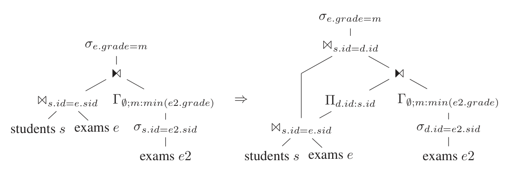
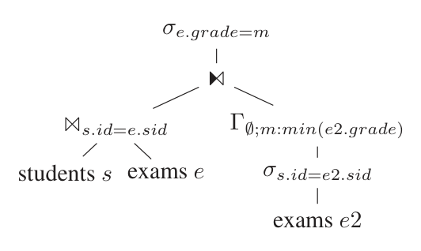
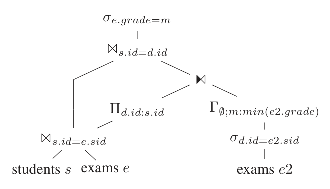
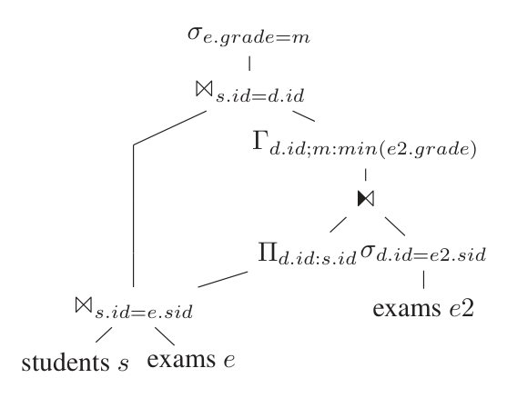
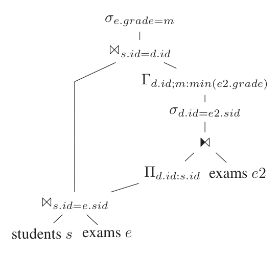
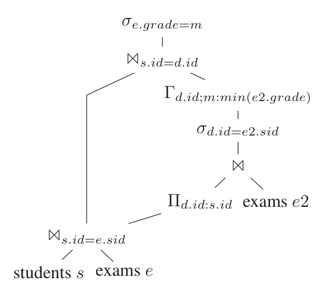
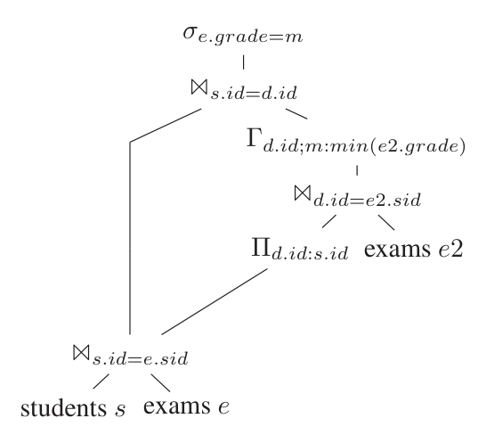
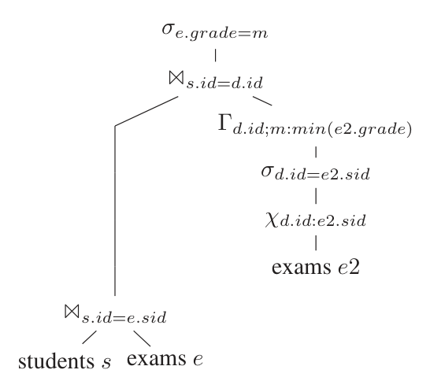
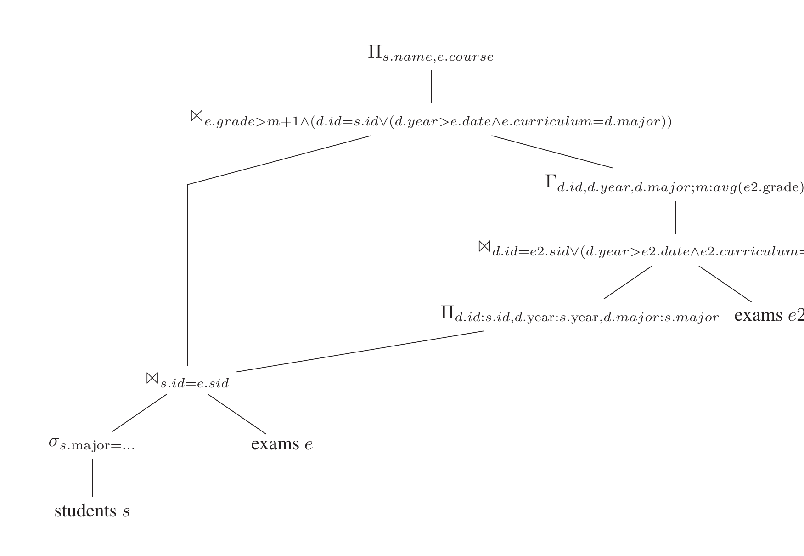

# Unnesting Arbitrary Queries（中文译文）

## 译者说明

本文依据同目录的 `source.pdf` 翻译。章节、图表、公式、算法、代码与参考文献按原文结构保留。

Thomas Neumann and Alfons Kemper  
Technische Universitat Munchen  
Munich, Germany  
neumann@in.tum.de, kemper@in.tum.de

## 摘要

SQL-99 允许在查询中的几乎所有位置出现嵌套子查询。从用户角度看，嵌套查询可以极大简化复杂查询的表达。然而，与外层查询相关的嵌套查询经常导致带嵌套循环求值的依赖连接，从而造成较差性能。

因此，现有系统使用若干启发式来去嵌套这些查询，也就是对它们去相关。这些去嵌套技术可以显著加速查询处理，但通常仅限于特定类别的查询。据我们所知，没有现有系统能在一般情形下对查询去相关。本文提出一种用于去嵌套任意查询的通用方法。结果是，去相关后的查询可以用更简单且更高效的方式求值。

## 1. 引言

SQL 查询中经常使用子查询来简化查询表达。作为贯穿全文的示例，考虑如下模式：

- `students: {[id, name, major, year, ...]}`
- `exams: {[sid, course, curriculum, date, ...]}`

下面是一个嵌套查询，用于为每个学生找出最好的考试成绩。这里按德国评分体系，分数越低越好：

```sql
-- Q1
select s.name, e.course
from students s, exams e
where s.id = e.sid
  and e.grade = (select min(e2.grade)
                 from exams e2
                 where s.id = e2.sid)
```

从概念上说，对于每个学生和考试对 `(s, e)`，该查询在子查询中判断这个特定考试 `e` 是否是该特定学生 `s` 的所有考试中成绩最好的考试。

从性能角度看，该查询并不理想，因为子查询必须为每个学生和考试对重新求值。从技术角度看，该查询包含一个依赖连接，即一种嵌套循环连接，其右侧求值依赖左侧当前值。这类连接非常低效，并导致至少二次方的执行时间。

因此，数据库管理系统（DBMS）会在内部重写查询以消除相关性。该重写的 SQL 表达形式如下：

```sql
-- Q1'
select s.name, e.course
from students s, exams e,
     (select e2.sid as id, min(e2.grade) as best
      from exams e2
      group by e2.sid) m
where s.id = e.sid
  and m.id = s.id
  and e.grade = m.best
```

这里，子查询的求值不再依赖 `s` 的值，因此可以使用常规连接。这种去嵌套对良好查询性能非常重要，但现有技术不能处理任意查询。例如，下面的 SQL 查询很难去相关。它用于找出 CS 或 Games Engineering 学生未来应重考的考试，因为其成绩相比自己参加过的考试平均成绩或高年级同专业同伴参加过的考试平均成绩差一档以上：

```sql
-- Q2
select s.name, e.course
from students s, exams e
where s.id = e.sid
  and (s.major = 'CS' or s.major = 'Games Eng')
  and e.grade >= (select avg(e2.grade) + 1 -- one grade worse
                  from exams e2            -- than the average grade
                  where s.id = e2.sid or   -- of exams taken by
                        (e2.curriculum = s.major and -- him/her or taken
                         s.year > e2.date))          -- by elder peers
```

据我们所知，没有现有系统能去嵌套这样的查询。事实上，去嵌套这个查询很难：标准去嵌套技术依赖这样一个事实，即查询中已有属性可用于替代由外层查询决定的自由变量。这里并非如此，例如 `s.year` 不能被替代。

显然，这类复杂相关查询会比简单子查询更昂贵。然而，如本文所示，即便这样的查询也确实可以去嵌套。我们必须额外推导 `s.year` 和 `s.major` 的值，但可以不使用依赖连接做到这一点。我们需要付出的额外代价受依赖连接代价约束。多数查询在去相关形式下会显著更高效；最坏情况下，我们会有相同的连接工作量。也就是说，我们的去嵌套方法绝不会比直接嵌套循环求值产生更高代价，并且在大多数情况下会显著提升性能，往往提升几个数量级。此外，即使最坏情况也很可能获益，因为消除依赖连接允许使用更高效的连接实现。

因此，我们的贡献可以看作是一种可普遍适用的技术，用于去嵌套任何类型的嵌套子查询；这不同于迄今为止发表和实现的特殊情形处理。该通用去嵌套技术已经完整实现在我们的主内存数据库系统 HyPer [KN11] 中，并可通过 `hyper-db.de` 的 Web 界面体验，该界面会可视化生成的查询计划。

查询去嵌套的典型性能收益非常巨大：根据查询不同，它可以把一个 `O(n^2)` 算法（嵌套循环连接）替换为一个 `O(n)` 算法（哈希连接，连接键）。此外，嵌套情形中依赖侧会为每个外层元组执行一次，而去嵌套情形中只执行一次。在大数据集上，去嵌套很容易带来 10 倍甚至 100 倍性能提升，这使它成为查询编译中的基础技术。少数情况下嵌套求值实际上有利，尤其是外层非常小且内层可用索引查找求值时，但这应由查询优化器有意识地决定，而不应由查询写法触发。默认情况下，查询应当被完全去嵌套。

本文余下结构如下：第 2 节定义本文使用的记法。第 3 节给出代数去嵌套变换。第 4 节讨论适用于特殊情形的进一步优化规则，例如可以推断函数依赖时的规则。第 5 节给出一个“粗略”的性能评估，将若干知名 DBMS 与包含本文去嵌套技术的 HyPer 系统进行分析对比。最后，我们综述相关工作并总结全文。

## 2. 预备知识

在讨论去嵌套技术之前，我们先简要回顾关系代数的一些定义，因为基础算子之外的记法并不标准化。

首先是常规内连接，它可简单定义为笛卡尔积后接选择：

```text
T1 B_p T2 := sigma_p(T1 A T2)
```

它计算 `T1` 和 `T2` 中所有匹配项的组合。大多数 SQL 查询都使用它，但在存在相关子查询时，这一定义并不足够。子查询必须为外层查询的每个元组求值，因此我们定义依赖连接为：

```text
T1 C_p T2 := { t1 o t2 | t1 in T1 and t2 in T2(t1) and p(t1 o t2) }
```

这里，右侧会为左侧的每个元组求值。我们用 `A(T)` 表示表达式 `T` 产生的属性，用 `F(T)` 表示表达式 `T` 中出现的自由变量。要对依赖连接求值，必须有 `F(T2) subseteq A(T1)`，即 `T2` 需要的属性必须由 `T1` 产生。

注意，本文有时会在连接谓词中显式提到自然连接，以简化记法。我们假设查询中出现的所有关系都有唯一属性名，即使它们引用同一个物理表，因此 `A B B == A A B`。不过，如果我们显式两次引用同一关系名，并要求自然连接，则同名属性列会被比较，重复列会被投影掉。例如：

```text
(A B C) B_{p and natural join C} (B B C)
```

这里，最上层连接既检查谓词 `p`，也比较来自两侧的 `C` 的列，并消除 `C` 的两份列副本中的一份。

对于半连接（`N`）、反连接（`T`）和外连接（`E`, `K`），我们相应地定义其依赖变体（`O`, `U`, `F`, `L`）；同样，右侧会为左侧的每个元组求值。

除连接算子外，另一个重要算子是 group by 算子：

```text
Gamma_{A; a:f}(e)
  := { x o (a : f(y)) |
       x in Pi_A(e) and
       y = { z | z in e and forall a in A : x.a = z.a } }
```

它按 `A` 对输入 `e`（即基表或由其他代数表达式计算出的关系）分组，并求值一个或多个以逗号分隔的聚合函数以计算聚合属性。如果 `A` 为空，则只产生一个聚合元组，这与 SQL 中缺失 `GROUP BY` 子句时相同。

我们可以通过 map 算子求值函数并构造新属性：

```text
chi_{a:f}(e) := { x o (a : f(x)) | x in e }
```

除此之外，还需要常规关系代数算子（`sigma`, `A`, `Pi`, `rho`, `union`, `intersection`, `minus`）。使用这些算子，可以把 SQL 查询翻译为关系代数。

下面我们经常需要比较属性集合。作为简写，定义属性比较算子 `=_A` 为：

```text
t1 =_A t2 := forall a in A : t1.a = t2.a
```

注意，除非另有说明，该算子具有 `is` 语义，即把 NULL 值比较为相等。

## 3. 去嵌套

带相关子查询的查询在代数表示中初始会产生依赖连接，即如下形式的表达式：

```text
T1 C_p T2
```

如前所述，从性能角度看，这些依赖连接非常不理想，我们希望消除它们。基本上，我们操纵代数表达式，直到右侧不再依赖左侧，从而把依赖连接转换为常规连接。我们用两种技术实现这一点。首先尝试简单去嵌套，它处理那些仅因语法原因产生依赖的情形。如果这不足以去嵌套查询，则使用可处理任意复杂查询的一般去嵌套框架。

### 3.1 简单去嵌套

有些查询包含相关子查询，只是因为在 SQL 中这样更容易表达。TPC-H Query 21 就是一个例子，其中包含类似如下片段：

```sql
select ...
from lineitem l1 ...
where exists (select *
              from lineitem l2
              where l2.l_orderkey = l1.l_orderkey)
...
```

它会被翻译为如下形式的代数表达式：

```text
l1 O (sigma_{l1.okey = l2.okey}(l2))
```

很容易看出，该片段可以通过把依赖谓词上移到树中来去嵌套，从而把依赖连接转换为常规连接：

```text
l1 N_{l1.okey = l2.okey} (l2)
```

一般而言，简单去嵌套阶段会把所有依赖谓词尽可能向代数树上方移动，可能越过连接、选择、group by 等，直到到达其所有属性都可从输入获得的位置。如果发生这种情况，就可以把依赖连接转换为常规连接，如上面的等价关系所示。注意，谓词上拉纯粹是出于去相关目的。后续优化步骤可能再次把谓词的部分内容下推，以便尽早过滤元组。

### 3.2 一般去嵌套

谓词移动非常容易实现，并且已经足以处理经常出现的简单嵌套查询。因此我们先尝试它，但一般情形需要更复杂的方法：第一，把依赖连接翻译为一个“更好”的依赖连接，即更容易操纵的依赖连接；第二，把新的依赖连接下推到查询中，直到可以把它转换为常规连接。

因此，第一步使用如下等价关系：

```text
T1 C_p T2
  ==
T1 B_{p and T1 =_{A(D)} D} (D C T2)

where D := Pi_{F(T2) intersect A(T1)}(T1)
```

乍看之下，该变换似乎没有太大改善查询计划，因为我们用一个常规连接和另一个依赖连接替换了一个依赖连接。然而再看就会发现，这个变换非常有用：原始表达式中，必须为 `T1` 的每个元组求值 `T2`，这可能达到数百万次。因此，在第二个表达式中，我们先计算所有变量绑定的域 `D`，只为每个不同变量绑定求值一次 `T2`，然后用常规连接把结果匹配回原始 `T1` 值。如果有大量重复，这已经能显著减少 `T2` 的调用次数。

这个收益可用第一个示例查询说明。该查询为每个学生确定最好考试。直接求值会为学生曾参加的每门考试计算该学生的最佳成绩：

```text
sigma_{e.grade = m}(
  (students s B_{s.id = e.sid} exams e)
  C
  (Gamma_{empty; m:min(e2.grade)}(sigma_{s.id = e2.sid} exams e2))
)
```

该等价规则允许把最佳成绩计算限制为每个学生一次，而不是为每个 `(student, exam)` 对冗余计算。因此，依赖连接只在学生 id 的投影上执行：

```text
... Pi_{d.id:s.id}(
      (students s B_{s.id = e.sid} exams e)
      C
      (Gamma_{empty; m:min(e2.grade)}(sigma_{d.id = e2.sid} exams e2))
    )
```

图 1 展示了对示例查询应用“下推”规则时的完整查询求值计划。从某种意义上说，这构成了从外层左侧连接参数到内层右侧参数的侧向信息传递，用于消除求值冗余。因此，投影必须按真正的、会消除重复的集合语义实现，而不能使用 SQL 的保留重复的多重集语义。

**图 1：依赖连接“下推”的示例应用。** 原始计划把 `students s B exams e` 与聚合子查询做依赖连接；转换后先投影得到无重复的 `d.id` 域，把该域传给聚合子查询，再通过常规连接把结果接回外层。



更重要的是，我们把一个通用依赖连接转换为一个集合上的依赖连接，即左侧是无重复关系。知道 `D` 不含重复，有助于把依赖连接进一步下推到查询中。下面假设任何名为 `D` 的关系都是无重复的，并且下面的等价关系只考虑左侧为集合的依赖连接。不过我们强调，这种嵌套查询优化技术保留 SQL 多重集语义。所有重复项，包括基表中包含的重复项以及查询产生的重复项，都会保留在优化后的计划中；只有约束嵌套子查询求值工作的集合 `D` 是无重复的。如果查询因为 `DISTINCT` 子句需要去重，我们还可以进一步利用这一点，把重复消除下推到查询求值计划中。

依赖连接下推的最终目标，是达到右侧不再依赖左侧的状态：

```text
D C T == D B T    if F(T) intersect A(D) = empty
```

在这种情况下，我们仍需执行一个连接，但至少可以执行常规连接，而不是极低效的依赖连接。而且，如后文所示，我们总能达到这种状态。更理想的目标是，得到的常规连接可由已有属性替代，从而完全消除连接。第 4 节会讨论这一点。

解释了依赖连接下推的起点和目标后，下面讨论各个算子。对选择而言，下推非常简单：

```text
D C sigma_p(T2) == sigma_p(D C T2)
```

这个变换可能看起来不寻常，因为通常我们希望把选择下推，但这不是去嵌套变换的重点：我们首先把依赖连接尽可能下推，直到它可以因替代而被完全消除，或者可以转换为常规连接。一旦所有依赖连接都被消除，就可以使用选择下推、连接重排序等常规技术重新优化转换后的查询。

把依赖连接下推过另一个连接更复杂，因为两侧都可能依赖该依赖连接：

```text
D C (T1 B_p T2) ==
  (D C T1) B_p T2
    if F(T2) intersect A(D) = empty

  T1 B_p (D C T2)
    if F(T1) intersect A(D) = empty

  (D C T1) B_{p and natural join D} (D C T2)
    otherwise
```

如果依赖连接提供的值只在一侧需要，就把它下推到对应一侧；否则必须把它复制到两侧。注意，这个下推规则过于保守，我们通常可以简化连接下方的部分（见第 4 节），但暂时先坚持基本下推规则。如果把依赖连接下推到两侧，就必须扩展连接谓词，使两侧在 `D` 的值上匹配。还要注意，相比原始表达式，这种复制并不是性能惩罚，因为两种情况下 `T1` 和 `T2` 都会被求值 `|D|` 次。

对于外连接，如果内侧依赖它，我们总是必须复制依赖连接，否则无法跟踪外侧未匹配元组：

```text
D C (T1 E_p T2) ==
  (D C T1) E_p T2
    if F(T2) intersect A(D) = empty

  (D C T1) E_{p and natural join D} (D C T2)
    otherwise

D C (T1 K_p T2) ==
  (D C T1) K_{p and natural join D} (D C T2)
```

半连接和反连接类似：

```text
D C (T1 N_p T2) ==
  (D C T1) N_p T2
    if F(T2) intersect A(D) = empty

  (D C T1) N_{p and natural join D} (D C T2)
    otherwise

D C (T1 T_p T2) ==
  (D C T1) T_p T2
    if F(T2) intersect A(D) = empty

  (D C T1) T_{p and natural join D} (D C T2)
    otherwise
```

当把依赖连接下推过 group-by 算子时，group 算子必须保留依赖连接产生的所有属性：

```text
D C (Gamma_{A; a:f}(T))
  ==
Gamma_{A union A(D); a:f}(D C T)
```

这同样利用了 `D` 是集合这一事实。

投影与 group by 算子的行为类似：

```text
D C (Pi_A(T))
  ==
Pi_{A union A(D)}(D C T)
```

剩下的算子是集合操作：

```text
D C (T1 union T2) == (D C T1) union (D C T2)
D C (T1 intersect T2) == (D C T1) intersect (D C T2)
D C (T1 minus T2) == (D C T1) minus (D C T2)
```

使用这些变换后，每个依赖连接要么在某一点通过替代被消除，要么最终到达基关系前，此时可转换为非依赖连接。因此，依赖连接可以从任何查询中消除。

这个方法的一个潜在担忧是，`D` 可能非常大，因为它是嵌套子查询所有变量绑定的集合。但幸运的是，情况并非如此。注意，如果原始嵌套连接是 `T1 C T2`，则 `|D| <= |T1|`。因此，如果在对子查询去相关后，最上层连接是把 `T1` 存入哈希表的哈希连接，那么通过计算 `D`，该连接的内存消耗最多翻倍。这是绝对最坏情形。如果我们知道来自 `T1` 的值无重复，例如因为它们包含键，甚至可以避免物化 `D`，改为读取连接哈希表，从而消除任何开销。收益方面，我们把一个 `O(n^2)` 操作转换为一个理想情况下的 `O(n)` 操作，这完全值得内存开销。

### 3.3 示例查询 Q1 的优化

作为说明性例子，考虑图 2 中查询 Q1 的代数翻译。它使用依赖连接计算嵌套子查询，然后使用产生的属性 `m` 检查过滤条件。

**图 2：原始查询 Q1。** 原计划可概括为：



```text
sigma_{e.grade = m}(
  (students s B_{s.id = e.sid} exams e)
  C
  Gamma_{empty; m:min(e2.grade)}(
    sigma_{s.id = e2.sid}(exams e2)
  )
)
```

后续变换见图 3 到图 7。首先，最上层依赖连接被转换为一个常规连接，加上一个使用自由变量域的依赖连接。

**图 3：查询 Q1，变换步骤 1。**



```text
sigma_{e.grade = m}(
  (students s B_{s.id = e.sid} exams e)
  B_{s.id = d.id}
  (Pi_{d.id:s.id}(students s B_{s.id = e.sid} exams e)
   C
   Gamma_{empty; m:min(e2.grade)}(
     sigma_{d.id = e2.sid}(exams e2)
   ))
)
```

下一步，把依赖连接下推过 group by 算子，并按需要扩展聚合属性。

**图 4：查询 Q1，变换步骤 2。**



```text
Gamma_{d.id; m:min(e2.grade)}(
  Pi_{d.id:s.id}(...) C sigma_{d.id = e2.sid}(exams e2)
)
```

随后，把依赖连接下推过选择，最终到达表扫描前。

**图 5：查询 Q1，变换步骤 3。**



```text
Gamma_{d.id; m:min(e2.grade)}(
  sigma_{d.id = e2.sid}(
    Pi_{d.id:s.id}(...) C exams e2
  )
)
```

现在可以把它转换为常规连接，因为右侧不再依赖左侧。

**图 6：查询 Q1，变换步骤 4。**



```text
Gamma_{d.id; m:min(e2.grade)}(
  sigma_{d.id = e2.sid}(
    Pi_{d.id:s.id}(...) B exams e2
  )
)
```

后续优化会再次下推谓词，引入常规连接，得到图 7 所示计划。

**图 7：查询 Q1，变换步骤 5（再次下推选择）。**



```text
Gamma_{d.id; m:min(e2.grade)}(
  Pi_{d.id:s.id}(...) B_{d.id = e2.sid} exams e2
)
```

在许多情况下，本例也如此，可以完全消除与域 `D` 的连接：如果域的所有属性都与已有属性进行等值连接，则可以改为从已有属性推导该域。在本例中，我们知道连接后 `d.id = e2.sid` 成立，因此可以用一个 map 算子把 `d.id` 替换为 `e2.sid`，如图 8 所示。该替代的好处是，查询的各部分完全独立，不再留下原始嵌套的痕迹。

**图 8：查询 Q1，可选变换步骤 6（解耦两侧）。**



```text
Gamma_{d.id; m:min(e2.grade)}(
  sigma_{d.id = e2.sid}(
    chi_{d.id:e2.sid}(exams e2)
  )
)
```

不过，替代会创建原始元组的超集。至少在本例中，引用完整性很可能会防止这一点。但一般来说，丢弃与域的连接并改用替代，可能导致更大的中间结果，因为连接的过滤效果也被移除了。这不影响最终结果，因为过滤仍会在更高位置发生，也就是在原始依赖连接的位置发生，但它可能影响查询运行时间。因此，是否移除连接必须由查询优化器决定（见第 4 节）。

注意，替代后尝试移除 `sigma_{d.id = e2.sid}` 时需要谨慎。很容易认为该选择可以直接丢弃，因为 `d.id` 是从 `e2.sid` 推导出来的。但只有在 `e2.sid` 不可为空时这样才安全。如果 `e2.sid` 可以取 NULL 值，则必须保留该选择；事实上，它只是一个非 NULL 检查。

### 3.4 示例查询 Q2 的优化

对于本文开头的动机查询 Q2，结果计划见图 9。注意，这里 `D` 不能消除，因为存在使用 `D` 中值的非等值连接，阻止了替代。这里无法解耦嵌套子查询求值，因为 `s.year` 没有与 `e2.date` 做等值连接。因此，外层查询的域必须被侧向传递给嵌套查询求值。不过要注意，所有依赖连接都已经消失，并被高效的常规代数算子替换。

**图 9：查询 Q2，带侧向信息传递的优化形式。** 核心结构可概括为：



```text
Pi_{s.name, e.course}(
  (students s filtered by major) B_{s.id = e.sid} exams e
  B_{e.grade > m + 1 and
     (d.id = s.id or (d.year > e.date and e.curriculum = d.major))}
  Gamma_{d.id,d.year,d.major; m:avg(e2.grade)}(
    Pi_{d.id:s.id,d.year:s.year,d.major:s.major}(...) 
    B_{d.id = e2.sid or
       (d.year > e2.date and e2.curriculum = d.major)}
    exams e2
  )
)
```

### 3.5 反连接示例

下面讨论一个依赖反连接的例子。它用于转换使用 SQL `ALL` 子句的查询，把某个值与由一个可能相关的子查询推导出的所有值比较。下面的查询基于两个抽象关系 `R: {[A, ..., X, ...]}` 和 `S: {[B, ..., Y, ...]}`：

```sql
-- Q3
select R.*
from R
where R.X = all (select S.Y
                 from S
                 where S.B = R.A)
```

显然，不能把这个查询翻译为依赖连接；但可以否定谓词，并使用依赖反连接。去嵌套优化过程中，该依赖反连接可以转换为“普通”反连接。转换可概括为：

```text
R U_{X != Y} (sigma_{S.B = R.A}(S))
  =>
R T_{(X != Y) and (S.B = R.A)} S
```

## 4. 优化

当简单去嵌套成功时，它会完全消除查询中任何相关性的痕迹。也就是说，得到的代数表达式看起来就像查询本来就没有相关子查询一样。然而，一般去嵌套情形必须加入用于计算域 `D` 的投影，以及与 `D` 的连接，这会造成一些额外代价。当然，计算 `D` 通常仍远优于嵌套求值，因为计算 `D` 以及与 `D` 连接是一次性代价，而嵌套求值会导致二次方运行时间。但完全消除 `D` 仍然很有吸引力，并且有时可行，如前面的示例查询 Q1 所示（参见图 8）。

一般而言，如果可以用子树中已有的值替代 `D`，就可以消除 `D`。这在等值连接中很常见。例如，查询包含表达式 `D B_{D.a = R.b} R`，我们就可以通过检查 `R.b` 的值，得知哪些 `D.a` 的可能值能够到达原始依赖连接。句子中强调的部分很重要：当然，`D` 可以包含不存在于 `R` 中的值，但这些值永远找不到连接伙伴，因此永远不会到达原始依赖连接。我们可以忽略它们。

为了决定是否替代，必须先分析查询树，找出由连接和过滤条件诱导的等价类。例如，过滤条件 `sigma_{a=b}` 意味着 `a` 和 `b` 位于同一个等价类中。我们知道最终结果中 `a` 和 `b` 具有相同值，因此可以用 `b` 替代 `a`。计算这些等价类相对直接。一个潜在问题来源是外连接，它可能导致上例中的 `a` 和 `b` 不相等；但由于 `D` 上最顶层的连接已知是 NULL 拒绝的，这里不是问题。

识别出等价类 `C` 后，可以按如下方式判断可能的替代：

```text
D C T subseteq chi_{A(D):B}(T)
  if exists B subseteq A(T) : A(D) ==_C B
```

因此，与其和 `D` 连接，不如扩展 `T`（使用 map 算子），并用等价属性计算来自 `D` 的隐含属性值。注意，这只有因为 `D` 是集合才成立。还要注意，替代可能增加中间结果大小，两种表达式之间的关系不是等号，而是子集关系。这种基数增加由失去与 `D` 连接的潜在剪枝能力造成。原本只用 `T` 中能在 `D` 中找到连接伙伴的每个元组来求值形成的相关子树；替代后则用 `T` 中的每个元组求值。那些没有连接伙伴的元组只会在树的更高位置，即原始依赖连接执行时被消除，但中间结果可能更大。

因此，只有当与 `D` 的连接选择性不高时，替代才划算。查询 Q1 中就是这种情况，所以使用替代是个好主意；但一般而言，查询优化器必须比较两种替代方案的代价，并选择更便宜的一种。对于选择性高的连接，保留 `D` 从而尽早消除元组更好。

## 5. 评估

去嵌套相关子查询可以带来几乎任意大的收益，因为它可以把 `O(n^2)` 操作转换为理想情况下的 `O(n)` 操作。例如，用精心构造的查询展示 100 倍提升会很容易。但这些示例以及得到的因子都会有些任意。因此，我们首先比较本文技术与其他系统的表达能力，然后给出 TPC-H 的一些性能数字。所有实验均在配备 64GB 主内存的 Intel i7-3930K 上运行。

我们在 HyPer [KN11] 系统中实现了该去嵌套技术，并将其与其他方法比较。首先，我们研究了若干数据库系统的去嵌套能力。在商业系统中，SQL Server 似乎拥有最好的去嵌套引擎；根据 MS SQL Server 团队的论文 [GJ01]，这是可以预期的。不幸的是，SQL Server 2014 的许可条款禁止发布运行时间数字，因此我们只定性描述结果。我们也在 PostgreSQL 9.1 上运行实验，因为它允许我们发布数字。对于两个示例查询的测试数据，我们生成了 1,000 个学生元组和 10,000 个考试元组，即每个学生 10 门考试。这是一个小数据集，但去嵌套的效果非常极端，因此我们不想增加数据集大小。粗略地说，本文方法的收益会随关系大小按二次方增长，因此通过增加数据集大小可以展示任意大的收益。

查询 1 相对容易去嵌套。我们的 HyPer 系统会去嵌套该查询并使用替代，运行时间小于 1ms。若不去嵌套，该查询在 HyPer 上需要 51ms。SQL Server 2014 也会去嵌套该查询。我们不能报告运行时间，但查询计划是合理的。然而 PostgreSQL 甚至无法去嵌套这个相对简单的情形，导致运行时间为 1,300ms。并且该运行时间会随数据规模增长而急剧增长。不过，如果查询一开始就按引言中的 Q1' 形式写成去相关形式，PostgreSQL 可以在 17ms 内执行它。这说明去嵌套子查询非常重要。

查询 2 更难去嵌套；除 HyPer 外，我们不知道还有任何系统能去嵌套它。HyPer 可以在 42ms 内执行该查询，不去嵌套时为 408ms。SQL Server 2014 不能去嵌套该查询，并生成带嵌套循环连接的执行计划。我们不能报告运行时间，但显然不能期待带大型嵌套循环连接的计划有良好运行时间。PostgreSQL 需要 12,099ms 执行该查询，并且同样会随数据大小急剧增长。

TPC-H 中的查询并不那么难去嵌套，所有大型商业系统都能去嵌套它们。事实上，这是绝对必要的，HyPer 系统允许“打开和关闭”去嵌套，以下性能数字说明了这一点。即使在 `SF = 1`，Query 4 在去嵌套时运行时间为 7ms，不去嵌套时为 157,616ms。相差几个数量级，突出说明去嵌套绝对必要。其他查询也受影响。例如，Query 17 去嵌套时需要 9ms，不去嵌套时需要 4,664ms。当然，每个厂商都会确保众所周知的 TPC-H 查询能在其系统中正确去嵌套，但这些数字说明性能影响非常大，因此系统应当能够去嵌套任意查询，正如本文提出的那样。

## 6. 相关工作

第一篇关于嵌套子查询优化的开创性论文由 Won Kim [Kim82] 发表。它为特定嵌套查询模式的去嵌套提供“配方”（即变换规则），这些规则被集成到许多商业数据库系统中。Jarke 和 Koch [JK84] 对这些技术作了很好的综述。Werner Kiessling [Kie85] 讨论了遇到空集时某些建议变换的正确性问题。对于许多但不是所有情形，他能够正确表达有效的去嵌套变换。因此，去嵌套一直是活跃研究领域，尤其是因为 SQL 语言扩展正交地允许在 `select-from-where` 各子句中出现嵌套子查询。20 世纪 90 年代，Seshadri 等人 [SPL96] 提出了复杂查询去相关规则。Dayal 的论文 [Day87] 聚焦于利用外连接高效求值子查询。外连接也在我们的变换规则中广泛使用，可通过 Galindo-Legaria 和 Rosenthal [GR97] 开发的变换/等价规则进行优化。

Oracle 的子查询优化由 Bellamkonda 等人 [BAW+09] 描述。他们开发了大量子查询优化技术，例如去嵌套、group-by 合并、公共子表达式消除、连接谓词下推、连接因式分解、集合差和交查询的反连接表述等。许多技术作为预处理变换以启发式模式匹配方式应用，并且看起来特别针对优化“TPC-H 风格”的查询。在本文中，我们开发了一个通用方法，以统一方式处理该问题，并达到与特殊用途模式匹配方法类似的优化效果；我们的“同类最佳”TPC-H 性能结果也揭示了这一点 [LBKN14]。

Tandem 的查询去嵌套方法由 Celis 和 Zeller [CZ97] 描述。大约同一时期，在 Microsoft SQL Server 背景下，Galindo-Legaria 和 Joshi [GJ01] 引入了 apply 算子，它类似于我们的 bind join，用于对带嵌套子查询的 SQL 查询进行“代数化”。然而，他们的工作还不能转换所有可能的嵌套模式：“在这一类中实现最优性和语法独立性（通过引入额外公共子表达式移除的子查询）需要理解带公共子表达式查询的计划空间和生成感兴趣计划的机制，我们认为这需要额外研究。” 我们相信本文填补了这段引文所说的“研究空白”。Graefe 的 BTW 论文 [Gra03] 讨论了 Microsoft SQL Server 在无法去嵌套时求值嵌套查询的方法；当去嵌套失败时需要这种方法。

Brantner、May 和 Moerkotte [BMM07] 使用带 bypass 算子的代数 [KMPS94] 优化了一个特定查询模式，即存在析取时的标量子查询。Akinde 和 Bohlen [AB03] 讨论了涉及大型事实表的查询去嵌套这一重要特殊情形。他们认为外连接在拥有非常大事实表的 OLAP 环境中过于昂贵，因此提出了一个广义多维连接算子 GMDJ。

20 世纪 90 年代末，多个研究组研究了用于捕获嵌套子查询的代数扩展。一些工作是在面向对象/对象关系模型 [SAB94] 背景下进行的，这类模型表现出数据嵌套，因此需要对这些结构进行扁平化和重新嵌套。Cluet 和 Moerkotte [CM93] 提出了最早的此类对象查询代数之一，后来 Wang、Maier 和 Shapiro [WMS99] 对其进行了扩展。Cao 和 Badia [CB05] 提出显式使用嵌套关系来求值嵌套子查询。

Virtuoso 系统 [Erl12] 试图在运行时处理嵌套查询问题，不是为每个外层元组求值一次嵌套查询，而是为一批外层元组求值一次，类似于块式嵌套循环连接，从而显著降低嵌套求值代价。批处理执行期间，每个元组在算子之间携带一个“集合编号”（set number），维持中间结果与子查询输入向量之间的关联 [Erl14]。虽然不如基于查询优化器的解决方案强大，但这比标准嵌套查询的嵌套循环求值高效得多。

我们的侧向信息传递优化通过减少嵌套子查询树求值带来的工作量，与 Seshadri 等人 [SHP+96] 在 IBM DB2 系统背景下描述的 magic set 变换相似。因此，在我们用于显示查询求值计划的图形界面（`www.hyper-db.de`）中，相应算子被称为 `magic`。

## 7. 结论

过去已经发表了许多关于 SQL 查询去嵌套的方案。然而，到目前为止，它们的实现都不能全面覆盖所有可能模式；这一点从既有甚至近期文献仍在优化特殊情形即可看出。此外，我们对商业和开源数据库系统的分析也表明，它们的优化只覆盖特殊模式，而这些模式可以说是查询嵌套中最重要的用例。本文开发了一种代数变换方法，覆盖所有类型的嵌套子查询。代数等价关系允许把初始使用的依赖连接完全替换为“常规”连接算子。为了减少嵌套查询求值工作的范围，本文使用侧向信息传递，把独立子查询求值计划限制为那些与外层查询相关的元组集合。该方法已经完整实现在我们的主内存数据库系统 HyPer 中，并可通过 `www.hyper-db.de` 的 Web 界面实验；该界面不仅显示交互式查询运行时间，也显示优化后的查询求值计划。把去嵌套变换集成到基于代价的优化器中，确保我们不会过于急切地做某些事，例如把内层查询与外层查询解耦却引入更高代价；优化器只会在存在代价收益时这样做，而在许多实际相关场景中，该收益非常显著。

## 致谢

本工作得到德国研究基金会 DFG 支持。我们感谢 BTW 匿名审稿人的有益意见，这些意见帮助改进了本文。

## 参考文献

[AB03] Michael O. Akinde and Michael H. Bohlen. Efficient Computation of Subqueries in Complex OLAP. In Umeshwar Dayal, Krithi Ramamritham, and T. M. Vijayaraman, editors, Proceedings of the 19th International Conference on Data Engineering, March 5-8, 2003, Bangalore, India, pages 163-174. IEEE Computer Society, 2003.

[BAW+09] Srikanth Bellamkonda, Rafi Ahmed, Andrew Witkowski, Angela Amor, Mohamed Zait, and Chun Chieh Lin. Enhanced Subquery Optimizations in Oracle. PVLDB, 2(2):1366-1377, 2009.

[BMM07] Matthias Brantner, Norman May, and Guido Moerkotte. Unnesting Scalar SQL Queries in the Presence of Disjunction. In Proceedings of the 23rd International Conference on Data Engineering, ICDE 2007, The Marmara Hotel, Istanbul, Turkey, April 15-20, 2007, pages 46-55, 2007.

[CB05] Bin Cao and Antonio Badia. A Nested Relational Approach to Processing SQL Subqueries. In Fatma Ozcan, editor, Proceedings of the ACM SIGMOD International Conference on Management of Data, Baltimore, Maryland, USA, June 14-16, 2005, pages 191-202. ACM, 2005.

[CM93] Sophie Cluet and Guido Moerkotte. Nested Queries in Object Bases. In Catriel Beeri, Atsushi Ohori, and Dennis Shasha, editors, Database Programming Languages (DBPL-4), Proceedings of the Fourth International Workshop on Database Programming Languages - Object Models and Languages, Manhattan, New York City, USA, 30 August - 1 September 1993, Workshops in Computing, pages 226-242. Springer, 1993.

[CZ97] Pedro Celis and Hansjorg Zeller. Subquery Elimination: A Complete Unnesting Algorithm for an Extended Relational Algebra. In W. A. Gray and Per-Ake Larson, editors, Proceedings of the Thirteenth International Conference on Data Engineering, April 7-11, 1997 Birmingham U.K., page 321. IEEE Computer Society, 1997.

[Day87] Umeshwar Dayal. Of Nests and Trees: A Unified Approach to Processing Queries That Contain Nested Subqueries, Aggregates, and Quantifiers. In Peter M. Stocker, William Kent, and Peter Hammersley, editors, VLDB'87, Proceedings of 13th International Conference on Very Large Data Bases, September 1-4, 1987, Brighton, England, pages 197-208. Morgan Kaufmann, 1987.

[Erl12] Orri Erling. Virtuoso, a Hybrid RDBMS/Graph Column Store. IEEE Data Eng. Bull., 35(1):3-8, 2012.

[Erl14] Orri Erling. personal communication, 2014.

[GJ01] Cesar A. Galindo-Legaria and Milind Joshi. Orthogonal Optimization of Subqueries and Aggregation. In Sharad Mehrotra and Timos K. Sellis, editors, Proceedings of the 2001 ACM SIGMOD international conference on Management of data, Santa Barbara, CA, USA, May 21-24, 2001, pages 571-581. ACM, 2001.

[GR97] Cesar A. Galindo-Legaria and Arnon Rosenthal. Outerjoin Simplification and Reordering for Query Optimization. ACM Trans. Database Syst., 22(1):43-73, 1997.

[Gra03] Goetz Graefe. Executing Nested Queries. In Gerhard Weikum, Harald Schoning, and Erhard Rahm, editors, BTW 2003, Datenbanksysteme fur Business, Technologie und Web, Tagungsband der 10. BTW-Konferenz, 26.-28. Februar 2003, Leipzig, volume 26 of LNI, pages 58-77. GI, 2003.

[JK84] Matthias Jarke and Jurgen Koch. Query Optimization in Database Systems. ACM Comput. Surv., 16(2):111-152, 1984.

[Kie85] Werner Kiessling. On Semantic Reefs and Efficient Processing of Correlation Queries with Aggregates. In Alain Pirotte and Yannis Vassiliou, editors, VLDB'85, Proceedings of 11th International Conference on Very Large Data Bases, August 21-23, 1985, Stockholm, Sweden, pages 241-250. Morgan Kaufmann, 1985.

[Kim82] Won Kim. On Optimizing an SQL-like Nested Query. ACM Trans. Database Syst., 7(3):443-469, 1982.

[KMPS94] Alfons Kemper, Guido Moerkotte, Klaus Peithner, and Michael Steinbrunn. Optimizing Disjunctive Queries with Expensive Predicates. In Richard T. Snodgrass and Marianne Winslett, editors, Proceedings of the 1994 ACM SIGMOD International Conference on Management of Data, Minneapolis, Minnesota, May 24-27, 1994, pages 336-347. ACM Press, 1994.

[KN11] Alfons Kemper and Thomas Neumann. HyPer: A hybrid OLTP&OLAP main memory database system based on virtual memory snapshots. In Serge Abiteboul, Klemens Bohm, Christoph Koch, and Kian-Lee Tan, editors, Proceedings of the 27th International Conference on Data Engineering, ICDE 2011, April 11-16, 2011, Hannover, Germany, pages 195-206. IEEE Computer Society, 2011.

[LBKN14] Viktor Leis, Peter A. Boncz, Alfons Kemper, and Thomas Neumann. Morsel-driven parallelism: a NUMA-aware query evaluation framework for the many-core age. In Curtis E. Dyreson, Feifei Li, and M. Tamer Ozsu, editors, International Conference on Management of Data, SIGMOD 2014, Snowbird, UT, USA, June 22-27, 2014, pages 743-754. ACM, 2014.

[SAB94] Hennie J. Steenhagen, Peter M. G. Apers, and Henk M. Blanken. Optimization of Nested Queries in a Complex Object Model. In Matthias Jarke, Janis A. Bubenko Jr., and Keith G. Jeffery, editors, Advances in Database Technology - EDBT'94. 4th International Conference on Extending Database Technology, Cambridge, United Kingdom, March 28-31, 1994, Proceedings, volume 779 of Lecture Notes in Computer Science, pages 337-350. Springer, 1994.

[SHP+96] Praveen Seshadri, Joseph M. Hellerstein, Hamid Pirahesh, T. Y. Cliff Leung, Raghu Ramakrishnan, Divesh Srivastava, Peter J. Stuckey, and S. Sudarshan. Cost-Based Optimization for Magic: Algebra and Implementation. In H. V. Jagadish and Inderpal Singh Mumick, editors, Proceedings of the 1996 ACM SIGMOD International Conference on Management of Data, Montreal, Quebec, Canada, June 4-6, 1996, pages 435-446. ACM Press, 1996.

[SPL96] Praveen Seshadri, Hamid Pirahesh, and T. Y. Cliff Leung. Complex Query Decorrelation. In Proceedings of the Twelfth International Conference on Data Engineering, February 26 - March 1, 1996, New Orleans, Louisiana, pages 450-458, 1996.

[WMS99] Quan Wang, David Maier, and Leonard Shapiro. Algebraic unnesting for nested queries. Technical report, Oregon Health & Science University, CSETech. Paper 252, 1999. http://digitalcommons.ohsu.edu/csetech/252.
