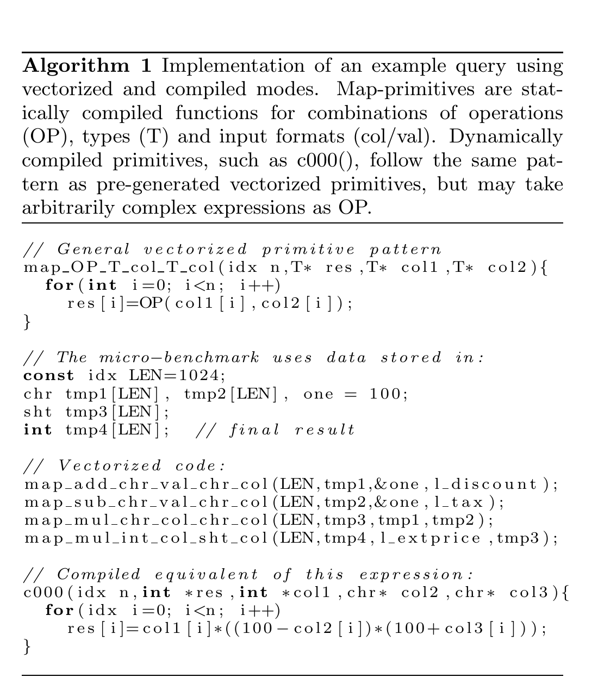
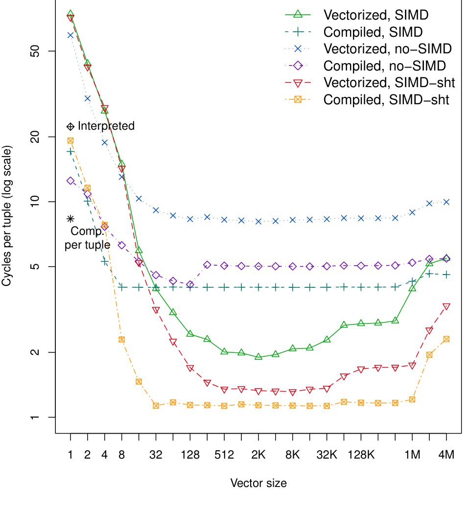
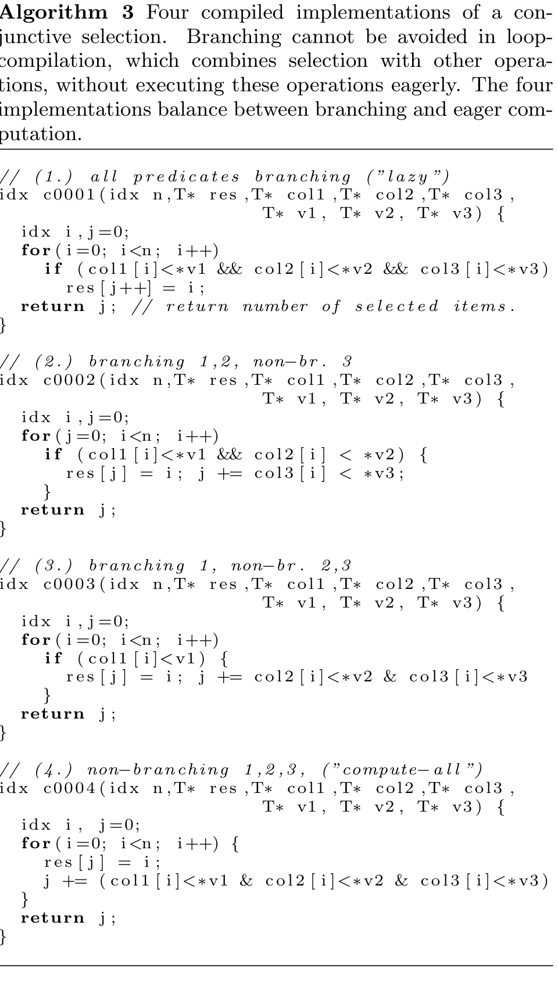
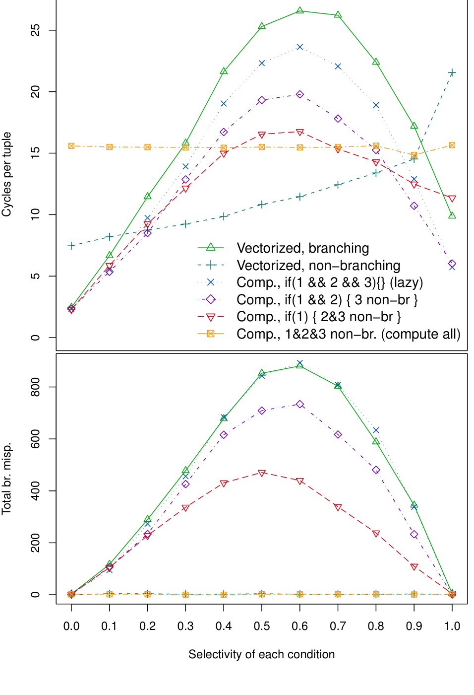
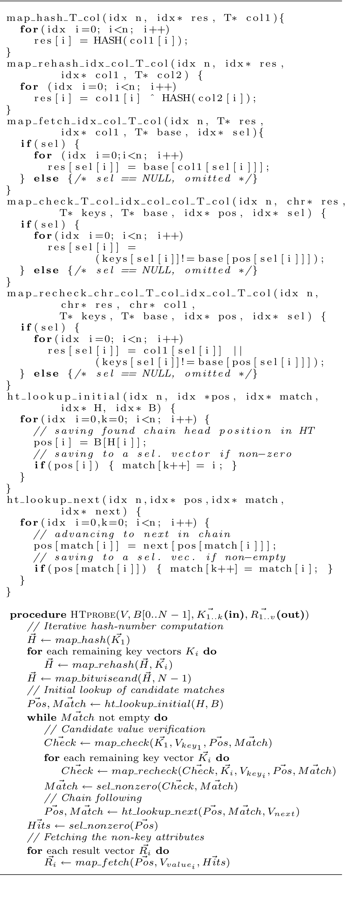
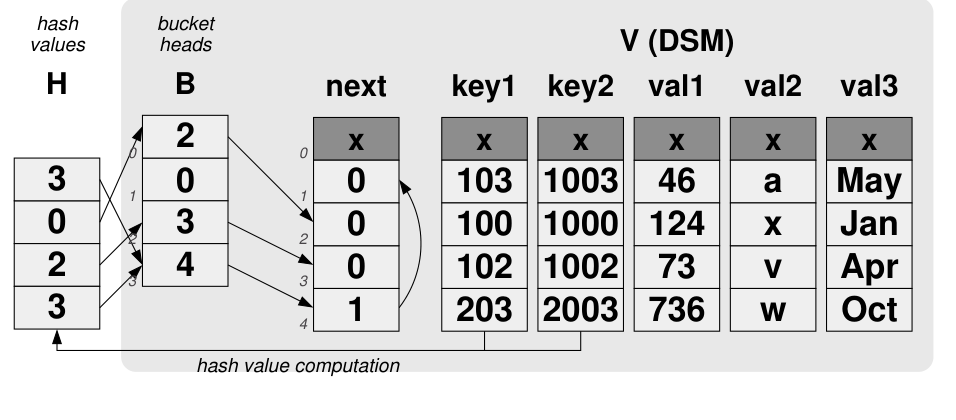
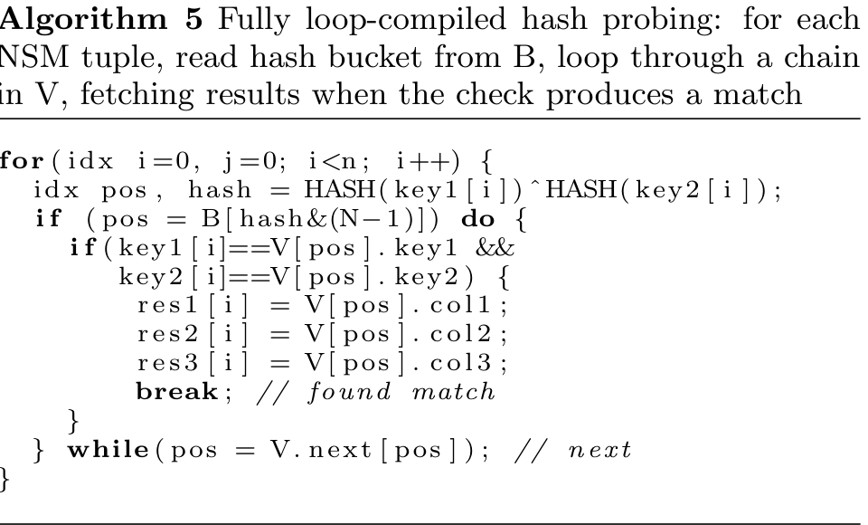
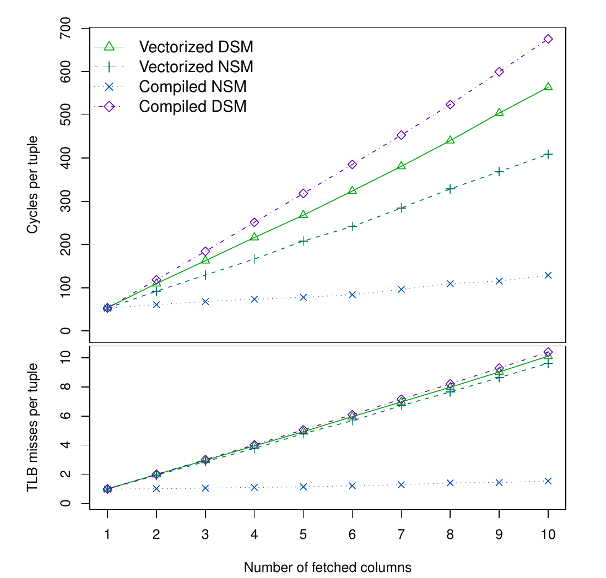
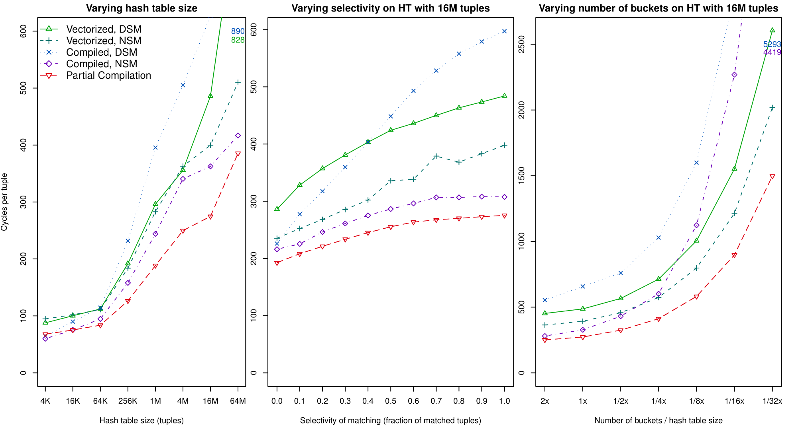

# Vectorization vs. Compilation in Query Execution（中文译文）

## 译者说明

本文依据同目录的 `source.pdf` 翻译。章节、图表、公式、算法、代码与参考文献按原文结构保留。

## 作者

Juliusz Sompolski、Marcin Zukowski、Peter Boncz

## 摘要

将数据库查询编译成可执行的子程序，相比传统解释执行有显著收益。这些收益包括降低解释开销、改善指令代码局部性，以及为使用 SIMD 指令创造机会。过去，许多类似收益已经可以通过把查询处理器改造成向量化执行模型来获得。本文试图说明：在现代 CPU 上的分析型数据库负载中，最先进的编译策略与向量化执行之间究竟是什么关系。

为此，我们在 Ingres VectorWise 数据库系统内部仔细考察了三类使用场景：Project、Select 和 Hash Join。一个发现是，编译应始终与块式查询执行（block-wise query execution）结合。另一个贡献是识别了三类“循环编译（loop-compilation）”不如向量化执行的情况。由此，最优性能需要谨慎融合两种策略：要么把向量化执行原则纳入编译后的查询计划，要么用查询编译生成向量化处理的构建块。

## 1. 引言

数据库系统提供许多重要抽象，例如数据独立性、ACID 属性，以及在大量数据上提出声明式复杂即席查询的能力。这种灵活性意味着数据库服务器在运行前并不知道具体查询，因此传统系统通常使用解释引擎实现查询求值。解释引擎执行由代数算子组成的计划，例如 Scan、Join、Project、Aggregation 和 Select。这些算子内部还包含表达式，例如 Join 和 Select 中的布尔条件，Project 中生成新列的计算，以及 Aggregation 中的 MIN、MAX、SUM 等函数。

大多数查询解释器遵循 Volcano 迭代器模型：每个算子实现 `open()`、`next()` 和 `close()` 接口；每次 `next()` 调用产生一个新元组；查询从根算子向下递归调用，再把结果元组向上拉取。这种一次一个元组（tuple-at-a-time）的模型会带来解释开销：系统花在解释查询计划上的时间，可能远多于真正计算查询结果的时间。它还会削弱现代 CPU 的高性能特性。实际工作指令被夹杂在解释逻辑和函数调用之间，导致编译器和 CPU 难以利用深流水线、SIMD 指令和跨迭代乱序执行。

### 相关工作：向量化执行

MonetDB 通过批量处理减少解释开销：每个算子完整处理其输入，然后才进入下一执行阶段。X100 项目进一步改进了这一思想，后来演化为 VectorWise 的向量化执行。向量化执行是一种面向块的查询处理方式，其中 `next()` 返回的不是单个元组，而是一批元组，通常为 100 到 10000 个。数据表示为小的一维数组，即向量（vector），CPU 可以高效访问。

这种模型带来两个直接效果。第一，花在解释逻辑上的指令比例按向量大小降低。第二，真正做工作的函数通常在紧凑循环中处理数组。这样的循环容易被编译器优化，例如循环展开，也更容易自动生成 SIMD 指令。现代 CPU 同样擅长执行这类循环：函数调用被消除，分支更容易预测，乱序执行可以同时推进多个循环迭代，从而利用现代处理器的深流水线资源。已有工作显示，向量化执行能让数据密集型 OLAP 查询提升约 50 倍。

### 相关工作：循环编译

消除解释负面影响的另一种策略是即时查询编译（JIT query compilation）。查询处理器在第一次收到查询时，把查询或其中一部分编译成例程，随后执行该例程。Java 引擎可以生成并加载新的 Java 类，由虚拟机 JIT 编译；C/C++ 系统可以生成源码文本、编译、动态加载并执行。System R 曾直接生成汇编，但因为不可移植而放弃。

根据编译策略，生成代码可以处理整个查询，也可以只覆盖性能关键片段。ParAccel 和 HyPer 等系统都采用编译。本文把当时的主流做法概括为“循环编译”：它们通常试图把查询核心编译成一个遍历元组的单一循环。与之相对，向量化执行把算子分解为多个基本步骤，每个步骤用独立循环执行，因此是“多循环（multi-loop）”结构。

编译可以消除解释开销，并生成精简、适合 CPU 的代码。本文把编译放在最有利的位置：假设编译时间可以忽略。这对运行较久的 OLAP 查询通常成立；Java JIT 和 LLVM 等技术也已经能以毫秒级延迟完成编译与链接。

### 路线图：向量化与编译

向量化表达式处理一个或多个输入数组，并把结果写入输出数组。即使 VectorWise 尽力确保这些数组位于 CPU 缓存中，这种物化仍然会引入额外的加载和存储。编译可以避免这部分工作，让中间结果在表达式之间流动时保留在 CPU 寄存器中。同时，编译作为通用技术本身与执行策略正交，理论上只会改善性能。

我们使用 VectorWise 研究三类案例。第 2 节讨论 Project 表达式计算：循环编译通常能得到最佳结果，但前提是采用块式处理。也就是说，在一次一个元组的引擎中直接编译表达式虽然可能有收益，却远不能达到可能的上限。第 3 节讨论 Select：在计算合取谓词时，分支预测失败会伤害循环编译；向量化方法可以把控制依赖转换成数据依赖，从而避免这一问题。第 4 节讨论大型哈希表探测，Hash Join 是代表案例：循环编译会在处理链表时被 CPU 缓存未命中阻塞，而用向量化方式跟随哈希桶链可以更快。第 5 节讨论一种混合策略。

## 2. 案例研究：Project

我们以 TPC-H Q1 中的表达式为灵感，使用如下 Scan-Project 查询作为微基准：

```sql
SELECT l_extprice * (1 - l_discount) * (1 + l_tax)
FROM lineitem;
```

这些扫描列都是两位精度的 decimal。VectorWise 内部把它们表示为整数，例如乘以 100 后存储。扫描和解压后，系统会根据实际值域选择能表示这些值的最小整数类型。计算表达式也类似：目标类型选择为不会溢出的最小宽度整数。对 TPC-H 而言，`l_extprice` 是 4 字节整数，另两个列是一字节整数；加减仍产生一字节结果，二者相乘产生 2 字节整数，最后与 4 字节整数相乘产生 4 字节结果。

### 向量化执行



VectorWise 在 Project 中把函数作为 map-primitives 执行。算法 1 展示了二元 primitive 的模式：输入是一段长度为 `n` 的向量，循环中逐个位置执行某个操作。`chr`、`sht`、`int`、`lng` 分别表示 1、2、4、8 字节整数；`idx` 表示数据列中的大小、索引或偏移。primitive 名称中的 `val` 后缀表示该参数是常量而不是列。VectorWise 为所需的操作、类型和参数模式组合预生成 primitive。

在 SSE 中，现代 x86 系统一条指令可以对 16 个一字节值做加减、把 8 个一字节整数相乘得到二字节结果，或者相乘 4 个四字节整数。因此，该表达式中 16 个元组可用 8 条 SIMD 指令处理。关闭 SIMD 后，处理单个元组需要更多指令。图 1 的实验显示：无 SIMD 的向量化代码约比 SIMD 版本慢 4 倍。随着向量大小增加，解释开销下降；但当向量超过 L1/L2 缓存容量后，缓存未命中导致性能恶化。

### 编译执行

算法 1 下半部分展示了 VectorWise 修改版可以即时生成的编译代码：整个表达式被组合到一个循环里。它结合了向量化和编译。结果类似整体查询编译器为这个 Scan-Project 计划生成的核心代码，只是完整查询编译器还会加入扫描代码。若把列视为列式存储表中的指针，该函数就是循环编译策略的产物。

编译方式的主要收益是消除中间结果的加载和存储。向量化方式每个元组需要 22 次加载/存储，而编译方式只需要底层三次加载和顶层一次存储。我们原本预期编译会明显更快，但实验中普通编译版本反而慢于向量化版本。深入观察生成代码后发现，icc 在生成 SIMD 代码时把所有计算都对齐到最宽单位，也就是 4 字节整数，从而丧失了一字节和二字节 SIMD 操作机会。我们认为这是编译器缺陷或次优。

为展示编译本可达到的效果，我们假设 `l_extprice` 可放入 2 字节整数，即图 1 中的 “SIMD-sht” 线。此时编译版本超过向量化执行，符合 Project 任务的一般预期。另一个观察是，编译后的 map primitive 对缓存大小较不敏感，因此混合的向量化/编译引擎可以使用更大的向量大小。

### 一次一个元组的编译

图 1 中的黑色星形和菱形对应 primitive 一次处理一个元组的情形。未编译策略称为 interpreted。像 MySQL 这样整个迭代器接口都是 tuple-at-a-time 的引擎，每个时刻只有一个元组可操作，因此只能使用这类函数。实验显示，如果在不打破 tuple-at-a-time 算子 API 的前提下引入编译，表达式计算性能可能提升约 3 倍，但绝对性能仍明显低于块式处理，主要原因是无法利用 SIMD，同时每个元组一次的虚方法调用也妨碍 CPU 跨元组进行推测执行。



更重要的是，在一次一个元组的 OLAP 查询中，表达式 primitive 只占总体时间很小比例，因为大部分开销来自 tuple-at-a-time 算子 API。因此，在不改变执行模型的情况下引入编译，整体收益最多只有几个百分点，价值值得怀疑。

## 3. 案例研究：Select

$$
(a \lt{} c_1) \land (b \lt{} c_2)
$$






第二个微基准考察合取选择：

```sql
WHERE col1 < v1 AND col2 < v2 AND col3 < v3
```

向量化的选择 primitive 生成满足条件的索引向量，即 selection vector。算法 2 展示了 `<` 选择 primitive 的两种实现：一种无分支，适合中等选择率；另一种有分支，适合很高或很低选择率。VectorWise 会根据观察到的选择率动态选择最佳方法。

对于合取谓词，向量化方式可以先对第一个谓词生成 selection vector，再对后续谓词只处理已通过的位置。无分支版本通过写入候选索引并用布尔结果增加输出计数，把控制依赖转成数据依赖。这样在中等选择率下可以避免分支预测失败。

算法 2 的无分支 primitive 对每个输入位置都先执行 `res[j] = i`，随后只用谓词真假增加 `j`；若已有输入 selection vector，则读取并写回其中的原始位置。分支版本只在谓词为真时写入并递增 `j`。VectorWise 根据运行时观察到的选择率动态选用二者，还会把最具选择性的合取项放到最前。三个条件依次执行时，前一个 primitive 的输出 selection vector 和输出长度成为下一个 primitive 的输入，因此后续条件只在逐渐缩小的候选集合上计算，实现了真正的短路而不必在单个循环里使用数据相关分支。

循环编译的自然写法是一个循环中使用 `if (p1 && p2 && p3)`。这可以短路求值，避免不必要的工作，但在中等选择率时会产生难预测分支。我们比较四种生成方式：三个条件都用短路分支；只对前两个使用分支、第三个转为无分支计数；只对第一个使用分支、后两个用布尔与；以及三个条件全部计算后用布尔与合并。后者近似：

```c
for (idx i = 0, j = 0; i < n; ++i) {
    result[j] = i;
    j += (col1[i] < v1) & (col2[i] < v2) & (col3[i] < v3);
}
```

实验使用 1K 输入整数元组，三个谓词具有相同选择率，即总体选择率的立方根，并把总体选择率从 0 调到 1。图 2 同时给出 cycles/tuple 与分支误预测数。懒求值编译略优于向量化有分支版本，却在中等选择率远逊于无分支向量化。混合方案只在部分范围改善，最差点总出现在分支后选择率约为 50% 的位置。根本原因是，在单一循环里无法同时做到“把所有控制依赖改为数据依赖”以及“跳过前置谓词已经淘汰的元组”；多循环 selection vector 正好同时满足两者。

这说明选择算子不是简单把表达式塞进一个编译循环就一定最好。对中等选择率、多个谓词和后续昂贵处理而言，向量化的“先产生紧凑 selection vector，再只处理有效位置”的策略非常重要。

## 4. 案例研究：Hash Join











第三个案例是 Hash Join 中的大哈希表探测。循环编译容易把 Join 逻辑融合进单个元组循环；然而当探测大型哈希表时，执行会在跟随哈希桶链的过程中频繁等待缓存未命中。单个元组的链式访问存在强依赖：在拿到当前节点之前无法知道下一节点地址，因此 CPU 难以并行发起足够多的内存请求。

微基准连接条件为两个整数列组成的复合键，并从 build 侧输出三列：

```sql
SELECT build.col1, build.col2, build.col3
FROM probe, build
WHERE probe.key1 = build.key1
  AND probe.key2 = build.key2;
```

VectorWise 使用 bucket chaining。大小为 2 的幂的 bucket 数组 `B` 存放 value space `V` 中元组的 offset；`V` 可用 DSM 列式或 NSM 行式布局，并含 build 关系值与 `next` offset。链长大于 1 可能来自哈希碰撞，也可能来自 build 中重复键。

向量化 probe 先逐列计算复合键哈希：第一列用 `map_hash`，后续列用 `map_rehash` 迭代混合，最后以 `H & (N-1)` 得 bucket 号。`ht_lookup_initial` 从 `B` 读取链头位置，填充候选位置向量 `Pos`，并生成仅含非空 bucket 的 `Match` selection vector。随后 `map_check` 把按 offset 取 key 与不等比较融合；复合键其余列通过 `map_recheck` 合并前一列失败标记。`sel_nonzero` 留下检查失败、还需沿链继续的 probe，`ht_lookup_next` 将这些位置推进到 `V.next`，同时去掉链尾为 0 的项。循环到 `Match` 为空后，`Pos` 中非零位置就是命中，系统再用它作为 pivot，逐列 fetch 非键结果。

向量化执行可以同时维护多个待探测键，并把不同键的链式探测交织起来。当某个键等待内存时，其他键仍可推进，从而提供更多内存级并行性。

### 4.1 部分编译

我们识别出三处融合机会：把 hash/rehash/bitwise-and/bucket fetch 编成一个 primitive；把复合键 check/recheck 与 `select > 0` 编成一个无分支 select primitive；以及把多个输出列 fetch 编成一个 compound fetch。第三项对 NSM 特别重要。普通向量化按列多次随机遍历 NSM value space，工作集往往超过 TLB 甚至 cache，后一次遍历时前一次访问的页和 cache line 已被逐出。编译后的多列 fetch 在同一位置一次取全三列，显著改善局部性。图 4 显示，未编译时 NSM 与 DSM 接近，编译后 NSM 明显更快；输出列越多，收益越大，TLB miss 也更少。

### 4.2 完整循环编译与并行内存访问

算法 5 对每个 probe 元组计算哈希、读取 bucket、在 `V` 中沿链逐节点比较，命中后一次取出三列。其代码紧凑且无中间向量，却存在串行地址依赖。

现代主存延迟约 100ns，cache line 只有 64 字节，仅靠二者相除无法解释实际带宽。Nehalem 单核可通过顺序预取和乱序执行取得约十倍于 0.64GB/s 的带宽；对随机访问则必须始终保持多个未完成请求。该架构最多维持四个 outstanding load，但前提是推测窗口能越过正确预测的分支，并找到相互独立的 load。

向量化 fetch primitive 是独立 load 的紧循环，自然填满所有 outstanding load；部分编译版本同样如此。完整编译 probe 若桶链无冲突，分支预测器通常预测 `while(pos)` 结束，CPU 还能跨多个外层 probe 元组推测执行。若存在碰撞或重复 build key，预测器会留在 while 循环；下一地址 `V.next[pos]` 又依赖当前 cache/TLB miss，CPU 只能等待单个请求，无法前进到下一个 probe 元组。最坏情况下，完整编译因此比向量化慢约 4 倍。

### 4.3 实验

图 5 比较向量化、完整编译和部分编译，并分别使用 DSM/NSM。默认哈希表 16M 元组、命中率 1、平均链长 1；三组实验分别改变 value space 大小、命中率和 bucket 数相对表大小。哈希表增大时 cache/TLB miss 使所有方案变慢，DSM 局部性更差；命中率增加时输出 fetch 工作增加，编译 NSM fetch 始终最好；bucket 从表大小的 2 倍缩到 1/32 时链迅速增长，完整编译版本因失去并行内存访问而恶化到图中 4419/5293 cycles/tuple 的极端值。

总体最佳是部分编译 NSM：复合键 hashing/checking 和多列 fetch 得到编译融合收益，同时 lookup、fetch 和 chain-following 仍以向量方式保持并行内存请求。Hash Join 的瓶颈不只是解释或算术指令，而是随机访问延迟；循环编译消除函数调用却不能消除地址依赖。

## 5. 结论：融合编译与向量化

三个案例给出不同结论。Project 表达式中，编译通常能减少中间物化并保留寄存器值，但需要块式处理和正确 SIMD 生成。Select 中，向量化 selection vector 能避免中等选择率下的分支预测失败。Hash Join 中，向量化的多任务链跟随能缓解随机内存访问延迟。

因此，我们主张融合两种方法，而不是把二者视为替代品。合理路线有两种。第一，把向量化原则纳入编译后的查询计划：编译生成的代码仍以块为单位工作，并保留 selection vector、批量处理和多路探测等机制。第二，用查询编译生成向量化处理的构建块：例如为具体表达式动态生成 map primitive，再由向量化引擎调度它们。

这类混合模型也解释了为什么“只给传统 tuple-at-a-time 引擎加 JIT”收益有限。JIT 必须与数据块、缓存驻留向量、SIMD 友好的循环和内存级并行结合，才能发挥出分析型负载所需要的效果。

本文比较了向量化执行与查询编译在现代 CPU 上处理分析型数据库负载时的关系。编译可以大幅降低解释开销并消除中间结果物化；向量化可以降低算子解释开销、提供 SIMD 友好的循环、减少分支预测失败，并在随机内存访问场景中创造更多并行性。

最重要的结论是：编译不应孤立地应用在一次一个元组的执行模型上。它应与块式查询执行结合，并与向量化原则共同设计。Project、Select 和 Hash Join 三个案例表明，最优执行引擎应能在“编译表达式”和“向量化调度”之间选择合适粒度。换言之，真正有竞争力的查询执行架构不是简单的“编译 vs. 向量化”，而是编译化的向量执行，或以编译 primitive 增强的向量化执行。


## 参考文献

- [1] P. Boncz, M. Zukowski, and N. Nes. MonetDB/X100: Hyper-Pipelining Query Execution. In Proc. CIDR, Asilomar, CA, USA, 2005.
- [2] P. A. Boncz. Monet: A Next-Generation DBMS Kernel For Query-Intensive Applications. Ph.d. thesis, Universiteit van Amsterdam, Amsterdam, The Netherlands, May 2002.
- [3] S. Chen, A. Ailamaki, P. B. Gibbons, and T. C. Mowry. Improving hash join performance through prefetching. In Proc. ICDE, Boston, MA, USA, 2004.
- [4] D. Chamberlin et al. A history and evaluation of System R. Commun. ACM, 24(10):632-646, 1981.
- [5] G. Graefe. Volcano - an extensible and parallel query evaluation system. IEEE TKDE, 6(1):120-135, 1994.
- [6] A. Kemper and T. Neumann. HyPer: Hybrid OLTP and OLAP High Performance Database System. Technical report, Technical Univ. Munich, TUM-I1010, May 2010.
- [7] K. Krikellas, S. Viglas, and M. Cintra. Generating code for holistic query evaluation. In ICDE, pages 613-624, 2010.
- [8] S. Padmanabhan, T. Malkemus, R. Agarwal, and A. Jhingran. Block Oriented Processing of Relational Database Operations in Modern Computer Architectures. In Proc. ICDE, Heidelberg, Germany, 2001.
- [9] ParAccel Inc. Whitepaper. The ParAcel Analytical Database: A Technical Overview, Feb 2010. http://www.paraccel.com.
- [10] J. Rao, H. Pirahesh, C. Mohan, and G. M. Lohman. Compiled Query Execution Engine using JVM. In Proc. ICDE, Atlanta, GA, USA, 2006.
- [11] K. A. Ross. Conjunctive selection conditions in main memory. In Proc. PODS, Washington, DC, USA, 2002.
- [12] The LLVM Compiler Infrastructure. http://llvm.org.
- [13] M. Zukowski. Balancing Vectorized Query Execution with Bandwidth-Optimized Storage. Ph.D. Thesis, Universiteit van Amsterdam, Sep 2009.
- [14] M. Zukowski, N. Nes, and P. Boncz. DSM vs. NSM: CPU Performance Tradeoffs in Block-Oriented Query Processing. 2008.
