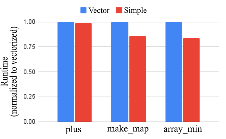
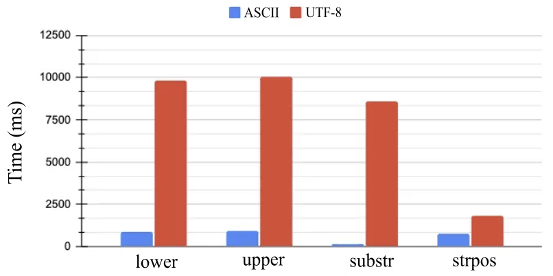
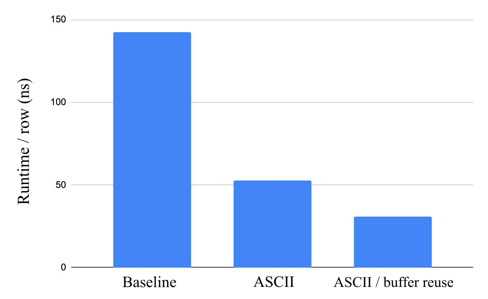
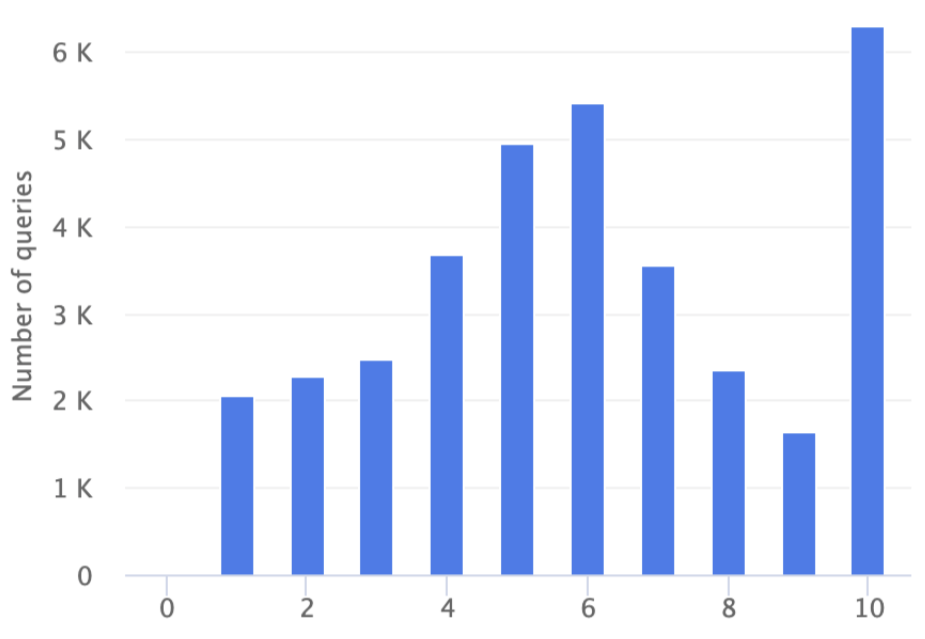

# Velox: Meta’s Unified Execution Engine（中文译文）

## 译者说明

本文依据同目录的 `source.pdf` 翻译。章节、图表、公式、算法、代码与参考文献按原文结构保留。

Pedro Pedreira、Orri Erling、Masha Basmanova、Kevin Wilfong、Laith Sakka、Krishna Pai、Wei He、Biswapesh Chattopadhyay

Meta Platforms Inc.

{pedroerp,oerling,mbasmanova,kevinwilfong,lsakka,kpai,weihe,biswapesh}@fb.com

## 摘要

面向非常具体的数据工作负载临时开发新的专用计算引擎，造成了彼此割裂的数据环境。这些引擎通常几乎不共享任何东西，难以维护、演进和优化，最终还给数据用户带来不一致的体验。为解决这些问题，Meta 创建了 Velox，一种新颖的开源 C++ 数据库加速库。Velox 为构建执行引擎及增强数据管理系统提供可复用、可扩展、高性能且不依赖方言的数据处理组件。该库高度依赖向量化与自适应技术；鉴于复杂数据类型在现代工作负载中无处不在，Velox 从一开始便以支持其高效计算为目标进行设计。目前，Velox 已经或正在与 Meta 的十余个数据系统集成，包括 Presto、Spark 等分析查询引擎，流处理平台，消息总线和数据仓库摄取基础设施，用于特征工程和数据预处理的机器学习系统（PyTorch）等。它带来的收益包括：（a）普及过去只有个别引擎才具备的优化，从而提高效率；（b）提升数据用户体验的一致性；（c）通过促进复用来提高工程效率。

## PVLDB 引用格式

Pedro Pedreira, Orri Erling, Masha Basmanova, Kevin Wilfong, Laith Sakka, Krishna Pai, Wei He, Biswapesh Chattopadhyay. Velox: Meta’s Unified Execution Engine. *PVLDB*, 15(12): 3372–3384, 2022. doi:10.14778/3554821.3554829

## 1. 引言

现代数据应用的工作负载日益多样，数据集又呈指数增长，促使大量专用查询与计算引擎涌现，每个引擎都面向一种非常具体的工作负载。数据处理需求已经从简单的事务处理和分析（包括批处理与交互式处理），扩展到 ETL 和批量数据移动、实时流处理、面向监控的日志与时间序列处理，以及更近几年大量出现的人工智能（AI）和机器学习（ML）应用，包括数据预处理与特征工程。

这种演进形成了一个由数十个专用引擎组成的割裂数据生态。这些引擎使用不同框架和库构建，彼此几乎不共享任何东西，以不同语言编写，并由不同工程团队维护。随着硬件和应用演进，逐个演进和优化这些引擎的成本高得难以承受。例如，让每个引擎更好地利用缓存一致性加速器、NVRAM 等新硬件进展，支持 ML 工作负载所需的 Tensor 数据类型，并利用研究界未来的创新，都不切实际，而且必然导致各引擎拥有迥异的优化与功能集合。更重要的是，这种碎片化最终会损害数据用户的生产力，因为用户通常需要与多个不同引擎交互才能完成一项任务。各系统可用的数据类型、函数和聚合不同，函数行为、空值处理与类型转换在引擎之间也可能极不一致。例如，Meta 的一次非正式调查发现，简单字符串函数 `substr()` 至少有 12 种实现，它们在参数语义（索引从 0 还是 1 开始）、空值处理和异常行为上各不相同。

专用引擎按定义会提供足以证明其存在合理性的专用行为，但引擎之间的主要差异通常位于语言前端（SQL、DataFrame 及其他 DSL）、优化器、任务在工作节点间的分发方式（亦称运行时）以及 I/O 层。处于这些系统核心的执行引擎其实十分相似。所有引擎都需要：表示标量与复杂数据类型的类型系统；这些通常为列式的数据集在内存中的表示；表达式求值系统；连接、聚合、排序等算子；此外还需要存储与网络序列化、编码格式和资源管理原语。

为解决这些问题，Meta 开发了 Velox。这个新颖的 C++ 数据库加速库提供可复用、可扩展且高性能的数据处理组件，可用来构建、增强或替换现有数据管理系统中的执行引擎。由于复杂类型在现代工作负载中极其普遍，Velox 从一开始便以高效支持复杂类型为目标，并高度依赖向量化 [4] 和自适应技术。Velox 组件不依赖语言、方言和引擎，还提供许多扩展点，开发者可据此定制库行为以满足特定引擎的要求。在常见用法中，Velox 接收已经完全优化的查询计划作为输入，并利用本地节点的资源完成计划所描述的计算。因此，Velox 不提供 SQL 解析器、DataFrame 层、其他 DSL 或全局查询优化器，通常也不供数据用户直接使用。

Velox 的价值体现在三个方面：

- **效率：** Velox 普及了过去只有个别引擎才实现的运行时优化，例如充分利用 SIMD、惰性求值、自适应谓词重排与下推、公共子表达式消除、直接处理编码数据、代码生成等。
- **一致性：** 通过复用同一执行库，计算引擎能够暴露完全相同的数据类型以及标量/聚合函数包；统一的行为由此为数据用户提供更一致的体验。
- **工程效率：** Velox 中的全部功能和运行时优化只需开发和维护一次，从而减少重复工程并促进复用。

Velox 正在积极开发，且已经或正在与 Meta 内外十余个数据系统集成，例如 Presto、Spark、PyTorch、XStream（流处理）、F3（特征工程）、FBETL（数据摄取）、XSQL（分布式事务处理）、Scribe（消息总线基础设施）、Saber（高 QPS 外部服务）等。

我们认为 Velox 是迈向数据系统模块化和互操作性的重要一步，最终目标是以更负责任的方式落实“没有一种方案适合所有场景”这一理念。考虑到它对社区的潜在影响，Velox 已开源¹，并得到一个快速成长的社区支持，其中包括 Ahana、字节跳动、Intel 以及许多其他大型科技公司和学术合作伙伴的成员。我们还认为，从战略上看，Velox 将使 Meta 能与硬件厂商合作，主动让我们的数据系统为未来硬件做好准备，同时简化与研究人员和研究实验室的协作。

我们作出以下贡献：

- 详细介绍 Velox 库、其组件、扩展点和主要优化。
- 描述 Velox 如何与面向迥异工作负载的计算引擎集成，包括批处理与交互式分析、流处理、数据仓库摄取、ML 等。
- 说明 Velox 如何改变 Meta 传统上由孤立专用引擎构成、且向数据用户提供不一致语义的数据环境。
- 通过微基准说明 Velox 的主要优化，并给出 Velox 与 Presto 集成后的实验结果。
- 讨论这一过程中的经验、未来工作与开放问题，希望借此推动进一步研究和合作。

¹ Velox 地址：https://github.com/facebookincubator/velox

## 2. 库概览

Velox 是一个开源 C++ 数据库加速库，提供高性能、可复用、可扩展的数据处理组件，可用于加速、扩展和增强数据计算引擎。Velox 不提供 SQL 解析器、DataFrame 层或其他 DSL 之类的语言前端；它接收描述待执行计算的完全优化查询计划，并利用本地主机的资源在本地执行。

此外，Velox 不提供全局查询优化器，却会在执行时利用多种自适应技术，例如过滤条件与合取项重排、动态过滤器下推和自适应列预取。换言之，Velox 提供的组件通常处于数据平面，各引擎负责提供控制平面。Velox 提供的高层组件包括：

- **Type：** 通用类型系统，允许用户表示标量、复杂及嵌套数据类型，包括结构体、映射、数组、张量等。
- **Vector：** 与 Arrow 兼容²的列式内存布局模块，支持 Flat、Dictionary、Constant、Sequence/RLE 和 Bias（基准帧）等多种编码，并支持惰性物化模式和乱序填充结果缓冲区。
- **Expression Eval：** 基于 Vector 编码数据构建的完全向量化表达式求值引擎，利用公共子表达式消除、常量折叠、高效空值传播、编码感知求值和字典记忆化等技术。
- **Functions：** 供开发者构建自定义函数的 API，包括标量函数的简单接口（逐行）与向量化接口（逐批），以及聚合函数 API。库中还提供与流行 SQL 方言兼容的函数包（目前支持 Presto 和 Spark）。
- **Operators：** 实现 TableScan、Project、Filter、Aggregation、Exchange/Merge、OrderBy、HashJoin、MergeJoin、Unnest 等常见数据处理算子。
- **I/O：** 通用连接器接口，允许插入文件格式编码器/解码器和存储适配器。库中包含对 ORC、Parquet 等常用格式以及 S3、HDFS 存储系统的支持。
- **Serializers：** 面向网络通信的序列化接口，可实现不同线协议，支持 PrestoPage 和 Spark UnsafeRow 格式。
- **Resource Management：** 处理计算资源的一组原语，包括内存区域与缓冲区管理、任务、驱动器、CPU 与线程执行所需的线程池、溢写和缓存。

集成 Velox 的引擎可以按所需功能选择组件。例如，只有简单数据表示和序列化需求的引擎可以只使用 Type、Vector 和 Serializer，而完整的 SQL 分析查询引擎则需要使用全部算子和资源管理原语。

Velox 不仅模块化，还提供可定制该库的扩展 API。开发者可通过这些 API 添加插件，以支持自定义数据类型、标量和聚合函数、引擎特有算子、新序列化格式、文件编码和存储适配器。某个插件是否进入主库，取决于它是否通用：若多个引擎都会使用，例如 Parquet 与 ORC 文件编码器以及 Aggregate、OrderBy、HashJoin 等通用算子，就纳入主库；否则，插件放在客户端引擎代码库中，例如 ML 专用函数和流处理算子。

² Velox Vector 与 Apache Arrow 格式的差异见 §4.2.1。

## 3. 使用场景

本节介绍 Velox 在 Meta 的主要使用场景，以及不同专用引擎如何利用 Velox 加速、统一和整合用户工作负载。我们首先介绍 Presto [17] 中的交互式 SQL 分析（§3.1）和 Spark [18] 中的大型批处理/ETL SQL 分析工作负载（§3.2）。随后，我们介绍实时数据基础设施的集成：Velox 如何用于流处理平台 XStream（§3.3.1）、消息总线 Scribe（§3.3.2）和数据摄取系统 FBETL（§3.3.3）。最后，我们介绍 Velox 与专注于数据预处理和特征工程的 ML 平台的集成（§3.4）。

### 3.1 Presto

Presto 是 Meta 在约 2013 年创建的开源分布式查询引擎，允许用户对 Hive 等环境中的数据运行 SQL 查询。它目前承载 Meta 大部分交互式（低延迟）SQL 分析工作负载和部分批处理工作负载，但繁重的 ETL 处理大多由 Spark 完成。Presto 采用两层架构：协调器节点负责接收用户查询、解析 SQL、解析元数据、执行全局查询优化和管理资源；工作节点依据查询计划片段执行实际查询。协调器和工作进程共享同一个 Java 代码库，并通过 HTTP REST 接口通信。所有数据处理与混洗都发生在工作节点内部或工作节点之间，因此工作节点与协调器的数量比通常为 100–1000:1，绝大多数 CPU 时间也花在工作节点上。

Prestissimo³ 是一个项目代号，目标是用基于 Velox 的 C++ 进程替换 Java 工作进程，从而提高效率。Prestissimo 以 C++ 实现 Presto 的 HTTP REST 接口，包括工作节点间的交换线协议、协调器到工作节点的编排以及状态报告端点，因而能直接替换 Presto 工作进程。其主要查询流程是：从 Java 协调器接收 Presto 计划片段，把它转换为 Velox 查询计划，再交给 Velox 执行。这样，工作节点就不再需要 Java 进程、JVM 或昂贵的垃圾回收流程，而这些过去一直是运维问题的来源。

**统一。** Prestissimo 使用整个 Velox 库：类型、Vector、表达式求值、函数、算子、序列化器、I/O 和资源管理原语。它是第一个借助 Velox 提供端到端功能的实现，因此为 Prestissimo 开发的许多组件，例如 Presto 线协议和 Presto 函数/聚合包，如今已经构成 Velox 核心，并被其他引擎复用。例如，实时数据基础设施（§3.3）使用 Presto 线协议，流处理和 ML 平台（§3.4）则使用 Presto 函数包。

³ 该名称来自乐理，意为“可能的最快速度；比 Presto 更快”。

### 3.2 Spark

Spark 是面向大规模数据处理的开源统一计算引擎，管理并协调跨服务器集群的数据任务执行。Spark 应用由一个驱动进程和一组执行器进程组成：驱动进程负责任务规划、调度以及与外部资源管理器通信；执行器负责完成实际计算、通信及与远程存储系统交互。在 Meta，Spark 凭借针对长时间查询/应用的优良容错能力，常用于执行以 SparkSQL 或 DataFrame API 表达的批处理与 ETL SQL 查询。

Spruce 是 Spark 的 Velox 实现代号。它利用 Spark 已有的 `Spark script transform` 接口，把任意二进制程序的执行卸载到外部 C++ 进程，Velox 就在这个进程中运行。查询时，Spark 执行器收到查询计划片段，将其序列化后通过 transform 接口转发给外部 C++ 进程（称为 SparkCpp）。SparkCpp 反序列化该计划、将其转换为 Velox 计划，并用 Velox 执行。

SparkCpp 通过 Velox 扩展 API 添加算子以及标量函数和聚合函数，使新的 C++ 代码与现有 Spark Scala 执行引擎完全兼容。它还为 Velox 添加 Spark 中用于数据混洗及向客户端返回数据的 UnsafeRow 序列化器。尽管 Velox 与 Presto 和 Spark 集成时，为了兼容现有查询而采用了不同定制，但共享执行引擎为未来实现引擎间语义等价铺平了道路，同时立即带来效率收益。

### 3.3 实时数据基础设施

Meta 的实时数据基础设施正在三个不同但相关的场景中使用 Velox：（a）流处理；（b）分布式消息基础设施；（c）数据摄取。下面分别介绍。

#### 3.3.1 流处理

XStream 是 Meta 的流处理平台，用户可通过 SQL 或类似 DataFrame 的流畅式（链式）API 创建流处理应用。XStream 应用通常持续读取 Meta 消息基础设施 Scribe 中的数据，在应用业务逻辑后把结果写回 Scribe 或其他数据汇，例如日志分析平台 Scuba，或用于在线服务的键值存储系统。尽管流处理抽象看似逐行操作，但实践中会批量读取和写入，以优化 I/O 并受益于 Velox 的向量化执行模型。生产部署中，数据通常按最大 500 KB 的块批处理，缓冲窗口最长 20 秒。

XStream 中大多数数据处理操作直接映射到 Velox 算子并被直接复用，例如投影、过滤以及仍在开发的查找连接。使用 Velox 后，XStream 还能暴露 Presto 所用的同一函数包，提高一致性并减少已经熟悉 Presto SQL 的用户使用时的摩擦。

流式聚合需要处理时间窗口、翻滚窗口、跳跃窗口和会话窗口等引擎专用逻辑，因此在 XStream 中作为 Velox 扩展实现。尽管这些特殊聚合在流处理应用中极为常见，团队计划把这类操作纳入 Velox 核心，并以时间扩展的形式向 Presto 和 Spark 用户开放。由于 Velox 提供统一执行引擎，这项工作无需大量重复开发。

#### 3.3.2 消息总线

Scribe 是一个分布式消息系统，以低延迟收集、聚合并传递大量数据，是 Meta 数据摄取管道的主要入口。在常见场景中，数据由 Web 层生成并写入 Scribe，随后由流处理应用读取（处理后的数据可能写入新的 Scribe 管道），或交付给 FBETL 以摄取进数据仓库。

过去，数据逐行写入 Scribe（日志生成），也以相同方式读取。如今，负责服务 Scribe 读取请求的 Scribe Read Service 可以充分利用 Velox 提供的线序列化格式；列式编码让这些格式效率更高，数据消费者也能轻易把它们反序列化为 Velox Vector。此外，在 Scribe Read Service 中使用 Velox 后，数据消费者可以把投影（只读取部分列）和过滤等操作下推到更靠近存储的位置，例如供流处理应用使用，从而减少从 Scribe 读取的数据量，并在许多情况下减少跨数据中心流量。下推到 Scribe 的过滤和投影还与其他计算引擎保持相同语义，给用户更一致的体验。

#### 3.3.3 数据摄取

FBETL 是 Meta 的数据摄取引擎，负责两类主要任务：数据仓库摄取和数据库摄取。数据仓库摄取把从 Scribe 管道读取的数据转换为仓库文件；这些文件通常采用 ORC 格式或其名为 DWRF 的内部变体编码，用于长期保留和后续处理。除了复用生成 ORC 文件的 Spark、Presto 等 SQL 引擎所用的同一 ORC 编码器代码库，从而提高一致性外，在 FBETL 中使用 Velox 还让用户能指定在摄取时应用的数据转换（投影），包括表达式、UDF 和过滤。用户无需为了取得同一结果而创建完整流处理应用，也就避免了写入新 Scribe 管道后再读取摄取的开销。Velox 再次通过暴露其他引擎可用的同一组函数与语义来提供一致体验；例如，最终用户可以复用 Presto 的任何函数来指定摄取时的数据转换，同时减少代码重复。

另一类任务是数据库摄取，即抓取运营数据库日志并将快照保存到数据仓库。除上述收益外，Velox 还帮助实现快照生成：这是一个独立的周期性过程，读取仓库表分区中的上一快照，将数据库重做日志中的修改应用到快照（类似合并连接），再把结果写回新的表分区。

### 3.4 机器学习

几乎每条机器学习（ML）流水线都包含预处理步骤，在把数据送入模型前将其整理成合适形式。这些转换通常位于数据分析系统完成的离线处理与神经网络之间；前者执行大规模连接、聚合和过滤，后者执行矩阵乘法、卷积等张量操作，并由 PyTorch 等机器学习框架驱动。这个过程也称为数据预处理，通常只涉及归一化、嵌入查找、图像裁剪等逐行转换，并可用传统计算引擎提供的表达式求值与用户定义函数表达。

尽管二者有明显相似之处，Meta 的数据分析基础设施与 ML 基础设施很大程度上一直独立演进。ML 系统需求呈指数增长，而缺少适当的可复用组件，造成了高度碎片化：数据预处理库的数据类型支持不完整、内存表示不兼容、函数包也不一致。内部调查发现，Meta 大约有 14 个数据预处理库，它们提供不同功能、效率欠佳，用户体验也不一致。此外，尽管这些转换只包含训练过程开始前的处理，但据估计，预处理计算最多可消耗 ML 工作负载所用资源的 50% [20]。

#### 3.4.1 数据预处理

TorchArrow 是 PyTorch 的一个新项目，旨在统一并提供一流的 ML 用户结构化数据预处理能力。它提供类似 Pandas 的 Python DataFrame 层，并与 PyTorch 生态深度集成。TorchArrow 在内部把 DataFrame 表示转换成 Velox 计划，并委托 Velox 执行。除了帮助整合碎片化的 ML 数据预处理库，这一集成还使 Meta 能把数据分析与 ML 基础设施中的执行引擎代码整合起来；该计划名为“DI for AI”（Data Infrastructure for Artificial Intelligence，面向人工智能的数据基础设施）。它还为 ML 最终用户提供更一致的体验：这些用户通常需要与不同计算引擎交互才能完成某项任务，例如用于数据准备的大规模 SQL 查询、用于调试的交互式 SQL 分析和流处理；现在则可暴露相同函数，并保证跨引擎行为一致。

#### 3.4.2 特征工程

这类转换的另一场景是特征工程工作流，即利用领域知识，以 ML 算法可消费的特征形式提取有用信息。Meta 的特征工程框架 F3⁴ 允许用户通过定义 F3 DSL 文件，以编程方式创建特征；该文件指定生成特定特征所需的转换，例如把出生日期转换为数字年龄。依据 DSL 定义，F3 通过把特征生成转换集成进 Spark（批处理）和 XStream（实时数据集），同时管理离线和实时数据生成。最后，在线服务阶段也使用同一 DSL 定义生成推断时输入模型的特征值，保证训练与服务/推断的一致性。

F3 目前正在用 Velox 统一其执行引擎。Spark 与 XStream 已经使用 Velox 执行，因此离线和实时 F3 数据生成流水线能够在这些计算引擎中原生运行。不过，与 F3 在线服务路径的集成仍在进行，并带来了一个有趣挑战：许多转换是从用户服务路径中的应用调用，QPS 很高、延迟要求很低，而且对小批数据（通常一条记录）执行，因解释开销，Velox 的向量化执行引擎并非最佳选择。由于 DAG 本身大多固定，团队正投入于为 Velox 添加基于代码生成的执行；§4.3.3 将进一步讨论代码生成。

⁴ 其历史名称为 Facebook Feature Framework，即 F3。

## 4. 深入剖析

下面各小节详细介绍 Velox 提供的主要组件，并给出实验性微基准结果。

### 4.1 类型系统

Velox 的核心提供一个类型系统，允许用户表示不同精度的整数和浮点数、字符串（`varchar` 与 `varbinary`）、日期、时间戳和函数（lambda）等基本类型。它还支持数组、定长数组（用于实现 ML 张量）、映射和行/结构体等复杂类型；这些类型可以任意嵌套，并提供序列化/反序列化方法。最后，Velox 还提供不透明数据类型，开发者可用它轻松封装任意 C++ 数据结构。

类型系统可以扩展，开发者无需修改主库就能添加引擎专用类型。例如，Presto 用于基数估计的 HyperLogLog⁵ 类型，以及 `timestamp with timezone` 等 Presto 特有的日期/时间类型。通过类型扩展加入的类型，之后也可用于构建自定义标量函数和聚合函数。

⁵ 尽管当前 HLL 实现是 Presto 专用的，我们计划将其通用化并纳入核心库。

### 4.2 Vector

Velox Vector 让开发者能利用多种编码格式在内存中表示列式数据集，并作为大多数其他组件的输入和输出。基本内存布局扩展自 Apache Arrow 格式 [2]，由大小变量（表示 Vector 中的行数）、数据类型（见上一小节）和表示空值的可选空值位图组成。Vector 基类还提供一组帮助用户复制、调整大小、哈希、比较和打印 Vector 的方法。

Vector 可以表示定长元素，例如整数和浮点数等基本类型，也可以表示变长元素，例如字符串、数组、映射和结构体/行。Vector 还能以任意方式嵌套，例如由“包含字符串及其他基本类型的结构体”组成的数组再构成数组，并可采用 Flat、Dictionary、Constant、Sequence/RLE 和 Bias（基准帧）等不同编码格式；生成特定 Vector 的系统或组件负责选择适当编码。所有 Vector 数据都存储在 Velox Buffer 中。Buffer 是从内存池分配的连续内存片段，可以通过子类支持不同所有权模式，例如自有缓冲区和缓冲区视图。所有 Vector 和 Buffer 都采用引用计数，一个 Buffer 可由多个 Vector 引用；自然地，只有单一引用的数据可直接修改，但任意 Vector 和 Buffer 都能通过写时复制变为可写。

Velox 还提供 Lazy Vector，即只在首次使用时填充的 Vector。Lazy Vector 适合连接和投影中的条件表达式等基数缩减操作；依据操作选择率，可以完全避免物化，或只物化少量保留下来的行。从 S3、HDFS 等远程存储读取 Vector 数据时，这一功能尤其有用，因为它能对稀疏访问的列完全消除某些 I/O 操作。Lazy Vector 还支持在已加载数据上运行回调，可据此下推聚合等计算，而不必物化中间 Vector。

开发者经常无法控制某个 Vector 是如何创建的，例如实现标量函数或算子时，因此必须处理任意编码的输入数据。一方面，开发者可利用输入数据编码高效处理，例如对字典编码输入只在不同值上执行一次操作；另一方面，这也增加了复杂度和认知负担。为解决这一问题，Velox 提供 Decoded Vector 抽象：把任意编码的 Vector 转换为一个 Flat Vector 以及覆盖其全部或部分元素的一组索引，并暴露逻辑上一致的 API。对于最常见的 Flat、Constant 和单层 Dictionary 编码输入，Decoded Vector 可零复制完成；对于多层字典/RLE 嵌套，则需要物化新的字典索引数组。

#### 4.2.1 与 Arrow 的比较

Velox Vector 虽然以 Apache Arrow 格式为基础并与之兼容，但我们有意扩展了标准，以加速 Velox 中常见的数据处理操作。两种格式有三处不同。

**1. 字符串。** Arrow 使用传统变长元素布局表示字符串：一个缓冲区保存字符串内容，另一个 `lengths` 缓冲区记录字符串长度，或者用 `offsets` 缓冲区标记字符串起始位置。Velox 则采用 [11] 描述的 StringView 表示。在这一布局中，字符串 Vector 同样由两个缓冲区组成：一个元数据缓冲区为每个字符串元素保存 16 字节，另一个缓冲区保存字符串数据。字符串元数据类 StringView 定义如下：

```cpp
struct StringView {
  uint32_t size_;
  char prefix_[4];
  union {
    char inlined[8];
    const char* data;
  } value_;
}
```

StringView 总会在对象内保存一段很短的 4 字节前缀，目的是让失败的比较尽早短路，从而加速过滤、排序等操作。此外，不超过 12 字节的小字符串会完全内联，无需访问第二个缓冲区。这一布局还允许 `trim()`、`substr()` 等字符串操作只更新元数据指针便实现零复制执行。

**2. 乱序写入支持。** 为高效执行 IF、SWITCH 等条件操作，Velox 扩展 Apache Arrow 格式以支持乱序写入。执行这些转换时，先对条件求值，生成描述每一行应走哪个分支的位掩码；随后依据该位掩码，以向量化方式分别处理各分支，把计算值写入同一个输出 Vector。基本类型的元素大小固定，因此始终可以乱序写入。借助上述表示，字符串也可以乱序写入，因为字符串元数据对象大小固定为 16 字节。为让其他变长类型（例如数组与映射）也支持乱序写入，Velox 同时维护 `lengths` 和 `offsets` 缓冲区。这一布局不仅加速条件执行，还让引擎能更灵活地在不复制的情况下切片和重排元素，因为每个数组/映射的长度和偏移可以独立更新；它也允许数组/映射含有重叠元素。

**3. 更多编码。** Velox Vector 还增加数据仓库工作负载中常见的两种编码格式：游程编码（RLE）和常量编码。后者表示一列中的所有值都相同，例如表示字面量和分区键。

尽管存在差异，Velox 为需要与 Apache Arrow 互操作的引擎提供转换 API：可能时执行零复制格式转换，必要时重排数据。这些优化最近也已经提交给 Apache Arrow 社区 [10]。社区对该想法持接受态度，但是否把这些想法纳入 Apache Arrow 格式仍在讨论。

### 4.3 表达式求值

Velox 提供向量化表达式求值引擎，可用于多种场景：第一，供 FilterProject 算子计算过滤与投影表达式；第二，供 TableScan 和 I/O 连接器以一致方式执行谓词下推；第三，可作为独立组件用于只需要表达式求值能力的引擎，例如实时基础设施，以及 ML 场景中的大多数数据预处理操作。

表达式求值接收表达式树作为输入。树中每个节点表示以下一种内容：（a）输入列引用；（b）常量或字面量；（c）由函数名和输入表达式列表表示的函数调用；（d）CAST 表达式；（e）lambda 函数。函数调用节点除了表示传统函数，还用于表示合取（AND/OR）、条件（IF/SWITCH）和 try 表达式。树节点还包含关于确定性和空值传播的元数据：确定性表示同一子表达式在相同输入上是否必然产生相同结果；空值传播表示任一输入列含空值时，该表达式是否必然返回空值。表达式求值分为编译和求值两步，下面分别介绍。

#### 4.3.1 编译

编译步骤接收由一个或多个输入表达式树组成的列表，产生编译后的可执行表达式。该过程应用的主要运行时优化如下。

**公共子表达式消除。** 表达式编译过程负责识别公共子表达式；这些子表达式经过优化，并在求值期间只计算一次。例如，考虑表达式：

```text
strpos(upper(a), 'FOO') > 0 OR strpos(upper(a), 'BAR') > 0
```

其中 `upper(a)` 是公共子表达式，因此只计算一次。FilterProject 算子也受益于此：它为全部过滤和投影表达式创建一个编译后的表达式对象，让投影与过滤表达式共享子表达式。

**常量折叠。** 编译步骤还负责应用常量折叠，即对不依赖任何输入列的确定性子表达式求值，再用常量/字面量表达式节点替换。例如，表达式 `upper(a) = upper('Foo')` 会在编译时转换为 `upper(a) = 'FOO'`。

**自适应合取项重排。** 计算 AND 或 OR 表达式时，引擎会动态跟踪各合取项性能，并优先计算最有效的合取项，即用最短时间剔除最多值的项。评分为：

$$
\frac{time}{1+n _ {in}-n _ {out}},
$$

分数越低越好。为了让执行期间的自适应合取项重排发挥最大效果，表达式编译还会展平相邻的 AND/OR 表达式。例如，输入 `AND(AND(AND(a, b), c), AND(d, e))` 会在编译时展平成单个 `AND(a, b, c, d, e)` 节点。

#### 4.3.2 求值

求值过程接收编译后的表达式和用 Velox Vector 表示的输入数据集，计算结果后返回输出数据集。该过程递归下降遍历表达式树，同时向下传递一个行掩码，用于标识活动元素，即非空且未被条件表达式屏蔽的元素。每一步中有两种情况可以跳过求值：（a）当前节点是公共子表达式且结果已经算出；（b）表达式被标记为传播空值，并且任一输入为空。后一情况可以高效实现：用 SIMD 合并所有输入的空值位掩码，再更新活动行掩码即可。

**剥离。** 输入采用字典编码时，确定性表达式可以只针对不同值高效计算。具体做法是先验证全部输入列共享相同字典包装；若是，则剥离包装，提取内部 Vector 集合（不同值），在这些内部 Vector 上计算表达式，再用原包装把结果重新封装成 Dictionary Vector。

例如，考虑一个字典编码 Vector，表示 1K 行数据集中的 `color` 列，其字典包含 3 个值：0-red、1-green、2-blue。内存布局包括一个含 1K 个 `[0,2]` 范围值的索引缓冲区，以及一个大小为 3、内容为 `[red, green, blue]` 的内部 Vector。计算 `upper(color)` 时，剥离字典包装后，`upper` 函数只作用于 3 个不同值 `[red, green, blue]`，生成另一个大小为 3 的 Vector：`[RED, GREEN, BLUE]`。最后用原始索引把结果封装为 Dictionary Vector，表示 1K 个大写颜色值。

**记忆化。** 求值步骤可以按需重复，并在处理多批数据时复用同一编译表达式对象。例如，从 TableScan 算子读取多批数据时，这些批次通常采用字典编码并引用同一基础 Vector。在上述示例中，`color` 列可能有数百万行引用同一组基础不同值 `[red, green, blue]`；这些 Dictionary Vector 拥有相同基础 Vector，但索引缓冲区不同。求值引擎利用这一性质，记住针对底层内部 Vector 算出的表达式结果，并在后续批次中复用。每个新批次只需用输入 Vector 的索引缓冲区重新封装已有结果。

总之，上述许多技术可能不会显著加速基本类型上的简单算术，却能大幅加速字符串操作、正则表达式、数组/映射操作及其他嵌套数据类型上的复杂表达式。经验数据表明，这些操作是 CPU 时间的主要消耗者，因此 Velox 有意识地针对这类工作负载优化，同时仍为基本情形提供快速路径。

#### 4.3.3 代码生成

Velox 还实验性支持通过代码生成（codegen）执行表达式求值。启用后，执行时会把整个表达式树重写成一个 C++ 函数的源代码，写入源文件，再用 gcc、clang 等常规编译器编译为共享库。随后，共享库动态链接到主进程，用它求值而非走向量化解释执行路径。代码生成需要完整调用编译器，因此编译时间通常很长（某些情况下最多 10 秒），不适合短时查询或交互式工作负载。我们的初步评估聚焦于大型 ETL 查询（运行数小时到数天），以及表达式树固定的场景，例如 §3.4.2 所述特征工程。

目前，Velox 的代码生成支持仍处于实验阶段。团队正在研究代码生成收益明确、足以抵消编译延迟、开发者生产力下降及调试困难的使用场景。此外，代码生成与传统 LLVM JIT 编译之间的完整权衡，以及在向量化求值路径和代码生成求值路径之间实现运行时自适应——以 [9] 的工作为基础——仍是开放问题和未来研究方向。

### 4.4 函数

Velox 提供 API，允许开发者构建自定义标量函数和聚合函数。下面分别介绍。

#### 4.4.1 标量函数

标量函数把单行中的值作为参数并产生单行输出。Velox 是向量化引擎，因此标量函数 API 也向量化：输入参数以 Vector 逐批提供，并附带空值缓冲区和描述活动行集合的位图。许多情况下，向量化标量函数可利用列式数据布局以常数时间产生结果。例如，`is_null()` 只需返回内部空值缓冲区即可实现常数时间；`cardinality()` 可利用表示 Vector 中各数组大小的内部 `lengths` 缓冲区；`map_keys()`/`map_values()` 则可直接返回输入 MapVector 的键缓冲区或值缓冲区。

然而，其他无法利用列式格式的函数需要开发者手动遍历每个输入行，正确处理空值缓冲区、不同输入（及输出）编码格式、复杂嵌套类型，并分配或复用输出缓冲区。这种做法过于繁琐且容易出错，尤其是实现这些函数的开发者数量不断增加。现代工作负载还需要高级字符串与 JSON 处理、日期时间转换、数组/映射/结构体操作、正则表达式、面向数据科学的数学函数等多样能力，标量函数因此很快成为 Velox 代码库中占比最大的部分。

**简单函数。** 针对上述开发者生产力与可靠性问题，Velox 还提供简单标量函数 API，追求简单易用，尽可能隐藏底层引擎和数据布局细节，同时保持与向量化函数相同的性能。开发者可提供一个每次接收单行值而非完整 Vector 的 C++ 函数来表达业务逻辑，例如：

```cpp
class MultiplyFunction {
  void call(
      int64_t& result,
      const int64_t& a,
      const int64_t& b) {
    result = a * b;
  }
};
registerFunction<
    MultiplyFunction,
    int64_t,
    int64_t,
    int64_t>({"multiply"});
```

实现标量函数的类必须提供 `call()` 方法：第一个参数是按引用传递的函数返回值，后续参数是按 const 引用接收的函数参数。方法可以返回 `bool` 表示返回值是否为空（`true` 表示非空），也可以返回 `void` 表示函数从不产生空值。默认假设函数具有默认空值行为，即输入中检测到任何空值时，无需调用上述函数便自动产生空输出。需要不同空值行为的函数可以提供 `callNullable()` 方法，以 C++ 指针而非引用接收输入参数。

简单函数框架利用 §4.2 的 DecodedVector 抽象，对开发者隐藏输入数据编码格式；它还利用 C++ 模板元编程，把所提供方法高效应用到一批批行（Vector），而不产生逐行分派开销。框架经过优化，并向 C++ 编译器提供提示，确保多数情况下执行循环内的全部逻辑都内联，从而避免热循环中的函数调用与缓存未命中，并允许编译器自动向量化。例如，编译 Velox 引擎时，clang 和 gcc 等主流编译器只依据上述函数定义，就能为算术函数自动生成 SIMD 代码。

简单函数框架把全部基本类型直接映射为相应 C++ 类型。字符串、数组、映射、行/结构体等非基本类型用代理对象实现，避免物化数据及把数据复制到 `std::string`、`std::vector` 等临时对象的开销。代理对象暴露与对应 `std` 类型相似的 API，例如 ArrayReader/ArrayWriter 的 API 类似 `std::vector`，但直接操作 Velox Vector 表示的底层数据，不产生额外分配或复制。



**图 1：使用向量化 API 与简单 API 实现三种不同函数的比较。**

图 1 比较了三种函数的性能：一个集成 Velox 的开发者最初用向量化 API 实现的版本，与用简单 API 实现的版本。在第一个函数 `plus()` 中，我们表明，尽管开发者生产力显著提高，基本类型上的算术等操作仍可用简单框架实现而不付出性能代价。其余函数使用复杂类型；我们观察到一个有趣现象：简单函数实现不仅更易读写，而且效率更高。我们调查后发现，性能差距源于这些向量化函数实现遗漏了一些优化机会，例如 Flat 编码和无空值快速路径，而简单函数框架会自动应用这些优化。优化向量化函数实现很容易弥补差距，但该框架封装了复杂性，自动卸下开发者的负担。

框架中的函数还可以声明其确定性与空值行为，以允许或禁止表达式求值引擎应用 §4.3 的某些优化。大多数优化只适用于具有默认空值行为的确定性函数：相同输入总产生相同结果，任一输入为空时总产生空值。所幸绝大多数函数都具备这些行为，因此除 `rand()`、`shuffle()` 等极少数例外外，都可使用 §4.3 的完整优化。

**高级字符串处理。** 大多数字符串操作函数必须正确处理 UTF-8 字符；输入恰好全是 ASCII 字符时，这会产生不必要的开销。为此，简单函数框架允许开发者提供 `call()` 的专用版本 `callAscii()`，当字符串输入全部是 ASCII 时自动调用。这基于一个观察：Meta 数据仓库表中绝大多数字符串只含 ASCII 字符。简单函数还可声明 ASCII 行为，即如果全部字符串输入都是 ASCII，求值引擎是否可以假定函数生成的字符串输出也只含 ASCII。借助这一标志，表达式求值引擎能跳过对这些函数所生成数据的 ASCII 检测。图 2 比较了常用字符串操作函数在纯 ASCII 输入上启用和不启用该优化的结果。



**图 2：不同函数中 ASCII 快速路径优化的效果。**

`substr()`、`trim()` 等字符串操作和其他字符串分词函数可以通过让生成的输出字符串引用输入字符串，实现零复制结果。为此，函数开发者需在函数类中设置标志，通知引擎让生成的输出字符串 Vector 持有对特定输入字符串缓冲区的引用。同一功能也适用于 `split()` 等生成字符串数组的函数。图 3 给出微基准，对比 `substr()` 的三种实现：不对输入编码作假设且不复用缓冲区（NoOpts）、仅 ASCII、仅 ASCII 且复用缓冲区。



**图 3：`substr()` 的不同实现：基线、仅 ASCII、仅 ASCII 且复用缓冲区。**

#### 4.4.2 聚合函数

聚合函数把某一分组的多行汇总为单行输出。Velox 中的聚合函数通常分两步计算：（a）部分聚合接收原始输入数据并产生中间结果；（b）最终聚合接收中间结果并产生最终结果。Velox 还允许开发者指定两个附加步骤：（c）单阶段聚合，用于数据已经按分组键分区、因而不需要混洗或中间结果的情况；（d）中间聚合，用于合并部分聚合的结果，例如由多线程并行计算，以减少发送给最终聚合阶段的数据量。

依据中间结果（亦称累加器）的性质，聚合函数可以分为定长和变长。`count()`、`sum()`、`avg()`、`min()`、`max()` 等函数使用定长累加器，而 `distinct()`、`pct()` 及其近似版本需要变长累加器。聚合期间数据以行存储，每行对应一个分组或一组唯一分组键值，因此定长累加器内联存储在行本身，变长累加器存入单独缓冲区，并在行中保存指针。哈希自适应和哈希表布局的更多细节见 §4.5.2。

### 4.5 算子

Velox 查询计划由 PlanNode 树构成，其中 Filter、Project、TableScan、Aggregation、HashJoin、Exchange 等节点描述待执行计算。执行查询计划时，先把计划节点转换成 Operator。这种转换大多是一对一的，但有少数例外：（a）Filter 节点后跟 Project 节点时，二者合并成单个 FilterProject Operator；（b）有两个或更多子节点的计划节点转换成多个 Operator，例如 HashJoin 节点转换成 HashProbe 与 HashBuild 两个算子。

Velox 的顶层执行概念是 Task。它是分布式执行中函数分发的单位，对应一个查询计划片段及其 Operator 树。Task 以 TableScan 或 Exchange（混洗）源为输入起点，并以另一个 Exchange 结束。Task 的 Operator 树被分解成一个或多个称为 Pipeline 的线性子树，例如 HashProbe 和 HashBuild 各映射到一个 Pipeline。每个 Pipeline 有一个或多个称为 Driver 的执行线程，各自拥有自己的状态。Driver 是否在线程上运行，取决于当前有没有工作可做。Driver 可能因多种原因离开线程，例如消费者尚未消费数据、上游 Exchange 尚未产生数据，或 Scan 正在等待待扫描文件。相较传统 Volcano 迭代器树模型 [8]，该模型更便于上线程或离线程，因为状态可恢复，不必在栈上构造控制流。最后，其他 Velox 参与者可以随时取消或暂停 Task。在执行优先级、状态检查点、迫使另一 Task 溢写或其他协调活动中，暂停 Task 很方便。

所有算子实现同一基础 API，包括：添加一批 Vector 作为输入；取得一批 Vector 作为输出；检查算子是否准备好接收更多输入数据；通知不会再添加数据。最后一种方法可用于通知阻塞式排序或聚合，让其刷出内部状态并开始产生输出。Velox 已提供大量常用 Operator，但也允许引擎开发者添加包含引擎专用业务逻辑的自定义算子，例如流处理所需的流式聚合。下面介绍通用算子的一些重要性质和优化。

#### 4.5.1 表扫描、过滤与投影

表扫描逐列执行并支持过滤器下推。先处理包含过滤器的列，生成命中行号，并可选地生成命中值。过滤器在运行时自适应排序，优先计算单位时间剔除一个值所需时间最短的过滤器。评分定义为：

$$
\frac{time}{1+values\text{-}in-values\text{-}out},
$$

因此最佳过滤器用最短时间剔除最多值。这与 §4.3 中 AND/OR 表达式重排合取项的原则相同。

简单过滤器通过 SIMD 一次计算多个值，使用 AVX2 时，Velox 每个 CPU 时钟周期大约能处理一个整数命中。字典编码数据的过滤结果会被缓存（见 §4.3），随后再次使用 SIMD，通过 `gather + compare + mask lookup + permute` 检查缓存命中并写出通过过滤的行，平均每个 CPU 时钟周期处理多个命中。Velox 还高效实现了用于哈希连接下推的大型 IN 过滤器，可同时触发 4 次缓存未命中。

此外，FilterProject 算子为全部过滤与投影表达式使用单个表达式求值上下文。对于每批输入数据，算子先在全部输入行上计算过滤表达式，只在通过过滤的行子集上执行投影表达式。如果没有任何行通过过滤，就完全跳过投影表达式求值。

#### 4.5.2 聚合与哈希连接

哈希连接和聚合是分析型数据处理的支柱。Velox 提供经过精心设计、同时针对两种场景优化的哈希表实现；它不仅促进复用，还统一了二者的自适应能力。哈希键通过 VectorHasher 抽象以列式方式处理。VectorHasher 识别键的取值范围和基数，并在适用时把键转换到更小的整数域。若全部键只映射到少数几个整数，就直接映射到 Flat 数组。若有多个键，则尽可能把它们映射成单个 64 位规范化键；依据所得键的范围，该键用于索引 Flat 数组，或作为单一哈希表键。只有上述优化都不可行时，才使用效率较低的多部分哈希键。此外，系统自适应决定最佳哈希布局，并可随着新数据批次的处理而改变。VectorHasher 形成了每个键的不同值摘要；当表扫描与哈希连接共置时，这些对象还能下推到 TableScan，作为高效 IN 过滤器使用。

哈希表布局类似 Meta 的 F14 [5]。不同键查找之间的内存访问交错进行，目的是最大化同时处于进行状态的缓存未命中数量，减少因数据依赖造成的流水线停顿并缩短停顿时间。哈希表值按行存储，以尽量减少缓存未命中，因为哈希连接和聚合通常会访问全部依赖数据。

### 4.6 内存管理

Velox Task 通过内存池跟踪内存使用。查询计划、表达式树及其他控制结构等小对象直接从 C++ 堆分配；数据缓存项、聚合与哈希连接所用哈希表及其他各种缓冲区等较大对象，则使用自定义分配器分配。与 [11] 描述的工作类似，该分配器通过 `mmap` 和 `madvise` 对大对象实现零碎片。所有经内存池完成的分配按层次结构跟踪，并受限额策略约束。Velox 内存消费者还可以预留内存，从而保证有预算完成特定操作，例如处理一批分组键。

内存分配失败时，内存消费者可以提供溢写等恢复机制。为支持内存恢复策略，消费者可以异步暂停；收到暂停请求后，消费者离开线程并返回 continuation future 以确认，使引擎之后能够恢复其执行。暂停状态下，可以按优先级策略指示 Task 溢写到二级存储，或取消 Task 为其他任务腾出空间。

超出内存限额时，默认动作是调用进程范围的内存仲裁器。仲裁器能看到所有运行中 Task、各 Task 的内存使用量和可回收内存量，即若指示某个 Task 溢写，它可以释放多少内存。不过，决定要求哪个 Task 溢写或取消的逻辑是可插拔的，开发者可提供该逻辑以实现引擎专用行为。

为支持溢写，算子需要实现一个接口，报告通过溢写能够释放多少内存，并实现实际溢写方法。算子未实现这些方法时，一旦分配失败，只能在没有额外分配的情况下继续执行，或直接失败。算子还可以选择监控整体内存使用，并针对不同内存压力作出反应；例如，内存逐渐稀缺或某些分配失败时，Exchange 算子可以减小缓冲区。

#### 4.6.1 缓存

对于采用存算分离存储架构的数据计算系统，Velox 同时支持内存缓存和 SSD 缓存，以减轻远程 I/O 停顿对查询延迟的影响。内存缓存作为一种特殊内存用户，可以使用未被其他用途分配的全部内存。所有 I/O 缓冲区都直接从内存缓存分配，其大小可以依据底层列式数据集布局任意变化，不同于操作系统中按定长块（页）分配的缓存。借助 `mmap`/`madvise` [11]，任意大小的分配可以混合而不产生碎片。

缓存列先从 S3、HDFS 等分离存储系统读取，首次使用时驻留 RAM，最终持久化到本地 SSD。若相邻列的 I/O 读取间隙足够小（目前 SSD 约 20K，分离存储约 500K），通常还会合并读取，尽可能用较少 I/O 满足相邻读取。这自然利用了时间局部性，让相关列一起缓存在 SSD 上。

所有远程列式格式都具有类似访问模式：先读取文件元数据确定缓冲区边界，再读取这些缓冲区的一部分。因此，I/O 可以提前调度（预取），使 I/O 停顿与 CPU 处理交错。Velox 按查询跟踪列访问频率，并为热列自适应安排预取。内存缓存与智能预取逻辑相结合后，许多通常基于中小型表构建的 SQL 交互式分析工作负载可实际上由内存服务；I/O 停顿被移出关键路径，不再增加查询延迟。

表 1 给出从存储层次不同层读取数据的吞吐量，其中包含读取延迟、解码和解压。依据 Meta 硬件和工作负载的经验数据，RAM 缓存命中比本地 SSD 读取约快 3 倍，本地 SSD 又比分离存储远程读取约快 4 倍。数据来自一台 26 核、64 GB 内存、配有两块 2 TB SSD 的服务器上，对标量列执行简单过滤或聚合的查询。

**表 1：读取和解压数据的数据速率。**

|  | RAM | SSD | 分离存储 |
| --- | ---: | ---: | ---: |
| 读取速率 | 8 GB/s | 2–3 GB/s | 700 MB/s |

## 5. 实验结果

本节中，我们给出 Prestissimo 端到端测试的实验结果。Prestissimo 是 §3.1 所述 Velox 与 Presto 的集成；实验比较新的基于 C++ Velox 的执行引擎与当前 Presto Java 实现。测试平台由 80 个节点组成，每个节点配有 64 GB RAM 和两块 2 TB SSD。两个系统均启用本地缓存并在热缓存上运行。数据集为 ORC 格式、未使用 zstd 压缩的 3 TB TPC-H，其中 `lineitem` 与 `orders` 共同分区。查询由人工编写，以获得正确的连接树形状，把所有选择性连接集中在构建端，并全部采用哈希连接。表 2 给出选定 CPU 密集型查询（Q1、Q6）和混洗/I/O 密集型查询（Q13、Q19）的 CPU 时间与墙钟时间。

**表 2：Prestissimo（Velox C++ 引擎）与 Presto Java 引擎的 TPC-H 结果比较。**

| 查询 | 墙钟时间 C++（秒） | 墙钟时间 Java（秒） | 墙钟加速 | CPU 时间 C++（秒） | CPU 时间 Java（秒） | CPU 加速 |
| --- | ---: | ---: | ---: | ---: | ---: | ---: |
| Q1 | 5 | 42 | 8.4× | 2211 | 14435 | 6.5× |
| Q6 | 1 | 9 | 9× | 538 | 2018 | 3.7× |
| Q13 | 15 | 31 | 2× | 5647 | 12322 | 2.1× |
| Q19 | 6 | 13 | 2.1× | 1362 | 3483 | 2.5× |

对于 CPU 密集型查询 Q1、Q6，Prestissimo 提供接近一个数量级的加速，新的瓶颈变成协调器分发工作的速度。对于混洗数据的 Q13、Q19，新瓶颈是混洗延迟。可能的优化包括：在协调器上更好地处理元数据，改进混洗时机和消息大小，以及采用非常轻量的编码减少混洗数据量。

TPC-H 仍是有效的系统比较数据点，但无法全面代表现代工作负载。为了评估 Velox 在真实工作负载下的性能，我们向两个硬件特征相同的集群重放 Meta 多种交互式分析工具生成的生产流量，一个集群运行 Prestissimo，另一个运行 Presto Java。图 4 展示 Prestissimo 相对 Presto Java 的加速比直方图：0× 表示 Presto Java 更快；10× 表示 Prestissimo 快 10 倍或更多。平均加速约为 6–7×，但许多查询的加速超过一个数量级。



**图 4：真实交互式分析工作负载下 Prestissimo 相对 Presto Java 的加速。柱高表示 Prestissimo 比 Presto Java 快多少倍。**

除新 C++ 技术栈能节省多少 CPU 这一最初问题外，对于超大规模系统部署，一个自然的后续问题是新技术栈在服务器数量上的容量影响，而这最终会转换为数据中心能耗。为开展实验，我们创建两个映射完全相同生产工作负载的集群，一个使用 Prestissimo，一个使用 Presto Java，并逐步减少 Prestissimo 集群中的服务器数量。我们观察到，借助基于 Velox 的技术栈，Prestissimo 只用三分之一的服务器（20 台而非 60 台），就能以相同或更好的用户感知性能支持同一工作负载。

## 6. 未来方向

过去十年，云的普及以及计算与存储分离，促使数据管理系统设计发生重大转折。我们认为，目前正在发生两种具有类似颠覆潜力的新趋势：（a）AI 正成为数据管理的主要消费者；（b）计算资源组件化和专用化，以 GPU、FPGA、张量加速器及 CXL [6] 等缓存一致性互连为代表。

过去，数据计算引擎被开发成单体，包含自己的语言前端、执行引擎和存储。未来，我们预期专用处理内核会插入 Velox 这样的某种数据管理“功能总线”，再由它执行来自多个具有不同执行特征的前端的查询计划，并充分利用现有底层硬件。软件中已经出现这种平台趋势：Apache Arrow 等内存数据格式的出现和标准化，以及更近的、用于可互操作计划表示的 Substrait [19]，都体现了这一点。我们相信 Velox 是朝这一方向迈出的重要一步。

下一步，我们将继续投入于技术栈统一以及语言前端和函数包整合，进一步模糊 AI 与传统数据管理系统的边界。我们还会继续把 Velox 与 Meta 内部其他数据计算技术栈集成，例如监控与可观测性系统、图系统和运营型工作负载。后者在向量化、小批量和低延迟要求方面仍带来重大挑战，也仍是开放问题。

最后，我们设想一个组件化世界：它不再依赖永远无所不知的查询优化器，而是在技术栈所有层面强调局部智能与自适应。类似地，手动配置不同用户之间资源分配等参数，会变得越来越费力、容易出错且不透明，因此计算系统需要具备自治、自动配置和自驱能力 [14]。我们相信，这是通向统一计算技术栈的道路：一个可扩展的开源引擎，同时适用于批处理/ETL、交互式分析、流处理、事务处理、AI/ML 等不同专用工作负载。

## 7. 相关工作

DuckDB [15] 是一个以 C++ 库形式开发的可嵌入分析型 RDBMS，专注于以轻量、可移植的方式提供快速 SQL 处理能力。DuckDB 提供广泛的数据管理功能，深度集成进 Python 与 R 生态，并为 Java、C、C++ 提供语言绑定。它虽然提供与 Velox 共享许多设计决策的向量化引擎，但着重提供完整 RDBMS 技术栈，并以单一 SQL 方言作为面向用户的主要 API。相反，Velox 专注于提供模块化、可扩展、不依赖语言的高性能构件，供现有大规模计算引擎集成，包括流处理、实时数据基础设施、ML 平台等。

Apache Arrow 项目 [3] 提供一个包含处理 Arrow 列式数据的分析函数模块，称为 Arrow Compute [1]。这些函数或内核表示对可能具有不同类型的输入进行的计算操作，供查询引擎和 DataFrame 库内部使用。Arrow 函数 API 由标量、向量化和聚合函数构成，原理上与 Velox 函数 API 相似；但 Arrow Compute 的范围窄得多，不提供 Velox 中的其他 SQL 算子或资源管理原语。Apache Arrow 库还提供 Gandiva [7]，这是在 Arrow 编码数据上执行分析内核的 LLVM 执行环境。尽管 Arrow Compute 与 Gandiva 的设计不同——一个采用解释式向量化，另一个采用 JIT 编译——二者范围相似，都局限于执行函数/内核。

Photon [16] 是 Databricks 开发的专有 C++ 向量化执行引擎，深度且透明地集成进 Spark 生态，目标是加速 Spark 查询。启用 Photon 后，Spark 运行时会再次遍历优化后的查询计划，确定计划的哪些部分可在 Photon 中运行。随后 Photon 库加载进 JVM 执行这些片段，通过 JNI 通信并交换堆外数据指针。Photon 虽然与 Velox 共享相似的设计决策和优化，却只专注于加速 Spark 工作负载，而且是专有软件。Velox 则不依赖引擎和方言，并与开源社区共同开发。

最后，Optimized Analytics Package [13]（OAP）是 Intel 推动的开源项目，同样以优化 Spark 为目标。OAP 包含一个名为 Gazelle [12] 的插件，着重提供 SIMD 优化执行内核和基于 LLVM 的表达式引擎来加速 Spark 查询。与 Photon 类似，它通过 JNI 通信并使用 Apache Arrow 布局交换数据，同时利用 Arrow Compute、Gandiva 和自定义算子执行向量化内核。Gazelle 虽遵循相似设计决策，却专注于 Spark 工作负载，并不面向其他领域的不依赖引擎使用方式。

## 8. 结论

面向非常具体工作负载的专用数据计算引擎迅速增多，形成了一个割裂的数据生态。这些引擎通常几乎不共享任何东西，难以维护、演进和优化，最终还给数据用户带来不一致的体验。我们介绍 Velox，一种新颖的开源 C++ 数据库加速库。它提供可复用、可扩展、高性能且不依赖方言的数据处理组件，用于统一 Meta 现有计算引擎。

Velox 表明，把现有计算引擎汇聚到一个集众家之长的查询执行组件上是可行的。它已经在 Meta 与十余个数据系统集成，不仅包括 Presto、Spark 等分析引擎，还包括流处理平台、消息总线、数据仓库摄取基础设施、用于数据预处理与特征工程的 ML 系统等。Velox 带来的收益包括：（a）普及过去只有个别引擎才具备的优化，从而提高效率；（b）提升数据用户体验的一致性；（c）通过促进复用和消除重复工作来提高工程效率。

作为数据基础设施技术的开发者，我们把 Velox 视为本文作者参与过的 20 多个系统所积累经验的结晶。未来，我们将探索通过 Velox 统一运营型和分析型系统，集成图引擎和监控引擎，并进一步与 ML 平台融合。我们还将探索能够利用自适应能力的新领域，以及通过高效可复用内核进一步推进组件化与硬件专用化。最后，我们希望 Velox 成为一个开放计算平台，让开发者和用户都能在上面实验并推动进展，为下一代提供开放实验室。

## 致谢

本文工作离不开 Velox 社区的广泛贡献。特别感谢 Ahana 的 Deepak Majeti、Aditi Pandit 和 Ying Su，字节跳动的 Frank Hu，以及 Sagar Mittal、Sergey Pershin、Jialiang Tan、Zhenyuan Zhao、Behnam Robatmili、Jimmy Lu、Wenlei Xu 等众多 Meta 贡献者；同时感谢 Naveen Cherukuri、Sridhar Anumandla、Jiju John、Victoria Dudin 和 Jana van Greunen 的支持与赞助。

## 参考文献

[1] Apache Arrow. [n.d.]. Apache Arrow C++ Compute Functions. https://github.com/apache/arrow/tree/master/cpp/src/arrow/compute. Accessed: 2022-02-23.

[2] Apache Arrow. [n.d.]. Arrow Columnar Format. https://arrow.apache.org/docs/format/Columnar.html. Accessed: 2022-02-23.

[3] Apache Arrow. [n.d.]. A cross-language development platform for in-memory analytics. https://arrow.apache.org/. Accessed: 2022-02-23.

[4] Peter Boncz, Marcin Zukowski, and Niels Nes. 2005. MonetDB/X100: Hyper-pipelining query execution. In *Conference on Innovative Data Systems Research, CIDR*.

[5] Nathan Bronson and Xiao Shi. [n.d.]. Open-sourcing F14 for faster, more memory-efficient hash tables. https://engineering.fb.com/2019/04/25/developer-tools/f14/. Accessed: 2022-02-23.

[6] The CXL Consortium. [n.d.]. Compute Express Link: The Breakthrough CPU-to-Device Interconnect. https://www.computeexpresslink.org/. Accessed: 2022-02-23.

[7] Dremio. [n.d.]. Introducing the Gandiva Initiative for Apache Arrow. https://www.dremio.com/announcing-gandiva-initiative-for-apache-arrow. Accessed: 2022-02-23.

[8] Goetz Graefe. 1994. Volcano - An Extensible and Parallel Query Evaluation System. *IEEE Transactions on Knowledge and Data Engineering* 6, 1 (1994), 120–135.

[9] André Kohn, Viktor Leis, and Thomas Neumann. 2018. Adaptive Execution of Compiled Queries. In *2018 IEEE 34th International Conference on Data Engineering (ICDE)*.

[10] Wes McKinney. [n.d.]. Adding new columnar memory layouts to Arrow. https://lists.apache.org/thread/49qzofswg1r5z7zh39pjvd1m2ggz2kdq. Accessed: 2022-02-23.

[11] Thomas Neumann and Michael J. Freitag. 2020. Umbra: A Disk-Based System with In-Memory Performance. In *10th Conference on Innovative Data Systems Research, CIDR 2020*. www.cidrdb.org.

[12] OAP. [n.d.]. Gazelle Plugin - A Native Engine for Spark SQL with vectorized SIMD optimizations. https://oap-project.github.io/gazelle_plugin/latest/. Accessed: 2022-02-23.

[13] OAP. [n.d.]. Optimized Analytics Package. https://oap-project.github.io/latest/. Accessed: 2022-02-23.

[14] Andrew Pavlo, Gustavo Angulo, Joy Arulraj, Haibin Lin, Jiexi Lin, Lin Ma, Prashanth Menon, Todd C. Mowry, Matthew Perron, Ian Quah, Siddharth Santurkar, Anthony Tomasic, Skye Toor, Dana Van Aken, Ziqi Wang, Yingjun Wu, Ran Xian, and Tieying Zhang. 2017. Self-Driving Database Management Systems. In *CIDR*.

[15] Mark Raasveldt and Hannes Mühleisen. 2019. DuckDB: An Embeddable Analytical Database. In *Proceedings of the 2019 International Conference on Management of Data* (Amsterdam, Netherlands) (SIGMOD '19). Association for Computing Machinery, New York, NY, USA, 1981–1984.

[16] Greg Rahn, Alexander Behm, and Ala Luszczak. [n.d.]. Photon: The next-generation query engine for the lakehouse. https://databricks.com/product/photon. Accessed: 2022-02-23.

[17] Raghav Sethi, Martin Traverso, Dain Sundstrom, David Phillips, Wenlei Xie, Yutian Sun, Nezih Yegitbasi, Haozhun Jin, Eric Hwang, Nileema Shingte, and Christopher Berner. 2019. Presto: SQL on Everything. In *2019 IEEE 35th International Conference on Data Engineering (ICDE)*. 1802–1813.

[18] Apache Spark. [n.d.]. Apache Spark - Unified Engine for large-scale data analytics. https://spark.apache.org/. Accessed: 2022-02-23.

[19] Substrait. [n.d.]. Cross-Language Serialization for Relational Algebra. https://substrait.io/. Accessed: 2022-02-23.

[20] Mark Zhao, Niket Agarwal, Aarti Basant, Bugra Gedik, Satadru Pan, Mustafa Ozdal, Rakesh Komuravelli, Jerry Pan, Tianshu Bao, Haowei Lu, Sundaram Narayanan, Jack Langman, Kevin Wilfong, Harsha Rastogi, Carole-Jean Wu, Christos Kozyrakis, and Parik Pol. 2022. Understanding Data Storage and Ingestion for Large-Scale Deep Recommendation Model Training. arXiv:2108.09373 [cs.DC].
