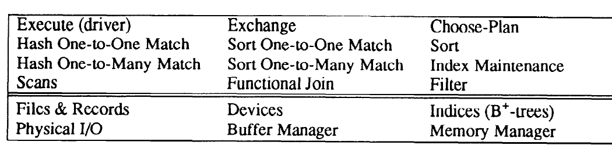
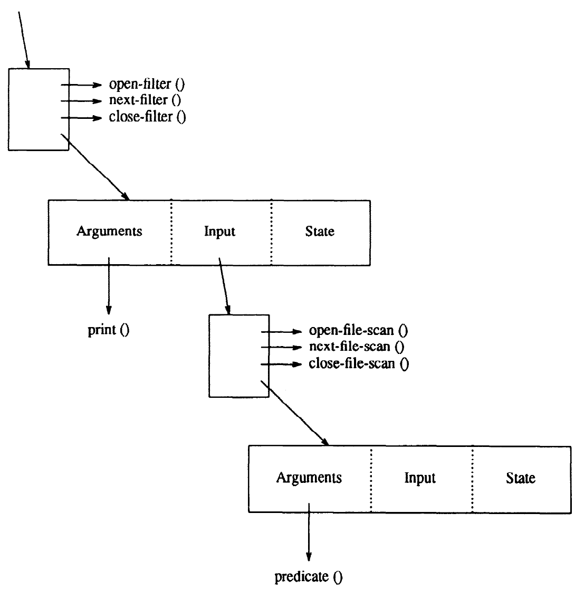
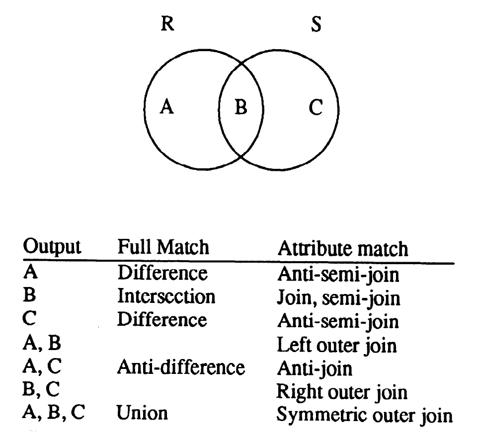
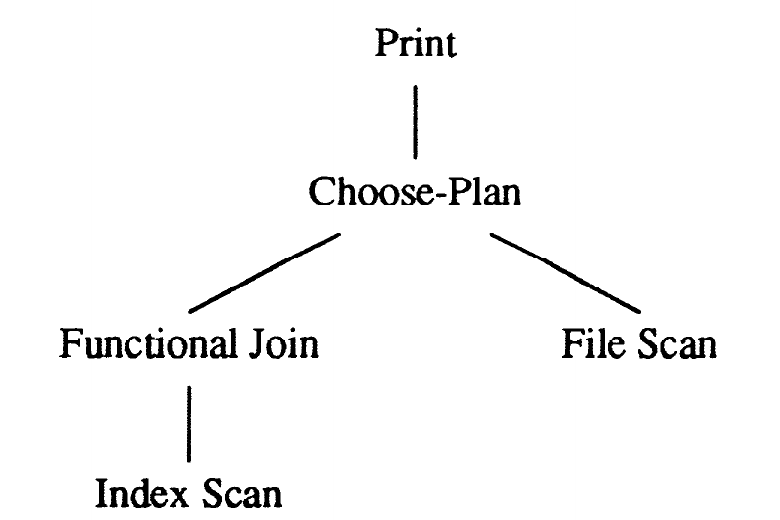
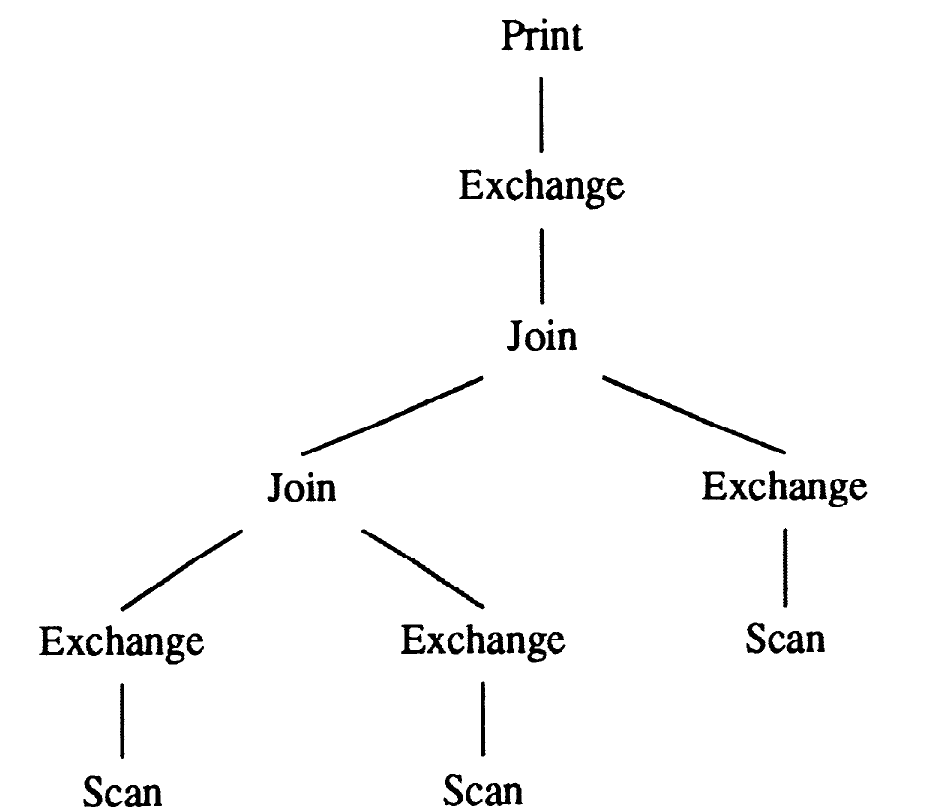
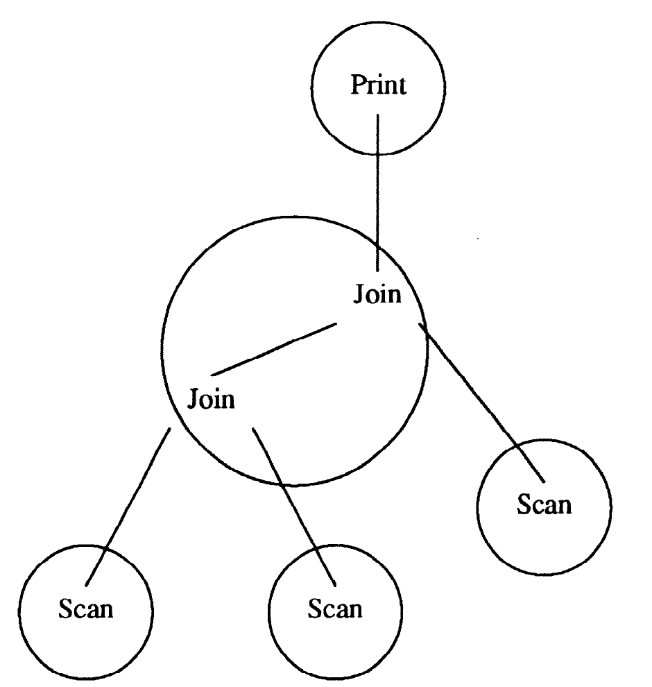
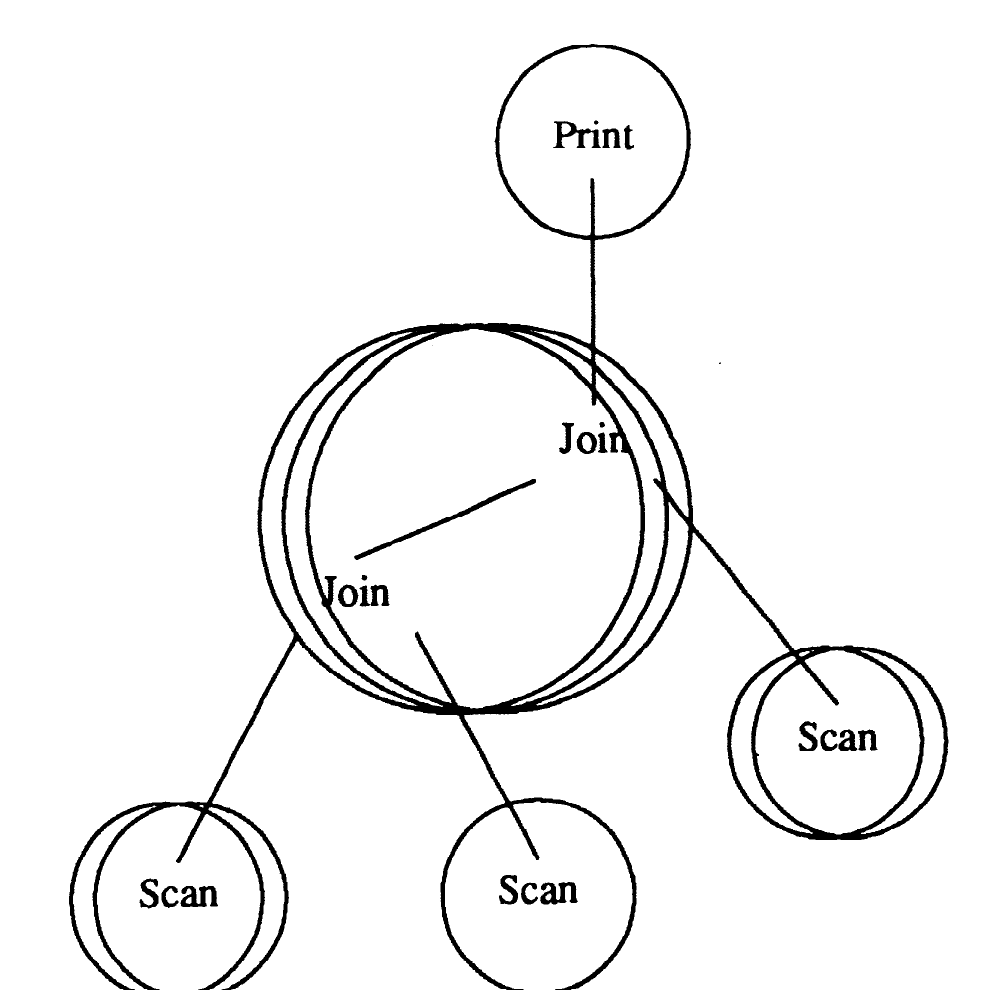

# Volcano—An Extensible and Parallel Query Evaluation System（中文译文）

## 译者说明

本文依据同目录的 `source.pdf` 翻译。章节、图表、公式、算法、代码与参考文献按原文结构保留。

Goetz Graefe

美国俄勒冈州波特兰州立大学计算机科学系，Portland, OR 97207-0751

**出版信息：** *IEEE Transactions on Knowledge and Data Engineering*，第 6 卷第 1 期，1994 年 2 月，第 120–135 页。

**稿件信息：** 1990 年 7 月 26 日收稿；1991 年 9 月 5 日修订。本工作部分得到美国国家科学基金会项目 IRI-8996270、IRI-8912618 和 IRI-9006348，以及俄勒冈先进计算研究所（Oregon Advanced Computing Institute, OACIS）的支持。IEEE 日志编号 9211308。

**版权信息：** 1041-4347/94\$04.00 © 1994 IEEE。

## 摘要

为了研究数据库查询处理中可扩展性与并行性的相互作用，我们开发了一个名为 Volcano 的新型数据流查询执行系统。Volcano 项目为数据库系统设计、查询优化启发式规则、并行查询执行以及资源分配的研究与教学提供了一个内容丰富的环境。

Volcano 在代数操作符之间使用标准接口，从而可以轻松添加新操作符和操作符实现。对单个数据项的操作（例如谓词）通过支持函数（support function）导入查询处理操作符。系统不规定支持函数的语义；任何数据类型（包括复杂对象）与任何操作都可以实现。因此，Volcano 可以扩展新的操作符、算法、数据类型和特定于类型的方法。

Volcano 包含两个新颖的元操作符（meta-operator）。`choose-plan` 元操作符支持动态查询执行计划，使得某些优化决策可以推迟到运行时作出，例如处理带有自由变量的嵌入式查询。`exchange` 元操作符支持分区数据集上的操作符内并行，以及纵向和水平两种操作符间并行，并在进程内的需求驱动数据流与进程间的数据驱动数据流之间进行转换。

除 `exchange` 操作符外，所有操作符都在单进程环境中设计和实现，然后借助 `exchange` 操作符并行化。即使尚未设计的操作符，只要它使用并提供迭代器接口，也能使用这个新操作符并行化。由此，数据操作与并行性问题变得正交，Volcano 也成为第一个有效结合可扩展性与并行性的已实现查询执行引擎。

**索引词：** 动态查询执行计划，可扩展数据库系统，迭代器，并行化的操作符模型，查询执行。

## I. 引言

为了研究数据库查询处理中可扩展性、效率与并行性的相互作用，并为数据库系统研究和教学提供试验平台，我们设计并实现了一个名为 Volcano 的新型查询执行系统。它旨在为查询执行技术和查询优化启发式规则的研究提供实验载体，而非成为一个已可支持应用的数据库系统。它不是完整的数据库系统，因为它缺少用户友好的查询语言、实例类型系统（记录定义）、查询优化器和目录等功能。正因为专注于此，Volcano 才能作为多种开放式用途的实验工具，由此产生一组此前从未在单一系统中整合过的要求。

第一，它必须模块化且可扩展，以支持未来对算法、数据模型、资源分配、并行执行、负载均衡和查询优化启发式规则等课题的研究。因此，Volcano 提供的是实验研究基础设施，而非它本身就是最终的研究原型。第二，它的设计必须简单，以便学生使用和开展研究。模块化和简洁性对此很重要，因为学生无须理解全部设计及其所有细节就能开始项目，同时也可以并行进行多个学生项目。第三，Volcano 的设计不预设任何特定数据模型；唯一假设是查询处理基于使用参数化操作符变换数据项集合。为了实现数据模型无关性，该设计始终如一地将集合处理控制（由 Volcano 操作符提供并内在于其中）与数据项的解释和操作（如后文所述，导入操作符中）分离开来。

第四，它要让算法设计、实现、调试、调优和初步实验不受并行性繁复细节的干扰，同时又允许开展并行查询处理实验。Volcano 既可以用作单进程系统，也可以用作并行系统。单进程查询执行计划已经能在共享内存机器上轻松并行化，不久也将能在分布式内存机器上并行化。第五，Volcano 的查询执行范式必须足够现实，以确保学生了解商用数据库产品真正如何进行查询处理。例如，像大多数教科书建议的那样用临时文件把数据从一个操作传给下一个操作，会带来相当大的性能开销，所以真实数据库系统和 Volcano 都不采用这种做法。最后，Volcano 的并行查询处理手段不能基于现有模型，因为迄今所研究的所有模型都是围绕某个特定数据模型和操作符集来设计的。相反，我们的设计目标是使并行性与数据操作正交：并行查询处理机制与操作符集及其语义无关，而所有操作符（包括新操作符）都能在不考虑未来并行执行的情况下独立设计和实现。

Volcano 遵循了一项已在操作系统研究中成熟、但在大多数数据库系统设计中并未得到利用的原则：提供机制以支持策略。策略可以由人类实验者或查询优化器设定。机制与策略的分离促成了现代操作系统的可扩展性和模块化，对可扩展数据库系统也可能作出同样的贡献。我们将在本文中反复回到这种分离。

由于 Volcano 的目的本就是允许未来扩展和开展研究，它一直在持续修改和扩展。最重要的近期扩展之一，是设计并实现了两个元操作符。它们不仅是新操作符，还体现并封装了查询处理的新概念。之所以称为元操作符，是因为它们不执行数据操作、选择、派生等工作，而是为查询处理提供额外控制；这种控制无法由文件扫描、排序和归并连接等常规操作符提供。

`choose-plan` 操作符实现了动态查询执行计划；这是为必须在信息不完整时优化的查询而开发的概念 [17]。例如，如果查询谓词中的某个常量实际上是程序变量，因而在编译和优化期间尚不可知，就无法可靠地优化这个嵌入式查询。动态计划允许为多个等价计划提前做好准备，每个计划都针对实际参数值的某个范围最优。`choose-plan` 操作符在运行时从这些计划中作出选择，而 Volcano 操作符集中的其他所有操作符（无论现有还是未来的）都完全不知道 `choose-plan` 操作符的存在和作用。

第二个元操作符 `exchange` 在 Volcano 中实现并控制并行查询执行。操作符无需 `exchange` 也能交换数据；实际上，在同一进程内这只需一次过程调用。这个新操作符则能跨越进程和处理器边界交换数据。其他所有操作符的实现和执行都不考虑并行性；分区、流控制等所有并行性问题都由 `exchange` 操作符封装和提供。因此，在 Volcano 中，数据操作与并行性确实正交 [20]。除了从软件工程角度看很整洁以外，还令人鼓舞地看到，这种查询处理引擎并行化方法确实能够实现线性或近线性加速 [18]。

本文是一篇总体概述，介绍 Volcano 的整体目标和设计原则。其他关于 Volcano 的文章分别讨论了该系统的专门方面，例如 [16]–[21]、[25]、[26]。这些文章还包含对 Volcano 技术和算法的实验性能评估，特别是 [18]、[21]。

本文结构如下。下一节，我们简要回顾影响 Volcano 设计的早期工作。第 III 节详细描述 Volcano。第 IV 节讨论系统的可扩展性。第 V 节介绍动态查询执行计划及其实现。第 VI 节描述封装在 `exchange` 模块中的并行处理。第 VII 节总结本项工作并给出我们的结论。

## II. 相关工作

由于已有大量系统用于高效处理大型数据集，我们只回顾那些对 Volcano 设计产生重大影响的系统。我们的工作最主要受到 WiSS、GAMMA 和 EXODUS 的影响。Wisconsin Storage System（WiSS）[10] 是一个面向记录的文件系统，提供堆文件、B-tree 与哈希索引、缓冲，以及带谓词的扫描。GAMMA [11] 是一台软件数据库机，在若干通用 CPU 上运行，作为某台 UNIX 主机的后端。它最初建在 17 台 VAX 11/750 上，各节点及 VAX 11/750 主机通过 80 Mb/s 令牌环互连。其中 8 个 GAMMA 处理器拥有本地磁盘设备，并通过 WiSS 访问。这些磁盘只能在本地访问，更新和选择操作符也只使用这 8 个处理器。其他无盘处理器用于连接处理。近期，GAMMA 软件已被移植到一台具有 32 个节点的 Intel iPSC/2 超立方上，每个节点都有本地磁盘驱动器。GAMMA 广泛使用基于哈希的算法；其实现方式是，每个操作符都在多个（通常是全部）处理器上执行，而每个操作符的输入流都按某个哈希函数被分区为互不相交的集合。

GAMMA 的数据模型和可扩展性有限，促使人们寻找一种更灵活但同样强大的查询处理模型。GAMMA 数据库机软件的操作符设计使每个操作符在自己的进程中掌握控制权，并由网络和操作系统软件使用流控制机制同步处于生产者—消费者关系中的多个操作符。这种设计在 GAMMA 中效果极佳，却不适合单进程查询执行，因为如果不使用线程等特殊的伪多进程机制，就无法在单一进程内实现多个控制点（即多个操作符）。因此，GAMMA 的操作符和数据传输概念不适合一个既面向顺序查询执行、又面向并行查询执行的高效查询处理引擎。

EXODUS [7] 是一个可扩展数据库系统。它的一些组件采用“工具包”方法，例如优化器生成器 [13]、[14] 和 E 数据库实现语言 [27]、[28]；其他组件则是强大但固定的组件，例如存储管理器 [5]。EXODUS 原本被设想为与数据模型无关，即支持多种数据模型；但后来开发了一种名为 Extra 的新颖、强大、结构化面向对象数据模型 [6]。EXODUS 最早探索的数据模型无关性概念被 Volcano 项目及其软件设计和实现保留了下来。在设计 EXODUS 存储管理器时，WiSS 和 GAMMA 中研究过的许多存储与访问问题都被重新检视。这些讨论中积累的经验和探索的权衡无疑帮助形成了 Volcano 背后的思想。E 的设计和开发则影响了 Volcano 对查询处理迭代器的强调。

其他一些传统（关系）系统和可扩展系统也影响了我们的设计。Ingres [32] 和 System R [9] 可能影响了大多数数据库系统，特别是其后续的可扩展项目 Starburst [23] 和 Postgres [35]。值得注意的是，与我们的工作相互独立地，Starburst 团队在 System R 关系系统中成功使用需求驱动迭代器范式后，也将它识别为可扩展单进程查询执行架构的合适基础，但迄今尚未能将可扩展性与并行性结合。GENESIS [1] 很早就强调了统一操作符接口对可扩展性和软件复用的重要性。

XPRS 是第一个旨在结合可扩展性和并行性的项目 [34]。它的基本前提是在 RAID 磁盘阵列和 Sprite 操作系统之上实现 Postgres。XPRS 和 GAMMA 基本有四点不同。第一，GAMMA 支持纯关系数据模型，而 XPRS 支持可扩展关系模型 Postgres。第二，GAMMA 的主要并行形式是基于分区数据集的操作符内并行；XPRS 则依靠稠密树（bushy）并行，即复杂查询执行计划中不同子树的并发执行。第三，GAMMA 在连接和聚合中大量依赖哈希，而 XPRS 将主要采用基于排序的查询处理引擎 [33]。第四，GAMMA 建立在“要获得可扩展的线性加速，就必须使用分布式内存”这一前提上，而 XPRS 则正在共享内存机器上实现。

XPRS 和 Volcano 都结合了并行性与可扩展性，但 XPRS 是比 Volcano 全面得多的项目。尤其是，XPRS 包含一个数据模型和一个查询优化器。另一方面，Volcano 正是因为不预设数据模型而具有更强的可扩展性。因此，Volcano 可以在 XPRS 这样的并行可扩展关系系统中用作查询处理引擎。此外，它最终将包含一个与数据模型无关的优化器生成器，形成完整的查询处理研究环境。

## III. Volcano 系统设计

本节中，我们概述 Volcano 的设计。目前，Volcano 是一个由大约两打模块组成、共约 15,000 行 C 代码的库。这些模块包括文件系统、缓冲管理、排序、B+ 树，以及自然连接、半连接、三种外连接、反连接、聚合、去重、并集、交集、差集、反差集和关系除法各自的两种算法（一种基于排序，一种基于哈希）。此外，另有两个模块实现动态查询执行计划，并支持上述所有算法的并行处理。

对单条记录的所有操作都被刻意留待后续定义。Volcano 没有发明一种语言来指定选择谓词、哈希函数等，而是把函数传给查询处理操作符，由操作符在需要时使用合适的参数调用它们。后文将更详细地介绍这些支持函数。Volcano 设计中一个反复出现的共同主题是：它为查询执行提供机制，从而可以选择策略并对策略进行实验。机制与策略的分离是操作系统设计与实现中众所周知、根基深厚的原则，但在数据库系统设计与实现中并未如此广泛而一致地使用。这一原则极大促进了现代操作系统的可扩展性和模块化，对可扩展数据库系统也可能作出同样的贡献。

当前，Volcano 由两层构成：文件系统层和查询处理层。前者提供记录、文件和索引操作（包括带可选谓词的扫描）以及缓冲；后者是一组可嵌套的查询处理模块，用于构建复杂查询执行树。图 1 给出 Volcano 的主要模块。大多数查询执行系统都有这种分层，例如 System R [9] 的 RSS 和 RDS，以及 Starburst [23] 的 Core 和 Corona。Volcano 不包含系统目录或数据字典，因为该系统的设计目标是可扩展并与任何特定数据模型无关。我们将自底向上展开描述：先讲文件系统，再讨论查询处理模块。

**图 1：Volcano 的主要模块。**

### A. 文件系统

在讨论 Volcano 文件系统时，我们同样按照自底向上的顺序，从缓冲管理讲到数据文件和索引。现有设施旨在为查询处理系统提供骨架，其设计使得可在需要时轻松完成修改和增补。

缓冲管理器是文件系统中最有趣的部分。缓冲管理在任何数据库系统中都对性能至关重要，因此 Volcano 缓冲管理器被设计为包含能在多种上下文和多种策略下高效发挥作用的机制。所以，它的功能包括多个缓冲池，在 Volcano 中称为簇（cluster）的可变长缓冲单元，以及来自上一层软件的替换提示。

缓冲管理器的提示功能是 Volcano “实现机制以支持多种策略”设计原则的绝佳例子。缓冲管理器只提供机制，即固定（pinning）、页面替换以及磁盘页的读写；上层软件则根据数据语义、重要性和访问模式决定策略。数据库缓冲管理器居然会根据已观测到的引用行为做出替换决策，这令人惊讶：因为这种行为是由更高层的数据库软件产生的，因此在同一系统内（尽管属于不同子组件）是预先已知且可预见的。

文件由记录、簇和区段（extent）组成。文件操作在任何数据库系统中都会被频繁调用，因此文件模块的所有设计决策都以在可能达到的最高性能下提供基本功能为目标。簇由一个或多个页组成，是前文所述的 I/O 与缓冲单元。每个文件可以单独设置簇大小，因此同一设备上的不同文件可以使用不同的簇大小。文件的磁盘空间以物理连续区段的形式分配，因为这种区段支持无寻道的快速扫描，以及大块预读和延迟写。

记录由记录标识符（record identifier, RID）标识，可以使用 RID 直接访问。为了快速访问大量记录，Volcano 不仅支持单独的文件和记录操作，还支持具有“读取下一条”和追加操作的扫描。文件扫描有两套接口：一套属于文件系统，马上介绍；另一套属于查询处理层，后文介绍。第一套接口提供文件扫描的标准过程：`open`、`next`、`close` 和 `rewind`。`next` 过程返回下一条记录的主存地址。在对该扫描调用下一个操作之前，系统保证该地址被固定。因此，获取同一簇内的下一条记录无需调用缓冲管理器，效率很高。

为了快速创建文件，扫描支持 `append` 操作。它会分配一个新记录槽，并返回该新槽的主存地址。调用者负责将有用信息填入系统提供的记录空间；也就是说，`append` 例程完全不了解数据及其表示。

扫描还支持可选谓词。`next` 过程会使用一个参数和一个记录地址调用谓词函数。选择性扫描是引言中简要提及的支持函数的第一个例子。扫描机制不自己判定限定条件，而是依赖从更高层导入的谓词函数。

支持函数以函数入口点和一个充当谓词参数的无类型指针的形式传给某个操作。支持函数的参数有两种用法，分别对应编译式和解释式查询执行。在编译式扫描中，即谓词求值函数可以机器码形式使用时，该参数可向谓词函数传递一个常量或指向多个常量的指针。例如，如果谓词是比较某个记录字段和一个字符串，就把比较函数作为谓词函数传入，把搜索字符串作为谓词参数传入。在解释式扫描中，即使用通用解释器对查询中的所有谓词求值时，可用这些参数把适当的代码传给解释器，而解释器入口点作为谓词函数传入。因此，一个简单而高效的机制就能同时支持解释式和编译式扫描。Volcano 使用支持函数及其参数的方式，又是一个由机制将策略决策留给上层软件的例子；此处留待决定的策略就是使用编译式还是解释式扫描。

目前，索引只实现为接口与文件类似的 B+ 树。叶子项由键和信息组成。信息部分通常是 RID，但也可以包含更多或不同的信息。键和信息可以是任何类型；必须提供比较函数来比较键。该比较函数使用一个与前述扫描谓词参数等价的参数。允许叶子中存放任意信息，可以在物理数据库设计中提供更多选择。这是 Volcano 通过提供机制来支持多种设计和使用策略的又一个例子。B+ 树支持与文件类似的扫描，包括用于快速加载的谓词和追加操作。此外，B+ 树扫描还允许定位到特定键，并设置上界与下界。

对于查询处理的中间结果（后文称为流，stream），Volcano 使用称为虚拟设备的特殊设备。虚拟设备与磁盘设备的差别是，虚拟设备的数据页只存在于缓冲区中。这些数据页一旦被取消固定，就会消失且丢失其内容。因此，Volcano 对持久数据集和中间数据集使用相同的机制和函数调用，极大简化了新操作符的实现。

总之，Volcano 文件系统的许多目标都很传统，但实现方式灵活、高效且紧凑。文件系统支持设备、文件、记录、B+ 树和扫描等基本抽象与操作。它提供访问这些对象的机制，把许多策略决策留给上层软件。高性能是这些机制设计与实现时的一项重要目标，因为只有底层机制高效，性能研究和并行化才有意义。此外，只有在使用高效执行平台的情况下，对可扩展数据库系统和新数据模型的实现及性能权衡展开的研究才有意义。

### B. 查询处理

查询处理例程利用上文介绍的文件系统例程对复杂查询求值。查询表示为查询计划或代数表达式；这种代数的操作符就是查询处理算法，我们称之为可执行代数，以区别于关系代数等逻辑代数。我们将使用关系术语描述这些操作，希望这有助于读者理解。不过，我们必须指出，这些操作可以被视为集合上的对象操作，也确实是这样实现的；Volcano 不假设这些对象的内部结构。实际上，我们打算在一个面向对象数据库系统中使用 Volcano 进行查询处理 [15]。这种用法的关键在于，Volcano 把集合处理与数据项解释分离开来。

在 Volcano 中，所有代数操作符都实现为迭代器，即它们支持简单的 `open-next-close` 协议。从根本上说，迭代器提供循环的迭代部分，包括初始化、递增、循环终止条件和最后的收尾工作。这些函数允许像遍历传统文件扫描的结果一样，对任何操作的结果进行“迭代”。每个迭代器都关联一种状态记录类型。状态记录包含参数（例如要在 `open` 过程中分配的哈希表大小）和状态（例如哈希表的位置）。迭代器的所有状态信息都保存在它的状态记录中，不使用“静态”变量。因此，只需在查询中包含多条状态记录，同一算法就能在一个查询中使用多次。

对数据对象的一切操作和解释（例如比较与哈希）都作为指向合适支持函数入口点的指针传给迭代器。每个支持函数都使用一个参数，从而像前文针对文件扫描谓词所介绍的那样，支持解释式或编译式查询执行。没有支持函数，Volcano 迭代器就只是空的算法外壳，无法完成任何有用工作。从效果上看，将系统拆分为算法外壳和支持函数，使得集合上的控制与迭代同记录或对象的解释分离。这种分离是 Volcano 实现数据模型无关性和可扩展性的基石之一，第 IV 节将讨论这一点。

迭代器可以嵌套，并像协程一样工作。状态记录通过输入指针互相链接，输入指针也保存在状态记录中。图 2 展示了查询执行计划中的两个操作符。稍后将讨论 `filter` 操作符的目的和能力；它的一种可能功能是，利用作为参数传给 `filter` 操作符的函数，打印流中的数据项。图中顶部的结构既能访问函数，也能访问状态记录。使用指向该结构的指针，可调用 `filter` 函数，并将它们的局部状态作为过程参数传入。这些函数本身（例如 `open-filter`）可使用状态记录中的输入指针调用输入操作符的函数。因此，`filter` 函数可在需要时调用文件扫描函数，并按 `filter` 的需要控制文件扫描的速度。换言之，图 2 展示了一个从文件中选出记录并打印的完整查询执行计划。

**图 2：查询执行计划中的两个操作符。**

使用 Volcano 的标准迭代器形式时，一个操作符无需知道产生其输入的是什么操作符，也无需知道其输入来自复杂查询树还是简单文件扫描。我们称这一概念为匿名输入，也称为流。流是一种简单却强大的抽象，可以组合任意数量、任意种类的操作符对复杂查询求值，它是 Volcano 可扩展性的第二块基石。流与迭代器控制范式结合后，在时间（同步操作符的开销）和空间（必须同时常驻内存的记录数）两方面，代表了单进程查询执行的最高效执行模型。

对最顶层操作符调用 `open`，会实例化对应状态记录的状态（例如分配哈希表），并对所有输入调用 `open`。这样，查询中的所有迭代器都会被递归启动。为了处理查询，要反复调用最顶层操作符的 `next`，直到它返回流结束指示符而失败。最顶层操作符如果需要更多输入数据来产生输出记录，就会调用其输入的 `next` 过程。最后，`close` 调用递归“关停”查询中的所有迭代器。这种查询执行模型与 EXODUS 的 E 数据库实现语言和 Starburst 关系数据库系统的查询执行器中所包含的模型非常相似。

查询和环境的多种参数可能影响打开查询执行计划时的策略决策，例如查询谓词中的常量和系统负载信息。在 Volcano 中，这些参数通过一个名为 `bindings` 的参数在所有 `open` 过程之间传递。它是一个无类型指针，可用于传递策略决策所需信息。这些策略决策同样通过支持函数实现。例如，哈希连接实现模块允许动态确定哈希表大小，这又是一个机制与策略分离的例子。`bindings` 参数对动态查询执行计划尤其有用，第 V 节将讨论这种计划。

树形查询执行计划通过需求驱动数据流来执行查询。`next` 操作的返回值除了状态指示符外，还包含一个名为 `Next-Record` 的结构，由一个 RID 和一个指向缓冲池中记录的地址组成。该记录在缓冲区中被固定。固定与取消固定记录的协议如下：任何时刻，缓冲区中每个被固定的记录都恰好归一个操作符所有。操作符收到记录后，可以暂时保留它（例如放入哈希表），可以取消其固定（例如谓词不成立时），也可以把它传给下一个操作符。连接等会创建新记录的复杂操作，必须先在缓冲区中固定其输出记录，再将其传出，同时还必须取消输入记录的固定。这可能导致大量缓冲区调用（查询中每个操作符都要对每条记录调用一次），因此缓冲管理器接口近期被重新设计：无论一个簇包含多少记录，在过程端（例如文件扫描）每个簇合计只需两次缓冲区调用，在消费者端每个簇只需一次缓冲区调用。

一个 `Next-Record` 结构只能指向一条记录。当前已实现的所有查询处理算法都在操作符之间传递完整记录；例如，连接会从两条输入记录复制字段，生成新的完整记录。可以认为，创建完整新记录并在操作符之间传递的开销高到难以接受。一种替代方案是，让原始记录保持从存储数据取回后在缓冲区中的状态，并把 `Next-Record` 对、三元组等组合成中间结果。这个方案的内存到内存复制更少，但 Volcano 没有显式实现它，因为系统已经提供了必需机制：下一小节将介绍的 `filter` 迭代器可以把流中的每条记录替换为 RID—指针对，也可以反向替换。

总之，Volcano 通过将操作符编码为具有 `open`、`next` 和 `close` 过程的迭代器，实现需求驱动数据流；这种方案具有通用性、可扩展性、高效性与低开销。下面几节将更详细地介绍 Volcano 现有的一些迭代器。这些操作符只用极少数量的模块，就凭借通用性以及机制与策略的分离，提供了其他查询执行系统的大部分功能。此外，将集合处理控制（迭代）与数据项的解释和操作分离，使这些功能与任何数据模型无关。

#### 1）扫描、函数连接与过滤器

第一套扫描接口已随文件系统介绍。第二套扫描接口同时面向文件扫描和 B+ 树扫描，它提供适合查询处理的迭代器接口。`open` 过程打开文件或 B+ 树，并使用文件系统层的扫描过程启动扫描。状态记录中保存文件名或已打开的文件描述符，以及一个可选谓词和 B+ 树扫描的边界。因此，两套扫描接口在功能上等价。区别在于，文件系统扫描接口由各种内部模块使用，例如设备模块用它扫描设备目录；迭代器接口则用来为查询执行计划提供叶子操作符。

通常，B+ 树索引的叶子中保存键和 RID。要使用 B+ 树索引，必须从数据文件中取回记录。在 Volcano 中，这个查找操作与 B+ 树扫描迭代器分离，由函数连接（functional join）操作符执行。该操作符需要一条包含 RID 的记录流作为输入，然后输出使用 RID 取回的记录，或者用输入记录和取回的记录组成新记录，由此“连接” B+ 树条目与对应数据记录。

之所以分离 B+ 树扫描和函数连接，有几个原因。第一，并不能肯定把数据存入 B+ 树叶子永远都不是好主意；有时可能希望尝试让查找键关联其他类型的信息。第二，这种分离可以支持针对复杂查询操作 RID 列表的实验。第三，当前函数连接的实现相当简单，但该操作可以变得更智能，用于递归组装复杂对象。总之，将索引搜索与记录取回分离，是 Volcano 提供机制来支持策略实验的又一个例子；这一设计原则用于确保 Volcano 软件灵活而可扩展。

上文示例中使用的 `filter` 操作符可执行三种功能，具体取决于状态记录中是否存在对应的支持函数。`predicate` 函数应用选择谓词，例如实现位向量过滤。`transform` 函数根据每条旧记录创建一条新记录，而且通常是新类型的记录；关系投影（不去重）就是一个例子。更复杂的例子包括压缩与解压，其他编码和表示形式的变换，以及把记录流简化为 RID—指针对。最后，为获得副作用，`apply` 函数会对每条记录调用一次。典型例子包括更新和打印。请注意，更新是在流和查询执行计划内完成的。因此，Volcano 计划不仅是检索计划，也是更新计划。

`filter` 操作符也称为“副作用操作符”。创建位向量过滤器是另一个例子。换言之，`filter` 是一种用途多样的单输入、单输出操作符。位向量过滤展示了策略与机制分离的一个特例：不要提供可以用现有操作轻松高效组合得到的操作。

#### 2）一对一匹配

一对一匹配操作符和 `filter` 操作符很可能会成为 Volcano 中最常用的查询处理操作符，因为它实现了多种集合匹配功能。它用单一操作符实现连接、半连接、外连接、反连接、交集、并集、差集、反差集、聚合与去重。一对一匹配操作符是排序一类的物理操作符，即可执行代数的一部分，而不是关系代数操作符一类的逻辑操作符。所有根据一对数据项的比较结果决定是否把某个数据项包含在输出中的操作，都由该操作符实现。

图 3 展示了二元操作的一对一匹配操作符所依据的基本原理：将图中分别称为 R 和 S 的两个集合中匹配与不匹配的部分分离，并产生合适的子集；在连接等情况下，还可能先进行某种变换与组合。所有这些操作所需的基本步骤都相同，因此把它们实现在同一个通用高效模块中是合理的。一元操作与二元操作的主要差别在于，前者（例如聚合函数）需要比较同一输入中的数据项，后者（例如等值连接）则需要比较两个不同输入中的数据项。

**图 3：二元一对一匹配。**

| 输出区域 | 完全匹配 | 属性匹配 |
| --- | --- | --- |
| A | 差集 | 反半连接 |
| B | 交集 | 连接、半连接 |
| C | 差集 | 反半连接 |
| A, B | — | 左外连接 |
| A, C | 反差集 | 反连接 |
| B, C | — | 右外连接 |
| A, B, C | 并集 | 对称外连接 |

Volcano 一对一匹配的实现与数据模型无关，而对数据项的所有操作又都通过支持函数导入，所以该模块不受关系模型限制，能针对任意数据类型完成集合匹配功能。此外，基于哈希的版本提供递归哈希表溢出避免 [12] 和类似混合哈希连接 [31] 的溢出解决方法，因而可以处理非常大的输入。基于排序的一对一匹配版本则以外排序操作符为基础，同样可以处理任意大的输入。

虽然连接算法似乎很多，但我们的可扩展性和限制系统大小设计目标，促使 Volcano 目前只选择实现两种算法：归并连接和混合哈希连接。这一选择还将支持针对基于排序与基于哈希的查询处理算法之间的对偶性和权衡开展实验研究。

经典哈希连接算法（即混合哈希连接的内存内组件）分两个阶段进行。第一阶段使用一路输入构建哈希表，因而称为构建阶段。第二阶段使用另一路输入的元组探测哈希表，以判定匹配并组成输出元组，因而称为探测阶段。经典算法在探测阶段之后丢弃哈希表及其条目。而我们的一对一匹配操作符使用称为刷出（flush）阶段的第三阶段，聚合函数和某些其他操作需要它。

一对一匹配操作符与所有 Volcano 操作符一样都是迭代器，因此三个阶段被分配到 `open`、`next` 和 `close` 函数上。`open` 包含构建阶段，另外两个阶段都包含在 `next` 函数中。当第二路输入耗尽时，连续调用 `next` 函数会自动从探测阶段切换到刷出阶段。

构建阶段可用于去重，也可用于对构建输入执行聚合函数。一对一匹配模块并不强制要求探测输入；如果只需要聚合而无需后续连接，状态记录中没有探测输入就会向模块发出跳过探测阶段的信号。对于聚合，不是像经典哈希连接那样将新元组插入哈希表，而是先将输入元组与其候选哈希桶中的元组匹配。如果找到匹配，就丢弃新元组，或者把其值聚合到现有元组中。

内存中的哈希表通常很快，但如果构建输入无法装入内存，就会出现严重问题，这种情况称为哈希表溢出。哈希表溢出有两种处理方法。第一，如果使用查询优化器且它能预见溢出，就可通过对输入分区来避免溢出。这种溢出避免技术是 Grace 数据库机所用哈希连接算法的基础 [12]。第二，可以在问题发生后使用溢出解决方法创建溢出文件。

对于 Volcano 的一对一匹配，我们采用混合哈希连接。同 GAMMA 使用的混合哈希算法相比，我们的溢出解决方案有几项改进。数据项可以不经复制直接插入哈希表；也就是说，哈希表直接指向一对一匹配的构建输入在缓冲区中产生的记录。但是，如果输入数据项排布得不紧密，可用缓冲内存可能会迅速填满。因此，一对一匹配操作符有一个名为紧凑化阈值（packing threshold）的参数。当哈希表中的数据项数达到该阈值时，它们会被紧密地打包到溢出文件中。不过，这些溢出文件的簇（页）此时尚未在缓冲区中取消固定，即尚未发生 I/O。只有当哈希表中的数据项数达到第二个阈值（称为溢写阈值，spilling threshold）时，第一个分区文件才会被取消固定。该文件的簇被写入磁盘，哈希表中的数据项计数也随之减少。当计数再次达到溢写阈值时，下一个分区被取消固定，依此类推。如有必要，还会递归执行分区，并自动调整紧凑化阈值和溢写阈值。哈希表中未使用的部分，即对应已溢写哈希桶的部分，被用于位向量过滤，以减少对溢出文件的 I/O。

第一步分区的扇出由总可用内存减去达到紧凑化阈值所需的内存来决定。通过选择紧凑化和溢写阈值，查询优化器可以对较小的构建输入完全避免记录复制，对非常大的构建输入指定溢出避免（以及最大扇出），或根据预期的构建输入大小来确定这两个阈值。实际上，如果输入由具有一定复杂度的表达式产生，就无法精确估计其大小，所以优化器可以根据输入大小的估计概率分布调整紧凑化与溢写阈值。例如，如果溢出可能性很低，最好把紧凑化阈值设得很高，使操作很可能可以不经复制继续执行。反之，如果溢出可能性较高，就应把紧凑化阈值设得较低，以获得更大的分区扇出。

初始紧凑化阈值和溢写阈值可以都设为零；此时，Volcano 的一对一匹配执行的溢出避免与 Grace 数据库机中的连接算法非常相似。除了参数化溢出避免与解决外，Volcano 的一对一匹配算法还支持与排序 [4]、[21] 和非均匀哈希值分布中所用方法类似的簇大小与递归深度优化，并能处理含可变长记录的输入。

将以上模块扩展到集合操作，始于这样一项观察：两个并相容关系的交集与这两个关系的自然连接相同，而且最适合实现为半连接。并集是并相容关系的（双边）外连接。两个集合的差集和反差集可通过对算法的各种功能进行特殊设置来计算。最后，通过成功匹配两路输入数据项的所有可能数对，就可实现笛卡尔积。

一对一匹配的第二种版本以排序为基础，包含两个模块：基于磁盘的归并排序和真正的归并连接。归并连接与哈希连接以类似方式泛化，以支持半连接、外连接、反连接和集合操作。排序操作符的实现既使用、也提供迭代器接口。打开排序迭代器时，会为归并准备排好序的段。如果段数超过最大扇入，就先把它们归并为更大的段，直到剩余段能一步归并。最终归并由 `next` 函数按需完成。如果全部输入都能装入排序缓冲区，就一直保留在其中，直到 `next` 函数取用。排序操作符还支持聚合与去重，而且可以在写临时文件时提前执行这些操作 [2]。[21] 对该排序算法进行了详细描述和评估。

总之，Volcano 的一对一匹配操作符是其查询执行代数中非常强大的组件。通过将集合操作所需的控制与单个数据项的解释和操作分离，它能执行数据库查询处理中经常使用的多种集合匹配任务，且能针对任意数据类型和数据模型执行这些任务。在溢出管理中分离机制与策略，既支持溢出避免，也支持混合哈希溢出解决，并可在需要时对两者递归应用。以可比方式实现基于排序和基于哈希的算法，将使人们能针对两类查询处理算法之间的对偶性和权衡开展有意义的实验研究。迭代器接口保证一对一匹配操作符可以轻松与其他操作组合，其中包括尚未设计的新迭代器。

#### 3）一对多匹配

一对一匹配操作符根据两个数据项的相互比较决定是否将某个数据项包含在输出中，而一对多匹配操作符则把每个数据项与多个其他数据项比较，以确定是否应产生新数据项。一个典型例子是关系除法，即与关系演算中全称量词对应的关系代数操作符。Volcano 中有两种关系除法。第一种称为原生除法（native division），它基于排序。第二种称为哈希除法（hash-division），它使用两个哈希表：一个建在除数上，另一个建在商上。[16] 精确描述了这两种算法和基于聚合函数的替代算法，还给出了分析与实验性能比较，并详细讨论了哈希表溢出的两种分区策略以及多处理器实现。我们目前正在研究如何以可与聚合和连接泛化相比的方式泛化这些算法，例如实现多数（majority）函数 [8]。

## IV. 可扩展性

许多数据库研究项目都致力于可扩展性，例如 EXODUS、GENESIS、Postgres、Starburst、DASDBS [30]、Cactis [24] 等。Volcano 是一种非常开放的查询执行架构，易于扩展。下面让我们考察几种经常被提议的数据库扩展，以及 Volcano 如何容纳它们。

第一，扩展对象类型系统时，例如添加 `date` 或 `box` 这样的新抽象数据类型（ADT），Volcano 软件完全不受影响，因为它不提供对象类型系统。对单个对象的所有操作和基于对象的计算都由支持函数完成。在某种程度上，Volcano 并不完整（它不是数据库系统）；但它把集合处理与实例解释分离，并在两者之间提供定义良好的接口，所以在实例类型和语义层面天然可扩展。

一般来说，使用某个 `next` 迭代器过程在操作符之间传递的数据项是记录。对可扩展或面向对象数据库系统来说，这会构成一个无法接受的问题和限制。Volcano 将采用的解决方法是：把必要的组件记录加载并固定到缓冲区中，适当转换记录间指针之后，只在操作符之间传递根组件（记录）。非常简单的对象可以在 Volcano 中通过函数连接操作符组装。面向对象或非第一范式数据库系统需要泛化该操作符，但可以毫不困难地把这种泛化纳入 Volcano。实际上，用于 REVELATION 面向对象数据库系统项目 [15] 的这种组装操作符原型已经建成 [26]。

第二，如果要向数据库和查询处理系统添加面向单个对象的新函数或聚合函数（例如几何平均数），只需要相应的支持函数，并把它传给查询处理例程。换言之，只要接口和返回值正确，查询处理例程就不受支持函数语义的影响。Volcano 软件之所以不受面向单个对象功能扩展的影响，是因为它只提供使用流处理对象集合并对其排序的抽象和实现，而解释与操作单个对象的能力则以支持函数的形式导入。

第三，要引入新的访问方法，例如以 R-tree [22] 形式实现的多维索引，必须定义合适的迭代器。请注意，不仅检索适合实现为迭代器，存储结构的维护也一样。例如，如果要更新一组由谓词（选择）定义的数据项，实现该选择的迭代器或查询树就可把数据“喂给”维护迭代器。喂给维护操作符的数据项应包含对要更新的存储结构部分的引用（例如 RID 或键），如果新值已在选择中计算出，还应包含适当的新值（例如由旧工资计算新工资）。使用嵌套迭代器（即查询执行计划），可以高效地组织并执行对多个结构（多个索引）的更新。此外，如果像 B-tree 那样可通过排序提高维护效率，就可轻松在计划中加入有序或排序迭代器。也就是说，不应只把计划看成用于检索的查询计划，还应把它看成“更新计划”，或检索计划与更新计划的组合。流的概念非常开放；其中，匿名输入尤其使现有查询处理模块与新迭代器互相隔离。

第四，要在 Volcano 中加入新查询处理算法，例如嵌套关系的传递闭包或嵌套与取消嵌套操作算法，必须按迭代器范式对算法编码。换言之，算法实现必须提供 `open`、`next` 和 `close` 过程，并对其输入流使用这些过程。算法转换成这种形式后，将它集成进 Volcano 非常简单。实际上，随着 Volcano 查询处理软件变得更复杂、更完整，这种做法已使用多次。例如，添加一对多匹配或除法操作符 [16] 时完全无需关心其他操作符；当早期仅支持内存的基于哈希的一对一匹配版本，被替换为上文所述的带溢出管理版本时，其他操作符和元操作符均无需改动。最后，Volcano 近期还加入了一个复杂对象组装操作符 [26]。

可扩展性还可以从不同上下文中考察。从长期看，显然有必要提供交互式前端，使 Volcano 更易用。我们目前正在开发两个前端：一个是基于 Volcano 可执行代数的未优化命令解释器；另一个是基于逻辑代数或演算语言的优化前端，其查询优化由新的优化器生成器实现。优化器产生的计划与 Volcano 之间的翻译，将由一个“遍历”优化器产生的查询执行计划与 Volcano 计划（即状态记录、支持函数等）的模块完成。我们还将利用优化前端对下一节概述的动态查询执行计划进行实验。

总之，Volcano 设计高度模块化，因而自然提供可扩展性。可能有人会认为，这只是因为 Volcano 没有处理可扩展性中的难题；但这种论点站不住脚。Volcano 只是数据库系统的一个组件，即查询执行引擎。因此，它处理的是可扩展性问题的一个子集，忽略的是另一个子集。作为查询处理引擎，它为自己的查询处理算法集提供可扩展性，而其方式与优化器生成器所提供的可扩展性非常匹配。它不提供类型系统和支持函数类型检查等其他数据库服务与抽象，因为它并不是可扩展数据库系统。Volcano 例程假设查询执行计划及其支持函数是正确的。它们的正确性必须在调用 Volcano 前得到保证，这与数据库系统“尽可能在最高层级确保正确性”的通用概念完全一致；也就是说，应在解析用户查询后尽快完成。

Volcano 作为可扩展查询执行系统的意义在于，它为高效查询处理提供了一组简单但非常有用、非常强大的机制，而且既可以、也确已被当作灵活的研究工具使用。它的强大不仅来自按照少数一致的设计原则进行实现，也来自下面两节将介绍的两个元操作符。

## V. 动态查询执行计划

在大多数数据库系统中，嵌入传统编程语言程序的查询，会在编译程序时进行优化。查询优化器必须对查询中以常量形式出现的程序变量之值，以及数据库中的数据作出假设。这些假设包括：可以使用猜测的程序变量“典型”值对查询进行现实的优化；在查询优化和查询执行之间，数据库不会发生重大变化。优化器还必须预测可以投入查询执行的资源，例如缓冲区大小或处理器数量。最终查询执行计划是否最优取决于这些假设是否成立。如果某个查询执行计划在较长时间内被反复使用，就必须确定何时需要重新优化。我们正在开发一种方案，它使用名为动态查询执行计划 [17] 的新技术来避免重新优化。[^1]

Volcano 包含一个 `choose-plan` 操作符，可同时实现多计划访问模块和动态计划。从某种意义上说，它并不是操作符，因为它不执行任何数据操作。它为查询执行提供控制，因而是元操作符。该操作符提供与其他操作符相同的 `open-next-close` 协议，所以可插入查询计划的任意位置。`open` 操作决定使用若干等价查询计划中的哪一个，并对该输入调用 `open`。为作出这一策略决策，`open` 会调用一个支持函数，并把前述 `bindings` 参数传给它。`next` 和 `close` 操作则只是对 `open` 期间选定的输入调用相应操作。

**图 4：一个动态查询执行计划。**

图 4 展示了一个非常简单的动态计划。假设一个选择谓词受程序变量控制。索引扫描加函数连接可能比文件扫描快得多，但当索引非聚簇且必须取回大量数据项时并非如此。但使用图 4 的计划，优化器可以有效地同时为两种情况做好准备，使用这个动态计划的应用程序对任意谓词值都会有良好性能。

`choose-plan` 操作符提供了相当大的灵活性。如果只在查询执行计划顶部使用一个 `choose-plan` 操作符，它实现的就是多计划访问模块。如果计划中包含多个 `choose-plan` 操作符，它们就实现动态查询执行计划。因此，[17] 识别的所有动态计划形式都能用一个简单有效的机制实现。请注意，`choose-plan` 操作符并不对执行若干计划中的哪一个作出策略决策；它只提供机制。策略通过支持函数导入。因此，该决策可以基于查询变量的绑定（例如在查询谓词中用作常量的程序变量），基于资源和竞争状况（例如处理器和内存的可用性），基于用户优先级等其他因素，或同时基于上述所有因素。

`choose-plan` 操作符用极少的代码，为查询优化和执行带来了重大的新自由。它与查询处理范式兼容，所以它的存在完全不影响其他操作符，而且用法非常灵活。该操作符是 Volcano “提供机制以实现多种策略”设计原则的又一个例子。在设计和实现并行查询执行方案时，我们使用了同样的理念。

[^1]: 本节是 [17] 的简要总结。

## VI. 多处理器查询执行

过去十年中，大量研发项目已经证明，关系数据库系统的查询处理可以从并行算法中显著受益。在关系查询处理系统中，并行性相对容易利用，主要有两个原因：（1）查询处理通过一棵操作符树完成，各操作符可在不同进程和处理器上执行，并用流水线连接（操作符间并行）；（2）每个操作符消费和产生的是集合，这些集合可分区或切分为互不相交的子集进行并行处理（操作符内并行）。

幸运的是，在关系系统中易于利用并行性的这些原因，并不要求关系数据模型本身；它们只要求查询在操作符树中按数据项集合处理。这正是 Volcano 设计中所做的假设，所以在 Volcano 中对可扩展查询处理并行化是合乎逻辑的。

当 Volcano 被移植到多处理器机器时，人们希望无需任何改动就能使用当时已有的全部单进程查询处理代码。最终得到了非常整洁、自调度的并行处理。我们将这种新颖方法称为查询执行引擎并行化的操作符模型 [20]。[^2] 在该模型中，所有并行性问题都局部化在一个操作符内，该操作符对查询树中位于其上下方的操作符使用并提供标准迭代器接口。

Volcano 中负责并行执行与同步的模块称为 `exchange` 迭代器。请注意，它是一个具有 `open`、`next` 和 `close` 过程的迭代器，因此可以插入复杂查询树的任意一个位置或多个位置。图 5 展示了一个复杂查询执行计划，其中既包含文件扫描和连接等数据处理操作符，也包含 `exchange` 操作符。后两幅图将展示执行该计划时创建的进程。

**图 5：并行化的操作符模型。**

本节先介绍 `exchange` 迭代器如何实现纵向并行和水平并行，然后讨论 Volcano `exchange` 操作符的替代运行模式，以及多进程查询执行对文件系统所要求的修改。这里的描述颇为详细，因为 `exchange` 操作符显著增强了 Volcano 的能力。实际上，它代表了并行查询执行中的一个新概念，很可能对现有商业数据库产品以及可扩展单进程系统的并行化都很有用。本文只针对共享内存系统描述该操作符；末节将把分布式内存版本的考量概述为未来工作。

[^2]: 本节的一部分内容已发表于 [20]。

### A. 纵向并行

`exchange` 的第一项功能是在进程之间提供纵向并行，也就是流水线。`open` 过程先在共享内存中创建一个名为端口（port）、用于同步和数据交换的数据结构，再创建新进程。子进程是父进程的精确副本。此后，`exchange` 操作符在父进程和子进程中分别走不同路径。

在 Volcano 中，父进程充当消费者，子进程充当生产者。消费者进程中的 `exchange` 操作符表现得像普通迭代器，它与其他迭代器唯一的差别是，其输入通过进程间通信而非迭代器（过程）调用获得。创建子进程后，消费者中的 `open_exchange` 就完成了。`next_exchange` 等待数据通过端口到达，并每次返回一条记录。`close_exchange` 通知生产者可以关闭，等待确认，然后返回。

图 6 展示了上一幅图的查询计划中，`exchange` 操作符为纵向并行或流水处理所创建的进程。`exchange` 操作符创建进程，并在进程边界两侧执行，从而向“工作”操作符隐藏进程边界的存在。图中连接操作符在同一进程内执行，也就是 `exchange` 操作符在查询树中的摆放位置，这只是一种任意选择。`exchange` 操作符只提供并行查询执行的机制，还可能有许多其他选择（策略）。实际上，操作符模型提供的机制往往比替代的括号模型 [20] 更灵活，也更能适应多种不同策略。

在生产者进程中，`exchange` 操作符对其输入使用 `open`、`next` 和 `close`，成为位于 `exchange` 操作符之下的查询树的驱动器。`next` 的输出被收集到数据包（packet）中，而数据包是 `Next-Record` 结构的数组。数据包大小是 `exchange` 迭代器状态记录中的一个参数，可设为 1 到 32,000 条记录。数据包填满后，会被插入一条从端口开始的链表，并通过信号量把新数据包通知给消费者。数据包中的记录被固定在共享缓冲区中，消费该记录的操作符必须取消其固定。

生产者进程中的 `exchange` 操作符在输入耗尽时，会用流结束标记标识最后一个数据包，把它传给消费者，然后等待消费者允许关闭所有打开的文件。在 Volcano 中，虚拟设备上的文件不能在其所有记录都已从缓冲区取消固定之前关闭，因此这一延迟是必要的。换言之，它是 Volcano 其他设计决策造成的特性，而不是操作符并行化模型上的 `exchange` 迭代器所固有。

**图 6：纵向并行。**

细心的读者已经注意到，`exchange` 模块所使用的数据流范式与其他所有操作符不同。其他所有模块都基于需求驱动数据流（迭代器、惰性求值），而 `exchange` 的生产者—消费者关系使用数据驱动数据流（急切求值）。范式之所以发生这种变化，有两个原因。第一，我们打算把 `exchange` 操作符也用于下文将介绍的水平并行，而后者更容易使用数据驱动数据流实现。第二，这个方案无需请求消息。带请求消息的方案（例如使用信号量）在共享内存机器上可能也有可接受的性能，但会带来不必要的控制开销和延迟。非常高的并行度与非常高性能的查询执行需要一个紧密耦合的共享内存机器网络（例如超立方），所以我们决定采用一种已被证明在“无共享”数据库机上表现良好的数据交换范式 [11]。

`exchange` 的一个运行时开关使用额外信号量启用流控制或反压。如果生产者比消费者快得多，生产者可能会固定缓冲区中相当大的一部分，从而损害系统总体性能。如果启用流控制，生产者把新数据包插入端口后，必须请求流控制信号量。消费者从端口取出数据包后，会释放流控制信号量。流控制信号量的初始值决定生产者最多可以领先消费者多少个数据包。

请注意，流控制与需求驱动数据流并不相同。一个重大差别是，流控制允许生产者与消费者的同步之间存在一定“松弛度”，因而能真正重叠执行；需求驱动数据流则是比较严格的请求—交付结构，生产者处理下一个输出时，消费者会等待。第二个重大差别是，数据驱动数据流更容易与水平并行和分区高效结合。

### B. 水平并行

水平并行有两种形式，我们称之为 bushy 并行（稠密树并行）和操作符内并行。在 bushy 并行中，不同 CPU 执行复杂查询树的不同子树。bushy 并行和纵向并行都是操作符间并行。操作符内并行指多个 CPU 对已存储数据集或中间结果的不同子集执行同一操作符。

只需向查询树插入一个或两个 `exchange` 操作符，就能轻松实现 bushy 并行。例如，要并行排序归并连接的两路输入，可用一个 `exchange` 操作把第一路或两路输入与归并连接分开。父进程分叉出一个将按排序顺序产生第一路输入的子进程后，会立即转去执行第二个排序。这样，两个排序操作便会并行工作。

操作符内并行需要数据分区。已存储数据集通过使用多个文件实现分区，最好把这些文件放在不同设备上。中间结果则通过在一个端口中包含多个队列实现分区。如果有多个消费者进程，每个进程都使用自己的输入队列。生产者使用支持函数决定应将输出记录放入哪个队列（更准确地说，生产者正在填充的哪个数据包）。使用支持函数可以实现轮询分区、键范围分区或哈希分区。

图 7 展示了早先所示查询计划中，`exchange` 操作符为水平并行或分区创建的进程。连接操作符由三个进程执行，每个文件扫描操作符则由一个或两个进程执行，通常扫描不同设备上的文件分区。为了得到这种进程分组，同上一幅图所用查询计划相比，唯一的差别是：`exchange` 状态记录中的“并行度”参数必须分别设为 2 或 3，而且向连接进程传输文件扫描输出的 `exchange` 操作符必须提供分区支持函数。所有文件扫描进程都能向所有连接进程传输数据；但连接操作符之间的数据传输只发生在每个连接进程内部。遗憾的是，如果两个连接使用不同属性，而且采用基于分区的并行连接方法，这项限制就会使该并行化不可行。针对这种情况，Volcano 的 `exchange` 操作符支持一个名为 `interchange` 的变体，下一节将介绍它。

**图 7：水平并行。**

如果一个操作符或操作符子树由一组进程并行执行，其中一个进程被指定为主进程。打开查询树时，只有一个进程在运行，它自然就是主进程。当主进程在生产者—消费者关系中分叉出一个子进程时，子进程成为其所在进程组的主进程。主生产者的第一个动作是调用适当的支持函数，确定需要多少个从进程。如果生产者操作要并行运行，主生产者就会分叉出其他生产者进程。

所有生产者进程分叉完成后，它们之间无需进一步同步就会运行，只有两个例外。第一，访问共享数据结构时，例如面向消费者的端口或缓冲表，必须在一次链表插入期间获取短期锁。第二，当某个生产者组同时也是消费者组时，即一条纵向流水线中涉及至少两个 `exchange` 操作符和三个进程组时，那些既是消费者、又是生产者的进程会同步两次。在两次同步之间那段（非常短的）时间里，该组的主进程会创建一个服务于组内所有进程的端口。

当 `close` 请求沿树向下传播并到达第一个 `exchange` 操作符时，主消费者的 `close_exchange` 过程使用上文纵向并行讨论中提到的信号量，通知所有生产者进程可以关闭。如果生产者进程同时也是消费者，该进程组的主进程会通知它的生产者，依此类推。这样，所有操作符都会有序关停，整个查询执行也是自调度的。

### C. `exchange` 操作符的变体

在某些情况下，上文所述的 `exchange` 操作符需要修改或扩展。本节中，我们概述 Volcano `exchange` 操作符中已实现的额外能力。所有这些变体都已在 `exchange` 操作符内实现，并由状态记录中的参数控制。

对某些操作来说，把一条流复制或广播给所有消费者会更合适。例如，哈希除法 [16] 的两种分区方法之一，要求复制除数并将它与被除数的每个分区一起使用。另一个例子是分片并复制的并行连接算法：两个输入关系中一个完全不移动，另一个发送给所有处理器。为了支持这些算法，可指示 `exchange` 操作符把所有记录发送给所有消费者，同时在缓冲池中适当地多次固定这些记录。请注意，记录位于共享缓冲池中，无需复制；只需多次固定，使每个消费者都可以像自己是唯一使用该记录的进程那样取消固定。

在实现和基准测试并行排序 [18]、[21] 期间，我们向 `exchange` 增加了两项功能。第一，我们希望实现一个归并网络：一些处理器产生排好序的流，其他处理器并发归并它们。Volcano 的排序迭代器可用于生成有序流。从排序模块可轻松派生一个归并迭代器。它使用单层归并，而不是排序所用的分段级联归并。归并迭代器的输入是一个 `exchange`。它与其他操作符不同，必须按生产者区分输入记录。例如，对连接操作来说，输入记录在哪里产生并不重要，所有输入都可以累积在同一条输入流中。对归并操作来说，为了正确归并多条有序流，按生产者区分输入记录至关重要。

我们修改了 `exchange` 模块，使它可以按生产者分开保持输入记录。`next_exchange` 的第三个参数用于将所需生产者从归并迭代器传达给 `exchange` 迭代器。其他修改包括：增加 `exchange` 所用输入缓冲区数量，增加 `exchange` 的生产者和消费者部分之间使用的信号量数量（包括用于流控制的信号量），并修改流结束逻辑。所有修改都以支持多层归并树的方式实现，例如 [3] 使用的并行二叉归并树。系统自动选择归并路径，使负载在每一层尽可能均匀地分布。

第二，我们实现了一种排序算法，把随机分区（或“条带化”[29]）到多个磁盘上的数据，排序为各分区有序的范围分区文件，即一个分布在多个磁盘上的有序文件。在使用相同数量的处理器和磁盘时，每个 CPU 需要两个进程：一个执行文件扫描并对记录分区，另一个对其排序。创建和运行比处理器更多的进程可能带来显著开销，因为这些进程会竞争 CPU，从而需要操作系统调度。

为了更好地利用可用处理能力，我们决定把进程数量减半，实际上改成每个 CPU 一个进程。这需要修改 `exchange` 操作符。在此之前，`exchange` 操作符只能“存活”于某个进程的操作符树顶部或底部。修改之后，它也可位于进程操作符树的中部。当 `exchange` 操作符被打开时，它不分叉任何进程，而是为数据交换建立通信端口。`next` 操作从其输入树请求记录，在必要时把它们发送给组内其他进程，直到找到一条属于自己分区的记录。这种运行模式称为 `interchange`，前面讨论图 7 时已经提到。

这种运行模式还使流控制变得多余。只有当一个进程没有面向消费者的输入时，它才会运行生产者（并为其他进程产生输入）。因此，如果生产者有赶超消费者的危险，任何生产者操作符都不会得到调度，消费者会消费已有记录。

### D. 文件系统修改

文件系统需要进行一些修改，才能同时服务于多个进程。为了限制这类修改的范围，Volcano 目前除每块磁盘的卷目录外，不包含其他文件和记录保护。此外，装载设备等通常不会重复的动作，必须由查询根进程在多个进程对查询求值之前或之后调用。

最复杂的修改集中在缓冲模块。实际上，确保缓冲管理器不会成为共享内存机器的瓶颈，是一个与数据库查询处理无关的有趣子项目 [18]。缓冲管理器中的并发控制旨在以有效、高效的机制为未来研究提供试验平台，且不破坏策略与机制的分离。

使用一把排他锁是保护缓冲池及其内部数据结构的最简单方法。但并发度下降会消除并行查询处理的大部分乃至全部优势。因此，缓冲区使用两级方案：每个缓冲池有一把锁，每个描述符（缓冲区中的页或簇）也有一把锁。搜索或更新哈希表和桶链时，必须持有缓冲池锁。执行 I/O 时绝不持有它，因此不会长时间持有。在执行 I/O 或更新缓冲区中的描述符时（例如减少其固定计数），必须持有描述符锁或簇锁。

如果某个进程在缓冲区中找到了请求的簇，它会使用原子测试并加锁操作锁定描述符。如果操作失败，就释放缓冲池锁，延迟该操作，然后重新开始。必须重新执行包含哈希表查找在内的缓冲区操作，因为持有该锁的进程可能正在替换所请求的簇。因此，请求进程必须等待，以确定前一个操作的结果。对描述符锁使用这种重启方案，还有避免死锁的额外好处。死锁的四个条件是互斥、持有并等待、不可抢占和循环等待；Volcano 的重启方案不满足第二个条件。另一方面，从理论上说可能发生饥饿，但缓冲区修改基本消除了缓冲区争用后，饥饿已极不可能发生。

总之，`exchange` 模块封装了 Volcano 中的并行查询处理。它提供了一大组对并行查询执行有用的机制。为了适应并行执行，只需对缓冲管理器和其他文件系统模块作极少修改。`exchange` 模块最重要的性质是：它在单一模块中实现三种并行处理；它使并行查询处理完全自调度；它支持多种策略，例如分区方案或数据包大小；它无需改动任何现有查询处理模块，从而极大地复用了在这些模块上投入的时间与精力，并能轻松并行实现新算法。它把数据选择、操作、派生等工作与所有并行性问题完全分离，因而也可能对其他系统的并行化有用，无论是关系型商业系统，还是可扩展研究系统。

## VII. 总结与结论

我们介绍了 Volcano，它是一个将紧凑性、高效性、可扩展性和并行性结合在数据流查询执行系统中的新型查询执行系统。它通过专注于少数通用算法实现紧凑性。例如，一对一匹配操作符实现连接、半连接、外连接、反连接、去重、聚合、交集、并集、差集和反差集。它只实现一种核心抽象——流，并依靠导入的支持函数完成对象解释与操作，由此实现可扩展性。流的细节（例如其元素的类型和结构）不属于流的定义和实现，可以任意决定，因而使 Volcano 成为与数据模型无关的集合处理器。将迭代器中的集合处理控制同通过支持函数进行的对象解释和操作分离，对 Volcano 的可扩展性贡献很大。

Volcano 的设计和实现受到几项简单而普遍有用的原则指导。第一，Volcano 实现机制以支持可由人类实验者或查询优化器决定的策略。第二，操作符被实现为迭代器，以便在单一进程内高效传输数据与控制。第三，统一的操作符接口支持集成新查询处理操作符和算法。第四，流元素的解释和操作始终保持开放，从而可支持任意数据模型，并处理任意类型、形状和表示形式的数据项。最后，封装的并行性实现允许人们在单进程环境中开发查询处理算法，却能并行执行它们。这些原则导致了一个非常灵活、可扩展且强大的查询处理引擎。

Volcano 引入了两个新颖的元操作符。动态查询执行计划是 [17] 引入的新概念，可以高效执行含自由变量的查询。计划或子计划顶部的 `choose-plan` 元操作符在计划被调用时，高效地决定使用哪个替代计划。动态计划有潜力显著提高嵌入式查询和重复查询的性能。

数据流技术同时用于进程内部和进程之间。在进程内，通过流和迭代器实现需求驱动数据流。从时间和空间来看，流和迭代器是单进程查询执行最高效的执行模型。在进程之间，数据驱动数据流用于在生产者和消费者之间高效传输数据。如果需要，Volcano 的数据驱动数据流可以增加流控制或反压。水平分区可同时用于已存储数据集和中间数据集，以支持操作符内并行。`exchange` 元操作符的设计封装了纵向并行、bushy 并行和操作符内并行的并行执行机制，并在需求驱动和数据驱动数据流之间双向转换 [20]。

把所有并行性控制问题封装到同一操作符中，从而使数据操作与并行性正交，能带来重要的可扩展性和可移植性优势。所有数据操作符都与并行性问题隔离，并在单进程环境中进行设计、调试、调优和初步评估。要使一个新操作符并行化，只需在查询执行计划中将其与 `exchange` 操作符组合。要把所有 Volcano 操作符移植到新并行机器，只需对 `exchange` 操作符作适当修改。目前，`exchange` 操作符只在共享内存机器上支持并行。我们目前正在扩展该操作符，使它能支持分布式内存机器上的查询处理，同时保持封装性。不过，我们不想放弃共享内存的优势，即快速通信与同步。

近期一项研究证明，对有限并行度，共享内存架构可以实现近线性加速；在 Volcano 的并行排序中，我们观测到 16 个 CPU 实现了 14.9 倍加速 [18]。为了兼得两类系统的优点，我们正在构建软件，使其能运行于紧密耦合的共享内存并行机组上，例如超立方或网格架构。当该版本的 Volcano `exchange` 操作符、从而整个 Volcano 都能运行于这些机器后，我们就能研究层次架构上的查询处理，以及如何在这类机器中最佳摆放和利用 CPU 与 I/O 能力及内存的启发式规则。

当今大多数并行机器构建成这种层次设计的两种极端情况之一：分布式内存机器使用单 CPU 节点，共享内存机器则由单一节点构成。为这种层次架构设计的软件，既能在任一传统设计上运行，也能在真正的层次机器上运行，并支持探索两种极端之间一系列替代方案的权衡。因此，并行化操作符模型还具有与架构和拓扑无关的并行查询执行优势 [19]。

Volcano 的多项功能使它成为后续性能研究的有趣对象。第一，需要评估由“保留或丢弃”提示切换的 LRU/MRU 缓冲替换策略。第二，需要仔细评估在单一设备上使用不同大小的簇，以及通过动态而非静态分配缓冲空间避免缓冲数据搬移。第三，将进一步探索基于排序和基于哈希的查询处理算法及其实现之间的对偶性和权衡。第四，Volcano 可以在共享内存架构上测量并行算法的性能并识别瓶颈，[18] 已经演示了这一点。我们打算在分布式内存架构以及层次架构（当其可用时）上开展类似研究。第五，将评估分布式内存查询处理中使用独立调度器进程（GAMMA 的做法）的优缺点。最后，数据驱动数据流已被证明在无共享数据库机 [11] 上工作良好，下一步应当在共享内存计算机网络上探索需求驱动和数据驱动数据流的结合。

Volcano 目前已经是可工作的系统，但我们还在考虑若干扩展和改进。第一，Volcano 目前会进行非常全面的错误检测，但没有把错误封装在快速失败模块中。最好修改所有模块，使它们对所有请求都具有全或无语义。这对 `exchange` 模块来说可能特别棘手，而在分布式内存环境中更是如此。第二，为完成更全面的性能评估，应将 Volcano 增强为支持查询间并行的多用户系统。第三，为使它成为完整的数据管理器和查询处理器，应添加包括恢复在内的事务语义。

Volcano 是第一个结合可扩展性和并行性的可运行查询执行系统。我们认为，Volcano 是用于数据库系统研究和教学的强大工具。我们正在把它提供给学生使用，例如用于实现和性能研究，并已向一些外部机构提供了副本。我们打算将它用于多个后续研究项目，包括动态查询执行计划的优化与执行研究 [17]，以及面向对象数据库系统中带封装行为的查询优化和执行方面的 REVELATION 项目 [15]。

## 致谢

一对一匹配操作符由 Tom Keller 在现有哈希连接、哈希聚合、归并连接和排序代码的基础上实现。Mark Swain 添加了哈希表溢出管理。动态查询执行计划和 `choose-plan` 操作符由 Karen Ward 设计并实现。我们还非常感谢 GAMMA 和 EXODUS 项目的所有成员。Leonard Shapiro 提出了许多深刻意见，改进了本文陈述的质量和清晰度。David DeWitt、Jim Gray、David Maier、Bill McKenna、Marguerite Murphy 和 Mike Stonebraker 对本文早期草稿提供了非常有用的意见。匿名审稿人还提出了一些有用建议。

## 参考文献

[1] D. S. Batory, J. R. Barnett, J. F. Garza, K. P. Smith, K. Tsukuda, B. C. Twichell, and T. E. Wise, “GENESIS: An extensible database management system,” *IEEE Trans. Software Eng.*, vol. 14, p. 1711, Nov. 1988.

[2] D. Bitton and D. J. DeWitt, “Duplicate record elimination in large data files,” *ACM Trans. Database Syst.*, vol. 8, p. 255, June 1983.

[3] D. Bitton, H. Boral, D. J. DeWitt, and W. K. Wilkinson, “Parallel algorithms for the execution of relational database operations,” *ACM Trans. Database Syst.*, vol. 8, p. 324, Sept. 1983.

[4] K. Bratbergsengen, “Hashing methods and relational algebra operations,” in *Proc. Conf. Very Large Data Bases*, Singapore, Aug. 1984, p. 323.

[5] M. J. Carey, D. J. DeWitt, J. E. Richardson, and E. J. Shekita, “Object and file management in the EXODUS Extensible database system,” in *Proc. Conf. Very Large Data Bases*, Kyoto, Japan, Aug. 1986, p. 91.

[6] M. J. Carey, D. J. DeWitt, and S. L. Vandenberg, “A data model and query language for EXODUS,” in *Proc. ACM SIGMOD Conf.*, Chicago, IL, June 1988, p. 413.

[7] M. J. Carey, D. J. DeWitt, G. Graefe, D. M. Haight, J. E. Richardson, D. T. Schuh, E. J. Shekita, and S. Vandenberg, “The EXODUS extensible DBMS Project: An overview,” in *Readings on Object-Oriented Database Systems*, D. M. S. Zdonik, Ed. San Mateo, CA: Morgan Kaufman, 1990.

[8] J. V. Carlis, “HAS: A relational algebra operator, or divide is not enough to conquer,” in *Proc. IEEE Conf. Data Eng.*, Los Angeles, CA, Feb. 1986, p. 254.

[9] D. D. Chamberlin, M. M. Astrahan, M. W. Blasgen, J. N. Gray, W. F. King, B. G. Lindsay, R. Lorie, J. W. Mehl, T. G. Price, F. Putzolo, P. G. Selinger, M. Schkolnik, D. R. Slutz, I. L. Traiger, B. W. Wade, and R. A. Yost, “A history and evaluation of system R,” *Commun. Assoc. Comput. Mach.*, vol. 24, p. 632, Oct. 1981.

[10] H. T. Chou, D. J. DeWitt, R. H. Katz, and A. C. Klug, “Design and implementation of the Wisconsin storage system,” *Software—Practice and Experience*, vol. 15, no. 10, p. 943, Oct. 1985.

[11] D. J. DeWitt, S. Ghandeharadizeh, D. Schneider, A. Bricker, H. I. Hsiao, and R. Rasmussen, “The Gamma database machine project,” *IEEE Trans. Knowledge Data Eng.*, vol. 2, p. 44, Mar. 1990.

[12] S. Fushimi, M. Kitsuregawa and H. Tanaka, “An overview of the system software of a parallel relational database machine GRACE,” in *Proc. Conf. Very Large Data Bases*, Kyoto, Japan, Aug. 1986, p. 209.

[13] G. Graefe and D. J. DeWitt, “The EXODUS optimizer generator,” in *Proc. ACM SIGMOD Conf.*, San Francisco, CA, May 1987, p. 160.

[14] G. Graefe, “Rule-based query optimization in extensible database systems,” Ph.D. dissertation, Univ. Wisconsin-Madison, Aug. 1987.

[15] G. Graefe and D. Maier, “Query optimization in object-oriented database systems: A prospectus,” in *Advances in Object-Oriented Database Systems*, Lecture Notes in Computer Science, vol. 334, K. R. Dittrich, Ed. New York: Springer-Verlag, Sept. 1988, p. 358.

[16] G. Graefe, “Relational division: Four algorithms and their performance,” in *Proc. IEEE Conf. Data Eng.*, Los Angeles, CA, Feb. 1989, p. 94.

[17] G. Graefe and K. Ward, “Dynamic query evaluation plans,” in *Proc. ACM SIGMOD Conf.*, Portland, OR, May–June 1989, p. 358.

[18] G. Graefe and S. S. Thakkar, “Tuning a parallel database algorithm on a shared-memory multiprocessor,” *Software—Practice and Experience*, vol. 22, no. 7, July 1992, p. 485.

[19] G. Graefe and D. L. Davison, “Encapsulation of Parallelism and Architecture-Independence in Extensible Database Query Processing,” to appear in *IEEE Trans. on Softw. Eng.*, vol. 19, no. 8, August 1993.

[20] G. Graefe, “Encapsulation of parallelism in the Volcano query processing system,” in *Proc. ACM SIGMOD Conf.*, Atlantic City, NJ, May 1990, p. 102.

[21] ——, “Parallel external sorting in Volcano,” CU Boulder Comput. Sci. Tech. Rep. 459, Feb. 1990.

[22] A. Guttman, “R-trees: A dynamic index structure for spatial searching,” in *Proc. ACM SIGMOD Conf.*, Boston, MA, June 1984, p. 47.

[23] L. Haas, W. Chang, G. Lohman, J. McPherson, P. F. Wilms, G. Lapis, B. Lindsay, H. Pirahesh, and M. J. Carey, and E. Shekita, “Starburst mid-flight: As the dust clears,” *IEEE Trans. Knowledge Data Eng.*, vol. 2, p. 143, Mar. 1990.

[24] S. E. Hudson and R. King, “Cactis: A self-adaptive, concurrent implementation of an object-oriented database management system,” *ACM Trans. Database Syst.*, vol. 14, p. 291, Sept. 1989.

[25] T. Keller and G. Graefe, “The one-to-one match operator of the Volcano query processing system,” Oregon Grad. Center, Comput. Sci. Tech. Rep., Beaverton, OR, June 1989.

[26] T. Keller, G. Graefe, and D. Maier, “Efficient assembly of complex objects,” *Proc. ACM SIGMOD Conf.*, Denver, CO, May 1991, p. 148.

[27] J. E. Richardson and M. J. Carey, “Programming constructs for database system implementation in EXODUS,” in *Proc. ACM SIGMOD Conf.*, San Francisco, CA, May 1987, p. 208.

[28] J. E. Richardson, “E: A persistent systems implementation language,” Comput. Sci. Tech. Rep. 868, Univ. Wisconson—Madison, Aug. 1989.

[29] K. Salem and H. Garcia-Molina, “Disk Striping,” in *Proc. IEEE Conf. Data Eng.*, Los Angeles, CA, Feb. 1986, p. 336.

[30] H. J. Schek, H. B. Paul, M. H. Scholl, and G. Weikum, “The DASDBS project: Objectives, experiences, and future prospects,” *IEEE Trans. Knowledge Data Eng.*, vol. 2, p. 25, Mar. 199.

[31] L. D. Shapiro, “Join processing in database systems with large main memories,” *ACM Trans. Database Syst.*, vol. 11, p. 239, Sept. 1986.

[32] M. Stonebraker, “Retrospection on a database system,” *ACM Trans. Database Syst.*, vol. 5, p. 225, June 1980.

[33] M. Stonebraker, P. Aoki, and M. Seltzer, “Parallelism in XPRS,” UCB/Electronics Research Lab. Memo. M89/16, Berkeley, CA, Feb. 1989.

[34] M. Stonebraker, R. Katz, D. Patterson, and J. Ousterhout, “The Design of XPRS,” in *Proc. Conf. Very Large Databases*, Long Beach, CA, Aug. 1988, p. 318.

[35] M. Stonebraker, L. A. Rowe, and M. Hirohama, “The Implementation of Postgres,” *IEEE Trans. Knowledge Data Eng.*, vol. 2, p. 125, Mar. 1990.

## 作者简介

Goetz Graefe 曾在德国学习工商管理和计算机科学，并于 1984 年和 1987 年分别在威斯康星大学麦迪逊分校获得计算机科学硕士和博士学位。他的博士论文在 David DeWitt 和 Michael Carey 指导下完成，成果是 EXODUS 优化器生成器。

1987 年，他加入 Oregon Graduate Institute，发起了 Volcano 查询执行项目，并与 David Maier 共同设计和实现 REVELATION 面向对象数据库管理系统。1989 年至 1992 年，他任职于科罗拉多大学博尔德分校。自 1992 年起，他担任波特兰州立大学计算机科学副教授。目前，他正在为 Volcano 开发扩展功能和新的查询优化器生成器，并研究面向对象数据库系统和科学数据库中的请求处理，以及物理数据库设计。
