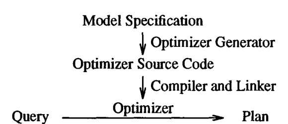
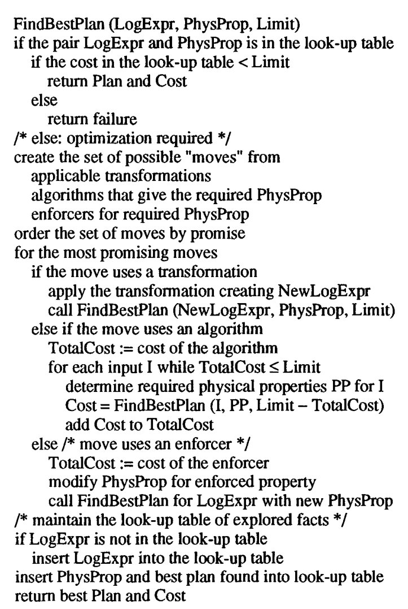
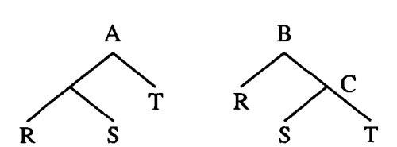
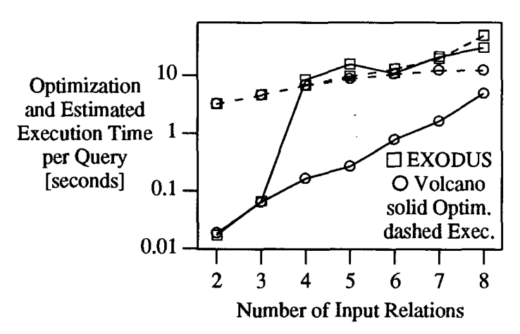

# The Volcano Optimizer Generator: Extensibility and Efficient Search（中文译文）

## 译者说明

本文依据同目录的 `source.pdf` 翻译。章节、图表、公式、算法、代码与参考文献按原文结构保留。

Goetz Graefe  
Portland State University  
graefe@cs.pdx.edu

William J. McKenna  
University of Colorado at Boulder  
bill@cs.colorado.edu

## 摘要

新兴数据库应用领域不仅要求新的功能，也要求高性能。为了同时满足这两个要求，Volcano 项目为查询和请求处理提供高效、可扩展的工具，尤其面向面向对象数据库系统和科学数据库系统。其中一个工具是一种新的优化器生成器。数据模型、逻辑代数、物理代数和优化规则会被优化器生成器翻译为优化器源代码。与我们早期的 EXODUS 优化器生成器原型相比，该搜索引擎更可扩展、更强大；它有效支持非平凡代价模型，以及排序顺序等物理性质。同时，它也高效得多，因为它把动态规划、目标驱动搜索和分支限界剪枝结合起来；在此之前，动态规划只用于关系型选择-投影-连接优化。与其他基于规则的优化系统相比，它提供了完整的数据模型独立性，以及更自然的可扩展性。

## 1. 引言

可扩展性是许多当前数据库研究项目和系统原型的重要目标和要求，但性能不能因此被牺牲，原因有二。第一，数据库系统中存储的数据量持续增长，在许多应用领域中已经远超多数现有数据库系统的能力。第二，为了克服科学计算等新兴数据库应用领域中的接受度问题，数据库系统至少必须达到当前使用的文件系统的性能。数据库管理所引入的额外软件层，必须由这些应用领域通常尚未利用的数据库性能优势来抵消。优化和并行化是提供这些性能优势的主要候选技术，因此，优化和并行化的工具与技术，对于可扩展数据库技术的广泛使用至关重要。

为了服务多个研究项目，包括 Volcano 可扩展并行查询处理器 [4]、REVELATION OODBMS 项目 [11]、科学数据库中的优化与并行化 [20]，并辅助其他研究人员的研究工作，我们构建了一个新的可扩展查询优化系统。我们早期使用 EXODUS 优化器生成器的经验并不完全令人满意；它证明了优化器生成器范式的可行性和有效性，但很难用它构造高效、生产质量的优化器。因此，我们设计了一种新的优化器生成器，并要求它相对 EXODUS 原型具备若干重要改进。

第一，新的优化器生成器既要能在 Volcano 项目中与已有查询执行软件一起使用，也要能作为独立工具用于其他项目。第二，新系统在优化时间和搜索所需内存方面都必须更高效。第三，它必须为排序顺序、压缩状态等物理性质提供有效、高效且可扩展的支持。第四，它必须允许利用启发式和数据模型语义来引导搜索，并剪除无效的搜索空间。最后，它必须支持灵活的代价模型，使其能够为未完全指定的查询生成动态计划。

本文描述 Volcano 优化器生成器。第 2 节介绍 Volcano 优化器生成器的主要概念，并列举用于定制新优化器的设施。第 3 节详细讨论优化器搜索策略。第 4 节比较 EXODUS 和 Volcano 优化器生成器在功能、可扩展性和搜索效率上的差异。第 5 节描述并比较可扩展查询优化方面的其他研究。第 6 节给出结论。

## 2. Volcano 优化器生成器的外部视图

本节从数据库系统及其查询优化器实现者的角度描述 Volcano 优化器生成器。重点是优化器实现者可用的大量设施，即 Volcano 优化器生成器设计的模块化和可扩展性。在讨论设计原则之后，我们讨论生成器输入和运行方式。第 3 节会讨论由 Volcano 优化器生成器生成的优化器所使用的搜索策略。

图 1 展示了优化器生成器范式。当构建 DBMS 软件时，模型规格说明（model specification）被翻译为优化器源代码，然后与查询执行引擎等其他 DBMS 软件一起编译和链接。其中一些软件由优化器实现者编写，例如代价函数。数据模型描述被翻译为优化器源代码之后，生成的代码会与 Volcano 优化软件中的搜索引擎编译并链接。当 DBMS 运行并输入查询时，查询被传递给优化器，优化器为其生成优化后的计划。我们把指定数据模型并实现 DBMS 软件的人称为“优化器实现者”（optimizer implementor）。提出待优化并由数据库系统执行的查询的人称为 DBMS 用户。

```text
Model Specification
        |
        v
Optimizer Generator
        |
        v
Optimizer Source Code
        |
        v
Compiler and Linker
        |
        v
Query -> Optimizer -> Plan
```

**图 1. 生成器范式。**



### 2.1 设计原则

系统中体现了五个基本设计决策，它们共同促进了用 Volcano 优化器生成器设计和实现的优化器的可扩展性与搜索效率。下面依次解释并论证这些决策。

第一，尽管关系系统中的查询处理一直基于关系代数，但越来越清楚的是，可扩展系统和面向对象系统中的查询处理也会基于代数技术，即定义代数算子、代数等价律和合适的实现算法。近来已经提出了若干面向对象代数，例如 [16-18] 等。它们的共同点是：代数算子消费一个或多个批量类型（bulk type，例如集合、包、数组、时间序列或列表），并产生另一个适合作为下一个算子输入的批量类型。这些系统的执行引擎也基于代数算子，即消费并产生批量类型的算法。然而，算子集合和算法集合并不相同，选择最高效的算法是查询优化的核心任务之一。因此，Volcano 优化器生成器使用两种代数，称为逻辑代数和物理代数，并生成把逻辑代数表达式（查询）映射为物理代数表达式（由算法构成的查询求值计划）的优化器。为此，它使用逻辑代数内部的变换，以及从逻辑算子到算法的基于代价的映射。

第二，规则已经被识别为一种通用概念，可用来以简洁、模块化的方式描述模式知识；而查询优化中等价变换所需的代数律知识，很容易用模式和规则表达。因此，大多数可扩展查询优化系统都使用规则，Volcano 优化器生成器也是如此。此外，强调相互独立的规则可以保证模块化。在我们的设计中，规则彼此独立地被翻译，只有在优化查询时才由搜索引擎组合使用。考虑到查询优化是任何数据库系统中概念上最复杂的组件之一，模块化本身就是一种优势，无论对优化器的初始构造还是后续维护都是如此。

第三，查询优化器在把查询映射为最优等价查询求值计划时可作出的选择，在 Volcano 优化器生成器的输入中被表示为代数等价。其他系统在把查询转换为计划时使用多个中间层。例如，可扩展关系型 Starburst 数据库系统的基于代价的优化器组件使用“扩展文法”（expansion grammar），其中含有多个“非终结符”层级，例如可交换二元连接、不可交换二元连接等 [10]。我们认为，多个中间层以及为新的或扩展后的代数重新设计这些层级的需要，会混淆两个问题：其一是等价性，即定义优化器有哪些选择；其二是搜索方法，即优化器考虑可能查询求值计划的顺序。正如导航式查询语言不如非导航式语言易用，要求数据库实现者提供控制信息的可扩展查询优化系统，也不如无需此类信息的系统方便。因此，优化器的选择在 Volcano 优化器生成器的输入文件中表示为代数等价，而优化器生成器的搜索引擎会以合适方式应用它们。不过，对于希望控制搜索的数据库实现者，例如希望指定搜索和剪枝启发式的实现者，系统会提供可选设施。

第四个基本设计决策涉及规则解释与规则编译。一般来说，解释方式可以更灵活，尤其是规则集可在运行时扩充；而编译后的规则集通常执行更快。由于查询优化非常消耗 CPU，我们决定采用类似 EXODUS 优化器生成器的规则编译方式。此外，我们认为扩展查询处理系统及其优化器非常复杂且耗时，绝不可能快速完成，因此支持解释器的最强论点在这里没有意义。为了在编译规则集的同时获得额外灵活性，可以对规则及其条件进行参数化，例如控制搜索彻底程度，观察并利用重复出现的规则应用序列。一般而言，搜索引擎的灵活性问题与解释还是编译的选择是正交的。

最后，由 Volcano 优化器生成器生成的优化器所使用的搜索引擎基于动态规划。第 3 节会讨论动态规划的使用方式。

### 2.2 优化器生成器输入和优化器运行

Volcano 优化器生成器的一个主要设计目标，是尽量减少对所实现数据模型的假设。因此，优化器生成器只提供一个框架，让优化器实现者把数据模型特定的操作和函数集成进去。本节讨论实现新的数据库查询优化器时，优化器实现者需要定义的组件。真实用户查询和执行计划分别是生成后优化器的输入和输出，如图 1 所示。本节讨论的其他所有组件，都由优化器实现者在优化器生成前以等价规则和支持函数的形式指定，在生成优化器时编译和链接，并在生成的优化器优化查询时使用。这里会讨论生成后优化器的一部分运行方式，但把各部分如何组合在一起留到搜索一节说明。

由生成优化器优化的用户查询，被指定为由逻辑算子组成的代数表达式（树）。从用户界面到逻辑代数表达式的翻译必须由解析器完成，本文不讨论。逻辑算子集合在模型规格说明中声明，并在生成期间编译进优化器。算子可以有零个或多个输入；输入数量不受限制。优化器的输出是一个计划，即算法代数上的表达式。算法集合、它们的能力和代价，表示数据库系统用于永久数据和临时数据的数据格式与物理存储结构。

优化就是把逻辑代数表达式映射为最优的等价物理代数表达式。换言之，生成的优化器会重排算子并选择实现算法。表达式等价的代数规则，例如交换律和结合律，用变换规则（transformation rules）指定。算子到算法的可能映射，用实现规则（implementation rules）指定。规则语言必须允许复杂映射，这一点很重要。例如，一个连接后接一个投影（不去重）应当由单个过程实现；因此，可以把多个逻辑算子映射为单个物理算子。除了算子和算法上的简单模式匹配，两类规则都可以指定额外条件。这通过把条件代码附加到规则上实现；模式匹配成功后会调用这些条件代码。

表达式的结果用性质（properties）描述，这类似于 EXODUS 优化器生成器和 Starburst 优化器中的性质概念。逻辑性质可从逻辑代数表达式推导出来，包括模式、预期大小等；物理性质依赖算法，例如排序顺序、分区方式等。在优化多分类代数（many-sorted algebra）时，逻辑性质还包括中间结果的类型（或 sort），规则的条件代码可以检查该类型，确保规则只应用于正确类型的表达式。逻辑性质附着在等价类上，等价类是一组等价的逻辑表达式和计划；物理性质则附着在具体计划和算法选择上。

每个中间结果的物理性质集合被汇总为一个物理性质向量（physical property vector）。该向量由优化器实现者定义，并被 Volcano 优化器生成器及其搜索引擎作为抽象数据类型处理。换言之，物理性质的类型和语义可由优化器实现者设计。

物理代数中有一些算子在逻辑代数中没有对应算子，例如排序和解压缩。这些算子的目的不是执行任何逻辑数据操作，而是在输出中强制产生后续查询处理算法所需的物理性质。我们称这些算子为强制算子（enforcers）；它们可类比 Starburst 中的“胶水”算子。一个强制算子可以保证两个性质，也可以强制一个性质但破坏另一个性质。

每个优化目标及子目标都是一个逻辑表达式与一个物理性质向量的二元组。为了判断某个算法或强制算子能否用于执行逻辑表达式的根节点，生成的优化器会匹配实现规则，执行与规则关联的条件代码，然后调用一个适用性函数（applicability function），判断该算法或强制算子能否以满足该物理性质向量的物理性质交付逻辑表达式。适用性函数还决定算法输入必须满足的物理性质向量。例如，当优化一个连接表达式且其结果应按连接属性排序时，混合哈希连接不合格，而归并连接合格，并要求它的输入已经排序。排序强制算子也能通过测试，并且它对输入的要求不包括排序顺序。当优化排序输入时，混合哈希连接合格。系统还提供一种机制，确保算法不会冗余地合格；例如在这个例子中，归并连接不应作为排序的输入再次被考虑。

优化器决定探索某个算法或强制算子后，会调用该算法的代价函数来估计代价。代价（cost）对于优化器生成器是一个抽象数据类型；因此，优化器实现者可以选择让代价是一个数字（例如估计的经过时间）、一个记录（例如估计 CPU 时间和 I/O 次数），或任何其他类型。代价算术和比较通过调用与抽象数据类型“cost”关联的函数完成。

对每个逻辑和物理代数表达式，逻辑性质和物理性质通过性质函数推导。每个逻辑算子、算法和强制算子都必须有一个性质函数。逻辑性质在执行任何优化之前，根据逻辑表达式由相关逻辑算子的性质函数确定。例如，中间结果的模式可以独立于创建它的许多等价代数表达式中的具体一个来确定。逻辑性质函数也封装选择率估计。另一方面，排序顺序等物理性质只有在选定执行计划之后才能确定。作为诸多一致性检查之一，生成的优化器会验证所选计划的物理性质确实满足作为优化目标一部分给定的物理性质向量。

总结本节，优化器实现者需要提供：(1) 一组逻辑算子；(2) 代数变换规则，可能带有条件代码；(3) 一组算法和强制算子；(4) 实现规则，可能带有条件代码；(5) 一个“cost”抽象数据类型，含基本算术和比较函数；(6) 一个“logical properties”抽象数据类型；(7) 一个“physical property vector”抽象数据类型，含比较函数（相等和覆盖）；(8) 每个算法和强制算子的适用性函数；(9) 每个算法和强制算子的代价函数；(10) 每个算子、算法和强制算子的性质函数。这看上去可能需要很多代码；不过，构造一个数据库查询优化器时，无论是否使用优化器生成器，这些功能都是必需的。考虑到查询优化器通常是数据库管理系统中最复杂的模块之一，并且优化器生成器为这些必要的优化器组件规定了清晰的模块化方式，使用 Volcano 优化器生成器构建新数据库查询优化器的工作量，应显著少于从头设计和实现一个新优化器。尤其是，使用 Volcano 优化器生成器的优化器实现者不需要设计和实现新的搜索算法。

## 3. 搜索引擎

数据库查询优化的一般范式，是创建替代的等价查询求值计划，然后在许多可能计划中作出选择。因此，搜索引擎及其算法是任何查询优化器的核心组件。Volcano 优化器生成器没有强迫每个数据库和优化器实现者实现全新的搜索引擎和算法，而是提供了一个可用于所有生成优化器的搜索引擎。该搜索引擎会自动与从数据模型描述生成的模式匹配和规则应用代码链接。

我们使用 EXODUS 优化器生成器的经验表明，在可扩展查询优化中很容易浪费大量搜索工作。因此，我们把 Volcano 优化器生成器的搜索算法设计为使用动态规划，并且非常目标导向，也就是说，由需求而不是由可能性驱动。

动态规划此前已经用于数据库查询优化，尤其是 System R 优化器 [15] 和 Starburst 基于代价的优化器 [8, 10]，但仅限于关系型选择-投影-连接查询。Volcano 优化器生成器所设计的搜索策略，把动态规划从关系连接优化扩展到一般代数查询和请求优化，并把它与自顶向下、目标导向的控制策略结合起来，以适应可能计划数量超过预计算实际限制的代数。我们的动态规划方法只为那些被认为是更大子查询或整个查询组成部分的局部查询推导等价表达式和计划，而不是为所有可行或因排序顺序而看似有趣的表达式和计划推导 [15]。因此，子查询及其替代计划的探索和优化被紧密引导，具有很强的目标导向性。在某种意义上，EXODUS 优化器生成器以及 System R 和 Starburst 关系系统的搜索引擎使用前向链推理（forward chaining，按 AI 中的术语），而 Volcano 搜索算法使用后向链推理（backward chaining），因为它只探索那些确实参与更大表达式的子查询和计划。我们把这种搜索算法称为定向动态规划（directed dynamic programming）。

Volcano 优化器生成器创建的优化器通过保留大量局部优化结果，并在后续优化决策中使用这些先前结果来应用动态规划。目前，这组局部优化结果会为每个被优化查询重新初始化。换言之，先前的局部优化结果只在单个查询的优化期间使用。我们正在考虑未来研究生命周期更长的局部结果。

代数变换系统总是可能以几种不同方式推导出同一个表达式。为了检测冗余推导，避免对同一逻辑表达式和计划进行重复优化，表达式和计划被捕获在由表达式和等价类组成的哈希表中。一个等价类表示两个集合：一个是等价逻辑表达式集合，另一个是物理表达式（计划）集合。逻辑代数表达式用于高效且完整地探索搜索空间，计划则用于快速选择满足物理性质要求的合适输入计划。对于某个等价类已经优化过的每种物理性质组合，例如未排序、按 A 排序、按 B 排序，系统会保留找到的最佳计划。

图 2 给出了 Volcano 优化器生成器所用搜索算法的概要。`FindBestPlan` 过程的初始调用指定传给优化器的逻辑表达式，即待优化查询；用户请求的物理性质，例如 SQL `ORDER BY` 子句中的排序顺序；以及一个代价上限。对于用户查询，该上限通常是无穷大，但用户界面可以允许用户设置自己的上限，以“捕捉”不合理查询，例如由于缺失连接谓词而使用笛卡尔积的查询。

```text
FindBestPlan(LogExpr, PhysProp, Limit)
  if pair LogExpr and PhysProp is in the look-up table
    if cost in the look-up table < Limit
      return Plan and Cost
    else
      return failure

  /* otherwise: optimization required */
  create the set of possible "moves" from
    applicable transformations
    algorithms that give the required PhysProp
    enforcers for required PhysProp
  order the set of moves by promise

  for the most promising moves
    if the move uses a transformation
      apply the transformation creating NewLogExpr
      call FindBestPlan(NewLogExpr, PhysProp, Limit)
    else if the move uses an algorithm
      TotalCost := cost of the algorithm
      for each input I while TotalCost < Limit
        determine required physical properties PP for I
        Cost = FindBestPlan(I, PP, Limit - TotalCost)
        add Cost to TotalCost
    else /* move uses an enforcer */
      TotalCost := cost of the enforcer
      modify PhysProp for enforced property
      call FindBestPlan for LogExpr with new PhysProp

  /* maintain the look-up table of explored facts */
  if LogExpr is not in the look-up table
    insert LogExpr into the look-up table
  insert PhysProp and best plan found into look-up table
  return best Plan and Cost
```

**图 2. 搜索算法概要。**



`FindBestPlan` 过程分为两部分。首先，如果在哈希表中能找到满足该物理性质向量的表达式计划，则根据找到的计划是否满足给定代价上限，返回该计划和代价，或返回失败指示。如果表达式无法在哈希表中找到，或者表达式之前已被优化但不是针对当前所需物理性质优化，则开始真正的优化。

优化器在任何时刻可探索三类可能的“动作”（moves）。第一，表达式可以使用变换规则进行变换。第二，可能有一些算法能够以期望的物理性质交付该逻辑表达式，例如对未排序输出使用混合哈希连接，或对按连接属性排序的连接输出使用归并连接。第三，某个强制算子可能有用，因为它允许额外的算法选择，例如使用排序算子，从而即使最终输出需要排序，也能使用混合哈希连接。

所有可能动作被生成并评估后，最有希望的动作会被追踪。目前，因为只实现了穷尽搜索，所有动作都会被追踪。未来会选择动作子集，由优化器实现者提供的另一个函数决定并排序。追踪所有动作还是只追踪少数选中动作，是交给优化器实现者的主要启发式选择。在极端情况下，优化器实现者可以选择只变换逻辑表达式，而不进行任何算法选择和代价分析；这覆盖了 Starburst 中被分离到查询重写层的优化。Starburst 的两层方法与 Volcano 方法之间的差异在于：这种分离在 Starburst 中是强制性的，而 Volcano 会把它作为一个选择留给优化器实现者。

代价上限通过分支限界剪枝改进搜索算法。一旦某个逻辑表达式（用户查询或其一部分）和物理性质向量已有一个完整计划，其他代价更高的计划或局部计划就不可能成为最优查询求值计划的一部分。因此，相对较好的计划越早被找到，对优化速度越有利，即使优化器使用穷尽搜索也是如此。此外，代价上限会在优化子表达式时向下传递，紧的上界也会加速子表达式优化。

如果要追踪的动作是变换，则形成新表达式，并用 `FindBestPlan` 优化。为了检测两个或更多规则互为逆规则的情况，当前表达式和物理性质向量会被标记为“正在进行”。如果新形成的表达式已经存在于哈希表中且被标记为“正在进行”，则忽略它，因为它的最优计划会在完成时被考虑。

变换期间经常会创建新的等价类。考虑图 3 中的结合律规则。以 A 和 B 为根的表达式等价，因此属于同一个类。然而，表达式 C 不等价于左侧表达式中的任何表达式，需要一个新的等价类。在这种情况下，会创建新的等价类，并按表达式 B 的代价分析和优化需要进行优化。

```text
      A                  B
     / \                / \
    R   B      ==      A   T
       / \            / \
      S   T          R   S
```

**图 3. 结合律规则。**



如果要追踪的动作是探索普通查询处理算法，例如归并连接，则由该算法的代价函数计算其代价。算法的适用性函数决定算法输入的物理性质向量，然后通过对输入调用 `FindBestPlan` 找到它们的代价和最优计划。

对于一些二元算子，输入的实际物理性质不如输入之间物理性质的一致性重要。例如，对基于排序的交集实现，也就是与归并连接非常相似的算法，只要两个输入以相同方式排序，任何排序顺序都足够。类似地，对于并行连接，只要两个输入使用兼容的分区规则进行分区，就可以接受把连接输入按任何方式分布到多个处理节点。对于这些情况，搜索引擎允许优化器实现者指定若干要尝试的物理性质向量。例如，对于两个输入 R 和 S 的交集，属性为 A、B、C；若 R 按 `(A,B,C)` 排序，而 S 按 `(B,A,C)` 排序，则优化器实现者可以指定这两个排序顺序，生成的优化器会对它们进行优化，而其他可能排序顺序，例如 `(C,B,A)`，会被忽略。

如果要追踪的动作是使用排序等强制算子，则其代价由优化器实现者提供的代价函数估计，并用适当修改（即放宽）的物理性质向量对原始逻辑表达式调用 `FindBestPlan` 进行优化。在许多方面，强制算子的处理方式与算法完全相同；考虑到二者都是物理代数算子，这并不奇怪。

在使用修改后的物理性质向量优化期间，已经在放宽物理性质之前适用过的算法，不应再次被探索。例如，如果连接结果要求按连接列排序，则归并连接（算法）和排序（强制算子）都会适用。当优化排序输入，也就是没有排序要求的连接表达式时，混合哈希连接应适用，但归并连接不应适用。为了保证这一点，`FindBestPlan` 使用一个额外参数，图 2 中没有显示，称为排除物理性质向量（excluding physical property vector），它只在优化强制算子的输入时使用。在该例中，排除物理性质向量会包含排序条件；由于归并连接能够满足排除性质，它不会被认为是排序输入的合适算法。

在 `FindBestPlan` 优化过程结束时，或者实际上在过程进行中，新推导出的有趣事实会被捕获到哈希表中。“有趣”相对于未来可能用途来定义，既包括给定物理性质下的最优计划，也包括能为同一逻辑表达式和物理性质向量、在相同或更低代价上限下节省未来优化工作的失败事实。

总结来说，由 Volcano 优化器生成器创建的优化器所采用的搜索算法，通过存储所有最优子计划以及优化失败，直到一个查询被完整优化，从而使用动态规划。它在不对代数本身作任何先验假设的情况下，被设计为把逻辑代数上的表达式映射为物理代数上的最优等价表达式。由于它通过物理性质高度目标导向，并且只推导那些真正参与有希望的大计划的表达式和计划，该算法比此前在数据库查询优化中使用动态规划的方法更高效。

## 4. 与 EXODUS 优化器生成器的比较

EXODUS 优化器生成器是我们设计和实现可扩展查询优化系统或工具的首次尝试，因此本节较详细地比较 EXODUS 和 Volcano 优化器生成器。EXODUS 优化器生成器的成功之处在于，它定义了一个基于查询代数、生成器范式（把数据模型规格说明作为输入数据）、逻辑代数和物理代数分离、逻辑性质和物理性质分离、大量使用代数规则（变换规则和实现规则），以及重视软件模块化的通用方法 [2, 3]。考虑到典型查询优化软件的复杂性，以及良好定义的模块对克服软件设计和维护复杂性的重要性，后两点很可能是 EXODUS 优化器生成器研究中最重要的贡献。

生成器概念非常成功，因为输入数据（数据模型规格说明）能够被转化为机器代码；特别是，所有字符串都被翻译为整数，从而保证了非常快速的模式匹配。然而，EXODUS 优化器生成器的搜索引擎远非最优。第一，为处理未预见代数及其特殊性所需的修改，使它变成了糟糕的代码拼凑。第二，“MESH” 数据结构的组织极其笨重，无论时间复杂度还是空间复杂度都是如此；该结构保存到目前为止探索过的所有逻辑和物理代数表达式。第三，在 MESH 中几乎随机地变换表达式，导致“重新分析”已有计划的显著开销。事实上，对较大查询，大部分时间都花在重新分析已有计划上。

Volcano 优化器生成器解决了这三个问题，并包含 EXODUS 优化器生成器中没有的新功能。下面先总结它们在功能上的差异，然后给出关系查询上的性能比较。

### 4.1 功能和可扩展性

EXODUS 和 Volcano 优化器生成器在功能和可扩展性方面有若干重要差异。

第一，Volcano 区分逻辑表达式和物理表达式。在 EXODUS 中，称为 MESH 的哈希表里只有一种节点类型，既包含连接等逻辑算子，也包含混合哈希连接等物理算法。为了保留使用归并连接和混合哈希连接的等价计划，逻辑表达式（或至少一个节点）必须保留两份，导致 MESH 中节点数量很大。

第二，EXODUS 对物理性质的处理相当随意。如果最低代价算法碰巧交付了有用的物理性质，这会被记录在 MESH 中并用于后续优化决策。否则，强制算子（用 Volcano 术语）的代价必须被包含在归并连接等其他算法的代价函数中。换言之，指定所需物理性质，并让这些性质与逻辑表达式一起驱动优化过程的能力，在 EXODUS 中完全不存在；而这一能力显著提升了 Volcano 优化器生成器搜索引擎的效率。

物理性质概念非常强大且可扩展。数据库查询处理中最明显且最知名的物理性质候选是中间结果的排序顺序。其他性质可由优化器实现者任意定义。根据数据模型语义，唯一性可能是一种物理性质，并有两个强制算子：基于排序和基于哈希。在并行和分布式系统中，位置和分区可以由网络与并行算子强制，例如 Volcano 的 exchange 算子 [4]。对于面向对象系统中的查询优化，我们计划把内存中复杂对象的“已组装性”（assembledness）定义为物理性质，并使用 [5] 中描述的组装算子作为该性质的强制算子。

第三，Volcano 算法自顶向下驱动；只有在有理由时才优化子表达式。在极端情况下，如果追踪的唯一动作是变换，则逻辑表达式会在逻辑代数层面被变换，而不会优化其子表达式，也不会对子表达式执行算法选择和代价分析。在 EXODUS 中，变换后总是立即跟随算法选择和代价分析。此外，无论变换是否属于当前整体查询最有希望的逻辑表达式和物理计划，它们都会被探索。对优化器性能最糟糕的，是优先执行预期代价改进最高的变换这一决策。由于预期代价改进被计算为与变换规则关联的因子乘以变换前当前代价，表达式顶部节点（总代价较高）会优先于较低处表达式。当较低表达式最终被变换时，其上方所有消费者节点（此时已经很多）都必须被重新分析，产生极大量 MESH 节点。

第四，Volcano 中的代价定义比 EXODUS 优化器生成器中一般得多。在 Volcano 中，代价是一个抽象数据类型，所有计算和比较都通过调用优化器实现者提供的函数完成。它可以是简单数字，例如估计的经过秒数；也可以是结构，例如由 CPU 时间和 I/O 次数组成的记录，用于类似 System R [15] 的代价模型；甚至可以是函数，例如可用主内存数量的函数。

最后，我们认为 Volcano 优化器生成器比 EXODUS 原型更可扩展，尤其是在搜索策略方面。保存逻辑表达式和物理计划的哈希表及其操作非常通用，可支持多种搜索策略，而不仅是上一节概述的过程。我们仍在修改、扩展和改进搜索策略，并计划在未来几年进一步修改它，使用 Volcano 优化器生成器开展更多研究。

### 4.2 搜索效率和效果

本节通过实验比较 EXODUS 和 Volcano 搜索引擎中机制的效率和效果。用于比较的例子是一个相当小的“数据模型”，只包含关系型选择和连接算子；不过，如我们将看到的，即使这个小数据模型和查询语言，也足以表明 Volcano 优化器生成器的搜索策略优于早期 EXODUS 原型的搜索策略。对于更丰富、更复杂的数据模型、逻辑查询代数和物理执行代数，这里暴露出的效果会更强。

实验中，我们尽可能相似地为 EXODUS 和 Volcano 优化器生成器指定数据模型描述。具体来说，我们指定了相同的算子（get、select、join）和算法（文件扫描、用于选择的过滤器、排序、归并连接、混合哈希连接）、相同的变换和实现规则，以及相同的性质和代价函数。排序在 Volcano 中建模为强制算子，而在 EXODUS 中隐含在归并连接的代价函数中。变换规则允许生成所有计划，包括 bushy 计划（复合内输入）。测试关系包含 1,200 到 7,200 条 100 字节记录。代价函数同时包括 I/O 和 CPU 代价。哈希连接假定不使用分区文件，排序代价则基于单级归并计算。

作为两个搜索引擎的第一次比较，我们对关系型选择-连接查询进行了穷尽优化。图 4 展示了平均优化工作量，并为了显示优化器输出质量，也展示了生成计划的估计执行时间。查询包含 1 到 7 个二元连接，即 2 到 8 个输入关系，并且选择算子数量与输入关系数量相同。实线表示在约 12 MIPS 的 Sun SparcStation-1 上的优化时间。虚线表示估计计划执行时间。注意 y 轴为对数刻度。EXODUS 优化器生成器的测量值用方块标记，Volcano 测量值用圆圈标记。对于每个复杂度等级，我们生成并优化了 50 个查询。对一些较复杂查询，EXODUS 优化器生成器因内存不足而中止，或因为运行时间远长于 Volcano 优化器生成器而被终止。此外，重复实验中我们观察到 EXODUS 优化器生成器的测量值相当不稳定。[3] 报告的 EXODUS 实验中也观察到类似问题。Volcano 生成的优化器对所有查询执行穷尽搜索，工作空间少于 1 MB。图 4 中的数据点只表示那些 EXODUS 优化器生成器完成优化的查询。

**图 4. 穷尽优化性能。** 原图显示：随着输入关系数量从 2 增至 8，Volcano 的优化时间增长接近指数曲线，但整体显著低于 EXODUS；EXODUS 在 3 到 4 个输入关系之间搜索代价急剧上升。虚线的估计执行时间显示，中等复杂度查询上两者计划质量相当，而更复杂查询上 EXODUS 生成计划的代价更高。



搜索时间反映了 Volcano 更高效的搜索策略，这从两条实线之间的大距离可见。对于 EXODUS 生成的优化器，搜索工作量从 3 个输入关系到 4 个输入关系时急剧增加，因为此时重新分析成为 EXODUS 查询优化工作的重要部分。Volcano 优化代价的增长大约是指数级，表现为近似直线，这准确反映了等价逻辑代数表达式数量的增长 [13]。对更复杂查询，EXODUS 和 Volcano 的优化时间相差约一个数量级。

计划质量（由图 4 中虚线的估计执行代价表示）在中等复杂度查询上相同，即最多 4 个输入关系。然而，对更复杂查询，EXODUS 优化计划的代价显著更高，因为 EXODUS 生成的优化器及其搜索引擎没有系统地探索和利用物理性质与有趣排序。

总结来说，Volcano 优化器生成器不仅更可扩展，也比早期 EXODUS 原型高效和有效得多。下一节把我们的工作与其他相关工作进行比较。

## 5. 其他相关工作

Starburst 可扩展关系型数据库管理系统的查询优化器由两个具有嵌套作用域的基于规则的子系统组成。两个子系统通过一个公共数据结构连接，该结构表示整个查询，称为查询图模型（query graph model, QGM）。第一个子系统称为查询重写，它合并嵌套子查询，并把选择和连接谓词打包，以供第二个基于代价的优化器优化。查询重写阶段的优化，即嵌套 SQL 查询、并、外连接、分组和聚合，完全基于启发式，并且不感知代价。选择-投影-连接查询组件由第二个优化器覆盖，也称为基于代价的优化器；它基于规则，把选择-投影-连接查询从关系演算扩展为访问计划，并通过估计执行代价比较得到的计划 [8, 10]。基于代价的优化器在一定结构边界内执行穷尽搜索。例如，可以把搜索空间限制为左深树（无复合内输入），也可以包含所有 bushy 树，或设置参数以探索部分但非全部 bushy 树。对于中等复杂度连接查询，Starburst 基于代价的优化器由于使用动态规划，穷尽搜索非常快。此外，基于代价的优化器会考虑排序顺序等物理性质，并创建包含“胶水”算子以强制物理性质的高效访问计划。

在我们看来，Starburst 的可扩展查询优化方法存在两个基本问题。第一，基于代价的优化器设计聚焦于基于类文法规则对连接表达式逐步扩展。“文法”依赖一套中间层级，类似解析文法中的非终结符，例如可交换连接和不可交换连接；规则集合和中间层级专门针对关系连接优化定制。问题在于，现有规则集如何与额外算子和扩展规则交互并不明显。例如，多路连接算法应放在层级中的哪一层？扩展文法需要定义哪些新的中间层（非终结符）？为了把新算子集成到 Starburst 基于代价的优化器中，数据库实现者必须设计若干新的中间层及其新的文法规则。这些规则可能与已有规则交互，使得 Starburst 基于代价的优化器的任何扩展都成为复杂且乏味的任务。Volcano 的代数方法看起来更自然、更容易理解。最近大多数面向对象查询优化工作，以及一些数据库程序语言工作，都聚焦于代数和代数变换，例如 [9, 16-18] 等。

第二，为了避免把新算子加入基于代价的优化器所带来的问题，新算子被集成在查询重写层。然而，查询重写层上的查询优化是启发式的；换言之，它不包括代价估计。虽然启发式对某些变换足够，例如把嵌套 SQL 查询重写为连接表达式，但对 Starburst 查询重写层中已经存在的关系算子并不足够；对于可扩展查询优化系统中未来尚未知晓的代数算子及其性质，更不够。作为现有 Starburst 算子优化能力不足的例子，考虑 N 个集合的并或交优化，它与 N 个关系的连接优化非常相似；然而，连接优化使用对树形和连接顺序的穷尽搜索，以及选择率和代价估计，而并和交只使用查询重写启发式和交换律优化。我们认为，一种单层方法，即所有代数等价和变换都在单一语言中指定，并由单一优化器组件执行，更有利于未来对数据库查询代数及其优化的研究和探索。注意，Volcano 优化器生成器会通过合适地排序和选择“动作”来允许启发式变换；不过，它把何时以及如何使用启发式与代价敏感优化的选择留给数据库实现者，而不是像 Starburst 设计那样预先固定。

Sciore 和 Sieg 批评了早期基于规则的查询优化器，并得出结论：模块化是可扩展查询优化系统的主要要求，例如规则集和规则应用控制结构中的模块化 [14]。查询优化的不同任务，例如规则应用和选择率估计，应被封装在彼此独立且协作的“专家”中。Mitchell 等人最近为面向对象数据库系统中的查询优化提出了非常类似的方法 [12]。虽然作为概念方法很有前景，但我们认为这种分离可以在查询优化的某些方面维持，我们也曾尝试在 Volcano 优化器生成器的代价等抽象数据类型中做到这一点；然而，在真实实现中，我们发现要维持所有理想上应分离关注点的封装极其困难。

Kemper 和 Moerkotte 为 Generic Object Model 设计了一个基于规则的查询优化器 [6]。规则几乎完全作用于路径表达式（例如 `employee.department.floor`），通过扩展和截断这些表达式来有效使用访问支持关系 [7]。虽然使用规则使该优化器具备可扩展性，但并不清楚这些技术在多大程度上能用于不同数据模型和不同执行引擎。

## 6. 总结和结论

新兴数据库应用领域不仅要求高功能性，也要求高性能。为了满足这两个要求，Volcano 项目提供高效、可扩展的查询和请求处理工具，尤其适用于面向对象和科学数据库系统。我们并不主张把关系查询处理重新引入下一代数据库系统；相反，我们研究一种不依赖任何数据模型的新型查询处理引擎。基本假设是，高级查询和请求语言现在并将继续基于集合、其他批量类型、谓词和算子。因此，消费并产生项集合或序列的算子，是下一代查询和请求处理系统的基本构建块。换言之，我们假设某种集合代数是查询处理的基础，我们的研究试图支持任何集合代数，包括异构集合和多分类代数。幸运的是，代数和代数等价规则非常适合作为数据库查询优化的基础。此外，集合（允许定义和利用子集）以及在算子之间传递或流水线传递的数据，也是数据库查询处理并行算法的基础。因此，我们关于可扩展数据库系统中查询处理的基本假设，与高性能并行处理兼容。

Volcano 研究提供的工具之一是一种新的优化器生成器，其设计和实现用于进一步探索可扩展性、搜索算法、效果（即生成计划的质量）、启发式，以及搜索引擎中的时间和空间效率。可扩展性通过从数据模型规格说明生成优化器源代码，以及把代价、逻辑性质和物理性质封装为抽象数据类型来实现。效果通过允许穷尽搜索实现，搜索只会在优化器实现者自行决定时被剪枝。效率通过把动态规划、基于物理性质的定向搜索、分支限界剪枝和启发式引导结合为一种新的搜索算法实现；我们称之为定向动态规划。与 EXODUS 优化器生成器的初步性能比较表明，用 Volcano 优化器生成器构建的优化器远比用 EXODUS 原型构建的优化器高效。我们希望新的 Volcano 优化器生成器能让我们自己的研究小组以及其他人更快速地为新型数据模型、查询代数和数据库管理系统开发新的数据库查询优化器。Volcano 优化器生成器已经用于开发科学数据库计算优化器 [20]，以及 Texas Instruments 的 Open OODB 项目 [1, 19] 的优化器；后者引入了一种新的 “materialize” 或 scope 算子，用于在逻辑代数表达式中捕获路径表达式语义。这两个优化器最近都已经投入运行。此外，Volcano 优化器生成器目前正由三个大洲的若干学术和工业研究人员评估。

除了把基于动态规划的穷尽搜索高效实现（也见于 Starburst 关系优化器的基于代价组件）与 EXODUS 优化器生成器的通用性，以及更自然的单层代数变换方法结合起来，Volcano 优化器生成器还有若干新特性，使其作为软件开发和研究工具的价值超过所有早期可扩展查询优化工作。

第一，何时以及如何使用启发式变换与代价敏感优化的选择，并没有被预先规定或“硬连线”。在 EXODUS 中，代价分析总是在变换之后执行；在 Starburst 中，一个层级只能执行启发式优化，而另一个层级执行代价敏感的穷尽搜索。因此，Volcano 优化器生成器移除了早期可扩展查询优化器设计对搜索策略施加的限制。

第二，由 Volcano 优化器生成器生成的优化器非常高效地使用物理性质来引导搜索。它不是先优化表达式，再向计划中加入“胶水”算子及其代价（Starburst 方法），而是在搜索算法中立即考虑哪些物理性质需要强制，以及哪些强制算法可以强制它们，并从用于分支限界剪枝的界中减去强制算法的代价。因此，Volcano 优化器生成器有望在搜索和剪枝上比关系型 Starburst 优化器更加高效。

第三，对于能从多个替代物理性质组合中受益的二元、三元等操作，子表达式可以被优化多次。例如，只要两个输入以相同方式排序，基于归并连接的交集算法就可以利用任何排序顺序。虽然同样的考虑也适用于并行和分布式关系查询处理中的位置和分区，但此前没有查询优化器提供这一特性。

第四，等价类的内部结构足够模块化且可扩展，可支持替代搜索策略，远超过规则条件代码的参数化；后者在 Starburst 和 EXODUS 中大致也存在。我们正在探索与搜索策略相关的若干方向，包括预优化子计划、变换序列学习、一种可切换到不同现有算法且参数化程度更高的替代搜索算法，以及并行搜索（在共享内存机器上）。

最后，逻辑代数和物理代数的一贯分离，使数据库和优化器实现者在任一层级上的规格说明和修改都特别容易，并使搜索引擎非常高效。例如，引入一种新的、非平凡算法，如多路连接（而不是二元连接），在 Volcano 中需要一到两条实现规则；而 Starburst 基于代价优化器的设计要求重新考虑几乎整个规则集。虽然逻辑代数和物理代数的分离已经存在于 EXODUS 规则语言中，但 Volcano 设计还在搜索引擎中利用了这种分离，这使得扩展由优化器实现者提供的代码显著更容易编写、理解和修改；这些代码有时必须检查内部数据结构，例如规则条件代码。总之，与 Starburst 优化器和 EXODUS 优化器生成器相比，Volcano 优化器生成器是一个更可扩展、更有用的研究工具。

## 致谢

Jim Martin、David Maier 和 Guy Lohman 对本研究作出了宝贵贡献。Jim Martin、Guy Lohman、Barb Peters、Rick Cole、Diane Davison 和 Richard Wolniewicz 对本文草稿提出了许多改进建议。我们感谢 Texas Instruments 的 Jose A. Blakeley 及其同事在 Open OODB 项目中使用 Volcano Optimizer Generator。本研究在 University of Colorado at Boulder 完成，并得到 NSF 奖项 IRI-8805200、IRI-8912618、IRI-9116547，DARPA 合同 DAAB07-91-C-Q518，以及 Texas Instruments 的部分支持。

## 参考文献

[1] J. A. Blakeley, W. J. McKenna and G. Graefe, "Experiences Building the Open OODB Query Optimizer", submitted for publication, December 1992.

[2] G. Graefe, "Software Modularization with the EXODUS Optimizer Generator", IEEE Database Eng. 10, 4 (December 1987).

[3] G. Graefe and D. J. DeWitt, "The EXODUS Optimizer Generator", Proc. ACM SIGMOD Conf., San Francisco, CA, May 1987, 160.

[4] G. Graefe, R. L. Cole, D. L. Davison, W. J. McKenna and R. H. Wolniewicz, "Extensible Query Optimization and Parallel Execution in Volcano", in Query Processing for Advanced Database Applications, J. C. Freytag, G. Vossen and D. Maier (editor), Morgan-Kaufman, San Mateo, CA, 1992. Also available as CU Boulder CS Tech. Rep.

[5] T. Keller, G. Graefe and D. Maier, "Efficient Assembly of Complex Objects", Proc. ACM SIGMOD Conf., Denver, CO, May 1991, 148.

[6] A. Kemper and G. Moerkotte, "Advanced Query Processing in Object Bases Using Access Support Relations", Proc. Int'l. Conf. on Very Large Data Bases, Brisbane, Australia, 1990, 290.

[7] A. Kemper and G. Moerkotte, "Access Support in Object Bases", Proc. ACM SIGMOD Conf., Atlantic City, NJ, May 1990, 364.

[8] M. Lee, J. C. Freytag and G. Lohman, "Implementing an Interpreter for Functional Rules in a Query Optimizer", Proc. Int'l. Conf. on Very Large Data Bases, Long Beach, CA, August 1988, 218.

[9] D. F. Lieuwen and D. J. DeWitt, "A Transformation-Based Approach to Optimizing Loops in Database Programming Languages", Proc. ACM SIGMOD Conf., San Diego, CA, June 1992, 91.

[10] G. M. Lohman, "Grammar-Like Functional Rules for Representing Query Optimization Alternatives", Proc. ACM SIGMOD Conf., Chicago, IL, June 1988, 18.

[11] D. Maier, S. Daniels, T. Keller, B. Vance, G. Graefe and W. McKenna, "Challenges for Query Processing in Object-Oriented Databases", in Query Processing for Advanced Database Applications, J. C. Freytag, G. Vossen and D. Maier (editor), Morgan-Kaufman, San Mateo, CA, 1992.

[12] G. Mitchell, S. B. Zdonik and U. Dayal, "An Architecture for Query Processing in Persistent Object Stores", Proc. Hawaii Conf. on System Sciences, 1993.

[13] K. Ono and G. M. Lohman, "Measuring the Complexity of Join Enumeration in Query Optimization", Proc. Int'l. Conf. on Very Large Data Bases, Brisbane, Australia, 1990, 314.

[14] E. Sciore and J. Sieg, "A Modular Query Optimizer Generator", Proc. IEEE Conf. on Data Eng., Los Angeles, CA, February 1990, 146.

[15] P. G. Selinger, M. M. Astrahan, D. D. Chamberlin, R. A. Lorie and T. G. Price, "Access Path Selection in a Relational Database Management System", Proc. ACM SIGMOD Conf., Boston, MA, May-June 1979, 23. Reprinted in M. Stonebraker, Readings in Database Sys., Morgan-Kaufman, San Mateo, CA, 1988.

[16] G. M. Shaw and S. B. Zdonik, "A Query Algebra for Object-Oriented Databases", Proc. IEEE Conf. on Data Eng., Los Angeles, CA, February 1990, 154.

[17] D. D. Straube and M. T. Ozsu, "Execution Plan Generation for an Object-Oriented Data Model", Proc. Conf. on Deductive and Object-oriented Databases, Munich, Germany, December 1991.

[18] S. L. Vandenberg and D. J. DeWitt, "Algebraic Support for Complex Objects with Arrays, Identity, and Inheritance", Proc. ACM SIGMOD Conf., Denver, CO, May 1991, 158.

[19] D. Wells, J. A. Blakeley and C. W. Thompson, "Architecture of an Open Object-Oriented Database Management System", IEEE Computer 25, 10 (October 1992), 74.

[20] R. H. Wolniewicz and G. Graefe, "Algebraic Optimization of Computations over Scientific Databases", in preparation, 1993.
