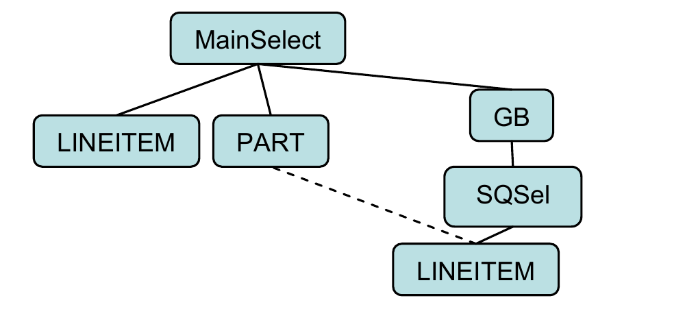
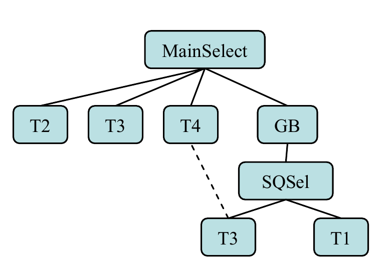
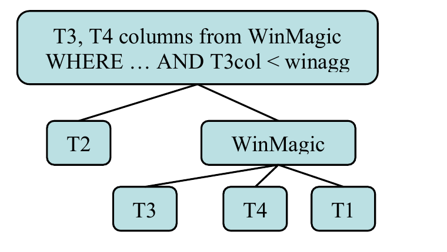
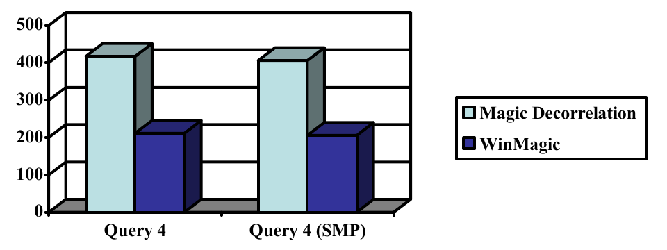
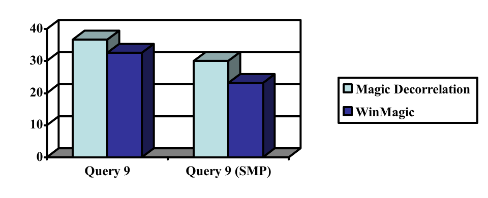
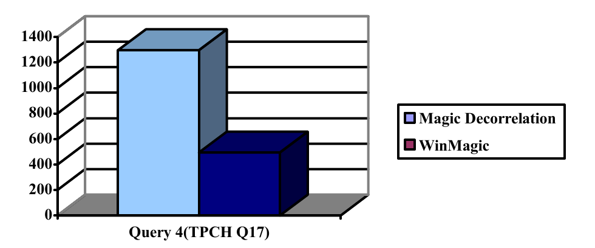
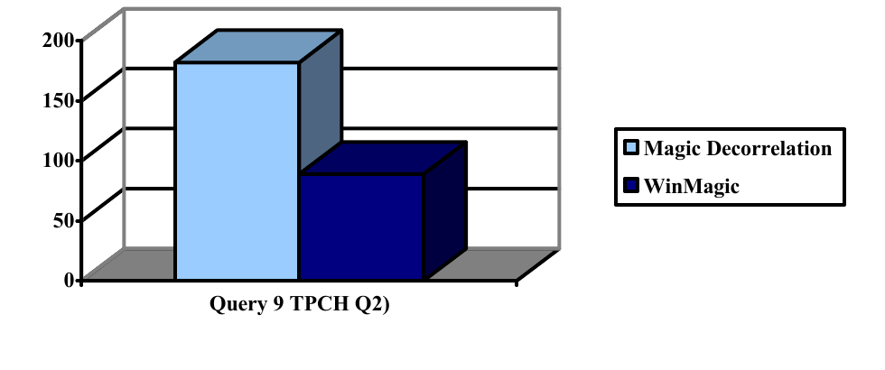

# WinMagic: Subquery Elimination Using Window Aggregation（中文译文）

## 译者说明

本文依据同目录的 `source.pdf` 翻译。章节、图表、公式、算法、代码与参考文献按原文结构保留。

Calisto Zuzarte、Hamid Pirahesh、Wenbin Ma、Qi Cheng、Linqi Liu、Kwai Wong

IBM

**版权与许可说明：** 只要副本不以营利或商业优势为目的制作或分发，并且首页载有本声明及完整引用，即可免费为个人或课堂用途制作本文部分或全部内容的数字版或纸质副本。以其他方式复制、再版、发布到服务器或向邮件列表再分发，须事先获得明确许可和/或支付费用。SIGMOD 2003，2003 年 6 月 9–12 日，美国加利福尼亚州圣迭戈。Copyright 2003 ACM 1-58113-634-X/03/06…$5.00。

## 摘要

数据库查询经常采用相关 SQL 查询的形式。所谓相关，是指在计算内层子查询时使用外层查询块中的值。这对 SQL 程序员而言是一种方便的范式，并且与典型计算机编程语言中的函数调用范式非常相似。把应用领域专用语言查询转换为 SQL 的 SQL 生成器，也经常生成带相关子查询的查询。另一类大量采用这种相关子查询形式的重要查询，是使用 SQL 的时态数据库查询。这类查询的性能非常重要，在大型数据库中尤其如此。数据库文献提出了若干改进含相关子查询的 SQL 查询性能的方案。许多方案的主要思想之一，是在系统内部以适当方式对查询去相关，从而避免逐元组调用子查询。魔术去相关（magic decorrelation）是一种已得到成功应用的方法。另一种方案则缓存子查询中不随外层查询块值变化的部分。本文提出一种处理若干典型相关查询的新技术。我们不仅仅对查询去相关，还进一步利用扩展的窗口聚合能力，消除对外层查询块与子查询共同引用表的冗余访问。这项技术甚至可以用于非相关子查询。能够利用这项技术的查询可能获得巨大的性能提升；我们把它称为 WinMagic。

该技术已在 IBM® DB2® Universal Database™ Version 7 和 Version 8 中实现。除了改进 DB2 客户含聚合子查询的查询之外，它还显著改善了 IBM 自 2001 年末以来公布的多项 TPC-H 基准测试结果。

## 1. 引言

大型数据库系统往往伴随着复杂查询，因为争夺处理时间的应用会设法通过针对数据库的一条查询取回尽可能多的信息。这类查询的一个常见结构使用相关子查询，并且通常与聚合有关。相关是指在计算内层子查询时使用外层查询块的值。例如，下面这条 SQL 语句要求列出某个特定地区的员工、其部门和薪资，并且只保留薪资高于本部门平均薪资的员工：

**查询 1：**

```sql
SELECT emp_id, emp_name, dept_name
FROM employee E, department D
WHERE E.dept_num = D.dept_num AND
      E.state = 'CALIFORNIA' AND
      E.salary > (SELECT AVG(salary)
                  FROM employee E1
                  WHERE E1.dept_num = D.dept_num);
```

对于外层查询块所需的每个部门，我们都必须回到 employee 表，计算该部门员工的平均薪资。根据 employee 表上除子查询谓词之外其他限制条件的范围，外层查询块与子查询块都可能访问 employee 表中相当大的一部分，而且访问不止一次。在分区式（shared-nothing，无共享）环境中，这还可能意味着：每处理外层行的一个值，都要产生大量网络流量，才能远程求值子查询。

时态数据库中也存在类似问题；这类数据库的表含有某种时间维度。考虑以下查询：

**查询 2：**

```sql
SELECT * FROM empl E1
WHERE eff_date = (SELECT MAX(eff_date)
                  FROM empl E2
                  WHERE E1.emplid = E2.emplid) AND
      seq = (SELECT MAX(seq)
             FROM empl E3
             WHERE E1.emplid = E3.emplid AND
                   E1.eff_date = E3.eff_date)
```

这里，employee 表保存员工过去在组织中的经历记录。在上述查询中，effective_date 与 sequence（seq）列的值共同给出最近一次更新，我们要查找的正是最近更新的员工行。

可以看出，这条查询保持原样时不会产生高效计划。本文后面（查询 8）会说明，如何使用窗口聚合函数自动改写这条查询，以更高效的方式避免相关以及对同一张表多个实例的连接。

## 2. 既有工作

可以设想把查询 1 拆成两个步骤。第一步可以将 employee 表中相关的员工数据与 department 表连接，为每个相关部门计算员工平均薪资。该数据可以保存在应用中，也可以保存在临时表中；临时表包含部门编号、部门名称和平均薪资信息（将这一列称为 avgsal）。接下来再次访问 employee 表，把它与临时表连接，并应用 `salary > avgsal` 谓词得到结果。涉及大量数据时，这可能会成为灾难。不难认识到，用一条语句求出查询结果会有巨大收益。

求值这类相关子查询的传统做法是使用嵌套迭代。按照 SQL 语句语义的字面要求，系统对外层查询块的每一行执行一次子查询。这种做法在某些情况下可能足够好，但代价也可能很高，在采用无共享架构的大规模并行系统中尤其如此。在这种系统里，数据分布在不同分区中，逐元组处理可能十分昂贵。employee 表可能分散在多个分区上；系统需要先在中央协调节点汇总某个部门的平均薪资，然后才能应用子查询。

较新的方法对大规模并行（无共享）环境尤为有利，它们对这条查询执行去相关。[1] 识别并改写若干固定形式的复杂查询。[2] 改进了该技术：当子查询结果为空时，使用外连接解决错误结果问题。[3] 把相关值收集到临时表中，投影出互异值集合，再与子查询连接。

[4]、[5]、[6] 提出一种称为魔术去相关的技术：提取外层引用中相关的互异值，并根据这些值物化子查询的全部可能结果。物化结果再按外层引用值与外层查询块连接。改写后的查询虽然引入了额外视图、连接和去重，但由于子查询只需结合一份汇总后的临时关系求值一次，避免了逐元组通信开销，因此可以预期性能会更好。

去相关并非总是可行；在某些情况下，即使可行也未必高效。[7] 提出一种技术，缓存查询中相对于不断变化的外层值保持不变的部分。缓存结果会在后续执行中复用，并与子查询变化部分的新结果组合。

[8] 和 [9] 体现了商业数据库处理这类查询时对冗余与低效问题的认识。这两篇论文提出一种 SQL 语法扩展，以便逐组进行更高效的处理。这样会简化查询，使优化器更容易处理。DB2 Universal Database 已经实现的、符合 SQL 标准的窗口聚合函数语法更为强大。它还提供一种表达查询的方式，能够减少冗余和低效。本文的主题就是自动转换查询，以利用这项相对较新的功能。

[10] 描述 Microsoft® SQL Server 产品采用的去相关技术。与本文最相关的概念称为 SegmentApply。只要一个连接把某个表达式的两个实例连接起来，而其中一个表达式带有额外聚合和/或过滤器，该方法就尝试生成公共子表达式（common sub-expression，CSE）。额外聚合在 CSE 的一个消费者上执行，再按组与另一消费者中的所有行连接。该过程逐组进行。它还考虑把适当的连接下推穿过 CSE。这项技术与本文方案最接近；主要差异在于，窗口聚合让我们更进一步，不再需要 CSE 及其连接。

## 3. WinMagic

最适合利用本文转换的目标查询，往往是那些使用去相关技术优化、并且子查询中含有聚合的查询。我们提出一种新技术：不仅对查询去相关，还进一步消除子查询。利用扩展的窗口聚合能力，我们可以消除对外层查询块与子查询共同引用表的访问，从而获得巨大的性能提升。应注意，这项技术也适用于非相关子查询，后文会给出示例。首先简要介绍窗口聚合函数。

### 3.1 窗口聚合函数

大多数 SQL 用户都熟悉 MAX、MIN、SUM 和 AVG 等常规聚合函数；另一类聚合函数则是相对较晚才得到采用的窗口聚合函数。窗口聚合函数作用于指定的一组行，并在当前求值行上给出结果。它既是聚合函数；从某种意义上说又是标量函数，因为计算聚合时不会折叠参与计算的行。

SQL 标准采用的此类函数通用格式为：

```text
Function(arg)
    OVER ([partition-clause] [order-clause] [window-agg-group])
```

`OVER` 子句指定该函数的三个主要属性，三个属性都是可选的。`order-clause` 类似语句的 `ORDER BY` 子句，但顺序只在该函数的上下文中有意义。`partition-clause` 类似常用的 `GROUP BY` 子句，但同样只在该函数的上下文中有意义。`window-agg-group` 子句可以指定聚合所作用的行窗口。

就本文目的而言，我们只展开讨论 `partition-clause`，以帮助说明 WinMagic 转换的意图。

查询 3 展示了 `partition-clause` 的用法：对于每位员工，查询返回部门、薪资和该员工所在部门全部薪资的总和。注意，每个对应于该部门的行都会重复 deptsum 列的值。这一重复信息可以直接输出，也可以不直接输出，而是用来计算其他有用信息。例如，下面语句的最后一列给出该员工薪资占本部门全体员工总薪资的百分比。

**查询 3：**

```sql
SELECT empnum, dept, salary,
       SUM(salary) OVER (PARTITION BY dept) AS deptsum
       DECIMAL(salary, 17, 0) * 100 /
         SUM(salary) OVER (PARTITION BY dept) AS salratio
FROM employee;
```

| EMPNUM | DEPT | SALARY | DEPTSUM | SALRATIO |
| ---: | ---: | ---: | ---: | ---: |
| 1 | 1 | 78000 | 383000 | 20.365 |
| 2 | 1 | 75000 | 383000 | 19.582 |
| 5 | 1 | 75000 | 383000 | 19.582 |
| 6 | 1 | 53000 | 383000 | 13.838 |
| 7 | 1 | 52000 | 383000 | 13.577 |
| 11 | 1 | 50000 | 383000 | 13.054 |
| 4 | 2 | - | 51000 | - |
| 9 | 2 | 51000 | 51000 | 100.000 |
| 8 | 3 | 79000 | 209000 | 37.799 |
| 10 | 3 | 75000 | 209000 | 35.885 |
| 12 | 3 | 55000 | 209000 | 26.315 |
| 0 | - | - | 84000 | - |
| 3 | - | 84000 | 84000 | 100.000 |

### 3.2 WinMagic 转换

考虑下面这条来自 TPC-H 基准的查询。

**查询 4：**

```sql
SELECT SUM(l_extendedprice) / 7.0 AS avg_yearly
FROM tpcd.lineitem, tpcd.part
WHERE p_partkey = l_partkey AND
      p_brand = 'Brand#23' AND
      p_container = 'MED BOX' AND
      l_quantity < (SELECT 0.2 * AVG(l_quantity)
                    FROM tpcd.lineitem
                    WHERE l_partkey = p_partkey);
```

为转换该查询，我们执行以下步骤：

1. 检查外层块，确保：（a）它含有带聚合的子查询；（b）不存在会阻止拆分主查询块的条件，例如带副作用的函数。
2. 检查子查询块，确保：（a）不存在异常函数；（b）不存在 `ORDER BY` 和“取前 n 行”（`fetch first n rows`）等构造；（c）子查询没有用作公共子表达式。
3. 检查聚合函数，确保：（a）它存在等价的窗口聚合函数；（b）聚合函数中没有 `DISTINCT`。
4. 将子查询与外层块匹配。系统使用外层块中的候选表构造一个临时的补充查询块，其中包括公共表和参与相关的表。这样就可以调用用于匹配物化视图的匹配例程。完成之后，即可去掉这个补充查询块。

改写查询的主要步骤如下：

1. 用窗口聚合函数替换聚合，并把它作为子查询中的额外列。窗口聚合函数的 `partition-clause` 用来定义分组。
2. 把外层查询块中参与相关的表下拉到子查询。如果外层查询块连接的表采用主键或唯一列连接，则无需进行代价评估，因为这种连接不会增加进入聚合的行数。否则，系统必须对转换估算代价，并在聚合中增加一个键作为补偿。
3. 最后，将外层查询所需的全部列重定向到从子查询流出的列，并移除外层查询块中已经无用、未被引用的表。

所得查询可以写成：

**查询 5：**

```sql
WITH WinMagic AS
(
  SELECT l_extendedprice, l_quantity,
         AVG(l_quantity) OVER (PARTITION BY p_partkey)
           AS avg_l_quantity
  FROM tpcd.lineitem, tpcd.part
  WHERE p_partkey = l_partkey AND
        p_brand = 'Brand#23' AND
        p_container = 'MED BOX'
)
SELECT SUM(l_extendedprice) / 7.0 AS avg_yearly
FROM WinMagic
WHERE l_quantity < 0.2 * avg_l_quantity;
```

原查询访问 LINEITEM 表两次，分别位于主查询块和子查询块。本文转换的主要收益在于，无需 CSE 和连接即可消除一次 LINEITEM 表访问。此外，PART 表会在聚合之前与 LINEITEM 表连接。这样只需为查询相关的分区计算聚合；这实际上正是魔术去相关 [5, 6] 中侧向信息传递（sideways-information-passing，SIP）所做的事情。

### 3.3 WinMagic 的一般考虑

前文讨论了基于下列结构的简单情况，虚线表示相关：



**图 1：** 查询 4 的表示。

DB2 可以处理更复杂的场景。其一般化表示如下：



**图 2：** 带相关子查询的查询。

其中：

- T1、T2、T3、T4 可以分别是一张或多张表或视图。
- 子查询中的 T1 是无损连接。
- T2 出现在主查询中，但没有与 T4 连接。

得益于 DB2 Universal Database 强大的物化视图匹配能力 [11]，覆盖非常一般化的查询并不困难。一般化查询转换后的结果如图 3 所示：



**图 3：** WinMagic 转换后的内部查询。

子查询中引用重叠表的部分通常必须包含外层查询块中的对应部分，才能正确计算聚合并消除一次公共表调用。不过，作为该技术的扩展，如果子查询中存在限制性更强的谓词，可以对窗口聚合函数进行适当修改，在聚合计算中考虑额外限制。例如：

**查询 6：**

```sql
SELECT cntrycode, COUNT(*) AS numcust,
       SUM(c_acctbal) AS totacctbal
FROM
(
  SELECT SUBSTR(c_phone, 1, 2) AS cntrycode,
         c_acctbal
  FROM tpcd.customer
  WHERE SUBSTR(c_phone, 1, 2) IN ('13', '31', '23')
    AND c_acctbal >
        (SELECT AVG(c_acctbal)
         FROM tpcd.customer
         WHERE c_acctbal > 0.00 AND
               SUBSTR(c_phone, 1, 2) IN ('13', '31', '23'))
) AS cstsale
GROUP BY cntrycode
ORDER BY cntrycode;
```

额外的子查询谓词不得应用于外层查询块的行（尽管在这个具体示例中这样做也可以）。但是，窗口聚合函数应当谨慎使用 `CASE` 表达式来考虑该谓词，确保不满足额外谓词的行不会影响聚合：

**查询 7：**

```sql
SELECT cntrycode, COUNT(*) AS numcust,
       SUM(c_acctbal) AS totacctbal
FROM
(
  SELECT SUBSTR(c_phone, 1, 2) AS cntrycode,
         c_acctbal,
         AVG(CASE WHEN c_acctbal > 0
                  THEN c_acctbal
                  ELSE NULL
             END) OVER () AS AVGACCTBAL,
  FROM tpcd.customer
  WHERE SUBSTR(c_phone, 1, 2) IN ('13', '31', '23')
) AS cstsale
WHERE c_acctbal > AVGACCTBAL
GROUP BY cntrycode
ORDER BY cntrycode;
```

WinMagic 不仅适用于相关子查询，也可以处理打开时求值（evaluate-at-open）的子查询。WinMagic 还可以扩展到子查询中不含聚合的情况。对于本文前面的查询 2，可以通过消除连接将查询简化如下：

**查询 8（用于时态数据库查询的 WinMagic）：**

```sql
SELECT ...
FROM
(
  SELECT E1.*,
         MAX(eff_date) OVER (PARTITION BY emplid) AS ME
         MAX(seq) OVER (PARTITION BY emplid, eff_date) AS MS
  FROM empl E1
) AS E
WHERE eff_date = ME AND seq = MS;
```

## 4. 性能结果

WinMagic 在近期的一些 TPC-H 基准测试中产生了显著影响。在 100 GB 规模的 TPC-H 数据库上，测试环境包括运行 AIX® 操作系统的 IBM p660，并使用 5 节点分区数据库。下面给出结果，其中第二次运行同样使用 5 节点分区数据库，但把分区内并行度设为 4。

查询 4（TPC-H Q17）的结果显示出显著改善，性能提升约 50%。其中很大一部分收益来自消除对 LINEITEM 表的访问。



**图 4：** 在 100 GB TPC-H Q17 上，查询 4 使用 WinMagic 后性能提升约 50%。

另一条使用 WinMagic 的查询是 TPC-H Q2：

**查询 9：**

```sql
SELECT s_acctbal, s_name, n_name, p_partkey, p_mfgr,
       s_address, s_phone, s_comment
FROM tpcd.part, tpcd.supplier, tpcd.partsupp,
     tpcd.nation, tpcd.region
WHERE p_partkey = ps_partkey AND
      s_suppkey = ps_suppkey AND
      p_size = 15 AND
      p_type LIKE '%BRASS' AND
      s_nationkey = n_nationkey AND
      n_regionkey = r_regionkey AND
      r_name = 'EUROPE' AND
      ps_supplycost =
        (SELECT MIN(ps_supplycost)
         FROM tpcd.partsupp, tpcd.supplier, tpcd.nation,
              tpcd.region
         WHERE p_partkey = ps_partkey AND
               s_suppkey = ps_suppkey AND
               s_nationkey = n_nationkey AND
               n_regionkey = r_regionkey AND
               r_name = 'EUROPE')
ORDER BY s_acctbal DESC, n_name, s_name, p_partkey
FETCH FIRST 100 ROWS ONLY;
```



**图 5：** 在 100 GB TPC-H Q2 上，查询 9 使用 WinMagic 后性能提升 10%–15%。

尽管 WinMagic 在查询 9 中消除了多次表访问和连接，但性能提升并不显著，因为涉及的表较小，而且对魔术去相关版本而言，冗余表访问所需的页面很可能已经在缓冲池中。

在规模更大的 10 TB TPC-H 数据库上，与魔术去相关技术相比，两条查询的性能均提升了 50% 到 60%。



**图 6：** 在 10 TB TPC-H Q17 上，查询 4 使用 WinMagic 后性能提升 60%。



**图 7：** 在 10 TB TPC-H Q2 上，查询 9 使用 WinMagic 后性能提升 50%。

## 5. 结论

借助现有物化视图匹配算法 [11] 的能力和新的窗口聚合函数，我们只用很少的工作就实现了这一强大的转换。许多客户都采用传统形式编写这类常见查询。鉴于大多数客户没有条件重写应用来利用新的窗口聚合语法，可以预期，这种内部改写会对提高此类查询的性能产生巨大影响。

## 6. 参考文献

1. W. Kim. “On Optimizing an SQL-Like Nested Query”, *ACM Transactions on Database Systems*, 7 Sep 1982.
2. U. Dayal. “Of Nests and Trees: A Unified Approach to Processing Queries that Contain Nested Subqueries, Aggregates and Quantifiers”. *Proceedings of the Eighteenth International Conference on Very Large Databases (VLDB)*, pp. 197-208, 1987.
3. R. Ganski and H. Wong. “Optimization of Nested SQL Queries Revisited”, *Proceedings of ACM SIGMOD*, San Francisco, California, U.S.A., 1987, pp. 22-33.
4. I. S. Mumick, H. Pirahesh, and R. Ramakrishnan. “The Magic of Duplicates and Aggregates”. In *Proceedings, 16th International Conference on Very Large Data Bases*, Brisbane, August 1990.
5. C. Leung, H. Pirahesh, P. Seshadri, and J. Hellerstein. “Query Rewrite Optimization Rules in IBM DB2 Universal Database”. In *Readings in Database Systems*, Third Edition, M. Stonebraker and J. Hellerstein (eds.), Morgan Kaufmann, pp. 153-168, 1998.
6. P. Seshadri, H. Pirahsh, and T. Y. C. Leung. “Complex Query Decorrelation”. *Proceedings of the International Conference on Data Engineering (ICDE)*, Louisiana, USA, February 1996.
7. Jun Rao and Kenneth A. Ross. “A New Strategy for Correlated Queries”. *Proceedings of the ACM SIGMOD Conference*, pp. 37-48, ACM Press, New York, 1998.
8. D. Chatziantoniou and K. A. Ross. “Querying Multiple Features of Groups in Relational Databases”. In *Proceedings of the 22nd International Conference on Very Large Databases*, pp. 295-306, 1996.
9. D. Chatziantoniou and K. A. Ross. “Groupwise Processing of Relational Queries”. In *Proceedings of the 23rd International Conference on Very Large Databases*, Athens, pp. 476-485, 1997.
10. C. A. GalindoLegaria and M. Joshi. “Orthogonal Optimization of Subqueries and Aggregation”. In *Proceedings of ACM SIGMOD, International Conference on Management of Data*, Santa Barbara, California, U.S.A., 2001.
11. M. Zaharioudakis, R. Cochrane, G. Lapis, H. Pirahesh, and M. Urata. “Answering Complex SQL Queries Using Automatic Summary Tables”. In *SIGMOD 2000*, pp. 105-116.

IBM、AIX、DB2 和 DB2 Universal Database 是 International Business Machines Corporation 在美国、其他国家或两者的商标或注册商标。

Microsoft 是 Microsoft Corporation 在美国、其他国家或两者的注册商标。

其他公司、产品或服务名称可能是其他主体的商标或服务标志。
