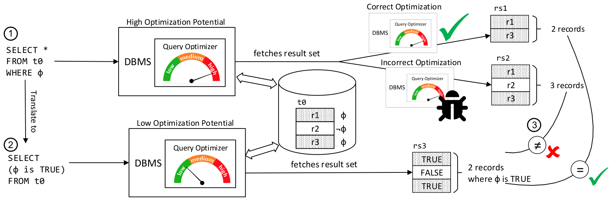

# Detecting Optimization Bugs in Database Engines via Non-Optimizing Reference Engine Construction（中文译文）

## 译者说明

本文依据同目录的 `source.pdf` 翻译。章节、图表、公式、算法、代码与参考文献按原文结构保留。

## 摘要

数据库管理系统（DBMS）被广泛使用。为了高效访问数据，DBMS 会应用复杂的优化。错误的优化可能导致逻辑错误（logic bugs），使查询计算出不正确的结果集。本文提出非优化参考引擎构造（Non-Optimizing Reference Engine Construction, NoREC），一种用于检测 DBMS 优化错误的全自动方法。

概念上，该方法希望用同一 DBMS 的优化版本和非优化版本分别执行一个查询，然后检测两者返回结果集的差异；这种差异表明 DBMS 中存在错误。难点在于，DBMS 通常只提供有限的优化控制能力，因此获得一个非优化版本并不容易。本文的核心洞见是：一个给定的、可能随机生成的优化查询，可以被改写成 DBMS 无法有效优化的查询。执行这个未优化查询，等价于让一个非优化参考引擎执行原查询。

我们在 PostgreSQL、MariaDB、SQLite 和 CockroachDB 四个广泛使用的 DBMS 上开展了大规模测试，发现了 159 个此前未知的错误，其中 141 个已被开发者修复。在这些错误中，51 个是优化错误，其余是错误处理和崩溃类问题。结果表明，NoREC 有效、通用，并且实现成本低，因此适合在实践中广泛应用。

## 1. 引言

DBMS 是大量系统的重要组成部分。为了满足持续增长的性能需求，数据库系统会在查询求值过程中应用越来越复杂的优化。查询优化器通常被视为 DBMS 中最复杂的组件之一，也因此带来了重要的正确性挑战。优化器中的实现错误可能导致逻辑错误，也就是 DBMS 对某个查询返回错误结果集。本文将查询优化器导致的逻辑错误称为优化错误（optimization bugs）。

此前提出的 Pivoted Query Synthesis（PQS）通过一个随机选择的支点行（pivot row）来验证 DBMS。PQS 会生成一个预期能够取回该支点行的查询，并据此判断 DBMS 是否正确。PQS 已经在常用 DBMS 中发现了很多错误，但它的主要缺点是实现成本高：为了判断随机表达式是否应当求值为 TRUE，需要重新实现 DBMS 支持的运算符和函数。由于 PQS 只关注一个支点行，它也难以检测重复行被错误取回或某行被错误遗漏这类问题。

另一类方法是差分测试（differential testing），例如 RAGS。它将同一个生成查询发送给多个 DBMS，如果不同 DBMS 的输出不同，则至少有一个系统可能存在错误。这种方法的缺点是只能覆盖 SQL 的公共核心。不同 DBMS 支持的类型、运算符和语义存在差异，即使是相同运算符也可能有细微不同，因此可用查询空间较小。

本文提出 NoREC，一种新的、通用且成本较低的 DBMS 优化错误检测技术。高层思路是比较同一 DBMS 的优化执行结果与“非优化”执行结果。直接禁用优化并不现实：许多优化不能关闭，即便有运行时或编译期选项，也通常只覆盖某些特定优化。NoREC 不要求修改 DBMS，而是将可能被优化的查询改写为一个不易被优化的查询。关键洞见是：把含有 `WHERE` 子句的查询改写为在 `SELECT` 列表中逐行求值谓词的查询，就能规避大部分围绕过滤条件的优化。

### 示例：SQLite 中的 LIKE/GLOB 优化错误

**Listing 1：SQLite 的 LIKE/GLOB 优化错误。**

```sql
CREATE TABLE t0(c0 UNIQUE);
INSERT INTO t0 VALUES (-1);

SELECT * FROM t0 WHERE t0.c0 GLOB '-*'; -- {}
SELECT t0.c0 GLOB '-*' FROM t0;         -- {TRUE}
```

表中只有一行 `-1`。谓词 `t0.c0 GLOB '-*'` 应当匹配以 `-` 开头的字符串。第一个查询在 `WHERE` 中使用该谓词，SQLite 对其应用了类似 LIKE 的索引优化，但错误地遗漏了这行记录。第二个查询将谓词移动到 `SELECT` 列表中，对每一行逐一求值，不再能被同样的过滤优化影响；它返回 TRUE。两者的计数不一致，因此暴露出优化错误。

我们将 NoREC 实现在 SQLancer 中，并在 5 个月测试活动中发现 159 个此前未知错误，其中 141 个随后修复、14 个得到确认；按表现分类，包括 51 个优化错误、23 个发布构建崩溃、27 个调试断言失败和 58 个内部错误。即使 SQLite 已经过 PQS 的广泛测试，NoREC 仍在其中发现 100 多个新错误。论文贡献如下：

- 提出一种基于新测试预言（test oracle）的 DBMS 优化错误检测技术 NoREC。
- 在 SQLancer 中实现 NoREC。
- 通过大规模评估发现超过 150 个常用 DBMS 新错误。

## 2. 背景

### DBMS 与 SQL

多数广泛使用的 DBMS 基于 Codd 提出的关系数据模型。SQL 基于关系代数，是关系 DBMS 中最常用的数据定义、数据插入、数据操作和数据检索语言。NoREC 主要面向关系 DBMS。它不直接适用于通常有独立查询语言或只支持 SQL 子集的 NoSQL DBMS，但适用于提供 SQL 接口的新一代 NewSQL 系统。

### 自动化测试

本文聚焦自动化测试。自动化测试虽然不能证明错误不存在，但在发现缺陷方面实用有效。一个自动化测试方法通常需要两个核心组件：能够覆盖待测系统重要部分的测试用例，以及能够判断测试用例是否按预期执行的测试预言。数据库生成器和查询生成器已有大量研究，但用于发现 DBMS 逻辑错误的测试预言相对不足。NoREC 正是为此提出的一种低成本测试预言。

### DBMS 优化

DBMS 通常包含查询优化器，它会检查查询、简化查询，并选择高效的物理访问路径。对 Listing 1 中第一个查询而言，优化器会重点围绕 `WHERE` 子句构造高效执行计划，因为过滤和连接条件往往是查询性能的关键。第二个查询把谓词放在 `SELECT` 列表中，每一行都会被求值，留给优化器的有效空间明显更少。NoREC 利用这一点，把优化查询翻译成较少被优化的查询。

### 差分测试与优化控制

差分测试把同一输入交给多个预期等价的系统并比较输出。它在编译器、SMT 求解器等领域很成功，也曾用于 DBMS。对 DBMS 而言，难点在于不同系统的 SQL 方言和语义差异使公共查询空间很小。

另一个显然但不可行的方案是：在同一个 DBMS 中关闭优化后执行一次，再打开优化执行一次，比较结果。问题是大多数优化无法被单独禁用。DBMS 提供的开关通常有限，优化提示也并不覆盖所有优化。为了测试而给所有优化补充配置选项，既需要大量领域知识，也容易引入新的实现错误。

## 3. 方法

NoREC 的核心思想是：把一个会被 DBMS 优化的查询，转换为另一个 DBMS 无法有效优化的查询。为简洁起见，原查询称为优化查询（optimized query），转换后的查询称为未优化查询（unoptimized query）。转换并不能形式化保证完全没有优化，但我们发现它足以在实践中禁用大量相关优化。

### 3.1 方法总览

NoREC 随机生成形如：

```sql
SELECT * FROM t0 WHERE phi;
```

的优化查询。多数优化会作用于数据过滤，例如 `WHERE` 子句中的谓词 `phi`。如果 DBMS 正确，优化查询返回的行数应当等于表中使 `phi` 求值为 TRUE 的行数。随后 NoREC 将查询翻译为：

```sql
SELECT (phi IS TRUE) FROM t0;
```

该查询没有 `WHERE` 条件，DBMS 必须取出所选表中的每一行，并对每行计算谓词。NoREC 对第二个查询返回的 TRUE 个数进行计数，再与第一个查询结果集的行数比较。如果两者不同，就报告优化错误。

NoREC 只比较基数，而不比较完整结果集。这使转换更简单，也避免了输出列、排序和重复行等因素带来的额外复杂性。



NoREC 的测试预言可写成如下基数关系：

$$
|Q_{opt}| = |\sigma_{column1 = TRUE}(Q_{unopt})|
$$

即优化查询返回的行数，必须等于未优化查询逐行求值后结果为 TRUE 的行数。若错误优化产生结果集 `rs2`，而未优化路径产生 `rs3`，则

$$
|rs2| \ne |\sigma_{column1 = TRUE}(rs3)|
$$

说明查询优化器可能存在错误。

### 3.2 查询翻译

最简单的情形是把 `WHERE phi` 移到 `SELECT` 列表中：

```sql
SELECT * FROM t0 WHERE phi;
SELECT (phi IS TRUE) FROM t0;
```

对于包含连接的查询，连接子句可以复制到未优化查询中，只移动过滤谓词。

**Listing 2：转换时复制 JOIN 子句。**

```sql
SELECT *
FROM t0
LEFT JOIN t1 ON t0.c0 = t1.c0
JOIN t2 ON t2.c0 > t0.c1
WHERE t2.c0 = 5;

SELECT ((t2.c0 = 5) IS TRUE)
FROM t0
LEFT JOIN t1 ON t0.c0 = t1.c0
JOIN t2 ON t2.c0 > t0.c1;
```

连接条件会影响中间结果和最终基数，因此不能随意移动。`WHERE` 条件被改成投影表达式后，DBMS 需要先生成连接结果，再对每行计算布尔值。

`ORDER BY` 不影响基数，因此翻译时可以省略，也可以替换它，以测试与排序有关的错误。`GROUP BY` 会把相同值的记录分组，常与聚合或窗口函数一起使用；若优化查询带有 `GROUP BY`，可以把它复制到未优化查询，但还需要额外一层查询，把各组中谓词为 TRUE 的中间计数求和。`HAVING`、聚合与窗口表达式还需要相应的专门转换，当前方法不能直接覆盖所有这类构造。

### 3.3 计数

对于优化查询，NoREC 交替使用两种策略。

**Listing 3：优化查询的两种计数策略。**

```sql
SELECT * FROM t0 WHERE phi;       -- 遍历结果集计数
SELECT COUNT(*) FROM t0 WHERE phi; -- 直接返回计数
```

第一种策略对所有查询都适用，但开销可能较大。第二种策略更快：DBMS 可以优化计数，而且避免 SQLancer 与 DBMS 之间逐行跨边界传输；但更复杂的聚合查询也可能使某些优化不再适用，反而漏掉错误。为平衡性能与发现能力，SQLancer 在两种策略之间交替。

对于未优化查询，NoREC 可以使用聚合来统计 TRUE 个数。

**Listing 4：用聚合函数计算未优化查询的计数。**

```sql
SELECT SUM(count)
FROM (SELECT (phi IS TRUE) AS count FROM t0);
```

`SUM()` 把 TRUE 视为 1，把 FALSE 与 NULL 视为 0。PostgreSQL、CockroachDB 等系统不支持布尔值到整数的隐式转换，需要显式 cast 或改写成 `CASE WHEN phi IS TRUE THEN 1 ELSE 0 END`。我们假定 DBMS 既然无法优化内层逐行谓词，也无法有意义地优化其外层聚合，因此未优化查询固定使用这种高效策略。

基本预言还可以扩展为验证记录内容：未优化查询除谓词外列出所有原始列，再把谓词为 TRUE 的记录与优化查询返回的记录逐项比较。这必须使用较慢的逐行策略。该扩展曾在一个 SQLite 扩展中发现额外错误，但不是优化器错误。我们没有观察到会改写所取内容的优化；虽然理论上可能出现“内容错误但基数相同”，实验表明这类错误并不常见。

### 3.4 边界情况与限制

我们测试了各 DBMS 的大部分功能，并总结出若干通用限制和三个需要特殊处理的 SQLite 边界情况。这些限制没有妨碍 NoREC 找到真实错误。

**歧义查询。** 子查询可能返回多行，而 DBMS 对其取值方式并不一致。为避免把这类语义差异误报为优化错误，当前实现不生成子查询；未来可改为只生成无歧义的子查询。

**非确定性函数。** 随机数、当前时间等函数可能在两次执行中自然产生不同结果，因此生成器会排除这些函数。

**短路求值。** SQL 没有规定 `AND` 和 `OR` 必须短路。若谓词 `phi_ok AND phi_err` 中的 `phi_err` 会报错，不同求值顺序可能使优化查询与未优化查询一个成功、一个失败；NoREC 因而不适合判断“优化掉预期错误”这一类问题。

**其他 SQL 特性。** 当前转换不能直接处理 `DISTINCT`、聚合函数、窗口函数等跨多行计算结果的构造。它们同样可能包含优化错误，但需要新的转换规则。

**SQLite 的数值比较与 `DISTINCT`。** SQLite 认为表示同一数值的浮点数和整数相等。Listing 5 中，视图 `v0` 对 `0.0` 与 `0` 去重后只保留一个未指定的表示：第一个查询取到 `0`，拼接后得到 `00.1` 并求值为 TRUE；第二个查询取到 `0.0`，拼接后得到 `0.00.1` 并求值为 FALSE。实现最终通过禁止在视图中生成 `DISTINCT` 来排除这种误报。

**Listing 5：视图中的 `DISTINCT` 可能导致 SQLite 结果不一致。**

```sql
CREATE TABLE t0(c0);
INSERT INTO t0(c0) VALUES (0.0), (0);
CREATE VIEW v0(c0) AS SELECT DISTINCT c0 FROM t0;

SELECT COUNT(*) FROM v0 WHERE v0.c0 || 0.1; -- 1
SELECT (v0.c0 || 0.1) IS TRUE FROM v0;      -- 0
```

**SQLite 的输入列。** `dbstat` 扩展把 `stat.aggregate = 1` 当作配置输入。该谓词放在 `WHERE` 中会改变虚表行为并返回一行，放在 `SELECT` 列表中则不再作为输入，因而不返回记录。SQLancer 会避免为这个特定列生成设置配置的子句。

**Listing 6：SQLite 输入列可能改变查询行为。**

```sql
CREATE VIRTUAL TABLE stat USING dbstat;

SELECT * FROM stat WHERE stat.aggregate = 1; -- 返回一行
SELECT stat.aggregate = 1 FROM stat;         -- FALSE
```

**SQLite 中歧义的 `GROUP BY`。** SQLite 允许其他受测 DBMS 会拒绝的歧义分组。Listing 7 展示了这类分组与优化器提示组合后产生的不一致；测试期间这种情况很少，我们没有在 SQLancer 中专门处理。

**Listing 7：歧义 `GROUP BY` 可能导致 SQLite 结果不一致。**

```sql
CREATE TABLE t0(c0, c1, c2, PRIMARY KEY(c2)) WITHOUT ROWID;
CREATE INDEX i0 ON t0(CAST(c1 AS INT));
CREATE VIEW v0 AS SELECT 0, c0 FROM t0 GROUP BY 1 HAVING c2;
INSERT INTO t0(c2) VALUES('');
INSERT INTO t0(c1, c2) VALUES(1, 1);

SELECT * FROM v0 WHERE UNLIKELY(1); -- {}
SELECT UNLIKELY(1) FROM v0;         -- TRUE
```

### 3.5 查询与数据库生成

随机或定向生成数据库与查询已有大量研究，不是本文贡献。NoREC 可以作用于任意随机生成或已有数据库，也可接入任何能够避开 §3.4 边界情况、或把相应错误过滤掉的随机查询生成器；论文说明自身生成器只是为了让实现完整可复现。

我们以 SQLancer 为基础，并新增 CockroachDB、MariaDB 支持以及更多数据类型、运算符和函数。SQLancer 通过随机建表、建索引、插入、更新和删除数据来持续扰动 DBMS，提高触发错误的概率。查询生成的核心是随机表达式：生成器依据当前 schema 和目标 DBMS 的语法，从适用选项中启发式选择表达式，并把它们放入 `WHERE` 与 `JOIN` 子句。选项必须按 DBMS 定制，因为不同系统支持的运算符与隐式转换不同。由于 NoREC 不需要像 PQS 那样重实现这些函数的真实语义，为新 DBMS 添加测试预言的成本较低。

## 4. 评估

### 4.1 方法论

我们在四个重要且广泛使用的 DBMS 上评估 NoREC：SQLite、MariaDB、PostgreSQL 和 CockroachDB。SQLite 是部署最广的 DBMS，主要浏览器、手机和嵌入式系统都使用它，开发者估计有超过一万亿个 SQLite 数据库正在使用。MySQL 在流行度排名中居前，但源码通常随每 2–3 个月一次的正式版本发布，不利于及时判断多个测试用例是否源于同一个错误；此前 PQS 报告的错误也只有一部分得到修复。因此我们改测采用开放开发流程、且与 MySQL 共享大量代码的 MariaDB。PostgreSQL 很流行，也显得比多数系统更稳健，PQS 只在其中发现过一个逻辑错误。CockroachDB 是较新的商业 NewSQL 系统，GitHub 关注度很高；本文只测试其免费社区版，不测试企业版。

测试投入还受开发者反馈速度影响。SQLite 开发者通常在报告后数小时内修复错误，因此我们在 SQLite 上投入最多，并测试核心以及需构建时启用的 FTS、R-Tree、DBSTAT 三个扩展。FTS 被 Chrome 等软件启用，曾受到安全研究者深入检查；R-Tree 是空间范围查询的重要索引；DBSTAT 是查询 SQLite 文件内容的虚表。我们也大量测试 PostgreSQL，但没有找到有代表性的错误。CockroachDB 开发者迅速确认问题，尤其会在数日内修复优化器错误；MariaDB 开发者虽迅速确认，最初一批问题中却只修复一个，我们因重复问题难以过滤而停止继续测试。

这些系统原本已有很强的测试。SQLite 的流程受航空安全软件 DO-178B 指南启发，实现 100% modified condition/decision coverage，并执行内存不足、I/O 错误、崩溃、复合故障、模糊测试和动态分析。CockroachDB 把自动测试纳入持续集成：语法模糊器三年发现约 70 个崩溃或挂起问题，Go 版 SQLSmith 又发现 40 多个错误，但开发者也指出，这类模糊测试本身无法判断结果是否正确；NoREC 正是补上这一测试预言缺口。

**表 1：被测 DBMS 的流行度、规模与首次发布时间。**

| DBMS | DB-Engines 排名 | Stack Overflow 排名 | GitHub Stars | 代码行数 | 首次发布 |
| --- | ---: | ---: | ---: | ---: | ---: |
| SQLite | 11 | 4 | 1.5k | 0.3M | 2000 |
| MariaDB | 13 | 7 | 3.2k | 3.6M | 2009 |
| PostgreSQL | 4 | 2 | 6.3k | 1.4M | 1996 |
| CockroachDB | 75 | - | 17.7k | 1.1M | 2015 |

我们迭代实现并部署 NoREC：每加入一种查询特性（如新运算符）或数据库特性（如新类型）就继续运行测试。有些错误在加入特性数秒后出现，另一些经过数周才触发。发现问题后先缩减测试用例；虽然已有专用 SQL reducer，实践中为 C/C++ 设计的 C-Reduce 已足够，随后再人工缩减和规范化，以降低开发者调试成本。排除潜在重复后，问题会提交到 tracker、邮件列表，疑似安全问题则私下报告；论文不分析安全影响。错误修复前，生成器会尽量避开已知触发模式。整个活动共提交 168 份错误报告；由于工具边实现边部署，我们没有给出总运行时间或整体效率统计。

### 4.2 代表性错误

论文列举了多个 NoREC 发现的真实错误。

#### 4.2.1 SQLite 错误

一个 `IN` 谓词与类型亲和性（affinity）相关的错误会导致表达式结果不一致。SQLite 错误地把常量 `'1'` 转换为整数，从而取回本不应出现的记录。

**Listing 8：`IN` 优化与 affinity 表达式错误。**

```sql
CREATE TABLE t0(c0 INT UNIQUE);
INSERT INTO t0(c0) VALUES (1);

SELECT * FROM t0 WHERE '1' IN (t0.c0); -- 观测到 {1}，预期 {}
```

另一个错误来自部分索引：交换运算符两侧后，优化器错误地使用了带 `COLLATE NOCASE` 条件的 partial index。

**Listing 9：运算符交换导致错误使用 partial index。**

```sql
CREATE TABLE t0(c0 COLLATE NOCASE, c1);
CREATE INDEX i0 ON t0(0) WHERE c0 >= c1;
INSERT INTO t0 VALUES('a', 'B');

SELECT * FROM t0 WHERE t0.c1 <= t0.c0; -- 观测到 {a|B}，预期 {}
```

#### 4.2.2 CockroachDB 错误

一个向量化执行引擎中的错误会遗漏记录。Listing 10 的笛卡尔积本应返回两条 `{NULL|0}` 记录，向量化路径却返回空集。

**Listing 10：向量化引擎错误导致记录遗漏。**

```sql
SET SESSION VECTORIZE=experimental_on;
CREATE TABLE t1(c0 INT);
CREATE TABLE t0(c0 INT UNIQUE);
INSERT INTO t1(c0) VALUES (0);
INSERT INTO t0(c0) VALUES (NULL), (NULL);

SELECT * FROM t0, t1 WHERE t0.c0 IS NULL; -- 观测到 {}，预期两条 {NULL|0}
```

另一个错误来自过滤处理：谓词 `t0.c0 AND (false NOT BETWEEN SYMMETRIC t0.c0 AND NULL AND true)` 本应求值为 `NULL`，CockroachDB 却错误取回了记录。

**Listing 11：过滤器处理错误导致意外取回记录。**

```sql
CREATE TABLE t0(c0 BOOL UNIQUE, c1 BOOL CHECK (true));
INSERT INTO t0(c0) VALUES (true);

SELECT *
FROM t0
WHERE t0.c0
  AND (false NOT BETWEEN SYMMETRIC t0.c0 AND NULL AND true); -- 观测到 {TRUE}，预期 {}
```

#### 4.2.3 MariaDB 错误

一个字符串范围扫描错误让 MariaDB 错误构造出 `NULL < x <= 0` 的索引范围，而正确上界应为 2，结果漏掉一行；该错误也影响 MySQL。

**Listing 12：range scan 错误导致记录遗漏。**

```sql
CREATE TABLE t0(c0 INT UNIQUE);
INSERT INTO t0 VALUES(NULL), (NULL), (NULL), (NULL), (1), (0);

SELECT * FROM t0 WHERE c0 < '\n2'; -- 观测到 {0}，预期 {0, 1}
```

另一个错误涉及带索引的整型列与浮点数比较。隐式类型转换后，`0.5 = 1.0` 应为 FALSE，优化路径却错误取回唯一记录。

**Listing 13：浮点数与整数列比较意外求值为 TRUE。**

```sql
CREATE TABLE t0(c0 INT);
INSERT INTO t0 VALUES (1);
CREATE INDEX i0 ON t0(c0);

SELECT * FROM t0 WHERE 0.5 = c0; -- 观测到 {1}，预期 {}
```

这些错误共同说明，优化错误不局限于某个具体 DBMS，也不局限于某一种优化。

### 4.3 错误总览

我们共发现 159 个此前未知错误，涉及 SQLite、MariaDB、PostgreSQL 和 CockroachDB，其中 141 个已修复。表 2 给出各系统的处理状态。

**表 2：159 个真实错误的状态统计。**

| DBMS | 已修复 | 已确认 | 按预期工作 | 重复 |
| --- | ---: | ---: | ---: | ---: |
| SQLite | 110 | 0 | 6 | 0 |
| MariaDB | 1 | 5 | 0 | 1 |
| PostgreSQL | 5 | 2 | 1 | 0 |
| CockroachDB | 28 | 7 | 0 | 1 |

按测试预言或错误表现分类时，NoREC 直接发现 51 个逻辑错误，意外内部错误暴露 58 个问题，发布构建崩溃 23 次，调试构建断言失败 27 次。

**表 3：按测试预言与错误表现分类的错误数。**

| DBMS | 逻辑错误 | 内部错误 | 发布构建崩溃 | 调试断言失败 |
| --- | ---: | ---: | ---: | ---: |
| SQLite | 39 | 30 | 15 | 26 |
| MariaDB | 5 | 0 | 1 | 0 |
| PostgreSQL | 0 | 4 | 3 | 1 |
| CockroachDB | 7 | 24 | 4 | 0 |

在 168 份报告中，159 份是此前未知的真实错误；141 个通过代码修改解决，14 个已确认但尚未处理，另有 3 份以文档修改收口。9 份不是真实错误：其中 7 份属于开发者认可的预期内部错误，或源于我们当时尚未识别的 §3.4 限制；另外 2 份是已知错误。测试始终针对各系统最新版本。

除 NoREC 逻辑预言外，SQLancer 还为每条 SQL 维护预期错误清单，从而识别 58 个意外内部错误；它本身也相当于语法模糊器，发现了发布构建中的 23 个崩溃或挂起。SQLite、PostgreSQL 使用调试构建，另发现 27 个断言失败。可选的 `ORDER BY` 与 `GROUP BY` 对发现能力贡献不大：`ORDER BY` 找到 1 个逻辑错误和 1 个崩溃，`GROUP BY` 找到 1 个内部错误；但实现成本很低，仍值得保留。

SQLite 中发现的错误最多，这与我们投入最多测试时间一致。110 个 SQLite 错误中，71 个影响核心，13 个影响 R-Tree，24 个影响 FTS，2 个影响 DBSTAT；部分扩展错误实际影响所有基于虚表的扩展。SQLite 在测试期间把 generated columns 合入 trunk，NoREC 在正式发布前就发现其中 22 个错误。26 个调试断言失败有些并非核心缺陷，而是 SQLite 自身测试逻辑遗漏边界情况。发布构建崩溃数量也很突出：generated columns 占 9 个，此外还有 1 个 FTS 挂起、1 个 trigger 错误、2 个 R-Tree 错误和 2 个窗口函数错误。

我们虽在 PostgreSQL 上投入很多，只找到 8 个错误，且没有优化错误；这与 PQS 仅发现一个逻辑错误的结果一致。可能原因包括 PostgreSQL 对输入限制更严格，以及其细致的同行评审流程。CockroachDB 共发现 35 个错误，其中 15 个依赖实验特性，11 个影响向量化执行引擎；24 个内部错误中有 17 个会显示含报告位置的堆栈而保持服务器可响应。开发者据此增强测试基础设施并审查类似代码。MariaDB 共发现 6 个错误，全部迅速确认，3 个也能在 MySQL 复现；三个月内只修复一个，我们又只投入少量测试，因此 NoREC 很可能还能发现更多。

### 4.4 与 PQS 的比较

PQS 是当时发现 DBMS 逻辑错误的先进方法，也是最直接的比较对象；我们预期 PQS 能覆盖更广的错误类型，而 NoREC 的目标集中在优化错误。没有其它公开工具能够检测同类 DBMS 逻辑错误。

**比较困难。** 公平比较并不容易。PQS 实现成本很高，因此原实现只能覆盖各 DBMS SQL 方言的核心子集：仅一个能够比较任意类型并处理隐式转换的比较运算符就超过 200 行代码；相比之下，NoREC 预言不足 200 行，却能覆盖复杂运算符和函数的优化。虽然实现投入本身不应决定效果比较，两个实验使用的 DBMS 集合也不同：两者都测试 SQLite、PostgreSQL，PQS 另测 MySQL，NoREC 则测试 MariaDB、CockroachDB，无法直接自动对照结果。

**方法。** 我们采用人工定量和定性比较。若 NoREC 测试用例能由 PQS 触发，就保留原 `WHERE` 谓词，并寻找适用的支点行；反过来，PQS 用例通常也能通过 NoREC 的未优化查询转换复现。我们在错误出现的 DBMS 版本上逐一构造并运行等价用例。虽然无法完全排除漏看其它可复现查询而导致的误分类，大多数案例边界清楚。比较只统计 NoREC 预言直接发现的逻辑错误，不统计两种方法原则上都能发现的内部错误与崩溃。最终检查了 NoREC 的 51 个错误能否由 PQS 发现，以及 PQS 的 61 个错误能否由 NoREC 发现。

**仅 NoREC 能发现的类别。** 按 PQS 当时的能力，它能发现 NoREC 错误中的 56.9%。NoREC 发现了 4 个重复行被错误增加或遗漏的问题；PQS 每次只验证一个与其它重复行不可区分的支点行，原则上不能发现。NoREC 还通过 `SUM`、`COUNT` 等计数聚合触发 5 个错误，而 PQS 的主预言一次只检查一行。另有 13 个错误会错误地多取记录；PQS 只生成保证取回支点行的查询，因此只能发现支点行被遗漏。若把 PQS 扩展为生成保证排除支点行的查询，其理论可检出比例可提高到 82.4%，但很多案例仍要求近乎完整地重实现 DBMS 语义。

**仅 PQS 能发现的类别。** NoREC 能复现 PQS 错误中的 52.7%。它遗漏的最大一类是优化与未优化路径都会错误实现的运算符、函数和其它特性，尤其 SQLite affinity conversion，共 18 个；因为两个路径给出相同错误答案，NoREC 的变形关系无法察觉。另有 3 个错误依赖 `DISTINCT`，当前 NoREC 忽略它，但未来可在未优化路径改写为 `GROUP BY`。PQS 通常也无法测试聚合函数，不过单行表让它发现了 3 个此类错误。PQS 还借助用于成员检查的 `INTERSECT` 发现 1 个错误，并在 `LEFT JOIN` 的 `ON` 谓词中触发 1 个错误；NoREC 当前原样复制 join 和谓词，因而漏掉后者，未来可增加 join 转换策略。

总体而言，PQS 能发现 NoREC 覆盖不到的非优化逻辑错误，NoREC 也能发现 PQS 原理上难以发现的重复行、额外行与计数错误。PQS 的代价是每个目标 DBMS、每个运算符和函数都要重实现；NoREC 的转换简单，只要数据库与查询生成器避开 §3.4 限制即可接入。最合理的组合是先用精确的 PQS 验证基础运算符与函数、建立 ground truth，再用低成本 NoREC 清理未被充分测试区域中的优化错误。

## 5. 讨论

多个 DBMS 开发者都表示认可这些报告。SQLite 测试页面专门强调 Manuel Rigger 的工作：普通 fuzzer 多寻找断言、崩溃、未定义行为等容易识别的异常，而他的 fuzzer 能发现 SQLite 计算错误答案的情况。许多案例是类型转换、affinity 或未发布特性的隐蔽边界，但它们仍是真实错误，SQLite 开发者感谢这些发现，并认为这项工作可能像 AFL 与 profile-guided fuzzing 一样产生影响。

我们认为其中许多错误可能影响真实用户，也承认一些只能由罕见的运算符或特性组合触发。即便看似古怪的组合也会由 ORM 或代码生成器产生：SQLite 邮件列表上曾有用户报告一个复杂 `WHERE` 谓词的错误结果，并说明它源自 Django ORM 的 `.exclude(nullable_joined_table__column=1)`。这个底层错误恰好已因我们此前报告而在开发版修复；我们当初用 view 与 `NOTNULL NOTNULL` 这种人工不太会写的组合触发它。中间件生成查询时，用户还更难定位根因。

**连接处理。** 当前翻译原样保留 `JOIN`。这已发现一些 join 处理错误，但若把 `ON` 条件也移到 `SELECT` 后，可能覆盖更多错误。Inner join 的 `ON phi_1` 与 `WHERE phi_2` 可直接合成 `phi_1 AND phi_2`；left join 等外连接则需要组合多条未优化查询，不能靠一个简单 `SELECT` 完成。额外 join 转换策略属于未来工作。

**覆盖率与性能。** 代码覆盖率和运行时间看似适合衡量 NoREC，实际上都不能解释效果。DBMS fuzzer 很快就能让优化器等核心组件达到高覆盖，而 SQLite 的测试已经有 100% MC/DC 覆盖，NoREC 仍能发现错误。查询生成与翻译开销可忽略，运行时间主要花在 DBMS 执行查询以及 SQLancer 与 DBMS 通信；SQLite 是嵌入式系统，与 SQLancer 同进程运行，所以通信开销更低。

**错误类型。** 159 个真实错误中只有 51 个是优化错误，但这类错误最严重，因为它们会静默返回错误结果。崩溃、断言和内部错误占比更高，也更容易被语法 fuzzer 发现，并会明确告诉用户系统故障。结果也可能说明，现有生成方式下非逻辑错误本来就更多或更容易触发；论文没有全部潜在错误的 ground truth，不能据此判断绝对分布。

**自动化程度。** NoREC 反复生成测试、自动验证结果，无需人工参与，因此是全自动方法；§3.4 的边界情况必须预先处理，避免误报。发现错误后，自动缩减用例已经足以成立，人工继续最小化只是方便开发者调试。报告前人工搜索重复问题也不是预言本身所必需。实际持续运行时，适合在报告一个错误后暂停，待该错误修复再继续，以避免重复触发。

## 6. 相关工作

**DBMS 差分测试。** 差分测试把同一输入交给多个系统，输出不一致即说明至少一个系统有错；它已成功用于编译器、SMT 求解器等领域。Slutz 的 RAGS 首次把它用于 DBMS，通过多个系统执行同一 SQL，但只能覆盖很小的 SQL 公共子集。Gu 等人用选项和 hint 强制同一 DBMS 生成不同计划，再根据估算代价评估优化器准确性。APOLLO 则在 DBMS 新旧版本上执行同一查询，发现 SQLite、PostgreSQL 中 10 个此前未知的性能回退。NoREC 虽属于变形测试，也可以理解为在同一 DBMS 的优化与非优化版本之间做差分测试。

**其它正确性预言。** PQS 基于随机支点行，是最接近的工作，已在常用 DBMS 中发现近 100 个逻辑错误，但完整重实现运算符和函数的成本很高。NoREC 只针对逻辑错误中的优化错误，却能以低实现成本覆盖 PQS 太昂贵而未实现的组件。查询感知数据库生成器 ADUSA 同时生成输入数据与预期查询结果：它把 schema 和查询翻译成 Alloy 规范后求解，复现了 MySQL、HSQLDB 的已知或注入错误，并发现一个 Oracle Database 新错误；求解器开销可能限制大规模发现能力。

**随机与定向查询。** SQLsmith 是广泛使用的开源随机查询生成器，已发现 100 多个 DBMS 错误。其它方法用遗传算法或执行反馈引导生成；SQLFUZZ 只使用所有目标 DBMS 都支持的特性；solver-backed 方法同时保证语法和语义有效。为子表达式生成满足指定基数的查询在计算上很困难，因此又出现多种启发式和近似方案。这些生成器本身可发现崩溃或挂起，接入 NoREC 预言后也能发现逻辑错误。

**随机与定向数据库。** QAGen 把传统查询处理与符号执行结合，生成满足查询结果约束的数据库；Reverse Query Processing 从查询和期望结果集反推可能产生它的数据库；ADUSA 同样感知查询。Gray 等人用并行算法快速生成十亿级记录，DGL 通过可组合 iterator 表达分布与跨表相关性，Neufeld 等人则从表约束推导生成公式并翻译为生成算子。更好的数据库生成器可直接增强 NoREC 的发现能力。

**变形测试。** 变形测试从一次系统输入/输出构造新输入，并通过变形关系推断预期结果，已用于多个领域。NoREC 通过“查询翻译 + 计数”建立专门针对优化错误的变形关系。其根本限制是不能建立绝对 ground truth：优化与未优化查询可能同时返回同一个错误答案，也可能反而是未优化查询错误、优化查询正确；这正是 §4.4 中部分 PQS 错误无法由 NoREC 发现的原因。

## 7. 结论

本文提出 NoREC，一种通用且高效的 DBMS 错误检测方法。其核心洞见是：可以把给定的优化查询翻译成未优化查询，从而构造一个测试预言，通过比较两者结果集基数来检测优化错误。

NoREC 为 DBMS 正确性测试提供了坚实基础。未来可以通过更多转换策略扩展这一方法，例如转换连接谓词、交换可交换运算符两侧，或者与更好的数据库/查询生成器结合，以提高效率和覆盖面。

## 致谢

我们感谢 DBMS 开发者验证和修复错误报告，也感谢匿名审稿人、Martin Kersten 以及 ETH Zurich AST Lab 成员的反馈。

## 参考文献

- [1] Shadi Abdul Khalek and Sarfraz Khurshid. 2010. Automated SQL Query Generation for Systematic Testing of Database Engines. In Proceedings of the IEEE/ACM International Conference on Automated Software Engineering (Antwerp, Belgium) (ASE '10). ACM, New York, NY, USA, 329-332. https://doi.org/10.1145/1858996.1859063
- [2] Hardik Bati, Leo Giakoumakis, Steve Herbert, and Aleksandras Surna. 2007. A Genetic Approach for Random Testing of Database Systems. In Proceedings of the 33rd International Conference on Very Large Data Bases (Vienna, Austria) (VLDB '07). VLDB Endowment, 1243-1251.
- [3] Carsten Binnig, Donald Kossmann, and Eric Lo. 2007. Reverse Query Processing. Proceedings - International Conference on Data Engineering, 506-515. https://doi.org/10.1109/ICDE.2007.367896
- [4] Carsten Binnig, Donald Kossmann, Eric Lo, and M. Tamer Özsu. 2007. QAGen: Generating Query-Aware Test Databases. In Proceedings of the 2007 ACM SIGMOD International Conference on Management of Data (Beijing, China) (SIGMOD '07). Association for Computing Machinery, New York, NY, USA, 341-352. https://doi.org/10.1145/1247480.1247520
- [5] Carl Friedrich Bolz, Darya Kurilova, and Laurence Tratt. 2016. Making an Embedded DBMS JIT-friendly. In 30th European Conference on Object-Oriented Programming, ECOOP 2016, July 18-22, 2016, Rome, Italy. 4:1-4:24. https://doi.org/10.4230/LIPIcs.ECOOP.2016.4
- [6] Robert Brummayer and Armin Biere. 2009. Fuzzing and Delta-Debugging SMT Solvers. In Proceedings of the 7th International Workshop on Satisfiability Modulo Theories (Montreal, Canada) (SMT '09). Association for Computing Machinery, New York, NY, USA, 1-5. https://doi.org/10.1145/1670412.1670413
- [7] Nicolas Bruno and Surajit Chaudhuri. 2005. Flexible Database Generators. In Proceedings of the 31st International Conference on Very Large Data Bases (Trondheim, Norway) (VLDB '05). VLDB Endowment, 1097-1107.
- [8] Nicolas Bruno, Surajit Chaudhuri, and Ravi Ramamurthy. 2009. Power Hints for Query Optimization. In Proceedings of the 2009 IEEE International Conference on Data Engineering (ICDE '09). IEEE Computer Society, USA, 469-480. https://doi.org/10.1109/ICDE.2009.68
- [9] Nicolas Bruno, Surajit Chaudhuri, and Dilys Thomas. 2006. Generating Queries with Cardinality Constraints for DBMS Testing. IEEE Trans. on Knowl. and Data Eng. 18, 12 (Dec. 2006), 1721-1725. https://doi.org/10.1109/TKDE.2006.190
- [10] Donald D. Chamberlin and Raymond F. Boyce. 1974. SEQUEL: A Structured English Query Language. In Proceedings of the 1974 ACM SIGFIDET (Now SIGMOD) Workshop on Data Description, Access and Control (Ann Arbor, Michigan) (SIGFIDET '74). ACM, New York, NY, USA, 249-264. https://doi.org/10.1145/800296.811515
- [11] Tsong Y Chen, Shing C Cheung, and Shiu Ming Yiu. 1998. Metamorphic testing: a new approach for generating next test cases. Technical Report. Technical Report HKUST-CS98-01, Department of Computer Science, Hong Kong.
- [12] Tsong Yueh Chen, Fei-Ching Kuo, Huai Liu, Pak-Lok Poon, Dave Towey, T. H. Tse, and Zhi Quan Zhou. 2018. Metamorphic Testing: A Review of Challenges and Opportunities. ACM Comput. Surv. 51, 1, Article 4 (Jan. 2018), 27 pages. https://doi.org/10.1145/3143561
- [13] And Clover. 2019. Bug submission: left join filter on negated expression including NOTNULL. https://www.mail-archive.com/sqlite-users@mailinglists.sqlite.org/msg117434.html
- [14] E. F. Codd. 1970. A Relational Model of Data for Large Shared Data Banks. Commun. ACM 13, 6 (June 1970), 377-387. https://doi.org/10.1145/362384.362685
- [15] E. F. Codd. 1972. Relational Completeness of Data Base Sublanguages. IBM Corporation.
- [16] Pascal Cuoq, Benjamin Monate, Anne Pacalet, Virgile Prevosto, John Regehr, Boris Yakobowski, and Xuejun Yang. 2012. Testing Static Analyzers with Randomly Generated Programs. In Proceedings of the 4th International Conference on NASA Formal Methods (Norfolk, VA) (NFM '12). Springer-Verlag, Berlin, Heidelberg, 120-125. https://doi.org/10.1007/978-3-642-28891-3_12
- [17] DB-Engines. 2019. DB-Engines Ranking (July 2019). https://db-engines.com/en/ranking
- [18] Bailu Ding, Sudipto Das, Wentao Wu, Surajit Chaudhuri, and Vivek Narasayya. 2018. Plan Stitch: Harnessing the Best of Many Plans. Proc. VLDB Endow. 11, 10 (June 2018), 1123-1136. https://doi.org/10.14778/3231751.3231761
- [19] Ramez Elmasri and Sham Navathe. 2017. Fundamentals of database systems. Vol. 7. Pearson.
- [20] Leo Giakoumakis and César A Galindo-Legaria. 2008. Testing SQL Server's Query Optimizer: Challenges, Techniques and Experiences. IEEE Data Eng. Bull. 31, 1 (2008), 36-43.
- [21] Torsten Grabs, Steve Herbert, and Xin (Shin) Zhang. 2008. Testing Challenges for Extending SQL Server's Query Processor: A Case Study. In Proceedings of the 1st International Workshop on Testing Database Systems (Vancouver, British Columbia, Canada) (DBTest '08). Association for Computing Machinery, New York, NY, USA, Article 2, 6 pages. https://doi.org/10.1145/1385269.1385272
- [22] Goetz Graefe. 1993. Query evaluation techniques for large databases. ACM Computing Surveys (CSUR) 25, 2 (1993), 73-169.
- [23] Jim Gray, Prakash Sundaresan, Susanne Englert, Ken Baclawski, and Peter J. Weinberger. 1994. Quickly Generating Billion-Record Synthetic Databases. SIGMOD Rec. 23, 2 (May 1994), 243-252. https://doi.org/10.1145/191843.191886
- [24] Zhongxian Gu, Mohamed A. Soliman, and Florian M. Waas. 2012. Testing the Accuracy of Query Optimizers. In Proceedings of the Fifth International Workshop on Testing Database Systems (Scottsdale, Arizona) (DBTest '12). ACM, New York, NY, USA, Article 11, 6 pages. https://doi.org/10.1145/2304510.2304525
- [25] Antonin Guttman. 1984. R-Trees: A Dynamic Index Structure for Spatial Searching. In Proceedings of the 1984 ACM SIGMOD International Conference on Management of Data (Boston, Massachusetts) (SIGMOD '84). Association for Computing Machinery, New York, NY, USA, 47-57. https://doi.org/10.1145/602259.602266
- [26] Kenneth Houkjær, Kristian Torp, and Rico Wind. 2006. Simple and Realistic Data Generation. In Proceedings of the 32nd International Conference on Very Large Data Bases (Seoul, Korea) (VLDB '06). VLDB Endowment, 1243-1246.
- [27] William E. Howden. 1978. Theoretical and Empirical Studies of Program Testing. In Proceedings of the 3rd International Conference on Software Engineering (Atlanta, Georgia, USA) (ICSE '78). IEEE Press, Piscataway, NJ, USA, 305-311.
- [28] Matt Jibson. 2016. Testing Random, Valid SQL in CockroachDB. https://www.cockroachlabs.com/blog/testing-random-valid-sql-in-cockroachdb/
- [29] Matt Jibson. 2019. SQLsmith: Randomized SQL Testing in CockroachDB. https://www.cockroachlabs.com/blog/sqlsmith-randomized-sql-testing/
- [30] Jinho Jung, Hong Hu, Joy Arulraj, Taesoo Kim, and Woonhak Kang. 2019. APOLLO: Automatic Detection and Diagnosis of Performance Regressions in Database Systems. Proc. VLDB Endow. 13, 1 (Sept. 2019), 57-70. https://doi.org/10.14778/3357377.3357382
- [31] Timotej Kapus and Cristian Cadar. 2017. Automatic Testing of Symbolic Execution Engines via Program Generation and Differential Testing. In Proceedings of the 32Nd IEEE/ACM International Conference on Automated Software Engineering (Urbana-Champaign, IL, USA) (ASE 2017). IEEE Press, Piscataway, NJ, USA, 590-600.
- [32] S. A. Khalek, B. Elkarablieh, Y. O. Laleye, and S. Khurshid. 2008. Query-Aware Test Generation Using a Relational Constraint Solver. In Proceedings of the 2008 23rd IEEE/ACM International Conference on Automated Software Engineering (ASE '08). IEEE Computer Society, Washington, DC, USA, 238-247. https://doi.org/10.1109/ASE.2008.34
- [33] Vu Le, Mehrdad Afshari, and Zhendong Su. 2014. Compiler Validation via Equivalence Modulo Inputs. In Proceedings of the 35th ACM SIGPLAN Conference on Programming Language Design and Implementation (Edinburgh, United Kingdom) (PLDI '14). ACM, New York, NY, USA, 216-226. https://doi.org/10.1145/2594291.2594334
- [34] Eric Lo, Carsten Binnig, Donald Kossmann, M. Tamer Özsu, and Wing-Kai Hon. 2010. A framework for testing DBMS features. The VLDB Journal 19, 2 (01 Apr 2010), 203-230. https://doi.org/10.1007/s00778-009-0157-y
- [35] Ryan Marcus, Parimarjan Negi, Hongzi Mao, Chi Zhang, Mohammad Alizadeh, Tim Kraska, Olga Papaemmanouil, and Nesime Tatbul. 2019. Neo: A Learned Query Optimizer. Proc. VLDB Endow. 12, 11 (July 2019), 1705-1718. https://doi.org/10.14778/3342263.3342644
- [36] William M McKeeman. 1998. Differential testing for software. Digital Technical Journal 10, 1 (1998), 100-107.
- [37] Chaitanya Mishra, Nick Koudas, and Calisto Zuzarte. 2008. Generating Targeted Queries for Database Testing. In Proceedings of the 2008 ACM SIGMOD International Conference on Management of Data (Vancouver, Canada) (SIGMOD '08). ACM, New York, NY, USA, 499-510. https://doi.org/10.1145/1376616.1376668
- [38] Andrea Neufeld, Guido Moerkotte, and Peter C. Lockemann. 1993. Generating Consistent Test Data: Restricting the Search Space by a Generator Formula. The VLDB Journal 2, 2 (April 1993), 173-214.
- [39] Thomas Neumann and Bernhard Radke. 2018. Adaptive Optimization of Very Large Join Queries. In Proceedings of the 2018 International Conference on Management of Data (Houston, TX, USA) (SIGMOD '18). Association for Computing Machinery, New York, NY, USA, 677-692. https://doi.org/10.1145/3183713.3183733
- [40] Stack Overflow. 2019. Developer Survey Results 2019. https://insights.stackoverflow.com/survey/2019
- [41] Andrew Pavlo and Matthew Aslett. 2016. What's Really New with NewSQL? SIGMOD Rec. 45, 2 (Sept. 2016), 45-55. https://doi.org/10.1145/3003665.3003674
- [42] Meikel Poess and John M. Stephens. 2004. Generating Thousand Benchmark Queries in Seconds. In Proceedings of the Thirtieth International Conference on Very Large Data Bases - Volume 30 (Toronto, Canada) (VLDB '04). VLDB Endowment, 1045-1053.
- [43] John Regehr, Yang Chen, Pascal Cuoq, Eric Eide, Chucky Ellison, and Xuejun Yang. 2012. Test-Case Reduction for C Compiler Bugs. In Proceedings of the 33rd ACM SIGPLAN Conference on Programming Language Design and Implementation (Beijing, China) (PLDI '12). Association for Computing Machinery, New York, NY, USA, 335-346. https://doi.org/10.1145/2254064.2254104
- [44] Manuel Rigger. 2019. LEFT JOIN in view malfunctions with NOTNULL. https://www.sqlite.org/src/tktview?name=c31034044b
- [45] Manuel Rigger and Zhendong Su. 2020. ESEC/FSE 20 Artifact for "Detecting Optimization Bugs in Database Engines via Non-Optimizing Reference Engine Construction". https://doi.org/10.5281/zenodo.3947858
- [46] Manuel Rigger and Zhendong Su. 2020. Testing Database Engines via Pivoted Query Synthesis.
- [47] Sergio Segura and Zhi Quan Zhou. 2018. Metamorphic Testing 20 Years Later: A Hands-on Introduction. In Proceedings of the 40th International Conference on Software Engineering: Companion Proceedings (Gothenburg, Sweden) (ICSE '18). Association for Computing Machinery, New York, NY, USA, 538-539. https://doi.org/10.1145/3183440.3183468
- [48] P. Griffiths Selinger, M. M. Astrahan, D. D. Chamberlin, R. A. Lorie, and T. G. Price. 1979. Access Path Selection in a Relational Database Management System. In Proceedings of the 1979 ACM SIGMOD International Conference on Management of Data (Boston, Massachusetts) (SIGMOD '79). Association for Computing Machinery, New York, NY, USA, 23-34. https://doi.org/10.1145/582095.582099
- [49] Andreas Seltenreich. 2019. SQLSmith. https://github.com/anse1/sqlsmith
- [50] Donald R Slutz. 1998. Massive stochastic testing of SQL. In VLDB, Vol. 98. 618-622.
- [51] SQLite3. 2020. Generated Columns. https://sqlite.org/gencol.html
- [52] SQLite3. 2020. How SQLite Is Tested. https://www.sqlite.org/testing.html
- [53] SQLite3. 2020. Most Widely Deployed and Used Database Engine. https://www.sqlite.org/mostdeployed.html
- [54] SQLite3. 2020. The SQLite Query Optimizer Overview. https://www.sqlite.org/optoverview.html
- [55] SQLite3. 2020. The Use Of assert() In SQLite. https://www.sqlite.org/assert.html
- [56] Rebecca Taft, Irfan Sharif, Andrei Matei, Nathan VanBenschoten, Jordan Lewis, Tobias Grieger, Kai Niemi, Andy Woods, Anne Birzin, Raphael Poss, Paul Bardea, Amruta Ranade, Ben Darnell, Bram Gruneir, Justin Jaffray, Lucy Zhang, and Peter Mattis. 2020. CockroachDB: The Resilient Geo-Distributed SQL Database. In Proceedings of the 2020 ACM SIGMOD International Conference on Management of Data (Portland, OR, USA) (SIGMOD '20). International Foundation for Autonomous Agents and Multiagent Systems, Richland, SC, 1493-1509. https://doi.org/10.1145/3318464.3386134
- [57] Tencent Blade Team. 2019. Magellan 2.0. https://blade.tencent.com/magellan2/index_en.html
- [58] Manasi Vartak, Venkatesh Raghavan, and Elke A. Rundensteiner. 2010. QRelX: Generating Meaningful Queries That Provide Cardinality Assurance. In Proceedings of the 2010 ACM SIGMOD International Conference on Management of Data (Indianapolis, Indiana, USA) (SIGMOD '10). Association for Computing Machinery, New York, NY, USA, 1215-1218. https://doi.org/10.1145/1807167.1807323
- [59] Marianne Winslett and Vanessa Braganholo. 2019. Richard Hipp Speaks Out on SQLite. SIGMOD Rec. 48, 2 (Dec. 2019), 39-46. https://doi.org/10.1145/3377330.3377338
- [60] Chenggang Wu, Alekh Jindal, Saeed Amizadeh, Hiren Patel, Wangchao Le, Shi Qiao, and Sriram Rao. 2018. Towards a Learning Optimizer for Shared Clouds. Proc. VLDB Endow. 12, 3 (Nov. 2018), 210-222. https://doi.org/10.14778/3291264.3291267
- [61] Xuejun Yang, Yang Chen, Eric Eide, and John Regehr. 2011. Finding and Understanding Bugs in C Compilers. In Proceedings of the 32Nd ACM SIGPLAN Conference on Programming Language Design and Implementation (San Jose, California, USA) (PLDI '11). ACM, New York, NY, USA, 283-294. https://doi.org/10.1145/1993498.1993532
