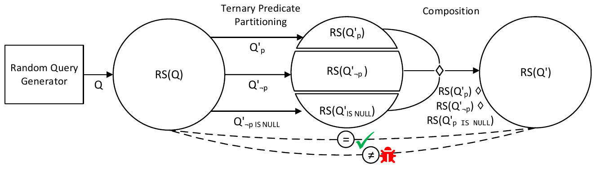
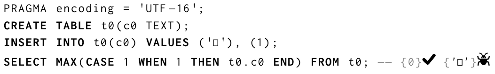
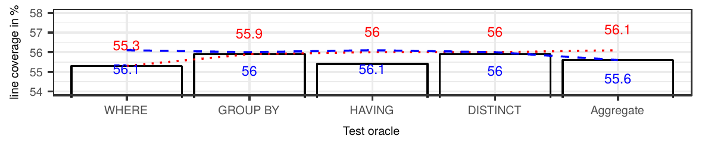

# Finding Bugs in Database Systems via Query Partitioning（中文译文）

## 译者说明

本文依据同目录的 `source.pdf` 翻译。章节、图表、公式、算法、代码与参考文献按原文结构保留。

MANUEL RIGGER，瑞士苏黎世联邦理工学院计算机科学系。<br>
ZHENDONG SU，瑞士苏黎世联邦理工学院计算机科学系。

作者地址：Manuel Rigger，manuel.rigger@inf.ethz.ch，Department of Computer Science, ETH Zurich, Zurich, Switzerland；Zhendong Su，zhendong.su@inf.ethz.ch，Department of Computer Science, ETH Zurich, Zurich, Switzerland。

## 摘要

数据库管理系统（DBMS）中的逻辑缺陷，是指导致给定查询产生错误结果的缺陷（例如，遗漏本应取出的行）。这些缺陷十分关键，因为用户很可能察觉不到它们。我们提出查询分区（Query Partitioning），一种在 DBMS 中发现逻辑缺陷的通用而有效的方法。查询分区的核心思想是：从给定的原始查询出发，派生多个更复杂的查询（称为分区查询），每个查询计算结果的一个分区。随后将各分区组合起来，计算出必须与原始查询结果集等价的结果集。如果这些结果集不同，就发现了 DBMS 中的缺陷。我们的直觉是，由于复杂度提高，分区查询比原始查询更可能给 DBMS 带来压力并触发逻辑缺陷。作为分区策略的一个具体实例，我们提出三值逻辑分区（Ternary Logic Partitioning，TLP），它基于这样的观察：布尔谓词 $p$ 的求值结果可以为 TRUE、FALSE 或 NULL。因此，一个查询可以分解成三个分区查询，分别在满足 $p$、NOT $p$ 和 $p$ IS NULL 的行或中间结果上计算自己的结果。这项技术用途广泛，可用于测试 WHERE、GROUP BY 和 HAVING 子句、聚合函数以及 DISTINCT 查询。在一次广泛的测试行动中，我们在 MySQL、TiDB、SQLite 和 CockroachDB 等广泛使用的 DBMS 中发现了 175 个缺陷，其中 125 个已修复。值得注意的是，其中 77 个是逻辑缺陷，其余为错误报告缺陷和崩溃缺陷。我们预期，查询分区的有效性和广泛适用性将促使它在实践中得到广泛采用，并推动更多分区策略的提出。

**CCS 概念：** 信息系统 → 数据库查询处理；软件及其工程 → 软件测试与调试。

**其他关键词和短语：** 数据库测试、DBMS 测试、测试预言机、三值逻辑。

**ACM 引用格式：** Manuel Rigger and Zhendong Su. 2020. Finding Bugs in Database Systems via Query Partitioning. 1, 1 (October 2020), 30 pages. https://doi.org/10.1145/nnnnnnn.nnnnnnn

出版日期：2020 年 10 月。

## 1 引言

数据库管理系统（DBMS）无处不在。大多数 DBMS 允许使用结构化查询语言（SQL）向数据库插入、删除、修改和查询数据。与其他软件一样，DBMS 也会受到各种缺陷的影响。在这项工作中，我们考虑逻辑缺陷，并将其定义为：导致 DBMS 为某个查询取出错误结果集的缺陷。例如，对于给定查询，DBMS 可能错误地从结果集中遗漏一条记录，取出本不应出现在结果集中的记录，或为某个函数或运算符计算出错误结果。用户很难发现这类缺陷，它们可能一直未被察觉，尤其考虑到许多数据库的规模。

为应对 DBMS 中的逻辑缺陷，我们提出一种通用而有效的技术，称为查询分区。我们的方法的核心思想是：基于一个结果集为 $RS(Q)$ 的给定查询 $Q$，派生 $n$ 个查询 $Q' _ 0\ldots Q' _ {n-1}$，每个查询计算一个部分结果 $RS(Q' _ i)$。这 $n$ 个部分结果随后可以通过预定义的 $n$ 元组合算子 $⋄$ 组合，得到结果集

$$
RS(Q' _ 0)⋄ RS(Q' _ 1)⋄\cdots⋄ RS(Q' _ {n-1}).
$$

为简便起见，我们将组合后的部分结果记为 $RS(Q')$。原始查询的结果集和组合后的分区必须相等，即 $RS(Q')=RS(Q)$。于是，通过检查这个等式是否确实成立，就能发现 DBMS 中的缺陷。尽管可以设想多种分区策略，关键是选择能以不同方式考验 DBMS 及其查询优化器的策略 [Giakoumakis and Galindo-Legaria 2008]：这种差异可以存在于 $Q'$ 的各分区查询之间，也可以存在于 $Q'$ 与 $Q$ 之间，从而可能观察到不一致的结果集。

作为这项工作的一部分，我们提出三值逻辑分区（TLP），它能有效测试 WHERE、GROUP BY、HAVING 子句、聚合函数以及 DISTINCT 子句的实现和优化是否正确。SQL 基于三值布尔逻辑，这意味着谓词 $φ$ 的求值结果可以为 TRUE、FALSE 或 NULL。可以将该谓词解释为一个以当前行 $r$ 为参数、分段定义的全函数 $p$：

$$
p(r)=\begin{cases}
\mathrm{TRUE} & \text{若 }φ\\
\mathrm{FALSE} & \text{若 }\negφ\\
\mathrm{NULL} & \text{若 }φ\ \mathrm{IS\ NULL}
\end{cases}
$$

考虑 $RS(Q)$ 中的随机一行 $r$。不论我们选择（或随机生成）什么谓词，我们都知道，分段函数 $p$ 的条件中恰好有一个必须成立。基于这一认识，我们可以派生三个查询，分别依据 $p$ 成立、 $\neg p$ 成立或者 $p$ 为 NULL 来过滤记录，从而对任意 $Q$ 进行分区，同时保证组合结果包含原始查询的所有行。如果用来测试 WHERE 子句，可以用并集算子汇集各子查询。

清单 1 展示了我们针对 MySQL 8.0.19 报告的一个此前未知的缺陷，该缺陷已在 8.0.21 中修复。查询 1 计算出错误的结果集，展示了底层缺陷。由于 0 和 −0 表示同一个数，比较应当求值为 TRUE，因此应取出一条由 t0 和 t1 中的行构成的记录。我们基于原始查询 O 和分区查询 P 发现了这个缺陷。O 没有 WHERE 子句，因此取出 t0 与 t1 中所有值的笛卡尔积；由于两张表都只有一条记录，因此只取出一条记录。P 由三个分区查询组成，用 UNION ALL 关键字连接，该关键字组合各查询的结果集。我们通过为 WHERE 子句生成随机谓词 `t0.c0 = t1.c0`，再创建使用否定谓词和 IS NULL 谓词的另外两个变体，派生了这些查询。因此，P 的结果集预期应与 O 的结果集相同。但是，因为使用谓词 `t0.c0 = t1.c0` 的查询被错误处理，导致遗漏该行，我们便发现了这个缺陷。基于 O 和 P，我们手工构造了测试用例 1 来报告该缺陷。

**清单 1.** MySQL 中的一个逻辑缺陷导致谓词 0=−0 被错误地求值为 FALSE。勾号表示预期的正确结果，缺陷符号表示实际的错误结果；以下清单将其分别写作“预期”和“实际”。O 表示原始查询，P 表示分区查询。

```sql
CREATE TABLE t0 (c0 INT);
CREATE TABLE t1 (c0 DOUBLE);
INSERT INTO t0 VALUES (0);
INSERT INTO t1 VALUES ('-0');
-- 1
SELECT * FROM t0, t1 WHERE t0.c0 = t1.c0; -- 实际：{}
-- O
SELECT * FROM t0, t1; -- 预期：{0, -0}
-- P
SELECT * FROM t0, t1 WHERE t0.c0 = t1.c0
  UNION ALL SELECT * FROM t0, t1 WHERE NOT (t0.c0 = t1.c0)
  UNION ALL SELECT * FROM t0, t1 WHERE (t0.c0 = t1.c0) IS NULL; -- 实际：{}
```

查询分区解决了现有方法的根本局限。枢轴查询合成（Pivoted Query Synthesis，PQS）通过检查随机选取的枢轴行是否被正确取出来发现逻辑缺陷 [Rigger and Su 2020c]。为了构造能够取出该行的查询，PQS 依赖于对 DBMS 的 SQL 方言所支持的运算符和函数的实现。这项技术已被证明有效。然而，与查询分区不同，它的实现工作量很大，并且需要详细了解 DBMS 运算符和函数的语义。非优化参考引擎构造（Non-optimizing Reference Engine Construction，NoREC）通过重写查询来禁用 DBMS 的优化，发现使用 WHERE 谓词的查询中的缺陷，并解决了 PQS 实现工作量大的问题 [Rigger and Su 2020a]。NoREC 和 PQS 的一个主要局限是，它们主要适用于测试 WHERE 谓词；虽然可以部分用于测试其他特性——例如，PQS 可以测试 DISTINCT，但无法检测重复行——但如何将这些方法扩展为测试聚合查询等，尚不清楚。

我们在一项涵盖六个广泛使用的 DBMS 的大规模研究中评估了查询分区的有效性。我们在其中五个系统中发现了 175 个真实、此前未知的缺陷，说明了所提方法的有效性和通用性。DBMS 开发者认为其中许多缺陷很重要，其中 125 个已经修复。77 个是逻辑缺陷，其余是错误报告缺陷和崩溃缺陷。此外，我们将所提方法与 NoREC 进行了比较。我们的结果表明，TLP 能够检测 NoREC 范围以外特性中的 17 个缺陷，以及双方均适用的 WHERE 子句相关的另外 12 个缺陷。最终，查询分区与 PQS 互补，并与 NoREC 具有相同的优缺点，因为二者都是蜕变测试预言机 [Chen et al. 1998]。由于它有效且实现工作量小，我们相信我们的方法可能在实践中得到广泛采用。为支持可复现性并促进 TLP 的采用，我们提供了包含实现及所发现缺陷的工件 [Rigger and Su 2020b]。此外，我们的实现可从 https://github.com/sqlancer 获取。

总体而言，本文作出以下贡献：

- 查询分区，一种用于在以 SQL 为查询语言的 DBMS 中发现逻辑缺陷的通用技术；
- 三值逻辑分区（TLP），查询分区的一个实例，基于可按布尔谓词求值为 TRUE、FALSE 或 NULL 进行分区这一认识；
- 用于测试 WHERE、HAVING、GROUP BY 子句、聚合函数和 DISTINCT 查询的具体 TLP 预言机；
- 在六个广泛使用的 DBMS 上对查询分区进行广泛评估，该技术发现了 175 个缺陷，并与先进方法 NoREC 进行比较。

## 2 背景

**关系 DBMS。** DBMS 基于数据模型，后者抽象地描述数据的组织方式。我们主要希望测试基于 Codd [1970] 提出的关系数据模型的 DBMS，大多数广泛使用的数据库，如 Oracle、Microsoft SQL、PostgreSQL、MySQL 和 SQLite，都基于该模型。关系 DBMS 使用领域专用语言——结构化查询语言（SQL）——进行交互。SQL 的数据模型基于包（即多重集），其中同一行可以出现多次 [Guagliardo and Libkin 2017]。这与基于集合概念的原始关系模型不同。由于查询结果通常仍被称为结果集，我们在本文中也使用这一术语。要合并两个包而不删除重复项，使用记为 $⊎$ 的多重集加法。要排除重复元素，使用记为 $\cup$ 的并集算子。在 SQL 中，UNION ALL 对应 $⊎$，不带 ALL 的 UNION 对应 $\cup$。不同 TLP 测试预言机的组合算子都会用到这两个算子。

**SQL。** 我们假定读者基本熟悉 SQL，因此仅作最简介绍。在我们的工作中，我们集中关注用于查询数据库数据的 SELECT 语句。SQL 提供了过滤、分组和聚合数据的多种方式。WHERE 子句可用于指定应取出哪些行，它包含一个布尔谓词，可求值为 TRUE、FALSE 或 NULL。一些 DBMS（例如 SQLite 和 MySQL）允许在 WHERE 子句中使用任意类型的谓词，因为它们通过隐式转换将其他类型的值转换为布尔值。GROUP BY 子句可用于聚合行，它指定若干表达式，DBMS 据此将表达式求值结果相同的行分组。它们可以与 HAVING 子句组合使用，后者允许在分组之后过滤行。与 GROUP BY 类似，查询可以包含 DISTINCT 子句，以计算结果集合而非包（即 DISTINCT 删除所有重复行）。聚合函数在多行上计算值，既可用于聚合最终结果集，也可作为 HAVING 子句中谓词的一部分。SQL 是一门功能丰富的语言，还提供许多其他特性（例如窗口函数和事务）。尽管我们的核心思想可以推广到一些其他特性，我们认为它们较不重要，因而不在本文范围内。

**聚合函数。** 聚合函数有多种类型，例如计算输入表达式最小值和最大值的 MIN()、MAX()，对输入值求和的 SUM()，统计行数的 COUNT()，以及计算平均值的 AVG()。我们针对聚合函数的测试思想，基于通过分散计算来优化聚合函数的思路 [Cohen 2006; Jesus et al. 2015; Yu et al. 2009]。[Jesus et al. 2015] 定义了聚合函数的重要性质。如果存在合并算子 $⊕$，使得对于两个非空多重集 $X$ 和 $Y$，都有 $f(X⊎ Y)=f(X)⊕ f(Y)$，则聚合函数 $f$ 是自可分解的（self-decomposable）。许多函数，包括 MIN()、MAX()、SUM() 和 COUNT()，都是自可组合的（self-composable）。例如考虑 SUM()： $SUM(\lbrace x\rbrace)=x$，且 $SUM(X⊎ Y)=SUM(X)+SUM(Y)$。如果对于某个函数 $f$ 和一个自可分解的聚合函数 $h$，聚合函数可以表达为 $f=g\circ h$，则 $f$ 是可组合的（composable）。通过令 $g$ 为恒等函数，每个自可组合函数都是可组合的。将 $g$ 定义为 $g((s,c))=s/c$，并将 $h$ 定义如下时，AVG() 是可组合的： $h(\lbrace x\rbrace)=(x,1)$，且 $h(X⊎ Y)=h(X)+h(Y)$。也就是说，AVG() 函数通过将值的总和除以行数计算：

$$
AVG(X⊎ Y)=\frac{SUM(X)+SUM(Y)}{COUNT(X)+COUNT(Y)}.
$$

**自动测试。** 我们提出一种新的 DBMS 自动测试方法。其中有两个必不可少的组成部分。第一，有效的测试用例应对被测系统的重要部分施加测试压力。为此，已有许多数据库生成器 [Binnig et al. 2007b; Bruno and Chaudhuri 2005; Gray et al. 1994; Houkjær et al. 2006; Khalek et al. 2008; Neufeld et al. 1993] 和查询生成器 [Bati et al. 2007; Bruno et al. 2006; Jung et al. 2019; Mishra et al. 2008; Poess and Stephens 2004; Seltenreich 2019; Vartak et al. 2010; Zhong et al. 2020] 被提出。虽然它们是测试方法的重要组成部分，但已经得到充分研究，并非本文重点。我们相信，任何数据库生成器，以及任何允许控制生成查询格式的查询生成器，都可以用来通过查询分区发现缺陷。在我们的实现中，我们使用 SQLancer 的数据库和表达式生成机制，下文将详细说明。第二，有效的测试预言机需要判断所生成测试用例的结果是否正确。蜕变预言机是一类特殊测试预言机，它能根据系统的一组输入和输出，派生测试用例及其预期结果 [Chen et al. 1998]。虽然这类预言机的实现工作量通常很小，但它们不能提供真值（因为用于生成新测试用例的输出本身可能错误）。本文的主要重点，是基于查询分区这一通用思想的蜕变测试预言机。

**枢轴查询合成。** Rigger and Su [2020c] 最近提出了枢轴查询合成（PQS），用于发现 DBMS 中的逻辑缺陷。它随机选取一行，称为枢轴行，并据此构造一个必须取出该行的查询。为了保证取出该行，该测试方法执行一个随机生成的谓词，然后修改它，使其求值为 TRUE。虽然这项技术十分有效，但一个显著局限是实现工作量大，因为工具需要实现所有被测试的运算符和函数。此外，它依据单行验证结果，因此只能有效测试 WHERE 子句。尽管它可以生成 DISTINCT 子句和 GROUP BY，但无法发现被错误取出的重复行，以及被遗漏的重复行。PQS 只有在表中仅有一行时才能测试聚合函数，这无法有意义地测试聚合功能。本文提出的方法旨在与 PQS 互补。查询分区能够检测更多特性中的缺陷，且实现工作量很小。PQS 可以为一组重要的核心运算符提供真值，从而填补 TLP 留下的空白。

**NoREC。** Rigger and Su [2020a] 最近提出了非优化参考引擎构造（NoREC），用于发现 DBMS 中的优化缺陷，即导致 DBMS 错误应用某项优化的逻辑缺陷。这一方法的核心认识是，可以把经过优化的查询转换成 DBMS 无法有效优化的查询。因此，NoREC 也是一种蜕变测试方法。NoREC 也能够发现引例中的缺陷（见清单 1）。具体来说，它会将查询 1 重写为另一个查询：

```sql
SELECT (t0.c0 = t1.c0) IS TRUE FROM t0, t1
```

转换后的查询在表中的每一行上求值从原始查询 WHERE 子句中取出的谓词；由于只有一行，该查询将返回一行一列，其值为 TRUE。实际中，会使用 SUM() 聚合函数累加 TRUE 值的数量。谓词必须始终求值为同一个值。因此，预期该谓词在 WHERE 子句中也应求值为 TRUE，这意味着原始查询的结果集应包含该行。但对于这个查询，事实并非如此，从而可以发现缺陷。实际上，原始查询被 DBMS 优化以高效取数据，而转换后的查询在每一行上求值谓词，使得错误优化无法应用。与 PQS 一样，NoREC 已成功检测到多种缺陷。不过，与 PQS 类似，一个显著局限是该方法只适用于 WHERE 子句（以及部分 GROUP BY 子句）。TLP 从两个重要方面推进了 NoREC。首先，NoREC 通过抑制 DBMS 优化来应对测试预言机问题，而 TLP 通过对给定查询分区来应对该问题；因此在概念层面，它们彼此正交且互补。其次，如何扩展 NoREC 以支持其他特性尚不清楚。特别是，聚合函数不在 NoREC 的范围内，因为这些函数的缺陷源于聚合函数自身的错误计算，而不是错误求值的谓词。我们通过 TLP 解决这些局限。例如，TLP 可以通过对聚合函数的计算分区，检测其中的缺陷。我们的评估结果展示了 TLP 的这些独特优势。

**SQLancer。** 我们所提方法的实现基于 SQLancer，PQS 和 NoREC 预言机也在其中实现 [Rigger and Su 2020a,c]。各 DBMS 的语句和表达式语法、语义差异很大。因此，SQLancer 包含各 DBMS 专用的组件，例如数据库和表达式生成器。它们是手工朴素实现的，不会系统枚举数据库或表达式。虽然我们相信，这两个组件都可以改进，例如系统地生成数据库和表达式，或以最大化触发缺陷机会的方式生成它们，但本文的重点是测试预言机，我们的发现表明，朴素的生成方式已足以检测许多缺陷。SQLancer 也包含与 DBMS 无关的组件，例如记录测试用例、随机生成数据以及处理选项的组件。SQLancer 分两个阶段运行：先生成数据库，再执行一个或多个测试预言机。由于生成数据库所需的时间通常显著长于执行一个查询，SQLancer 默认尝试执行所选测试预言机的 100,000 次迭代。

**SQLancer 的数据库生成。** 在第一阶段，SQLancer 使用 CREATE TABLE 命令创建若干表。然后生成语句来改变数据库和 DBMS 的状态，例如插入、删除、修改数据，设置选项，以及创建索引和视图。某类语句（例如 INSERT）的生成数量受一个上限约束，该上限设置为通过经验确定的合理默认值，但可以通过设置选项覆盖。例如，默认情况下 SQLancer 最多生成 30 条 INSERT 语句，以限制查询结果集的规模，从而使查询能够快速执行。所有语句在语法上都有效，因为数据库生成器按照相应 SQL 方言的语法实现；但语义上可能无效。例如，当 INSERT 语句试图向声明为 UNIQUE 的列插入重复值时，它可能按预期失败，并报告“UNIQUE constraint failed”。每条语句都附有一份此类“预期”错误的列表。非预期错误表明被测 DBMS 中存在缺陷。第一阶段的产物，是供测试预言机执行的数据库。

**SQLancer 的表达式生成。** 在第二阶段，测试预言机依据随机生成的数据库测试 DBMS。生成查询时，测试预言机实现向表达式生成器请求随机表达式（语句生成器也会使用表达式生成器）。例如，本文提出的预言机会请求 WHERE 和 HAVING 子句中的谓词。表达式生成器从适用的运算符、函数和叶节点（即列引用和常量）中随机选取。达到指定最大深度（默认为 3）时，只考虑叶节点。列引用始终有效，因为 SQLancer 从 DBMS 获取所有表和视图的列名，并且只考虑生成查询所引用表和视图中的列。常量由随机数据生成器产生，该生成器使用两种策略尝试生成有意义的常量。首先，提高生成边界值（例如最小和最大整数）的概率。其次，缓存常量，并可能选取缓存值来替代新生成的常量。

## 3 方法

**查询分区。** 我们设想查询分区是一项用途广泛的技术。我们的方法的核心思想是，从给定查询出发，将它分解为多个等价查询，其结果可以组合为与原始查询相同的结果。我们将给定查询称为原始查询。在本文其余部分，我们假定原始查询按指定格式随机生成，但它同样可以由用户给定或在测试套件中指定。我们将共同等价于原始查询的这些查询称为分区查询，每个查询计算一个分区。我们将合并各分区的算子称为组合算子（记为 $⋄$）。

**三值逻辑查询分区。** 在本文中，我们只考虑通用分区策略思想的一个实例，即三值逻辑分区（TLP）。该技术的核心思想是，对一行或一个中间结果的谓词，其求值结果必须为 TRUE、FALSE 或 NULL。因此，原始查询可以分解为三个分区查询。一个分区查询取出谓词 $p$ 成立的行，一个取出它不成立的行，另一个取出它求值为 NULL 的行。也就是说，我们构造谓词 $p$、NOT $p$ 和 $p$ IS NULL。随后将这些谓词用于 WHERE 和 HAVING 子句。因此，我们将这些谓词称为三值谓词变体。与原始查询类似，我们假定该谓词是随机生成的。下面，我们展示这一思想如何支持测试 WHERE、GROUP BY、HAVING 子句、聚合函数和 DISTINCT 查询。

**过程。** 图 1 展示了 TLP 的过程。基于现有数据库——在我们的实现中为随机生成的数据库——生成随机查询 $Q$。我们将该查询的结果集记为 $RS(Q)$，并用圆形表示结果集。随后，基于 TLP，我们从 $Q$ 派生三个分区查询 $Q' _ p$、 $Q' _ {\neg p}$ 和 $Q' _ {p\ \mathrm{IS\ NULL}}$。每个分区查询计算结果的一个分区，我们将其记为 $RS(Q' _ p)$、 $RS(Q' _ {\neg p})$ 和 $RS(Q' _ {p\ \mathrm{IS\ NULL}})$。基于组合算子 $⋄$，将各分区组合得到结果集 $RS(Q')$。等式 $RS(Q)=RS(Q')$ 必须成立。如果我们发现结果集不同，就发现了 DBMS 中的一个缺陷。



**图 1.** 三值逻辑分区（TLP）的思想是将查询 $Q$ 分成若干分区查询 $Q' _ p$、 $Q' _ {\neg p}$ 和 $Q' _ {p\ \mathrm{IS\ NULL}}$，组合它们的分区，形成满足 $RS(Q)=RS(Q')$ 的结果集。虚线表示结果集之间的比较。勾号表示结果集如预期相符，缺陷符号表示 DBMS 存在导致结果集不匹配的缺陷。图中 Random Query Generator 为随机查询生成器，Ternary Predicate Partitioning 为三值谓词分区，Composition 为组合。

**关于分区的直觉。** 直观上，可以认为分区查询计算的是 $Q$ 结果集的一个子集或部分包（即分区是 $RS(Q)$ 的子集或包）。对于 WHERE 和 HAVING 测试预言机， $⋄$ 对应多重集加法 $⊎$。对于 DISTINCT 和 GROUP BY 预言机，各分区可能包含重复值；这些预言机的 $⋄$ 对应集合并 $\cup$。对于聚合测试预言机，各分区不是原始查询结果的子集，而是对应中间值。例如，测试计算最小值的 MIN() 聚合函数时，分区表示各自分区中的最小值。

**概览。** 表 1 展示了完整实现这些预言机所需的全部信息，后面各节会详细说明。第一列是预言机名称，第二列描述随机生成查询 $Q$ 的格式，第三列描述分区查询 $Q' _ {p _ {tern}}$ 的格式。该查询会用三个三值谓词变体实例化。第四列描述组合算子的实现。重新考虑引例（见清单 1），我们用表中第一行描述的 WHERE 预言机发现了该缺陷。查询 O 对应 $Q$ 的格式，而查询 P 中的每个分区查询对应 $Q' _ {p _ {tern}}$ 的格式。查询 O 中的各分区用 UNION ALL 算子组合，对应于 $⊎$ 算子。

**查询元素。** `<columns>` 占位符指一组列，或在每行上求值的表达式；该占位符也可以是星号（*），指定取出所有列。`<tables>` 占位符指取值来源表。`<joins>` 占位符可以指任一种连接（如内连接、外连接、左连接、右连接和自然连接）；虽然我们没有提出专门用于测试连接的预言机，但我们发现现有预言机也能检测其中的缺陷。`<e>` 占位符指任意表达式。方括号（[]）包围的元素表示可选。

**ORDER BY。** 可以为每个分区查询生成随机 ORDER BY。由于我们的预言机不验证结果的顺序，这种子句不得影响查询结果。不过，它们引入额外复杂度（例如使 DBMS 使用索引来排序 [Graefe 2011]），这有助于暴露更多缺陷。事实上，我们发现了只有在使用 ORDER BY 子句时才触发的缺陷（见清单 7）。一些 DBMS 不允许在通过 UNION 或 UNION ALL 连接的查询中分别使用 ORDER BY；对于这些系统，当通过 UNION 或 UNION ALL 组合分区时，可能只能使用一个 ORDER BY（见下文）。

**组合算子的实现。** 每个组合算子都包含一个 $⊎$ 或 $\cup$ 算子，用来在保留或删除重复行的情况下组合结果集。测试工具可以遍历每个分区查询的结果集，并用适当的数据结构收集各行来实现它们——例如，对 $⊎$ 用列表，对 $\cup$ 用集合。当分区用于后续计算时，如聚合预言机，就不适合在测试工具中实现该算子。例如，聚合 MIN 预言机会计算各分区最小值中的最小值；测试工具无法轻易确定这个最小值，因为例如字符串的顺序可能取决于查询中包含的 COLLATE 子句。对于这种情况，更方便的替代方案是使用 UNION ALL 和 UNION 算子，它们在 SQL 中实现相应算子的语义（见第 2 节）。使用它们也会测试这些算子，事实上，我们发现了它们实现中的缺陷。

### 3.1 测试 WHERE 子句

WHERE 预言机测试 WHERE 子句的实现和优化是否正确。它是最基本的测试预言机。尽管如此，我们的评估表明它最有效。

**查询。** WHERE 预言机假定原始查询不带 WHERE 子句，并构造带 WHERE 子句的分区查询，每个查询使用一个三值逻辑谓词。我们的直觉是，原始查询不太可能计算出错误结果，因为它只是取出一组表中的所有记录。相比之下，分区查询的 WHERE 子句可能导致错误地遗漏或添加记录。

**关于测试预言机的直觉。** 我们相信，WHERE 预言机足以发现 TLP 预言机能够检测的大多数缺陷。虽然它专门生成查询来测试 WHERE 子句，但它也会考验各种 DBMS 组件和优化的实现 [Chaudhuri 1998]。具体而言，我们发现该测试预言机可以发现物理访问方法（尤其是索引扫描）[Astrahan et al. 1976]、常见物理算子 [Chaudhuri 1998]、连接算法 [Graefe 1993]、查询重写 [Haas et al. 1989]，以及针对谓词的一般优化（例如代数简化）中的缺陷。我们在第 5.3 节量化这一观察。

**已有谓词。** 有时希望基于已有 WHERE 谓词的查询创建更多测试查询，例如原始查询不是随机生成的，而是来自测试套件的现有查询时。我们针对这种情形提出 WHERE Extended 预言机。基于已有 WHERE 子句和谓词 $p _ {existing}$，派生分区查询，用 AND 运算符给谓词添加一个额外的三值变体。

**表 1.** 每个三值逻辑分区（TLP）预言机都用于测试特定 SQL 特性。为使表格可读，下表将原表组合式中的三个分区结果合写为 $B=Q' _ p⊎ Q' _ {\neg p}⊎ Q' _ {p\ \mathrm{NULL}}$ 和 $S=Q' _ p\cup Q' _ {\neg p}\cup Q' _ {p\ \mathrm{NULL}}$； $p _ {tern}$ 分别取三个三值谓词变体。SQL 格式中的 `p_tern`、`p_existing` 分别表示这两个谓词占位符。

| 预言机 | 原始查询 Q | 分区查询 | 组合算子 |
| --- | --- | --- | --- |
| WHERE | `SELECT <columns> FROM <tables> [<joins>]` | `SELECT <columns> FROM <tables> [<joins>] WHERE p_tern` | $B$ |
| WHERE Extended | `SELECT <columns> FROM <tables> [<joins>] WHERE p_existing` | `SELECT <columns> FROM <tables> [<joins>] WHERE p_existing AND p_tern` | $B$ |
| GROUP BY | `SELECT <columns> FROM <tables> <joins> GROUP BY <columns>` | `SELECT <columns> FROM <tables> <joins> WHERE p_tern GROUP BY <columns>` | $S$ |
| HAVING | `SELECT <columns> FROM <tables> <joins> [WHERE ...] [GROUP BY ...]` | `SELECT <columns> FROM <tables> <joins> [WHERE ...] [GROUP BY ...] HAVING p_tern` | $B$ |
| DISTINCT | `SELECT DISTINCT <columns> FROM <tables> <joins>` | `SELECT [DISTINCT] <columns> FROM <tables> <joins> WHERE p_tern` | $S$ |
| Aggregate (MIN) | `SELECT MIN(<e>) FROM <tables> [<joins>]` | `SELECT MIN(<e>) FROM <tables> [<joins>] WHERE p_tern` | $MIN(B)$ |
| Aggregate (MAX) | `SELECT MAX(<e>) FROM <tables> [<joins>]` | `SELECT MAX(<e>) FROM <tables> [<joins>] WHERE p_tern` | $MAX(B)$ |
| Aggregate (SUM) | `SELECT SUM(<e>) FROM <tables> [<joins>]` | `SELECT SUM(<e>) FROM <tables> [<joins>] WHERE p_tern` | $SUM(B)$ |
| Aggregate (COUNT) | `SELECT COUNT(<e>) FROM <tables> [<joins>]` | `SELECT COUNT(<e>) FROM <tables> [<joins>] WHERE p_tern` | $SUM(B)$ |
| Aggregate (AVG) | `SELECT AVG(<e>) FROM <tables> [<joins>]` | `SELECT SUM(<e>) AS s, COUNT(<e>) AS c FROM <tables> [<joins>] WHERE p_tern` | $SUM(s(B))/SUM(c(B))$ |

**与 NoREC 的比较。** 我们相信，WHERE 预言机的缺陷发现能力与 NoREC 相似（见第 5.2 节）。两者都关注测试 WHERE 子句。NoREC 主要通过在每行上求值谓词来禁用大多数优化，从而测试优化缺陷。WHERE 预言机通过引入三个会得到不同程度优化的查询变体实现这一点。例如，一个索引可能只适用于其中一个或两个分区查询，而非全部，这也使它能够发现这类优化缺陷。

### 3.2 测试分组

DISTINCT、GROUP BY 和 HAVING 测试预言机密切相关，因为它们都测试行的分组和过滤。我们将它们统称为分组预言机。

**查询。** DISTINCT 预言机基于用 $\cup$ 排除重复行的组合算子。因此，分区查询本身可以选择省略 DISTINCT 关键字。与 DISTINCT 预言机类似，GROUP BY 测试预言机依赖 $\cup$ 排除重复行。GROUP BY 中的列必须与取出的列对应。如果 GROUP BY 子句包含未出现在 `<columns>` 中的额外列，那么额外的分组对于组合算子是不可见的。类似地，如果取出的列没有出现在 GROUP BY 子句中， $\cup$ 仍然会删除重复值。注意，这可能导致某些缺陷无法被发现。HAVING 预言机验证逻辑上在 GROUP BY 完成后应用的 HAVING 子句是否正确执行。因此，与 DISTINCT 和 GROUP BY 预言机不同，三值谓词用于 HAVING 子句，而非 WHERE 子句。

**示例。** 清单 2 给出了分组预言机、具体为 DISTINCT 预言机的一个代表性示例，用来说明查询格式及其能够检测的缺陷。原始查询 O 包含 DISTINCT 子句，计算出正确值 `{0|0}`。分区查询 P 计算出错误结果 `{0|NULL}`，原因是视图列 c0 的亲和性（affinity）被错误丢弃——列的亲和性决定执行何种隐式转换，这是 SQLite 独有的概念。注意，删除 DISTINCT 子句后，该查询计算出与分区查询相同的错误结果，因此 WHERE 测试预言机无法检测这一缺陷。如前所述，子查询可以选择省略 DISTINCT 子句；在本例中，两种选择都能够检测到该缺陷。

**清单 2.** 这个简化的 DISTINCT 测试用例发现了 SQLite 中的一个缺陷，并展示了分组预言机的查询结构。

```sql
CREATE TABLE t0 (c0 INT);
CREATE VIEW v0 (c0) AS SELECT CAST(t0.c0 AS INTEGER) FROM t0;
INSERT INTO t0 (c0) VALUES (0);
-- O
SELECT DISTINCT * FROM t0 LEFT OUTER JOIN v0 ON v0.c0 >= '0'; -- 预期：{0|0}
-- P
SELECT * FROM t0 LEFT OUTER JOIN v0 ON v0.c0 >= '0' WHERE TRUE UNION
  SELECT * FROM t0 LEFT OUTER JOIN v0 ON v0.c0 >= '0' WHERE NOT TRUE UNION
  SELECT * FROM t0 LEFT OUTER JOIN v0 ON v0.c0 >= '0' WHERE TRUE IS NULL; -- 实际：{0|NULL}
```

### 3.3 聚合函数

聚合查询分区测试预言机用于测试聚合函数。我们考虑最常用的 MIN()、MAX()、COUNT()、SUM() 和 AVG()。聚合函数可以通过分解并分散其计算进行优化 [Jesus et al. 2015]。我们使用分散计算这一核心思想作为测试聚合函数的基础。

**自可组合的聚合函数。** 最简单的聚合函数测试预言机针对自可组合聚合函数（即 MIN()、MAX()、SUM() 和 COUNT()）。与前面介绍的预言机不同，聚合函数的分区是中间结果，而非原始查询结果集的子集。例如，MIN 预言机的一个分区计算相应分区查询的最小值。要计算这些分区，需要额外一步；例如，对于 MIN()，必须计算总体最小值。为此，可以应用另一个聚合函数；例如，再应用一次 MIN() 来计算总体最小值。组合算子所用聚合函数不一定与分区查询相同。例如考虑 COUNT 预言机：分区查询用 COUNT() 计算各自分区中的行数，然后用 SUM() 聚合函数对其求和。

**自可组合聚合函数示例。** 清单 3 给出了原始查询 O 和分区查询 P 的示例，它是 MAX 预言机实际生成、并在 CockroachDB 中检测到缺陷的测试用例。在该例中，原始查询取出 NULL，而不是组合后的分区查询返回的结果集 0。该缺陷在开启实验性向量化特性时影响交错表（interleaved tables），这类表用来实现表间父子关系。开发者解释说，在执行反向扫描时，使用了错误的谓词来跳过交错的子行。注意，必须为分区查询结果分配别名（`as aggr`），才能组合这些分区。

**清单 3.** 这个简化的 MAX() 测试用例检测到 CockroachDB 中的一个缺陷，并展示了自可组合聚合函数的查询结构。

```sql
SET vectorize = experimental_on;
CREATE TABLE t0 (c0 INT);
CREATE TABLE t1 (c0 BOOL) INTERLEAVE IN PARENT t0 (rowid);
INSERT INTO t0 (c0) VALUES (0);
INSERT INTO t1 (rowid, c0) VALUES (0, TRUE);
-- O
SELECT MAX(t1.rowid) FROM t1; -- 实际：{NULL}
-- P
SELECT MAX(aggr) FROM (
  SELECT MAX(t1.rowid) as aggr FROM t1 WHERE '+' >= t1.c0 UNION ALL
  SELECT MAX(t1.rowid) as aggr FROM t1 WHERE NOT ('+' >= t1.c0) UNION ALL
  SELECT MAX(t1.rowid) as aggr FROM t1 WHERE ('+' >= t1.c0) IS NULL
); -- 预期：{0}
```

**其他可组合的聚合函数。** 对于非自可组合、但可组合的聚合函数，例如 AVG()，我们可以用结果元组而非单个值计算结果。例如，要计算 AVG()，我们利用 $AVG(Q)$ 对应 $SUM(Q)/COUNT(Q)$ 这一事实。因此，每个分区查询计算一个元组 $(SUM(Q _ p),COUNT(Q _ p))$，随后将元组第一项的总和除以第二项的总和，得到组合结果。

**可组合聚合函数示例。** 清单 4 给出了 AVG 预言机测试用例的具体示例，它发现了 DuckDB 中的一个缺陷。查询 O 是计算 c0 列值的 AVG() 的原始查询。每个分区查询 P 计算两个值：一个是 c0 中值的和（别名 s），另一个是值的计数（别名 c）。表达式 `SUM(s)/SUM(c)` 与组合算子关联，它将累计的和除以累计的计数。对于该测试用例，DuckDB 为原始查询计算了正确结果。对于分区查询，只有第一个聚合查询取出一行，这符合预期。然而，SUM() 中 9223372036854775807 与 2 相加溢出，这属于非预期结果，并导致静默回绕。该缺陷被确认为真实缺陷。不过，开发者此前已经知道它，却尚未处理，因为不带来显著性能影响地解决这个缺陷并不简单。在我们报告之后，他们仍然决定修复它。

**清单 4.** 这个简化的 AVG 测试用例展示了 DuckDB 的一个缺陷，并展示可组合但非自可组合聚合函数的查询结构。

```sql
CREATE TABLE t0 (c0 BIGINT);
INSERT INTO t0 (c0) VALUES (2);
INSERT INTO t0 (c0) VALUES (9223372036854775807);
-- O
SELECT AVG(t0.c0) FROM t0; -- 预期：{4.611686018427388e+18}
-- P
SELECT SUM(s)/SUM(c) FROM (
  SELECT SUM(t0.c0) AS s, COUNT(t0.c0) AS c FROM t0 WHERE c0 UNION ALL
  SELECT SUM(t0.c0) AS s, COUNT(t0.c0) AS c FROM t0 WHERE NOT c0 UNION ALL
  SELECT SUM(t0.c0) AS s, COUNT(t0.c0) AS c FROM t0 WHERE c0 IS NULL
); -- 实际：{-4611686018427387903}
```

**交换性。** 我们考虑的所有聚合函数都具有交换性。出于我们的目的，我们也假定 SUM() 和 AVG() 具有交换性，尽管浮点数的处理顺序会影响结果。为处理因此产生的舍入误差，我们使用 epsilon 比较结果集中的浮点数。还存在其他非交换聚合函数，如拼接字符串的 GROUP_CONCAT()。为支持它们，可以实现运算符专用的比较器。例如，GROUP_CONCAT() 的比较器可以按分隔符拆分拼接后的字符串，对各片段排序，再用排序后的片段比较。与其他测试预言机相比，这样的实现更繁琐。此外，非交换函数给 DBMS 提供的优化空间较少。因此，在我们的工作中，我们没有进一步考虑非交换函数。

## 4 缺陷选例

本节概述我们使用 TLP 发现的一些有意思的缺陷。这种选择必然带有偏向，我们力图展示各预言机检测到的不同缺陷的范围。为简洁起见，我们只展示说明底层核心问题的缩减测试用例，而不展示发现缺陷的原始查询和分区查询。

### 4.1 WHERE 子句

本节介绍 WHERE 预言机检测到的缺陷。除非另有说明，这些缺陷也可以由 NoREC 和 PQS 检测到。注意，我们在第 5.2 节系统研究 WHERE 预言机与 NoREC 的关系。

**MySQL 比较缺陷。** 清单 5 展示了一个数字比较产生错误结果的缺陷。对于 c0=0，比较 `0.9 > t0.c0` 应求值为 TRUE，并取出 t0 中的行。但 MySQL 未能取出该行。这是我们在 MySQL 中发现的多个基础缺陷之一。我们仍认为它很有意思，因为它表明成熟的 DBMS 也容易出现这类缺陷。

**清单 5.** MySQL 错误地求值该比较，未能取出该行。

```sql
CREATE TABLE t0 (c0 INT);
INSERT INTO t0 (c0) VALUES (0);
SELECT * FROM t0 WHERE 0.9 > t0.c0; -- 预期：{0}；实际：{}
```

**TiDB 比较缺陷。** 我们在 TiDB 中发现一个从视图取数据时意外遗漏一行的缺陷（见清单 6）。WHERE 子句引用视图中的常量值 1，因此应求值为 TRUE 并取出一行。但 TiDB 却意外地没有取出行。该缺陷被归类为 P1，即严重性第二高的类别。我们认为它很有意思，因为它表明我们的方法不专门针对视图，也能检测其中的缺陷。

**清单 6.** TiDB 未能从视图中取出一行。

```sql
CREATE TABLE t0 (c0 INT);
CREATE VIEW v0 (c0, c1) AS SELECT t0.c0, 1 FROM t0;
INSERT INTO t0 VALUES (0);
SELECT v0.c0 FROM v0, t0 WHERE v0.c1; -- 预期：{0}；实际：{}
```

**ORDER BY 影响查询结果。** 我们在 CockroachDB 中发现一个值被意外表示成 E 记数法的缺陷（见清单 7）。具体而言，默认的行执行引擎将取出的十进制值编码为 1819487610，而分区查询所用的向量执行引擎将其表示为 1.81948761E+9。虽然它被确认为缺陷，但鉴于两者表示同一个值，并未被认为非常重要。不过，我们认为这个缺陷很有意思，因为它表明 ORDER BY 可能错误地影响查询结果。

**清单 7.** 在 CockroachDB 中使用向量执行引擎时，ORDER BY 子句影响了十进制值 1819487610 的表示。

```sql
SET SESSION VECTORIZE = on;
CREATE TABLE t0 (c0 DECIMAL PRIMARY KEY, c1 INT UNIQUE);
INSERT INTO t0 (c0) VALUES (1819487610);
SELECT t0.c0 FROM t0 ORDER by t0.c1; -- 预期：{1819487610}；实际：{1.81948761E+9}
```

**缺失无效正则表达式的错误报告。** 我们在 CockroachDB 中发现一个缺陷：无效正则表达式使 SELECT 返回空结果集，而不是打印错误消息（见清单 8）。我们发现它，是因为其他分区查询也没有取出任何行。PQS 和 NoREC 都无法检测这类缺陷，因为对于这些方法，原始查询会产生上述预期错误。Rigger and Su [2020a] 特别解释了，NoREC 无法检测查询求值中的非确定性导致的错误。

**清单 8.** CockroachDB 对该查询返回空结果集，而没有报错退出。

```sql
CREATE TABLE t0 (c0 INT);
CREATE VIEW v0 (c0) AS SELECT COUNT_ROWS() FROM t0;
SELECT * FROM v0 WHERE '' !~ '+';
-- 预期：error parsing regexp: missing argument to repetition operator: +
-- 实际：{}
```

### 4.2 分组缺陷

本节介绍 GROUP BY、HAVING 和 DISTINCT 预言机检测到的缺陷。

**GROUP BY 忽略 COLLATE。** 我们在 DuckDB 中发现 GROUP BY 算子忽略 COLLATE NOCASE 的缺陷（见清单 9）。注意，COLLATE 子句控制字符串比较的行为；本例中它指定字符串比较应忽略大小写。虽然 SELECT 预期应返回包含 'a' 或 'A' 的结果集，但它却取出了二者。GROUP BY 预言机发现了该缺陷，因为与 GROUP BY 算子不同，UNION 算子遵循 COLLATE。这个缺陷很有意思，因为它展示的是算子本身的基础缺陷，而非 NoREC 所限于检测的优化缺陷。不过，我们是在 COLLATE 合入 master 后不久、该特性尚未发布之前发现它的，这表明该特性当时尚未得到充分测试。

**清单 9.** DuckDB 的 GROUP BY 算子忽略了 c0 带有 COLLATE NOCASE。

```sql
CREATE TABLE t0 (c0 VARCHAR COLLATE NOCASE);
INSERT INTO t0 (c0) VALUES ('a'), ('A');
SELECT t0.c0 FROM t0 GROUP BY t0.c0; -- 预期：{'a'} 或 {'A'}；实际：{'a', 'A'}
```

**错误的 VARIANCE(0) 优化。** 我们在 CockroachDB 中发现一个缺陷，`VARIANCE(0) IS NULL` 被意外地优化为 FALSE（见清单 10）。有意思的是，当表有零行或一行时，VARIANCE(0) 求值为 NULL；当表至少有两行时，它求值为 0。因此，对于本例中表仅有一行的情况，该优化是不正确的。我们认为该例很有意思，因为聚合函数不能用于 WHERE 子句，所以尽管这是优化缺陷，NoREC 也无法发现它。

**清单 10.** CockroachDB 意外地将 VARIANCE(0) 优化为 FALSE。

```sql
CREATE TABLE t0 (c0 INT);
INSERT INTO t0 (c0) VALUES (0);
SELECT t0.c0 FROM t0 GROUP BY t0.c0 HAVING NOT (VARIANCE(0) IS NULL); -- 预期：{}；实际：{0}
```

**非确定性的 MAX()。** 我们在 DuckDB 中发现一个缺陷，使用 GROUP BY、HAVING 子句及 UNION 的复杂查询产生非确定性结果（见清单 11）。开发者解释说，原因是在将未内联字符串存为 MAX() 值时，没有将它们正确复制到哈希表中。由于这导致了释放后使用错误，该缺陷也可能被未定义行为检查器发现 [Regehr 2010; Stepanov and Serebryany 2015]。不过，我们仍认为它很有意思，因为它展示了 TLP 能够检测的缺陷范围。

**清单 11.** 对于此查询，DuckDB 非确定性地取出两行或三行。

```sql
CREATE TABLE t0 (c0 INT);
CREATE TABLE t1 (c0 VARCHAR);
INSERT INTO t1 VALUES (0.9201898334673894), (0);
INSERT INTO t0 VALUES (0);
SELECT * FROM t0, t1 GROUP BY t0.c0, t1.c0 HAVING t1.c0 != MAX(t1.c0) UNION ALL
  SELECT * FROM t0, t1 GROUP BY t0.c0, t1.c0 HAVING NOT t1.c0 > MAX(t1.c0);
-- 非确定性结果
```

**非确定性的 GROUP BY。** 我们在 TiDB 中发现一个 SELECT 非确定性地取出重复行的缺陷（见清单 12）。只有在行数较多时，我们才能复现该缺陷；注意，为简洁起见，我们从清单中删除了 INSERT 语句。我们认为这很可能是竞态条件引发的缺陷。TiDB 用 Go 编写，似乎已有用于 Go 的竞态检测器，这表明它们也可能发现此缺陷。然而，竞态条件检查器以运行缓慢著称 [Serebryany et al. 2011]，而 TLP 可能是识别会触发竞态条件的测试用例的一种可行且更便宜的替代方案。

**清单 12.** TiDB 为该查询计算了非确定性结果。

```sql
CREATE TABLE t0 (c0 INT, c1 INT);
CREATE TABLE t1 (c0 INT, c1 INT);
CREATE TABLE t2 (c0 INT, c1 INT);
-- 27 INSERTS
ANALYZE TABLE t1, t2;
SELECT t1.c0 LIKE t1.c0 FROM t1, t2, t0 GROUP BY t1.c0 LIKE t1.c0;
-- 非确定性结果
```

### 4.3 聚合缺陷

与分组缺陷类似，聚合函数很有意思，因为其中的缺陷既不能由 NoREC 也不能由 PQS 检测。

**MAX() 与 UTF-16 缺陷。** 我们在 SQLite 中发现一个缺陷：MAX() 对 UTF-16 字符串和非 ASCII 字符的排序计算出了错误结果（见清单 13）。SQLite 开发者解释说，在采用 UTF16LE 编码的数据库中，SQLite 错误地对部分、但并非所有表达式使用了 UTF-8 排序序列。虽然这个缺陷可能显得冷僻，但我们认为它很有意思，因为用户很可能察觉不到它，而依赖相应行为的应用却会得到非预期结果。

**清单 13.** SQLite 对特殊非 ASCII 字符和 UTF-16LE 编码计算了非预期的顺序。字符串中的方框保留源 PDF 的缺字显示，不表示已恢复该字符的实际编码。

```sql
PRAGMA encoding = 'UTF-16';
CREATE TABLE t0 (c0 TEXT);
INSERT INTO t0 (c0) VALUES ('□'), (1);
SELECT MAX(CASE 1 WHEN 1 THEN t0.c0 END) FROM t0; -- 预期：{0}；实际：{'□'}
```



**SUM() 优化。** 清单 14 展示 DuckDB 的一个优化缺陷。开发者解释说，为对常量求和，应用了 `sum += input * count` 这一优化，其中 input 指常量 −1。由于 count 被声明为无符号整数，结果被转换为无符号数，导致下溢 [Dietz et al. 2012]。这一发现表明，聚合函数也会受到 NoREC 无法发现的优化缺陷的影响。

**清单 14.** DuckDB 在对常量求和的优化中使用无符号整数而非有符号整数，因而计算出错误结果。

```sql
CREATE TABLE t0 (c0 INT);
INSERT INTO t0 VALUES (0);
SELECT SUM(-1) FROM t0; -- 预期：{-1}；实际：{1.8446744073709552e+19}
```

**MIN() 初始化缺陷。** 清单 15 展示 DuckDB 中 MIN() 的一个缺陷。问题在于，使用值域最小值（整数的最小值为 $-2^{63}$）来表示是否已经设置最小值。由于表达式 `CAST(c0 as BIGINT)<< 32` 对于 c0=−1 会设置最小值，实现错误地认为尚未设置最小值，并返回 NULL。

**清单 15.** DuckDB 认为尚未设置 MIN() 值，因为最小值对应于 $-2^{63}$。

```sql
CREATE TABLE t0 (c0 INT);
INSERT INTO t0 VALUES (-1);
SELECT MIN(CAST(c0 AS BIGINT) << 63) FROM t0;
-- 预期：{-9223372036854775808}；实际：{NULL}
```

## 5 评估

我们评估了 TLP 在发现缺陷方面的有效性和通用性，将 TLP 与 NoREC 比较，研究了各个测试预言机之间的重叠，并系统研究了数据库和表达式生成器新增功能如何影响 TLP 的缺陷发现能力。

**实现。** 我们在 SQLancer 中实现了我们的方法，PQS 和 NoREC 也在其中实现。由于 SQLancer 原先不支持为 TiDB 和 DuckDB 生成数据库和查询，我们增加了对这两个系统的支持。此外，我们还在 SQLancer 中实现了许多此前不支持的小特性的生成（例如生成 CockroachDB 中的数组和数组操作）。每个被测 DBMS 的测试预言机实现约为 500 行代码。注意，我们的实现可从 https://github.com/sqlancer 获取。

**被测 DBMS。** 在评估中，我们考虑了六个流行且广泛使用、具有不同特征的 DBMS，以展示 TLP 的通用性（见表 2）。SQLite [2020] 和 DuckDB [Raasveldt and Mühleisen 2020] 都是嵌入式 DBMS，即运行于应用进程内。MySQL [2020] 和 PostgreSQL [2020] 这样的传统系统则是独立系统，即在专用进程中运行。CockroachDB [Taft et al. 2020] 和 TiDB [Huang et al. 2020] 这样的 NewSQL 系统是分布式关系 DBMS，旨在通过拆分数据库提供高度可扩展性 [Pavlo and Aslett 2016]；但我们只测试了其 SQL 组件。在线事务处理（OLTP）负载包含频繁的插入、更新和删除。相比之下，在线分析处理（OLAP）负载通常涉及带聚合的复杂查询。传统系统、NewSQL 系统和 SQLite 主要针对 OLTP 负载优化。DuckDB 是 OLAP 系统的代表，按列存储数据。CockroachDB 和 TiDB 主要由商业公司开发（分别为 Cockroach Labs 和 PingCAP）；它们在 GitHub 上提供开放版本，我们测试的就是这些版本。DuckDB 由研究团队开发，但“目标是成为稳定且成熟的数据库系统”。SQLite 由 D. Richard Hipp 领导的小型开发团队开发。MySQL 有开源贡献者，也由 Oracle 开发。PostgreSQL 由开源贡献者支持。

**表 2.** 我们测试了多种流行和新兴 DBMS；所有数字均为截至 2020 年 5 月的最新值。

| DBMS | 流行度排名：DB-Engines | 流行度排名：Stack Overflow | GitHub 星数¹ | 代码行数² | 首次发布 | 类型 | 已由哪些方法测试 |
| --- | --- | --- | --- | --- | --- | --- | --- |
| SQLite | 9 | 4 | 1.5k | 0.3M | 2000 | 嵌入式，OLTP | PQS、NoREC |
| MySQL | 2 | 1 | 5.0k | 3.8M | 1995 | 传统 | PQS |
| PostgreSQL | 4 | 2 | 6.3k | 1.4M | 1996 | 传统 | PQS、NoREC |
| CockroachDB | 77 | – | 17.7k | 1.1M | 2015 | NewSQL | NoREC |
| TiDB | 118 | – | 23.1K | 0.8M | 2017 | NewSQL | PQS³ |
| DuckDB | – | – | 0.5k | 59k | 2018 | 嵌入式，OLAP | – |

¹ PostgreSQL、MySQL 和 SQLite 只有（非官方）GitHub 镜像。<br>
² 这些数字并不精确，只是尽力估计。我们在可能时没有统计测试（使用 cloc）。对于 TiDB，我们统计了运行 TiDB 所必需的 PD、TiKV 和 TiDB 仓库。<br>
³ PingCAP 为 TiDB 实现了 PQS；对于其他 DBMS，相应方法是在各自论文评估中实现的 [Rigger and Su 2020a,c]。

### 5.1 有效性

**研究方法和挑战。** 我们在实现方法的同时开始测试 DBMS，测试持续约三个月。限制我们发现缺陷工作的一个重要因素，是同一个缺陷的重复测试用例。对于单个缺陷，SQLancer 通常会生成许多能够触发它的测试用例，使手工过滤这些用例不可行，Rigger and Su [2020a,c] 也观察到这一点。虽然已有针对编译器的自动缺陷优先级排序方法 [Chen et al. 2013]，但应用于 DBMS 更具挑战且更慢，因为需要安装、设置和停止同一 DBMS 的许多版本。为解决这个问题，我们通常避免生成会引发已知缺陷的特性；不过，这并非始终可行——例如，我们无法发现复现缺陷的必要条件时——或者会严重限制发现缺陷的能力（例如不再生成比较）。发现缺陷后，我们首先自动缩减测试用例 [Regehr et al. 2012]，然后手工产生展示底层缺陷的最小用例。在报告缺陷前，我们检查公开缺陷跟踪器中是否存在相似缺陷，避免创建重复报告。

**表 3.** 我们发现了 175 个此前未知的缺陷，其中 125 个已经修复。

| DBMS | 已修复 | 已确认 | 已关闭：预期行为 | 已关闭：重复 |
| --- | --- | --- | --- | --- |
| SQLite | 4 | 0 | 0 | 0 |
| MySQL | 1 | 6 | 3 | 0 |
| CockroachDB | 23 | 8 | 0 | 0 |
| TiDB | 26 | 35 | 0 | 1 |
| DuckDB | 72 | 0 | 0 | 2 |

**预言机实现。** WHERE 预言机最简单，因此我们首先为每个 DBMS 实现了它。我们发现，其他测试预言机检测到的缺陷，也有 WHERE 预言机能找到的。由于其他预言机的测试用例通常比 WHERE 预言机生成的更复杂（例如 GROUP BY 预言机通过生成冗余 GROUP BY 也能检测许多相同缺陷），在 WHERE 预言机的缺陷发现能力饱和之前使用它们并不理想。因此，我们仅为 WHERE 预言机达到饱和的 DBMS 实现其他预言机，即 SQLite、PostgreSQL、DuckDB 和 CockroachDB。对于 TiDB 和 MySQL，由于尚未解决的缺陷数量很多，我们没有报告 WHERE 预言机找到的一些疑似缺陷。TiDB 有 35 个缺陷已确认但尚未解决。MySQL 有 6 个缺陷已确认但未修复。许多 MySQL 缺陷非常基础（例如清单 5），使我们无法更全面地测试 MySQL。此外，我们在其缺陷跟踪器中发现大量未解决缺陷；事实上，连 PQS 论文作者报告的许多缺陷也尚未解决。另一个因素是，MySQL 开发过程不公开，只有发布版本公开可用。发布间隔为 2–3 个月。我们在 MySQL 8.0.19 中发现一个缺陷，虽然很快修复，但只会在 MySQL 8.0.21 中出现修复（即可能半年之后）。在简单 WHERE 预言机无法再找到缺陷后，我们只为一个 DBMS——CockroachDB——实现了 WHERE Extended 预言机。它没有检测到额外缺陷，这符合预期；如第 3.1 节所述，该预言机主要用于利用包含带 WHERE 子句查询的现有测试套件。

**发现的缺陷。** 表 3 展示我们发现的缺陷数量及相应报告状态。我们提交了 181 份缺陷报告，其中 175 份已被开发者修复或确认。125 个缺陷已修复，表明 DBMS 开发者认为大多数缺陷很重要。几乎所有缺陷都通过代码修改解决；只有 1 个通过文档修改解决。令人意外的是，MySQL 缺陷确认人员认为 3 份报告中的行为符合预期；我们在下文详细讨论其中一个。因为我们认真检查了缺陷跟踪器中是否有相似缺陷，所以只提交了 3 份重复报告。我们能够全面测试 SQLite、CockroachDB、PostgreSQL 和 DuckDB。也就是说，没有因尚未关闭的缺陷报告导致难以筛除重复测试用例，从而限制我们测试的情况。对于 TiDB 和 MySQL，由于未解决报告很多，我们停止了测试。我们在 DuckDB 和 TiDB 中找到的缺陷比其他 DBMS 多，因为其他 DBMS 已经由 NoREC 和 PQS 全面测试过（见表 2）。我们没有在 PostgreSQL 中发现任何缺陷，因此将其从表中省略。这并不意外：PQS 只在其中发现一个逻辑缺陷，而 NoREC 没有发现逻辑缺陷。

**表 4.** 我们用 WHERE 预言机发现了 60 个缺陷，用聚合预言机发现 10 个，用 HAVING 预言机发现 3 个，其余通过 DBMS 内部错误和崩溃发现。

| DBMS | WHERE | Aggregate | GROUP BY | HAVING | DISTINCT | Error | Crash |
| --- | --- | --- | --- | --- | --- | --- | --- |
| SQLite | 0 | 3 | 0 | 0 | 1 | 0 | 0 |
| CockroachDB | 3 | 3 | 0 | 1 | 0 | 22 | 2 |
| TiDB | 29 | 0 | 1 | 0 | 0 | 27 | 4 |
| MySQL | 7 | 0 | 0 | 0 | 0 | 0 | 0 |
| DuckDB | 21 | 4 | 1 | 2 | 1 | 13 | 19 |

**测试预言机。** 表 4 展示各测试预言机分别发现多少缺陷。总计，我们发现了 77 个逻辑缺陷。WHERE 预言机发现了 60 个，表明虽然概念上最简单，它却最有效。对于 SQLite 和 CockroachDB 等已被密集测试的 DBMS，该预言机的效果较弱。因此，我们将在第 5.2 节仔细研究 NoREC 与查询分区 WHERE 预言机的关系。其他预言机总共发现 17 个缺陷；虽然其中许多很严重，但相较于 WHERE 预言机发现的缺陷，数量较少。我们的分析表明，这些预言机所测特性主要依赖于 DBMS 中已由 WHERE 预言机测试的功能；第 5.3 节中，我们依据覆盖率信息研究这一假设。除逻辑缺陷外，我们还发现 25 个崩溃缺陷和 62 个错误报告缺陷。崩溃缺陷指进程崩溃（例如内存错误导致 SEGFAULT）。错误报告缺陷源于 DBMS 中的非预期错误（例如打印堆栈跟踪的内部错误）。DuckDB 崩溃缺陷较多，是因为我们使用调试构建进行测试，从而触发断言违例，其中 11 个崩溃缺陷属于这种情况。虽然开发者也欢迎这些报告，但发现它们不是我们的目标，因为现有方法，如模糊测试器，就能发现。我们仍报告这些数字，以便与发现的逻辑缺陷数量相比较。与 PQS 和 NoREC 一样，我们发现的错误报告和崩溃缺陷数量多于逻辑缺陷。

**可靠性。** 理论上，我们的方法不应产生误报（即 SQLancer 报告缺陷时，它始终是真实缺陷）。然而，MySQL 缺陷确认人员将我们的 3 份报告视为误报。例如，考虑清单 16 的测试用例。WHERE 预言机发现结果不一致，因为三个分区查询都没有取出行，而原始查询取出了 c0=0 的行。在缩减用例时，我们发现了有力证据，使我们认为这确实是缺陷。第一，将查询重写为求值谓词的形式，表明谓词应求值为 TRUE，因此 NoREC 也会认为它是缺陷。第二，省略 UNIQUE 约束后，查询行为发生变化，并产生我们预期的结果；这不符合预期，因为索引绝不应该影响查询结果。第三，较早版本的 MySQL 计算出我们预期的结果。第四，力求兼容 MySQL 的 TiDB 计算出我们预期的结果。尽管如此，报告仍以 Oracle !8c 计算相同结果为由被关闭。我们继续询问后，第二位缺陷确认人员随后援引 SQL 标准，解释空 STRING 不能表示有效 DECIMAL 值。虽然的确打印了空字符串不是有效 DECIMAL 的警告，但许多不违反 TLP 假设的其他查询也会打印这类警告。因此，我们仍相信 TLP 是可靠的，不会产生误报。

**清单 16.** MySQL 缺陷确认人员将与此测试关联的报告视为误报。

```sql
CREATE TABLE t0 (c0 DECIMAL UNIQUE);
INSERT INTO t0 (c0) VALUES (0);
SELECT * FROM t0 WHERE '' BETWEEN t0.c0 AND t0.c0; -- 预期：{0}；实际：{}
```

### 5.2 与 NoREC 比较

我们研究了 NoREC 与 TLP 的关系。两者都是蜕变预言机，具有相似优点（例如实现所需工作量小），也有同一个缺点（即无法建立真值）。我们没有与 PQS 比较，因为它与 TLP 和 NoREC 互补，而且其优缺点已经得到研究 [Rigger and Su 2020a]。PQS 和 NoREC 都主要限于发现 WHERE 子句中的缺陷，不适用于 TLP 能测试的其他特性（见第 2 节）。因此，我们只将 TLP WHERE 预言机与 NoREC 比较。

**方法。** 公平地比较两种技术很有挑战。理想情况下，我们可以将各技术应用于同一个 DBMS，并比较它们发现的不同缺陷数。但判定一个测试用例是否触发某个特定缺陷困难且需要大量人工 [Marcozzi et al. 2019]。鉴于我们用 TLP 测试 SQLite 和 CockroachDB 之前，这两个 DBMS 已经由 NoREC 测试过，分析 WHERE 预言机发现的额外缺陷，可以帮助理解它能找到哪些额外缺陷。类似地，对于 WHERE 预言机已无法再发现缺陷的 DBMS，可以应用 NoREC，验证它是否能找到更多缺陷。DuckDB 是唯一尚未由 NoREC 测试、且我们测试工作已经饱和的 DBMS，因此我们只在这个 DBMS 上实现并测试了 NoREC。此外，我们希望通过对已发现缺陷的人工分析，估计这些预言机的重叠。具体而言，我们尝试将 NoREC 测试用例转换为 WHERE 预言机测试用例，反之亦然，采用与比较 NoREC 和 PQS 类似的方法 [Rigger and Su 2020a]。对于大多数情况，这很直接。要将 NoREC 用例转成 WHERE 预言机用例，可以取带 WHERE 子句的原始查询，将该 WHERE 谓词视为用于派生三值变体的随机谓词，并创建另外两个分区查询。要得到原始查询，必须删除 WHERE 子句。类似地，要把 WHERE 预言机用例转换为 NoREC 用例，可以将一个分区查询视为 NoREC 的原始查询。事实上，许多查询无需这样做，因为我们通常已经用比 TLP 用例更紧凑的 NoREC 用例来展示底层缺陷。这种人工分析的局限是：对于无法派生等价用例的缺陷，我们并不一定能够断定这种用例不存在，因为另一个用例可能触发相同底层缺陷。

**在已由 NoREC 测试的 DBMS 中发现的额外 WHERE 缺陷。** SQLite 和 CockroachDB 已由 NoREC 广泛测试，而我们用 WHERE 预言机在其中发现了另外 3 个缺陷（全在 CockroachDB 中）。第一步，我们采用上述用例转换方法仔细分析它们，以确定 NoREC 是否能发现。其中一个可以被 NoREC 直接发现；我们推测没有被发现，是因为触发它的测试用例依赖 INTERVAL 数据类型，该类型是我们后来加入 SQLancer 的，在 NoREC 评估时尚不存在。清单 7 的缺陷本可由 NoREC 发现，但前提是在转换后的查询中取出记录内容，而 Rigger and Su [2020a] 曾认为没有必要这样做。清单 8 的缺陷无法由 NoREC 发现，因为转换后的查询产生预期错误，而不是非预期结果。

**在已由 TLP WHERE 测试的 DBMS 中发现的额外 NoREC 缺陷。** DuckDB 是唯一一个我们的缺陷发现工作已饱和、但尚未由 NoREC 测试的 DBMS。因此，我们为它实现 NoREC，以确定 NoREC 能否在该系统中发现缺陷。注意，DuckDB 不提供 IS TRUE 和 IS FALSE 运算符，而 DBMS 不太可能优化的转换后查询会使用它们。不过，这不成问题，因为可以用其他运算符实现该转换。具体而言，含谓词 $p$、可能经过优化的原始查询可以转换为：

```sql
SELECT SUM(count) FROM (SELECT (p IS NOT NULL AND p)::INT as count FROM <tables>)
```

原始查询结果集的大小必须等于第二个查询得到的计数。转换后的查询更复杂，但并不妨碍 NoREC 的缺陷发现能力，因为与原始方法一样，表达式必须在目标表的每条记录上求值，从而禁用许多优化。总体上，我们在 DuckDB 上使用 NoREC 没有发现任何缺陷。注意，我们验证了 NoREC 能够检测 WHERE 预言机已发现的缺陷。

**对 NoREC 缺陷的人工分析。** NoREC 总共发现了 50 个缺陷。我们能够机械地转换 42 个 NoREC 测试用例，使这些缺陷也能由 WHERE 预言机发现。8 个用例无法按上述方式机械转换。我们识别出两个根本原因。第一个是，NoREC 在转换后的未优化查询中，为了高效累加谓词求值为 TRUE 的记录数而使用了聚合函数，并检测到该聚合函数中的缺陷，这影响 4 个用例。我们推测这些缺陷可能被某个 TLP 聚合预言机发现。第二个原因是，缺陷意外地在逐行求值谓词的转换后未优化查询中触发，这影响另外 4 个用例。我们认为 WHERE 预言机可能漏掉它们，因为它不比较在不同上下文中使用谓词时，谓词求值为何值。

**对 TLP WHERE 缺陷的人工分析。** 我们分析了 WHERE 预言机发现的全部 60 个缺陷（包括上面讨论的 3 个）。对于其中 48 个，我们可以机械派生 NoREC 测试用例。其中 5 个仅比较记录数不足以发现缺陷，还必须比较内容，这与此前的建议不同 [Rigger and Su 2020a]。对于其余 12 个，NoREC 能否发现它们值得怀疑。3 个用例触发连接相关缺陷，不需要 WHERE 子句。虽然 WHERE 预言机冗余地生成了 WHERE 子句，但仍因取出的总行数不匹配而检测到缺陷。3 个用例在 NoREC 的优化和未优化情形下都触发运算符缺陷。此外，我们发现 1 个在 UNION 算子中触发的缺陷，而 UNION 不在 NoREC 范围内。1 个缺陷来自对查询优化器的提示，该提示在转换后的未优化查询中仍生效，但并不对所有分区查询生效。如上所述，一个用例产生错误结果，而不是报错。3 个用例引发未定义行为，但使用 NoREC 时没有产生非预期结果。

### 5.3 测试预言机覆盖率

在实验中，我们发现不同预言机在若干情况下能够检测同一底层缺陷，这符合预期。例如 WHERE 预言机专门针对 WHERE 子句，但后续预言机也会生成 WHERE 子句，因此可能检测其处理中的缺陷。不过，后续预言机并不保证发现所有缺陷；例如 GROUP BY 预言机可能漏掉 WHERE 处理中的缺陷，因为使用 GROUP BY 后某项优化可能不再适用。此外，即使对于 GROUP BY 预言机也能找到的缺陷，仍更宜使用 WHERE 预言机，因为开发者通常力求用最小示例理解缺陷，冗余 GROUP BY 会拖慢缺陷分类和缩减，形成阻碍。



**图 2.** 柱形图展示各预言机的覆盖率。红色点线和上方数字表示从左侧累加各预言机所得的覆盖率。蓝色虚线和下方数字对右侧各预言机表示同样的含义。我们在配有 32 核 AMD Ryzen Threadripper 2990WX 处理器、32GB RAM、运行 64 位 Ubuntu 18.04 的机器上，使用 10 个线程执行 SQLancer。纵轴为代码行覆盖率（%），横轴为测试预言机。

为定量研究重叠，我们在 DuckDB 上测量单独和组合预言机的覆盖率。DuckDB 很适合，因为我们全面测试了它，并且每个预言机都发现了其他预言机未发现的缺陷。图 2 展示将 15 种配置各运行 10 小时后的代码行覆盖率。柱形图表示单独预言机的覆盖率。从左侧开始上升的红色点线，通过累加左侧所有预言机的覆盖情况，展示聚合覆盖率。从右侧开始上升的蓝色虚线对右侧所有预言机表示同样的含义。

使用所有测试预言机达到的最大覆盖率是 56.1%。覆盖率相对较低，因为我们没有测试子查询、窗口函数、事务、序列等组件，也有永远不执行的代码（例如来自外部依赖的代码）。相比之下，PQS 只达到 23.7% 至 43.0% 的覆盖率。仅生成数据库就已经达到 48.3% 的测试覆盖率。各测试预言机达到的覆盖率相近；覆盖率跨度为 0.6%（即从 55.3% 到 55.9%）。组合使用预言机时，不论按什么顺序组合，都可以观察到覆盖率小幅提高。不过，HAVING 预言机似乎使覆盖率下降，可能是因为它降低了其他预言机的吞吐量。总体而言，我们认为这些发现证实了我们的直觉：这些预言机测试了 DBMS 中很大的共同部分。尽管如此，增加预言机时仍能观察到覆盖率提升，事实上，每个测试预言机都发现了独有缺陷。

尽管这些证据表明重叠很大，但应注意，覆盖率信息对 DBMS 只能提供有限洞察。Jung et al. [2019] 发现，仅运行数十个查询，DBMS 核心组件就已达到大于 95% 的覆盖率。Rigger and Su [2020a] 针对 NoREC 指出，覆盖率信息不能提供有用洞察：尽管 SQLite 拥有达到 100% MC/DC 覆盖率的出色测试套件，他们仍在其中发现了许多缺陷。

### 5.4 案例研究

我们对另一个 DBMS 进行了案例研究，从最小可运行实现出发，系统增加特性，以更好地了解需要多全面的实现才能发现缺陷。该研究旨在回应两种可能的疑虑。第一种是，该方法可能只有充分实现后才有效，例如设置了 DBMS 专用选项（如清单 7）。第二种是，SQLancer 的数据库和查询生成，尤其是优化后的数据生成，可能是发现缺陷的重要因素。虽然我们考虑过将 TLP 加入现有数据库和查询生成工具，但我们发现多数工具仅支持已经由我们使用 TLP 全面测试过的 DBMS，这会降低发现有意思的新缺陷的可能性。此外，我们发现，多数研究论文描述的工具并未公开可用。因此，我们转而系统研究 SQLancer 中的另一个实现。

**表 5.** 我们分六个阶段实现并扩展了对 H2 的测试支持。新增功能分别列出语句、类型、表达式和其他功能；LOC 为代码行数。

| 阶段 | 提交 | 新增语句 | 新增类型 | 新增表达式 | 其他新增功能 | LOC | WHERE 缺陷 | Error 缺陷 |
| --- | --- | --- | --- | --- | --- | --- | --- | --- |
| 1 | f1817d4 | INSERT | BOOL、INT | =、>、>=、<、<=、!=、AND、OR、NOT、−、+、IS NULL | 1 张表，无约束 | 501 | 1 | 1 |
| 2 | 61e6f1c | CREATE INDEX、ANALYZE | VARCHAR、DOUBLE | IN、BETWEEN、CASE、LIKE、IS DISTINCT FROM、REGEXP | 1–3 张表，UNIQUE/NOT NULL/PRIMARY KEY 约束 | 639 | 1(+1) | 1 |
| 3 | f53a88e | CREATE VIEW | BINARY | &#124;&#124;、+、−、*、// | 生成列、JOIN、ORDER BY | 985 | 0 | 4 |
| 4 | e81df01 | UPDATE、DELETE | 类型变体 | CAST、IS TRUE、IS FALSE、IS UNKNOWN | 外键、CHECK 约束、DEFAULT 值 | 1,213 | 0 | 2 |
| 5 | 3d8d28a | SET、MERGE INTO | — | 93 个函数 | SELECTIVITY | 1,404 | 0 | 8 |
| 6 | 5b16b77 | — | — | — | SQLancer 数据生成 | 1,414 | 0 | 0 |

我们测试了 H2，一个用 Java 编写的嵌入式 DBMS。它较为成熟，首次发布于 2005 年。它在 GitHub 上也很受欢迎，星数超过 2.4k。为系统研究支持额外语句和关键字的效果，我们分六个阶段实现特性（见表 5）。⁴ 最初几个阶段，我们实现 H2 最基本的 SQL 特性，并刻意避免使用 SQLancer 的数据生成优化，即第 2 节所述的提高边界值生成概率和缓存常量。在最后两个阶段，我们实现 H2 专用选项及函数，并启用 SQLancer 优化后的数据生成。每个阶段，我们都研究新增功能使我们能够发现哪些缺陷。我们只考虑 WHERE 预言机，因为它在其他 DBMS 中发现了大多数缺陷，而且全面测试 H2 并非目标。

⁴ 这些提交作为以下拉取请求的一部分加入：https://github.com/sqlancer/sqlancer/pull/217。

**阶段 1。** 最初，我们设置数据库生成器，用 CREATE TABLE 创建单表，带 1–3 个声明为 INT 或 BOOL 的列，不带任何约束。我们生成 0–30 条 INSERT 语句。常量包括均匀分布的 32 位整数、布尔值和 NULL。对于 WHERE 预言机生成的 SELECT，我们只考虑最基本语法：

```sql
SELECT * FROM t0 WHERE p_tern
```

对于 WHERE 子句中的表达式，我们考虑常量、列引用、最基本的比较运算符、逻辑运算符，以及一元前缀和后缀运算符（完整列表见表 5），最大运算符深度为 3。我们在两小时内完成了阶段 1 的实现。SQLancer 在几秒内发现最初两个缺陷。一个是导致 H2 抛出 NullPointerException 的错误报告缺陷，另一个是逻辑缺陷（见清单 17）。一位 H2 维护者认为该缺陷较小，理由是 SQL 标准不允许布尔与数值类型互相转换，因此谓词无效；不过，这位维护者也表示，用例暴露了一个小缺陷，因为 H2 以非预期方式优化该表达式，导致未否定和已否定的三值谓词变体都求值为 TRUE。维护者通过禁止此类查询解决了问题。我们认为，即使阶段 1 的实现就能找到第一个逻辑缺陷，也有力表明 TLP 在数据库和表达式生成组件很初步时就有效。

**清单 17.** 我们在第一阶段发现了这个 H2 优化缺陷。

```sql
CREATE TABLE T0 (c0 BOOL);
INSERT INTO T0 (c0) VALUES (true);
SELECT * FROM t0 WHERE NOT (c0 != 2 AND c0)
-- 预期：{}，或拒绝该查询；实际：{TRUE}
```

**清单 18.** 在第二阶段增加 VARCHAR 类型和 UNIQUE 约束后，我们发现了这个 H2 缺陷。

```sql
CREATE TABLE T0 (c0 VARCHAR UNIQUE);
INSERT INTO T0 (C0) VALUES (-1), (-2);
SELECT * FROM T0 WHERE c0 >= -1; -- 预期：{-1, -2}；实际：{-2}
```

**阶段 2。** 接下来，我们允许创建 1–3 张表，WHERE 预言机可以引用其中一张或多张。在我们测试的其他 DBMS 中，索引经常暴露缺陷。因此，我们增加了生成 0–5 条 CREATE INDEX 语句及 ANALYZE 语句的支持（不指定任何额外关键字）；后者收集表内容的统计信息，供创建查询计划时使用。由于 DBMS 通常为 UNIQUE 和 PRIMARY KEY 约束创建二级索引，我们也支持生成这些约束（以及 NOT NULL）。我们实现了 VARCHAR 和 DOUBLE 类型，二者都不带大小规格。对于字符串常量，我们只考虑单个小写字母，而不依赖 SQLancer 的字符串生成。对于 DOUBLE 常量，我们生成均匀分布的浮点数。在表达式方面，我们加入检查值是否在值列表中的 IN 运算符、三元比较运算符 BETWEEN、类似 switch 的 CASE 运算符，以及其他比较运算符，如正则表达式运算符 LIKE 和 REGEXP。通过增加 VARCHAR 类型和 UNIQUE 约束，我们用 WHERE 预言机发现两个逻辑缺陷。虽然其中一份报告被认为与我们报告的第一个逻辑缺陷重复，但它需要单独修复：产生预期结果，而非以无效为由拒绝查询。第二个缺陷来自字符串与整数的比较（见清单 18）。虽然被视为阻止发布的缺陷，它在 30 天内仍未修复，因此我们随后禁用了 VARCHAR 列生成。基于测试其他 DBMS 的经验，引入索引后没有发现更多逻辑缺陷令我们惊讶。我们发现一个由 CASE 运算符实现缺陷导致的错误报告缺陷。

**阶段 3。** 接下来，我们额外创建生成列，即根据其他列计算的表列。我们生成 0–1 条 CREATE VIEW 语句；为此，我们加入随机生成 SELECT 语句的生成器，可能包含 WHERE、JOIN、HAVING、GROUP BY、ORDER BY、LIMIT 和 OFFSET 子句。我们支持 H2 的所有连接类型，即 LEFT、RIGHT、INNER、CROSS 和 NATURAL。我们能够复用这些部分来增强 WHERE 预言机的测试生成：额外生成 JOIN 和 ORDER BY 子句，并在 JOIN 和 FROM 中考虑视图。此外，我们实现了表示字节数组的 BINARY 类型；常量是由均匀分布整数派生的字节数组，这隐式限制了生成数组的长度。我们还实现了字符串拼接（即 `||` 运算符）和二元算术运算符的支持。虽然令人意外地没有发现新逻辑缺陷——生成连接和视图曾在多数其他 DBMS 中暴露逻辑缺陷——我们识别出了 4 个新的错误报告缺陷。前两个位于 CASE 和 BETWEEN 运算符实现中，在查询视图时导致非预期语法错误。第三个在 DOUBLE 表列上使用新增的余数运算符 `%` 时产生 ClassCastException。第四个使表的生成列出现循环引用时产生非预期 NullPointerException。

**阶段 4。** 接下来，我们额外生成 0–10 条 UPDATE 和 DELETE 语句；它们曾在其他 DBMS 中暴露缺陷，例如用于带索引的表时。额外数据类型方面，我们考虑了已支持类型的变体：1、2、4、8 字节整数及其所有支持的别名（例如，8 字节整数可用 BIGINT 和 INT8 指定）。我们考虑了 4 字节和 8 字节浮点类型，以及可选精度参数。对于 VARCHAR 和 BINARY，我们还考虑大小规格。为更好利用额外类型，我们加入 CAST 运算符（以及缺失的一元比较运算符）。对于表，我们考虑外键、CHECK 约束和 DEFAULT 值。SQLancer 检测到两个新的错误报告缺陷。第一个在 BINARY 类型使用较大大小规格时导致 NegativeArraySizeException。第二个是 2 字节整数的 YEAR 别名不再有效。

**阶段 5。** 在此阶段，我们主要增加 DBMS 专用功能。首先加入可设置 DBMS 专用选项的 SET 语句；我们选择了 19 个我们认为可能影响查询结果的选项。此外，我们实现了会插入或更新值的 MERGE INTO 语句；其他被测 DBMS 使用其他关键字和语句支持类似功能。对于表，我们考虑 SELECTIVITY 关键字，用来指定一列在比较中的预期选择性，查询规划器会利用它。最后，我们支持了 38 个数值函数、38 个字符串函数以及 17 个通用函数。虽然我们再次未能发现逻辑缺陷，但检测到了 8 个错误报告缺陷。其中 4 个导致函数中的非预期异常，2 个导致使用 MERGE INTO 时的异常，另 2 个在视图中使用特定函数时导致非预期语法错误。

**阶段 6。** 最后一个阶段，我们开始使用 SQLancer 改进的数据生成支持。这样便隐式解除了只生成单个字母字符串的限制，转而生成可能包含特殊字符的多字符字符串。我们未能再发现缺陷。这令我们意外，因为我们在其他 DBMS 中发现过许多特殊字符串相关缺陷。不过，我们发现，第 5 阶段中一个调用 `STRINGDECODE(X'5c38')` 的缺陷触发了 StringIndexOutOfBoundsException。二进制常量 5c38 按阶段 3 所述随机生成，并被解释为字符串 "/8"，表示无效八进制数，从而触发缺陷。

**讨论。** 总体而言，我们在 H2 中只发现了 2(+1) 个逻辑缺陷，与 SQLite 和 CockroachDB 一样，这也是一个较高的数量；如此少的数量令我们意外，因为 H2 之前未经 PQS 或 NoREC 测试。在实现只生成最基础结构的最小原型（即阶段 1 和 2 的结构）后，我们就发现了这两个缺陷，表明 TLP 的有效性不依赖于复杂特性或数据生成的支持。这符合我们的经验：多数逻辑缺陷在支持 DBMS 核心功能后即可发现；这些功能经常被优化，因此更可能产生编程错误。相反，“冷门”特性似乎更常导致错误报告缺陷（如上述函数错误）。SQLancer 优化后的数据生成没有让 TLP 找到额外缺陷，表明 TLP 不需要高效的数据库或查询生成器就能发现缺陷。虽然 H2 实现尚不完整——例如缺少 DATE 等类型和 ALTER TABLE 等语句——该测试实现并不显著小于其他实现；例如，支持所有 TLP 预言机的 DuckDB 实现为 2,200 行代码。

## 6 讨论

**缺陷的重要性。** 衡量我们发现的缺陷有多重要很困难。被测 DBMS 的开发者明确告诉我们，他们欢迎我们的缺陷发现工作，并认为许多缺陷很重要。例如，Cockroach Labs 的一位工程经理在社交媒体平台上写道，我们“正在为数据库行业提供巨大帮助。谢谢！”。类似地，DuckDB 提交贡献最多的提交者告诉我们：

> 这项工作对我们极其有帮助，我想对任何从事 DBMS 的人都是如此。通常，这些缺陷会在多年中被用户慢慢发现，不仅损害这些用户的体验，而且需要花费更多精力来调试和复现 […]。对我们来说尤其有帮助，因为我们的系统还没有经历数十年的用户使用，所以这种测试让我们能够走一条巨大的捷径，消除许多原本会由用户发现的缺陷。

在我们测试 TiDB 期间，PingCAP 针对其一个候选发布版本启动了缺陷赏金计划。作为该计划的一部分，PingCAP 为我们的缺陷报告分配严重性级别，从 P0（最严重问题）到 P3（文档缺陷）。我们在该计划中报告了 28 个缺陷。虽然根据赏金指南，错误查询结果应归为 P0，但在我们报告第一批缺陷后，PingCAP 更新指南，保留降低缺陷级别的权利，我们同意了这一点。因此，22 个缺陷被分为 P1，6 个为 P2，即第二高和第三高严重性，表明我们发现的缺陷被认为很重要。事实上，我们能够用获得的积分兑换超过 100 件 T 恤。

**NoREC 和 PQS。** 相较于 NoREC 和 PQS，TLP 能检测 GROUP BY 子句、DISTINCT 查询、HAVING 子句和聚合函数中的缺陷。PQS 和 NoREC 不适用于大部分这些特性的测试，只有在边界情况中能部分适用（例如表中只有一行时，PQS 可以部分测试聚合函数）。TLP 是蜕变测试方法，与 NoREC 类似，无法建立真值（即运算符或函数可能始终表现错误，以致无法检测出缺陷）。事实上，正因如此，Rigger and Su [2020a] 发现 NoREC 只能检测 PQS 所能发现缺陷的大约一半。因此，TLP 是 PQS 的补充，而非替代。第 5.2 节表明，WHERE 预言机与 NoREC 重叠。我们的人工分析表明，WHERE 预言机可以发现 NoREC 能够发现的 12 个缺陷，而 NoREC 可以发现 WHERE 预言机无法发现的 8 个缺陷。对此结论的一个威胁是，人工分析只是一种尽力而为的比较。

**局限。** 我们的测试不适用于事务、窗口函数、序列和非确定性函数。查询可能具有歧义结果，从而限制该技术；这尤其影响子查询 [Rigger and Su 2020a]，因此我们没有测试它们。我们发现，SQLite 尤其存在一些特殊行为，例如将整数 0 与浮点数 0.0 视为同一个数。CockroachDB 和 TiDB 是分布式 DBMS，我们只测试其 SQL 组件。我们只考虑最常用的聚合函数，其中许多很容易分解。Jesus et al. [2015] 给出了各种分解策略（包括其他类别聚合函数策略）的概览。

**实现顺序。** 开发者可能想知道应该以什么顺序实现测试预言机。WHERE 预言机实现最简单，却最有效。只有当它不再发现缺陷时，才有必要实现后续预言机；后者会在 WHERE 之外生成额外子句。生成尽可能简单的测试用例更可取，因为这能加快缺陷的分类、缩减和理解。同样，只有当 GROUP BY 预言机不再发现缺陷时，才应实现 HAVING 预言机，因为 HAVING 预言机也会生成 GROUP BY 子句。聚合测试预言机更复杂，且针对单个聚合函数专门设计，因此我们认为可以最后实现它们。

**其他分区策略。** 除 TLP 外，还可以设想许多其他分区策略。例如，分区可以针对特定运算符或函数。MySQL 提供 `<=>` 运算符，它类似相等运算符，但与 NULL 比较时也求值为布尔值。对于在谓词中使用它的查询，可以将该运算符替换为一系列 IS NULL 检查和一个相等比较来分区。

## 7 相关工作

最密切的相关工作是枢轴查询合成（PQS）和非优化参考引擎构造（NoREC），二者都旨在发现逻辑缺陷，前文已详细讨论。已有许多方法被提出，用于测试 DBMS 和相关软件的各个方面。

**DBMS 的差分测试。** 差分测试 [McKeeman 1998] 指将同一输入传给多个预期产生相同输出的系统；如果这些系统输出不一致，就发现至少一个系统存在缺陷。它已在许多领域被证明有效 [Brummayer and Biere 2009; Kapus and Cadar 2017; McKeeman 1998; Yang et al. 2011]。Slutz [1998] 在名为 RAGS 的系统中应用此技术测试 DBMS：生成 SQL 查询，发送给多个 DBMS，再观察输出集的差异。尽管方法有效，该文作者指出，不同 DBMS 之间共同核心较小且差异较大，是一项挑战；Rigger and Su [2020a,c] 也指出了这一点。差分测试还被发现可用于比较同一 DBMS 内的查询计划，或比较 DBMS 多个版本的性能。具体而言，Gu et al. [2012] 使用选项和提示强制生成不同查询计划，再基于各计划的估计代价对优化器准确性排名。Jung et al. [2019] 在名为 APOLLO 的系统中使用差分测试，通过在 DBMS 的旧版本和新版本上执行 SQL 查询，发现性能回归缺陷。

**基于求解器的 DBMS 测试。** ADUSA 是查询感知的数据库生成器，为查询同时生成输入和预期结果 [Khalek et al. 2008]。它将模式和查询转换为 Alloy 规约，再进行求解。该方法能够复现 MySQL、HSQLDB 中各种已知和注入的缺陷，并在 Oracle Database 中发现一个新缺陷。相关领域也提出过类似方法；例如 QED 使用求解器，在 SPARQL 查询语言背景下解决数据生成与测试预言机问题 [Thost and Dolby 2019]。我们认为，基于求解器的方法开销很高，可能妨碍它们发现更多 DBMS 缺陷。

**随机和定向查询。** 为发现缺陷、基准测试等目的，已有许多查询生成器被提出。SQLsmith 是广泛使用的开源随机查询生成器，已在广泛使用的 DBMS 中发现 100 多个缺陷 [Seltenreich 2019]。Bati 等人提出了基于遗传算法的方法，将执行反馈用于查询生成 [Bati et al. 2007]。SQLFUZZ [Jung et al. 2019] 同样利用执行反馈，并且仅使用它们考虑的所有 DBMS 都支持的特性来随机生成查询。Khalek 等人提出基于求解器支持的方法，生成语法和语义均有效的查询 [Abdul Khalek and Khurshid 2010]。Zhong et al. [2020] 提出基于变异、覆盖率引导的模糊测试方法，专注于生成语法和语义均有效的查询，并实现为 SQUIRREL 工具。所有这些随机查询生成器都可用于发现 DBMS 中的崩溃和挂起等缺陷。如果与本文提出的测试预言机结合，它们还可以用于发现逻辑缺陷。

**随机和定向数据库。** 已有许多自动生成数据库的方法。给定查询和一组约束，QAGen [Binnig et al. 2007b; Lo et al. 2010] 将传统查询处理与符号执行结合，生成符合期望查询结果的数据库。逆向查询处理以查询和期望结果集为输入，生成能够产生该结果集的数据库 [Binnig et al. 2007a]。如前所述，ADUSA 是查询感知的数据库生成器 [Khalek et al. 2008]。Gray 等人讨论了一组利用并行算法快速生成十亿记录数据库的技术 [Gray et al. 1994]。DGL 是领域专用语言，基于可组合迭代器生成遵循各种分布及表间相关性的数据 [Bruno and Chaudhuri 2005]。改进数据库生成可能使 TLP 找到更多缺陷。

**蜕变测试。** 蜕变测试 [Chen et al. 1998] 根据系统输入和输出，生成结果已知的新输入，以解决测试预言机问题。其核心是蜕变关系，可以据此推断预期结果。这项技术已成功应用于各种领域 [Chen et al. 2018; Donaldson et al. 2017; He et al. 2020; Le et al. 2014; Segura and Zhou 2018; Winterer et al. 2020]。本文提出的测试预言机是蜕变预言机，因为我们根据原始查询及其结果集生成分区查询，而组合后的结果集必须与原始查询结果集相等。

**优化聚合函数。** 我们借鉴了优化聚合函数的思想来测试它们。Cohen [2006] 在查询优化、查询重写和视图维护背景下研究用户定义聚合函数。Yu et al. [2009] 在分布式聚合背景下研究用户定义聚合函数的接口与实现。由于我们将查询分解为可独立计算的分区查询，我们研究的是类似问题。不过，与他们的工作不同，我们的目标不是为优化而分解查询，而是测试 DBMS。Jesus et al. [2015] 综述了分布式数据聚合技术，提供了形式化框架，并刻画了聚合函数的类型。

## 8 结论

本文介绍了查询分区这一通用思想，以及称为三值逻辑分区（TLP）的具体实例。查询分区的核心思想，是把查询分成多个所谓分区查询，每个查询计算结果的一个分区。使用组合算子，可以将这些分区组合起来，得到与原始查询相同的结果；如果结果不同，就发现了 DBMS 中的缺陷。TLP 根据布尔谓词进行查询分区，该谓词可求值为 TRUE、FALSE 或 NULL。TLP 能检测多种特性中的缺陷，包括 WHERE、GROUP BY、HAVING 子句、DISTINCT 查询和聚合函数。我们在六个广泛使用的 DBMS 上的评估表明，TLP 非常有效且通用：它检测到 77 个逻辑缺陷，其中至少 17 个无法由现有技术检测。尽管 TLP 已经有效，我们相信仍可以设计更多查询分区策略，它们可能帮助发现 DBMS 中更多缺陷。

## 致谢

我们感谢 DBMS 开发者核实并解决我们的缺陷报告，以及对我们的工作提供反馈。此外，我们也感谢匿名审稿人及苏黎世联邦理工学院 AST 实验室成员的反馈。

## 参考文献

- Shadi Abdul Khalek and Sarfraz Khurshid. 2010. Automated SQL Query Generation for Systematic Testing of Database Engines. In Proceedings of the IEEE/ACM International Conference on Automated Software Engineering (Antwerp, Belgium) (ASE ’10). ACM, New York, NY, USA, 329–332. https://doi.org/10.1145/1858996.1859063

- M. M. Astrahan, M. W. Blasgen, D. D. Chamberlin, K. P. Eswaran, J. N. Gray, P. P. Griffiths, W. F. King, R. A. Lorie, P. R. McJones, J. W. Mehl, G. R. Putzolu, I. L. Traiger, B. W. Wade, and V. Watson. 1976. System R: Relational Approach to Database Management. ACM Trans. Database Syst. 1, 2 (June 1976), 97–137. https://doi.org/10.1145/320455.320457

- Hardik Bati, Leo Giakoumakis, Steve Herbert, and Aleksandras Surna. 2007. A Genetic Approach for Random Testing of Database Systems. In Proceedings of the 33rd International Conference on Very Large Data Bases (Vienna, Austria) (VLDB ’07). VLDB Endowment, 1243–1251.

- Carsten Binnig, Donald Kossmann, and Eric Lo. 2007a. Reverse Query Processing. Proceedings - International Conference on Data Engineering, 506–515. https://doi.org/10.1109/ICDE.2007.367896

- Carsten Binnig, Donald Kossmann, Eric Lo, and M. Tamer Özsu. 2007b. QAGen: Generating Query-Aware Test Databases. In Proceedings of the 2007 ACM SIGMOD International Conference on Management of Data (Beijing, China) (SIGMOD ’07). Association for Computing Machinery, New York, NY, USA, 341–352. https://doi.org/10.1145/1247480.1247520

- Robert Brummayer and Armin Biere. 2009. Fuzzing and Delta-Debugging SMT Solvers. In Proceedings of the 7th International Workshop on Satisfiability Modulo Theories (Montreal, Canada) (SMT ’09). Association for Computing Machinery, New York, NY, USA, 1–5. https://doi.org/10.1145/1670412.1670413

- Nicolas Bruno and Surajit Chaudhuri. 2005. Flexible Database Generators. In Proceedings of the 31st International Conference on Very Large Data Bases (Trondheim, Norway) (VLDB ’05). VLDB Endowment, 1097–1107.

- Nicolas Bruno, Surajit Chaudhuri, and Dilys Thomas. 2006. Generating Queries with Cardinality Constraints for DBMS Testing. IEEE Trans. on Knowl. and Data Eng. 18, 12 (Dec. 2006), 1721–1725. https://doi.org/10.1109/TKDE.2006.190

- Surajit Chaudhuri. 1998. An Overview of Query Optimization in Relational Systems. In Proceedings of the Seventeenth ACM SIGACT-SIGMOD-SIGART Symposium on Principles of Database Systems (Seattle, Washington, USA) (PODS ’98). Association for Computing Machinery, New York, NY, USA, 34–43. https://doi.org/10.1145/275487.275492

- Tsong Y Chen, Shing C Cheung, and Shiu Ming Yiu. 1998. Metamorphic testing: a new approach for generating next test cases. Technical Report. Technical Report HKUST-CS98-01, Department of Computer Science, Hong Kong.

- Tsong Yueh Chen, Fei-Ching Kuo, Huai Liu, Pak-Lok Poon, Dave Towey, T. H. Tse, and Zhi Quan Zhou. 2018. Metamorphic Testing: A Review of Challenges and Opportunities. ACM Comput. Surv. 51, 1, Article Article 4 (Jan. 2018), 27 pages. https://doi.org/10.1145/3143561

- Yang Chen, Alex Groce, Chaoqiang Zhang, Weng-Keen Wong, Xiaoli Fern, Eric Eide, and John Regehr. 2013. Taming Compiler Fuzzers. In Proceedings of the 34th ACM SIGPLAN Conference on Programming Language Design and Implementation (Seattle, Washington, USA) (PLDI ’13). Association for Computing Machinery, New York, NY, USA, 197–208. https://doi.org/10.1145/2491956.2462173

- E. F. Codd. 1970. A Relational Model of Data for Large Shared Data Banks. Commun. ACM 13, 6 (June 1970), 377–387. https://doi.org/10.1145/362384.362685

- Sara Cohen. 2006. User-Defined Aggregate Functions: Bridging Theory and Practice. In Proceedings of the 2006 ACM SIGMOD International Conference on Management of Data (Chicago, IL, USA) (SIGMOD ’06). Association for Computing Machinery, New York, NY, USA, 49–60. https://doi.org/10.1145/1142473.1142480

- Will Dietz, Peng Li, John Regehr, and Vikram Adve. 2012. Understanding Integer Overflow in C/C++. In Proceedings of the 34th International Conference on Software Engineering (Zurich, Switzerland) (ICSE ’12). IEEE Press, 760–770.

- Alastair F. Donaldson, Hugues Evrard, Andrei Lascu, and Paul Thomson. 2017. Automated Testing of Graphics Shader Compilers. Proc. ACM Program. Lang. 1, OOPSLA, Article 93 (Oct. 2017), 29 pages. https://doi.org/10.1145/3133917

- Leo Giakoumakis and César A. Galindo-Legaria. 2008. Testing SQL Server’s Query Optimizer: Challenges, Techniques and Experiences. IEEE Data Eng. Bull. 31 (2008), 36–43.

- Goetz Graefe. 1993. Query Evaluation Techniques for Large Databases. ACM Comput. Surv. 25, 2 (June 1993), 73–169. https://doi.org/10.1145/152610.152611

- Goetz Graefe. 2011. Modern B-Tree Techniques. Found. Trends Databases 3, 4 (April 2011), 203–402. https://doi.org/10.1561/1900000028

- Jim Gray, Prakash Sundaresan, Susanne Englert, Ken Baclawski, and Peter J. Weinberger. 1994. Quickly Generating Billion-Record Synthetic Databases. SIGMOD Rec. 23, 2 (May 1994), 243–252. https://doi.org/10.1145/191843.191886

- Zhongxian Gu, Mohamed A. Soliman, and Florian M. Waas. 2012. Testing the Accuracy of Query Optimizers. In Proceedings of the Fifth International Workshop on Testing Database Systems (Scottsdale, Arizona) (DBTest ’12). ACM, New York, NY, USA, Article 11, 6 pages. https://doi.org/10.1145/2304510.2304525

- Paolo Guagliardo and Leonid Libkin. 2017. A Formal Semantics of SQL Queries, Its Validation, and Applications. Proc. VLDB Endow. 11, 1 (Sept. 2017), 27–39. https://doi.org/10.14778/3151113.3151116

- L. M. Haas, J. C. Freytag, G. M. Lohman, and H. Pirahesh. 1989. Extensible Query Processing in Starburst. In Proceedings of the 1989 ACM SIGMOD International Conference on Management of Data (Portland, Oregon, USA) (SIGMOD ’89). Association for Computing Machinery, New York, NY, USA, 377–388. https://doi.org/10.1145/67544.66962

- Pinjia He, Clara Meister, and Zhendong Su. 2020. Structure-Invariant Testing for Machine Translation. In Proceedings of the ACM/IEEE 42nd International Conference on Software Engineering (Seoul, South Korea) (ICSE ’20). Association for Computing Machinery, New York, NY, USA, 961–973. https://doi.org/10.1145/3377811.3380339

- Kenneth Houkjær, Kristian Torp, and Rico Wind. 2006. Simple and Realistic Data Generation. In Proceedings of the 32nd International Conference on Very Large Data Bases (Seoul, Korea) (VLDB ’06). VLDB Endowment, 1243–1246.

- Dongxu Huang, Qi Liu, Qiu Cui, Zhuhe Fang, Xiaoyu Ma, Fei Xu, Li Shen, Liu Tang, Yuxing Zhou, Menglong Huang, Wan Wei, Cong Liu, Jian Zhang, Jianjun Li, Xuelian Wu, Lingyu Song, Ruoxi Sun, Shuaipeng Yu, Lei Zhao, Nicholas Cameron, Liquan Pei, and Xin Tang. 2020. TiDB: A Raft-Based HTAP Database. Proc. VLDB Endow. 13, 12 (Aug. 2020), 3072–3084. https://doi.org/10.14778/3415478.3415535

- P. Jesus, C. Baquero, and P. S. Almeida. 2015. A Survey of Distributed Data Aggregation Algorithms. IEEE Communications Surveys Tutorials 17, 1 (2015), 381–404.

- Jinho Jung, Hong Hu, Joy Arulraj, Taesoo Kim, and Woonhak Kang. 2019. APOLLO: Automatic Detection and Diagnosis of Performance Regressions in Database Systems. Proc. VLDB Endow. 13, 1 (Sept. 2019), 57–70. https://doi.org/10.14778/3357377.3357382

- Timotej Kapus and Cristian Cadar. 2017. Automatic Testing of Symbolic Execution Engines via Program Generation and Differential Testing. In Proceedings of the 32Nd IEEE/ACM International Conference on Automated Software Engineering (Urbana-Champaign, IL, USA) (ASE 2017). IEEE Press, Piscataway, NJ, USA, 590–600.

- S. A. Khalek, B. Elkarablieh, Y. O. Laleye, and S. Khurshid. 2008. Query-Aware Test Generation Using a Relational Constraint Solver. In Proceedings of the 2008 23rd IEEE/ACM International Conference on Automated Software Engineering (ASE ’08). IEEE Computer Society, Washington, DC, USA, 238–247. https://doi.org/10.1109/ASE.2008.34

- Vu Le, Mehrdad Afshari, and Zhendong Su. 2014. Compiler Validation via Equivalence Modulo Inputs. In Proceedings of the 35th ACM SIGPLAN Conference on Programming Language Design and Implementation (Edinburgh, United Kingdom) (PLDI ’14). ACM, New York, NY, USA, 216–226. https://doi.org/10.1145/2594291.2594334

- Eric Lo, Carsten Binnig, Donald Kossmann, M. Tamer Özsu, and Wing-Kai Hon. 2010. A framework for testing DBMS features. The VLDB Journal 19, 2 (01 Apr 2010), 203–230. https://doi.org/10.1007/s00778-009-0157-y

- Michaël Marcozzi, Qiyi Tang, Alastair F. Donaldson, and Cristian Cadar. 2019. Compiler Fuzzing: How Much Does It Matter? Proc. ACM Program. Lang. 3, OOPSLA, Article 155 (Oct. 2019), 29 pages. https://doi.org/10.1145/3360581

- William M McKeeman. 1998. Differential testing for software. Digital Technical Journal 10, 1 (1998), 100–107.

- Chaitanya Mishra, Nick Koudas, and Calisto Zuzarte. 2008. Generating Targeted Queries for Database Testing. In Proceedings of the 2008 ACM SIGMOD International Conference on Management of Data (Vancouver, Canada) (SIGMOD ’08). ACM, New York, NY, USA, 499–510. https://doi.org/10.1145/1376616.1376668

- MySQL. 2020. MySQL Homepage. https://www.mysql.com/

- Andrea Neufeld, Guido Moerkotte, and Peter C. Lockemann. 1993. Generating Consistent Test Data: Restricting the Search Space by a Generator Formula. The VLDB Journal 2, 2 (April 1993), 173–214.

- Andrew Pavlo and Matthew Aslett. 2016. What’s Really New with NewSQL? SIGMOD Rec. 45, 2 (Sept. 2016), 45–55. https://doi.org/10.1145/3003665.3003674

- Meikel Poess and John M. Stephens. 2004. Generating Thousand Benchmark Queries in Seconds. In Proceedings of the Thirtieth International Conference on Very Large Data Bases - Volume 30 (Toronto, Canada) (VLDB ’04). VLDB Endowment, 1045–1053.

- PostgreSQL. 2020. PostgreSQL Homepage. https://www.postgresql.org/

- Mark Raasveldt and Hannes Mühleisen. 2020. Data Management for Data Science - Towards Embedded Analytics. In CIDR.

- John Regehr. 2010. A Guide to Undefined Behavior in C and C++. https://blog.regehr.org/archives/213

- John Regehr, Yang Chen, Pascal Cuoq, Eric Eide, Chucky Ellison, and Xuejun Yang. 2012. Test-Case Reduction for C Compiler Bugs. In Proceedings of the 33rd ACM SIGPLAN Conference on Programming Language Design and Implementation (Beijing, China) (PLDI ’12). Association for Computing Machinery, New York, NY, USA, 335–346. https://doi.org/10.1145/2254064.2254104

- Manuel Rigger and Zhendong Su. 2020a. Detecting Optimization Bugs in Database Engines via Non-Optimizing Reference Engine Construction. In Proceedings of the 2020 28th ACM Joint Meeting on European Software Engineering Conference and Symposium on the Foundations of Software Engineering (Sacramento, California, United States) (ESEC/FSE 2020).

- Manuel Rigger and Zhendong Su. 2020b. OOPSLA 20 Artifact for “Finding Bugs in Database Systems via Query Partitioning”. https://doi.org/10.5281/zenodo.4032401

- Manuel Rigger and Zhendong Su. 2020c. Testing Database Engines via Pivoted Query Synthesis. In 14th USENIX Symposium on Operating Systems Design and Implementation (OSDI 20). USENIX Association, Banff, Alberta. https://www.usenix.org/conference/osdi20/presentation/rigger

- Sergio Segura and Zhi Quan Zhou. 2018. Metamorphic Testing 20 Years Later: A Hands-on Introduction. In Proceedings of the 40th International Conference on Software Engineering: Companion Proceeedings (Gothenburg, Sweden) (ICSE ’18). Association for Computing Machinery, New York, NY, USA, 538–539. https://doi.org/10.1145/3183440.3183468

- Andreas Seltenreich. 2019. SQLSmith. https://github.com/anse1/sqlsmith

- Konstantin Serebryany, Alexander Potapenko, Timur Iskhodzhanov, and Dmitriy Vyukov. 2011. Dynamic Race Detection with LLVM Compiler. In Proceedings of the Second International Conference on Runtime Verification (San Francisco, CA) (RV’11). Springer-Verlag, Berlin, Heidelberg, 110–114. https://doi.org/10.1007/978-3-642-29860-8_9

- Donald R Slutz. 1998. Massive stochastic testing of SQL. In VLDB, Vol. 98. 618–622.

- SQLite. 2020. SQLite Homepage. https://www.sqlite.org/

- Evgeniy Stepanov and Konstantin Serebryany. 2015. MemorySanitizer: Fast Detector of Uninitialized Memory Use in C++. In Proceedings of the 13th Annual IEEE/ACM International Symposium on Code Generation and Optimization (San Francisco, California) (CGO ’15). IEEE Computer Society, USA, 46–55.

- Rebecca Taft, Irfan Sharif, Andrei Matei, Nathan VanBenschoten, Jordan Lewis, Tobias Grieger, Kai Niemi, Andy Woods, Anne Birzin, Raphael Poss, Paul Bardea, Amruta Ranade, Ben Darnell, Bram Gruneir, Justin Jaffray, Lucy Zhang, and Peter Mattis. 2020. CockroachDB: The Resilient Geo-Distributed SQL Database. In Proceedings of the 2020 ACM SIGMOD International Conference on Management of Data (Portland, OR, USA) (SIGMOD ’20). International Foundation for Autonomous Agents and Multiagent Systems, Richland, SC, 1493–1509. https://doi.org/10.1145/3318464.3386134

- Veronika Thost and Julian Dolby. 2019. QED: Out-of-the-Box Datasets for SPARQL Query Evaluation. In The Semantic Web, Pascal Hitzler, Miriam Fernández, Krzysztof Janowicz, Amrapali Zaveri, Alasdair J.G. Gray, Vanessa Lopez, Armin Haller, and Karl Hammar (Eds.). Springer International Publishing, Cham, 491–506.

- Manasi Vartak, Venkatesh Raghavan, and Elke A. Rundensteiner. 2010. QRelX: Generating Meaningful Queries That Provide Cardinality Assurance. In Proceedings of the 2010 ACM SIGMOD International Conference on Management of Data (Indianapolis, Indiana, USA) (SIGMOD ’10). Association for Computing Machinery, New York, NY, USA, 1215–1218. https://doi.org/10.1145/1807167.1807323

- Dominik Winterer, Chengyu Zhang, and Zhendong Su. 2020. Validating SMT Solvers via Semantic Fusion. In Proceedings of the 41st ACM SIGPLAN Conference on Programming Language Design and Implementation (London, UK) (PLDI 2020). Association for Computing Machinery, New York, NY, USA, 718–730. https://doi.org/10.1145/3385412.3385985

- Xuejun Yang, Yang Chen, Eric Eide, and John Regehr. 2011. Finding and Understanding Bugs in C Compilers. In Proceedings of the 32Nd ACM SIGPLAN Conference on Programming Language Design and Implementation (San Jose, California, USA) (PLDI ’11). ACM, New York, NY, USA, 283–294. https://doi.org/10.1145/1993498.1993532

- Yuan Yu, Pradeep Kumar Gunda, and Michael Isard. 2009. Distributed Aggregation for Data-Parallel Computing: Interfaces and Implementations. In Proceedings of the ACM SIGOPS 22nd Symposium on Operating Systems Principles (Big Sky, Montana, USA) (SOSP ’09). Association for Computing Machinery, New York, NY, USA, 247–260. https://doi.org/10.1145/1629575.1629600

- Rui Zhong, Yongheng Chen, Hong Hu, Hangfan Zhang, Wenke Lee, and Dinghao Wu. 2020. SQUIRREL: Testing Database Management Systems with Language Validity and Coverage Feedback. In Proceedings of the 27th ACM Conference on Computer and Communications Security (CCS).
