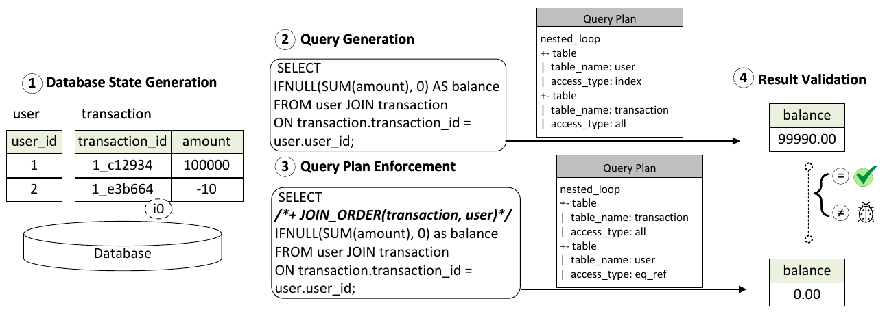
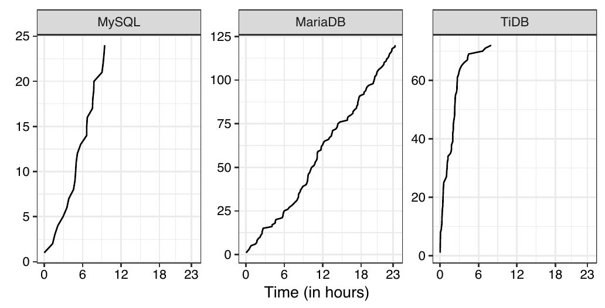
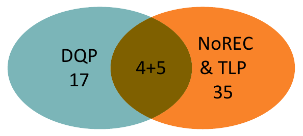
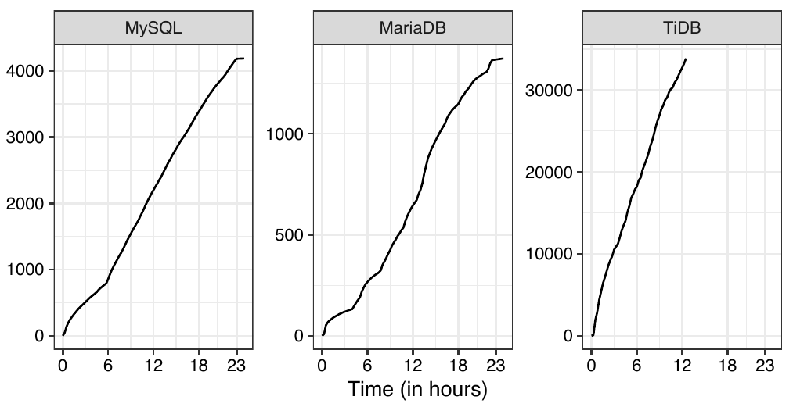

# Keep It Simple: Testing Databases via Differential Query Plans（中文译文）

## 译者说明

本文依据同目录的 `source.pdf` 翻译。章节、图表、公式、算法、代码与参考文献按原文结构保留。

JINSHENG BA，新加坡国立大学，新加坡。<br>
MANUEL RIGGER，新加坡国立大学，新加坡。

作者联系信息：Jinsheng Ba，新加坡国立大学，新加坡，bajinsheng@u.nus.edu；Manuel Rigger，新加坡国立大学，新加坡，rigger@nus.edu.sg。

## 摘要

查询优化器执行各种优化，其中许多是针对连接提出的。这些优化的正确性至关重要，因此应当对它们进行广泛测试。除手工编写的测试之外，自动化测试方法也已得到广泛采用。这类方法半随机地生成数据库和查询。更重要的是，它们提供所谓的测试判据（test oracle），能够推断系统的结果是否正确。最近，研究人员提出了一种名为变换查询合成（Transformed Query Synthesis，TQS）的新测试方法，专门用于发现连接优化中的逻辑缺陷。TQS 是一种复杂的方法：它把给定输入表拆分为若干子表，再通过读取给定表来验证连接这些子表的查询结果。我们研究了 TQS 的缺陷报告，发现 15 个独立缺陷中有 14 个是通过展示同一查询采用不同查询计划执行时的结果差异来报告的。因此，在本文中，我们提出一种简单的 TQS 替代方法。我们的方法为同一查询强制指定不同的查询计划，并验证结果是否一致。我们将其称为查询计划差分（Differential Query Plan，DQP）测试。DQP 能够复现 TQS 发现的 15 个独立缺陷中的 14 个，并且发现了 26 个此前未知的独立缺陷。这些结果表明，一种新颖性有限的简单方法，可以与概念上吸引人但复杂的方法同样有效。此外，DQP 与其他发现逻辑缺陷的测试方法互为补充。DQP 发现的逻辑缺陷中有 81% 无法由 NoREC 和 TLP 发现，而 DQP 遗漏了 NoREC 和 TLP 所发现缺陷的 86%。我们希望本方法的实用性能够推动其广泛采用：我们针对每个系统的实现都不到 100 行代码。

> 译注：原文摘要和结论均写作 86%；引言及第 5 节 Q.4 给出的对应数量是 40 个中有 35 个未被 DQP 发现，两处数值并不一致，译文分别保留。

**CCS 分类：** 信息系统 → 查询优化；安全与隐私 → 数据库与存储安全。

**附加关键词和短语：** 连接，逻辑缺陷。

**ACM 引用格式：** Jinsheng Ba and Manuel Rigger. 2024. Keep It Simple: Testing Databases via Differential Query Plans. *Proc. ACM Manag. Data* 2, 3 (SIGMOD), Article 188 (June 2024), 26 pages. https://doi.org/10.1145/3654991

## 1 引言

关系型数据库管理系统（Database Management System，DBMS）的一项关键特性，是使用 `JOIN` 连接多个表中的数据。已有各种策略和优化被提出，用以优化连接的执行 [14, 15, 33]。由于这些优化十分复杂，查询优化器可能应用语义上不正确的优化，进而产生错误结果。这类错误称为逻辑缺陷。逻辑缺陷很难发现，因为它们悄无声息地产生错误结果；相比之下，崩溃缺陷 [50, 51] 等会导致进程终止。在清单 1 中，第 8 行的第二个查询触发了 DBMS 中的一个逻辑缺陷，因为它本应返回非零结果，却返回了零。

**清单 1. DQP 在 MySQL 中发现的一个可能造成资金损失的缺陷。**

```sql
CREATE TABLE user(user_id DECIMAL PRIMARY KEY);
CREATE TABLE transaction(transitition_id TEXT, amount DECIMAL(10,2) NOT NULL);
CREATE INDEX i0 ON transaction(transitition_id(5));
INSERT INTO user VALUES(1), (2);
INSERT INTO transaction VALUES('1_c12934', 100000), ('1_e3b664', -10);

SELECT IFNULL(SUM(amount), 0) AS balance FROM user JOIN transaction ON transaction.transitition_id = user.user_id; -- 99990.00
SELECT /*+ JOIN_ORDER(transaction, user)*/ IFNULL(SUM(amount), 0) as balance FROM user JOIN transaction ON transaction.transitition_id = user.user_id; -- 0.00
```

清单 1 第 10–16 行的两个查询计划：

```text
nested_loop                              nested_loop
+- table                                 +- table
| table_name: user                       | table_name: transaction
| access_type: index                     | access_type: all
+- table                                 +- table
| table_name: transaction                | table_name: user
| access_type: all                       | access_type: eq_ref
```

近来，用于发现逻辑缺陷的 DBMS 自动化测试方法已得到广泛采用 [25, 40–42]，因为它们常常能发现大量被手工测试遗漏的缺陷，而手工测试的编写代价高昂。这些方法尤其重要的一点是提供了所谓的测试判据，即检查 DBMS 所计算结果是否正确的机制。测试判据通常与半随机数据库和查询生成器 [3, 49]，或 TPC-H [32]、TPC-DS [47] 等既有基准相结合。TQS [45] 是一种检测查询优化中逻辑缺陷的自动化测试方法，尤其是连接优化测试领域的前沿方法。为解决测试判据问题，它模拟连接以推导查询的真实正确结果（ground-truth results），而这种模拟通过表拆分来完成。具体来说，它把给定表拆分为若干子表，再通过读取原表来推导连接这些子表的查询的真实正确结果，以此验证连接优化的正确性。为了生成更加多样的测试用例、发现更多缺陷，TQS 向这些子表随机注入 `NULL`、`0` 等噪声，并把数据库模式建模为图数据模型，以评估 `JOIN` 的相似性。TQS 论文声称该方法发现了 115 个缺陷。不过，TQS 面临两项主要挑战。首先，这种方法难以理解和实现。TQS 需要参照给定表拆分并维护数据模式，还要把数据模式建模为图，通过判断两个图是否同构来评估查询的相似性。其次，测试范围小。TQS 只能应用于等值连接。尽管 TQS 论文声称从概念上可以扩展到非等值连接，但它无法测试其他 SQL 特性，因为 TQS 直接执行这些特性来获得结果。

为了解 TQS 发现缺陷的有效性，我们研究了公开问题跟踪器中 TQS 的缺陷报告。我们识别出 15 个独立缺陷，其中 14 个报告通过展示同一查询在不同查询提示下执行时会产生不同结果来说明问题，如清单 1 所示。因此，要发现这些缺陷并不需要推导真实正确结果。

基于这一观察，本文提出一种简单易懂的方法，实现与 TQS 同等水平的缺陷发现有效性。我们提议检查同一查询采用不同查询计划执行时结果的一致性，并将其称为查询计划差分（DQP）测试。更形式化地说，给定数据库 $D$ 和查询 $Q$，DBMS 使用查询计划 $P$ 在 $D$ 上执行 $Q$，得到结果 $Q(P,D)$。对于 $Q$ 的另一个可能查询计划 $P'$，若 $Q(P,D) \ne Q(P',D)$，则表明存在缺陷。

为了将这项技术实现为无需修改 DBMS 的黑盒方法，我们提议使用 DBMS 已提供的查询提示和系统变量设置来影响生成的查询计划。我们认为，这项技术虽然直观而简单，却解决了 TQS 的两项挑战，并具有与 TQS 相近的缺陷发现有效性。此外，DQP 可以测试更多查询优化，而不只是连接优化，因为查询提示和系统变量也会影响其他 SQL 特性的优化。更重要的是，它很容易实现：DQP 不需要维护图、子表等数据结构来推导真实正确结果。

上面简要介绍的清单 1 展示了 DQP 在 MySQL 中发现的一个缺陷，作为本文的动机示例。假设在银行场景中，MySQL 将用户信息存储在 `user` 表中，将交易记录存储在 `transaction` 表中。第 1–3 行创建了两张表和一个索引，第 4–5 行向两表插入数据。`transaction_id` 列中的数据由用户 ID 和随机生成的交易 ID 组成，例如 `1_c12934` 表示用户 `1` 进行了一笔 ID 为 `c12934` 的交易。第 7 行检查用户 `1` 的余额，得到预期结果 `9990.00`。如果该查询产生的查询计划效率不高，数据库管理员可能决定像第 8 行那样加入查询提示，强制使用另一个查询计划。提示 `/*+ JOIN_ORDER(transaction, user)*/` 指示 DBMS 在执行连接时先处理 `transaction` 表，再处理 `user` 表。然而，这个查询返回了错误结果 `0.00`。两个查询计划见第 10–16 行。这个缺陷可能造成严重后果，因为用户 `1` 的全部资金都不见了。

> 译注：原文此段使用列名 `transaction_id`，清单 1 则写作 `transitition_id`；此段将预期余额写作 `9990.00`，清单 1 与图 1 则为 `99990.00`。上述差异均按各处原文保留。

我们在广泛使用的 DBMS 测试框架 SQLancer [41] 的基础上实现 DQP，针对每个 DBMS 的 Java 实现均不到 100 行。SQLancer 提供的数据库和查询生成器被我们直接复用。我们在 TQS 论文使用的三个 DBMS，即 MySQL、MariaDB 和 TiDB 上评估了 DQP。结果显示，DQP 能够复现 TQS 发现的 15 个独立缺陷中的 14 个，以及全部 10 个与连接优化相关的缺陷。尽管 TQS 已广泛测试这些系统，DQP 仍发现了 26 个此前未知的独立缺陷，其中 21 个为逻辑缺陷。这些逻辑缺陷中，15 个与连接优化有关，说明它们被 TQS 遗漏；另外 6 个与其他查询优化有关，意味着 TQS 无法发现它们。与 TQS 相比，DQP 简单、通用且高效。我们还将 DQP 发现的缺陷与非优化参考引擎构造（Non-optimizing Reference Engine Construction，NoREC）[40] 和三值逻辑划分（Ternary Logic Partitioning，TLP）[41] 这两种测试方法进行了比较。这两种方法均作为通用逻辑缺陷发现技术提出，并不专门针对连接优化缺陷。NoREC 和 TLP 无法发现 DQP 所发现的 21 个逻辑缺陷中的 17 个，而 DQP 无法发现 NoREC 和 TLP 所发现的 40 个逻辑缺陷中的 35 个。总之，DQP 不仅是 TQS 的简单替代方法，也与 NoREC 和 TLP 互为补充。

总体而言，我们的贡献如下：

- 我们研究了前沿方法 TQS 在发现连接优化逻辑缺陷方面的有效性。
- 我们展示了简单易懂的 DQP 测试方法具有与更复杂的 TQS 方法同等水平的缺陷发现有效性。
- 我们实现并评估了该方法，在广泛使用的 DBMS 中发现了 26 个此前未知的独立缺陷。DQP 的源代码已公开，并已集成到 SQLancer 中。[^1]

[^1]: https://github.com/sqlancer/sqlancer/issues/918

## 2 TQS 研究

TQS 成功在 MySQL、MariaDB、TiDB 和 PolarDB 中发现了缺陷。不过，它是一种复杂的方法，需要实现多个图和表作为内部组件，以推导真实正确结果。本节通过回答以下问题研究 TQS，以了解这些由 TQS 发现的缺陷是否可以用更简单的方法发现：

- **RQ.1 与连接相关的缺陷。** TQS 报告的缺陷中，有多少与连接优化有关？TQS 旨在发现连接优化中的缺陷，因此我们研究所发现的缺陷中有多少与其有关。
- **RQ.2 缺陷论证。** TQS 是如何报告缺陷的？让开发者确信计算结果有误的是其 DBMS 而非 TQS，可能颇具挑战。如下文对本问题的回答所述，我们发现这些缺陷并不是依据其真实正确结果来解释的，这启发了我们提出更简单的测试方法。

### 2.1 TQS 概述

变换查询合成（TQS）[45] 被提出用于检测连接优化中的逻辑缺陷。它包括两个主要组件：数据引导的模式与查询生成（Data-guided Schema and query Generation，DSG），以及知识引导的查询空间探索（Knowledge-guided Query space Exploration，KQE）。TQS 要求以一张宽表作为输入。输入表可以手工指定；在 TQS 论文中，作者使用了 TPC-H[^2] 和 KDD Competition[^3] 数据库。首先，DSG 通过数据库规范化将宽表拆分为多个子表。数据库规范化是一种成熟技术，通过将数据组织到不同表中，尽量减少数据冗余和依赖。随后，DSG 随机构造查询，连接这些子表，并通过读取宽表来推导真实正确结果。这个推导过程并不容易实现，因为必须维护给定宽表和拆分后各表之间的关系，而且这种维护很复杂。为了提高生成查询的多样性，KQE 评估随机生成的查询是否与先前某个查询相似，并调整随机生成过程，降低生成相似查询的可能性。相似性评估将数据库模式建模为基于嵌入的图，其中每个查询都是一个子图，KQE 检查两个子图是否同构。作者声称，TQS 在 24 小时内发现了 115 个缺陷，分别在 MySQL、MariaDB、TiDB 和 PolarDB 中涉及 7、5、5 和 3 种缺陷类型。

[^2]: https://www.tpc.org/tpch/
[^3]: https://archive.ics.uci.edu/dataset/129/kdd+cup+1998+data

### 2.2 研究范围

我们选择 TQS 的公开缺陷列表[^4] 作为研究对象。除论文本身之外，这是我们能够获得的唯一 TQS 研究资料。我们没有涉及 TQS 的源代码，因为源代码不可获取，而且作者在邮件中回复说，目前无法向我们提供。第 6 节将解释我们为获取源代码所作的尝试。

[^4]: https://github.com/xiutangzju/tqs/blob/d5f8f5/index.md

### 2.3 数据预处理

**目标 DBMS。** 我们研究了 MySQL、MariaDB 和 TiDB 的缺陷报告。TQS 最初在 MySQL、MariaDB、TiDB 和 PolarDB 四个 DBMS 上接受评估，但我们注意到公开缺陷列表中没有 PolarDB 的缺陷报告。因此，我们研究了前三个 DBMS 的缺陷报告；作者声称 TQS 在其中发现了 17 种类型的 92 个缺陷。虽然论文声称已报告所有发现的缺陷，但公开列表中的实际报告数量是 21 份，其中 MySQL 为 11 份、MariaDB 为 5 份、TiDB 为 5 份。

**表 1. TQS 报告的缺陷。**

| DBMS | 缺陷 | 类型 ID | 独立 | 连接 | 查询计划 |
| --- | --- | --- | --- | --- | --- |
| MySQL | 106713 | 3 | ✓ | | ✓ |
| MySQL | 106715 | 4 | ✓ | ✓ | ✓ |
| MySQL | 106716 | 7 | ✓ | ✓ | ✓ |
| MySQL | 106717 | 5 | ✓ | | ✓ |
| MySQL | 106718 | 2 | ✓ | | ✓ |
| MySQL | 106611 | 6 | | | ✓ |
| MySQL | 106710 | 1 | ✓ | | ✓ |
| MySQL | 99273 | | ✓ | | |
| MySQL | 109211 | | ✓ | ✓ | ✓ |
| MySQL | 109212 | | ✓ | ✓ | ✓ |
| MariaDB | 28214 | 8 | ✓ | ✓ | ✓ |
| MariaDB | 28215 | 9 | ✓ | ✓ | ✓ |
| MariaDB | 28216 | 10 | ✓ | ✓ | ✓ |
| MariaDB | 28217 | 11 | ✓ | ✓ | ✓ |
| MariaDB | 29695 | 12 | ✓ | ✓ | ✓ |
| TiDB | 33039 | 13 | | ✓ | ✓ |
| TiDB | 33041 | 14 | | ✓ | ✓ |
| TiDB | 33042 | 15 | ✓ | ✓ | ✓ |
| TiDB | 33045 | 16 | | ✓ | ✓ |
| TiDB | 33046 | 17 | | ✓ | ✓ |

由于 TQS 作者提供的缺陷列表可能不完整，为避免遗漏任何报告，我们进一步搜索了第一作者在相应问题跟踪器中的提交历史。我们没有搜索其他作者，因为未能找到他们在这些问题跟踪器中的账号。具体来说，我们搜索了 MySQL[^5]、MariaDB[^6] 和 TiDB[^7] 的问题跟踪器，未能找到其他缺陷报告。表 1 展示了全部报告，但排除了 #106473，因为 MySQL 开发者驳回了这份报告。[^8] 我们还注意到，#106611、#106710 和 #99273 是由一位非论文作者报告的，TQS 论文的致谢中提到了这一点。根据观察和调查，我们推断论文中的 92 个缺陷指的是触发缺陷的测试用例，其中很大一部分重复，并非独立、有效的缺陷。

[^5]: https://bugs.mysql.com/search.php?cmd=display&status=All&severity=all&reporter=16399198
[^6]: https://jira.mariadb.org/browse/MDEV-29695?jql=reporter="XiuTang"
[^7]: https://github.com/pingcap/tidb/issues?q=is:issue+author:xiutangzju
[^8]: https://bugs.mysql.com/bug.php?id=106473

**TQS 论文中的缺陷。** 为验证我们关于 TQS 论文中 92 个缺陷实际指触发缺陷测试用例的假设，我们进行了匹配分析，考察公开缺陷列表与 TQS 论文表 4 所列 17 种缺陷类型之间的对应关系。具体来说，对于公开列表中的每个缺陷，我们寻找与 TQS 论文中描述的状态、严重程度相同且描述相近的缺陷类型。我们发现报告标题与类型描述相似，但不完全相同，因此采用 gestalt 模式匹配算法 [38] 计算两个字符串是否相似，用 0 到 1 之间的浮点数表示相似程度。我们把最高分视为最接近的匹配。匹配后，我们还根据报告的语义信息进行人工检查和修正。具体而言，我们将 #28217 与类型 11 匹配，因为两者都描述了限制连接缓冲区导致错误结果，尽管严重程度不同；我们还将 #33042 与类型 15 匹配，因为它们都有相同的关键词“empty resultset”（空结果集）。

表 1 的“类型 ID”列展示了匹配结果。17 份缺陷报告能够对应到 TQS 论文中的 17 种缺陷类型，另有 3 份报告没有相应类型。这个结果表明，公开列表中的每份报告对应的是 TQS 论文中的一种缺陷类型，而不是一个缺陷。3 份报告未能匹配到类型，一种可能的解释是它们在 TQS 论文投稿后才提交。

**独立缺陷。** 对于这 20 份报告，我们依据开发者的回复调查缺陷是否独立。通常，如果报告与之前报告的缺陷重复，开发者会明确回复。我们仔细检查了各报告中开发者的全部回复，以判断缺陷是否重复。

表 1 的“独立”列标出独立缺陷。20 个缺陷中有 15 个是独立的。对于 MySQL，#106611 与此前发现的 #105773 重复，开发者在报告提交后 24 小时内确认了重复关系。对于 TiDB，#33049、#33041、#33045、#33046 均与同样由 TQS 报告的 #33042 重复，开发者在报告提交后 3 天内确认了这些重复关系。下面我们基于这 15 个独立缺陷进一步研究 TQS。

> 译注：原文此段写作 #33049，表 1 对应位置写作 #33039，二者按原文分别保留。

### RQ.1 与连接相关的缺陷

我们评估了多少缺陷与连接优化有关。TQS 旨在检测连接优化缺陷，DSG 推导连接的真实正确结果，而 KQE 驱动测试用例生成去执行多样的连接优化。因此，确定有多少缺陷与连接优化有关十分重要。我们检查了报告中的测试用例，判断其中是否至少包含一个 `JOIN` 子句；若是，就将该报告视为与连接优化相关。虽然连接优化也可能适用于子查询等其他子句 [13]，但 DSG 无法推导这些子句的真实正确结果，[^9] 因此，本研究只将含有 `JOIN` 子句的查询视为与连接相关的查询。

表 1 的“连接”列标出了测试用例至少包含一个 `JOIN` 子句的报告。总计 15 个独立缺陷中有 10 个（67%）与连接优化有关。其余 5 个与连接优化无关的缺陷，即 #106713、#106717、#106718、#106710 和 #99273，有一个共同特征：触发它们的测试用例至少包含一个 `SUBQUERY` 子句。TQS 的核心组件对发现这些与连接无关的缺陷没有显示出明显贡献。尚不清楚 TQS 如何为这些用例构造真实正确结果，因为它直接执行非连接 SQL 子句来获得结果。[^10]

[^9]: TQS 论文第 3.3 节中，作者写道：“DSG 基于连接子句随机生成其他表达式。”
[^10]: TQS 论文第 3.4 节中，作者写道：“DSG 还执行 AST 中定义的、所生成的过滤和投影。”

### RQ.2 缺陷论证

我们检查了这些报告中的缺陷描述和测试用例，研究缺陷如何被报告和论证。我们观察到，全部 10 个与连接相关的缺陷，以及 15 个独立缺陷中的 14 个，都采用同一种报告方式：展示同一查询的不同查询计划会计算出不一致的结果。清单 2 展示了 MySQL 缺陷 #106713。报告者通过说明带查询提示 `/*+ no_semijoin()*/` 的查询与不带该提示的同一查询返回不同结果，论证了错误行为。查询提示指示 DBMS 生成或避免某种特定查询计划，而 `no_semijoin()` 禁用查询优化中的半连接。

**清单 2. TQS 发现的 MySQL 缺陷 #106713。**

```sql
CREATE TABLE IF NOT EXISTS t0(c0 DECIMAL ZEROFILL COLUMN_FORMAT DEFAULT);
INSERT HIGH_PRIORITY INTO t0(c0) VALUES(NULL), (2000-09-06), (NULL);
INSERT INTO t0(c0) VALUES(NULL);
INSERT DELAYED INTO t0(c0) VALUES(2016-02-18);

SELECT t0.c0 FROM t0 WHERE t0.c0 IN (SELECT t0.c0 FROM t0 WHERE (t0.c0 NOT IN (SELECT t0.c0 FROM t0 WHERE t0.c0)) = (t0.c0)); -- {0000001985},{0000001996}
SELECT t0.c0 FROM t0 WHERE t0.c0 IN (SELECT /*+ no_semijoin()*/ t0.c0 FROM t0 WHERE (t0.c0 NOT IN (SELECT t0.c0 FROM t0 WHERE t0.c0)) = (t0.c0)); -- empty set
```

**清单 3. TQS 发现的 MySQL 缺陷 #99273。**

```sql
CREATE TABLE t1 (a INT, b INT);
INSERT INTO t1 VALUES (1,1),(2,1),(3,2),(4,2),(5,3),(6,3);

SET SQL_MODE = 'ONLY_FULL_GROUP_BY';
SELECT a FROM t1 as t1 GROUP BY a HAVING (SELECT t1.a FROM t1 AS t2 GROUP BY b LIMIT 1); -- {1},{2},{3},{4},{5},{6}
INSERT INTO t1 values (null, 4);
SELECT a FROM t1 as t1 GROUP BY a HAVING (SELECT t1.a FROM t1 AS t2 GROUP BY b LIMIT 1); -- empty set
```

唯一的例外是清单 3 所示的 #99273。它包含在公开缺陷列表中，却无法匹配到 TQS 论文中的任何缺陷类型。该报告通过一种非预期行为来说明问题：插入一行含 `NULL` 的数据后，查询反而返回更少的行。根本原因是针对 `SUBQUERY` 的错误优化，与 `JOIN` 无关。由于 TQS 只能推导 `JOIN` 的结果，尚不清楚它如何推导 `SUBQUERY` 的真实正确结果。我们还注意到，这个缺陷发现于 2020 年，而其他缺陷均发现于 2022 年。基于上述观察，我们推测，其中大多数缺陷可以通过检查同一查询采用不同查询计划执行时的不一致来发现，而这比 TQS 简单得多。

> TQS 的 15 个独立缺陷中的 14 个，以及全部 10 个与 `JOIN` 相关的缺陷，都是通过展示同一查询不同查询计划的执行结果差异来报告的。

## 3 方法

我们提出一种简单的方法来发现连接优化中的缺陷，将其称为查询计划差分（DQP）测试。核心思想是为同一查询强制指定不同查询计划，并比较结果以发现缺陷。与 TQS 相比，DQP 不需要实现图和表结构来推导真实正确结果。此外，DQP 支持发现各种查询优化中的缺陷，而不仅限于等值连接优化。我们的关键贡献不在于方法的新颖性，而在于揭示：简单易懂的技术可以取得与更复杂方法同等水平的表现。



**图 1. DQP 概览。**

**方法概览。** 图 1 基于清单 1 展示了 DQP 的概览。首先，在步骤 ① 中，DQP 生成数据库状态 $D$。然后，在步骤 ② 中，DQP 生成查询 $Q$，并强制使用不同查询计划 $P$ 和 $P'$ 来执行它。在步骤 ③ 中，DQP 获得执行结果。结果有差异，即 $Q(P,D) \ne Q(P',D)$，表示可能存在缺陷。

> 译注：原文上述概览将计划控制合入步骤 ②，并将获得结果写在步骤 ③；图 1 和下文各小标题则分别将查询生成、计划控制、结果验证编号为 ②、③、④。这里保留原文各处的编号。

**数据库状态生成（①）。** 对于完全自动化的方法，我们假设 $D$ 是随机生成的。常见生成方法包括基于变异的方法 [25, 51] 和基于规则的方法 [40–42, 49]。为创建图 1 中的 $D$，DQP 执行清单 1 的第 1–5 行。生成数据库状态并非本文的贡献，DQP 可与任意数据库状态生成方法搭配。事实上， $D$ 也可以手工指定。

**查询生成（②）。** 基于 $D$，DQP 在步骤 ② 随机生成查询 $Q$，随后我们自动验证其结果以发现缺陷。与数据库状态生成类似，已有许多查询生成方法 [5, 8, 23, 29, 36, 43, 44]；原则上，DQP 可以与其中任一种搭配。

**强制指定查询计划（③）。** DQP 执行 $Q$，DBMS 为其推导查询计划 $P$。随后，DQP 尝试强制 DBMS 为同一查询推导另一查询计划 $P'$。查询提示和系统变量是两种利用 SQL 关键字影响查询计划的方法，无需修改 DBMS 的源代码。第 4 节将详细介绍。在图 1 中，DQP 通过提示 `/*+ JOIN_ORDER(transaction, user)*/` 强制使用连接顺序与 $P$ 不同的 $P'$。

**结果验证（④）。** 在步骤 ③ 中，DQP 执行 $Q(P,D)$ 和 $Q(P',D)$ 获得结果，我们检查二者是否一致。此处 $Q(P,D)=99990.00$，而 $Q(P',D)=0.00$，因此发现了一个缺陷。

## 4 实现

我们在 SQLancer[^11] 中实现了 DQP。SQLancer 是一个 DBMS 测试框架，能够随机生成符合 SQL 语法的数据库状态和查询。下文将我们的原型称为 SQLancer+DQP。本节讨论其实现的技术细节。

[^11]: https://github.com/sqlancer/sqlancer

### 4.1 步骤 ①、② 的数据库和查询生成

我们采用 SQLancer 提供的基于语法的方法，随机生成语法正确的 SQL 语句。SQLancer 编码了各 DBMS 的 SQL 方言语法，DQP 随机遍历对应的语法树来生成 SQL 语句。为了生成 $D$，DQP 生成 `CREATE TABLE`、`CREATE INDEX` 等非查询语句。类似地，为了生成 $Q$，DQP 随机遍历语法树生成查询语句，即 `SELECT`。TQS 和 SQLSmith [49] 也使用基于语法的生成方法。

**生成 JOIN。** SQLancer 已能为许多 DBMS 生成 `JOIN`，但缺少对 MySQL 和 MariaDB 的支持。我们参照 SQLancer 中 TiDB 实现的 `JOIN` 代码，[^12] 更新了 SQLancer，使其支持为 MySQL 和 MariaDB 生成 `JOIN` 子句。

[^12]: https://github.com/sqlancer/sqlancer/blob/cddff6/src/sqlancer/tidb/ast/TiDBJoin.java

### 4.2 步骤 ③ 的查询计划控制

查询提示和系统变量是两种通过 SQL 影响查询计划的方式，无需修改被测 DBMS 的源代码。

**查询提示。** 查询提示是查询中类似注释的子句，可以影响查询优化器的行为。MySQL[^13]、MariaDB[^14]、TiDB[^15] 等流行 DBMS 广泛支持查询提示。对于需要表名或列名作为参数的提示，我们根据查询随机生成这些名称。在图 1 中，提示 `/*+ JOIN_ORDER(transaction, user)*/` 强制优化器按特定顺序连接两张表，这就是 $P'$ 与 $P$ 的区别。

**系统变量。** 另一种影响查询计划的方式，是设置作用于查询优化器的系统变量。MySQL[^16] 和 MariaDB[^17] 的 `optimizer_switch` 是影响查询优化、进而影响生成计划的系统变量。具体来说，DQP 随查询执行一条 `SET` 语句来配置系统变量，强制使用不同的查询计划。例如，在 MariaDB 中，DQP 可以执行以下 `SET` 语句和查询：

```sql
SET STATEMENT optimizer_switch='index_merge=on' FOR SELECT t0.c0 FROM t0
```

前缀 `SET` 配置的系统变量对后续 `SELECT` 语句生效，`index_merge` 控制是否启用索引合并优化。

**效率考量。** 为提高测试效率，我们在一次迭代中枚举全部可能的查询提示和系统变量取值，强制使用多个查询计划 $\lbrace P',P'',\ldots\rbrace$。这样做是可行的，因为我们观察到查询提示及系统变量可能的取值都是有限的，且数量很少。我们检查了 DBMS 文档，提取出 MySQL 的 32 个查询提示和 `optimizer_switch` 的 26 个选项、MariaDB 的 `optimizer_switch` 的 37 个选项，以及 TiDB 的 22 个查询提示，用来强制生成不同查询计划。为简洁起见，图 1 仅展示 $P$ 和 $P'$ 的执行。

[^13]: https://dev.mysql.com/doc/refman/8.0/en/optimizer-hints.html
[^14]: https://mariadb.com/kb/en/optimizer-hints/
[^15]: https://docs.pingcap.com/tidb/stable/optimizer-hints
[^16]: https://dev.mysql.com/doc/refman/8.0/en/switchable-optimizations.html
[^17]: https://mariadb.com/kb/en/optimizer-switch/

### 4.3 步骤 ④ 的结果验证

最初，我们在步骤 ④ 中观察到了误报。DBMS 开发者解释说，误报来自歧义查询，即结果无法保证一致或可预测的查询。为了排除这些误报，我们通过检查表中行顺序的变化是否影响结果，识别歧义查询。实现这项技术之后，我们没有再观察到误报。一次迭代之后，DQP 返回步骤 ① 或 ②，开始新一轮迭代。由于生成 $D$ 相对缓慢，DQP 默认返回步骤 ②。只有经过固定次数的迭代后才返回步骤 ①。这个次数可以配置，我们将其设为 10,000；先前工作 [3] 已通过经验确定这一数值效果良好。

**歧义查询。** 歧义查询可能导致误报，其他 DBMS 测试方法也有类似观察 [40, 41]。调查和分析所有歧义查询类别很困难，也超出了本文范围。我们讨论实践中遇到的歧义查询。一类歧义查询[^18] 是在 `SELECT` 子句中包含非聚合列。不在 `GROUP BY` 中的列是非聚合列。如果将非聚合列放入 `SELECT`，某些 DBMS 会从每个组随机选取一行，返回该行的非聚合列。其他 DBMS（如 PostgreSQL）则拒绝这类歧义查询。清单 4 展示了我们测试 TiDB 时遇到的具体例子。在上半部分的测试用例中，两个查询都读取不在 `GROUP BY` 中的 `t0.c0`。`CAST` 函数将 `0.9` 和 `0.8` 都转换为 `1`，因此 `t0` 的两行属于同一组，但两个查询随机返回组中的一行，因而结果不同。这类歧义查询会导致验证步骤 ④ 误报。

**算法 1. 歧义查询识别。**

```text
输入：查询 Q，Q 的两个查询计划 P、P'，数据库 D
1: ambiguous = false
2: Minimize(Q, D, P, P')
3: for D' in Permutation(D) do
4:     if Validate(P, P', Q, D') ≠ Validate(P, P', Q, D) then
5:         ambiguous = true
6:         break
7:     end if
8: end for
输出：ambiguous
```

**歧义查询识别算法。** 算法 1 展示了我们的算法：通过检查表内行顺序的变化是否影响验证结果，识别歧义查询。首先，为降低计算复杂度，我们最小化 $Q$ 和 $D$。步骤 ③ 识别出的触发缺陷测试用例通常包含数百条 SQL 语句，用来初始化数据库状态和查询结果。为了高效地多次执行它们以识别歧义查询，我们使用 C-Reduce [39] 并结合人工方式最小化每个测试用例。图 1 的最小化测试用例仅包含两张表和四行数据。接着，我们枚举所有表中行的排列。对于每个排列 $D'$，如果它影响验证结果，即 $Validate(P,P',Q,D') \ne Validate(P,P',Q,D)$，则该查询存在歧义。在清单 4 中，改变 `t0` 中行的排列，使第二个查询得到不同结果，原有差异随之消失。DQP 识别并忽略这个测试用例，因为这种差异很可能意味着查询存在歧义。

**清单 4. 通过 recondition 识别的一种不稳定行为。**

```sql
CREATE TABLE t0(c0 FLOAT);
INSERT INTO t0 VALUES (0.9), (0.8);
CREATE INDEX i0 ON t0(c0);
SET @@sql_mode='';

SELECT t0.c0 FROM t0 GROUP BY CAST(t0.c0 AS DECIMAL); -- {0.8}
SELECT /*+ IGNORE_INDEX(t0, i0)*/ t0.c0 FROM t0 GROUP BY CAST(t0.c0 AS DECIMAL); -- {0.9}

-- ------------------------------------------------------------------------
CREATE TABLE t0(c0 FLOAT);
INSERT INTO t0 VALUES (0.8), (0.9);
CREATE INDEX i0 ON t0(c0);
SET @@sql_mode='';

SELECT t0.c0 FROM t0 GROUP BY CAST(t0.c0 AS DECIMAL); -- {0.8}
SELECT /*+ IGNORE_INDEX(t0, i0)*/ t0.c0 FROM t0 GROUP BY CAST(t0.c0 AS DECIMAL); -- {0.8}
```

**算法的可扩展性。** 我们认为算法 1 在实践中可行，因为已有工作中用于复现大多数缺陷的数据库，在最小化后都很小。例如，在 SQLancer 发现的 499 个历史缺陷中，最小化后的触发缺陷测试用例平均包含 3.69 条 SQL 语句。[^19] 大多数缺陷都能用很小的触发用例复现，这一现象已在文件系统 [31]、Java 程序 [2] 和回答集程序 [34] 等多种测试工作中得到观察，被称为“小范围假设”（small-scope hypothesis）。图 1 中每张表有两行，所以排列数为 $2! \ast 2! = 4$。除原始排列之外，第 3 行循环最多执行 3 次。通过最小化测试用例，循环的执行次数呈指数级减少。

[^18]: https://docs.pingcap.com/tidb/v6.5/dev-guide-unstable-result-set
[^19]: https://github.com/sqlancer/bugs/blob/96cbb8/bugs.json

## 5 评估

为了评估 DQP 的有效性和效率，我们尝试回答以下问题：

- **Q.1 缺陷复现。** DQP 能否发现 TQS 发现的缺陷？
- **Q.2 新缺陷。** DQP 能否发现此前未知的缺陷？
- **Q.3 缺陷发现效率。** DQP 发现缺陷的效率如何？
- **Q.4 缺陷发现有效性。** 与其他发现逻辑缺陷的测试判据相比，DQP 的有效性如何？
- **Q.5 覆盖率。** DQP 在多大程度上覆盖了查询优化器？

**被测 DBMS。** 我们测试了与第 2 节研究相同的 DBMS：MySQL、MariaDB 和 TiDB。MySQL 是最流行的关系型 DBMS 之一。MariaDB 是从 MySQL 分叉而来的另一个流行 DBMS。TiDB 是一个流行的企业级 DBMS，其 GitHub 上的开放版本获得了超过 35,000 个 star。更重要的是，这些 DBMS 也曾被 TQS 测试过。由于 TQS 作者没有公开 PolarDB 的缺陷报告，我们没有测试 PolarDB。对于 Q.2 和 Q.4，我们使用当时可用的最新开发版本：MySQL 8.1.0、MariaDB 11.1.2、TiDB 7.4.0。为在 Q.3 中公平比较，我们使用了与 TQS 相同的版本：MySQL 8.0.28、MariaDB 10.8.2、TiDB 5.4.0。所有 DBMS 均以默认配置运行。

**实验基础设施。** 所有实验均在 AMD EPYC 7763 处理器上进行，该处理器有 64 个物理核、128 个逻辑核，主频 2.45 GHz。测试机器运行 Ubuntu 22.04.2，配备 512 GB 内存，最多使用 60 个核。

### Q.1 缺陷复现

我们评估了 DQP 作为一种简单测试方法，能否发现 TQS 发现的逻辑缺陷。第 2 节发现，15 个独立缺陷中的 14 个，以及全部 10 个与连接相关的缺陷，都是以类似 DQP 的同一种方式报告的，所以我们假设 DQP 也能发现这些缺陷。我们使用 TQS 公开报告中的测试用例（见表 1）作为初始数据库状态和原始查询，并按照 DQP 的方法，如图 1 步骤 ③ 所示，为该查询强制指定另一个查询计划。如果原始查询和派生查询的返回结果出现任何差异，我们就认为 DQP 能够发现该缺陷。

**结果。** DQP 能够识别 TQS 报告的 15 个独立缺陷中的 14 个。清单 2 展示了前文讨论过的一个由 TQS 发现的触发缺陷用例。该用例包含两个查询，唯一差别是查询提示，报告对原因的描述为“no_semijoin produce wrong results”（no_semijoin 产生错误结果）。因此，DQP 可以通过添加 `no_semijoin` 提示派生第二个查询，轻易发现这个缺陷。

我们还发现，全部 10 个与连接相关的缺陷都能由 DQP 发现，因为它们的报告方式都与清单 2 类似。尽管 TQS 通过将执行结果与真实正确结果进行比较来发现缺陷，TQS 作者向开发者解释缺陷时，却提供了一个结果与错误查询不同的参考查询。结果表明，DQP 能够发现 TQS 所发现的大多数缺陷。

> DQP 能够检测出 TQS 发现的 15 个独立缺陷中的 14 个，以及全部 10 个与连接相关的缺陷。

### Q.2 新缺陷

除了复现 TQS 发现的既有缺陷，我们还评估 SQLancer+DQP 能否发现此前未知的缺陷。由于测试范围更广，我们预期它能够做到。只要查询提示或系统变量能够影响查询计划，DQP 就也能应用于非等值连接和不含 `JOIN` 的查询。我们在三个 DBMS 上运行了两轮 SQLancer+DQP，每轮 24 小时，以发现缺陷。为了降低发现重复缺陷的可能性，两轮之间，我们禁用了第一轮中促使缺陷被发现的查询提示和系统变量。开发者通常在几天内确认报告，但这些缺陷通常需要数周或数月才能在下一个发布版本中修复。当报告重复问题时，开发者通常会明确指出。为避免重复报告，我们只报告可能独立的缺陷，而不是所有触发缺陷的测试用例。具体来说，对于每个查询提示和系统变量的每个可用选项，我们最多报告一个缺陷。

**缺陷概览。** 表 2 展示了 SQLancer+DQP 发现的 26 个此前未知的独立缺陷。“逻辑”列表示该缺陷是否为逻辑缺陷，“连接”列表示它是否与连接优化有关。我们向开发者提交了 32 份报告，其中 26 个被确认为此前未知的独立缺陷，1 个为重复报告，1 个等待进一步分析，4 个是歧义查询导致的误报。这些误报启发我们设计了算法 1，之后未再观察到误报。需要注意的是，TiDB 的 #47019 和 #47020 可能是重复缺陷，因为修复 #46601 后便无法再观察到它们。我们正在等待开发者回复，以确认它们是否重复。[^20] 因此，由于开发者没有明确认定重复，我们将它们视为独立缺陷。

[^20]: https://github.com/pingcap/tidb/issues/47019#issuecomment-1734913792

**表 2. DQP 发现的此前未知的独立缺陷。**

| DBMS | 缺陷 | 状态 | 严重程度 | 逻辑 | 连接 |
| --- | --- | --- | --- | --- | --- |
| MySQL | 112243 | 已确认 | Non-critical | ✓ | ✓ |
| MySQL | 112242 | 已确认 | Serious | ✓ | |
| MySQL | 112264 | 已确认 | Serious | ✓ | ✓ |
| MySQL | 112269 | 已确认 | Serious | ✓ | ✓ |
| MySQL | 112296 | 已确认 | Non-critical | ✓ | ✓ |
| MariaDB | 32076 | 已确认 | Major | ✓ | |
| MariaDB | 32105 | 已确认 | Major | ✓ | ✓ |
| MariaDB | 32106 | 已确认 | Major | ✓ | ✓ |
| MariaDB | 32107 | 已确认 | Major | ✓ | ✓ |
| MariaDB | 32108 | 已确认 | Major | ✓ | ✓ |
| MariaDB | 32143 | 已确认 | Major | ✓ | ✓ |
| MariaDB | 32186 | 已确认 | Major | ✓ | ✓ |
| TiDB | 46535 | 已确认 | Major | ✓ | ✓ |
| TiDB | 46538 | 已确认 | Moderate | | |
| TiDB | 46556 | 已确认 | Major | | |
| TiDB | 46580 | 已修复 | Critical | ✓ | ✓ |
| TiDB | 46598 | 已确认 | Major | ✓ | |
| TiDB | 46599 | 已确认 | Major | ✓ | |
| TiDB | 46601 | 已修复 | Critical | ✓ | |
| TiDB | 47019 | 已确认 | Major | ✓ | |
| TiDB | 47020 | 已确认 | Major | ✓ | ✓ |
| TiDB | 47286 | 已确认 | Major | ✓ | ✓ |
| TiDB | 47345 | 已确认 | Critical | ✓ | ✓ |
| TiDB | 47346 | 已确认 | Major | | |
| TiDB | 47347 | 已确认 | Major | | |
| TiDB | 47348 | 已确认 | Moderate | | |
| 合计 | 26 | | | 21 | 15 |

**逻辑缺陷。** 这 26 个此前未知的独立缺陷中，21 个是查询优化中的逻辑缺陷，因为它们是通过同一查询的不同查询计划返回不一致结果而发现的。其余非逻辑缺陷由内部错误和崩溃导致，无需比较不同查询计划的执行结果即可暴露。

**与连接相关的缺陷。** 21 个逻辑缺陷中有 15 个与连接优化有关，因为其最小化测试用例至少需要一个 `JOIN`。虽然 DQP 能发现各种查询优化中的缺陷，但所发现的大多数缺陷与连接优化有关，而这正是 TQS 的测试目标。我们沿用第 2 节的分类方法，将至少包含一个 `JOIN` 子句的逻辑缺陷视为连接优化缺陷。结果表明，连接优化比其他查询优化更容易出现缺陷，而且 TQS 遗漏了我们发现的这些连接优化缺陷。简单的 DQP 方法在发现这类缺陷方面表现出了令人意外的有效性。

**缺陷严重程度。** 一个重要问题是，开发者是否认为 DQP 发现的缺陷很重要。TiDB 的缺陷严重程度由开发者指定；我们发现的 14 个缺陷中有 12 个被标为 Major 或 Critical，表示它们严重影响目标系统，通常修复优先级较高。TQS 发现的那个缺陷也被标为 Critical。对于 MySQL 和 MariaDB，我们发现严重程度由用户指定，开发者通常不会更新，因此我们认为这些级别并不准确。不过，TQS 论文报告了这些级别，所以我们也提供出来供比较。我们在 MySQL 和 MariaDB 中发现的 12 个缺陷中，有 10 个为 Serious 或 Major；TQS 论文中的全部 12 个缺陷则被标为 Serious、Major 或 Critical。为进一步展示我们所发现缺陷的重要性，下面给出两个选取的示例。

**清单 5. DQP 通过设置 MySQL 系统变量发现的缺陷 #112242。**

```sql
CREATE TABLE t0(c0 INT);
INSERT INTO t0(c0) VALUES(1);
CREATE INDEX i0 USING HASH ON t0(c0) INVISIBLE;

SELECT t0.c0 FROM t0 WHERE COALESCE(0.6) IN (t0.c0); -- {}
SET SESSION optimizer_switch = 'use_invisible_indexes=on';
SELECT t0.c0 FROM t0 WHERE COALESCE(0.6) IN (t0.c0); -- {1}
```

**示例 1：通过设置系统变量发现的缺陷。** 清单 5 展示了我们通过控制 MySQL 系统变量 `optimizer_switch` 发现的 #112242。配置项 `use_invisible_indexes` 控制查询优化器是否考虑不可见索引，默认情况下查询优化会排除它们。此例将索引 `i0` 设为 `INVISIBLE`，所以第一个查询不用索引来读取数据。将变量设为 `use_invisible_indexes=on` 后，第二个查询使用索引 `i0` 读取数据。这个缺陷由错误的索引优化造成。没有 DQP，就很难判断使用该索引的查询是否返回错误结果。我们提交报告时将严重程度设为 Serious。DQP 在查询优化中发现的 21 个逻辑缺陷中，有 10 个是通过设置系统变量发现的。

**清单 6. DQP 通过设置 TiDB 查询提示发现的缺陷 #46580。**

```sql
CREATE TABLE t0(c0 INT);
CREATE TABLE t1(c0 BOOL, c1 BOOL);
INSERT INTO t1 VALUES (false, true);
INSERT INTO t1 VALUES (true, true);
CREATE VIEW v0(c0, c1, c2) AS SELECT t1.c0, LOG10(t0.c0), t1.c0 FROM t0, t1;
INSERT INTO t0(c0) VALUES(3);

SELECT COUNT(v0.c2) FROM v0, t0 CROSS JOIN t1 ORDER BY -v0.c1; -- empty set
SELECT /*+ MERGE_JOIN(t1, t0, v0)*/ COUNT(v0.c2) FROM v0, t0 CROSS JOIN t1 ORDER BY -v0.c1; -- {4}
```

**示例 2：通过设置查询提示发现的缺陷。** 清单 6 展示了我们通过设置查询提示 `MERGE_JOIN` 在 TiDB 中发现的 #46580。`MERGE_JOIN` 指示查询优化器执行 `JOIN` 算子时使用排序归并连接算法。根据开发者的回复，问题出在 `Projection` 操作中，它对应关系代数的投影操作。使用 `MERGE_JOIN` 时，`Projection` 操作错误地返回空输出，因此第一个查询返回了非预期的空结果。DQP 通过比较同一查询在有无 `MERGE_JOIN` 提示时的结果发现了这个缺陷。`Projection` 很常见，因为 `SELECT` 通常会执行它，所以开发者将该缺陷定为 Critical，并在一周内修复。DQP 在查询优化中发现的 21 个逻辑缺陷中，有 11 个是通过设置查询提示发现的。

> 译注：原文此段将空输出描述为“使用 MERGE_JOIN 时”产生，但清单 6 中返回空集的第一个查询不带该提示，带提示的第二个查询返回 `{4}`。译文保留该段与清单各自的表述。

> DQP 使我们发现并报告了 26 个被 TQS 遗漏的、此前未知的独立缺陷。

### Q.3 缺陷发现效率

我们评估了 DQP 在 24 小时内能发现多少缺陷。我们以 SQLancer 默认配置运行 DQP 24 小时，测量触发缺陷测试用例的数量。我们排除了导致崩溃或内部错误的缺陷，因为它们不是由 DQP 直接发现，而是由隐式测试判据发现的。尽管 TQS 论文第 5.2 节做过类似实验，但由于前述源代码不可获取以及某些实验配置不明确，很难公平比较。首先，TQS 和 DQP 都采用基于语法的测试用例生成方法，但实现差异不清楚，例如 `WHERE` 中可能生成哪些表达式。其他 DBMS 测试工作 [3, 51] 虽也省略了详细描述，但提供了源代码，可从中获取这些信息。其次，TQS 支持多线程，但我们未在 TQS 论文第 5.2 节的图 8 效率评估中找到使用线程数的说明。我们运行 SQLancer+DQP 时使用了 10 个线程，这是评估测试工具的常见做法 [24]，其他 DBMS 测试工作 [3] 也这样做。第三，不清楚 TQS 作者仅统计逻辑缺陷，还是统计全部类型。最后，TQS 和 DQP 在不同机器上评估，机器差异显著影响效率，因此二者的效率结果不能直接比较。



**图 2. DQP 在 24 小时、10 次运行中发现的触发缺陷测试用例数量。**

**结果。** 图 2 展示了 DQP 在 MySQL、MariaDB 和 TiDB 中运行 24 小时发现的触发缺陷测试用例数量。DQP 在这三个 DBMS 中分别发现了 24、120 和 72 个触发缺陷测试用例。由于 SQLancer+DQP 发现了几个崩溃缺陷，MySQL 和 TiDB 在约 9 小时时退出。与 TQS 论文第 5.2 节的结果相比，DQP 展现出缺陷检测效率上的显著进步。再次强调，与 TQS 进行公平比较很困难。尽管如此，SQLancer+DQP 找到的大量触发缺陷测试用例表明，即使没有复杂的测试用例生成改进技术，它也具有较高效率。

> SQLancer+DQP 在 24 小时内，在 MySQL、MariaDB 和 TiDB 中发现了 216 个触发缺陷测试用例。

### Q.4 缺陷发现有效性

我们将 DQP 与两种先进的逻辑缺陷测试判据进行比较：非优化参考引擎构造（NoREC）[40] 和三值逻辑划分（TLP）[41]。NoREC 检查某个谓词在 DBMS 可能优化的查询中，与在难以优化的查询中，是否产生不一致结果。TLP 接收一个查询，并派生多个更复杂的查询，每个查询计算结果的一个分区，以检查合并后的分区与原查询的结果是否等价。两种判据均在 SQLancer 中实现。我们未考虑枢轴查询合成（Pivoted Query Synthesis，PQS）[42] 等其他逻辑缺陷判据，因为 SQLancer 没有为本次评估的三个 DBMS 支持它。



**图 3. 各测试判据检测出的缺陷数量。**

**方法。** 我们使用与先前工作 [21, 40, 41] 相同的方法，尽力开展人工分析，识别 DQP、NoREC 和 TLP 发现的重叠缺陷和各自独有的缺陷。判断不同方法找到的两个触发缺陷用例是否触发同一个底层缺陷很困难 [27]。我们只考虑已向开发者报告的最小化用例，假设每个用例代表一个独立缺陷。虽然我们不能完全排除误分类，例如忽略了某个缺陷可以由另一条查询发现，但我们认为大多数情况都很清楚。我们从公开缺陷列表[^21] 收集了 NoREC 和 TLP 在 MySQL、MariaDB 和 TiDB 中发现的全部 41 个逻辑缺陷，其中 40 个可复现；另收集了表 2 中 DQP 发现的 21 个逻辑缺陷。然后，我们从 DQP 的触发缺陷用例出发，针对相同数据库及对应查询应用 NoREC 和 TLP，派生另一个测试用例；反方向也进行同样的操作。

[^21]: https://github.com/sqlancer/bugs/blob/96cbb856/bugs.json

**结果。** 图 3 展示了 DQP、NoREC 和 TLP 发现的缺陷数量。DQP 发现的 21 个逻辑缺陷中，有 17 个无法被 NoREC 或 TLP 发现。其中 10 个的原因是，原查询和派生查询都得到正确的查询计划，或者都得到错误的查询计划。另有 7 个因为缺少这两种判据所需的子句（例如 `WHERE`），无法改写为 NoREC 或 TLP 的等价测试用例。我们还发现，DQP 无法复现 NoREC 发现的全部 4 个缺陷，以及 TLP 发现的 36 个缺陷中的 31 个。结果表明，DQP 与 NoREC、TLP 所发现的缺陷很少重叠，说明它们互为补充。

**清单 7. 将清单 5 转换为 NoREC 和 TLP 的等价测试用例。**

```sql
CREATE TABLE t0(c0 INT);
INSERT INTO t0(c0) VALUES(1);
CREATE INDEX i0 USING HASH ON t0(c0) INVISIBLE;
-- ----------------------------------- NoREC -----------------------------------
SELECT COUNT(*) FROM t0 WHERE COALESCE(0.6) IN (t0.c0); -- {0}
SELECT SUM(count) FROM (SELECT (COALESCE(0.6) IN (t0.c0)) IS TRUE AS count FROM t0) as t; -- {0}
-- ------------------------------------ TLP ------------------------------------
SELECT t0.c0 FROM t0; -- {1}
SELECT t0.c0 FROM t0 WHERE COALESCE(0.6) IN (t0.c0) UNION SELECT t0.c0 FROM t0 WHERE NOT (COALESCE(0.6) IN (t0.c0)) UNION SELECT t0.c0 FROM t0 WHERE (COALESCE(0.6) IN (t0.c0)) IS NULL; -- {1}
```

**示例。** 清单 7 展示了将清单 5 的触发缺陷测试用例改写为 NoREC 和 TLP 等价测试用例的例子；注意，这是一种机械变换。对于 NoREC，第一个查询与清单 5 第 5 行原始查询相同，第二个查询通过移动 `WHERE` 中的谓词从第一个查询派生。对于 TLP，第一个查询通过删除原查询中的 `WHERE` 生成，第二个查询则是三个 `WHERE` 谓词不同的查询的并集。若两个查询返回不一致结果，这两种判据就会发现缺陷。如果不设置 `use_invisible_indexes=on`，存在缺陷的索引 `i0` 不会被考虑，因此 NoREC 和 TLP 检查的全部查询都无法使用暴露该缺陷所必需的错误索引。

> NoREC 和 TLP 无法发现 DQP 所发现的 21 个逻辑缺陷中的 17 个。

### Q.5 覆盖率

我们评估了 DQP 对查询优化器的执行覆盖程度，这是我们希望测试的关键组件。我们考虑了多种覆盖率指标。首先，因为 DQP 为同一查询强制使用不同查询计划，我们以计划覆盖率衡量计划覆盖的全面程度；它指执行过的独立查询计划数，占全部可观察独立查询计划估计数的比例。其次，我们用查询提示和系统变量来控制查询计划，因此通过提示与变量覆盖情况以及连接覆盖情况，评估它们在多大程度上影响查询优化器。最后，我们还评估了代码覆盖率，这是一种衡量多少代码被测试的常用指标。

**计划覆盖率。** 我们测量了 DQP 覆盖的独立查询计划数占全部可观察独立查询计划数的比例。查询计划代表一个经过优化的查询，独立查询计划越多，意味着应用了更多查询优化策略。测量独立计划数的一个挑战是，查询计划包含不稳定的辅助信息，这类信息在几乎每个计划中通常都不同。如果去掉此类信息后一个计划仍然独一无二，我们就认为它在结构上独立。为排除这些信息，我们忽略查询计划中的模式名称（如列名和表名）、估计代价（如基数）以及随机标识符（如行标识符）。这种做法沿用了先前工作 [3]。另一个挑战是查询计划数的上界未知，因为我们不清楚计划中操作的可能组合有多少；原则上，这个数量是无限的，因为增加一个 `JOIN` 子句通常会产生更复杂的计划。作为尽力而为的估计，我们将 DQP、NoREC 和 TLP 在 24 小时、10 次运行中覆盖的全部独立计划合并，假设合并后的独立计划数就是上界。设 $D_i$、 $N_i$、 $T_i$ 分别表示三个判据在某个 DBMS 的第 $i$ 次运行中覆盖的独立查询计划集合，则估计的数量上界为：

$$
\left\lvert \bigcup _ {i=1}^{10}(D_i \cup N_i \cup T_i) \right\rvert.
$$



**图 4. DQP 在 24 小时、10 次运行中覆盖的独立查询计划的平均数量。**

**结果。** 图 4 展示了 SQLancer+DQP 在 24 小时、10 次运行中覆盖的独立查询计划平均数量。总体上，MySQL、MariaDB 和 TiDB 的计划覆盖率所用数量上界估计分别是 27156、7553 和 253947；SQLancer+DQP 每次运行的平均覆盖率分别为 15.42%（4187.5）、18.17%（1372.4）和 13.34%（33876.6）。由于 SQLancer+DQP 在 TiDB 中发现了几个崩溃缺陷，其全部 10 次运行均在约 12 小时后退出。虽然时间更短，TiDB 覆盖的独立计划仍然最多。可能的原因是 TiDB 的查询计划包含比其他系统更丰富的元素。例如，TiDB 是分布式 DBMS，会在计划中标明每个算子的执行节点，而其他 DBMS 没有类似信息。尽管三个 DBMS 的平均计划覆盖率都不到 20%，DQP 仍远高于 NoREC 和 TLP；后两者在 10 次运行中的平均计划覆盖率均不足 1%。这符合预期，因为 NoREC 和 TLP 并未针对这一指标优化。我们指出，总体覆盖率较低可以用不同运行探索了多样的计划来解释：SQLancer+DQP 的 10 次运行之间，重叠不足 50%，因此 DQP、NoREC 和 TLP 每次运行平均覆盖率的总和并不接近 100%。原因可能是随机生成的数据库和查询通常在不同运行中有所不同。我们无法比较 DQP 与 TQS 的计划覆盖率，因为 TQS 源代码不可获取，论文也没有报告计划覆盖数量。SQLancer+DQP 在三个 DBMS 中均覆盖了数千个独立查询计划，表明它能够有效测试查询优化。

**表 3. 影响三类查询优化的查询提示或系统变量数量。**

| DBMS | 连接（Join） | 索引（Index） | 表（Table） |
| --- | --- | --- | --- |
| MySQL | 14 | 26 | 18 |
| MariaDB | 18 | 5 | 14 |
| TiDB | 10 | 4 | 8 |
| 合计 | 42 | 35 | 40 |

**提示与变量覆盖情况。** 我们识别出查询提示或系统变量可以影响的三类查询优化。表 3 展示了每类提示或系统变量的数量。虽然查询计划和查询优化是各 DBMS 特有的，不能直接比较，但我们发现三个 DBMS 都提供了能够影响共同优化类别的提示或变量：连接，即连接两个表的算法和顺序；索引，即索引的算法和适用范围；表，即表的读写策略，例如为重复查询缓存表、对小表执行全表扫描。以连接优化为例，MySQL 和 TiDB 中可使用查询提示 `HASH_JOIN` 强制使用哈希连接算法，MariaDB 中则可用变量 `hash_join_cardinality` 指定哈希连接是否应使用历史基数统计。虽然 MariaDB 源自 MySQL，但两者的查询提示和系统变量数量不同。例如，在索引类别中，MySQL 有两个查询提示和四个系统变量，专门用于影响索引合并算法；索引合并是利用索引合并多次扫描结果的一种优化，而 MariaDB 没有类似提示或变量来影响它。TiDB 还在表类别中提供切换存储引擎的额外优化，可以通过查询提示影响。例如，`READ_FROM_TIFLASH` 提示用于强制从 TiDB 的存储引擎 TiFlash 读取表。这项优化是 TiDB 特有的，MySQL 和 MariaDB 只能在创建表时指定存储引擎。三个 DBMS 都支持查询提示和系统变量，能够影响相同的三类查询优化，但它们作用的是各 DBMS 的具体优化。

**连接覆盖情况。** 由于 DQP 旨在发现连接优化缺陷，我们还评估了 SQLancer+DQP 在 24 小时、10 次运行中，通过设置查询提示和系统变量，在计划中覆盖了多少连接算子。我们检查计划是否覆盖 MySQL[^22]、MariaDB[^23] 和 TiDB[^24] 文档列出的连接算子。MySQL 和 MariaDB 各有 12 个连接算子，TiDB 有 3 个。SQLancer+DQP 分别覆盖 MySQL 和 MariaDB 的 12 个算子中的 7 个，以及 TiDB 的全部 3 个。MySQL 和 MariaDB 中共同未覆盖的 4 个连接算子为：用于全文索引的 `fulltext`，用于并集或交集表达式的 `index_merge`，以及用于子查询的 `unique_subquery` 和 `index_subquery`。MySQL 和 MariaDB 提供特定查询提示 `INDEX_MERGE` 来启用 `index_merge`，但我们的 DQP 实现没有覆盖该连接算子，因为它要求查询中存在特定表达式。我们没有找到能够直接强制使用其余三个算子的提示或变量。此外，MySQL 的 `system` 算子未被覆盖，它用于系统表；MariaDB 的 `ref_or_null` 也未被覆盖，它用于连接时针对空值的索引查找。这两个算子未被覆盖可能是测试用例生成器随机性所致，因为它们分别在另一个 DBMS 中得到了覆盖。

**代码覆盖率。** 虽然我们主要关注覆盖的独立查询计划数，但代码覆盖率也是衡量系统可能被测试到何种程度的常见指标。我们使用 C/C++ 覆盖率工具 gcov[^25] 收集 MySQL 和 MariaDB 的行覆盖率，使用 Go 语言覆盖率工具 cover[^26] 收集 TiDB 的语句覆盖率。行覆盖率是 gcov 的默认指标，语句覆盖率是 cover 的默认指标。我们同时开展 10 次 SQLancer+DQP 运行，每次 24 小时。由于资源限制，每个目标 DBMS 只运行一个实例，我们测量这 10 次运行合计的行覆盖率和语句覆盖率。因为 TQS 源代码不可获取，我们无法比较二者的代码覆盖率。由于 DQP 发现的是连接优化中的缺陷，我们只测量查询优化代码的覆盖率；具体来说，MySQL 和 MariaDB 测量 `sql` 目录，TiDB 测量 `planner` 目录。结果显示，SQLancer+DQP 在 MySQL 和 MariaDB 中的行覆盖率分别为 22.2% 和 27.7%，在 TiDB 中的语句覆盖率为 36.1%。所有 DBMS 的覆盖率均不足 50%，看起来较低，但这是预期之中的，因为我们无法枚举全部可能的查询计划。

[^22]: https://dev.mysql.com/doc/refman/8.0/en/explain-output.html#jointype_system
[^23]: https://mariadb.com/kb/en/explain/#type-column
[^24]: https://docs.pingcap.com/tidb/stable/explain-joins
[^25]: https://gcc.gnu.org/onlinedocs/gcc/Gcov.html
[^26]: https://go.dev/testing/coverage/

> DQP 在 24 小时内，在 MySQL、MariaDB 和 TiDB 中覆盖了数千个独立查询计划，以及超过一半的连接算子。

## 6 讨论

我们讨论 DQP 的一些关键特性，以及 TQS 的评估结果。

**缺陷多样性。** 我们发现的缺陷可以影响各种不同查询。这些缺陷通常来自错误优化，例如清单 5 的错误索引优化和清单 6 的错误连接优化。这些有缺陷的优化也会影响其他查询，不仅限于使用特定提示或系统变量取值的触发缺陷用例。例如，对于清单 5，若创建索引 `i0` 时不用 `INVISIBLE`，而使用：

```sql
CREATE INDEX i0 USING HASH ON t0(c0)
```

则第一个查询：

```sql
SELECT t0.c0 FROM t0 WHERE COALESCE(0.6) IN (t0.c0)
```

在不设置任何查询提示或系统变量的情况下，也会返回错误结果 `1`。

**推广路径。** 我们相信简单的测试方法有广泛采用的潜力。从概念上看，DQP 是通过比较不同查询计划结果工作的通用黑盒方法，容易理解；无需插桩代码来追踪内部执行信息，也无需理解结果如何计算。从实现上看，DQP 很容易实现，我们为每个 DBMS 编写的 Java 代码都不到 100 行。从集成上看，DQP 可以与已有数据库和查询生成器或测试套件配合。从适用性上看，DQP 可以测试相当多的 DBMS，因为最流行的 10 个关系型 DBMS 中有 8 个[^27] 支持用户控制查询优化。剩下两个是 Microsoft Access 和 Snowflake，我们没有找到明确解释如何手动控制它们的查询优化的文档。考虑到这些特性，我们认为 DQP 可以得到广泛采用。

**贡献与新颖性。** 本文的核心贡献是展示了：简单易懂的 DQP 测试方法，与更复杂的 TQS 方法具有同等水平的缺陷发现有效性。TQS 作者在其论文第 5.3 节中，通过禁用真实正确结果的推导，提到过对带查询提示的查询进行比较。实践中的一些系统，例如 DuckDB，也已在自身测试框架中使用类似技术。DuckDB 同时运行查询的未优化版本和优化版本，再检查结果是否一致。它通过 DuckDB 特有的语句 `PRAGMA enable_verification` 来控制优化。[^28] 我们的核心贡献在于这一认识：DQP 这种简单方法能够达到与复杂的 TQS 方法同等水平的缺陷发现效率。总体而言，在测试领域，我们相信简单、实用的方法，比复杂但概念上吸引人的方法具有显著优势。

**TQS 的重要性。** TQS 是第一种测试连接优化逻辑缺陷的方法，因此展示了这一问题的严重性。更重要的是，TQS 为发现 DBMS 逻辑缺陷提供了新范式。本文展示了一种简单方法可以达到与 TQS 同等水平的缺陷发现效率。尽管如此，TQS 仍能发现 DQP 无法发现的缺陷。表 1 的 #99273 被发现时，并未通过展示同一查询不同查询计划的执行差异来说明问题。虽然该查询缺少 `JOIN`，使得 TQS 如何推导其真实正确结果仍不清楚，但 DQP 无法发现它。

[^27]: https://db-engines.com/en/ranking/relational+dbms
[^28]: https://duckdb.org/dev/sqllogictest/intro#query-verification

**TQS 的缺陷数量不一致。** 我们从 TQS 公开列表中识别出 15 个独立缺陷，而 TQS 作者声称发现了 92 个。根据研究，我们怀疑作者混淆了术语，将触发缺陷的测试用例称为“缺陷”，将独立缺陷称为“缺陷种类”；我们在本文中对此作了澄清。我们承认缺陷去重仍是开放问题 [12]，也观察到其他工作将重复问题计为缺陷。

**TQS 源代码不可获取。** 两个原因妨碍我们在研究和评估中与 TQS 比较。首先，TQS 作者没有发布源代码。我们向 TQS 的所有作者发送了两封邮件请求获取代码，但他们回复称尚未准备好发布：“我目前正在开展一个建立在已发表研究之上的后续项目。因此，我正在为这两个项目完善和增强代码库。这项工作完成后，我计划开源源代码，或分享给对此感兴趣的同行。”我们还注意到，这些作者另外发表了一篇包含 TQS 实现的工具演示论文 [46]。遗憾的是，仔细检查和调试其源代码[^29] 后，我们发现该仓库缺少 TQS 核心方法的实现；另一位关注者也有同样的发现。[^30] 其次，TQS 由复杂步骤组成，论文又没有描述重要细节，因此很难重新实现。例如，作者称“我们直接使用这些数据驱动的模式规范化方法来生成测试数据库模式”，但并不清楚他们到底使用哪种方法拆分宽表，以及生成了哪些子表。TQS 采用基于抽象语法树（AST）的随机查询生成，其实现“类似于 RAGS 和 SQLSmith”，但这不足以让我们了解它能生成哪些查询，例如能生成哪些表达式，以及 AST 最大深度。论文没有描述这些细节可以理解，但这使我们无法重新实现该方法用于比较。

**有效性威胁。** 我们的评估结果面临潜在的有效性威胁。主要问题是无法获取 TQS 的源代码及其在 PolarDB 上的缺陷报告。为缓解这一风险，我们与 TQS 作者沟通，他们表示源代码尚未准备好发布。由于难以重新实现 TQS，我们提取了公开缺陷列表，并开展了第 2 节所述的严格研究。从实践角度，我们比较 TQS 和 DQP 发现的缺陷，以评估其缺陷发现能力；从理论角度，我们在本节讨论了二者的概念差异。另一个问题是我们实现的正确性。为减轻这一风险，我们将 DQP 构建在流行的 DBMS 测试框架 SQLancer 之上，并公开了源代码。最后一个问题是结果的可靠性。为了验证发现的缺陷确实存在，我们将每个缺陷报告给 DBMS 开发者，并依据回复标注状态。我们也公开了全部缺陷报告。

[^29]: https://github.com/xiutangzju/dlbd/tree/b85b1f
[^30]: https://github.com/xiutangzju/dlbd/issues/1

## 7 相关工作

我们简要总结与本文最密切相关的工作。

**发现优化缺陷。** 查询优化器是 DBMS 最关键的组件之一，其可靠性很重要，因此相关测试受到广泛关注。NoREC [40] 通过检查优化查询与未优化查询的结果是否相等，检测查询优化中的逻辑缺陷。除逻辑缺陷外，查询优化中也存在性能缺陷。如果某项查询优化选出了出乎预料地低效的查询计划，就可以将其视为性能缺陷。Jung 等人提出 APOLLO [23]，通过比较查询在数据库系统两个版本上的执行时间，发现性能回退缺陷。Liu 等人提出 AMOEBA [26]，比较语义等价查询对的执行时间，以识别非预期的变慢。Ba 等人提出 CERT [4]，通过测试基数估计来发现性能问题。相比之下，DQP 专门发现查询优化中的逻辑缺陷，重点是连接优化。

**操纵查询计划。** 已有各种操纵查询计划的技术。AEM [35] 使用查询提示切换查询计划，以在运行时绕过缺陷。PgCuckoo [20] 提供 PostgreSQL 插件，使 PostgreSQL 能够执行任意查询计划。然而，PgCuckoo 论文指出，一项重大挑战是手工操纵产生无效查询计划的比例很高，因为计划中的操作通常相互依赖。TAQP [19] 使用查询提示切换计划，并测量执行时间，以检查优化器所选计划是否最优。与这些方法相比，DQP 通过查询提示和系统变量，以黑盒方式操纵计划来发现逻辑缺陷。

**DBMS 模糊测试。** 模糊测试是发现 DBMS 缺陷的高效技术，但它着眼于内存错误等与安全相关的缺陷。SQLSmith [49]、Griffin [16]、DynSQL [22] 和 ADUSA [26] 使用基于语法的方法生成测试用例，以发现内存错误。受 AFL [48] 等灰盒模糊测试工具启发，Squirrel [51] 使用代码覆盖率指导生成多样化测试用例，寻找内存错误。与这些方法不同，DQP 旨在发现 DBMS 的逻辑缺陷，特别是查询优化中的缺陷。

> 译注：此段的“ADUSA [26]”按原文保留；参考文献 [26] 的实际条目为前文 AMOEBA 对应的论文。

**方法论。** 其他领域已有若干工作采用与本文类似的方法论，提出能够胜过既有复杂方法的简单技术。Kali [37] 仅删除功能，却比先前复杂的自动软件补丁生成技术表现更好。Fu 等人 [17] 展示了经调优的简单支持向量机（SVM），可以胜过复杂的卷积神经网络（CNN）算法。本文也受到了 Kali 的启发。

**差分测试与蜕变测试。** 差分测试是成熟的测试技术，比较同一测试用例在不同系统上的结果，由 McKeeman [28] 提出。蜕变测试 [10, 11] 通过变换系统输入，检查原始结果与变换后结果之间的关系，从而检查系统正确性。二者的重要区别是，蜕变测试作用于单一系统，差分测试作用于多个系统。从概念上看，DQP 可归类为蜕变测试方法：我们检查查询在不同查询计划下是否返回相同结果。已有的 DBMS 蜕变测试方法，如上文的 TLP [41] 和 NoREC [40]，应用预定义规则来修改谓词和移动 SQL 子句。相比之下，DQP 更简单，因为我们仅添加查询提示或设置系统变量。

**查询生成。** 查询生成有两类主要方法：定向生成与随机生成。Bati 等人 [5] 提出的定向查询生成整合代码覆盖率等执行反馈，引导生成过程到达特定代码位置。Khalek 等人 [1] 则利用求解器支持的方法生成语法和语义均正确的查询。由于生成满足基数约束的查询计算复杂度较高，研究者提出了启发式算法 [9, 30]。另一方面，以 SQLsmith [49] 为代表的随机查询生成，使用预定义语法随机生成语义有效的查询，在广泛使用的 DBMS 中发现了超过 100 个缺陷。APOLLO [23] 同样依赖预定义语法生成查询，发现性能回退问题。重要的是，DQP 可以适配任意查询生成方法。

**数据库状态生成。** 类似地，数据库状态生成也主要分为定向生成和随机生成。QAGen [7] 展示的定向数据库状态生成使用符号执行刻画约束，随后生成满足约束的查询。SPQR [6] 则产生与给定查询及其预期结果对应的数据库状态。Gray 等人 [18] 提出的随机数据库状态生成使用并行算法，高效生成包含数十亿条记录的数据库。基于覆盖率的方法 [25, 51] 通过修改用于创建原始状态的给定 SQL 语句来生成数据库状态。QPG [3] 旨在由查询计划引导生成多样化的数据库状态。同样，DQP 可以适配任意数据库状态生成技术。

## 8 结论

本文研究了连接测试领域的前沿方法 TQS，并提出简单而有效的替代方法 DQP 测试。DQP 的核心思想，是比较同一查询采用不同查询计划执行时的一致性；我们通过添加查询提示或设置系统变量得到不同计划。与 TQS 相比，DQP 只需比较结果，不必构造多个图和表来推导真实正确结果；它还支持发现等值连接优化之外的更多查询优化缺陷。评估表明，DQP 能够发现 TQS 所发现的 15 个独立缺陷中的 14 个，以及全部 10 个与连接相关的缺陷。此外，DQP 在 MySQL、MariaDB 和 TiDB 中发现了 26 个此前未知的独立缺陷，这些缺陷被 TQS 遗漏。与 TQS 一样，DQP 补充了现有测试方法，后者还会发现连接优化之外其他组件中的逻辑缺陷。事实上，DQP 发现的逻辑缺陷中，有 81% 无法由 NoREC 和 TLP 发现，而 DQP 遗漏了 NoREC 和 TLP 所发现缺陷的 86%。DQP 所需实现工作量很小，与任意测试用例生成方法兼容，与 TQS 效率相近，而且是一种黑盒测试方法。我们鼓励 DBMS 开发者在实践中使用 DQP，将它作为以较低成本发现 DBMS 严重缺陷的方法。

## 致谢

本研究由新加坡国家研究基金会和新加坡网络安全局，通过国家网络安全研发计划（Fuzz Testing &lt;NRF-NCR25-Fuzz-0001&gt;）资助。本文表达的任何意见、发现、结论或建议均为作者的观点，并不代表新加坡国家研究基金会和新加坡网络安全局的观点。

## 参考文献

- [1] Shadi Abdul Khalek and Sarfraz Khurshid. 2010. Automated SQL query generation for systematic testing of database engines. In Proceedings of the IEEE/ACM international conference on Automated software engineering. 329–332.

- [2] Alexandr Andoni, Dumitru Daniliuc, Sarfraz Khurshid, and Darko Marinov. 2003. Evaluating the “small scope hypothesis”. In In Popl, Vol. 2.

- [3] Jinsheng Ba and Manuel Rigger. 2023. Testing Database Engines via Query Plan Guidance. In 45th IEEE/ACM International Conference on Software Engineering, ICSE 2023, Melbourne, Australia, May 14-20, 2023. IEEE, 2060–2071. https://doi.org/10.1109/ICSE48619.2023.00174

- [4] Jinsheng Ba and Manuel Rigger. 2024. CERT: Finding Performance Issues in Database Systems Through the Lens of Cardinality Estimation. In Proceedings of the 46th IEEE/ACM International Conference on Software Engineering, ICSE 2024, Lisbon, Portugal, April 14-20, 2024. ACM, 917–917. https://doi.org/10.1145/3597503.3639076

- [5] Hardik Bati, Leo Giakoumakis, Steve Herbert, and Aleksandras Surna. 2007. A Genetic Approach for Random Testing of Database Systems. In Proceedings of the 33rd International Conference on Very Large Data Bases (Vienna, Austria) (VLDB ’07). VLDB Endowment, 1243–1251.

- [6] Carsten Binnig, Donald Kossmann, and Eric Lo. 2006. Reverse query processing. In 2007 IEEE 23rd International Conference on Data Engineering. IEEE, 506–515.

- [7] Carsten Binnig, Donald Kossmann, Eric Lo, and M. Tamer Özsu. 2007. QAGen: Generating Query-Aware Test Databases. In Proceedings of the 2007 ACM SIGMOD International Conference on Management of Data (Beijing, China) (SIGMOD ’07). Association for Computing Machinery, New York, NY, USA, 341–352. https://doi.org/10.1145/1247480.1247520

- [8] Nicolas Bruno, Surajit Chaudhuri, and Dilys Thomas. 2006. Generating Queries with Cardinality Constraints for DBMS Testing. IEEE Trans. on Knowl. and Data Eng. 18, 12 (Dec. 2006), 1721–1725. https://doi.org/10.1109/TKDE.2006.190

- [9] Nicolas Bruno, Surajit Chaudhuri, and Dilys Thomas. 2006. Generating queries with cardinality constraints for dbms testing. IEEE Transactions on Knowledge and Data Engineering 18, 12 (2006), 1721–1725.

- [10] Tsong Yueh Chen, S. C. Cheung, and Siu-Ming Yiu. 2020. Metamorphic Testing: A New Approach for Generating Next Test Cases. CoRR abs/2002.12543 (2020). arXiv:2002.12543 https://arxiv.org/abs/2002.12543

- [11] Tsong Yueh Chen, Fei-Ching Kuo, Huai Liu, Pak-Lok Poon, Dave Towey, TH Tse, and Zhi Quan Zhou. 2018. Metamorphic testing: A review of challenges and opportunities. ACM Computing Surveys (CSUR) 51, 1 (2018), 1–27.

- [12] Yang Chen, Alex Groce, Chaoqiang Zhang, Weng-Keen Wong, Xiaoli Fern, Eric Eide, and John Regehr. 2013. Taming compiler fuzzers. In Proceedings of the 34th ACM SIGPLAN conference on Programming language design and implementation. 197–208.

- [13] Mostafa Elhemali, César A Galindo-Legaria, Torsten Grabs, and Milind M Joshi. 2007. Execution strategies for SQL subqueries. In Proceedings of the 2007 ACM SIGMOD international conference on Management of data. 993–1004.

- [14] Pit Fender and Guido Moerkotte. 2013. Counter Strike: Generic Top-Down Join Enumeration for Hypergraphs. Proc. VLDB Endow. 6, 14 (2013), 1822–1833. https://doi.org/10.14778/2556549.2556565

- [15] Pit Fender, Guido Moerkotte, Thomas Neumann, and Viktor Leis. 2012. Effective and Robust Pruning for Top-Down Join Enumeration Algorithms. In IEEE 28th International Conference on Data Engineering (ICDE 2012), Washington, DC, USA (Arlington, Virginia), 1-5 April, 2012, Anastasios Kementsietsidis and Marcos Antonio Vaz Salles (Eds.). IEEE Computer Society, 414–425. https://doi.org/10.1109/ICDE.2012.27

- [16] Jingzhou Fu, Jie Liang, Zhiyong Wu, Mingzhe Wang, and Yu Jiang. 2022. Griffin : Grammar-Free DBMS Fuzzing. In 37th IEEE/ACM International Conference on Automated Software Engineering, ASE 2022, Rochester, MI, USA, October 10-14, 2022. ACM, 49:1–49:12. https://doi.org/10.1145/3551349.3560431

- [17] Wei Fu and Tim Menzies. 2017. Easy over hard: A case study on deep learning. In Proceedings of the 2017 11th joint meeting on foundations of software engineering. 49–60.

- [18] Jim Gray, Prakash Sundaresan, Susanne Englert, Ken Baclawski, and Peter J Weinberger. 1994. Quickly generating billion-record synthetic databases. In Proceedings of the 1994 ACM SIGMOD international conference on Management of data. 243–252.

- [19] Zhongxian Gu, Mohamed A Soliman, and Florian M Waas. 2012. Testing the accuracy of query optimizers. In Proceedings of the Fifth International Workshop on Testing Database Systems. 1–6.

- [20] Denis Hirn and Torsten Grust. 2019. PgCuckoo: Laying Plan Eggs in PostgreSQL’s Nest. In Proceedings of the 2019 International Conference on Management of Data. 1929–1932.

- [21] Yuancheng Jiang, Jiahao Liu, Jinsheng Ba, Roland H. C. Yap, Zhenkai Liang, and Manuel Rigger. 2024. Detecting Logic Bugs in Graph Database Management Systems via Injective and Surjective Graph Query Transformation. In Proceedings of the 46th IEEE/ACM International Conference on Software Engineering, ICSE 2024, Lisbon, Portugal, April 14-20, 2024. ACM, 46:1–46:12. https://doi.org/10.1145/3597503.3623307

- [22] Zu-Ming Jiang, Jia-Ju Bai, and Zhendong Su. 2023. DynSQL: Stateful Fuzzing for Database Management Systems with Complex and Valid SQL Query Generation. (Aug. 2023).

- [23] Jinho Jung, Hong Hu, Joy Arulraj, Taesoo Kim, and Woonhak Kang. 2019. APOLLO: Automatic Detection and Diagnosis of Performance Regressions in Database Systems. Proc. VLDB Endow. 13, 1 (Sept. 2019), 57–70. https://doi.org/10.14778/3357377.3357382

- [24] George Klees, Andrew Ruef, Benji Cooper, Shiyi Wei, and Michael Hicks. 2018. Evaluating fuzz testing. In Proceedings of the 2018 ACM SIGSAC conference on computer and communications security. 2123–2138.

- [25] Yu Liang, Song Liu, and Hong Hu. 2022. Detecting Logical Bugs of DBMS with Coverage-based Guidance. In 31st USENIX Security Symposium (USENIX Security 22). USENIX Association.

- [26] Xinyu Liu, Qi Zhou, Joy Arulraj, and Alessandro Orso. 2022. Automatic Detection of Performance Bugs in Database Systems using Equivalent Queries. In 44th IEEE/ACM 44th International Conference on Software Engineering, ICSE 2022, Pittsburgh, PA, USA, May 25-27, 2022. ACM, 225–236. https://doi.org/10.1145/3510003.3510093

- [27] Michaël Marcozzi, Qiyi Tang, Alastair F Donaldson, and Cristian Cadar. 2019. Compiler fuzzing: How much does it matter? Proceedings of the ACM on Programming Languages 3, OOPSLA (2019), 1–29.

- [28] William M McKeeman. 1998. Differential testing for software. Digital Technical Journal 10, 1 (1998), 100–107.

- [29] Chaitanya Mishra, Nick Koudas, and Calisto Zuzarte. 2008. Generating Targeted Queries for Database Testing. In Proceedings of the 2008 ACM SIGMOD International Conference on Management of Data (Vancouver, Canada) (SIGMOD ’08). ACM, New York, NY, USA, 499–510. https://doi.org/10.1145/1376616.1376668

- [30] Chaitanya Mishra, Nick Koudas, and Calisto Zuzarte. 2008. Generating targeted queries for database testing. In Proceedings of the 2008 ACM SIGMOD international conference on Management of data. 499–510.

- [31] Jayashree Mohan, Ashlie Martinez, Soujanya Ponnapalli, Pandian Raju, and Vijay Chidambaram. 2018. Finding Crash-Consistency Bugs with Bounded Black-Box Crash Testing. In 13th USENIX Symposium on Operating Systems Design and Implementation (OSDI 18). 33–50.

- [32] Raghunath Othayoth Nambiar, Meikel Poess, Andrew Masland, H. Reza Taheri, Matthew Emmerton, Forrest Carman, and Michael Majdalany. 2012. TPC Benchmark Roadmap 2012. In Selected Topics in Performance Evaluation and Benchmarking - 4th TPC Technology Conference, TPCTC 2012, Istanbul, Turkey, August 27, 2012, Revised Selected Papers (Lecture Notes in Computer Science, Vol. 7755), Raghunath Othayoth Nambiar and Meikel Poess (Eds.). Springer, 1–20. https://doi.org/10.1007/978-3-642-36727-4_1

- [33] Thomas Neumann. 2009. Query simplification: graceful degradation for join-order optimization. In Proceedings of the ACM SIGMOD International Conference on Management of Data, SIGMOD 2009, Providence, Rhode Island, USA, June 29 - July 2, 2009, Ugur Çetintemel, Stanley B. Zdonik, Donald Kossmann, and Nesime Tatbul (Eds.). ACM, 403–414. https://doi.org/10.1145/1559845.1559889

- [34] Johannes Oetsch, Michael Prischink, Jörg Pührer, Martin Schwengerer, and Hans Tompits. 2012. On the small-scope hypothesis for testing answer-set programs. In Thirteenth International Conference on the Principles of Knowledge Representation and Reasoning.

- [35] Krishna Kantikiran Pasupuleti, Jiakun Li, Hong Su, and Mohamed Ziauddin. 2023. Automatic SQL Error Mitigation in Oracle. Proceedings of the VLDB Endowment 16, 12 (2023), 3835–3847.

- [36] Meikel Poess and John M. Stephens, Jr. 2004. Generating Thousand Benchmark Queries in Seconds. In Proceedings of the Thirtieth International Conference on Very Large Data Bases - Volume 30 (Toronto, Canada) (VLDB ’04). VLDB Endowment, 1045–1053.

- [37] Zichao Qi, Fan Long, Sara Achour, and Martin Rinard. 2015. An analysis of patch plausibility and correctness for generate-and-validate patch generation systems. In Proceedings of the 2015 International Symposium on Software Testing and Analysis. 24–36.

- [38] John W Ratcliff, David Metzener, et al. 1988. Pattern matching: The gestalt approach. Dr. Dobb’s Journal 13, 7 (1988), 46.

- [39] John Regehr, Yang Chen, Pascal Cuoq, Eric Eide, Chucky Ellison, and Xuejun Yang. 2012. Test-Case Reduction for C Compiler Bugs. In Proceedings of the 33rd ACM SIGPLAN Conference on Programming Language Design and Implementation (Beijing, China) (PLDI ’12). Association for Computing Machinery, New York, NY, USA, 335–346. https://doi.org/10.1145/2254064.2254104

- [40] Manuel Rigger and Zhendong Su. 2020. Detecting Optimization Bugs in Database Engines via Non-Optimizing Reference Engine Construction. In Proceedings of the 2020 28th ACM Joint Meeting on European Software Engineering Conference and Symposium on the Foundations of Software Engineering (Sacramento, California, United States) (ESEC/FSE 2020). https://doi.org/10.1145/3368089.3409710

- [41] Manuel Rigger and Zhendong Su. 2020. Finding Bugs in Database Systems via Query Partitioning. Proc. ACM Program. Lang. 4, OOPSLA, Article 211 (2020). https://doi.org/10.1145/3428279

- [42] Manuel Rigger and Zhendong Su. 2020. Testing Database Engines via Pivoted Query Synthesis. In 14th USENIX Symposium on Operating Systems Design and Implementation (OSDI 20). USENIX Association, Banff, Alberta.

- [43] P. Griffiths Selinger, M. M. Astrahan, D. D. Chamberlin, R. A. Lorie, and T. G. Price. 1979. Access Path Selection in a Relational Database Management System. In Proceedings of the 1979 ACM SIGMOD International Conference on Management of Data (Boston, Massachusetts) (SIGMOD ’79). Association for Computing Machinery, New York, NY, USA, 23–34. https://doi.org/10.1145/582095.582099

- [44] Rebecca Taft, Irfan Sharif, Andrei Matei, Nathan VanBenschoten, Jordan Lewis, Tobias Grieger, Kai Niemi, Andy Woods, Anne Birzin, Raphael Poss, Paul Bardea, Amruta Ranade, Ben Darnell, Bram Gruneir, Justin Jaffray, Lucy Zhang, and Peter Mattis. 2020. CockroachDB: The Resilient Geo-Distributed SQL Database. In Proceedings of the 2020 ACM SIGMOD International Conference on Management of Data (Portland, OR, USA) (SIGMOD ’20). International Foundation for Autonomous Agents and Multiagent Systems, Richland, SC.

- [45] Xiu Tang, Sai Wu, Dongxiang Zhang, Feifei Li, and Gang Chen. 2023. Detecting Logic Bugs of Join Optimizations in DBMS. Proceedings of the ACM on Management of Data 1, 1 (2023), 1–26. https://doi.org/10.1145/3588909

- [46] Xiu Tang, Sai Wu, Dongxiang Zhang, Ziyue Wang, Gongsheng Yuan, and Gang Chen. 2023. A Demonstration of DLBD: Database Logic Bug Detection System. Proceedings of the VLDB Endowment 16, 12 (2023), 3914–3917.

- [47] Website. 1988. TPC-DS Benchmark. https://www.tpc.org/tpcds/. Accessed: 2022-11-15.

- [48] Website. 2013. American Fuzzy Lop (AFL) Fuzzer. http://lcamtuf.coredump.cx/afl/technical_details.txt. Accessed: 2022-06-08.

- [49] Website. 2015. SQLsmith. https://github.com/anse1/sqlsmith. Accessed: 2022-06-08.

- [50] Jiaqi Yan, Qiuye Jin, Shrainik Jain, Stratis D Viglas, and Allison Lee. 2018. Snowtrail: Testing with production queries on a cloud database. In Proceedings of the Workshop on Testing Database Systems. 1–6.

- [51] Rui Zhong, Yongheng Chen, Hong Hu, Hangfan Zhang, Wenke Lee, and Dinghao Wu. 2020. Squirrel: Testing database management systems with language validity and coverage feedback. In Proceedings of the 2020 ACM SIGSAC Conference on Computer and Communications Security. 955–970.

收稿：2023 年 10 月；修订：2024 年 1 月；接受：2024 年 3 月。
