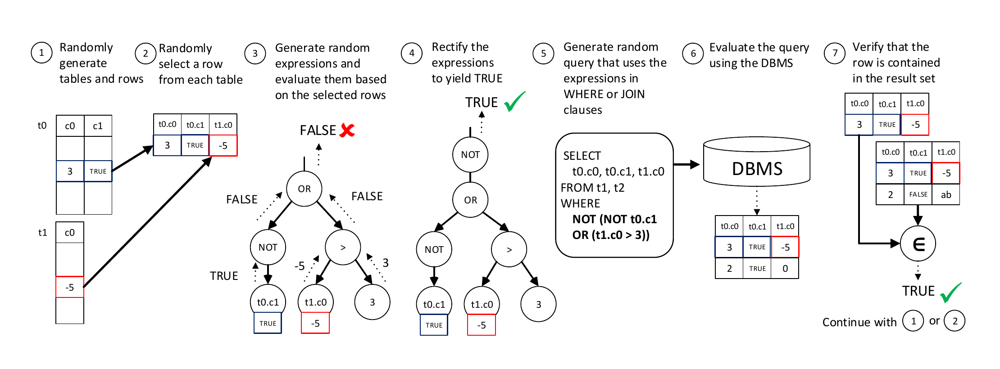
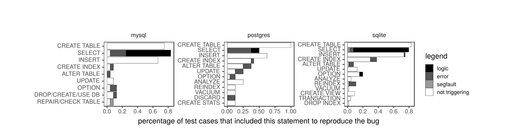

# Testing Database Engines via Pivoted Query Synthesis（中文译文）

## 译者说明

本文依据同目录的 `source.pdf` 翻译。章节、图表、公式、算法、代码与参考文献按原文结构保留。

## 论文信息

- 作者：Manuel Rigger、Zhendong Su
- 机构：苏黎世联邦理工学院（ETH Zurich）计算机科学系
- 会议：第 14 届 USENIX 操作系统设计与实现研讨会（OSDI 20）
- 会议日期：2020 年 11 月 4-6 日
- 正文页码：667-682
- ISBN：978-1-939133-19-9
- 论文页面：https://www.usenix.org/conference/osdi20/presentation/rigger
- 工件评估标志：Available、Functional、Reproduced

本论文收录于第 14 届 USENIX 操作系统设计与实现研讨会论文集；该论文集的开放访问由 USENIX 赞助。

## 摘要

数据库管理系统（Database Management System，DBMS）应用广泛，并且已经由模糊测试器进行了大量测试；这类工具很擅长发现崩溃错误。然而，对于 DBMS 计算出错误结果集等逻辑错误，相关发现方法在很大程度上仍未得到解决。为此，我们设计了一种新颖且通用的方法，并将其称为枢轴查询合成（Pivoted Query Synthesis，PQS）。其核心思想是，我们自动生成查询，并确保这些查询能够取得一个特定的、随机选出的行，即枢轴行（pivot row）。如果 DBMS 未能取得枢轴行，原因很可能是 DBMS 中存在错误。我们在三个广泛使用且成熟的 DBMS——SQLite、MySQL 和 PostgreSQL——上测试了这一方法。我们总共在这些 DBMS 中发现了 121 个互不相同的错误，其中 96 个已经修复或得到确认，这表明该方法非常有效且具有通用性。我们预计，这一方法广泛的适用性和简洁性将有助于提升许多 DBMS 的健壮性。

## 1 引言

基于关系模型 [10] 的数据库管理系统（DBMS）是许多应用的核心组成部分，因为它们能够高效地存储和检索数据。SQLsmith [45] 等随机查询生成器已经对 DBMS 进行了大量测试，并且很擅长找出会使 DBMS 进程崩溃的查询，例如触发缓冲区溢出的查询。AFL [2] 等模糊测试器也经常用于 DBMS。不过，这些方法无法检测逻辑错误。我们把逻辑错误定义为：使查询返回错误结果、例如错误地遗漏某一行，却不会导致 DBMS 崩溃的错误。

DBMS 中的逻辑错误很难自动检测。自动化测试的一项关键挑战，是构造一个能够判断系统对于给定输入是否行为正确的有效测试预言（test oracle）[21]。1998 年，Slutz 提出使用差分测试 [33] 检测 DBMS 中的逻辑错误：构造一个测试预言，比较同一查询在多个 DBMS 上的结果；该文作者将这一方法实现为 RAGS 工具 [46]。RAGS 虽然检测到了许多错误，但差分测试有一个重大限制：被测系统必须对给定输入实现相同语义。所有 DBMS 都支持一种通用的标准化语言——结构化查询语言（Structured Query Language，SQL）——用于创建、访问和修改数据 [8]。然而在实践中，每种 DBMS 都为该标准提供了大量扩展，同时又在其他方面偏离标准，例如对 `NULL` 值的处理 [46]。这极大限制了差分测试；该文作者也指出，不同 DBMS 之间很小的公共核心以及彼此差异构成了挑战 [46]。此外，即使所有 DBMS 都取得相同的行，也无法保证它们工作正确，因为它们可能受到同一个底层错误的影响。

为了高效检测 DBMS 中的逻辑错误，我们提出一种通用且有原则的方法，称为枢轴查询合成（PQS），并将其实现为 SQLancer 工具。其核心思想是针对一个随机选出的行——枢轴行——解决预言问题：合成一个结果集必须包含该枢轴行的查询。我们为 `WHERE` 和 `JOIN` 子句随机生成表达式，基于枢轴行对这些表达式求值，再修改每个表达式使其结果为 `TRUE`。如果 DBMS 处理该查询后没有取得枢轴行，就说明检测到了 DBMS 错误。我们称这一预言为包含性预言（containment oracle）。

清单 1 用一个测试用例说明了我们的方法；该测试用例触发了我们通过包含性预言在广泛使用的 DBMS SQLite 中发现的一个错误。`CREATE TABLE` 语句创建一个新表 `t0`，其中包含列 `c0`。随后创建索引，并插入值为 `0`、`1` 和 `NULL` 的三行。我们选择枢轴行 `c0=NULL`，并构造随机 `WHERE` 子句 `c0 IS NOT 1`。由于 `NULL IS NOT 1` 的求值结果为 `TRUE`，我们可以把查询直接交给 DBMS，并预期结果中包含值为 `NULL` 的行。然而，由于 DBMS 中的一个逻辑错误，SQLite 基于“`c0 IS NOT 1` 蕴含 `c0 NOT NULL`”这一错误假设使用了部分索引，导致没有取得枢轴行。

**清单 1：基于一个严重 SQLite 错误的说明性示例。代码注释分别标出实际错误结果与预期正确结果。**

```sql
CREATE TABLE t0 (c0);
CREATE INDEX i0 ON t0 (1) WHERE c0 NOT NULL;
INSERT INTO t0 (c0) VALUES (0), (1), (NULL);
SELECT c0 FROM t0 WHERE c0 IS NOT 1; -- 实际错误结果：{0}
-- 预期正确结果：{0, NULL}
```

我们把这个错误报告给 SQLite 开发者；开发者表示，该错误自 2013 年起就一直存在，将其归类为严重错误，并迅速进行了修复。即便对于这样一个简单查询，差分测试也无法有效检测该错误。这里的 `CREATE TABLE` 语句是 SQLite 特有的，因为与 PostgreSQL 和 MySQL 等其他流行 DBMS 不同，SQLite 不要求为列 `c0` 指定列类型。此外，MySQL 和 PostgreSQL 的 `IS NOT` 都不能应用于整数；它们只提供功能等价的 `IS DISTINCT FROM` 运算符。所有 DBMS 都提供 `IS NOT TRUE` 运算符，但其语义不同：在 SQLite 中，它只会取得值 `0`，因而不会暴露这个错误。

为了证明我们方法的通用性，我们为三个流行且广泛使用的 DBMS——SQLite [49]、MySQL [36] 和 PostgreSQL [40]——实现了该方法。我们总共发现了 96 个互不相同的真实错误：SQLite 64 个、MySQL 24 个、PostgreSQL 8 个，这表明该方法非常有效且具有通用性。其中 61 个是包含性预言发现的逻辑错误。此外，我们还通过触发数据库损坏等 DBMS 内部错误发现了 32 个错误，并通过触发 DBMS 崩溃（即 `SEGFAULT`）发现了 3 个错误。我们为 MySQL 报告的一次崩溃被归类为安全漏洞 CVE-2019-2879。开发者修复了其中 78 个错误，说明他们认为我们的错误报告有价值。

由于我们的方法通用并适用于所有 DBMS，我们预计它会被广泛采用，以检测此前被忽视的逻辑错误。事实上，在发布论文预印本之后，我们收到了一些公司和个人开发者的请求，他们表示有兴趣实现 PQS 来测试自己正在开发的 DBMS。其中，PingCAP 公开发布了一套 PQS 实现，并已成功用它在 TiDB 中发现错误。为了保证可复现性并促进该主题的进一步研究，我们在 https://github.com/sqlancer/ 发布了 SQLancer。此外，与本文配套的工件包含 SQLancer 以及所有已报告错误的数据库 [44]。PQS 还启发了互补的后续工作，如 NoREC 和 TLP，它们聚焦于发现逻辑错误的不同子类 [42, 43]。

尽管如此，PQS 仍有明显局限：它只能部分验证查询结果，因而不能用于测试聚合函数、结果集大小或结果顺序等内容。此外，实现该技术所需的工作量取决于待测试操作的复杂度；对于复杂运算符或函数，这一复杂度可能很高。

总而言之，我们作出以下贡献：

- 提出一种通用且高效的 DBMS 错误发现方法——枢轴查询合成（PQS）。
- 将 PQS 实现为 SQLancer 工具，并用它测试 SQLite、MySQL 和 PostgreSQL。
- 对 PQS 进行评估，发现 96 个真实错误。

## 2 背景

本节介绍关系型 DBMS、SQL 以及我们所测试 DBMS 的重要背景知识。

**数据库管理系统。** 我们的主要目标是测试关系型 DBMS，即基于 Codd 提出的关系数据模型 [10] 的系统。Oracle、Microsoft SQL、PostgreSQL、MySQL 和 SQLite 等使用最广泛的 DBMS 大都以该模型为基础。在此模型中，关系 $R$ 是一个数学关系：

$$
R \subseteq S_1 \times S_2 \times \cdots \times S_n
$$

其中 $S_1,S_2,\ldots,S_n$ 称为域（domain）。在更常用的术语中，关系称为表，域称为数据类型。关系中的每个元组称为一行。SQL [8] 是一种以关系代数 [11] 为基础的领域特定语言，也是与 DBMS 交互时最常用的语言。ANSI 于 1987 年首次标准化 SQL，之后 SQL 一直在继续发展。不过在实践中，DBMS 会缺少 SQL 标准描述的某些功能，也会偏离标准。在本文中，我们假定读者具备基本的 SQL 知识。

**测试预言。** 有效的测试预言对于自动化测试方法至关重要 [21]。测试预言用于判断给定测试用例是否通过。手工编写的测试用例编码了程序员的知识，因此程序员充当了测试预言。在这项工作中，我们只关注自动测试预言，因为它能支持对 DBMS 进行全面测试。DBMS 最成功的自动测试预言以差分测试为基础 [46]。差分测试把同一输入交给多个实现相同语言的系统，通过发现不一致的输出来识别错误。在 DBMS 场景下，输入对应数据库和查询，系统则对应多个 DBMS；当这些 DBMS 取得的结果集不一致时，就检测到了其中某个 DBMS 的错误。

然而，SQL 方言差异很大，使差分测试难以有效应用。业界也承认这一点。例如，Cockroach Labs 表示：“我们无法使用 Postgres 作为预言，因为 CockroachDB 的语义和 SQL 支持略有不同，要生成在二者上执行完全相同的查询非常困难……” [22]。此外，差分测试并不是一个精确预言，因为它无法检测影响所有系统的错误。

**表 1：我们测试的 DBMS 流行、复杂，并且都已开发多年。**

| DBMS | DB-Engines 流行度排名 | Stack Overflow 流行度排名 | 代码行数 | 发布年份 |
| --- | ---: | ---: | ---: | ---: |
| SQLite | 11 | 4 | 0.3M | 2000 |
| MySQL | 2 | 1 | 3.8M | 1995 |
| PostgreSQL | 4 | 2 | 1.4M | 1996 |

**被测 DBMS。** 我们聚焦于三个流行且广泛使用的开源 DBMS：SQLite、MySQL 和 PostgreSQL（见表 1）。根据 DB-Engines 排名 [1] 和 Stack Overflow 年度开发者调查 [38]，它们属于最流行、使用最广泛的 DBMS。SQLite 网站甚至推测，SQLite 的使用量很可能超过其他所有数据库的总和：大多数手机大量使用 SQLite；多数流行 Web 浏览器使用 SQLite；许多嵌入式系统（如电视机）也使用 SQLite [48]。这三个 DBMS 都是生产级系统，并且都已维护和开发约 20 年。

## 3 枢轴查询合成

我们提出枢轴查询合成，作为一种检测 DBMS 逻辑错误的自动测试技术。我们的核心洞见是：每次只考虑一个行，就可以构造一个概念上简单、又能有效检测逻辑错误的测试预言。具体来说，我们从数据库的一组表和视图中随机选择一行，并称之为枢轴行。随后，我们随机生成一组布尔谓词，再通过抽象语法树（Abstract Syntax Tree，AST）解释器修改这些谓词，使它们针对枢轴行中的值求值为 `TRUE`。把这些表达式用于一个以其他方式随机生成的查询的 `WHERE` 和 `JOIN` 子句后，我们就能保证结果集必须包含枢轴行。如果结果集不包含它，就说明发现了错误。

以 AST 解释器为基础使我们得到了精确预言。虽然为正则表达式运算符等复杂运算符实现该解释器需要中等程度的工作量，但解释器无需处理 DBMS 必须面对的其他挑战，如查询规划、并发访问、完整性和持久性。此外，AST 解释器只在一条记录上运行，而 DBMS 处理查询时可能要扫描数据库中的所有行，因此可以用朴素方式实现解释器而不会影响工具性能。

### 3.1 方法总览

图 1 展示了 PQS 的详细步骤。首先，我们创建一个包含一个或多个随机表的数据库，并用随机数据填充这些表（步骤 1）。我们保证每个表以及随机生成的视图至少包含一行，以便在步骤 2 中随机选择枢轴行。枢轴行只是在概念上是一行，它可以由引用多个表和/或视图中的行的列组成。它的用途是派生测试用例和测试预言，以验证 DBMS 的正确性。图 1 中的枢轴行同时包含来自表 `t0` 和 `t1` 的列。



**图 1：SQLancer 中实现的方法总览。虚线表示产生一个结果。**

接下来，我们基于枢轴行构造测试预言。为此，我们依据 DBMS 的 SQL 语法和有效的表列名随机创建表达式（步骤 3）。我们对这些表达式求值，用枢轴行中对应的值替换列引用。然后，我们修改表达式，使其结果为 `TRUE`（步骤 4）。我们把这些表达式放入所构造查询的 `WHERE` 和/或 `JOIN` 子句中（步骤 5）。接着把查询交给 DBMS；DBMS 返回一个结果集（步骤 6），我们预期该结果集包含枢轴行，也可能还包含其他行。最后，检查结果集是否确实包含枢轴行（步骤 7）。如果不包含，我们很可能检测到了 DBMS 错误。下一轮迭代可以回到步骤 2，为新选择的枢轴行生成新查询，也可以回到步骤 1，生成新数据库。

我们的核心思想在于如何构造测试预言，即步骤 2-7。因此，3.2 节首先在假定数据库已经创建的前提下，说明如何生成查询并检查包含性；3.3 节再说明步骤 1，即如何生成表和数据；3.4 节给出重要实现细节。

### 3.2 查询生成与检查

我们方法的核心思想，是构造一个我们预期其结果集包含枢轴行的查询。我们随机生成用于查询 `WHERE` 和/或 `JOIN` 子句的表达式，并确保每个表达式对枢轴行的求值结果为 `TRUE`。本小节说明如何生成随机谓词、修正这些谓词，再把它们用于查询，即步骤 3-5。

**随机谓词生成。** 在步骤 3 中，我们根据数据库模式（即列名和类型）构造随机表达式树，从而随机生成不超过指定最大深度的 AST。对于 SQLite 和 MySQL，SQLancer 会生成任意类型的表达式，因为这两个 DBMS 支持到布尔值的隐式转换。PostgreSQL 很少执行隐式转换，因此生成的根节点必须产生布尔值；我们通过选择适当运算符之一（例如比较运算符）来做到这一点。算法 1 展示了 MySQL 和 SQLite 中表达式生成的实现方式。

**算法 1：`generateExpression()` 函数生成一个随机 AST。**

```text
函数 generateExpression(int depth)：
    node_types <- {LITERAL, COLUMN}
    如果 depth < maxdepth：
        node_types <- node_types ∪ {UNARY, ...}
    type <- random(node_types)
    按 type 分支：
        LITERAL：
            返回 Literal(randomLiteral())
        COLUMN：
            返回 ColumnValue(randomTable().randomColumn())
        UNARY：
            返回 UnaryNode(
                generateExpression(depth + 1),
                UnaryNode.getRandomOperation())
        ...：
    结束
```

输入参数 `depth` 保证达到指定最大深度时生成叶节点。叶节点可以是随机生成的常量，也可以是对表或视图中某一列的引用。如果尚未达到最大深度，还会考虑其他运算符，例如 `NOT` 等一元运算符。表达式生成取决于相应 DBMS 支持哪些运算符。随机表达式生成本身并非本文贡献；RAGS [46] 和 SQLsmith 等随机查询生成器的工作方式与此相似 [45]。我们依据各 DBMS 的 SQL 方言文档，为每个被测 DBMS 手工实现了表达式生成器；作为未来工作，我们将考虑从 SQL 方言语法自动派生它们。

**表达式求值。** 构建随机表达式树后，我们必须检查条件针对枢轴行的求值结果是否为 `TRUE`。为此，每个节点都必须提供一个计算该节点结果的 `execute()` 方法，这需要手工实现。叶节点直接返回为其分配的常量值。列节点被赋予枢轴行中与其列对应的值。例如，在图 1 的步骤 3 中，叶节点 `t0.c1` 返回 `TRUE`，常量节点 `3` 返回整数 `3`。复合节点根据子节点返回的字面量计算结果。例如，`NOT` 节点返回 `FALSE`，因为其子节点求值为 `TRUE`（见算法 2）。该节点先执行子表达式，再把结果转换为布尔值；如果结果是布尔值，就将其取反，否则返回 `NULL`。

**算法 2：`NOT` 节点的 `execute()` 实现。**

```text
方法 NotNode::execute()：
    value <- child.execute()
    按 asBoolean(value) 分支：
        TRUE：
            result <- FALSE
        FALSE：
            result <- TRUE
        NULL：
            result <- NULL
    结束
    返回 result
```

我们的实现比编程语言的 AST 解释器 [50] 更简单，因为所有节点都在字面值上操作，不必考虑可变存储。它也比查询引擎模型简单，例如著名的 Volcano 风格迭代模型 [16]，以及以此为基础、得到广泛应用的向量化模型和以数据为中心的代码生成模型；这些模型都必须考虑多行 [26]。我们方法的瓶颈在于 DBMS 对查询求值，而非 SQLancer，因此所有操作均以朴素方式实现，不做任何优化。尽管如此，有些操作仍需中等程度的实现工作；例如，SQLancer 中 `LIKE` 正则表达式运算符的实现超过 50 行代码。

**表达式修正。** 随机生成表达式后，步骤 4 保证这些表达式求值为 `TRUE`。SQL 采用三值逻辑，因此表达式在布尔上下文中求值为 `TRUE`、`FALSE` 或 `NULL`。为了把表达式修正为求值 `TRUE`，我们使用算法 3。例如，在图 1 的步骤 4 中，我们在表达式前添加 `NOT`，使表达式求值为 `TRUE`。通过调整这一步，我们的方法也适用于其他逻辑系统，例如四值逻辑。另一种做法是保证表达式求值为 `FALSE`，从而检查枢轴行是否如预期那样不在结果集中。

**算法 3：应用于随机生成表达式的表达式修正步骤。**

```text
函数 rectifyCondition(randexpr)：
    按 randexpr.execute() 分支：
        TRUE：
            result <- randexpr
        FALSE：
            result <- NOT randexpr
        NULL：
            result <- randexpr ISNULL
    结束
    返回 result
```

**查询生成。** 在步骤 5 中，我们生成用于取得枢轴行的定向查询。最重要的是，将求值为 `TRUE` 的表达式用于限制查询取得哪些行的 `WHERE` 子句，以及用于连接表的 `JOIN` 子句。由于表达式求值为 `TRUE`，可以保证结果集包含枢轴行。我们不对 `JOIN` 子句进行特殊处理：因为我们构造的子句谓词对枢轴行求值为 `TRUE`，所以对于枢轴行而言，内连接、全连接、左连接和右连接的行为都与 `WHERE` 子句相同。

`SELECT` 语句通常提供多个用于控制查询行为的关键字，我们从适用选项中随机选择。具体考虑以下元素：

- `DISTINCT` 子句：过滤重复行，同时仍保证结果集包含枢轴行；
- `GROUP BY` 子句：包含枢轴行的所有列，以保证结果集包含枢轴行；
- `ORDER BY` 子句：只影响结果集顺序，而 PQS 不验证顺序；
- 聚合函数：当表中只有一行时计算多行之上的值，从而可以对聚合函数做部分测试；
- DBMS 特有的查询选项，例如 MySQL 特有的 `FOR UPDATE` 子句；这些选项不得影响结果集。

这些附加元素是我们核心方法的可选扩展，它们通过对 DBMS 查询优化器施压，使 PQS 发现了更多错误。不过，这种方式并不能全面测试这些特性。

**检查包含性。** 在步骤 6 中使用 DBMS 对查询求值之后，我们方法的最后一步是检查枢轴行是否属于结果集。虽然可以在 SQLancer 中实现检查例程，但我们改为构造一个自行检查包含性的查询，从而实际上把步骤 6 和 7 合并。DBMS 提供了多种检查包含性的运算符，如 `IN` 和 `INTERSECT`。例如，要执行图 1 步骤 7 的包含性检查，可以用清单 2 中的查询检查行 `(3, TRUE, -5)` 是否包含在结果集中；如果包含枢轴行，该查询就返回一行。

**清单 2：在 SQLite 中使用 `INTERSECT` 运算符检查包含性。**

```sql
SELECT (3, TRUE, -5)
INTERSECT
SELECT t0.c0, t0.c1, t1.c0
FROM t1, t2
WHERE NOT (NOT (t0.c1 OR (t1.c0 > 3)));
```

**检查任意表达式。** PQS 初始思想的一项扩展，是在步骤 5 的查询中使用任意表达式指定要取得的数据，而非只引用列。例如，我们可能希望检查 `t0.c0 + 1` 是否正确求值，而不是仅引用 `t0.c0`。为此，可以把枢轴行的定义推广到任意计算值。例如，`t0.c0 + 1` 的枢轴行值必须是 `4`，这个值可通过步骤 2 中已经说明的表达式求值机制得出。从实现角度看，这要求先生成步骤 5 中要使用的表达式，以便在步骤 2 中对它们求值并派生枢轴行值。

### 3.3 随机状态生成

在步骤 1 中，我们生成随机数据库状态。与查询生成类似，我们以启发式、迭代方式选择若干适用选项。第一步固定为使用 `CREATE TABLE` 语句创建若干表，后续语句则通过启发式方法选择。适用选项包括能够插入数据行的 `INSERT` 语句。通过同时生成数据定义语言和数据操纵语言语句，我们可以探索更大的数据库空间，其中一些数据库暴露了 DBMS 错误。例如，我们为所有数据库实现了 `UPDATE`、`DELETE`、`ALTER TABLE` 和 `CREATE INDEX` 命令，以及 DBMS 特有的运行时选项。

我们实现的一些命令只属于相应的 DBMS。`REPAIR TABLE` 和 `CHECK TABLE` 是 MySQL 独有的语句；`DISCARD` 和 `CREATE STATISTICS` 是 PostgreSQL 独有的语句。由于语句由启发式方法选择，数据库状态生成步骤可能产生空数据库，例如 `DELETE` 语句删除了所有行，或表约束使任何行都无法插入。在这种情况下，我们丢弃当前数据库并创建新数据库。随机数据库生成并非本文贡献；实际上，已有许多数据库生成方法被提出，其中任何一种都可以与 PQS 配合使用 [5, 6, 17, 20, 27, 37]。

### 3.4 重要实现细节

本节说明我们认为对我们的研究结果意义重大的实现决策。

**错误处理。** 我们尝试生成在语法和语义上都正确的语句。然而，生成语义正确的语句有时并不现实。例如，当再次向一个 `UNIQUE` 列插入已经存在的值时，`INSERT` 可能失败；防止这种错误需要扫描相应表的每一行。与其检查这类情况并付出额外实现工作和运行时性能代价，我们为执行相应语句时可能预期出现的错误消息定义了一份列表。

我们经常根据特定关键字是否存在，把错误消息与语句关联。例如，预期 `INSERT OR IGNORE` 会忽略许多在没有 `OR IGNORE` 时出现的错误消息。如果 DBMS 返回预期错误，就将其忽略；意外错误则表示 DBMS 中存在错误。例如，在 SQLite 中，`malformed database disk image` 错误消息总是意外的，因为它表示数据库已损坏。

**性能。** 我们优化 SQLancer，使其利用底层硬件。我们通过让每个线程在不同数据库上运行来并行化系统，这也使我们发现了与竞态条件有关的错误。为了充分利用每个 CPU，我们降低了生成低 CPU 利用率 SQL 语句的概率，例如 PostgreSQL 中的 `VACUUM`。根据被测 DBMS 的不同，SQLancer 通常每秒生成 `5,0000` 到 `20,000` 条语句；这里的 `5,0000` 是源文的原始排印。由于被测 DBMS 处理查询比处理其他语句快得多，SQLancer 会为每个数据库生成 100,000 个随机查询。

我们使用 Java 实现系统。不过，任何其他编程语言都同样适合，因为性能瓶颈是 DBMS 执行查询，而不是 SQLancer。

**行数。** 我们把插入行数限制在较低范围（10-30 行）时发现了大多数错误。行数更大时，表之间若没有限制性连接子句，查询就可能超时。例如，查询 `SELECT * FROM t0, t1, t2` 中，如果每张表各有 100 行，最大结果集已经达到：

$$
|t0| \times |t1| \times |t2| = 1{,}000{,}000
$$

这会显著降低查询吞吐量。一个潜在问题是，这可能使 PQS 无法检测只在包含大量行的表上触发的错误。我们认为，未来工作可以通过生成结果基数有界的定向查询来解决这一问题。

**数据库状态。** 生成许多 SQL 语句都需要了解数据库模式或其他数据库状态。例如，为了插入数据，SQLancer 必须确定表名及其列。我们从 DBMS 动态查询这些状态，而不是自行跟踪或计算，否则会增加实现工作。举例来说，为了查询表名，MySQL 和 PostgreSQL 都提供信息表 `information_schema.tables`，SQLite 则提供 `sqlite_master` 表。

**退出求值。** 对某些运算符或函数而言，边界情况的行为可能难以实现，例如整数运算在整数溢出时的行为；至少在初期，这些情况也可能没有那么重要。与 DBMS 不同，我们方法中的表达式求值步骤不必为每个可能输入都计算出结果。在我们的实现中，每项操作都可以在求值过程中抛出异常并退出，表示应该生成一个新表达式。我们还利用这一机制避免重复报告已知错误：遇到已知可能触发某个已报告错误的输入时，就退出求值。

**值缓存。** 随机生成值时，SQLancer 会把值存入缓存，之后以给定概率重用。我们的直觉是，这更容易触发有趣的边界情况，例如比较相同值 `3 > 3`。此外，我们预计它还能提高成功生成外键约束行的概率，即生成其某列引用另一张表的行。

**实现范围。** 我们针对每种 DBMS 的测试实现都很庞大，但并不完整。对于每个 DBMS，我们至少实现了整数和字符串数据类型；对于最完整的 SQLite 实现，还支持浮点数和二进制数据。我们实现了许多常见语句、运算符和函数的生成。鉴于实现规模，不可能穷举所有支持的特性；可以使用本文配套工件调查具体支持哪些特性。5.3 节概述了每种测试实现的规模。

## 4 评估

我们评估了所提出方法能否有效发现 DBMS 中的错误。我们的预期是，它能够检测模糊测试器无法发现的逻辑错误，而不是崩溃错误。本节概述实验设置和发现的错误，并刻画用于触发错误的 SQL 语句。随后，我们按 DBMS 概述错误，介绍有代表性的错误及错误趋势。为了给这些发现提供背景，我们还测量了 SQLancer 各组件的规模以及它在被测 DBMS 上达到的覆盖率。

### 4.1 实验设置

为了测试方法的有效性，我们实现了 SQLancer，并在大约三个月内测试 SQLite、MySQL 和 PostgreSQL。所有实验都在一台运行 Ubuntu 19.04 的笔记本电脑上完成；该电脑配备 6 核 Intel i7-8850H 2.60 GHz CPU 和 32 GB 内存。通常，我们会增强 SQLancer 以测试一个新运算符或 DBMS 特性，让工具运行几秒到一天不等，再检查在此过程中发现的错误。我们自动把测试用例化简为最小版本 [41]；如果进一步手工化简有助于更好地展示底层错误，就继续手工化简。最后，我们报告新发现的错误。条件允许时，我们会等到错误修复后再继续测试和实现新特性。

**基线。** 没有适用的基线可供我们将自己的工作与之比较。20 多年前提出的 RAGS [46] 是最接近的相关工作，但没有公开。由于公共 SQL 核心很小，我们预计 RAGS 无法找到我们所发现的大多数错误。Khalek 等人研究了如何用约束求解自动测试 DBMS [3, 27]，并用该方法发现了一个此前未知的错误；他们的工具同样没有公开。SQLsmith [45]、AFL [2] 以及其他随机查询生成器和模糊测试器 [39] 只能检测 DBMS 崩溃错误。因此，这些工具与 SQLancer 唯一可能重叠的部分，是我们发现的崩溃错误，而崩溃错误并非本文重点。

**DBMS 版本。** 对于所有 DBMS，我们都从当时最新的发布版本开始测试：SQLite 3.28、MySQL 8.0.16 和 PostgreSQL 11.4。对于 SQLite，在最初几个错误修复后，我们转而测试最新 trunk 版本，即源代码的最新非发布版本。MySQL 8.0.17 发布后，我们也对其进行了测试。对于 PostgreSQL，我们在提交了重复错误报告之后转而测试最新 beta 版本 PostgreSQL Beta 2，最终继续测试最新 trunk 版本。

**瓶颈。** 我们发现，重复错误是拖慢我们测试工作的重要因素。报告一个错误后，我们通常会等待修复再继续寻找错误；对于没有很快修复的错误，我们会尝试避免继续生成触发已知错误的测试用例。

SQLite 开发者通常在收到我们的错误报告后不久就作出响应，并且一般在一天内修复问题，因此我们把测试工作集中在 SQLite 上。对于 SQLite，我们还测试了视图、非默认 `COLLATE`（定义字符串如何比较）、浮点数支持和聚合函数，而在另外两个 DBMS 中没有测试这些特性。

对于 MySQL，测试人员通常会在一天内确认错误报告。MySQL 的开发过程并不向公众开放。虽然我们尝试与 MySQL 开发者取得联系，但除了公共错误跟踪器中可见的信息外，没有得到更多信息。因此，一些已确认报告很可能随后被认定为重复报告，或被归类为按预期工作。此外，虽然 MySQL 是开源软件，但它只提供最新发布版本的代码，因而任何修复都只能等到下一版本发布后验证。这极大限制了我们在 MySQL 中发现错误：验证新发现的错误是否已被报告需要更多工作，因此我们只投入有限精力测试 MySQL。

对于 PostgreSQL，我们一般在一天内收到错误报告反馈；但修复通常需要数天或数周，因为邮件列表会深入讨论可能的修复方案和补丁。总体而言，我们在 PostgreSQL 中发现的错误较少，所以响应时间没有限制我们的测试工作。需要注意的是，并非所有确认的错误都已修复。例如，对于其中一个报告，开发者决定“先把它搁置，等我们就如何处理达成一定共识”；根据讨论，我们推测，正确修复该错误所需的改动被认为侵入性太强。

**表 2：已报告错误总数及其状态。**

| DBMS | 已修复 | 已确认 | 按预期工作 | 重复 |
| --- | ---: | ---: | ---: | ---: |
| SQLite | 64 | 0 | 4 | 2 |
| MySQL | 17 | 7 | 2 | 4 |
| PostgreSQL | 5 | 3 | 7 | 6 |

原表将“按预期工作”和“重复”两列置于 `Closed` 跨列标题下。

### 4.2 错误报告概览

表 2 给出了我们报告的错误数量，总计 121 个。我们把其中 96 个认定为真实错误，因为它们带来了代码修复（78 份报告）或文档修复（8 份报告），或者得到了开发者确认（10 份报告）。每个这样的错误此前都未知，并且关联一个独立修复，或者已被开发者确认为独立错误。我们还提交了 25 份错误报告，并将其归为假错误：其中 13 份报告中的行为被认定为按预期工作，12 份被认定为重复错误。

**严重级别。** 只有 SQLite 的错误由 DBMS 开发者分配了严重级别。其中 14 个错误被归类为 Critical，8 个为 Severe，16 个为 Important。另有 13 个错误由我们在邮件列表中报告，没有在错误跟踪器中创建条目。其余错误报告被分配了 Minor 等较低严重级别。虽然严重级别的设置并不一致，但这些数据仍能证明我们发现了许多严重错误。

**表 3：按错误种类划分真实错误。**

| DBMS | 逻辑错误 | 意外错误 | `SEGFAULT` |
| --- | ---: | ---: | ---: |
| SQLite | 46 | 16 | 2 |
| MySQL | 14 | 9 | 1 |
| PostgreSQL | 1 | 7 | 0 |
| 合计 | 61 | 32 | 3 |

**错误分类。** 表 3 给出了真实错误的分类。包含性预言发现了所有逻辑错误，也占我们所发现错误的大多数；这是符合预期的，因为我们的方法主要建立在这个预言之上。或许出人意料的是，遇到意外错误也使我们检测出了大量问题。在 PostgreSQL 中，我们甚至发现了 7 个意外错误类问题，而逻辑错误只有 1 个。我们认为，可以在用模糊测试器测试 DBMS 时利用这一观察，例如检查表示数据库损坏的特定错误消息。

我们的方法还检测到一些崩溃错误，其中一个被认定为 MySQL 安全漏洞 CVE-2019-2879。这些错误相对不那么有趣，因为传统模糊测试器也能发现它们。事实上，在我们发现并报告一个 PostgreSQL 错误后不久，就出现了一份基于 SQLsmith 发现的重复报告。

### 4.3 SQL 语句概览

**测试用例长度。** 我们自动和手工化简后的测试用例——同时包含用于生成状态的语句和触发错误的查询——通常只包含少数 SQL 语句，平均为 3.71 行代码。13 个测试用例只需一行。这些测试用例要么是对常量进行操作的 `SELECT` 语句，要么是设置 DBMS 特有选项的操作。复现一个错误所需的最大语句数为 8。我们报告时已经修复的一个 PostgreSQL 崩溃错误甚至需要 27 条语句才能复现。总体而言，复现错误所需语句很少，这说明可以系统地生成语句和查询，从而高效而非随机地探索空间，例如 ACE [35] 所实现的有界黑盒测试方法。

**语句分布。** 图 2 展示了语句分布。需要注意的是，对于某些错误报告，我们必须从多个失败用例中选择最简单的一个，这可能使结果产生偏差。对所有 DBMS 而言，`CREATE TABLE` 和 `INSERT` 语句都出现在大多数错误报告中；这是符合预期的，因为只有很少错误无需操纵或取得表中数据即可复现。91.0% 的错误报告只涉及一张表。`SELECT` 语句也排在前列，因为包含性预言依赖该语句。



**图 2：错误报告中用于复现错误的 SQL 语句分布。非白色填充表示相应类别中的语句触发了错误；填充种类表示暴露该错误的测试预言，也就是说，这条语句是错误报告中的最后一条语句。**

图中三个面板分别对应 MySQL、PostgreSQL 和 SQLite；横轴表示包含相应语句、以复现错误的测试用例比例。图例中黑色表示逻辑错误，深灰色表示意外错误，浅灰色表示 `segfault`，白色表示该语句没有触发错误。

在所有 DBMS 中，`CREATE INDEX` 语句均排名靠前。尤其是在 SQLite 中，我们报告了多个创建索引后产生 `malformed database image` 或无法取得某行的错误。我们发现，计算或重新计算表状态的语句很容易出错，例如 MySQL 的 `REPAIR TABLE` 和 `CHECK TABLE`，以及 SQLite 和 PostgreSQL 的 `VACUUM` 和 `REINDEX`。DBMS 特有选项也会导致错误，例如 MySQL 和 PostgreSQL 的 `SET`，以及 SQLite 的 `PRAGMA`。一些 PostgreSQL 测试用例还包含为查询规划器收集统计信息的 `ANALYZE`。

**列约束。** 用于限制列中存储值的列约束经常出现在测试用例中。最常见的约束是 `UNIQUE`，出现在 21.9% 的测试用例中；`PRIMARY KEY` 列也很常见，占 16.7%。DBMS 通常通过创建索引来实施 `UNIQUE` 和 `PRIMARY KEY`，但用 `CREATE INDEX` 显式创建索引的情况更多，占 27.1%。其他约束并不常见，例如 `FOREIGN KEY` 只出现在 1.0% 的错误报告中。

## 5 有代表性的错误

本节中，我们介绍由我们使用 PQS 发现的错误。我们选择了自己认为有代表性的错误，因此这种选择不可避免地带有主观性。

### 5.1 包含性错误

我们认为包含性预言发现的错误最值得关注；我们设计 PQS 正是为了发现这类错误。

**第一个 SQLite 错误。** 清单 3 展示了我们用该方法发现的第一个错误的测试用例，其中 SQLite 未能取得一行。`COLLATE NOCASE` 子句指示 DBMS 在比较字符串时忽略大小写；在这个测试用例中，它意外导致大写 `'A'` 被从结果集中遗漏。该错误被归类为 Severe，可以追溯到 2013 年引入 `WITHOUT ROWID` 表之时。这是我们在 SQLite 中发现的典型错误，因为它依赖多种特性。与此错误相似，我们的 SQLite 错误报告中有 17 份涉及索引，11 份涉及 `COLLATE` 序列，5 份涉及 `WITHOUT ROWID` 表。

**清单 3：我们用该方法发现的第一个错误涉及 `COLLATE` 索引和 `WITHOUT ROWID` 表。**

```sql
CREATE TABLE t0 (c0 TEXT PRIMARY KEY)
    WITHOUT ROWID;
CREATE INDEX i0 ON t0 (c0 COLLATE NOCASE);
INSERT INTO t0 (c0) VALUES ('A');
INSERT INTO t0 (c0) VALUES ('a');
SELECT * FROM t0; -- 实际错误结果：{'a'}
-- 预期正确结果：{'A', 'a'}
```

**SQLite 跳跃扫描优化错误。** 一些 SQLite 错误源于不正确的优化，例如清单 4 中的错误。对于这个测试用例中的查询，即使索引列不属于 `WHERE` 子句，也会使用索引的跳跃扫描（skip-scan）优化；它在 `DISTINCT` 查询上的实现有误。该错误被归类为 Severe。

**清单 4：SQLite 的跳跃扫描优化在 `DISTINCT` 上实现错误。**

```sql
CREATE TABLE t0 (
    c0, c1, c2, c3,
    PRIMARY KEY (c3, c2)
);
INSERT INTO t0 (c2) VALUES
    (0), (0), (0), (0), (0), (0), (0),
    (0), (0), (0), (NULL), (1), (0);
UPDATE t0 SET c1 = 0;
INSERT INTO t0 (c0) VALUES (0), (0), (NULL), (0), (0);
ANALYZE t0;
UPDATE t0 SET c2 = 1;
SELECT DISTINCT * FROM t0 WHERE c2 = 1;
-- 实际错误结果：{NULL|0|1|NULL}
-- 预期正确结果：
-- {NULL|0|1|NULL, 0|NULL|1|NULL, NULL|NULL|1|NULL}
```

**SQLite 意外类型。** 清单 5 展示了一个错误：对 `INT` 值应用 `LIKE` 运算符优化时，该优化实现不正确。因为 `LIKE` 在这里检查精确字符串匹配，预期应取得该行，但实际结果集遗漏了它。虽然这是一个小错误，却仍然值得关注，因为只有 SQLite 允许存储与列声明类型不匹配的值。我们发现这一特性很容易出错，并发现了 8 个相关错误。

**清单 5：我们在 `LIKE` 优化中发现了 4 个错误；这里展示其中一个。**

```sql
CREATE TABLE t0 (c0 INT UNIQUE COLLATE NOCASE);
INSERT INTO t0 (c0) VALUES ('./');
SELECT * FROM t0 WHERE c0 LIKE './'; -- 实际错误结果：{}
-- 预期正确结果：{'./'}
```

**MySQL 存储引擎特有错误。** 与另外两个被测 DBMS 不同，MySQL 提供多种可分配给表的存储引擎。清单 6 展示了使用 `MEMORY` 引擎时未取得某行的一个错误。这是 5 个只在使用非默认引擎时触发的错误之一。该测试用例还有一点值得注意：它是 4 个依赖转换为无符号整数的 MySQL 测试用例之一，而另外两个被测 DBMS 不提供这种类型。

**清单 6：我们使用 MySQL 非默认存储引擎发现了 5 个错误。**

```sql
CREATE TABLE t0 (c0 INT);
CREATE TABLE t1 (c0 INT) ENGINE = MEMORY;
INSERT INTO t0 (c0) VALUES (0);
INSERT INTO t1 (c0) VALUES (-1);
SELECT *
FROM t0, t1
WHERE CAST(t1.c0 AS UNSIGNED) > IFNULL("u", t0.c0); -- 实际错误结果：{}
-- 预期正确结果：{0|-1}
```

**MySQL 值范围错误。** 我们在 MySQL 中发现了一些错误：查询是否得到正确处理取决于整数或浮点数的大小。例如，清单 7 展示了一个涉及 MySQL 特有 `<=>` 不等运算符的错误。即使某个参数是 `NULL`，该运算符也会产生布尔值；但当列值与一个超出该列类型表示范围的常量比较时，它错误地产生了 `FALSE`。

**清单 7：自定义比较运算符产生错误结果。**

```sql
CREATE TABLE t0 (c0 TINYINT);
INSERT INTO t0 (c0) VALUES (NULL);
SELECT * FROM t0 WHERE NOT (t0.c0 <=> 2035382037); -- 实际错误结果：{}
-- 预期正确结果：{NULL}
```

**MySQL 双重否定错误。** 清单 8 展示了我们在 MySQL 中发现的一个有趣优化错误。MySQL 消除了双重否定，乍看之下似乎正确。然而，MySQL 灵活的类型系统允许把整数等值作为 `NOT` 运算符的参数，所以这种优化并不总是正确。对非零整数应用 `NOT` 应得到 `0`，再对 `0` 取反应得到 `1`，因此 `WHERE` 子句中的谓词必须求值为 `TRUE`。但消除双重否定后，谓词实际上变成了 `123 != 123`，求值为 `FALSE`，从而遗漏枢轴行。

**清单 8：MySQL 中的双重否定错误。**

```sql
CREATE TABLE t0 (c0 INT);
INSERT INTO t0 (c0) VALUES (1);
SELECT * FROM t0 WHERE 123 != (NOT (NOT 123)); -- 实际错误结果：{}
-- 预期正确结果：{1}
```

我们把该用例归为重复错误，因为该测试用例所展示的底层错误似乎已经在一个尚未向公众发布的版本中修复。我们认为，MySQL 和 SQLite 提供的隐式转换，是我们在这两个 DBMS 中发现的错误多于 PostgreSQL 的原因之一。

**PostgreSQL 继承错误。** 我们在 PostgreSQL 中只发现了一个逻辑错误。该错误与只有 PostgreSQL 提供的表继承特性有关（见清单 9）。表 `t1` 继承自 `t0`，PostgreSQL 合并两个表中的 `c0` 列。根据 PostgreSQL 文档，`t1` 不遵守 `t0` 的 `PRIMARY KEY` 约束。`GROUP BY` 子句的实现没有考虑这一点，导致 PostgreSQL 从结果集中遗漏一行。

**清单 9：PostgreSQL 中的表继承错误。**

```sql
CREATE TABLE t0 (c0 INT PRIMARY KEY, c1 INT);
CREATE TABLE t1 (c0 INT) INHERITS (t0);
INSERT INTO t0 (c0, c1) VALUES (0, 0);
INSERT INTO t1 (c0, c1) VALUES (0, 1);
SELECT c0, c1 FROM t0 GROUP BY c0, c1; -- 实际错误结果：{0|0}
-- 预期正确结果：{0|0, 0|1}
```

**SQLite 双引号错误。** 清单 10 展示了一个测试用例：执行 `RENAME` 操作之后，索引引用的是字符串还是列变得有歧义。`SELECT` 为列 `c3` 取得值 `C3`，无论按哪种解释都不正确。SQLite 当时允许单引号和双引号都用于表示字符串；根据上下文，它们也可能引用列名。我们报告错误后，SQLite 引入了一项破坏兼容性的改动，禁止在创建索引时用双引号表示字符串。

**清单 10：这份错误报告促使 SQLite 禁止在索引中使用双引号字符串。**

```sql
CREATE TABLE t0 (c0, c1);
INSERT INTO t0 (c0, c1) VALUES ('a', 1);
CREATE INDEX i0 ON t0 ("C3");
ALTER TABLE t0 RENAME COLUMN c0 TO c3;
SELECT DISTINCT * FROM t0; -- 实际错误结果：{'C3'|1}
-- 预期正确结果：{'a'|1}
```

### 5.2 意外错误类问题

发现意外错误类问题并非我们工作的主要目标，但它们很常见，因此我们在这里讨论两个案例。

**SQLite 数据库损坏。** 清单 11 展示了一个测试用例：操纵 `REAL PRIMARY KEY` 列中的值会导致数据库损坏。我们发现了 4 个此类案例，它们表现为 `malformed database schema` 错误。这个特定错误于 2015 年引入，直到我们在 2019 年报告时仍未被发现；其严重级别被定为 Severe。

**清单 11：我们使用错误预言在 SQLite 中发现了 4 个数据库映像损坏错误；这里展示其中一个。**

```sql
CREATE TABLE t1 (c0, c1 REAL PRIMARY KEY);
INSERT INTO t1 (c0, c1) VALUES
    (TRUE, 9223372036854775807), (TRUE, 0);
UPDATE t1 SET c0 = NULL;
UPDATE OR REPLACE t1 SET c1 = 1;
SELECT DISTINCT * FROM t1 WHERE c0 IS NULL;
-- Error: database disk image is malformed
```

**PostgreSQL 多线程错误。** 清单 12 展示了一个只在另一线程打开事务并持有包含 `NULL` 值的快照时触发的错误。为了复现此类错误，我们必须记录并重放所有执行线程的轨迹。我们报告的 4 个 PostgreSQL 错误（包括已经关闭或被认定为重复的错误）只能在多线程运行时复现。

**清单 12：PostgreSQL 中的意外空值错误。**

```sql
CREATE TABLE t0 (c0 TEXT);
INSERT INTO t0 (c0) VALUES ('b'), ('a');
ANALYZE;
INSERT INTO t0 (c0) VALUES (NULL);
UPDATE t0 SET c0 = 'a';
CREATE INDEX i0 ON t0 (c0);
SELECT *
FROM t0
WHERE 'baaaaaaaaaaaaaaaaaaaaaaaaaaaaaaaaaaaaaaaaaaa' > t0.c0;
-- Error: found unexpected null value in index "i0"
```

### 5.3 实现规模与覆盖率

**实现工作量。** 我们很难量化为每个 DBMS 实现支持所投入的工作量，因为随着时间推移，我们的实现效率也在提升。各测试组件的代码行数（见表 4）符合我们的估计：我们为测试 SQLite 投入的工作最多，其次是 PostgreSQL，最后是 MySQL。组件共享部分的代码量相当小，只有 918 行，这也证明它们支持的 SQL 方言差异很大。

我们认为，与被测 DBMS 的规模相比，实现 SQLancer 的工作量很小。表中的 DBMS 代码行数是在使用默认配置编译相应 DBMS 后得到的，因此只包括二进制文件中可达的代码行。正因如此，它们明显少于我们在表 1 中对整个代码仓库进行静态统计所得的代码行数。

**表 4：SQLancer 中被测数据库特有组件和公共组件的规模，以及覆盖率。**

| DBMS | SQLancer 代码行数 | DBMS 代码行数 | 代码量比例 | 行覆盖率 | 分支覆盖率 |
| --- | ---: | ---: | ---: | ---: | ---: |
| SQLite | 6,501 | 49,703 | 13.1% | 43.0% | 38.4% |
| MySQL | 3,995 | 707,803 | 0.6% | 24.4% | 13.0% |
| PostgreSQL | 4,981 | 329,999 | 1.5% | 23.7% | 16.6% |

**覆盖率。** 为了估计我们测试了多少 DBMS 代码，我们对每个 DBMS 进行插桩，并让 SQLancer 运行 24 小时（见表 4）。覆盖率看起来较低，所有 DBMS 都不到 50%；不过这是符合预期的，因为我们只关注测试以数据为中心的 SQL 语句。MySQL 和 PostgreSQL 提供用户管理、复制和维护等我们没有测试的功能。此外，所有 DBMS 都提供交互控制台和编程 API。

目前，我们没有测试许多数据类型、事务保存点等语言元素、许多 DBMS 特有函数、配置选项，以及可能与运行在另一个独立数据库上的其他线程冲突的操作。SQLite 的覆盖率最高，这既反映出我们为测试它投入的工作最多，也说明它在 SQL 实现之外提供的特性较少。

## 6 讨论

**错误数量与代码质量。** 我们在各 DBMS 中发现的错误数量取决于许多难以量化的因素。我们在 SQLite 中发现的错误最多。一个重要原因是，SQLite 开发者会迅速修复所有错误，因此我们把测试重点放在了该 DBMS 上。此外，虽然 SQLite 支持的 SQL 方言很紧凑，但我们认为它也是最灵活的；例如，它不强制列类型，这会产生 PostgreSQL 中没有、MySQL 中相对较少的错误。MySQL 的发布策略使高效测试变得困难，因而限制了我们在该 DBMS 中发现的错误数量。我们在 PostgreSQL 中发现的错误最少；我们认为一个重要原因是，它对 SQL 方言支持较严格，执行的隐式转换很少。

**假阳性。** 原则上，PQS 不会报告假阳性，也就是说，PQS 发现的错误总是真实错误。尽管如此，在实现运算符的 `execute()` 方法时，如果我们对 DBMS 运算符的预期行为理解有限，也可能产生假阳性。因此，被认定为按预期工作的 13 份错误报告，原因要么是：（1）PQS 对某一运算符实现错误；要么是（2）错误预言发现了一个其实属于预期行为的错误消息。假错误报告使我们能够根据 DBMS 开发者的反馈改进我们的实现。另有 8 个案例中，错误报告还促成了文档增强或修复。

**共同错误。** 我们在所有 DBMS 中都发现的共同错误是优化错误，即性能优化引发了正确性问题。这些错误通常与显式创建的索引（使用 `CREATE INDEX`）或隐式创建的索引（例如使用 `UNIQUE` 约束）有关，详见 4.3 节。另有一些错误与 `NULL` 处理有关；DBMS 开发者似乎很难准确推理此类行为。我们发现的大多数其他错误则为相应 DBMS 所独有。

**现有测试工作。** 三个 DBMS 都经过大量测试。例如，在我们发现错误最多的 SQLite 中，测试代码和测试脚本的规模是源代码的 662 倍 [47]。其核心由三套独立测试框架测试：TCL 测试包含 45K 个测试用例；专有 TH3 测试框架包含约 170 万个测试实例，并提供 100% 分支测试覆盖率和 100% MC/DC 测试覆盖率 [25]；SQL Logic Test 则基于超过 1 GB 的测试数据运行约 720 万个查询。

SQLite 使用多种模糊测试器，例如名为 SQL Fuzz 的随机查询生成器、专有模糊测试器 dbsqlfuzz；Google 的 OSS Fuzz 项目也会对其进行模糊测试 [14]。它还采用其他类型的测试，例如崩溃测试，以证明数据库不会因系统崩溃或电源故障而损坏。考虑到 SQLite 和其他 DBMS 已经接受如此广泛的测试，我们认为 SQLancer 还能发现错误令人惊讶。

**部署。** 一个问题是，DBMS 开发者应如何在开发过程中使用 PQS。与模糊测试器相似，PQS 等动态测试方法无法对错误发现结果作出任何保证。因此，要运行 SQLancer 多久才能找出它所能发现的全部错误，也并不明确。实践中，可以像使用模糊测试器那样使用 SQLancer：例如，作为夜间持续集成流程的一部分运行一段有限时间，或者持续运行，以最大化发现新错误的机会。未来工作可以研究如何系统枚举查询，同时剪枝无限大的可能查询空间，从而给出有界保证。

**规约。** 为实现表达式求值，我们实现了 AST 解释器，它基于枢轴行对运算符求值。该求值步骤实际上编码了用于检查 DBMS 的规约。我们主要依据各 DBMS 的文档实现表达式求值。当我们认为文档不够充分时，我们就采用试错方法实现正确语义。

在差分测试中，两个 DBMS 的 SQL 方言只要存在语义差异，就会反复产生假阳性；与之不同，PQS 实现中的偏差行为，例如实现错误引起的偏差，可以通过修改代码解决。事实上，可以利用这一观察有效测试 PQS 实现：除了使用手工编写的单元测试外，还可以直接让 PQS 实现针对被测 DBMS 运行。

**局限。** PQS 在可以发现哪些逻辑错误方面存在若干局限。PQS 只会部分验证查询结果，因此一般不能检查记录是否正确插入或删除，也不能检测并发错误、事务相关错误或 DBMS 访问控制层中的错误 [19]。

从概念上讲，PQS 无法检测错误地从结果集中遗漏或加入的重复行，因为重复记录对于 PQS 来说不可区分。因此，即使把结果集中的每一行依次选为枢轴行，它也不能验证结果集基数。PQS 不适合测试 `OFFSET` 和 `LIMIT` 子句，因为这些子句可能从结果集中排除枢轴行。

虽然 PQS 在聚合函数中发现了 3 个错误，但它只能在一些边界情况下做到这一点，例如在被查询的视图中使用聚合函数，或者表中只有一行、因而聚合结果很容易确定。类似地，PQS 无法发现窗口函数中的错误，因为窗口函数也在一个窗口中的多行之上计算结果。

SQLancer 虽然会生成 `ORDER BY` 子句，但 PQS 无法验证结果集顺序。类似地，对于 `GROUP BY` 子句，PQS 无法确认所有重复值都被分到同一组。PQS 不能测试引用表的 `NOT EXISTS` 谓词，即半连接，因为只依据枢轴行无法保证某一行不包含在结果集中。

类似地，PQS 虽然能够测试连接，却只能测试 `JOIN` 子句在连接左右两侧均匹配行的组合。例如，对于 `LEFT JOIN`，它无法测试只取得左表中的值而未取得右表中值的用例。PQS 无法测试有歧义查询和依赖非确定性函数（例如用于生成随机数的函数）的查询结果，因为该方法假定结果集不存在歧义。它也无法测试用户提供的函数或运算符，除非在 PQS 中重新实现这些函数或运算符；支持它们是有意义的未来工作。作为第一种实用的 DBMS 逻辑错误发现技术，PQS 已通过发现运算符实现和优化中的各种错误证明其有效性。

**实现工作量。** 由于各 DBMS 支持的 SQL 方言差异很大，我们必须在 SQLancer 中实现 DBMS 特有组件。有人可能会认为实现工作量过高，尤其是要测试某种 SQL 方言的完整支持时，所需工作甚至可能与实现一个新 DBMS 相近。确实，我们无法测试 SQLite 的 `printf` 等复杂函数，因为这需要大量实现工作。

不过，我们仍认为实现工作量相当低，却可以测试 DBMS 的重要部分。具体而言，根据我们的实验结果，只实现可搜索参数谓词（sargable predicate，例如 DBMS 可使用索引处理的谓词）就已经能够发现大多数优化错误。此外，我们的方法实际上只对字面表达式求值，无需考虑多行。这省去了实现查询规划器的需要，而查询规划器通常是 DBMS 最复杂的组件 [13]。同时，求值引擎的性能无关紧要：性能瓶颈在于 DBMS 对查询求值，而不是 SQLancer。因此，我们也没有实现任何通常需要 DBMS 投入大量工作的优化 [15]。最后，我们无需处理并发、多用户控制和完整性等方面 [53]。

## 7 相关工作

**软件系统测试。** 本文属于重要软件系统测试方法这一研究方向。差分测试 [33] 比较多个实现同一通用语言的系统所得的结果；如果结果不同，一个或多个系统很可能存在错误。许多方法以此为基础，例如 C/C++ 编译器测试 [51, 52]、符号执行引擎测试 [24] 和 PDF 阅读器测试 [30]。

蜕变测试（metamorphic testing）[9] 会变换程序，并预期变换后程序产生与原程序相同的结果；它已经应用于多种系统。例如，输入模等价（equivalence modulo inputs）是一种以蜕变测试为基础的方法，已用于在广泛使用的编译器中发现一千多个错误 [31]。再例如，蜕变测试已成功用于测试图形着色器编译器 [12]。

我们提出 PQS 作为一种新的 DBMS 测试方法，它以新方式解决预言问题，即检查 DBMS 是否针对某个特定查询和行正确工作。我们认为，该方法还可以扩展到测试其他具有内部状态、并且能够从中选择单个实例的软件系统。

**DBMS 蜕变测试。** PQS 启发了两种后续测试方法：非优化参考引擎构造（Non-Optimizing Reference Engine Construction，NoREC）[42] 和三值逻辑划分（Ternary Logic Partitioning，TLP）[43]；二者都在 SQLancer 中实现。

从概念上说，NoREC 把一个可能经过 DBMS 优化的查询（称为优化查询）转换成一个无法被有效优化的查询；当两个查询的结果集不同时，它就检测到优化错误——逻辑错误的一个子类。TLP 把给定查询转换成多个所谓的划分查询，每个划分查询计算一部分结果，再把这些结果的并集与给定查询的结果集比较。二者都是蜕变测试方法，因此实现所需的工作量可以忽略不计；不过，它们无法像 PQS 一样建立真值基准。

NoREC 只能发现 PQS 所检测错误中的 52.7%，这是符合预期的，因为它的范围更窄 [42]。如果把我们的 PQS 实现直接增强为也检查不包含性，它可以检测 NoREC 错误中的 82.4%。只有 NoREC 能发现的其余错误，源于 NoREC 为更高效地实现测试预言而使用的 `SUM()` 和 `COUNT()` 聚合函数中的实现错误；NoREC 本身并不提供通用的聚合测试支持。

**DBMS 差分测试。** Slutz 提出一种基于差分测试的 DBMS 错误发现方法 RAGS [46]。RAGS 自动生成查询，并由多个 DBMS 对查询求值；如果结果不一致，就说明发现了错误。正如该文作者所承认的，该方法非常有效，但只适用于很小的一组公共 SQL 语句。尤其是，不同 DBMS 在 `NULL` 处理、字符处理和数值类型强制转换方面的差异被认为很棘手。我们的方法也能检测某个 DBMS 独有 SQL 语句中的错误，但需要为每种 DBMS 分别实现支持。

**数据库模糊测试。** SQLsmith 是一种流行工具，它随机生成 SQL 查询来测试不同 DBMS [45]。SQLsmith 非常成功，自 2015 年以来已在 PostgreSQL、SQLite 和 MonetDB 等流行 DBMS 中发现 100 多个错误。不过，它无法发现我们方法所发现的逻辑错误。AFL [2] 等通用模糊测试器同样经常用于 DBMS，也发现了许多错误，但也无法检测逻辑错误。

**一致性检查。** Kingsbury 开发了 Jepsen，这是一个测试分布式系统安全属性（如违反一致性模型）的框架，并在分布式 DBMS 中发现了许多严重错误 [28]。作为 Jepsen 的一部分，Kingsbury 等人提出事务一致性检查器 Elle [29]。与 PQS 不同，Jepsen 的主要目标是在 DBMS 事务处理中发现逻辑错误。

**满足约束的查询。** 一些方法通过生成满足特定约束（如基数或覆盖特征）的查询来改进随机查询生成。如何生成子表达式必须满足特定约束的查询已经得到广泛研究 [7, 34]；由于问题复杂，通常使用近似算法解决 [7, 34]。Bati 等人提出了另一种方法：依据查询是否提高罕见执行代码路径的覆盖率来选择和变异查询，从而提高被测 DBMS 组件的覆盖率 [4]。Lo 等人则没有改进查询生成，而是提出按照测试查询的特定要求生成数据库 [32]。这些方法改进了查询和数据库生成，却无助于自动发现错误，因为它们没有提出自动验证查询结果的方法。

**基于约束求解的 DBMS 测试。** Khalek 等人研究了如何使用约束求解自动测试 DBMS [3, 27]。其核心思想是使用基于 SAT 的求解器自动生成数据库数据、查询和测试预言。第一项工作说明了如何生成查询特有的数据以填充数据库，并枚举会被取得的行以构造测试预言 [27]。他们能够复现此前报告和注入的错误，但只发现了一个新错误。在后续工作中，他们还展示了如何使用基于 SAT 的方法自动生成查询 [3]。和我们的方法一样，它们既提供测试预言，还额外提供定向数据生成方法。两种路线虽然都发现了错误，但我们的方法发现了许多此前未知的错误。此外，我们认为，我们方法的简洁性可以使其得到更广泛应用。

**其他方面的测试。** 还有一些方法不是为了提高 DBMS 正确性，而是为了测试 DBMS 的其他方面。Poess 等人提出一种基于模板的方法，用于生成适合 DBMS 基准测试的查询，并将其实现为 QGEN 工具 [39]；与随机查询生成器类似，QGEN 也可用于测试 DBMS。Gu 等人提出一种方法：在 DBMS 特有调优选项的帮助下，为给定工作负载生成不同执行计划，并在这些计划上定义度量，以量化优化器对于该工作负载的准确性 [18]。Jung 等人基于给定 DBMS 的多个版本发现性能错误 [23]。Zheng 等人在电源故障场景下测试 DBMS 提供的 ACID 属性 [53]。不过，这些方法都不能用于发现逻辑错误。

## 8 结论

我们提出了一种检测 DBMS 错误的有效方法，并将其实现为 SQLancer 工具；借助该工具，我们在三个流行且广泛使用的 DBMS 中发现了 96 个以上的真实错误。考虑到我们的方法如此简单，而且我们只实现了当前 DBMS 所支持特性的一小部分，SQLancer 的有效性令人惊讶。

有多条很有前景的研究方向可以发现更多错误，或从其他方面改进 PQS；我们把它们视为未来工作。SQLancer 生成的表只包含少量行，以避免多张表使用非限制性条件连接时查询超时。通过依据表基数生成带条件的定向查询 [7, 34]，我们可以使用大量行测试 DBMS，更充分地向查询规划器施压 [13]。

PQS 的一个缺点是必须为每个被测 DBMS 分别实现。未来可以降低这一工作量，例如提供可组合的公共构件，从而更高效地实现运算符和函数。最后，还可以扩展 PQS，使其测试被错误取得的行：选择一个枢轴行，确保随机生成的谓词对它求值为 `FALSE` 或 `NULL`，然后检查结果集不包含该枢轴行。

## 致谢

我们感谢匿名审稿人和我们的论文指导人 Yuanyuan Zhou 提出的深刻反馈。我们还要感谢所有 DBMS 开发者回应我们的错误报告，并分析和修复我们报告的错误。我们尤其感谢 SQLite 开发者 D. Richard Hipp 和 Dan Kennedy；他们认真对待我们报告的所有错误，并迅速进行修复。此外，我们也感谢我们在苏黎世联邦理工学院的同事提供的反馈。

## 参考文献

[1] DB-Engines Ranking (December 2019), 2019. https://db-engines.com/en/ranking.

[2] american fuzzy lop, 2020. https://github.com/google/AFL.

[3] Shadi Abdul Khalek and Sarfraz Khurshid. Automated sql query generation for systematic testing of database engines. In *Proceedings of the IEEE/ACM International Conference on Automated Software Engineering*, ASE '10, pages 329-332, 2010.

[4] Hardik Bati, Leo Giakoumakis, Steve Herbert, and Aleksandras Surna. A genetic approach for random testing of database systems. In *Proceedings of the 33rd International Conference on Very Large Data Bases*, VLDB '07, pages 1243-1251. VLDB Endowment, 2007.

[5] Carsten Binnig, Donald Kossmann, Eric Lo, and M. Tamer Özsu. Qagen: Generating query-aware test databases. In *Proceedings of the 2007 ACM SIGMOD International Conference on Management of Data*, SIGMOD '07, pages 341-352, New York, NY, USA, 2007. Association for Computing Machinery.

[6] Nicolas Bruno and Surajit Chaudhuri. Flexible database generators. In *Proceedings of the 31st International Conference on Very Large Data Bases*, VLDB '05, pages 1097-1107. VLDB Endowment, 2005.

[7] Nicolas Bruno, Surajit Chaudhuri, and Dilys Thomas. Generating queries with cardinality constraints for dbms testing. *IEEE Transactions on Knowledge and Data Engineering*, 18(12):1721-1725, December 2006.

[8] Donald D. Chamberlin and Raymond F. Boyce. Sequel: A structured english query language. In *Proceedings of the 1974 ACM SIGFIDET (Now SIGMOD) Workshop on Data Description, Access and Control*, SIGFIDET '74, pages 249-264, 1974.

[9] Tsong Y Chen, Shing C Cheung, and Shiu Ming Yiu. Metamorphic testing: a new approach for generating next test cases. Technical Report HKUST-CS98-01, Department of Computer Science, Hong Kong, 1998.

[10] E. F. Codd. A relational model of data for large shared data banks. *Communications of the ACM*, 13(6):377-387, June 1970.

[11] E. F. Codd. *Relational Completeness of Data Base Sublanguages*. Research report // San José Research Laboratory: Computer sciences. IBM Corporation, 1972.

[12] Alastair F. Donaldson, Hugues Evrard, Andrei Lascu, and Paul Thomson. Automated testing of graphics shader compilers. *Proceedings of the ACM on Programming Languages*, 1(OOPSLA):93:1-93:29, October 2017.

[13] Leo Giakoumakis and César A Galindo-Legaria. Testing sql server's query optimizer: Challenges, techniques and experiences. *IEEE Data Engineering Bulletin*, 31(1):36-43, 2008.

[14] Google. Announcing oss-fuzz: Continuous fuzzing for open source software, 2016. https://testing.googleblog.com/2016/12/announcing-oss-fuzz-continuous-fuzzing.html.

[15] Goetz Graefe. Query evaluation techniques for large databases. *ACM Computing Surveys*, 25(2):73-169, June 1993.

[16] Goetz Graefe and William J. McKenna. The volcano optimizer generator: Extensibility and efficient search. In *Proceedings of the Ninth International Conference on Data Engineering*, pages 209-218, USA, 1993. IEEE Computer Society.

[17] Jim Gray, Prakash Sundaresan, Susanne Englert, Ken Baclawski, and Peter J. Weinberger. Quickly generating billion-record synthetic databases. *SIGMOD Record*, 23(2):243-252, May 1994.

[18] Zhongxian Gu, Mohamed A. Soliman, and Florian M. Waas. Testing the accuracy of query optimizers. In *Proceedings of the Fifth International Workshop on Testing Database Systems*, DBTest '12, pages 11:1-11:6, 2012.

[19] Marco Guarnieri, Srdjan Marinovic, and David Basin. Strong and provably secure database access control. In *Proceedings of the 1st IEEE European Symposium on Security and Privacy*, pages 163-178. IEEE, 2016.

[20] Kenneth Houkjær, Kristian Torp, and Rico Wind. Simple and realistic data generation. In *Proceedings of the 32nd International Conference on Very Large Data Bases*, VLDB '06, pages 1243-1246. VLDB Endowment, 2006.

[21] William E. Howden. Theoretical and empirical studies of program testing. In *Proceedings of the 3rd International Conference on Software Engineering*, ICSE '78, pages 305-311, Piscataway, NJ, USA, 1978. IEEE Press.

[22] Matt Jibson. SQLsmith: Randomized sql testing in cockroachdb, 2019. https://www.cockroachlabs.com/blog/sqlsmith-randomized-sql-testing/.

[23] Jinho Jung, Hong Hu, Joy Arulraj, Taesoo Kim, and Woonhak Kang. Apollo: Automatic detection and diagnosis of performance regressions in database systems. *Proceedings of the VLDB Endowment*, 13(1):57-70, September 2019.

[24] Timotej Kapus and Cristian Cadar. Automatic testing of symbolic execution engines via program generation and differential testing. In *Proceedings of the 32nd IEEE/ACM International Conference on Automated Software Engineering*, ASE 2017, pages 590-600, Piscataway, NJ, USA, 2017. IEEE Press.

[25] Hayhurst Kelly J., Veerhusen Dan S., Chilenski John J., and Rierson Leanna K. A practical tutorial on modified condition/decision coverage. Technical report, 2001.

[26] Timo Kersten, Viktor Leis, Alfons Kemper, Thomas Neumann, Andrew Pavlo, and Peter Boncz. Everything you always wanted to know about compiled and vectorized queries but were afraid to ask. *Proceedings of the VLDB Endowment*, 11(13):2209-2222, September 2018.

[27] S. A. Khalek, B. Elkarablieh, Y. O. Laleye, and S. Khurshid. Query-aware test generation using a relational constraint solver. In *Proceedings of the 2008 23rd IEEE/ACM International Conference on Automated Software Engineering*, ASE '08, pages 238-247, Washington, DC, USA, 2008. IEEE Computer Society.

[28] Kyle Kingsbury. Jepsen, 2020. https://github.com/jepsen-io/jepsen.

[29] Kyle Kingsbury and Peter Alvaro. Elle: Inferring isolation anomalies from experimental observations, 2020.

[30] Tomasz Kuchta, Thibaud Lutellier, Edmund Wong, Lin Tan, and Cristian Cadar. On the correctness of electronic documents: Studying, finding, and localizing inconsistency bugs in pdf readers and files. *Empirical Software Engineering*, 23(6):3187-3220, December 2018.

[31] Vu Le, Mehrdad Afshari, and Zhendong Su. Compiler validation via equivalence modulo inputs. In *Proceedings of the 35th ACM SIGPLAN Conference on Programming Language Design and Implementation*, PLDI '14, pages 216-226, 2014.

[32] Eric Lo, Carsten Binnig, Donald Kossmann, M. Tamer Özsu, and Wing-Kai Hon. A framework for testing dbms features. *The VLDB Journal*, 19(2):203-230, April 2010.

[33] William M McKeeman. Differential testing for software. *Digital Technical Journal*, 10(1):100-107, 1998.

[34] Chaitanya Mishra, Nick Koudas, and Calisto Zuzarte. Generating targeted queries for database testing. In *Proceedings of the 2008 ACM SIGMOD International Conference on Management of Data*, SIGMOD '08, pages 499-510, 2008.

[35] Jayashree Mohan, Ashlie Martinez, Soujanya Ponnapalli, Pandian Raju, and Vijay Chidambaram. Finding crash-consistency bugs with bounded black-box crash testing. In *13th USENIX Symposium on Operating Systems Design and Implementation (OSDI 18)*, pages 33-50, Carlsbad, CA, October 2018. USENIX Association.

[36] MySQL. Mysql homepage, 2020. https://www.mysql.com/.

[37] Andrea Neufeld, Guido Moerkotte, and Peter C. Lockemann. Generating consistent test data: Restricting the search space by a generator formula. *The VLDB Journal*, 2(2):173-214, April 1993.

[38] Stack Overflow. Developer survey results 2019, 2019.

[39] Meikel Poess and John M. Stephens, Jr. Generating thousand benchmark queries in seconds. In *Proceedings of the Thirtieth International Conference on Very Large Data Bases - Volume 30*, VLDB '04, pages 1045-1053. VLDB Endowment, 2004.

[40] PostgreSQL. Postgresql homepage, 2019.

[41] John Regehr, Yang Chen, Pascal Cuoq, Eric Eide, Chucky Ellison, and Xuejun Yang. Test-case reduction for c compiler bugs. Pages 335-346, 2012.

[42] Manuel Rigger and Zhendong Su. Detecting optimization bugs in database engines via non-optimizing reference engine construction. In *Proceedings of the 2020 28th ACM Joint Meeting on European Software Engineering Conference and Symposium on the Foundations of Software Engineering*, ESEC/FSE 2020, 2020.

[43] Manuel Rigger and Zhendong Su. Finding bugs in database systems via query partitioning. *Proceedings of the ACM on Programming Languages*, 4(OOPSLA), 2020.

[44] Manuel Rigger and Zhendong Su. OSDI 20 Artifact for "Testing Database Engines via Pivoted Query Synthesis", 2020. https://doi.org/10.5281/zenodo.4005704.

[45] Andreas Seltenreich. SQLSmith, 2020. https://github.com/anse1/sqlsmith.

[46] Donald R Slutz. Massive stochastic testing of sql. In *VLDB*, volume 98, pages 618-622, 1998.

[47] SQLite. How SQLite is tested, 2020. https://www.sqlite.org/testing.html.

[48] SQLite. Most widely deployed and used database engine, 2020. https://www.sqlite.org/mostdeployed.html.

[49] SQLite. SQLite homepage, 2020. https://www.sqlite.org/.

[50] Thomas Würthinger, Christian Wimmer, Andreas Wöß, Lukas Stadler, Gilles Duboscq, Christian Humer, Gregor Richards, Doug Simon, and Mario Wolczko. One vm to rule them all. In *Proceedings of the 2013 ACM International Symposium on New Ideas, New Paradigms, and Reflections on Programming & Software*, Onward! 2013, pages 187-204, 2013.

[51] Xuejun Yang, Yang Chen, Eric Eide, and John Regehr. Finding and understanding bugs in c compilers. In *Proceedings of the 32nd ACM SIGPLAN Conference on Programming Language Design and Implementation*, PLDI '11, pages 283-294, 2011.

[52] Qirun Zhang, Chengnian Sun, and Zhendong Su. Skeletal program enumeration for rigorous compiler testing. In *Proceedings of the 38th ACM SIGPLAN Conference on Programming Language Design and Implementation*, PLDI 2017, pages 347-361, 2017.

[53] Mai Zheng, Joseph Tucek, Dachuan Huang, Feng Qin, Mark Lillibridge, Elizabeth S. Yang, Bill W Zhao, and Shashank Singh. Torturing databases for fun and profit. In *11th USENIX Symposium on Operating Systems Design and Implementation (OSDI 14)*, pages 449-464, Broomfield, CO, October 2014. USENIX Association.
