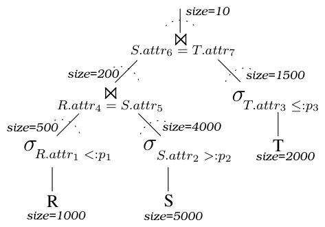
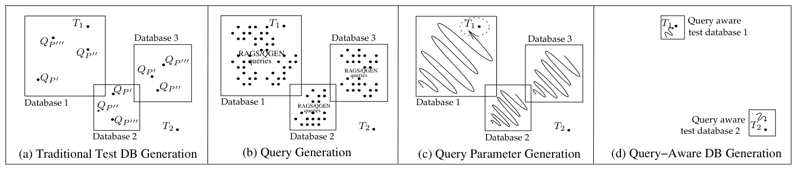
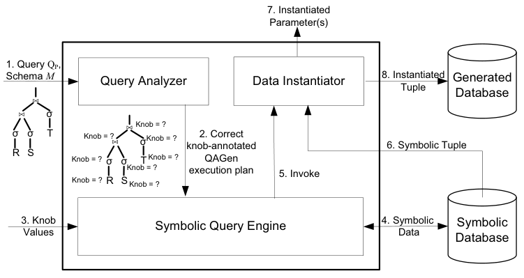
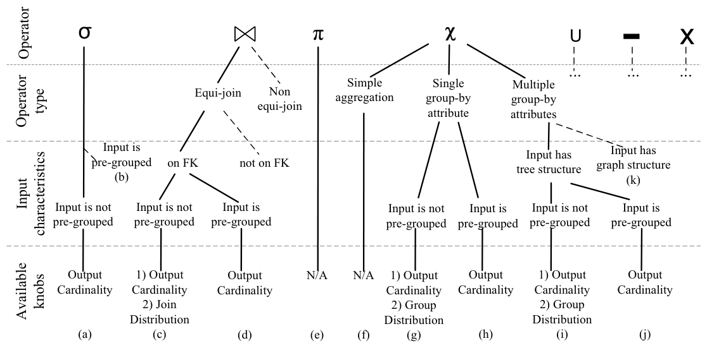
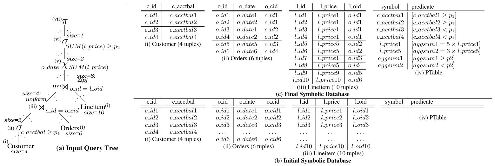
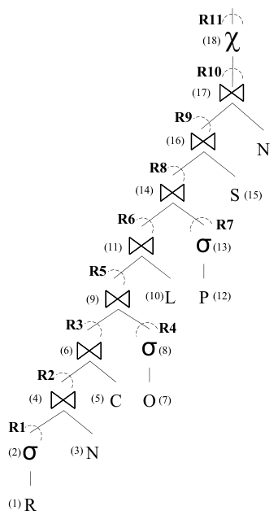

# QAGen: Generating Query-Aware Test Databases（中文译文）

## 译者说明

本文依据同目录的 `source.pdf` 翻译。章节、图表、公式、算法、代码与参考文献按原文结构保留。

Carsten Binnig、Donald Kossmann、Eric Lo、M. Tamer Özsu

## 摘要

目前，测试数据库管理系统（DBMS）的一种常见方法是先生成一组测试数据库，再在其上执行查询。然而，对 DBMS 测试来说，如果能够针对某个测试用例控制测试查询中每个算子的输入和/或输出（例如基数），将非常有利。遗憾的是，现有数据库生成器独立于查询生成数据库，因而很难保证测试查询在生成的测试数据库上执行后，能够得到与测试用例相符的目标（中间）查询结果。

本文提出一种新的 DBMS 测试方法。我们不再先生成测试数据库、再检查它与某个测试用例的匹配程度（若不匹配便以试错方式生成另一个数据库），而是为每个测试用例生成查询感知数据库。为此，我们设计了查询感知测试数据库生成器 QAGen。除数据库模式和基表上的基本约束外，QAGen 还把查询以及定义在查询上的约束集作为输入，输出查询感知测试数据库。生成的数据库保证测试查询能够获得测试用例所定义的目标（中间）结果。这种测试方式可用于广泛的 DBMS 测试任务，例如测试内存管理器，以及测试查询优化器中的基数估计组件。

**分类与主题描述：** D.2.5［软件工程］测试与调试——测试工具；H.2.4［数据库管理］系统——查询处理。

**一般术语：** 算法、性能、可靠性、实验。

**关键词：** 测试、数据库、符号查询处理、符号数据库、符号执行、查询处理。

## 1. 引言

当向 DBMS 引入新组件或新技术时，通常需要在广泛的测试用例和工作负载下验证其正确性，并评估系统的相对改进。今天常用的方法，是先生成一组尽可能全面的测试数据库，再在这些数据库上执行许多测试查询，比较新组件加入前后的系统行为。现有测试数据库生成工具允许用户定义基表大小和数据特征，例如值分布、表间相关性和表内相关性。IBM DB2 Database Generator [2]、DTM Data Generator [1]、MUDD [24]，以及文献 [16]、[17]、[7] 的研究原型都是例子。在生成测试数据库后，下一步或是手工编写测试查询，或是用 RAGS [23]、QGEN [22] 等查询生成工具随机产生大量合法查询并执行。

遗憾的是，这种方法不足以测试单个 DBMS 组件，因为测试往往需要控制一个查询中间算子的输入或输出。假设我们要研究新设计的内存管理器如何影响多路散列连接查询的正确性和/或性能，也就是各算子的内存分配策略会怎样影响最终执行计划。图 1 给出一个测试用例（取自 [8]）。一个测试用例由参数化查询 `QP` 和定义在各个算子上的一组约束组成。图中先把经过筛选的大表 `S` 与经过筛选的表 `R` 连接，得到较小的连接结果；再把这个中间结果与经过筛选的表 `T` 连接，得到较小的最终结果。散列连接的内存需求由其输入规模决定，因此若能控制查询树中每个算子的输入和输出，就能更有针对性地研究内存分配。例如，可以通过 `σ(R) ⋈ σ(S)` 的输出基数约束和 `σ(T)` 的输出基数约束，研究内存管理器为 `⋈_{S.attr6=T.attr7}` 分配的内存。我们虽能让数据库引擎采用指定物理计划（固定连接顺序并强制使用散列连接），却没有简便的方法控制中间查询结果。



### DBMS 测试问题

本文所说的 DBMS 测试问题，是要保证测试查询在测试数据库上执行后，得到测试用例定义的目标中间结果，例如输出基数和连接分布。图 2 从概念上说明了这一问题。在图 2(a) 至 (d) 中，点表示测试用例 `T1`、`T2`；图 2(a) 至 (c) 中的方块分别表示三个已生成的测试数据库实例。一般而言，好的测试数据库应当覆盖测试用例，即其内容应当使测试查询执行后有可能得到目标中间结果。

传统测试数据库生成过程不考虑查询，因此很难保证 `QP` 在生成数据库上得到测试用例规定的结果。图 2(a) 中 Database 1、2、3 都没有覆盖 `T2`；无论在其中哪一个数据库上执行 `T2` 的测试查询，都不可能满足 `T2` 的约束。即使某个数据库覆盖了测试用例，例如 Database 1 覆盖 `T1`，也很难手工找到正确的参数值 `P`，使实例化后的查询满足该用例。图中手工尝试 `P′`、`P″`、`P‴` 三组参数，也不大可能恰好满足 `T1`。

RAGS 和 QGEN 等工具在给定数据库上生成大量查询，以覆盖多种测试场景；但它们并非为测试单个 DBMS 组件设计。在这种测试中，测试者通常已经给定目标查询（如图 1），RAGS/QGEN 可能需要极长时间才能碰巧生成一个既具有相同结构、又符合测试用例要求的查询。此外，它们依赖当前数据库的内容；若数据库本身不覆盖 `T2`，便根本不可能生成匹配 `T2` 的查询，如图 2(b) 所示。

Bruno 等人 [8] 已指出这一问题的重要性。他们给定测试数据库 `D`、参数化合取查询 `QP` 以及 `QP` 各子表达式上的基数约束 `C`，研究如何求参数 `P`，使 `QP` 每个算子的输出基数满足 `C`。该问题为 NP-hard。图 2(c) 表示这种做法：已有 Database 1、2、3 时，可能根本不存在参数使 `QP` 满足 `T2`；即使数据库覆盖某用例，解空间也非常大。因此，他们只能对带单侧谓词（如 `p1 ≤ a` 或 `a ≤ p2`）或双侧谓词（如 `p1 ≤ a ≤ p2`）的选择—投影—连接查询搜索近似解，使实际基数尽量接近测试用例给出的基数。

问题的根源在于测试数据库生成阶段：数据库在完全不知晓测试查询的情况下生成，自然无法保证查询得到指定的中间结果。要进行有意义的测试，只能痛苦地反复试错（例如依次生成 Database 3、2、1 才找到匹配 `T1` 的数据库），再运行 RAGS/QGEN 产生的查询，或运行 [8] 所求参数实例化后的查询。



### 贡献

本文换了一个方向解决 DBMS 测试问题：不先生成数据库再判断查询能否得到符合测试用例的结果，而是直接为每个测试用例生成专门的数据库，如图 2(d)。QAGen 给定数据库模式 `M`、参数化查询 `QP` 和各查询算子上的用户约束，直接生成数据库 `D` 与查询参数 `P`；`QP(P)` 在 `D` 上执行时，保证满足用户加在算子上的要求。

QAGen 可以为 TPC-H 查询等复杂查询生成测试数据库。少数特殊情况仍是 NP-hard，本文也为其中一些情况给出算法。生成的数据库可用于多种 DBMS 测试。除内存管理器外，还可以固定连接顺序、让 QAGen 保证中间连接结果规模，再把真实基数与优化器内部直方图等组件的估计作比较，以检验基数估计精度。这里不能直接测试连接重排序，因为测试者必须固定物理连接顺序，而 QAGen 保证的中间基数本身又可能促使优化器选择另一个顺序。另一个用途是保证聚合算子 `GROUP BY` 的输入和输出规模（即组数），在多路连接或嵌套查询等不同情形下评估聚合算法性能。

QAGen 的另一项贡献，是提供新的测试数据库约束定义方式。传统生成器 [7, 4, 17, 1, 2] 只允许在基表上定义约束，例如把连接分布定义为基表之间的数据特征，因而测试者无法直接表达“某个连接输出多少行”之类的算子约束。QAGen 允许在每个算子和基表上直接标注约束，从而容易为不同测试用例生成真正有意义的数据。

测试时，除基数之外有时还希望向算子加入新的约束。例如，对 `GROUP BY`，不仅要控制输出组数，还可能要控制输入元组如何分布到预定义输出组中，使一些组大、另一些组小。QAGen 被设计为可扩展系统，可以较容易地加入新的算子约束。

下文安排如下：第 2 节概述 QAGen；第 3、4 节说明所用算法；第 5 节给出实验；第 6 节讨论相关工作；第 7 节总结并展望未来工作。

## 2. QAGen 概览

QAGen 的数据生成分为两个阶段：(1) 符号查询处理（Symbolic Query Processing, SQP）；(2) 数据实例化。SQP 的目标，是把查询上的用户约束捕获到目标数据库中。为了在没有具体数据时处理查询，QAGen 把软件工程中的符号执行 [18] 融入传统查询处理。符号执行是成熟的程序验证技术：它用符号值表示程序变量，而非给定具体值，再对由这些符号组成的表达式进行运算。

QAGen 首先实例化一个只含符号而没有具体值的数据库，称为符号数据库。图 3 的符号数据库包含 `R`、`S`、`T` 三个符号关系。符号关系与普通关系表相似，由符号元组构成，只是元组字段由符号表示。例如，`R` 中的 `a1` 可以代表属性 `a` 定义域内的任意值。符号数据库是关系数据库的泛化，也是具体数据的一种抽象表示；这正为 QAGen 控制各算子输出留下了空间。


SQP 借鉴传统查询处理流程。查询分析器先分析输入查询，用户再指定查询树中各算子的目标要求。符号查询引擎随后像传统引擎一样执行查询：每个算子实现为迭代器，数据从基表沿查询树向根部流动 [15]。不同之处是算子处理符号数据而非具体数据。每个算子依据自身语义和用户约束操纵输入符号数据，并把算子约束逐步施加到符号数据库上。完成后，符号数据库已成为查询感知数据库，捕获了测试用例的全部要求，但尚未包含具体取值。

接下来进入数据实例化阶段：从符号数据库读出符号元组，用约束求解器为符号赋值，再把具体元组插入目标数据库。为了让用户能为同一查询定义不同测试用例，QAGen 的查询输入采用关系代数表达式。比如输入 `(σ_{age>p1} Customer ⋈ Orders) ⋈ Lineitem` 时，可以规定“与年龄大于 `p1` 的客户相连的订单”同 lineitem 之间的分布（如 Zipf 分布）；若输入改为 `(Orders ⋈ Lineitem) ⋈ σ_{age>p1} Customer`，则可规定所有订单与所有 lineitem 之间的连接分布。查询表达式的结构决定了约束究竟落在哪一段数据流上。

图 4 给出完整架构：查询分析器、符号查询引擎、符号数据库和数据实例化器依次协作。输入是查询 `QP` 与模式 `M`；查询分析器产生正确的、带 knob 标注的执行计划；用户填入 knob 值；符号引擎据此写入符号数据；数据实例化器再读取符号元组，调用约束求解器，得到参数值和具体元组，最终形成生成数据库。



### 2.1 查询分析器

SQP 开始时，QAGen 把参数化查询 `QP` 和数据库模式 `M` 交给查询分析器。分析器有两项功能。

**(1) 选择正确的 knob。** knob 可以看作控制算子输出的参数。QAGen 提供的基本 knob 是输出基数；它既可写为绝对数量，也可写为选择率，两种形式本质等价。但一个 knob 能否使用，取决于算子和输入特征。

图 5 汇总了不同情况下的可用 knob。对简单聚合 `SELECT MAX(a) FROM R`，聚合算子 `χ` 不应有基数 knob：`R` 非空时输出总为 1，空时为 0，对应图 5(f)。再如，两个存在外键关系的输入做等值连接时，若连接键输入已预分组，只能提供输出基数 knob（图 5(d)）；若没有预分组，用户还可以调连接分布（图 5(c)）。普通选择在输入未预分组时可控制输出基数（a），预分组时属于困难情况（b）；投影没有 knob（e）；无 `GROUP BY` 的简单聚合没有基数 knob（f）；单属性分组在未预分组时可以控制输出基数和组分布（g），已预分组时只控制输出基数（h）；多属性分组在输入具有树结构时提供相应支持（i），图结构则是未支持的困难情形（k）。



所谓“在属性 `a` 上预分组”，是该属性至少有一个符号不再唯一。考虑图 3 的 `(R ⋈_{b=c} S) ⋈_{a=e} T`：第一次连接前，可以指定 `R` 到 `S` 的连接分布，例如让 `t1` 连接 `S` 的前三行 `t3,t4,t5`，让 `t2` 只连接 `t6`，形成类似 Zipf 的分布 [25]。第一次连接后，中间结果在 `a,b,c` 上已经预分组，例如 `a1` 在三行中重复。若再按 `a=e` 连接 `T`，分布便不能自由设定：如果 `T` 的 `t11` 与中间结果 `t7` 连接，即 `e1=a1`，那么它也必然与同样含 `a1` 的 `t8,t9` 连接。

因此，分析器必须自底向上分析查询，从模式 `M` 开始，逐步预计算每个算子的输出特征；必要时把某属性标为预分组。上述例子中，分析器把 `R⋈S` 输出的 `a,b,c` 标成预分组，并据此禁用下一次与 `T` 连接时的连接分布 knob。这一步可根据 [19, 21] 的结果完成，无须查看具体数据；细节见技术报告 [6]。分析结束后得到带恰当 knob 标注的查询树。

**(2) 为算子分配物理实现。** 同一算子在不同输入特征和 knob 组合下需要不同算法；即使 knob 相同，也可能有多种实现，就像传统等值连接可以选择散列连接或排序合并连接。查询分析器的另一项工作，就是为每个算子选择支持相应 knob 的正确实现，最终产出带 knob 标注的查询执行计划。第 3 节将逐一介绍这些实现。

### 2.2 符号查询引擎与符号数据库

符号查询引擎是 SQP 的核心。它解释查询分析器给出的执行计划，并采用迭代器模型 [15]：算子逐个从子算子读取元组，处理后把结果交给父算子。执行前，用户可以填写一部分或全部 knob；未填写的 knob 使用默认值。

与传统处理一样，多数算子可以流水执行，但有些必须阻塞。例如，多分组属性聚合是阻塞算子；一种特殊等值连接也必须阻塞。这些情况下，符号引擎会在需要时把中间结果物化到符号数据库。查询树中的表本身也被视为算子；表算子在 `open()` 时根据模式 `M` 与基表约束（如表大小）初始化符号关系。

算子一方面按照自身语义给输入元组施加约束，使用户的算子级要求落到数据层；另一方面控制交给父算子的输出，使父算子接收到正确的元组。以图 3 的 `σ_{a≥p1}R` 为例，若用户指定输出 1 行，第一次 `getNext()` 读取 `t1`，给 `a1` 标注正约束 `[a1≥p1]`，并返回 `<a1,b1>`；第二次读到 `t2` 时给 `a2` 标注负约束 `[a2<p1]`，但不返回它，因为基数 1 已满足。

用户也可能给出相互矛盾的 knob，例如 `R` 只有 2 行却要求选择输出 10 行。如果算子耗尽输入仍不能满足要求，符号查询引擎便停止并返回对应错误，让用户重新调整相关 knob。

### 2.3 数据实例化器

符号引擎完成后，数据实例化器从符号数据库读取元组，使用约束求解器为其中符号赋值。QAGen 把求解器视为外部黑盒：输入命题逻辑约束公式，输出每个变量的一组可行实例。例如对 `40<a1+b1<100`，求解器可以返回 `a1=55,b1=11`，也可以返回任何其他满足约束的值。一个符号元组的值全部收集齐后，就把对应具体元组写入目标数据库。

### 2.4 QAGen 议程

完整的 QAGen 应覆盖图 5 的全部 SQL 算子。本文版本支持选择 `σ`、投影 `π`、等值连接 `⋈` 和聚合 `χ`；这些是最常用的算子，已经能覆盖 22 条 TPC-H 查询中的 13 条。图 5 的实线表示当前支持项，虚线表示下一版本计划支持的算子或情况，例如并 `∪` 和差 `−`。当前也不支持 `DISTINCT`，以及加在 `UNIQUE` 属性上的 `CHECK` 约束。

系统加入新算子或新 knob 的路径很直接：把支持该 knob 的算子实现接入符号查询引擎，再告知查询分析器该 knob 依赖哪些输入特征即可。

## 3. 符号查询处理

本节先定义符号数据模型及其物理存储方式，再以贯穿示例说明各算子的 SQP 算法。

### 3.1 符号数据模型

#### 3.1.1 定义

符号关系由模式与符号实例组成。模式定义与经典关系模式 [11] 完全相同。设有 `n` 个属性：

```math
R(a_1:dom(a_1),\ldots,a_i:dom(a_i),\ldots,a_n:dom(a_n))
```

其中 `dom(a_i)` 是属性 `a_i` 的定义域。符号关系实例是符号元组集合 `T`。每个 `t∈T` 是含 `n` 个符号的元组 `<s_1,s_2,…,s_n>`，简写 `t.a_i=s_i`。

每个符号 `s_i` 关联一个可以为空的谓词集合 `P_{s_i}`。`s_i` 的取值可以是 `dom(a_i)` 中满足 `P_{s_i}` 全部谓词的任意值。谓词 `p∈P_{s_i}` 是至少涉及 `s_i`、并可涉及不同符号关系实例中其他若干符号的命题公式。因此，符号及其谓词可以写为命题公式的合取：

```math
s_i \models \bigwedge_{p\in P_{s_i}}p
```

符号数据库是符号关系的集合；一个符号数据库可以对应许多个具体关系数据库。最后，若属性 `a` 中至少有一个符号出现两次，称该符号关系在 `a` 上预分组。

#### 3.1.2 数据存储

符号数据库是关系数据库的泛化。考虑到二者关系密切且关系数据库技术成熟，重新发明一套物理存储模型并不划算。一个自然想法，是把符号数据直接放在表列里，以 SQL 用户自定义类型 [3] 描述列，再用用户自定义函数实现符号操作；但控制输出规模与分布的连接等符号操作太复杂，难以写成 SQL 用户函数。QAGen 因而采用更简单的方式：符号及谓词均用 `varchar` 存在关系数据库中，由符号查询引擎直接操作关系数据库，也由此获得现成的访问方法支持。

一个符号可能关联很多谓词。为高效、规范地存储它们，QAGen 把谓词拆到独立关系 `PTable(symbol varchar(1024), predicate varchar(1024))`。仍以 `σ_{a≥p1}R` 为例，`R` 可表示为 `R(a varchar(1024), b varchar(1024))`。选择完成后：

| R.a | R.b | PTable.symbol | PTable.predicate |
| --- | --- | --- | --- |
| `a1` | `b1` | `a1` | `[a1≥p1]` |
| `a2` | `b2` | `a2` | `[a2<p1]` |

关系表保存符号元组，`PTable` 保存符号与谓词的一对多关系。

### 3.2 符号查询求值

符号查询执行与传统查询处理的主要区别，是每个算子的输入和输出都是符号数据。符号的可塑性使算子能控制内部操作和输出。每个算子仍是实现 `open()`、`getNext()`、`close()` 的迭代器。若 knob 互相冲突，例如选择输出大于输入，则算子应报告错误；下文假设没有冲突。

图 6 的贯穿示例是一条两次连接查询，足以展示表、选择、等值连接、聚合和投影的符号执行。输入简化 TPC-H 模式如下，`c_id`、`o_id`、`l_id` 为主键：

```text
Customer(c_id int, c_acctbal float)
Orders(o_id int, o_date date, o_cid REFERENCES Customer)
Lineitem(l_id int, l_price float, l_oid REFERENCES Orders)
```

查询树从 `Customer`（4 行）开始：选择 `c_acctbal≥p1`，要求输出 2 行；与 `Orders`（6 行）连接，要求输出 4 行且均匀分布；再与 `Lineitem`（10 行）连接，要求输出 8 行且为 Zipf 分布；按 `o_date` 聚合 `SUM(l_price)` 成 2 组；用 `SUM(l_price)≥p2` 选择 1 组；最终投影聚合值。



#### 3.2.1 表算子的符号执行

**knob：** 表大小（必填）。

QAGen 把查询树中的基表视为算子。表算子在 `open()` 中按模式 `M` 在 RDBMS 建表，所有属性物理类型均为 `varchar`；随后创建符号元组，直到达到规定表大小。每个符号以属性名为前缀，加唯一编号，例如 `c_id1`、`c_acctbal1`。SQP 开始时，基表中的每个符号都唯一。图 6(b) 展示了 `Customer`、`Orders`、`Lineitem` 的初始关系表示。`getNext()` 与普通表扫描相同：逐行返回，耗尽后返回 `null`。同一张表在查询中出现多次时，只创建并填充一次。

模式 `M` 中的 `CHECK` 约束通过向符号添加谓词实施。例如若 `Lineitem` 有 `CHECK(l_price≥0)`，则每个 `l_price` 符号都在 `PTable` 中有一行，如 `<l_price1,[l_price1≥0]>`。示例没有 `CHECK`，初始 `PTable` 为空。主键、唯一性和非空约束由“初始符号全部不同”自然保证；与查询相关的外键约束由连接算子处理。

#### 3.2.2 选择算子的符号执行

**knob：** 输出基数 `c`（可选，默认等于输入大小）。

设选择 `σ` 的输入为 `I`、输出为 `O`、谓词为 `p`，目标是把 `|O|` 控制为 `c`。输入是否在谓词属性上预分组，会使问题难度与解法完全不同。

**情形 1：输入未在选择属性上预分组。** 这是图 5(a)，也是示例中的两个选择算子。算法如下：

1. `getNext()` 调用子算子的 `getNext()` 读取元组 `t`。若输出尚未达到 `c`，执行“正元组标注”；否则执行“负元组后处理”，最后向父算子返回 `null`。
2. **正元组标注：** 对 `t` 中参与谓词 `p` 的每个符号 `s`，把 `<s,p>` 插入 `PTable`，并向父算子返回 `t`。
3. **负元组后处理：** 当输出达到 `c` 后，继续读取剩余输入 `I⁻`。对其中每行及每个参与 `p` 的符号 `s`，把 `<s,¬p>` 插入 `PTable`，直至子算子返回 `null`。

负谓词不可省略，否则数据实例化时，未输出元组仍可能被赋成满足 `p` 的值，从而破坏目标基数。示例的 `c_acctbal` 直接来自基表，尚未预分组。因 `c=2`，前两行的 `c_acctbal1,c_acctbal2` 得到 `[c_acctbal_i≥p1]`，后两行得到 `[c_acctbal_i<p1]`。选择输出与 `PTable` 为：

| 输出 `c_id` | 输出 `c_acctbal` | `PTable` 谓词 |
| --- | --- | --- |
| `c_id1` | `c_acctbal1` | `[c_acctbal1≥p1]` |
| `c_id2` | `c_acctbal2` | `[c_acctbal2≥p1]` |
| — | — | `[c_acctbal3<p1]` |
| — | — | `[c_acctbal4<p1]` |

**情形 2：输入已在选择属性上预分组。** 这种特殊情况通常发生在连接上方的选择中。技术报告 [6] 证明其符号执行为 NP-hard。由于该情况少见，而且测试者往往可以主动把选择下推，当前 QAGen 不支持图 5(b)，未来计划用近似算法处理。

#### 3.2.3 等值连接算子的符号执行

**knob：** 输出基数 `c`（可选，默认等于非 distinct 输入大小）。

设输入为 `R,S`，输出为 `O`，简单等值谓词为 `j=k`；`j` 是 `R` 的连接属性，`k` 是 `S` 中以外键引用 `j` 的属性。算法保证连接输出为 `c`，但仍须按 `k` 是否预分组分两种情况。

**情形 1：`k` 未预分组。** 这是图 5(c)。除基数外，还可提供：

**连接分布 knob `b`：** 可选 `Uniform` 或 `Zipf`，默认 `Uniform`。它规定 `S` 中多少行分别连接 `R` 的每一行。

算法流程如下：

1. **分布实例化：** `open()` 创建分布生成器 `D`，定义域大小为 `n=|R|`，总频数为 `c`，分布类型为 `b`。`D` 可采用 [16]、[9] 或统计包中的实现，生成总和为 `c` 且服从指定分布的 `m_1,…,m_n`；第 `i` 次 `D.getNext()` 返回第 `i` 个频数 `m_i`。
2. `getNext()` 在输出未达 `c` 时，如果当前 `m_i=0` 或未初始化，就从 `D` 取下一个 `m_i`，并从 `R` 取正元组 `r⁺`；随后从 `S` 取正元组 `s⁺`，将 `m_i` 减一，执行正元组连接，返回连接结果。达到 `c` 后改做负元组连接并返回 `null`。
3. **正元组连接：** 把 `s⁺.k` 替换成 `r⁺.j`，使两行在连接属性上共享同一符号，再执行等值连接。替换既发生在内存元组中，也传播回符号基表；可用类似 `UPDATE k.BaseTable SET k=r⁺.j WHERE k=s⁺.k` 的语句完成。
4. **负元组连接：** 读取 `S` 中其余 `S⁻`。对每个 `s⁻`，在连接属性 `j` 所源基表与 `R` 的差集中随机取一个符号 `j⁻`，把 `s⁻.k` 替换为 `j⁻`。这里只更新基表，因为负元组不会交给父算子。这样既满足外键，又保证它不与正输入连接。

贯穿示例中，Customer 的选择结果为两行，随后与 Orders 连接，要求 `c=4` 且均匀。`D` 以 2 为定义域大小、4 为总频数，假设产生 `{2,2}`：`c_id1` 应连接 `o_id1,o_id2`，`c_id2` 应连接 `o_id3,o_id4`。因此把 `o_cid1,o_cid2` 替换为 `c_id1`，把 `o_cid3,o_cid4` 替换为 `c_id2`。两条未连接订单的外键则随机指向未通过选择的 `c_id3,c_id4`。

| 连接输出（4 行） | `c_acctbal` | `o_id` | `o_date` | 共享连接符号 |
| ---: | --- | --- | --- | --- |
| 1 | `c_acctbal1` | `o_id1` | `o_date1` | `c_id1` |
| 2 | `c_acctbal1` | `o_id2` | `o_date2` | `c_id1` |
| 3 | `c_acctbal2` | `o_id3` | `o_date3` | `c_id2` |
| 4 | `c_acctbal2` | `o_id4` | `o_date4` | `c_id2` |

连接后的 Orders 基表同时变为：

| `o_id` | `o_date` | `o_cid` | 性质 |
| --- | --- | --- | --- |
| `o_id1` | `o_date1` | `c_id1` | 正元组 |
| `o_id2` | `o_date2` | `c_id1` | 正元组 |
| `o_id3` | `o_date3` | `c_id2` | 正元组 |
| `o_id4` | `o_date4` | `c_id2` | 正元组 |
| `o_id5` | `o_date5` | `c_id3` | 负元组 |
| `o_id6` | `o_date6` | `c_id4` | 负元组 |

下一次把上述 4 行与 10 行 Lineitem 连接，要求输出 8 行并服从 Zipf。假定分布生成器得到 `{4,2,1,1}`，那么 `o_id1` 连接 4 行，`o_id2` 连接 2 行，`o_id3,o_id4` 各连接 1 行；剩余 `l_id9,l_id10` 的外键分别指向不在正输出中的 `o_id5,o_id6`。结果精确为 8 行。

| `c_id` | `c_acctbal` | `o_date` | `l_id` | `l_price` | 共享的 `o_id=l_oid` |
| --- | --- | --- | --- | --- | --- |
| `c_id1` | `c_acctbal1` | `o_date1` | `l_id1` | `l_price1` | `o_id1` |
| `c_id1` | `c_acctbal1` | `o_date1` | `l_id2` | `l_price2` | `o_id1` |
| `c_id1` | `c_acctbal1` | `o_date1` | `l_id3` | `l_price3` | `o_id1` |
| `c_id1` | `c_acctbal1` | `o_date1` | `l_id4` | `l_price4` | `o_id1` |
| `c_id1` | `c_acctbal1` | `o_date2` | `l_id5` | `l_price5` | `o_id2` |
| `c_id1` | `c_acctbal1` | `o_date2` | `l_id6` | `l_price6` | `o_id2` |
| `c_id2` | `c_acctbal2` | `o_date3` | `l_id7` | `l_price7` | `o_id3` |
| `c_id2` | `c_acctbal2` | `o_date4` | `l_id8` | `l_price8` | `o_id4` |

对应 Lineitem 基表的前 8 行为正元组，`l_oid` 依次是 `o_id1,o_id1,o_id1,o_id1,o_id2,o_id2,o_id3,o_id4`；后两行是 `<l_id9,l_price9,o_id5>` 与 `<l_id10,l_price10,o_id6>` 两个负元组。这就是原文 Table C 的完整两路连接结果与基表状态。

若等值连接的两个输入都是存在外键关系的基表，查询分析器会禁用输出基数 knob，因为 `S` 的每行都必须与 `R` 相连，输出大小固定为 `|S|`。

**情形 2：`k` 已预分组。** 这通常由前一次连接在 `k` 上引入分布造成。控制输出基数可归约为 subset-sum。给定目标整数 `c` 和整数集合 `C={c_1,…,c_m}`，subset-sum 判断是否存在 `C⁺⊆C`，使：

```math
\sum_{c_i\in C^+}c_i=c
```

设 `R.j` 中各符号 `j_i` 不同；`S.k` 有 `m` 个预分组，第 `i` 组由同一 `k_i` 重复 `c_i` 次。寻找哪些组与 `R` 连接后输出正好 `c` 行，就等价于选择一组 `c_i` 使总和为 `c`。subset-sum 是弱 NP-complete，但存在复杂度为 `O(min(c,Σc_i)·m)` 的伪多项式动态规划；这里表行数和组大小都按一元形式由实际元组给出，因此该常见特例可以在多项式时间内求解。

该连接是阻塞算子，因为 `open()` 必须先读完并物化 `S`，统计全部组大小。若 `c=|S|`，所有 `S` 行都必须连接，可跳过动态规划。一般流程为：

1. **动态规划：** 物化 `S`；执行类似 `SELECT COUNT(k) FROM S GROUP BY k ORDER BY COUNT(k) DESC`，得到各 `k_i` 的组大小；调用 `dp` 寻找总和为 `c` 的符号子集 `K⁺`，无解则停止并报告。
2. **正元组连接：** 对 `K⁺` 中每个 `k_i`，读出 `S` 中该组全部元组 `S⁺`；从 `R` 取一行 `r`，把整组的连接键换为 `r.j`，并把修改传播到来源基表；逐一把连接结果交给父算子。
3. **负元组连接：** 对未选组执行与情形 1 相同的负元组处理。

例如 `S` 的四组大小为 `5,4,2,1`，目标 `c=7`，动态规划选 `{5,2}`。若 `R` 依次含 `j1,j2,j3`，则把大小 5 的 `k1` 组换成 `j1`，大小 2 的 `k3` 组换成 `j2`，输出正好 7 行。两边连接键都已预分组、或连接键受 `CHECK` 约束等更罕见情形见 [6]。

#### 3.2.4 聚合算子的符号执行

**knob：** 输出基数 `c`（可选，默认等于输入大小）。

设输入为 `I`、输出为 `O`、聚合函数为 `f`。算法根据是否分组及分组属性是否预分组而变化。

**简单聚合（没有 `GROUP BY`）。** 查询分析器禁用输出基数 knob，因为非空输入只产生 1 行，空输入产生 0 行。SQL 有 `MIN`、`MAX`、`SUM`、`AVG`、`COUNT` 五类聚合；本文详述 `SUM` 和 `MIN`，其余及 `MAX(l_price)+AVG(l_price)` 等复杂表达式见 [6]，处理思路相同。设聚合中的表达式为 `expr`，其中含非空符号集合 `S`，且 `|I|=n`。

对 `SUM(expr)`，`getNext()` 消耗全部 `n` 行；对每个参与符号加入：

```math
[aggsum=expr_1+expr_2+\cdots+expr_n]
```

并返回符号元组 `<aggsum>`。例如在 8 行连接结果上计算 `SUM(l_price)`，基础做法会向 `PTable` 加 8 条相关记录。为缩短公式，QAGen 通常把 `l_price2,…,l_price8` 在来源基表中替换为 `l_price1`，只保存：

```math
[aggsum=8\times l\_price1]
```

这样可避免超出 `varchar` 上限、减少 `PTable` 行数，更重要的是降低后续约束求解器的公式规模；求解最坏代价随公式规模指数增长。代价是必须更新每个输入符号在来源基表中的值。

对 `MIN(expr)`，除 [6] 所述特殊情况外，算法把 `expr_1` 作为最小值输出，把其余 `expr_3,…,expr_n` 统一替换成 `expr_2`，并在 `PTable` 为 `expr_1`、`expr_2` 都登记 `[expr_1<expr_2]`。在 8 个 `l_price` 上求最小值时，返回 `<l_price1>`，保存两条以 `l_price1<l_price2` 为核心的谓词，并把 `l_price3…l_price8` 换成 `l_price2`。

**单个 `GROUP BY` 属性。** 输出基数 `c` 表示输出组数。设分组属性为 `g`。

若 `g` 未预分组，还可以指定**组分布 knob `b`**，取 `Uniform` 或 `Zipf`，默认均匀。它控制输入元组怎样分配到预定义的 `c` 个输出组：

1. `open()` 创建分布生成器 `D`，把 `n=|I|` 作为总频数、`c` 作为定义域大小、`b` 作为类型，得到 `m_1,…,m_c`，其中 `m_i` 是第 `i` 组大小。
2. 每次 `getNext()` 从 `D` 取 `m_i`，再从 `I` 取 `m_i` 行组成 `I_i`；子算子耗尽时返回 `null`。
3. **组分配：** 以 `I_i` 第一行 `t′` 为代表，把其余每行 `t.g` 换为 `t′.g`，并把替换传播回来源基表。
4. **聚合：** 把 `I_i` 中参与聚合的符号交给简单聚合算法。
5. **返回结果：** 构造 `<t′.g,agg_i>` 交给父算子。

若 `g` 已预分组，不能再自由控制组分布，但只控制输出组数并不困难。贯穿示例的 `o_date` 在连接后有 4 个预分组，大小分别为 `4,2,1,1`，聚合要求输出 `c=2`。算法把预分组以轮转方式分配给 2 个输出组：大小 4 的 `o_date1` 给第一组，大小 2 的 `o_date2` 给第二组，大小 1 的 `o_date3` 回到第一组并替换为 `o_date1`，大小 1 的 `o_date4` 给第二组并替换为 `o_date2`。两组最终大小为 5 和 3。

每个组分别调用简单聚合。由于同组价格已可统一，得到：

```math
aggsum_1=5\times l\_price1
```

```math
aggsum_2=3\times l\_price5
```

输出为 `<o_date1,aggsum1>`、`<o_date2,aggsum2>`；`Orders` 与 `Lineitem` 中相应符号也随之更新，如图 6(c)。

原文 Table D 所示的聚合结果和此时的 `PTable` 为：

| 输出 `o_date` | 输出 `SUM(l_price)` |
| --- | --- |
| `o_date1` | `aggsum1` |
| `o_date2` | `aggsum2` |

| `PTable.symbol` | `PTable.predicate` |
| --- | --- |
| `c_acctbal1` | `[c_acctbal1≥p1]` |
| `c_acctbal2` | `[c_acctbal2≥p1]` |
| `c_acctbal3` | `[c_acctbal3<p1]` |
| `c_acctbal4` | `[c_acctbal4<p1]` |
| `l_price1` | `[aggsum1=5×l_price1]` |
| `l_price5` | `[aggsum2=3×l_price5]` |

**`HAVING` 与单属性分组。** `HAVING` 等价于聚合结果上方的选择（[6] 有一个罕见例外）。示例要求 `SUM(l_price)≥p2` 且输出 1 行，于是 `PTable` 增加正谓词 `[aggsum1≥p2]` 和负谓词 `[aggsum2<p2]`，只把 `<o_date1,aggsum1>` 交给父算子。

| `HAVING` 输出 `o_date` | `SUM(l_price)` |
| --- | --- |
| `o_date1` | `aggsum1` |

**多个 `GROUP BY` 属性。** 除是否预分组外，还要看多属性数据来自 1:n:m 关系形成的树结构，还是来自 n:m:q 关系形成的图结构。QAGen 支持树结构输入，其难度和算法与单分组属性相近；图结构输入，或分组属性带定义域约束时，问题为强 NP-hard，当前不支持。证明见 [6]，我们计划用近似算法处理。

#### 3.2.5 投影算子的符号执行

投影的符号执行与传统处理完全相同：只投影指定属性，不添加约束。贯穿示例的最终投影从 `HAVING` 输出中取 `SUM(l_price)`，得到单行 `<aggsum1>`。

| 投影输出 `SUM(l_price)` |
| --- |
| `aggsum1` |

#### 3.2.6 嵌套查询的符号执行

SQP 复用传统查询处理的反嵌套技术，把嵌套查询改写成连接 [13]。为了让用户完全控制输入，应把查询以反嵌套形式提交。如果内外层查询引用同一张表，查询分析器会禁用一部分 knob，避免用户对处理同一基表的不同算子施加彼此不同的约束。

## 4. 数据实例化

数据生成的最后阶段把符号数据库变成具体数据库。数据实例化器读取符号元组，调用约束求解器——严格说是模型检查器的判定过程 [10]——为它们赋具体值。求解器输入命题公式，输出满足全部谓词和符号实际数据类型的一组值；不可满足时返回错误。不过 knob 冲突已在 SQP 阶段处理，因此这里不应出现不可满足公式。

求解器调用代价很高，最坏情况下随输入公式大小指数增长 [10]。因此数据实例化器要尽量减少调用次数；SQP 将 `aggsum=l_price1+…+l_price8` 化简为 `aggsum=8×l_price1`，正是为此服务。收齐一个符号元组的全部具体值后，实例化器便把它写入最终测试数据库。以图 6 的数据库为例，完整流程如下。

1. 从任一符号表开始，例如含 4 行的 `Customer`，逐表处理直至全部实例化。
2. 读取一行 `t`，例如 `<c_id1,c_acctbal1>`。
3. **查询符号—值缓存。** 对 `t` 中每个符号 `s`，先查符号数据库中的 `SymbolValueCache`。该表保存已由求解器实例化的符号及具体值；若命中，直接复用并处理下一符号。`c_id1` 第一次出现时尚未命中；稍后处理 `Orders` 前两行时，它们的 `o_cid` 已被换成同一 `c_id1`，便会复用其值。
4. **实例化值。** 从 `PTable` 取得 `s` 的谓词 `P`。若 `P` 为空，就按模式 `M` 中的实际定义域给值；`c_id1` 没有谓词且是主键，可赋唯一值 1，并把 `<c_id1,1>` 写入 `SymbolValueCache`。
5. 若 `s` 有谓词，递归查找与它直接或间接相关的全部谓词，计算谓词闭包。例如 `l_price1` 的闭包为：

```math
[aggsum_1=5\times l\_price1\ \land\ aggsum_1\ge p_2]
```

把已在 `SymbolValueCache` 中的符号先替换为具体值，再把闭包交给求解器。一次调用会同时实例化公式中的全部符号，例如得到 `l_price1=10, aggsum1=50, p2=18`。

在真正调用前，实例化器还查询 `PredicateValuesCache`。很多谓词只有符号编号不同，模式相同。例如 `[c_acctbal1≥p1]` 与 `[c_acctbal2≥p1]` 都属于模式 `[c_acctbal≥p1]`。实例化第一条后，系统把该模式及相应取值写入 `PredicateValuesCache`；遇到第二条时，按模式命中缓存，跳过求解器，复用 `c_acctbal1`（以及 `p1`）的已实例化值。

`SymbolValueCache` 与 `PredicateValuesCache` 使求解器调用数降到最低。实验显示，这一点至关重要：没有缓存，生成 1GB 查询感知数据库需要数周而不是数小时。对于没有谓词的符号，除主键等完整性约束要求外，可以随机赋值，也可以总用同一值；这些属性根本不参与输入查询，其分布等额外特征不会影响查询结果，无须再模拟。

## 5. 实验

我们用 Java 实现 QAGen 原型，在 2.2GHz AMD Opteron、4GB 内存的 Linux 服务器上运行。符号数据库和目标数据库均为 PostgreSQL 7.4.8，部署在同一机器；约束求解器采用公开的 Cogent [12]。

实验分两组。第一组研究单个符号算子的执行效率、扩展性和数据实例化时间；第二组研究 QAGen 为不同查询生成不同规模数据库时的扩展性。所有实验中，生成数据库都 **100%** 满足输入查询计划中定义的约束。

### 5.1 符号操作效率

第一组实验生成 10MB、100MB、1GB 三种规模的查询感知数据库，考察：(1) 各符号算子运行时间；(2) 算子扩展性；(3) 数据实例化阶段耗时。输入是 TPC-H Query 8 [4]，其逻辑计划见图 7。选择 Query 8 是因为它包含 7 路连接和聚合，是 TPC-H 最复杂的查询之一，而且各算子的输入特征多样，能同时覆盖普通等值连接和需要动态规划的特殊等值连接。



实验先用 TPC-H 的 `dbgen` 生成 10MB、100MB、1GB 三个基准数据库，在其上执行 Query 8，采集基表大小和每个中间结果的真实基数。然后把这些数值作为 QAGen 输入，生成三个 Query-8-aware 数据库，使它们产生相同中间基数；连接分布设为均匀。

**表 1：TPC-H Query 8 的 QAGen 执行时间。** `k/m` 分别表示千/百万。

| # | 符号操作 | 10MB 输出 | 10MB 时间 | 100MB 输出 | 100MB 时间 | 1GB 输出 | 1GB 时间 |
| ---: | --- | ---: | ---: | ---: | ---: | ---: | ---: |
| 1 | Region | 5 | <1s | 5 | <1s | 5 | <1s |
| 2 | `σ(Region)=R1` | 1 | <1s | 1 | <1s | 1 | <1s |
| 3 | Nation | 25 | <1s | 25 | <1s | 25 | <1s |
| 4 | `(R1 ⋈ Nation)=R2` | 5 | <1s | 5 | <1s | 5 | <1s |
| 5 | Customer | 1.5k | <1s | 15.0k | 5s | 150k | 49s |
| 6 | `(R2 ⋈ Customer)=R3` | 0.3k | 1s | 3.0k | 7s | 299.5k | 75s |
| 7 | Orders | 15.0k | 4s | 150.0k | 45s | 1.5m | 553s |
| 8 | `σ(Orders)=R4` | 4.5k | 8s | 45.0k | 67s | 457.2k | 709s |
| 9 | `(R3 ⋈ R4)=R5` | 0.9k | 3s | 9.0k | 22s | 91.2k | 277s |
| 10 | Lineitem | 60.0k | 26s | 600.5k | 237s | 6001.2k | 2629s |
| 11 | `(R5 ⋈ Lineitem)=R6` | 3.6k | 34s | 35.7k | 348s | 365.1k | 4694s |
| 12 | Part | 2.0k | <1s | 20.0k | 5s | 200k | 60s |
| 13 | `σ(Part)=R7` | 12 | 1s | 147 | 8s | 1451 | 72s |
| 14 | `(R7 ⋈ R6)=R8` | 29 | 3s | 282 | 27s | 2603 | 533s |
| 15 | Supplier | 0.1k | <1s | 1k | <1s | 10k | 3s |
| 16 | `(Supplier ⋈ R8)=R9` | 29 | <1s | 282 | 1s | 2603 | 6s |
| 17 | `(Nation ⋈ R9)=R10` | 29 | <1s | 282 | <1s | 2603 | 3s |
| 18 | `χ(R8)=R11` | 2 | <1s | 2 | 1s | 2 | 10s |
| — | **符号查询处理** | — | **01m:20s** | — | **12m:53s** | — | **161m:13s** |
| — | **数据实例化（Cogent 调用数）** | — | **09m:31s (14)** | — | **96m:03s (14)** | — | **1062m:54s (14)** |
| — | **总时间** | — | **10m:51s** | — | **108m:56s** | — | **1224m:07s** |

QAGen 生成 10MB 数据库约需 10 分钟。SQP 很快且近似线性扩展：10MB 约 1 分钟，1GB 不到 3 小时。SQP 最慢的是初始化大 Lineitem 符号表（第 10 行）以及把 `R5` 与 Lineitem 连接（第 11 行）；后者频繁访问大表以更新连接属性符号。Query 8 的最后一次连接（第 17 行、图 7 的算子 17）输入已预分组，需动态规划，但输入与输出都小，所以很快完成。总体上，每个符号算子的扩展性都很好。

数据实例化主导整个过程：10MB Query-8-aware 数据库约 9 分钟，1GB 约 17 小时。其中约 40% 是读取符号元组和插入具体元组的开销（表中未单列）。三个规模下 Cogent 调用都只有 14 次，且不会随规模增长，因为缓存保存的是谓词模式而非每条具体谓词。关闭缓存后，1GB 数据实例化超过两周仍未完成，证明 SQP 的谓词优化和实例化缓存都非常有效。

### 5.2 QAGen 的扩展性

第二组实验考察生成多种查询感知测试数据库时的扩展性。当前 QAGen 支持 22 条 TPC-H 查询中的 13 条。不支持项或落入特殊情形，例如 Q5 属于第 3.2.2 节情形 2 的预分组选择；或包含非等值连接，例如 Q16、Q22。对其余查询，我们分别生成 10MB、100MB、1GB 数据库。受篇幅限制，论文列出 Q1、Q2、Q3、Q10、Q12 的详细结果。

**表 2：QAGen 扩展性。**

| Query | 阶段 | 10MB | 100MB | 1GB |
| ---: | --- | ---: | ---: | ---: |
| 1 | SQP | 02m:40s | 26m:45s | 321m:27s |
| 1 | DI | 07m:42s | 78m:35s | 844m:52s |
| 1 | 总计 | 10m:22s | 105m:10s | 1166m:19s |
| 2 | SQP | 00m:09s | 01m:32s | 16m:47s |
| 2 | DI | 02m:27s | 24m:55s | 249m:50s |
| 2 | 总计 | 02m:36s | 26m:27s | 256m:37s |
| 3 | SQP | 01m:35s | 16m:18s | 185m:21s |
| 3 | DI | 09m:34s | 97m:07s | 1016m:59s |
| 3 | 总计 | 11m:09s | 113m:25s | 1202m:20s |
| 10 | SQP | 01m:16s | 12m:56s | 156m:22s |
| 10 | DI | 09m:42s | 98m:13s | 1107m:10s |
| 10 | 总计 | 10m:58s | 111m:09s | 1263m:32s |
| 12 | SQP | 02m:11s | 21m:32s | 244m:07s |
| 12 | DI | 12m:01s | 123m:04s | 1387m:27s |
| 12 | 总计 | 14m:12s | 144m:36s | 1631m:34s |

全部 13 条查询都显示相同趋势：数据实例化仍是耗时主因，SQP 相对很快；两个阶段都随规模良好扩展。

## 6. 相关工作

DBMS 测试领域最接近的是 [8]：给定测试数据库，为测试查询生成参数。然而 [2, 1, 16, 17, 7] 等数据库生成器面向通用测试数据，并不考虑测试查询，不能保证生成数据库覆盖特定测试用例。结果是 [8] 很难先找到合适数据库，只能支持有限 SQL 子集。

QAGen 扩展了符号执行 [18]，提出符号查询处理以生成查询感知数据库。SQP 也与约束数据库 [20] 有关，但二者目标不同：约束数据库用约束表示无限的具体数据，例如时空数据；SQP 操作的是有限但抽象的数据。

文献 [5] 的反向查询处理（Reverse Query Processing）也研究查询感知测试数据库生成。它把应用查询及其期望结果作为输入，逆向处理查询，生成能够返回该结果的数据库。反向查询处理关注为数据库应用的功能测试生成最小测试数据库；QAGen 则关注 DBMS 自身测试，并允许在中间算子上直接规定约束。

## 7. 结论与未来工作

本文提出 QAGen：为不同 DBMS 测试用例生成定制数据库的系统。它基于符号查询处理，把传统查询处理与软件工程中的符号执行结合。实验表明，QAGen 可以为复杂查询生成查询感知数据库，并呈线性扩展趋势。

未来最重要的工作，是支持更多算子与更多特殊情况；还要探索为同一测试查询的不同查询计划生成单个数据库，以测试优化器的计划选择功能。最后，我们认为 SQP 可与传统符号执行进一步结合，把程序验证和测试用例生成技术扩展到数据库应用。

## 致谢

本文作者感谢 Wing-Kai Hon 和 Marc Nunkesser 对本项目提出的富有洞见的意见。

## 参考文献

1. DTM Data Generator. http://www.sqledit.com/dg/.
2. IBM DB2 Test Database Generator. http://www-306.ibm.com/software/data/db2imstools/db2tools/db2tdbg/.
3. International Organization for Standardization (ISO). *Information Technology—Database Language SQL*, 1999.
4. TPC benchmark H. http://www.tpc.org/tpch.
5. C. Binnig, D. Kossmann, and E. Lo. Reverse query processing. In *ICDE*, 2007.
6. C. Binnig, D. Kossmann, E. Lo, and M. T. Özsu. QAGen: Generating Query-Aware Test Databases. ETH Zurich Technical Report, 2007.
7. N. Bruno and S. Chaudhuri. Flexible database generators. In *VLDB*, pages 1097–1107, 2005.
8. N. Bruno, S. Chaudhuri, and D. Thomas. Generating Queries with Cardinality Constraints for DBMS Testing. *TKDE*, 2006.
9. S. Chaudhuri and V. Narasayya. TPC-D data generation with skew.
10. E. M. Clarke, O. Grumberg, and D. A. Peled. *Model Checking*. 2000.
11. E. F. Codd. A relational model of data for large shared data banks. *Commun. ACM*, 13(6):377–387, 1970.
12. B. Cook, D. Kroening, and N. Sharygina. Cogent: Accurate theorem proving for program verification. In *CAV*, pages 296–300, 2005.
13. R. A. Ganski and H. K. T. Wong. Optimization of nested SQL queries revisited. In *SIGMOD*, pages 23–33, 1987.
14. M. R. Garey and D. S. Johnson. *Computers and Intractability: A Guide to the Theory of NP-Completeness*. 1990.
15. G. Graefe. Query evaluation techniques for large databases. *ACM Comput. Surv.*, 25(2):73–170, 1993.
16. J. Gray, P. Sundaresan, S. Englert, K. Baclawski, and P. J. Weinberger. Quickly generating billion-record synthetic databases. In *SIGMOD*, pages 243–252, 1994.
17. K. Houkjær, K. Torp, and R. Wind. Simple and realistic data generation. In *VLDB*, pages 1243–1246, 2006.
18. J. C. King. Symbolic execution and program testing. *Commun. ACM*, 19(7):385–394, 1976.
19. A. Klug. Calculating constraints on relational expression. *TODS*, 5(3):260–290, 1980.
20. B. Kuijpers. Introduction to constraint databases. *SIGMOD Rec.*, 31(3):35–36, 2002.
21. G. N. Paulley and P.-A. Larson. Exploiting uniqueness in query optimization. In *ICDE*, pages 68–79, 1994.
22. M. Poess and J. M. Stephens. Generating thousand benchmark queries in seconds. In *VLDB*, pages 1045–1053, 2004.
23. D. R. Slutz. Massive Stochastic Testing of SQL. In *VLDB*, pages 618–622, 1998.
24. J. M. Stephens and M. Poess. Mudd: a multi-dimensional data generator. In *WOSP*, pages 104–109, 2004.
25. G. Zipf. *Human Behaviour and the Principle of Least Effort*. 1949.
