# Quantifying TPC-H Choke Points and Their Optimizations（中文译文）

## 译者说明

本文依据同目录的 `source.pdf` 翻译。章节、图表、公式、算法、代码与参考文献按原文结构保留。

## 来源与使用说明

论文许可证为 CC BY-NC-ND 4.0；本文仅作中文学习翻译，不改写原论文结论。

## 摘要

TPC-H 仍然是关系型 OLAP 系统中最广泛使用的基准。它包含一系列挑战，也称为“阻塞点”（choke points），数据库系统必须解决这些挑战才能获得良好的基准结果。例如，多表连接、相关子查询、以及 TPC-H 数据集中的相关性。理解这些优化的影响，有助于开发优化器，也有助于跨数据库系统解释 TPC-H 结果。

本文系统分析阻塞点及其优化，并在此前 TPC-H 阻塞点研究基础上给出定量讨论。论文关注 11 个优化，这些优化的收益基本独立于具体数据库系统。结果显示，子查询扁平化（flattening of subqueries）和谓词放置（placement of predicates）影响最大。Q2、Q17 和 Q21 三个查询强烈受高效查询计划选择影响；Q1、Q13 和 Q18 受计划优化影响较小，更多依赖高效执行引擎。

## 1. 动机

TPC-H 对关系数据库系统评估仍然重要。每年都有大量论文引用该基准。尽管 TPC-H 有诸多缺点，例如非事实表线性扩展、数据分布较均匀、使用 3NF 而非更常见的星型模式、手写查询与真实自动生成查询不完全可比，但它仍比后继的 TPC-DS 在研究中更常被讨论。

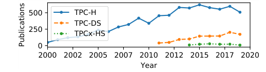

在两者发布后的前九年中，TPC-H（1999–2007）被 1,633 篇论文引用，TPC-DS 在对应九年窗口中被引用 1,094 次，图 1 直观显示了这种研究采用度差异。

TPC-H 原本用于端到端比较数据库系统，但研究者也经常用它评估实现细节和算法。更高吞吐量常被视为某种方法更好的证据。如果所有其他组件相同，这种解释可能成立；但更常见情况是，不同论文使用不同数据库系统，因此系统中其他优化的影响被低估。

论文举例说明：在 Hyrise 上执行 TPC-H Q6 时，Hyrise 几乎比 MonetDB 快 7 倍。因为 Q6 扫描密集，人们可能认为 Hyrise 扫描能力更强。但这一收益很大程度来自一种避免访问 82% 输入数据的优化。如果去掉该优化，Hyrise 只快 1.8 倍。前者可能更适合营销叙述，后者才更适合讨论扫描密集查询的真实性能。

我们认为，在比较 TPC-H 结果时，应讨论相关优化。Boncz、Neumann 和 Erling 曾分析 TPC-H 中的“隐藏信息”和阻塞点，并定义阻塞点为：基准背后的技术挑战，其解决会显著提高产品性能。他们识别了 28 个阻塞点，分为聚合与连接、数据访问局部性、表达式求值、相关子查询和并行执行等挑战，但没有给出定量实验数据。本文补充这一缺口：新系统可据此决定有限开发资源应先投入哪些优化，跨系统比较可判断差异来自被测方法还是其它优化，基准设计者也可将阻塞点的重要性与真实负载比较并据此调整基准。

本文贡献如下：

- 对 11 个阻塞点给出影响分析，重点关注基本独立于执行引擎和调度模型的逻辑计划优化。三个阻塞点对受影响查询带来至少一个数量级的差异，另两个即使最大影响也不超过 25%。
- 分享在 Hyrise 中实现这些优化的经验，并提供开源代码指针以支持复现。
- 描述此前未被列为 TPC-H 阻塞点的优化，例如半连接归约（semi join reduction）和 BETWEEN 组合（between composition）。

## 2. 阻塞点分类

论文将阻塞点分为三类。

第一类是计划级阻塞点（plan-level choke points）。它们在查询早期影响中间表基数，例如连接顺序、谓词下推与排序、子查询扁平化。这些优化在逻辑/关系层面减少基数。

第二类是逻辑算子阻塞点（logical operator choke points）。它们不改变算子的输入输出基数，但改善单个算子的逻辑效率。例如移除依赖于其他 group-by 列的分组列，可降低聚合逻辑复杂度。

第三类是实现特定阻塞点（implementation-specific choke points）。它们不改变查询计划，而是提高算子的物理效率。例如在连接中加入 bloom filter，或用更高效的 Boyer-Moore 匹配器替代 LIKE 的正则匹配。

本文关注前两类逻辑优化，因为它们更容易跨数据库系统比较。Hyrise 也使用 SIMD、压缩执行和 bloom filter 等算子级优化，但这些在实验中保持开启，不作为本文讨论重点。

无论系统是行存还是列存、内存还是磁盘，只要少访问元组就会获益。列式内存系统的绝对收益应与本文较接近；对磁盘或行存系统，在计划早期减少实际读取量的优化（例如物理访问规避）预计影响更大。本文按阻塞点作用范围（计划级或算子级）及逻辑/物理性质分类；Boncz 等人按受影响算子分类，两套分类在表 3 中给出映射。

## 3. 实验设置

评估基于研究型 DBMS Hyrise。我们选择 Hyrise 是因为团队熟悉其实现，能够关闭特定优化并理解这些关闭操作对其他组件的影响。这比仅从外部比较多个 DBMS 更适合深入分析单个阻塞点。

### 3.1 Hyrise 特征

Hyrise 是列式内存数据库，用作企业数据管理研究平台。表被水平划分为 chunk，每个 chunk 包含 100,000 行。chunk 是并行化、压缩和统计信息维护的单位。每个 chunk 每列有一个 segment，可使用字典、run-length、LZ4 和 frame-of-reference 压缩；本文使用字典编码。

SQL 到执行计划的流程是：SQL 字符串由 flex/bison 解析器解析，转换为逻辑查询计划（Logical Query Plan, LQP），优化器变换 LQP，再转换为包含实际算子的物理查询计划（Physical Query Plan, PQP）。

Hyrise 的优化既有规则优化，也有基数驱动优化。连接排序使用表级等 distinct-count 直方图和 chunk 级 MinMax filter。表扫描使用 AVX-512 向量化，连接主要使用单通道 radix-partitioned hash join，聚合使用 hash-based aggregate。

算子一次处理一张表。除聚合与投影外，它们输出指向原表的 position list。投影在物化输入上解释执行表达式树；sort 使用 stable sort，多列排序要多次扫描；实验只使用 hash aggregate。Hyrise 遵循 insert-only 原则，更新通过使旧行失效并插入新值实现，MVCC validate 算子负责移除对当前事务不可见的行。图 2 隐藏耗时不足 1% 的算子，因此单条柱形不一定加总为 100%；最右柱是各查询相对成本的算术平均，不按绝对执行时间加权。Q11、Q22 的 table scan 占比被高估，因为其中还计入故意未扁平化子查询的求值成本。

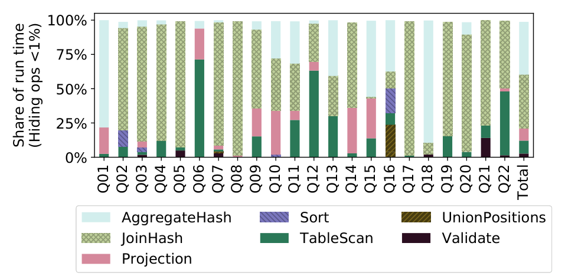

### 3.2 初步评估

我们将 Hyrise 与 DuckDB、MonetDB、Umbra 和 HyPer 进行单线程 TPC-H 对比。DuckDB、MonetDB、Umbra 在我们的硬件上实测；闭源 HyPer 的数字取自 Flare 论文，硬件可比；Umbra 使用预发布原型及随附 TPC-H demo，MonetDB 使用官方 `tpch-scripts`，DuckDB 基准经小改以支持 SF 10。选择这些系统是因为仍活跃、实现路线多样且易取得数据，并非将其作为直接竞争者；单线程也不是多数系统默认模式，图 3 不能用来建立系统排名。目的只是确认 Hyrise 基线合理，避免阻塞点分析被基础性能瓶颈削弱。

结果显示，Hyrise 的 partition pruning 让 Q6 和 Q20 可以跳过超过 80% 数据，因此在这些查询上表现突出；另一方面，Hyrise 的 hash 聚合相对较慢，使其在 Q1 和 Q18 上表现较弱。

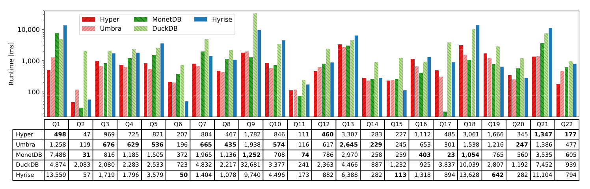

### 3.3 方法论

对每个阻塞点，我们修改 Hyrise 并移除对应优化，然后重新执行基准。吞吐差异用于估算优化收益。为了减少噪声，实验使用单线程执行。虽然真实系统可能使用多线程，但并行性会引入调度、NUMA 和负载均衡等额外因素，使单个优化的隔离分析更困难。

无关优化保持开启；若某优化依赖被移除的优化、继续开启反而造成回退，则在相应实验中暂时一并关闭。基数缩减本身不随线程数改变，但并行运行会额外引入核心数、NUMA 布局、查询流数量，以及 scan/join sharing 等正交因素，因此论文只研究在单线程和多线程下同样成立的阻塞点。

实验机是 2017 Fujitsu Primergy RX4770 M4，含四颗 Xeon 8180（2.5 GHz base、3.8 GHz turbo、每颗 28 个物理核）。基准通过 `numactl -N 0 -m 0` 绑定单一 NUMA 节点；每节点有 512 GB DDR4-2666、8 条 DIMM，单核按 2:1 读写比测得合计 20,553.32 MB/s。Hyrise 用 GCC 9.2、`-O3 -march=native` 编译。

`hyriseBenchmarkTPCH` 自动生成数据与查询、执行并保存结果。每个查询运行 60 秒，时间到后允许最后一次执行完成；指标是启用优化后该窗口内完成查询数的变化。规模因子为 10，因为更大规模下关闭子查询扁平化或谓词下推，会使单条查询一次执行超过一小时。每项实验通过 patch 禁用源码中的相应优化，我们提供这些 patch、编译执行和可视化说明，作为复现起点。

文中的相对性能影响可表示为：

$$
impact(q, o) = \frac{runtime(q, without\ optimization\ o) - runtime(q, with\ optimization\ o)}{runtime(q, with\ optimization\ o)}
$$

其中 `q` 为 TPC-H 查询，`o` 为一个阻塞点优化；后文图表的百分比均表示关闭该优化后的相对变化。

## 4. 计划级阻塞点

### 4.1 连接顺序

除 Q1、Q6 外，所有查询都涉及多表，多数至少涉及三张表。TPC-H 常把连接写成 `FROM t1, t2 WHERE t1.a = t2.a`，而非显式 `JOIN ... ON`。连接排序器第一项职责是把无谓词 cross join 与对应谓词配对；若没有这一步，20 条连接查询中只有 Q4、Q13、Q15、Q18、Q20、Q21、Q22 能在一分钟内结束，其余 14 条几乎无法执行。因此谓词配对是不可缺少的功能，不作为优化实验对象。

第二项职责才是确定表的连接次序。Hyrise 把 LQP 转成 join graph，在图上排序，再重建优化 LQP。图 4 以 SQL 原始次序为基线，对比动态规划 DPccp 与自底向上的 greedy 算法。Q2、Q5、Q11 明显受益；只有 Q7 中两种算法生成不同次序：greedy 先连接未过滤的 `customer`、`orders`，破坏原本较优的次序；DPccp 先让 `customer` 与 `nation` 连接，把客户缩减为两个目标国家。DPccp 得到与原 SQL 等价的次序，仍有约 4% 损失，来自排序算法自身成本。

先前研究发现 Q5 最坏与最好次序相差超过 100 倍。Hyrise 使用“反向贪心”、先选两张最大表时，Q5 与 Q7 都会耗尽内存，验证了该风险；其余查询差异不大。对 TPC-H，简单 min/max/count/distinct-count 统计配合 greedy 已足以处理除 Q7 外的查询。我们建议早期 DBMS 先投入其它优化，再实现 DPccp 等复杂连接排序；TPC-DS 等负载才更依赖复杂算法和统计。

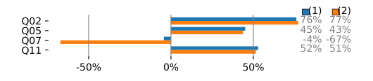

### 4.2 谓词下推与排序

谓词下推（predicate pushdown）把过滤条件尽早移动到数据流前部，减少后续算子输入。谓词排序则在同一位置存在多个谓词时，优先执行更便宜或更高选择性的谓词。

Hyrise 的 predicate pushdown 从 LQP 顶部递归向下，遇到谓词先移除，直到不能继续越过 join、aggregate 或 projection 时重新插入。随后 predicate ordering 对落在同一位置的谓词按选择率排序，让最严格的先执行；Hyrise 使用列直方图估算，更复杂的方法还可考虑列类型、字符串长度、压缩方式和谓词执行成本。

即使编译型系统能把连续谓词融合到一个算子、不物化中间结果，也会因先执行最严格谓词而受益：短路求值可以跳过其它列的加载。图 5 的基线保留 SQL 原始谓词位置，join 读取未过滤表、aggregate 先计算随后丢弃的组；子查询已经扁平化但不重新排序。第一组柱只启用下推，第二组同时启用下推和排序。多数查询受益，极端情况下基数降低多个数量级；Q14 的 `l_shipdate` 谓词会移除 `lineitem` 超过 98% 的行，再与未过滤 `part` 连接。TPC-H 的谓词下推完全可规则化、无需统计，应是最早实现的优化之一。

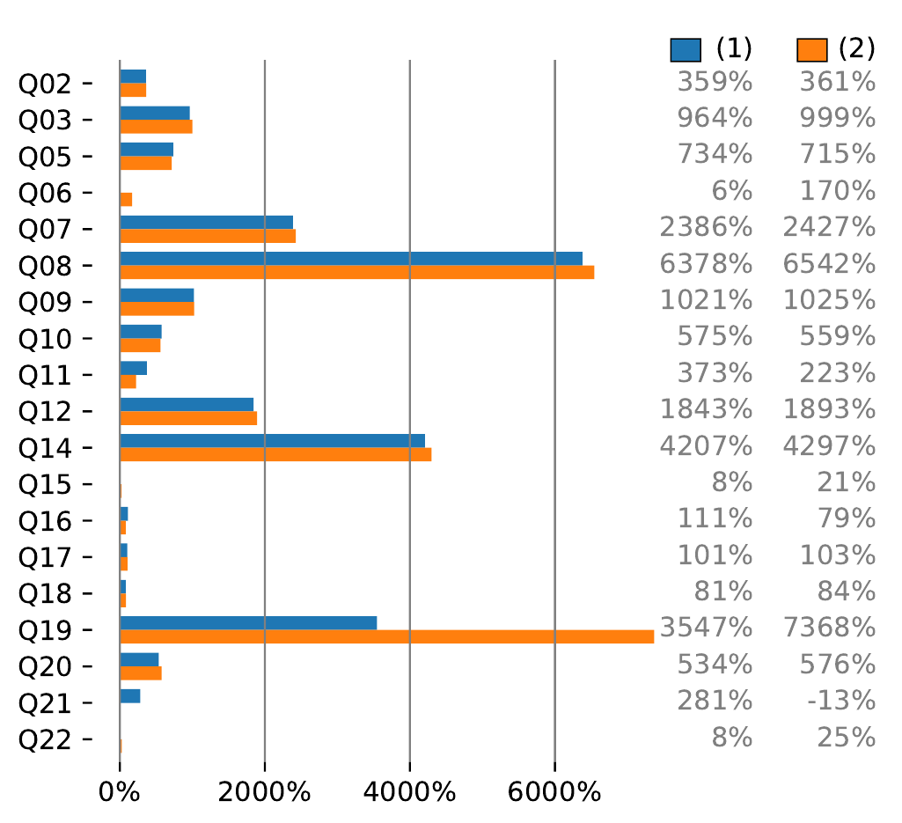

### 4.3 BETWEEN 组合

TPC-H 中常出现上下界谓词。如果两个比较谓词可以组合成 `BETWEEN` 或等价范围表达式，优化器就能更好地利用 chunk 统计信息、zone map 或索引结构。该优化本身不改变语义，但让系统更容易识别连续范围。

Q19 把 `l_quantity` 范围写成 `>=` 与 `<=`；Q4、Q5、Q6、Q10、Q12、Q14、Q15 使用 `>=` 与 `<` 表示日期范围，这是因为 SQL `BETWEEN` 只支持两端闭区间。优化器可识别并改写为单侧开区间，例如 Q5 的 `o_orderdate >= date AND o_orderdate < date + 1 year` 变为 `[date, date + 1 year)`。

该优化有两项收益：物化每个算子中间结果的系统可把两个算子合成一个；组合后的谓词也通常比任一单独边界更严格，会在计划中排得更靠下、更早缩减基数。图 6 中只有 Q14、Q15 分别明显提高 13% 与 66%；其它查询的范围谓词在计划中过晚，已无法产生显著影响。

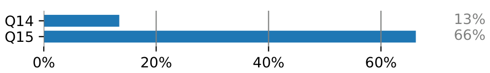

### 4.4 连接依赖谓词复制

当谓词约束某个连接属性时，等值连接可以把该约束复制到连接另一侧。例如 `R.a = S.a` 且 `R.a < 10`，优化器可推导出 `S.a < 10`。这类连接依赖谓词复制可以在连接前过滤更多数据。

Q7、Q19 含有跨多表但不是连接条件的谓词。例如 Q7 的 `(n1.name='NATION1' AND n2.name='NATION2') OR (...)` 同时引用两份 `nation`，不能推到 join 以下，导致先连接全部输入，尽管只有 25 个国家中的两个可能通过。优化器可抽取 `n_name='NATION1' OR n_name='NATION2'`，分别加到 join 两侧。原谓词仍须保留，用来排除两边国家名相同的元组，所以这不是简单移动谓词，而是复制新的必要条件。图 7 中 Q7、Q19 分别提升 673% 与 12%。

实现上适合把它放进 predicate pushdown：该过程既能同时看到无法下推的跨表谓词和对应 join，新建谓词也能随即进入两侧输入的后续下推。

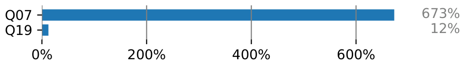

### 4.5 物理局部性

TPC-H 的数据生成存在排序和相关性。某些列与插入顺序、chunk 边界或其他列高度相关。Hyrise 的 chunk 统计信息可利用这种物理局部性跳过不可能匹配的 chunk。

22 条查询中有 7 条按 `lineitem.l_shipdate` 过滤，5 条按 `orders.o_orderdate` 过滤。若表按这些列聚簇，scan 可从线性搜索变为二分搜索；系统还可借助分区条件、zone map、小型物化聚合或 Hyrise 的 chunk 级 MinMax，在 scan 前直接跳过不可能命中的范围。`l_shipdate` 跨 83 个月，Q6 只选 12 个月，因此最多可在不访问任何行的情况下排除 85% 数据。

图 8 以 `tpch-dbgen` 原始顺序为基线，比较三种设置：打乱 `lineitem`、`orders`；按日期聚簇但禁止 DBMS 利用该信息；按日期聚簇并允许 partition pruning。打乱后 12 条查询至少下降 10%，说明原始数据并非随机，而按主键排序；这种次序会降低 sort join 的排序成本，也改善 hash join 查表的 DRAM cache 局部性。

仅聚簇却不暴露信息时效果有正有负：Q18 在未过滤的 `GROUP BY l_orderkey` 上失去原有局部性而变慢，按 `l_shipdate` 过滤的查询即便没有显式 pruning，也会因 cache 局部性更好、branch misprediction 更少而加速，总体大致抵消。允许访问规避后，收益超过 join/aggregate 局部性损失；Q6 排除 85% 数据，使吞吐提高三倍以上。Hyrise 在 scan、projection 上相对省时，在 join、aggregate 上花时偏多，原因是后两类算子物化了超过必要量的数据。

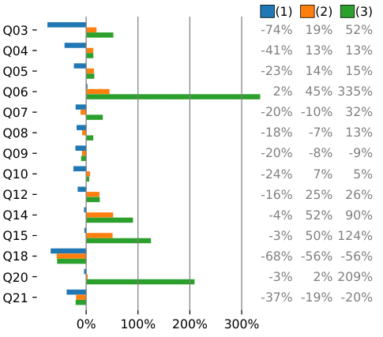

### 4.6 相关列

TPC-H 数据中存在列间相关性，例如日期、订单、行项目之间的关系。优化器如果能识别这些相关性，就可以得到更准确的基数估计或构造更有效过滤。论文提到，近期也有工作建议跨 join 利用这种相关性。

`l_shipdate` 与 `l_receiptdate` 最多相差 30 天。例如某个按 `l_shipdate` 聚簇的 chunk 范围是 1992-01-02 至 1992-04-08，则 `l_receiptdate` 必在 1992-01-04 至 1992-05-08；只查询此范围外值时，系统即使没有按 `l_receiptdate` 显式聚簇也可跳过该 chunk。TPC-H 禁止把相关性直接告诉 DBMS，却允许系统自行发现并利用；Hyrise 从各 segment 的 MinMax 统计中取得信息。

另一相关性是 `l_shipdate` 与 `l_returnflag`：当 `l_receiptdate <= 1995-06-17` 时 return flag 随机为 `R` 或 `A`，否则为 `N`。因此若一个 chunk 的 `l_shipdate > 1995-06-18`，查询 `l_returnflag='R'` 必无结果。Q10 可借此避免读取一半 `lineitem`。`o_orderstatus`、`l_linestatus` 也与聚簇日期有关，但 TPC-H 查询没有以可获益方式使用它们。图 9 显示，允许这种跨列推导后，Q10、Q12 分别明显提高 13%、10%。

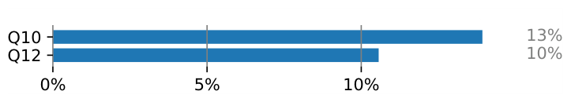

**表 1：chunk 大小为 100,000 行时的剪枝比例。** 数值会随随机查询参数略有变化；`n/a` 表示查询不访问相应表。

| Q | lineitem | orders | Q | lineitem | orders | Q | lineitem | orders |
| ---: | --- | --- | ---: | --- | --- | ---: | --- | --- |
| 1 | 3 / 600 | n/a | 9 | 0 / 600 | 0 / 150 | 17 | 0 / 600 | n/a |
| 2 | n/a | n/a | 10 | 300 / 600 | 143 / 150 | 18 | 0 / 600 | 0 / 150 |
| 3 | 277 / 600 | 76 / 150 | 11 | 0 / 600 | 0 / 150 | 19 | 0 / 600 | n/a |
| 4 | 0 / 600 | 143 / 150 | 12 | 501 / 600 | 0 / 150 | 20 | 508 / 600 | n/a |
| 5 | 0 / 600 | 126 / 150 | 13 | n/a | n/a | 21 | 0 / 600 | 71 / 150 |
| 6 | 508 / 600 | n/a | 14 | 591 / 600 | n/a | 22 | n/a | 0 / 150 |
| 7 | 417 / 600 | 0 / 150 | 15 | 576 / 600 | n/a | 平均 | 205 / 600 | 55 / 150 |
| 8 | 0 / 600 | 104 / 150 | 16 | n/a | n/a |  |  |  |

综合物理局部性与相关列，TPC-H 极适合 range-based access avoidance：查询访问 `lineitem` 或 `orders` 时，平均约三分之一数据无需读取，与 Nica 等人的结果一致。真实 ERP 负载也常随时间递增，事务与分析偏向近期数据；我们在 Global 2000 企业 ERP 中观察到这种模式，SAP 还报告中央财务系统依靠 partition pruning 获得 2–3 个数量级提升。相关性也可跨 join 利用：本地 pruning 后用剩余分区统计构造 join 列新谓词，再推到另一侧；相关研究称约一半查询可避免三分之一访问。我们质疑 TPC-H 主键与日期缺少相关性：若订单大致按日期进入，自动生成主键也应近似递增，这可避免实现者在 join 局部性和谓词局部性之间二选一。

### 4.7 子查询扁平化

子查询扁平化将嵌套子查询改写为连接或其他更容易优化的计划结构。TPC-H 中部分查询包含相关子查询；若不扁平化，系统可能需要反复执行子查询，产生巨大开销。

TPC-H 有 6 条相关子查询：Q2、Q4、Q17、Q20、Q21、Q22。最直接实现是严格按 SQL 语义，对外表每一行执行一次子查询；我们认为先实现这个正确但缓慢的版本，再逐步优化很有帮助。常见的 simple unnesting 会从子查询移除对外值的比较，让子查询一次返回所有外值对应结果，再用被移除谓词把它与外表连接。该方法适用于 `(NOT) IN`、`(NOT) EXISTS` 和 scalar subquery，只是 join predicate 不同，也能扁平化无相关的 `(NOT) IN`。Q21 还适合不同子查询类型的 coalescence，但 Hyrise 尚未实现；支持 `ALL` 或外层暂不可见相关属性的更一般方法，对 TPC-H 不必要。

这是影响最大的阻塞点。图 10 中 6 条查询缩短至少两个数量级：Q2、Q17、Q20 来自相关 scalar subquery，Q4、Q21、Q22 来自相关 `(NOT) EXISTS`。Q18 的收益来自把无相关 `IN` 改写为 join；Q15 虽无相关子查询，扁平化 scalar subquery 后允许子计划复用。具体影响取决于外层关系基数。

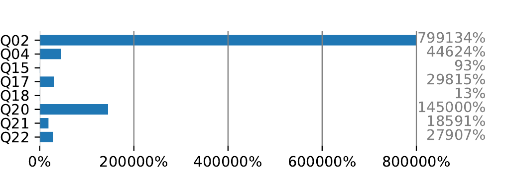

### 4.8 半连接归约

半连接归约通过移除不会匹配的行来降低后续连接输入。例如，在完整连接之前先用半连接筛掉一侧中不可能找到匹配的行。该优化可在不改变最终结果的前提下降低中间结果基数。

扁平化会把相关谓词从子查询移除。Q17 原本只对满足 `p_brand`、`p_container` 的每个 `part × lineitem` 组合计算 `0.2 * AVG(l_quantity)`；直接扁平化却在整张 `lineitem` 上聚合，最终使用不到 1% 的行。Hyrise 在聚合前加入 semi join，先删除后续不可能匹配的 `lineitem`。图 11 中 aggregate 输入从 60M 降至 60K，缩小 1,000 倍。

这种做法把同一 join 谓词提前重复应用，以缩小中间结果；它与执行引擎中的 join bloom filter 正交，二者组合优于任一单独使用，bloom filter 精度选择不在本文范围。Q4 也适用：`l_commitdate < l_receiptdate` 只把 `lineitem` 缩小不到 40%，而日期过滤后不到 5% 的 `orders` 合格；先用 semi join 按 `orders` 过滤，可显著减少昂贵谓词输入。

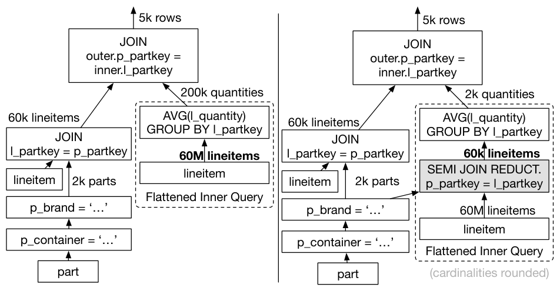

图 11 中两种计划的核心结构可简化为：

```sql
-- 原始结构：普通 join 后再 group by
JOIN
GROUP BY l_partkey

-- 优化结构：引入 semi join，先移除不会匹配的行
SEMI JOIN
JOIN
GROUP BY l_partkey
```

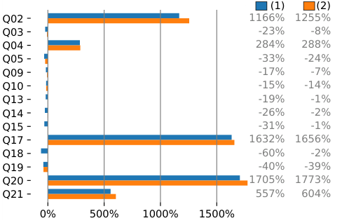

图 12 中 Q2、Q17、Q20 通过外部谓词过滤子查询表，Q4、Q21 则提前去掉后续不会匹配的行。如果对所有 join 无条件加入 semi join，9 条查询至少回退 10%；根据输入基数选择后，其中 6 条回退消失，剩余回退来自基数估计不准，而非方法本身。

Boncz 等人的替代方案是把外层谓词传播进子查询：Q17 需把过滤后的 `part` 再加入子查询、先与 `lineitem` 连接再聚合；Q2 可传播 `p_size`、`p_type`。我们人工改写 Q2、Q17、Q20，确认性能与 semi join reduction 无可区分。Hyrise 选择 semi join 有三点原因：只需加入一个已在去相关时识别的谓词；可像普通谓词一样估算和下推，不引入新连接排序问题；还能用于 Q4 这类非扁平化场景。不过，判断何时值得加入仍然困难。

### 4.9 子计划复用

Q2、Q11、Q15、Q17、Q21 的内外查询会使用同一中间结果。Q15 的 revenue view 同时用于求最高收入、筛出达到该收入的供应商；view 每次执行后删除，无论 DBMS 如何实现，都必须重新计算，而这占 Q15 超过 80% 成本。Q21 两个几乎相同的 `lineitem` 子查询在扁平化后可与外层 `lineitem` 共享 self join。重复还可出现在内外查询之外：Q7 的两份 `nation` 使用相同谓词。

TPC-H 中子计划语法相同，递归比较 LQP 子树即可发现；真实情况会更难，例如 `p_partkey=ps_partkey` 与交换两侧后的写法。若一个子树多一个谓词，两者不再逻辑相等，优化器需判断为了复用而把谓词拉出、撤销下推是否值得；若该谓词还改变了连接顺序，则需证明两个 join graph 等价。

Hyrise 的 column pruning 会过早删除未使用列，反而妨碍复用。Q21 一个子查询需要 `l_receiptdate`、`l_commitdate`，另一个不需要，剪枝后子树不再相同。图 13 因此给出两组实验：当前复用，以及关闭 column pruning 后暴露更多公共子计划；关闭剪枝造成多余投影，因此出现的回退不代表复用本身有害。Boncz 等人还报告 Q20 机会，可能源于把谓词复制进内层；Hyrise 使用 semi join，因而没有同样子计划。HyPer 报告去相关、selective join pushdown 与复用合计加速 500 倍；Hyrise 测得可比的 520 倍。

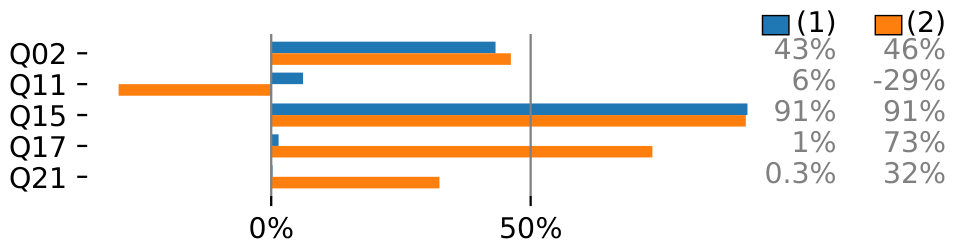

### 4.10 结果复用

除单次计划内复用外，DBMS 还可缓存整个查询结果。部分 TPC-H 查询参数空间很小：Q18 的 `l_quantity` 只从 312–315 四个整数中选择，执行四次并保存结果只需 7 KB；另一端 Q16 有 `1.6 × 10^16` 种变体，单次结果 28,232 B，完整缓存接近 400 EB。表 2 给出 SF=1 下参数数、变体数、验证结果、完整缓存、执行时间及估计收益。生产 DBMS 会使用结果缓存，但我们没有看到它影响研究界传播的 TPC-H 结果，因此这里只为完整性给出理论收益。

**表 2：TPC-H SF=1 查询的参数数、参数变体数、校验结果大小、完整缓存大小、执行时间与相对收益。**

| Q | Params | Variations | Result | Full Cache | Execution | Benefit |
| ---: | ---: | ---: | ---: | ---: | ---: | ---: |
| 1 | 1 | 61 | 2871 B | 171 KB | 1,654 s | 9,44 |
| 2 | 3 | 1250 | 2207 B | 2,6 MB | 0,113 s | 0,04 |
| 3 | 2 | 155 | 1836 B | 277,9 KB | 0,165 s | 0,58 |
| 4 | 1 | 58 | 1142 B | 64,7 KB | 0,357 s | 5,39 |
| 5 | 2 | 25 | 1130 B | 27,6 KB | 0,234 s | 8,28 |
| 6 | 3 | 80 | 716 B | 55,9 KB | 0,010 s | 0,17 |
| 7 | 2 | 600 | 1693 B | 992 KB | 0,642 s | 0,63 |
| 8 | 2 | 3750 | 977 B | 3,5 MB | 0,193 s | 0,05 |
| 9 | 1 | 92 | 15622 B | 1,4 MB | 0,641 s | 0,45 |
| 10 | 1 | 24 | 7697 B | 180,4 KB | 0,328 s | 1,78 |
| 11 | 1 | 25 | 9532 B | 232,7 KB | 0,040 s | 0,17 |
| 12 | 3 | 210 | 1185 B | 243 KB | 0,116 s | 0,47 |
| 13 | 1 | 16 | 1795 B | 28 KB | 0,444 s | 15,45 |
| 14 | 1 | 60 | 721 B | 42,2 KB | 0,022 s | 0,50 |
| 15 | 1 | 58 | 1561 B | 88,4 KB | 0,014 s | 0,15 |
| 16 | 1 | 1.6E16 | 4.5E20 B | 397,6 EB | 0,140 s | 0,00 |
| 17 | 2 | 1000 | 718 B | 701,2 KB | 0,715 s | 1,00 |
| 18 | 1 | 4 | 1784 B | 7 KB | 1,279 s | 179,22 |
| 19 | 6 | 15625000 | 716 B | 10,4 GB | 0,117 s | 0,00 |
| 20 | 3 | 11500 | 972 B | 10,7 MB | 0,368 s | 0,03 |
| 21 | 1 | 25 | 921 B | 22,5 KB | 0,889 s | 38,62 |
| 22 | 7 | 2.4E9 | 1472 B | 3321,3 GB | 0,076 s | 0,00 |

## 5. 逻辑算子阻塞点

前一节中的优化会改变计划结构并减少中间基数。本节讨论不改变算子输入输出基数、但降低算子逻辑复杂度的优化。

### 5.1 依赖 group-by 键

如果 group-by 列之间存在函数依赖，就可以移除冗余分组列。例如，如果某个键唯一决定另一个属性，则按两列分组与按决定列分组语义相同。移除依赖 group-by 键可以减少 hash 聚合键宽度和比较成本。

TPC-H Q10 按客户键及六个由它函数决定的客户属性分组：

```sql
GROUP BY c_custkey, c_name, c_acctbal, c_phone, n_name, c_address, c_comment
```

识别主键和外键给出的函数依赖后，优化器可缩减这些冗余 group-by 键，降低聚合键的宽度。

TPC-H 使用 SQL-92，要求聚合查询的输出列要么是聚合函数，要么出现在 `GROUP BY` 中。该优化适用于 Q3、Q10、Q18，但只有 Q10 显著提高 24%。Q3 的主要成本是几乎未过滤的 `lineitem` 与 `orders` 连接；Q18 先在未过滤 `lineitem` 上计算按 `l_partkey` 分组的 `SUM(l_quantity)`，包含函数依赖列的第二个 aggregate 在 SF 10 下只处理不到 1,000 行，缩短键的收益很小。

SQL-99 已允许输出函数依赖于 group-by 键的额外列，但 Oracle 11g 等系统仍不支持，因此这类查询模式仍存在。还可处理缺少主键的情况：Q5、Q7、Q9、Q10 按唯一且非空的 `n_name` 分组，Q21 按 `s_name` 分组；用整数 `s_suppkey` 替换 18 字符的 `s_name` 会缩小键。不过图 2 显示这些查询中 aggregate 占比低；即使 Q10 占 20%，`nation` 也只有 25 行，扩展优化没有明显收益。我们在其它负载见过收益，但把它作为 TPC-H 上的负面结果报告。

### 5.2 大 IN 子句

TPC-H 在 Q12 使用 2 个常量的 `IN`，Q16 使用 8 个，Q19 分别使用 2、4 个，Q22 使用 7 个。不采用 JIT 的 DBMS 有三种执行方式：通用解释器用双重循环逐输入值、逐列表项检查，最灵活但有虚函数等解释开销；把 `IN` 拆成多个析取谓词，使字典压缩 scan 等只能处理单谓词的优化生效，再合并 position list；或把列表哈希后用 semi join 探测，探测为 `O(1)`，但建表成本可能抵消收益，而且所有值必须类型一致。

这类谓词的一般形态为：

```sql
WHERE column IN (v1, v2, v3, ..., vn)
```

除逐项解释执行外，还可以拆成多个析取谓词，或把值列表构造成哈希表并通过 semi join 探测；最优策略取决于列表长度与输入规模。

我们在 SF 1 的 600 万行 `lineitem` 上，以最多 99 个 `l_suppkey` 值比较三种策略。列表不超过 3 个值时，析取优于通用解释器；约 30 个值后，semi join 的初始成本已摊薄，hash lookup 开始快于线性搜索。图 14 中阴影 `Auto` 线是 Hyrise 优化器自动选择的策略。

落到 TPC-H，只有 Q12、Q19 从析取改写获益。Q19 的 join、aggregate 成本压过 `p_type` 过滤，收益仅 3.5%；Q12 提高 60%，原因是用更高效 scan 替代解释式表达式求值器。Q19 的 `l_shipmode IN ('AIR','AIR REG')` 还能重写为 `l_shipmode='AIR'`：规范只定义七种运输方式，其中有 `REG AIR`、没有 `AIR REG`。拥有准确值域统计的优化器可删掉不可能值，使 Q19 整体吞吐再提高 12%；我们无法判断这是规范有意设置的优化机会，还是笔误。

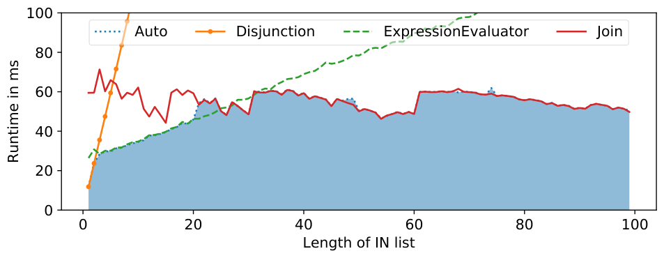

## 6. 总体影响与实现经验

### 6.1 阻塞点相关性

表 3 汇总了各阻塞点对 TPC-H 查询的相对性能影响。空白单元表示查询不受该阻塞点影响，`*` 表示相对变化小于 10%。

**表 3：阻塞点影响百分比。**

| Section | Choke point | 非空查询影响 | Mean | Boncz |
| --- | --- | --- | ---: | --- |
| 4.1 | Join Ordering | Q2 +76; Q3 *; Q4 *; Q5 +45; Q7 *; Q8 *; Q9 *; Q10 *; Q11 +52; Q12 *; Q13 *; Q14 *; Q15 *; Q16 *; Q17 *; Q18 *; Q19 *; Q20 *; Q21 *; Q22 * | +7 | 2.3 |
| 4.2 | Predicate Positioning | Q1 *; Q2 +361; Q3 +999; Q4 *; Q5 +715; Q6 +170; Q7 +2427; Q8 +6542; Q9 +1025; Q10 +559; Q11 +223; Q12 +1893; Q13 *; Q14 +4297; Q15 +21; Q16 +79; Q17 +103; Q18 +84; Q19 +7368; Q20 +576; Q21 -13; Q22 +25 | +396 | 4.2d |
| 4.3 | Between Composition | Q4 *; Q5 *; Q10 *; Q12 *; Q14 +13; Q15 +66; Q19 * | +3 | - |
| 4.4 | Predicate Duplication | Q7 +673; Q19 +12 | +10 | 4.2b |
| 4.5 | Physical Locality | Q1 *; Q3 +52; Q4 +13; Q5 +15; Q6 +335; Q7 +32; Q8 +13; Q9 *; Q10 *; Q11 *; Q12 +26; Q14 +90; Q15 +124; Q17 *; Q18 -56; Q19 *; Q20 +209; Q21 -20; Q22 * | +21 | 3.2 |
| 4.6 | Correlated Columns | Q10 +13; Q12 +10; Q22 * | +1 | 3.3 |
| 4.7 | Flattening Subqueries | Q2 +799134; Q4 +446; Q15 +93; Q17 +29815; Q18 +13; Q20 +145000; Q21 +18591; Q22 +27907 | +510 | 5.1 |
| 4.8 | Semi Join Reduction | Q2 +1255; Q3 *; Q4 +288; Q5 -24; Q7 *; Q8 *; Q9 *; Q10 -14; Q11 *; Q16 *; Q17 +1656; Q19 -39; Q20 +1773; Q21 +604 | +62 | - |
| 4.9 | Subplan Reuse | Q2 +46; Q11 *; Q15 +92; Q17 +73; Q21 +32 | +9 | 5.3 |
| 5.1 | Dependent group-by | Q3 *; Q10 +24; Q18 * | +1 | 1.4 |
| 5.2 | Large IN Clauses | Q12 +60; Q16 *; Q19 *; Q22 * | +2 | 4.2c |

总体上：

- 子查询扁平化和谓词放置影响最大。
- 连接排序对 Q2、Q17、Q21 等查询尤其关键。
- Q1、Q13、Q18 更依赖执行引擎效率，而非计划级优化。
- 物理局部性对 Q6、Q20 等查询很重要，尤其能减少早期数据访问。
- 某些优化只影响少数查询，最大收益有限，但实现成本低时仍然值得。

谓词下推与排序、子查询扁平化两项合计让 TPC-H 整体性能提高近 30 倍；其它所有优化合计不到 3 倍。最意外的是连接排序算法相关性很低，只有三条查询出现明显差别。优化潜力也极不均匀：Q2、Q4、Q17、Q20、Q21、Q22 仅靠子查询扁平化就提升至少两个数量级，是 TPC-H 最重要的单一计划变换；反过来，Q1、Q13、Q16、Q18 即使最显著优化也未让性能翻倍，这些查询的跨系统差异更可能来自运行时执行效率。

### 6.2 实现

为 TPC-H 实现优化时必须警惕基准缺少 SQL 边界情况。除 Q13 外，TPC-H 没有 NULL 和 outer join，且所有 join 都是 equi-join，很容易诱使开发者写出在 non-inner 或 non-equi join 加入后不再正确的计划变换。SQLite `sqllogictest` 与 SQLsmith 提供更全面测试；理想方案是把查询计划变换的自动等价验证集成进开发流程。

即使优化对 TPC-H 正确且有益，也不保证适用于其它基准或真实应用，尤其 TPC-H 数据分布过于均匀。开发者应补充 TPC-DS、JCC-H、Join Order Benchmark 或带倾斜的 Star Schema Benchmark，确认优化器能处理 skew。复杂优化还存在固定成本；分析型 TPC-H 中优化器成本很少占主导，不只面向分析负载的系统还应运行 TPC-C/TPC-E 等短查询事务负载，避免计划优化比执行本身更昂贵。

高效迭代要求尽量减少单轮 benchmark 的时间与步骤，包括缩短编译、便捷切换 scale factor、线程数、query stream 数，以及 isolated/mixed query execution。除 Hyrise 的 `hyriseBenchmarkTPCH` 外，我们认为 DuckDB benchmark suite 是良好范例；理想情况下，这些设施应由基准而非每个 DBMS 开发者重复提供。

还必须控制外部性能影响。CPU frequency scaling、后台进程等通常通过重复运行缓解，但另一些影响会跨多轮持续存在：一处代码修改会改变 binary 大小，让 hot loop 跨越页面边界；同一源码的增量重建与全新重建也可能因链接顺序变化而具有不同局部性和 cache 行为。在我们的 SIMD scan 极端案例中，这类差异让性能下降最多 10%。现有缓解方法已过时或难集成，因此我们呼吁编译器研究继续解决这一问题；当前可用 continuous benchmarking 区分离群点与真实回退，DuckDB 同样给出良好示范。

## 7. 相关工作

据我们所知，这是首次系统比较多个计划级阻塞点的影响，但单项优化已有研究。Neumann、Radke 比较 14 种连接排序算法的优化成本，结论是“TPC-H 对连接排序算法没有挑战”，与本文发现其相关性低一致。Hellerstein、Stonebraker 很早指出除谓词下推外，谓词次序也越来越重要；当时原因是 UDF 成本不同，列式内存系统中还受 CPU cache、position list 写入和 branch prediction 影响。Nica 等人研究物理局部性、partition pruning 与列相关性，并用同样方式聚簇 `lineitem`、`orders` 模拟企业数据老化；其剪枝比例相近，但并行执行中 cold storage 访问延迟成为瓶颈，难以兑现收益。

执行引擎阻塞点更难隔离，因为同一问题有多种实现且彼此耦合。例如算术算子性能可用向量化改善，解释器开销可用 JIT 改善，两者很难统一比较。Kersten 等人构建专用系统，在 Q1、Q3、Q6、Q9、Q18 上隔离比较编译和向量化，没有发现绝对占优方案。

数据库基准承担两个难兼容的目标：厂商比较需要尽量覆盖真实用例并防止投机捷径；研究比较则要求易实现、易复现。TPC-DS 几乎在每个维度都比 TPC-H 复杂，对四个匿名系统的资源分析显示其覆盖 CPU、内存、网络的广泛需求，但完整实现很难，少有论文跑全套；其它工作会因 SQL 特性缺失或优化不完整只选部分查询，被批评为以营销之名做不科学比较。

TPC 也承认其基准已经极难开发和运行，因而推出较易执行的 TPC Express 系列；TPCx-HS 在研究界仍不如 TPC-H/TPC-DS 普及。CH-benCHmark 结合 TPC-C 事务与 TPC-H 分析挑战。DBmbench 则用简化的 µTPC-C、µTPC-H 降低复杂度；它只保留三条查询，反映微架构挑战，却也移除了大多数计划级阻塞点，更适合直接比较执行引擎。

Vogelsgesang 等人首次把 TPC-H 阻塞点与真实数据集比较，发现列相关性等部分阻塞点较为 TPC-H 特有，同时确认大 `IN` 列表及另外两个执行侧阻塞点的重要性。本文的新增贡献是在统一实验设置中隔离多个逻辑阻塞点并量化影响。

## 8. 结论

本文用列式内存 DBMS Hyrise 定量分析了 TPC-H 中 11 个阻塞点。谓词放置平均把查询性能提高约 4 倍，子查询扁平化平均提高约 5.1 倍，是最重要的两项。收益分布并不均匀：Q2、Q17、Q21 在缺少优化时几乎无法执行，Q1、Q13、Q18 则几乎不受计划级优化影响。

了解各阻塞点的相关性，有助于解释基准特征并与真实负载比较，帮助尚无完整优化器的新系统安排开发优先级，也能在比较优化程度不同的系统时定位受影响查询。本文关注能尽早缩减基数的逻辑计划变换，预期其它 DBMS 会得出可比结论；我们还提供每项实验的源码修改以支持复现。

未来工作应分析 TPC-H 变体和更复杂基准，例如 TPC-DS；工业界也可以贡献真实应用的阻塞点分析。执行引擎层面的阻塞点跨系统可比性较弱，但在不同系统、规模因子和多线程策略下分析其影响，也能为开发者选择优化方向提供更扎实的数据基础。

## 致谢

我们感谢 TU Munich 数据库组提供 Umbra 的早期访问。

## 参考文献

- [1] D. J. Abadi, D. S. Myers, D. J. DeWitt, and S. Madden. Materialization strategies in a column-oriented DBMS. In Proceedings of the 23rd International Conference on Data Engineering, ICDE, pages 466-475, 2007.
- [2] American National Standards Institute. American National Standard for Information Systems, Database Language - SQL: ANSI X3.135-1992. 1992.
- [3] American National Standards Institute. American National Standard for Information Systems, Database Language - SQL: ANSI X3.135-1999. 1999.
- [4] S. Bellamkonda, R. Ahmed, A. Witkowski, A. Amor, M. Zaït, and C. C. Lin. Enhanced subquery optimizations in Oracle. PVLDB, 2(2):1366-1377, 2009.
- [5] P. A. Bernstein and D. W. Chiu. Using semi-joins to solve relational queries. Journal of the ACM, 28(1):25-40, 1981.
- [6] M. Boissier and M. Jendruk. Workload-driven and robust selection of compression schemes for column stores. In Proceedings of the 22nd International Conference on Extending Database Technology, EDBT, pages 674-677, 2019.
- [7] M. Boissier, C. A. Meyer, T. Djürken, J. Lindemann, K. Mao, P. Reinhardt, T. Specht, T. Zimmermann, and M. Uflacker. Analyzing data relevance and access patterns of live production database systems. In Proceedings of the 25th ACM International Conference on Information and Knowledge Management, CIKM, pages 2473-2475, 2016.
- [8] P. A. Boncz, A. Anatiotis, and S. Kläbe. JCC-H: adding join crossing correlations with skew to TPC-H. In Performance Evaluation and Benchmarking for the Analytics Era - 9th TPC Technology Conference. Revised Selected Papers, TPCTC, pages 103-119, 2017.
- [9] P. A. Boncz, M. L. Kersten, and S. Manegold. Breaking the memory wall in MonetDB. Communications of the ACM, 51(12):77-85, 2008.
- [10] P. A. Boncz, S. Manegold, and M. L. Kersten. Database architecture optimized for the new bottleneck: memory access. In Proceedings of the 25th International Conference on Very Large Data Bases, VLDB, pages 54-65, 1999.
- [11] P. Boncz, T. Neumann, and O. Erling. TPC-H analyzed: hidden messages and lessons learned from an influential benchmark. In Performance Characterization and Benchmarking - 5th TPC Technology Conference. Revised Selected Papers, TPCTC, pages 61-76, 2014.
- [12] J. Chen and J. Revels. Robust benchmarking in noisy environments. CoRR, abs/1608.04295, 2016. arXiv:1608.04295.
- [13] S. Chu, C. Wang, K. Weitz, and A. Cheung. Cosette: an automated prover for SQL. In 8th Biennial Conference on Innovative Data Systems Research, Online Proceedings, CIDR, 2017.
- [14] S. Chu, K. Weitz, A. Cheung, and D. Suciu. HoTTSQL: Proving Query Rewrites with Univalent SQL Semantics. In Proceedings of the 38th ACM SIGPLAN Conference on Programming Language Design and Implementation, PLDI, pages 510-524, 2017.
- [15] R. L. Cole, F. Funke, L. Giakoumakis, W. Guy, A. Kemper, S. Krompass, H. A. Kuno, R. O. Nambiar, T. Neumann, M. Poess, K. Sattler, M. Seibold, E. Simon, and F. Waas. The mixed workload CH-benCHmark. In Proceedings of the Fourth International Workshop on Testing Database Systems, DBTest, 2011.
- [16] C. Curtsinger and E. D. Berger. STABILIZER: Statistically Sound Performance Evaluation. In Architectural Support for Programming Languages and Operating Systems, ASPLOS, pages 219-228, 2013.
- [17] M. Dreseler, J. Kossmann, M. Boissier, S. Klauck, M. Uflacker, and H. Plattner. Hyrise re-engineered: an extensible database system for research in relational in-memory data management. In Proceedings of the 22nd International Conference on Extending Database Technology, EDBT, pages 313-324, 2019.
- [18] M. Dreseler, J. Kossmann, J. Frohnhofen, M. Uflacker, and H. Plattner. Fused table scans: combining AVX-512 and JIT to double the performance of multi-predicate scans. In 34th IEEE International Conference on Data Engineering Workshops, ICDE Workshops, pages 102-109, 2018.
- [19] G. M. Essertel, R. Y. Tahboub, J. M. Decker, K. J. Brown, K. Olukotun, and T. Rompf. Flare: optimizing Apache Spark with native compilation for scale-up architectures and medium-size data. In 13th USENIX Symposium on Operating Systems Design and Implementation, OSDI, pages 799-815, 2018.
- [20] L. Fegaras. A new heuristic for optimizing large queries. In Proceedings of the 9th International Conference on Database and Expert Systems Applications, DEXA, pages 726-735, 1998.
- [21] A. Floratou, F. Özcan, and B. Schiefer. Benchmarking SQL-on-Hadoop systems: TPC or not TPC? In Big Data Benchmarking - 5th International Workshop. Revised Selected Papers, WBDB, pages 63-72, 2014.
- [22] S. Halfpap and R. Schlosser. Workload-driven fragment allocation for partially replicated databases using linear programming. In Proceedings of the 35th International Conference on Data Engineering, ICDE, pages 1746-1749, 2019.
- [23] D. Inkster, M. Zukowski, and P. A. Boncz. Integration of VectorWise with Ingres. SIGMOD Record, 40(3):45-53, 2011.
- [24] R. Johnson, N. Hardavellas, I. Pandis, N. Mancheril, S. Harizopoulos, K. Sabirli, A. Ailamaki, and B. Falsafi. To share or not to share? In Proceedings of the 33rd International Conference on Very Large Data Bases, VLDB, pages 351-362, 2007.
- [25] A. Kemper and T. Neumann. HyPer: A hybrid OLTP & OLAP main memory database system based on virtual memory snapshots. In Proceedings of the 27th International Conference on Data Engineering, ICDE, pages 195-206, 2011.
- [26] T. R. Kepe, E. C. de Almeida, and M. A. Z. Alves. Database processing-in-memory: an experimental study. PVLDB, 13(3):334-347, 2019.
- [27] T. Kersten, V. Leis, A. Kemper, T. Neumann, A. Pavlo, and P. A. Boncz. Everything you always wanted to know about compiled and vectorized queries but were afraid to ask. PVLDB, 11(13):2209-2222, 2018.
- [28] V. Leis, P. A. Boncz, A. Kemper, and T. Neumann. Morsel-Driven Parallelism: A NUMA-Aware Query Evaluation Framework for the Many-Core Age. In International Conference on Management of Data, SIGMOD, pages 743-754, 2014.
- [29] V. Leis, A. Gubichev, A. Mirchev, P. A. Boncz, A. Kemper, and T. Neumann. How good are query optimizers, really? PVLDB, 9(3):204-215, 2015.
- [30] Y. Li and J. M. Patel. WideTable: an accelerator for analytical data processing. PVLDB, 7(10):907-918, 2014.
- [31] G. Moerkotte. Small materialized aggregates: A light weight index structure for data warehousing. In Proceedings of the 24rd International Conference on Very Large Data Bases, VLDB, pages 476-487, 1998.
- [32] G. Moerkotte and T. Neumann. Analysis of two existing and one new dynamic programming algorithm for the generation of optimal bushy join trees without cross products. In Proceedings of the 32nd International Conference on Very Large Data Bases, VLDB, pages 930-941, 2006.
- [33] T. Mytkowicz, A. Diwan, M. Hauswirth, and P. F. Sweeney. Producing Wrong Data Without Doing Anything Obviously Wrong! In Proceedings of the 14th International Conference on Architectural Support for Programming Languages and Operating Systems, ASPLOS, pages 265-276, 2009.
- [34] R. O. Nambiar and M. Poess. Keeping the TPC relevant! PVLDB, 6(11):1186-1187, 2013.
- [35] R. O. Nambiar and M. Poess. The making of TPC-DS. In Proceedings of the 32nd International Conference on Very Large Data Bases, VLDB, pages 1049-1058, 2006.
- [36] R. O. Nambiar, M. Poess, A. Dey, P. Cao, T. Magdon-Ismail, D. Q. Ren, and A. Bond. Introducing TPCx-HS: the first industry standard for benchmarking big data systems. In Performance Characterization and Benchmarking. Traditional to Big Data - 6th TPC Technology Conference. Revised Selected Papers, TPCTC, pages 1-12, 2014.
- [37] T. Neumann. Engineering high-performance database engines. PVLDB, 7(13):1734-1741, 2014.
- [38] T. Neumann and M. J. Freitag. Umbra: A disk-based system with in-memory performance. In 10th Conference on Innovative Data Systems Research, Online Proceedings, CIDR, 2020.
- [39] T. Neumann and A. Kemper. Unnesting arbitrary queries. In Datenbanksysteme für Business, Technologie und Web, BTW, pages 383-402, 2015.
- [40] T. Neumann and B. Radke. Adaptive optimization of very large join queries. In Proceedings of the 2018 International Conference on Management of Data, SIGMOD, pages 677-692, 2018.
- [41] A. Nica, R. Sherkat, M. Andrei, X. Chen, M. Heidel, C. Bensberg, and H. Gerwens. Statisticum: data statistics management in SAP HANA. PVLDB, 10(12):1658-1669, 2017.
- [42] K. Ono and G. M. Lohman. Measuring the complexity of join enumeration in query optimization. In Proceedings of the 16th International Conference on Very Large Data Bases, VLDB, pages 314-325, 1990.
- [43] L. Orr, S. Kandula, and S. Chaudhuri. Pushing data-induced predicates through joins in big-data clusters. PVLDB, 13(3):252-265, 2019.
- [44] M. Poess, R. O. Nambiar, and D. Walrath. Why you should run TPC-DS: A workload analysis. In Proceedings of the 33rd International Conference on Very Large Data Bases, VLDB, pages 1138-1149, 2007.
- [45] M. Poess, T. Rabl, and H. Jacobsen. Analysis of TPC-DS: the first standard benchmark for SQL-based big data systems. In Proceedings of the 2017 Symposium on Cloud Computing, SOCC, pages 573-585, 2017.
- [46] M. Raasveldt, P. Holanda, T. Gubner, and H. Mühleisen. Fair Benchmarking Considered Difficult: Common Pitfalls In Database Performance Testing. In 7th International Workshop on Testing Database Systems, DBTest, 2:1-2:6, 2018.
- [47] M. Raasveldt and H. Mühleisen. DuckDB: an embeddable analytical database. In Proceedings of the 2019 International Conference on Management of Data, SIGMOD, pages 1981-1984, 2019.
- [48] T. Rabl, M. Poess, H. Jacobsen, P. E. O'Neil, and E. J. O'Neil. Variations of the Star Schema Benchmark to Test the Effects of Data Skew on Query Performance. In ACM/SPEC International Conference on Performance Engineering, ACPE, pages 361-372, 2013.
- [49] K. A. Ross. Conjunctive selection conditions in main memory. In Proceedings of the 21st ACM SIGACT-SIGMOD-SIGART Symposium on Principles of Database Systems, pages 109-120, 2002.
- [50] R. Schlosser, J. Kossmann, and M. Boissier. Efficient scalable multi-attribute index selection using recursive strategies. In Proceedings of the 35th International Conference on Data Engineering, ICDE, pages 1238-1249, 2019.
- [51] D. Schwalb, M. Faust, J. Wust, M. Grund, and H. Plattner. Efficient transaction processing for Hyrise in mixed workload environments. In Proceedings of the 2nd International Workshop on In Memory Data Management and Analytics, IMDM, pages 16-29, 2014.
- [52] M. Shao, A. Ailamaki, and B. Falsafi. DBmbench: fast and accurate database workload representation on modern microarchitecture. In Proceedings of the 2005 Conference of the Centre for Advanced Studies on Collaborative Research, pages 254-267, 2005.
- [53] E. Simon. Predicate migration: optimizing queries with expensive predicates. ACM SIGMOD Digital Review, 2, 2000.
- [54] K. Stocker, D. Kossmann, R. Braumandi, and A. Kemper. Integrating Semi-Join-Reducers into State-of-the-Art Query Processors. In Proceedings of the 17th International Conference on Data Engineering, ICDE, pages 575-584, 2001.
- [55] Transaction Processing Performance Council. TPC Benchmark H (Decision Support) - Standard Specification. 1993.
- [56] A. Vogelsgesang, M. Haubenschild, J. Finis, A. Kemper, V. Leis, T. Muehlbauer, T. Neumann, and M. Then. Get real: how benchmarks fail to represent the real world. In Proceedings of the Workshop on Testing Database Systems, DBTest'18, 1:1-1:6, 2018.
- [57] Y. Wu, J. Arulraj, J. Lin, R. Xian, and A. Pavlo. An empirical evaluation of in-memory multi-version concurrency control. PVLDB, 10(7):781-792, 2017.
- [58] M. Ziauddin, A. Witkowski, Y. J. Kim, J. Lahorani, D. Potapov, and M. Krishna. Dimensions based data clustering and zone maps. PVLDB, 10(12):1622-1633, 2017.
