# ACORN: Performant and Predicate-Agnostic Search Over Vector Embeddings and Structured Data（中文译文）

## 译者说明

本文依据同目录的 `source.pdf` 翻译。章节、图表、公式、算法、代码与参考文献按原文结构保留。

Liana Patel<br>
Stanford University，Stanford, USA<br>
lianapat@stanford.edu

Peter Kraft<br>
DBOS, Inc.，USA<br>
peter.kraft@dbos.dev

Carlos Guestrin<br>
Stanford University，Stanford, USA<br>
guestrin@stanford.edu

Matei Zaharia<br>
UC Berkeley，Berkeley, USA<br>
matei@berkeley.edu

arXiv:2403.04871v1 [cs.IR]，2024 年 3 月 7 日

## 摘要

越来越多的应用使用混合模态数据，必须联合搜索向量数据（例如嵌入后的图像、文本和视频）以及结构化数据（例如属性和关键词）。针对这种混合搜索场景，已有方法要么性能不佳，要么只能支持限制极严的搜索谓词集合（例如很小的等值谓词集合），因而难以用于许多实际应用。为此，我们提出 ACORN，一种高性能、谓词无关的混合搜索方法。

ACORN 建立在分层可导航小世界（Hierarchical Navigable Small World，HNSW）之上；HNSW 是一种先进的、基于图的近似最近邻索引，只需扩展现有 HNSW 库即可高效实现 ACORN。ACORN 提出谓词子图遍历，以模拟一种理论上理想、但实际不可行的混合搜索策略。ACORN 的谓词无关构建算法旨在支持这种有效的搜索策略，同时兼容范围广泛的谓词集合与查询语义。我们在两类数据集上系统评估 ACORN：一类是已有基准，其谓词集合简单且基数低；另一类是以往方法无法支持的复杂多模态数据集。我们表明，ACORN 在所有数据集上都达到先进性能；在固定召回率下，其吞吐量比以往方法高 2–1,000 倍。

**CCS 概念：** 信息系统 → 信息检索查询处理；数据结构。

**关键词：** 向量搜索；近似最近邻搜索；混合搜索

## 1. 引言

得益于现代深度学习模型强大的表示能力，向量嵌入已成为一种功能强大的一等数据类型，广泛用于检索增强生成 [3, 65] 和基于相似度的搜索 [18, 21, 42]。因此，向量数据库和向量索引正在越来越多的生产场景中得到采用。这些系统为嵌入后的非结构化数据（例如图像、文本、视频或用户画像）提供高效的近似最近邻（approximate nearest neighbor，ANN）搜索接口。

然而，许多应用必须联合查询非结构化数据与结构化数据，因此需要把 ANN 搜索和谓词过滤结合起来。例如，电子商务网站的顾客可以搜索与参考图片相似的 T 恤，同时按价格过滤 [64]。同样，做文献综述的研究人员可能同时使用自然语言查询，以及针对发表日期、关键词或主题的过滤条件 [54]。又如，数据科学家在做离群点检测时，可以检索看起来像参考犬类图像、却被标成“cat”的图片，从而找到误分类图像 [2, 7]。

为了利用多样的数据模态，应用需要能有效支持混合搜索查询的数据管理系统，也就是把相似度搜索与结构化谓词结合起来。这样的系统需要：

1. **查询性能：** 即使工作负载特征发生变化，例如选择率、属性相关性和数据规模变化，也能高效、准确地搜索；
2. **有表达力的查询语义：** 支持事先可能并不知道的各种查询谓词，例如用户输入的关键词、范围搜索或正则表达式匹配。

遗憾的是，现有系统并未达到这些目标。三种常用方法是预过滤 [62, 64]、后过滤 [1, 5, 62, 64, 67]，以及面向低基数谓词集合的专用数据结构 [25, 49, 63, 66]。预过滤先找出数据集中所有通过查询谓词的记录，再对过滤后的向量集合执行暴力相似度搜索。这种方法的扩展性很差：面对大数据集上中等到高选择率的谓词时，效率会很低。后过滤则先搜索 ANN 索引，再删除不满足查询谓词的结果。由于最接近查询向量的数据库向量未必通过谓词，后过滤通常必须扩大搜索范围，代价往往很高；当搜索谓词的选择率低，或与查询向量的相关性低时尤其如此，我们将在图 2 中展示这一点。Milvus [62]、Weaviate [1]、AnalyticDB-V [64] 和 FAISS-IVF [5] 都围绕这两种基本方法构建系统，也都受到相应性能限制。

认识到这些限制之后，近期工作开始为混合搜索负载构建专用索引，所针对的是由等值谓词组成的低基数谓词集合。例如，Filtered-DiskANN [25] 的性能优于以往基线，但它把谓词集合基数限制在约 1,000，只支持等值谓词。HQANN [66] 和 NHQ [12] 同样把谓词集合限制为少量等值过滤条件，并且每条数据记录只允许有一个结构化属性。这些方法在许多应用中并不实用，因为应用的谓词集合可能很大甚至无界，而且在构建索引时尚不可知。一般而言，可能谓词集合的基数会随各属性自身基数呈指数增长。因此，我们转而提出一种谓词无关索引，它可以支持任意且无界的谓词集合。

我们提出 ACORN（ANN Constraint-Optimized Retrieval Network），一种高性能、谓词无关的混合搜索新方法，可服务高基数和无界谓词集合。我们提出两个索引：ACORN-γ 面向高效搜索，ACORN-1 面向资源受限场景中的低构建开销。两者都修改了 HNSW 索引；HNSW 是先进的、基于图的 ANN 索引，而这两种方法都很容易在现有 HNSW 库中实现。

ACORN 同时应对预过滤和后过滤的性能限制，以及专用索引的语义限制。ACORN 的核心思想是在搜索期间遍历谓词子图。顾名思义，搜索策略遍历 ACORN 索引中由所有满足查询谓词的节点所诱导的子图。ACORN 对索引的设计使这些任意谓词子图可以近似一个 HNSW 索引。与预过滤和后过滤不同，这使 ACORN 在查询向量与谓词之间的相关性发生变化时仍能提供次线性检索时间；我们发现，这种相关性变化是已有混合搜索系统面临的一项主要挑战。

ACORN 还通过谓词无关构建支持范围广泛的谓词集合：它修改 HNSW 算法，建立更稠密的图。具体而言，我们在 ACORN-γ 中提出一种谓词无关邻居扩展策略，它以目标谓词选择率阈值为依据；无论是否预先知道谓词集合，都可以用经验方法估计这些阈值。与之配套，我们提出一种谓词无关压缩启发式，在保持高效搜索的同时有效控制索引空间占用。我们还探索了搜索性能与构建开销之间的权衡空间，并设计 ACORN-1：它近似 ACORN-γ 的搜索性能，同时进一步降低资源受限场景下的建索引时间（time-to-index，TTI）和空间占用。

我们在四个数据集上系统评估 ACORN-γ 和 ACORN-1：SIFT1M [35]、Paper [63]、LAION [55] 与 TripClick [54]。我们的评估既包括以往的基准数据集——它们采用简单、低基数的谓词集合，已有专用索引可以处理——也包括拥有数百万个可能谓词、现有索引无法处理的更复杂数据集。在每个数据集上，与以往方法相比，ACORN-γ 在召回率为 0.9 时都取得了高 2–1,000 倍的每秒查询数（QPS），达到先进的混合搜索性能。具体而言，ACORN 在以往基准上的 QPS 高 2–10 倍，在新基准上高 30 倍以上；当扩展到 2,500 万个向量时，QPS 高 1,000 倍以上。

我们发现，ACORN-1 在经验上可以近似 ACORN-γ：固定召回率下，它的 QPS 最多低 5 倍，但 TTI 比 ACORN-γ 低 9–53 倍。我们的详细评估证明了 ACORN 谓词子图遍历策略和谓词无关构建技术的有效性。

## 2. 背景

现有近似最近邻（ANN）搜索方法大体可分为基于树的方法 [15–17, 19, 28, 45, 50, 56]、基于哈希的方法 [9–11, 24, 26, 29, 30, 40, 41, 44, 46, 52, 59, 69]、基于量化的方法 [23, 27, 34, 35, 39] 和基于图的方法 [22, 25, 32, 47, 48, 58, 68]。本文建立在 HNSW 之上。HNSW 是一种基于图的方法，在高维数据集上的经验性能名列前茅；我们对其加以改造以支持混合搜索。

基于图的 ANN 方法凭借在各种 ANN 基准上的先进性能而日益流行 [13, 57]。这类方法通常从预定义入口点出发，采用贪心路由策略遍历图索引。索引本身构成一个邻近图 $G(V,E)$：数据集中的每个数据点对应一个顶点，彼此接近的数据点之间以边相连。索引构建算法通常试图近似 Delaunay 图的子图 [38]。Delaunay 图可以保证贪心路由算法收敛，但对于任意度量空间，不可能高效构建 [51]。因此，图方法主要关注更易处理的 Delaunay 子图近似，例如相对邻域图（Relative Neighbor Graph，RNG）[37, 60] 和最近邻图（Nearest-Neighbor Graph，NNG）[8, 20]。

### 2.1 分层可导航小世界

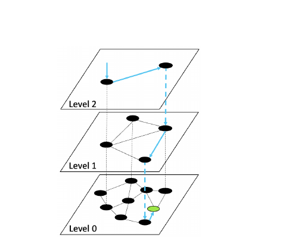

*图 1：HNSW 索引上的搜索示意图。蓝色箭头表示搜索路径；搜索从第 2 层开始，在第 0 层的查询点结束，查询点以绿色表示。*

如图 1 所示，HNSW 构成一个度数有界的分层多级图索引。下面我们简要概述 HNSW 的搜索与构建算法。

**HNSW 构建算法。** 构建算法逐个向图索引插入数据点，以建立由参数 $M$ 指定度数上界的可导航图。对于每个待插入元素 $v$，算法先从按指数衰减、并由常数 $m _ L=1/\ln(M)$ 归一化的概率分布中随机选择最大层号 $l$。这种层分配概率保证预期特征路径长度随层号增加。直观地说，最上层包含最长距离的链接，搜索算法首先遍历这些链接；最下层包含最短距离的链接，搜索算法最后遍历它们。

随后，插入过程分两阶段进行。第一阶段从顶层开始执行贪心搜索，逐层向下直到第 $l+1$ 层；入口是一个预定义入口点。在这些层的每一层，贪心子程序选出一个节点，作为下一层的入口点。第二阶段则从第 $l$ 层遍历到第 0 层。此时，每层的贪心搜索选择 $ef _ c$ 个节点作为候选边，再由一种基于 RNG 的剪枝算法 [31] 从中选出至多 $M$ 个，作为 $v$ 的邻居。在第 0 层，度数上界提升为 $2M$；经验表明，这可以改善性能。

**HNSW 搜索算法。** 搜索从多层图最上层的预定义入口点开始遍历，如图 1 所示，然后采用迭代搜索策略逐层向下。在每一层，贪心搜索选出一个节点，作为下一层的入口点。到达最下层后，搜索算法不再只贪心选择一个节点，而是贪心选择要返回的 $K$ 个最近元素。我们在算法 1 中概述了这一过程。搜索参数 $ef _ s$ 控制最下层贪心搜索期间所保存动态候选列表的大小，从而在搜索质量与效率之间取舍。

**算法 1：HNSW-ANN-SEARCH($x _ q, K, ef _ s$)**

```text
输入：查询向量 x_q；要返回的最近邻数量 K；动态候选列表大小 ef_s
输出：距 x_q 最近的 K 个元素

e ← HNSW 图的入口点
W ← ∅                         // 当前最近邻集合
L ← level(e)                  // HNSW 顶层
for l ← L ... 1 do
    e ← SEARCH-LAYER(x_q, e, ef = 1, l)
end
W ← SEARCH-LAYER(x_q, e, ef = ef_s, l = 0)
return W 中距 x_q 最近的 K 个元素
```

## 3. 问题定义与挑战

本节中，我们形式化定义混合搜索场景，再分析现有谓词无关方法——即预过滤和后过滤——所面临的性能挑战。我们的分析使我们开始考察几个重要的工作负载特征，具体包括谓词选择率、数据集大小和查询相关性。我们将引入并形式化定义查询相关性，同时说明它为何是后过滤方法的一项主要挑战。

我们将在第 4 节利用我们对现有性能挑战的理解，构造一种理论上理想的混合搜索方案；第 7 节我们再回到本节讨论的工作负载特征，对 ACORN 的搜索性能进行严格评估。

### 3.1 混合搜索定义

设数据集

$$
D=\lbrace e _ 1,e _ 2,\ldots,e _ n\rbrace
=\lbrace (x _ 1,a _ 1),(x _ 2,a _ 2),\ldots,(x _ n,a _ n)\rbrace
$$

由 $n$ 个实体组成。每个实体 $e _ i$ 都关联一个向量分量 $x _ i\in\mathbb{R}^d$ 和一个结构化属性元组 $a _ i$。令 $X=\lbrace x _ 1,x _ 2,\ldots,x _ n\rbrace$ 表示数据集中的向量集合， $\mathrm{dist}(a,b)$ 表示任意两点间的度量距离；令 $A=\lbrace a _ 1,a _ 2,\ldots,a _ n\rbrace$ 表示数据集中的结构化属性集合。对于给定谓词 $p$，我们将以 $X _ p\subseteq X$ 表示数据集中满足 $p$ 的实体所对应的向量子集。我们把谓词 $p$ 的选择率 $s$ 定义为 $D$ 中满足该谓词的实体比例，其中 $0\leq s\leq 1$。

我们考虑如下混合搜索问题。给定数据集 $D$、目标数量 $K$ 和查询 $q=(x _ q,p _ q)$，其中 $x _ q\in\mathbb{R}^d$、 $p _ q$ 是谓词，检索 $x _ q$ 的、满足谓词 $p _ q$ 的 $K$ 个最近邻。我们尤其关注相对于 $x _ q$ 的近似最近邻搜索，我们的目标是同时最大化搜索准确率和搜索效率。我们用下式度量准确率：

$$
\mathrm{recall@}K=\frac{|G\cap R|}{K},
$$

其中 $G$ 是满足 $p _ q$ 且距 $x _ q$ 最近的 $K$ 个真实邻居集合， $R$ 是检索所得集合。

### 3.2 基线方法的搜索性能

下面我们分析两种主要基线方法——预过滤和后过滤——的搜索复杂度，并考察工作负载特征变化如何影响其搜索行为。在我们的分析中，我们作出一项标准假设：距离计算支配搜索性能。我们注意到，HNSW 的无过滤搜索复杂度为 $O(\log(n)+K)$。

预过滤线性扫描 $X _ p$，为每个满足搜索谓词的数据点计算距离。因此，它的混合搜索复杂度为

$$
O(|X _ p|)=O(sn+K).
$$

预过滤始终能达到完美召回率，但其搜索复杂度面对大数据集或高选择率时扩展很差：它会随任一变量线性增长。

后过滤则在 $X$ 上执行 ANN 搜索，先找出最接近 $x _ q$ 的向量，再扩大搜索范围，直至找到满足查询谓词 $p$ 的 $K$ 个向量。直观而言，搜索性能取决于查询向量与 $X _ p$ 中向量之间的相关性。当 $X _ p$ 中的向量靠近查询向量时，在 HNSW 上后过滤的搜索复杂度为 $O(\log(n)+K)$。若 $X _ p$ 中的向量均匀分布在 $X$ 中，后过滤的预期搜索复杂度为 $O(\log(n)+K/s)$。但 $X _ p$ 中的向量也可能远离查询向量，搜索性能最坏会达到 $O(n)$。

我们由此看到，两种基线方法的搜索性能面对选择率、数据集大小和查询相关性的变化都不稳健。我们将在第 7 节（图 9、图 10）用实验验证这些限制。

#### 3.2.1 查询相关性的形式化定义

现在我们形式化定义查询相关性；我们发现，它是基于后过滤的系统面临的一项关键挑战。如图 2 所示，当 $X _ p$ 中的向量并非均匀分布于 $X$，而是相对于 $X$ 中其他向量聚集在一起时，就出现了查询相关性。我们把这种现象称为**谓词聚集**（predicate clustering）。谓词聚集发生时，查询向量可能靠近包含其搜索目标的谓词簇，也可能远离该簇，由此形成查询相关性。

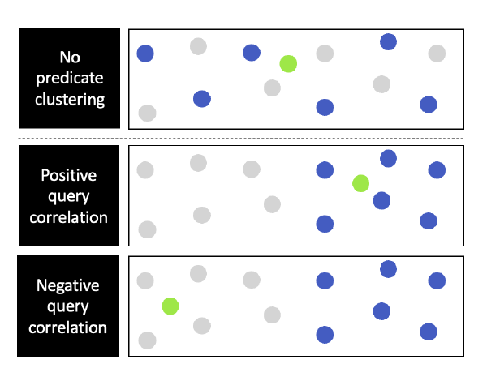

*图 2：无谓词聚集的数据集（上）；存在谓词聚集且查询正相关的数据集（中）；存在谓词聚集且查询负相关的数据集（下）。深蓝色圆点表示通过谓词的数据点，浅灰色圆点表示不通过谓词的数据点，绿色表示查询向量。*

**定义：查询相关性。** 对给定数据集，我们把查询到目标的距离与假想无聚集数据集上的预期查询到目标距离进行比较。形式化地，数据集 $D$ 上混合搜索工作负载 $Q$ 的查询相关性定义为：

$$
C(D,Q)=
\mathbb{E} _ {(x _ i,p _ i)\in Q}
\left[
\mathbb{E} _ {R _ i}\left[g(x _ i,R _ i)\right]
-g(x _ i,X _ {p _ i})
\right].
$$

对于每个混合查询 $(x _ i,p _ i)\in Q$，我们令 $R _ i$ 为一个随机集合变量：它包含从 $X$ 中均匀抽取的 $|X _ {p _ i}|$ 个向量。我们定义

$$
g(x,S)=\min _ {y\in S}\mathrm{dist}(x,y),
$$

即函数 $g$ 把查询向量 $x$ 映射到它与给定向量集合 $S\subseteq\mathbb{R}^d$ 中邻居的最小距离。注意， $g(x _ i,X _ {p _ i})$ 是查询 $(x _ i,p _ i)$ 的真实混合搜索目标。

如果平均而言，查询向量到真实混合搜索目标数据集 $X _ {p _ i}$ 中目标的距离，比到无聚集数据集 $R _ i$ 中目标的距离更近，则该工作负载具有**查询正相关**；反之则具有**查询负相关**。我们也可以在上述定义中用最近邻距离代替度量距离。此外，我们还注意到，我们只需对 $K$ 个搜索目标的距离求和，就能很容易把定义从一个混合搜索目标扩展到 $K$ 个目标。

## 4. 使用 HNSW 的理论理想混合搜索性能

对于给定的混合搜索查询，我们把使用 HNSW 数据结构时的理论理想搜索性能定义为：如果我们在构建阶段就知道搜索谓词 $p _ q$，所能达到的性能。此时，我们可以在 $X _ p$ 上建立一个 HNSW 索引。我们称其为该查询的**预言机分区索引**（oracle partition index）。搜索这一索引的复杂度为

$$
O _ s(\log(sn)+K).
$$

值得注意的是，谓词选择率、数据规模和查询相关性发生变化时，预言机分区索引的搜索性能都优于预过滤和后过滤。预过滤的搜索规模随 $|X _ p|$ 线性增长，而预言机分区上的搜索随 $|X _ p|$ 次线性增长。预言机分区面对查询相关性变化也很稳健：它不需要像后过滤那样扩大搜索范围。

尽管预言机分区索引具有理想的搜索性能，它却要求我们预先知道所有搜索谓词，并为每个谓词建立一个完整的 HNSW 索引。实践中无法构建这种索引，因为查询谓词集合在构建时往往未知，而且基数很高甚至无界。为每个谓词建立一个 HNSW 索引，会耗费无法接受的空间与时间。因此，在本文中，我们并不显式构建预言机分区索引，而是为某个具体查询近似该索引上的搜索。

## 5. ACORN 概述

下面我们介绍 ACORN，一种达到先进性能的谓词无关混合搜索方法。我们提出两个变体：ACORN-γ（5.1、5.2 节）与 ACORN-1（5.3 节）。我们设计 ACORN-γ 以实现高效搜索；设计 ACORN-1 以在近似 ACORN-γ 搜索性能的同时，进一步降低资源受限场景下的 TTI 与空间占用。

ACORN 的核心思想是搜索索引的谓词子图，即对于给定搜索谓词 $p$，由 $X _ p$ 所诱导的子图，如图 3 所示。我们修改 HNSW 构建算法，让任意谓词子图模拟 HNSW 预言机分区索引，而无需显式构建这种分区索引。ACORN-γ 通过构建更稠密的 HNSW 版本实现这一点；其参数包括邻居列表扩展因子 $\gamma$、压缩参数 $M _ \beta$，以及 HNSW 参数 $ef _ c$ 和 $M$。搜索时再加入过滤步骤，忽略不满足谓词的邻居。我们发现，即使查询相关性发生变化，ACORN-γ 的搜索仍能高效导航到谓词子图并在其中遍历。ACORN-1 则不在构建期间扩展邻居列表，而是在搜索期间扩展，以此近似 ACORN-γ 的稠密图结构，无需实际建立该结构。[^1]

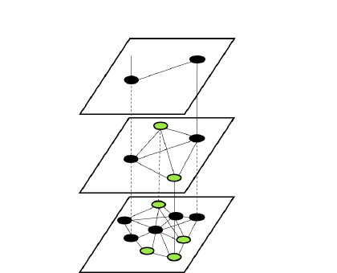

*图 3：绿色节点表示谓词子图。ACORN 搜索谓词子图，以模拟在预言机分区索引上的搜索。*

总体而言，ACORN 给出一个简单而通用的高性能混合搜索框架，其基础是谓词子图遍历。我们提出的核心技术包括：构建阶段的谓词无关邻居列表扩展与剪枝，以及搜索阶段基于谓词的过滤。这个框架可以用于多种基于图的 ANN 索引；在本文中，我们聚焦于 HNSW，是因为它性能先进且应用广泛。

[^1]: 对于选择率极低、连 ACORN 谓词子图也会在较大的 ACORN 图中断开的查询，ACORN 会退回预过滤；预过滤对这类查询很有效。ACORN 配置一个最小选择率 sₘᵢₙ：若估计某查询比 sₘᵢₙ 更具选择性，也就是选择率低于该阈值，就应使用预过滤。我们将在 5.2 节说明如何根据 sₘᵢₙ 配置 γ。

**表 1：符号汇总。**

| 符号 | 含义 |
| --- | --- |
| $\gamma$ | ACORN 索引的邻居扩展因子 |
| $M _ \beta$ | ACORN 索引的压缩参数 |
| $ef$ | ACORN 贪心搜索中的动态候选列表大小 |
| $M$ | ACORN 搜索期间每个已遍历节点的度数上界 |
| $m _ L=1/\ln M$ | ACORN 索引的层归一化常数 |
| $e$ | ACORN 索引的入口点 |
| $e _ p$ | ACORN 中谓词 $p$ 的子图入口点 |
| $l(v)$ | ACORN 索引中节点 $v$ 的最大层号 |
| $N^l(v)$ | 节点 $v$ 在第 $l$ 层的邻居列表 |
| $N _ p^l(v)$ | 谓词 $p$ 下，节点 $v$ 在第 $l$ 层经过滤后的邻居 |
| $X _ p$ | 通过谓词 $p$ 的向量数据集 |
| $s$ | 选择率 |
| $n$ | 数据集大小 |

### 5.1 ACORN-γ 搜索算法

算法 2 概述了 ACORN 在每一层使用的贪心搜索算法：搜索从顶层的预定义入口点开始。ACORN 与 HNSW 搜索算法的主要区别，是如何为每个已访问节点 $c$ 查找邻居（第 9 行）。HNSW 只检查邻居列表 $N^l(c)$，ACORN 则执行额外步骤，为给定搜索谓词恢复合适的邻域。

**算法 2：ACORN-SEARCH-LAYER($x _ q,p _ q,e,ef,l$)**

```text
输入：查询向量 x_q；查询谓词 p_q；入口点 e；
      要返回的最近邻数量 ef；待搜索层 l
输出：距 x_q 最近的 ef 个元素

 1  T ← e                                // 已访问集合
 2  C ← e                                // 候选集合
 3  W ← e                                // 已找到最近邻的动态列表
 4  while |C| > 0 do
 5      c ← 从 C 中取出使 ||x_q - x|| 最小的 x
 6      f ← W 中使 ||x_q - x|| 最大的 x
 7      if dist(c, x_q) > dist(f, x_q) and |W| ≥ ef_c
 8          break
 9      neighborhood ← GET-NEIGHBORS(c, l, p_q)
10      for each v ∈ neighborhood[1:M]
11          if v ∉ T
12              T ← T ∪ v
13              f ← W 中使 ||x_q - x|| 最大的 x
14              if dist(v, x_q) < dist(f, x_q) or |W| < ef
15                  C ← C ∪ v
16                  W ← W ∪ v
17                  if |W| > ef
18                      从 W 中删除距 x_q 最远的元素
20  end
21  return W
```

**原文异常：** 算法 2 的输入参数与输出说明使用 $ef$，但第 7 行使用未在该算法中定义的 $ef _ c$；此处忠实保留原文变量不一致。

具体而言，ACORN-γ 使用两种邻居查找策略：图 4(a) 所示的简单过滤法，以及图 4(b) 所示、与我们在构建期间可选采用、并于 5.2 节详述的压缩策略相兼容的压缩启发式。对于每个已访问节点 $v$，基于过滤的邻居查找扫描邻居列表 $N^l(v)$，找出满足谓词的邻居子列表 $N _ p^l(v)$。若 $N _ p^l(v)$ 超过 $M$ 个节点，则取前 $M$ 个，作为 $v$ 的邻域返回。

基于压缩的邻居查找则对 $N^l(v)$ 做部分扩展，引入 $v$ 的一部分二跳邻居，再执行过滤与截断。该过程分为两阶段。第一阶段遍历 $N^l(v)$ 的前 $M _ \beta$ 个节点，像前一种策略一样直接过滤。第二阶段遍历邻居列表的剩余部分，把搜索邻域扩展到邻居的邻居，再根据查询谓词过滤。 $M _ \beta$ 是构建参数，我们将在下一节继续讨论。

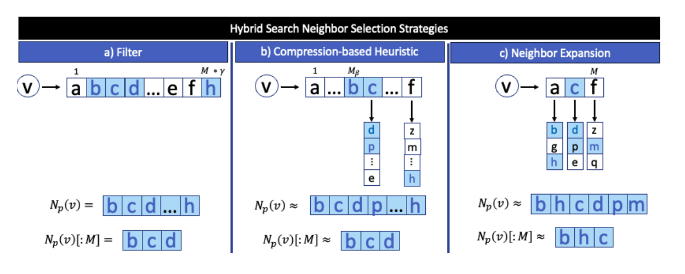

图 4：ACORN 邻居选择策略示意图。蓝色节点表示满足查询谓词的邻居。(a) 对大小为 $M\gamma$ 的未压缩边列表应用简单谓词过滤，再截断到 $M=3$；(b) 基于压缩的启发式；(c) ACORN-1 使用的邻居扩展策略。

### 5.2 ACORN-γ 构建算法

我们对 HNSW 索引算法做两项核心修改来构建 ACORN-γ 索引：首先扩展每个节点的邻居列表，然后采用一种新的谓词无关剪枝方法压缩索引。图 5 汇总了这两个步骤。

**邻居列表扩展。** HNSW 为索引中的每个节点收集 $M$ 个近似最近邻作为候选边，而 ACORN 为每个节点收集 $M\gamma$ 个近似最近邻作为候选边。为了在构建期间寻找这些候选，ACORN 在自己的图索引上执行元数据无关搜索。具体而言，在第 $l$ 层的每个节点 $v$ 上，邻居查找策略只访问邻居列表 $N^l(v)$ 并返回前 $M$ 个节点。虽然每个节点最多包含 $M\gamma$ 个邻居，但我们在构建时假设，每个节点有 $M$ 个邻居已足以维持图索引的可导航性。因此，遍历图时只考虑截断后的邻居列表，使我们能够避免不必要的距离计算和 TTI 降速。

$\gamma$ 的一个简单取值是

$$
\gamma=\frac{1}{s _ {\min}},
$$

其中 $s _ {\min}$ 是转而采用预过滤之前计划服务的最小谓词选择率。第 6 节将说明，ACORN 的建索引时间和空间占用随 $\gamma$ 成比例增加。与此同时，正如我们在图 9(a) 中所示，谓词选择率较低时，预过滤会成为有竞争力的基线。因此，对于低选择率谓词，ACORN 可以退回预过滤，以此平衡构建效率与搜索效率。

这导出一个简单的搜索期代价模型：如果给定查询的估计谓词选择率大于 $1/\gamma$，就搜索 ACORN-γ 索引，否则执行预过滤。我们注意到，选择率估计发生错误时，以这种方式采用预过滤可能降低搜索效率，但不会降低结果质量。若查询的真实谓词选择率高于 $1/\gamma$、估计值却低于该值，系统会错误地执行预过滤，获得完美召回率，但 QPS 可能低于搜索 ACORN 索引。若情况相反，系统会错误地搜索 ACORN 索引，而预过滤原本可以提供相近的 QPS 和完美召回率。

**压缩。** ACORN-γ 的邻居扩展会增大索引和 TTI，这是它面临的一项关键挑战。索引变大对 HNSW 这类驻内存图索引尤其成问题。为此，我们提出一种谓词无关剪枝技术。虽然我们可以像 6.1 节所讨论的那样对完整索引应用压缩，但我们专门压缩最底层的邻居列表，因为它们对建索引开销的贡献最大；这是 ACORN 使用的指数衰减层分配概率所决定的。

剪枝过程的核心思想是：在索引中精确保留每个节点的近邻，同时在搜索期间近似较远的邻居。我们使用可调压缩参数 $M _ \beta$，其中 $0\leq M _ \beta\leq M\gamma$。构建期间，ACORN 自动保留最近的 $M _ \beta$ 条候选边，并积极剪除其他候选，以此选出每个节点的最终邻居列表。搜索期间，我们可以直接从邻居列表 $N^l(v)$ 中恢复节点 $v$ 的前 $M _ \beta$ 个邻居，并像我们在 5.1 节所述那样，通过查看二跳邻居来近似其余邻居。

图 5 展示了对节点 $v$ 的候选邻居列表应用这一剪枝过程。算法按顺序遍历候选边列表，保留前 $M _ \beta$ 个候选；对剩余候选子列表中的每个节点执行如下剪枝。令 $H$ 为 $v$ 已选二跳邻居的动态集合，初始为 $\varnothing$。若候选 $c$ 已在 $H$ 中，我们就将其剪除；否则我们保留 $c$，并把它的全部邻居加入 $H$。算法遍历完全部候选，或 $|H|$ 加已选边数量超过 $M\gamma$ 时停止。剪枝并排序后的邻居列表随后存入 ACORN 索引， $H$ 被丢弃。

我们强调，我们在 5.1 节所述的搜索期邻居扩展可以恢复被剪掉的邻居，并且不受查询谓词影响。按照 ACORN 的剪枝规则，若节点 $x$ 从某个节点 $v$ 的邻居列表 $N^l(v)$ 中被剪除，则一定存在 $v$ 的某个邻居 $y$，其索引位置大于 $M _ \beta$，并且 $x$ 位于 $N^l(y)$ 中。搜索时，第 $l$ 层节点 $v$ 上的邻居查找会扩展所有索引位置大于 $M _ \beta$ 的邻居，因此会检查 $N^l(y)$ 并找到 $x$。

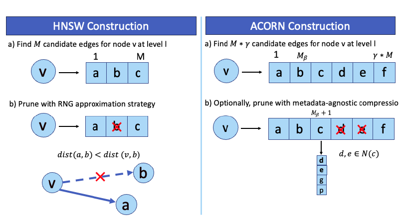

图 5：HNSW 与 ACORN-γ 的策略比较：(a) 为待插入节点 $v$ 选择候选边，其中 $M=3$；(b) 为 $v$ 剪枝候选边，其中 $M=3$、 $M _ \beta=2$、 $\gamma=2$。

下面我们简要说明 HNSW 的元数据无关剪枝机制为什么不足以支持混合搜索。考虑图 5 的简单场景。节点 $v$ 被插入 HNSW 索引的任意一层 $l$，算法生成候选邻居 $a$、 $b$ 和 $c$。HNSW 剪枝规则按由近到远的顺序遍历 $v$ 的候选邻居列表。因为存在邻居 $a$，使 $b$ 到 $a$ 比到 $v$ 更近，所以节点 $b$ 被剪除。这一 RNG 近似策略等价于剪除三元组 $v,a,b$ 所构成三角形的最长边。在这种情况下，我们可以剪掉边 $v-b$，并预期搜索路径通过 $a$ 从 $v$ 走到 $b$。

当我们考虑面向任意谓词的混合搜索时，这项技术就有问题。假设 $v$ 和 $b$ 满足某个查询谓词 $p _ q$，而 $a$ 不满足；那么 $v,b,a$ 不会在谓词子图中构成三角形，我们也就不能预期通过 $a$ 找到从 $v$ 到 $b$ 的路径。因此，HNSW 的剪枝机制会错误剪掉边 $v-b$。如果我们完全知道全部可能的查询谓词，我们就可以确保只剪除这样的三角形边：三个顶点在所有可能谓词子图的同一子集中总是同时存在。FilteredDiskANN [25] 通过限制可能查询谓词集合采用了这种方法；但对于任意查询谓词，保证该性质不可处理。

### 5.3 ACORN-1

下面我们介绍 ACORN-1，它是另一种方法，目标是在近似 ACORN-γ 搜索性能的同时，进一步减小索引和 TTI。ACORN-γ 在构建期执行邻居扩展，ACORN-1 则只在搜索期执行。ACORN-1 的构建对应不带剪枝的原始 HNSW 索引，也对应固定参数 $\gamma=1$、 $M _ \beta=M$ 时的 ACORN-γ 构建算法。

ACORN-1 与 ACORN-γ 在搜索期间的主要区别，是邻居查找策略。具体而言，贪心搜索访问每个节点 $v$ 时，ACORN-1 完整扩展邻居列表，考虑 $v$ 的全部一跳和二跳邻居，然后应用谓词过滤，把得到的邻居列表截断为大小 $M$。图 4(c) 展示了这一过程。

## 6. 讨论

本节中，我们分析 ACORN 索引的空间复杂度、构建复杂度和搜索性能。我们重点讨论 ACORN-γ，因为固定 $\gamma=1$、 $M _ \beta=M$ 时，ACORN-1 的索引构建就是 ACORN-γ 的特例；我们还将在第 7 节用实验证明 ACORN-1 的搜索可以近似 ACORN-γ。我们注意到，我们在 6.2 节和 6.3 节的分析，是在我们构建精确 Delaunay 图而非近似图这一假设下考察搜索过程的复杂度扩展。

### 6.1 索引大小

假设每条边占用的字节数为常数，ACORN-γ 索引中每个节点的平均内存消耗为

$$
O(M _ \beta+M+m _ LM\gamma).
$$

相比之下，HNSW 索引中每个节点的平均内存消耗为 $O(M+m _ LM)$。总体而言，ACORN-γ 使底层每个节点的内存消耗增加 $O(M _ \beta)$，并使更高层每个节点的内存消耗增大 $\gamma$ 倍。

为了理解 ACORN 的内存消耗，我们评估每个节点平均存储的邻居数。在第 0 层，大小为 $M\gamma$ 的候选边列表经过压缩，所得邻居集合由长度为 $M _ \beta$ 的部分和规模为 $O(M)$ 的压缩集合构成。我们在图 12 中给出了经验结果。在更高层，每个节点最多有 $M\gamma$ 条边。一个元素被加入的平均层数为

$$
\mathbb{E}[l+1]
=\mathbb{E}[-\ln(\mathrm{unif}(0,1))m _ L]
=m _ L+1.
$$

在本文中，我们只压缩最占空间的第 0 层；若要进一步减小大数据集上的索引，可以按自底向上的顺序，把压缩应用到更多层。以 $n _ c$ 表示所选压缩层数，则一般情况下每个节点的平均内存消耗为

$$
O\left(
n _ c(M _ \beta+M)
+(m _ L-n _ c)(M\gamma)
\right).
$$

### 6.2 构建复杂度

固定参数 $M$、 $M _ \beta$ 和 $ef _ c$ 时，ACORN-γ 的整体预期构建复杂度为

$$
O(n\gamma\log(n)\log(\gamma)).
$$

HNSW 的预期构建复杂度为 $O(n\log(n))$；ACORN-γ 因生成扩展边列表而使 TTI 增加 $\gamma\log(\gamma)$ 倍。

下面我们把 ACORN 的构建复杂度分解为三个因素：(i) 数据集中的节点数 $n$；(ii) 每个节点插入索引时预期搜索的层数；(iii) 在每一层搜索的预期复杂度。按照层分配概率，ACORN 的预期最大层号为 $O(\log n)$，与 HNSW 相同，这给出了我们对因素 (ii) 的界。

对于因素 (iii)，我们将先考虑搜索路径长度，再考虑每个已访问节点产生的计算代价。对 HNSW 的层概率分配，已知预期贪心搜索路径长度由常数

$$
S=\frac{1}{1-\exp(-m _ L)}
$$

界定 [48]。我们可以用 $O(\gamma)$ 界定 ACORN 的预期搜索路径长度：路径在常数步内到达贪心极小值，再把搜索范围最多扩展到 $M\gamma$ 个节点，以在构建期间收集至多 $M\gamma$ 个候选邻居。

搜索路径上每个已访问节点的计算复杂度为 $O(\log\gamma)$，原因如下。对于每个已访问节点，我们先检查它的邻居列表，找出至多 $M$ 个未访问节点，并以 $O(Md)$ 时间执行距离计算；然后，我们以 $O(Md\log(\gamma M))$ 时间更新经过排序的候选节点列表和结果列表。把 $M$ 与 $\gamma$ 视为常数，我们可以看到，每个已访问节点的计算复杂度就是 $O(\log\gamma)$，每一层贪心搜索的复杂度就是 $O(\gamma\log\gamma)$。乘以 $n\log n$，得到 ACORN 的最终预期构建复杂度 $O(n\gamma\log(n)\log(\gamma))$。

### 6.3 搜索分析

下面转向 ACORN-γ 的搜索算法。我们先指出 ACORN 谓词子图试图模拟的几项 HNSW 性质。我们将在图 7 中用经验结果说明，ACORN 的搜索性能接近 HNSW 预言机分区索引。之后我们再说明 ACORN 的预期搜索复杂度。我们定义 $l:X\rightarrow\mathbb{N}$ 为把节点映射到其在 ACORN-γ 中最大层号的函数。

#### 6.3.1 索引与搜索性质

直观而言，对给定查询，当谓词子图形成分层结构、子图中每个节点的度数接近 $M$、子图在最大层有一个我们能在搜索期间高效找到的固定入口点，并且子图连通时，ACORN 的谓词子图将模拟 HNSW 预言机分区索引。下面我们将分别考察这些性质何时成立。

我们还注意到，ACORN 的谓词子图和 HNSW 有一项主要差异，它来自 ACORN 的谓词无关剪枝：ACORN 的每一层近似 KNN 图，而 HNSW 的每一层近似 RNG 图。这一差异不影响 6.3.2 节的 ACORN 预期搜索复杂度；不过 Malkov 等人 [48] 证明，基于 RNG 的剪枝可以在经验上改善性能。

**层次结构。** 首先，我们观察到，任意谓词子图 $G(X _ p)$ 会形成一种可控层次结构，类似于在 $X _ p$ 上以参数 $M$ 构建的 HNSW 预言机分区索引。这是构建时有意保证的。ACORN-γ 的构建固定 $M$，也就固定了层归一化常数 $m _ L$。因此，ACORN-γ 索引中 $X _ p$ 的节点以与 HNSW 分区层概率相同的比率被采样。保证这种层采样成立，就使我们能够像 Malkov 等人 [48] 先前所证明的那样，用常数 $S$ 界定每一层的预期贪心搜索路径长度。

**有界度数。** 接下来，我们将讨论度数边界，它是影响贪心搜索效率和收敛性的重要因素。HNSW 在构建期间把每个节点的度数上界设为 $M$，ACORN-γ 则在搜索期间执行这一上界。因此，ACORN 搜索对每个已访问节点只执行常数次距离计算。现在我们着重推导 ACORN-γ 搜索谓词子图期间所访问节点的度数下界。

如果谓词子图中某节点的度数远低于 $M$，搜索收敛和召回率都可能受到负面影响。对于不表现出谓词聚集的数据集与查询谓词， $G(X _ p)$ 中任意节点 $v$ 都满足

$$
\mathbb{E}\left[|N _ p^l(v)|\right]
=|N^l(v)|s
=\gamma Ms
\gt M,
\qquad \forall s\gt s _ {\min}.
$$

对于有谓词聚集的数据集，这仍然是度数下界；若 $v$ 是谓词簇中的节点，则对任意 $x\in N^l(v)$ 有 $\Pr(x\in N _ p^l(v))\gt s$。因此，我们仍以无谓词聚集这一最坏情况为假设，继续开展我们的节点度数下界分析。利用参数为 $s$ 的二项集中不等式，并对预期搜索路径长度应用并集界，我们可得任意谓词子图中的搜索路径 $P=v _ 1-\cdots-v _ y$ 满足：

$$
\Pr\left[
\bigcup _ {v\in P}
\left\lbrace |N _ p(v)|\leq(1-\delta)M\right\rbrace
\right]
\leq
O(\log n)\exp\left(-\frac{\delta^2\gamma Ms}{2}\right).
$$

我们还分析了子图遍历断开的概率，并将其界定为：

$$
\Pr\left[
\bigcup _ {v\in P}
\left\lbrace |N _ p(v)|\leq 0\right\rbrace
\right]
\leq
O(\log n)(1-s)^{M\gamma}.
$$

我们可以看到，两项上界都随 $\gamma$ 指数衰减。

**固定入口点。** 与 HNSW 相似，ACORN 的搜索从构建时选定的固定入口点开始。该预定义入口点是一种简单而有效的策略，它也与谓词无关，并能稳健应对查询相关性变化，正如我们将在图 10 中用经验结果说明的那样。

直观而言，如果我们能在索引完全连通的某个上层找到一个满足谓词的节点，搜索就可以从 ACORN 的固定入口点 $e$ 成功导航到谓词子图入口点 $e _ p$。此时，从 $e$ 到 $e _ p$ 存在一跳路径。这里，我们把 $e _ p$ 定义为满足给定谓词 $p$、且位于谓词子图最大层的任意节点。索引的邻居扩展参数 $\gamma$ 使上层更稠密；特别是，节点数少于 $M\gamma$ 的层会完全连通。当这些完全连通层至少含一个满足谓词的节点时，搜索必然能从 $e$ 路由到 $e _ p$。由于 ACORN 在每一层以相同概率采样所有节点，满足给定谓词 $p$ 的节点出现在某层的概率与谓词选择率成比例，而选择率下界为 $s _ {\min}=1/\gamma$。

**连通性。** 我们注意到，HNSW 和 ACORN 都不对任意数据集上的各层图连通性提供理论保证，因此我们的分析主要依赖经验结果。不过，在某些情况下，如果 HNSW 预言机分区连通，我们可以预期 ACORN 的谓词子图也连通。两种这样的情况是： $X _ p$ 没有谓词聚集，或者 $X _ p$ 聚集在单一区域周围。在任一情况下，每个节点的预期度数都至少为 $M$，每一层都近似 KNN 图；当 $K\gg\log n$ 时，该图连通。我们将在图 13(a) 中用真实数据集与混合搜索查询说明 ACORN 谓词子图的连通性。

为分析潜在连通性问题，我们建议在等价的 $M$ 和 $ef _ c$ 参数下，把 ACORN 的混合搜索性能与 HNSW 的 ANN 搜索性能做基准比较。如果准确率有明显差距，我们建议从初始值 $1/s _ {\min}$ 开始逐步增大 $\gamma$。

#### 6.3.2 搜索复杂度

ACORN-γ 的预期搜索复杂度为

$$
O\left(
(d+\gamma)\log(sn)
+\log(1/s)
\right).
$$

它近似 HNSW 预言机分区的预期搜索复杂度 $O(d\log(sn))$。直观而言，ACORN-γ 的搜索路径会先在上层执行一些过滤，随后大概率进入并遍历谓词子图；与 HNSW 搜索相比，ACORN 只需为每个邻居列表执行谓词过滤步骤而付出较小开销。

我们把 ACORN-γ 的搜索遍历分为两个阶段来推导该复杂度。第一阶段从预定义入口点 $e$ 开始，而 $e$ 无需满足查询谓词。此阶段只执行过滤：如果某层的已过滤邻居列表 $N _ p(e)$ 为空，就下降一层。遍历到第一个满足谓词的节点 $e _ p$ 后进入第二阶段，开始遍历谓词子图 $G(X _ p)$。

第一阶段在每一层的贪心搜索路径长度为 1，预期跨越

$$
O(\log n-\log(sn))=O(\log(1/s))
$$

层。我们得到这一结果，是因为完整 ACORN 索引图的预期最大层号按层分配概率 [48] 为 $O(\log n)$；大小为 $sn$ 的谓词子图 $G(X _ p)$，其预期最大层号同样由层采样过程确定，为 $O(\log(sn))$。

搜索的第二阶段以预期复杂度 $O((d+\gamma)\log(sn))$ 遍历谓词子图。如我们前面所述，谓词子图的预期最大层号为 $O(\log(sn))$。在每一层，构建期间所采用的层采样过程可以用常数 $S$ 界定预期贪心路径长度。沿贪心路径每访问一个节点，我们都对至多 $M$ 个邻居以 $O(d)$ 时间执行距离计算，并对至多 $M\gamma$ 个邻居执行常数时间的谓词求值。

## 7. 评估

我们通过一系列真实与合成数据集实验评估 ACORN。我们的总体结果如下：

- ACORN-γ 达到先进的混合搜索性能。在以简单、低基数谓词集合为特征的以往基准，以及采用高基数谓词集合的更复杂数据集上，召回率为 0.9 时，其 QPS 都比现有方法高 2–1,000 倍。具体而言，ACORN 在以往基准上的 QPS 高 2–10 倍，在新基准上高 30 倍以上；扩展到 2,500 万个向量时，QPS 高 1,000 倍以上。
- ACORN-γ 和 ACORN-1 都是谓词无关方法；即使谓词运算符、谓词选择率、查询相关性和数据集大小发生变化，也能提供稳健的搜索性能。
- ACORN-1 和 ACORN-γ 在搜索性能与构建开销之间做出不同权衡。固定召回率下，ACORN-γ 的 QPS 最多比 ACORN-1 高 5 倍；而 ACORN-1 的 TTI 可以低 9–53 倍。

下面我们详细讨论我们的实验结果。我们首先介绍数据集（7.1 节）和基线（7.2 节），然后我们系统评估 ACORN 的搜索性能（7.3 节），最后我们评估 ACORN 的构建效率（7.4 节）。我们在 AWS `m5d.24xlarge` 实例上运行所有实验，配备 370 GB 内存、96 个 vCPU 和 196 个线程。

### 7.1 数据集

我们的实验采用两个低基数谓词集合（low-cardinality predicate sets，LCPS）数据集和两个高基数谓词集合（high-cardinality predicate sets，HCPS）数据集。LCPS 数据集使我们能对只能支持受限查询谓词集合的以往方法做基准测试；HCPS 数据集包含更复杂、更现实的查询负载，使我们能更严格地评估 ACORN 搜索性能。表 2 汇总了全部数据集。

**表 2：数据集。**

| 数据集 | 向量数 | 向量维数 | 向量源数据 | 结构化数据 | 谓词运算符 | 平均查询选择率 | 谓词基数 |
| --- | ---: | ---: | --- | --- | --- | ---: | ---: |
| SIFT1M | 1,000,000 | 128 | 图像 | 随机整数 | equals(y) | 0.083 | 12 |
| Paper | 2,029,997 | 200 | 段落 | 随机整数 | equals(y) | 0.083 | 12 |
| TripClick | 1,055,976 | 768 | 段落 | 临床领域列表与发表日期 | contains(y₁ ∨ y₂ ∨ …) 与 between(y₁, y₂) | 0.17、0.36[^2] | 超过 10⁸ |
| LAION（1M） | 1,000,448 | 512 | 图像 | 文本说明与关键词列表 | regex-match(y) 与 contains(y₁ ∨ y₂ ∨ …) | 0.056–0.13[^3] | 超过 10¹¹ |
| LAION（25M） | 24,653,427 | 512 | 同上 | 同上 | 同上 | 同上 | 同上 |

[^2]: 在 TripClick 数据集上，我们建立了 7.1.2 节所述两种不同查询负载。原文脚注把平均选择率写为 0.17（关键词）和 0.26（日期），而表 2 的对应单元格写为 0.17、0.36；此处忠实保留原文内部不一致。

[^3]: 在 LAION 数据集上，我们建立了 7.1.2 节所述四种不同查询负载；平均选择率分别为 0.10（无相关）、0.13（正相关）、0.069（负相关）和 0.056（正则表达式）。

#### 7.1.1 低基数谓词集合数据集

我们使用 SIFT1M [35] 和 Paper [63]；它们是用于评估近期专用索引 [25, 63] 的两个最大公开数据集。对于两个数据集，我们依照相关工作 [25, 62, 63] 生成结构化属性和查询谓词：为每个基础向量分配一个 1–12 范围内的随机整数作为结构化属性；每个查询向量对应的查询谓词，则与属性值域中随机选择的一个整数执行精确匹配。最终查询谓词集合基数为 12。

**SIFT1M。** SIFT1M 数据集由 Jegou 等人于 2011 年为 ANN 搜索提出，包含 100 万个基础向量和 1 万个查询向量。所有向量都是从 INRIA Holidays 图像 [33] 提取的 128 维局部 SIFT 描述符 [43]。

**Paper。** Paper 数据集由 Wang 等人于 2022 年提出，包含约 200 万个基础向量和 1 万个查询向量。该数据集通过从内部学术论文语料库中抽取文本内容并进行嵌入而生成。

#### 7.1.2 高基数谓词集合数据集

我们在 HCPS 实验中采用 TripClick 和 LAION。

**TripClick。** TripClick 数据集由 Rekabsaz 等人于 2021 年为文本检索提出，包含真实的混合搜索查询负载和基础数据集，取自某健康网站搜索引擎的点击日志。每个查询都由自然语言搜索词以及可选的临床领域过滤条件（例如“cardiology”“infectious disease”“surgery”）和发表年份过滤条件组成。基础数据集中的每个实体都是一个文本段落，并关联临床领域列表与发表日期。数据集包含 28 个不同临床领域，发表日期从 1900 年到 2020 年，因此总计有超过 $2^{28}$ 个可能的查询谓词。

我们构建两种查询负载：一种由使用日期过滤条件的查询组成（dates），另一种由使用临床领域过滤条件的查询组成（areas）。我们使用 DPR [36] 从查询文本和段落文本生成 768 维向量；DPR 是一种广泛使用、经过预训练的开放域问答编码器。所得数据集包含约 100 万个基础向量；我们为每种查询负载随机抽样 1,000 个查询。

**LAION。** LAION 数据集 [55] 包含 4 亿个图像嵌入，以及描述每幅图像的说明文字。向量嵌入由 CLIP [53] 从网页抓取图像生成；CLIP 是一个多模态视觉语言模型。在评估中，我们用 LAION 的 100 万和 2,500 万子集构建两个基础数据集，二者均包含图像向量，并把文本说明作为结构化属性。我们还生成一个由关键词列表构成的额外结构化属性：对每个图像嵌入，从 30 个常见形容词和名词（例如“animal”“scary”）的候选列表中，取文本到图像 CLIP 分数最高的 3 个词作为关键词列表。

为了评估一系列微基准，我们生成四种查询负载。对每种负载，我们都从数据集中抽取 1,000 个向量作为查询向量。我们构建正则表达式查询负载，其中谓词对图像说明执行正则匹配；对每个查询谓词，我们都随机选择由 2–10 个正则表达式 token 组成的字符串，例如 `"^[0-9]"`。此外，我们还构建了三种与 TripClick 相似的查询负载：谓词接受一个关键词列表，并滤除不含任何匹配关键词的实体。借助这种设置，我们可以轻松控制负载中的相关性，并生成无相关（no-cor）、正相关（pos-cor）和负相关（neg-cor）三种负载。图 6 展示了来自每种负载的示例查询和多模态检索结果。

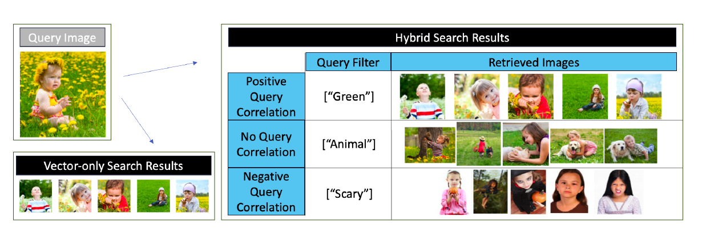

*图 6：LAION 数据集上，仅向量相似度搜索（左下）与混合搜索（右）的检索结果对比。两者使用同一查询图像（左上）；混合搜索查询还包含由关键词列表构成的结构化查询过滤条件，此处列表只有一个关键词。右侧表格展示三种混合搜索查询负载的例子：查询正相关（上）、无查询相关（中）和查询负相关（下）。*

### 7.2 基准方法

下面我们简要介绍基准方法及测试参数。我们用 C++ 在 FAISS 代码库 [5] 中实现 ACORN-γ、ACORN-1、预过滤和 HNSW 后过滤。

**HNSW 后过滤。** 对每个谓词选择率为 $s$ 的混合查询，我们让 HNSW 索引过量搜索，收集 $K/s$ 个候选结果后再应用查询过滤。我们需要指出，这与部分以往工作 [25] 不同；后者只收集 $K$ 个候选结果来实现 HNSW 后过滤，基线查询性能远差于我们的实现。

在 SIFT1M、Paper 和 LAION 上，我们采用 FAISS 的默认 HNSW 构建参数： $M=32$、 $ef _ c=40$。在 TripClick 上，我们发现这些参数下的 HNSW 索引无法在标准 ANN 搜索任务中取得高召回率，因此我们按常规方法调参。我们对 $M\in\lbrace 32,64,128\rbrace$ 和 $ef _ c\in\lbrace 40,80,120,160,200\rbrace$ 做网格搜索，选择在 ANN 搜索召回率为 0.9 时 QPS 最高的组合。在 TripClick 上，我们最终采用 $M=128$、 $ef _ c=200$。我们通过改变搜索参数 $ef _ s$ 生成每条召回率—QPS 曲线： $ef _ s$ 从 10 增加到 800，步长为 50。

**预过滤。** 我们先生成通过查询谓词的数据记录列表，再使用 FAISS 优化过的距离比较实现进行暴力搜索。由于相应结构化属性基数很低，我们也用位图高效实现所有 `contains` 谓词求值。

**Filtered-DiskANN。** 我们评估 FilteredDiskANN [4] 实现的两种算法：FilteredVamana 与 StitchedVamana；对二者，我们都按照 Gollapudi 等人 [25] 描述的超参数调优过程，使用推荐的构建与搜索参数。

对 FilteredVamana，我们使用构建参数 $L=90$、 $R=96$；它们由 $R\in\lbrace 32,64,96\rbrace$、 $L$ 在 50–100 之间的参数扫描得到，并生成帕累托最优的召回率—QPS 曲线。对 StitchedVamana，我们使用构建参数 $R _ {\mathrm{small}}=32$、 $L _ {\mathrm{small}}=100$、 $R _ {\mathrm{stitched}}=64$、 $\alpha=1.2$；它们由 $R _ {\mathrm{small}},R _ {\mathrm{stitched}}\in\lbrace 32,64,96\rbrace$、 $L _ {\mathrm{small}}$ 在 50–100 之间的参数扫描得到，并生成帕累托最优曲线。为生成召回率—QPS 曲线，我们把 FilteredVamana 的 $L$ 从 10 增加到 650，步长 20；把 StitchedVamana 的 $L _ {\mathrm{small}}$ 从 10 增加到 330，步长 20。

**NHQ。** 我们评估文献 [63] 提出的 NHQ-NPG_NSW 与 NHQ-NPG_KGraph 两种算法；我们对二者均使用已发布代码库 [12] 的推荐参数。这些参数由超参数网格搜索选出，以便在 SIFT1M 和 Paper 上为两种算法分别生成帕累托最优的召回率—QPS 曲线。我们通过把 $L$ 从 10 增加到 310、步长设为 20 来生成曲线。我们在图 7(b) 和图 8(b) 中展示两种算法中性能更高的 KGraph。

**Milvus。** 我们测试四种 Milvus 算法：IVF-Flat、IVF-SQ8、HNSW 和 IVF-PQ [6]；我们对每种都测试与 Gollapudi 等人 [25] 相同的参数。由于我们发现四种算法搜索性能相近，为简洁起见，图 7(b) 和图 8(b) 只展示召回率—QPS 表现帕累托最优的方法。

**预言机分区索引。** 我们通过为 LCPS 数据集中的每个可能查询谓词构建一个 HNSW 索引来实现这种方法。对于给定混合查询，我们搜索与其谓词对应的 HNSW 分区。对各 HNSW 分区的构建和召回率—QPS 曲线生成，我们都采用前述 HNSW 后过滤方法的相同参数。

**ACORN-γ。** 我们选择构建参数 $M$ 与 $ef _ c$，使其与前述 HNSW 后过滤基线相同。我们发现 ACORN-γ 的搜索性能对构建参数 $M _ \beta$ 相对不敏感，如图 12(c) 所示。因此，为保持适中的构建开销，我们让 $M _ \beta$ 取 $M$ 的较小倍数，即 $M _ \beta=M$ 或 $M _ \beta=2M$，并为每个数据集选择召回率为 0.9 时 QPS 更高的取值。

具体而言，我们约束索引内存预算：LCPS 数据集上的索引不大于 Vamana 索引，HCPS 数据集上的索引不大于平面索引的两倍。我们在 LAION-1M 与 LAION-25M 上采用 $M _ \beta=32$，在 SIFT1M 与 Paper 上采用 64，在 TripClick 上采用 128。我们按每个数据集预期的最小查询谓词选择率设置构建参数 $\gamma$：SIFT1M 与 Paper 取 $\gamma=12$，LAION 取 $\gamma=30$，TripClick 取 $\gamma=80$。我们采用前述 HNSW 后过滤的相同步骤生成召回率—QPS 曲线。

**ACORN-1。** 我们构建 ACORN-1 并采用与 ACORN-γ 相同的过程生成召回率—QPS 曲线，但我们固定 $\gamma=1$、 $M _ \beta=M$。

### 7.3 搜索性能结果

我们将首先在 LCPS 数据集上开展我们的评估：在这些数据集上，我们可以运行所有基线方法以及预言机分区方法。然后我们评估 HCPS 数据集。在 HCPS 上，FilteredDiskANN 与 NHQ 算法无法运行，因为它们不能处理高基数查询谓词集合和非等值谓词运算符。在撰写本文时，我们还发现 Milvus 不支持正则匹配谓词和针对变长列表的 `contains` 谓词。因此，在 HCPS 数据集上，我们只把 ACORN 与预过滤、后过滤基线比较。我们报告的 QPS 是 50 次试验的平均值。

图 7–11 共用的图例为：深蓝实线表示 ACORN-γ，浅蓝实线表示 ACORN-1，橙色实线表示 HNSW 后过滤，灰色虚线表示预言机分区；粉色表示 FilteredVamana，蓝绿色表示 StitchedVamana，浅棕色表示 NHQ，绿色表示 Milvus，橙色十字标记表示预过滤。

#### 7.3.1 LCPS 数据集基准

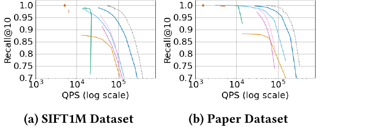

*图 7：SIFT1M 与 Paper 数据集上的 Recall@10—QPS 曲线。*

图 7 表明，ACORN-γ 在 SIFT1M 和 Paper 上达到先进的混合搜索性能，并且最接近理论理想的预言机分区策略。值得注意的是，即使与专为 LCPS 数据集设计的 NHQ 和 FilteredDiskANN 相比，ACORN-γ 仍在固定召回率下持续取得高 2–10 倍的 QPS，同时保持通用性。我们还看到，ACORN-1 也能近似 ACORN-γ 的搜索性能；在一系列召回率下，它的 QPS 大约低 1.5–5 倍。

为了进一步研究 ACORN-γ 和 ACORN-1 的相对搜索效率，我们把注意力转向表 3，表中给出两种方法达到 Recall@10 为 0.8 所需的距离计算次数。我们看到，预言机分区最有效率，在两个数据集上所需距离计算次数都最少；按距离计算次数衡量，ACORN-γ 次之。

ACORN-γ 虽然近似预言机分区方法，但其谓词无关设计无法使用构建预言机分区时的同一种 RNG 剪枝。ACORN-γ 的各层近似 KNN 图，而非 RNG 图；KNN 图搜索效率较低，这解释了性能差距。表 3 还表明 ACORN-1 的效率低于 ACORN-γ，原因在于 ACORN-1 生成候选边的方式。ACORN-γ 在构建期间为每个节点存储至多 $M\gamma$ 条边；ACORN-1 构建期间只存储至多 $M$ 条边，再在搜索期用邻居扩展近似每个节点大小为 $M\gamma$ 的边列表。近似会轻微降低邻居列表质量，进而降低搜索性能。

最后，我们从表 3 看到 HNSW 后过滤是所列方法中效率最低的。这是因为 ACORN-1 和 ACORN-γ 几乎只遍历通过查询谓词的节点，而后过滤算法区分能力较弱，在不通过查询谓词的节点上浪费了距离计算。

**表 3：达到 0.8 召回率所需的距离计算次数。**

| 方法 | SIFT1M | Paper |
| --- | ---: | ---: |
| 预言机分区 | 398.0 | 281.1 |
| ACORN-γ | 611.0（+53.5%） | 383.7（+36.6%） |
| ACORN-1 | 999.6（+151.0%） | 567.8（+101.2%） |
| HNSW 后过滤 | 1837.8（+362.6%） | 1425.5（+406.2%） |

*括号内为相对于预言机分区方法的百分比差异。*

回到图 7，我们看到，预言机分区、ACORN-γ 和 ACORN-1 的相对搜索效率（以 QPS—召回率衡量）不仅受距离计算次数影响，也受向量维数影响。我们看到，在 Paper 上，ACORN-1 与 ACORN-γ 的表现都更接近预言机分区；在 SIFT1M 上差距略大。原因是搜索期间还要对邻居列表执行过滤；相对于距离计算的代价，这项过滤代价在 SIFT1M 上高于 Paper，因为 SIFT1M 的向量维数略低。

#### 7.3.2 HCPS 数据集基准

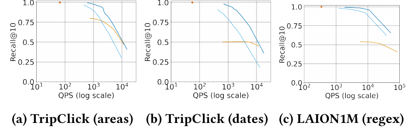

*图 8：TripClick（临床领域、日期）和 LAION-1M（正则表达式）上的 Recall@10—QPS 曲线。*

图 8 表明，在 TripClick 和 LAION-1M 上，召回率为 0.9 时，ACORN 的 QPS 比基线高 30–50 倍；ACORN-1 仍能近似 ACORN-γ 的搜索性能。两个数据集上的预过滤都昂贵得难以使用：它以效率为代价取得完美召回率。后过滤则无法取得高召回率，原因可能是查询相关性和谓词选择率各不相同；下面我们进一步研究这些因素。

**谓词选择率变化。** 我们使用 TripClick 数据集评估一系列真实谓词选择率下的 ACORN 搜索性能。图 9 表明，对每个谓词选择率百分位，在召回率为 0.9 时，ACORN-γ 的 QPS 都比次优基线高 5–50 倍；ACORN-1 仍落后于 ACORN-γ。我们看到，对于低选择率谓词，预过滤最有竞争力，而后过滤基线在固定召回率下的 QPS 比 ACORN 低 10 倍以上。对于高选择率谓词，预过滤竞争力下降，后过滤吞吐量上升，但召回率仍然很低。

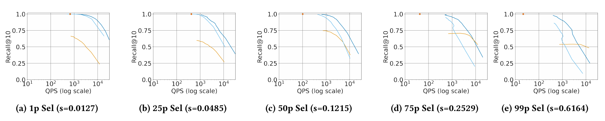

*图 9：TripClick 上第 1、25、50、75 和 99 选择率百分位的 Recall@10—QPS 曲线；对应选择率分别为 0.0127、0.0485、0.1215、0.2529 和 0.6164。*

**查询相关性变化。** 接下来我们控制查询相关性，并在 LAION-1M 上评估三种不同查询负载。图 10 表明，ACORN-γ 能稳健应对查询相关性变化；在每种情形下，召回率为 0.9 时的 QPS 都比次优基线高 28–100 倍。

查询负相关时，后过滤与 ACORN 的性能差距最大，因为后过滤无法成功路由到满足谓词的节点。查询正相关时，ACORN-γ 仍优于基线；后过滤更有竞争力，但仍无法达到 0.9 以上的召回率。预过滤的 QPS 基本不变，只受不同查询负载间谓词选择率小幅差异的影响。与之前一样，ACORN-1 的搜索性能接近 ACORN-γ。

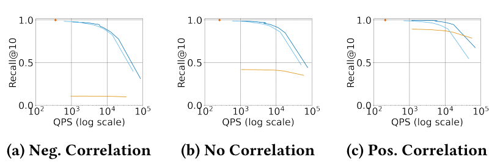

*图 10：LAION-1M 上查询负相关、无相关和正相关三种负载的 Recall@10—QPS 曲线。*

**数据集规模扩展。** 图 11 展示 ACORN 在 LAION-25M 无相关查询负载上的搜索性能。随着数据规模扩大，ACORN 与现有基线的性能差距只会增大。召回率为 0.9 时，ACORN-γ 的 QPS 比次优基线高三个数量级以上；ACORN-1 的搜索性能仍近似 ACORN-γ。

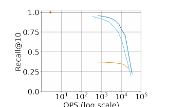

*图 11：LAION-25M 无相关查询负载上的 Recall@10—QPS 曲线。*

### 7.4 索引构建

下面我们评估 ACORN 的构建过程，包括建索引时间和空间占用、ACORN-γ 的压缩过程，以及 ACORN-γ 邻居扩展所得谓词子图的质量。

#### 7.4.1 TTI 与空间占用

首先，我们分析 ACORN 的空间占用和建索引时间。表 4 和表 5 把 ACORN-γ、ACORN-1 与性能最好的基线进行比较，分别给出 TTI 和索引大小。每种方法报告的索引大小都包含向量存储和索引本身的总空间占用。所有方法均使用 7.2 节所述参数。

**表 4：TTI（秒）。**

| 方法 | TripClick | LAION-1M | LAION-25M | SIFT1M | Paper |
| --- | ---: | ---: | ---: | ---: | ---: |
| ACORN-γ | 9902.9 | 835.8 | 38,007.5 | 148.9 | 255.6 |
| ACORN-1 | 322.9 | 25.9 | 705.3 | 8.6 | 27.0 |
| HNSW | 891.0 | 32.9 | 1,147.2 | 11.3 | 29.2 |
| FilteredVamana | NA | NA | NA | 18.3 | 51.9 |
| StitchedVamana | NA | NA | NA | 69.2 | 189.7 |

对应的索引空间占用如下。

**表 5：索引大小（GB）。**

| 方法 | TripClick | LAION-1M | LAION-25M | SIFT1M | Paper |
| --- | ---: | ---: | ---: | ---: | ---: |
| ACORN-γ | 4.9 | 2.4 | 59 | 0.98 | 2.5 |
| ACORN-1 | 4.6 | 2.3 | 59 | 0.93 | 2.4 |
| HNSW | 4.1 | 2.2 | 54 | 0.75 | 2.1 |
| 平面索引 | 3.1 | 1.9 | 47 | 0.51 | 1.6 |
| FilteredVamana | NA | NA | NA | 0.61 | 1.8 |
| StitchedVamana | NA | NA | NA | 1.3 | 3.5 |

我们先看 ACORN-γ 的构建开销。表 4 表明，在所有数据集上，ACORN-γ 的 TTI 最多是 HNSW 的 11 倍，最多是性能最佳的专用索引 StitchedVamana 的 2.15 倍。表 5 表明，ACORN-γ 的索引最多比 HNSW 大 1.3 倍，并且至少比 StitchedVamana 小 25%。ACORN-γ 比 HNSW 更大、TTI 更高，是因为构建期间的候选边生成步骤会扩展每个邻居列表。

ACORN-1 的 TTI 是表中所有基线最低的；其索引最多是 HNSW 的 1.25 倍，并且至少比 StitchedVamana 小 25%。我们看到，ACORN-γ 在构建期间扩展邻居列表，从而取得更高的搜索性能；ACORN-1 则在搜索期间扩展邻居列表，以更低的 TTI 与空间占用提供相近的性能。两种算法体现了搜索性能与构建开销之间的权衡。

#### 7.4.2 ACORN-γ 剪枝

鉴于 ACORN-γ 的构建开销较高，我们研究其谓词无关压缩策略能否在保持搜索性能的同时降低索引构建成本。表 6 给出 ACORN-γ 在各数据集、各层的平均出度。结果证实，第 0 层经过压缩后的邻居列表显著小于未压缩层；未压缩层的邻居列表最大可以达到 $M\gamma$。

**表 6：ACORN-γ 平均出度。**

| 层或参数 | TripClick | LAION-1M | LAION-25M | SIFT1M | Paper |
| --- | ---: | ---: | ---: | ---: | ---: |
| 第 0 层（已压缩） | 191 | 50.1 | 49.4 | 87.5 | 86.0 |
| 第 1 层 | 8,075 | 960 | 960 | 384 | 384 |
| 第 2 层 | 54.0 | 919 | 937 | 363 | 359 |
| 第 3 层 | 0 | 25.3 | 689 | 25.3 | 57.4 |
| 第 4 层 | NA | 0 | 16 | 0 | 1.0 |
| $M\gamma$ | 10,240 | 960 | 960 | 384 | 384 |
| $M _ \beta$ | 128 | 32 | 32 | 64 | 64 |

我们把注意力转向图 12，评估三种用于 ACORN-γ 邻居列表构建的剪枝策略：

1. ACORN 的谓词无关剪枝策略，以不同 $M _ \beta$（图中写作 $M _ b$）表示不同压缩程度； $M _ b=768$ 表示不剪枝，数值越小表示剪枝越积极；
2. FilteredDiskANN 所采用的元数据感知、基于 RNG 的剪枝方法；
3. HNSW 的元数据无关剪枝。

我们考虑的指标包括 TTI、空间占用、每个节点被剪掉的候选边数和搜索性能。图中以第 0 层节点的平均出度表示空间占用，因为三种策略都在第 0 层执行；以 QPS 为 20,000 时的召回率表示搜索性能。不同剪枝方法生成的召回率—QPS 曲线覆盖范围相差很大，因此我们选择 QPS 阈值而不是召回率阈值。

图 12 的结果很有意思：ACORN 剪枝可以积极删除候选边，在保持搜索性能的同时显著降低 TTI 与空间占用。把 HNSW 剪枝用于该索引，则会显著降低混合搜索性能。元数据感知 RNG 剪枝的搜索性能与 ACORN-γ 剪枝相近，但当 $M _ \beta$ 较小（例如 32、64）时，其 TTI 与空间占用都不如 ACORN 剪枝。

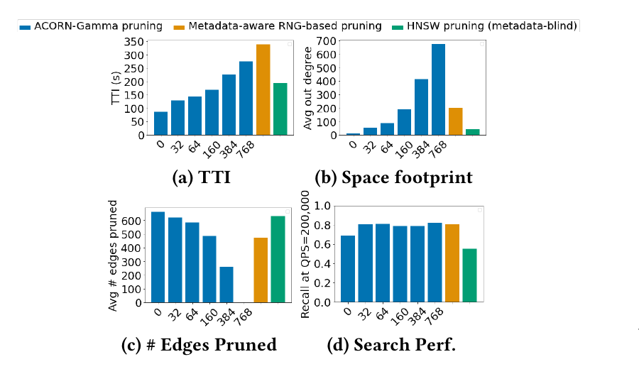

图 12：SIFT1M 上不同剪枝方法的比较，以及它们对 TTI（a）、索引空间占用（b）、候选边剪除数量（c）和搜索性能（d）的影响。横轴给出 ACORN-γ 所用的 $M _ \beta$。

#### 7.4.3 图质量

最后，我们研究 ACORN-γ 谓词子图的质量。图 13 在 TripClick 的真实混合搜索查询上，对一系列谓词选择率，比较 HNSW 预言机分区与 ACORN-γ 谓词子图的图连通性、图高度和出度。

从图 13(a) 我们看到，在不同选择率下，ACORN-γ 谓词子图的连通性在经验上达到或超过 HNSW 预言机分区，证明 ACORN-γ 邻居扩展策略有效。图 13(b) 表明，ACORN-γ 谓词子图的受控层次结构可以模拟 HNSW 预言机分区。Malkov 等人 [48] 证明 HNSW 搜索性能对图高度敏感；因此，该结果有助于解释 ACORN-γ 为什么能模拟预言机分区的搜索效率。

图 13(c) 考察在 ACORN-γ 索引上执行图 4(a) 所述搜索期过滤后，节点的平均出度。我们注意到，如 6.3 节所述，要模拟 HNSW 的可导航性，足够高但有界的出度很重要。图中证实，ACORN 谓词子图的平均出度始终接近且不超过 $M$。符合预期的是，HNSW 预言机分区采用基于 RNG 的剪枝，因此其平均出度显著低于 ACORN-γ 未压缩层上的节点。

我们还看到，选择率处于第 1 百分位的 ACORN 谓词子图，其平均出度低于其他谓词子图。这是因为低选择率谓词导致最大的未压缩层也不到 128 个节点，从而把每个节点的最大出度限制在 $M=128$ 以下。总体而言，我们观察到，ACORN-γ 产生了高质量谓词子图；经验上，它们能模拟与搜索效率相关的多项 HNSW 性质。

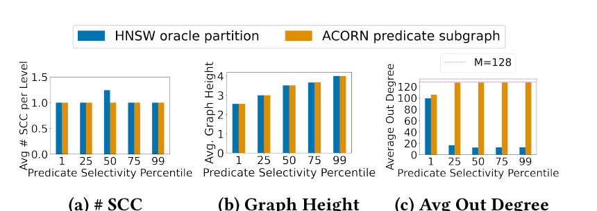

图 13：从以下指标评估 ACORN-γ 谓词子图的图质量：(a) 每层平均强连通分量数量；(b) 图高度；(c) 未压缩层上节点的平均出度。结果来自 TripClick 数据集，分别用第 1、25、50、75 和 99 选择率百分位的谓词生成谓词子图与 HNSW 预言机分区。

## 8. 相关工作

**基于预过滤和后过滤的系统。** 许多混合搜索系统依赖预过滤和后过滤。若干系统开发了预处理方法，以便在搜索期间更快过滤，但这些系统未能减少成为性能瓶颈的大量昂贵距离计算。Weaviate [1] 预先为结构化数据建立倒排索引，查询时再用它建立符合条件候选的位图，并执行后过滤。Milvus [62] 同样维护属性在数据集上的分布，以建立获准数据点列表，把常用查询过滤条件映射到该列表后再执行预过滤或后过滤。FAISS-IVF [14, 34] 和 LSH [10] 等空间分区索引则把元数据信息存入索引，从而能在后过滤期间快速过滤实体。尽管这些方法都优化了过滤步骤，预过滤与后过滤的核心问题仍然存在，面对低相关或低选择率谓词时尤其如此。

**专用索引。** 另一类近期工作为混合搜索开发新的图算法，通常针对受限谓词集合改善性能。NHQ [63] 把属性和向量一同编码，搜索期间使用同时考虑向量距离和属性匹配的“融合距离”。该方法只支持等值查询谓词，并假设每个数据实体只有一个结构化属性。

Filtered-DiskANN [25] 提出 FilteredVamana 和 StitchedVamana 两种算法。二者都把查询过滤条件基数限制在约 1,000，而且只支持等值谓词，使索引构建步骤可以利用这些知识适当地生成并剪枝候选边列表。类似地，HQI [49] 假设查询谓词基数被限制为 20，以此设计高效分区方案，优化批量查询处理。

另一方面，Qdrant [61] 提出把 HNSW 图稠密化，再执行带过滤的贪心搜索。该思路在直觉上与 ACORN 构建期的邻居列表扩展一致，但 Qdrant 直接增大 HNSW 参数 $M$，无意中把图压平，并影响 HNSW 的层归一化常数。Malkov 等人 [48] 表明，HNSW 性能对层数敏感，压平图会降低搜索性能。此外，Qdrant 提出的方法没有解决 HNSW 稠密化后增加的内存开销。

## 9. 结论

我们提出 ACORN，这是首个能在向量与结构化数据之间高效执行混合搜索、同时支持大型且多样查询谓词集合的方法。ACORN 采用一种简单而有效的搜索策略，其核心思想是谓词子图遍历。我们提出 ACORN-γ 和 ACORN-1 两种索引；它们通过修改 HNSW 索引算法来实现这一搜索策略。

我们的结果表明，ACORN 在两类基准上都达到先进的混合搜索性能：一类是采用简单、低基数查询谓词集合的以往基准；另一类是包含新谓词运算符与高基数谓词集合的更复杂基准。在两类基准上，召回率为 0.9 时，ACORN-γ 的 QPS 都比以往方法高 2–1,000 倍；面向资源受限场景时，ACORN-1 能以低 9–53 倍的 TTI 近似 ACORN-γ 的搜索性能。

## 致谢

本文作者感谢 Peter Bailis 对本工作的宝贵反馈。

本研究部分得到 Stanford DAWN 项目的成员机构及其他支持者资助，其中包括 Meta、Google 和 VMware，以及 Cisco、SAP 和 Sloan Fellowship。本文所表达的任何观点、研究发现、结论或建议均属于本文作者，并不一定反映资助方的观点。

## 参考文献

[1] [n. d.]. Filtered Vector Search | Weaviate - vector database. <https://weaviate.io/developers/weaviate/concepts/prefiltering>

[2] [n. d.]. Pre-label and enrich data with bulk classifications. <https://labelbox.ghost.io/blog/pre-label-and-enrich-your-data-with-bulk-classifications/>

[3] [n. d.]. Q&A over Documents - LlamaIndex 0.8.43. <https://gpt-index.readthedocs.io/en/latest/>

[4] 2023. DiskANN. <https://github.com/microsoft/DiskANN>. Original date: 2020-06-18T06:18:06Z.

[5] 2023. Faiss. <https://github.com/facebookresearch/faiss>

[6] 2023. Milvus Documentation. <https://github.com/milvus-io/milvus-docs>. Original date: 2020-05-27T09:12:23Z.

[7] 2023. visual-layer/fastdup. <https://github.com/visual-layer/fastdup>

[8] Ann Arbor Algorithms. 2023. KGraph: A Library for Approximate Nearest Neighbor Search. <https://github.com/aaalgo/kgraph>. Original date: 2015-05-29T12:38:24Z.

[9] Alexandr Andoni and Piotr Indyk. 2008. Near-optimal hashing algorithms for approximate nearest neighbor in high dimensions. *Commun. ACM* 51, 1 (Jan. 2008), 117–122. <https://doi.org/10.1145/1327452.1327494>

[10] Alexandr Andoni, Piotr Indyk, Thijs Laarhoven, Ilya Razenshteyn, and Ludwig Schmidt. 2015. Practical and optimal LSH for angular distance. In *Proceedings of the 28th International Conference on Neural Information Processing Systems - Volume 1 (NIPS’15)*. MIT Press, Cambridge, MA, USA, 1225–1233.

[11] Alexandr Andoni and Ilya Razenshteyn. 2015. Optimal Data-Dependent Hashing for Approximate Near Neighbors. In *Proceedings of the Forty-Seventh Annual ACM Symposium on Theory of Computing (STOC ’15)*. Association for Computing Machinery, New York, NY, USA, 793–801. <https://doi.org/10.1145/2746539.2746553>

[12] AshenOn3. 2023. NHQ: An Efficient and Robust Framework for Approximate Nearest Neighbor Search with Attribute Constraint. <https://github.com/AshenOn3/NHQ>. Original date: 2021-09-09T08:28:21Z.

[13] Martin Aumüller, Erik Bernhardsson, and Alexander Faithfull. 2020. ANN-Benchmarks: A benchmarking tool for approximate nearest neighbor algorithms. *Information Systems* 87 (Jan. 2020), 101374. <https://doi.org/10.1016/j.is.2019.02.006>

[14] Dmitry Baranchuk, Artem Babenko, and Yury Malkov. 2018. Revisiting the Inverted Indices for Billion-Scale Approximate Nearest Neighbors. <https://doi.org/10.48550/arXiv.1802.02422>. arXiv:1802.02422 [cs].

[15] Jon Louis Bentley. 1975. Multidimensional binary search trees used for associative searching. *Commun. ACM* 18, 9 (Sept. 1975), 509–517. <https://doi.org/10.1145/361002.361007>

[16] Erik Bernhardsson. [n. d.]. annoy: Approximate Nearest Neighbors in C++/Python optimized for memory usage and loading/saving to disk. <https://github.com/spotify/annoy>

[17] Alina Beygelzimer, Sham Kakade, and John Langford. 2006. Cover trees for nearest neighbor. In *Proceedings of the 23rd International Conference on Machine Learning (ICML ’06)*. Association for Computing Machinery, New York, NY, USA, 97–104. <https://doi.org/10.1145/1143844.1143857>

[18] Fedor Borisyuk, Siddarth Malreddy, Jun Mei, Yiqun Liu, Xiaoyi Liu, Piyush Maheshwari, Anthony Bell, and Kaushik Rangadurai. 2021. VisRel: Media Search at Scale. In *Proceedings of the 27th ACM SIGKDD Conference on Knowledge Discovery & Data Mining (KDD ’21)*. Association for Computing Machinery, New York, NY, USA, 2584–2592. <https://doi.org/10.1145/3447548.3467081>

[19] Sanjoy Dasgupta and Yoav Freund. 2008. Random projection trees and low dimensional manifolds. In *Proceedings of the Fortieth Annual ACM Symposium on Theory of Computing*. ACM, Victoria, British Columbia, Canada, 537–546. <https://doi.org/10.1145/1374376.1374452>

[20] Wei Dong, Charikar Moses, and Kai Li. 2011. Efficient k-nearest neighbor graph construction for generic similarity measures. In *Proceedings of the 20th International Conference on World Wide Web (WWW ’11)*. Association for Computing Machinery, New York, NY, USA, 577–586. <https://doi.org/10.1145/1963405.1963487>

[21] Ming Du, Arnau Ramisa, Amit Kumar K C, Sampath Chanda, Mengjiao Wang, Neelakandan Rajesh, Shasha Li, Yingchuan Hu, Tao Zhou, Nagashri Lakshminarayana, Son Tran, and Doug Gray. 2022. Amazon Shop the Look: A Visual Search System for Fashion and Home. In *Proceedings of the 28th ACM SIGKDD Conference on Knowledge Discovery and Data Mining (KDD ’22)*. Association for Computing Machinery, New York, NY, USA, 2822–2830. <https://doi.org/10.1145/3534678.3539071>

[22] Cong Fu, Chao Xiang, Changxu Wang, and Deng Cai. 2019. Fast approximate nearest neighbor search with the navigating spreading-out graph. *Proceedings of the VLDB Endowment* 12, 5 (Jan. 2019), 461–474. <https://doi.org/10.14778/3303753.3303754>

[23] Tiezheng Ge, Kaiming He, Qifa Ke, and Jian Sun. 2014. Optimized Product Quantization. *IEEE Transactions on Pattern Analysis and Machine Intelligence* 36, 4 (April 2014), 744–755. <https://doi.org/10.1109/TPAMI.2013.240>. Conference Name: IEEE Transactions on Pattern Analysis and Machine Intelligence.

[24] Aristides Gionis, Piotr Indyk, and Rajeev Motwani. 1999. Similarity Search in High Dimensions via Hashing. In *Proceedings of the 25th International Conference on Very Large Data Bases (VLDB ’99)*. Morgan Kaufmann Publishers Inc., San Francisco, CA, USA, 518–529.

[25] Siddharth Gollapudi, Neel Karia, Varun Sivashankar, Ravishankar Krishnaswamy, Nikit Begwani, Swapnil Raz, Yiyong Lin, Yin Zhang, Neelam Mahapatro, Premkumar Srinivasan, Amit Singh, and Harsha Vardhan Simhadri. 2023. Filtered-DiskANN: Graph Algorithms for Approximate Nearest Neighbor Search with Filters. In *Proceedings of the ACM Web Conference 2023*. ACM, Austin, TX, USA, 3406–3416. <https://doi.org/10.1145/3543507.3583552>

[26] Long Gong, Huayi Wang, Mitsunori Ogihara, and Jun Xu. 2020. iDEC: indexable distance estimating codes for approximate nearest neighbor search. *Proceedings of the VLDB Endowment* 13, 9 (May 2020), 1483–1497. <https://doi.org/10.14778/3397230.3397243>

[27] Ruiqi Guo, Philip Sun, Erik Lindgren, Quan Geng, David Simcha, Felix Chern, and Sanjiv Kumar. 2020. Accelerating large-scale inference with anisotropic vector quantization. In *Proceedings of the 37th International Conference on Machine Learning (ICML’20, Vol. 119)*. JMLR.org, 3887–3896.

[28] Michael E. Houle and Michael Nett. 2015. Rank-Based Similarity Search: Reducing the Dimensional Dependence. *IEEE Transactions on Pattern Analysis and Machine Intelligence* 37, 1 (Jan. 2015), 136–150. <https://doi.org/10.1109/TPAMI.2014.2343223>. Conference Name: IEEE Transactions on Pattern Analysis and Machine Intelligence.

[29] Piotr Indyk and Rajeev Motwani. 1998. Approximate nearest neighbors: towards removing the curse of dimensionality. In *Proceedings of the Thirtieth Annual ACM Symposium on Theory of Computing (STOC ’98)*. Association for Computing Machinery, New York, NY, USA, 604–613. <https://doi.org/10.1145/276698.276876>

[30] Omid Jafari, Parth Nagarkar, and Jonathan Montaño. 2020. mmLSH: A Practical and Efficient Technique for Processing Approximate Nearest Neighbor Queries on Multimedia Data. In *Similarity Search and Applications* (Lecture Notes in Computer Science), Shin’ichi Satoh, Lucia Vadicamo, Arthur Zimek, Fabio Carrara, Ilaria Bartolini, Martin Aumüller, Björn Þór Jónsson, and Rasmus Pagh (Eds.). Springer International Publishing, Cham, 47–61. <https://doi.org/10.1007/978-3-030-60936-8_4>

[31] J. W. Jaromczyk and G. T. Toussaint. 1992. Relative neighborhood graphs and their relatives. *Proc. IEEE* 80, 9 (Sept. 1992), 1502–1517. <https://doi.org/10.1109/5.163414>. Conference Name: Proceedings of the IEEE.

[32] Suhas Jayaram Subramanya, Fnu Devvrit, Harsha Vardhan Simhadri, Ravishankar Krishnawamy, and Rohan Kadekodi. 2019. DiskANN: Fast Accurate Billion-point Nearest Neighbor Search on a Single Node. In *Advances in Neural Information Processing Systems*, Vol. 32. Curran Associates, Inc. <https://papers.nips.cc/paper_files/paper/2019/hash/09853c7fb1d3f8ee67a61b6bf4a7f8e6-Abstract.html>

[33] Herve Jegou, Matthijs Douze, and Cordelia Schmid. 2008. Hamming Embedding and Weak Geometric Consistency for Large Scale Image Search. In *Computer Vision – ECCV 2008* (Lecture Notes in Computer Science), David Forsyth, Philip Torr, and Andrew Zisserman (Eds.). Springer, Berlin, Heidelberg, 304–317. <https://doi.org/10.1007/978-3-540-88682-2_24>

[34] Jeff Johnson, Matthijs Douze, and Hervé Jégou. 2017. Billion-scale similarity search with GPUs. <http://arxiv.org/abs/1702.08734>. arXiv:1702.08734 [cs].

[35] Herve Jégou, Matthijs Douze, and Cordelia Schmid. 2011. Product Quantization for Nearest Neighbor Search. *IEEE Transactions on Pattern Analysis and Machine Intelligence* 33, 1 (Jan. 2011), 117–128. <https://doi.org/10.1109/TPAMI.2010.57>. Conference Name: IEEE Transactions on Pattern Analysis and Machine Intelligence.

[36] Vladimir Karpukhin, Barlas Oğuz, Sewon Min, Patrick Lewis, Ledell Wu, Sergey Edunov, Danqi Chen, and Wen-tau Yih. 2020. Dense Passage Retrieval for Open-Domain Question Answering. <https://arxiv.org/abs/2004.04906v3>

[37] Philip M. Lankford. 1969. Regionalization: Theory and Alternative Algorithms. *Geographical Analysis* 1, 2 (1969), 196–212. <https://doi.org/10.1111/j.1538-4632.1969.tb00615.x>. _eprint: <https://onlinelibrary.wiley.com/doi/pdf/10.1111/j.1538-4632.1969.tb00615.x>.

[38] D. T. Lee and B. J. Schachter. 1980. Two algorithms for constructing a Delaunay triangulation. *International Journal of Computer & Information Sciences* 9, 3 (June 1980), 219–242. <https://doi.org/10.1007/BF00977785>

[39] V. Lempitsky and A. Babenko. 2012. The inverted multi-index. IEEE Computer Society, 3069–3076. <https://doi.org/10.1109/CVPR.2012.6248038>. ISSN: 1063-6919.

[40] Mingjie Li, Ying Zhang, Yifang Sun, Wei Wang, Ivor W. Tsang, and Xuemin Lin. 2020. I/O Efficient Approximate Nearest Neighbour Search based on Learned Functions. *2020 IEEE 36th International Conference on Data Engineering (ICDE)* (April 2020), 289–300. <https://doi.org/10.1109/ICDE48307.2020.00032>. Conference Name: 2020 IEEE 36th International Conference on Data Engineering (ICDE). ISBN: 9781728129037. Place: Dallas, TX, USA. Publisher: IEEE.

[41] Wanqi Liu, Hanchen Wang, Ying Zhang, Wei Wang, Lu Qin, and Xuemin Lin. 2021. EI-LSH: An early-termination driven I/O efficient incremental c-approximate nearest neighbor search. *The VLDB Journal* 30, 2 (March 2021), 215–235. <https://doi.org/10.1007/s00778-020-00635-4>

[42] Yiding Liu, Weixue Lu, Suqi Cheng, Daiting Shi, Shuaiqiang Wang, Zhicong Cheng, and Dawei Yin. 2021. Pre-trained Language Model for Web-scale Retrieval in Baidu Search. In *Proceedings of the 27th ACM SIGKDD Conference on Knowledge Discovery & Data Mining (KDD ’21)*. Association for Computing Machinery, New York, NY, USA, 3365–3375. <https://doi.org/10.1145/3447548.3467149>

[43] David G. Lowe. 2004. Distinctive Image Features from Scale-Invariant Keypoints. *International Journal of Computer Vision* 60, 2 (Nov. 2004), 91–110. <https://doi.org/10.1023/B:VISI.0000029664.99615.94>

[44] Kejing Lu and Mineichi Kudo. 2020. R2LSH: A Nearest Neighbor Search Scheme Based on Two-dimensional Projected Spaces. In *2020 IEEE 36th International Conference on Data Engineering (ICDE)*. 1045–1056. <https://doi.org/10.1109/ICDE48307.2020.00095>. ISSN: 2375-026X.

[45] Kejing Lu, Hongya Wang, Wei Wang, and Mineichi Kudo. 2020. VHP: approximate nearest neighbor search via virtual hypersphere partitioning. *Proceedings of the VLDB Endowment* 13, 9 (May 2020), 1443–1455. <https://doi.org/10.14778/3397230.3397240>

[46] Qin Lv, William Josephson, Zhe Wang, Moses Charikar, and Kai Li. 2017. Intelligent probing for locality sensitive hashing: multi-probe LSH and beyond. *Proceedings of the VLDB Endowment* 10, 12 (Aug. 2017), 2021–2024. <https://doi.org/10.14778/3137765.3137836>

[47] Yury Malkov, Alexander Ponomarenko, Andrey Logvinov, and Vladimir Krylov. 2014. Approximate nearest neighbor algorithm based on navigable small world graphs. *Information Systems* 45 (Sept. 2014), 61–68. <https://doi.org/10.1016/j.is.2013.10.006>

[48] Yu A. Malkov and D. A. Yashunin. 2018. Efficient and robust approximate nearest neighbor search using Hierarchical Navigable Small World graphs. <http://arxiv.org/abs/1603.09320>. arXiv:1603.09320 [cs].

[49] Jason Mohoney, Anil Pacaci, Shihabur Rahman Chowdhury, Ali Mousavi, Ihab F. Ilyas, Umar Farooq Minhas, Jeffrey Pound, and Theodoros Rekatsinas. 2023. High-Throughput Vector Similarity Search in Knowledge Graphs. <http://arxiv.org/abs/2304.01926>. arXiv:2304.01926 [cs].

[50] Marius Muja and David G. Lowe. 2014. Scalable Nearest Neighbor Algorithms for High Dimensional Data. *IEEE Transactions on Pattern Analysis and Machine Intelligence* 36, 11 (Nov. 2014), 2227–2240. <https://doi.org/10.1109/TPAMI.2014.2321376>. Conference Name: IEEE Transactions on Pattern Analysis and Machine Intelligence.

[51] Gonzalo Navarro. 2002. Searching in metric spaces by spatial approximation. *The VLDB Journal* 11, 1 (Aug. 2002), 28–46. <https://doi.org/10.1007/s007780200060>

[52] Yongjoo Park, Michael Cafarella, and Barzan Mozafari. 2015. Neighbor-sensitive hashing. *Proceedings of the VLDB Endowment* 9, 3 (Nov. 2015), 144–155. <https://doi.org/10.14778/2850583.2850589>

[53] Alec Radford, Jong Wook Kim, Chris Hallacy, Aditya Ramesh, Gabriel Goh, Sandhini Agarwal, Girish Sastry, Amanda Askell, Pamela Mishkin, Jack Clark, Gretchen Krueger, and Ilya Sutskever. 2021. Learning Transferable Visual Models From Natural Language Supervision. <https://doi.org/10.48550/arXiv.2103.00020>. arXiv:2103.00020 [cs].

[54] Navid Rekabsaz, Oleg Lesota, Markus Schedl, Jon Brassey, and Carsten Eickhoff. 2021. TripClick: The Log Files of a Large Health Web Search Engine. In *Proceedings of the 44th International ACM SIGIR Conference on Research and Development in Information Retrieval*. 2507–2513. <https://doi.org/10.1145/3404835.3463242>. arXiv:2103.07901 [cs].

[55] Christoph Schuhmann, Richard Vencu, Romain Beaumont, Robert Kaczmarczyk, Clayton Mullis, Aarush Katta, Theo Coombes, Jenia Jitsev, and Aran Komatsuzaki. 2021. LAION-400M: Open Dataset of CLIP-Filtered 400 Million Image-Text Pairs. <https://doi.org/10.48550/arXiv.2111.02114>. arXiv:2111.02114 [cs].

[56] Chanop Silpa-Anan and Richard Hartley. 2008. Optimised KD-trees for fast image descriptor matching. IEEE Computer Society, 1–8. <https://doi.org/10.1109/CVPR.2008.4587638>

[57] Harsha Vardhan Simhadri, George Williams, Martin Aumüller, Matthijs Douze, Artem Babenko, Dmitry Baranchuk, Qi Chen, Lucas Hosseini, Ravishankar Krishnaswamy, Gopal Srinivasa, Suhas Jayaram Subramanya, and Jingdong Wang. 2022. Results of the NeurIPS’21 Challenge on Billion-Scale Approximate Nearest Neighbor Search. <http://arxiv.org/abs/2205.03763>. arXiv:2205.03763 [cs].

[58] Aditi Singh, Suhas Jayaram Subramanya, Ravishankar Krishnaswamy, and Harsha Vardhan Simhadri. 2021. FreshDiskANN: A Fast and Accurate Graph-Based ANN Index for Streaming Similarity Search. <https://doi.org/10.48550/arXiv.2105.09613>. arXiv:2105.09613 [cs].

[59] Narayanan Sundaram, Aizana Turmukhametova, Nadathur Satish, Todd Mostak, Piotr Indyk, Samuel Madden, and Pradeep Dubey. 2013. Streaming similarity search over one billion tweets using parallel locality-sensitive hashing. *Proceedings of the VLDB Endowment* 6, 14 (Sept. 2013), 1930–1941. <https://doi.org/10.14778/2556549.2556574>

[60] Godfried T. Toussaint. 1980. The relative neighbourhood graph of a finite planar set. *Pattern Recognition* 12, 4 (Jan. 1980), 261–268. <https://doi.org/10.1016/0031-3203(80)90066-7>

[61] Andrei Vasnetsov. [n. d.]. Filtrable HNSW - Qdrant. <https://qdrant.tech/articles/filtrable-hnsw/>

[62] Jianguo Wang, Xiaomeng Yi, Rentong Guo, Hai Jin, Peng Xu, Shengjun Li, Xiangyu Wang, Xiangzhou Guo, Chengming Li, Xiaohai Xu, Kun Yu, Yuxing Yuan, Yinghao Zou, Jiquan Long, Yudong Cai, Zhenxiang Li, Zhifeng Zhang, Yihua Mo, Jun Gu, Ruiyi Jiang, Yi Wei, and Charles Xie. 2021. Milvus: A Purpose-Built Vector Data Management System. In *Proceedings of the 2021 International Conference on Management of Data (SIGMOD ’21)*. Association for Computing Machinery, New York, NY, USA, 2614–2627. <https://doi.org/10.1145/3448016.3457550>

[63] Mengzhao Wang, Lingwei Lv, Xiaoliang Xu, Yuxiang Wang, Qiang Yue, and Jiongkang Ni. 2022. Navigable Proximity Graph-Driven Native Hybrid Queries with Structured and Unstructured Constraints. <http://arxiv.org/abs/2203.13601>. arXiv:2203.13601 [cs].

[64] Chuangxian Wei, Bin Wu, Sheng Wang, Renjie Lou, Chaoqun Zhan, Feifei Li, and Yuanzhe Cai. 2020. AnalyticDB-V: a hybrid analytical engine towards query fusion for structured and unstructured data. *Proceedings of the VLDB Endowment* 13, 12 (Aug. 2020), 3152–3165. <https://doi.org/10.14778/3415478.3415541>

[65] Brie Wolfson. 2023. Building chat langchain. <https://blog.langchain.dev/building-chat-langchain-2/>

[66] Wei Wu, Junlin He, Yu Qiao, Guoheng Fu, Li Liu, and Jin Yu. 2022. HQANN: Efficient and Robust Similarity Search for Hybrid Queries with Structured and Unstructured Constraints. <http://arxiv.org/abs/2207.07940>. arXiv:2207.07940 [cs].

[67] Qianxi Zhang, Shuotao Xu, Qi Chen, Guoxin Sui, Jiadong Xie, Zhizhen Cai, Yaoqi Chen, Yinxuan He, Yuqing Yang, Fan Yang, Mao Yang, and Lidong Zhou. 2023. {VBASE}: Unifying Online Vector Similarity Search and Relational Queries via Relaxed Monotonicity. 377–395. <https://www.usenix.org/conference/osdi23/presentation/zhang-qianxi>

[68] Weijie Zhao, Shulong Tan, and Ping Li. 2020. SONG: Approximate Nearest Neighbor Search on GPU. In *2020 IEEE 36th International Conference on Data Engineering (ICDE)*. 1033–1044. <https://doi.org/10.1109/ICDE48307.2020.00094>. ISSN: 2375-026X.

[69] Bolong Zheng, Xi Zhao, Lianggui Weng, Nguyen Quoc Viet Hung, Hang Liu, and Christian S. Jensen. 2020. PM-LSH: A fast and accurate LSH framework for high-dimensional approximate NN search. *Proceedings of the VLDB Endowment* 13, 5 (Jan. 2020), 643–655. <https://doi.org/10.14778/3377369.3377374>
