# AnalyticDB-V: A Hybrid Analytical Engine Towards Query Fusion for Structured and Unstructured Data（中文译文）

## 译者说明

本文依据同目录的 `source.pdf` 翻译。章节、图表、公式、算法、代码与参考文献按原文结构保留。

Chuangxian Wei, Bin Wu, Sheng Wang, Renjie Lou, Chaoqun Zhan, Feifei Li, Yuanzhe Cai

Alibaba Group

邮箱：`{chuangxian.wcx,binwu.wb,sh.wang,json.lrj,lizhe.zcq,lifeifei,yuanzhe.cyz}@alibaba-inc.com`

## 摘要

随着图像、视频和音频等非结构化数据爆炸式增长，非结构化数据分析已广泛用于各种现实应用。许多数据库系统开始纳入非结构化数据分析能力，以满足这类需求。然而，在多数系统中，针对非结构化数据和结构化数据的查询仍被视为彼此分离的任务，涉及两类数据的混合查询尚未得到充分支持。

在本文中，我们介绍阿里巴巴开发的一种混合分析引擎 AnalyticDB-V（ADBV），用于满足这一新兴需求。ADBV 把非结构化数据转换为高维向量，并提供允许用户用 SQL 语义表达混合查询的接口。ADBV 采用 Lambda 框架，并利用近似最近邻搜索（Approximate Nearest Neighbor Search, ANNS）技术的优势支持混合数据分析。我们还提出一种新的 ANNS 算法，以提高表示海量非结构化数据的大规模向量上的准确率。ADBV 把所有 ANNS 算法实现为物理算子，同时提出感知准确率的基于代价的优化技术，用于识别高效执行计划。在公开数据集和内部数据集上的实验结果表明，ADBV 取得了优越性能，且设计有效。ADBV 已成功部署到阿里云，为多种现实应用提供混合查询处理服务。

**PVLDB 引用格式：** Chuangxian Wei, Bin Wu, Sheng Wang, Renjie Lou, Chaoqun Zhan, Feifei Li, Yuanzhe Cai. AnalyticDB-V: A Hybrid Analytical Engine Towards Query Fusion for Structured and Unstructured Data. PVLDB, 13(12): 3152–3165, 2020. DOI: <https://doi.org/10.14778/3415478.3415541>

## 1. 引言

由于智能手机、监控设备和社交媒体应用日益普及，每天都会产生海量的图像、视频、音频等非结构化数据。例如，在 2019 年天猫双 11 全球购物节期间，写入阿里巴巴核心存储系统的非结构化数据高达 500 PB。为便于分析非结构化数据，通常会采用基于内容的检索系统 [45]。在这类系统中，每项非结构化数据（例如图像）首先被转换为高维特征向量，后续检索在这些向量上完成。此类向量检索广泛用于人脸识别 [47, 18]、行人/车辆重识别 [56, 32]、推荐 [49] 和声纹识别 [42] 等领域。阿里巴巴的生产系统也采用这种方法。

尽管基于内容的检索系统支持非结构化数据分析，但出于多种原因，很多场景需要联合查询非结构化数据和结构化数据，我们称之为混合查询。第一，仅查询非结构化数据可能不足以描述目标对象，而混合查询可以提高表达能力。例如，在淘宝这样的电商平台上，潜在顾客可能希望搜索一条价格低于 100 美元、免运费、评分高于 4.5，并且在视觉风格上与某位电影明星所穿裙子相似的连衣裙。第二，最先进的特征向量提取算法准确率仍不够理想，尤其是在大规模数据集上；混合查询有助于提高准确率。例如，当图像数量从 64 万增长到 1200 万时，人脸识别的假阴性率会增加 40 倍 [14]。因此，在性别、年龄、图像采集地点和时间戳等结构化属性上施加约束，可以缩小向量搜索空间，并有效提高准确率。总之，混合查询对大量新兴应用都很有价值。

然而，多数现有系统并不原生支持混合查询。开发者不得不依赖两个独立引擎来处理混合查询：用于非结构化数据的向量相似性搜索引擎（[25, 8, 54]）和用于结构化数据的数据库系统。这种做法具有固有局限。第一，我们必须在两个系统之上实现额外逻辑和后处理步骤，以确保数据一致性与查询正确性。第二，由于子查询在两个引擎上独立执行，混合查询无法得到联合优化。

为应对这一挑战，我们在阿里云 OLAP 系统 AnalyticDB（ADB）[53] 中设计并实现了新分析引擎 AnalyticDB-V（ADBV）。它管理海量特征向量和结构化数据，并原生支持混合查询。在设计和开发该系统时，我们遇到并解决了以下关键挑战。

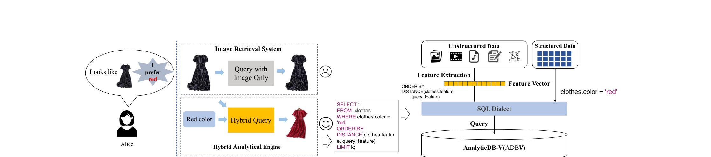

**图 1：混合查询示例。**

**高维向量的实时管理。** 从非结构化数据提取的特征向量通常维度极高。例如，在阿里巴巴的在线购物应用等许多场景中，非结构化数据向量可达到 500 维以上。此外，这些向量是实时生成的。现有数据库和向量搜索引擎难以实时管理这类高维向量，即难以对其执行 CRUD 操作。一方面，支持相似性搜索的在线数据库系统（例如 PostgreSQL 和 MySQL）只能处理几十维以内的向量。另一方面，Faiss 等向量相似性搜索引擎采用 ANNS 方法 [33, 23] 离线处理和索引高维向量，无法处理实时更新。

**混合查询优化。** 混合查询同时考虑特征向量和结构化属性，为联合执行和优化带来新机会。然而，混合查询优化本质上比现有优化更复杂。支持 top-k 操作的经典优化器 [29, 20, 19] 无需考虑准确率问题，即所有查询计划都会得到相同执行结果。但对于混合查询，为避免穷举搜索，向量侧由 ANNS 返回近似结果，因此 top-k 操作的准确率会随着 ANNS 方法和参数设置不同而变化。如何在近似结果质量与查询处理速度之间取得平衡，是一项并不简单的任务。

**高可扩展性与高并发。** 在许多生产环境中，向量管理规模极大。例如，在智慧城市交通场景中，我们必须管理超过 117 亿张道路或车辆抓拍图，每天新增 1 亿条记录。同时，系统每秒至少需要处理 5000 个查询，其中 90% 以上为混合查询。在阿里巴巴旗下数字化零售门店盒马鲜生的另一个应用场景中，ADBV 存储了 8 亿个 512 维向量。峰值负载为每秒 4000 个查询（QPS），其中 80% 以上为混合查询。如此大规模的工作负载必须采用分布式架构。此外，系统还必须持续支持海量向量的快速检索和新写入数据的快速索引。

ADBV 针对上述挑战作出以下主要贡献：

1. **支持混合查询的实时分析引擎。** 我们提出一种分析引擎，原生支持结构化与非结构化数据融合的混合查询和实时更新。为满足实时性要求，我们采用 Lambda 框架，并在流式层和批处理层使用不同的 ANNS 索引。流式层中基于邻域的 ANNS 方法支持实时插入，但占用大量内存；批处理层中基于编码的 ANNS 方法内存占用小得多，但构建前需要离线训练。Lambda 框架可定期把流式层新写入的数据合并到批处理层。
2. **一种新的 ANNS 算法。** 为提高表示海量非结构化数据的大规模向量上的准确率，我们提出新的 ANNS 索引 Voronoi Graph Product Quantization（VGPQ）。与 IVFPQ [23] 相比，该算法可以用很小的额外开销高效缩小向量空间中的搜索范围。经验研究表明，在海量向量上快速建索引和查询时，VGPQ 比 IVFPQ 更有效。
3. **感知准确率的基于代价的混合查询优化。** ADBV 把 ANNS 算法封装为物理算子，因此可以依赖查询优化器高效、有效地支持混合查询处理。关系数据库中的物理算子总是返回精确结果；新引入的物理算子却未必严格遵循关系代数，而是可能输出近似结果。针对这一近似特性，我们提出新的优化规则以获得最佳查询效率，并把这些规则自然嵌入 ADBV 优化器。

下文将详细介绍 ADBV。第 2 节介绍混合查询的背景和 SQL 方言；第 3、4、5 节分别介绍系统总体设计、向量处理（ANNS）算法，以及感知准确率的基于代价的混合查询优化；第 6 节进行实验评估；第 7 节讨论相关工作；第 8 节给出结论。

## 2. 背景

### 2.1 动机

为了准确检索感兴趣的记录，典型混合查询同时包含对特征向量（从非结构化数据提取）的相似性约束和对结构化数据的取值约束。以图 1 为例，目标是检索在视觉上与查询图像相似、但颜色为红色的连衣裙。传统做法是由两个独立系统处理这两类约束：开发者使用 Faiss [25, 8]、vearch [30] 等向量搜索引擎查询 top-k 图像，同时从数据库检索颜色信息，再对两个系统获得的记录做合取合并，得到最终结果。

这种做法会带来额外开发工作和计算开销。向量搜索引擎返回的记录中，可能只有少于 k 条能通过用户查询表达的颜色或款式约束，因而无法构造出满足用户明确数量要求的 top-k 结果。因此，开发者必须谨慎设置向量搜索引擎需要检索的记录数。执行效率也有很大的优化空间。例如，如果只有很少一部分服装满足结构化约束（即红色），先检索满足结构化约束的记录，再直接从该集合识别最近的特征向量会更高效。

ADBV 的目标正是解决上述问题。它允许用户用一条 SQL 语句表达混合查询，并且无需手工调参即可高效执行。非结构化数据和结构化数据可以存储在同一张表中；具体而言，非结构化数据在插入阶段通过特征提取函数转换为向量，并存入一列。

### 2.2 SQL 方言

ADBV 提供灵活、易用的 SQL 接口，开发者只需付出很少工作即可把应用迁移到 ADBV。

#### 2.2.1 SQL 语句

**建表。** 除特征向量相关操作外，建表方式与标准 SQL 类似。特征列按如下方式定义：`DistanceMeasure` 定义 ANNS 使用的距离函数，支持平方欧氏距离、点积和汉明距离；`ExtractFrom` 定义特征向量的提取方式（见第 2.2.3 节）。用户可以在特征向量上指定 ANNS 索引：

```sql
1 ANN INDEX feature_index(column_feature)
```

**插入。** 下列语句展示插入语法。如果建表时使用了 `ExtractFrom` 关键字，系统会按定义自动生成特征向量；也可以用数组格式显式插入特征向量值。

```sql
1 -- insert implicitly
2 INSERT INTO table_name(C1, C2, ..., Cn)
3 VALUES(v1, v2, ..., vn);
4 -- insert explicitly
5 INSERT INTO table_name(C1, C2, ..., Cn,
6      column_feature)
7 VALUES(v1, v2, ..., vn,
8 array[e1,e2,e3,...,ek]::float[]);
```

**查询。** 以下 SQL 语法展示如何查询非结构化数据。`unstructured data` 是原始对象，例如文本中的句子或图像 URL。非结构化数据通常存储在在线存储服务中，例如对象存储服务或 Azure Blob Storage，并通过 URL 引用。ADBV 可从 URL 读取对象，并用 `FEATURE_EXTRACT` 函数提取对应特征向量。`DISTANCE` 表示建表阶段定义的向量距离函数。

```sql
1 SELECT *
2 FROM table_name
3 WHERE table_name.C1 = 'v1'
4 ORDER BY DISTANCE(table_name.column_feature,
5 FEATURE_EXTRACT('unstructured data'))
6 LIMIT k;
```

**删除。** 删除语句与标准 SQL 相同，但也可以把特征向量相似性约束作为过滤条件。

#### 2.2.2 贯穿全文的示例

下面通过图 1 中的示例演示发起混合查询的完整过程。首先，用以下 SQL 创建一张存储服装向量特征和其他属性的表：

```sql
1 CREATE TABLE clothes(
2 id int,
3 color varchar,
4 sleeve_t varchar,
5 ...,
6 image_url varchar,
7 feature float[512]
8 COLPROPERTIES(
9 DistanceMeasure = 'SquaredEuclidean',
10 ExtractFrom = 'CLOTH_FEATURE_EXTRACT(image_url)'))
11 PARTITION BY ClusterBasedPartition(feature);
```

`ClusterBasedPartition` 是一种分区函数，它把同一聚类中的特征向量映射到同一分区，详见第 3.3 节。随后向表中插入一条表示红色连衣裙的记录：

```sql
1 -- insert implicitly
2 INSERT INTO clothes(id,color,sleeve_t,...,image_url)
3 VALUES(10001,'red','long',...,"protocal://xxx.jpg");
4 -- insert explicitly
5 INSERT INTO clothes(id,color,sleeve_t,...,image_url)
6 VALUES(10001,'red','long',...,"protocal://xxx.jpg",
7 array[1.1,3.2,2.4,...,5.2]::float[]);
```

最后，用以下 SQL 检索目标连衣裙，即颜色为红色并与查询图像相似：

```sql
1 SELECT *
2 FROM clothes
3 WHERE clothes.color = 'red'
4 ORDER BY DISTANCE(clothes.feature,
5 CLOTH_FEATURE_EXTRACT('protocal://xxx.jpg'))
6 LIMIT k;
```

#### 2.2.3 向量提取 UDF

ADBV 当前支持从人脸、服装、车辆和文档等多种数据源提取特征的模型。这些特征提取模型采用在大规模数据集上训练的最先进深度学习模型。此外，用户定义函数（UDF）API 也向用户开放，允许用户把自有向量提取模型和向量提取函数上传到 ADBV。

## 3. 系统设计

ADBV 构建在阿里巴巴 PB 级 OLAP 数据库系统 AnalyticDB [53] 之上。AnalyticDB 依赖两个基础组件：用于可靠永久分布式存储的盘古 [2]，以及用于资源管理和计算作业调度的伏羲 [55]。ADBV 对 AnalyticDB 加以增强，使其能够纳入向量并支持混合查询。本节介绍提高向量管理和混合查询处理功能与效率的关键系统设计。

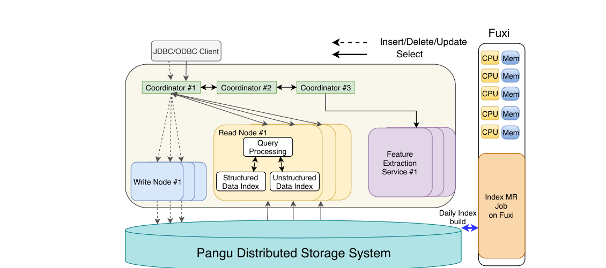

**图 2：ADBV 架构。**

### 3.1 架构概览

图 2 展示了 ADBV 的架构，主要由协调节点、写节点和读节点三类节点组成。协调节点接收、解析并优化 SQL 语句，再把语句分派到读/写节点。ADBV 采用典型的读写分离方法 [53]，牺牲一致性以换取低查询延迟和高写入吞吐。因此，写节点只负责 `INSERT`、`DELETE` 和 `UPDATE` 等写请求，读节点负责 `SELECT` 查询。新写入的数据在提交后被刷入盘古 [2]。ADBV 在存储层采用 Lambda 框架（第 3.2 节）高效管理向量：流式层处理实时数据插入和修改，批处理层定期压缩新插入的向量并重建 ANNS 索引。此外，ADBV 还把多个高开销谓词下推到存储层，充分利用这些节点的计算能力。

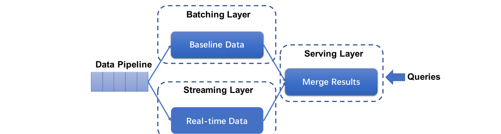

**图 3：ADBV 中的 Lambda 框架。**

### 3.2 Lambda 框架

由于搜索整个向量数据集的复杂度难以接受，必须构建索引来降低代价。然而，广泛用于低维空间的 KD-tree [6] 和 ball-tree [38] 等传统索引技术并不适合深度学习模型生成的高维向量。经验研究已经证明，这些方案在高维向量上呈现线性复杂度 [51]。因此，HNSW（Hierarchical Navigable Small World）[34]、LSH（Locality-Sensitive Hash）[12] 等算法被提出，以近似方式在向量上实时构建索引。[^1] 但是，现有算法要么因为内存消耗巨大而无法处理大规模数据，要么不能提供足够准确的结果。以 HNSW 为例，为避免磁盘 I/O，它要求索引数据和特征向量都常驻内存，否则性能会显著下降。除原始数据外，每条记录的索引还需要约 400 字节内存。

我们采用 Lambda 框架解决实时插入支持问题。在该框架下，ADBV 使用 HNSW 实时为新插入向量（即增量数据）构建索引。ADBV 定期按照提出的 VGPQ 算法（第 4.2 节）把增量数据与基线数据合并成全局索引（第 3.2.2 节），并丢弃 HNSW 索引。

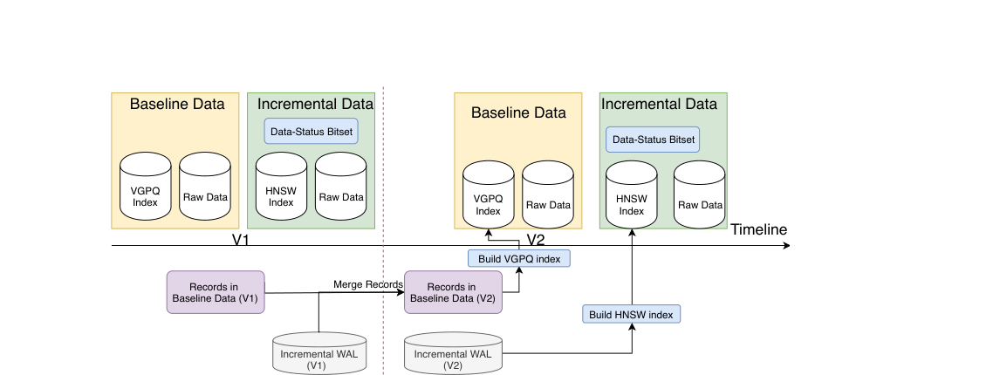

**图 4：ADBV 中的基线数据与增量数据。**

#### 3.2.1 概览

图 3 所示 Lambda 框架由批处理层、流式层和服务层组成，三层协同处理每个到达的查询。批处理层根据基线数据返回搜索结果，详见第 3.2.2 节。流式层执行两项任务：处理 `INSERT`、`DELETE`、`UPDATE` 等数据修改，以及在增量数据上产生搜索结果。对于 `SELECT` 语句，协调节点合并批处理层和流式层的部分结果，得到最终结果。服务层负责向批处理层和流式层发出请求，并把结果返回客户端。不同层位于不同类型的节点：服务层位于协调节点，批处理层位于读节点，流式层同时位于读节点和写节点。

#### 3.2.2 基线数据与增量数据

为了更好地支持 Lambda 框架，ADBV 包含图 4 所示的两类数据：基线数据和增量数据。增量数据包含新写入的 WAL（保存在盘古中），以及读节点上的向量数据及其索引；它还包含一个数据状态位图，用于跟踪哪些向量数据已被删除。与基线数据相比，增量原始数据及索引规模小得多，可以全部缓存在内存中。我们使用 HNSW 为增量数据构建索引，使索引构建与搜索能够同时进行。

基线数据包含全部历史原始数据和索引，并存储在盘古中。由于基线数据可能非常庞大，我们使用 VGPQ（第 4.2 节）异步构建索引，以保持内存效率。

随着新数据持续到达，HNSW 的巨大内存消耗会使增量数据上的搜索逐渐变慢。因此，系统定期启动图 4 所示的异步合并过程，把增量数据合并到基线数据中。在此过程中，当前增量数据被标记为不可变，即旧版本，同时创建新版增量数据来处理后续写请求。随后，旧版增量数据与基线数据合并成新版基线数据，其中使用 VGPQ 重建索引并替换 HNSW 索引。

合并完成前，查询由旧版基线数据和两个版本的增量数据共同服务。合并完成后，后续查询由新版基线数据和增量数据服务，并安全丢弃旧版本。增量数据中标记为已删除的向量会在合并期间从基线数据中移除。

#### 3.2.3 数据操作

下面说明 Lambda 框架三层如何在基线数据和增量数据上处理 `INSERT`、`UPDATE`、`DELETE` 和 `SELECT`。对于 `INSERT`，流式层把到达的数据追加到增量数据，并构建相应索引。当 `DELETE` 到达时，流式层并不会真正删除向量数据，而是在数据状态位图中把它标记为已删除。`UPDATE` 由 `DELETE` 和 `INSERT` 组合执行：先在数据状态位图中把原向量数据标记为已删除，再把更新后的记录追加到增量数据。更多细节见文献 [53]。

对于 `SELECT` 语句，系统首先把它们同时发送到流式层和批处理层，两层分别使用索引搜索各自管理的数据。随后，合并两层返回的结果，并进一步用数据状态位图滤除已删除记录。最后，服务层返回与查询相似度最高的记录。

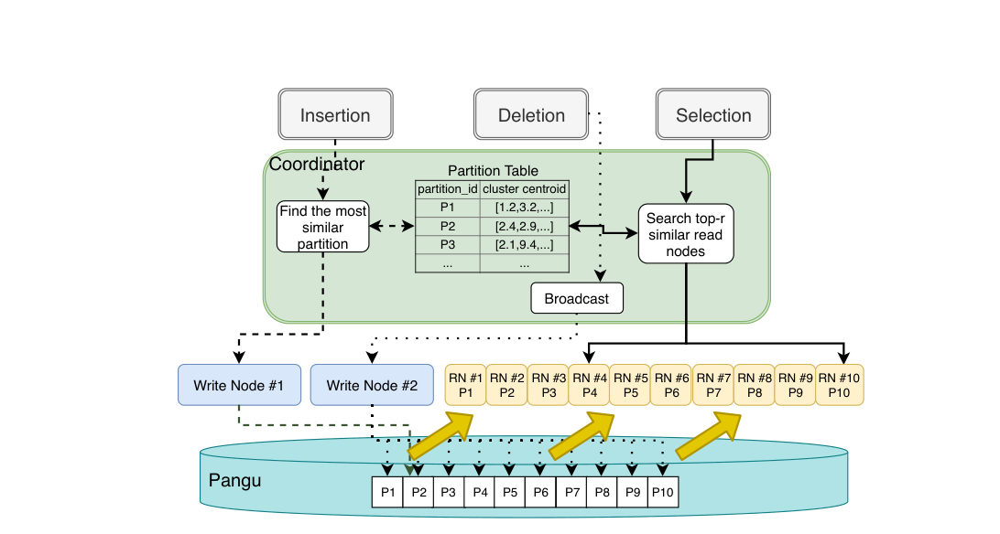

**图 5：基于聚类的分区裁剪。**

### 3.3 基于聚类的分区

如图 5 所示，ADBV 可以把向量数据划分到多个节点上，以获得高可扩展性。然而，哈希分区、列表分区等面向结构化数据的分区技术并不适用于向量数据，因为这些技术依赖等值和范围判断，而向量数据分析基于相似度，例如欧氏距离。直接采用这些策略会使查询不加区分地在所有分区上执行，无法获得裁剪效果。

为解决这一问题，我们提出基于聚类的分区方法。对于分区列，我们根据分区数量使用 k-means [17] 计算质心。例如，定义 256 个分区时，就计算 256 个质心。每个向量被分配给与其相似度最高（例如欧氏距离最小）的质心，由此每个聚类形成一个分区。随后，索引构建和数据操作（第 3.2 节）分别在每个分区上进行。进行分区裁剪时，ADBV 把查询分派到与查询向量相似度最高的 N 个分区。N 是用户定义的查询提示，反映查询性能与准确率之间的权衡。

向量数据分区默认关闭，因为 ADBV 首选在结构化数据上分区。当查询性能非常重要时，用户可以启用该功能。在向量数据上定义分区列后，ADBV 会对部分记录采样，计算质心，再据此对全部记录重新聚类并重新分布。

[^1]: 此处“实时构建索引”是指系统可以持续为新插入的向量数据构建索引，随后即可查询。

## 4. 向量处理算法

混合查询处理高度依赖专门的近似最近邻搜索算法。ADBV 把高效 ANNS 算法实现为物理算子，用于处理 top-k 检索任务。本节介绍如何使用 ANNS 算法处理向量查询，并提出新的 ANNS 算法 VGPQ，即 Voronoi Graph Product Quantization，以进一步提高批处理层的查询效率。

### 4.1 向量查询处理

向量查询处理的目标，是相对于输入的 d 维查询向量 q 得到 top-k 最近邻。它可以视为一个著名的最近邻搜索问题，已有数百种算法。基线方案是在整个数据集上做暴力搜索，以得到 top-k 向量。它返回精确结果，当 n 较小时，时间复杂度尚可接受。许多基于树的算法被提出，用于递归地把原搜索空间划分为子空间，并为子空间建立相应索引，以显著降低时间复杂度 [16, 43]。然而，文献 [51] 的观察表明，这些算法在高维特征上并不优于穷举搜索。为了在高维数据集上快速检索，需要以查询准确率换取更低运行时间。第 7 节讨论了大量为寻找近似最近邻而提出的方法，尤其是面向高维数据的方法。其中，ADBV 主要使用基于邻域和基于量化的算法，分别在流式层和批处理层的数据上执行最近邻搜索。

在流式层，ADBV 实现了第 3.2 节提到的 HNSW。HNSW 是一种基于邻域的 ANNS 算法，它利用每个向量点与其他点的邻域信息，并依赖小世界导航假设 [27]。它支持动态插入，但无法扩展到大规模数据集。因此，HNSW 适合支持对新插入数据的查询。

在批处理层，ADBV 使用基于量化的 PQ 算法 [23] 对向量编码。其核心思想是用紧凑、低维且有损的编码表示原始向量数据，从而以常数倍降低昂贵的两两距离计算代价。但 PQ 的编码码本必须离线训练，因此我们用它支持在大规模累积基线数据上的查询。为了避免每个到达的查询点都扫描所有向量的 PQ 编码，IVFPQ [23] 在索引构建阶段用 k-means 把 PQ 编码聚成若干组，查询阶段只扫描最相关的组。我们在 IVFPQ 基础上提出 VGPQ，以进一步提高效率（第 4.2 节），并用它替代 IVFPQ。

### 4.2 Voronoi Graph Product Quantization

**VGPQ 的主要思想。** 回顾一下，IVFPQ 通过 k-means 把向量聚成若干组，并用对应质心表征每个向量的 PQ 编码。在 VGPQ 中，我们在原始空间上用 IVFPQ 的这些质心构建 Voronoi 图，再依据以下启发式方法把每个 Voronoi 单元划分成多个子单元。为便于说明，以 C 表示质心，并交替使用“质心”和对应的 Voronoi 单元。对于图 6(a) 中的查询向量 q，应返回其 top-3 邻居，即红圈标出的三个点。由于没有先验知识，IVFPQ 必须遍历 C0（包含两个目标点）及其全部七个相邻单元，才能找到 C2 中的第三个目标点。

为解决这一问题，我们在质心 C0（也称锚点质心）与所有相邻质心之间画线，并隐式标出每条线段的中点，如图 6(a) 所示。现在可以根据到七个中点的距离，分别把原单元 C0 划分成七个子单元。所有质心都用相同方式生成子单元。每个子单元记作 B<sub>i,j</sub>，其中 i、j 分别表示锚点质心 C<sub>i</sub> 和相邻质心 C<sub>j</sub>。查询 q 与子单元 B<sub>i,j</sub> 的距离记作 d(q, B<sub>i,j</sub>)，定义为 q 到 C<sub>i</sub> 和 C<sub>j</sub> 连线中点的距离。对于图 6(b) 中的查询向量 q，在这些子单元中，q 更接近线段 (C0, C2) 和 (C0, C3) 的中点。也就是说，只需访问 6 个子单元 B<sub>0,2</sub>、B<sub>2,0</sub>、B<sub>0,3</sub>、B<sub>3,0</sub>、B<sub>2,3</sub> 和 B<sub>3,2</sub>，即可为 q 找到足够多的真实最近邻。

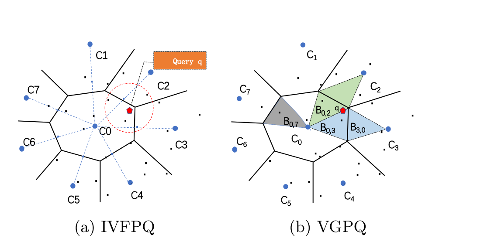

**图 6：VGPQ 的动机。**

**预处理。** 如算法 1 所示，VGPQ 索引通过三个步骤构建。首先，使用 k-means 聚类划分向量空间。其次，为每个质心选择邻居，并据此把每个单元划分成子单元。最后，把向量的 PQ 编码插入相应倒排文件（第 4.3 节）。为降低 Voronoi 图构建代价，我们只选择 top-b 最近质心来构建相应子单元。

**算法 1：构建 VGPQ(D, k, b)**

```text
输入：向量数据集 D = {v0, v1, ..., vn}，质心数 n_clusters，
      子单元数 n_subcells
输出：VGPQ 索引

1 C ← 使用 k-means 从 D 中找出 n_clusters 个质心，
      其中 C = {c0, c1, ..., ck};
2 for i ← 0, 1, ..., |C| - 1 do
3     nb(ci) ← 在 C 中找出 n_subcells 个最近质心；
4 for i ← 0, 1, ..., |D| - 1 do
5     cp ← 从 C 中找出第 i 个向量点最近的质心；
6     Bp,q ← 在 nb(cp) 中找出最近的子单元；
7     计算 vi 的乘积量化编码；
8     把乘积量化编码追加到与 Bp,q 关联的存储结构；
```

**查询处理。** VGPQ 索引构建完成后，即可按上述主要思想回答 ANNS 查询。首先定位 s 个锚点质心，并从每个质心分别选出 b 个最近子单元作为候选。VGPQ 再根据这些候选与 q 的距离过滤 s × b 个候选。随后，计算 q 与候选子单元中所有向量的距离。VGPQ 向用户返回相似度最高的 top-k 向量，其中 k 是查询语句中 `LIMIT` 关键字定义的值。

与 IVFPQ 相比，VGPQ 在质心之间引入邻域信息，把一个 Voronoi 单元划分为多个子单元，从而以常数倍缩小搜索空间。第 6 节给出经验评估结果，以验证这一设计。

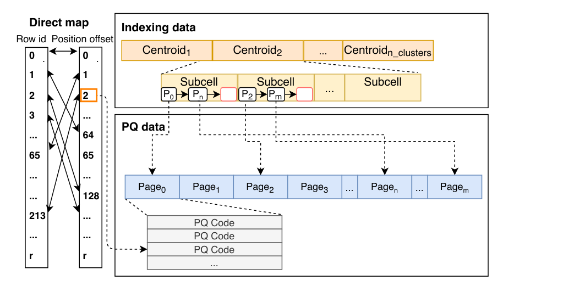

**图 7：VGPQ 索引的存储。**

### 4.3 VGPQ 的存储设计

从系统角度看，我们设计了便于 VGPQ 执行的内存存储结构，主要由索引数据（Indexing data）、PQ 数据（PQ data）和直接映射（Direct map）三个部分组成，见图 7。

PQ 数据负责存储 PQ 编码。它占用一段连续内存空间，并被划分成页面。每个页面都分配唯一 `pageid`，包含固定数量、属于某个特定子单元的 PQ 编码。实际中，页面大小通常设置为 I/O 块大小的整数倍，以提高数据写入效率和磁盘数据加载性能。

索引数据存储一个特征向量数组，其中每个元组对应一个锚点质心。在 VGPQ 中，我们把每个锚点质心的空间划分为 b 个子区域。属于某个子区域的 PQ 编码按页面组织在 PQ 数据中。因此，每个锚点质心在索引数据中关联 b 个子单元，每个子单元包含一个 `pageid` 链表，指向 PQ 数据中的页面。索引构建阶段，当一个页面被填满时，其 `pageid` 会追加到索引数据中相应链表的尾部。ADBV 为每个向量点分配唯一 `rowid` 作为身份标识，这有助于融合结构化数据和非结构化数据上的查询。

此外，我们在 `rowid` 与其 PQ 编码在 PQ 数据中的位置之间构建双向映射。给定一个 `rowid`，直接映射可以指出对应 PQ 编码在 PQ 数据中的存储位置，反向也同样成立。一方面，ADBV 只需为每条记录存储一份 PQ 编码副本，任何处理 PQ 编码的 ANNS 方法都可以借助直接映射访问它。另一方面，该结构帮助 VGPQ 处理混合查询，具体见第 5.1 节。

## 5. 混合查询优化

本节讨论 ADBV 中混合查询执行与优化的设计细节。首先，在概念上把 ANNS 算法视为数据库索引，并由物理计划中的扫描算子访问。这些新设计的算子可以平滑注入已有查询执行计划。随后，ADBV 优化器为每个输入混合查询枚举多个有效物理计划，并使用第 5.2 节提出的代价模型确定最优计划。最后，讨论如何确定与查询准确率密切相关的底层超参数。

如第 3.2 节所述，ADBV 只在流式层保留少量新插入的向量数据，其查询处理时间与批处理层相比可以忽略，因此我们重点讨论批处理层的查询执行与优化。为便于阐述，本节始终使用两个典型选择查询：简单向量搜索查询 Q1 和混合查询 Q2。这里 T = (id, c, f) 是一张表，包含结构化列 id、c 和非结构化列 f。ADBV 自然支持 Q2 这类混合查询中的复杂结构化谓词。为简洁起见，`WHERE` 子句只列出两个结构化谓词来说明主要思想。结构化列相关谓词以精确方式求值和处理，因此相应物理算子不会影响最终结果的近似质量。换言之，上述超参数调优逻辑专门面向 ANNS 相关算子。为便于说明，还假设 c 上已构建 B-tree 索引。

```sql
1 SELECT id, DISTANCE(f, FEATURE_EXTRACT('img'))
2 AS distance
3 FROM T
4 ORDER BY distance,
5 -- return top-k closest tuples
6 LIMIT k;
```

**Q1：向量查询示例。**

```sql
1 SELECT id, DISTANCE(f, FEATURE_EXTRACT('img'))
2 AS distance
3 FROM T
4 -- structured predicates
5 WHERE T.c >= p1 AND T.c <= p2
6 ORDER BY distance,
7 -- return top-k closest tuples
8 LIMIT k;
```

**Q2：混合查询示例。**

### 5.1 混合查询执行

ADBV 首先沿用经典方法，把这两个查询转换为图 8 所示的对应逻辑执行计划。由于高维非结构化列 f 中的每个值在存储中通常超过 2000 字节，减少从磁盘读取向量的次数可以显著提高查询处理效率。因此，我们把关于输入图像 `img` 的相似性搜索下推到存储节点，只弹出“邻近”向量。

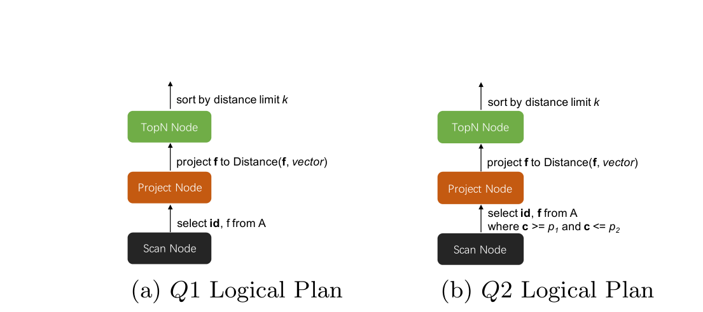

**图 8：查询示例的逻辑计划。**

ADBV 优化器分析查询解析器生成的抽象语法树，检测表示返回与非结构化列相关的 top-k 元组这一操作的模式，即 `order by DISTANCE() LIMIT k`。如果找到相应模式，优化器就把逻辑计划转换为多个物理执行计划，在非结构化列上执行最近邻搜索。除传统暴力搜索外，ANNS 算法被封装到 ANNS 扫描节点中，可直接注入已有物理计划，从而针对从查询图像提取的特征点得到近似最近邻集合。这样，ANNS 算法有助于降低从大规模数据集检索 top-k 邻居的昂贵计算代价。根据不同最近邻搜索算法的特征，我们针对查询示例 Q2 提出图 9 所示的四种有效物理计划。

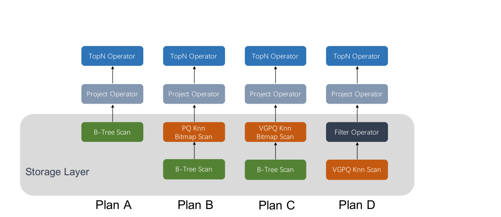

**图 9：Q2 的物理计划。**

**计划 A（暴力搜索）。** 计划 A 是混合查询的基础保守方案。如图 9 所示，在 B-tree 扫描之后，存储层弹出满足结构化谓词 c ≥ p1 且 c ≤ p2 的全部元组。随后，读节点执行暴力搜索，得到精确 top-k 邻居。该计划只适合小数据集，例如数千个点；否则，线性复杂度会造成不可接受的处理时间。当包含 ANNS 扫描算子的其他计划无法满足用户准确率要求时，它也是默认的保守策略。

**计划 B（PQ Knn Bitmap Scan）。** 如果近似结果能够满足准确率要求，并且结构化索引扫描返回的元组数达到一定规模，例如数万个点，ADBV 会尝试在物理计划中插入 ANNS 扫描节点，以加速最近邻搜索。计划 B 是这类计划中最简洁的一种。针对列 c 执行 B-tree 扫描后，系统收集一组指向合格元组的 `rowid`，再在该元组集合上构建位图。由于 ADBV 采用列存，给定 `rowid` 即可轻松读取元组的其余列。PQ Knn Bitmap Scan 逐一取得与 `rowid` 对应的预计算 PQ 编码，使用非对称距离计算（ADC）[23] 估计它们与输入图像特征之间的平方距离。随后收集一组候选最近邻，并按计算所得距离升序报告给上层。PQ Knn Bitmap Scan 并非精确报告 k 个 `rowid`，而是把数量放大到 σ × k（σ > 1）。σ 是用于提高最终结果近似质量的超参数，其调优过程见第 5.3 节。计划 B 利用紧凑编码和快速距离计算，降低最近邻搜索代价。实际中，PQ 编码的压缩率通常可达 16:1。

**计划 C（VGPQ Knn Bitmap Scan）。** 当满足结构化谓词的记录达到更大规模，例如超过 100 万条时，计划 B 无法在数秒内返回候选。这时，优化器会考虑基于 VGPQ 的 ANNS 扫描算子，即 VGPQ Knn Bitmap Scan。它在原始 VGPQ 上增加位图测试，避免计算输入图像特征与不满足结构化谓词的 PQ 编码之间的冗余距离。回顾 VGPQ 的存储结构，直接映射维护 `rowid` 与 PQ 数据中相应地址之间的双向映射。给定一个 PQ 编码的地址，可以在直接映射中找到其 `rowid`；如果该 `rowid` 不在位图中，就直接跳到下一个编码。计划 C 的整个执行过程与计划 B 非常相似：先用 B-tree 扫描得到 `rowid` 位图，再执行 VGPQ Knn Bitmap Scan，得到大小为 σ × k 的近似最近邻集合。执行计划 C 时，不仅要调优 σ，还要调优 VGPQ 相关超参数，例如访问子单元的比例。

**计划 D（原文标题为 VGPG Knn Scan，正文为 VGPQ Knn Scan）。** 为得到精确结果，支持 top-k 操作的传统优化器 [29, 20, 19] 不会引入改变过滤算子与 Top-N 算子执行顺序的优化规则；换言之，过滤算子应先于 Top-N 算子执行。然而，混合查询的近似特性放宽了对这两个算子执行顺序的严格约束。应用这条交换规则后就得到计划 D。

当大表中大多数记录都满足结构化谓词时，上述所有计划中的过滤操作代价都会成为瓶颈。例如，从 B-tree 索引读取大量合格元组会昂贵得出人意料。因此，计划 D 允许优化器交换过滤算子和 Top-N 算子的执行顺序。首先执行实现为 VGPQ Knn Scan 的原始 VGPQ，再用结构化谓词 c ≥ p1 且 c ≤ p2 验证近似结果集。由于只剩 σ × k 个元组，谓词检查的计算代价变得微不足道。计划 D 的执行速度也与 VGPQ 超参数密切相关。

### 5.2 用于优化的代价模型

为了在不同场景下从上述四个计划中识别最优计划，我们提出感知准确率的混合查询优化代价模型。代价模型使用的全部符号见表 1。

**表 1：混合查询优化使用的符号。**

| 符号 | 含义 |
| --- | --- |
| n | 数据库中的元组总数 |
| α | 满足结构化谓词的记录数与 n 之比 |
| β | VGPQ Knn Bitmap Scan 的 VGPQ 索引搜索过程中访问的子单元比例 |
| γ | VGPQ Knn Scan 的 VGPQ 索引搜索过程中访问的子单元比例 |
| σ<sub>{B, C, D}</sub> | 计划 {B, C, D} 中 ANNS 扫描算子的放大因子 |
| c1 | 读取一个向量并计算两两距离的总时间代价 |
| c2 | 读取一个 PQ 编码并执行 ADC 的总时间代价 |

计划 A 从代价为 T0 的结构化索引扫描开始，假定有 α × n 条记录合格。随后，通过 `DISTANCE` 函数计算查询向量与合格向量之间的相似度。计划 A 的总代价如公式（1）所示：

$$
cost_A = T_0 + \alpha \times n \times c_1
\tag{1}
$$

计划 B 首先执行结构化索引扫描，再用 ADC 分别估计查询向量与每个向量的 PQ 编码之间的近似平方距离。该步骤找出 σ<sub>B</sub> × k 条记录，以缩小暴力搜索范围。计划 B 的总代价如公式（2）所示：

$$
cost_B = T_0 + \alpha \times n \times c_2 + \sigma_B \times k \times c_1
\tag{2}
$$

在计划 C 中，结构化索引扫描之后执行 VGPQ Knn Bitmap Scan。其总代价如公式（3）所示：

$$
cost_C = T_0 + \beta \times n \times \alpha \times c_2 + \sigma_C \times k \times c_1
\tag{3}
$$

计划 D 与计划 C 相比交换了谓词过滤和向量索引扫描的执行顺序。谓词过滤的输入规模显著缩小，运行时间可以忽略。计划 D 的总时间代价如公式（4）所示：

$$
cost_D = \gamma \times n \times c_2 + \sigma_D \times k \times c_1
\tag{4}
$$

给定一个混合查询，可以用上述公式计算各计划的执行代价，再由优化器选择代价最小的计划作为最终计划。此外，优化器还需要调节 β、γ 和 σ，它们会直接影响查询准确率。下一节讨论这一调优过程。

### 5.3 感知准确率的超参数调优

给定用户定义的准确率要求和 k，需要在不同结构化谓词（即 α）下，为每个可能物理计划找到合适的超参数，即 β、γ 和 σ；否则，优化器无法使用上述代价模型计算代价。然而，很难给出带理论保证、可推导最优设置的公式，因此我们使用多种启发式方法调优超参数。调优过程由预处理步骤和执行步骤组成。

在预处理步骤中，我们把 α 的取值范围划分成多个互不相交的区间，每个区间视为一个 bin，并用其下界标识。对每个计划，我们使用网格搜索方法，类似 Faiss 的自动调优 [25]，枚举所有 bin 上的全部超参数组合。其中只考虑能返回满足准确率要求之结果的组合，再记录运行时间最低的组合，作为相应计划和 bin 的最终设置。在 ADBV 中，新写入的数据合并进 Lambda 框架的批处理层后，执行该预处理步骤。

在执行步骤中，对于每个即席查询，可以使用成熟的选择率估计算法 [40] 估计 α′。这些算法已在现代数据库系统的查询优化器中得到发展 [48, 39, 53]。ADBV 构建在 AnalyticDB 之上，因此借助其查询优化器进行校准。随后，对每个计划选择属于相应 bin 的预调优超参数组合。最后，使用所选超参数组合计算对应代价模型，以识别最高效的执行计划。实践中，这些候选组合对大多数用户查询都很有效。对于某个计划，如果优化器无法从预调优组合中挑选出满足准确率要求的候选，就会在后续决策阶段忽略该计划。最坏情况下，如果计划 B、C、D 全部失败，优化器仍可选择计划 A 执行。

## 6. 实验

本节在公开数据集和内部数据集上评估 ADBV，以验证所提设计的有效性，以及它相对于现有方案的性能提升。

### 6.1 实验设置

**测试平台。** 实验在阿里云一个 16 节点集群上进行；每个节点有 32 个逻辑核心、150 GB DRAM 和 1 TB SSD。主机均配备一颗 Intel Xeon Platinum 8163 CPU（2.50 GHz），并启用超线程。机器通过 10 Gbps 以太网互连。

**数据集。** 使用两个公开数据集和一个内部数据集评估系统：

- **Deep1B [5]** 是一个公开数据集，由深度神经网络提取的图像向量构成，包含 10 亿个 96 维向量。
- **SIFT1B [24]** 是一个公开数据集，由手工构造的 SIFT 特征组成，包含 10 亿个 128 维向量。
- **AliCommodity** 包含从阿里巴巴商品图像中提取的 8.3 亿个 512 维向量，还包含颜色、袖型、风格、创建时间等 21 个结构化列。

这些数据集在数据来源（两个公开图像数据集和一个内部商品图像数据集）、特征提取方法（SIFT 和深度神经网络）以及向量维度（96、128、512）上各不相同。此外，目前没有同时包含结构化数据和非结构化数据的公开数据集，因此使用内部混合数据集 AliCommodity 评估混合查询处理技术。

在分布式实验中，这些数据集被切分成多个分区。下文数据集名称的下标表示相应分区数，例如 SIFT1B<sub>8p</sub> 表示 SIFT1B 被划分为 8 个分区。默认情况下，先打乱数据集中的向量，再把它们均匀分布到多个节点上构建分区；否则会明确说明分区方案。

**查询类型。** 评估复用第 5.1 节给出的两个查询模板 Q1 和 Q2。根据我们对生产环境的观察，ADBV 处理的大多数查询都遵循这些模式。

**实现。** 以 Java 开发的 OLAP 数据库系统 AnalyticDB [53] 作为 ADBV 骨干。ANNS 算法及其存储主要以 C 编写，以从向量化处理等高级优化技术中获得最佳性能。ADBV 通过 Java Native Interface 访问这些关键组件。在第 6.2 节中，采用 Faiss [25] 提供的 IVFPQ C++ 实现。

**指标。** 使用召回率衡量 ANNS 算法或系统返回结果集的准确率。设精确结果集为 S，召回率定义为

$$
recall = \frac{|S \cap S'|}{|S|},
$$

其中 S′ 是 ANNS 算法或系统返回的结果集，|·| 计算集合基数。我们还使用 Top-N 结果的召回率 `recall@TopN` 评估系统性能，此时 |S| = |S′| = N。

每次测试发出 10,000 个 SQL 请求，两类请求按轮询方式交替，用于计算平均召回率和响应时间。每个查询的查询图像 `img` 都从原始数据集中均匀随机采样。k 默认设为 50。改变列 c 上 p1、p2 的值，以生成不同选择率的测试查询。选择率定义为：

$$
s = 1 - \frac{\text{通过谓词的元组数}}{\text{元组总数}}.
\tag{5}
$$

令 c<sub>max</sub> 和 c<sub>min</sub> 分别为 c 的最大值和最小值。若假设取值均匀分布在 c<sub>max</sub> 与 c<sub>min</sub> 之间，则选择率可计算为 $s = 1 - \frac{p2-p1}{c _ {max}-c _ {min}}$。为了生成指定选择率 s 的样例查询，先粗略按此公式逼近该选择率，再手工调整 p1 或 p2，最终得到所需查询。

### 6.2 VGPQ

本节从准确率、索引构建时间和索引文件大小三个方面比较 VGPQ 与 IVFPQ。由于底层 PQ 编码设置会影响索引文件大小，两种算法始终使用相同设置。每种方法都可使用不同参数构建，方法名后的括号注明所用参数：第一个参数表示质心数，第二个参数表示子单元数，且只适用于 VGPQ。例如，VGPQ(4096, 64) 表示 VGPQ 构建 4096 个聚类，随后把每个聚类划分为 32 个子单元。

**表 2：AliCommodity 上 VGPQ 与 IVFPQ 的构建时间和索引大小比较。**

| 方法 | 时间（分钟） | 大小（GB） |
| --- | ---: | ---: |
| IVFPQ(4096) | 155 | 112 |
| IVFPQ(8192) | 199 | 112 |
| VGPQ(4096,64) | 144 | 112 |
| VGPQ(8192,64) | 178 | 112 |
| VGPQ(8192,128) | 182 | 112 |

表 2 列出了 AliCommodity 上不同参数设置的索引构建时间和索引文件大小。VGPQ 和 IVFPQ 生成的索引文件大小非常接近；构建时间主要取决于 k-means 的质心数，即算法 1 中的 `n_clusters`。质心数相同时，VGPQ 构建时间比 IVFPQ 低 10%。VGPQ 性能还会受到子单元数，即算法 1 中 `n_subcells` 的影响，但我们观察到调整 `n_subcells` 不会显著影响 VGPQ 构建时间。

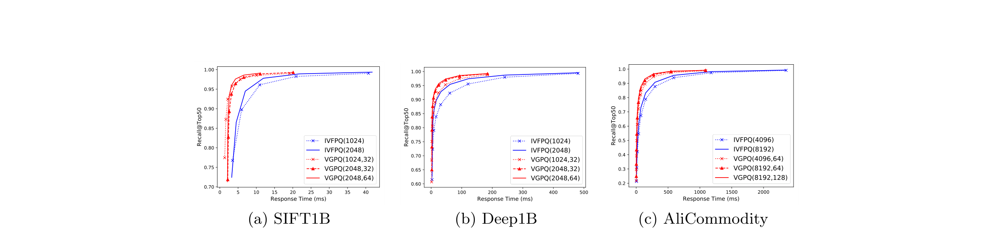

**图 10：VGPQ 与 IVFPQ 的召回率比较。**

我们向两种索引发出 Q1 类型的查询。图 10 展示了三个数据集 SIFT1B、Deep1B 和 AliCommodity 上的召回率与响应时间。增加 `n_clusters` 可以提高 IVFPQ 召回率，但构建时间也会明显增加。在 `n_clusters` 相同时，也可以增加 VGPQ 的 `n_subcells`；这样能够提高召回率，而无需牺牲构建时间。此外，VGPQ 在不同数据集上持续优于 IVFPQ。总体而言，从准确率、构建速度和索引大小来看，VGPQ 是一种适合大规模向量分析的实用方法。

### 6.3 基于聚类的分区裁剪

下面展示 ADBV 中基于聚类的分区裁剪对查询吞吐量的影响。分别为 SIFT1B 和 Deep1B 创建两张各有 512 个基于聚类分区的分布式数据表。数据写入期间，根据记录与各聚类质心的相似度分配记录。查询这些表时，可以指定需要搜索的最相关分区数，即质心最接近查询向量的分区数，以准确率换取搜索效率。

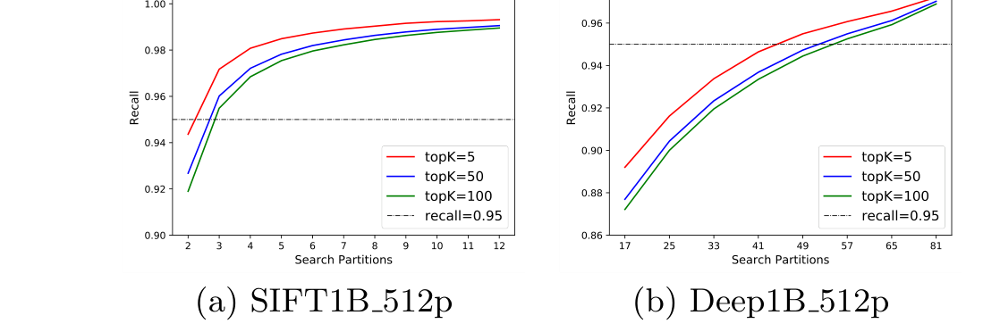

**图 11：基于聚类的分区裁剪性能分析。**

如图 11 所示，在不同 top-k 设置下，召回率都会随着搜索分区数增加而提高；但搜索更多分区也意味着查询吞吐量更低。我们观察到，这种裁剪对 k 较小的查询更有效。借助基于聚类的分区裁剪，在 SIFT1B<sub>512p</sub> 上可把搜索分区数从 512 减少到 3，同时不违反 95% 的召回率要求，见图 11(a)。在这种情况下，由于多个查询可以由不同分区，即不同读节点并发处理，总 QPS 可以提高 100 倍以上。同理，Deep1B<sub>512p</sub> 上的 QPS 理想情况下也能提高 10 倍以上。根据经验，面对大规模数据集，即 1000 个以上存储节点，基于聚类的分区裁剪可使 k 较小的查询获得一个到两个数量级，即 10 倍到 100 倍的吞吐提升，而这类查询在实际应用中很常见。

### 6.4 混合查询优化

本节评估第 5 节提出的感知准确率的混合查询执行代价优化。我们证明，所提方法能够在大量不同场景中保证查询结果准确率，同时找到最优物理计划。由于两个公开数据集不包含结构化列，以下测试只在 AliCommodity 上进行。此外，只从原数据集采样 1% 的元组，约 800 万条，并构造一张单分区表。我们强制 ADBV 使用四种不同物理计划执行 Q2，即混合查询，并分别收集每种计划的平均执行时间和召回率。

在业务场景中，用户对 k 值和查询准确率有不同要求。例如，人脸识别场景中的 k 值很小，即只需少量结果，但准确率要求严格，例如召回率 > 0.99。图 1 所示电商示例等其他场景则需要较大的 k，例如数百个，并放宽准确率要求，例如召回率 > 0.9。为了覆盖不同场景，本实验选择三个代表性设置：

1. k = 50、召回率 ≥ 0.95，s 从 0.2 变化到 0.9999；结果见图 12(a)、12(b)。
2. k = 250、召回率 ≥ 0.9，s 从 0.2 变化到 0.9999；结果见图 12(c)、12(d)。
3. k = 500、召回率 ≥ 0.85，s 从 0.2 变化到 0.9999；结果见图 12(e)、12(f)。

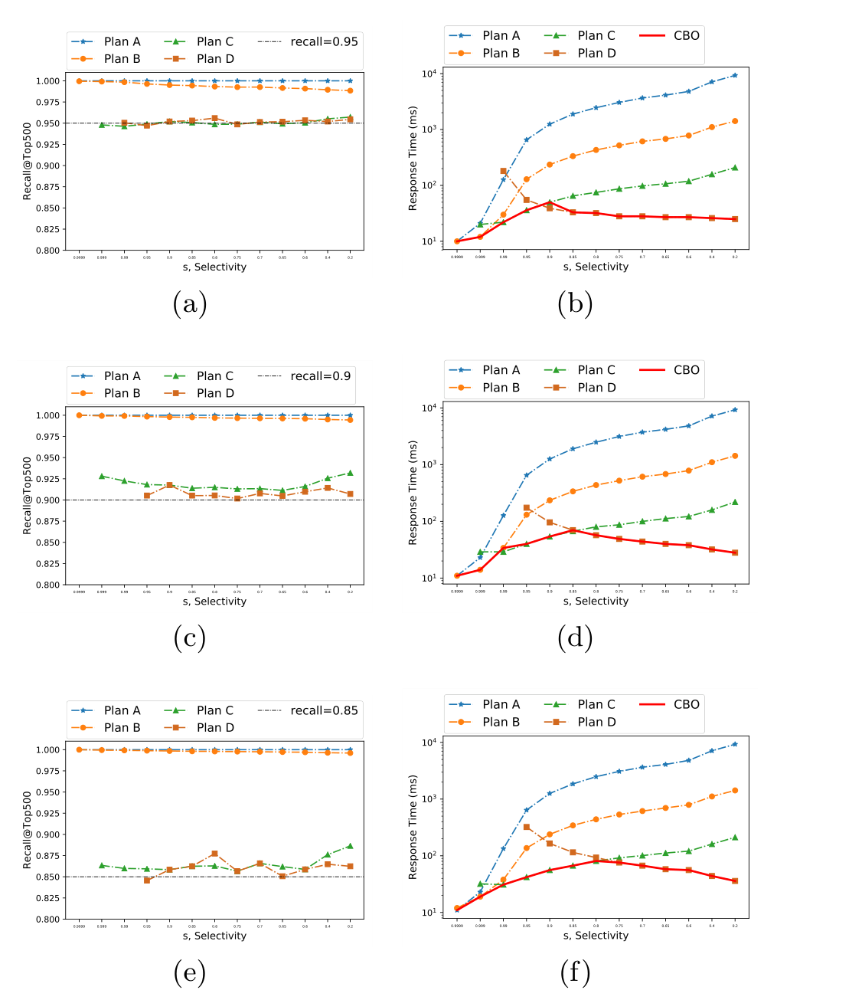

**图 12：不同物理计划的性能研究。**

如图 12 左列所示，在不同选择率下，大多数计划都能提供满足召回率要求的结果。这说明感知准确率的基于代价的优化器（CBO）能够为每个物理计划找到合适超参数。同时，在三个代表性场景中，优化器始终能够从四个物理计划中选出最优计划，如图 12 右列所示。这证实所提代价模型在多数场景中都有帮助。

### 6.5 两步式方案与 ADBV 的比较

本节把 ADBV 的混合查询处理能力与现有两步式方案进行比较。据我们所知，当时尚无原生支持混合查询的公开系统，因此比较对象采用业界标准做法：把处理结构化数据的关系数据库与处理非结构化数据的 ANNS 引擎结合起来，以获取目标元组。两个系统分别运行，之后再对两者收集的结果取交集。

为公平比较，先用 AnalyticDB 检索满足结构化过滤条件的元组，再分别用 IVFPQ 和 VGPQ 计算最近邻，最后合并上述两步的结果集，收集同时通过结构化与非结构化过滤条件的元组。这两个不同的两步式方案分别记作 AnalyticDB+IVFPQ 和 AnalyticDB+VGPQ。由于系统间数据传输时间取决于开发环境，本测试忽略数据传输代价。换言之，AnalyticDB+IVFPQ 和 AnalyticDB+VGPQ 的底层执行过程在概念上遵循第 5.1 节的计划 D。我们还在 ADBV 中实现 IVFPQ，用于验证第 5.2 节的混合查询优化技术对其他现有 ANNS 算法的有效性。AnalyticDB-V(IVFPQ) 或 AnalyticDB-V(VGPQ) 分别表示使用 IVFPQ 或 VGPQ 开发的统一方案。

使用查询模板 Q2 生成查询，其中 c 实例化为表示每个元组创建时间的 `create_time` 列。固定 p1，改变结构化谓词中的 p2，以生成三类查询。这些查询分别获取最近一个月（p2 = 1）、三个月（p2 = 3）和九个月（p2 = 9）内与查询图像相似的 top-50 记录。实验结果见表 3。

**表 3：两步式方案与 ADBV 的比较。**

| 方案 | p2 = 1 | p2 = 3 | p2 = 9 |
| --- | ---: | ---: | ---: |
| AnalyticDB+IVFPQ | 241 ms | 77 ms | 47 ms |
| AnalyticDB+VGPQ | 181 ms | 55 ms | 33 ms |
| AnalyticDB-V(IVFPQ) | 19 ms | 35 ms | 47 ms |
| AnalyticDB-V(VGPQ) | 19 ms | 35 ms | 33 ms |

如表 3 所示，在两步式方案中，VGPQ 始终优于 IVFPQ。当 p2 = 1 和 p2 = 3 时，需要把获取的最近邻数量放大到 s × k（s > 1），原因是相应高选择性的结构化谓词会拒绝部分元组。当 p2 设为 9 时，更多元组可以通过时间约束，因此减小 s 即可降低运行时间。对于 p2 = 1 和 p2 = 3 这类高选择率查询，ADBV 选择计划 A 或计划 B 执行；直到 p2 = 9 才选择计划 D。ADBV 与两步式方案之间的运行时间差异也说明，混合查询优化技术使 ADBV 能够自动为不同查询选择最优执行计划。

### 6.6 可扩展性与混合读写

**可扩展性。** 在包含 4、8、12、16 个节点的不同规模集群中，评估 SIFT1B 和 Deep1B 的峰值 QPS。如图 13 所示，QPS 随节点数线性增长。

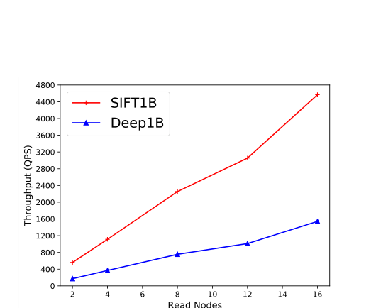

**图 13：不同读节点数量下的可扩展性实验。**

**混合读写吞吐。** 该测试在 SIFT1B 上进行，读写负载比分别为 8:2 和 6:4。我们观察到，ADBV 在不同场景下都能取得约 4400 QPS 的高吞吐。随着压力测试持续，图 14 显示吞吐量只轻微下降。这证实在 Lambda 框架下，高速数据写入对查询性能的影响很小。

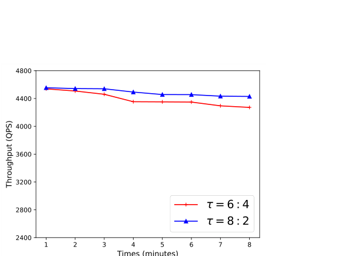

**图 14：混合读写负载的性能研究。**

### 6.7 使用案例研究

ADBV 已在阿里巴巴成功部署，为多种真实应用提供混合查询处理服务。众所周知，智慧城市交通通过缓解拥堵和优化交通流，显著改善市民日常生活 [36]。其中一个重要系统是车辆违章检测系统，它帮助从道路交叉口摄像头采集的抓拍图中识别违章车辆。

在这个大规模生产系统中，ADBV 作为关键模块，支持对 20,000 路视频流执行混合查询分析。对于每路视频流，首先用关键帧检测算法 [50] 提取包含车辆的图像；随后，用图像检测算法 [41, 31] 定位表示车辆的像素子区域，并利用训练好的深度神经网络模型把这些子区域转换成向量点。同时记录时间戳、位置、摄像头 ID、车辆颜色等其他重要结构化属性。向量点与这些结构化信息被组织成批次。每批数据经适当清洗后，再通过发出 `INSERT` 语句（第 2.2 节）写入。数据写入完成后，实践者可以直接依赖 ADBV 管理数据，无需关注底层实现。目前，原始数据量已达到约 30 TB[^2]，元组总数超过 130 亿。整个过程如图 15 所示。

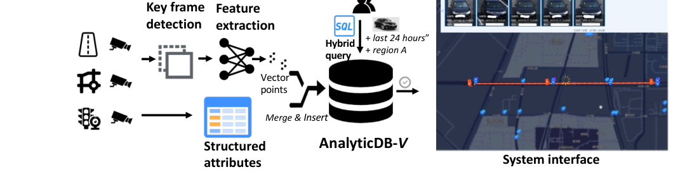

**图 15：使用案例研究。**

如果用户想在指定区域内检索一辆黑色违章车辆一天内的轨迹，只需提供时间和位置约束，以及该车辆的一张抓拍图，向 ADBV 发出一条 SQL 查询。系统上层收集 ADBV 返回的结果，并在图 15 所示用户界面上提供轨迹信息，其中红线表示目标轨迹。借助整体系统设计、VGPQ 和混合查询优化技术，ADBV 把这类查询的总运行时间从数百秒显著降低到毫秒级，满足实时要求。

此外，我们从一个客户的 70 节点集群中收集了 24 小时统计数据，用于展示 ADBV 在生产环境中的有效性和效率。如图 16 所示，无论插入还是查询，ADBV 都持续提供稳定服务。由于业务特性，请求量在 24 小时窗口内剧烈波动，但响应时间始终维持在特定范围。即使在午夜出现突发数据写入，例如凌晨 1 点，也未观察到明显性能抖动。总之，ADBV 不仅显著降低了大规模数据集上的维护工作，还提供了可靠、高效的数据分析服务。

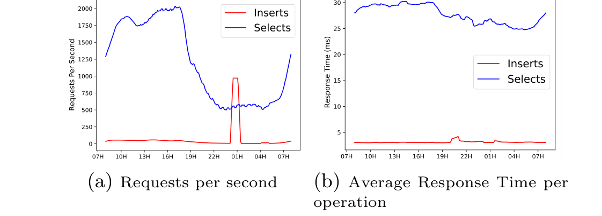

**图 16：生产环境中的性能。**

[^2]: 未计入存储的原始图像大小，这里只计算向量数据量。

## 7. 相关工作

ADBV 从系统角度设计并实现，支持对结构化和非结构化数据执行带实时更新的混合查询。本节回顾相关工作。

**OLAP 系统。** Vertica [28]、Greenplum [1] 等 OLAP 数据库，Spark SQL [3] 等批处理系统，以及 Amazon Redshift [15]、Google BigQuery [46]、阿里云 AnalyticDB [53] 等分析型云服务，已广泛用于各领域，并在实践中为用户提供优秀分析能力。然而，这些系统只处理传统结构化数据集，不支持包含非结构化数据的混合查询。

**非结构化数据搜索方案。** Facebook 发布了著名的向量相似性搜索库 Faiss [25]，支持多种现有 ANNS 算法。Jegou 等人在 Elasticsearch [9] 上实现扩展，以支持向量数据上的 ANNS。Microsoft 开发了 GRIP [54]，这是一种采用 HNSW 来降低基于编码算法中昂贵质心搜索代价的向量搜索方案，并支持多种向量索引 [23, 10]。近来，非结构化数据处理引起了广泛兴趣 [30, 37, 57]。

**最近邻搜索。** 为减少暴力方案的运行时间，人们提出了多种具有理论保证的树算法 [16, 43]。但由于维度灾难 [22]，这些算法在高维特征上并不优于穷举搜索 [51]。因此，在不过度损失性能的情况下，ANNS 成为解决该问题的一个有前景方向 [22, 21, 23, 4, 33, 10]。基于编码的方法通过用简洁编码压缩原始向量，是降低距离计算代价的另一条路径 [13]。PQ 及其后续工作 [11, 26] 仍以穷举搜索方式进行，无法良好应对大规模数据集上的搜索代价。此后，人们提出若干更精细的算法设计，尤其面向超大规模数据集 [4, 23]。为了满足高准确率要求，基于邻域的方法 [33, 35, 10] 是一种有吸引力的选择。然而，整个索引结构必须保留在内存中，一旦无法装入内存就会失效。

此外，“混合查询处理”也是信息检索（IR）社区使用的常见术语 [44, 7]。IR 方法通常依靠统计模型，把基于关键词的搜索与纯语义搜索平滑结合起来，同时作用于结构化数据（例如 RDF 数据）和非结构化数据（例如文本文档）。但目前还不能把这种面向排序任务的方案直接用于分析引擎设计 [52]。

## 8. 结论

为满足这一可强烈预见的未来需求，我们提出新的分析引擎 ADBV。借助 ADBV，实践者可以用一个系统管理海量高维向量和结构化属性。所提 VGPQ 算法能够进一步提高大量基线数据上混合查询处理的性能。此外，通过感知准确率的基于代价的优化设计，系统原生优化混合查询。ADBV 已成功部署在阿里巴巴集团和阿里云中，支持多种复杂业务场景。一个有趣且正在进行的未来工作，是在同一引擎中支持具有混合查询语义的复杂 ETL 处理，以实现在线交互式查询处理。

## 9. 参考文献

[1] Greenplum. <https://greenplum.org/>.

[2] Pangu. <https://www.alibabacloud.com/blog/pangu—the-high-performance-distributed-file-system-by-alibaba-cloud_594059>.

[3] M. Armbrust, R. S. Xin, C. Lian, Y. Huai, D. Liu, J. K. Bradley, X. Meng, T. Kaftan, M. J. Franklin, A. Ghodsi, et al. Spark sql: Relational data processing in spark. In SIGMOD, pages 1383–1394. ACM, 2015.

[4] A. Babenko and V. Lempitsky. The inverted multi-index. IEEE transactions on pattern analysis and machine intelligence, 37(6):1247–1260, 2014.

[5] A. Babenko and V. Lempitsky. Efficient indexing of billion-scale datasets of deep descriptors. In Proceedings of the IEEE Conference on Computer Vision and Pattern Recognition, pages 2055–2063, 2016.

[6] J. L. Bentley. Multidimensional binary search trees used for associative searching. Communications of the ACM, 18(9):509–517, 1975.

[7] R. Bhagdev, S. Chapman, F. Ciravegna, V. Lanfranchi, and D. Petrelli. Hybrid search: Effectively combining keywords and semantic searches. In European semantic web conference, pages 554–568. Springer, 2008.

[8] M. Douze, A. Sablayrolles, and H. Jégou. Link and code: Fast indexing with graphs and compact regression codes. In Proceedings of the IEEE Conference on Computer Vision and Pattern Recognition, pages 3646–3654, 2018.

[9] Elasticsearch. Elasticsearch Approximate Nearest Neighbor plugin, Jan. 2019.

[10] C. Fu, C. Xiang, C. Wang, and D. Cai. Fast approximate nearest neighbor search with the navigating spreading-out graph. PVLDB, 12(5):461–474, 2019.

[11] T. Ge, K. He, Q. Ke, and J. Sun. Optimized product quantization for approximate nearest neighbor search. In Proceedings of the IEEE Conference on Computer Vision and Pattern Recognition, pages 2946–2953, 2013.

[12] A. Gionis, P. Indyk, R. Motwani, et al. Similarity search in high dimensions via hashing. In PVLDB, volume 99, pages 518–529, 1999.

[13] R. Gray. Vector quantization. IEEE Assp Magazine, 1(2):4–29, 1984.

[14] P. J. Grother, M. L. Ngan, and K. K. Hanaoka. Face recognition vendor test (frvt) part 2: Identification. Technical report, 2019.

[15] A. Gupta, D. Agarwal, D. Tan, J. Kulesza, R. Pathak, S. Stefani, and V. Srinivasan. Amazon redshift and the case for simpler data warehouses. In SIGMOD, pages 1917–1923. ACM, 2015.

[16] A. Guttman. R-trees: A dynamic index structure for spatial searching, volume 14. ACM, 1984.

[17] J. A. Hartigan and M. A. Wong. Algorithm as 136: A k-means clustering algorithm. Journal of the Royal Statistical Society. Series C (Applied Statistics), 28(1):100–108, 1979.

[18] R. He, Y. Cai, T. Tan, and L. Davis. Learning predictable binary codes for face indexing. Pattern recognition, 48(10):3160–3168, 2015.

[19] I. F. Ilyas, G. Beskales, and M. A. Soliman. A survey of top-k query processing techniques in relational database systems. ACM Computing Surveys (CSUR), 40(4):11, 2008.

[20] I. F. Ilyas, R. Shah, W. G. Aref, J. S. Vitter, and A. K. Elmagarmid. Rank-aware query optimization. In Proceedings of the 2004 ACM SIGMOD international conference on Management of data, pages 203–214. ACM, 2004.

[21] P. Indyk. Approximate nearest neighbor algorithms for fréchet distance via product metrics. In Symposium on Computational Geometry, pages 102–106. Citeseer, 2002.

[22] P. Indyk and R. Motwani. Approximate nearest neighbors: towards removing the curse of dimensionality. In Proceedings of the thirtieth annual ACM symposium on Theory of computing, pages 604–613. ACM, 1998.

[23] H. Jégou, M. Douze, and C. Schmid. Product quantization for nearest neighbor search. IEEE Transactions on Pattern Analysis and Machine Intelligence, 33(1):117–128, 2011.

[24] H. Jégou, R. Tavenard, M. Douze, and L. Amsaleg. Searching in one billion vectors: re-rank with source coding. In 2011 IEEE International Conference on Acoustics, Speech and Signal Processing (ICASSP), pages 861–864. IEEE, 2011.

[25] J. Johnson, M. Douze, and H. Jégou. Billion-scale similarity search with gpus. IEEE Transactions on Big Data, 2019.

[26] Y. Kalantidis and Y. Avrithis. Locally optimized product quantization for approximate nearest neighbor search. In Proceedings of the IEEE Conference on Computer Vision and Pattern Recognition, pages 2321–2328, 2014.

[27] J. M. Kleinberg. Navigation in a small world. Nature, 406(6798):845, 2000.

[28] A. Lamb, M. Fuller, R. Varadarajan, N. Tran, B. Vandiver, L. Doshi, and C. Bear. The vertica analytic database: C-store 7 years later. PVLDB, 5(12):1790–1801, 2012.

[29] C. Li, K. C.-C. Chang, I. F. Ilyas, and S. Song. Ranksql: query algebra and optimization for relational top-k queries. In Proceedings of the 2005 ACM SIGMOD international conference on Management of data, pages 131–142. ACM, 2005.

[30] J. Li, H. Liu, C. Gui, J. Chen, Z. Ni, N. Wang, and Y. Chen. The design and implementation of a real time visual search system on jd e-commerce platform. In Proceedings of the 19th International Middleware Conference Industry, Middleware ’18, page 9–16, New York, NY, USA, 2018. Association for Computing Machinery.

[31] W. Liu, D. Anguelov, D. Erhan, C. Szegedy, S. Reed, C.-Y. Fu, and A. C. Berg. Ssd: Single shot multibox detector. In European conference on computer vision, pages 21–37. Springer, 2016.

[32] X. Liu, W. Liu, H. Ma, and H. Fu. Large-scale vehicle re-identification in urban surveillance videos. In 2016 IEEE International Conference on Multimedia and Expo (ICME), pages 1–6. IEEE, 2016.

[33] Y. Malkov, A. Ponomarenko, A. Logvinov, and V. Krylov. Approximate nearest neighbor algorithm based on navigable small world graphs. Information Systems, 45:61–68, 2014.

[34] Y. A. Malkov and D. A. Yashunin. Efficient and robust approximate nearest neighbor search using hierarchical navigable small world graphs. IEEE transactions on pattern analysis and machine intelligence, 2018.

[35] Y. A. Malkov and D. A. Yashunin. Efficient and robust approximate nearest neighbor search using hierarchical navigable small world graphs. IEEE transactions on pattern analysis and machine intelligence, 2018.

[36] T. Michelle and E. Leonie. Alibaba’s ’City Brain’ is slashing congestion in its hometown. <https://edition.cnn.com/2019/01/15/tech/alibaba-city-brain-hangzhou/index.html/>, 2019. [Online; accessed 2-March-2020].

[37] C. Mu, J. Zhao, G. Yang, J. Zhang, and Z. Yan. Towards practical visual search engine within elasticsearch. arXiv preprint arXiv:1806.08896, 2018.

[38] S. M. Omohundro. Five balltree construction algorithms. International Computer Science Institute Berkeley, 1989.

[39] B. J. Oommen and L. G. Rueda. The efficiency of histogram-like techniques for database query optimization. The Computer Journal, 45:494–510, 2002.

[40] G. Piatetsky-Shapiro and C. Connell. Accurate estimation of the number of tuples satisfying a condition. ACM Sigmod Record, 14:256–276, 1984.

[41] J. Redmon, S. Divvala, R. Girshick, and A. Farhadi. You only look once: Unified, real-time object detection. In Proceedings of the IEEE conference on computer vision and pattern recognition, pages 779–788, 2016.

[42] F. Richardson, D. Reynolds, and N. Dehak. A unified deep neural network for speaker and language recognition. arXiv preprint arXiv:1504.00923, 2015.

[43] J. T. Robinson. The kdb-tree: a search structure for large multidimensional dynamic indexes. In Proceedings of the 1981 ACM SIGMOD international conference on Management of data, pages 10–18. ACM, 1981.

[44] C. Rocha, D. Schwabe, and M. P. Aragao. A hybrid approach for searching in the semantic web. In Proceedings of the 13th international conference on World Wide Web, pages 374–383, 2004.

[45] Y. Rui, T. S. Huang, and S.-F. Chang. Image retrieval: Current techniques, promising directions, and open issues. Journal of visual communication and image representation, 10:39–62, 1999.

[46] K. Sato. An inside look at google bigquery.(2012). Retrieved Jan, 29:2018, 2012.

[47] F. Schroff, D. Kalenichenko, and J. Philbin. Facenet: A unified embedding for face recognition and clustering. In Proceedings of the IEEE conference on computer vision and pattern recognition, pages 815–823, 2015.

[48] M. Stonebraker and L. A. Rowe. The design of postgres. ACM Sigmod Record, 15:340–355, 1986.

[49] J. Suchal and P. Návrat. Full text search engine as scalable k-nearest neighbor recommendation system. In IFIP International Conference on Artificial Intelligence in Theory and Practice, pages 165–173. Springer, 2010.

[50] C. Sujatha and U. Mudenagudi. A study on keyframe extraction methods for video summary. In 2011 International Conference on Computational Intelligence and Communication Networks, pages 73–77. IEEE, 2011.

[51] R. Weber, H.-J. Schek, and S. Blott. A quantitative analysis and performance study for similarity-search methods in high-dimensional spaces. In PVLDB, volume 98, pages 194–205, 1998.

[52] G. Weikum. Db&ir: both sides now. In Proceedings of the 2007 ACM SIGMOD international conference on Management of data, pages 25–30, 2007.

[53] C. Zhan, M. Su, C. Wei, X. Peng, L. Lin, S. Wang, Z. Chen, F. Li, Y. Pan, F. Zheng, et al. Analyticdb: Real-time olap database system at alibaba cloud. PVLDB, 12(12), 2019.

[54] M. Zhang and Y. He. Grip: Multi-store capacity-optimized high-performance nearest neighbor search for vector search engine. In Proceedings of the 28th ACM International Conference on Information and Knowledge Management, pages 1673–1682, 2019.

[55] Z. Zhang, C. Li, Y. Tao, R. Yang, H. Tang, and J. Xu. Fuxi: a fault-tolerant resource management and job scheduling system at internet scale. PVLDB, 7(13):1393–1404, 2014.

[56] L. Zheng, L. Shen, L. Tian, S. Wang, J. Wang, and Q. Tian. Scalable person re-identification: A benchmark. In Proceedings of the IEEE international conference on computer vision, pages 1116–1124, 2015.

[57] ZILLIZ. Milvus: an open source vector similarity search engine, Oct. 2019.
